# 11\. 图像处理方案

**摘要**

如今全球大多数人口都使用带摄像头的智能手机，因此大部分照片由手机而非傻瓜相机拍摄。正因如此，图像始终触手可及，并在用户使用手机的过程中扮演着核心角色。幸运的是，你有多种不同的方法来创建、使用、处理和显示图像。此外，你还可以为图像添加滤镜，用极少的代码就能大幅改变显示效果。通过理解 iOS 中这些固有的功能和技巧，你能更轻松地实现更强大、更高效且信息更丰富的应用程序。

如今全球大多数人口都使用带摄像头的智能手机，因此大部分照片由手机而非傻瓜相机拍摄。正因如此，图像始终触手可及，并在用户使用手机的过程中扮演着核心角色。幸运的是，你有多种不同的方法来创建、使用、处理和显示图像。此外，你还可以为图像添加滤镜，用极少的代码就能大幅改变显示效果。通过理解 iOS 中这些固有的功能和技巧，你能更轻松地实现更强大、更高效且信息更丰富的应用程序。

## 方案 11-1：使用图像视图

在你的应用中显示图像最简单的方式是使用 `UIImageView` 类，这是一个基于视图的容器，用于显示图像和图像动画。在本方案中，你将创建一个简单的应用，用于显示用户选择的图像。之后，你将在此基础上进行扩展，以充分利用 iOS 的图像处理能力。

为了增强应用的功能，你将专门为 iPad 进行设计，并使用 `UISplitViewController`。创建一个新项目，并选择“主从应用”模板。在下一界面中，将项目名称设为“Image Recipes”，并确保应用的设备系列设置为“iPad”，如图 11-1 所示。

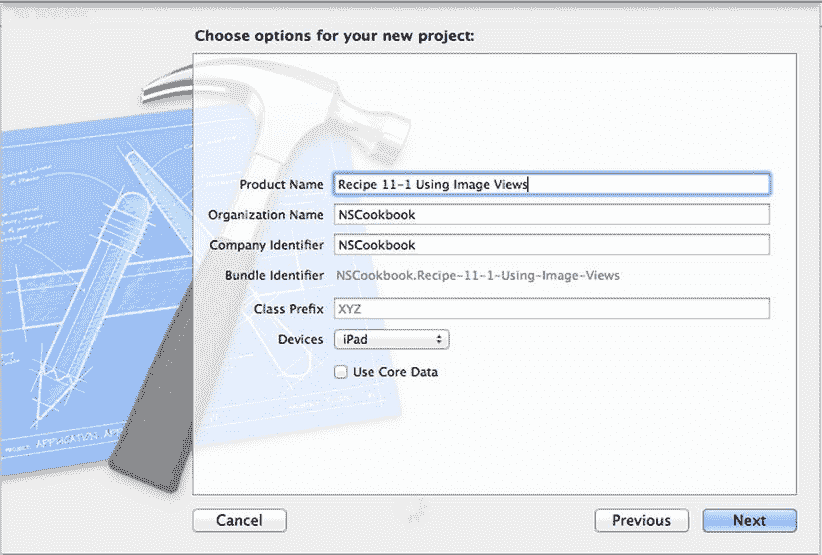

图 11-1. 配置一个 iPad 项目

创建应用后，Xcode 会生成一个项目，其中包含一个已设置主视图控制器和详细视图控制器的 `UISplitViewController`。如果你的模拟器或设备处于竖屏模式，你将只能看到详细视图控制器的视图；然而，如果旋转到横屏模式，你将看到两者良好的组合。在 `main.storyboard` 文件中，你会看到一个情节串联图板场景。如果你模拟运行该应用，通用视图将类似于图 11-2。

如果你查看过 `MasterViewController` 文件，可能会注意到其中包含大量用于添加和删除行的样板功能代码。目前你可以忽略这些样板代码。在本方案中，我们不会触及 `MasterViewController`。

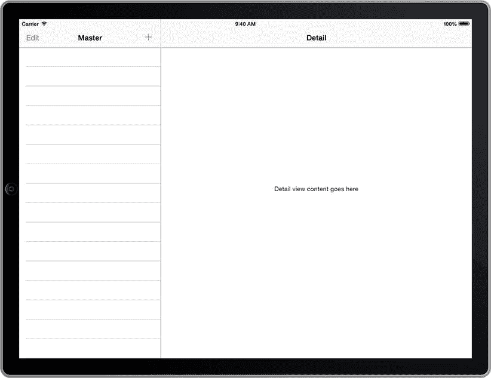

图 11-2. 一个空的 `UISplitViewController`

现在你可以配置详细视图控制器来包含一些内容。从 `main.storyboard` 文件中选中 `detail view controller`，并使用 Interface Builder 来创建用户界面。添加一个标签（或直接使用模板默认创建的标签）、一个图像视图和两个按钮。标签文本应设为“Select an image to be displayed”，按钮文本应分别设为“Select Image”和“Clear Image”。按图 11-3 所示排列这些对象。同时，选中图像视图，在属性检查器中将背景颜色值改为黑色。

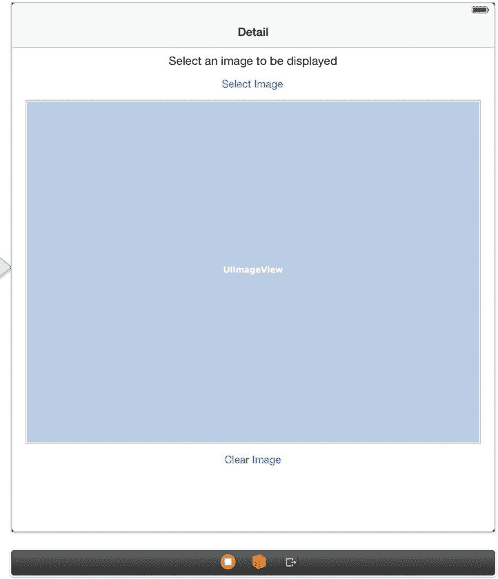

图 11-3. 配置好的用户界面的模拟视图

选中图像视图并打开属性检查器。在“视图”部分，将“模式”属性从“Scale to Fill”改为“Aspect Fill”。这会使图像视图缩放其内容，使其填充图像视图的边界，同时保持图像的宽高比。这通常意味着图像的一部分会被绘制到图像视图框架之外。为了防止这种情况，你还应选中“绘图”选项中的“Clip Subviews”。图 11-4 展示了这些设置。

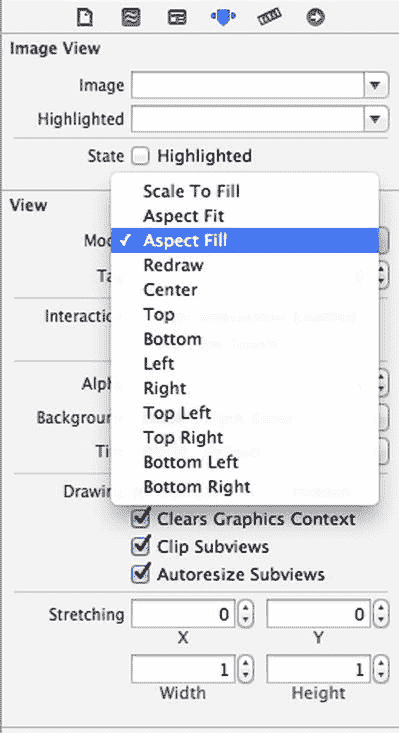

图 11-4. 配置图像视图以保持比例填充并裁剪到边界

创建以下输出口：

- `detailDescriptionLabel`
- `imageView`

创建以下操作：

- `selectImage`
- `clearImage`

配置你的应用，使其显示一个包含 `UIImagePickerController` 的 `UIPopoverController`，以允许用户从其 iPad 中选择一张图像。为此，你需要让你的详细视图控制器遵循几个额外的协议：`UIImagePickerControllerDelegate`、`UINavigationControllerDelegate` 和 `UIPopoverControllerDelegate`。你还需要添加一个属性来引用 `UIPopoverController`。为整合这些更改，请将代码清单 11-1 中加粗的代码添加到 `DetailViewController.h` 文件中。


### 清单 11-1：起始的 `DetailViewController.h` 实现

```
//
//  DetailViewController.h
//  Recipe 11-1 Using Image Views
//
#import <UIKit/UIKit.h>

@interface DetailViewController : UIViewController <UISplitViewControllerDelegate,
UIImagePickerControllerDelegate,UINavigationControllerDelegate,
UIPopoverControllerDelegate>
@property (strong, nonatomic) id detailItem;
@property (weak, nonatomic) IBOutlet UILabel *detailDescriptionLabel;
@property (weak, nonatomic) IBOutlet UIImageView *imageView;
@property (strong, nonatomic) UIPopoverController *pop;
- (IBAction)selectImage:(id)sender;
- (IBAction)clearImage:(id)sender;
@end
```

现在你可以实现 `selectImage:` 方法来呈现一个选择图片的界面。在 `DetailViewController.m` 文件中修改此方法，如清单 11-2 所示。请注意，我们将发送者的输入类型从 `id` 改为了 `UIButton *`。这是因为我们在 `presentPopoverFromRect:` 调用中使用了此输入，而 `id` 类型没有 `frame` 属性，这会导致错误。

### 清单 11-2：配置图片视图以保持比例填充并裁剪至边界

```
-(void)selectImage:(UIButton *)sender
{
    UIImagePickerController *picker = [[UIImagePickerController alloc] init];
    if ([UIImagePickerController
        isSourceTypeAvailable:UIImagePickerControllerSourceTypePhotoLibrary])
    {
        picker.sourceType = UIImagePickerControllerSourceTypePhotoLibrary;
        picker.delegate = self;
        self.pop = [[UIPopoverController alloc] initWithContentViewController:picker];
        self.pop.delegate = self;
        [self.pop presentPopoverFromRect:sender.frame inView:self.view
            permittedArrowDirections:UIPopoverArrowDirectionAny animated:YES];
    }
}
```

然后你可以实现 `UIImagePickerController` 的委托方法，以正确处理图片选择或取消操作。清单 11-3 展示了第一个方法，用于处理取消操作。

### 清单 11-3：实现 `imagePickerControllerDidCancel:` 委托方法

```
-(void)imagePickerControllerDidCancel:(UIImagePickerController *)picker
{
    [self.pop dismissPopoverAnimated:YES];
}
```

清单 11-4 展示了第二个 `UIImagePickerController` 委托方法，用于处理图片选择。

### 清单 11-4：实现 `imagePickerController:didFinishPickingMediaWithInfo:`

```
-(void)imagePickerController:(UIImagePickerController *)picker didFinishPickingMediaWithInfo:(NSDictionary *)info
{
    UIImage *image = [info valueForKey:@"UIImagePickerControllerOriginalImage"];
    self.imageView.image = image;
    [self.pop dismissPopoverAnimated:YES];
}
```

如清单 11-4 所示，你可以通过使用 `image` 属性来配置图片视图，以显示所选图片。

最后，你可以实现清单 11-5 中所示的 `clearImage:` 动作方法，以允许重置你的视图。

### 清单 11-5：实现 `clearImage:` 方法

```
- (IBAction)clearImage:(id)sender
{
    self.imageView.image = nil;
}
```

至此，你可以运行应用程序，选择一张图片，并在 `UIImageView` 中显示它，如图 11-5 所示。由于你将视图模式设置为“Aspect Fill”并选择了“Clip Subviews”选项，图片将按较小的尺寸缩放并裁剪其余部分。

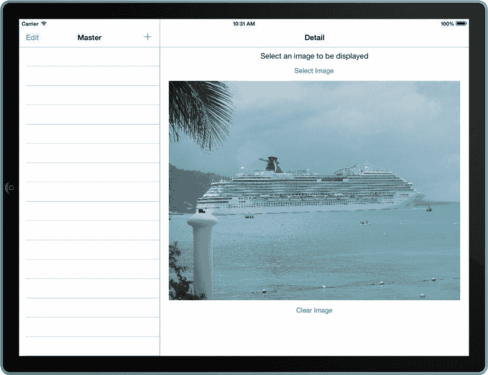

图 11-5. 你的应用程序在 `UIImageView` 中显示图片

提示：如果在 iOS 模拟器上测试应用程序，你需要准备一些图片来显示。将图片保存到模拟器照片库的最简单方法是将其拖放到模拟器窗口上。这会打开 Safari，你可以在其中点击并按住鼠标悬停在图片上。然后会出现一个保存图片的选项，保存后你就可以在应用程序中使用它了。

## 技巧 11-2：缩放图片

应用程序处理的图片通常来自各种来源，且往往无法完美匹配你特定视图的显示。为了适应这种情况，你可以实现缩放和调整图片大小的方法。

使用图片视图时，缩放和调整大小非常容易。例如，在前一个技巧中，你结合使用了“Aspect Fill”和“Clip Subviews”来按比例缩放并填满整个图片视图，结果得到了裁剪后但外观美观的图片。另一种选择是使用“Aspect Fit”模式，该模式也会按比例缩放图片，但会显示完整图片。当然，这可能导致图片视图中出现未使用的空间，就像宽屏电影在非宽屏电视上显示一样。如果你不关心图片比例，可以使用默认的“Scale to Fill”模式。只需从属性检查器中更改图片视图的“Mode”属性，即可使用这些及其他选项。

然而，有时你希望以编程方式缩放实际图片，例如，如果你想保存生成后的图片，或通过提供已缩放好的图片来优化显示。在本技巧中，我们将展示如何使用代码缩放图片。你将实现两个不同的方法，分别对应图片视图的“Scale to Fill”和“Aspect Fit”模式。

你将基于之前的技巧进行构建，但现在使用主视图的表格视图，该视图包含三个功能：选择图片、调整图片大小和缩放图片。由于这些功能直接操作 `UIImage`，你需要关闭图片视图固有的缩放功能。通过从属性检查器中将其“Mode”属性从“Aspect Fill”改为“Center”来实现。

在继续之前，请删除上一个技巧中随 Master-Detail 应用模板一起提供的一些样板代码。这些样板代码允许创建和删除行，而我们将不使用此功能。在 `MasterViewController.m` 文件中，你可以从 `viewDidLoad` 方法中移除以下项目。

```
self.navigationItem.leftBarButtonItem = self.editButtonItem;
UIBarButtonItem *addButton = [[UIBarButtonItem alloc] initWithBarButtonSystemItem:UIBarButtonSystemItemAdd target:self action:@selector(insertNewObject:)];
self.navigationItem.rightBarButtonItem = addButton;
```

你还可以从 `MasterViewController` 中移除以下方法：

`insertNewObject:`
`tableView: canEditRowAtIndexPath:`
`tableView: commitEditingStyle:forRowAtIndexPath:`
`tableView: canMoveRowAtIndexPath:`

现在代码清理完毕，在 `DetailViewController` 类中为两个按钮添加几个插座变量。插座变量应分别命名为 `selectImageButton` 和 `clearImageButton`。

接下来，创建一个方法来配置你的详情视图控制器的用户界面。清单 11-6 展示了 `DetailViewController.h` 文件中的方法声明。

### 清单 11-6：添加处理用户界面配置的方法声明

```
//
//  DetailViewController.h
//  Recipe 11-2 Scaling Images
//
#import <UIKit/UIKit.h>

@interface DetailViewController : UIViewController <UISplitViewControllerDelegate,
UIImagePickerControllerDelegate,
UINavigationControllerDelegate,
UIPopoverControllerDelegate>
@property (strong, nonatomic) id detailItem;
@property (weak, nonatomic) IBOutlet UILabel *detailDescriptionLabel;
@property (weak, nonatomic) IBOutlet UIImageView *imageView;
@property (weak, nonatomic) IBOutlet UIButton *selectImageButton;
@property (weak, nonatomic) IBOutlet UIButton *clearImageButton;
@property (strong, nonatomic) UIPopoverController *pop;
- (IBAction)selectImage:(id)sender;
- (IBAction)clearImage:(id)sender;
- (void)configureDetailsWithImage:(UIImage *)image label:(NSString *)label showsButtons:(BOOL)showButton;
@end
```

清单 11-6 中声明的方法应添加到 `DetailViewController.h` 文件中。其实现如清单 11-7 所示。


### 清单 11-7. 实现 `configureDetailsWithImage:label:showbuttons:` 方法

```
-(void)configureDetailsWithImage:(UIImage *)image label:(NSString *)label showsButtons:(BOOL)showsButton
{
    self.imageView.image = image;
    self.detailDescriptionLabel.text = label;
    if (showsButton == NO)
    {
        self.selectImageButton.hidden = YES;
        self.clearImageButton.hidden = YES;
    }
    else if (showsButton == YES)
    {
        self.selectImageButton.hidden = NO;
        self.clearImageButton.hidden = NO;
    }
}
```

由于我们将在主视图控制器和详细视图控制器之间进行通信，因此最好设置一个委托，以便详细视图控制器在图像发生更改时通知主视图控制器。然后主视图控制器可以直接设置该图像。首先，在 `DetailViewController.h` 文件中实现该协议，如清单 11-8 所示。在此修改中，首先声明将使用协议。接下来，为委托创建一个属性。然后声明协议方法。

### 清单 11-8. 设置用于主视图控制器和详细视图控制器之间通信的协议

```
//
//  DetailViewController.h
//  Recipe 11-2 Scaling Images
//

#import <UIKit/UIKit.h>

@protocol DetailViewControllerDelegateProtocol;

@interface DetailViewController : UIViewController <UISplitViewControllerDelegate,
UIImagePickerControllerDelegate,
UINavigationControllerDelegate,
UIPopoverControllerDelegate>

@property (strong, nonatomic) id detailItem;
@property (nonatomic, weak) id <DetailViewControllerDelegateProtocol> delegate;
@property (weak, nonatomic) IBOutlet UILabel *detailDescriptionLabel;
@property (weak, nonatomic) IBOutlet UIImageView *imageView;
@property (nonatomic, strong) IBOutlet UIButton *selectImageButton;
@property (nonatomic, strong) IBOutlet UIButton *clearImageButton;
@property (strong, nonatomic) UIPopoverController *pop;

- (IBAction)selectImage:(id)sender;
- (IBAction)clearImage:(id)sender;
- (void)configureDetailsWithImage:(UIImage *)image label:(NSString *)label showsButtons:(BOOL)showsButton;

@end

@protocol DetailViewControllerDelegateProtocol <NSObject>
- (void)detailViewController:(DetailViewController *)controller didSelectImage:(UIImage *)image;
- (void)detailViewControllerDidClearImage:(DetailViewController *)controller;
@end
```

现在，在主视图控制器类中添加一个属性以存储所选图像，如清单 11-9 所示。

### 清单 11-9. 将 `UIImage` 属性添加到 `MasterViewController.h` 文件中

```
//
//  MasterViewController.h
//  Recipe 11-2 Scaling Images
//

#import <UIKit/UIKit.h>

@interface MasterViewController : UITableViewController

@property (strong, nonatomic) DetailViewController *detailViewController;
@property (strong, nonatomic) UIImage *mainImage;

@end
```

回到详细视图控制器，您需要更新 `imagePickerController:didFinishPickingMediaWithInfo:` 委托方法，以更新主视图控制器的图像。通过调用协议方法来实现这一点，如清单 11-10 所示。

### 清单 11-10. 修改 `imagePickerController:didFinishPickingMediaWithInfo:` 以调用新协议

```
-(void)imagePickerController:(UIImagePickerController *)picker didFinishPickingMediaWithInfo:(NSDictionary *)info
{
    UIImage *image = [info valueForKey:@"UIImagePickerControllerOriginalImage"];
    self.imageView.image = image;
    [self.pop dismissPopoverAnimated:YES];
    [self.delegate detailViewController:self didSelectImage:image];
}
```

您还需要调整 `clearImage:` 操作方法的实现。再次，我们正在调用一个协议方法，如清单 11-11 所示。

### 清单 11-11. 修改 `clearImage:` 方法以利用 `detailViewControllerDidClearImage:` 协议方法

```
- (IBAction)clearImage:(id)sender
{
    self.imageView.image = nil;
    [self.delegate detailViewControllerDidClearImage:self];
}
```


在你的主视图控制器中，你应该声明遵循`DetailViewControllerDelegateProtocol`协议。因此，修改`MasterViewController.h`文件以容纳这一更改，如代码清单 11-12 所示。

**代码清单 11-12** 声明`DetailViewControllerDelegateProtocol`

```
//
//  MasterViewController.h
//  Recipe 11-2 Scaling Images
//

#import <UIKit/UIKit.h>
#import "DetailViewController.h"

@interface MasterViewController : UITableViewController <DetailViewControllerDelegateProtocol>

@property (strong, nonatomic) DetailViewController *detailViewController;
@property (strong, nonatomic) UIImage *mainImage;

@end
```

你还应该在`viewDidLoad`方法中为主视图控制器设置委托，如代码清单 11-13 所示。

**代码清单 11-13** 在`MasterViewController.m`文件的`viewDidLoad`方法中设置委托

```
//
//  MasterViewController.m
//  Recipe 11-2 Scaling Images
//

//...

- (void)viewDidLoad
{
    [super viewDidLoad];
    self.detailViewController = (DetailViewController *)[[self.splitViewController.viewControllers lastObject] topViewController];
    self.detailViewController.delegate = self;
}
```

接下来，创建两个不同的方法来调整图像大小。将代码清单 11-14 中所示的两个类方法添加到你的`MasterViewController.m`文件中。你无需在`MasterViewController.h`文件中声明它们，因为唯一需要使用它们的类是`MasterViewController`类。

**代码清单 11-14** 实现`scaleImage:`和`aspectScaleImage:toSize:`方法

```
//
//  MasterViewController.m
//  Recipe 11-2 Scaling Images
//

#import "MasterViewController.h"

@interface MasterViewController ()

//...

-(UIImage *)scaleImage:(UIImage *)image toSize:(CGSize)size
{
    UIGraphicsBeginImageContext(size);
    [image drawInRect:CGRectMake(0, 0, size.width, size.height)];
    UIImage *scaledImage = UIGraphicsGetImageFromCurrentImageContext();
    UIGraphicsEndImageContext();
    return scaledImage;
}

-(UIImage *)aspectScaleImage:(UIImage *)image toSize:(CGSize)size
{
    if (image.size.height < image.size.width)
    {
        float ratio = size.height / image.size.height;
        CGSize newSize = CGSizeMake(image.size.width * ratio, size.height);
        UIGraphicsBeginImageContext(newSize);
        [image drawInRect:CGRectMake(0, 0, newSize.width, newSize.height)];
    }
    else {
        float ratio = size.width / image.size.width;
        CGSize newSize = CGSizeMake(size.width, image.size.height * ratio);
        UIGraphicsBeginImageContext(newSize);
        [image drawInRect:CGRectMake(0, 0, newSize.width, newSize.height)];
    }

    UIImage *aspectScaledImage = UIGraphicsGetImageFromCurrentImageContext();
    UIGraphicsEndImageContext();
    return aspectScaledImage;
}

//...
```

在代码清单 11-14 中，第一个方法简单地在指定大小内重新创建图像，忽略了图像的宽高比。第二个方法通过少量计算，确定调整图像大小的最佳方式，以同时保持宽高比并适应给定大小。

为了确保你的视图控制器正确交互，添加代码清单 11-15 中所示的`DetailViewControllerDelegateProtocol`方法，这些方法用于设置图像或清除图像并重新加载表格。

**代码清单 11-15** 实现`DetailViewControllerDelegateProtocol`方法

```
- (void)detailViewController:(DetailViewController *)controller didSelectImage:(UIImage *)image
{
    self.mainImage = image;
    [self.tableView reloadData];
}

- (void)detailViewControllerDidClearImage:(DetailViewController *)controller
{
    self.mainImage = nil;
    [self.tableView reloadData];
}
```

要完成主视图控制器行为的配置，你需要为表格视图填充数据源数据。

首先，将分区数设置为 1。你需要替换作为主-详细视图控制器模板一部分在此方法中提供的样板代码。新的实现如代码清单 11-16 所示。

**代码清单 11-16** 修改`numberOfSectionsInTableView:`委托方法

```
- (NSInteger)numberOfSectionsInTableView:(UITableView *)tableView
{
    return 1;
}
```

接下来，根据你是否有一个图像可以处理来更新行数。如果没有图像，那么你应该只显示文本“Selected Image”，这将只需要一行。同样，你将用代码清单 11-17 中所示的新代码替换样板代码。

**代码清单 11-17** 实现`tableView:numberOfRowsInSection:`委托方法

```
- (NSInteger)tableView:(UITableView *)tableView numberOfRowsInSection:(NSInteger)section
{
    if (self.mainImage == nil)
        return 1;
    else
        return 3;
}
```

接下来，根据当前单元格是 0、1 还是 2 来设置单元格标签。此实现如代码清单 11-18 所示。

**代码清单 11-18** 实现`tableView:cellForRowAtIndexPath:`方法

```
- (UITableViewCell *)tableView:(UITableView *)tableView cellForRowAtIndexPath:(NSIndexPath *)indexPath
{
    UITableViewCell *cell = [tableView dequeueReusableCellWithIdentifier:@"Cell" forIndexPath:indexPath];

    if (indexPath.row == 0)
        cell.textLabel.text = NSLocalizedString(@"Selected Image", @"Detail");
    else if (indexPath.row == 1)
        cell.textLabel.text = NSLocalizedString(@"Resized Image", @"Detail");
    else if (indexPath.row == 2)
        cell.textLabel.text = NSLocalizedString(@"Scaled Image", @"Detail");

    return cell;
}
```

最后，如果选择了一个单元格，你应该确定是哪个单元格，然后使用`configureDetailsWithImage:showsButtons:`协议方法为`DetailViewController`设置图像和标题。代码清单 11-19 显示了替换了样板代码后的新方法。

**代码清单 11-19** `tableView:didSelectRowAtIndexPath:`委托方法的新实现

```
- (void)tableView:(UITableView *)tableView didSelectRowAtIndexPath:(NSIndexPath *)indexPath
{
    if (self.mainImage != nil)
    {
        UIImage *image;
        NSString *label;
        BOOL showsButtons = NO;

        if (indexPath.row == 0)
        {
            image = self.mainImage;
            label = @"Select an Image to Display";
            showsButtons = YES;
        }
        else if (indexPath.row == 1)
        {
            image = [self scaleImage:self.mainImage
                             toSize:self.detailViewController.imageView.frame.size];
            label = @"Chosen Image Resized";
        }
        else if (indexPath.row == 2)
        {
            image = [self aspectScaleImage:self.mainImage
                                   toSize:self.detailViewController.imageView.frame.size];
            label = @"Chosen Image Scaled";
        }

        [self.detailViewController configureDetailsWithImage:image label:label
                                              showsButtons:showsButtons];
    }
}
```

现在你已经完成，可以构建并运行应用程序了。这一次，当你选择一张图像时，你会看到它不会被缩放，并且（假设图像大于图像视图）会被裁剪，就像图 11-6 中所示的那样。

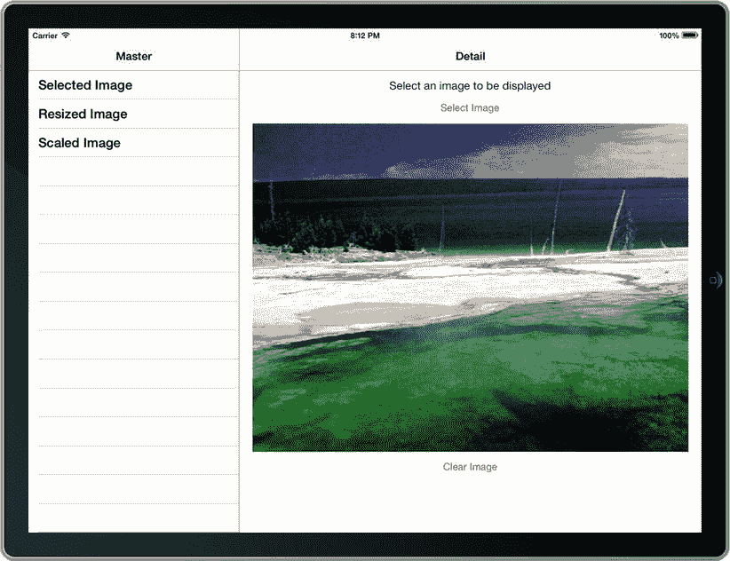

**图 11-6** 黄石国家公园中一个间歇泉的图像

现在，如果你在主视图中选择“Resized Image”单元格，你将看到同一张图片，这次它通过你创建的`scaleImage:toSize:`方法处理。图像已被缩放（不考虑其原始比例）到与图像视图相同的大小。图 11-7 展示了这样一个例子。

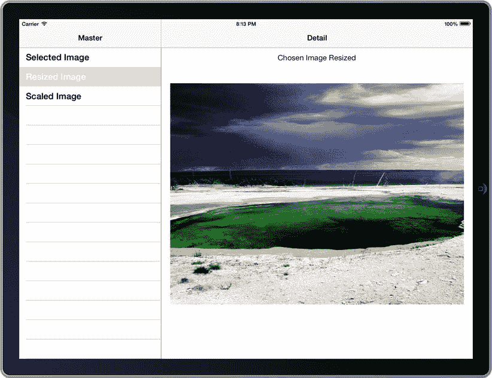

**图 11-7** 未保持比例的缩放图像

然而，此选项的问题是图片变得略微变形。对于这张特定的图像可能不太明显，但在处理人物图像时，物理特征的扭曲会非常明显且难看。为了解决这个问题，请使用“Aspect-Scaled image”选项。


当你选择 Scaled Image 单元格时，你会看到`aspectScaleImage:toSize:`方法的效果。该方法创建了一个大小适合图像视图但保持原始比例的`UIImage`。这会产生一个没有任何尺寸失真的图像，但会将图像缩放至宽度或高度。根据图像的不同，图像视图的背景可能会透出来。我们选择的图像按宽度缩放，并裁剪了顶部和底部，如图 11-8 所示。

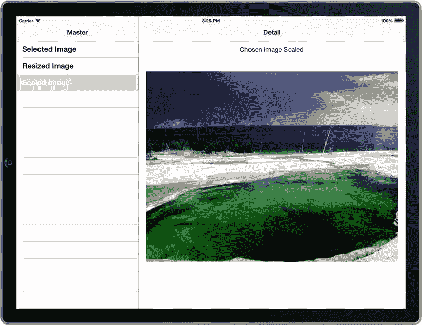

**图 11-8.** 另一种用于消除失真的缩放方法

本技巧到此结束！回顾一下，你介绍了两种调整`UIImage`大小的简单方法，每种方法都有各自的优点和问题。

你的第一种方法只是简单地将图像调整到给定尺寸，而不考虑宽高比。虽然这能让图像避免遮挡其他元素，但会导致相当多的失真。通过使用一些数学计算，你手动保持宽高比将图像缩小到一定尺寸。因为这可能会在图像周围留下空白区域，你可以应用黑色背景。当在无法控制原始图像大小的应用程序中显示大图像时，这是一种很有用的技术。它允许任何图像舒适地适配到给定空间中，并且无论何种情况都能保持视觉上吸引人的黑色背景。

## Recipe 11-3: 使用滤镜处理图像

Core Image 框架是一组在 iOS 5.0 中引入的类，它允许你创造性地对图像应用多种多样的“滤镜”。虽然我们在此不会使用它们，但 iOS 7 附带了许多其他可用的滤镜，这些滤镜可以像我们这里展示的一样被类似地实现。

在本技巧中，你将向图像应用两种滤镜：色调滤镜和拉直滤镜。前者改变图像的色调，后者旋转图像以将其拉直。

你将在 Recipes 11-1 和 11-2 中创建的项目基础上进行构建，添加应用滤镜的功能。

首先将`CoreImage.framework`库链接到你的项目中（关于如何操作的说明，请参见第 1 章），然后在`MasterViewController.h`文件中导入其 API。你还需要一个可变数组属性来保存将要显示的滤镜图像。清单 11-20 显示了`MasterViewController.h`文件，其中这些更改以粗体标出。

**清单 11-20.** 导入 Core Image 框架并在 MasterViewController.h 文件中创建属性

```
//
//  MasterViewController.h
//  Recipe 11-3 Manipulating Images with Filters
//

#import <UIKit/UIKit.h>
#import <CoreImage/CoreImage.h>
#import "DetailViewController.h"

@interface MasterViewController : UITableViewController <DetailViewControllerDelegateProtocol>

@property (strong, nonatomic) DetailViewController *detailViewController;
@property (strong, nonatomic) UIImage *mainImage;
@property (strong, nonatomic) NSMutableArray *filteredImages;

@end
```

通过向`MasterViewController.m`添加自定义 getter 方法来实现`filteredImages`属性的惰性初始化，如清单 11-21 所示。

**清单 11-21.** 实现 filteredImages 属性初始化器

```
-(NSMutableArray *)filteredImages
{
    if (!_filteredImages)
    {
        _filteredImages = [[NSMutableArray alloc] initWithCapacity:3];
    }
    return _filteredImages;
}
```

现在，再次修改你的`detailViewController`委托方法以包含对数组的处理。这些更改如清单 11-22 所示。

**清单 11-22.** 修改 detailViewController 委托方法以处理滤镜图像

```
- (void)detailViewController:(DetailViewController *)controller didSelectImage:(UIImage *)image
{
    self.mainImage = image;
    [self populateImageViewWithImage:image];
    [self.tableView reloadData];
}

- (void)detailViewControllerDidClearImage:(DetailViewController *)controller
{
    self.mainImage = nil;
    [self.filteredImages removeAllObjects];
    [self.tableView reloadData];
}
```

`populateFilteredImagesWithImage:`方法包含你大部分 Core Image 框架代码，实现如清单 11-23 所示。该方法创建了一个`CIImage`，需要以下步骤：

- 获取预期输入图像的`CIImage`。
- 使用特定的名称键创建一个滤镜。该名称定义了将应用哪个滤镜以及它的各种可用参数。
- 为了保险起见，将滤镜的所有参数重置为默认值。
- 使用`inputImage`键将输入图像设置到滤镜。
- 设置与滤镜相关的任何附加值以自定义输出。
- 使用`outputImage`键检索输出的`CIImage`。
- 通过使用`CIContext`从`CIImage`创建一个`UIImage`。因为`CIContext`返回一个`CGImage`，其内存不被 ARC 管理，你还需要使用`CGImageRelease()`释放它。

**清单 11-23.** 实现 populateImageViewWithImage: 方法

```
-(void)populateImageViewWithImage:(UIImage *)image
{
    CIImage *main = [[CIImage alloc] initWithImage:image];
    CIFilter *hueAdjust = [CIFilter filterWithName:@"CIHueAdjust"];
    [hueAdjust setDefaults];
    [hueAdjust setValue:main forKey:@"inputImage"];
    [hueAdjust setValue:[NSNumber numberWithFloat: 3.14/2.0f]
                forKey:@"inputAngle"];
    CIImage *outputHueAdjust = [hueAdjust valueForKey:@"outputImage"];
    CIContext *context = [CIContext contextWithOptions:nil];
```


```objc
CGImageRef cgImage1 = [context createCGImage:outputHueAdjust
fromRect:outputHueAdjust.extent];
UIImage *outputImage1 = [UIImage imageWithCGImage:cgImage1];
CGImageRelease(cgImage1);
[self.filteredImages addObject:outputImage1];

CIFilter *strFilter = [CIFilter filterWithName:@"CIStraightenFilter"];
[strFilter setDefaults];
[strFilter setValue:main forKey:@"inputImage"];
[strFilter setValue:[NSNumber numberWithFloat:3.14f] forKey:@"inputAngle"];
CIImage *outputStr = [strFilter valueForKey:@"outputImage"];
CGImageRef cgImage2 = [context createCGImage:outputStr fromRect:outputStr.extent];
UIImage *outputImage2 = [UIImage imageWithCGImage:cgImage2];
CGImageRelease(cgImage2);
[self.filteredImages addObject:outputImage2];
```

注意：有大量滤镜可应用于图像，每种滤镜都有自己的特定参数和键。要查找某个特定滤镜的详细信息，请参考 Apple 文档 [`http://developer.apple.com/library/ios/#DOCUMENTATION/GraphicsImaging/Reference/CoreImageFilterReference/Reference/reference.html`](http://developer.apple.com/library/ios/#DOCUMENTATION/GraphicsImaging/Reference/CoreImageFilterReference/Reference/reference.html)。

接下来，将滤镜函数添加到表格视图中。首先，对 `tableView:numberOfRowsInSection:` 委托方法进行小幅修改，如代码清单 11-24 所示。

**代码清单 11-24.** 修改 `tableView:numberOfRowsInSection:` 方法以容纳新滤镜

```objc
- (NSInteger)tableView:(UITableView *)tableView numberOfRowsInSection:(NSInteger)section
{
    if (self.mainImage == nil)
        return 1;
    else
        return 5;
}
```

同时，更新 `tableView:cellForRowAtIndexPath:` 方法，为新行配置单元格，如代码清单 11-25 所示。

**代码清单 11-25.** 修改 detailViewController 委托方法以处理滤镜图像

```objc
- (UITableViewCell *)tableView:(UITableView *)tableView cellForRowAtIndexPath:(NSIndexPath *)indexPath
{
    static NSString *CellIdentifier = @"Cell";
    UITableViewCell *cell =
        [tableView dequeueReusableCellWithIdentifier:CellIdentifier];
    if (cell == nil)
    {
        cell = [[UITableViewCell alloc] initWithStyle:UITableViewCellStyleDefault
                                      reuseIdentifier:CellIdentifier];
    }
    if (indexPath.row == 0)
        cell.textLabel.text = NSLocalizedString(@"Selected Image", @"Detail");
    else if (indexPath.row == 1)
        cell.textLabel.text = NSLocalizedString(@"Resized Image", @"Detail");
    else if (indexPath.row == 2)
        cell.textLabel.text = NSLocalizedString(@"Scaled Image", @"Detail");
    else if (indexPath.row == 3)
        cell.textLabel.text = NSLocalizedString(@"Hue Adjust", @"Detail");
    else if (indexPath.row == 4)
        cell.textLabel.text = NSLocalizedString(@"Straighten Filter", @"Detail");
    return cell;
}
```

修改 `tableView:didSelectRowAtIndexPath:` 方法，如代码清单 11-26 所示，以添加新滤镜。

**代码清单 11-26.** 修改 `tableView:didSelectRowAtIndexPath:` 以添加新滤镜

```objc
- (void)tableView:(UITableView *)tableView didSelectRowAtIndexPath:(NSIndexPath *)indexPath
{
    if (self.mainImage != nil)
    {
        UIImage *image;
        NSString *label;
        BOOL showsButtons = NO;
        if (indexPath.row == 0)
        {
            image = self.mainImage;
            label = @"Select an Image to Display";
            showsButtons = YES;
        }
        else if (indexPath.row == 1)
        {
            image = [self scaleImage:self.mainImage
                             toSize:self.detailViewController.imageView.frame.size];
            label = @"Chosen Image Resized";
        }
        else if (indexPath.row == 2)
        {
            image = [self aspectScaleImage:self.mainImage
                                   toSize:self.detailViewController.imageView.frame.size];
            label = @"Chosen Image Scaled";
        }
        else if (indexPath.row == 3)
        {
            image = [self.filteredImages objectAtIndex:0];
            image = [self aspectScaleImage:image toSize:self.detailViewController.imageView.frame.size];
            label = @"Hue Adjustment";
        }
        else if (indexPath.row == 4)
        {
            image = [self.filteredImages objectAtIndex:1];
            image = [self aspectScaleImage:image toSize:self.detailViewController.imageView.frame.size];
            label = @"Straightening Filter";
        }
        [self.detailViewController configureDetailsWithImage:image label:label
                                              showsButtons:showsButtons];
    }
}
```

如代码清单 11-26 所示，你复用了在之前技巧中创建的 `aspectScaleImage:toSize:` 方法，来缩放滤镜图像，使其能够恰到好处地适应图像视图。

现在运行你的应用程序时，可以看到两种滤镜的输出结果。图 11-9 展示了拉直滤镜的一个示例。你可能还记得代码中指定了一个角度为 pi（3.14），这意味着图像旋转 180 度，变成倒置状态。

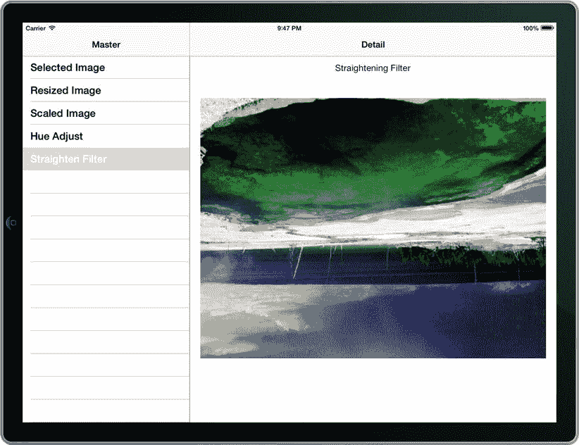

**图 11-9.** 拉直滤镜将图像旋转了 180 度


### 组合滤镜

为图像应用多个滤镜非常简单。只需将多个滤镜串联组合，将一个滤镜的输出图像指定为另一个滤镜的输入图像即可。例如，接下来将添加一个函数，将色调滤镜和拉直滤镜同时应用于所选图像。

将代码清单 11-27 中的代码添加到 `populateImagesWithImage:` 方法中，以创建组合滤镜。

**代码清单 11-27.** 修改 `populateImageViewWithImage:` 方法以创建组合滤镜

```
-(void)populateImageViewWithImage:(UIImage *)image
{
    // ...
    CIFilter *seriesFilter = [CIFilter filterWithName:@"CIStraightenFilter"];
    [seriesFilter setDefaults];
    [seriesFilter setValue:outputHueAdjust forKey:@"inputImage"];
    [seriesFilter setValue:[NSNumber numberWithFloat:3.14/2.0f] forKey:@"inputAngle"];
    CIImage *outputSeries = [seriesFilter valueForKey:@"outputImage"];
    CGImageRef cgImage3 = [context createCGImage:outputSeries
                                          fromRect:outputSeries.extent];
    UIImage *outputImage3 = [UIImage imageWithCGImage:cgImage3];
    [self.filteredImages addObject:outputImage3];
}
```

更新 `tableView:numberOfRowsInSection:` 方法，使其显示第六个单元格，如代码清单 11-28 所示。

**代码清单 11-28.** 更新 `tableView:numberOfRowsInSection:` 方法以创建六个表格行

```
- (NSInteger)tableView:(UITableView *)tableView numberOfRowsInSection:(NSInteger)section
{
    if (self.mainImage == nil)
        return 1;
    else
        return 6;
}
```

同样，在 `tableView:cellForRowAtIndexPath:` 方法中添加第六种情况，以显示第六个单元格的名称，如代码清单 11-29 所示。

**代码清单 11-29.** 修改 `tableView:cellForRowAtIndexPath:` 方法以设置第六个标签标题

```
- (UITableViewCell *)tableView:(UITableView *)tableView cellForRowAtIndexPath:(NSIndexPath *)indexPath
{
    // ...
    if (indexPath.row == 0)
        cell.textLabel.text = NSLocalizedString(@"Selected Image", @"Detail");
    else if (indexPath.row == 1)
        cell.textLabel.text = NSLocalizedString(@"Resized Image", @"Detail");
    else if (indexPath.row == 2)
        cell.textLabel.text = NSLocalizedString(@"Scaled Image", @"Detail");
    else if (indexPath.row == 3)
        cell.textLabel.text = NSLocalizedString(@"Hue Adjust", @"Detail");
    else if (indexPath.row == 4)
        cell.textLabel.text = NSLocalizedString(@"Straighten Filter", @"Detail");
    else if (indexPath.row == 5)
        cell.textLabel.text = NSLocalizedString(@"Series Filter", @"Detail");
    return cell;
}
```

最后，在 `tableView:didSelectRowAtIndexPath:` 方法中添加另一种情况，以使用组合滤镜图像初始化详情视图控制器，如代码清单 11-30 所示。

**代码清单 11-30.** 在 `tableView:didSelectRowAtIndexPath:` 方法中添加新情况

```
- (void)tableView:(UITableView *)tableView didSelectRowAtIndexPath:(NSIndexPath *)indexPath
{
    if (self.mainImage != nil)
    {
        UIImage *image;
        NSString *label;
        BOOL showsButtons = NO;
        if (indexPath.row == 0)
        {
            image = self.mainImage;
            label = @"Select an Image to Display";
            showsButtons = YES;
        }
        // ...
        else if (indexPath.row == 5)
        {
            image = [self.filteredImages objectAtIndex:2];
            image = [self aspectScaleImage:image toSize:self.detailViewController.imageView.frame.size];
            label = @"Series Filter";
        }
        [self.detailViewController configureDetailsWithImage:image label:label showsButtons:showsButtons];
    }
}
```

当你测试应用时，这个新创建的双重滤镜将结合前两个滤镜的效果，生成一幅经过色调调整和旋转的图像——此次旋转角度为 90 度，如图 11-10 所示。

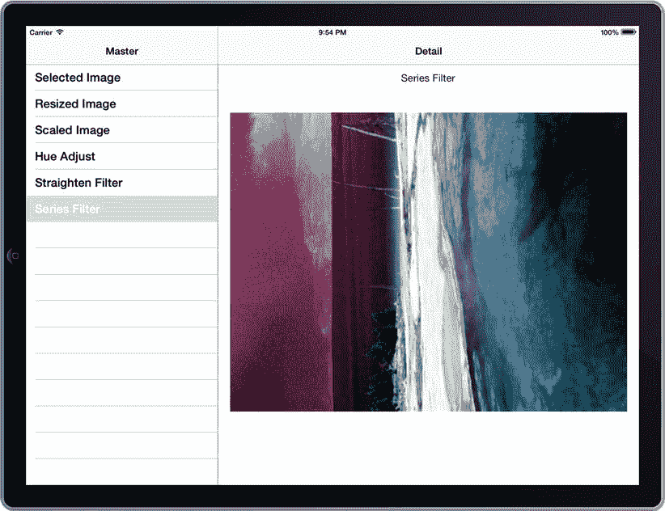

**图 11-10.** 同时应用了色调滤镜和 90 度拉直滤镜的图像

> **注：** 在使用 Core Image 框架时，大部分处理工作都源于通过 `CIContext` 从 `CIImage` 创建 `UIImage` 的过程。而 `CIImage` 本身的创建是一项非常快速的操作。在此应用中，我们选择一次性创建所有滤镜图像，以便在各显示界面之间快速切换。这就是为什么在选择图像后，模拟器可能需要花费几秒钟才能真正显示图像并完成刷新。如果你正在构建一个面向发布的应用程序，则应该通过 `UIActivityIndicatorView` 或 `UIProgressView` 等机制，以某种方式向用户传达正在处理的信息。


### 为表格视图创建缩略图

作为最后的点缀，我们将回到上一个技巧的调整尺寸主题。你将实现另一种长宽比缩放方法，该方法执行图像视图的“**Aspect Fill**”模式所执行的操作；即，在保持比例的前提下缩放，但确保覆盖整个区域。此方法更适合创建缩略图，你现在将针对表格视图中的滤镜功能来实现它。

首先，将代码清单 11-31 中所示的新缩放方法添加到主视图控制器中。

**代码清单 11-31.** 实现 `aspectFillImage:toSize:` 方法

```
-(UIImage *)aspectFillImage:(UIImage *)image toSize:(CGSize)size
{
    UIGraphicsBeginImageContext(size);
    if (image.size.height < image.size.width)
    {
        float ratio = size.height / image.size.height;
        [image drawInRect:CGRectMake(0, 0, image.size.width * ratio, size.height)];
    }
    else
    {
        float ratio = size.width / image.size.width;
        [image drawInRect:CGRectMake(0, 0, size.width, image.size.height * ratio)];
    }
    UIImage *aspectScaledImage = UIGraphicsGetImageFromCurrentImageContext();
    UIGraphicsEndImageContext();
    return aspectScaledImage;
}
```

现在，你只需再次修改 `tableView:cellForRowAtIndexPath:`，为单元格的 `imageView` 添加图像选择，如代码清单 11-32 所示。

**代码清单 11-32.** 在 `tableView:cellForRowAtIndexPath:` 方法中为单元格添加缩略图

```
- (UITableViewCell *)tableView:(UITableView *)tableView cellForRowAtIndexPath:(NSIndexPath *)indexPath
{
    static NSString *CellIdentifier = @"Cell";
    UITableViewCell *cell = [tableView dequeueReusableCellWithIdentifier:CellIdentifier];
    if (cell == nil) {
        cell = [[UITableViewCell alloc] initWithStyle:UITableViewCellStyleDefault
                                      reuseIdentifier:CellIdentifier];
    }
    if (indexPath.row == 0)
        cell.textLabel.text = NSLocalizedString(@"Selected Image", @"Detail");
    else if (indexPath.row == 1)
        cell.textLabel.text = NSLocalizedString(@"Resized Image", @"Detail");
    else if (indexPath.row == 2)
        cell.textLabel.text = NSLocalizedString(@"Scaled Image", @"Detail");
    else if (indexPath.row == 3)
    {
        CGSize thumbnailSize = CGSizeMake(120, 75);
        UIImage *displayImage = [self.filteredImages objectAtIndex:0];
        UIImage *thumbnailImage = [self aspectFillImage:displayImage toSize:thumbnailSize];
        cell.imageView.image = thumbnailImage;
        cell.textLabel.text = NSLocalizedString(@"Hue Adjust", @"Detail");
    }
    else if (indexPath.row == 4)
    {
        CGSize thumbnailSize = CGSizeMake(120, 75);
        UIImage *displayImage = [self.filteredImages objectAtIndex:1];
        UIImage *thumbnailImage = [self aspectFillImage:displayImage toSize:thumbnailSize];
        cell.imageView.image = thumbnailImage;
        cell.textLabel.text = NSLocalizedString(@"Straighten Filter", @"Detail");
    }
    else if (indexPath.row == 5)
    {
        CGSize thumbnailSize = CGSizeMake(120, 75);
        UIImage *displayImage = [self.filteredImages objectAtIndex:2];
        UIImage *thumbnailImage = [self aspectFillImage:displayImage toSize:thumbnailSize];
        cell.imageView.image = thumbnailImage;
        cell.textLabel.text = NSLocalizedString(@"Series Filter", @"Detail");
    }
    return cell;
}
```

现在测试你的应用程序时，色相、拉直和系列滤镜的单元格会显示它们所引用的更大图像的缩放缩略图版本。图 11-11 显示了此示例。

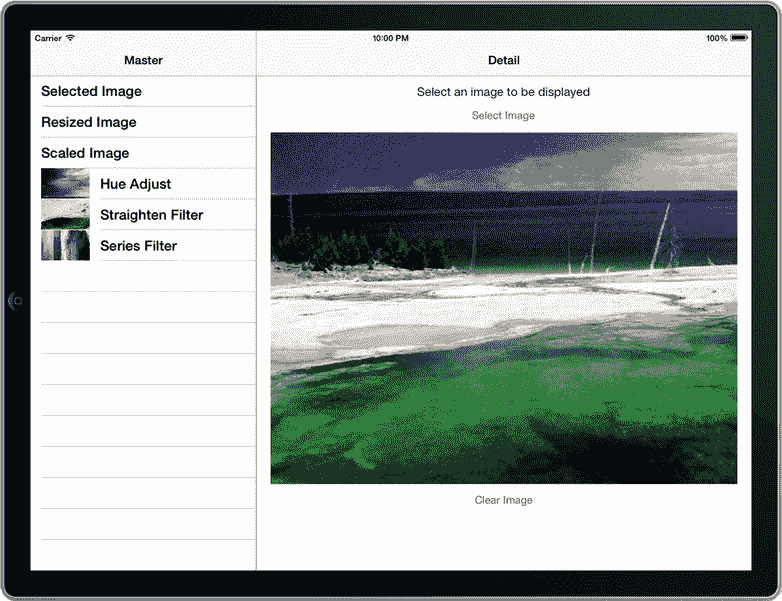

**图 11-11.** 表格视图中带有缩略图的应用程序

## 技巧 11-4：检测特征

除了灵活使用滤镜外，Core Image 框架还带来了特征检测的可能性。有了它，你可以搜索图像中的关键组成部分，例如人脸。

在本技巧中，你将实现一个人脸检测应用程序。为 iPhone 设备系列创建一个新的单视图项目。项目创建后，像上一个技巧一样，将 Core Image 框架添加到你的项目中。

将主视图的背景色设置为黑色，并添加两个图像视图和一个按钮，使用户界面类似于图 11-12。

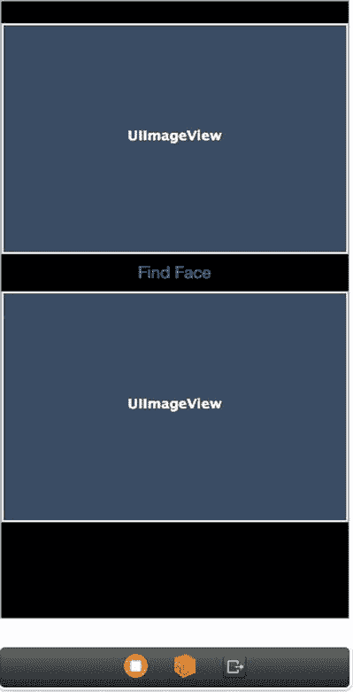

**图 11-12.** 用于人脸识别的简单用户界面

为以下三个元素创建输出口：

- `mainImageView`
- `findFaceButton`
- `faceImageView`

另外，为按钮创建一个名为“`findFace`”的操作。

接下来，找一张要在应用程序中显示的图像，并将其添加到项目中。你可以通过将文件从访达拖入项目导航器的资源文件中来完成此操作。为了正确测试此应用程序，请尝试找到一张具有清晰可见人脸的图像。

现在，你可以构建 `viewDidLoad` 方法来配置图像视图，并将初始图像设置到主图像视图中。请务必将图像名称（以下代码中的 `testimage.jpg`）更改为你自己的文件名。这些更改如代码清单 11-33 所示。

**代码清单 11-33.** 填充 `viewDidLoad` 方法

```
- (void)viewDidLoad
{
    [super viewDidLoad];
    // Do any additional setup after loading the view, typically from a nib.
    self.mainImageView.contentMode = UIViewContentModeScaleAspectFit;
    self.faceImageView.contentMode = UIViewContentModeScaleAspectFit;
    UIImage *image = [UIImage imageNamed:@"testimage.jpg"];
    if (image != nil)
    {
        self.mainImageView.image = image;
    }
    else
    {
        [self.findFaceButton setTitle:@"No Image" forState:UIControlStateNormal];
        self.findFaceButton.enabled = NO;
        self.findFaceButton.alpha = 0.6;
    }
}
```

现在，你可以实现 `findFace:` 操作方法来进行特征检测。你可以使用此方法来确定给定图像中任何人脸的位置，从找到的最后一个人脸创建 `UIImage`，然后将其显示在人脸图像视图中。

代码清单 11-34 使用以下步骤构建 `findFace` 的实现：

- 从初始的 `UIImage` 获取一个 `CIImage` 对象。
- 创建一个用于分析图像的 `CIContext`。
- 使用类型和选项参数创建一个 `CIDetector` 实例。
  - 类型参数指定要识别的特定特征。目前，可能的唯一值是 `CIDetectorTypeFace`，它允许专门查找人脸。
  - 选项参数允许指定查找特征的精度。低精度会更快，但高精度会更精确。
- 创建一个包含图像中找到的所有特征的数组。由于指定了 `CIDetectorTypeFace` 类型，这些对象都将是 `CIFaceFeature` 类的实例。
- 使用 `imageByCroppingToRect:` 方法，传入原始图像以及图像中找到的最后一个 `CIFaceFeature` 指定的边界，创建一个 `CIImage`。这些边界指定了人脸所在的 `CGRect`。
- 从 `CIImage` 创建 `UIImage`（完全按照上一个技巧的方式完成），然后将其显示在 `UIImageView` 中。

**代码清单 11-34.** `findFace:` 操作方法的完整实现

```
- (IBAction)findFace:(id)sender
{
    UIImage *image = self.mainImageView.image;
    CIImage *coreImage = [[CIImage alloc] initWithImage:image];
    CIContext *context = [CIContext contextWithOptions:nil];
    CIDetector *detector = [CIDetector detectorOfType:@"CIDetectorTypeFace"
                                             context:context
                                             options:[NSDictionary dictionaryWithObjectsAndKeys:
                                                     @"CIDetectorAccuracyHigh", @"CIDetectorAccuracy", nil]];
    NSArray *features = [detector featuresInImage:coreImage];
```


```
if ([features count] >0)
{
    CIImage *faceImage =
    [coreImage imageByCroppingToRect:[[features lastObject] bounds]];
    UIImage *face = [UIImage imageWithCGImage:[context createCGImage:faceImage
                                        fromRect:faceImage.extent]];
    self.faceImageView.image = face;
    [self.findFaceButton setTitle:[NSString stringWithFormat:@"%i Face(s) Found",
                                  [features count]] forState:UIControlStateNormal];
    self.findFaceButton.enabled = NO;
    self.findFaceButton.alpha = 0.6;
}
else
{
    [self.findFaceButton setTitle:@"No Faces Found"forState:UIControlStateNormal];
    self.findFaceButton.enabled = NO;
    self.findFaceButton.alpha = 0.6;
}
```

当您运行应用程序时，可以检测图像中的任何面部，这些面部将显示在下方的 `UIImageView` 中，如图 11-13 所示。

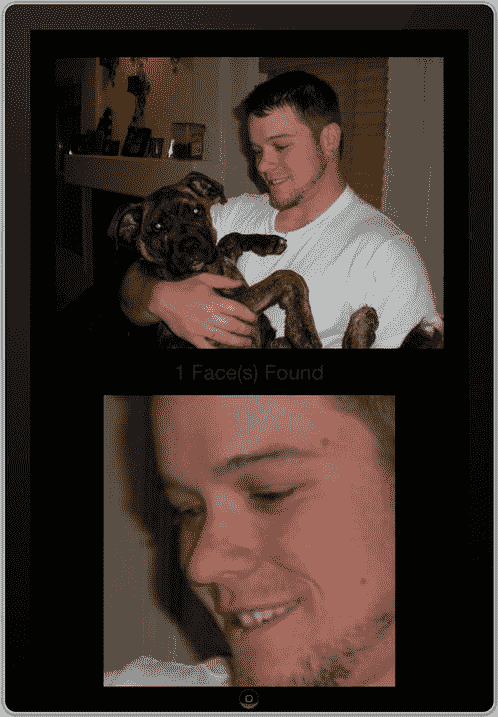

**图 11-13.** 从图像中检测并裁剪面部的应用程序

## 总结

图像构建了我们的世界。从孩子们喜爱阅读的最简单的图画书，到互联网上传输的海量视觉数据，图片和图像已成为现代文化的关键基石之一。iOS 提供了出色的工具，用于在应用程序中创建、处理、操作和显示图像。借助这些简单的 API，您可以更快地创建更有趣、更实用的应用。

在本章中，您学习了如何使用图像视图、按比例调整图像大小、使用滤镜处理图像以及检测照片中的面部。我们希望这为您充分利用 iOS 强大的图形功能提供了必要的良好开端。

