# 12. 图形处理秘籍

## 摘要

在本章中，我们将探索 UIKit、Quartz 2D 和 Core Graphics。我们已经使用 UIKit 创建了窗口、按钮和视图。Quartz 2D 是构建 UIKit 的渲染引擎。Quartz 2D 是 Core Graphics 框架的一部分，它们共同帮助开发者创建令人印象深刻的视图和界面。每当您看到一个令人印象深刻的自定义界面（例如 Evernote，它看起来与标准 Apple 界面完全不同）时，您可以肯定 Core Graphics 在其中发挥了重要作用。作为开发者，您可以通过继承现有的 Apple 元素（例如按钮和表格视图单元格）来使用 Core Graphics 自定义界面的几乎任何方面。

虽然本章不深入探讨自定义界面的创建，但我们将为您提供良好的基础以继续构建。在接下来的几个操作指南中，我们将构建一个自定义视图，其中将包含矩形、椭圆、弧线、阴影、渐变和自定义文本。我们将通过创建一个单一的视图来实现这一点，该视图将随着章节的推进而变得越来越复杂。

## 操作指南 12-1：绘制简单形状

大多数艺术家从简单形状开始，逐步构建，直到完成作品。在 iOS 中，您也可以从在视图中绘制简单形状的基础开始，逐步构建，直到拥有一个设计。

在本操作指南中，我们将创建一个带有标题栏和圆形的新视图。首先创建一个新的单视图应用程序项目。在构建用户界面之前，您将创建一个自定义视图，该视图将实现一些简单的绘制代码。创建一个名为 `GraphicsRecipesView` 的 `UIView` 新子类，并将清单 12-1 中的代码添加到其 `drawRect:` 方法中。

**清单 12-1.** 实现一些绘制代码

```
//
//  GraphicsRecipesView.m
//  Recipe 12-1 Drawing Simple Shapes
//

#import "GraphicsRecipesView.h"

@implementation

// ...
// 仅当您执行自定义绘制时重写 drawRect:。
// 空实现会对动画期间的性能产生不利影响。
- (void)drawRect:(CGRect)rect
{
    CGContextRef context = UIGraphicsGetCurrentContext();
    //设置当前上下文的颜色
    [[UIColor lightGrayColor] set];
    //绘制矩形
    CGRect drawingRect = CGRectMake(0.0, 0.0f, 320.0f, 60.0f);
    CGContextFillRect(context, drawingRect);
    //设置当前上下文的颜色
    [[UIColor whiteColor] set];
    //绘制椭圆 <- 我知道我们在画圆，但圆只是特殊的椭圆。
    CGRect ellipseRect = CGRectMake(60.0f, 150.0f, 200.0f, 200.0f);
    CGContextFillEllipseInRect(context, ellipseRect);
}
```

在清单 12-1 的方法中添加了以下步骤来绘制基本形状：

1. 获取由 `CGContextRef` 表示的当前“上下文”的引用。
2. 设置当前上下文的颜色。
3. 定义一个要绘制的 `CGRect`。
4. 使用 `CGContextFillEllipseInRect` 函数填充当前形状。
5. 对每个附加形状重复步骤 2 到 3。

要将其显示在预先配置的视图中，您必须将此类的一个实例添加到用户界面。这可以通过编程方式或通过 Interface Builder 完成，我们演示后者。

在 Main.storyboard 文件中的视图控制器中，从实用工具面板的对象库中拖出一个 `UIView` 到您的视图中。将视图放置在窗口中，并拖动它以填充整个窗口，如图 12-1 所示。选中该视图后，从属性检查器中选择不同的背景。在此示例中，我使用了浅蓝色。

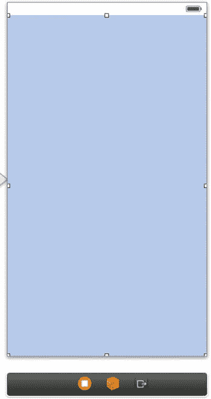

**图 12-1.** 使用 UIView 构建您的 .xib 文件

在您的 `UIView` 处于选中状态时，转到右侧面板的身份检查器。在“自定义类”部分下，将“类”字段从“UIView”更改为“GraphicsRecipesView”，如图 12-2 所示。这将您添加到 Interface Builder 中的视图与您之前创建的自定义类连接起来。

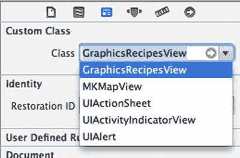

**图 12-2.** 将自定义类连接到 UIView

运行此应用程序时，您应该会看到绘制命令的输出已转换为视觉显示，从而生成图 12-3 中所示的模拟视图。

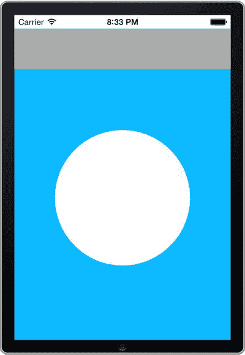

**图 12-3.** 一个在屏幕顶部绘制灰色方块以及白色圆形的自定义视图


### 略作重构

现在我们将清理一下代码，并把每个元素拆分成独立的函数。这样我们就能复用函数，同时也能让我们的 `drawRect:` 方法变得更整洁。我们之前在 `GraphicsRecipesView` 的 `drawRect` 方法中编写的代码，现在看起来如代码清单 12-2 所示。

**代码清单 12-2.** 重构绘制代码，将矩形和椭圆的绘制移至专用方法

```
- (void)drawRect:(CGRect)rect
{
    CGContextRef context = UIGraphicsGetCurrentContext();
    //调用函数绘制矩形
    [self drawRectangleAtTopOfScreen:context];
    //调用函数绘制圆形
    [self drawEllipse:context];
}

-(void)drawRectangleAtTopOfScreen:(CGContextRef)context
{
    CGContextSaveGState(context);
    //设置当前上下文的颜色
    [[UIColor lightGrayColor] set];
    //绘制矩形
    CGRect drawingRect = CGRectMake(0.0, 0.0f, 320.0f, 60.0f);
    CGContextFillRect(context, drawingRect);
    CGContextRestoreGState(context);
}

-(void)drawEllipse:(CGContextRef)context
{
    CGContextSaveGState(context);
    //设置当前上下文的颜色
    [[UIColor whiteColor] set];
    //绘制椭圆 <- 我知道我们画的是圆，但圆只是椭圆的一种特例。
    CGRect ellipseRect = CGRectMake(60.0f, 150.0f, 200.0f, 200.0f);
    CGContextFillEllipseInRect(context, ellipseRect);
    CGContextRestoreGState(context);
}
```

在代码清单 12-2 中，你会看到我们创建了两个新函数，并且它们的输入参数类型都是 `CGContextRef`。这允许我们将当前上下文传递进去。我们还添加了 `CGContextSaveGState` 和 `CGContextRestoreGState` 函数调用。这样可以确保，如果我们在这些函数调用内部做了更改（例如设置颜色或阴影），这些更改只会应用于这一个函数。请注意，这些函数保存的是状态，而不是当前的绘制内容。恢复状态并不会撤销对绘图的更改（例如添加一个矩形或椭圆）；它只会恢复诸如当前填充颜色和阴影属性之类的值。

在接下来的教程中，我们将创建新的函数，并从 `drawRect:` 方法中调用它们。

## 配方 12-2：绘制路径

值得庆幸的是，你并不局限于只绘制矩形和椭圆。还有一些其他的函数。你可以通过创建由直线或曲线连接的点组成的“路径”来绘制自定义形状。首先，我们将在屏幕底部、我们在配方 12-1 中创建的白色圆下方绘制一个半透明的三角形，它看起来像一个播放按钮。创建一个名为 `drawTriangle` 的新函数，并在 `drawRect:` 方法中调用该函数，如代码清单 12-3 所示。

**代码清单 12-3.** 使用 `UIView` 构建你的 `.xib` 文件

```
- (void)drawRect:(CGRect)rect
{
    CGContextRef context = UIGraphicsGetCurrentContext();
    //调用函数绘制矩形
    [self drawRectangleAtTopOfScreen:context];
    //调用函数绘制圆形
    [self drawEllipse:context];
    //调用函数绘制三角形
    [self drawTriangle:context];
}
//...
-(void)drawTriangle:(CGContextRef)context
{
    CGContextSaveGState(context);
    //设置当前上下文的颜色
    [[UIColor colorWithRed:0.80f
                    green:0.85f
                     blue:0.95f
                    alpha:1.0f] set];
    // 绘制三角形
    CGContextBeginPath(context);
    CGContextMoveToPoint(context, 140.0f, 380.0f);
    CGContextAddLineToPoint(context, 190.0f, 400.0f);
    CGContextAddLineToPoint(context, 140.0f, 420.0f);
    CGContextClosePath(context);
    CGContextSetGrayFillColor(context, 0.1f, 0.85f);
    CGContextSetGrayStrokeColor(context, 0.0, 0.0);
    CGContextFillPath(context);
    CGContextRestoreGState(context);
}
```

代码清单 12-4 通过执行以下步骤创建了一个形状：
- 在上下文中声明一条新路径。
- 指定路径的起始点。
- 指定路径上的所有点。
- 闭合路径。
- 设置填充颜色和描边颜色。
- 填充路径。

> **注意**  
> 我们使用了不同的填充路径的方法。我们也可以在代码段开头使用 `[[UIColor colorWithRed:0.40f green:0.40f blue:0.40f alpha:0.85f] set];` 来声明一个新颜色，并移除 `CGContextSetGrayFillColor`，结果是一样的。`CGContextSetGrayFillColor` 是一个使用灰色的便捷函数；我们可以使用 `CGContextSetFillColor` 来选择任何我们想要的颜色。

构建并运行项目，你应该会在模拟器中看到一个类似于图 12-4 的屏幕。

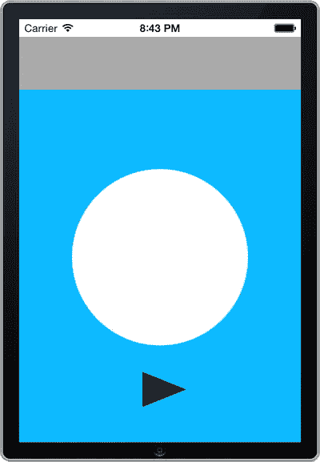

**图 12-4.** 一个添加了三角形路径绘制的自定义视图

现在让我们更进一步，绘制一条弧线。这稍微复杂一些，但并非难事。首先我们需要做一些数学计算。以下是使用 `CGContextAddArc` 函数绘制弧线需要了解的内容：
- 确定弧线中心点的 X 和 Y 坐标。
- 确定弧线的半径。
- 从 3 点钟方向开始，选择弧线的起始角度和结束角度。
- 确定弧线是顺时针还是逆时针方向绘制。

同样地，我们将创建一个新方法来绘制弧线，并在 `drawRect:` 方法中调用它，如代码清单 12-4 所示。

**代码清单 12-4.** 实现 `drawArc:` 方法并从 `drawRect:` 方法中调用它

```
- (void)drawRect:(CGRect)rect
{
    CGContextRef context = UIGraphicsGetCurrentContext();
    //调用函数绘制矩形
    [self drawRectangleAtTopOfScreen:context];
    //调用函数绘制圆形
    [self drawEllipse:context];
    //调用函数绘制三角形
    [self drawTriangle:context];
    //调用函数绘制弧线
    [self drawArc:context];
}

-(void)drawArc:(CGContextRef)context
{
    CGContextSaveGState(context);
    //设置当前上下文的颜色
    [[UIColor colorWithRed:0.30f
                    green:0.30f
                     blue:0.30f
                    alpha:1.0f] set];
    //绘制弧线
    CGContextAddArc(context, 160.0f, 250.0f, 70.0f, 0.0f, 3.14, 0);
    CGContextSetLineWidth(context, 50.0f);
    CGContextDrawPath(context, kCGPathStroke);
    CGContextRestoreGState(context);
}
```

在代码清单 12-4 中，我们绘制了一条中心点在 X=160 点、Y=250 点的弧线。半径为 70 点，弧线从 0 弧度开始，到 3.14（pi）弧度结束，按顺时针方向绘制。要改为逆时针方向，将 0 替换为 1。在此示例中，我们将弧线的线宽设置为 50 点，使其具有类似状态栏的外观。

如果你构建并运行项目，现在应该会得到一个类似图 12-5 的结果。

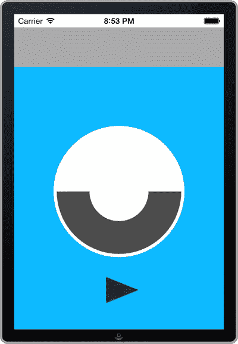

**图 12-5.** 一个在圆形上方绘制了弧线的自定义视图

## 配方 12-3：添加字体并绘制文本

当前的設計趋势越来越强调排版，而减少对图片、纹理和渐变的依赖。这是因为我们需要处理多种屏幕尺寸，并且拥有让文字看起来更清晰的显示屏。因此，利用可用的 iOS 字体以及导入自定义字体，对于创建视觉上吸引人的应用来说是绝对必要的。


### 利用可用字体

iOS 7 安装了大量系统字体，因为苹果公司在本版本中更加注重字体排印。自 iOS 6 以来，苹果实际上已经增加了数百种字体。

**注意**：在 iOS 7 中，苹果还添加了 Text 框架，该框架可让您对字体进行更精细的控制，并赋予您从调整行距到创建自定义字体类型等所有操作的能力。此类自定义操作超出了本书的范畴，但您可以在 [`developer.apple.com/library/ios/documentation/StringsTextFonts/Conceptual/TextAndWebiPhoneOS/Introduction/Introduction.html#//apple_ref/doc/uid/TP40009542`](https://developer.apple.com/library/ios/documentation/StringsTextFonts/Conceptual/TextAndWebiPhoneOS/Introduction/Introduction.html#//apple_ref/doc/uid/TP40009542) 了解更多信息。

要创建字体对象，您需要使用 `UIFont` 类，该类构建于 `UIKit` 框架之上，`UIKit` 是用于显示按钮、文本、视图等的主要框架。要声明一个 `UIFont` 对象，您需要知道字体系列的名称（例如 Helvetica 或 Times New Roman）和字体外观（例如 Bold、Italic 和 BoldItalic）。

一旦了解这些信息，声明一个 `UIFont` 对象就很容易了。格式如下：

```
UIFont *fontObjectName = [UIFont fontWithName:@"fontFamily-fontFace" size:<#(CGFloat)#> ];
```

因此，如果您想使用 Helvetica 系列、粗体外观以及 12 点大小的字体，声明将如下所示：

```
UIFont *fontObjectName = [UIFont fontWithName: @"Helvetica-Bold" size: 12.0f];
```

### 导入自定义字体

首先，您需要一个字体添加到您的项目中。幸运的是，您可以在 Google 网站 [`www.google.com/fonts`](http://www.google.com/fonts) 上找到许多开源字体。对于这个示例，我们下载了粗体外观的 Oleo Script Swash Caps 系列。

现在我们有了一个自定义字体，通过从 Finder 中将其拖放到 Xcode 的项目导航器中，将其添加到您的项目中。完成后，您应该会看到它被添加到项目导航器中，如图 12-6 所示。

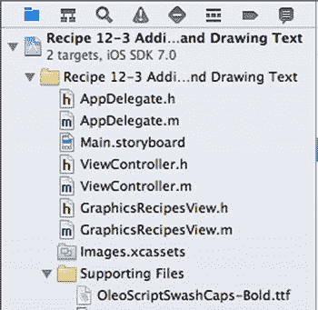

**图 12-6.** 将字体添加到支持文件组

拖放文件后，将会出现一个对话框。请确保选中“将项目复制到目标组的文件夹中（如果需要）”复选框，并确保单击复选框将其添加到您的目标中。

接下来，从项目导航器中展开“Supporting Files”文件夹并打开 `GraphicsRecipes-Info.plist` 文件。

通过选择“Information Property List”旁边的“+”并向其中添加一个键，标题为“应用程序提供的字体”（Fonts provided by application）。当您开始在此字段中输入时，它应该会作为选择项之一出现。确保类型为“Array”。

现在，在“应用程序提供的字体”下创建一个新项目，并为其赋予一个与文件名匹配的字符串值。确保为类型选择“String”。

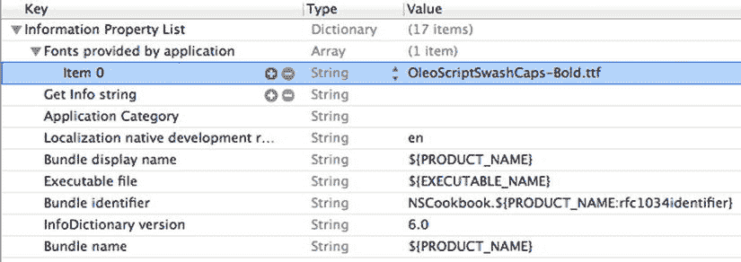

**图 12-7.** 向 info.plist 添加字体

现在您应该可以使用您的字体了。向 `GraphicsRecipesView` 文件添加一个名为 `drawTextAtTopOfScreen:` 的新方法，如列表 12-5 所示。

**列表 12-5.** 实现 `drawTextAtTopOfScreen:` 方法

```
-(void)drawTextAtTopOfScreen:(CGContextRef)context{
    CGContextSaveGState(context);

    //创建 UIColor 以传递给文本属性
    UIColor *textColor = [UIColor colorWithRed:0.80f
                     green:0.85f
                      blue:0.95f
                     alpha:1.0f];

    //设置字体
    UIFont *customFont = [UIFont fontWithName:@"OleoScriptSwashCaps-Bold" size:40.0f ];
    //UIFont *customFont = [UIFont systemFontOfSize:20.0f];

    NSString *titleText = @"iOS Recipes!";
    [titleText drawAtPoint:CGPointMake(55,5) withAttributes:@{NSFontAttributeName:customFont,
                                                              NSForegroundColorAttributeName:textColor}];

    CGContextRestoreGState(context);
}
```

当然，您需要从 `drawRect:` 方法中调用此方法，如列表 12-6 所示。

**列表 12-6.** 更新 `drawRect:` 方法以包含 `drawTextAtTopOfScreen:` 方法

```
- (void)drawRect:(CGRect)rect
{
    CGContextRef context = UIGraphicsGetCurrentContext();
    //调用函数绘制矩形
    [self drawRectangleAtTopOfScreen:context];
    //调用函数绘制圆形
    [self drawEllipse:context];
    //调用函数绘制三角形
    [self drawTriangle:context];
    //调用函数绘制弧线
    [self drawArc:context];
    //调用函数绘制文本
    [self drawTextAtTopOfScreen:context];
}
```

构建并运行您的项目。您应该会看到一些具有非常精美字体的新文本，如图 12-8 所示。

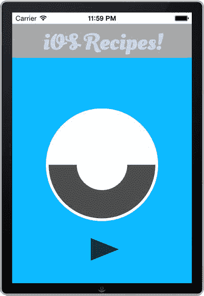

**图 12-8.** 带有自定义字体的自定义视图


## 配方 12-4：添加阴影

阴影能让图形元素真正突出。相较于边框或描边，它们能以更时尚的方式实现图形之间的分离。在本配方中，我们将为本章前面几个配方中已创建的部分组件添加阴影。

阴影的实现其实非常简单，只需一行代码即可绘制。从图 12-9 的截图可以看出，我们需要传入几个参数来完成这项工作。

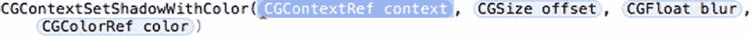

图 12-9. 设置上下文阴影

第一个参数现在你应该已经熟悉了；在我们的示例中，这仅仅是我们当前正在操作的上下文。`CGSize`偏移量是指阴影相对于对象的偏移距离。要设置偏移量，你可以传入一些 `CGSizeMake` 参数；如果你希望阴影没有偏移，则可以调用常量 `CGSizeZero`，它实际上相当于创建了 `CGSizeMake(0, 0)`。为了看出区别，下面提供了两张截图（图 12-10 和图 12-11），一张使用零偏移量，另一张则使用了 `CGSizeMake(10.0f, 15.0f)` 应用于示例中的圆形。

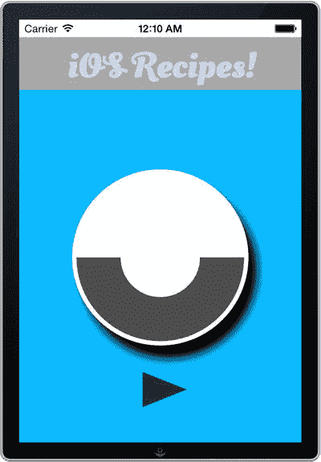

图 12-11. 使用 `CGSizeMake(10.0f, 15.0f)` 的阴影

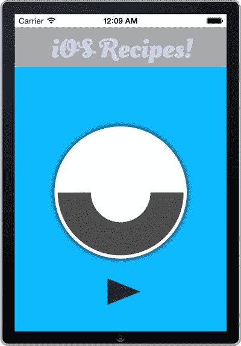

图 12-10. 使用 `CGSizeZero` 的阴影

所需的其他参数分别是模糊程度和颜色。通过将 `CGSizeZero` 选项与此结合使用，并将颜色改为浅色，你还可以创建发光效果。在以下代码中，我们修改了两个方法，为文本和一个白色圆形应用阴影，如清单 12-7 所示。

清单 12-7. 修改 `drawEllipse:` 和 `drawTextAtTopOfScreen:` 方法以包含阴影

```
-(void)drawEllipse:(CGContextRef)context
{
    CGContextSaveGState(context);
    //设置当前上下文的颜色
    [[UIColor whiteColor] set];
    //设置阴影及其颜色
    CGContextSetShadowWithColor(context, CGSizeZero, 10.0f, [[UIColor blackColor] CGColor]);
    //绘制椭圆 <- 我知道我们在画圆，但圆只是椭圆的一种特殊形式。
    CGRect ellipseRect = CGRectMake(60.0f, 150.0f, 200.0f, 200.0f);
    CGContextFillEllipseInRect(context, ellipseRect);
    CGContextRestoreGState(context);
}

-(void)drawTextAtTopOfScreen:(CGContextRef)context
{
    CGContextSaveGState(context);
    //设置当前上下文的颜色
    [[UIColor colorWithRed:0.80f
                     green:0.85f
                      blue:0.95f
                     alpha:1.0f] set];
    //设置阴影及其颜色
    CGContextSetShadowWithColor(context, CGSizeZero, 10.0f, [[UIColor blackColor] CGColor]);
    //设置字体
    UIFont *customFont = [UIFont fontWithName:@"OleoScriptSwashCaps-Bold" size:40.0f ];
    NSString *titleText = @"iOS Recipes!";
    //在屏幕上绘制文本
    [titleText drawAtPoint:CGPointMake(55,5)
                  withFont:customFont];
    CGContextRestoreGState(context);
}
```

就是这样！创建一个简单的阴影实际上非常容易。我们鼓励你尝试改变模糊程度和颜色。完成后的视图应如图 12-12 所示。

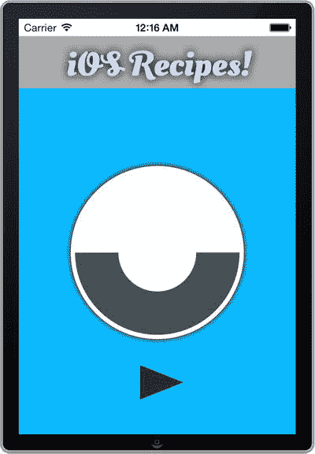

图 12-12. 对圆形和文本应用了阴影的自定义视图

## 配方 12-5：创建渐变

渐变是为原本枯燥的视图增添视觉吸引力的另一种好方法。本配方将展示创建渐变所需的知识，渐变可以实现一种颜色到另一种颜色的平滑过渡。

在所有图形元素中，渐变有点棘手，因为它需要相当多的输入条件。你必须做出几个决定，例如渐变是垂直还是水平方向，是圆形渐变还是线性渐变。在本配方中，我们将专注于创建垂直的线性渐变。

要创建渐变，你需要执行以下步骤：

定义起始颜色和结束颜色。设置颜色空间和渐变空间。定义渐变方向。创建并绘制渐变。

让我们遵循这些步骤，再创建一个处理渐变的方法。将清单 12-8 中的代码添加到你的 `GraphicsRecipesView.m` 文件中。

清单 12-8. 向 `GraphicsRecipesView.m` 文件添加 `drawGradient:` 方法

```
-(void)drawGradient:(CGContextRef)context{
    //定义起始颜色和结束颜色
    CGFloat colors [8] = {
        0.0, 0.0, 1.0, 1.0, // 蓝色
        0.0, 1.0, 0.0, 1.0 }; //绿色
    //设置颜色空间和渐变空间
    CGColorSpaceRef baseSpace = CGColorSpaceCreateDeviceRGB();
    CGGradientRef gradient = CGGradientCreateWithColorComponents(baseSpace, colors, NULL, 2);
    //定义渐变方向
    CGPoint startPoint = CGPointMake(160.0f,100.0f);
    CGPoint endPoint = CGPointMake(160.0f, 360.0f);
    //创建并绘制渐变
    CGContextDrawLinearGradient(context, gradient, startPoint, endPoint, 0);
}
```

现在，将对此方法的调用添加到 `drawRect:` 方法中，如清单 12-9 所示。

清单 12-9. 向 `drawRect:` 方法添加 `drawGradient:` 方法调用

```
- (void)drawRect:(CGRect)rect
{
    CGContextRef context = UIGraphicsGetCurrentContext();
    //调用函数绘制矩形
    [self drawRectangleAtTopOfScreen:context];
    /*
    //设置阴影及其颜色
    CGContextSetShadowWithColor(context, CGSizeZero, 10.0f, [[UIColor blackColor] CGColor]);
     */
    //调用函数绘制圆形
    [self drawEllipse:context];
    //调用函数绘制三角形
    [self drawTriangle:context];
    //调用函数绘制弧线
    [self drawArc:context];
    //调用函数绘制文本
    [self drawTextAtTopOfScreen:context];
    //绘制渐变
    [self drawGradient:context];
}
```

构建并运行应用程序。你应该会得到图 12-13 所示的结果。

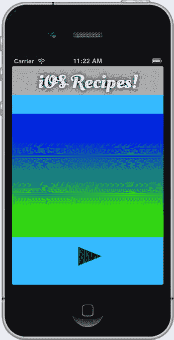

图 12-13. 应用了渐变的自定义视图

当然，这会覆盖我们在前面配方中添加的所有其他元素。不过别担心，我们将在下一个配方中解决这个问题。


## 配方 12-6：将绘制内容裁剪到蒙版

在上一配方的结尾，我们让渐变覆盖了本章早期配方中的其他图形。如果我们能将渐变裁剪成一小部分，以便看到渐变背后的大部分内容，效果会更好。裁剪到蒙版很像创建一个窗口，通过这个窗口我们可以看到背后绘制内容的一部分。此处的蒙版就是窗口形状，然后我们将裁剪掉周围的所有内容。我们可以选择将蒙版做成任何想要的形状，但在这个示例中，我们将通过创建一个名为`drawEllipseWithGradient`的新方法，并从`drawRect:`方法中调用它，来创建一个小圆形。这样得到的结果是渐变完全包含在圆形内部。

使用绘制内容创建蒙版，或利用绘制内容创建窗口，需要以下步骤：

-   创建一个图像上下文。
-   创建一个新的图形上下文。
-   进行平移并上下翻转上下文，以补偿 Quartz 颠倒的坐标系。
-   绘制我们想要用作蒙版的形状。
-   从我们的新图像上下文绘制中创建一个位图。
-   使用该位图开始进行蒙版操作。
-   绘制任何你想要蒙版的内容，此处为一个渐变。

我们首先创建一个新方法`drawEllipseWithGradient`，它接受一个`CGContextRef`作为输入，并使用我们列出的步骤创建一个包含渐变的圆形。代码清单 12-10 展示了该方法的实现。

代码清单 12-10 完全实现了我们所说的内容：我们创建了一个宽 100 点、高 100 点的圆形，位于配方 12-1 中那个大白色圆形的中心。我们必须进行平移和缩放图像的原因是，Quartz 使用的坐标系以屏幕左下角为参考点，而不是左上角。这在混合坐标系时显然会导致问题。如果用户从 3.5 英寸屏幕切换到 4 英寸屏幕，圆形的垂直位置会向下移动。为了解决这个问题，我们进行平移和缩放，以使坐标系匹配。

**代码清单 12-10.** `drawEllipseWithGradient:` 方法的实现

```
-(void)drawEllipseWithGradient:(CGContextRef)context{
    CGContextSaveGState(context);
    //UIGraphicsBeginImageContextWith(self.frame.size);
    UIGraphicsBeginImageContextWithOptions((self.frame.size), NO, 0.0);
    CGContextRef newContext = UIGraphicsGetCurrentContext();
    // 平移并缩放图像，以补偿 Quartz 颠倒的坐标系
    CGContextTranslateCTM(newContext,0.0,self.frame.size.height);
    CGContextScaleCTM(newContext, 1.0, -1.0);
    //设置当前上下文的颜色
    [[UIColor blackColor] set];
    //绘制椭圆 <- 我知道我们在画圆形，但圆形只是特殊的椭圆。
    CGRect ellipseRect = CGRectMake(110.0f, 200.0f, 100.0f, 100.0f);
    CGContextFillEllipseInRect(newContext, ellipseRect);
    CGImageRef mask = CGBitmapContextCreateImage(UIGraphicsGetCurrentContext());
    UIGraphicsEndImageContext();
    CGContextClipToMask(context, self.bounds, mask);
    [self drawGradient:context];
    CGContextRestoreGState(context);
}
```

像往常一样，我们希望从`drawRect:`方法中调用代码清单 12-10 中创建的新方法，如代码清单 12-11 所示。你可能会注意到，我们移除了之前对`drawGradient`的调用，并替换为新的函数调用`drawEllipseWithGradient`。这是因为我们现在是在`drawEllipseWithGradient`方法内部调用`drawGradient:`方法。

**代码清单 12-11.** 移除 `drawGradient:` 方法调用并替换为 `drawEllipseWithGradient:` 调用

```
- (void)drawRect:(CGRect)rect
{
    CGContextRef context = UIGraphicsGetCurrentContext();
    //调用函数绘制矩形
    [self drawRectangleAtTopOfScreen:context];
    //调用函数绘制圆形
    [self drawEllipse:context];
    //调用函数绘制三角形
    [self drawTriangle:context];
    //调用函数绘制弧线
    [self drawArc:context];
    //调用函数绘制文本
    [self drawTextAtTopOfScreen:context];
    //调用函数绘制填充渐变的椭圆
    [self drawEllipseWithGradient:context];
}
```

如果构建并运行你的应用程序，你应该会看到在大圆形的中间出现一个漂亮的圆形渐变。

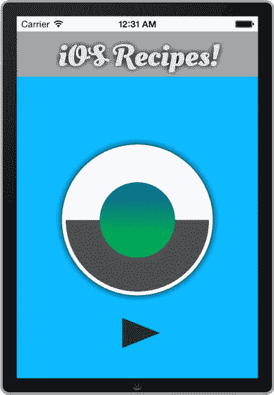

**图 12-14.** 包含一个渐变圆形的完成版自定义视图


## 食谱 12-7：编程屏幕截图

正如你可以将绘图和图像放入图形上下文中一样，你也可以轻松地将它们从上下文中取出。通过使用 `UIGraphicsGetImageFromCurrentImageContext()` 函数即可实现。该函数允许你从当前绘图的集合中创建一个副本，并将其复制到一个图像对象中。在食谱 12-1 到 12-6 中，我们在上下文中创建了几个绘图。本食谱将利用这些绘图集合。

我们将以前文的食谱为基础，增加一项功能：每当用户摇动设备时，就为当前视图拍摄快照。该功能会将快照显示在屏幕的右下角，在后续的摇动中形成漂亮的**双重镜像**效果。

首先，在 `GraphicsRecipesView` 类中添加一个属性来保存最新的快照。打开 `GraphicsRecipesView.h` 并添加声明，如代码清单 12-12 所示。

**代码清单 12-12.** 在 `GraphicsRecipesView.h` 文件中创建一个 `UIImage` 属性

```
//
//  GraphicsRecipesView.h
//  Recipe 12-7 Programming Screenshots
//

#import <UIKit/UIKit.h>

@interface GraphicsRecipesView : UIView

@property (strong, nonatomic)UIImage *image;

@end
```

接下来，选择 `Main.storyboard` 文件，使用 Interface Builder 编辑视图控制器。打开助理编辑器，通过按住 Ctrl 键从自定义视图拖出一条蓝线到 `ViewController.h` 文件，为该自定义视图创建一个插座变量。将该插座变量命名为 `myView`。为了使插座变量的声明能够编译通过，你需要导入 `GraphicsRecipesView.h`，如代码清单 12-13 所示。

**代码清单 12-13.** 在 `ViewController.h` 文件中包含 import 语句

```
//
//  ViewController.h
//  Recipe 12-7 Programming Screenshots
//

#import <UIKit/UIKit.h>
#import "GraphicsRecipesView.h"

@interface ViewController : UIViewController

@property (weak, nonatomic) IBOutlet GraphicsRecipesView *myView;

@end
```

现在，添加代码，在 `GraphicsRecipesView.m` 的 `drawRect:` 方法中绘制快照，如代码清单 12-14 所示。

**代码清单 12-14.** 在 `drawRect:` 方法中添加绘制快照的代码

```
- (void)drawRect:(CGRect)rect
{
    // ...
    
    if (self.image)
    {
        CGFloat imageWidth = self.frame.size.width / 2;
        CGFloat imageHeight = self.frame.size.height / 2;
        CGRect imageRect = CGRectMake(imageWidth, imageHeight, imageWidth, imageHeight);
        
        [self.image drawInRect:imageRect];
    }
}

@end
```

下一步，将代码清单 12-15 中的方法添加到视图控制器。这些方法实现了触发屏幕截图的摇动识别功能。

**代码清单 12-15.** 向 `ViewController.m` 添加处理摇动识别的方法

```
//
//  ViewController.m
//  Recipe 12-7 Programming Screenshots
//

#import "ViewController.h"

@implementation ViewController

// ...

- (BOOL) canBecomeFirstResponder
{
    return YES;
}

- (void) viewWillAppear: (BOOL)animated
{
    [self.view becomeFirstResponder];
    [super viewWillAppear:animated];
}

- (void) viewWillDisappear: (BOOL)animated
{
    [self.view resignFirstResponder];
    [super viewWillDisappear:animated];
}

- (void) motionEnded: (UIEventSubtype)motion withEvent: (UIEvent *)event
{
    if (event.subtype == UIEventSubtypeMotionShake)
    {
        // 设备被摇动了
        // TODO: 拍摄屏幕截图
    }
}

@end
```

你需要导入 `QuartzCore` 框架。如果未导入，稍后在访问视图图层以绘制屏幕截图时，编译器会报错。因此，再次打开 `ViewController.h`，并添加代码清单 12-16 所示的代码。

**代码清单 12-16.** 导入 `QuartzCore` 框架

```
//
//  ViewController.h
//  Recipe 12-7 Programming Screenshots
//

#import <UIKit/UIKit.h>
#import <QuartzCore/QuartzCore.h>
#import "GraphicsRecipesView.h"

@interface ViewController : UIViewController

@property (weak, nonatomic) IBOutlet MyView *myView;

@end
```

最后，实现拍摄快照并将其设置到图像视图的代码，如代码清单 12-17 所示。请注意，`UIView` 类中的 `setNeedsDisplay` 方法会指示视图重新调用其 `drawRect:` 方法，以纳入最近的更改。

**代码清单 12-17.** 实现 `motionEnded: withEvent:` 方法

```
- (void) motionEnded: (UIEventSubtype)motion withEvent: (UIEvent *)event
{
    if (event.subtype == UIEventSubtypeMotionShake)
    {
        // 设备被摇动了
        // 获取当前图层的图像
        UIGraphicsBeginImageContext(self.view.bounds.size);
        CGContextRef context = UIGraphicsGetCurrentContext();
        [self.view.layer renderInContext:context];
        UIImage *image = UIGraphicsGetImageFromCurrentImageContext();
        UIGraphicsEndImageContext();
        
        self.myView.image = image;
        [self.myView setNeedsDisplay];
    }
}
```

再次测试应用程序后，当你摇动设备几次时，应该会看到类似于图 12-15 的屏幕。

**注意：** 如果你在 iOS 模拟器中运行应用程序，可以通过按下 `Ctrl + Cmd + Z` 来模拟摇动。

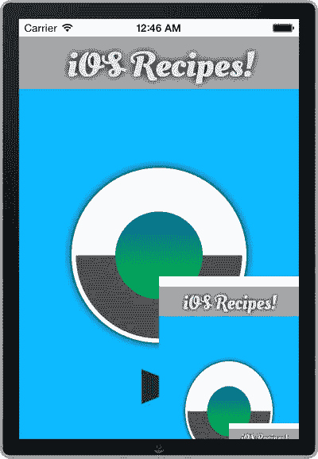

**图 12-15.** 一个应用程序，显示了一个已经显示了屏幕截图的屏幕的屏幕截图

## 总结

在本章中，你已经了解了使用 Core Graphics 创建形状、渐变和字体的大部分方法。不难想象，这些技术在创建自定义 UI 控件或动态生成其他类型的反馈时是多么有用。在本章中，我们仅仅触及了 Core Graphics 可能性的皮毛。作为开发者，你需要以此为基础，去创建令人惊叹的自定义界面。

