# 配方 13-1\. 使用 UIKit 进行视图动画

在 iOS 中，你可以使用 Core Animation 框架和 UIKit 动画框架来实现动画效果。UIKit 动画框架基于 Core Animation 框架构建，提供了一系列 API，让你能够对所有类型的视图对象执行高级动画。在本配方中，我们将重点介绍 UIKit 动画框架及其基本任务，例如移动、旋转和缩放对象。

首先，创建一个新的单视图应用程序。开始时，你将创建一个简单的动画，让一个球从屏幕顶部移动到屏幕中央。你可以从 Apress 网站上本书的下载页面下载球的图像 (`Ball.png`)。通过将球图像从 Finder 拖入资源文件夹，将其添加到你的项目中。

在 `ViewController.h` 文件中创建一个新的输出口。你不需要建立任何界面连接，因为将以编程方式创建球图像。清单 13-1 展示了该属性的添加。

**清单 13-1.** 向 ViewController.h 文件添加 UIImageView

```
//
//  ViewController.h
//  Recipe 13-1 View Animation Using UIKit
//

#import <UIKit/UIKit.h>

@interface ViewController : UIViewController

@property (strong, nonatomic) UIImageView *blueBall;

@end
```

现在，转到 `viewController.m` 文件并修改 `viewDidLoad` 方法。清单 13-2 中以粗体显示的第一段代码，将是创建球图像和定义起始点所必需的。

**清单 13-2.** 修改 viewDidLoad 方法，初始化球图像并设置其起始点

```
- (void)viewDidLoad
{
    [super viewDidLoad];
    //创建球图像并添加到视图
    UIImage *blueBallImage = [[UIImage alloc] init];
    blueBallImage = [UIImage imageNamed:@"Ball"];
    self.blueBall = [[UIImageView alloc] initWithImage:blueBallImage];
    self.blueBall.frame = CGRectMake(self.view.frame.size.width/2-32.0f,
                                     20.0f,
                                     64.0f,
                                     64.0f);
    [self.view addSubview:self.blueBall];
}
```

此时，你可以运行应用程序；应该会在屏幕顶部看到一个球，如图 13-1 所示。

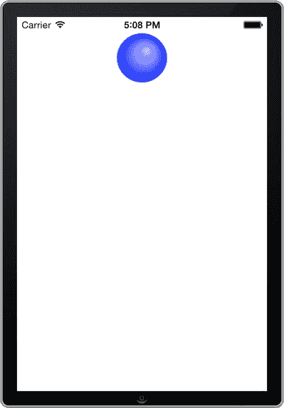

**图 13-1.** 显示蓝色球图像的应用程序

这里你可以看到，你已经创建了一个图像，并将其设置在屏幕顶部中间，大小为 64 x 64 点。接下来，你需要创建动画。有两种方法可以实现，但最佳方法是使用 block 方式。早在 iOS 4 中，Apple 就引入了 block 方式，你即将看到。在 block 方式出现之前，动画的每一步都需要分解成单独的代码行。block 方式是执行动画的一种更简洁的方法，因为它使用了更少的代码，并且更易于阅读。除非你的应用程序目标平台是 iOS 3.2 及更早版本，否则无需学习非 block 方式。

首先，你将添加 `animateWithDuration` 方法调用，如清单 13-3 中的粗体所示。在此代码中，你设置了一个持续三秒的动画。当动画完成时，它会在控制台打印“Animation Finished”。

**清单 13-3.** 设置 animateWithDuration: 方法调用

```
- (void)viewDidLoad
{
    [super viewDidLoad];
    //创建球图像并添加到视图
    UIImage *blueBallImage = [[UIImage alloc] init];
    blueBallImage = [UIImage imageNamed:@"Ball"];
    self.blueBall = [[UIImageView alloc] initWithImage:blueBallImage];
    self.blueBall.frame = CGRectMake(self.view.frame.size.width/2-32.0f,
                                     20.0f,
                                     64.0f,
                                     64.0f);
    [self.view addSubview:self.blueBall];

    [UIView animateWithDuration:3.0f
                     animations:^{
                         //在此处开始动画
                     }
                     completion:^(BOOL finished) {
                         NSLog(@"Animation Finished");
                     }];
}
```

接下来，你将补全动画代码。清单 13-4 中以粗体显示的代码设置了动画完成后球的新位置，就在屏幕正中央。

**清单 13-4.** 修改 viewDidLoad 方法，为球动画添加终点

```
- (void)viewDidLoad
{
    [super viewDidLoad];
    //...

    [UIView animateWithDuration:3.0f
                     animations:^{
                         self.blueBall.frame = CGRectMake(self.view.frame.size.width/2-32.0f,
                                                          self.view.frame.size.height/2 -32.0f,
                                                          64.0f,
                                                          64.0f);
                     }
                     completion:^(BOOL finished) {
                         NSLog(@"Animation Finished");
                     }];
    //...
}
```

如果你运行应用程序，将会看到蓝色球从屏幕顶部移动到屏幕中央，如图 13-2 所示。

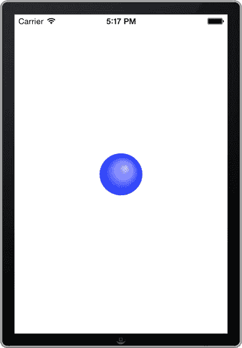

**图 13-2.** 球动画到达最终位置的应用程序

这就是从一个点到另一个点的简单动画！现在，让我们通过在动画开始时更改球图像的大小和**alpha**值来增加一点复杂性。更改 alpha 值将使动画逐渐变得不那么透明。

### 更改大小和透明度

使用 UIKit 动画时，更改大小和透明度很容易。在本节中，你将创建一个效果，使球从无到有逐渐显现，同时在到达视图中央之前逐渐变大。为此，修改 `viewDidLoad` 方法，如清单 13-5 所示。

**清单 13-5.** 修改 viewDidLoad 方法以创建渐变放大、淡入的图像效果

```
- (void)viewDidLoad
{
    [super viewDidLoad];
    //创建球图像并添加到视图
    UIImage *blueBallImage = [[UIImage alloc] init];
    blueBallImage = [UIImage imageNamed:@"Ball"];
    self.blueBall = [[UIImageView alloc] initWithImage:blueBallImage];
    self.blueBall.frame = CGRectMake(self.view.frame.size.width/2-5,
                                     20.0f,
                                     10.0f,
                                     10.0f);
    self.blueBall.alpha = 0.0f;
    [self.view addSubview:self.blueBall];

    [UIView animateWithDuration:3.0f
                     animations:^{
                         self.blueBall.frame = CGRectMake(self.view.frame.size.width/2-32.0f,
                                                          self.view.frame.size.height/2 -32.0f,
                                                          64.0f,
                                                          64.0f);
                         self.blueBall.alpha = 1.0f;
                     }
                     completion:^(BOOL finished) {
                         NSLog(@"Animation Finished");
                     }];
}
```

这里，你只是通过调整 frame 更改了球图像的大小。你还需要从视图宽度的一半减去 5 而不是 32，以便球在顶部居中。然后，你将初始球图像位置的 alpha 值设置为 0，并在球图像到达其目标位置时将其恢复为 100%。

如果运行应用程序，你将看到图像从屏幕顶部淡入并向屏幕中央移动，同时逐渐变大。


### 处理旋转与链式动画

现在你已经实现了移动、淡入和尺寸变化，接下来让我们通过添加旋转动画来完善这个示例。你希望新动画在第一个动画完成后触发。当第一个动画执行完毕，小球移动到屏幕中央后，你将让它旋转 180 度。

首先，在 `ViewController.m` 文件中创建一个新方法，如代码清单 13-6 所示。你将像之前一样使用 `animateWithDuration` 方法。

**代码清单 13-6.** 实现 `startRotationOfBall` 方法（尚未添加动画）

```
-(void)startRotationOfBall
{
    [UIView animateWithDuration:1.5f
                     animations:^{
                         //在这里实现旋转代码
                     }
                     completion:^(BOOL finished) {
                         NSLog(@"旋转完成");
                     }];
}
```

现在让我们在动画块中添加旋转效果。在代码清单 13-7 中，你使用 `CGAffineTransformMakeRotation` 函数创建了一个变换。你可能注意到这里使用了常量 `M_PI`，即 3.14 弧度，相当于 180 度。将 `M_PI` 的值设为负值可以改变旋转方向。正值表示逆时针旋转，负值表示顺时针旋转。

**代码清单 13-7.** 完成小球旋转动画方法

```
-(void)startRotationOfBall
{
    [UIView animateWithDuration:1.5f
                     animations:^{
                         self.blueBall.transform = CGAffineTransformMakeRotation(M_PI);
                     }
                     completion:^(BOOL finished) {
                         NSLog(@"旋转完成");
                     }];
}
```

最后要做的是在第一个动画的完成块中调用这个新方法。如代码清单 13-8 所示，这是一个简单的单行调用。

**代码清单 13-8.** 修改第一个 `animateWithDuration:` 方法的完成块以实现旋转

```
- (void)viewDidLoad
{
//...
    [UIView animateWithDuration:3.0f
                     animations:^{
                         self.blueBall.frame = CGRectMake(self.view.frame.size.width/2-32.0f,
                                                          self.view.frame.size.height/2 -32.0f,
                                                          64.0f,
                                                          64.0f);
                         self.blueBall.alpha = 1.0f;
                     }
                     completion:^(BOOL finished) {
                         NSLog(@"动画完成");
                           [self startRotationOfBall];
                     }];
}
```

就是这样！如果你运行应用程序，将看到第一个动画完成，然后小球会逆时针旋转 180 度。当动画全部完成后，你的应用应该如图 13-3 所示。

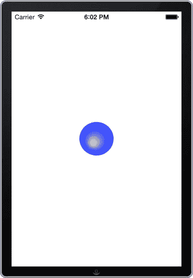
**图 13-3.** 完成旋转效果的应用

在下一个示例中，我们将使用 UIKit Dynamics 创建更逼真、更有趣的动画。

## 示例 13-2. 实现 UIKit Dynamics

UIKit Dynamics 是 iOS 7 中的一个新框架，它让开发者能够为动画添加真实世界的运动效果。这些运动包括重力、弹跳、碰撞，甚至摩擦力等细微效果。

在本示例中，我们将展示许多可以使用 UIKit Dynamics 创建的动态效果，以及如何组合多种效果。在本示例接近尾声时，你将学习如何创建自定义行为类，从而将多个自定义行为打包，并轻松地将效果添加到视图组件上。

### 使用重力

首先，创建一个单视图应用程序，并将其命名为"示例 13-2 实现 UIKit Dynamics"。这次，在类前缀字段中填写 Gravity，如图 13-4 所示。在本示例中，你将大量使用故事板，因此建议你快速浏览第 2 章以熟悉相关内容。不过不必担心，我们会逐步解释所有必要步骤。

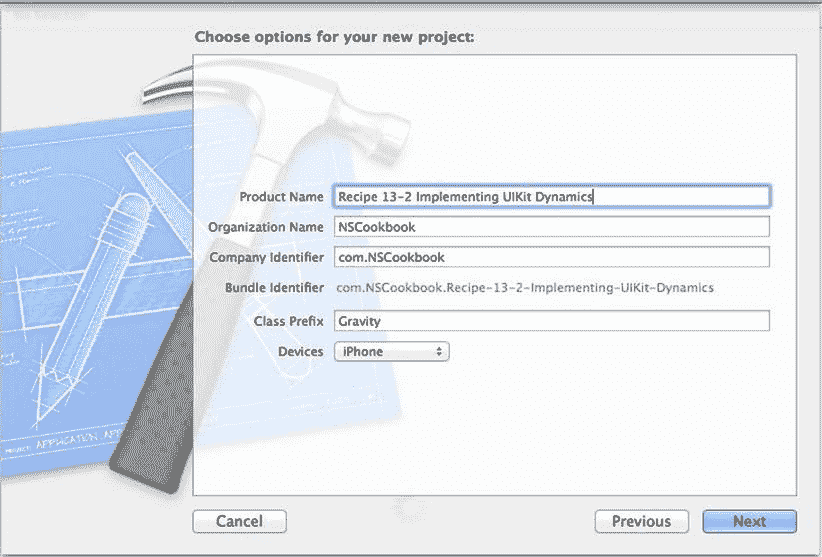
**图 13-4.** 选择应用选项

项目创建完成后，导航到 `Main.storyboard` 文件，将一个表格视图控制器拖到故事板上。选中该表格视图控制器后，从 Xcode 菜单栏中选择 Editor ➤ Embed In ➤ Navigation Controller。你的故事板布局应如图 13-5 所示。

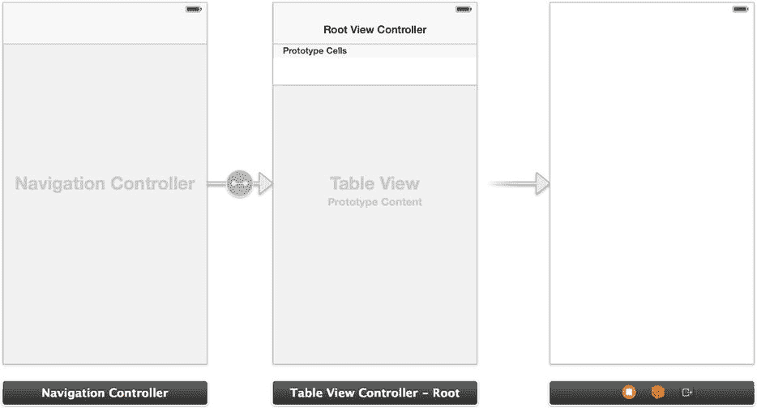
**图 13-5.** 尚未建立连接的导航控制器

接下来，选中表格视图，将内容类型从动态原型更改为静态单元格，如图 13-6 所示。

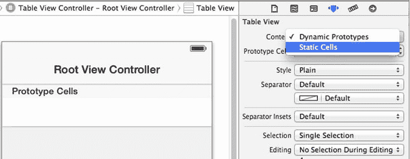
**图 13-6.** 更改表格视图单元格类型

更改为静态单元格后，原型单元格将被替换为三个静态单元格。按住 Control 键并拖动鼠标，从第一个表格视图单元格连接到视图控制器，如图 13-7 所示。当对话框出现时，在 Segue 类型下选择 Push。

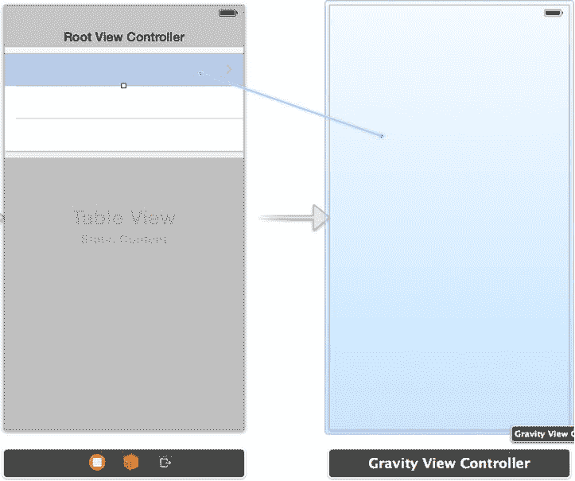
**图 13-7.** 将第一个表格视图单元格连接到重力视图控制器

接下来，点击并拖动仅连接到重力视图控制器的箭头，将其移动到导航控制器的左侧，如图 13-8 所示。

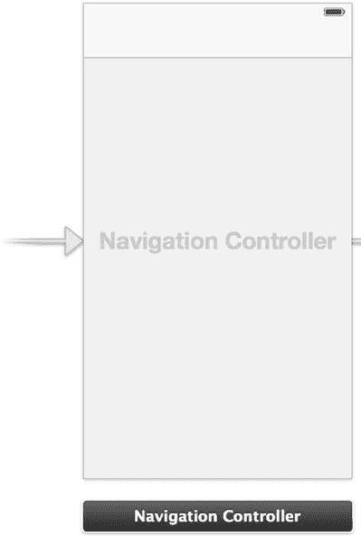
**图 13-8.** 重新定位起始场景箭头

最后，将一个图像视图拖到重力视图控制器上，并将其尺寸改为 64 x 64 点。正如在示例 13-1 中所做的那样，将 `Ball.png` 图像文件拖入项目导航器中的资源文件夹。

接下来，按照示例 13-1 中的方法，将图像视图的图像设置为 `Ball.png`。同时，将视图控制器的标题改为"Gravity"，表格视图控制器的标题改为"Dynamics Playground"。完成后，你的故事板应如图 13-9 所示。另外，你还需要在选中单元格的情况下，从属性检查器中将表格视图单元格的样式从"Custom"改为"Basic"，这样才能编辑标题。

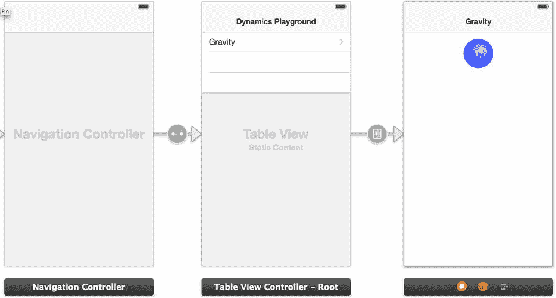
**图 13-9.** 完整的界面

现在，如果你运行应用程序，可以点击重力表格视图单元格，它就会带你去到带有小球的重力视图控制器。当然，目前小球还不会有任何动作，但你已经为本示例的后续部分建立了一个良好的框架。

现在我们来实现重力行为。从蓝色小球创建一个出口连接到 `GravityViewController.h` 文件。将这个新出口命名为 `"blueBall"`。同时，在头文件中添加一个名为 `"animator"` 的 `UIDynamicAnimator` 属性。完成后，你的 `GravityViewController.h` 文件应包含一个出口和一个属性，如代码清单 13-9 所示。

**代码清单 13-9.** 初始 `ViewController.h` 文件

```
//
//  GravityViewController.h
//  Recipe 13-2 Implementing UIKit Dynamics
//

#import <UIKit/UIKit.h>

@interface GravityViewController : UIViewController

@property (weak, nonatomic) IBOutlet UIImageView *blueBall;
@property (nonatomic) UIDynamicAnimator *animator;

@end
```


好的，作为一名高级文档工程师和翻译员，我将严格遵循您的格式要求，将给定的英文文本翻译成中文。


现在你可以切换到`GravityViewController.m`文件，开始编辑`viewDidLoad`方法，如代码清单 13-10 所示。在本部分操作中，你将在视图加载时为球体添加重力效果。这将使球体向屏幕底部加速，并最终掉落出屏幕。

**代码清单 13-10** 修改`viewDidLoad`方法以创建重力行为

```objective-c
- (void)viewDidLoad
{
    [super viewDidLoad];
    // Do any additional setup after loading the view, typically from a nib.
    self.animator = [[UIDynamicAnimator alloc] initWithReferenceView:self.view];
    UIGravityBehavior *gravityBehavior = [[UIGravityBehavior alloc] initWithItems:@[self.blueBall]];
    [self.animator addBehavior:gravityBehavior];
}
```

在代码清单 13-10 中，你只需要分配并初始化动画器（`animator`），使用当前视图并创建重力行为。然后将该行为添加到动画器中。如果加载应用程序并从表视图选择“Gravity”，球体将在视图加载后下落并掉出屏幕。

### 重力与碰撞

现在，你将在之前示例的基础上，让球体与视图边界发生碰撞。构建步骤如下：

1.  在故事板上拖入一个新的视图控制器。
2.  与第一个视图控制器相同，从第二个表视图单元格按住 Control 键拖拽到新的视图控制器，并创建一个推送选择转场（Push Selection Segue）。
3.  创建一个新的图像视图，尺寸为 64 点×64 点，并将其图像设置为“Ball.png”。
4.  将表视图标题更新为“Gravity with Collision”，并为新的视图控制器赋予相同的标题。

完成这些步骤后，你的故事板场景应如图 13-10 所示。

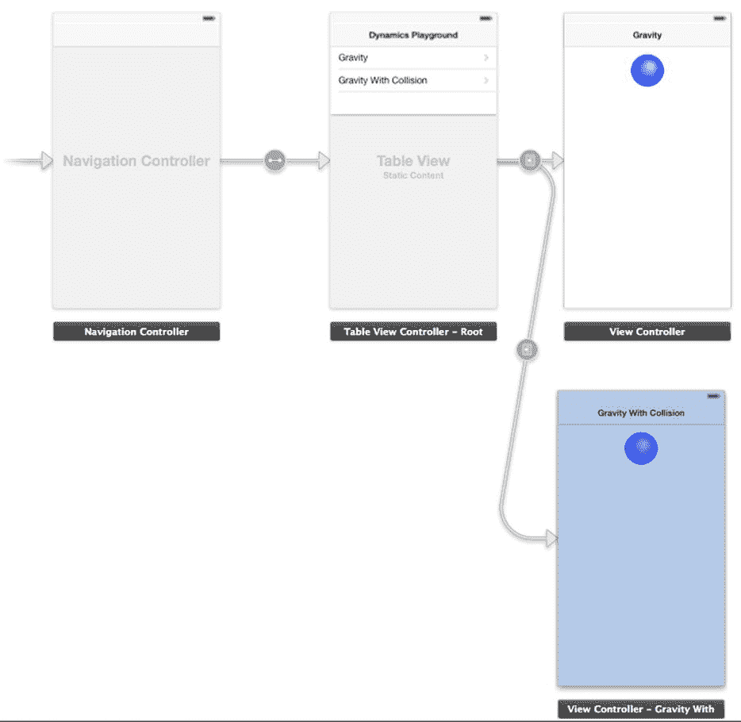

**图 13-10** 创建带转场的新视图控制器

由于你在故事板上创建了新的视图控制器，你还需要创建一个带有`UIViewController`子类的新类。将新类命名为`GravityWithCollisionViewController`，并确保未选中“With XIB for interface”复选框。

接下来，你需要将新的`GravityWithCollisionViewController`类关联到新的视图控制器。通过选中视图，并在身份检查器（Identity Inspector）中选择该类来完成操作，如图 13-11 所示。

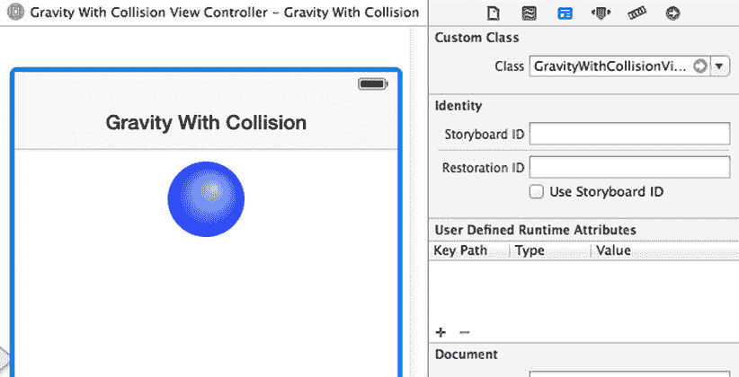

**图 13-11** 在故事板中设置视图控制器类

现在可以添加一些代码了。首先，像在`GravityViewController`类中那样，为蓝色球体创建一个插座（Outlet），并为动画器创建一个属性。代码清单 13-11 显示了这些更改。

**代码清单 13-11** 完成的`GravityWithCollisionViewController.h`文件

```objective-c
//
//  GravityWithCollisionViewController.h
//  Recipe 13-2 Implementing UIKit Dynamics
//

#import <UIKit/UIKit.h>

@interface GravityWithCollisionViewController : UIViewController

@property (weak, nonatomic) IBOutlet UIImageView *blueBall;
@property (nonatomic) UIDynamicAnimator *animator;

@end
```

这一次，`viewDidLoad`方法会略有不同。这段代码构建在之前示例的基础上，并添加了一个新的行为。`viewDidLoad`方法现在应如代码清单 13-12 所示。

**代码清单 13-12** 完成的`GravityWithCollisionViewController`的`viewDidLoad`方法

```objective-c
- (void)viewDidLoad
{
    [super viewDidLoad];
    // Do any additional setup after loading the view, typically from a nib.

    self.animator = [[UIDynamicAnimator alloc] initWithReferenceView:self.view];

    UIGravityBehavior *gravityBehavior = [[UIGravityBehavior alloc] initWithItems:@[self.blueBall]];
    UICollisionBehavior *collisionBehavior = [[UICollisionBehavior alloc] initWithItems:@[self.blueBall]];
    collisionBehavior.translatesReferenceBoundsIntoBoundary = YES;

    [self.animator addBehavior:gravityBehavior];
    [self.animator addBehavior:collisionBehavior];
}
```

在代码清单 13-12 中，你正在创建一个新的碰撞行为。通过将`translatesReferenceBoundsIntoBoundary`属性设置为`YES`，球体将与视图的边界发生碰撞。最后，将新行为添加到动画器中。

如果运行应用程序并选择“Gravity with Collision”表格单元格，球体将下落并撞击底部边界，弹起后最终稳定在某个位置，如图 13-12 所示。

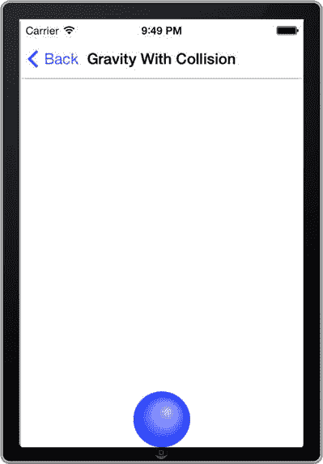

**图 13-12** 球体稳定后的碰撞效果

这很好，但如果你想在球体开始碰撞或结束碰撞时得到通知呢？幸运的是，iOS 7 也提供了处理此问题的工具。在此示例中，你将修改代码，使球体在弹跳时变为半透明。更具体地说，球体将撞击框架底部并弹起。弹跳后，只要球体不与框架底部接触，它就会变为透明。

为此，你需要在`GravityWithCollisionViewController.h`文件中声明`UICollisionBehaviorDelegate`，如代码清单 13-13 所示。

**代码清单 13-13** 声明`UICollisionBehaviorDelegate`

```objective-c
//
//  GravityWithCollisionViewController.h
//  Recipe 13-2 Implementing UIKit Dynamics
//

#import <UIKit/UIKit.h>

@interface GravityWithCollisionViewController : UIViewController <UICollisionBehaviorDelegate>

@property (weak, nonatomic) IBOutlet UIImageView *blueBall;
@property (nonatomic) UIDynamicAnimator *animator;

@end
```

接下来，你需要设置碰撞委托。为此，修改`viewDidLoad`方法，如代码清单 13-14 所示。

**代码清单 13-14** 设置`UICollisionBehaviorDelegate`

```objective-c
- (void)viewDidLoad
{
    [super viewDidLoad];

    self.animator = [[UIDynamicAnimator alloc] initWithReferenceView:self.view];

    UIGravityBehavior *gravityBehavior = [[UIGravityBehavior alloc] initWithItems:@[self.blueBall]];
    UICollisionBehavior *collisionBehavior = [[UICollisionBehavior alloc] initWithItems:@[self.blueBall]];
    collisionBehavior.translatesReferenceBoundsIntoBoundary = YES;
    collisionBehavior.collisionDelegate = self;

    [self.animator addBehavior:gravityBehavior];
    [self.animator addBehavior:collisionBehavior];
}
```

代码清单 13-15 显示了需要添加的必要委托方法。第一个方法在球体与边界接触时将蓝色球体的透明度设置为 100%。第二个方法在碰撞发生后立即将蓝色球体的透明度设置为 50%。如前所述，最终效果是：在第一次弹跳之后，只要球体未接触边界，它就会保持半透明。

**代码清单 13-15** 实现两个碰撞行为委托方法

```objective-c
-(void)collisionBehavior:(UICollisionBehavior *)behavior beganContactForItem:(id<UIDynamicItem>)item withBoundaryIdentifier:(id<NSCopying>)identifier atPoint:(CGPoint)p
{
    [self.blueBall setAlpha:1.0f];
}

-(void)collisionBehavior:(UICollisionBehavior *)behavior endedContactForItem:(id<UIDynamicItem>)item withBoundaryIdentifier:(id<NSCopying>)identifier
{
    [self.blueBall setAlpha:0.5f];
}
```

现在运行应用程序，选择“Gravity with Collision”，你将看到球体从屏幕顶部下落、弹起并变为半透明，然后不带透明度地稳定在底部。


### 使用项目属性

现在您已经知道如何为视图添加重力和碰撞行为，但如果想要设定球弹跳的高度呢？为此，您可以为球添加一个 `elasticity` 属性。

要创建新的视图控制器，请按照以下步骤操作：

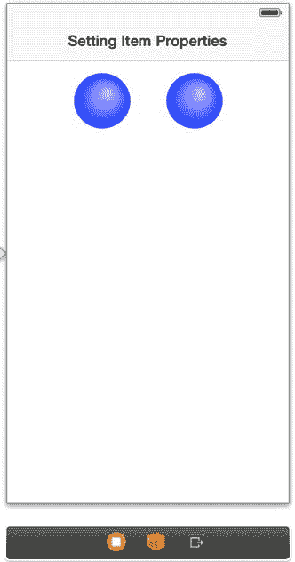

**图 13-13.** 设置项目属性视图控制器

将新的视图控制器拖到故事板上，并通过 push 选择 segue 将其连接到第三个表格视图单元格。这次，在新视图中添加两个球，并按图 13-13 所示放置它们。与 `GravityWithCollisionViewController` 一样，创建一个新的 `UIViewController` 子类，并将其命名为 `ItemPropertyViewController`。为这两个球创建两个新的输出口。左侧球的输出口应命名为 `ball1`，右侧球的输出口应命名为 `ball2`。在头文件中创建一个 `animator` 属性。

完成这些步骤后，您的头文件应类似于代码清单 13-16。

**代码清单 13-16.** 最终的 `ItemPropertyViewController.h` 文件

```
//
//  ItemPropertyViewController.h
//  Recipe 13-2 Implementing UIKit Dynamics
//

#import <UIKit/UIKit.h>

@interface ItemPropertyViewController : UIViewController

@property (weak, nonatomic) IBOutlet UIImageView *ball1;
@property (weak, nonatomic) IBOutlet UIImageView *ball2;
@property (nonatomic) UIDynamicAnimator *animator;

@end
```

现在，您将编辑 `viewDidLoad` 方法，为两个球添加重力和碰撞行为。这次将省略用于检测碰撞的委托，并为两个球添加必要的重力和碰撞行为。这些更改如代码清单 13-17 所示。

**代码清单 13-17.** 设置 `viewDidLoad` 方法，为球添加重力和碰撞行为

```
- (void)viewDidLoad
{
    [super viewDidLoad];

    self.animator = [[UIDynamicAnimator alloc] initWithReferenceView:self.view];

    UIGravityBehavior *gravityBehavior = [[UIGravityBehavior alloc] initWithItems:@[self.ball1,self.ball2]];
    UICollisionBehavior *collisionBehavior = [[UICollisionBehavior alloc] initWithItems:@[self.ball1,self.ball2]];
    collisionBehavior.translatesReferenceBoundsIntoBoundary = YES;

    [self.animator addBehavior:gravityBehavior];
    [self.animator addBehavior:collisionBehavior];
}
```

现在到了有趣的部分。您将向第二个球的行为添加一个属性。实际上，有很多属性可供选择。以下是所有可用的属性：

- `elasticity`：浮点值，设置碰撞弹性；0 表示无弹性，1 表示弹性很好。
- `friction`：浮点值，设置物体之间的摩擦系数；0 表示无摩擦。
- `density`：密度浮点值；默认值为 1。
- `resistance`：浮点值，设置速度阻尼；0 表示无速度阻尼。
- `angularResistance`：角速度阻尼浮点值；0 表示无角速度阻尼。
- `allowsRotation`：布尔值，设置物体是否旋转锁定。

在本例中，我们将为第二个球的图像设置 `elasticity` 属性，如代码清单 13-18 所示，这将使其在与底部边界碰撞时弹跳得更高。

**代码清单 13-18.** 设置第二个球的行为属性

```
- (void)viewDidLoad
//
//  ItemPropertyViewController.m
//  Recipe 13-2 Implementing UIKit Dynamics
//
{
    [super viewDidLoad];

    self.animator = [[UIDynamicAnimator alloc] initWithReferenceView:self.view];

    UIGravityBehavior *gravityBehavior = [[UIGravityBehavior alloc] initWithItems:@[self.ball1,self.ball2]];
    UICollisionBehavior *collisionBehavior = [[UICollisionBehavior alloc] initWithItems:@[self.ball1,self.ball2]];
    UIDynamicItemBehavior* propertiesBehavior = [[UIDynamicItemBehavior alloc] initWithItems:@[self.ball2]];
    propertiesBehavior.elasticity = 0.75f;
    collisionBehavior.translatesReferenceBoundsIntoBoundary = YES;

    [self.animator addBehavior:propertiesBehavior];
    [self.animator addBehavior:gravityBehavior];
    [self.animator addBehavior:collisionBehavior];
}
```

如果现在运行应用，您会注意到两个球会同时下落并碰撞到视图底部。左侧的球只会弹跳一次，但右侧的球会弹跳多次，且弹跳得更高。

我们鼓励您以多种方式重新排列球的位置，并更改行为。例如，如果添加 `resistance` 属性，球将抵抗重力，加速度会变慢。


### 添加吸附（Snap）行为

现在我们来探索一种行为，它能让一个物体吸附到视图上的某个点。视图上的这个点将通过触摸手势定义，而此处的物体就是小球。吸附行为有点类似于磁力行为。无论你触摸屏幕上的哪个位置，小球都会像被磁力吸引一样飞向那个位置。

按照惯例，请遵循以下步骤来创建一个新的视图控制器：

- 将一个视图控制器拖到故事板上，并为其附上一个名为 `SnapViewController` 的关联类。
- 添加一个小球图像视图，并为其创建一个名为 `"blueBall"` 的插座变量（outlet）。
- 像之前一样，在头文件中添加一个 `UIDynamicAnimator` 属性。
- 由于我们已超出表格视图提供的单元格数量，你需要从对象库中拖拽一个新的单元格到表格视图上。
- 当新单元格创建后，在其与新的视图控制器之间建立推送选择转场（push selection segue）连接。

至此，你的故事板应该与图 13-14 类似。

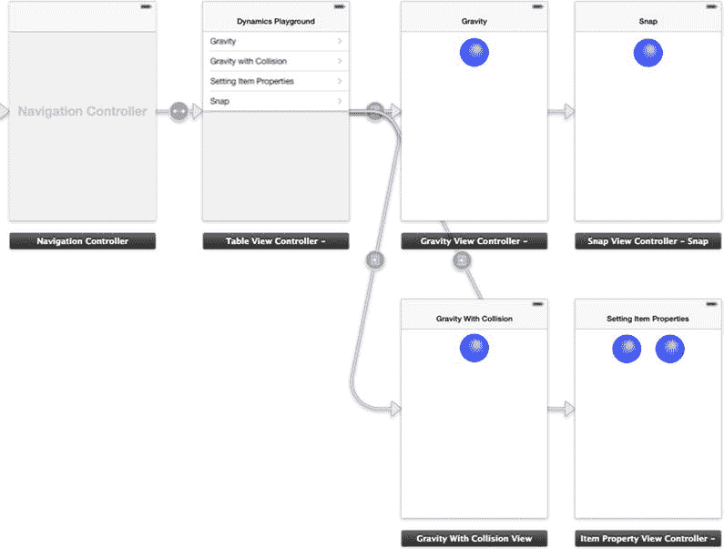

图 13-14. 添加了吸附视图控制器的完整故事板

接下来，你需要在吸附视图控制器中添加一个点击手势识别器（tap gesture recognizer），这是一个用于识别触摸事件的属性。操作方法是从对象库中拖拽一个点击手势识别器到故事板上的新视图控制器中。操作正确后，你会在视图控制器底部看到一个手势识别器图标，如图 13-15 所示。

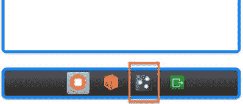

图 13-15. 显示已添加手势识别器的图标

现在你需要为这个新添加的手势识别器创建一个操作（action）。为此，按住 Control 键从图 13-15 所示的手势图标拖拽到图 13-16 所示的 `SnapViewController.h` 文件中。你可以将该操作命名为 `handleGestureRecognizer`。确保将操作类型选择为 `UITapGestureRecognizer` 而不是 `id`。

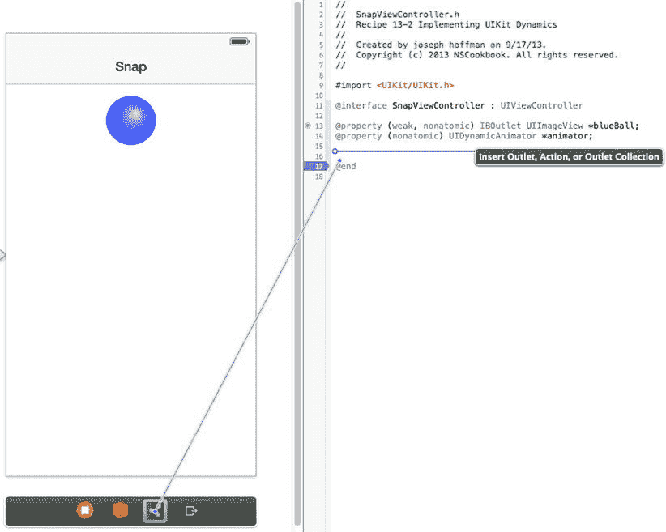

图 13-16. 添加手势操作

现在，你完整的 `SnapViewController.h` 文件应包含两个属性和一个手势操作，如列表 13-19 所示。

**列表 13-19.** 完整的 `SnapViewController.h` 文件

```
//
//  SnapViewController.h
//  Recipe 13-2 Implementing UIKit Dynamics
//

#import <UIKit/UIKit.h>

@interface SnapViewController : UIViewController

@property (weak, nonatomic) IBOutlet UIImageView *blueBall;
@property (nonatomic) UIDynamicAnimator *animator;

- (IBAction)handleGestureRecognizer:(UITapGestureRecognizer *)sender;

@end
```

接下来，你需要在 `viewDidLoad` 方法中分配并初始化动画器，如列表 13-20 所示。

**列表 13-20.** 初始化动画器

```
- (void)viewDidLoad
{
    [super viewDidLoad];
    self.animator = [[UIDynamicAnimator alloc] initWithReferenceView:self.view];
}
```

最后，你需要实现 `handleGestureRecognizer` 操作方法，使其在用户触摸屏幕时创建吸附行为。列表 13-21 展示了该方法的实现。

**列表 13-21.** `handleGestureRecognizer:` 操作方法的实现

```
- (IBAction)handleGestureRecognizer:(UITapGestureRecognizer *)sender
{
    CGPoint point = [sender locationInView:self.view];
    if([self.animator behaviors])
    {
        [self.animator removeAllBehaviors];
        UISnapBehavior* snapBehavior = [[UISnapBehavior alloc] initWithItem:self.blueBall snapToPoint:point];
        [self.animator addBehavior:snapBehavior];
    }
    else
    {
        UISnapBehavior* snapBehavior = [[UISnapBehavior alloc] initWithItem:self.blueBall snapToPoint:point];
        [self.animator addBehavior:snapBehavior];
    }
}
```

在列表 13-21 中，你首先设置了一个 `CGPoint` 变量，这是一种包含屏幕坐标的原始数据类型。你将 `CGPoint` 设置为用户触摸的视图位置。然后你检查动画器是否已有行为。如果已有行为，则移除它们并添加新行为。如果是首次触摸，则直接添加新行为。

如果你运行应用程序并导航到吸附视图控制器，你可以触摸视图中的任意位置，就会看到小球飞向你触摸的点。这个行为还会在小球落定点时产生一个漂亮的圆形缓冲效果。


### 创建推动行为

对于接下来的视图控制器，你将同时实现**持续推动行为**和**瞬时推动行为**。持续推动会在推动期间对视图施加一个幅度值。如果你了解物理学，这意味着它会加速，因为你持续向视图添加更多能量。你可以将其想象为汽车加速：车轮持续推动汽车，因此汽车加速。而瞬时推动则更像速度。这类似于台球杆击打主球。一旦主球被球杆击中，球既不会加速也不会（大幅）减速。

在本示例中，我们将分别对两个单独的球图像应用这些行为来进行演示。正如你将看到的，一个球将匀速移动，而另一个球则会逐渐加速。在深入代码之前，我们先简要说明一下这些行为的属性。

推动行为需要两个属性才能工作：

* **幅度**：这是一个浮点值，苹果将其定义为“推动行为力向量的大小”。默认幅度为 `nil`，这意味着对象不会移动。幅度为 `1.0` 将使一个 100 点 x 100 点、密度为 `1.0` 的视图以 100 点/秒² 的加速度移动。因此，在第一秒后，视图将移动 100 点；在第二秒后，它将移动 300 点，以此类推。
* **角度**：这是一个以弧度表示的浮点值。正值表示顺时针方向，负值表示逆时针方向。

现在你已经有了一些背景知识，请按照以下步骤开始操作：

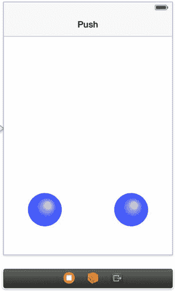

图 13-17. 推动视图控制器布局

创建一个新的视图控制器并将其连接到表格视图。

创建一个名为 `PushViewController` 的新类，并将其连接到该视图控制器。

将表格视图单元格和视图控制器的标题改为“Push”。如有需要，创建一个新的表格视图单元格。

在表格视图单元格和视图控制器之间创建一个“Push”选择跳转。

向视图控制器添加两个 64 点 x 64 点的图像视图，使用图像 `Ball.png`，如图 13-17 所示。

为这两个球添加输出口，分别命名为“`ball1`”和“`ball2`”。

向头文件添加一个动画器属性。

完成这些步骤后，你的头文件应如代码清单 13-22 所示。

**代码清单 13-22.** 完整的 `PushViewController.h` 文件

```
//
//  PushViewController.h
//  Recipe 13-2 Implementing UIKit Dynamics
//

#import <UIKit/UIKit.h>

@interface PushViewController : UIViewController

@property (weak, nonatomic) IBOutlet UIImageView *ball1;
@property (weak, nonatomic) IBOutlet UIImageView *ball2;
@property (nonatomic) UIDynamicAnimator *animator;

@end
```

现在，你将向 `viewDidLoad` 方法中添加代码，以实际创建推动行为。代码清单 13-23 展示了完整的 `viewDidLoad` 方法。在这段代码中，你首先创建了两种行为，每个球对应一种行为。你为每种行为设置了角度和幅度。角度为负值是因为你希望球向上移动，即逆时针方向 90 度。最后，你将这两种行为添加到动画器中。

**代码清单 13-23.** 完整的 `viewDidLoad` 方法

```
- (void)viewDidLoad
{
    [super viewDidLoad];

    self.animator = [[UIDynamicAnimator alloc] initWithReferenceView:self.view];

    UIPushBehavior *instantPushBehavior = [[UIPushBehavior alloc] initWithItems:@[self.ball1] mode:UIPushBehaviorModeInstantaneous];
    UIPushBehavior *continuousPushBehavior = [[UIPushBehavior alloc] initWithItems:@[self.ball2] mode:UIPushBehaviorModeContinuous];

    instantPushBehavior.angle = -1.57;
    continuousPushBehavior.angle = -1.57;

    instantPushBehavior.magnitude = 0.5;
    continuousPushBehavior.magnitude = 0.5;

    [self.animator addBehavior:instantPushBehavior];
    [self.animator addBehavior:continuousPushBehavior];
}
```

现在，如果你构建并在表格视图中选择“Push”，你将看到两个球同时飞出。左边的球速度更大，但不会加速或减速。右边的球开始较慢，但会迅速获得速度。

> **注**：此时你可能会想，在没有密度的情况下球如何加速。默认情况下，动态项目的密度均为 1。


### 弹簧与附着

动力学拼图的最后一块是弹簧与附着。利用附着行为，你可以通过刚性附着或弹簧类附着将两个视图连接起来。UIKit Dynamics 让我们能够选择锚点，既可以指向任意点，也可以指向视图本身。根据附着视图的方式，你可以利用弹簧行为实现一些非常酷的效果。

在本节中，你将把一个球体附着到一个锚点上，然后将一个星形附着到球体上。星形的附着点会稍微偏离中心左侧，这将导致星形旋转。附着将使用弹簧行为，因此它们会来回弹跳。为了增强效果，你还可以实现重力和碰撞行为。

再次按照以下步骤设置一个新的视图控制器：

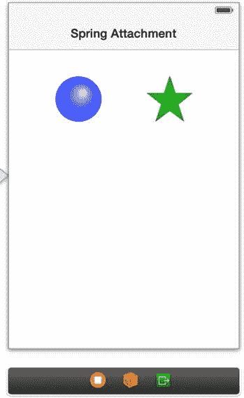

图 13-18. 弹簧附着视图控制器布局

将一个新的视图控制器拖到故事板上，并将其连接到新的表格视图单元格。给新的视图控制器和表格视图单元格命名为“弹簧附着”。在表格视图单元格和视图控制器之间创建一个推送选择转场。添加一个名为 `SpringAttachmentViewController` 的类，并将其连接到视图控制器。按照图 13-18 所示布置新的视图控制器，添加两个 64x64 点的图像视图，并将它们的图像分别设置为 `Ball.png` 和 `Star.png`。你可以从本书的 Apress 下载页面获取星形图像。为图像视图添加输出口，分别命名为“ball”和“star”。创建一个 `animator` 属性。

完成的头文件应如列表 13-24 所示。

**列表 13-24.** 完整的 `SpringAttachmentViewController.h` 文件

```
//
//  SpringAttachmentViewController.h
//  Recipe 13-2 Implementing UIKit Dynamics
//

#import <UIKit/UIKit.h>

@interface SpringAttachmentViewController : UIViewController

@property (weak, nonatomic) IBOutlet UIImageView *ball;
@property (weak, nonatomic) IBOutlet UIImageView *star;
@property (nonatomic) UIDynamicAnimator *animator;

@end
```

首先，你需要在 `viewDidLoad` 方法中初始化 `animator` 并添加重力和碰撞行为，如列表 13-25 所示。

**列表 13-25.** 向球体和星形添加重力和碰撞行为

```
//
//  SpringAttachmentViewController.m
//  Recipe 13-2 Implementing UIKit Dynamics
//

- (void)viewDidLoad
{
    [super viewDidLoad];
    self.animator = [[UIDynamicAnimator alloc] initWithReferenceView:self.view];
    UIGravityBehavior *gravityBehavior = [[UIGravityBehavior alloc] initWithItems:@[self.ball,self.star]];
    UICollisionBehavior *collisionBehavior = [[UICollisionBehavior alloc] initWithItems:@[self.ball,self.star]];
    collisionBehavior.translatesReferenceBoundsIntoBoundary = YES;
    [self.animator addBehavior:collisionBehavior];
    [self.animator addBehavior:gravityBehavior];
}
```

接下来，你需要创建一个锚点。这个锚点位于屏幕中央，距屏幕顶部 20 点。你还需要创建两个附着行为：一个用于球体，一个用于星形。球体直接附着到锚点上。星形附着到球体上。星形还有一个偏移锚点，位于中心左侧 20 点处。如前所述，这个偏移附着会带来漂亮的旋转效果。每个附着都有一个阻尼属性和频率属性。这就是产生弹簧效果的关键。你可以随意调整这些值，稍后观察它们对动画的影响。列表 13-26 展示了添加的行为。

**列表 13-26.** 向球体和星形添加附着和弹簧效果

```
- (void)viewDidLoad
{
    [super viewDidLoad];
    self.animator = [[UIDynamicAnimator alloc] initWithReferenceView:self.view];
    UIGravityBehavior *gravityBehavior = [[UIGravityBehavior alloc] initWithItems:@[self.ball,self.star]];
    UICollisionBehavior *collisionBehavior = [[UICollisionBehavior alloc] initWithItems:@[self.ball,self.star]];
    CGPoint anchorPoint = CGPointMake(self.view.frame.size.width/2, 20);
    UIAttachmentBehavior *ballAttachmentBehavior = [[UIAttachmentBehavior alloc] initWithItem:self.ball attachedToAnchor:anchorPoint];
    UIAttachmentBehavior *starAttachmentBehavior = [[UIAttachmentBehavior alloc] initWithItem:self.star offsetFromCenter:UIOffsetMake(-20.0, 0) attachedToItem:self.ball offsetFromCenter:UIOffsetZero];
    collisionBehavior.translatesReferenceBoundsIntoBoundary = YES;
    [ballAttachmentBehavior setFrequency:1.0];
    [ballAttachmentBehavior setDamping:0.65];
    [starAttachmentBehavior setFrequency:1.0];
    [starAttachmentBehavior setDamping:0.65];
    [self.animator addBehavior:ballAttachmentBehavior];
    [self.animator addBehavior:starAttachmentBehavior];
    [self.animator addBehavior:collisionBehavior];
    [self.animator addBehavior:gravityBehavior];
}
```

构建应用程序后，你会注意到球体和星形会下落并开始弹跳，仿佛被弹簧连接着一样。星形在从球体上垂下时会开始不规律地旋转。当动画静止时，星形会悬挂在球体下方，如图 13-19 所示。

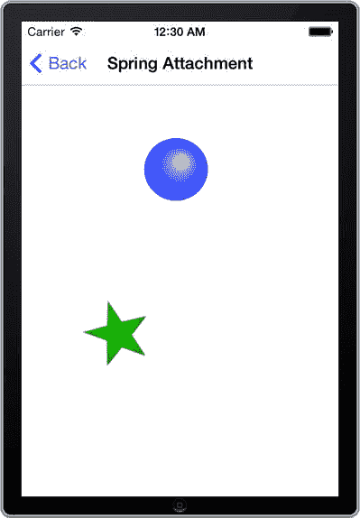

图 13-19. 球体和星形弹跳与旋转

至此，我们已经覆盖了所有新的动力学行为。正如你所见，这里提供了丰富的功能供你使用。接下来，我们将展示如何通过继承 `UIDynamicBehavior` 类来创建自定义行为类。这将使你能够像使用内置行为一样，轻松地向对象添加自定义行为。


### 创建自定义行为类

在结束本食谱之前，我们将简要讨论如何创建自定义行为类。当组合多种行为时，最好的做法是创建一个类来封装所有这些行为。新类通常会有一个描述性的标题，例如 `BouncingCollisionBehavior` 或类似的名称。

作为示例，你将把 `SpringAttachmentViewController` 中的行为组合成一个类。首先，创建一个名为 `BouncingSpringBehavior` 的 `UIDynamicBehavior` 子类。

现在，打开新类的头文件，并为自定义初始化方法创建一个声明。该自定义初始化方法将接收一个动态视图项数组和一个用于存储锚点坐标的字符串。清单 13-27 展示了这个方法的声明。

**清单 13-27.** 在 `BouncingSpringBehavior` 类中声明自定义初始化方法

```
//
//  BouncingSpringBehavior.h
//  Recipe 13-2 Implementing UIKit Dynamics
//

#import <UIKit/UIKit.h>

@interface BouncingSpringBehavior : UIDynamicBehavior

- (instancetype)initWithItems:(NSArray *)items withAnchorPoint:(NSString *)anchorPointString;

@end
```

现在，切换到实现文件，并填写自定义初始化方法的具体实现，如清单 13-28 所示。与之前示例相比有所更改的项已用粗体标出。

**清单 13-28.** `initWithItems:withAnchorPoint:` 初始化方法的实现

```
- (instancetype)initWithItems:(NSArray *)items withAnchorPoint:(NSString *)anchorPointString
{
    if (self = [super init])
    {
        CGPoint anchorPoint = CGPointFromString(anchorPointString);

        UIGravityBehavior *gravityBehavior = [[UIGravityBehavior alloc] initWithItems:items];
        UICollisionBehavior *collisionBehavior = [[UICollisionBehavior alloc] initWithItems:items];
        UIAttachmentBehavior *item1AttachmentBehavior = [[UIAttachmentBehavior alloc] initWithItem:[items objectAtIndex:0] attachedToAnchor:anchorPoint];
        UIAttachmentBehavior *item2AttachmentBehavior = [[UIAttachmentBehavior alloc] initWithItem:[items objectAtIndex:1] offsetFromCenter:UIOffsetMake(-20.0, 0) attachedToItem:[items objectAtIndex:0] offsetFromCenter:UIOffsetZero];

        collisionBehavior.translatesReferenceBoundsIntoBoundary = YES;
        [item1AttachmentBehavior setFrequency:1.0];
        [item2AttachmentBehavior setDamping:0.65];
        [item1AttachmentBehavior setFrequency:1.0];
        [item2AttachmentBehavior setDamping:0.65];

        [self addChildBehavior:gravityBehavior];
        [self addChildBehavior:collisionBehavior];
        [self addChildBehavior:item1AttachmentBehavior];
        [self addChildBehavior:item2AttachmentBehavior];
    }
    return self;
}
```

上述代码看起来应该很熟悉。不同之处在于，现在它位于另一个类的初始化方法中。该初始化方法接收一个字符串作为 `anchorPoint`，而不是 `CGPoint`。这是因为 `CGPoint` 是一个 C 结构体，而不是 Objective-C 对象，这导致它难以作为参数传递。为了解决这个问题，你可以使用一个巧妙的函数将字符串转换为 `CGPoint`。这个 `CGPoint` 将用于定义球的锚点。当我们创建行为实例时，使用一个函数进行反向转换。

正如你之前所见，你首先需要创建重力、碰撞和两个吸附行为。由于吸附项是以数组形式传入的，索引 0 和索引 1 的项分别对应球和星星。按照你之前的方式，将碰撞边界属性设置为 `YES`。然后设置弹簧效果的频率和阻尼行为。最后，将子行为添加到 `BouncingSpringBehavior` 类，并返回自身的实例。

最后一步是修改 `SpringAttachmentViewController` 的实现文件，以便使用这个新类。请按清单 13-29 所示对该文件进行修改。

**清单 13-29.** 设置新建的 `UIDynamicBehavior` 类

```
//
//  SpringAttachmentViewController.m
//  Recipe 13-2 Implementing UIKit Dynamics
//

#import "SpringAttachmentViewController.h"
#import "BouncingSpringBehavior.h"

@interface SpringAttachmentViewController ()
//...
@end

- (void)viewDidLoad
{
    [super viewDidLoad];

    self.animator = [[UIDynamicAnimator alloc] initWithReferenceView:self.view];

    CGPoint anchorPoint = CGPointMake(self.view.frame.size.width / 2, 20);
    NSString *anchorPointString = NSStringFromCGPoint(anchorPoint);

    BouncingSpringBehavior *bouncingSpringBehavior = [[BouncingSpringBehavior alloc] initWithItems:@[self.ball, self.star] withAnchorPoint:anchorPointString];
    [self.animator addBehavior:bouncingSpringBehavior];
}
```

从清单 13-29 中可以看出，与之前相比，视图控制器中的代码行数显著减少。现在实现代码更易于阅读。首先，创建动画师和锚点。接着，将该锚点转换为字符串，并传入新实例的行为初始化方法中。最后，只需将该行为添加到动画师中即可。

本食谱的内容到此结束。即使这里展示了所有内容，我们所涉及到的也只是 UIKit Dynamics 的冰山一角。通过多种属性与行为的组合，可以创造出无数独特的动态场景。

## 总结

在本章中，你学习了使用 UIView 动画和 UIKit Dynamics 的基础知识。现在你知道如何创建在大小、透明度和旋转上变化的简单动画。你还知道如何使用 UIKit Dynamics 来创建模拟重力、速度、摩擦力、弹簧运动以及无数组合效果的强大效果。这些工具将使你能够创建令人惊叹的、可交互的下一代应用程序。

---

