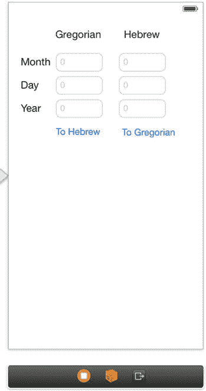

# 14. 用户数据食谱

**摘要**

没有两个人是完全相同的，同样，没有两台 iOS 设备是完全相同的。一台设备存储的信息取决于使用它的人。我们用生活内容填满设备，包括照片、日历、笔记、联系人和音乐。作为开发者，能够不受设备限制地访问所有这些信息非常重要，这样我们就能将其整合到应用中，提供更独特、更具用户个性化的界面。在本章中，我们将介绍处理基于用户数据的多种方法。首先关注日历，然后关注通讯录。

没有两个人是完全相同的，同样，没有两台 iOS 设备是完全相同的。一台设备存储的信息取决于使用它的人。我们用生活内容填满设备，包括照片、日历、笔记、联系人和音乐。作为开发者，能够不受设备限制地访问所有这些信息非常重要，这样我们就能将其整合到应用中，提供更独特、更具用户个性化的界面。在本章中，我们将介绍处理基于用户数据的多种方法。首先关注日历，然后关注通讯录。


## 配方 14-1：使用 `NSCalendar` 和 `NSDate`

许多不同的应用程序都用于基于时间和日期的计算。从日历转换到待办事项列表排序，再到告知用户闹钟响前还剩多少时间，示例涵盖方方面面。若要使用更复杂、基于事件的用户界面，必须扎实掌握更简单的、专注于 `NSDate` 的 API。

在本配方中，你将实现一个简单的应用程序，通过将日期从公历转换为希伯来历，来说明 `NSDate`、`NSCalendar` 和 `NSDateComponents` 类的用法。`NSDate` 类用于创建日期和处理日期操作，例如比较两个日期。`NSCalendar` 类用于跟踪 `NSDate` 对象并执行计算（如确定日期范围）。`NSDateComponents` 类用于提取日期的组成部分，例如小时、分钟等。

首先，创建一个新的单视图应用程序项目。切换到 `Main.storyboard` 文件，构建一个类似于图 14-1 的用户界面。使用以下组件创建界面：



**图 14-1.** 日历转换的用户界面

*   标签：月、日、年、公历、希伯来历
*   按钮：转换为希伯来历，转换为公历
*   六个文本字段：所有字段的占位符值均为 0

需要设置属性来表示每个 `UITextField`。这些文本字段将显示转换结果并接受输入。创建以下输出口：

*   `gMonthTextField`
*   `gDayTextField`
*   `gYearTextField`
*   `hMonthTextField`
*   `hDayTextField`
*   `hYearTextField`

**注意：** 这些属性名称中的 `G` 和 `H` 指的是给定的 `UITextField` 位于应用程序的公历侧还是希伯来历侧。

你不需要为按钮设置输出口，但需要为点击按钮时创建以下操作：

*   `convertToHebrew`
*   `convertToGregorian`

要以编程方式控制 `UITextField`，你需要将视图控制器设置为其委托。首先，将 `<UITextFieldDelegate>` 添加到控制器的头文件行中，使其看起来如代码清单 14-1 所示。

**代码清单 14-1.** 完整的 `ViewController.h` 文件

```
//
//  ViewController.h
//  Recipe 14-1 Working With NSCalendar and NSDate
//

#import <UIKit/UIKit.h>

@interface ViewController : UIViewController <UITextFieldDelegate>

@property (weak, nonatomic) IBOutlet UITextField *gMonthTextField;
@property (weak, nonatomic) IBOutlet UITextField *gDayTextField;
@property (weak, nonatomic) IBOutlet UITextField *gYearTextField;
@property (weak, nonatomic) IBOutlet UITextField *hMonthTextField;
@property (weak, nonatomic) IBOutlet UITextField *hDayTextField;
@property (weak, nonatomic) IBOutlet UITextField *hYearTextField;

- (IBAction)convertToHebrew:(id)sender;
- (IBAction)convertToGregorian:(id)sender;

@end
```

接下来，通过将代码清单 14-2 中的代码添加到实现文件的 `viewDidLoad` 方法中，将所有 `UITextField` 的委托设置为你的视图控制器。

**代码清单 14-2.** 设置 `UITextField` 的委托

```
- (void)viewDidLoad
{
    [super viewDidLoad];

    self.gMonthTextField.delegate = self;
    self.gDayTextField.delegate = self;
    self.gYearTextField.delegate = self;
    self.hMonthTextField.delegate = self;
    self.hDayTextField.delegate = self;
    self.hYearTextField.delegate = self;
}
```

接下来，定义 `UITextFieldDelegate` 方法 `textFieldShouldReturn:` 以正确关闭键盘，如代码清单 14-3 所示。

**代码清单 14-3.** `textFieldShouldReturn:` 委托方法的实现

```
-(BOOL)textFieldShouldReturn:(UITextField *)textField
{
    [textField resignFirstResponder];
    return NO;
}
```

之前我们简要介绍过 `NSCalendar` 类，但在此示例中，该类主要用于为你稍后将引用的日期设定标准。`NSCalendar` 方法还允许你执行一些与日历相关的有用功能，例如更改一周从哪一天开始，或更改使用的时区。`NSCalendar` 类还充当了你稍后将看到的 `NSDate` 和 `NSDateComponents` 类之间的桥梁。

你将使用 `NSCalendar` 类的两个实例在公历和希伯来历之间转换日期。将这些属性添加到你的 `ViewController.h` 类中：

```
@property (nonatomic, strong) NSCalendar *gregorianCalendar;
@property (nonatomic, strong) NSCalendar *hebrewCalendar;
```

对这些属性使用惰性初始化。惰性初始化基本上允许我们在需要这些属性之前推迟它们的初始化。添加自定义的 getter 实现，如代码清单 14-4 所示。

**代码清单 14-4.** 为 `gregorianCalendar` 和 `hebrewCalendar` 属性创建自定义 getter 实现

```
-(NSCalendar *)gregorianCalendar
{
    if (!_gregorianCalendar)
    {
        _gregorianCalendar =
            [[NSCalendar alloc] initWithCalendarIdentifier:NSGregorianCalendar];
    }
    return _gregorianCalendar;
}

-(NSCalendar *)hebrewCalendar
{
    if (!_hebrewCalendar)
    {
        _hebrewCalendar =
            [[NSCalendar alloc] initWithCalendarIdentifier:NSHebrewCalendar];
    }
    return _hebrewCalendar;
}
```

这些方法重写是必要的，以确保你的日历以正确的日历类型进行初始化。或者，你也可以简单地在 `viewDidLoad` 方法中初始化你的日历，以便在应用程序启动时创建它们。

**注意：** 有大量不同类型的日历可与 `NSCalendar` 类一起使用，包括 `NSBuddhistCalendar`、`NSIslamicCalendar` 和 `NSJapaneseCalendar`。

考虑到当今技术世界巨大的多元文化特性，你可能会发现使用其中一些日历是非常必要的！请查阅 Apple 文档以获取可能的日历类型的完整列表。

现在设置已完成，你可以实现转换方法了，先从公历到希伯来历的转换开始，如代码清单 14-5 所示。

**代码清单 14-5.** 实现 `convertToGregorian:` 方法

```
- (IBAction)convertToGregorian:(id)sender
{
    NSDateComponents *hComponents = [[NSDateComponents alloc] init];
    [hComponents setDay:[self.hDayTextField.text integerValue]];
    [hComponents setMonth:[self.hMonthTextField.text integerValue]];
    [hComponents setYear:[self.hYearTextField.text integerValue]];

    NSDate *hebrewDate = [self.hebrewCalendar dateFromComponents:hComponents];

    NSUInteger unitFlags =
        NSDayCalendarUnit | NSMonthCalendarUnit | NSYearCalendarUnit;

    NSDateComponents *hebrewDateComponents =
        [self.gregorianCalendar components:unitFlags fromDate:hebrewDate];

    self.gDayTextField.text =
        [[NSNumber numberWithInteger:hebrewDateComponents.day] stringValue];
    self.gMonthTextField.text =
        [[NSNumber numberWithInteger:hebrewDateComponents.month] stringValue];
    self.gYearTextField.text =
        [[NSNumber numberWithInteger:hebrewDateComponents.year] stringValue];
}
```

从代码清单 14-5 可以看出，你结合使用了 `NSDateComponents`、`NSDate` 和 `NSCalendar` 来执行此转换。

如前所述，`NSDateComponents` 类用于定义构成 `NSDate` 的详细信息，例如日、月、年、时间等。这里只使用了月、日和年。

如前所述，你使用 `NSCalendar` 的一个实例，根据你已定义的组件来创建一个 `NSDate` 实例。


