# 关于 `NSUInteger unitFlags` 的说明

前面方法中比较令人困惑的部分之一可能是 `NSUInteger unitFlags` 的使用，它的格式非常不寻常。每当你需要从 `NSDate` 创建 `NSDateComponents` 实例时，必须精确指定要从日期中包含哪些组件。你可以通过使用 `NSUInteger` 来指定这些标志（称为 `NSCalendarUnit`），如上所示。

其他类型的 `NSCalendarUnit` 包括（以及其他许多）：

- `NSSecondCalendarUnit`
- `NSWeekOfYearCalendarUnit`
- `NSEraCalendarUnit`
- `NSTimeZoneCalendarUnit`

如你所见，创建 `NSDate` 实例时的精确度具有高度可定制性，允许你执行独特的计算和比较。有关 `NSCalendarUnit` 值的完整列表，请参考 Apple 开发者 API 中的 `NSCalendar` 类参考。

由于 `NSDateComponents` 的值的类型是 `NSInteger`，你必须先将它们转换为 `NSNumber` 实例，然后获取它们的 `stringValue`，再将其设置到文本字段中。

一旦你定义了从一种日历到另一种日历的转换，反向转换就很简单了，只需更改你使用的文本字段和日历即可，如代码清单 14-6 所示。

**代码清单 14-6.** 实现 `convertToHebrew:` 方法

```
- (IBAction)convertToHebrew:(id)sender
{
    NSDateComponents *gComponents = [[NSDateComponents alloc] init];
    [gComponents setDay:[self.gDayTextField.text integerValue]];
    [gComponents setMonth:[self.gMonthTextField.text integerValue]];
    [gComponents setYear:[self.gYearTextField.text integerValue]];
    NSDate *gregorianDate = [self.gregorianCalendar dateFromComponents:gComponents];
    NSUInteger unitFlags =
        NSDayCalendarUnit | NSMonthCalendarUnit | NSYearCalendarUnit;
    NSDateComponents *hebrewDateComponents =
        [self.hebrewCalendar components:unitFlags fromDate:gregorianDate];
    self.hDayTextField.text =
        [[NSNumber numberWithInteger:hebrewDateComponents.day] stringValue];
    self.hMonthTextField.text =
        [[NSNumber numberWithInteger:hebrewDateComponents.month] stringValue];
    self.hYearTextField.text =
        [[NSNumber numberWithInteger:hebrewDateComponents.year] stringValue];
}
```

现在，你的应用程序可以正确地在不同日历之间转换 `NSDate` 实例，如图 14-2 所示。尝试使用不同的日期甚至不同的日历来进行实验，看看你能实现哪些强大的日期转换。

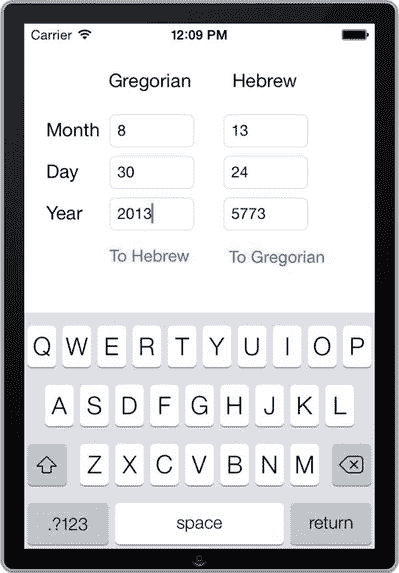

**图 14-2.** 一个在公历和希伯来历之间进行转换的应用程序

## 配方 14-2. 获取日历事件

既然我们已经介绍了如何处理基本的日期转换和计算，接下来可以详细讨论如何处理事件和日历，以及与用户自己的事件和日程进行交互。接下来的几个配方将组合起来，完整地演示如何使用 Event Kit 框架，该框架提供了用于操作事件和提醒的类。

首先，创建一个名为“My Events App”或类似名称的新单视图应用程序项目。我们将把它用于接下来的几个配方。这次你将使用 Event Kit 框架，因此请将 `EventKit.framework` 链接到你新建的项目中。

由于此应用程序将访问设备的日历，你应该在项目的 `Info.plist` 文件中提供使用描述。将“Privacy – Calendars Usage Description”键添加到信息属性列表中，并输入文本“Testing Calendar Events”，如图 14-3 所示。

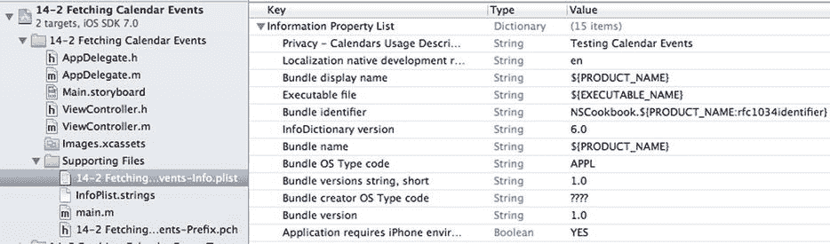

**图 14-3.** 在信息属性列表中提供日历使用描述的应用程序

每当你处理 Event Kit 框架时，主要使用的元素是 `EKEventStore`。这个类允许你访问、删除和保存日历中的事件。`EKEventStore` 的初始化需要相对较长的时间，因此你应该只初始化一次，并将其存储在一个属性中。将代码清单 14-7 中所示的声明添加到 `ViewController.h` 文件中。

**代码清单 14-7.** 导入 Event Kit 框架并添加 `EKEventStore` 属性

```
//
//  ViewController.h
//  My Events App
//

#import <UIKit/UIKit.h>
#import <EventKit/EventKit.h>

@interface ViewController : UIViewController

@property (strong, nonatomic) EKEventStore *eventStore;

@end
```

这个第一个配方的实现很简单，就是记录从现在开始 48 小时内的所有日历事件。此时你不会构建用户界面，所有相关代码都将位于 `viewDidLoad` 方法中。我们将先逐步介绍步骤，然后向你展示完整的实现。

当你想要访问设备的日历条目时，首先要做的是请求用户许可。使用 `EKEventStore` 的 `requestAccessToEntityType:completion:` 方法来执行此操作，传递一个代码块，该代码块将在异步过程完成时被调用（代码清单 14-8）。

**代码清单 14-8.** 在 `viewDidLoad` 方法中请求访问日历条目的权限

```
self.eventStore = [[EKEventStore alloc] init];
[self.eventStore requestAccessToEntityType:EKEntityTypeEvent
                               completion:^(BOOL granted, NSError *error)
{
    if (granted)
    {
        //...
    }
    else
    {
        NSLog(@"Access not granted: %@", error);
    }
}];
```

如果确实授予了访问权限，你就可以继续检索所需的信息。在本例中，你将获取从当前时间到 48 小时后的所有日历事件。首先创建两个日期，如代码清单 14-9 所示。

**代码清单 14-9.** 创建两个日历日期：当前时间和当前时间 + 48 小时

```
NSDate *now = [NSDate date];
NSCalendar *calendar = [NSCalendar currentCalendar];
NSDateComponents *fortyEightHoursFromNowComponents = [[NSDateComponents alloc] init];
fortyEightHoursFromNowComponents.day = 2; // 48 hours forward
NSDate *fortyEightHoursFromNow =
    [calendar dateByAddingComponents:fortyEightHoursFromNowComponents toDate:now
                            options:0];
```

**注意：** 如你所见，你使用 `NSCalendar` 来帮助创建未来的日期。这比使用 `NSDate` 的 `dateWithTimeIntervalSinceNow:` 方法能确保更精确的时间。原因在于 `NSCalendar` 考虑到了并非一年中所有天数都恰好是 24 小时这一事实。虽然在这个例子中差异微不足道，但使用 `dateByAddingComponents:toDate:` 方法来构建相对日期被认为是一种良好的实践。


现在你已经掌握了开始日期和结束日期，可以通过在事件存储上使用 `predicateForEventsWithStartDate:endDate:calendars:` 方法来创建用于查找该时间段内事件的搜索谓词。将 `nil` 值传递给该方法的 `calendars` 参数，即指定你的谓词将应用于所有日历，如代码清单 14-10 所示。

### 代码清单 14-10. 创建 `NSPredicate`

```
NSPredicate *allEventsWithin48HoursPredicate =
[self.eventStore predicateForEventsWithStartDate:now endDate:fortyEightHoursFromNow
calendars:nil];
```

然后，你使用该谓词从事件存储中检索实际事件，如代码清单 14-11 所示。

### 代码清单 14-11. 从事件存储中检索事件

```
NSArray *events =
[self.eventStore eventsMatchingPredicate:allEventsWithin48HoursPredicate];
```

最后，你将遍历检索到的事件并将它们的标题打印到调试日志中，如代码清单 14-12 所示。

### 代码清单 14-12. 打印事件标题

```
for (EKEvent *event in events)
{
NSLog(@"%@", event.title);
}
```

代码清单 14-13 展示了 `viewDidLoad` 方法的完整实现。

### 代码清单 14-13. 完整的 `viewDidLoad` 实现

```
- (void)viewDidLoad
{
[super viewDidLoad];
self.eventStore = [[EKEventStore alloc] init];
[self.eventStore requestAccessToEntityType:EKEntityTypeEvent
completion:^(BOOL granted, NSError *error)
{
if (granted)
{
NSDate *now = [NSDate date];
NSCalendar *calendar = [NSCalendar currentCalendar];
NSDateComponents *fortyEightHoursFromNowComponents =
[[NSDateComponents alloc] init];
fortyEightHoursFromNowComponents.day = 2; // 48 小时之后
NSDate *fortyEightHoursFromNow =
[calendar dateByAddingComponents:fortyEightHoursFromNowComponents
toDate:now options:0];
NSPredicate *allEventsWithin48HoursPredicate =
[self.eventStore predicateForEventsWithStartDate:now
endDate:fortyEightHoursFromNow calendars:nil];
NSArray *events = [self.eventStore
eventsMatchingPredicate:allEventsWithin48HoursPredicate];
for (EKEvent *event in events)
{
NSLog(@"%@", event.title);
}
}
else
{
NSLog(@"访问未授权: %@", error);
}
}];
}
```

由于 iOS 模拟器不支持日历功能，你需要在真实设备上测试你的应用。确保设备上安排了事件作为测试数据。由于此处唯一生成的输出在日志中，你还需要从 Xcode 运行应用程序以捕获输出。此类输出示例请参见图 14-4。

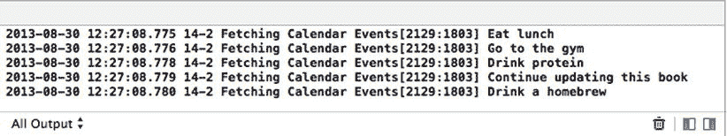

**图 14-4.** 应用程序的输出日志，显示了附近事件的名称

首次运行此应用程序时，你会看到一个**权限**提示，询问是否应允许该应用访问你的日历（见图 14-5）。这是 iOS 7 中实施的隐私政策的一部分。由于日历可能包含敏感的私人信息，应用在访问之前必须获得用户的明确许可。

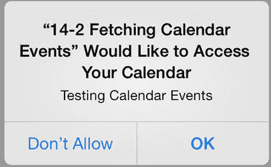

**图 14-5.** 要求用户授权访问日历的提示

系统只会向用户询问一次是否授权应用访问日历。iOS 会记住用户的选择并在后续运行时沿用。如果用户想更改当前的访问设置，可以在“设置”应用的**隐私** ➤ **日历**中进行更改（见图 14-6）。

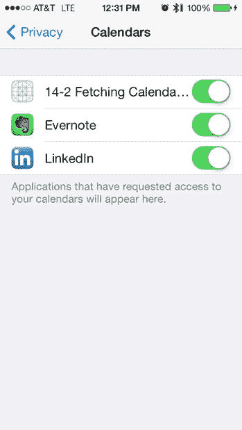

**图 14-6.** 隐私设置页面显示了一个当前已被授权访问设备日历的应用

作为这些受限功能的开发者，有时你可能想重置隐私设置，以便再次测试首次运行时的场景。你可以在“设置”应用的**通用** ➤ **还原**中，通过使用**还原位置与隐私**选项来重置这些设置。


## 食谱 14-3：在表格视图中显示事件

既然你已经能访问事件了，接着创建一个更好的界面来处理它们。在本食谱中，你将实现一个分组的 `UITableView` 来显示事件。

首先，将项目转换为基于导航的应用程序。这需要一些故事板操作。虽然我们会尽量解释清楚所有步骤，但在继续之前，阅读第 2 章中关于故事板的内容可能会有所帮助。

开始时，切换到 `Main.storyboard` 文件，并在故事板中选择视图。选中视图后，从主菜单中选择 **Editor ➤ Embed In ➤ Navigation Controller**。完成后，故事板上会创建一个导航控制器。你可能需要将导航控制器拖离视图控制器并排列好两个视图，如图 14-7 所示。

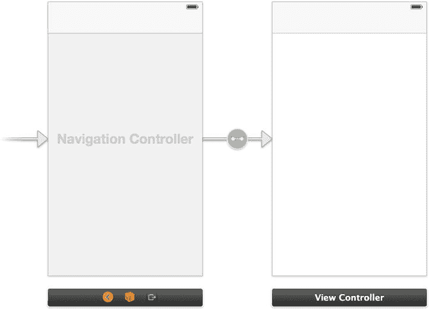

图 14-7：将视图控制器排列在导航控制器旁边

接下来，设置由 `UITableView` 组成的用户界面。从项目导航器的 `Main.storyboard` 文件中选中 `View Controller`。

现在，你可以从对象库中添加表格视图，并使其填满可用区域。这将排除导航栏。在表格视图的属性检查器中，确保 **Style** 属性设置为 **Grouped**。你的主视图现在应类似于图 14-8。

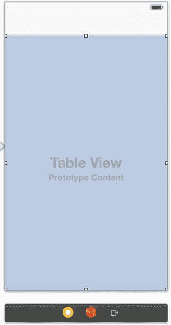

图 14-8：带有导航栏和分组表格视图的用户界面

接下来，为你的 `UITableView` 创建一个输出口。将输出口命名为 `eventsTableView`。

在切换到实现文件之前，你需要对头文件进行一些额外修改。首先，将 `UITableViewDelegate` 和 `UITableViewDataSource` 协议添加到类中。同时定义两个新属性：一个 `NSArray`，用于保存 `EKEventStore` 中所有日历的引用；以及一个 `NSMutableDictionary`，用于根据事件所属的日历存储所有事件。`ViewController.h` 文件现在应类似于清单 14-14 中的代码。

清单 14-14：完整的 `ViewController.h` 文件

```
//
//  ViewController.h
//  My Events App
//

#import <UIKit/UIKit.h>
#import <EventKit/EventKit.h>

@interface ViewController : UIViewController <UITableViewDelegate, UITableViewDataSource>

@property (strong, nonatomic) EKEventStore *eventStore;
@property (weak, nonatomic) IBOutlet UITableView *eventsTableView;
@property (nonatomic, strong) NSMutableDictionary *events;
@property (nonatomic, strong) NSArray *calendars;

@end
```

接下来需要执行的任务是修改 `viewDidLoad` 方法。具体来说，你需要执行以下操作：

- 设置导航栏中显示的标题。
- 在导航栏中添加一个刷新按钮。
- 设置表格视图的两个代理方法。
- 填充 `calendars` 数组和 `events` 字典。

为了实现这些，请对 `viewDidLoad` 方法进行清单 14-15 所示的修改。

清单 14-15：修改 `viewDidLoad` 方法以包含栏按钮项并设置代理

```
- (void)viewDidLoad
{
    [super viewDidLoad];

    self.title = @"事件";

    UIBarButtonItem *refreshButton = [[UIBarButtonItem alloc]
        initWithBarButtonSystemItem:UIBarButtonSystemItemRefresh target:self
        action:@selector(refresh:)];

    self.navigationItem.leftBarButtonItem = refreshButton;

    self.eventsTableView.delegate = self;
    self.eventsTableView.dataSource = self;

    self.eventStore = [[EKEventStore alloc] init];

    [self.eventStore requestAccessToEntityType:EKEntityTypeEvent
        completion:^(BOOL granted, NSError *error)
        {
            if (granted)
            {
                self.calendars =
                    [self.eventStore calendarsForEntityType:EKEntityTypeEvent];
                [self fetchEvents];
            }
            else
            {
                NSLog(@"访问未授权：%@", error);
            }
        }];
}
```


好的，作为一名高级文档工程师和翻译员，我将严格遵循您提供的格式和注意事项，将给定的英文文本翻译成中文。


`}`

清单 14-15 中的代码使用了两个你尚未实现的方法。第一个是 `refresh:` 操作方法，当用户点击导航栏上的“刷新”按钮时，会调用该方法。将清单 14-16 中的代码添加到视图控制器类中。

**清单 14-16.** 实现 `refresh:` 方法

```
- (void)refresh:(id)sender
{
    [self fetchEvents];
    [self.eventsTableView reloadData];
}
```

第二个未实现的方法是 `fetchEvents`，它包含实际查询 `eventStore` 以获取事件的代码。因为你按事件所属的日历对它们进行排序，所以你需要为每个日历执行不同的查询，而不是对所有事件只执行一次查询。此代码在清单 14-17 中实现。

**清单 14-17.** 实现 `fetchEvents` 方法

```
- (void)fetchEvents
{
    self.events = [[NSMutableDictionary alloc] initWithCapacity:[self.calendars count]];
    NSDate *now = [NSDate date];
    NSCalendar *calendar = [NSCalendar currentCalendar];
    NSDateComponents *fortyEightHoursFromNowComponents =
        [[NSDateComponents alloc] init];
    fortyEightHoursFromNowComponents.day = 2; // 向前推 48 小时
    NSDate *fortyEightHoursFromNow =
        [calendar dateByAddingComponents:fortyEightHoursFromNowComponents toDate:now
                                 options:0];
    for (EKCalendar *calendar in self.calendars)
    {
        NSPredicate *allEventsWithin48HoursPredicate =
            [self.eventStore predicateForEventsWithStartDate:now
                                                    endDate:fortyEightHoursFromNow
                                                  calendars:@[calendar]];
        NSArray *eventsInThisCalendar =
            [self.eventStore eventsMatchingPredicate:allEventsWithin48HoursPredicate];
        if (eventsInThisCalendar != nil)
        {
            [self.events setObject:eventsInThisCalendar forKey:calendar.title];
        }
    }
    dispatch_async(dispatch_get_main_queue(),^{
        [self.eventsTableView reloadData];
    });
}
```

你应该能认出上述大部分代码来自技巧 14-2。主要区别在于，你现在为每个日历执行一次搜索，并将结果以相应的日历名称作为键，存储在 `events` 字典中。

此外，当所有数据获取完毕后，你会通知表格视图其数据已更改。但是，由于 `fetchEvents` 方法是在任意线程上调用的，而任何与用户界面相关的代码都必须在主线程上运行，因此你需要派发这段特定的代码，使其在主线程中运行。

数据模型就绪后，你可以将注意力转移到表格视图及其实现上。但在那之前，你需要添加一些辅助方法。这些方法本质上非常短小简单，但它们有助于使稍后添加的代码更易于阅读。因此，请将清单 14-18 中的代码添加到 `ViewController.m` 文件中。

**清单 14-18.** 在 `ViewController.m` 文件中实现辅助方法

```
- (EKCalendar *)calendarAtSection:(NSInteger)section
{
    return [self.calendars objectAtIndex:section];
}

- (EKEvent *)eventAtIndexPath:(NSIndexPath *)indexPath
{
    EKCalendar *calendar = [self calendarAtSection:indexPath.section];
    NSArray *calendarEvents = [self eventsForCalendar:calendar];
    return [calendarEvents objectAtIndex:indexPath.row];
}

- (NSArray *)eventsForCalendar:(EKCalendar *)calendar
{
    return [self.events objectForKey:calendar.title];
}
```

现在，实现一个方法来指定表格应显示的分区数。每个日历对应一个分区，所以这个方法非常简单（清单 14-19）。

**清单 14-19.** 实现 `numberOfSectionsInTableView:` 委托方法

```
-(NSInteger)numberOfSectionsInTableView:(UITableView *)tableView
{
    return [self.calendars count];
}
```

你还可以实现一个方法来指定分区标题，如清单 14-20 所示。

**清单 14-20.** 实现 `tableView:titleForHeaderInSection:` 委托方法

```
-(NSString *)tableView:(UITableView *)tableView titleForHeaderInSection:(NSInteger)section
{
    return [self calendarAtSection:section].title;
}
```

你还需要实现一个方法来确定每个分组中的行数，该数字由字典针对给定分区返回的数组的计数给出。清单 14-21 展示了这一点。

**清单 14-21.** 实现 `tableView:numberOfRowsInSection:` 委托方法

```
-(NSInteger)tableView:(UITableView *)tableView numberOfRowsInSection:(NSInteger)section
{
    EKCalendar *calendar = [self calendarAtSection:section];
    return [self eventsForCalendar:calendar].count;
}
```

最后，添加定义表格单元格创建方式的方法，如清单 14-22 所示。

**清单 14-22.** 实现 `tableView:cellForRowAtindexPath:` 委托方法

```
- (UITableViewCell *)tableView:(UITableView *)tableView cellForRowAtIndexPath:(NSIndexPath *)indexPath
{
    static NSString *CellIdentifier = @"Cell";
    UITableViewCell *cell =
        [tableView dequeueReusableCellWithIdentifier:CellIdentifier];
    if (cell == nil)
    {
        cell = [[UITableViewCell alloc] initWithStyle:UITableViewCellStyleValue1
                                     reuseIdentifier:CellIdentifier];
    }
    cell.accessoryType = UITableViewCellAccessoryDetailDisclosureButton;
    cell.textLabel.backgroundColor = [UIColor clearColor];
    cell.textLabel.font = [UIFont systemFontOfSize:19.0];
    cell.textLabel.text = [self eventAtIndexPath:indexPath].title;
    return cell;
}
```

如图 14-9 所示，你的应用程序现在可以显示 48 小时内发生的所有日历事件。

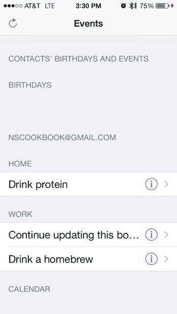

**图 14-9.** 一个简单的应用，显示从现在起两天内的日历事件


### 方法 14-4：查看、编辑和删除事件

下一步是允许用户通过 Event Kit UI 框架中的预定义类来查看、编辑和删除事件。

你将继续在自方法 14-2 以来使用的同一个项目中进行开发。这一次，你将使用几个预定义的用户界面来查看和编辑日历事件。具体来说，你将使用`EKEventViewController`和`EKEventViewEditController`类。这些类属于 Event Kit UI 框架，因此请将`EventKitUI.framework`添加到项目中。

你还需要将其 API 导入主视图控制器的头文件中，如代码清单 14-23 所示。

**代码清单 14-23.** 向`ViewController.h`文件添加 EventKitUI 框架的导入语句

```
//
//  ViewController.h
//  Calendar Events
//

#import <UIKit/UIKit.h>
#import <EventKit/EventKit.h>
#import <EventKitUI/EventKitUI.h>

@interface ViewController : UIViewController<UITableViewDelegate,
UITableViewDataSource>

@property (strong, nonatomic) EKEventStore *eventStore;
@property (weak, nonatomic) IBOutlet UITableView *eventsTableView;
@property (nonatomic, strong) NSMutableDictionary *events;
@property (nonatomic, strong) NSArray *calendars;

@end
```

接下来的任务是实现当用户在表格视图中选择特定行时的行为。你将使用`EKEventViewController`的实例来显示所选事件的信息。为此，添加`tableView:DidSelectRowAtIndexPath:`数据源方法，如代码清单 14-24 所示。

**代码清单 14-24.** 实现`tableView:didSelectRowAtIndexPath:`委托方法

```
-(void)tableView:(UITableView *)tableView didSelectRowAtIndexPath:(NSIndexPath *)indexPath
{
    EKEventViewController *eventVC = [[EKEventViewController alloc] init];
    eventVC.event = [self eventAtIndexPath:indexPath];
    eventVC.allowsEditing = YES;
    [self.navigationController pushViewController:eventVC animated:YES];
    [tableView deselectRowAtIndexPath:indexPath animated:YES];
}
```

如果用户已在事件视图控制器内编辑或删除了所选事件，你需要以某种方式更新表格视图。最简单的方法是在主视图控制器的`viewWillLoad`方法中刷新它，如代码清单 14-25 所示。

**代码清单 14-25.** 实现`viewWillAppear`方法以刷新表格视图

```
- (void)viewWillAppear:(BOOL)animated
{
    [self refresh:self];
    [super viewWillAppear:animated];
}
```

为了增加额外功能，让你的单元格的详细信息披露按钮允许用户通过使用`EKEventEditViewController`直接进入编辑模式。`EKEventEditViewController`要求你分配一个委托来处理其关闭，因此首先将`EKEventEditViewDelegate`协议添加到主视图控制器的类声明中，如代码清单 14-26 所示。

**代码清单 14-26.** 向`ViewController.h`文件添加`EKEventEditViewDelegate`

```
//
//  ViewController.h
//  Calendar Events
//

#import <UIKit/UIKit.h>
#import <EventKit/EventKit.h>
#import <EventKitUI/EventKitUI.h>

@interface ViewController : UIViewController<UITableViewDelegate, UITableViewDataSource,
EKEventEditViewDelegate>

@property (strong, nonatomic) EKEventStore *eventStore;
@property (weak, nonatomic) IBOutlet UITableView *eventsTableView;
@property (nonatomic, strong) NSMutableDictionary *events;
@property (nonatomic, strong) NSArray *calendars;

@end
```

然后，实现一个方法来处理点击披露按钮的操作，如代码清单 14-27 所示。如前所述，此方法将直接带你进入编辑模式。

**代码清单 14-27.** 实现`tableView:accessorButtonTappedForRowWithIndexpath:`委托方法

```
-(void)tableView:(UITableView *)tableView accessoryButtonTappedForRowWithIndexPath:(NSIndexPath *)indexPath
{
    EKEventEditViewController *eventEditVC = [[EKEventEditViewController alloc] init];
    eventEditVC.event = [self eventAtIndexPath:indexPath];
    eventEditVC.eventStore = self.eventStore;
    eventEditVC.editViewDelegate = self;
    [self presentViewController:eventEditVC animated:YES completion:nil];
}
```

最后，实现`eventEditViewController:didCompleteWithAction:`委托方法以关闭编辑视图控制器，如代码清单 14-28 所示。

**代码清单 14-28.** 实现`eventEditViewController:didCompleteWithAction:`委托方法

```
-(void)eventEditViewController:(EKEventEditViewController *)controller didCompleteWithAction:(EKEventEditViewAction)action
{
    [self dismissViewControllerAnimated:YES completion:nil];
}
```

在完成之前，你需要实现最后一个委托方法，以指定用于创建新事件的默认日历。在代码清单 14-29 所示的实现中，你只需返回设备的默认日历。

**代码清单 14-29.** 实现`eventEditViewControllerDefaultCalendarForNewEvents:`委托方法

```
-(EKCalendar *)eventEditViewControllerDefaultCalendarForNewEvents:
(EKEventEditViewController *)controller
{
    return [self.eventStore defaultCalendarForNewEvents];
}
```

至此，你的应用程序现在允许用户通过两种不同方式查看和编辑事件详情：使用`EKEventViewController`或`EKEventEditViewController`。图 14-10 展示了这些视图控制器的用户界面示例。

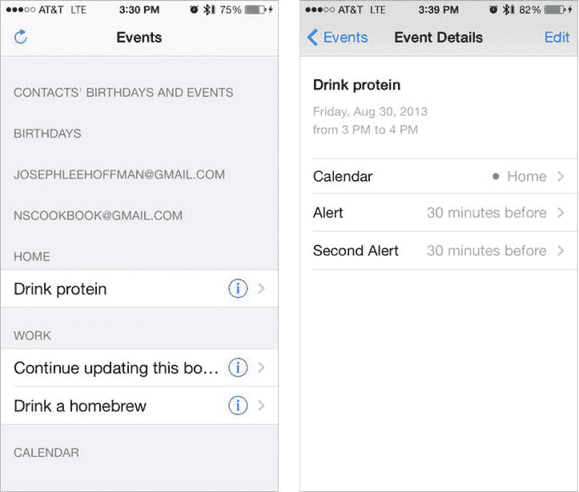

**图 14-10.** 分别为`EKEventViewController`和`EKEventEditViewController`的用户界面


## 配方 14-5：创建日历事件

虽然让用户自己创建日历事件相当简单，但作为开发者，我们应该始终力求简化，即便是简单的事情也不例外。用户需要自己动手的操作越少，他们对最终产品的满意度往往就越高。为此，能够通过程序化方式（只需轻点一个按钮）来创建和编辑事件就显得尤为重要。

同样，我们将继续在配方 14-2 中创建的项目基础上进行扩展。第一步是在导航栏上添加一个“添加”按钮。请进入 `ViewController.m` 的 `viewDidLoad` 方法，并添加列表 14-30 中的代码。

**列表 14-30.** 在 `viewDidLoad` 方法中添加一个 `UIBarButtonItem`

```
- (void)viewDidLoad
{
[super viewDidLoad];
self.title = @"Events";
UIBarButtonItem *refreshButton = [[UIBarButtonItem alloc]
initWithBarButtonSystemItem:UIBarButtonSystemItemRefresh target:self
action:@selector(refresh:)];
self.navigationItem.leftBarButtonItem = refreshButton;
UIBarButtonItem *addButton = [[UIBarButtonItem alloc]
initWithBarButtonSystemItem:UIBarButtonSystemItemAdd target:self
action:@selector(addEvent:)];
self.navigationItem.rightBarButtonItem = addButton;
// ...
}
```

当用户点击“添加”按钮时，应用将在设备的默认日历中创建一个新事件。为了在本配方中简化操作，我们使用一个警告视图来让用户输入事件的标题。为实现此功能，首先需要在主视图控制器的头文件声明中添加 `UIAlertViewDelegate` 协议，如列表 14-31 所示。

**列表 14-31.** 声明 `UIAlertViewDelegate`

```
@interface ViewController : UIViewController<UITableViewDelegate, UITableViewDataSource,
EKEventEditViewDelegate, UIAlertViewDelegate>
```

然后，添加用于显示警告视图的操作方法，如列表 14-32 所示。

**列表 14-32.** 实现 `addEvent:` 操作方法

```
- (void)addEvent:(id)sender
{
UIAlertView * inputAlert = [[UIAlertView alloc] initWithTitle:@"New Event"
message:@"Enter a title for the event" delegate:self cancelButtonTitle:@"Cancel"
otherButtonTitles:@"OK", nil];
inputAlert.alertViewStyle = UIAlertViewStylePlainTextInput;
[inputAlert show];
}
```

最后，添加当用户在警告视图中点击按钮时调用的委托方法，如列表 14-33 所示。

**列表 14-33.** 实现 `alertView:clickedButtonAtIndex:` 委托方法

```
- (void)alertView:(UIAlertView *)alertView clickedButtonAtIndex:(NSInteger)buttonIndex
{
if (buttonIndex == 1)
{
// OK button tapped
// Calculate the date exactly one day from now
NSCalendar *calendar = [NSCalendar currentCalendar];
NSDateComponents *aDayFromNowComponents = [[NSDateComponents alloc] init];
aDayFromNowComponents.day = 1;
NSDate *now = [NSDate date];
NSDate *aDayFromNow = [calendar dateByAddingComponents:aDayFromNowComponents
toDate:now options:0];
// Create the event
EKEvent *event = [EKEvent eventWithEventStore:self.eventStore];
event.title = [alertView textFieldAtIndex:0].text;
event.calendar = [self.eventStore defaultCalendarForNewEvents];
event.startDate = aDayFromNow;
event.endDate = [NSDate dateWithTimeInterval:60*60.0 sinceDate:event.startDate];
// Save the event and update the table view
[self.eventStore saveEvent:event span:EKSpanThisEvent error:nil];
[self refresh:self];
}
}
```

为了演示，我们选择了一种非常简单的方法来创建这些新事件（见图 14-11）。所有事件都设置为提前一天开始，持续一个小时。在你的实际应用中，很可能会选择更复杂的或基于用户输入的方法来创建 `EKEvent`。

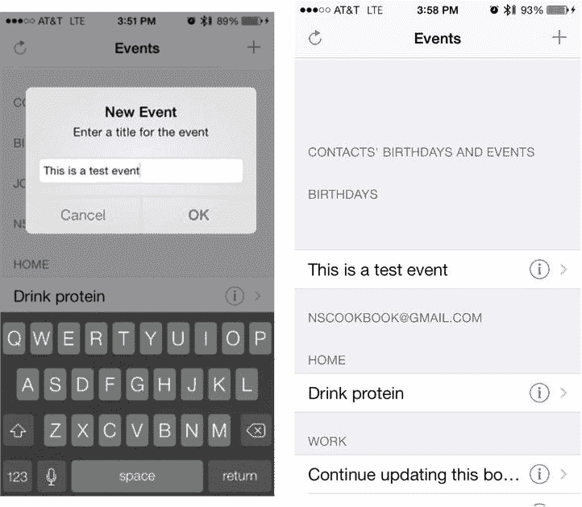

**图 14-11.** 用于添加新日历事件的简单用户界面

### 创建重复事件

Event Kit 框架提供了一个强大的 API 来处理重复事件。为了了解其工作原理，我们将修改此应用创建的事件，使其能够重复。我们先添加代码，随后再分析其工作机制。代码如列表 14-34 中粗体部分所示。

**列表 14-34.** 修改 `alertView:clickedButtonAtIndex:` 方法以添加重复事件

```
- (void)alertView:(UIAlertView *)alertView clickedButtonAtIndex:(NSInteger)buttonIndex
{
if (buttonIndex == 1)
{
// OK button tapped
// Calculate the date exactly one day from now
NSCalendar *calendar = [NSCalendar currentCalendar];
NSDateComponents *aDayFromNowComponents = [[NSDateComponents alloc] init];
aDayFromNowComponents.day = 1;
NSDate *now = [NSDate date];
NSDate *aDayFromNow = [calendar dateByAddingComponents:aDayFromNowComponents
toDate:now options:0];
// Create the event
EKEvent *event = [EKEvent eventWithEventStore:self.eventStore];
event.title = [alertView textFieldAtIndex:0].text;
event.calendar = [self.eventStore defaultCalendarForNewEvents];
event.startDate = aDayFromNow;
event.endDate = [NSDate dateWithTimeInterval:60*60.0 sinceDate:event.startDate];
// Make it recur
EKRecurrenceRule *repeatEverySecondWednesdayRecurrenceRule =
[[EKRecurrenceRule alloc] initRecurrenceWithFrequency:EKRecurrenceFrequencyDaily
interval:2
daysOfTheWeek:@[[EKRecurrenceDayOfWeek dayOfWeek:4]]
daysOfTheMonth:nil
monthsOfTheYear:nil
weeksOfTheYear:nil
daysOfTheYear:nil
setPositions:nil
end:[EKRecurrenceEnd recurrenceEndWithOccurrenceCount:20]];
event.recurrenceRules = @[repeatEverySecondWednesdayRecurrenceRule];
// Save the event and update the table view
[self.eventStore saveEvent:event span:EKSpanThisEvent error:nil];
[self refresh:self];
}
}
```

如列表 14-34 所示，你需要创建一个 `EKRecurrenceRule` 类的实例，并将其提供给事件。这个类提供了一种极其灵活的方法，可通过编程方式实现重复事件。仅通过这一个方法，开发者就能创建几乎任何可以想象到的重复组合。该方法的每个参数功能如下所述。对于任何参数，传递 `nil` 值表示没有相应限制。


-   `initRecurrenceWithFrequency`：指定事件重复的基本频率，可以是每日、每周、每月或每年。
-   `interval`：基于频率指定重复的时间间隔。例如，每周频率且间隔为 3 的事件，将每三周重复一次。
-   `daysOfTheWeek`：接受一个`NSArray`对象，这些对象必须通过`EKRecurrenceDayOfWeek dayOfWeek`方法访问，该方法接受一个表示星期几的整数参数（1 代表星期日）。通过设置此参数，开发者可以创建每几天重复一次的事件，但仅当事件落在指定的星期几时才会触发。
-   `daysOfTheMonth`：与`daysOfTheWeek`类似。它指定一个月中哪些天可以限制重复事件。此参数仅对按月频率的事件有效。
-   `monthsOfTheYear`：与`daysOfTheWeek`和`daysOfTheMonth`类似；仅对按年频率的事件有效。
-   `weeksOfTheYear`：与`monthsOfTheYear`类似，仅对按年频率的事件有效，但限制的是具体周数而非月份。
-   `daysOfTheYear`：另一个限制为按年重复事件的参数，允许你仅指定某些天（从年初或年末开始计算），以筛选特定事件。
-   `setPositions`：此参数是最终过滤器，允许你将创建的事件完全限制在一年中的特定天数。例如，一个每天重复的事件可以被限制为仅在一年中的第 28 天、第 102 天和第 364 天发生，无论开发者出于何种原因选择这样做。
-   `end`：需要调用`EKRecurrenceEnd`类的方法，并指定事件何时不再重复。可供选择的两个类方法如下：
    -   `recurrenceEndWithEndDate`：允许开发者指定一个日期，在此日期之后事件将不再重复。
    -   `recurrenceEndWithOccurenceCount`：将事件的重复次数限制为指定的次数。

基于以上内容，你可以看到，为演示而创建的重复事件将在每个月的第二个星期三重复，最多重复 20 次。运行应用程序，添加一个事件，然后检查日历以查看更改。

这结束了演示 **Event Kit** 框架中处理日历事件部分的系列教程。接下来，我们将快速了解一个相关主题，即提醒事项。

## Recipe 14-6. 创建提醒事项

在 iOS 6 中，Apple 发布了一个 API，允许你向 iOS 5 中引入的“提醒事项”应用程序添加条目。通过此 API，你的应用程序可以直接与这个实用的工具交互，并构建能够自动创建与用户相关的提醒事项的功能。

### 设置应用程序

在本教程中，你将构建一个简单的用户界面，允许创建两种类型的闹钟提醒：基于时间的和基于位置的。首先创建一个单视图应用程序项目。你将同时使用 **Event Kit** 框架和 **Core Location** 框架，因此需要将 `EventKit.framework` 和 `CoreLocation.framework` 库文件链接到项目中。

这次你需要访问两个受限服务：**Core Location** 和 **Reminders**，这意味着你需要在项目属性列表中为这些服务提供使用描述。添加键“Privacy - Location Usage Description”，文本设置为“Testing Location-Based Reminders”；添加键“Privacy - Reminders Usage Description”，文本设置为“Testing Reminders”，如图 14-12 所示。

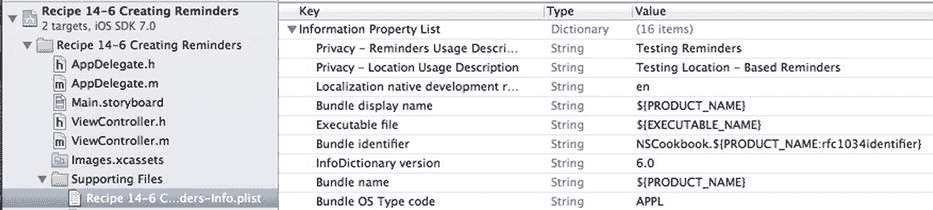

图 14-12. 为位置服务和提醒事项设置使用描述

接下来，你将构建一个类似图 14-13 所示的用户界面，因此转到 `Main.storyboard` 文件来编辑视图控制器。拖入并放置两个按钮和一个活动指示器。要使活动指示器仅在活动时显示，请在属性检查器中勾选其“Hides When Stopped”复选框。这将使其初始时也处于隐藏状态，这正是你想要的。

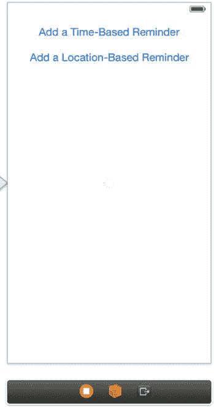

图 14-13. 用于创建两种类型提醒事项的用户界面

为按钮创建名为 `addTimeBasedReminder` 和 `addLocationBasedReminder` 的操作，并为活动指示器创建一个名为 `activityIndicator` 的插座变量。

接下来，转到 `ViewController.h`，导入你将使用的额外 API，并声明常用的 `eventStore` 属性，如列表 14-35 所示。

列表 14-35. 在 `ViewController.h` 文件中导入框架并添加 `EKEventStore` 属性

```
//
//  ViewController.h
//  Recipe 14-6 Creating Reminders
//
#import <UIKit/UIKit.h>
#import <EventKit/EventKit.h>
#import <CoreLocation/CoreLocation.h>
@interface ViewController : UIViewController<CLLocationManagerDelegate>
@property (weak, nonatomic) IBOutlet UIActivityIndicatorView *activityIndicator;
@property (strong, nonatomic)EKEventStore *eventStore;
- (IBAction)addTimeBasedReminder:(id)sender;
- (IBAction)addLocationBasedReminder:(id)sender;
@end
```

你将使用惰性初始化来创建 `eventStore` 属性，因此转到 `ViewController.m` 并添加列表 14-36 所示的自定义 getter 方法。

列表 14-36. 实现 `eventStore` 的 Getter 方法

```
- (EKEventStore *)eventStore
{
    if (_eventStore == nil)
    {
        _eventStore = [[EKEventStore alloc] init];
    }
    return _eventStore;
}
```


### 请求访问提醒事项

与日历事件类似，访问提醒事项也受到限制，需要用户明确许可。在本节中，你将实现一个处理请求访问提醒事项的辅助方法。由于此过程是异步的，你将使用块技术注入代码，以便在获得访问权限时执行。

首先，在 `ViewController.h` 中声明一个块类型和方法签名，如列表 14-37 所示。

**列表 14-37 在 `ViewController.h` 中声明块类型和方法**

```objc
//
//  ViewController.h
//  Remind Me
//

#import <UIKit/UIKit.h>
#import <EventKit/EventKit.h>
#import <CoreLocation/CoreLocation.h>

typedef void(^RestrictedEventStoreActionHandler)();

@interface ViewController : UIViewController<CLLocationManagerDelegate>

@property (weak, nonatomic) IBOutlet UIActivityIndicatorView *activityIndicator;
@property (strong, nonatomic) EKEventStore *eventStore;

- (IBAction)addTimeBasedReminder:(id)sender;
- (IBAction)addLocationBasedReminder:(id)sender;
- (void)handleReminderAction:(RestrictedEventStoreActionHandler)block;

@end
```

`handleReminderAction:` 辅助方法的目标是请求访问提醒事项，并在获得许可时调用提供的代码块。如果访问被拒绝，它将简单地弹出一个提示框通知用户。列表 14-38 展示了实现代码。

**列表 14-38 实现 `handleReminderAction:` 辅助方法**

```objc
- (void)handleReminderAction:(RestrictedEventStoreActionHandler)block
{
    [self.eventStore requestAccessToEntityType:EKEntityTypeReminder
                                    completion:^(BOOL granted, NSError *error)
     {
         if (granted)
         {
             block();
         }
         else
         {
             UIAlertView *notGrantedAlert = [[UIAlertView alloc] initWithTitle:@"Access Denied"
                 message:@"Access to device's reminders has been denied for this app."
                 delegate:nil cancelButtonTitle:@"OK" otherButtonTitles:nil];
             dispatch_async(dispatch_get_main_queue(), ^{
                 [notGrantedAlert show];
             });
         }
    }];
}
```

需要记住的一个重要点是，完成块可能会在任意线程上被调用。因此，如果你想执行影响用户界面的操作（例如显示提示框），则需要将其包装在 `dispatch_async()` 函数调用中，以确保它在主线程上运行。

有了这个辅助方法，你就可以开始实现动作方法了，首先从 `addTimeBasedReminder:` 开始。列表 14-39 展示了其通用结构。

**列表 14-39 实现 `addTimeBasedReminder:` 方法**

```objc
- (IBAction)addTimeBasedReminder:(id)sender
{
    [self.activityIndicator startAnimating];
    [self handleReminderAction:^()
    {
        //TODO: 创建并添加提醒事项
        dispatch_async(dispatch_get_main_queue(), ^{
            // TODO: 通知用户提醒事项是否添加成功
            [self.activityIndicator stopAnimating];
        });
    }];
}
```

这里你使用了刚刚创建的辅助方法，并提供了一个代码块，该块将在用户授予访问权限后被调用。

现在，让我们看看如何实现上述代码中两个 `TODO` 的第一个。

### 创建基于时间的提醒事项

我们将先展示步骤，稍后再给出 `addTimeBasedReminder:` 方法的完整实现。当获得访问权限时，你要做的第一件事是创建一个新的提醒对象，并设置其标题和存储它的日历（即提醒列表）（列表 14-40）。

**列表 14-40 创建 `EKReminder` 实例并设置属性**

```objc
EKReminder *newReminder = [EKReminder reminderWithEventStore:self.eventStore];
newReminder.title = @"Simpsons is on";
newReminder.calendar = [self.eventStore defaultCalendarForNewReminders];
```

接下来，你需要为提醒事项设置时间。在列表 14-41 中，你将具体时间设置为明天下午 6 点。首先，通过获取当前日期并使用 `NSDateComponents` 增加一天来计算明天的日期。

**列表 14-41 设置提醒事项的时间**

```objc
NSCalendar *calendar = [NSCalendar currentCalendar];
NSDateComponents *oneDayComponents = [[NSDateComponents alloc] init];
oneDayComponents.day = 1;
NSDate *nextDay =
[calendar dateByAddingComponents:oneDayComponents toDate:[NSDate date] options:0];
```

然后，要设置具体时间为下午 6 点，从 `nextDay` 中提取 `NSDateComponents` 对象，将其小时部分改为 18（24 小时制下的下午 6 点），并根据这些调整后的组件创建一个新的日期，如列表 14-42 所示。

**列表 14-42 设置具体时间**

```objc
NSUInteger unitFlags = NSEraCalendarUnit | NSYearCalendarUnit | NSMonthCalendarUnit |
NSDayCalendarUnit;
NSDateComponents *tomorrowAt6PMComponents =
[calendar components:unitFlags fromDate:nextDay];
tomorrowAt6PMComponents.hour = 18;
tomorrowAt6PMComponents.minute = 0;
tomorrowAt6PMComponents.second = 0;
NSDate *nextDayAt6PM = [calendar dateFromComponents:tomorrowAt6PMComponents];
```

接下来，使用该时间创建一个 `EKAlarm` 并将其添加到提醒事项中，如列表 14-43 所示。建议同时设置提醒事项的 `dueDateComponents` 属性，这有助于提醒事项应用显示更相关的信息。幸运的是，你在之前构建闹钟日期时已经构造了所需的 `NSDateComponents` 对象。

**列表 14-43 创建 `EKAlarm` 并将其添加到提醒事项中**

```objc
EKAlarm *alarm = [EKAlarm alarmWithAbsoluteDate:nextDayAt6PM];
[newReminder addAlarm:alarm];
newReminder.dueDateComponents = tomorrowAt6PMComponents;
```

最后，保存并提交新的提醒事项，并告知用户操作是否成功。由于显示 `UIAlertView` 会影响用户界面，因此这段特定代码需要在主线程上运行，如列表 14-44 所示。

**列表 14-44 保存并提交新的提醒事项**

```objc
// ...
NSString *alertTitle;
NSString *alertMessage;
NSString *alertButtonTitle;
NSError *error;
[self.eventStore saveReminder:newReminder commit:YES error:&error];
if (error == nil)
{
    alertTitle = @"Information";
    alertMessage = [NSString stringWithFormat:@"\"%@\" was added to Reminders",
                    newReminder.title];
    alertButtonTitle = @"OK";
}
else
{
    alertTitle = @"Error";
    alertMessage = [NSString stringWithFormat:@"Unable to save reminder: %@", error];
    alertButtonTitle = @"Dismiss";
}
dispatch_async(dispatch_get_main_queue(), ^{
    UIAlertView *alertView = [[UIAlertView alloc]initWithTitle:alertTitle
                                                      message:alertMessage delegate:nil cancelButtonTitle:alertButtonTitle
                                            otherButtonTitles:nil];
    [alertView show];
    [self.activityIndicator stopAnimating];
});
```

列表 14-45 展示了 `addTimeBasedReminder:` 动作方法的完整实现。

**列表 14-45 完整的 `addTimeBasedReminder:` 实现**

```objc
- (IBAction)addTimeBasedReminder:(id)sender
{
    [self.activityIndicator startAnimating];
    [self handleReminderAction:^()
    {
        // 创建提醒事项
        EKReminder *newReminder = [EKReminder reminderWithEventStore:self.eventStore];
        newReminder.title = @"Simpsons is on";
        newReminder.calendar = [self.eventStore defaultCalendarForNewReminders];
    }];
}
```


```objective-c
// 计算从现在起正好一天后的日期
NSCalendar *calendar = [NSCalendar currentCalendar];
NSDateComponents *oneDayComponents = [[NSDateComponents alloc] init];
oneDayComponents.day = 1;
NSDate *nextDay = [calendar dateByAddingComponents:oneDayComponents
                                            toDate:[NSDate date] options:0];
NSUInteger unitFlags = NSEraCalendarUnit | NSYearCalendarUnit |
                       NSMonthCalendarUnit | NSDayCalendarUnit;
NSDateComponents *tomorrowAt6PMComponents = [calendar components:unitFlags
                                                       fromDate:nextDay];
tomorrowAt6PMComponents.hour = 18;
tomorrowAt6PMComponents.minute = 0;
tomorrowAt6PMComponents.second = 0;
NSDate *nextDayAt6PM = [calendar dateFromComponents:tomorrowAt6PMComponents];

// 创建闹钟
EKAlarm *alarm = [EKAlarm alarmWithAbsoluteDate:nextDayAt6PM];
[newReminder addAlarm:alarm];
newReminder.dueDateComponents = tomorrowAt6PMComponents;

// 保存提醒事项
NSString *alertTitle;
NSString *alertMessage;
NSString *alertButtonTitle;
NSError *error;
[self.eventStore saveReminder:newReminder commit:YES error:&error];
if (error == nil)
{
    alertTitle = @"信息";
    alertMessage = [NSString stringWithFormat:@"\"%@\" 已添加到提醒事项",
                    newReminder.title];
    alertButtonTitle = @"确定";
}
else
{
    alertTitle = @"错误";
    alertMessage = [NSString stringWithFormat:@"无法保存提醒事项：%@",
                    error];
    alertButtonTitle = @"关闭";
}
dispatch_async(dispatch_get_main_queue(), ^{
    UIAlertView *alertView = [[UIAlertView alloc]initWithTitle:alertTitle
                                                       message:alertMessage delegate:nil cancelButtonTitle:alertButtonTitle
                                             otherButtonTitles:nil];
    [alertView show];
    [self.activityIndicator stopAnimating];
});
}];
```

现在你可以构建并运行应用程序，让它创建一个基于时间的提醒事项。当应用首次运行且你点击按钮创建基于时间的提醒时，系统会询问是否允许该应用访问你的提醒事项。图 14-14 展示了这个提示的示例。

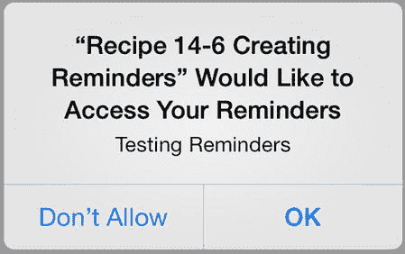

图 14-14. 应用请求访问用户提醒事项的权限，并以“测试提醒事项”作为理由

### 创建基于位置的提醒事项

现在我们将提高一点难度，创建一个基于位置的提醒事项。接下来你要实现 `addLocationBasedReminder:` 操作方法，让它创建一个新的提醒事项，并设置一个当用户离开当前位置时触发的闹钟。

同样，你将使用代码块并创建一个辅助方法来处理获取用户当前位置的操作。你很快会发现，这会更复杂一些，因为获取设备位置的 API 基于委托模式，而非代码块的使用。不过，这种复杂性将被你即将搭建的用于获取位置的简洁小型 API 所隐藏。

将代码清单 14-46 中的粗体代码添加到 `ViewController.h` 文件中。

代码清单 14-46. 修改 ViewController.h 文件以适配基于位置的提醒事项

```objc
//
//  ViewController.h
//  Remind Me
//

#import <UIKit/UIKit.h>
#import <EventKit/EventKit.h>
#import <CoreLocation/CoreLocation.h>

typedef void(^RestrictedEventStoreActionHandler)();
typedef void(^RetrieveCurrentLocationHandler)(CLLocation *);

@interface ViewController : UIViewController <CLLocationManagerDelegate>
{
@private
    CLLocationManager *_locationManager;
    RetrieveCurrentLocationHandler _retrieveCurrentLocationBlock;
    int _numberOfTries;
}

@property (weak, nonatomic) IBOutlet UIActivityIndicatorView *activityIndicator;
@property (strong, nonatomic)EKEventStore *eventStore;

- (IBAction)addTimeBasedReminder:(id)sender;
- (IBAction)addLocationBasedReminder:(id)sender;
- (void)handleReminderAction:(RestrictedEventStoreActionHandler)block;
- (void)retrieveCurrentLocation:(RetrieveCurrentLocationHandler)block;

@end
```

如你所见，`retrieveCurrentLocation:` 辅助方法的签名与你之前在上一节中创建的 `handleReminderAction:` 类似。唯一的区别在于它的代码块参数包含一个 `CLLocation *` 参数。你还通过添加 `CLLocationManagerDelegate` 协议，将 `ViewController` 类准备为位置管理器委托。此外，你已声明了三个私有实例变量，后续将在辅助方法中使用它们。

现在实现 `retrieveCurrentLocation:` 辅助方法，如代码清单 14-47 所示。

代码清单 14-47. 实现 retrieveCurrentLocation: 辅助方法

```objc
- (void)retrieveCurrentLocation:(RetrieveCurrentLocationHandler)block
{
    if ([CLLocationManager locationServicesEnabled] == NO)
    {
        UIAlertView *locationServicesDisabledAlert = [[UIAlertView alloc]
            initWithTitle:@"定位服务已关闭" message:@"此功能需要定位服务。请在设备的隐私设置中启用该功能"
            delegate:nil cancelButtonTitle:@"关闭" otherButtonTitles:nil];
        [locationServicesDisabledAlert show];
        return;
    }
    if (_locationManager == nil)
    {
        _locationManager = [[CLLocationManager alloc] init];
        _locationManager.desiredAccuracy = kCLLocationAccuracyBest;
        _locationManager.distanceFilter = 1; // 米
        _locationManager.activityType = CLActivityTypeOther;
        _locationManager.delegate = self;
    }
    _numberOfTries = 0;
    _retrieveCurrentLocationBlock = block;
    [_locationManager startUpdatingLocation];
}
```

有关此方法的详细信息，请参考第 5 章。请注意，在开始位置更新之前，你正在初始化 `_numberOfTries` 和 `_retrieveCurrentLocationBlock` 实例方法。

接下来，实现用于获取位置的委托方法，如代码清单 14-48 所示。

代码清单 14-48. 实现 locationManager:didUpdateLocation: 委托方法

```objc
- (void)locationManager:(CLLocationManager *)manager didUpdateLocations:(NSArray *)locations
{
    // 确保这是一个最近的位置事件
    CLLocation *lastLocation = [locations lastObject];
    NSTimeInterval eventInterval = [lastLocation.timestamp timeIntervalSinceNow];
    if(abs(eventInterval) < 30.0)
    {
        // 确保事件的精确度足够
```


`if (lastLocation.horizontalAccuracy >= 0 &&`  
`lastLocation.horizontalAccuracy < 20)`  
`{`  
`[_locationManager stopUpdatingLocation];`  
`_retrieveCurrentLocationBlock(lastLocation);`  
`return;`  
`}`  
`}`  

`if (_numberOfTries++ == 10)`  
`{`  
`[_locationManager stopUpdatingLocation];`  
`UIAlertView *unableToGetLocationAlert =`  
`[[UIAlertView alloc]initWithTitle:@"Error"`  
`message:@"Unable to get the current location." delegate:nil`  
`cancelButtonTitle:@"Dismiss" otherButtonTitles: nil];`  
`[unableToGetLocationAlert show];`  
`}`  
`}`  

再次参考第 5 章了解获取位置的详细信息。上述实现中需要注意以下几点：

-   调用存储在`_retrieveCurrentLocationBlock`实例变量中的代码块。
-   如果尝试十次后仍未获得足够精确的读数，则放弃并通知用户。

最后，实现`addLocationBasedReminder:`操作方法。它与之前实现的`addTimeBasedReminder:`方法非常相似，区别在于它使用了两个辅助方法，并且当然设置了基于位置的提醒。列表 14-49 展示了完整的实现，其中与`addTimeBasedReminder:`方法的不同之处已用粗体标出。

**Listing 14-49.** `addLocationBasedReminder:`方法的完整实现

```  
- (IBAction)addLocationBasedReminder:(id)sender  
{  
   [self.activityIndicator startAnimating];  
   [self retrieveCurrentLocation:  
      ^(CLLocation *currentLocation)  
      {  
         if (currentLocation != nil)  
         {  
            [self handleReminderAction:^()  
            {  
               // 创建提醒  
               EKReminder *newReminder =  
                  [EKReminder reminderWithEventStore:self.eventStore];  
               newReminder.title = @"Buy milk!";  
               newReminder.calendar =  
                  [self.eventStore defaultCalendarForNewReminders];  

               // 创建基于位置的闹钟  
               EKStructuredLocation *currentStructuredLocation =  
                  [EKStructuredLocation locationWithTitle:@"Current Location"];  
               currentStructuredLocation.geoLocation = currentLocation;  

               EKAlarm *alarm = [[EKAlarm alloc] init];  
               alarm.structuredLocation = currentStructuredLocation;  
               alarm.proximity = EKAlarmProximityLeave;  

               [newReminder addAlarm:alarm];  

               // 保存提醒  
               NSString *alertTitle;  
               NSString *alertMessage;  
               NSString *alertButtonTitle;  
               NSError *error;  

               [self.eventStore saveReminder:newReminder commit:YES error:&error];  
               if (error == nil)  
               {  
                  alertTitle = @"Information";  
                  alertMessage =  
                     [NSString stringWithFormat:@"\"%@\" was added to Reminders",  
                        newReminder.title];  
                  alertButtonTitle = @"OK";  
               }  
               else  
               {  
                  alertTitle = @"Error";  
                  alertMessage =  
                     [NSString stringWithFormat:@"Unable to save reminder: %@",  
                        error];  
                  alertButtonTitle = @"Dismiss";  
               }  

               dispatch_async(dispatch_get_main_queue(), ^{  
                  UIAlertView *alertView =  
                     [[UIAlertView alloc]initWithTitle:alertTitle  
                        message:alertMessage delegate:nil  
                        cancelButtonTitle:alertButtonTitle otherButtonTitles:nil];  
                  [alertView show];  
                  [self.activityIndicator stopAnimating];  
               });  
            }];  
         }  
      }];  
}  
```  

现在你可以构建并再次运行应用，这次创建一个基于时间的提醒和一个基于位置的提醒。图 14-15 展示了“提醒事项”应用显示通过本应用创建的两个不同提醒的示例。

**注意**  

如果你的提醒未关联到 iCloud 账户，此处可能会遇到错误。你可以通过“设置”➤“提醒事项”➤“默认列表”中的默认提醒列表进行更改。基于位置的提醒仅在与 iCloud 账户绑定时生效。如果你将其他账户（如 Microsoft Exchange 账户）设置为默认列表，则此功能将无法正常工作。

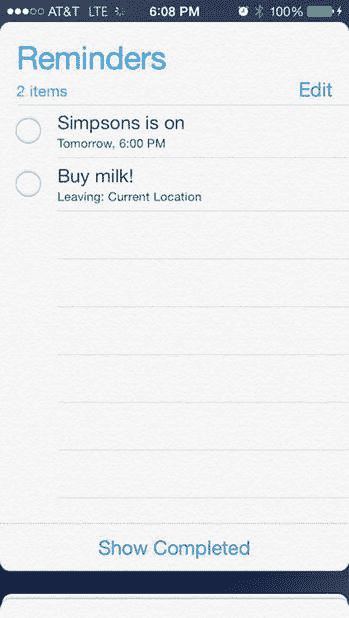  

**图 14-15.** “提醒事项”应用同时显示了一个基于时间的提醒和一个基于位置的提醒  

**警告**  

尽管可以工作，但此应用存在一个严重缺陷。由于提醒的创建运行在独立线程上，可能需要几秒钟时间，用户可能在任务完成前就点击了按钮。这会启动一个新进程，在访问相同实例变量时，可能干扰正在进行的任务并导致意外行为。解决此问题的简单方法是在提醒创建过程中禁用按钮。我们将此实现留作练习。


## 配方 14-7：访问通讯录

任何现代设备最基本的功能之一就是存储联系人信息。因此，你应该注意开发能够利用这一重要数据的应用程序。在本配方中，我们将介绍访问和处理设备联系人列表的三个基本功能。

首先，创建一个名为`My Pick Contact App`的单视图应用程序项目。

对于本配方，你需要在项目中添加两个额外的框架：`AddressBook.framework`和`AddressBookUI.framework`。

由于通讯录和日历一样是一个受限实体，你需要在应用程序的属性列表中提供使用说明。添加`Privacy – Contacts Usage Description`键，其值为`Testing Address Book Access`。

接下来，切换到视图控制器的`Main.storyboard`来编辑视图，创建一个类似于图 14-16 所示的视图。

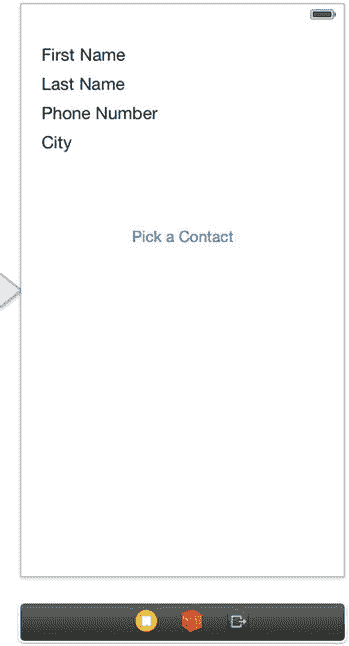

图 14-16. 用于访问联系人信息的用户界面

创建这些插座变量来将元素连接到你的代码：

- `firstNameLabel`
- `lastNameLabel`
- `phoneNumberLabel`
- `cityNameLabel`

你不需要为按钮创建插座变量，但需要创建一个名为`pickContact`的操作，供用户点击按钮时使用。

现在界面已经设置好，接下来对头文件做一些修改。首先，添加以下两个导入语句，以便访问通讯录和通讯录 UI 框架。

```
#import <AddressBook/AddressBook.h>
#import <AddressBookUI/AddressBookUI.h>
```

你将使用`ABPeoplePickerNavigationController`类的一个实例，并将其`peoplePickerDelegate`属性设置为你的视图控制器，因此你需要在头文件中添加`ABPeoplePickerNavigationControllerDelegate`协议实现。

完整的头文件现在应如代码清单 14-50 所示。

**代码清单 14-50. 完整的 ViewController.h 文件**

```
//
//  ViewController.h
//  Recipe 14-7 Accessing the Address Book
//

#import <UIKit/UIKit.h>
#import <AddressBook/AddressBook.h>
#import <AddressBookUI/AddressBookUI.h>

@interface ViewController : UIViewController <ABPeoplePickerNavigationControllerDelegate>

@property (weak, nonatomic) IBOutlet UILabel *firstNameLabel;
@property (weak, nonatomic) IBOutlet UILabel *lastNameLabel;
@property (weak, nonatomic) IBOutlet UILabel *phoneNumberLabel;
@property (weak, nonatomic) IBOutlet UILabel *cityNameLabel;

- (IBAction)pickContact:(id)sender;

@end
```

切换到实现文件。在这里你将实现`pickContact:`方法，创建一个`ABPeoplePickerNavigationController`实例，设置其代理，然后显示它，如代码清单 14-51 所示。

**代码清单 14-51. 实现 pickContact: 操作方法**

```
- (IBAction)pickContact:(id)sender
{
    ABPeoplePickerNavigationController *picker =
        [[ABPeoplePickerNavigationController alloc] init];
    picker.peoplePickerDelegate = self;
    [self presentViewController:picker animated:YES completion:nil];
}
```

现在你只需要创建代理方法，其中有三个是必须实现的。第一个也是最简单的一个是当选择器控制器被取消时触发的（代码清单 14-52）。

**代码清单 14-52. 实现 peoplePickerNavigationControllerDidCancel: 代理方法**

```
-(void)peoplePickerNavigationControllerDidCancel:
    (ABPeoplePickerNavigationController *)peoplePicker
{
    [self dismissViewControllerAnimated:YES completion:nil];
}
```

接下来，定义你的主要代理方法来处理联系人的选择。以下是分步实现的方法，展示了每个部分。

你的方法头应如代码清单 14-53 所示。

**代码清单 14-53. 方法头**

```
-(BOOL)peoplePickerNavigationController:
    (ABPeoplePickerNavigationController *)peoplePicker
shouldContinueAfterSelectingPerson:(ABRecordRef)person
```


