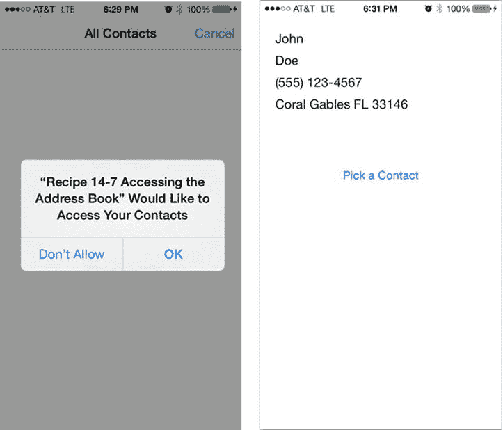
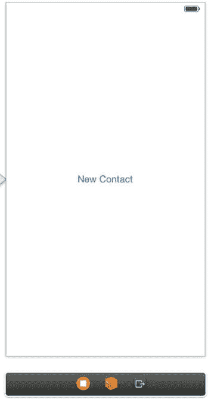
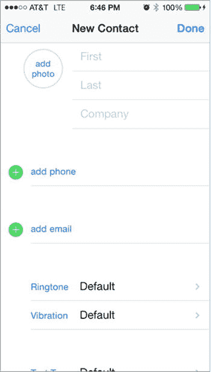
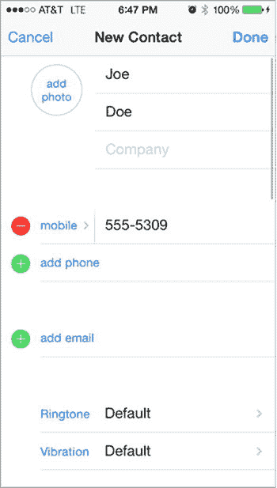

# 第一个怪异之处：非指针类型的 `ABRecordRef`

你可能会注意到这个头文件的第一个怪异之处在于，变量 `person` 的类型是 `ABRecordRef`，后面没有 `*` 符号。这本质上意味着 `person` 不是一个指针，因此不会用于调用方法。相反，你需要使用预定义的函数来使用和访问它。如你所见，地址簿框架的许多部分都采用了这种“基于 C 语言”的风格。

在方法体内部，你首先访问最简单的属性，即所选联系人的名和姓，如代码清单 14-54 所示。

**代码清单 14-54.** 设置名和姓属性

```
self.firstNameLabel.text =
(__bridge_transfer NSString *)ABRecordCopyValue(person, kABPersonFirstNameProperty);
self.lastNameLabel.text =
(__bridge_transfer NSString *)ABRecordCopyValue(person, kABPersonLastNameProperty);
```

`ABRecordCopyValue()` 函数是你在本节中访问任何数据时的主要调用函数。它接受两个参数：第一个是你要访问的 `ABRecordRef`，第二个是预定义的 `PropertyID`，用于指示函数要检索哪部分数据。

该函数可以处理两种类型的值：单值和多值。对于前两次调用，你只处理单值，此时 `ABRecordCopyValue()` 函数返回 `CFStringRef` 类型。通过在值前面添加 `(__bridge_transfer NSString *)` 代码，你可以将其转换为 `NSString`。

> **注**  
> `__bridge_transfer` 命令指定将对象的内存管理权转移给 ARC。你可以在 Apple 的文档中找到关于此内容的更多信息。

接下来你可以访问的是联系人的电话号码，这是一个多值。多值通常用于可以包含多个条目的联系人属性，例如地址、电话号码或电子邮件。当你复制此值时，将收到一个 `ABMultiValueRef` 类型的变量，然后你可以使用它来访问特定值，如代码清单 14-55 所示。

**代码清单 14-55.** 访问电话号码

```
ABMultiValueRef phoneRecord = ABRecordCopyValue(person, kABPersonPhoneProperty);
CFStringRef phoneNumber = ABMultiValueCopyValueAtIndex(phoneRecord, 0);
self.phoneNumberLabel.text = (__bridge_transfer NSString *)phoneNumber;
CFRelease(phoneRecord);
```

通过调用 `ABMultiValueCopyValueAtIndex(phoneProperty, 0)`，你指定要获取指定用户存储的第一个电话号码。然后，你可以像之前一样设置标签的文本。

接下来要处理的多值是所选联系人的主要地址。处理地址时需要额外一步，因为地址以 `CFDictionary` 形式存储。你再次使用 `ABMultiValueCopyValueAtIndex()` 函数检索此字典，然后查询其值，如代码清单 14-56 所示。

**代码清单 14-56.** 查询 `CFDictionary` 获取存储的值

```
ABMultiValueRef addressRecord = ABRecordCopyValue(person, kABPersonAddressProperty);
if (ABMultiValueGetCount(addressRecord) > 0)
{
    CFDictionaryRef addressDictionary = ABMultiValueCopyValueAtIndex(addressRecord, 0);
    self.cityNameLabel.text =
    [NSString stringWithString:
     (__bridge NSString *)CFDictionaryGetValue(addressDictionary,
                                                kABPersonAddressCityKey)];
    CFRelease(addressDictionary);
}
else
{
    self.cityNameLabel.text = @"...";
}
CFRelease(addressRecord);
```

你可能对代码清单 14-56 中的几个地方感到疑惑。首先，为什么需要释放 `addressDictionary` 和 `addressRecord`，而之前获取的名和姓值却不需要？

原因在于，在那些情况中，你通过使用 `__bridge_transfer` 类型说明符将值的所有权转移到了相应的输出口。但对于多值记录，你并未转移所有权，因此必须释放它们，否则会导致内存泄漏。

你可能感到疑惑的第二点是，下面这段代码的作用是什么：


`self.cityNameLabel.text =`  
`[NSString stringWithString:`  
`(__bridge NSString *)CFDictionaryGetValue(addressDictionary,`  
`kABPersonAddressCityKey)];`

为什么这里突然使用了`__bridge`而不是`__bridge_transfer`？为什么要用`stringWithString`类方法构造一个新的字符串？答案同样是所有权问题。`CFDictionaryGetValue()`函数与`ABMultiValueCopyValueAtIndex()`不同，它保留了对返回值的所有权。因为你想要将字符串存储到`cityNameLabel.text`属性中，需要先复制它。而且因为你不想转移原始字符串值的所有权（这会导致内存泄漏），所以使用普通的`__bridge`转换。

为了完成`peoplePickerNavigationController:shouldContinueAfterSelectingPerson:`委托方法的实现，你需要关闭模态视图控制器并返回`NO`。整体来看，你的方法应该如**列表 14-57**所示。

**列表 14-57.** 完整的`peoplePickerNavigationController:`方法

```
-(BOOL)peoplePickerNavigationController:
(ABPeoplePickerNavigationController *)peoplePicker
shouldContinueAfterSelectingPerson:(ABRecordRef)person
{
	self.firstNameLabel.text =
	(__bridge_transfer NSString *)ABRecordCopyValue(person,
	kABPersonFirstNameProperty);
	self.lastNameLabel.text =
	(__bridge_transfer NSString *)ABRecordCopyValue(person,
	kABPersonLastNameProperty);
	ABMultiValueRef phoneRecord = ABRecordCopyValue(person, kABPersonPhoneProperty);
	CFStringRef phoneNumber = ABMultiValueCopyValueAtIndex(phoneRecord, 0);
	self.phoneNumberLabel.text = (__bridge_transfer NSString *)phoneNumber;
	CFRelease(phoneRecord);
	ABMultiValueRef addressRecord = ABRecordCopyValue(person, kABPersonAddressProperty);
	if (ABMultiValueGetCount(addressRecord) > 0)
	{
		CFDictionaryRef addressDictionary =
		ABMultiValueCopyValueAtIndex(addressRecord, 0);
		self.cityNameLabel.text =
		[NSString stringWithString:
		(__bridge NSString *)CFDictionaryGetValue(addressDictionary,
		kABPersonAddressCityKey)];
		CFRelease(addressDictionary);
	}
	else
	{
		self.cityNameLabel.text = @"...";
	}
	CFRelease(addressRecord);
	[self dismissViewControllerAnimated:YES completion:nil];
	return NO;
}
```

为了完全遵循`ABPeoplePickerNavigationControllerDelegate`协议，你还需要实现第三个委托方法。它处理对特定联系人属性的选择。然而，由于本示例只是在选择联系人后返回，这个方法实际上不会被调用。为了消除编译器的警告，请添加**列表 14-58**中的方法，其实现类似于你的取消方法。

**列表 14-58.** 实现`peoplePickerNavigationController:shouldContinueAfterSelectingPerson:identifier:`委托方法

```
-(BOOL)peoplePickerNavigationController:(ABPeoplePickerNavigationController *)peoplePicker shouldContinueAfterSelectingPerson:(ABRecordRef)person property:(ABPropertyID)property identifier:(ABMultiValueIdentifier)identifier
{
	[self dismissViewControllerAnimated:YES completion:nil];
	return NO;
}
```

**注意**

当你从`ABRecordRef`复制值时，请包含一个检查，确保值存在，就像你对地址所做的那样。之前的代码假设名字、姓氏和电话号码都存在，但空查询可能导致你的应用程序抛出异常。

现在你的应用程序可以访问通讯录，选择一个用户，并显示你已经查询到的信息。该功能首次运行时，会要求你授予应用程序访问设备“通讯录”应用的权限。**图 14-17** 展示了应用在不同模式下的示例。



**图 14-17.**  
需要请求访问联系信息的权限，并从通讯录中检索联系信息并在应用中显示

虽然你还没有包含访问`ABRecordRef`所有可能值的代码，但你应该能够使用所用到函数的任何组合来访问你需要的任何值。


### 食谱 14-8\. 设置联系人信息

能够读取值与能够设置值同样重要。为此，你将实现两种不同的方法来创建和设置联系人的值，并将其添加到设备的通讯录中。

首先，创建一个新的单视图应用程序项目，并将 Address Book 和 Address Book UI 框架链接到该项目。此外，与之前的食谱一样，你需要在应用程序的属性列表中提供使用说明。添加键值为“Privacy – Contacts Usage Description”的条目，并设置其值为“Testing Creating Contacts”。

建立一个允许用户创建新联系人的简单用户界面。在 `Main.storyboard` 文件中，向视图中添加一个标题为“New Contact”的 `UIButton`，如图 14-18 所示。然后，为用户点击按钮时创建一个名为 `addNewContact:` 的操作。



**图 14-18.** 用于创建联系人的简单用户界面设置

接下来，将框架导入到头文件中，并配置视图控制器的协议以遵循相应协议。使视图控制器遵循 `ABNewPersonViewControllerDelegate` 协议，然后添加通常的两条导入语句。

```
#import <AddressBook/AddressBook.h>
#import <AddressBookUI/AddressBookUI.h>
```

现在，创建一个简单的实现，只需要定义两个方法：处理按钮选择的操作方法，以及 `ABNewPersonViewControllerDelegate` 的委托方法。

操作方法如代码清单 14-59 所示。

**代码清单 14-59.** 实现 `addNewContact:` 操作方法

```
- (IBAction)addNewContact:(id)sender
{
    ABNewPersonViewController *view = [[ABNewPersonViewController alloc] init];
    view.newPersonViewDelegate = self;
    UINavigationController *newNavigationController =
        [[UINavigationController alloc] initWithRootViewController:view];
    [self presentViewController:newNavigationController animated:YES completion:nil];
}
```

委托方法应如代码清单 14-60 所示。

**代码清单 14-60.** 实现 `newPersonViewController:didCompleteWithNewPerson:` 方法

```
- (void)newPersonViewController:(ABNewPersonViewController *)newPersonView didCompleteWithNewPerson:(ABRecordRef)person
{
    if (person == NULL)
    {
        NSLog(@"用户取消了创建");
    }
    else
    {
        NSLog(@"成功创建新联系人");
    }
    [self dismissViewControllerAnimated:YES completion:nil];
}
```

与你处理的大多数模态视图控制器不同，`ABNewPersonViewController` 只有一个委托方法，它同时处理成功和取消两种情况，而其他控制器则分别为每个情况提供单独的方法。如你所见，通过检查 `ABRecordRef person` 参数是否不为 `NULL` 来区分每种结果。由于此参数不是指针，因此你将其与 `NULL` 值（而非 `nil`）进行比较。

此时，你应该能够允许用户创建新的联系人并将其添加到通讯录中，如图 14-19 中的模拟应用程序所示。



**图 14-19.** 一个空白的 `ABNewPersonViewController`

虽然你为用户提供了很大的灵活性来设置他们想要的联系人信息，但这也意味着他们需要做很多工作，比如输入他们想要的每一个值。接下来，你将看到如何以编程方式创建记录并设置其值。为了演示方便，我们将简化操作，为 `ABNewPersonViewController` 提供硬编码的预设值。

你将使用预设值填充 `ABNewPersonViewController`。更新 `addNewContact:` 方法，从添加硬编码值开始，如代码清单 14-61 所示。

**代码清单 14-61.** 使用预设值更新 `addNewContact:` 操作方法

```
- (IBAction)addNewContact:(id)sender
{
    NSString *firstName = @"John";
```

```objc
NSString *lastName = @"Doe";
NSString *mobileNumber = @"555-123-4567";
NSString *street = @"12345 Circle Wave Ave";
NSString *city = @"Coral Gables";
NSString *state = @"FL";
NSString *zip = @"33146";
NSString *country = @"United States";
// ...
```

接下来，创建一个新的联系人记录，并为名字、姓氏和电话联系信息添加值，如列表 14-62 所示。

**列表 14-62.** 在 `addNewContact:` 操作方法中创建新联系人记录

```objc
- (IBAction)addNewContact:(id)sender
{
    // ...
    ABRecordRef contactRecord = ABPersonCreate();
    // 设置名字和姓氏记录
    ABRecordSetValue(contactRecord, kABPersonFirstNameProperty,
                     (__bridge_retained CFStringRef)firstName, nil);
    ABRecordSetValue(contactRecord, kABPersonLastNameProperty,
                     (__bridge_retained CFStringRef)lastName, nil);
    // 设置电话记录
    ABMutableMultiValueRef phoneRecord =
        ABMultiValueCreateMutable(kABMultiStringPropertyType);
    ABMultiValueAddValueAndLabel(phoneRecord,
                                 (__bridge_retained CFStringRef)mobileNumber, kABPersonPhoneMobileLabel, NULL);
    ABRecordSetValue(contactRecord, kABPersonPhoneProperty, phoneRecord, nil);
    CFRelease(phoneRecord);
    // ...
}
```

`__bridge_retained` 类型说明符表示你希望将所有权从 ARC 控制的对象（此处为 `NSString`）转移到 Core Foundation 对象（`CFStringRef`）。这是必要的，以确保这些对象不会过早地被 ARC 释放。

现在，地址记录需要更多工作来创建字典并将其添加到联系人记录中。该实现如列表 14-63 所示。

**列表 14-63.** 将地址记录添加到 `addNewContact:` 操作方法

```objc
- (IBAction)addNewContact:(id)sender
{
    // ...
    // 设置地址记录
    ABMutableMultiValueRef addressRecord =
        ABMultiValueCreateMutable(kABDictionaryPropertyType);
    CFStringRef dictionaryKeys[5];
    CFStringRef dictionaryValues[5];
    dictionaryKeys[0] = kABPersonAddressStreetKey;
    dictionaryKeys[1] = kABPersonAddressCityKey;
    dictionaryKeys[2] = kABPersonAddressStateKey;
    dictionaryKeys[3] = kABPersonAddressZIPKey;
    dictionaryKeys[4] = kABPersonAddressCountryKey;
    dictionaryValues[0] = (__bridge_retained CFStringRef)street;
    dictionaryValues[1] = (__bridge_retained CFStringRef)city;
    dictionaryValues[2] = (__bridge_retained CFStringRef)state;
    dictionaryValues[3] = (__bridge_retained CFStringRef)zip;
    dictionaryValues[4] = (__bridge_retained CFStringRef)country;
    CFDictionaryRef addressDictionary = CFDictionaryCreate(kCFAllocatorDefault,
                                                           (void *)dictionaryKeys, (void *)dictionaryValues, 5,
                                                           &kCFCopyStringDictionaryKeyCallBacks, &kCFTypeDictionaryValueCallBacks);
    ABMultiValueAddValueAndLabel(addressRecord, addressDictionary, kABHomeLabel, NULL);
    CFRelease(addressDictionary);
    ABRecordSetValue(contactRecord, kABPersonAddressProperty, addressRecord, nil);
    CFRelease(addressRecord);
    // ...
}
```

最后，使用新的联系人记录初始化并显示 `ABNewPersonerViewController`，然后释放它以避免内存泄漏，如列表 14-64 所示。

**列表 14-64.** 初始化并显示 `ABNewPersonerViewController`

```objc
- (IBAction)addNewContact:(id)sender
{
    // ...
    // 显示视图控制器
    ABNewPersonViewController *view = [[ABNewPersonViewController alloc] init];
    view.newPersonViewDelegate = self;
    view.displayedPerson = contactRecord;
    UINavigationController *newNavigationController =
        [[UINavigationController alloc] initWithRootViewController:view];
    [self presentViewController:newNavigationController animated:YES completion:nil];
    CFRelease(contactRecord);
}
```

如果你现在构建并运行应用程序，应该会看到 `ABNewPersonViewController` 中填充了预设值，如图 14-20 所示。



**图 14-20.** 通过编程方式添加预设值的 `ABNewPersonViewController`

## 总结

如你所见，有许多方法和功能可以与任意特定用户的个人数据进行交互。从重复事件到多个日历，再到大多数用户拥有的大量联系人和电话号码——所有这些信息都可以用于为每个用户个性化应用程序。在用户体验方面，能够访问、显示和编辑这些信息使我们作为开发者能够创建更强大、更独特且更有用的应用程序。

