# 15. 数据存储方案

## 摘要

在 iOS 开发中，需要理解的最重要概念之一是实现持久化存储。这意味着通过关闭或重新启动应用程序来保存和检索信息（即持久化）。就像书籍的页面在合上并重新打开后仍可阅读一样，你可以利用 iOS 中的某些关键概念，使你的信息——从最简单的值到最复杂的数据结构——能在设备上无限期存储。

在本章中，我们将介绍多种数据持久化方法，允许你将数据保存以供离线使用，包括用户默认设置、文档、数据库甚至 iCloud。我们将展示每种方法的不同优缺点、常见用途和复杂性，以便你对任何给定情况下的最佳存储方法有全面的理解。


## 配方 15-1：使用 `NSUserDefaults` 持久化数据

在开发应用程序时，您经常会遇到需要存储简单值的情况，例如用户设置或应用程序状态的某些部分。虽然有多种存储数据的方式，但最简单的是 `NSUserDefaults` 类，它专为这种简单场景而构建。

`NSUserDefaults` 类使用简单的 API 来存储基本值，例如 `NSString`、`NSNumber`、`BOOL` 等的实例。它也可以用于存储更复杂的数据结构，例如 `NSArray` 或 `NSDictionary`，只要它们不包含大量数据；例如，不应使用 `NSUserDefaults` 存储图像。

在本配方的学习中，您将构建一个简单的应用程序，该应用程序具有一个将使用 `NSUserDefaults` 持久化的状态。首先创建一个新的单视图应用程序，并为其任意命名。我们将我们的应用程序命名为“Recipe 15-1 Persisting Data with NSUserDefaults”。

设置此应用程序的用户界面。选择 `Main.storyboard` 文件以开始编辑主视图。添加两个文本字段、一个开关和一个活动指示器，并进行设置，使用户界面类似于图 15-1。

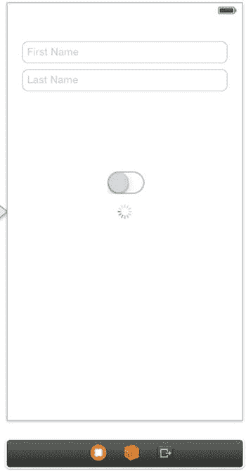

状态将被持久化的用户界面

您大概能猜到，开关用于启动和停止活动指示器。您还将编写代码来持久化开关的状态以及您在文本字段中输入的文本。

首先，您需要一种从代码中引用这些控件的方法，因此创建以下输出口：

*   `firstNameTextField`
*   `lastNameTextField`
*   `activitySwitch`
*   `activityIndicator`

您还需要拦截用户点击开关的事件，因此为其值更改事件创建一个名为 `toggleActivity` 的操作。

在 `ViewController.h` 文件中，将 `UITextFieldDelegate` 协议添加到 `ViewController` 类。稍后您需要这个来控制键盘。`ViewController.h` 文件现在应类似于代码清单 15-1。

```objc
//
//  ViewController.h
//  Recipe 15-1 Persisting Data with NSUserDefaults
//

#import <UIKit/UIKit.h>

@interface ViewController : UIViewController <UITextFieldDelegate>

@property (weak, nonatomic) IBOutlet UITextField *firstNameTextField;
@property (weak, nonatomic) IBOutlet UITextField *lastNameTextField;
@property (weak, nonatomic) IBOutlet UISwitch *activitySwitch;
@property (weak, nonatomic) IBOutlet UIActivityIndicatorView *activityIndicator;

- (IBAction)toggleActivity:(id)sender;

@end
```

现在开始实现控件的基本功能，从文本字段开始。打开 `ViewController.m` 文件，并将代码清单 15-2 中的代码添加到 `viewDidLoad` 方法中。

```objc
- (void)viewDidLoad
{
    [super viewDidLoad];
    
    self.firstNameTextField.delegate = self;
    self.lastNameTextField.delegate = self;
}
```

接下来，将代码清单 15-3 中所示的委托方法添加到实现文件中。它确保如果用户点击 Return 按钮，键盘会被移除。

```objc
-(BOOL)textFieldShouldReturn:(UITextField *)textField
{
    [textField resignFirstResponder];
    return NO;
}
```

现在是时候实现开关的行为。代码清单 15-4 展示了 `toggleActivity:` 操作方法的实现。

```objc
- (IBAction)toggleActivity:(id)sender
{
    if (self.activitySwitch.on)
    {
        [self.activityIndicator startAnimating];
    }
    else
    {
        [self.activityIndicator stopAnimating];
    }
}
```

简单的用户界面现已完全正常运行，您应该对其进行测试。您应该能够在文本字段中输入文本，并通过点击开关来启动和停止活动指示器的动画。但是，如果您关闭应用程序并重新运行，文本将消失，开关将恢复为关闭状态。让我们来实现一些持久性，好吗？

如您所知，持久化数据需要做两件事：保存数据，以及在适当的时间恢复数据。关于何时保存持久化数据，基本上有两种策略。您可以在数据更改时存储数据，也可以在应用程序终止前保存数据。在本配方中，您将实施第二种策略，即在应用程序进入后台时保存状态。

注意：通常，被挂起的应用程序不会被终止，而是进入休眠状态，并且可以在不需要持久化其数据的情况下被重新激活并恢复到相同状态。但是，在内存不足的情况下，应用程序可能会在没有警告的情况下被终止。由于无法知道您的应用程序是否正在被终止，因此应始终确保在应用程序进入后台时保存了持久化数据。

要了解应用程序何时进入后台模式，您可以使用通知中心，它为我们提供了一种轻量级的自定义委托行为，并注册一个 `UIApplicationDidEnterBackgroundNotification` 的观察者。在视图加载时执行此操作是一个好时机，因此将代码清单 15-5 中的代码添加到 `viewDidLoad` 中。

```objc
- (void)viewDidLoad
{
    [super viewDidLoad];
    // Do any additional setup after loading the view, typically from a nib.
    
    self.firstNameTextField.delegate = self;
    self.lastNameTextField.delegate = self;
    
    [[NSNotificationCenter defaultCenter] addObserver:self
                                          selector:@selector(savePersistentData:)
                                          name:UIApplicationDidEnterBackgroundNotification object:nil];
}
```

现在，您可以在 `savePersistentData:` 方法中实现持久化数据的实际存储，如代码清单 15-6 所示。

```objc
- (void)savePersistentData:(id)sender
{
    NSUserDefaults *userDefaults = [NSUserDefaults standardUserDefaults];
    
    //Set Objects/Values to Persist
    [userDefaults setObject:self.firstNameTextField.text forKey:@"firstName"];
    [userDefaults setObject:self.lastNameTextField.text forKey:@"lastName"];
    [userDefaults setBool:self.activitySwitch.on forKey:@"activityOn"];
    
    //Save Changes
    [userDefaults synchronize];
}
```

提示：您可以使用 `NSUserDefault` 的 `resetStandardUserDefaults` 方法来清除之前存储的所有数据。这是将应用程序重置为其标准设置的好方法。

现在剩下的就是在应用程序启动时加载数据。首先添加一个执行加载的方法，如代码清单 15-7 所示。

```objc
- (void)loadPersistentData:(id)sender
{
    NSUserDefaults *userDefaults = [NSUserDefaults standardUserDefaults];
    
    self.firstNameTextField.text = [userDefaults objectForKey:@"firstName"];
    self.lastNameTextField.text = [userDefaults objectForKey:@"lastName"];
    [self.activitySwitch setOn:[userDefaults boolForKey:@"activityOn"] animated:NO];
    
    if (self.activitySwitch.on)
    {
        [self.activityIndicator startAnimating];
    }
}
```

最后，从 `viewDidLoad` 方法中调用 `loadPersistentData:` 方法，如代码清单 15-8 所示。

```objc
- (void)viewDidLoad
{
    [super viewDidLoad];
    // Do any additional setup after loading the view, typically from a nib.
    
    self.firstNameTextField.delegate = self;
    self.lastNameTextField.delegate = self;
    
    [self loadPersistentData:self];
    
    [[NSNotificationCenter defaultCenter] addObserver:self
                                          selector:@selector(savePersistentData:)
                                          name:UIApplicationDidEnterBackgroundNotification object:nil];
}
```


现在，你已完成了应用状态的持久化实现。打开应用，在文本框中输入一些文字，并将活动开关拨至“开”。接着按下设备上的 Home 键，让应用进入后台模式。此时数据应已保存至 `NSUserDefault`，但为了真正验证是否成功保存，需要在重新启动应用前将其终止。为此，你可以从 Xcode 停止应用的运行，或者双击 Home 键，在挂起应用列表中找到这个“顽固”的应用；如果向上滑动应用预览图，它就会飞出屏幕并被关闭。

现在如果你重新运行应用，会发现它和你离开时的状态完全一致。图 15-2 展示了该应用重新启动后的示例。

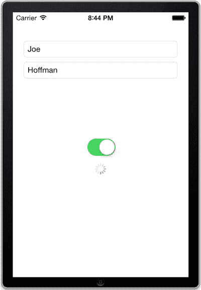

图 15-2. 一个使用 `NSUserDefaults` 从上次运行状态中恢复的应用

虽然在这个简短示例中，你并没有使用 `NSUserDefaults` 存储多种类型的值，但事实上它提供了存储几乎所有轻量级值的方法，包括 `BOOL`、`Float`、`Integer`、`Double` 和 `URL`。对于任何更复杂的对象，如 `NSString`、`NSArray` 或 `NSDictionary`，应使用通用的 `setObject:forKey:` 方法。

不过请记住，`NSUserDefaults` 只适用于相对少量的数据。在下一个示例中，我们将展示如何使用文件存储稍大的数据块。

## 示例 15-2：使用文件持久化数据

虽然 `NSUserDefaults` 类特别适合快速持久化轻量数据，但在处理大型对象（如文档、视频、音乐或图像）时效率并不高。对于这些更复杂的项目，你可以使用 iOS 文件管理系统。

在本示例中，你将创建一个简单应用，允许用户输入长文本并保存到文件。首先创建一个新的单视图应用项目，可将其命名为“Recipe 15-2 Persisting Data Using Files”。

接下来，构建一个类似图 15-3 的用户界面。你需要一个标签、一个文本字段、一个文本视图以及三个按钮。

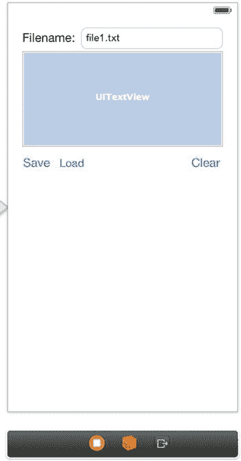

图 15-3. 一个用于编辑、保存和加载文本文件的简单应用

为各组件创建以下输出口和动作：

*   输出口：`filenameTextField` 和 `contentTextView`
*   动作：`saveContent`、`loadContent` 和 `clearContent`

用户界面设置好后，就可以开始实现其功能了。但首先，创建一个辅助方法，将相对文件名转换为设备 `Documents` 目录中的绝对文件路径。在 `ViewController.m` 文件中添加清单 15-9 所示的方法。

**清单 15-9.** 实现 `currentContentFilePath` 方法

```
- (NSString *)currentContentFilePath

{

NSArray *documentDirectories =

NSSearchPathForDirectoriesInDomains(NSDocumentDirectory, NSUserDomainMask, YES);

NSString *documentsDirectory = [documentDirectories objectAtIndex:0];

return [documentsDirectory

stringByAppendingPathComponent:self.filenameTextField.text];

}
```

当用户点击“保存”按钮时，应用需要将文本视图的内容保存到你刚创建的辅助方法提供的文件路径中。在 `saveContent:` 动作方法中添加清单 15-10 所示的实现。

**清单 15-10.** 实现 `saveContent:` 动作方法

```
- (IBAction)saveContent:(id)sender

{

NSString *filePath = [self currentContentFilePath];

NSString *content = self.contentTextView.text;

NSError *error;

BOOL success = [content writeToFile:filePath atomically:YES

encoding:NSUnicodeStringEncoding error:&error];

if (!success)

{

NSLog(@"Unable to save file: %@\nError: %@", filePath, error);

}

}
```

相反，当用户点击“加载”按钮时，应用将从文件加载内容并更新文本视图。清单 15-11 展示了 `loadContent:` 动作方法的实现。

**清单 15-11.** 实现 `loadContent:` 方法

```
- (IBAction)loadContent:(id)sender

{

NSString *filePath = [self currentContentFilePath];

NSError *error;

NSString *content = [NSString stringWithContentsOfFile:filePath

encoding:NSUnicodeStringEncoding error:&error];

if (error)

{

NSLog(@"Unable to load file: %@\nError: %@", filePath, error);

}

self.contentTextView.text = content;

}
```

最后，“清除”按钮简单地通过清单 15-12 所示的动作方法清空文本视图。

**清单 15-12.** `clearContent:` 动作方法的实现

```
- (IBAction)clearContent:(id)sender

{

self.contentTextView.text = nil;

}
```

现在你有了一个非常基础的文件文本编辑器，来试试吧。构建并运行应用。在文本视图中输入一些文字，在“文件名”文本输入框中输入文件名，然后点击“保存”按钮。应用会在设备的 `Documents` 目录中（如果你在 iOS 模拟器中运行应用，则在你的磁盘上）创建一个文件。要验证文件是否已正确保存，你可以点击“清除”重置文本视图，然后点击“加载”。你刚刚写的文字应该会重新出现在文本视图中。你也可以通过更改“文件名”文本字段的内容来创建不同的文件。


While this application works, it has a serious problem we want to address before leaving this tutorial. If content is saved to an existing file, the application silently overwrites the original file content, which may not meet user expectations. To ensure user intent is captured, you need to check if the file exists and request overwrite permission if it does. This is done by modifying the implementation of the `saveContent:` method. First, extract the actual saving logic into a helper method named `saveContentToFile`, as shown in Listing 15-13.

**Listing 15-13.** Implementation of the `saveContentToFile:` Method

```
- (void)saveContentToFile:(NSString *)filePath

{

NSString *content = self.contentTextView.text;

NSError *error;

BOOL success = [content writeToFile:filePath atomically:YES

encoding:NSUnicodeStringEncoding error:&error];

if (!success)

{

NSLog(@"Unable to save file: %@\nError: %@", filePath, error);

}

}
```

Modify the `saveContent:` method as shown in the bolded portion of Listing 15-14.

**Listing 15-14.** Updating the `saveContent:` Method to Prompt the User Before Saving

```
- (IBAction)saveContent:(id)sender

{

NSString *filePath = [self currentContentFilePath];

NSFileManager *fileManager = [NSFileManager defaultManager];

if ([fileManager fileExistsAtPath:filePath])

{

UIAlertView *overwriteAlert = [[UIAlertView alloc] initWithTitle:@"File Exists"

message:@"Do you want to replace the file?" delegate:self

cancelButtonTitle:@"No" otherButtonTitles:@"Yes", nil];

[overwriteAlert show];

}

else

[self saveContentToFile:filePath];

}
```

Add the `UIAlertViewDelegate` protocol to the `ViewController.h` file so that the view controller can act as the delegate for the alert view and intercept the user's button click action. Listing 15-15 shows this change.

**Listing 15-15.** Declaring the `UIAlertViewDelegate` Protocol in `ViewController.h`

```
//
//  ViewController.h
//  Recipe 15-2 Persisting Data Using Files
//

#import <UIKit/UIKit.h>

@interface ViewController : UIViewController <UIAlertViewDelegate>

@property (weak, nonatomic) IBOutlet UITextField *filenameTextField;
@property (weak, nonatomic) IBOutlet UITextView *contentTextView;
- (IBAction)saveContent:(id)sender;
- (IBAction)loadContent:(id)sender;
- (IBAction)clearContent:(id)sender;

@end
```

Finally, return to `ViewController.m` and add the delegate method shown in Listing 15-16 to handle the user's alert view button click event.

**Listing 15-16.** Implementing the `alertView:clickedButtonAtIndex:` Delegate Method

```
- (void)alertView:(UIAlertView *)alertView clickedButtonAtIndex:(NSInteger)buttonIndex

{

if (buttonIndex == 1)

{

// User tapped "Yes", overwrite file

NSString *filePath = [self currentContentFilePath];

[self saveContentToFile:filePath];

}

}
```

Now you're all set to run the application again. This time, if you try to save to an existing file, the system will ask whether you want to overwrite it (see Figure 15-4).

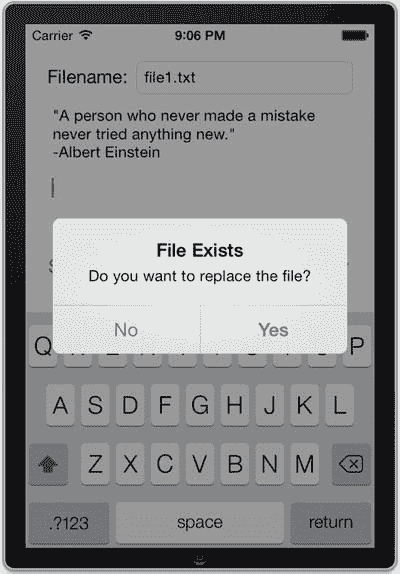

**Figure 15-4.** The Application Asking the User Whether to Overwrite an Existing File

In this demo application, you only handled text data. However, other data types are just as straightforward. For example, `NSImage` includes methods for saving and loading from files, and the same is true for most other common data types. Even if the content to be saved doesn't have direct file support, it can always be converted to an `NSData` object, which supports file operations.

While files are excellent for storing documents and independent data fragments, they are not very convenient for persisting multiple objects with internal relationships (which is the natural data model for many applications). For these applications, a better choice is to use the Core Data framework, which is the subject of the next tutorial.

## Recipe 15-3. Using Core Data

So far, you have dealt with quick implementations for lightweight values using `NSUserDefaults` and a file management system for handling substantial data. While using a file management system is very powerful for storing data, it can quickly become quite cumbersome when dealing with complex data models containing interrelated classes. For this scenario, the best option is Core Data.

In this tutorial, you will build a simple word list application that uses Core Data to persist its data. But before we begin, let's quickly understand the basics of this framework.

### Understanding Core Data

The Core Data framework is designed around the concept of relational data. However, it is not a relational database; it is an abstraction layer that sits on top of a store entity (typically SQLite). With Core Data, you can focus on the structure of your data and leave the details of the underlying relational database to the framework.

In short, Core Data, combined with Xcode, allows developers to perform three main tasks:

*   Create a data model
*   Persist information
*   Access data

First, it is important to understand what exactly a data model means. This term essentially applies to the structure built for the data of any given application. This can be something as simple as `NSString` or `NSArray` in a simple application, or a complex, interconnected system of object types, each with its own properties, methods, and pointers to other objects.

Core Data is one of the most powerful frameworks in iOS. Nevertheless, its API is surprisingly small, containing only a few classes you need to deal with. Here is a brief description of the main classes that constitute Core Data:

*   `NSManagedObjectModel`: This object is how iOS references the data model, but you rarely need to interact directly with this class. When creating the project for a first tutorial, you will see an instance of this type in the application delegate and its use in some pre-generated methods. Beyond that, you have no reason to programmatically handle this class.
*   `NSPersistentStoreCoordinator`: This class also rarely needs to be handled. It mainly works behind the scenes in the application to "coordinate" interactions between the application and the underlying database or "persistent store," but you don't need to send it any operations. The most important part you need to know about this class is the type of persistent store used. There are four types of persistent stores:
    *   `NSSQLiteStoreType`: Database store based on SQLite
    *   `NSBinaryStoreType`: Binary store type
    *   `NSInMemoryStoreType`: In-memory store
    *   `NSXMLStoreType`: Store type using XML

The default is `NSSQLiteStoreType`, which specifies using a persistent store based on SQLite. In this chapter's Core Data tutorial, we will continue to use this type.

*   `NSManagedObjectContext`: Unlike the previous two classes, this is one you will frequently handle. Simply put, this class serves as a kind of workspace for information. Any time you need to retrieve or store information, you need a pointer to this class to perform the operation. Therefore, in Core Data-based applications, it is common practice to "pass" pointers to this class between different parts of the application by setting a `NSManagedObjectContext` property for each view controller.
*   `NSManagedObject`: This class represents an instance of data within the data model.
*   `NSFetchedResultsController`: This is the main class for "fetching" results through `NSManagedObjectContext`. It is not only very powerful but also very easy to use, especially when combined with `UITableView`. In the upcoming tutorial, you will see many examples of using this class.

Now, let's start building the word list application.


### 设置 Core Data

为你的应用设置 Core Data 的最简单方法，是让 Xcode 在创建项目时生成必要的代码。使用“空应用程序”模板创建一个名为“Recipe 15-3 Using Core Data”的新项目，如图 15-5 所示。

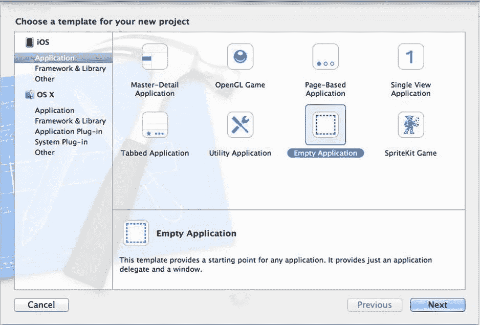

图 15-5. 使用“空应用程序”模板创建一个从零开始的空应用

在下一个输入项目名称的界面中，请务必勾选 **使用 Core Data** 复选框（见图 15-6）。

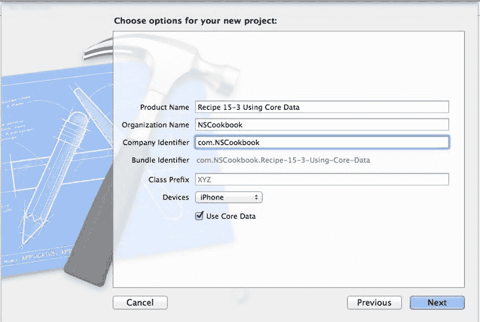

图 15-6. 勾选“使用 Core Data”选项会让 Xcode 为应用程序设置 Core Data

点击 **下一步** 后，在下一个对话框点击 **创建**，像往常一样完成项目的创建。

现在，你已经将项目设置为使用 Core Data，许多与 Core Data 框架相关的工作已经为你完成，因此你可以直接开始构建数据模型。

### 设计数据模型

对于这个应用，你将构建一个仅包含词汇表（vocabularies）和单词（words）的简单数据模型。不过，在开始在 Xcode 中进行操作之前，你需要仔细规划好模型的工作方式。

在使用数据模型时，你需要创建的第一类项目是实体（entity）。实体本质上是 Core Data 中与类（class）对应的概念，代表将存储在模型中的特定对象类型。

就像对象（或 Objective-C 中的 `NSObject`）拥有属性（properties）一样，实体也拥有属性（attributes）。这些是与特定实体相关联的较简单的数据片段，例如姓名、年龄或生日，它们不需要指向任何其他实体的指针。

每当你希望一个实体拥有指向另一个实体的指针时，你就需要使用关系（relationship）。关系可以是对一（to-one）或对多（to-many），分别表示一个实体是指向另一个实体的一个实例还是多个实例。

在处理对多关系时，你会注意到该实体拥有一个指向多个其他实体集合的指针。实体可以轻松拥有指向自身的关系，例如一个 `Person` 实体以配偶（spouse）的形式与另一个 `Person` 建立关系。你还可以设置反向关系（inverse relationships），作为实体之间来回的路径。例如，一个 `Teacher` 实体可能与 `Student` 实体有一个名为“students”的对多关系，而 `Student` 与 `Teacher` 的关系（名为“teachers”）将是它的反向。图 15-7 展示了这种双向关系的示意图。

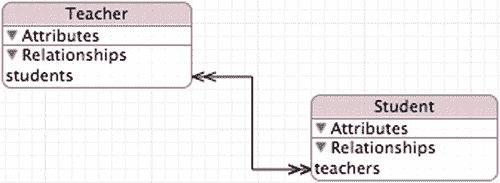

图 15-7. 两个实体之间相互指向的对多关系

因此，对于你的数据模型，你将拥有两个实体及其各自的属性和关系，如表 15-1 所定义。

表 15-1. “我的词汇表”应用的数据模型

| 实体（Entity） | 属性（Attributes） | 关系（Relationships） |
| --- | --- | --- |
| `Vocabulary` | `name` | `words` |
| `Word` | `word, translation` | `vocabulary` |

**注意：** 按照惯例，复数形式的关系名称表示对多关系，而单数名称用于对一关系。

现在，数据模型已经规划好，你可以在 Xcode 中构建它了。切换到项目中的数据模型文件，它名为 `Recipe_15_3_Using_Core_Data.xcdatamodeld`。你的视图现在应该类似于图 15-8。

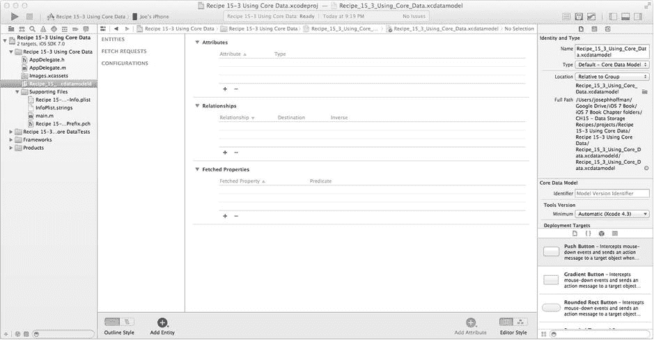

图 15-8. 包含空数据模型的数据模型编辑器

现在，添加数据模型的两个实体。你可以通过 **编辑器** 菜单，或者使用位于 Xcode 窗口底部中央区域的 **添加实体** 按钮来完成。添加实体时，你需要点击该实体，将其重命名为“Vocabulary”，然后点击 **返回**。对 `Word` 实体重复此过程。

**注意：** 在尝试配置实体之前，最好先创建所有实体；否则，你将无法设置关系。

添加两个实体后，实体列表应该类似于图 15-9。

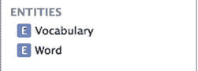

图 15-9. “我的词汇表”应用数据模型的两个实体

首先配置 `Vocabulary` 实体，请确保在 **实体** 部分中选中了“Vocabulary”文本。使用 **属性** 部分的 `+` 按钮，添加一个名为 `name` 的属性，并在 **类型** 下拉菜单中选择 `String` 类型，如图 15-10 所示。

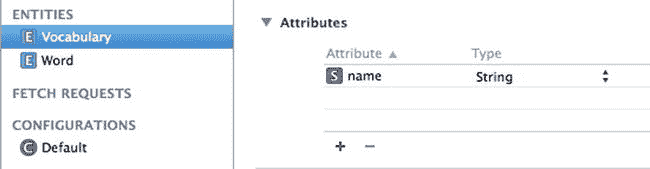

图 15-10. 一个实体 `Vocabulary`，带有一个单一属性 `name`


现在您需要定义 `Vocabulary` 实体的关系。在 **关系** (Relationships) 区域，点击该区域中的“+”按钮添加一个关系。将关系命名为 "words"。将 `Word` 实体指定为关系的目的地。在另一个实体中创建关系之前，您无法设置反向关系，因此请保留为 **无反向关系** (No Inverse)。此时，为 `Vocabulary` 实体设置的关系应如图 15-11 所示。

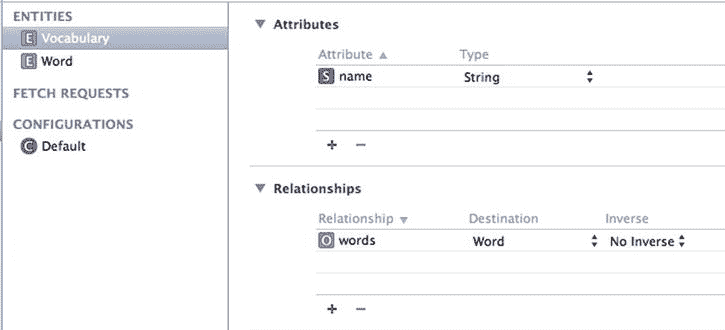

*图 15-11. 配置 Vocabulary 实体的关系*

现在，您需要将此关系定义为一对多关系。为此，请选择一个关系，然后勾选 **数据模型检查器** (Data Model Inspector)（对应于视图元素的属性检查器）中的 **一对多关系** (To-Many Relationship) 选项，如图 15-12 所示。

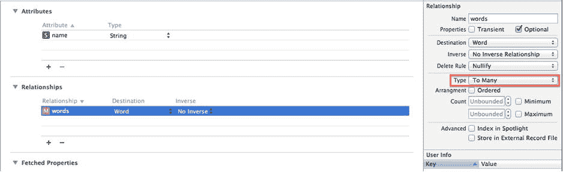

*图 15-12. 在数据模型检查器中定义一对多关系*

虽然您很可能无需担心此检查器中的大多数其他值（至少就本教程而言），但其中一个比较重要的值是 **删除规则** (Delete Rule) 下拉菜单。该值精确指定了当给定实体的实例从 `NSManagedObjectContext` 中删除时，此关系应如何处理。它有四个可选值：

*   **无操作** (No Action)：这可能是最危险的值，因为它简单地允许相关对象继续尝试访问已删除的对象。
*   **置空** (Nullify)：这是默认值，指定在删除后此关系将被置空，从而返回 `nil` 值。
*   **级联** (Cascade)：使用此值可能有点危险，因为它指定如果删除了一个对象，则通过此**删除规则**设置与之相关的所有对象也将被删除，从而避免出现 `nil` 值。如果不小心使用，可能会意外删除大量数据，但它也非常有利于保持数据整洁。例如，在包含多个对象的“文件夹”情况下，您可能会使用此规则。当文件夹被删除时，您也应该删除其中包含的所有对象。
*   **拒绝** (Deny)：只要关系不指向 `nil`，此规则就会阻止对象被删除。

在本教程中，将 **删除规则** (Delete Rule) 改为 **级联** (Cascade)，这样，如果删除了一个词汇表，与其相关的单词也会被删除。

现在，是时候配置 `Word` 实体了。采用与配置 `Vocabulary` 实体相同的方式，在 **实体** (Entities) 部分选中 "Word" 文本；然后转到 **属性** (Attributes) 部分，这次添加两个属性，命名为 `word` 和 `translation`。这两个属性的类型也使用 "String"。

此外，添加一个名为 `vocabulary` 的关系，将 **目的地** (Destination) 设置为 `Vocabulary`。现在，您还可以将反向关系设置为 `words`，如图 15-13 所示。这会自动为 `words` 关系也设置反向关系（设置为 `vocabulary`）。

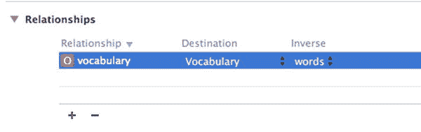

*图 15-13. 配置带有反向关系的关系*

反向关系并非总是必需的，但它们通常能使应用程序的组织和流程更顺畅，让您能够更轻松地从任何其他数据片段访问所需的任意数据片段。

由于 `vocabulary` 关系是一对一关系（一个 `Word` 只能属于一个 `Vocabulary`），因此您不应像对 `words` 关系那样选择一对多选项。

作为创建数据模型的最后一步，创建映射到相应实体的 Objective-C 类。确保选中 `Vocabulary` 实体，转到 **编辑器** (Editor) 菜单，选择 **创建 NSManagedObject 子类** (Create NSManagedObject Subclass)。然后同时选择 `Vocabulary` 实体和 `Word` 实体，点击 **下一步** (Next) 按钮，再点击 **创建** (Create) 按钮。这会将名为 `Vocabulary` 和 `Word` 的新类添加到项目中。

这就是创建数据模型所需的所有步骤。要获取数据模型的图形概览，请将 **数据模型编辑器** (Data Model Editor) 右下角的 **编辑器样式** (Editor Style) 更改为 **图形** (Graph)。**图形编辑器样式** (Graph Editor Style) 使用 UML 符号来显示实体、其属性及其关系，其中单箭头表示一对一关系，双箭头表示一对多关系。这些块最初可能全部堆叠在一起，但如果您将它们拖开，显示效果应如图 15-14 所示。

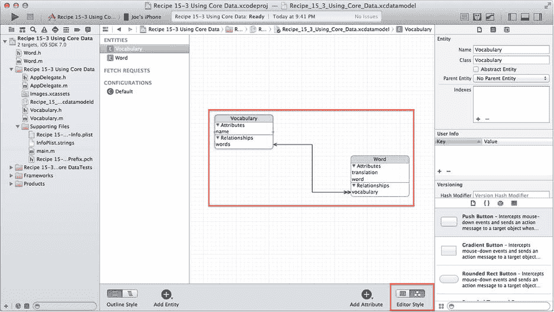

*图 15-14. 在图形编辑器样式模式下显示的数据模型*

现在您已经设置好了数据模型，可以开始构建用户界面来显示其数据了。


### 设置词汇表表格视图

接下来，你将建立一个基于导航的应用程序，其主表格视图将显示一个词汇列表。

要实现这一功能，请向项目中添加一个新类。将类命名为 `VocabulariesViewController`，并使其成为 `UITableViewController` 的子类。你不需要 `.xib` 文件，因此请保持该选项未选中状态。

**注意**  
`UITableViewController` 类会自动设置一个表格视图，并关联必要的委托属性。这是在应用程序中快速设置表格视图控制器的便捷方式。

现在，按照代码清单 15-17 所示，对 `VocabulariesViewController.h` 文件进行修改。

**代码清单 15-17.** 实现 `alertView:clickedButtonAtIndex:` 委托方法

```objc
//
//  VocabulariesViewController.h
//  Recipe 15-3 Using Core Data
//

#import <UIKit/UIKit.h>
#import "Vocabulary.h"

@interface VocabulariesViewController : UITableViewController <UIAlertViewDelegate>

@property (strong, nonatomic) NSManagedObjectContext *managedObjectContext;
@property (strong, nonatomic) NSFetchedResultsController *fetchedResultsController;

- (id)initWithManagedObjectContext:(NSManagedObjectContext *)context;

@end
```

关于代码清单 15-16 中的代码，值得注意的一点是：`fetchedResultsController` 属性负责跟踪已获取的数据，而 `managedObjectContext` 属性允许你对数据发出任何必要的请求。你可能还想知道为什么让视图控制器遵循 `UIAlertViewDelegate` 协议。原因是你稍后将使用一个警告视图作为词汇名称的输入对话框。

现在，切换到 `VocabulariesViewController.m` 文件，开始实现视图控制器。首先实现自定义初始化方法。你需要替换现有的 `initWithStyle:` 方法，如代码清单 15-18 中初始化方法所示。

**代码清单 15-18.** 实现 `initWithManagedObjectContext:` 初始化方法

```objc
- (id)initWithManagedObjectContext:(NSManagedObjectContext *)context
{
    self = [super initWithStyle:UITableViewStylePlain];
    if (self)
    {
        self.managedObjectContext = context;
    }
    return self;
}
```

接下来，添加代码清单 15-19 中的辅助方法，该方法会获取数据模型中的所有词汇，并将它们存储在 `fetchedResultsController` 属性中。

**代码清单 15-19.** 实现 `fetchVocabularies` 方法

```objc
-(void)fetchVocabularies
{
    NSFetchRequest *fetchRequest = [NSFetchRequest fetchRequestWithEntityName:@"Vocabulary"];
    NSString *cacheName = [@"Vocabulary" stringByAppendingString:@"Cache"];
    NSSortDescriptor *sortDescriptor = [NSSortDescriptor sortDescriptorWithKey:@"name" ascending:YES];
    [fetchRequest setSortDescriptors:@[sortDescriptor]];

    self.fetchedResultsController = [[NSFetchedResultsController alloc]
        initWithFetchRequest:fetchRequest managedObjectContext:self.managedObjectContext
        sectionNameKeyPath:nil cacheName:cacheName];

    NSError *error;
    if (![self.fetchedResultsController performFetch:&error])
    {
        NSLog(@"Fetch failed: %@", error);
    }
}
```

详细来说，代码清单 15-19 中的方法执行了以下操作：

获取数据时，首先需要的是一个 `NSFetchRequest` 类的实例。这里，你使用了一个指定的初始化方法来指定一个 `NSEntityDescription`，不过你也可以稍后使用 `setEntity:` 方法来添加它。虽然不是必需的，但你为获取请求设置了一个“缓存名称”，并为每个实体使用不同的缓存。如果你频繁发出获取请求，这可以略微提升应用程序的速度，因为系统会首先检查本地缓存，看该请求是否已经执行过。每个 `NSFetchRequest` 实例都必须至少关联一个 `NSSortDescriptor`。在这里，你为每个实体指定了一个基于 `name` 属性的简单字母排序。创建完所有的 `NSSortDescriptor` 后，必须使用 `setSortDescriptors:` 方法将它们附加到 `NSFetchRequest` 上。在 `NSFetchRequest` 完全配置好后，你可以使用 `NSFetchRequest` 和 `NSManagedObjectContext` 来初始化 `NSFetchedResultsController`。最后两个参数都是可选的，不过你为了优化而指定了一个 `cacheName`。如果你想忽略它们，可以将两者都设置为 `nil`。最后，你必须使用 `performFetch:` 方法来完成获取请求并检索存储的数据。使用此方法时，你可以像前面所示那样，传入一个指向 `NSError` 的指针，以便跟踪并记录获取过程中发生的任何错误。

在 `viewDidLoad` 方法中，你通过设置视图控制器的标题并加载词汇来对其进行初始化，如代码清单 15-20 所示。

**代码清单 15-20.** 修改 `viewDidLoad` 方法

```objc
- (void)viewDidLoad
{
    [super viewDidLoad];
    self.title = @"Vocabularies";
    [self fetchVocabularies];
}
```

为了避免应用程序首次运行时显示空白列表，你将在数据模型中预加载一个“西班牙语”词汇，但仅当没有词汇存在时才这样做。为此，请将代码清单 15-21 所示的代码添加到 `viewDidLoad` 方法中。

**代码清单 15-21.** 修改 `viewDidLoad` 方法以预加载词汇

```objc
- (void)viewDidLoad
{
    [super viewDidLoad];
    self.title = @"Vocabularies";
    [self fetchVocabularies];

    // 如果为空，则预加载一个“西班牙语”词汇
    if (self.fetchedResultsController.fetchedObjects.count == 0)
    {
        NSEntityDescription *vocabularyEntityDescription =
            [NSEntityDescription entityForName:@"Vocabulary"
            inManagedObjectContext:self.managedObjectContext];

        Vocabulary *spanishVocabulary = (Vocabulary *)[[NSManagedObject alloc]
            initWithEntity:vocabularyEntityDescription
            insertIntoManagedObjectContext:self.managedObjectContext];
        spanishVocabulary.name = @"Spanish";

        NSError *error;
        if (![self.managedObjectContext save:&error])
        {
            NSLog(@"Error saving context: %@", error);
        }

        [self fetchVocabularies];
    }
}
```

接下来，你需要为表格视图实现必需的委托和数据源方法。首先，实现用于指定分区数和行数的方法，如代码清单 15-22 所示。

**代码清单 15-22.** 实现 `numberOfSectionsInTableView:` 和 `tableView:numberOfRowsInSection:` 委托方法

```objc
- (NSInteger)numberOfSectionsInTableView:(UITableView *)tableView
{
    return 1;
}

- (NSInteger)tableView:(UITableView *)tableView numberOfRowsInSection:(NSInteger)section
{
    return self.fetchedResultsController.fetchedObjects.count;
}
```

如代码清单 15-22 所示，`NSFetchedResultsController` 类包含一个 `fetchedObjects` 方法，该方法返回一个包含查询结果的 `NSArray`。

代码清单 15-23 显示了配置表格视图单元格的方法。

**代码清单 15-23.** 实现 `tableView:cellForRowAtIndexPath:` 委托方法

```objc
- (UITableViewCell *)tableView:(UITableView *)tableView cellForRowAtIndexPath:(NSIndexPath *)indexPath
{
    static NSString *CellIdentifier = @"VocabularyCell";
    UITableViewCell *cell = [tableView dequeueReusableCellWithIdentifier:CellIdentifier];
    if (cell == nil)
    {
        // ... 单元格配置继续
    }
}
```


```objective-c
cell = [[UITableViewCell alloc] initWithStyle:UITableViewCellStyleValue1
reuseIdentifier:CellIdentifier];
cell.accessoryType = UITableViewCellAccessoryDisclosureIndicator;
}

Vocabulary *vocabulary = (Vocabulary *)[self.fetchedResultsController
objectAtIndexPath:indexPath];
cell.textLabel.text = vocabulary.name;
cell.detailTextLabel.text =
[NSString stringWithFormat:@"(%d)", vocabulary.words.count];
return cell;
}
```

现在主视图控制器的基本设置已经完成，是时候让它真正运行起来了，所以请转到`AppDelegate.h`文件，并添加清单 15-24 中所示的声明。

**清单 15-24.** 向 AppDelegate 添加声明

```objective-c
//
//  AppDelegate.h
//  My Vocabularies
//

#import <UIKit/UIKit.h>
#import "VocabulariesViewController.h"

@interface AppDelegate : UIResponder <UIApplicationDelegate>
@property (strong, nonatomic) UIWindow *window;
@property (readonly, strong, nonatomic) NSManagedObjectContext *managedObjectContext;
@property (readonly, strong, nonatomic) NSManagedObjectModel *managedObjectModel;
@property (readonly, strong, nonatomic) NSPersistentStoreCoordinator
*persistentStoreCoordinator;
@property (strong, nonatomic) UINavigationController *navigationController;
@property (strong, nonatomic) VocabulariesViewController *vocabulariesViewController;
- (void)saveContext;
- (NSURL *)applicationDocumentsDirectory;
@end
```

正如你在清单 15-24 的代码中所看到的，`appDelegate`已经为你设置好了 Core Data。你所要做的就是将托管对象上下文分发到应用中处理数据的各个部分。

在`AppDelegate.m`文件的`application:didFinishLaunchingWithOptions:`方法中，添加清单 15-25 中的代码来创建视图控制器并将其显示在导航控制器中。

**清单 15-25.** 创建并显示视图控制器和导航控制器

```objective-c
- (BOOL)application:(UIApplication *)application didFinishLaunchingWithOptions:(NSDictionary *)launchOptions
{
    self.window = [[UIWindow alloc] initWithFrame:[[UIScreen mainScreen] bounds]];
    self.window.backgroundColor = [UIColor whiteColor];
    self.vocabulariesViewController = [[VocabulariesViewController alloc]
    initWithManagedObjectContext:self.managedObjectContext];
    self.navigationController = [[UINavigationController alloc]
    initWithRootViewController:self.vocabulariesViewController];
    self.window.rootViewController = self.navigationController;
    [self.window makeKeyAndVisible];
    return YES;
}
```

现在是构建并运行应用的好时机，以确保一切设置正确。如果一切顺利，你应该会看到一个类似于图 15-15 的屏幕。

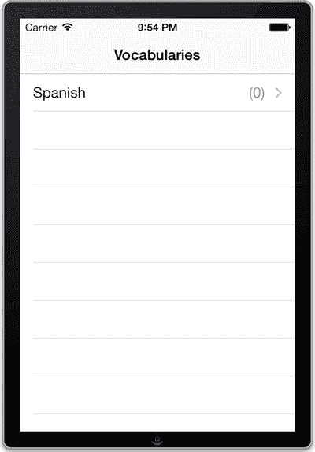

**图 15-15.** 一个包含单个词汇集的单词列表应用

为了允许用户以新词汇集的形式添加一些数据，请在导航栏上放置一个“添加”按钮。返回到`VocabulariesViewController.m`文件中的`viewDidLoad`方法，并添加清单 15-26 所示的代码。

**清单 15-26.** 向导航栏添加一个“添加”按钮

```objective-c
- (void)viewDidLoad
{
    [super viewDidLoad];
    self.title = @"Vocabularies";
    UIBarButtonItem *addButton =
    [[UIBarButtonItem alloc] initWithBarButtonSystemItem:UIBarButtonSystemItemAdd
    target:self action:@selector(add)];
    self.navigationItem.rightBarButtonItem = addButton;
    [self fetchVocabularies];
    // ...
}
```

现在实现`add`操作方法，如清单 15-27 所示。它会弹出一个提示视图，供用户输入新词汇集的名称。

**清单 15-27.** 实现 Add 操作方法

```objective-c
- (void)add
{
    UIAlertView * inputAlert = [[UIAlertView alloc] initWithTitle:@"New Vocabulary"
    message:@"Enter a name for the new vocabulary" delegate:self
    cancelButtonTitle:@"Cancel" otherButtonTitles:@"OK", nil];
    inputAlert.alertViewStyle = UIAlertViewStylePlainTextInput;
    [inputAlert show];
}
```

最后，实现`alertView:clickedButtonAtIndex:`委托方法，以便在用户点击“确定”按钮时创建新的词汇集。清单 15-28 展示了这个实现。

**清单 15-28.** 实现`alertView:clickedButtonAtIndex:`委托方法

```objective-c
- (void)alertView:(UIAlertView *)alertView clickedButtonAtIndex:(NSInteger)buttonIndex
{
    if (buttonIndex == 1)
    {
        NSEntityDescription *vocabularyEntityDescription =
        [NSEntityDescription entityForName:@"Vocabulary"
        inManagedObjectContext:self.managedObjectContext];
        Vocabulary *newVocabulary = (Vocabulary *)[[NSManagedObject alloc]
        initWithEntity:vocabularyEntityDescription
        insertIntoManagedObjectContext:self.managedObjectContext];
        newVocabulary.name = [alertView textFieldAtIndex:0].text;
        NSError *error;
        if (![self.managedObjectContext save:&error])
        {
            NSLog(@"Error saving context: %@", error);
        }
        [self fetchVocabularies];
        [self.tableView reloadData];
    }
}
```

如果你再次构建并运行应用，现在就可以添加新的词汇集了，如图 15-16 所示。

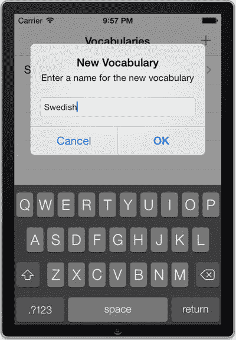

**图 15-16.** 添加一个新的词汇集

作为词汇集视图控制器的最后一个功能，实现删除项目的功能。通过实现`tableView:commitEditingStyle:forRowAtIndexPath:`委托方法来做到这一点，如清单 15-29 所示。

**清单 15-29.** 实现`tableView:commitEditingStyle:forRowAtIndexPath:`委托方法

```objective-c
-(void)tableView:(UITableView *)tableView commitEditingStyle:(UITableViewCellEditingStyle)editingStyle forRowAtIndexPath:(NSIndexPath *)indexPath
{
    if (editingStyle == UITableViewCellEditingStyleDelete)
    {
        NSManagedObject *deleted =
        [self.fetchedResultsController objectAtIndexPath:indexPath];
        [self.managedObjectContext deleteObject:deleted];
        NSError *error;
        BOOL success = [self.managedObjectContext save:&error];
        if (!success)
        {
            NSLog(@"Error saving context: %@", error);
        }
        [self fetchVocabularies];
        [self.tableView deleteRowsAtIndexPaths:@[indexPath]
        withRowAnimation:UITableViewRowAnimationRight];
    }
}
```

要测试此功能，请再次运行应用，并在列表中滑动一个项目。应该会出现一个红色按钮，允许你删除该特定项目。图 15-17 展示了此示例。

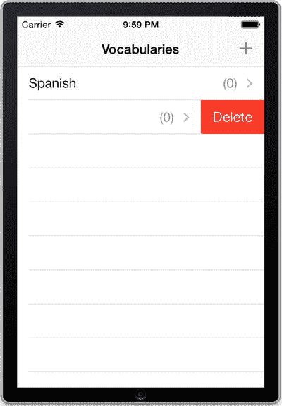

**图 15-17.** 删除一个词汇集

词汇集视图设置完毕后，就该创建处理单词的视图了。


### 实现单词视图控制器

当用户在词汇表表格视图中选择一个单元格时，将显示另一个表格视图，其中包含该词汇表的单词。

创建一个名为 `WordsViewController` 的新 `UITableViewController` 子类，同样不要选择“With XIB”选项。

你将用一个 `vocabulary` 对象来初始化 `Words` 视图控制器，因此需要为此添加一个属性和一个自定义初始化方法。你还需要导入 `Vocabulary` 和 `Word` 类。转到 `WordsViewController.h` 文件，并添加清单 15-30 中所示的声明。

**清单 15-30.** 更新 `WordsViewController.h` 文件用于单词实现

```
//
//  WordsViewController.h
//  Recipe 15-3 Using Core Data
//

#import <UIKit/UIKit.h>
#import "Vocabulary.h"
#import "Word.h"

@interface WordsViewController : UITableViewController

@property (strong, nonatomic) Vocabulary *vocabulary;
- (id)initWithVocabulary:(Vocabulary *)vocabulary;

@end
```

现在切换到 `WordsViewController.m` 文件。初始化方法只是简单地赋值 `vocabulary` 属性，逻辑非常直接。清单 15-31 展示了其实现。

**清单 15-31.** 实现 `initWithVocabulary:` 初始化方法

```
- (id)initWithVocabulary:(Vocabulary *)vocabulary
{
    self = [super initWithStyle:UITableViewStylePlain];
    if (self)
    {
        self.vocabulary = vocabulary;
    }
    return self;
}
```

此时，`viewDidLoad` 方法更加简单，仅设置视图控制器的标题，如清单 15-32 所示。

**清单 15-32.** 在 `viewDidLoad` 方法中设置标题

```
- (void)viewDidLoad
{
    [super viewDidLoad];
    self.title = self.vocabulary.name;
}
```

清单 15-33 展示了所需的数据源代理方法。

**清单 15-33.** 实现表格视图中行数和分区数所需的代理方法

```
- (NSInteger)numberOfSectionsInTableView:(UITableView *)tableView
{
    return 1;
}

- (NSInteger)tableView:(UITableView *)tableView numberOfRowsInSection:(NSInteger)section
{
    return self.vocabulary.words.count;
}
```

注意在清单 15-33 中，你是如何使用 `Vocabulary` 实体的 `words` 关系对应的属性来获取单词数量的。这就是 Core Data 强大之处开始体现的地方；你可以像处理普通对象一样处理数据，而忽略它实际上存储在数据库中的事实。

接下来，你将设计表格视图单元格，使其同时显示单词及其翻译（作为副标题）。通过添加清单 15-34 中所示的 `tableView:cellForRowAtIndexPath:` 代理方法实现来完成。

**清单 15-34.** 实现 `tableView:cellForRowAtIndexPath:` 代理方法

```
- (UITableViewCell *)tableView:(UITableView *)tableView cellForRowAtIndexPath:(NSIndexPath *)indexPath
{
    static NSString *CellIdentifier = @"WordCell";
    UITableViewCell *cell =
        [tableView dequeueReusableCellWithIdentifier:CellIdentifier];
    if (cell == nil)
    {
        cell = [[UITableViewCell alloc] initWithStyle:UITableViewCellStyleSubtitle
                                       reuseIdentifier:CellIdentifier];
        cell.accessoryType = UITableViewCellAccessoryDisclosureIndicator;
    }

    Word *word = [self.vocabulary.words.allObjects objectAtIndex:indexPath.row];
    cell.textLabel.text = word.word;
    cell.detailTextLabel.text = word.translation;

    return cell;
}
```

为了将两个视图控制器连接起来，回到 `VocabulariesViewController.h` 文件，并导入单词视图控制器的头文件，如清单 15-35 所示。

**清单 15-35.** 向 `VocabulariesViewController.h` 文件添加导入语句

```
//
//  VocabulariesViewController.h
//  Recipe 15-3 Using Core Data
//

#import <UIKit/UIKit.h>
#import "Vocabulary.h"
#import "WordsViewController.h"

@interface VocabulariesViewController : UITableViewController<UIAlertViewDelegate>

@property (strong, nonatomic) NSManagedObjectContext *managedObjectContext;
@property (strong, nonatomic) NSFetchedResultsController *fetchedResultsController;
- (id)initWithManagedObjectContext:(NSManagedObjectContext *)context;

@end
```

最后，在 `VocabulariesViewController.m` 文件中，添加清单 15-36 中所示的代理方法。

**清单 15-36.** 实现 `tableView:didSelectRowAtIndexPath:` 代理方法

```
- (void)tableView:(UITableView *)tableView didSelectRowAtIndexPath:(NSIndexPath *)indexPath
{
    Vocabulary *vocabulary = (Vocabulary *)[self.fetchedResultsController
                                            objectAtIndexPath:indexPath];
    WordsViewController *detailViewController =
        [[WordsViewController alloc] initWithVocabulary:vocabulary];
    [self.navigationController pushViewController:detailViewController animated:YES];
}
```

现在是构建并运行的好时机，以确保一切正常。你可以选择一个词汇表并查看其单词列表视图，尽管此时它还是空的，如图 15-18 所示。

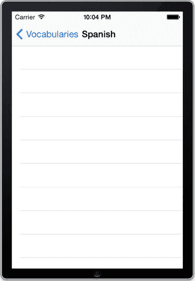

**图 15-18.** 一个没有单词的词汇表

下一步是实现一种让用户向词汇表添加单词的方式，同样以导航栏上的“添加”按钮形式实现。但在添加该按钮之前，先创建负责编辑新 `Word` 对象的视图控制器。


### 添加单词编辑视图

创建一个名为 `EditWordViewController` 的 `UIViewController`（不要像之前那样用 `UITableViewController`）子类。你需要为其构建用户界面，因此这次请确保选中“附带 XIB 用户界面”选项。

打开 `EditWordViewController.xib` 文件，并构建一个如图 15-19 所示的用户界面。由于我们将使用导航控制器，请在全视图选中的情况下，从属性检查器的顶部栏下拉菜单中选择 opaque 导航栏，将其添加到视图中。

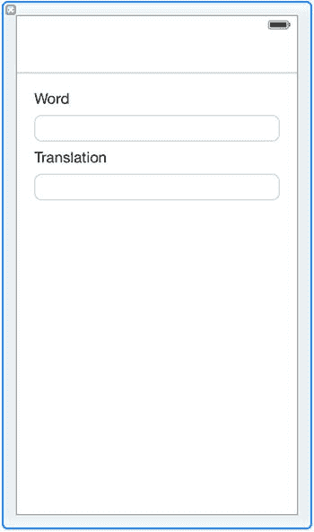

图 15-19.

用于编辑单词的简单用户界面

像往常一样，为文本字段创建输出口。分别将其命名为 `wordTextField` 和 `translationTextField`。

用户界面就绪后，便可以继续定义此视图控制器的编程接口。我们使用 Objective-C 块来简化调用方的代码，调用方通过清单 15-37 中展示的类方法呈现编辑视图控制器。

**清单 15-37.** 在 `EditWordViewController.h` 文件中声明 `editWord:` 类方法

```
+ (void)editWord:(Word *)word
inNavigationController:(UINavigationController *)navigationController
completion:(EditWordViewControllerCompletionHandler)completionHandler;
```

`EditWordViewControllerCompletionHandler` 是一个带有两个参数（`sender` 和 `canceled`）的块类型，如清单 15-38 所示。

**清单 15-38.** 创建块类型声明

```
typedef void (^EditWordViewControllerCompletionHandler)
(EditWordViewController *sender, BOOL canceled);
```

要实现此 API，你需要一些实例变量和一个自定义初始化方法。总之，请将清单 15-39 中的粗体代码添加到 `EditWordViewController.h` 文件中。

**清单 15-39.** 完整的 `EditWordViewController.h` 文件

```
//
//  EditWordViewController.h
//  Recipe 15-3 Using Core Data
//

#import <UIKit/UIKit.h>
#import "Word.h"

@class EditWordViewController;

typedef void (^EditWordViewControllerCompletionHandler)(EditWordViewController *sender, BOOL canceled);

@interface EditWordViewController : UIViewController
{
@private
    EditWordViewControllerCompletionHandler _completionHandler;
    Word *_word;
}

@property (weak, nonatomic) IBOutlet UITextField *wordTextField;
@property (weak, nonatomic) IBOutlet UITextField *translationTextField;

- (id)initWithWord:(Word *)word
        completion:(EditWordViewControllerCompletionHandler)completionHandler;

+ (void)editWord:(Word *)word
inNavigationController:(UINavigationController *)navigationController
      completion:(EditWordViewControllerCompletionHandler)completionHandler;

@end
```

现在转到 `EditWordViewController.m` 文件，并添加清单 15-40 中类方法的实现。该方法仅实例化编辑视图控制器，并将其添加到导航控制器堆栈中。

**清单 15-40.** 实现 `editWord:` 类方法

```
+ (void)editWord:(Word *)word
inNavigationController:(UINavigationController *)navigationController
      completion:(EditWordViewControllerCompletionHandler)completionHandler
{
    EditWordViewController *editViewController =
        [[EditWordViewController alloc] initWithWord:word completion:completionHandler];
    [navigationController pushViewController:editViewController animated:YES];
}
```

初始化方法将单词和完成处理程序分别存储到相应的实例变量中。清单 15-41 展示了此实现。

**清单 15-41.** `initWithWord:` 初始化方法的实现

```
- (id)initWithWord:(Word *)word completion:(EditWordViewControllerCompletionHandler)completionHandler
{
    self = [super initWithNibName:nil bundle:nil];
    if (self)
    {
        _completionHandler = completionHandler;
        _word = word;
    }
    return self;
}
```


当编辑视图控制器加载时，它会用提供的`Word`对象中的数据更新两个文本字段。它还会在导航栏中添加两个按钮：“Done”（完成）和“Cancel”（取消）。为此，请将代码清单 15-42 中的代码添加到`viewDidLoad`方法中。

**代码清单 15-42.** 修改`viewDidLoad`方法以设置文本字段并添加按钮

```
- (void)viewDidLoad
{
    [super viewDidLoad];
    self.title = @"Edit Word";
    self.wordTextField.text = _word.word;
    self.translationTextField.text = _word.translation;
    self.navigationItem.rightBarButtonItem =
    [[UIBarButtonItem alloc] initWithBarButtonSystemItem:UIBarButtonSystemItemDone
                                                  target:self action:@selector(done)];
    self.navigationItem.leftBarButtonItem =
    [[UIBarButtonItem alloc] initWithBarButtonSystemItem:UIBarButtonSystemItemCancel
                                                  target:self action:@selector(cancel)];
}
```

从代码中可以看到，两个操作方法已连接到这两个按钮。现在你需要实现它们。

第一个方法是`done`，它使用两个文本字段中的数据更新`Word`对象，然后通过调用完成处理程序块通知调用方，并为`cancel`参数发送`NO`，如代码清单 15-43 所示。

**代码清单 15-43.** 实现`Done`操作方法

```
- (void)done
{
    _word.word = self.wordTextField.text;
    _word.translation = self.translationTextField.text;
    _completionHandler(self, NO);
}
```

`cancel`操作方法则更为简单。它仅在用户取消了编辑时通知调用方，如代码清单 15-44 所示。

**代码清单 15-44.** 实现`Cancel`操作方法

```
- (void)cancel
{
    _completionHandler(self, YES);
}
```

现在你已经完成了编辑视图控制器的代码，接下来实现显示它的代码。首先，在`WordsViewController.h`文件中导入编辑视图控制器，如代码清单 15-45 所示。

**代码清单 15-45.** 将`EditWordViewController.h`文件导入到`WordsViewController.h`文件中

```
//
//  WordsViewController.h
//  Recipe 15-3 Using Core Data
//
#import <UIKit/UIKit.h>
#import "Vocabulary.h"
#import "Word.h"
#import "EditWordViewController.h"

@interface WordsViewController : UITableViewController

@property (strong, nonatomic)Vocabulary *vocabulary;
- (id)initWithVocabulary:(Vocabulary *)vocabulary;

@end
```

接下来，在单词视图控制器类的导航栏中添加一个“Add”按钮。切换到`WordsViewController.m`文件并修改`viewDidLoad`方法，如代码清单 15-46 中粗体所示。

**代码清单 15-46.** 在 WordsViewController 导航栏中创建一个“Add”按钮

```
- (void)viewDidLoad
{
    [super viewDidLoad];
    UIBarButtonItem *addButton =
    [[UIBarButtonItem alloc] initWithBarButtonSystemItem:UIBarButtonSystemItemAdd
                                                  target:self action:@selector(add)];
    self.navigationItem.rightBarButtonItem = addButton;
    self.title = self.vocabulary.name;
}
```

接下来，开始实现此按钮的操作方法，如代码清单 15-47 所示。它创建一个新的`Word`对象，并将其作为参数提供给编辑视图控制器。

**代码清单 15-47.** `Add`操作方法的初始实现

```
- (void)add
{
    NSEntityDescription *wordEntityDescription =
    [NSEntityDescription entityForName:@"Word"
                inManagedObjectContext:self.vocabulary.managedObjectContext];
    Word *newWord = (Word *)[[NSManagedObject alloc]
                             initWithEntity:wordEntityDescription
              insertIntoManagedObjectContext:self.vocabulary.managedObjectContext];
    [EditWordViewController editWord:newWord
             inNavigationController:self.navigationController completion:
     ^(EditWordViewController *sender, BOOL canceled)
     {
         // TODO: Handle edit finished
     }];
}
```

当编辑视图控制器完成时，要么在用户取消时删除新的`Word`对象，要么将其添加到词汇表中并保存到数据库。无论哪种方式，编辑视图控制器都应该从导航控制器中弹出。`add`操作方法的完整实现应如代码清单 15-48 所示。

**代码清单 15-48.** `Add`操作方法的完整实现

```
- (void)add
{
```


`NSEntityDescription *wordEntityDescription =`  
`[NSEntityDescription entityForName:@"Word"`  
`inManagedObjectContext:self.vocabulary.managedObjectContext];`  

`Word *newWord = (Word *)[[NSManagedObject alloc]`  
`initWithEntity:wordEntityDescription`  
`insertIntoManagedObjectContext:self.vocabulary.managedObjectContext];`  

`[EditWordViewController editWord:newWord`  
`inNavigationController:self.navigationController completion:`  
`^(EditWordViewController *sender, BOOL canceled)`  
`{`  
`if (canceled)`  
`{`  
`[self.vocabulary.managedObjectContext deleteObject:newWord];`  
`}`  
`else`  
`{`  
`[self.vocabulary addWordsObject:newWord];`  
`NSError *error;`  
`if (![self.vocabulary.managedObjectContext save: &error])`  
`{`  
`NSLog(@"Error saving context: %@", error);`  
`}`  
`[self.tableView reloadData];`  
`}`  
`[self.navigationController popViewControllerAnimated:YES];`  
`}];`  
`}`  

现在编译并运行，你可以通过相应单词视图中的“添加”按钮将单词添加到词汇表中。图 15-20 展示了一个示例。

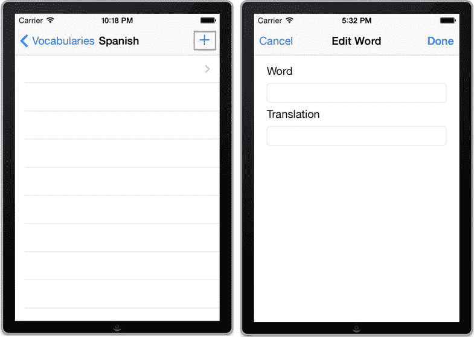  

**图 15-20.** 向词汇表中添加单词  

用户当然应该能够编辑已有的单词。你将实现这一功能：当用户选中一个单元格时，显示该单词的编辑视图。为此，请在 `WordsViewController.m` 文件的 `tableView:didSelectRowAtIndexPath:` 委托方法中添加代码清单 15-49 所示的实现。

**代码清单 15-49.** 实现 `tableView:didSelectRowAtIndexPath:` 方法  

```
- (void)tableView:(UITableView *)tableView didSelectRowAtIndexPath:(NSIndexPath *)indexPath
{
    Word *word = [self.vocabulary.words.allObjects objectAtIndex:indexPath.row];
    [EditWordViewController editWord:word
              inNavigationController:self.navigationController completion:
     ^(EditWordViewController *sender, BOOL canceled)
     {
         NSError *error;
         if (![self.vocabulary.managedObjectContext save: &error])
         {
             NSLog(@"Error saving context: %@", error);
         }
         [self.tableView reloadData];
         [self.navigationController popViewControllerAnimated:YES];
     }];
}
```  

为了让用户能够删除单词，请添加 `tableView:commitEditingStyle:forRowAtIndexPath:` 委托方法，如代码清单 15-50 所示。

**代码清单 15-50.** 实现 `tableView:commitEditingStyle:forRowAtIndexPath:` 委托方法  

```
-(void)tableView:(UITableView *)tableView
commitEditingStyle:(UITableViewCellEditingStyle)editingStyle
forRowAtIndexPath:(NSIndexPath *)indexPath
{
    if (editingStyle == UITableViewCellEditingStyleDelete)
    {
        Word *deleted = [self.vocabulary.words.allObjects objectAtIndex:indexPath.row];
        [self.vocabulary.managedObjectContext deleteObject:deleted];
        NSError *error;
        BOOL success = [self.vocabulary.managedObjectContext save:&error];
        if (!success)
        {
            NSLog(@"Error saving context: %@", error);
        }
        [self.tableView deleteRowsAtIndexPaths:@[indexPath]
                              withRowAnimation:UITableViewRowAnimationRight];
    }
}
```  

现在编译并运行，你可以在列表上滑动手指（如果在 iOS 模拟器中运行，则滑动鼠标指针）来删除单词，如图 15-21 所示。

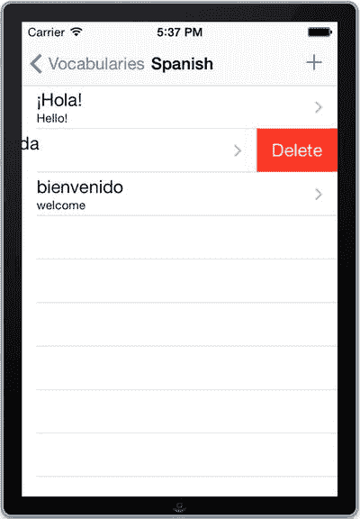  

**图 15-21.** 在西班牙语词汇列表中删除一个单词  

这个简单的单词列表应用已基本完成，但在结束本攻略之前，我们希望你修复一个小问题。你可能已经注意到，如果向某个词汇表中添加了单词并返回主视图，该词汇表的单词数量不会更新。最简单的修复方法是在视图出现时重新加载数据。为此，请在 `VocabulariesViewController.m` 文件中添加代码清单 15-51 所示的方法。

**代码清单 15-51.** 实现 `viewWillAppear:` 重写以重新加载表格  

```
- (void)viewWillAppear:(BOOL)animated
{
    [self fetchVocabularies];
    [self.tableView reloadData];
}
```  

现在再次尝试运行，你会看到括号中的数字已更新，反映了词汇表中的新单词数量（见图 15-22）。

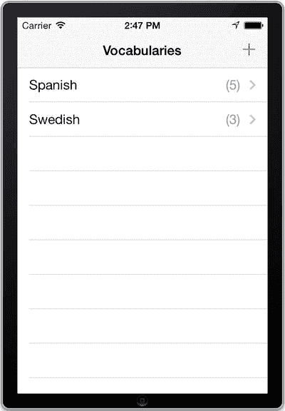  

**图 15-22.** 一个分别包含五个和三个单词的两个词汇表的单词列表应用  

在本攻略中，我们介绍了 Core Data 的基础知识，这是 iOS 开发中最核心的部分之一。你已经初步领略了它在数据建模、持久化和访问方面的强大功能与简便性。然而，我们远未详尽阐述 Core Data 框架的方方面面，甚至没有涉及许多相关的通用主题。市面上很容易找到专门介绍 Core Data 的整本书籍，你应该参考这些资料，以更全面地了解你究竟能在多大程度上控制数据的存储方式。这里的概述演示了该框架的基本用法，并解释了开始使用 Core Data 所需的关键概念，这样你就能在应用中实现简单的持久化功能，而无需担心那些更复杂的细节。如果你想进一步了解这个出色的框架，我们建议你从 Apple 的相关文档开始学习。

## 在 iCloud 上持久化数据  

iCloud 是 Apple 为 iOS 和 Mac 设备提供的数据存储服务。如果设置了 iCloud，iOS 会利用该服务执行备份以及在用户的不同设备间同步图像等任务。iCloud 提供了丰富的 API，因此你的应用也可以利用其功能，包括持久化数据以及在用户的所有设备间共享状态和文件。另一个好处是，你可以轻松地在 iOS 和 Mac 设备之间共享日历等信息。借助 Xcode 5 的新“功能”特性，你可以轻松添加 iCloud 和 Game Center 等功能，相比之前的 Xcode 版本，设置 iCloud 服务的麻烦程度大大降低。

基本上，iCloud 提供三种存储方式：

* 键值存储，可用于存储偏好设置、配置及其他小尺寸数据  
* 文档存储，用于基于文件的信息，例如图像、文本文档、包含应用状态信息的文件等  
* Core Data 存储，它实际上使用文档存储来持久化和同步应用的 Core Data  

在攻略 15-4 中，我们将展示如何在应用中实现键值存储。攻略 15-5 则展示如何在 iCloud 中创建和存储自定义文档。如果你对 iCloud 上的 Core Data 存储感兴趣，我们推荐 Apple 的文档。

**注意**  

下一个攻略需要访问 iOS 开发计划账户以及一台实体 iOS 设备。如果还没有账户，可以访问 [`http://developer.apple.com`](http://developer.apple.com/) 进行注册。


## 配方 15-4：在 iCloud 中存储键值数据

在本配方中，您将搭建一个用于在 iCloud 中存储键值数据的应用。您将使用键值存储来持久化一个控制显示文本字体大小的简单用户偏好设置。您将从应用的基本功能开始，然后实现向 iCloud 持久化存储。

创建一个名为 "Testing iCloud" 的新单视图应用项目。选择 `Main.storyboard` 文件，开始构建一个类似于图 15-23 的用户界面。

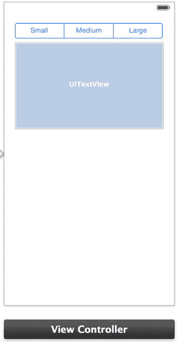

图 15-23。包含一个文本视图和一个分段控件的简单用户界面

为控件创建输出口，并分别命名为 `fontSizeSegmentedControl` 和 `documentTextView`。同时为分段控件创建一个名为 `updateTextSize` 的操作。

您可能已经猜到，用户可以通过分段控件更改文本视图中文本的大小。要实现此功能，请转到 `ViewController.m` 并将代码清单 15-52 中的代码添加到 `updateTextSize` 操作方法中。

**代码清单 15-52。实现 `updateTextSize:` 操作方法**

```
- (IBAction)updateTextSize:(id)sender
{
    CGFloat newFontSize;
    switch (self.fontSizeSegmentedControl.selectedSegmentIndex)
    {
        case 1:
            newFontSize = 19;
            break;
        case 2:
            newFontSize = 24;
            break;
        default:
            newFontSize = 14;
            break;
    }
    self.documentTextView.font = [UIFont systemFontOfSize:newFontSize];
}
```

就是这样！现在您可以运行应用，并通过分段控件更改文本大小，如图 15-24 所示。

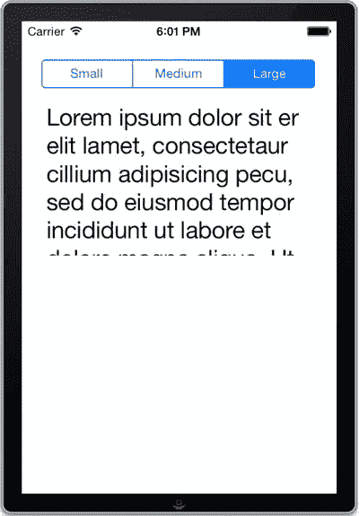

图 15-24。使用分段控件更改文本大小

请注意，如果您将文本大小更改为“大”并终止应用，此偏好设置不会被持久化，再次运行应用时会恢复为“小”。接下来您将实现持久化功能，但这一次不使用 `NSUserDefaults`，而是使用 iCloud 的键值存储。相较于本地存储，使用 iCloud 的优势在于偏好设置不仅能在设备多次运行之间持久化，还能在所有运行此应用的设备间共享。此外，如果您卸载并重新安装应用，或出于某种原因登录/退出 iCloud，这些偏好设置也不会被清除。

接下来我们继续实现此功能，但首先您需要完成一些配置任务，以便为应用设置 iCloud。

### 为应用设置 iCloud

要设置 iCloud，您必须配置授权（entitlements），这些是允许您使用 iCloud 存储的特殊键。授权将允许使用 iCloud 及其键值存储。导航到项目的目标设置，滚动并选择“功能”（Capabilities）选项卡。开启 iCloud 开关并勾选“使用键值存储”（Use Key-Value Store），如图 15-25 所示。随后 Xcode 会自动生成包含正确设置的授权文件。

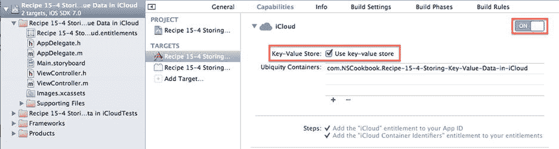

图 15-25。启用授权以允许与 iCloud 通信

这就是在 iOS 7 中设置 iCloud 所需的全部操作。在 iOS 7 和 Xcode 5 之前，设置 iCloud 需要登录开发者网站的成员中心并执行几个不同的步骤。至少可以说这是一个令人烦恼的过程。现在 Xcode 会在后台为您完成所有操作。

### 在 iCloud 键值存储中持久化数据

现在您将着手实现将文本大小偏好设置存储到 iCloud 键值存储中。首先，您需要一个属性来存储对键值存储的引用。转到 `ViewController.h` 并添加代码清单 15-53 中所示的声明。

**代码清单 15-53。在 `ViewController.h` 文件中添加 `NSUbiquitousKeyValueStore`**

```
//
//  ViewController.h
//  Recipe 15-4 Storing Key-Value Data in iCloud
//

#import <UIKit/UIKit.h>

@interface ViewController : UIViewController

@property (weak, nonatomic) IBOutlet UISegmentedControl *fontSizeSegmentedControl;
@property (weak, nonatomic) IBOutlet UITextView *documentTextView;
@property (strong, nonatomic) NSUbiquitousKeyValueStore *iCloudKeyValueStore;

- (IBAction)updateTextSize:(id)sender;

@end
```

现在切换到 `ViewController.m` 并将代码清单 15-54 中的代码添加到 `viewDidLoad` 方法中。

**代码清单 15-54。在 `viewDidLoad` 方法中设置 iCloud**

```
- (void)viewDidLoad
{
    [super viewDidLoad];
    self.iCloudKeyValueStore = [NSUbiquitousKeyValueStore defaultStore];
    [[NSNotificationCenter defaultCenter] addObserver:self
                                             selector:@selector(handleStoreChange:)
                                                 name:NSUbiquitousKeyValueStoreDidChangeExternallyNotification
                                               object:self.iCloudKeyValueStore];
    [self.iCloudKeyValueStore synchronize];
    [self updateUserInterfaceWithPreferences];
}
```

代码清单 15-54 中的代码执行以下操作：

- 获取对键值存储的引用
- 注册通知，当键值存储中的数据被外部源更改时接收通知（`NSUbiquitousKeyValueStoreDidChangeExternallyNotification`）
- 通过调用 `synchronize` 确保键值存储缓存是最新的
- 使用键值存储中的值更新用户界面

注意：在此处，您直接在主视图控制器中设置 iCloud 访问，这在本次配方中是可行的。然而，在一个有多个视图控制器访问键值存储的应用中，您应该在应用委托中进行设置，并将引用分发给所有需要它的设备。

接下来，实现当 iCloud 数据被外部源（如另一台设备）更改时的通知处理程序。出于本配方的目的，您只需使用新值更新用户界面，如代码清单 15-55 所示。

**代码清单 15-55。实现 `handleStoreChange:` 方法**

```
- (void)handleStoreChange:(NSNotification *)notification
{
    [self updateUserInterfaceWithPreferences];
}
```

`updateUserInterfaceWithPreference` 辅助方法从键值存储中提取文本大小值，并设置分段控件的选中索引。此实现如代码清单 15-56 所示。

**代码清单 15-56。实现 `updateUserInterfaceWithPreferences` 方法**

```
- (void)updateUserInterfaceWithPreferences
{
    NSInteger selectedSize = [self.iCloudKeyValueStore doubleForKey:@"TextSize"];
    self.fontSizeSegmentedControl.selectedSegmentIndex = selectedSize;
    [self updateTextSize:self];
}
```

最后，当用户使用分段控件更改文本大小时，您应该将新值写入键值存储以实现 iCloud 中的持久化。将代码添加到 `updateTextSize:` 操作方法中，如代码清单 15-57 所示。

**代码清单 15-57。更新 `updateTextSize:` 方法以写入键值存储**

```
- (IBAction)updateTextSize:(id)sender
{
    CGFloat newFontSize;

    switch (self.fontSizeSegmentedControl.selectedSegmentIndex)
    {
        case 1:
            newFontSize = 19;
            break;
        case 2:
            newFontSize = 24;
            break;
        default:
            newFontSize = 14;
            break;
    }

    self.documentTextView.font = [UIFont systemFontOfSize:newFontSize];

    // 更新偏好设置
    NSInteger selectedSize = self.fontSizeSegmentedControl.selectedSegmentIndex;
    [self.iCloudKeyValueStore setDouble:selectedSize forKey:@"TextSize"];
}
```


你在这里使用 `setDouble:forKey:` 方法存储了一个整型值，但实际上，你可以存储任何符合键值对规范的数据，比如 `NSString` 字符串、`BOOL` 布尔值、`NSData` 对象，甚至是 `NSArray` 数组和 `NSDictionary` 字典对象。

这就是将偏好值存储到 iCloud 所需的全部操作。但在测试你的应用程序之前，必须确保测试设备已正确配置，以便与 iCloud 配合使用。在设备的“设置”应用中，导航到 iCloud 部分。为了让此应用程序能够存储数据，你的 iCloud 账户必须正确配置并通过验证。这需要你验证电子邮件地址并将其注册为 Apple ID。“文稿与数据”选项也应设置为“开”，如图 15-26 所示。当然，一旦账户通过验证，你可以轻松配置它。

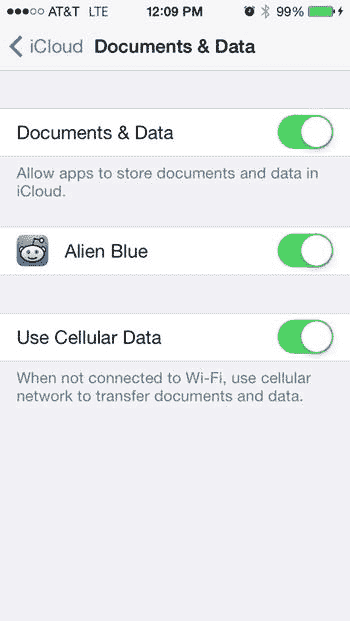

图 15-26. 必须启用“文稿与数据”才能在 iCloud 中存储信息

在设备上设置好 iCloud 后，你可以构建并运行应用程序，以测试其新的持久化功能。现在，你应该能够执行以下操作：

*   将文本大小偏好设置为“中等”或“大”，终止应用程序，然后重新启动；它现在应该自动将偏好设置为你选择的值。
*   将文本大小偏好设置为“中等”或“大”，从设备上卸载应用程序，然后重新安装；一两秒钟后，它应该自动将偏好设置为卸载之前的值。
*   在两个不同的设备上运行应用程序，在一台设备上更改偏好，然后看到该更改自动反映在另一台设备上（更改生效可能需要一些时间）。

这一切看起来不错；然而，这种实现存在一个问题。如果 iCloud 被关闭或不可用，它将无法工作。你可以通过在 iOS 模拟器（它不支持 iCloud）中运行应用程序来轻松测试这一点。你会看到持久化功能不起作用，并且每次启动时，应用程序都会将文本大小重置为“小”。

基于这些原因，建议除了使用 iCloud 键值存储之外，还将值保存在本地 `NSUserDefaults` 缓存中。这会使你的应用程序更加强大，并且能够更好地应对因 iCloud 访问问题而导致的故障。幸运的是，修复起来很简单，下一节将说明这一点。

### 使用 NSUserDefaults 本地缓存 iCloud 数据

首先，在 `ViewController.h` 文件中添加一个 `NSUserDefaults` 属性，如列表 15-58 所示。

列表 15-58. 在 ViewController.h 文件中添加 NSUserDefaults 属性

```
//
//  ViewController.h
//  Recipe 15-4 Storing Key-Value Data in iCloud
//

#import <UIKit/UIKit.h>

@interface ViewController : UIViewController

@property (weak, nonatomic) IBOutlet UISegmentedControl *fontSizeSegmentedControl;
@property (weak, nonatomic) IBOutlet UITextView *documentTextView;
@property (strong, nonatomic) NSUbiquitousKeyValueStore *iCloudKeyValueStore;
@property (strong, nonatomic) NSUserDefaults *userDefaults;

- (IBAction)updateTextSize:(id)sender;

@end
```

设置本地缓存只需要做几处更改。首先，在 `viewDidLoad` 中初始化该属性，如列表 15-59 所示。

列表 15-59. 从 viewDidLoad 方法初始化 userDefaults 属性

```
- (void)viewDidLoad
{
    [super viewDidLoad];
    self.iCloudKeyValueStore = [NSUbiquitousKeyValueStore defaultStore];
    self.userDefaults = [NSUserDefaults standardUserDefaults];
    // ...
}
```

接下来，当偏好值写入 iCloud 时，你也将相同的值写入 `NSUserDefaults`。为此，将列表 15-60 中的加粗行添加到 `updateTextSize:` 方法中。

列表 15-60. 更新 updateTextSize 方法以将值添加到 NSUserDefaults

```
- (IBAction)updateTextSize:(id)sender
{
    // ...
    // 更新偏好设置
    NSInteger selectedSize = self.sizeSegmentedControl.selectedSegmentIndex;
    [self.userDefaults setDouble:selectedSize forKey:@"TextSize"];
    [self.userDefaults synchronize];
    [self.iCloudKeyValueStore setDouble:selectedSize forKey:@"TextSize"];
}
```

最后，在更新用户界面时，不要盲目地从 iCloud 键值存储中取值，而是先检查该值是否存在。如果不存在，则改用本地缓存中的值。列表 15-61 展示了 `updateUserInterfaceWithPreferences` 方法的全新实现。

列表 15-61. updateUserInterfaceWithPreferences 方法的新实现

```
- (void)updateUserInterfaceWithPreferences
{
    NSInteger selectedSize;

    if ([self.iCloudKeyValueStore objectForKey:@"TextSize"] != nil)
    {
        // iCloud 值存在
        selectedSize = [self.iCloudKeyValueStore doubleForKey:@"TextSize"];
        // 确保本地缓存同步
        [self.userDefaults setDouble:selectedSize forKey:@"TextSize"];
        [self.userDefaults synchronize];
    }
    else
    {
        // iCloud 不可用，使用本地缓存的值
        selectedSize = [self.userDefaults doubleForKey:@"TextSize"];
    }

    self. fontSizeSegmentedControl.selectedSegmentIndex = selectedSize;
    [self updateTextSize:self];
}
```

现在，无论是否使用 iCloud，应用程序都应该能够正常工作，并持久化其字体大小偏好设置。

正如你所见，使用 iCloud 键值存储极其简单。但有一个问题：你不能存储大块的数据。每个应用程序的存储限制为 1 MB，并且你最多只能使用 1024 个键来存储数据。这使得它不适合用于应用程序数据模型存储。为此，你可以使用文档存储，这正是下一节食谱的内容。


