# 配方 15-5：在 iCloud 中存储 UIDocument  

除了键值存储之外，iCloud 账户还可能包含一个或多个 ubiquity 容器。ubiquity 容器就像是设备上的一个文件夹，它会自动与 iCloud 中对应的文件夹同步。借助 `UIDocument` API，你可以创建自定义文档，并将其存储在这样的 ubiquity 容器中。

在本配方中，你将在配方 15-4 的项目基础上进行扩展，允许用户将文本作为文档存储在 iCloud 中。你可能已经注意到，当我们启用 iCloud 时，系统已经为你创建了一个 ubiquity 容器，如图 15-27 所示。在之前的 Xcode 版本中，你需要手动添加 ubiquity 容器；好在现在不再需要了。

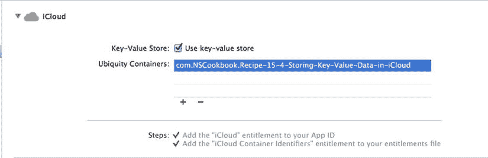

**图 15-27.** 我们在配方 15-4 中创建的 ubiquity 容器  

首先，对用户界面进行小幅修改。打开 `Main.storyboard` 文件，向视图控制器添加一个按钮，如图 15-28 所示。请注意，我们减小了文本视图的高度，以便用户在使用非 4 英寸屏幕输入文本时，“保存”按钮不会被键盘遮挡。

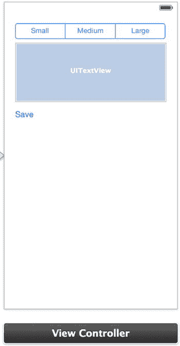

**图 15-28.** 添加了“保存”按钮的用户界面，用于在 iCloud 中存储文本文档  

同时，为“保存”按钮创建一个名为 `saveDocument` 的操作。

接下来，你将创建一个 `UIDocument` 子类，用于处理文本的保存和加载。将新类命名为 `MyDocument`。

该文档包含两个属性：一个用于存储文本，另一个用于存储代理对象，以便在远程文本文档发生更改时通知视图控制器。打开 `MyDocument.h` 文件，并添加清单 15-62 中的代码。

**清单 15-62.** 向 `MyDocument.h` 文件添加协议和属性  

```
//
//  MyDocument.h
//  Recipe 15-5 Storing UIDocuments in iCloud
//

#import <UIKit/UIKit.h>

@class MyDocument;

@protocol MyDocumentDelegate <NSObject>
- (void)documentDidChange:(MyDocument*)document;
@end

@interface MyDocument : UIDocument
@property (strong, nonatomic) NSString *text;
@property (weak, nonatomic) id<MyDocumentDelegate> delegate;
@end
```

`UIDocument` 类要求你实现两个方法。第一个是 `contentsForType:error:`，用于将数据编码为存储格式。在此示例中，你使用 UTF8 编码来保存字符串（清单 15-63）。

**清单 15-63.** 实现 `contentsForType:error:` 方法  

```
- (id)contentsForType:(NSString *)typeName error:(NSError *__autoreleasing *)outError
{
    if (!self.text)
        self.text = @"";
    return [self.text dataUsingEncoding:NSUTF8StringEncoding];
}
```

另一个方法是 `loadFromContents:ofType:error:`，它执行相反的操作：从原始数据构建 `NSString` 并设置到你的属性中。在清单 15-64 所示的实现中，该方法还会调用代理对象，以通知视图控制器内容已更改。

**清单 15-64.** `loadFromContents:ofType:error:` 方法的实现  

```
-(BOOL) loadFromContents:(id)contents ofType:(NSString *)typeName error:(NSError *__autoreleasing *)outError
{
    if ([contents length] > 0)
    {
        self.text = [[NSString alloc] initWithBytes:[contents bytes] length:[contents length] encoding:NSUTF8StringEncoding];
    }
    else
    {
        self.text = @"";
    }
    [self.delegate documentDidChange:self];
    return YES;
}
```

现在你的数据模型已经配置完成（没错，就是如此简单！），接下来可以继续实现文档的持久化存储。打开 `ViewController.h` 文件，添加两个属性声明：一个用于引用文档，另一个用于文档的 URL。同时，添加 `MyDocumentDelegate` 协议，使视图控制器成为文档的代理对象。`ViewController.h` 文件现在应如清单 15-65 所示。

**清单 15-65.** 完整的 `ViewController.h` 文件实现  

```
//


`// ViewController.h`
`// Recipe 15-5 Storing UIDocuments in iCloud`
`//`
`#import <UIKit/UIKit.h>`
`#import "MyDocument.h"`

`@interface ViewController : UIViewController <MyDocumentDelegate>`

`@property (weak, nonatomic) IBOutlet UISegmentedControl *fontSizeSegmentedControl;`
`@property (weak, nonatomic) IBOutlet UITextView *documentTextView;`
`@property (strong, nonatomic) NSUbiquitousKeyValueStore *iCloudKeyValueStore;`
`@property (strong, nonatomic) NSUserDefaults *userDefaults;`
`@property (strong, nonatomic) MyDocument *document;`
`@property (strong, nonatomic) NSURL *documentURL;`

`- (IBAction)updateTextSize:(id)sender;`
`- (IBAction)saveDocument:(id)sender;`

`@end`

接下来，转到`ViewController.m`文件。在`viewDidLoad`方法中，添加**清单 15-66**中的粗体行，以便在有持久化文本时启动文本视图的更新。

**清单 15-66. 添加方法调用以更新文档**

```
- (void)viewDidLoad
{
    [super viewDidLoad];
    self.iCloudKeyValueStore = [NSUbiquitousKeyValueStore defaultStore];
    self.userDefaults = [NSUserDefaults standardUserDefaults];
    [[NSNotificationCenter defaultCenter] addObserver:self
                                             selector:@selector(handleStoreChange:)
                                                 name:NSUbiquitousKeyValueStoreDidChangeExternallyNotification
                                               object:self.iCloudKeyValueStore];
    [self.iCloudKeyValueStore synchronize];
    [self updateUserInterfaceWithPreferences];
    [self updateDocument];
}
```

`updateDocument`方法首先检查 iCloud 是否可用，如**清单 15-67**所示。

**清单 15-67. `updateDocument`方法的初步实现**

```
- (void)updateDocument
{
    NSFileManager *fileManager = [NSFileManager defaultManager];
    id iCloudToken = [fileManager ubiquityIdentityToken];
    if (iCloudToken)
    {
        // iCloud available
        // Register to notifications for changes in availability
        [[NSNotificationCenter defaultCenter] addObserver:self
                                                 selector:@selector(handleICloudDidChangeIdentity:)
                                                     name:NSUbiquityIdentityDidChangeNotification object:nil];
        //TODO: Open existing document or create new
    }
    else
    {
        // No iCloud access
        self.documentURL = nil;
        self.document = nil;
        self.documentTextView.text = @"<NO iCloud Access>";
    }
}
```

如果 iCloud 可用，`updateDocument`会创建一个`MyDocument`实例，如果该文档存在于万能容器中则打开它，否则保存它以进行上传。为避免在此期间冻结用户界面，它将在不同的线程上执行这些操作，如**清单 15-68**所示。

**清单 15-68. 完成的`updateDocument`方法**

```
- (void)updateDocument
{
    NSFileManager *fileManager = [NSFileManager defaultManager];
    id iCloudToken = [fileManager ubiquityIdentityToken];
    if (iCloudToken)
    {
        // iCloud available
        // Register to notifications for changes in availability
        [[NSNotificationCenter defaultCenter] addObserver:self
                                                 selector:@selector(handleICloudDidChangeIdentity:)
                                                     name:NSUbiquityIdentityDidChangeNotification object:nil];
        dispatch_async(dispatch_get_global_queue(DISPATCH_QUEUE_PRIORITY_DEFAULT, 0),
        ^{
            NSURL *documentContainer = [[fileManager URLForUbiquityContainerIdentifier:nil]
                URLByAppendingPathComponent:@"Documents"];
            if (documentContainer != nil)
            {
                self.documentURL =
                    [documentContainer URLByAppendingPathComponent:@"mydocument.txt"];
                self.document =
                    [[MyDocument alloc] initWithFileURL:self.documentURL];
                self.document.delegate = self;
                // If the file exists, open it; otherwise, create it.
                if ([fileManager fileExistsAtPath:self.documentURL.path])
                    [self.document openWithCompletionHandler:nil];
                else
                    [self.document saveToURL:self.documentURL
                            forSaveOperation:UIDocumentSaveForCreating
                           completionHandler:nil];
            }
        });
    }
    else
    {
        // No iCloud access
        self.documentURL = nil;
        self.document = nil;
        self.documentTextView.text = @"<NO iCloud Access>";
    }
}
```

为了处理用户退出 iCloud 或切换到不同帐户的情况，请添加**清单 15-69**所示的`handleICloudDidChangeIdentity:`通知方法的实现。它只是调用了`updateDocument`辅助方法。

**清单 15-69. 实现`handleICloudDidChangeIdentity:`方法**

```
- (void)handleICloudDidChangeIdentity: (NSNotification *)notification
{
    NSLog(@"ID changed");
    [self updateDocument];
}
```

当文档内容发生更改时，应用程序应更新文本视图。这通过`documentDidChange:`委托方法完成。由于它可能在任何线程上被调用，因此需要确保更新在主线程上执行，如**清单 15-70**所示。

**清单 15-70. 实现`documentDidChange:`方法**

```
- (void)documentDidChange:(MyDocument *)document
{
    dispatch_async(dispatch_get_main_queue(),
    ^{
        self.documentTextView.text = document.text;
    });
}
```

最后，当用户点击“保存”按钮时，文档将使用新文本进行更新并保存到 iCloud。为此，请添加**清单 15-71**所示的`saveDocument:`操作方法实现。

**清单 15-71. 实现`saveDocument:`操作方法**

```
- (IBAction)saveDocument:(id)sender
{
    if (self.document)
    {
        self.document.text = self.documentTextView.text;
        [self.document saveToURL:self.documentURL
                forSaveOperation:UIDocumentSaveForOverwriting completionHandler:
        ^(BOOL success)
        {
            if (success) {
                NSLog(@"Written to iCloud");
            } else {
                NSLog(@"Error writing to iCloud");
            }
        }];
    }
}
```

就是这样！假设你的设备已正确配置，你的简单应用程序就可以使用用户的 iCloud 帐户存储文档，从而使你能够轻松地在多个设备、应用程序关闭甚至系统重置之间持久化数据，如图 15-29 所示。

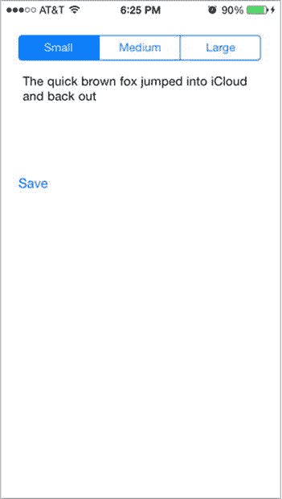

**图 15-29. 应用程序中文本已从 iCloud 保存并加载**

## 总结

数据持久化是开发应用程序时最重要的考虑因素之一。开发者必须考虑他们想要存储的数据类型、数据量、数据间的关联，以及他们的应用程序是否可能跨多个设备运行。在此基础上，必须选择使用哪种方法来存储数据，无论是简单的`NSUserDefaults`方法、文件管理系统，还是复杂的 Core Data 框架。除此之外，相对较新的 iCloud 服务已经彻底改变了应用程序存储数据的方式，允许在运行相同应用程序的设备之间以近乎实时的方式进行数据持久化。随着内存、存储和移动应用程序在技术世界中规模、重要性和相关性的不断增长，这些主题将变得愈发重要。通过深入理解 iOS 中最新的数据持久化概念，你可以始终为用户提供最快、最高效、最强大的数据存储方法。


# 16\. 数据传输范例

**摘要**

随着时间推移和技术发展，最明显的趋势之一是用户生成内容的增长。得益于设计技术的进步、互联网连接速度的提升以及网络可用性的增强，每年产生的电子数据量以近乎难以置信的速度增长。这一问题的核心在于让用户能够轻松接收并重新分发信息。虽然苹果提供的社交共享工具（见第 8 章）非常适合与多人共享内容，或快速生成电子邮件和短信，但有时你可能需要更个性化的体验，例如直接编写短信和电子邮件，甚至允许用户打印某些内容以便保存。本章将涵盖这些重要功能，而这些功能往往被其他 iOS 参考资料所忽略。

在本章中，你只需要一台实体设备来实现短信功能——这将在你的第一个范例中构建。其他所有功能都可以通过模拟实现。

## 范例 16-1：编写短信

短信仍然是个体间传输数据最流行的方法之一。它快速、简单且强大，几乎适用于所有年龄层。在 iOS 中，你可以将短信功能集成到应用程序中，并提供简单的跨应用功能，这能轻松提升应用的整体质量。

首先，创建一个名为“范例 16-1 编写短信”的新项目，你将在本章中一直使用它。照例使用“单视图应用”模板来创建项目。

点击创建项目后，切换到 `Main.storyboard` 文件开始编辑界面。在视图的上半部分添加一个带有默认“Lorem Ipsum”文本的 `UITextView`，并在下半部分添加一个标签为“短信”的 `UIButton`。将它们作为输出口连接到视图控制器，属性名分别为 `inputTextView` 和 `textMessageButton`。将视图控制器的背景设置为“分组表格视图背景色”。同时，为按钮创建一个名为 `textMessage` 的操作。

在继续之前，将 `QuartzCore` 框架导入到视图控制器的头文件中，如代码清单 16-1 所示。这将允许你为文本视图添加圆角半径，使其外观更佳。

**代码清单 16-1.** 将 `QuartzCore` 导入到 `ViewController.h` 文件

```
//
//  ViewController.h
//  范例 16-1 编写短信
//

#import <UIKit/UIKit.h>
#import <QuartzCore/QuartzCore.h>

@interface ViewController : UIViewController

@property (weak, nonatomic) IBOutlet UITextView *inputTextView;
@property (weak, nonatomic) IBOutlet UIButton *textMessageButton;
- (IBAction)textMessage:(id)sender;

@end
```

现在，将代码清单 16-2 中以粗体显示的行添加到 `viewDidLoad` 方法中。这将为文本视图创建圆角效果。

**代码清单 16-2.** 创建文本视图圆角

```
- (void)viewDidLoad
{
    [super viewDidLoad];
    self.inputTextView.layer.cornerRadius = 15.0;
}
```

你现在可以在 iPhone 模拟器中测试应用了。在准备发送短信之前，你不需要实体设备。你的视图现在应类似于图 16-1 中模拟的视图。

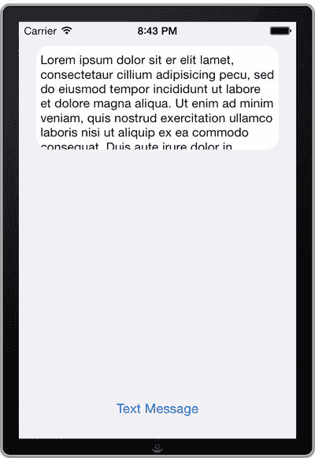

**图 16-1.** 用户界面的模拟视图

为了正确地关闭键盘，请将视图控制器设置为你的 `UITextView` 的委托。将 `UITextViewDelegate` 协议添加到视图控制器的 `@interface` 声明中，如代码清单 16-3 所示。

**代码清单 16-3.** 设置 `UITextViewDelegate` 协议

```
//
//  ViewController.h
//  范例 16-1 编写短信
//

// ...
@interface ViewController : UIViewController <UITextViewDelegate>
// ...
@end
```

现在，在 `ViewController.m` 的 `viewDidLoad` 方法中分配文本视图的委托属性，如代码清单 16-4 所示。

**代码清单 16-4.** 设置文本视图的委托属性

```
- (void)viewDidLoad
{
    [super viewDidLoad];
    self.inputTextView.layer.cornerRadius = 15.0;
    self.inputTextView.delegate = self;
}
```

接下来，将 `MessageUI` 框架添加到你的项目中。在项目导航器中选中根项目后，在“通用”选项卡下进行此操作（有关详细信息，请参阅范例 1-2 中的“链接框架”）。同时，将所需的导入语句添加到视图控制器的头文件中。

你的视图控制器将作为稍后创建的“短信撰写视图控制器”的委托，因此也要将 `MFMessageComposeViewControllerDelegate` 协议添加到 `ViewController.h` 中。代码清单 16-5 显示了这些对 `ViewController.h` 文件的添加内容。

**代码清单 16-5.** 导入框架并声明短信撰写委托

```
//
//  ViewController.h
//  范例 16-1 编写短信
//

#import <UIKit/UIKit.h>
#import <QuartzCore/QuartzCore.h>
#import <MessageUI/MessageUI.h>

@interface ViewController : UIViewController <UITextViewDelegate,
```


`MFMessageComposeViewControllerDelegate`

```objc
// ...
@end
```

现在切回到`ViewController.m`，你需要实现`UITextView`的一个委托方法，如代码清单 16-6 所示。这将确保当用户点击“回车”键时，键盘能够被正确收起。

**代码清单 16-6.** 实现`textView:shouldChangeTextInRange:replacementText:`委托方法

```objc
- (BOOL)textView:(UITextView *)textView shouldChangeTextInRange:(NSRange)range
replacementText:(NSString *)text
{
    if ([text isEqualToString:@"\n"])
    {
        [textView resignFirstResponder];
        return NO;
    }
    return YES;
}
```

现在你可以实现`textMessage:`操作方法，将`UITextView`中的文本内容转存到短信中。在本示例中，只需将收件人设为一个假号码。该实现如代码清单 16-7 所示。

**代码清单 16-7.** 填充`textMessage:`操作方法

```objc
-(IBAction)textMessage:(id)sender
{
    if ([MFMessageComposeViewController canSendText])
    {
        MFMessageComposeViewController *messageVC =
            [[MFMessageComposeViewController alloc] init];
        messageVC.messageComposeDelegate = self;
        messageVC.recipients = @[@"3015555309"];
        messageVC.body = self.inputTextView.text;
        [self presentViewController:messageVC animated:YES completion:nil];
    }
    else
    {
        NSLog(@"Text Messaging Unavailable");
    }
}
```

`textMessage:`方法的实现看起来相当直接。在使用`canSendText`方法检查短信功能是否可用后，创建一个`MFMessageComposeViewController`类的实例，然后配置好假收件人和待发送的文本。最后，呈现该控制器让用户在发送前预览短信。

`MFMessageComposeViewController`及其对应类`MFMailComposeViewController`（稍后你会遇到）都允许你设置初始条件并呈现它，但一旦界面显示后，你就无法再控制这些类。这是为了确保用户对消息或邮件是否发送有最终决定权，而不是由任何应用在未通知用户的情况下自动发送。

你可以实现`MFMessageComposeViewController`的`messageComposeDelegate`方法来处理消息的完成情况，如代码清单 16-8 所示。

**代码清单 16-8.** 实现`messageComposeViewController:didFinishWithResult:`委托方法

```objc
-(void)messageComposeViewController:(MFMessageComposeViewController *)controller
        didFinishWithResult:(MessageComposeResult)result
{
    if (result == MessageComposeResultSent)
    {
        self.inputTextView.text = @"Message sent.";
    }
    else if (result == MessageComposeResultFailed)
    {
        NSLog(@"Failed to send message!");
    }
    [self dismissViewControllerAnimated:YES completion:nil];
}
```

除了前面代码中演示的两种`MessageComposeResult`值之外，还有第三种结果`MessageComposeResultCancelled`，表示用户取消了短信发送。

iOS 5.0 新增的一项功能是能够接收关于短信可用性变化的通知。该功能在 iOS 7 中仍然存在。你可以通过在`ViewController.m`的`viewDidLoad`方法中添加以下代码来注册此类通知，如代码清单 16-9 所示。

**代码清单 16-9.** 为消息可用性注册一个`NSNotification`

```objc
- (void)viewDidLoad
{
    [super viewDidLoad];
    self.inputTextView.layer.cornerRadius = 15.0;
    self.inputTextView.delegate = self;
    [[NSNotificationCenter defaultCenter] addObserver:self
        selector:@selector(textMessagingAvailabilityChanged:)
        name:MFMessageComposeViewControllerTextMessageAvailabilityDidChangeNotification
        object:nil];
}
```

代码清单 16-9 中指定的选择器可以被定义为简单地通知你变化。在一个完整的应用中，你可能会使用`UIAlert`来通知用户这一变化，但为了演示目的，我们将跳过这一过程。代码清单 16-10 展示了代码清单 16-9 中调用的方法的实现。

**代码清单 16-10.** 实现`textMessagingAvailabilityChanged:`方法

```objc
-(void)textMessagingAvailabilityChanged:(id)sender
{
    if ([MFMessageComposeViewController canSendText])
    {
        NSLog(@"Text Messaging Available");
    }
    else
    {
        NSLog(@"Text Messaging Unavailable");
    }
}
```

现在，你的应用可以将`UITextView`的正文内容复制到一条短信中，发送给你的假收件人。但需要注意的是，短信功能在 iOS 模拟器上不可用。你需要在具有蜂窝网络功能的物理设备上进行测试。点击“Text Message”按钮后，模拟效果应如图 16-2 所示。

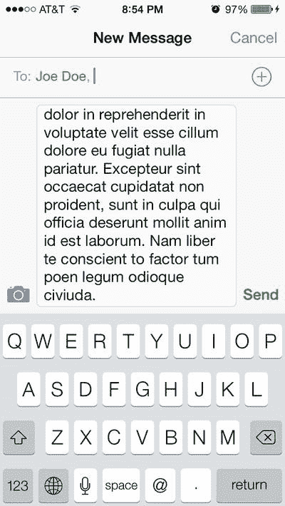

**图 16-2.** 显示复制文本的模拟视图


## 配方 16-2：编写电子邮件

正如你可以创建和配置从应用程序发送的短信一样，你也可以使用 `MessageUI` 框架，通过 `MFMessageComposeViewController` 类的对应类 `MFMailComposeViewController` 来配置电子邮件。

基于配方 16-1 中的应用程序，添加一个通过电子邮件发送消息的选项。首先，添加另一个标签为“邮件消息”的按钮。为该按钮创建一个名为 `mailMessageButton` 的插座变量和一个名为 `mailMessage` 的动作方法。

与你在配方 16-1 中对 `MFMessageComposeViewController` 所做的类似，你需要将主视图控制器设置为 `MFMailComposeViewController` 的委托。你的 `ViewController.h` 现在应该如代码清单 16-11 所示。

**代码清单 16-11.** 完整的 `ViewController.h` 文件

```
//
//  ViewController.h
//  Recipe 16-2 Composing Email
//

#import <UIKit/UIKit.h>
#import <QuartzCore/QuartzCore.h>
#import <MessageUI/MessageUI.h>

@interface ViewController : UIViewController<UITextViewDelegate,
MFMessageComposeViewControllerDelegate, MFMailComposeViewControllerDelegate>

@property (weak, nonatomic) IBOutlet UITextView *inputTextView;
@property (weak, nonatomic) IBOutlet UIButton *textMessageButton;
@property (weak, nonatomic) IBOutlet UIButton *mailMessageButton;

- (IBAction)textMessage:(id)sender;
- (IBAction)mailMessage:(id)sender;

@end
```

你的 `mailMessage:` 方法的设置也与之前的 `textMessage:` 方法非常相似。你创建编写视图控制器，配置它，然后呈现它。代码清单 16-12 展示了实现过程。

**代码清单 16-12.** 实现 `mailMessage:` 方法

```
- (IBAction)mailMessage:(id)sender
{
    if ([MFMailComposeViewController canSendMail])
    {
        MFMailComposeViewController *mailVC =
            [[MFMailComposeViewController alloc] init];
        [mailVC setSubject:@"Send It Out"];
        [mailVC setToRecipients:@[@"test@example.com"]];
        [mailVC setMessageBody:self.inputTextView.text isHTML:NO];
        mailVC.mailComposeDelegate = self;
        [self presentViewController:mailVC animated:YES completion:nil];
    }
    else
    {
        NSLog(@"E-mailing Unavailable");
    }
}
```

如你所见，`MFMailComposeViewController` 拥有一些与 `MFMessageComposeViewController` 不同的属性，这些属性专门用于配置更复杂的电子邮件。这些属性与你对电子邮件的预期相关：主题、收件人和消息正文。

`MFMailComposeViewControllerDelegate` 协议只定义了一个方法，你需要实现该方法来妥善处理用户对视图控制器的使用完成情况。对这个方法提供一个简单的实现来记录结果，如代码清单 16-13 所示。

**代码清单 16-13.** 实现 `mailComposeController:didFinishWithResult:error:` 方法

```
-(void)mailComposeController:(MFMailComposeViewController *)controller
    didFinishWithResult:(MFMailComposeResult)result
    error:(NSError *)error
{
    if (result == MFMailComposeResultSent)
        self.inputTextView.text = @"Mail sent.";
    else if (result == MFMailComposeResultCancelled)
        NSLog(@"Mail Cancelled");
    else if (result == MFMailComposeResultFailed)
        NSLog(@"Error, Mail Send Failed");
    else if (result == MFMailComposeResultSaved)
        NSLog(@"Mail Saved");

    [self dismissViewControllerAnimated:YES completion:nil];
}
```

现在，你的新应用程序可以呈现一个用于发送电子邮件的视图控制器，如图 16-3 所示。但与 `MFMessageComposeViewController` 不同，你实际上可以在 iOS 模拟器中测试此功能。

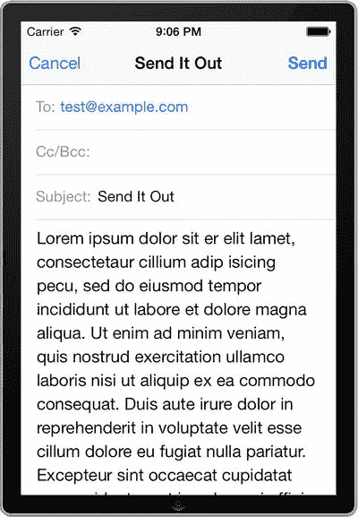

**图 16-3.** 使用 `MFMailComposeViewController` 编写电子邮件

非常方便的是，你可以轻松地使用模拟器测试 `MFMailComposeViewController` 的所有功能，无需担心会向任何真实或虚假的地址发送多封邮件。模拟器实际上并不会通过互联网发送你的测试消息，因此你可以轻松测试你的 `mailComposeDelegate` 方法如何处理 `MFMailComposeResultSent`、`MFMailComposeResultCancelled`、`MFMailComposeResultFailed` 和 `MFMailComposeResultSaved` 这些结果。


### 为邮件添加附件

`MFMailComposeViewController` 提供了通过 `addAttachmentData:mimeType:fileName:` 方法从应用向邮件添加附件的功能。该方法包含三个参数：

- **attachment**：该参数是 `NSData` 实例，指代你要发送对象的实际数据。这意味着对于任何你想附加的对象，都需要获取其 `NSData` 数据。
- **mimeType**：该参数是一个 `NSString` 类型，控制器用它来定义附件的数据类型。这些值并非 iOS 特有，也未在苹果文档中定义。不过，你可以轻松地在网上找到它们。维基百科在 [`http://en.wikipedia.org/wiki/Internet_media_type`](http://en.wikipedia.org/wiki/Internet_media_type) 上提供了关于可能值的详尽文章。例如，JPEG 图像的 MIME 类型是 `image/jpeg`。
- **fileName**：该参数是一个 `NSString` 属性，用于设置邮件中发送文件的偏好名称。

现在，你将向应用添加功能，以访问用户的图片库、选择图片，然后将该图片附加到邮件中。

首先，在 `UITextView` 下方添加一个 `UIImageView`，并添加一个标签为 "Get Image" 的 `UIButton`。为了在未选中图片时能让图像视图可见，请将其背景颜色属性改为白色。此外，为了避免在图像视图的框架外绘制，请在属性检查器中选中其"裁剪子视图"属性。此时，你的视图应如图 16-4 所示。

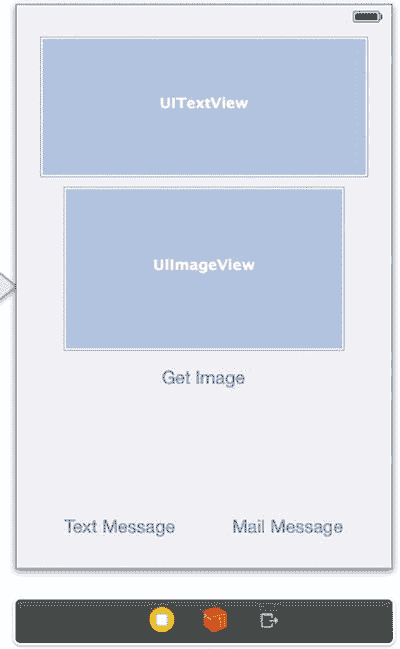

图 16-4. 具备选择图像功能的新用户界面

为这两个元素创建输出口，并分别命名为 `imageView` 和 `getImageButton`。同时，为按钮创建操作 `getImage`。

每当你想访问 iPhone 的照片库时，都需要使用设置在视图控制器中的 `UIImagePickerController`。在主视图控制器的头文件中声明一个名为 `picker` 的 `UIImagePickerController` 属性。你还需要指示视图控制器遵循 `UIImagePickerControllerDelegate` 和 `UINavigationControllerDelegate` 协议。整体上，你的头文件现在应类似于代码清单 16-14。

代码清单 16-14. 完整的 ViewController.h 文件

```
//
//  ViewController.h
//  Recipe 16-2 Composing Email
//

#import <UIKit/UIKit.h>
#import <QuartzCore/QuartzCore.h>
#import <MessageUI/MessageUI.h>

@interface ViewController : UIViewController<UITextViewDelegate,
MFMessageComposeViewControllerDelegate, MFMailComposeViewControllerDelegate,
UIImagePickerControllerDelegate,
UINavigationControllerDelegate>

@property (weak, nonatomic) IBOutlet UITextView *inputTextView;
@property (weak, nonatomic) IBOutlet UIButton *textMessageButton;
@property (weak, nonatomic) IBOutlet UIButton *mailMessageButton;
@property (weak, nonatomic) IBOutlet UIImageView *imageView;
@property (weak, nonatomic) IBOutlet UIButton *getImageButton;
@property (strong, nonatomic) UIImagePickerController *picker;

- (IBAction)textMessage:(id)sender;
- (IBAction)mailMessage:(id)sender;
- (IBAction)getImage:(id)sender;

@end
```

现在，你可以编写 `getImage:` 方法来呈现一个能访问照片库的弹出控制器，如代码清单 16-15 所示。

代码清单 16-15. 实现 `getImage:` 方法

```
- (IBAction)getImage:(id)sender
{
    self.picker = [[UIImagePickerController alloc] init];
    if ([UIImagePickerController
         isSourceTypeAvailable:UIImagePickerControllerSourceTypePhotoLibrary])
    {
        self.picker.sourceType = UIImagePickerControllerSourceTypePhotoLibrary;
        self.picker.delegate = self;
        [self presentViewController:self.picker animated:YES completion:nil];
    }
}
```

现在，你只需实现你的 `UIImagePickerControllerDelegate` 协议方法，如代码清单 16-16 所示。


### 清单 16-16. 实现 `UIImagePickerControllerDelegate` 协议方法

```
-(void)imagePickerControllerDidCancel:(UIImagePickerController *)picker
{
    [self.picker dismissViewControllerAnimated:YES completion:nil];
}

-(void)imagePickerController:(UIImagePickerController *)picker didFinishPickingMediaWithInfo:(NSDictionary *)info
{
    self.imageView.image = [info valueForKey:@"UIImagePickerControllerOriginalImage"];
    self.imageView.contentMode = UIViewContentModeScaleAspectFill;
    [self.picker dismissViewControllerAnimated:YES completion:nil];
}
```

作为最后的润色，为了保持圆角主题，在 `viewDidLoad` 方法中通过设置 `cornerRadius` 属性，为图片视图添加 15 点半径，如清单 16-17 所示。

### 清单 16-17. 为图片视图添加 `cornerRadius` 属性

```
- (void)viewDidLoad
{
    [super viewDidLoad];
    // Do any additional setup after loading the view, typically from a nib.
    self.inputTextView.layer.cornerRadius = 15.0;
    self.imageView.layer.cornerRadius = 15.0;
    self.inputTextView.delegate = self;
    //...
}
```

此时，如果你运行应用，可以选择一张图片并将其设置到你的 `UIImageView` 中。如果在模拟器中测试此应用，你需要获取至少一张图片放入模拟器的照片库。可以通过将图片拖拽到 iOS 模拟器窗口来实现，这会启动 Safari 应用。长按图片并将其保存到照片库中。在图 16-5 中，应用已显示了一张选中的图片。

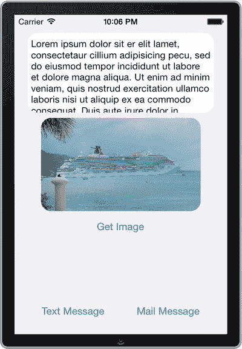

**图 16-5.** 运行应用并点击“获取图片”按钮，将图片附加到邮件中

现在你可以继续将选中的图片添加到你的邮件中。修改 `mailPressed:` 方法，如果已选择图片，则附加该图片。清单 16-18 展示了这一更改。

### 清单 16-18. 修改 `mailMessage:` 方法以附加图片

```
- (IBAction)mailMessage:(id)sender
{
    if ([MFMailComposeViewController canSendMail])
    {
        MFMailComposeViewController *mailVC =
        [[MFMailComposeViewController alloc] init];
        [mailVC setSubject:@"发送出去"];
        [mailVC setToRecipients:@[@"test@example.com"]];
        [mailVC setMessageBody:self.inputTextView.text isHTML:NO];
        mailVC.mailComposeDelegate = self;

        if (self.imageView.image != nil)
        {
            NSData *imageData = UIImageJPEGRepresentation(self.imageView.image, 1.0);
            [mailVC addAttachmentData:imageData mimeType:@"image/jpeg"
                            fileName:@"SelectedImage"];
        }

        [self presentViewController:mailVC animated:YES completion:nil];
    }
    else
    {
        NSLog(@"电子邮件功能不可用");
    }
}
```

最后，你可以修改 `MFMailComposeViewController` 的委托方法，以便在邮件成功发送后重置应用（清单 16-19）。

### 清单 16-19. 修改 `mailComposeController:didFinishWithResult:error:` 方法

```
-(void)mailComposeController:(MFMailComposeViewController *)controller didFinishWithResult:(MFMailComposeResult)result error:(NSError *)error
{
    if (result == MFMailComposeResultSent)
    {
        self.inputTextView.text = @"邮件已发送。";
        self.imageView.image = nil;
    }
    else if (result == MFMailComposeResultCancelled)
        NSLog(@"邮件已取消");
    else if (result == MFMailComposeResultFailed)
        NSLog(@"错误，邮件发送失败");
    else if (result == MFMailComposeResultSaved)
        NSLog(@"邮件已保存");

    [self dismissViewControllerAnimated:YES completion:nil];
}
```

如果你现在在模拟器中测试应用，并在选择图片后尝试发送邮件，你应该会看到选中的图片被插入到你的消息中，如图 16-6 所示。

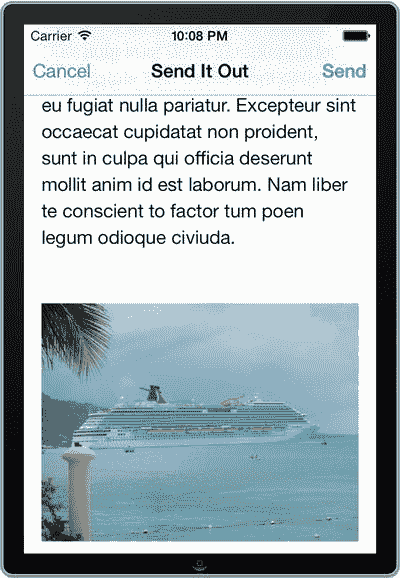

**图 16-6.** 你的应用正在撰写带有附件图片的邮件

## 秘方 16-3：打印图片

现在你的应用已能处理文本和图片，你可以继续通过添加打印功能来增强其能力。

对于本秘方，我们将基于前面的秘方进行构建。首先添加一个名为“打印图片”的新按钮，并按图 16-7 所示进行布局。同时为按钮添加一个名为 `print:` 的操作。

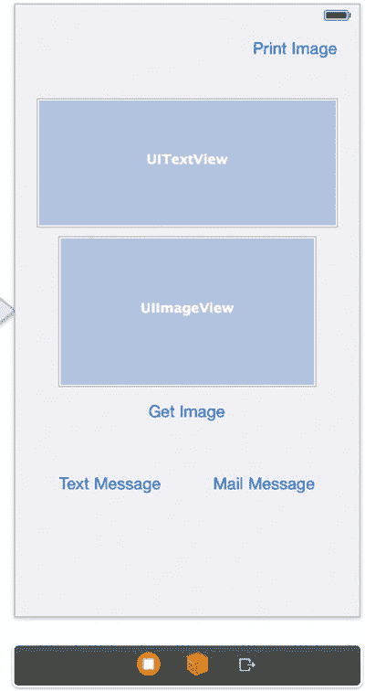

**图 16-7.** 添加了“打印图片”按钮的界面

现在你可以添加 `print:` 操作方法来实现打印功能，主要通过使用 `UIPrintInteractionController` 类。该类是配置打印任务时的活动“枢纽”。我们将先分别讨论设置此类所需的步骤，然后再整体查看该方法。

每当你想要访问 `UIPrintInteractionController` 的实例时，只需通过 `sharedPrintController` 类方法获取共享实例的引用，如清单 16-20 所示。

### 清单 16-20. 创建 `UIPrintInteractionController` 实例

```objectivec
UIPrintInteractionController *pic = [UIPrintInteractionController sharedPrintController];
```

接下来，你必须配置控制器的 `printInfo` 属性，该属性指定了打印任务的设置。如清单 16-21 所示。

### 清单 16-21. 配置 `printInfo` 属性

```objectivec
UIPrintInfo *printInfo = [UIPrintInfo printInfo];
printInfo.outputType = UIPrintInfoOutputPhoto;
printInfo.jobName = self.title;
printInfo.duplex = UIPrintInfoDuplexLongEdge;
```

如清单 16-21 所示，你已将 `outputType` 设置为指定图片。该属性的三个可能值如下：

- `UIPrintInfoOutputPhoto`：专门用于打印照片
- `UIPrintInfoOutputGrayscale`：仅处理黑色文本时使用，以提高性能
- `UIPrintInfoOutputGeneral`：用于图形和文本的任何混合，无论是否包含颜色

你尚未将此 `printInfo` 对象设置为控制器的 `printInfo`，因为稍后你还会进行更多配置。

接下来，你必须为你的 `UIPrintInteractionController` 做一个有趣的指定。我们说“有趣”，是因为你必须在四项可能的任务中，绝对完成一项且仅一项：

- 设置单个项目进行打印。
- 设置多个项目进行打印。
- 为控制器指定一个 `UIPrintFormatter` 实例，以配置页面布局。
- 指定一个 `UIPrintPageRenderer` 实例，该实例可以分配多个 `UIPrintFormatter` 实例，从而在多个页面上完全自定义内容布局。

从最简单的选项开始，设置单个打印项目。要使用这些更简单的选项，该项目必须是图片或 PDF 文件，因此我们只需打印你的 `selectedImage`，如清单 16-22 所示。

### 清单 16-22. 设置打印图片

```objectivec
UIImage *image = self.imageView.image;
pic.printingItem = image;
```

现在你知道了要打印的内容，可以检查图片的方向并相应配置你的 `printInfo`，如清单 16-23 所示。无需指定纵向方向，因为这是默认情况。

### 清单 16-23. 配置 `printInfo`

```objectivec
if (!pic.printingItem && image.size.width > image.size.height)
    printInfo.orientation = UIPrintInfoOrientationLandscape;

pic.printInfo = printInfo;
pic.showsPageRange = YES;
```

最后，呈现你的 `UIPrintInteractionController`。该类配备了三种不同的自我呈现方法，具体取决于你的具体实现。


### 使用 UIPrintInteractionController 进行打印

### 呈现打印控制器的方法

- `presentFromBarButtonItem:animated:completionHandler`：如果你为 iPad 编写程序，此方法适用于将应用的"打印"按钮放置在工具栏中的场景。
- `presentFromRect:inView:animated:completionHandler`：此方法也仅适用于 iPad，但允许你从视图的任意位置呈现控制器。通常，指定的 `rectangle` 将是打印按钮的 `frame`，无论它位于何处。
- `presentAnimated:completionHandler`：由于 iPhone 屏幕较小，在 iPhone 上实现打印功能时应始终使用此方法。我们将在项目中采用此方法。

通过这最后一个方法调用，你的完整 `print:` 方法将如代码清单 16-24 所示。

**代码清单 16-24.** 完整的 `print:` 方法实现

```
- (IBAction)print:(id)sender

{

if ([UIPrintInteractionController isPrintingAvailable]

&& (self.imageView.image != nil))

{

UIPrintInteractionController *pic =

[UIPrintInteractionController sharedPrintController];

UIPrintInfo *printInfo = [UIPrintInfo printInfo];

printInfo.outputType = UIPrintInfoOutputPhoto;

printInfo.jobName = self.title;

printInfo.duplex = UIPrintInfoDuplexLongEdge;

UIImage *image = self.imageView.image;

pic.printingItem = image;

if (!pic.printingItem && image.size.width> image.size.height)

printInfo.orientation = UIPrintInfoOrientationLandscape;

pic.printInfo = printInfo;

pic.showsPageRange = YES;

[pic presentAnimated:YES completionHandler:

^(UIPrintInteractionController *printInteractionController, BOOL completed,

NSError *error)

{

if (!completed && (error != nil))

{

NSLog(@"Error Printing: %@", error);

}

else

{

NSLog(@"Printing Completed");

}

}];

}

}
```

现在，当你运行应用并选择一张图片后，你只需点击"打印"按钮即可打印该图片。这将呈现一个视图控制器，你可以在其中选择打印机并进一步配置特定的打印作业。不幸的是，如果你在模拟器中测试，或者没有设置任何无线打印机（例如与 iOS 操作系统内置的 AirPrint 技术兼容的打印机），你将看不到任何可用的打印机，如图 16-8 所示。

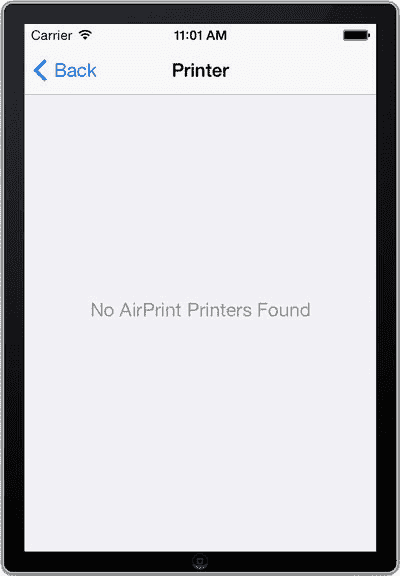

**图 16-8.** 你的应用新增了"打印"按钮，但无法找到任何 AirPrint 打印机

幸运的是，Xcode 附带了一个名为 Printer Simulator 的出色应用程序。通过此程序，你可以完全模拟应用中的打印作业。它甚至会为你提供模拟输出的 PDF 文件，让你可以确切地看到图像打印出来的效果，而无需浪费纸张！

要运行此程序，请在模拟器打开的状态下选择文件 `➤` 打开 Printer Simulator，如图 16-9 所示。

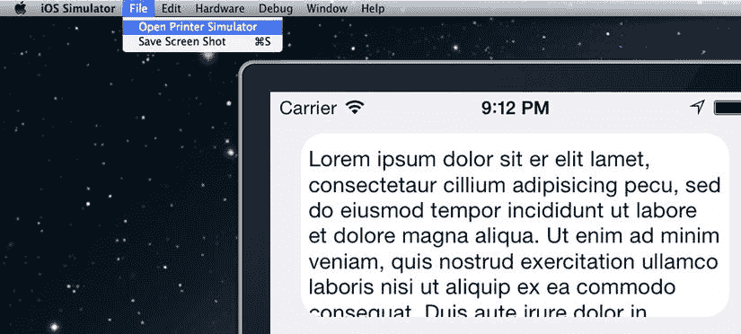

**图 16-9.** 显示 Xcode bundle 的打包内容

运行 Printer Simulator 应用程序后，会自动注册多种打印机类型以供使用。模拟器的界面类似于图 16-10。

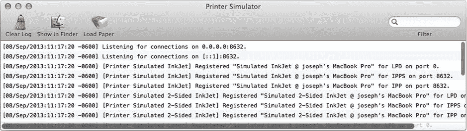

**图 16-10.** Printer Simulator 注册多种打印机类型以进行模拟

当你测试应用时，应该会看到不同类型的模拟打印机，用于测试你的应用。你现在可以从应用中选择一个模拟打印机，如图 16-11 所示。

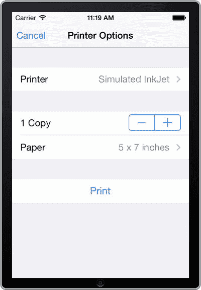

**图 16-11.** 从应用中选择一个模拟喷墨打印机

选择打印机后，你可以打印多份副本，也可以在打印前更改纸张类型。点击"打印"按钮后，你应该会看到 Printer Simulator 开始活动，稍后，一个包含最终打印输出的 PDF 文件将打开，如图 16-12 所示。

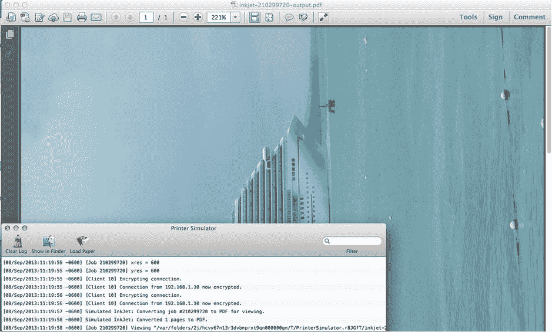

**图 16-12.** 从模拟打印机打印图像的输出效果

## 技巧 16-4：打印纯文本

在上述技巧的基础上，你将添加使用打印格式化程序的功能，从而能够打印简单文本。

首先，添加一个标题为"打印文本"的新按钮，并为其创建一个名为 `printText:` 的操作。

然后实现用于打印文本的新方法，如代码清单 16-25 所示。

**代码清单 16-25.** 实现 `printText:` 方法

```
- (IBAction)printText:(id)sender

{

    if ([UIPrintInteractionController isPrintingAvailable])

    {

        UIPrintInteractionController *pic =

        [UIPrintInteractionController sharedPrintController];

        UIPrintInfo *printInfo = [UIPrintInfo printInfo];

        printInfo.outputType = UIPrintInfoOutputGeneral;

        printInfo.jobName = self.title;

        printInfo.duplex = UIPrintInfoDuplexLongEdge;

        pic.printInfo = printInfo;

        UISimpleTextPrintFormatter *simpleTextPF =

        [[UISimpleTextPrintFormatter alloc] initWithText:self.inputTextView.text];

        simpleTextPF.startPage = 0;

        simpleTextPF.contentInsets = UIEdgeInsetsMake(72.0, 72.0, 72.0, 72.0);

        simpleTextPF.maximumContentWidth = 6*72.0;

        pic.printFormatter = simpleTextPF;

        pic.showsPageRange = YES;

        [pic presentAnimated:YES completionHandler:

         ^(UIPrintInteractionController *printInteractionController, BOOL completed,

           NSError *error)

         {

             if (!completed && (error != nil))

             {

                 NSLog(@"Error Printing: %@", error);

             }

             else

             {

                 NSLog(@"Printing Completed");

             }

         }];

    }

}
```

此方法与上一技巧中代码清单 16-24 所示的 `print:` 方法之间存在两个主要区别。

`UIPrintInfo` 中的 `outputType` 属性被修改为 `UIPrintInfoOutputGeneral` 值，因为你现在不再打印照片。你没有将 `UIImage` 赋值给 `printingItem` 属性，而是将 `UISimpleTextPrintFormatter` 的一个实例赋值给了 `printFormatter` 属性。该对象使用所需的文本进行初始化，然后通过其属性进行配置。将内边距值设置为 72.0 相当于 1 英寸，因此你为输出设置了 1 英寸的内边距，并为内容指定了 6 英寸的宽度。`startPage` 属性将在后续步骤中有更多用途，但现在它允许你指定格式化程序应用于作业中的哪一页。

> **提示：** 打印简单文本时，也可以很容易地将上述方法应用于打印 HTML 格式的文本。为此，只需使用 `UIMarkupTextPrintFormatter` 而不是 `UISimpleTextPrintFormatter`。

和之前一样，通过使用打印机模拟器，你可以生成测试输出。因为你在打印格式化程序的内容中设置了文本视图的文本，所以你会得到一个包含一些 Lorem Ipsum 文本的文档，如图 16-13 所示。

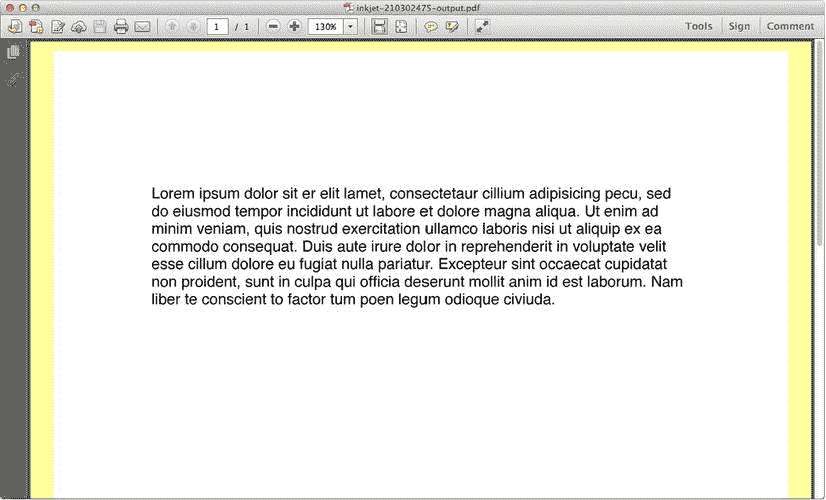

**图 16-13.** 模拟打印简单文本页面的输出效果


好的，作为一名高级文档工程师和翻译员，我将严格按照您的要求和示例格式，将提供的英文文本翻译成专业、准确的中文。


## 配方 16-5：打印一个视图

本配方建立在配方 16-4 的基础上，但这次我们不再打印纯文本，而是打印一个文本视图。

就像你可以使用 `UISimpleTextPrintFormatter` 打印文本一样，你也可以使用 `UIPrintFormatter` 的另一个子类——`UIViewPrintFormatter` 来打印视图的内容。

首先，创建一个标题为“打印视图”的新按钮，并为其创建一个名为“printViewPressed”的操作。

你最新的打印方法 `printView:` 与你之前的方法（配方 16-4 中的 `printText:`）非常相似，关键的区别在于改用 `UIViewPrintFormatter`。代码清单 16-26 展示了这个实现。

**代码清单 16-26.** 实现 `printViewPressed:` 方法

```
- (IBAction)printViewPressed:(id)sender

{

    if ([UIPrintInteractionController isPrintingAvailable])

    {

        UIPrintInteractionController *pic =

        [UIPrintInteractionController sharedPrintController];

        UIPrintInfo *printInfo = [UIPrintInfo printInfo];

        printInfo.outputType = UIPrintInfoOutputGeneral;

        printInfo.jobName = self.title;

        printInfo.duplex = UIPrintInfoDuplexLongEdge;

        printInfo.orientation = UIPrintInfoOrientationLandscape;

        pic.printInfo = printInfo;

        UIViewPrintFormatter *viewPF = [self.inputTextView viewPrintFormatter];

        pic.printFormatter = viewPF;

        pic.showsPageRange = YES;

        [pic presentAnimated:YES completionHandler:

         ^(UIPrintInteractionController *printInteractionController, BOOL completed,

           NSError *error)

         {

             if (!completed && (error != nil))

             {

                 NSLog(@"打印视图出错: %@", error);

             }

             else

             {

                 NSLog(@"打印完成");

             }

         }];

    }

}
```

因为你的应用只用到其中之一，所以你只需让它打印你的 `UITextView` 的视图，其输出结果如图 16-14 所示。

> **注意：** 虽然我们演示的是如何打印 `UITextView`，但 `UIViewPrintFormatter` 类能够打印任何 `UIView` 对象。

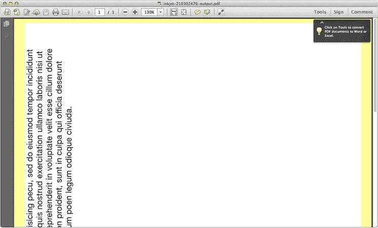

**图 16-14.** 模拟的打印输出，具体是 `UITextView` 的输出

本配方到此结束。在下一个配方中，我们将介绍如何使用页面渲染器进行自定义格式打印。

## 配方 16-6：使用页面渲染器进行格式化打印

页面渲染器本质上是一个允许你完全自定义任何打印作业内容的工具。它不仅允许你使用不同的打印格式化器格式化多个页面，还允许你在任何页面的页眉、正文和页脚中绘制自定义内容。

要使用页面渲染器，你必须创建一个 `UIPrintPageRenderer` 类的自定义子类，并重写其中的方法来定制打印作业的内容。

使用 Objective-C 类模板创建一个新文件。当你输入文件名 `DTPageRenderer` 时，请确保该文件是 `UIPrintPageRenderer` 的子类，如图 16-15 所示。

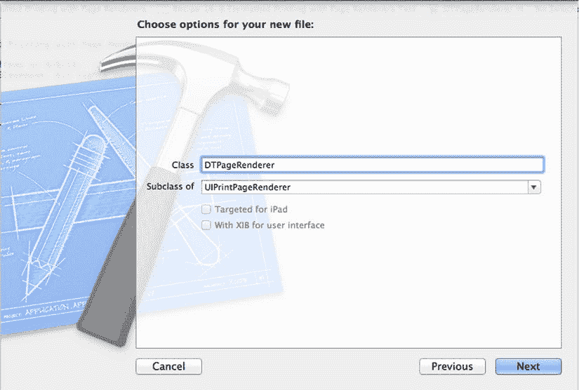

**图 16-15.** 创建一个 `UIPrintPageRenderer` 的子类

点击创建你的新文件。

接下来，在你的渲染器的头文件中定义两个 `NSString` 属性：`title` 和 `author`。

**代码清单 16-27.** 向 `DTPageRenderer.h` 文件添加属性

```
//
//  DTPageRenderer.h
//  配方 16-6 使用页面渲染器进行格式化打印
//

#import <UIKit/UIKit.h>

@interface SendItOutPageRenderer : UIPrintPageRenderer

@property (nonatomic, strong) NSString *title;
@property (nonatomic, strong) NSString *author;

@end
```

为了自定义你的特定页面渲染器的布局，你可以重写从 `UIPrintPageRenderer` 类继承的方法。这个类的设置方式是，`drawPageAtIndex:inRect:` 方法随后会调用其他四个方法：

*   `drawHeaderForPageAtIndex:inRect:`：用于指定页眉内容；如果渲染器的 `headerHeight` 属性为零，则不会调用此方法。
*   `drawContentForPageAtIndex:inRect:`：在页面的内容矩形内绘制自定义内容。
*   `drawFooterForPageAtIndex:inRect:`：指定页脚内容；如果渲染器的 `footerHeight` 属性为零，同样不会调用此方法。
*   `drawPrintFormatter:forPageAtIndex:`：结合使用打印格式化器和自定义内容来覆盖或填充视图。

你可以重写这五个方法（包括 `drawPageAtIndex:inRect:`）中的任何一个来定制你的打印内容。在你的例子中，你重写了页眉、页脚和打印格式化器的方法。

你将让页眉在左侧打印文档的作者，在右侧打印标题。实现此功能的方法如代码清单 16-28 所示。

**代码清单 16-28.** 实现 `drawHeaderForPageAtIndex:inRect:` 重写方法

```
- (void)drawHeaderForPageAtIndex:(NSInteger)pageIndex  inRect:(CGRect)headerRect

{

if (pageIndex == 0)

{

UIFont *font = [UIFont fontWithName:@"Helvetica" size:12.0];

CGSize titleSize = [self.title sizeWithAttributes:@{NSFontAttributeName:font}];

CGFloat drawXTitle = CGRectGetMaxX(headerRect) - titleSize.width;

CGFloat drawXAuthor = CGRectGetMinX(headerRect);

CGFloat drawY = CGRectGetMinY(headerRect);

CGPoint drawPointAuthor = CGPointMake(drawXAuthor, drawY);

CGPoint drawPointTitle = CGPointMake(drawXTitle, drawY);

[self.title drawAtPoint:drawPointTitle withAttributes:@{NSFontAttributeName:font}];

[self.author drawAtPoint:drawPointAuthor withAttributes:@{NSFontAttributeName:font}];

}

}
```

你的页脚实现方法看起来类似，它打印一个居中的页码。因为页面索引从 0 开始，所以你必须记得将所有值加 1。代码清单 16-29 展示了这个实现。

**代码清单 16-29.** 实现 `drawFooterPageAtIndex:inRect:` 重写方法

```
- (void)drawFooterForPageAtIndex:(NSInteger)pageIndex inRect:(CGRect)footerRect

{

UIFont *font = [UIFont fontWithName:@"Helvetica" size:12.0];

NSString *pageNumber = [NSString stringWithFormat:@"%d.", pageIndex+1];

CGSize pageNumSize = [pageNumber sizeWithAttributes:@{NSFontAttributeName:font}];

CGFloat drawX = CGRectGetMaxX(footerRect)/2.0 - pageNumSize.width - 1.0;

CGFloat drawY = CGRectGetMaxY(footerRect) - pageNumSize.height;

CGPoint drawPoint = CGPointMake(drawX, drawY);

}
```


```objc
[pageNumber drawAtPoint:drawPoint withAttributes:@{NSFontAttributeName:font}];
```

```objc
}
```

最后，为了处理交错排列的打印格式，需要实现`drawPrintFormatter:forPageAtIndex:`方法，如代码清单 16-30 所示，从而在视图上叠加一段简单的文本。在更专业的应用中，这可以轻松用于在图片或文档上放置“专有内容”标签。

**代码清单 16-30. 实现 `drawPrintFormatter:forPageAtIndex:` 重写方法**

```objc
-(void)drawPrintFormatter:(UIPrintFormatter *)printFormatter forPageAtIndex:(NSInteger)pageIndex
{
    CGRect contentRect = CGRectMake(self.printableRect.origin.x,
                                    self.printableRect.origin.y+self.headerHeight, self.printableRect.size.width,
                                    self.printableRect.size.height-self.headerHeight-self.footerHeight);
    [printFormatter drawInRect:contentRect forPageAtIndex:pageIndex];
    NSString *overlayText = @"Overlay Text";
    UIFont *font = [UIFont fontWithName:@"Helvetica" size:26.0];
    CGSize overlaySize = [overlayText sizeWithAttributes:@{NSFontAttributeName:font}];
    CGFloat xCenter = CGRectGetMaxX(self.printableRect)/2.0 - overlaySize.width/2.0;
    CGFloat yCenter = CGRectGetMaxY(self.printableRect)/2.0 - overlaySize.height/2.0;
    CGPoint overlayPoint = CGPointMake(xCenter, yCenter);
    [overlayText drawAtPoint:overlayPoint withAttributes:@{NSFontAttributeName:font}];
}
```

在此方法中，需要注意必须通过每个`printFormatter`自身的`drawInRect:forPageAtIndex:`方法手动绘制其内容。为避免覆盖页眉或页脚，我们指定了一个由`headerHeight`和`footerHeight`限定的绘制区域。

现在，回到主视图控制器的实现文件中，确保导入新创建的`DTPageRenderer.h`文件：

```objc
#import "DTPageRenderer.h"
```

在布局中添加一个标题为“打印自定义”的新按钮，并为其设置一个名为`printCustom:`的操作。照例，你需要实现该操作方法，如代码清单 16-31 所示。

**代码清单 16-31. 实现 `printCustom:` 方法**

```objc
- (IBAction)printCustom:(id)sender
{
    if ([UIPrintInteractionController isPrintingAvailable])
    {
        UIPrintInteractionController *pic = [UIPrintInteractionController sharedPrintController];
        UIPrintInfo *printInfo = [UIPrintInfo printInfo];
        printInfo.outputType = UIPrintInfoOutputGeneral;
        printInfo.jobName = self.title;
        printInfo.duplex = UIPrintInfoDuplexLongEdge;
        printInfo.orientation = UIPrintInfoOrientationPortrait;
        pic.printInfo = printInfo;
        
        UISimpleTextPrintFormatter *simplePF = [[UISimpleTextPrintFormatter alloc] initWithText:[self.inputTextView.text stringByAppendingString:@"iOS 7 Recipes"]];
        DTPageRenderer *sendPR = [[DTPageRenderer alloc] init];
        sendPR.title = @"我的打印作业标题";
        sendPR.author = @"文档作者";
        sendPR.headerHeight = 72.0/2;
        sendPR.footerHeight = 72.0/2;
        [sendPR addPrintFormatter:simplePF startingAtPageAtIndex:0];
        pic.printPageRenderer = sendPR;
        pic.showsPageRange = YES;
        [pic presentAnimated:YES completionHandler:^(UIPrintInteractionController *printInteractionController, BOOL completed, NSError *error) {
            if (!completed && (error != nil)) {
                NSLog(@"打印出错: %@", error);
            } else {
                NSLog(@"打印完成");
            }
        }];
    }
}
```

此方法比配方 16-5 多了以下步骤：

- 创建打印格式器，分配给不同的页面。在本配方中，我们仅创建了一个文本视图打印格式器。
- 创建`DTPageRenderer`类的实例，并配置其标题、作者、`headerHeight`和`footerHeight`。如果未指定后两者，则页眉和页脚的自定义方法将不会被调用。
- 将打印格式器添加到页面渲染器中，并将此渲染器分配给`UIPrintInteractionController`。

测试这项新功能时，输出将是一个单页的文本文档，包含简单的页眉、页脚乃至文本叠加效果，如图 16-16 所示。

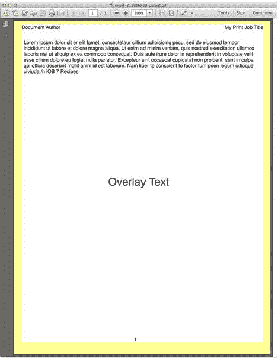

**图 16-16.** 使用页面渲染器和多个打印格式器的模拟打印输出

由于应用的简单性，图 16-16 中的截图看起来可能并不显眼，但考虑到你应用了自定义页眉、页脚、叠加内容及页面格式器，它实际上很好地展示了在追求理想定制效果时，使用页面渲染器进行打印的强大功能。

## 总结

在创建应用时，你应始终将用户放在心上。应用的每一个细节都应旨在允许并帮助用户达成目标，并针对这些目标进行优化以加速实现。发送短信、撰写邮件或创建打印输出等数据传输功能，往往在此过程中被错误地视为不必要而忽略。开发者必须始终从用户角度思考，想象用户能利用任何给定功能做些什么。简单到打印内容供日后使用，或能轻松将有趣的图片通过邮件发送给朋友，这都可能成为用户购买你的应用而非他人产品的分水岭。通过理解并利用这些“额外”功能，你可以大幅提升应用的功能性，更好地为最终用户服务。

# 17. Game Kit 食谱

**摘要**

Game Center 是一项 iOS 服务，能提升游戏的重玩率。它提供了一个类似社交中心的中枢界面，应用可与之集成，让用户分享得分、追踪成就、发起回合制对战，甚至创建多人对战。Game Center 最棒的一点是，所有信息都存储在苹果服务器上，因此你无需自行存储。在 iOS 7 中，用户界面已完全重新设计，提供了更加清爽的界面。

本章首先介绍 GameKit 框架的一些基础知识，这是你让游戏“支持 Game Center”所使用的内容。接着，我们会通过一些实际示例进行讲解，例如实现排行榜和成就系统。最后，我们将教你如何创建简单的回合制多人游戏，并将其与 Game Center 集成。

## 配方 17-1. 让你的应用支持 Game Center

在本配方中，你将创建一个简单的游戏并将其连接到 Game Center。游戏由四个按钮组成。当玩家点击某个按钮时，可能发生两种情况：如果按钮是“安全”按钮，玩家分数加一，并允许继续游戏；如果按钮是“杀手”按钮，游戏结束。由于玩家无法预知哪个按钮是哪种，因此游戏不涉及技巧，也算不上真正的游戏。但它易于实现，因此是展示 Game Center 基本功能的良好平台。

**注意**

在创建支持 Game Center 的游戏时，最好先实现游戏本身，并确保其正常运行，然后再接入 Game Center。


### 实现游戏

首先，创建一个名为 `Lucky` 的单视图应用项目。我们将在此后的几个教程中保持项目名称不变，因为包标识符（即唯一的应用标识符）将与 Game Center 绑定。

游戏设有三个难度级别：

- 简单模式：四个按钮中只有一个“杀手”按钮。
- 普通模式：四个按钮中有两个“杀手”按钮。
- 困难模式：四个按钮中有三个“杀手”按钮。

你需要将应用的主视图设置为一个菜单页面，并包含用于开始相应难度游戏的选项。同时，你还需要使用一个导航控制器。具体做法是：从 `Main.storyboard` 文件中选择视图控制器，然后在 Xcode 文件菜单中依次点击 Editor ➤ Embed In ➤ Navigation Controller。

接下来，从对象库中向根视图控制器添加一个标签和三个按钮，并按图 17-1 中的故事板场景进行布局。

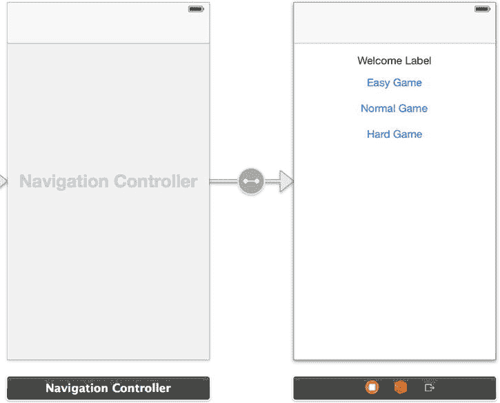

图 17-1. Lucky 游戏的主菜单视图

为标签创建一个名为 `welcomeLabel` 的插座变量，并为用户点击各个按钮时的操作分别创建名为 `playEasyGame`、`playNormalGame` 和 `playHardGame` 的操作方法。

接下来，将主视图控制器的标题设置为 `Lucky`，并将“欢迎”标签的文本改为 `Welcome Anonymous Player`。具体操作是选择导航栏，然后在属性检查器中修改标题，如图 17-2 所示。

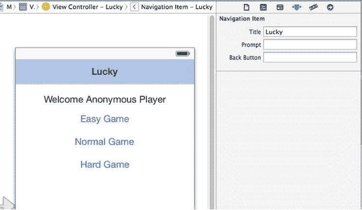

图 17-2. 更改根视图控制器的标题

构建并运行应用，确保到目前为止一切正常；你应该会看到如图 17-3 所示的界面。

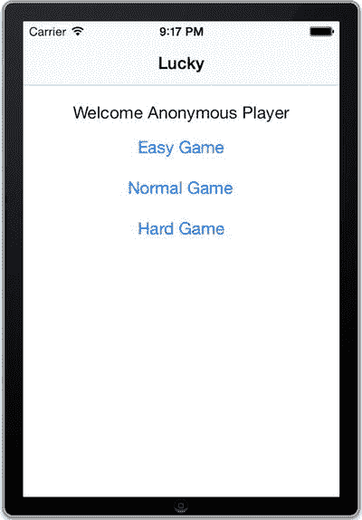

图 17-3. Lucky 游戏设有三个级别

接下来，添加实际游戏运行的视图控制器。创建一个名为 `GameViewController` 的新 `UIViewController` 子类，并确保勾选“With XIB for user interface”选项。由于我们将在 `GameViewController` 中创建自定义初始化方法，因此为了简化操作，此时混用故事板和 `.xib` 文件是合理的。

选择 `GameViewController.xib` 文件，并为新视图控制器创建一个如图 17-4 所示的用户界面。请务必为导航栏留出空间。

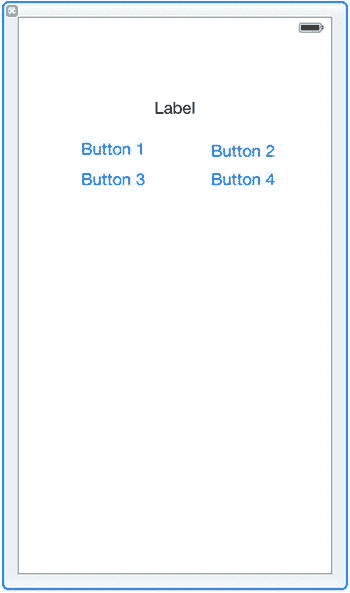

图 17-4. Lucky 游戏的用户界面

为 `GameViewController` 中添加的用户界面元素创建以下插座变量：

- `scoreLabel`
- `button1`
- `button2`
- `button3`
- `button4`

对于按钮，创建一个所有按钮共享的操作，当用户点击任一按钮时调用。为此，首先为按钮 1 创建一个名为 `gameButtonSelected` 的操作。请确保方法参数使用 `UIButton` 的具体类型，如图 17-5 所示。

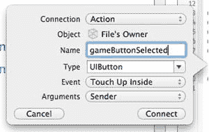

图 17-5. 创建带有特定类型参数的操作

现在，按住 Control 键点击其余按钮，将蓝色连线拖到 `gameButtonSelected` 操作声明上，将它们连接到为按钮 1 创建的同一个操作。当出现如图 17-6 所示的“连接操作”提示时，松开鼠标按钮，该操作就与按钮连接上了。

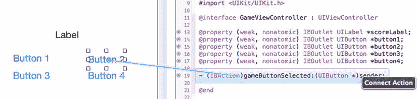

图 17-6. 将按钮连接到现有的 `IBAction`

确保将所有剩余按钮都连接到 `gameButtonSelected` 操作。


将用户界面元素与代码正确连接后，你可以开始向游戏视图控制器的头文件添加一些必要的声明。你需要一个初始化方法和几个私有实例变量。同时，还需要让视图控制器遵循`UIAlertViewDelegate`协议。因此，前往`GameViewController.h`，并添加代码清单 17-1 中的代码。

## 代码清单 17-1. 完成的 GameViewController.h 文件

```
//
//  GameViewController.h
//  Lucky
//

#import <UIKit/UIKit.h>
#import <GameKit/GameKit.h>

@interface GameViewController : UIViewController <UIAlertViewDelegate>
{
@private
    int _score;
    int _level;
}

@property (weak, nonatomic) IBOutlet UILabel *scoreLabel;
@property (weak, nonatomic) IBOutlet UIButton *button1;
@property (weak, nonatomic) IBOutlet UIButton *button2;
@property (weak, nonatomic) IBOutlet UIButton *button3;
@property (weak, nonatomic) IBOutlet UIButton *button4;
- (IBAction)gameButtonSelected:(UIButton *)sender;
- (id)initWithLevel:(int)level;

@end
```

现在前往`GameViewController.m`开始实现初始化代码。首先，添加代码清单 17-2 中所示的初始化方法的实现。

## 代码清单 17-2. 实现 `initWithLevel:` 初始化方法

```
- (id)initWithLevel:(int)level
{
    self = [super initWithNibName:nil bundle:nil];
    if (self)
    {
        _level = level;
        _score = 0;
    }
    return self;
}
```

接下来，添加代码清单 17-3 中所示的用于更新分数标签的辅助方法。

## 代码清单 17-3. 实现 `updateScoreLabel`

```
- (void)updateScoreLabel
{
    self.scoreLabel.text = [NSString stringWithFormat:@"Score: %i", _score];
}
```

最后，在`viewDidLoad`方法中添加代码，以便在游戏启动时设置标题并更新分数标签，如代码清单 17-4 所示。

## 代码清单 17-4. 向 `ViewDidLoad` 方法添加代码以设置关卡并更新分数

```
- (void)viewDidLoad
{
    [super viewDidLoad];
    switch (_level)
    {
        case 0:
            self.title = @"Easy Game";
            break;
        case 1:
            self.title = @"Normal Game";
            break;
        case 2:
            self.title = @"Hard Game";
            break;
        default:
            break;
    }
    [self updateScoreLabel];
}
```

现在暂停游戏控制器的实现，返回主菜单控制器，将两个视图控制器连接起来。首先，向`ViewController.h`文件中添加导入语句，如代码清单 17-5 所示。

## 代码清单 17-5. 将 GameViewController.h 文件导入 ViewController.h 文件

```
//
//  ViewController.h
//  Lucky
//

#import <UIKit/UIKit.h>
#import "GameViewController.h"

@interface ViewController : UIViewController

@property (weak, nonatomic) IBOutlet UILabel *welcomeLabel;
- (IBAction)playEasyGame:(id)sender;
- (IBAction)playNormalGame:(id)sender;
- (IBAction)playHardGame:(id)sender;

@end
```

现在切换到`ViewController.m`。为了避免代码重复，添加代码清单 17-6 中所示的辅助方法，该方法将接收一个关卡参数，并实例化并显示一个游戏视图控制器。

## 代码清单 17-6. 实现 `playGameWithLevel:` 辅助方法

```
- (void)playGameWithLevel:(int)level
{
    GameViewController *gameViewController =
        [[GameViewController alloc] initWithLevel:level];
    [self.navigationController pushViewController:gameViewController animated:YES];
}
```

现在你可以使用这个辅助方法，从代码清单 17-7 所示的三个操作方法中调用相应关卡的某个游戏。

## 代码清单 17-7. 实现启动每种游戏类型的方法

```
- (IBAction)playEasyGame:(id)sender
{
    [self playGameWithLevel:0];
}

- (IBAction)playNormalGame:(id)sender
{
    [self playGameWithLevel:1];
}

- (IBAction)playHardGame:(id)sender
{
    [self playGameWithLevel:2];
}
```

现在是再次构建并运行你的应用的好时机。如果你已正确遵循这些步骤，你应该能够点击菜单视图中的三个按钮中的任意一个，并在屏幕上显示游戏视图，如图 17-7 所示。

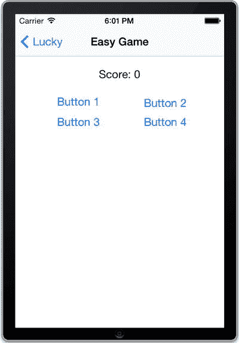

**图 17-7.**


### 幸运游戏简单难度的界面

完成应用的主要架构后，接下来可以着手实现游戏玩法功能。首先初始化按钮，将其设置为“杀手”或“安全”按钮。回到 `GameViewController.m` 文件，在 `viewDidLoad` 方法中添加清单 17-8 所示的代码行。

**清单 17-8.** 在 `viewDidLoad` 方法中添加对 `setupButtons` 的调用

```
- (void)viewDidLoad
{
    [super viewDidLoad];
    // ...
    [self updateScoreLabel];
    [self setupButtons];
}
```

请注意，你是自上而下实现这段代码的，这意味着你添加的代码会调用尚不存在的辅助方法。不必担心编译器错误，因为随着你添加缺失的方法，这些错误会自然消失。现在实现 `setupButtons` 辅助方法，它只是将任务委托给三个具体方法，每个方法对应一个难度级别，如清单 17-9 所示。

**清单 17-9.** 实现 `setupButtons` 方法

```
- (void)setupButtons
{
    switch (_level) {
        case 0:
            [self setupButtonsForEasyGame];
            break;
        case 1:
            [self setupButtonsForNormalGame];
            break;
        case 2:
            [self setupButtonsForHardGame];
            break;
        default:
            break;
    }
}
```

接下来，实现简单难度游戏的设置方法。简单游戏只将四个按钮中的一个设置为“杀手”。使用 `tag` 属性来标识“杀手”按钮：`0` 表示“安全”，`1` 表示“杀手”。清单 17-10 展示了具体实现。

**清单 17-10.** `setupButtonsForEasyGame` 方法的实现

```
- (void)setupButtonsForEasyGame
{
    [self resetButtonTags];
    int killerButtonIndex = rand() % 4;
    [self buttonForIndex:killerButtonIndex].tag = 1;
}
```

如你所见，该方法重置了按钮的 `tag` 属性，并随机选取一个按钮作为“杀手”。它使用了两个尚未创建的辅助方法：`resetButtonTags` 和 `buttonForIndex:`。我们先从 `resetButtonTags` 开始，它遍历四个按钮并将其 `tag` 属性设置为 `0`，如清单 17-11 所示。

**清单 17-11.** 实现 `resetButtonTags` 方法

```
- (void)resetButtonTags
{
    for (int i = 0; i < 4; i++)
    {
        UIButton *button = [self buttonForIndex:i];
        button.tag = 0;
    }
}
```

清单 17-11 中的方法也使用了 `buttonForIndex:` 辅助方法。因此请添加该辅助方法，如清单 17-12 所示。

**清单 17-12.** 实现 `buttonForIndex:` 方法

```
- (UIButton *)buttonForIndex:(int)index
{
    switch (index)
    {
        case 0:
            return self.button1;
        case 1:
            return self.button2;
        case 2:
            return self.button3;
        case 3:
            return self.button4;
        default:
            return nil;
    }
}
```

现在我们来设置普通难度游戏。它与简单难度类似，只是选择了两个“杀手”按钮而非一个；清单 17-13 展示了具体实现。

**清单 17-13.** 实现 `setupButtonsForNormalGame`

```
- (void)setupButtonsForNormalGame
{
    [self resetButtonTags];
    int killerButtonIndex1 = rand() % 4;
    int killerButtonIndex2;
    do {
        killerButtonIndex2 = rand() % 4;
    } while (killerButtonIndex1 == killerButtonIndex2);
    [self buttonForIndex:killerButtonIndex1].tag = 1;
    [self buttonForIndex:killerButtonIndex2].tag = 1;
}
```

最后，实现困难难度游戏的设置方法，其中除一个按钮外其余都是“杀手”，如清单 17-14 所示。

**清单 17-14.** 实现 `setupButtonsForHardGame`

```
- (void)setupButtonsForHardGame
{
    int safeButtonIndex = rand() % 4;
    for (int i=0; i < 4; i++) {
        if (i == safeButtonIndex) {
            [self buttonForIndex:i].tag = 0;
        }
        else
        {
            [self buttonForIndex:i].tag = 1;
        }
    }
}
```

剩下的工作就是实现 `gameButtonSelected:` 动作方法。该方法检查发送按钮的 `tag` 属性，判断它是“杀手”还是“安全”按钮。如果是“安全”按钮，分数将会增加，并重新选取“杀手”；如果是“杀手”按钮，游戏结束，将显示一个包含最终得分的警告框。清单 17-15 展示了完整的实现。

**清单 17-15.** 实现 `gameButtonSelected:` 动作方法

```
- (IBAction)gameButtonSelected:(UIButton *)sender
{
    if (sender.tag == 0)
    {
        // 安全，继续游戏
        _score += 1;
        [self updateScoreLabel];
        [self setupButtons];
    }
    else
    {
        // 游戏结束
        NSString *message = [NSString stringWithFormat:@"你的得分是 %i。", _score];
        UIAlertView *gameOverAlert = [[UIAlertView alloc] initWithTitle:@"游戏结束"
            message:message delegate:self cancelButtonTitle:@"确定"
            otherButtonTitles:nil];
        [gameOverAlert show];
    }
}
```

至此，游戏基本功能即将完成，剩余的最后一项任务是在游戏结束且用户关闭警告框后，将用户带回菜单界面。通过添加清单 17-16 所示的委托方法实现这一点。

**清单 17-16.** 实现 `alertView:didDismissWithButtonIndex:` 委托方法

```
- (void)alertView:(UIAlertView *)alertView didDismissWithButtonIndex:(NSInteger)buttonIndex
{
    [self.navigationController popViewControllerAnimated:YES];
}
```

现在游戏已完成，请进行测试。你应该能够选择简单、普通或困难难度进行游戏，直到点击到“杀手”按钮为止。图 17-8 展示了一个完成后的简单难度游戏界面。

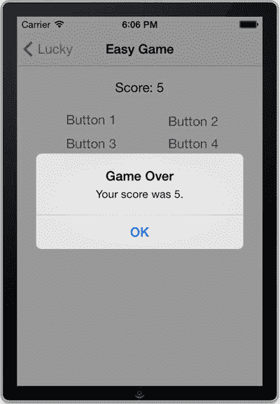

**图 17-8.** 玩家在幸运游戏中点击了“杀手”按钮

游戏功能已就绪并正常运行，接下来你可以将注意力转向如何让游戏支持 Game Center。


### 注册 iTunes Connect

通常开发 iOS 应用时，注册 iTunes Connect 是发布到 App Store 前的最后一步。但对于支持 Game Center 的应用而言，情况有所不同。当您准备开发 Game Center 特定功能时，就必须立即注册应用。之所以需要注册 iTunes Connect，是因为 Game Center 需要知晓该应用才能测试其功能。若未注册，您将无法访问 Game Center 服务器，导致所有功能失效。

一旦完成注册并将应用标记为支持 Game Center，iTunes Connect 便会为您的应用创建一个 Game Center 沙箱。Game Center 沙箱是一个开发环境，您可以在其中测试 Game Center 集成功能，而不会影响生产环境的分数或成就。

在 iOS 7 中，如果您拥有开发者账号，可以轻松启用 Game Center。选择根项目后，前往“Capabilities”选项卡并开启 Game Center。当系统提示选择团队时，选定它并点击“Choose”，如图 17-9 所示。

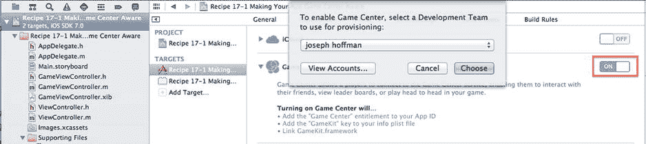

图 17-9. 配置 GameKit 功能

现在您已启用 GameKit 功能并选择了配置文件，请前往 [`http://itunesconnect.apple.com`](http://itunesconnect.apple.com/) 使用开发者 ID 登录。点击“Manage Your Applications”链接，然后点击“Add New App”按钮。按照说明操作，在到达“App Information”页面时，输入图 17-10 所示的信息，但应用名称需确保唯一且未被其他开发者使用。您可以像图中那样尝试使用姓名首字母作为前缀。

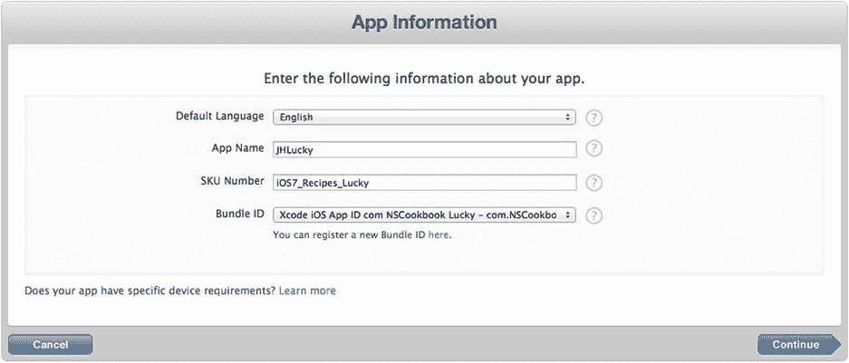

图 17-10. 在 iTunes Connect 中输入应用信息

继续填写应用所需的元数据信息。您还需要上传一张截图和一个大型应用图标。为节省时间，您可以从本书的 [`www.apress.com`](http://www.apress.com/) 页面的“源代码/下载”中下载图片。所需文件如下：

*   `Lucky Large App Icon.jpg`
*   [`Lucky Screenshot.png`](http://www.hans-eric.com/wp-content/uploads/2012/09/Lucky-Screenshot.png)
*   `Lucky Screenshot (iPhone 5).png`

填写完所需信息后，点击“Save”。此时您将看到一个类似于图 17-11 的页面。

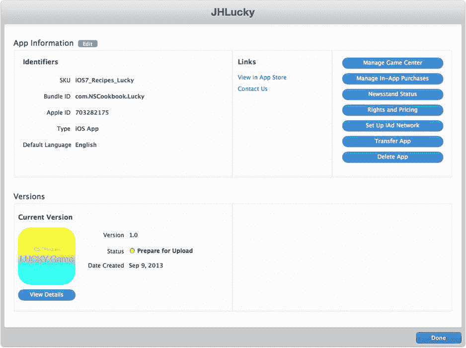

图 17-11. 已在 iTunes Connect 注册的应用

现在，点击页面右侧的“Manage Game Center”按钮。在“Enable Game Center”页面，点击“Enable for Single Game”按钮，如图 17-12 所示。

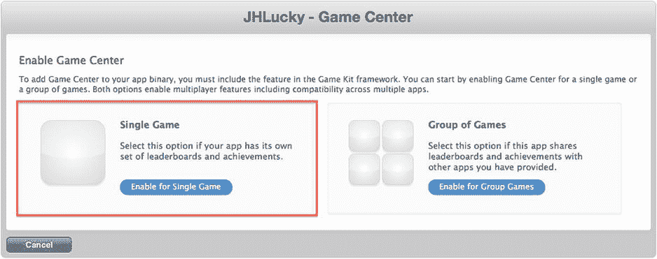

图 17-12. 在 iTunes Connect 中为应用启用 Game Center

注册至此完成。稍后您将返回 iTunes Connect 配置排行榜和成就，但现在请先返回 Xcode 项目以设置基本的 Game Center 支持。

### 验证本地玩家

启用 Game Center 沙箱后，您可以返回 Xcode 在应用中实现 Game Center 支持。应用会检查 Game Center 是否可用，并在用户尚未登录时允许其登录。由于我们已通过“Capabilities”选项卡开启了 Game Center，info plist 文件和 GameKit 框架已为您配置完毕。现在您可以开始编写代码了。

您的用户需要登录 Game Center 才能使用其功能。通常最好在应用启动时验证玩家身份，这样玩家可以立即开始接收挑战和其他 Game Center 通知。前往 `ViewController.h`，导入 GameKit API，并添加清单 17-17 所示的属性以追踪已登录的玩家。

**清单 17-17.** 向 `ViewController.h` 文件添加属性和导入语句

```objective-c
//
//  ViewController.h
//  Lucky
//

#import <UIKit/UIKit.h>
#import "GameViewController.h"
#import <GameKit/GameKit.h>

@interface ViewController : UIViewController

@property (weak, nonatomic) IBOutlet UILabel *welcomeLabel;
@property (strong, nonatomic) GKLocalPlayer *player;

- (IBAction)playEasyGame:(id)sender;
- (IBAction)playNormalGame:(id)sender;
- (IBAction)playHardGame:(id)sender;

@end
```

为该属性添加一个自定义 setter，以便在已验证玩家发生更改时更新“欢迎”标签。前往 `ViewController.m` 并实现清单 17-18 中的方法。

**清单 17-18.** 实现 `setPlayer:` Setter 方法

```objective-c
- (void)setPlayer:(GKLocalPlayer *)player
{
    _player = player;
    NSString *playerName;
    if (_player)
    {
        playerName = _player.alias;
    }
    else
    {
        playerName = @"Anonymous Player";
    }
    self.welcomeLabel.text = [NSString stringWithFormat:@"Welcome %@", playerName];
}
```

GameKit 框架会为您处理验证过程。您只需为 `localPlayer` 共享实例提供一个验证处理程序块。添加一个辅助方法，用于分配这样一个块，如清单 17-19 所示。

**清单 17-19.** 实现 `authenticatePlayer` 方法

```objective-c
- (void)authenticatePlayer
{
    __weak GKLocalPlayer *localPlayer = [GKLocalPlayer localPlayer];
    localPlayer.authenticateHandler =
    ^(UIViewController *authenticateViewController, NSError *error)
    {
        if (authenticateViewController != nil)
        {
            [self presentViewController:authenticateViewController animated:YES
                            completion:nil];
        }
        else if (localPlayer.isAuthenticated)
        {
            self.player = localPlayer;
        }
        else
        {
            // 禁用 Game Center
            self.player = nil;
        }
    };
}
```

分配验证处理程序后，GameKit 会尝试验证本地玩家。结果可能出现以下三种情况之一：

*   如果用户未登录 Game Center，验证处理程序将被调用，并附带 GameKit 提供的登录视图控制器。您的应用只需在适当时机呈现该视图控制器即可。无论用户登录还是取消视图控制器，您的验证处理程序都会根据新状态再次被调用。
*   如果用户当前已登录，则不会提供视图控制器，并且 `localPlayer` 的 `isAuthenticated` 属性返回 `YES`。您的应用随后可以启用其 Game Center 功能。在本例中，这意味着分配 `player` 属性。
*   如果用户未登录且 Game Center 因某种原因不可用，则不会提供视图控制器，并且 `isAuthenticated` 属性返回 `NO`。您的应用应禁用其 Game Center 功能或停止执行，选择最合适的方案。在本例中，由于允许匿名游戏，您只需将 `player` 属性设置为 `nil`。

最后，要在主视图加载完成后启动验证过程，请修改 `viewDidLoad` 方法，如清单 17-20 所示。

**清单 17-20.** 更新 `viewDidLoad` 方法以调用 `authenticatePlayer` 方法

```objective-c
- (void)viewDidLoad
{
    [super viewDidLoad];
    self.player = nil;
}
```


`[self authenticatePlayer];`

`}`

用户身份验证大致就这些内容。当你运行应用时，系统会提示你登录或创建新账户，如图 17-13 所示。一旦用户登录，该用户便可访问 Game Center 中的任何应用。因此，如果你或用户已在其他应用中通过 Game Center 验证，此信息可传递至你的应用，无需再次提示登录。

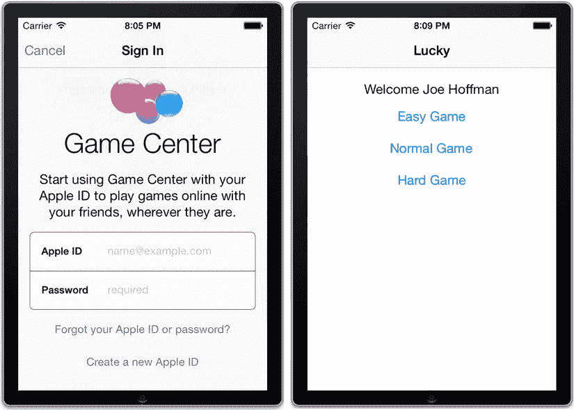

图 17-13. Lucky 应用提示输入 Game Center 账户，随后在菜单屏幕上显示欢迎消息

在继续实现 Game Center 功能之前，最后再添加一个按钮，让用户无需离开应用即可访问 Game Center。

### 在应用中显示 Game Center

再次打开 `Main.storyboard` 文件，在视图控制器中添加一个“访问 Game Center”按钮，使界面如图 17-14 所示。

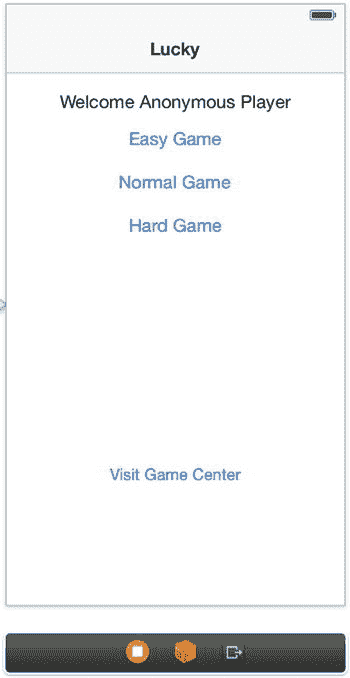

图 17-14. 带有“访问 Game Center”按钮的菜单屏幕

为用户点击新按钮时创建一个名为 `showGameCenter` 的操作。

接下来，进入 `ViewController.h`，添加 `GKGameCenterControllerDelegate` 协议，如清单 17-21 所示。

清单 17-21. 在 `ViewController.h` 文件中添加 `GKGameCenterControllerDelegate`

```
//
//  ViewController.h
//  Recipe 17-1 Making Your App Game Center Aware
//
#import <UIKit/UIKit.h>
#import "GameViewController.h"
#import <GameKit/GameKit.h>

@interface ViewController : UIViewController <GKGameCenterControllerDelegate>
@property (weak, nonatomic) IBOutlet UILabel *welcomeLabel;
@property (strong, nonatomic) GKLocalPlayer *player;
- (IBAction)playEasyGame:(id)sender;
- (IBAction)playNormalGame:(id)sender;
- (IBAction)playHardGame:(id)sender;
- (IBAction)showGameCenter:(id)sender;
@end
```

现在，进入 `ViewController.m`，为清单 17-22 所示的 `showGameCenter:` 操作方法添加实现。

清单 17-22. 实现 `showGameCenter:` 操作方法

```
- (IBAction)showGameCenter:(id)sender
{
    GKGameCenterViewController *gameCenterController =
        [[GKGameCenterViewController alloc] init];
    if (gameCenterController != nil)
    {
        gameCenterController.gameCenterDelegate = self;
        [self presentViewController:gameCenterController animated:YES completion:nil];
    }
}
```

最后，添加委托方法，在用户完成操作后关闭 Game Center 视图控制器，如清单 17-23 所示。

清单 17-23. 实现 `gameCenterViewControllerDidFinish:` 委托方法

```
- (void)gameCenterViewControllerDidFinish:(GKGameCenterViewController *)gameCenterViewController
{
    [self dismissViewControllerAnimated:YES completion:nil];
}
```

现在，你已经设置好了基本的 Game Center 感知应用，接下来可以开始实现一些 Game Center 功能，首先从排行榜开始。

## 配方 17-2. 实现排行榜

与他人竞争是游戏的核心要素。让玩家能够比较高分并相互竞争，是有效提升任何游戏重玩率的途径。利用 Game Center，通过排行榜可以轻松实现这一功能。在本配方中，你将在配方 17-1 的项目基础上构建，并实现排行榜支持。排行榜允许用户将分数提交到 Game Center，Game Center 则会列出得分最高的玩家。

你需要做的第一件事是在 iTunes Connect 中定义要使用的排行榜。

### 定义排行榜

为你的应用设置三个不同的排行榜，每个难度级别对应一个。

登录 [`itunesconnect.apple.com`](http://itunesconnect.apple.com/)，点击“管理你的应用程序”链接。选择你在配方 17-1 中注册的 Lucky 应用，然后点击“管理 Game Center”按钮。

在排行榜部分，点击“添加排行榜”按钮。在“添加排行榜”页面（参见图 17-15）中，选择创建单个排行榜。

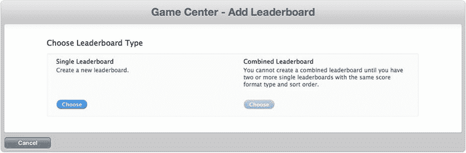

图 17-15. 创建单个排行榜 注意

一旦某个排行榜在应用中上线，就无法删除，因此请慎重创建排行榜。每个应用最多可以有 25 个排行榜。你可以为不同难度创建多个排行榜，甚至为游戏的每个关卡创建一个，选择最合理的方案即可。

填写排行榜的名称和标识符。名称是用于跟踪的内部名称，不会向玩家显示。（显示名称将在下一步添加语言时配置。）然后选择分数格式类型；在此例中，你将使用简单的整数，但你也可以使用基于时间、浮点数和货币的格式。选择排行榜的排序顺序和分数提交类型。如果你希望高分排在顶部（典型情况），则选择从高到低排序；如果你希望低分排在顶部（例如在高尔夫游戏中），则选择从低到高排序。

你还需要为排行榜设置至少一种语言。为此，请点击“添加语言”按钮。选择语言，然后输入排行榜的显示名称；这是玩家在游戏中可见的名称。你可以设置分数的格式以及分数的单位（单数和复数形式）；在此例中，单位是“点”和“点数”。

图 17-16 展示了你将在本排行榜中使用的配置。

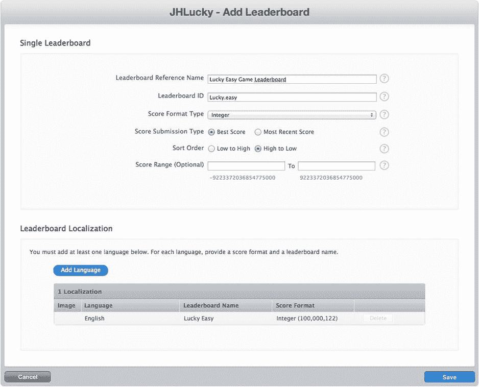

图 17-16. 为 Lucky 的简单游戏高分配置排行榜

完成后，点击“保存”以存储排行榜。

为剩余两个排行榜重复此过程，这次使用 `Lucky.normal` 和 `Lucky.hard` 作为排行榜 ID。最终的排行榜部分现在应类似于图 17-17。

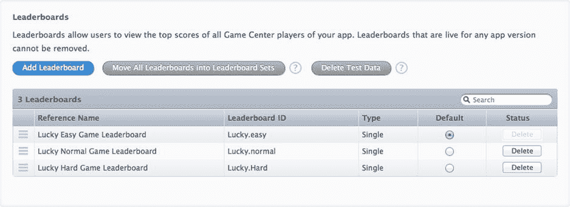

图 17-17. 在 iTunes Connect 中为 Lucky 游戏注册的三个排行榜

现在，让我们深入代码部分。


### 向 Game Center 报告得分

要向 Game Center 报告得分，请使用 `GKScore` 类。前往 `GameViewController.m` 文件，并添加如代码清单 17-24 所示的辅助方法。该方法会创建并初始化一个新的 `GKScore` 对象，然后将其报告给 Game Center，同时提供一个完成处理程序。

**代码清单 17-24.** 实现 `reportScore:forLeaderboard:` 辅助方法

```
- (void)reportScore:(int64_t)score forLeaderboard: (NSString*)leaderboardID
{
    GKScore *gameCenterScore = [[GKScore alloc] initWithLeaderboardIdentifier:leaderboardID];
    gameCenterScore.value = score;
    gameCenterScore.context = 0;
    NSArray *scoresArray = [[NSArray alloc] initWithObjects:gameCenterScore, nil];
    [GKScore reportScores:scoresArray withCompletionHandler:^(NSError *error)
     {
         if (error)
         {
             NSLog(@"Error reporting score: %@", error);
         }
     }];
}
```

> **注意：** 如果因连接问题导致得分无法报告，GameKit 会存储该请求，并稍后尝试重新发送得分，因此无需在之前的完成处理程序中执行任何类型的重试处理。

现在，当游戏结束时，你可以使用 `reportScore:forLeaderboard:` 辅助方法向 Game Center 报告得分。在此应用程序中，你应在用户关闭“游戏结束”警告视图后立即执行此操作。将代码清单 17-25 中以粗体显示的代码添加到 `alertView:didDismissWithButtonIndex:` 委托方法中。

**代码清单 17-25.** 为报告得分添加功能

```
- (void)alertView:(UIAlertView *)alertView didDismissWithButtonIndex:(NSInteger)buttonIndex
{
    [self.navigationController popViewControllerAnimated:YES];
    if ([GKLocalPlayer localPlayer].isAuthenticated)
    {
        [self reportScore:_score forLeaderboard:[self leaderboardID]];
    }
}
```

`leaderboardID` 辅助方法返回对应当前游戏等级的 ID。代码清单 17-26 展示了其实现。

**代码清单 17-26.** 实现 `leaderboardID` 方法

```
- (NSString *)leaderboardID
{
    switch (_level) {
        case 0:
            return @"Lucky.easy";
        case 1:
            return @"Lucky.normal";
        case 2:
            return @"Lucky.hard";
        default:
            return @"";
    }
}
```

现在你可以构建并运行应用，然后开始游戏。你的得分会自动报告给 Game Center。你可以使用“访问 Game Center”按钮来查看结果排行榜，如图 17-18 所示。

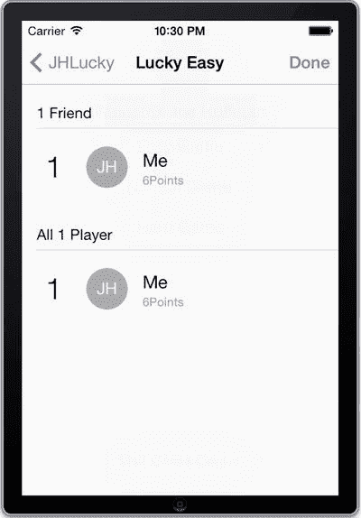

**图 17-18.** 显示一个得分的 Game Center 排行榜

## 方案 17-3. 实现成就

游戏中的成就类似于大多数游戏中的徽章和其他可完成的目标。利用 Game Center 成就，你可以在玩家达到特定里程碑时向他们发送通知。成就最适合那些具有自然里程碑的游戏，例如在赛车游戏中打破赛道记录。不过，为了演示其工作原理，你将为你之前在方案 17-1 和 17-2 中构建的 Lucky 游戏项目设置一个成就。

具体来说，如果玩家在游戏中成功使用了全部四个按钮，您将奖励她一个成就。与排行榜类似，你将首先在 iTunes Connect 中注册成就。

### 在 iTunes Connect 中定义成就

再次登录 [`itunesconnect.apple.com`](http://itunesconnect.apple.com/)。点击“管理你的应用程序”，点击你为 Game Center 设置的应用，然后点击“管理 Game Center”按钮。

你将定义三个成就，每个难度等级一个。从在“管理 Game Center”页面点击“添加成就”按钮开始。输入名称、ID 和分值，如图 17-19 所示。同时，将“隐藏”和“可多次达成”选项设置为“否”。在你自己的应用中，你可以将“隐藏”设置为“是”，以便用玩家未知的成就给他们带来惊喜。不过，对于此应用，我们将让用户知晓所有可能的成就。

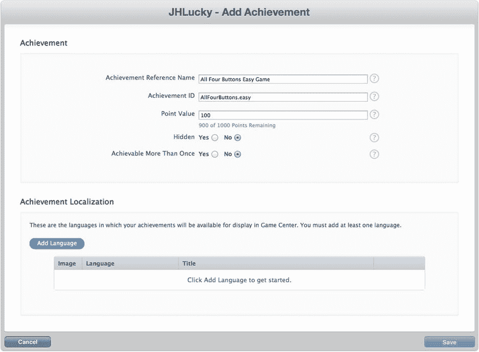

**图 17-19.** 在 iTunes Connect 中配置 Game Center 成就

每个游戏最多可以有 1000 点成就分。你可以根据需要将这些分数分配给不同的成就，但每个成就最多只能有 100 点成就分，这也是你在此处使用的值。

与排行榜类似，在至少为成就添加一种语言之前，你无法保存它。为此，请点击“添加语言”按钮。生成的视图应类似于图 17-20（在填写字段之后）。在这里，你可以设置成就标题以及“达成前”描述。达成前描述应详细说明如何获得该成就。还有一个“已达成的描述”，这是在成就达成后显示的描述。

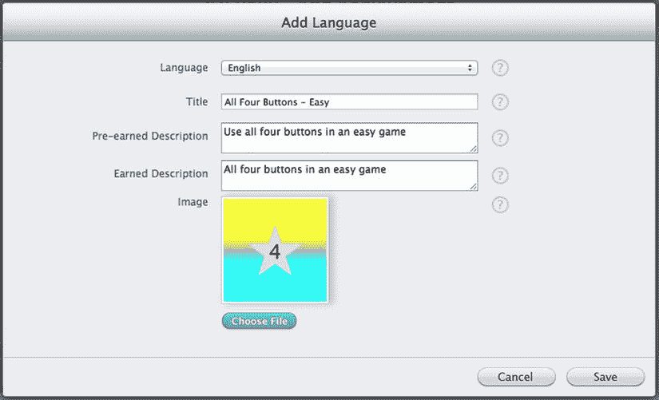

**图 17-20.** 为 Game Center 成就配置语言

请注意，你需要一张图片来在 Game Center 应用中展示成就。你可以从本书的网页下载为这三个成就预先制作的图片：

*   [`All Four Buttons Achievement Easy.png`](http://www.hans-eric.com/wp-content/uploads/2012/09/All-Four-Buttons-Achievement-Easy.png)
*   [`All Four Buttons Achievement Normal.png`](http://www.hans-eric.com/wp-content/uploads/2012/09/All-Four-Buttons-Achievement-Normal.png)
*   [`All Four Buttons Achievement Hard.png`](http://www.hans-eric.com/wp-content/uploads/2012/09/All-Four-Buttons-Achievement-Hard.png)

保存语言，然后保存成就。现在，你可以对另外两个成就重复此过程，分别使用 ID `AllFourButtons.normal` 和 `AllFourButtons.hard`。

你的成就列表现在应类似于图 17-21。

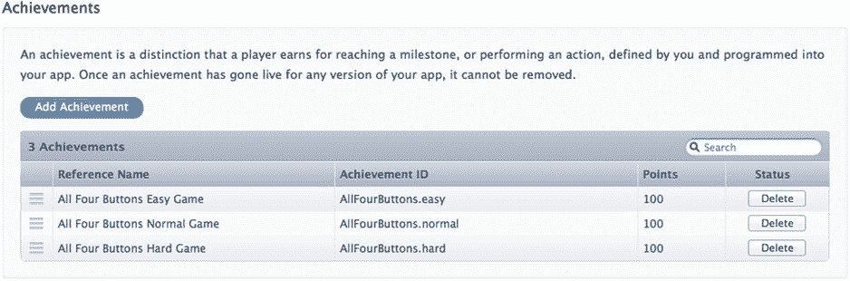

**图 17-21.** 在 iTunes Connect 中定义的三个成就

至此，你已完成了成就的配置。接下来你将利用这些成就配置。


### 报告成就

该应用会追踪哪些按钮已被点击。你可以通过一个简单的 `NSMutableArray` 来实现。首先，打开 `GameViewController.h` 文件，并添加一个实例变量，如代码清单 17-27 所示。

**代码清单 17-27.** 在 `GameViewController.h` 文件中添加 `NSMutableArray` 实例变量

```
//
//  GameViewController.h
//  Lucky
//

#import <UIKit/UIKit.h>
#import <GameKit/GameKit.h>

@interface GameViewController : UIViewController<UIAlertViewDelegate>
{
@private
    int _score;
    int _level;
    NSMutableArray *_selectedButtons;
}
// ...
@end
```

接着，打开 `ViewController.m` 文件，并在 `initWithLevel:` 方法中添加代码来实例化该数组，如代码清单 17-28 所示。

**代码清单 17-28.** 在 `initWithLevel:` 方法中实例化按钮数组

```
- (id)initWithLevel:(int)level
{
    self = [super initWithNibName:nil bundle:nil];
    if (self)
    {
        _level = level;
        _score = 0;
        _selectedButtons = [[NSMutableArray alloc] initWithCapacity:4];
    }
    return self;
}
```

最后，在 `gameButtonSelected: action` 方法中，添加代码清单 17-29 中加粗显示的代码。该代码会将选中的按钮添加到数组（若尚未添加）。然后，如果所有四个按钮都已被点击，它将使用你接下来实现的辅助方法向 Game Center 报告成就。

**代码清单 17-29.** 修改 `gameButtonSelected:` 方法以报告成就

```
- (IBAction)gameButtonSelected:(UIButton *)sender
{
    if (sender.tag == 0)
    {
        // 安全，继续游戏
        _score += 1;
        [self updateScoreLabel];
        [self setupButtons];
        if (![_selectedButtons containsObject:sender])
        {
            [_selectedButtons addObject:sender];
            if (_selectedButtons.count == 4)
            {
                [self reportAllFourButtonsAchievementCompleted];
            }
        }
    }
    else
    {
        // 游戏结束
        // ...
    }
}
```

报告成就与报告排行榜分数的方式类似，区别在于使用 `GKAchievement` 类而非 `GKScore`。代码清单 17-30 展示了 `reportAllFourButtonsAchievementCompleted` 辅助方法的实现。

**代码清单 17-30.** 实现 `reportAllFourButtonsAchievementCompleted` 方法

```
- (void)reportAllFourButtonsAchievementCompleted
{
    NSString *achievementID = [self achievementID];
    GKAchievement *achievement = [[GKAchievement alloc] initWithIdentifier:achievementID];
    if (achievement != nil)
    {
        achievement.percentComplete = 100;
        achievement.showsCompletionBanner = NO;
        NSArray *achievementArray = [[NSArray alloc] initWithObjects:achievement, nil];
        [GKAchievement reportAchievements:achievementArray withCompletionHandler:^(NSError *error)
        {
            if (error != nil)
            {
                NSLog(@"报告成就时出错: %@", error);
            }
            else
            {
                [GKNotificationBanner showBannerWithTitle:@"成就已完成"
                                                 message:@"你已经使用了全部四个按钮，并获得了 100 分！"
                                        completionHandler:nil];
            }
        }];
    }
}
```

**注意**

对于支持追踪子里程碑的成就，你可以使用 `percentComplete` 属性来报告部分进度。在本示例中，你直接将 `percentComplete` 属性设置为 100，表示该成就已完全完成。

最后，实现 `achievementID` 辅助方法，该方法根据当前游戏关卡返回成就 ID，如代码清单 17-31 所示。

**代码清单 17-31.** 实现 `achievementID` 方法

```
- (NSString *)achievementID
{
    switch (_level) {
        case 0:
            return @"AllFourButtons.easy";
        case 1:
            return @"AllFourButtons.normal";
        case 2:
            return @"AllFourButtons.hard";
        default:
            return @"";
    }
}
```

现在你可以再次构建并运行应用。开始游戏，并尝试使用全部四个按钮。如果你的运气足够好，没有遇到“杀手”，你将获得一项成就。图 17-22 展示了 Game Center 视图控制器中显示的一位已获得全部三项成就的玩家。

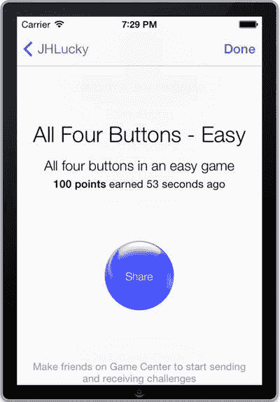

**图 17-22.** 一位已在游戏中完成三项成就的玩家


在当前实现中，即使玩家之前已完成某项成就，系统仍会重复报告。让我们来解决这个问题。你需要做的是缓存当前玩家的成就数据，以便在向 Game Center 报告前检查该成就是否已被完成。这样一来，就能避免不必要的服务器调用。

首先，添加一个 `NSMutableDictionary` 属性来存储成就。打开 `ViewController.h`，添加代码清单 17-32 中所示的声明。

```
//
//  ViewController.h
//  Lucky
//

#import <UIKit/UIKit.h>
#import "GameViewController.h"
#import <GameKit/GameKit.h>

@interface ViewController : UIViewController<GKGameCenterControllerDelegate>

@property (weak, nonatomic) IBOutlet UILabel *welcomeLabel;
@property (strong, nonatomic) GKLocalPlayer *player;
@property (strong, nonatomic) NSMutableDictionary *achievements;

// ...
@end
```

接下来，打开 `ViewController.m`，在 `viewDidLoad` 方法中添加代码清单 17-33 中加粗的那一行。

```
- (void)viewDidLoad
{
    [super viewDidLoad];
    self.achievements = [[NSMutableDictionary alloc] init];
    self.player = nil;
    [self authenticatePlayer];
}
```

在 `player` 属性的 setter 方法中，添加代码清单 17-34 中加粗的代码行，以初始化成就字典。这基本上会在设置新玩家时清除所有已有成就，并通过我们即将实现的 `loadAchievements` 辅助方法加载该玩家的成就数据。

```
- (void)setPlayer:(GKLocalPlayer *)player
{
    if (_player == player)
        return;

    [self.achievements removeAllObjects];
    _player = player;

    NSString *playerName;
    if (_player)
    {
        playerName = _player.alias;
        [self loadAchievements];
    }
    else
    {
        playerName = @"匿名玩家";
    }

    self.welcomeLabel.text = [NSString stringWithFormat:@"欢迎您，%@", playerName];
}
```

`loadAchievements` 辅助方法会加载当前玩家的成就并填充字典，如代码清单 17-35 所示。

```
- (void)loadAchievements
{
    [GKAchievement loadAchievementsWithCompletionHandler:
     ^(NSArray *achievements, NSError *error)
     {
         if (error == nil)
         {
             for (GKAchievement* achievement in achievements)
                 [self.achievements setObject: achievement
                                       forKey: achievement.identifier];
         }
         else
         {
             NSLog(@"加载成就时出错：%@", error);
         }
     }];
}
```

接下来，更新 `playGameWithLevel:` 方法，将成就字典传入初始化方法，如代码清单 17-36 所示。

```
- (void)playGameWithLevel:(int)level
{
    GameViewController *gameViewController =
        [[GameViewController alloc] initWithLevel:level
                                     achievements:self.achievements
         ];
    [self.navigationController pushViewController:gameViewController animated:YES];
}
```

现在，使用成就字典来初始化游戏视图控制器。首先，打开 `GameViewController.h`，按照代码清单 17-37 进行修改。

```
//
//  GameViewController.h
//  Lucky
//

#import <UIKit/UIKit.h>
#import <GameKit/GameKit.h>

@interface GameViewController : UIViewController<UIAlertViewDelegate>
{
@private
    int _score;
    int _level;
    NSMutableArray *_selectedButtons;
}

@property (weak, nonatomic) IBOutlet UILabel *scoreLabel;
@property (weak, nonatomic) IBOutlet UIButton *button1;
@property (weak, nonatomic) IBOutlet UIButton *button2;
@property (weak, nonatomic) IBOutlet UIButton *button3;
@property (weak, nonatomic) IBOutlet UIButton *button4;
@property (strong, nonatomic) NSMutableDictionary *achievements;

- (IBAction)gameButtonSelected:(UIButton *)sender;
- (id)initWithLevel:(int)level achievements:(NSMutableDictionary *)achievements;

@end
```

在 `GameViewController.m` 中，对 `initWithLevel:` 方法进行相应的修改，如代码清单 17-38 所示。

```
- (id)initWithLevel:(int)level achievements:(NSMutableDictionary *)achievements
{
    self = [super initWithNibName:nil bundle:nil];
    if (self)
    {
        _level = level;
        _score = 0;
        _selectedButtons = [[NSMutableArray alloc] initWithCapacity:4];
        self.achievements = achievements;
    }
    return self;
}
```

接下来，定义一个辅助方法，从缓存中获取当前成就，如果不存在则创建一个新的 `GKAchievement` 对象，如代码清单 17-39 所示。

```
- (GKAchievement *)getAchievement
{
    NSString *achievementID = [self achievementID];
    GKAchievement *achievement = [self.achievements objectForKey:achievementID];
    if (achievement == nil)
    {
        achievement = [[GKAchievement alloc] initWithIdentifier:achievementID];
        [self.achievements setObject:achievement forKey:achievement.identifier];
    }

    return achievement;
}
```

最后，修改 `reportAllFourButtonsAchievement` 方法，使其使用新的辅助方法，如代码清单 17-40 所示。

```
- (void)reportAllFourButtonsAchievementCompleted
{
    GKAchievement *achievement = [self getAchievement];
    if (achievement != nil && !achievement.completed)
    {
        achievement.percentComplete = 100;
        achievement.showsCompletionBanner = NO;

        NSArray *achievementArray = [[NSArray alloc] initWithObjects:achievement, nil];
        [GKAchievement reportAchievements:achievementArray withCompletionHandler:^(NSError *error)
         {
             if (error != nil)
             {
                 NSLog(@"报告成就时出错：%@", error);
             }
             else
             {
                 [GKNotificationBanner showBannerWithTitle:@"成就已达成"
                                                  message:@"你已使用了全部四个按钮，并获得 100 分！"
                                        completionHandler:nil];
             }
         }];
    }
}
```

这样就完成了。现在，应用只会在真正取得进展时才进行报告，因此不会因报告未改变 Game Center 状态的信息而浪费网络资源。

## 秘方 17-4. 创建一个简单的基于回合制的多人游戏

游戏本质上是一种社交活动。虽然与计算机对战也很有趣，但与其他人类玩家同台竞技或合作，则能为游戏体验带来全新的维度。Game Kit 对多人游戏提供了出色的支持，既支持实时对战也支持回合制游戏。这意味着两名玩家可以在两台不同的设备上轮流进行游戏，其响应速度几乎与在同一台设备上一起玩相同。

在本节中，你将构建一个简单的基于回合制的多人井字棋游戏，它将使用 Game Center 进行比赛配对以及底层网络实现。Game Center 的比赛配对工具非常实用，因为它让你无需编写大量额外代码即可邀请玩家加入游戏。

与往常构建使用 Game Center 的应用一样，首先实现基本的游戏功能，然后再添加 Game Center 的支持。


### 构建井字棋游戏

创建一个名为“Tic Tac Toe”的新单视图项目。

首先构建游戏的基本用户界面。打开 `Main.storyboard` 文件开始编辑界面。向视图中添加一个标签和九个带背景的按钮，使其看起来如图 17-23 所示。在本示例中，我们使用了浅灰色背景。另外，在右上角添加一个按钮来开始游戏。

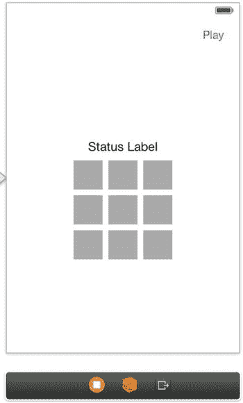

图 17-23. 井字棋游戏的简单用户界面

为各个元素创建以下名称的插座变量：

* `statusLabel`
* `row1Col1Button`, `row1Col2Button`, `row1Col3Button`
* `row2Col1Button`, `row2Col2Button`, `row2Col3Button`
* `row3Col1Button`, `row3Col2Button`, `row3Col3Button`

此外，创建一个名为 `selectButton` 且参数类型为 `UIButton` 的操作。将所有九个按钮连接到该操作。为开始按钮创建另一个名为 `playGame` 的操作。接下来，打开 `ViewController.h` 并添加清单 17-41 中所示的私有实例变量。

清单 17-41. 完整的 ViewController.h 文件

```
//
//  ViewController.h
//  Tic Tac Toe
//

#import <UIKit/UIKit.h>

@interface ViewController : UIViewController
{
    @private
    NSString *_currentMark;
}

@property (weak, nonatomic) IBOutlet UILabel *statusLabel;
@property (weak, nonatomic) IBOutlet UIButton *row1Col1Button;
@property (weak, nonatomic) IBOutlet UIButton *row1Col2Button;
@property (weak, nonatomic) IBOutlet UIButton *row1Col3Button;
@property (weak, nonatomic) IBOutlet UIButton *row2Col1Button;
@property (weak, nonatomic) IBOutlet UIButton *row2Col2Button;
@property (weak, nonatomic) IBOutlet UIButton *row2Col3Button;
@property (weak, nonatomic) IBOutlet UIButton *row3Col1Button;
@property (weak, nonatomic) IBOutlet UIButton *row3Col2Button;
@property (weak, nonatomic) IBOutlet UIButton *row3Col3Button;

- (IBAction)selectButton:(UIButton *)sender;
- (IBAction)playGame:(id)sender;

@end
```

由于它并非本任务的关键部分，我们略过基本游戏实现的细节，而是请您访问本书网页（[www.apress.com](http://www.apress.com/)），下载 `ViewController.m` 文件并将其添加到您的项目中。不过，请确保仔细阅读代码，以便在继续之前理解其工作原理。

如果已正确添加代码，您现在应该能够运行该应用，并玩一局与自己对抗的井字棋游戏。图 17-24 展示了一个进行到一半的游戏示例。

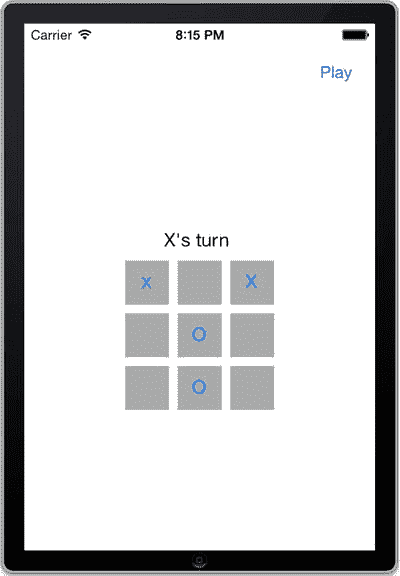

图 17-24. 进行中的井字棋游戏

基本游戏功能就位后，您可以继续实现 Game Center 支持。正如本章前面所述，这首先需要注册您的应用。

### 为游戏准备 Game Center

首先，您需要从“Capabilities”选项卡启用 Game Center，并像我们在任务 17-1 中所做的那样选择一个配置文件。

启用 Game Center 后，下一步是在 iTunes Connect 中注册您的应用。同样，详细步骤请参考任务 17-1。为节省时间，请使用本书网页中的以下艺术文件作为必须上传的大型应用图标和 iPhone 截图文件，作为注册的一部分。

* `Tic Tac Toe Large App Icon.png`
* `Tic Tac Toe Screenshot.png`
* `Tic Tac Toe Screenshot (iPhone 5).png`

此外，不要忘记在“Manage Game Center”页面中启用 Game Center（适用于 Single Game）。就本任务而言，启用 Game Center 就是您需要做的全部工作；无需为井字棋游戏定义任何排行榜或成就。

在 iTunes Connect 中注册应用后，您可以开始为其准备 Game Center 支持。回到 Xcode，将 GameKit 框架链接到您的项目。然后打开 `ViewController.h`，添加属性声明以持有本地玩家的引用。您的 `ViewController.h` 头文件现在应如清单 17-42 所示。

清单 17-42. 完整的 ViewController.h 文件

```
//
//  ViewController.h
//  Tic Tac Toe
//

#import <UIKit/UIKit.h>
#import <GameKit/GameKit.h>

@interface ViewController : UIViewController
{
    @private
    NSString *_currentMark;
}

@property (weak, nonatomic) IBOutlet UILabel *statusLabel;
@property (weak, nonatomic) IBOutlet UIButton *row1Col1Button;
@property (weak, nonatomic) IBOutlet UIButton *row1Col2Button;
@property (weak, nonatomic) IBOutlet UIButton *row1Col3Button;
@property (weak, nonatomic) IBOutlet UIButton *row2Col1Button;
@property (weak, nonatomic) IBOutlet UIButton *row2Col2Button;
@property (weak, nonatomic) IBOutlet UIButton *row2Col3Button;
@property (weak, nonatomic) IBOutlet UIButton *row3Col1Button;
@property (weak, nonatomic) IBOutlet UIButton *row3Col2Button;
@property (weak, nonatomic) IBOutlet UIButton *row3Col3Button;
@property (strong, nonatomic) GKLocalPlayer *localPlayer;

- (IBAction)selectButton:(UIButton *)sender;

@end
```

验证本地玩家的方法与您在任务 17-1 中所做的相同。转到 `ViewController.m` 并添加清单 17-43 中所示的 `authenticateLocalPlayer` 辅助方法。

清单 17-43. 实现 authenticateLocalPlayer 方法

```
- (void)authenticateLocalPlayer
{
    __weak GKLocalPlayer *localPlayer = [GKLocalPlayer localPlayer];
    localPlayer.authenticateHandler =
    ^(UIViewController *authenticateViewController, NSError *error)
    {
        if (authenticateViewController != nil)
        {
            [self presentViewController:authenticateViewController animated:YES
                            completion:nil];
        }
        else if (localPlayer.isAuthenticated)
        {
            self.localPlayer = localPlayer;
        }
        else
        {
            // 禁用 Game Center
            self.localPlayer = nil;
        }
    };
}
```

如任务 17-1 中所述，尝试在应用启动时直接验证本地玩家。将清单 17-44 中加粗的行添加到 `viewDidLoad` 方法中。

清单 17-44. 向 viewDidLoad 方法添加 authenticateLocalPlayer 方法调用

```
- (void)viewDidLoad
{
    [super viewDidLoad];
    [self enableSquareButtons:NO];
    self.statusLabel.text = @"按下“开始游戏”按钮开始游戏";
    [self authenticateLocalPlayer];
}
```

最后，在用户界面中添加几个元素，用于显示当前参与比赛的两名 Game Center 玩家。添加四个标签并进行排列，使视图控制器用户界面如图 17-25 所示。请注意，“Playing X:”和“<Player 1 Label>”以及“Playing O:”和“<Player 2 Label>”是分开的标签。

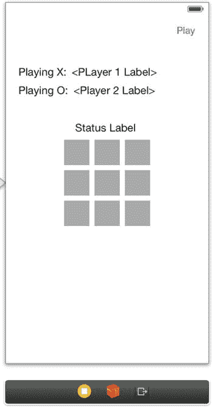

图 17-25. 带有显示参与玩家标签的简单井字棋用户界面

为相应的标签创建名为 `player1Label` 和 `player2Label` 的插座变量。

现在，基本的 Game Center 验证已经就绪，您可以实现下一步，即匹配功能。


### 实现配对功能

在本教程中，你将使用 GameKit 框架提供的标准视图控制器，让用户能够找到其他玩家一起玩你的井字棋游戏，并跟踪玩家当前参与的游戏。使用标准视图控制器可以省去你实现这些配对功能的大量麻烦。

具体来说，你将使用 `GKTurnBasedMatchmakerViewController` 来处理配对。首先，让主视图控制器遵循 `GKTurnBasedMatchmakerViewControllerDelegate` 协议。你还需要持有对 `GKTurnBasedMatch` 对象以及两个 `GKPlayer` 实例的引用。因此，打开 `ViewController.h` 并添加代码清单 17-45 中用粗体标出的行。

**代码清单 17-45.** 更新 ViewController.h 以包含新属性

```
//
//  ViewController.h
//  Tic Tac Toe
//
// ...
@interface ViewController : UIViewController <GKTurnBasedMatchmakerViewControllerDelegate>
// ...
@property (strong, nonatomic) GKLocalPlayer *localPlayer;
@property (strong, nonatomic) GKTurnBasedMatch *match;
@property (strong, nonatomic) GKPlayer *player1;
@property (strong, nonatomic) GKPlayer *player2;
- (IBAction)selectButton:(UIButton *)sender;
@end
```

现在，返回 `ViewController.m`，用代码清单 17-46 所示的代码替换 `playGame:` 动作方法的当前实现。这段代码会检查用户是否已登录 Game Center。如果未登录，则显示错误信息；否则，该方法继续创建匹配请求并呈现配对视图控制器。

**代码清单 17-46.** 替换 `playGame:` 动作方法中的代码

```
- (void)playGame:(id)sender
{
    if (self.localPlayer.isAuthenticated)
    {
        GKMatchRequest *request = [[GKMatchRequest alloc] init];
        request.minPlayers = 2;
        request.maxPlayers = 2;
        GKTurnBasedMatchmakerViewController *matchMakerViewController =
            [[GKTurnBasedMatchmakerViewController alloc] initWithMatchRequest:request];
        matchMakerViewController.turnBasedMatchmakerDelegate = self;
        [self presentViewController:matchMakerViewController animated:YES
                         completion:nil];
    }
    else
    {
        UIAlertView *notLoggedInAlert = [[UIAlertView alloc] initWithTitle:@"错误"
                                                                  message:@"您必须登录 Game Center 才能玩此游戏！"
                                                                 delegate:nil cancelButtonTitle:@"关闭" otherButtonTitles:nil];
        [notLoggedInAlert show];
    }
}
```

配对视图控制器要求你实现一些委托方法来处理用户决策的结果。第一种情况是用户取消对话框，此时你应直接关闭配对视图控制器。代码清单 17-47 展示了这一实现。

**代码清单 17-47.** 实现 `turnBasedMatchmakerViewControllerWasCancelled:` 委托方法

```
- (void)turnBasedMatchmakerViewControllerWasCancelled:
    (GKTurnBasedMatchmakerViewController *)viewController
{
    [self dismissViewControllerAnimated:YES completion:nil];
}
```

第二种情况是视图控制器因某些原因失败。除了关闭视图之外，你还需要记录错误，如代码清单 17-48 所示。

**代码清单 17-48.** 实现 `turnBasedMatchmakerViewController:didFailWithError:` 方法

```
- (void)turnBasedMatchmakerViewController:
    (GKTurnBasedMatchmakerViewController *)viewController didFailWithError:(NSError *)error
{
    [self dismissViewControllerAnimated:YES completion:nil];
    NSLog(@"配对时出错：%@", error);
}
```

最后，如果配对器成功产生了一个匹配，则会调用 `viewController:didFindMatch:` 委托方法，并传入一个 `GKTurnBasedMatch` 对象。目前，只需存储对该匹配对象的引用即可，如代码清单 17-49 所示。

**代码清单 17-49.** 实现 `turnBasedMatchmakerViewController:didFindMatch:` 委托方法

```
- (void)turnBasedMatchmakerViewController:
    (GKTurnBasedMatchmakerViewController *)viewController didFindMatch:(GKTurnBasedMatch *)match
{
    [self dismissViewControllerAnimated:YES completion:nil];
    self.match = match;
}
```


从 Game Center 接收比赛对象是实现回合制游戏时的关键事件。此时，应用程序应加载游戏数据并设置用户界面，以反映游戏的当前状态。

要处理这些事情，请为`match`属性添加一个自定义设置方法，如代码清单 17-50 所示。该方法使用两个目前尚不存在的辅助方法来加载参赛玩家和比赛数据，稍后你将实现这些方法。

**代码清单 17-50. 实现 `setMatch:` 自定义设置方法**

```
- (void)setMatch:(GKTurnBasedMatch *)match
{
    _match = match;
    [self loadPlayers];
    [self loadMatchData];
}
```

我们先从`loadPlayers`方法开始。基本上，你需要识别参与比赛的玩家，并从 Game Center 加载他们的信息。比赛对象包含一个`GKTurnBasedParticipant`对象数组，你可以用它来获取加载信息所需的`playerID`。因为你知道井字棋游戏恰好包含两名玩家（这也是你之前在匹配请求中定义的），所以你可以提取这些参与者对象，如代码清单 17-51 所示。

**代码清单 17-51. 实现部分 `loadPlayers` 辅助方法**

```
- (void)loadPlayers
{
    GKTurnBasedParticipant *participant1 = [self.match.participants objectAtIndex:0];
    GKTurnBasedParticipant *participant2 = [self.match.participants objectAtIndex:1];
    // TODO: 加载玩家信息
}
```

> **注意**：比赛对象的参与者数组是按玩家轮流顺序排列的。因此，你可以假定第一个对象是玩家 1，第二个对象是玩家 2。

回合制比赛可以在所有位置未被填满的情况下开始。这样，开始新比赛的玩家可以先走一步，而无需等待其他玩家。因此，此时对手参与者对象的`playerID`可能是`nil`。出于这个原因，你需要谨慎设计代码，以免将未定义的`playerID`发送给`loadPlayersForIdentifiers:withCompletionHandler:`方法。请将代码清单 17-52 中的粗体代码添加到`loadPlayers`方法中以处理这种情况。

**代码清单 17-52. 添加代码以处理玩家缺失的情况**

```
- (void)loadPlayers
{
    GKTurnBasedParticipant *participant1 = [self.match.participants objectAtIndex:0];
    GKTurnBasedParticipant *participant2 = [self.match.participants objectAtIndex:1];

    NSMutableArray *playerIDs = [[NSMutableArray alloc] initWithCapacity:2];
    if (participant1.playerID &&
        ![participant1.playerID isEqualToString:self.player1.playerID])
    {
        [playerIDs addObject:participant1.playerID];
    }
    if (participant2.playerID &&
        ![participant2.playerID isEqualToString:self.player2.playerID])
    {
        [playerIDs addObject:participant2.playerID];
    }

    if (playerIDs.count == 0)
        return; // 没有需要加载的玩家

    [GKPlayer loadPlayersForIdentifiers:playerIDs withCompletionHandler:
     ^(NSArray *players, NSError *error) {
         // TODO: 处理结果
     }];
}
```

最后，当玩家对象加载完成后，你需要通过检查它们的`playerID`来区分哪个是哪个。代码清单 17-53 展示了完整的`loadPlayers`方法，其中最近的更改以粗体显示。

**代码清单 17-53. 完整的 `loadPlayers` 方法实现**

```
- (void)loadPlayers
{
    GKTurnBasedParticipant *participant1 = [self.match.participants objectAtIndex:0];
    GKTurnBasedParticipant *participant2 = [self.match.participants objectAtIndex:1];

    NSMutableArray *playerIDs = [[NSMutableArray alloc] initWithCapacity:2];
    if (participant1.playerID && ![participant1.playerID isEqualToString:self.player1.playerID])
    {
        [playerIDs addObject:participant1.playerID];
    }
    if (participant2.playerID  && ![participant2.playerID isEqualToString:self.player2.playerID])
    {
        [playerIDs addObject:participant2.playerID];
    }

    if (playerIDs.count == 0)
        return; // 没有需要加载的玩家

    [GKPlayer loadPlayersForIdentifiers:playerIDs withCompletionHandler:^(NSArray *players, NSError *error)
    {
        if (players)
        {
            GKPlayer *player1;
            GKPlayer *player2;
            for (GKPlayer *player in players)
            {
                if ([player.playerID isEqualToString:participant1.playerID])
                {
                    player1 = player;
                }
                else if ([player.playerID isEqualToString:participant2.playerID])
                {
                    player2 = player;
                }
            }
            dispatch_async(dispatch_get_main_queue(),^{
                self.player1 = player1;
                self.player2 = player2;
            });
        }
        if (error)
        {
            NSLog(@"加载玩家时出错: %@", error);
        }
    }];
}
```

在前面的代码中，你将`player1`和`player2`属性的赋值包裹在`dispatch_async`调用中的原因是，这些赋值会触发用户界面的更新，因此这段代码需要运行在主线程上。

当`player1`和`player2`属性被设置后，相应的标签也应该更新。为此，请添加代码清单 17-54 中所示的自定义设置方法。

**代码清单 17-54. 为 `player1` 和 `player2` 实现自定义设置方法**

```
- (void)setPlayer1:(GKPlayer *)player1
{
    _player1 = player1;
    if (_player1)
    {
        self.player1Label.text = _player1.displayName;
    }
    else
    {
        self.player1Label.text = @"<空闲>";
    }
}

- (void)setPlayer2:(GKPlayer *)player2
{
    _player2 = player2;
    if (_player2)
    {
        self.player2Label.text = _player2.displayName;
    }
    else
    {
        self.player2Label.text = @"<空闲>";
    }
}
```

现在，要在应用启动时初始化玩家标签，你只需在`viewDidLoad`方法中将`player1`和`player2`属性设置为`nil`，如代码清单 17-55 所示。

**代码清单 17-55. 在 `viewDidLoad` 方法中将玩家设置为 `nil` 以进行初始化**

```
- (void)viewDidLoad
{
    [super viewDidLoad];
    [self enableSquareButtons:NO];
    self.statusLabel.text = @"按“游戏”按钮开始一局游戏";
    self.player1 = nil;
    self.player2 = nil;
    [self authenticateLocalPlayer];
}
```

接下来，我们将把注意力转向`loadMatchData`辅助方法。但在开始实现它之前，让我们先添加几个辅助方法来编码和解码这类数据。


### 比赛数据的编码与解码

如何编码和解码在 Game Center 中存储游戏状态所需的数据完全由你决定。唯一的限制是数据类型必须为 `NSData`，并且数据大小保持在 64 KB 以内。就本教程而言，我们保持简单，将当前状态存储在一个简单的数组中，然后使用 `NSKeyedArchiver` 类将其转换为 `NSData` 对象。以下清单展示了具体实现。

### 清单 17-56. 实现 `encodeMatchData` 方法

```
- (NSData *)encodeMatchData
{
    NSArray *stateArray = @[@1 /* 版本号 */,
        self.row1Col1Button.currentTitle, self.row1Col2Button.currentTitle,
        self.row1Col3Button.currentTitle,
        self.row2Col1Button.currentTitle, self.row2Col2Button.currentTitle,
        self.row2Col3Button.currentTitle,
        self.row3Col1Button.currentTitle, self.row3Col2Button.currentTitle,
        self.row3Col3Button.currentTitle
    ];
    return [NSKeyedArchiver archivedDataWithRootObject:stateArray];
}
```

通常建议在数据中存储一个版本号，以防在未来的应用升级中需要更改存储格式。这就是为什么我们在数组的第一个元素中添加了一个数字 (1)。

相应的解码辅助方法执行反向操作，从提供的 `NSData` 对象中提取当前状态，如下所示。

### 清单 17-57. 实现 `decodeMatchData:` 方法

```
- (void)decodeMatchData:(NSData *)matchData
{
    NSArray *stateArray = [NSKeyedUnarchiver unarchiveObjectWithData:matchData];
    [self.row1Col1Button setTitle:[stateArray objectAtIndex:1]
                         forState:UIControlStateNormal];
    [self.row1Col2Button setTitle:[stateArray objectAtIndex:2]
                         forState:UIControlStateNormal];
    [self.row1Col3Button setTitle:[stateArray objectAtIndex:3]
                         forState:UIControlStateNormal];
    [self.row2Col1Button setTitle:[stateArray objectAtIndex:4]
                         forState:UIControlStateNormal];
    [self.row2Col2Button setTitle:[stateArray objectAtIndex:5]
                         forState:UIControlStateNormal];
    [self.row2Col3Button setTitle:[stateArray objectAtIndex:6]
                         forState:UIControlStateNormal];
    [self.row3Col1Button setTitle:[stateArray objectAtIndex:7]
                         forState:UIControlStateNormal];
    [self.row3Col2Button setTitle:[stateArray objectAtIndex:8]
                         forState:UIControlStateNormal];
    [self.row3Col3Button setTitle:[stateArray objectAtIndex:9]
                         forState:UIControlStateNormal];
}
```

下面所示的 `loadMatchData` 方法从 Game Center 检索存储的数据，并使用你刚刚添加的 `decodeMatchData:` 方法对其进行解码。但是，如果比赛尚未包含任何数据，该方法将重置用户界面，为新游戏设置状态。

### 清单 17-58. 实现 `loadMatchData` 方法

```
- (void)loadMatchData
{
    [_match loadMatchDataWithCompletionHandler:^(NSData *matchData, NSError *error)
    {
        dispatch_async(dispatch_get_main_queue(),^{
            if (matchData.length > 0)
            {
                [self decodeMatchData:matchData];
            }
            else
            {
                [self resetButtonTitles];
            }

            NSString *currentMark;
            if ([self localPlayerIsCurrentPlayer])
            {
                [self enableSquareButtons:YES];
                currentMark = [self localPlayerMark];
            }
            else
            {
                [self enableSquareButtons:NO];
                currentMark = [self opponentMark];
            }

            self.statusLabel.text =
                [NSString stringWithFormat:@"%@ 的回合", currentMark];
        });
    }];
}
```

上述代码使用了三个尚未定义辅助方法。下面所示的 `localPlayerIsCurrentPlayer` 方法会检查比赛对象的 `currentParticipant` 属性，并将其与本地玩家的标识进行比较。

### 清单 17-59. 实现 `localPlayerIsCurrentPlayer` 方法

```
- (BOOL)localPlayerIsCurrentPlayer
{
    return [self.localPlayer.playerID
        isEqualToString:self.match.currentParticipant.playerID];
}
```

下面所示的 `localPlayerMark` 方法根据本地玩家是玩家 1 还是玩家 2 返回 X 或 O。

### 清单 17-60. 实现 `localPlayerMark` 方法

```
- (NSString *)localPlayerMark
{
```


#### 排版的文本

`if ([self.localPlayer.playerID isEqualToString:self.player1.playerID])`
`{`
`return @"X";`
`}`
`else`
`{`
`return @"O";`
`}`
`}`

`opponentMark`方法（如清单 17-61 所示）简单地返回与`localPlayerMark`相反的值。

**清单 17-61.** 实现`opponentMark`方法

```
- (NSString *)opponentMark
{
    if ([[self localPlayerMark] isEqualToString:@"X"])
    {
        return @"O";
    }
    else
    {
        return @"X";
    }
}
```

现在您已经完成了加载比赛数据的代码，让我们看看应用程序保存数据的方法。预期将更新后的状态存储到 Game Center 的一个场景是：当本地玩家完成了一步棋并将回合交给对手时。

然而，在更新`advanceTurn`方法之前，我们需要对`selectButton:`动作方法进行必要的更改。当设置选定方格按钮的标记时，您不再依赖`_currentMark`实例变量。事实上，在完成 Game Center 支持实现后，您可以完全移除`_currentMark`实例变量。相反，您可以安全地假设是本地玩家在进行操作（这是正确的，因为对手通过应用程序的另一个实例远程进行操作）。因此，请对现有代码进行清单 17-62 所示的更改。

**清单 17-62.** 更新`selectButton:`并替换`_currentMark`实例

```
- (IBAction)selectButton:(UIButton *)sender
{
    if (sender.currentTitle.length != 0)
    {
        UIAlertView *squareOccupiedAlert =
        [[UIAlertView alloc] initWithTitle:@"Invalid Move"
                                    message:@"You can only pick empty squares" delegate:nil
                          cancelButtonTitle:@"OK" otherButtonTitles:nil];
        [squareOccupiedAlert show];
        return;
    }
    [sender setTitle: [self localPlayerMark] forState:UIControlStateNormal];
    [self checkCurrentState];
}
```

请确保同时从`gameEndedWithWinner`和`gameEndedInTie`方法中移除`_currentMark`。

现在，`advanceTurn`方法的新实现将当前状态保存到 Game Center，禁用方格按钮，并将回合交给对手。清单 17-63 展示了执行此操作的新代码。

**清单 17-63.** 替换`advanceTurn`方法中的代码

```
- (void)advanceTurn
{
    [self enableSquareButtons:NO];
    self.statusLabel.text =
    [NSString stringWithFormat:@"%@'s turn", [self opponentMark]];
    self.match.message = self.statusLabel.text;
    NSData *matchData = [self encodeMatchData];
    [self.match endTurnWithNextParticipants:@[[self opponentParticipant]]
                               turnTimeout:GKTurnTimeoutDefault
                                 matchData:matchData
                         completionHandler:
     ^(NSError *error)
     {
         if (error)
         {
             NSLog(@"Error advancing turn: %@", error);
         }
     }];
}
```

清单 17-63 中的代码使用一个辅助方法来确定对手的参与者对象，从而移交回合。清单 17-64 展示了该方法的实现。

**清单 17-64.** 实现`opponentParticipant`方法

```
- (GKTurnBasedParticipant *)opponentParticipant
{
    GKTurnBasedParticipant *candidate = [self.match.participants objectAtIndex:0];
    if ([self.localPlayer.playerID isEqualToString:candidate.playerID])
    {
        return [self.match.participants objectAtIndex:1];
    }
    else
    {
        return candidate;
    }
}
```

另一个应存储游戏状态的地方是游戏结束时。这样做有两个原因：首先，这是对手了解游戏最终状态的方式；其次，玩家可以打开已结束的游戏以再次查看最终状态。

除了保存最终状态外，当游戏结束时，您的应用程序需要设置参与者对象的`matchOutcome`属性。为此，请对`gameEndedWithWinner:`方法进行清单 17-65 所示的更改。

**清单 17-65.** 设置`matchOutcome`属性

```
- (void)gameEndedWithWinner:(NSString *)mark
{
    NSString *message = [NSString stringWithFormat:@"%@ won!", mark];
    UIAlertView *gameOverAlert = [[UIAlertView alloc] initWithTitle:@"Game Over"
                                                            message:message delegate:nil
                                                  cancelButtonTitle:@"OK" otherButtonTitles:nil];
    [gameOverAlert show];
    self.statusLabel.text = message;
    self.match.message = self.statusLabel.text;
    GKTurnBasedParticipant *participant1 = [self.match.participants objectAtIndex:0];
    GKTurnBasedParticipant *participant2 = [self.match.participants objectAtIndex:1];
    participant1.matchOutcome = GKTurnBasedMatchOutcomeTied;
    participant2.matchOutcome = GKTurnBasedMatchOutcomeTied;
    if ([participant1.playerID isEqualToString:self.localPlayer.playerID])
    {
        participant1.matchOutcome = GKTurnBasedMatchOutcomeWon;
        participant2.matchOutcome = GKTurnBasedMatchOutcomeLost;
    }
    else
    {
        participant2.matchOutcome = GKTurnBasedMatchOutcomeWon;
        participant1.matchOutcome = GKTurnBasedMatchOutcomeLost;
    }
    NSData *matchData = [self encodeMatchData];
    [self.match endMatchInTurnWithMatchData:matchData completionHandler:
     ^(NSError *error)
     {
         if (error)
         {
             NSLog(@"Error ending match: %@", error);
         }
         //
     }];
    [self enableSquareButtons:NO];
}
```

对`gameEndedInTie`方法的相应更改如清单 17-66 所示。

**清单 17-66.** 更新`gameEndedInTie`方法

```
- (void)gameEndedInTie
{
    NSString *message = @"Game ended in a tie!";
    UIAlertView *gameOverAlert = [[UIAlertView alloc] initWithTitle:@"Game Over"
                                                            message:message delegate:nil
                                                  cancelButtonTitle:@"OK" otherButtonTitles:nil];
    [gameOverAlert show];
    self.statusLabel.text = message;
    self.match.message = self.statusLabel.text;
    NSData *matchData = [self encodeMatchData];
    GKTurnBasedParticipant *participant1 = [self.match.participants objectAtIndex:0];
    GKTurnBasedParticipant *participant2 = [self.match.participants objectAtIndex:1];
    participant1.matchOutcome = GKTurnBasedMatchOutcomeTied;
    participant2.matchOutcome = GKTurnBasedMatchOutcomeTied;
    [self.match endMatchInTurnWithMatchData:matchData completionHandler:
     ^(NSError *error)
     {
         if (error)
         {
             NSLog(@"Error ending match: %@", error);
         }
         //
     }];
    [self enableSquareButtons:NO];
}
```

如果对手提前退出游戏（可通过配对视图控制器实现），应用程序需要对此做出响应并宣布本地玩家获胜。添加处理此场景的委托方法，如清单 17-67 所示。

**清单 17-67.** 实现`turnBasedMatchmakerViewController:playerQuitForMatch:`委托方法

```
- (void)turnBasedMatchmakerViewController:(GKTurnBasedMatchmakerViewController *)viewController
                      playerQuitForMatch:(GKTurnBasedMatch *)match
{
    if ([self.match.matchID isEqualToString:match.matchID])
    {
        [self gameEndedWithWinner:[self localPlayerMark]];
    }
}
```

您即将完成这个相当广泛的内容。剩下的唯一任务是处理由对手操作触发的事件。


### 处理回合制事件

要响应来自远程玩家的操作，你的应用需要指定一个回合制事件处理器。第一步是遵守 `GKLocalPlayerListener` 协议。前往 `ViewController.h` 文件，并将其添加到协议列表中，如代码清单 17-68 所示。

**代码清单 17-68.** 在 `ViewController.h` 文件中声明 `GKLocalPlayerListener` 协议

```
//
//  ViewController.h
//  Testing Turn-Based Game
//
// ...
@interface ViewController : UIViewController<GKTurnBasedMatchmakerViewControllerDelegate
,
GKLocalPlayerListener >
// ...
@end
```

指定事件处理器的合适时机是在本地玩家通过认证之后。因此，为 `localPlayer` 属性添加以下自定义设置器，如代码清单 17-69 所示。

**代码清单 17-69.** 创建自定义的 `localPlayer` 属性设置器

```
- (void)setLocalPlayer:(GKLocalPlayer *)localPlayer
{
    _localPlayer = localPlayer;
    if (_localPlayer)
    {
        [[GKLocalPlayer localPlayer] registerListener:self];
    }
    else
    {
        [[GKLocalPlayer localPlayer] unregisterListener:self];
    }
}
```

你需要处理两个回合制事件。第一个是当回合回到本地玩家时。得益于我们已经编写的代码，你唯一需要做的就是分配 `match` 属性。这会用新状态设置游戏，并让本地玩家行动。实现这个委托方法，如代码清单 17-70 所示。

**代码清单 17-70.** 实现 `player:receivedTurnEventForMatch:didBecomeActive:` 方法

```
-(void)player:(GKPlayer *)player receivedTurnEventForMatch:(GKTurnBasedMatch *)match didBecomeActive:(BOOL)didBecomeActive
{
    self.match = match;
}
```

第二个事件是当比赛在远程结束时。在这种情况下，你需要使用你的 `decodeMatchData:` 辅助方法来加载比赛数据。这同样会将游戏置于正确状态，如代码清单 17-71 所示。

**代码清单 17-71.** 实现 `handleMatchEnded:` 委托方法

```
- (void)handleMatchEnded:(GKTurnBasedMatch *)match
{
    if ([self.match.matchID isEqualToString:match.matchID])
    {
        [self.match loadMatchDataWithCompletionHandler:
         ^(NSData *matchData, NSError *error)
         {
             dispatch_async(dispatch_get_main_queue(),^{
                 if (matchData.length > 0)
                 {
                     [self decodeMatchData:matchData];
                 }
                 self.statusLabel.text = match.message;
             });
         }];
    }
}
```

大功告成！要测试这个应用，你需要两个或更多的 Game Center 账户。建议你在测试 Game Center 功能时不要使用自己的账户，所以请务必注册几个测试账户。

你还需要两台设备来同时运行应用，以获得真正的多人游戏体验。不过，你也可以在 iOS 模拟器中测试，但此时需要在移动之间登出当前玩家并登入对手。

图 17-26 展示了回合制匹配视图控制器以及一个正在进行中的多人井字棋游戏。如果你使用的是模拟器，并且启用了防火墙，可能会在接收回合时遇到问题。

> **注意**
> 在撰写本文时，Game Center 沙盒环境不会持续通知应用另一位玩家已经行动。为了解决这个问题，你可以创建一个按钮，调用我们已经创建的 `loadMatchData` 方法。这将重新拉取比赛数据，并应更新当前游戏状态。
>
> ```
> (IBAction)reloadMatch:(id)sender
> {
>     [self loadMatchData];
> }
> ```

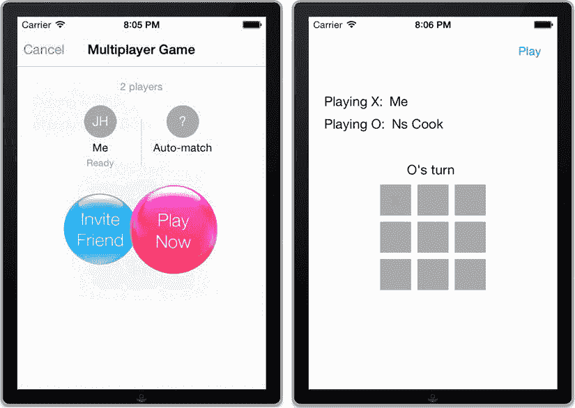

**图 17-26.** 一个 Game Center 回合制井字棋游戏

尽管这个范例相当长，但在多人回合制游戏方面仍然有很多可以学习。你还可以使用一些工具来支持多于两名玩家，甚至允许不按顺序进行回合。关于 GameKit 的更多信息，请参阅位于 [`developer.apple.com/library/ios/documentation/NetworkingInternet/Conceptual/GameKit_Guide/Introduction/Introduction.html`](https://developer.apple.com/library/ios/documentation/NetworkingInternet/Conceptual/GameKit_Guide/Introduction/Introduction.html) 的 Game Center 编程指南。

## 总结

在本章中，你已经学习了如何使用 Game Center 和 GameKit 来扩展你的游戏。你可以在游戏中加入高分榜，以鼓励玩家之间的竞争，并建立炫耀的资本。你还可以实现成就系统，让玩家在漫长的关卡中获得成就感，甚至轻松地在游戏内提供小游戏。最后，你通过形式为回合制游戏的基础多人游戏功能，鼓励了更多与真人对手的社交对战。

开发 iOS 应用是一个多元化的过程，是视觉设计与程序化功能的结合，需要多才多艺的技能以及极大的投入。值得庆幸的是，Apple 提供了卓越的开发工具集和编程语言来配合使用，两者都在不断更新和改进。有了如此灵活的语言，从管理大型数据存储到处理复杂的网络请求再到图像滤镜处理等各种任务，都可以在我们这一代最广泛使用和功能最强大的设备上被简化、设计和实现。无论你是将本书作为简单的参考书还是全面的指南，我们都希望你能利用这些范例构建出更强大的应用，为 iOS 技术世界做出贡献并助其发展。


# iOS 7 开发实战
## 问题-解决方案方法

约瑟夫·霍夫曼，汉斯-埃里克·格伦隆德，科林·弗朗西斯和肖恩·格里姆斯

**iOS 7 开发实战：问题-解决方案方法**

10.1007/978-1-4302-5960-2

© Apress 2013

## 索引

### A
- 加速度计
- `AccessoryView`
- `Accounts` 框架
- 成就
  - 定义
  - 上报
  - `achievementID` 辅助方法
  - `achievements` 完成
  - `gameButtonSelected:` 动作方法
  - `GameViewController.h`
  - `GKAchievement` 对象
  - `initWithLevel:` 方法
  - `loadAchievements` 辅助方法
  - `NSMutableArray`
  - `player` 属性
  - `reportAllFourButtonsAchievementCompleted` 辅助方法
  - `reportAllFourButtonsAchievement` 方法
  - `ViewController.m`
- 活动视图，内容分享
  - 带自定义活动的活动类型控制器
  - 无`邮件`和`复制`选项的`excludeActivityTypes`属性
  - `MyLogActivity` 类
  - `MyLogActivity.h` 文件
  - `MyLogActivity.m` 文件
  - `performActivity` 方法
  - `shareContent:` 动作方法
  - `shareContent:` 方法
  - 测试应用用户界面
- `AddAnnotations:` 方法
- `AddImageView` 动作方法
- `AlertView:didDismissWithButtonIndex:` 警告视图委托方法
- `AlertView:didDismissWithButtonIndex:` 委托方法
- 全按钮成就简单.png
- 全按钮成就困难.png
- 全按钮成就普通.png
- 歧义布局
  - 添加约束以固定按钮
  - 自动布局追踪
  - 等宽按钮
  - `NSDictionaryOfVariableBindings()` 
  - 暂停程序执行按钮
  - 不等宽按钮
- 动画
  - UIKit 动画框架
  - `animateWithDuration` 方法
  - 块方法
  - 蓝色球体动画
  - 蓝色球体图像旋转与链式动画
  - 尺寸与透明度
  - `ViewController.h` 文件
  - `viewDidLoad` 方法
- UIKit 动力学
  - 添加吸附
  - 自定义行为类
  - 重力与碰撞
  - 项目属性
  - 推动行为
  - 弹簧与附着
  - 使用重力
- `AppDelegate.h` 文件
- `AppDelegate.m` 文件
- 应用游戏中心
  - 显示
  - `gameCenterViewControllerDidFinish`
  - `showGameCenter` 动作方法
  - `ViewController.h` 文件
  - `ViewController.xib` 文件
  - 访问游戏中心按钮
  - 游戏实现
    - `buttonForIndex:` 辅助方法
    - 简单难度界面
    - `gameButtonSelected` 动作
    - `gameButtonSelected` 动作方法
    - `GameViewController.h`
    - `GameViewController.m` 辅助方法
    - `IBAction`
    - 杀手按钮
    - 主菜单视图
    - `playEasyGame` 动作
    - `playHardGame` 动作
    - `playNormalGame` 动作
    - `resetButtonTags`
    - `setupButtonsForEasyGame`
    - `setupButtonsForHardGame`
    - `setupButtonsForNormalGame`
    - `setupButtons` 辅助方法
    - 三个难度等级
    - `UIAlertViewDelegate` 协议
    - `UIViewController` 子类
    - 用户界面
    - `ViewController.h` 文件
    - `ViewController.m` 文件
    - `viewDidLoad` 方法
    - `welcomeLabel` 出口
  - 本地玩家身份验证
    - `authenticatePlayer` 结果
    - 所需设备功能
    - `ViewController.h`
    - `ViewController.m`
    - `viewDidLoad` 方法
    - 欢迎消息界面
  - 在 iTunes Connect 中注册
    - 应用信息
    - 应用已注册
    - 启用游戏中心
    - 游戏中心沙箱
    - iOS 配置门户
    - `itunesconnect.apple.com`
    - 幸运大应用图标.jpg
    - 幸运截图 (iPhone 5).png
- `Application:openURL:sourceApplication:annotation:` 委托方法
- 应用实战
  - 另请参阅 错误处理；异常处理
  - 动作方法
  - 警告视图
  - 警告视图配置
  - `showAlert`
  - 触控内部事件
  - 两个连接，相同事件类型
  - 事件与参数属性
  - `ViewController.h` 文件
  - 类创建
    - 配置文件文件夹和组文件夹选择
    - `MyClass.h`
    - `MyClass.m`
    - Objective-C 类模板
    - 项目导航器
    - 空应用实战
    - 新文件选项
    - 单视图
    - `AppDelegate.h` 文件
    - Xcode 窗口
    - 框架链接
    - `CoreData` API
    - `CoreGraphics` 引用节点
    - 步骤
    - `UIKit`、`Foundation`
  - `Info.plist` 属性
  - 启动图像
    - 设计文件
    - 概述
    - 精简版构建目标
    - 管理方案窗口
    - 产品名称属性
    - 项目复制选项
    - 特定版本编码
  - 创建出口
    - 辅助编辑器
    - 按钮标题
    - `Ctrl-拖动`
    - 编辑器组
    - 出口配置属性
    - `viewDidLoad` 方法
  - 资源文件
    - 资源目录
    - 复制项目
    - 嵌入的图像文件
  - 用户界面
    - 单视图应用委托和视图控制器
    - Objective-C 文件模板
    - 父文件夹选择
    - 项目配置属性
    - 模板版本控制
    - 用户界面控制视图
- 视听 (AV) 基础框架
- `AuthenticateLocalPlayer` 辅助方法
- 自动布局
  - 歧义错误
    - 歧义布局
    - 添加约束以固定按钮
    - 自动布局追踪
    - 等宽按钮
    - `NSDictionaryOfVariableBindings()`
    - 暂停程序执行按钮
    - 不等宽按钮
  - 约束
    - 添加自定义约束
    - 添加尾部按钮
    - 控制键点击并拖动方法
    - 默认间距
    - 问题解决菜单
    - 横屏方向
    - 降低优先级
    - 竖屏和横屏模式
    - 竖屏方向
    - 预览工具
    - 默认启用
    - 使用固定菜单
    - 视图控制器
    - `宽度约束`
  - 编程
    - 添加图像视图
    - 构建 `imageViewConstraints` 数组
    - 单视图应用设置
    - 可视化格式语言
  - 不满足性
    - 不满足的约束
- 自动引用计数 (ARC)
- 自动调整大小掩码约束
- `AVAudioPlayer`
  - 动作方法
  - 按钮动作方法
  - 错误和中断处理
  - 导入 API
  - 滑块值
  - `updateLabels` 方法
  - 用户界面
  - 视图控制器
  - `viewDidLoad` 方法
- `AVAudioRecorder`
  - 创建动作和出口
  - 动作方法
  - 音频录制器初始化
  - `AVAudioSession` 会话设置
  - 导入 `AVFoundation` 框架
  - 中断处理
  - 播放按钮
  - 录制文件路径定义
  - `togglePlaying` 方法
  - `toggleRecording` 方法
  - `updateLabels` 方法
  - 用户界面
  - 视图控制器
  - `viewDidLoad` 方法
- `AVCaptureAudioDataOutput`
- `AVCaptureAudioFileOutput`
- `AVCaptureMovieFileOutput`
- `AVCaptureSession`
  - 相机预览
  - 捕获静态图像
    - `AssetsLibrary.framework`
    - `AVCaptureStillImageOutput`
    - `captureStillImage`
    - `captureStillImageAsynchronouslyFromConnection` 方法
    - `imageDataSampleBuffer`
    - `Info.plist` 文件
    - `NSPhotoLibraryUsageDescription`
    - 保存到照片库
    - 带捕获按钮的用户界面
    - `ViewController.h` 文件
    - `viewDidLoad` 方法
  - 捕获视频
    - `audioInput`
    - `AVCaptureFileOutputRecordingDelegate` 协议
    - `AVCaptureMovieFileOutput` 的委托方法
    - `AVCaptureOutput`
    - 捕获动作方法
    - 帧
    - `movieOutput`
    - 切换模式
    - `tempFileURL` 方法
    - `ViewController.h` 文件
    - `viewDidLoad` 方法
  - 预览显示
    - `AVCaptureDevice` 类方法
    - `AVCaptureDeviceInput`
    - `AVCaptureSessionPresetHigh`
    - `AVCaptureVideoPreviewLayer`
    - `AVFoundation` 框架
    - `AVMediaTypeVideo` 和 `AVMediaTypeAudio`
    - 单视图项目
    - `UIImagePickerController` 接口
    - `UIVideoEditorController` 接口
    - 视频输入实例
    - `viewDidLoad` 方法
    - `viewWillAppear:` 方法
- `AVCaptureStillImageOutput`
- `AVCaptureVideoDataOutput`
- `AVCaptureVideoPreviewLayer`
- `AVMediaTypeAudio`
- `AVMediaTypeVideo`

### B
- 后台播放
  - `avItemFromMPItem` 方法
  - 清空播放列表
  - `CMTimeMake()` 函数
  - 所需声明框架
  - `goToPrevTrack` 方法
  - `goToNextTrack` 方法
  - 库按钮
  - 锁屏信息
  - `MPMediaPickerController`
  - `MPNowPlayingInfoCenter`
  - `pausePlayback` 方法
  - 远程控制
  - `startPlayback` 方法
  - `startPlaybackWithItem` 方法
  - `togglePlay`
  - `updateNowPlaying`
  - 用户界面
  - 视图控制器
  - `viewDidLoad` 方法
- 巴尔的摩
  - `CLRegion` 对象
  - 委托方法
  - `didEnterRegion` 和 `didExitRegion` 方法
  - 错误代码
  - `identifier` 属性，`CLRegion`
  - `kCLAuthorizationStatusNotDetermined` 状态
  - 本地通知
  - `maximumRegionMonitoringDistance` 属性（`.m` 实现文件）
  - `monitoredRegions` 属性
  - 设置应用
  - 用户界面
  - 视图控制器的头文件

### C
- 日历事件
  - `EKEventStore`
  - 事件工具包框架
  - iOS 模拟器输出日志
  - 隐私设置
  - 单视图应用项目
  - 使用说明
  - 用户权限
  - `viewDidLoad` 方法
- 相机
  - `AVCaptureSession`（另请参阅 `AVCaptureSession`）
  - 自定义覆盖层（另请参阅 自定义相机覆盖层）
  - 编辑视频
    - `editVideo` 动作
    - `imagePickerController:didFinishPickingMediaWithInfo:` 方法
    - 路径存储属性
    - `pathToRecordedVideo` 属性
    - `UIVideoEditorController`
    - `UIVideoEditorControllerDelegate` 协议
    - 带编辑按钮的用户界面
  - 录制视频
    - `availableMediaTypesForSourceType:` 类方法
    - `CFStringRef`
    - 带开关控制的图像选择器视图
    - `kUTTypeMovie`
    - 链接 Mobile Core Services 框架
    - `mediaType`
  - 拍照
    - 编辑
    - 错误消息
    - 图像选择器实例
    - 图片检索
    - 保存到相册
    - 单视图应用模板
    - `UIAlertView`
    - `UIImagePickerController`
    - `UIImagePickerController` 类
    - `UIImagePickerControllerDelegate`
    - `UIImagePickerViewController`
    - `UINavigationControllerDelegate`
    - 用户界面
- `CFStringRef`
- `CleanPlaces` 方法
- `CLLocationManagerDelegate` 协议
- 颜色编码
- 撰写视图
  - `addImage:` 方法
  - Facebook 用户界面
  - `shareOnFacebook` 方法
  - `SLComposeViewController`
  - `SLServiceTypeFacebook`
  - `SLServiceTypeTwitter`
  - `SLServiceTypeWeibo`
- 约束
  - 添加自定义约束
  - 添加尾部按钮
  - 控制键点击并拖动方法
  - 默认间距
  - 问题解决菜单
  - 横屏方向
  - 降低优先级
  - 默认启用
  - 竖屏和横屏模式
  - 竖屏方向
  - 预览工具
  - 使用固定菜单
  - 视图控制器
  - 宽度约束
- `ContentView`
- 核心数据
  - 数据模型
    - 属性
    - 级联值
    - 删除规则下拉菜单
    - 拒绝值
    - 编辑器
    - 实体
    - 图形编辑器样式模式
    - 检查器
    - 反向关系
    - 我的词汇应用
    - 名称属性
    - 无动作值
    - 置空值
    - Objective-C 类
    - 对多关系选项
    - 双向关系选项
    - 词汇实体
    - 单词和翻译属性
  - 框架
    - `NSFetchedResultsController`
    - `NSManagedObject`
    - `NSManagedObjectContext`
    - `NSManagedObjectModel`
    - `NSPersistentStoreCoordinator`
    - 设置
  - 词汇表视图
    - 添加动作方法
    - `alertView:clickedButtonAtIndex:delegate` 方法
    - `application:didFinishLaunchingWithOptions:` 方法
    - 缓存名称
    - 单元格配置
    - `fetchedResultsController` 属性
    - `managedObjectContext` 属性
    - 添加新词汇
    - `NSFetchedResultsController` 类
    - `NSFetchRequest`
    - `performFetch:` 方法
    - `setSortDescriptors:` 方法
    - `tableView:commitEditingStyle:forRowAtIndexPath:delegate` 方法
    - `viewDidLoad` 方法
    - `VocabulariesViewController.h` 文件
    - 删除词汇
  - 单词编辑视图
    - 添加动作方法
    - 取消动作方法
    - 完成处理程序
    - 完成动作方法
    - `EditWordViewControllerCompletionHandler`
    - `EditWordViewController.h` 文件
    - 导航控制器
    - Objective-C 块
    - `tableView:commitEditingStyle:forRowAtIndexPath:delegate` 方法
    - `tableView:didSelectRowAtIndexPath:delegate` 方法
    - 用户界面
    - `viewDidLoad` 方法
    - `VocabulariesViewController.m` 文件
  - 词汇，添加单词
  - 删除单词
  - `WordsViewController.h` 文件
  - 单词视图控制器
    - 数据源委托方法
    - 头文件
    - `tableView:cellForRowAtIndexPath:delegate` 方法
    - `viewDidLoad` 方法
    - 单词列表视图
    - `WordsViewController.h`
    - `WordsViewController.m`
- 核心定位框架
  - 基本信息
    - `activityType`
    - Apple
    - `CLLocation` 对象
    - `description` 属性
    - `desiredAccuracy` 和 `distanceFilter` 属性
    - 错误委托方法
    - `horizontalAccuracy` 属性
    - `kCLDistanceFilterNone` 属性
    - 位置事件
    - 位置信息标签
    - `locationManager:didUpdateLocations` 方法
    - 位置权限请求
    - 位置更新，开/关开关出口属性
    - 模拟位置信息
    - 单视图应用
    - 标准定位服务
    - 测试
    - `startUpdatingLocation` 方法
    - `toggleLocationUpdates` 动作
    - `toggleLocationUpdates` 方法
    - 用户界面
    - 值更改事件
    - `verticalAccuracy` 属性
    - 视图控制器
  - 地理编码
    - 正向 GPS 坐标
    - 纬度和经度坐标
    - 反向请求（另请参阅 反向地理编码）
  - 位置感知
    - 磁方位角
    - 委托方法
    - `didFailWithError` 方法
    - `didUpdateHeading` 方法
    - 显示
    - `headingAccuracy` 属性
    - 航向校准消息
    - `headingFilter` 属性
    - `headingOrientation` 属性
    - 航向追踪
    - `locationManagerShouldDisplayHeadingCalibration` 方法
    - `magneticHeading` 属性
    - 磁极
    - 设置应用
    - 开始和停止航向方法
    - `toggleHeadingUpdates` 方法
  - 区域监控
    - 巴尔的摩（另请参阅 巴尔的摩）
    - `CLLocationManager` 对象
    - 自定义坐标
    - `kCLErrorRegionMonitoringFailure` 错误
    - `monitoredRegions` 属性
    - `startMonitoringForRegion` 方法
    - 触发警报
  - 重大位置变化
    - 委托方法
    - `Info.plist` 文件
    - 本地通知方法
    - `locationManager:didUpdateLocations` 方法
    - 编程
    - 所需后台模式
    - 服务
    - 单视图应用
    - `toggleLocationUpdates` 方法
    - 源数据
    - 标准定位服务
  - 真方位角
    - `CLHeading` 对象
    - 控制代码
    - 磁偏角
    - 显示
    - `toggleHeadingUpdates` 方法
    - `trueHeadingInformationLabel` 出口
    - `trueHeading` 属性
    - `trueHeading` 值
    - 用户界面
- `CoreMedia` 框架
- 核心运动框架
  - 设备数据访问
    - `CMAttitude` 类属性
    - `CMDeviceMotion` 访问数据检索
    - 过滤技术
    - `gravity` 属性
    - 运动管理器属性
    - 参考帧
    - 开始和停止方法
    - 带重力加速度的用户界面标签
    - 基本架构
    - 地球重力
    - 竖屏界面方向
    - 用户界面速度值
    - `ViewController.m` 文件
  - `magneticField` 原始数据访问
  - 加速度计
  - 陀螺仪
  - iOS 方向和旋转
  - 磁力计
  - 主视图界面出口
  - 传感器可用性
  - 视图控制器接口
  - 传感器数据访问
    - 加速度计
    - `CMMotionManager` 便捷功能处理程序
    - 编程接口
    - 推/拉方法
    - 原始核心运动数据
    - 支持的界面方向
    - 更新间隔
    - `ViewController.h` 文件
    - `ViewController.m` 文件
    - 视图控制器的头类
  - 摇动事件识别
    - 代码功能
    - 摇动通知测试
    - 窗口子类化
  - `startDeviceMotionUpdatesUsingReferenceFrame`
- 自定义标注视图
  - 应用
  - `centerOffset` 属性
  - `drawRect:` 方法
  - `initWithAnnotation:reuseIdentifier:` 方法
  - `initWithFrame:` 方法
  - `MyAnnotation.h`
  - `MyAnnotationView.h`
  - `MyAnnotationView.m`
  - `viewDidLoad` 方法
- 自定义相机覆盖层
  - `allowsEditing` 属性
  - `cornerRadius`
  - `customViewForImagePicker`
  - 图像选择器控制器
  - `imagePickerController:didFinishPickingMediaWithInfo:` 方法
  - `takePictureButton`
  - `toggleFlash` 和 `toggleCamera` 方法
  - `UIImagePickerControllerOriginalImage`
  - `UIView`
- 自定义单元格
  - 类创建
  - 模式实现
  - 注册

### D
- 数据模型
  - 属性
  - 级联值
  - 删除规则下拉菜单
  - 拒绝值
  - 编辑器
  - 实体
  - 图形编辑器样式模式
  - 检查器
  - 反向关系
  - 我的词汇应用
  - 名称属性
  - 无动作值
  - 置空值
  - Objective-C 类
  - 对多关系选项
  - 词汇实体
  - 单词和翻译属性
- 数据存储实战
  - 核心数据（另请参阅 核心数据）
  - iCloud（另请参阅 iCloud）
  - iOS 文件管理系统
    - `clearContent` 动作
    - `contentTextView` 出口
    - `filenameTextField` 出口
    - `loadContent:` 动作方法
    - 覆盖现有文件
    - `saveContent:` 动作方法
    - `saveContent:` 方法
    - `saveContentToFile:` 方法
    - 文本文件编辑器用户界面
    - `ViewController.m` 文件
  - `NSUserDefaults`
    - `activityIndicator`
    - `activitySwitch`
    - `firstNameTextField`
    - `lastNameTextField`
    - `loadPersistentData:` 方法
    - 恢复的应用
    - `savePersistentData:` 方法
    - Stubborn 应用
    - 开关和活动指示器
    - `toggleActivity:` 动作方法
    - `UIApplicationDidEnterBackgroundNotification`
    - `ViewController.h` 文件
    - `ViewController.xib` 文件
    - `viewDidLoad`
    - `viewDidLoad` 方法
- 数据传输实战
  - 电子邮件撰写
    - 附件参数
    - 裁剪子视图属性
    - `fileName` 参数
    - `getImage:` 方法
    - 头文件
    - 图像附加
    - `imageView` 和 `getImageButton`
    - `mailMessageButton`
    - `mailMessage:` 方法
    - `mailPressed:` 方法
    - `MFMailComposeViewControllerDelegate` 协议
    - `MFMailComposeViewController` 的委托方法
    - `MFMailMailComposeViewController`
    - `MFMessageComposeViewController` 类
    - `MFMessageViewController`
    - `mimeType` 参数
    - `UIImagePickerController`
    - `UIImagePickerControllerDelegate` 协议方法
    - `UIImageView`
    - `UIPopoverController` 属性
  - 格式化打印，页面渲染器
    - `drawContentForPageAtIndex:inRect` 方法
    - `drawFooterForPageAtIndex:inRect` 方法
    - `drawHeaderForPageAtIndex:inRect` 方法
    - `drawInRect:forPageAtIndex:` 方法
    - `drawPrintFormatter:forPageAtIndex:` 方法
    - 页脚实现方法
    - 页眉打印 NSString 属性
    - Objective-C 类模板
    - `printCustom:` 动作方法
    - 打印输出
    - `SendItOutPageRenderer.h` 文件
    - `UIPrintPageRenderer` 类
    - `UIPrintPageRenderer` 子类
  - 图像打印
  - 喷墨打印机输出
  - 打包内容，Xcode 包
    - `presentAnimated:completionHandler` 方法
    - `presentFromBarButtonItem:animated:completionHandler` 方法
    - `presentFromRect:inView:animated:completionHandler` 方法
    - 打印机模拟器
    - `printInfo` 属性
    - `print:` 方法
    - `sharedPrintController` 类方法
    - `UIPrintInfoOutputGeneral`
    - `UIPrintInfoOutputGrayscale`
    - `UIPrintInfoOutputPhoto`
    - `UIPrintInteractionController` 类
  - 纯文本打印
  - 文本消息撰写
    - iPhone 模拟器
    - `MFMessageComposeViewController` 类
    - `MFMessageComposeViewControllerDelegate` 协议
    - `MFMessageComposeViewController` 的 `messageComposeDelegate` 方法
    - `QuartzCore` 框架
    - `textMessage:` 动作方法
    - 文本视图的委托属性
    - `UITextViewDelegate` 协议
    - `ViewController.m`
    - `viewDidLoad` 方法
  - 视图打印
- `DecodeMatchData:` 辅助方法
- `DecodeMatchData` 方法
- `+DefaultDeviceWithMediaType:` 方法
- 展开辅助指示器
- `Dispatch_async()` 函数
- 3D 地图
  - 便捷方法方式
  - 创建 3D 地图视图
  - 坐标
  - 创建飞越
    - 创建 25 秒动画
    - `viewDidLoad` 方法
  - 属性方式
    - 创建 3D 地图视图
    - 海拔
    - `centerCoordinate`
    - 航向
    - 俯仰角
  - 查看 3D 地图
- 可拖动属性

### E
- `EditingAccessoryView`
- 错误处理
  - `attemptRecoveryFromError:(optionIndex)`
  - `ErrorHandler.h`
  - `ErrorHandler.m`
  - 错误处理方法
  - `fakeFatalError:`（动作方法）
  - `fakeNonFatalError:`（动作方法）
  - `NSRecoveryAttempterErrorKey`
  - `NSRecoveryAttempting` 协议
  - 可恢复错误
  - `ViewController.h`
  - `ViewController.m`
  - 恢复选项警告视图
    - 错误警报-重试选项
    - `handleError`
    - `localizedRecoveryOptions` 数组
    - `localizedRecoverySuggestion` 属性
    - `NSError` 对象
    - `NSErrorRecoveryAttempting` 非正式协议
    - `recoveryAttempter` 属性
  - 用户通知警报视图-伪造致命错误
    - `clickedButtonAtIndex` 错误警报-伪造错误
    - `ErrorHandler.h` 文件
    - `ErrorHandler.m` 文件
    - `handleError`
    - `initWithError` 方法
    - `NSError` 类
    - `retainedDelegates`
    - `UIAlertView` 委托
- 预计到达时间 (ETA)
- 异常处理
  - 按钮（电子邮件报告）
  - 通过电子邮件发送报告
  - `freopen` 函数
  - 拦截未捕获的异常
    - `AppDelegate.m` 文件
    - 错误消息通知
    - 异常标志-警报视图
    - `NSSetUncaughtException` 函数
    - `NSUserDefaults`
    - 报告错误
    - `stderr`
    - `stderr` 流策略
    - `TARGET_IPHONE_SIMULATOR`
    - 测试应用
    - 伪造异常
    - `throwFakeException`

### F
- Fabs 函数
- 功能检测
- 国旗选择器
  - 构建
  - 显示
  - 实现

### G
- 游戏中心沙箱
- `GameEndedInTie` 方法
- `GameEndedWithWinner:` 方法
- 游戏工具包
  - 成就（另请参阅 成就）
  - 应用游戏中心（另请参阅 应用游戏中心）
  - 排行榜
    - 定义
    - 上报分数
  - 基于回合的多玩家游戏（另请参阅 井字游戏）
- GeoJSON 文件
- `GKGameCenterControllerDelegate` 协议
- `GKScore` 类
- `GKTurnBasedEventHandlerDelegate` 协议
- `GKTurnBasedMatchmakerViewControllerDelegate` 协议
- 创建渐变
  - 执行 `drawRect` 方法
  - `GraphicsRecipesView.m` 文件
- 陀螺仪

### H
- `HandleReminderAction:` 辅助方法
- 处理错误（另请参阅 错误处理）
- 处理异常（另请参阅 异常处理）
- 辅助方法
- `HorizontalAccuracy` 属性
- Hotspot 类

### I
- iCloud
  - 优势
  - 核心数据存储
  - 文档存储
  - 键值存储
  - 授权
  - `fontSizeSegmentedControl` 和 `documentTextView`
  - `NSUserDefaults` 分段控制
  - 存储文本大小偏好
  - `updateTextSize` 动作方法
  - 用户界面
  - `UIDocuments`
    - `contentsForType:error` 方法
    - `documentDidChange:` 委托方法
    - `handleICloudDidChangeIdentity:` 通知方法
    - `loadFromContents:ofType:error` 方法
    - `MyDocumentDelegate` 协议
    - `MyDocument.h` 文件
    - 保存按钮
    - `saveDocument:` 动作方法
    - ubiquity 容器
    - `UIDocument` 子类
    - `updateDocument`
    - 用户的 iCloud 账户
    - `ViewController.h` 文件
    - `viewDidLoad`
- 图像处理
  - `aspectScaleImage:toSize:` 方法
  - `CIImage` 创建组合滤镜
  - 色调调整并旋转 90 度的图像
  - `populateImagesWithImage:` 方法
  - `tableView:cellForRowAtIndexPath:` 方法
  - `tableView:didSelectRowAtIndexPath:`
  - `tableView:numberOfRowsInSection:` 方法
  - 色调滤镜
  - 懒加载初始化
  - `MasterViewController.h` 文件
  - 可变数组属性
  - `populateFilteredImagesWithImage:` 方法
  - `setMainImage:` 方法
  - 拉直滤镜
  - `tableView:cellForRowAtIndexPath`
  - `tableView:didSelectRowAtIndexPath:` 方法
  - `tableView:numberOfRowsInSection:` 委托方法
  - 创建缩略图
- `ImagePickerController:didFinishPickingMediaWithInfo:` 方法
- `ImagePickerViewController:didFinishPickingMediaWithInfo:` 方法
- 图像缩放
  - 适应模式
  - `DetailViewController.h` 文件
  - 重新创建图像
  - 调整图像大小
  - 主视图控制器
    - `clearImage:` 动作方法
    - 修改委托方法
    - `imagePickerController:didFinishPickingMediaWithInfo:` 委托方法
    - 调整图像大小函数
    - 缩放图像函数
    - 填充模式
    - 选择图像函数
- `ImageView`
- `ImageViewConstraints` 数组
- 显示单条推文
  - 实现
  - 导航栏出口
  - `tweetData` 属性
  - `TweetTableViewController.m`
  - `TweetViewController.xib` 文件
  - `updateView` 辅助方法
  - 用户界面
  - `viewDidLoad` 方法
- `Info.plist` 文件
- `Info.plist` 属性
- `InitRecurrenceWithFrequency`
- `InitWithAnnotation:` 方法
- `InitWithContentsOfURL:` 方法
- `–InitWithCoordinate:title:subtitle:` 方法
- `InitWithNibName:bundle:` 方法
- `InitWithStyle:reuseIdentifier:` 方法
- 喷墨打印机
- iOS 人脸检测
  - 应用
  - 图像处理（另请参阅 图像处理）
  - 图像缩放（另请参阅 图像缩放）
  - 图像视图
    - 属性检查器
    - `clearImage:` 动作方法
    - 配置的用户界面
    - 配置
    - `DetailViewController.h` 文件
    - `DetailViewController.xib` 文件
    - 绘图选项 裁剪子视图
    - iPad 项目
    - `IPopoverController`
    - 主从应用模板
    - 模式属性
    - `selectImage` 动作
    - `selectImage:` 方法
    - `UIImagePickerController` 委托方法
    - `UIImagePickerControllerDelegate` 协议
    - `UIImageView`
    - `UIImageView` 类
    - `UINavigationControllerDelegate` 协议
    - `UIPopoverControllerDelegate` 协议
    - `UISplitViewController`
  - Xcode 截图
    - 辅助编辑器代码
    - `Ctrl + Cmd + Z`
    - 界面生成器
    - `MyView.h`
    - `MyView.m`
    - `QuartzCore` API
    - `setNeedsDisplay` 方法
    - 摇动识别
    - `UIGraphicsGetImageFromCurrentImageContext()` 函数
    - `ViewController.h` 文件
  - 绘制简单形状
    - 在圆形上添加三角形弧线
    - `CGContextAddArc` 函数
    - `CGContextFillEllipseInRect()` 函数
    - `CGContextRef`
    - `CGRect`
    - 裁剪
    - 自定义类部分
    - `drawArc` 方法实现
    - `drawEllipse` 方法
    - `drawRect:` 方法
    - 字体
    - 创建渐变（另请参阅 创建渐变）
    - `GraphicsRecipesView`
    - 身份检查器
    - 点的“路径”
    - 阴影
    - `.xib` 文件
- iOS 文件管理系统
  - `clearContent` 动作
  - `contentTextView` 出口
  - `filenameTextField` 出口
  - `loadContent` 动作
  - `loadContent:` 动作方法
  - 覆盖现有文件
  - `saveContent:` 动作方法
  - `saveContent:` 方法
  - `saveContentToFile:` 方法
  - 文本文件编辑器用户界面
  - `ViewController.m` 文件
- `iPodMusicPlayer`
- `IsAuthenticated` 属性
- `IsCurrentLocation` 属性
- `IsDirectionsRequestURL:` 便捷方法

### J, K
- `kCLLocationAccuracyHundredMeters`
- `kUTTypeMovie`

### L
- 启动图像
  -