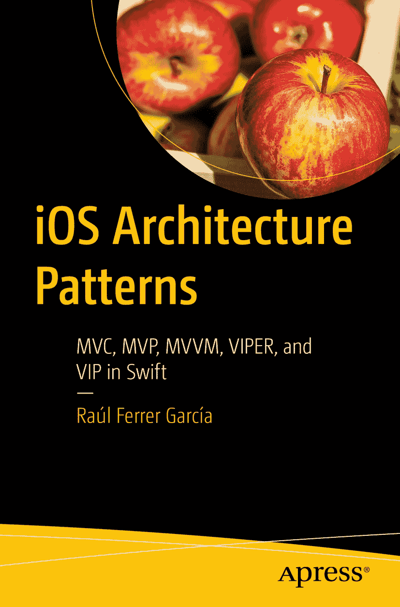

ISBN 978-1-4842-9068-2 e-ISBN 978-1-4842-9069-9 [`doi.org/10.1007/978-1-4842-9069-9`](https://doi.org/10.1007/978-1-4842-9069-9)  
© Raúl Ferrer García 2023  
本作品受版权保护。所有权利均由出版商独家许可，涉及材料的全部或部分，具体包括翻译、重印、插图复用、朗诵、广播、微缩胶片复制或其他任何物理形式的复制、信息存储与检索的传输、电子改编、计算机软件，以及现有或未来开发的任何相似或不同方法的使用。

本出版物中通用描述性名称、注册名称、商标、服务标记等的使用，即使未作明确声明，也不意味着这些名称不受相关保护法律和法规的约束，因此可自由使用。

出版商、作者和编辑可以合理假定，本书中的建议和信息在出版之日是真实准确的。出版商、作者或编辑均不对本书所包含的材料或可能存在的任何错误或遗漏提供明示或暗示的保证。出版商在已出版地图和机构归属方面的管辖权主张上保持中立。

本 Apress 印记由 Springer Nature 旗下的注册公司 APress Media, LLC 出版。  
注册公司地址为：1 New York Plaza, New York, NY 10004, U.S.A.  

> 我们要在宇宙中留下印记。否则，我们为何还要存在于此？  
> ——史蒂夫·乔布斯  

> *他们不知道这是不可能的，所以就这么做了。*  
> ——马克·吐温  

## 引言

正如我们将要在本书中看到的，开发应用程序时已发展出多种可应用的架构模式——有些是众所周知的（且较老的），如`MVC`或`MVVM`；还有一些更具创新性，如`VIPER`或`VIP`。

无论你是刚开始开发应用程序，还是已经从事了一段时间，你肯定曾搜索过关于应用程序如何构建以及哪种架构模式最适合应用的信息。但你可能也得出了与我相同的结论：从全局角度来看，并没有完美的架构模式，它们各有优缺点，而我们的代码是否可读、可测试和可扩展，几乎总是取决于我们如何应用该模式。

此外，你还会注意到，一种架构模式往往会设定一些应用程序规则，但后来许多开发人员会对其进行调整或修改，以期改进其特性或解决其某些潜在缺陷。

## 本书目标读者

本书既面向那些刚刚起步、希望了解可应用于自身应用的架构模式的开发人员，也面向那些已有一定开发经验、希望了解其他可能架构的开发人员。

因此，如果你希望实现以下目标，本书就适合你：

*   学习遵循所讲解的某些架构模式来开发应用程序
*   理解每种架构模式的优缺点，并选择最适合你的那一种
*   理解开发可读、可测试且可扩展代码的优势

本书并非旨在深入探讨每种架构的具体使用，而是作为其应用的入门点，帮助你理解它们为何重要。从此出发，你将能够选择最适合你的一种或多种架构，知道如何深入研究、应用它们，并在你的开发者生涯中不断进步。

## 如何使用本书？

除了对每种介绍的架构模式进行理论介绍（对于我们将涉及的每种架构，都有大量文章讨论其特性、优缺点）外，本书主要以实践为导向。在第 2 章至第 6 章（`MVC`、`MVP`、`MVVM`、`VIPER`和`VIP`架构模式）中，将展示按照这些模式开发一个应用程序（`MyToDos`）的过程。

为简单起见，虽然会呈现代码的主要部分（取决于所解释的概念），但你会看到被省略的代码部分（以“...”标记）。不过，你可以在本书的代码仓库中找到每个项目的完整代码。

因此，我假定你已经具备一些`Swift`和`Xcode`的知识，能够顺利阅读本书。

## 致谢

首先，我要感谢我的家人，感谢他们在本书准备和写作期间，以及一直以来给予我的支持、鼓励的话语和灵感。本书献给他们。

其次，我要感谢整个 Apress 团队给我写作本书的机会，从最初联系我并提出撰写一本关于 iOS 开发书籍可能性的 Aaron Black 开始，更不用说 Jessica Vakili 和 Nirmal Selvaraj 在书籍管理和编辑方面所做的出色工作。

学习是一场永无止境的旅程，因此，我也想感谢所有以各种方式每天教给我们新知识的人。

最后，感谢你，读者。希望你在读完这本书后，认为这是一个明智的决定，并且无论程度如何，它都对你的开发者成长之路有所帮助。

## 关于作者  
## 关于技术审校者  

