# 1. 引言  

设想如下情景：你和你的团队接到一个新项目，需要开发一个移动应用。一个项目，无论是源于我们自己的创意，还是客户委托的，都会包含一系列规范、功能、行为等。

继续我们的设想，我们假设所有这些规范和功能都已研究完毕，并转化为用户故事（即从用户角度描述一个功能的方式：例如，“作为一名用户，我希望在应用中登录”），并且我们已经可以开始编写第一行代码来开发应用了。

我们都曾遇到过这样的情况：当有一个新项目时，我们想立刻开始编写代码。然而，如果我们以这种方式工作，不预先提出项目结构或考虑应用类型，最终开发出的应用虽然能运行，但其代码日后将难以维护。

为了避免这种情况，在开始编写代码之前，我们必须确定我们将赋予它什么样的结构，软件架构将是什么，以及哪种架构模式最适合我们的项目。

在开始了解 iOS 应用开发中最常用的架构模式之前，我们将先介绍什么是软件架构、什么是架构模式、为什么需要它们，以及如何为我们的项目选择最合适的一种。


## 什么是软件架构？

软件架构定义了软件的结构是怎样的、构成它的组件有哪些、这些组件如何连接以及它们之间如何相互通信。

所有介入软件架构定义的这些要点都可以根据不同的模型或视图来表示，以下是其中三种主要的视图（我们将稍后学习的架构之一——MVVM（模型-视图-视图模型）就是这些视图的一个应用示例）：

- **静态视图**：指明哪些组件构成了该结构。在 MVVM 中，这些组件是 `View`、`Model` 和 `ViewModel`。
- **动态视图**：确立不同组件随时间推移的行为以及它们之间的通信方式。
- **功能视图**：向我们展示每个组件的功能。例如，在我们看到的示例中，每个组件具有以下功能：
  - **Model**：包含负责存储和传输应用程序数据的类与结构。它还包含业务逻辑。
  - **View**：表示包含构成界面的元素、与用户的交互，以及它如何更新以向用户显示接收到的信息。
  - **ViewModel**：充当 `View` 和 `Model` 之间的中介；它通常包含表示逻辑，即那些将从 `Model` 接收的数据转换以在 `View` 中呈现的方法。

## 架构模式

我们刚刚看到，软件架构有助于为我们的项目赋予结构。然而，并非所有项目都相同或具有相同的目的，因此，很自然地，所使用的架构是不同的，并且适用于每个项目。

开发人员在面对项目时一直在寻找不同的解决方案。一个项目的需求和功能、其组件或组件间的通信方式会因项目而异，这一事实催生了不同的架构解决方案和架构模式。

请记住，架构模式就像一个模板，提供了一些关于如何开发和构建应用程序不同组件的规则或指导方针。每种架构模式都有其优点和缺点，稍后我们将看到这一点。

## 为什么我们需要为应用程序采用架构模式？

在开发应用程序时，选择并使用一种架构模式将使我们能够避免一系列问题，而那些未使用这些模式开发的应用程序可能会出现这些问题。

其中一些问题如下：

- 这些应用程序难以维护。如果有新开发者加入，这个问题会加剧，因为他们更难理解正在开发的软件。
- 这通常会增加开发时间，从而增加成本。
- 由于代码缺乏结构，添加新功能或进行扩展会更加复杂。
- 很可能存在重复、未使用且杂乱的代码。所有这些都使其更容易出错。

因此，使用良好的架构模式将使我们能够减少这些问题：

- 我们将使用更简单、更有条理且更容易理解的代码（并遵循良好的开发实践，例如 SOLID 原则）进行工作，对所有开发者来说都是如此，因为他们将根据相同的规则行事。
- 编写的代码将易于测试，且更不容易出错。
- 组件的正确分配及其职责将带来易于维护、修改和扩展的结构。
- 所有这些都将缩短开发时间，进而降低成本。

## 从高层级到低层级进行设计

在本书中，我们将研究并在 iOS 应用程序中应用不同的架构模式，因此我们还将看到实现它们的代码以及最佳的实现方式。

正如我们所见，架构模式为我们提供了构建高效、可扩展且易于维护的应用程序的指导方针，以及其他优势。

但我们可以将架构模式视为应用程序的高层级设计，然后我们必须深入到代码层面（图 1-1）。

这就是设计模式及其通过编程语言实现发挥作用的地方，同时尝试遵循一些原则（SOLID），这些原则将使代码灵活、稳定、可维护且可复用。

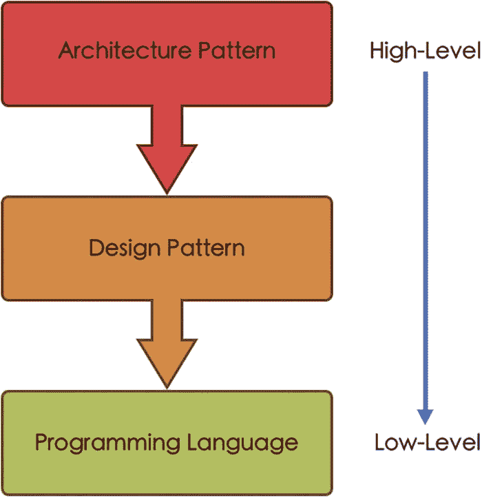

*应用程序设计与实现层级流程图，自上而下依次为：从高层级到低层级分别是架构模式、设计模式和编程语言。*

**图 1-1** 应用程序的设计与实现层级

让我们简要了解一下什么是设计模式（其中一些我们将要应用），以及如何遵循 SOLID 原则进行工作。

### 设计模式

正如架构模式是针对软件结构特定问题的通用解决方案（即它会影响整个项目）一样，设计模式为我们提供了针对影响项目组件的重复性问题的解决方案。

共有 23 种设计模式，它们在《设计模式：可复用面向对象软件的基础》一书中有描述。^(¹) 该书描述了这 23 种设计模式，并将其分为三类：结构型模式、创建型模式和行为型模式。

#### 创建型模式

创建型模式是允许我们创建对象的模式。这些模式封装了创建对象的过程，并且通常通过接口工作。

##### 工厂方法

它提供了一个接口，允许在超类中创建对象，但将对象的实现和更改委托给子类。

##### 抽象工厂

它提供一个接口，允许生成相关的对象组，但无需指定它们的具体类或实现。

##### 生成器

它允许逐步构建复杂对象，并将对象的创建与其结构分离。通过这种方式，我们可以使用相同的构建过程来获得同一对象的不同类型和表示。

##### 单例

此模式确保一个类只有一个可能的实例，并且该实例是全局可访问的。

##### 原型

它允许复制或克隆一个对象，而无需我们的代码依赖于该对象的类。


## 结构型模式

结构型模式规定了对象与类之间如何相互关联，以形成更复杂且灵活高效的结构。它们依赖继承来定义接口并获取新功能。

### 适配器模式

这是一种结构型模式，允许两个接口不兼容的对象通过一个中间代理进行协作，它们通过该代理进行通信和交互。

### 桥接模式

在此模式中，抽象部分与其实现部分解耦，从而使两者可以独立地演进。

### 组合模式

该模式允许你创建具有树状结构的对象，然后将这些结构当作单个对象来处理。在这种情况下，结构中的所有元素都使用相同的接口。

### 装饰器模式

该模式允许在不改变同类对象行为的前提下，向一个对象添加新功能（将该对象包含在一个拥有新功能的容器中）。

### 外观模式

它为复杂结构（如一个库或一组类）提供了简化的接口。

### 享元模式

这是一种通过让多个对象在同一个对象上共享公共属性，而不是在每个对象上都维护这些属性，从而节省内存的模式。

### 代理模式

这是一个充当原始对象简化版本的对象。代理控制对原始对象的访问，允许在访问该对象之前或之后执行某些任务。该模式通常用于互联网连接、设备文件访问等场景。

## 行为型模式

这一类模式数量最多，专注于对象间的通信，负责管理对象之间的算法、关系和职责。

### 责任链模式

它允许请求沿着一条由处理者组成的链进行传递。链中的每个处理者都可以处理该请求，或将其传递给下一个处理者。这样，发送者和最终接收者之间就实现了解耦。

### 命令模式

它将请求转换为一个对象，该对象封装了执行该请求所需的行为和信息。

### 解释器模式

这是一种模式，针对给定的语言，定义了其语法的表示形式以及对该语法进行求值的机制。

### 迭代器模式

它允许遍历集合中的元素，而无需暴露其底层表示（如列表、栈、树等）。

### 中介者模式

它限制对象间的直接通信，并强制它们通过一个充当中介者的单一对象进行通信。

### 备忘录模式

它允许在不暴露对象实现细节的情况下，将对象保存并恢复到先前的状态。

### 观察者模式

它允许建立一种订阅机制，以便向多个对象通知它们所观察的对象中发生的事件。

### 状态模式

它允许一个对象在其内部状态改变时改变其行为。

### 策略模式

它允许从一组算法中，在运行时选择其中一个来执行特定操作。

### 模板方法模式

该模式在超类中定义了一个算法的骨架，但允许子类在不改变算法结构的情况下重写某些方法。

### 访问者模式

它允许将算法与它们所操作的对象分离开来。

## SOLID 原则

这五项原则使我们能够创建可重用、易于维护且代码质量更高的组件。

`SOLID` 是由这五项原则的首字母组成的缩写。

### 单一职责原则（`SRP`）

一个类应该只有一个引起它变化的原因。也就是说，一个类应该只负责一个职责。

### 开闭原则（`OCP`）

我们必须能够在不改变类行为的情况下对其进行扩展。这可以通过抽象来实现。

### 里氏替换原则（`LSP`）

在程序中，任何类都应该可以被其子类替换，而不会影响程序的正常运行。

### 接口隔离原则（`ISP`）

拥有针对每个客户端的具体接口（协议），比拥有一个通用接口更好。此外，客户端不应该被迫实现它不需要的方法。

### 依赖反转原则（`DIP`）

高层模块不应依赖低层模块，两者都应依赖抽象。抽象不应依赖细节，细节应依赖抽象。其目标是减少模块之间的依赖关系，从而降低类之间的耦合度。

## 如何选择正确的架构模式

我们刚刚看到了为应用程序选择良好架构所带来的好处。但是，如何为我们的项目选择合适的架构模式呢？

首先，我们需要了解项目的一些信息以及我们将要使用的技术，因为我们已经看到，某些架构模式更适合某些项目，而其他架构模式则更适合另一些项目。

因此，我们应当考虑，例如：

- 项目的类型
- 开发所使用的技术
- 支持基础设施（服务器、云平台、数据库等）
- 用户界面（可用性、内容、导航等）
- 预算和开发时间
- 未来的可扩展性及新功能的添加

如果我们综合考虑以上所有方面，选择一个优秀的架构模式（并结合使用设计模式和 `SOLID` 原则）将使我们能够实现以下目标：

- **可扩展的应用程序**：一个优秀的架构模式应允许我们添加新功能，甚至更换某些使用的技术，而无需修改整个应用程序。
- **关注点分离**：从代码角度来看，每个组件都应该是独立的。也就是说，一个组件为了正常运行，只需要了解其周围的组件即可，无需了解其他。这将使我们能够，例如，重用这些组件或将其替换为其他组件。
- **易于维护的代码**：编写良好、结构清晰且无重复的代码更易于理解、审查或修改。此外，任何加入项目的新开发者也能更快上手。
- **可测试的代码**：上述几点带来的结果是，如果功能被正确分离，那么测试代码就会比功能未分离时容易得多。
- **稳固、稳定、可靠且耐久的代码**。

### 最常用的架构模式

从软件开发的一般角度来看，存在众多架构模式，但我们将重点关注 iOS 应用开发中最常用的几种：

- 模型-视图-控制器（`MVC`）
- 模型-视图- presenter（`MVP`）
- 模型-视图-视图模型（`MVVM`）
- 视图-交互器-演示者-实体-路由器（`VIPER`）
- 视图-交互器-演示者（`VIP`）

我们将从最知名、也是每位开发者通常开始接触的模型——`MVC` 开始介绍。从这开始，我们将研究由其衍生出的模型，如 `MVP` 和 `MVVM`，最后介绍更复杂、更精细的模型，如 `VIPER` 和 `VIP`。

在这些架构模式之后，我们将更简要地介绍一些其他模式，它们可能不那么常用或知名，但能为我们构建应用程序提供更好的视角。这类模式的例子包括 `RIBs`（由优步开发）和 `Redux`（基于脸书关于单向架构的初步构想）。

## 追寻“简洁架构”

“简洁架构”这个概念由罗伯特·C·马丁于 2012 年提出，^(²)，它本身并非一种架构，而是一系列规则，与 `SOLID` 原则相结合，将使我们能够开发出职责分离、健壮、易于理解和可测试的软件。


### 整洁架构分层

根据这一理念，一个架构要被视为“整洁”，至少必须具备以下三层：`领域层`、`表示层`和`数据层`（图 1-2）。

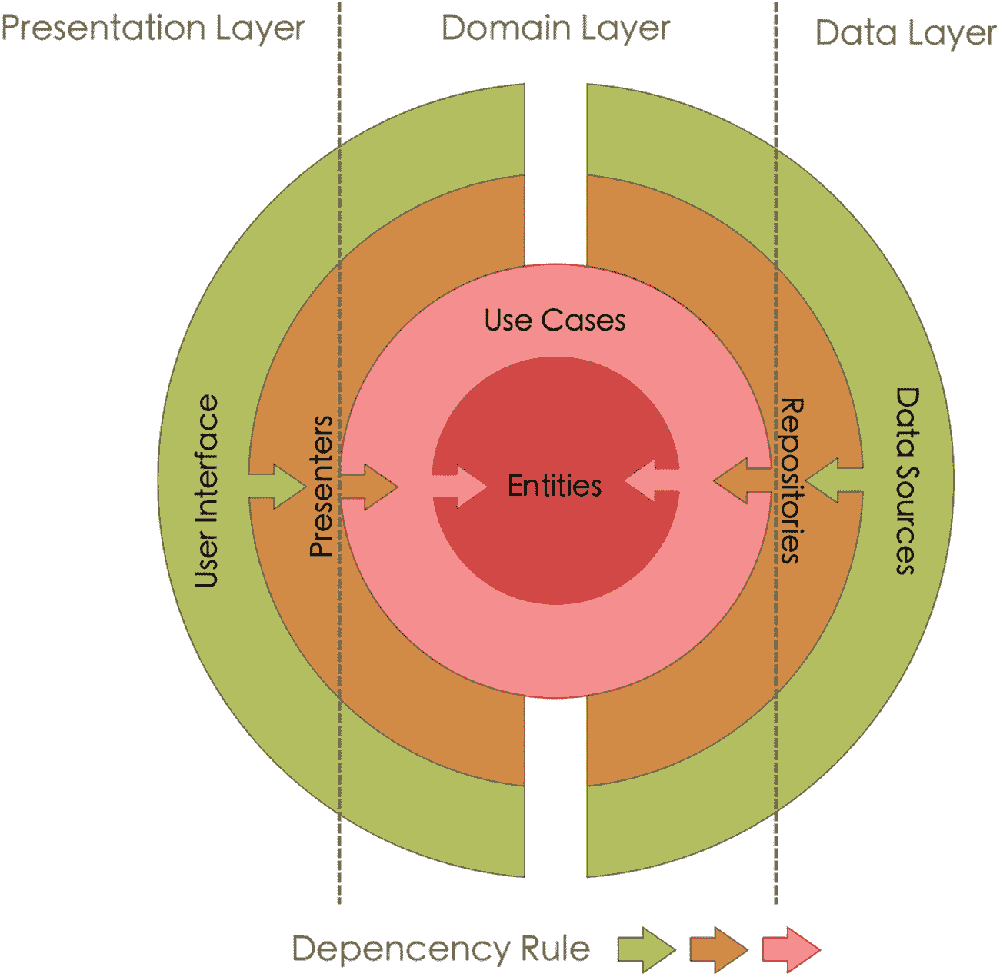

一个展示整洁架构层级结构方案的轮图，包含一个具有用户界面和展示器的`表示层`，一个包含用例和实体的`领域层`，以及一个包含数据源和仓储的`数据层`，它们遵循依赖规则。

图 1-2

整洁架构中的层级结构方案。依赖规则箭头展示了最外层如何依赖于最内层，而非相反方向。

#### 领域层

它是此架构的核心，包含应用逻辑和业务逻辑。在这一层，我们找到了`用例`或`交互器`、`实体`以及`仓储接口`：

*   **用例或交互器**：负责定义并实现业务逻辑。它们控制着进出`实体`的信息流。它们可以与一个或多个实体协同工作，并访问其方法。
*   **实体**：是包含业务规则的简单对象（可以是简单的数据结构，也可以包含方法）。
*   **仓储接口**：包含将在`仓储`中实现的方法的定义。`仓储`负责从数据库、服务器等处获取和传递数据。

这一层没有外部依赖，因此易于测试（`用例`），并且可以在其他项目中复用。

#### 表示层

该层包含所有向用户展示信息或接收用户交互的元素。

`表示层`还包括`视图模型`或`展示器`等组件，它们帮助准备要在屏幕上显示的数据。

`视图模型`或`展示器`也负责执行`用例`。`表示层`仅依赖于`领域层`。

#### 数据层

它包含了`仓储`的实现类以及数据源，例如数据库、用户偏好设置或服务器访问。与`表示层`类似，`数据层`仅依赖于`领域层`。

### 依赖规则

要使这种类型的架构正确运行，我们必须应用所谓的`依赖规则`。根据这条规则，内层不能了解外层（即，在内层中不能提及任何外层的变量、方法等）。

### 应用整洁架构的优势

在我们的项目中应用`整洁架构`会带来一系列优势（其中一些我们在软件架构介绍中已经了解）：

*   **可测试性**：业务逻辑被隔离在其自身层中，并且不依赖于其他层，这一事实使其易于测试。
此外，这种按层分离的做法还允许对各层进行单独测试，并能更容易地定位任何可能的错误。
*   **独立于框架**：代码必须独立于特定的库。
换句话说，我们可以将一个库更换为另一个，而无需对代码进行重大修改，且内部层不会因此停止工作。这是通过阻止我们的代码直接依赖这些库来实现的。
*   **独立于用户界面**：用户界面是最外层，仅负责展示由展示器提供的数据。
因此，我们必须能够修改它而不影响最内层（业务逻辑）。也就是说，用户界面必须适应业务逻辑的变化，而非相反。
*   **独立于数据源**：与独立于用户界面的解释类似，我们必须能够更改数据源（本地数据库、外部数据库等）而不影响业务逻辑，因为这些数据源需要适配业务逻辑。
*   **独立于外部元素**：业务逻辑必须独立于其周围的一切，这应允许我们更改系统的其余任何部分而不影响它。

## MyToDos：一个用于测试架构的简单应用

为了实践我们之前提到的不同架构（`MVC`、`MVP`、`MVVM`、`VIPER` 和 `VIP`），我们将创建一个简单的任务管理应用，这通常是开发者最初会做的应用之一。

### 应用界面

我们的 `MyToDos` 应用将允许我们实现不同界面间的导航（创建列表、创建任务……）；使用数据库来保存、更新或删除任务；以及管理用户在不同界面上的交互。

#### 启动界面

这是应用加载时显示的界面（图 1-3）。

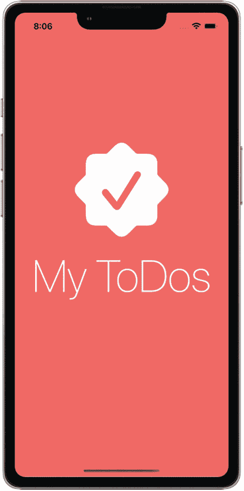

一张手机照片显示了 `My To Dos` 的启动界面。

图 1-3

启动界面

#### 主界面

此界面显示我们已创建的列表。如果我们尚未创建任何列表，将显示一个“空状态”提示，告知我们创建第一个列表。

对于每个已创建的列表，我们将能看到与该列表关联的图标、列表标题及其包含的任务数量（图 1-4）。

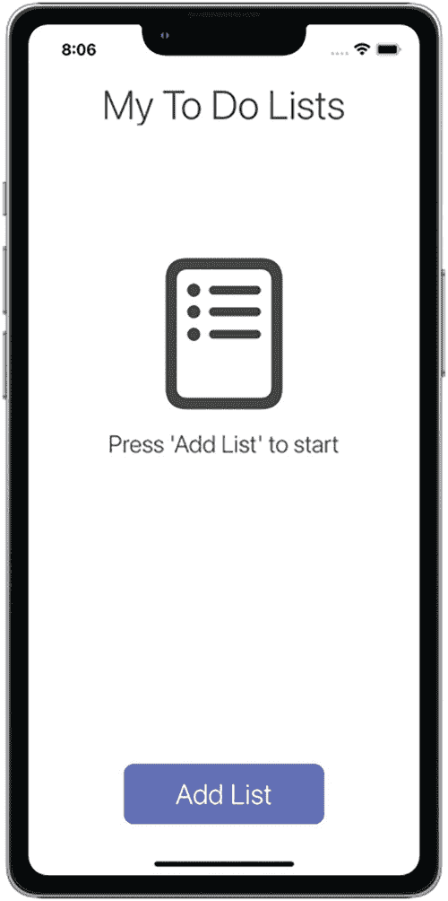

一张手机照片显示了我的待办事项列表的主界面，带有添加列表选项。

图 1-4

主界面上的空状态

用户可以在本界面的三个位置进行交互：

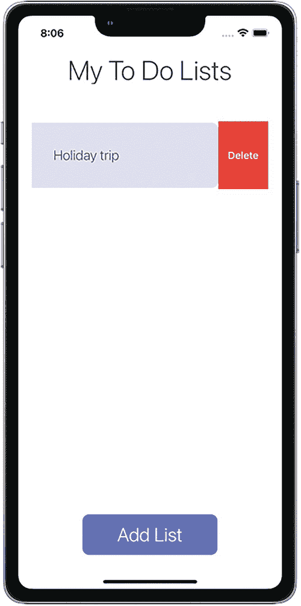

一张手机照片显示了我的待办事项列表面板，在滑动单元格上显示删除选项，底部有添加列表选项。

图 1-6

在滑动单元格上删除列表

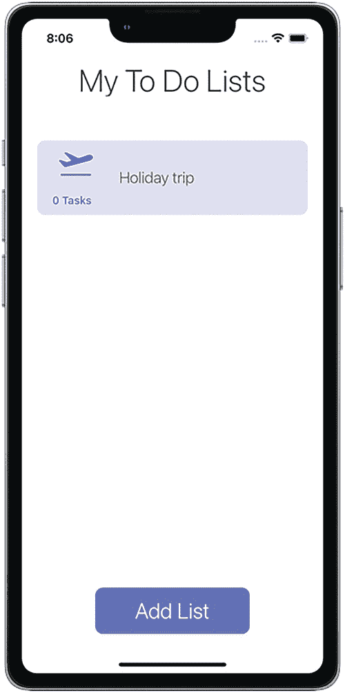

一张手机照片显示了我的待办事项列表面板，带有访问任务列表和底部添加列表选项。

图 1-5

在选择单元格时访问任务列表

*   使用*添加列表*按钮，这将允许我们创建一个新列表
*   选择其中一个列表以访问其内容（图 1-5）
*   通过在列表上执行滑动手势来删除列表（图 1-6）

#### 添加列表界面

此界面通过`主界面`上的*添加列表*按钮导航进入。在此处，用户需要指明列表的标题，并从显示的图标中选择一个（图 1-7）。

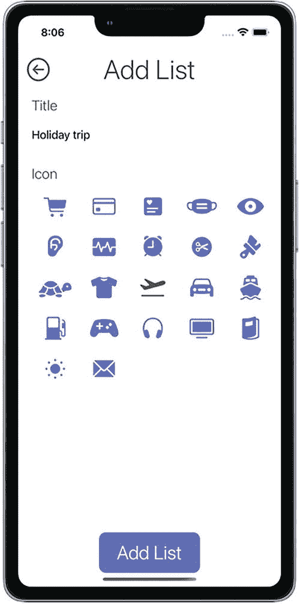

一张手机照片显示了带有不同图标的添加列表面板，底部有添加列表选项。

图 1-7

添加列表界面

当用户选择*添加列表*按钮时，输入的信息将被保存到数据库（`Core Data`）中，并返回至`主界面`。

如果用户不想创建任何列表而直接返回`主界面`，只需选择屏幕左上角的返回箭头按钮即可。


#### 任务列表界面

此界面通过选择首页中显示的某个列表进行导航。如果我们尚未创建任何任务，则会显示一个“空状态”提示，说明如何创建任务（图 1-8）。

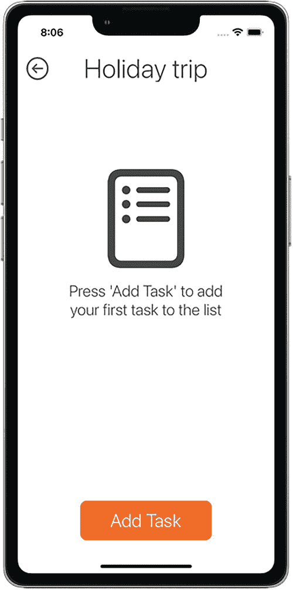

*图 1-8* – 任务列表空状态

用户可以在该界面上的三个位置进行交互：

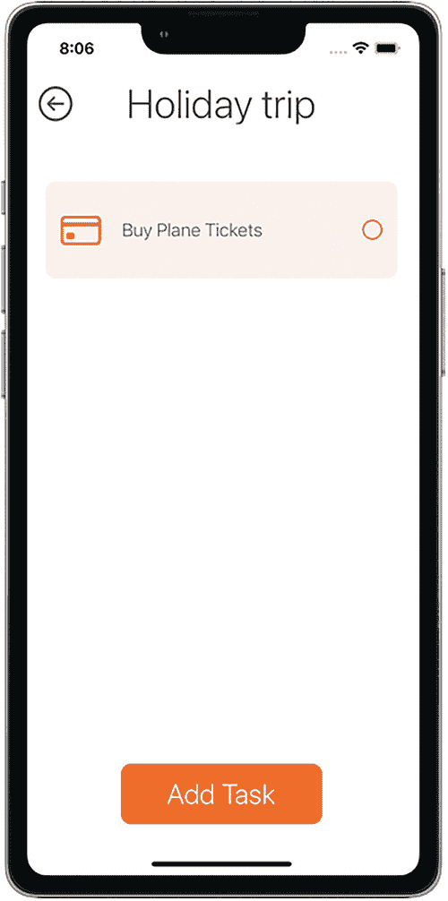

*图 1-9* – 添加了任务后的任务列表界面

*   使用*添加任务*按钮，该按钮允许我们创建一个新任务（图 1-9）。
*   选择每个任务右侧的圆圈，可将其标记为已完成（图 1-10）。
*   在列表中使用滑动手势删除任务（图 1-11）。

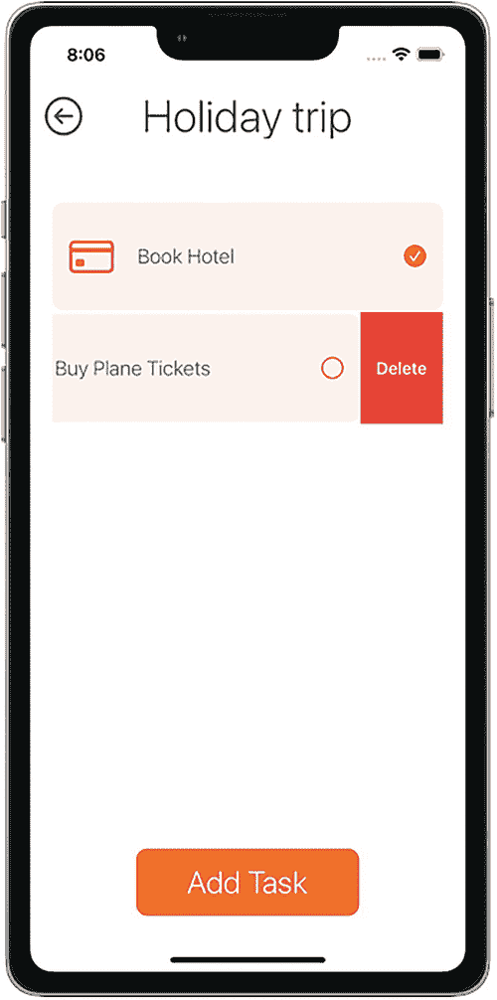

*图 1-11* – 删除任务

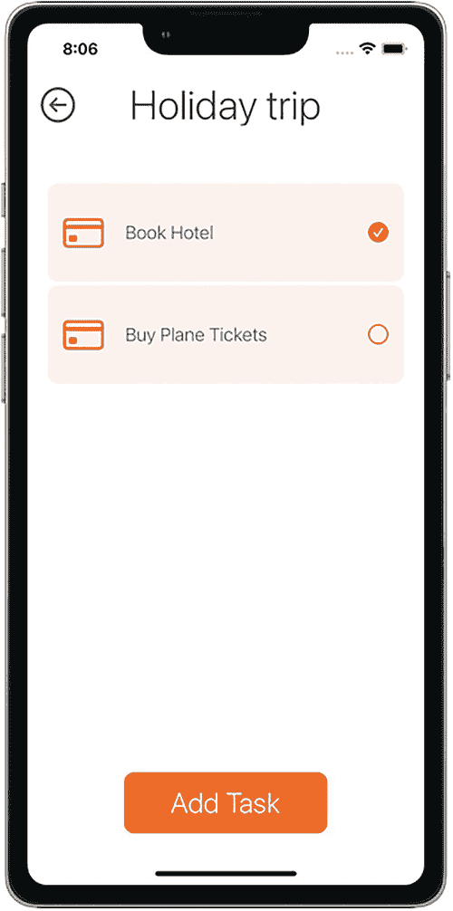

*图 1-10* – 任务被标记为已完成

在此界面上的任何修改（更改任务状态或删除任务）都会自动保存到数据库中。

如果用户想要不创建任何任务就返回首页，只需选择屏幕左上角的返回箭头按钮即可。

#### 添加任务界面

此界面通过任务列表界面上的*添加任务*按钮进行导航，并以模态形式显示。在此，用户需要指定任务的标题，并从显示的任务列表中选择一个图标。

当你选择*添加任务*按钮时，输入的信息会保存到数据库（Core Data）中，然后你会返回到任务列表界面。

如果用户想要不创建任何任务就返回任务列表界面，只需将屏幕向下拖动即可（图 1-12）。

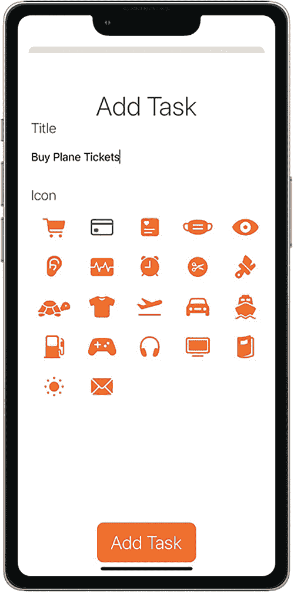

*图 1-12* – 添加任务界面

### 应用程序开发

在我们开始学习后续章节中不同的架构之前，首先来看看如何为此准备应用程序。

#### 使用的技术

为了使用每种架构开发此应用程序，我们使用了 Xcode 13.3 和 Swift 5.6。

所使用的数据库是 Apple 自带的 Core Data，并且视图以及视图之间的导航是直接通过代码开发的，没有使用 `.xib` 或 `.storyboard` 文件。

#### 如何移除对 Storyboard 的依赖

要开发不使用 storyboard 的应用程序（使用不同的架构），我们需要执行以下操作：

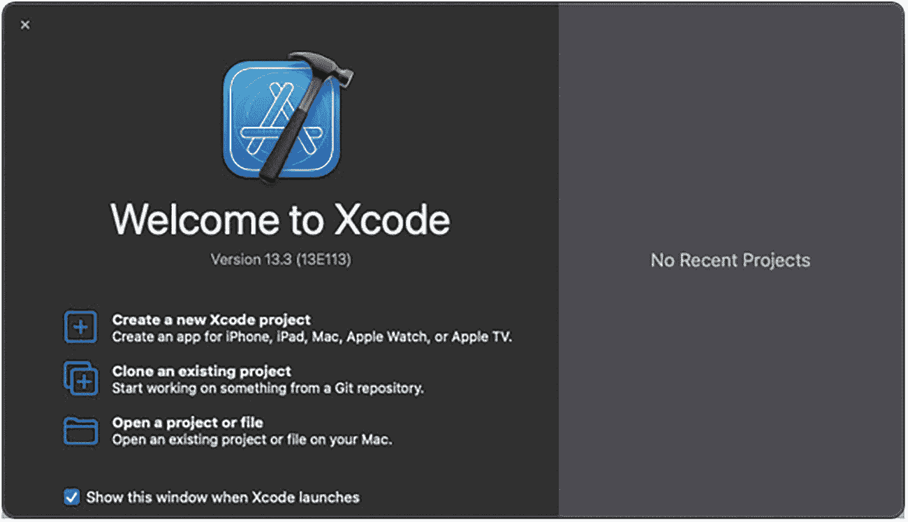

*图 1-13* – 欢迎使用 Xcode 界面

*   首先，我们打开 Xcode 并选择*创建一个新的 Xcode 项目*选项（图 1-13）。

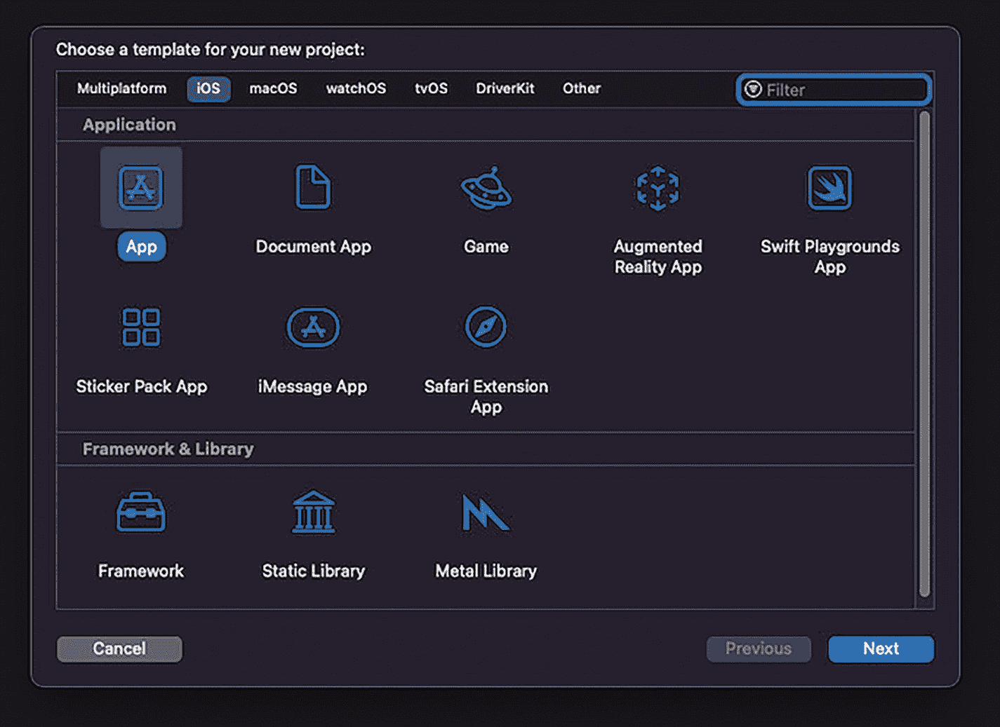

*图 1-14* – App 模板选择界面

*   接下来，在 iOS 部分选择*App* 模板（图 1-14）。

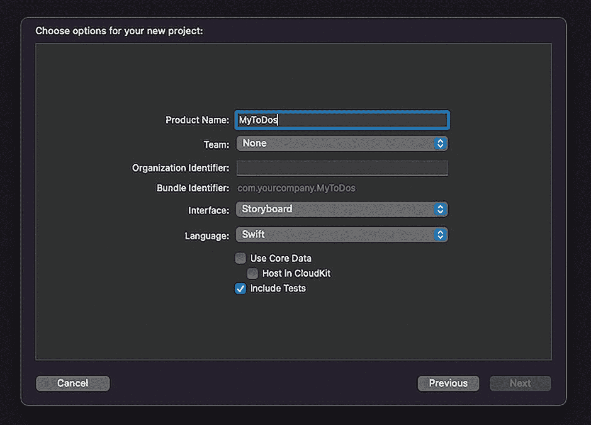

*图 1-15* – 选择项目选项界面

*   下一步是指定应用程序的名称（*产品名称*），选择开发团队和组织标识符，然后选择 *Storyboard* 作为界面，*Swift* 作为语言，并勾选*包含测试*（图 1-15）。

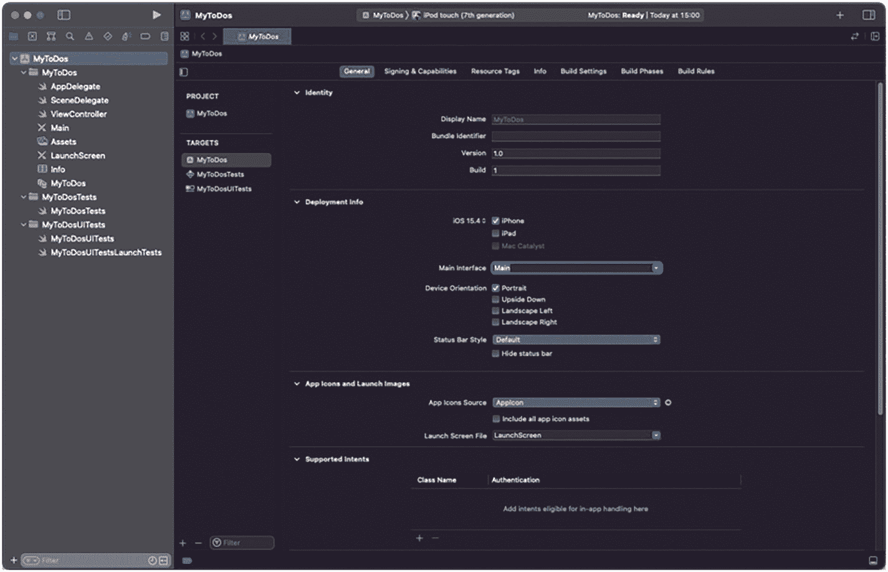

*图 1-16* – 项目配置界面

*   创建项目后，其配置界面将会出现。在此界面上，我们必须移除 *Deployment Info* ➤ *Main Interface* 部分中的“Main”选项（图 1-16）。

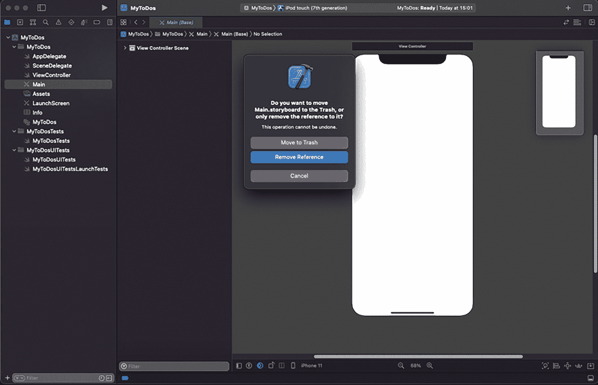

*图 1-17* – 移除 `Main.storyboard`

*   然后，我们删除 `Main.storyboard` 文件（图 1-17）。

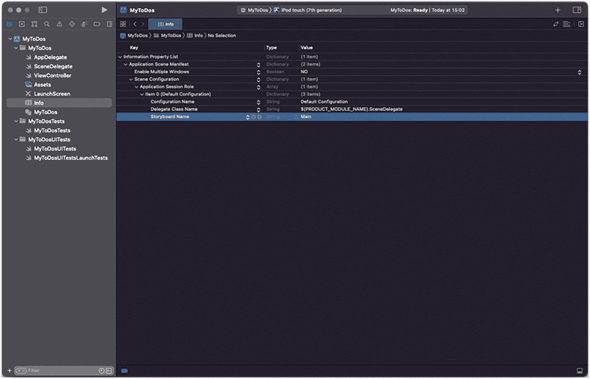

*图 1-18* – 从 `Info.plist` 中移除 storyboard 引用

*   最后，我们访问 `Info.plist` 文件，展开其内容，并移除 Storyboard Name 这一行：*Information Property List* ➤ *Application Scene Manifest* ➤ *Scene Configuration* ➤ *Application Session Role* ➤ *Item 0* ➤ *Storyboard Name*（图 1-18）。

*   当使用 storyboard 时，`window` 属性会自动初始化，并且根视图控制器会被设置为 storyboard 中的初始视图控制器。移除 storyboard 后，我们需要自己完成这项工作。

这需要在 `SceneDelegate.swift` 文件中完成，修改函数的内容

```swift
func scene(_ scene: UIScene, willConnectTo session: UISceneSession, options connectionOptions: UIScene.ConnectionOptions) {
    guard let _ = (scene as? UIWindowScene) else {
        return
    }
}
```

替换为以下代码（这部分代码可以根据我们应用程序的需求进行修改）：

```swift
func scene(_ scene: UIScene, willConnectTo session: UISceneSession, options connectionOptions: UIScene.ConnectionOptions) {
    if let windowScene = scene as? UIWindowScene {
        let window = UIWindow(windowScene: windowScene)
        window.rootViewController = ViewController()
        window.makeKeyAndVisible()
        self.window = window
    }
}
```

#### Core Data 配置

在此应用程序中，我们将使用 Apple 的数据库 Core Data，但在设置项目时我们没有选择它，以便我们可以使用自己的数据库管理类。


