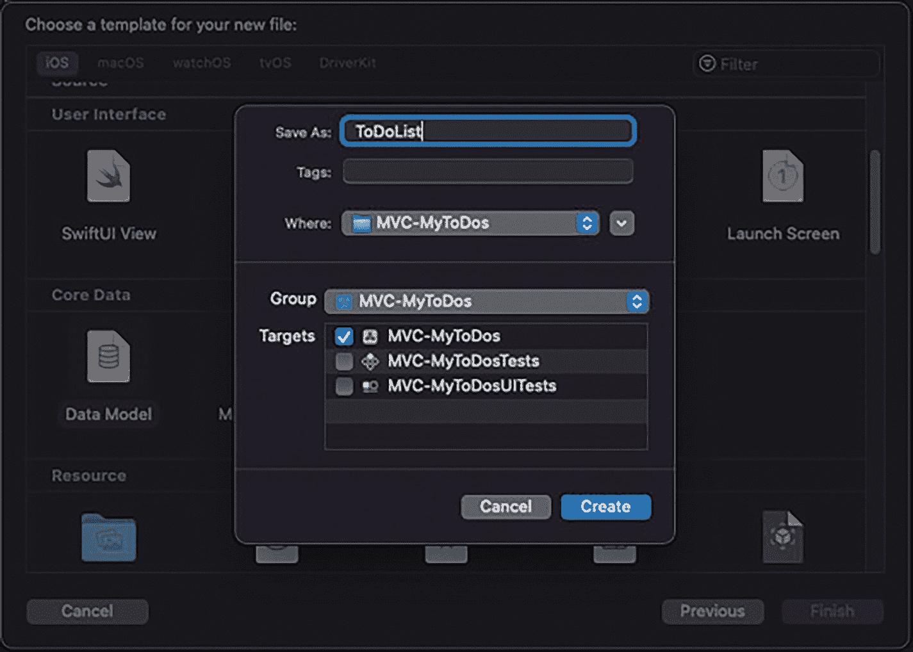
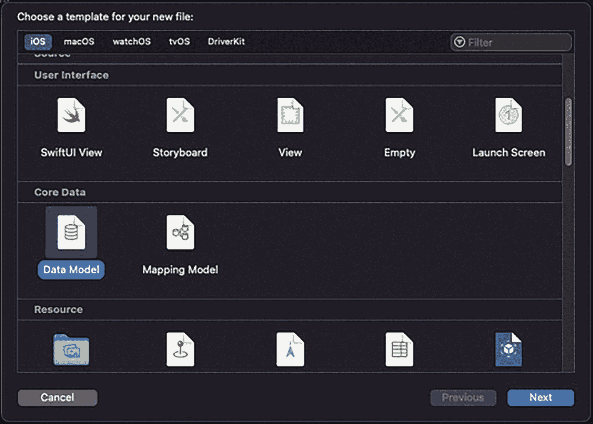
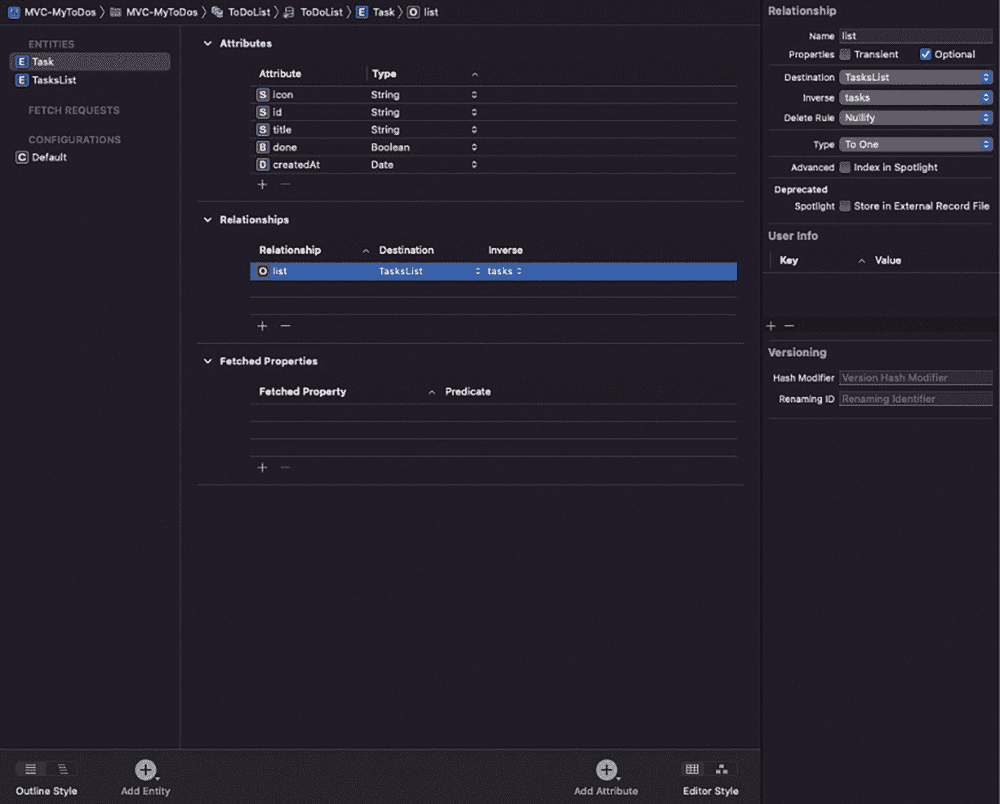
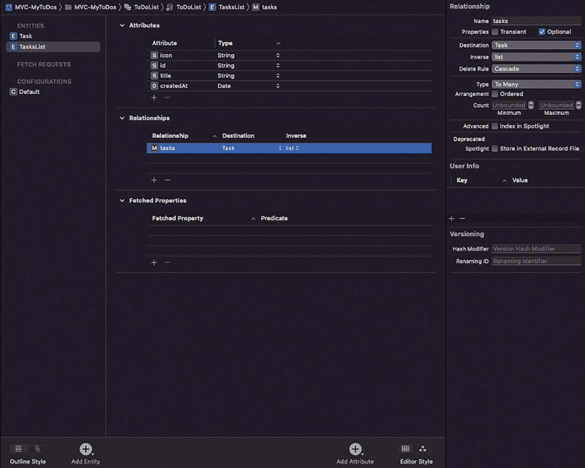
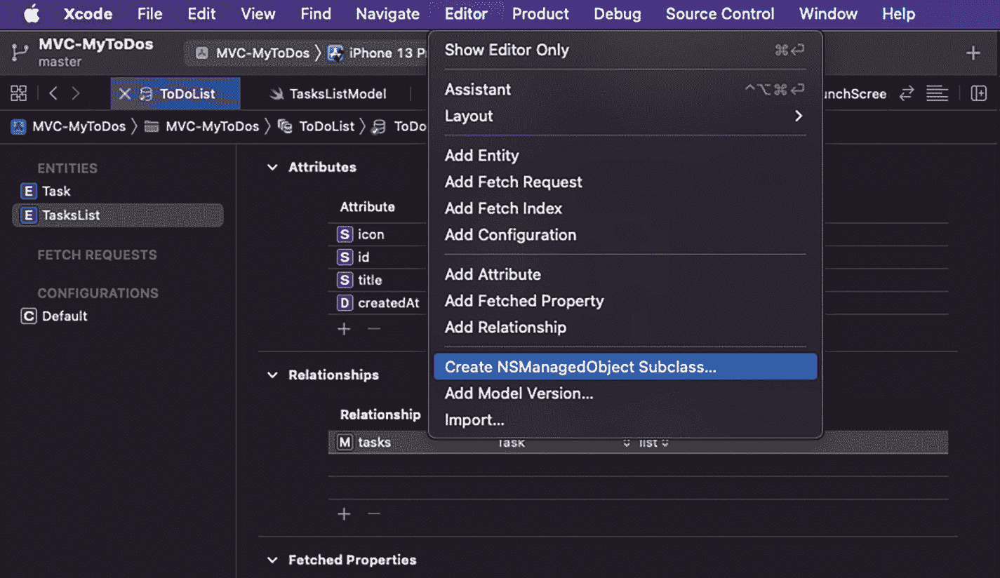

# 如何创建数据库和实体

为此，我们首先要创建数据库模型及其实体：



从核心数据创建数据模型的窗口。点击下一步后，将其保存为 `ToDoList`，然后选择创建选项。

**图 1-20** 创建数据模型文件



为新文件选择模板的窗口。其中高亮显示了 iOS 标签页下核心数据中的数据模型。底部的三个选项分别为取消、上一步和下一步。

**图 1-19** 选择数据模型文件模板

- 在 Xcode 的主菜单中，我们选择 *文件* ➤ *新建* ➤ *文件…*。在弹出的模板菜单中，向下滚动到 *Core Data* 部分，并选择 *Data Model*（图 1-19）。
- 接下来，我们给文件命名（此处为 `ToDoList`）并创建它（图 1-20）。



在核心数据中创建任务实体的窗口。

**图 1-22** 创建 Task 实体



从核心数据创建任务列表并添加两个带属性的实体的窗口。

**图 1-21** 创建 TasksList 实体

- 现在我们要创建将在应用程序中使用的实体，即 `TasksList` 和 `Task`。为此，我们选择 `ToDoList.xcdatamodeld` 文件，并添加上述两个实体，其属性如图 1-21 和图 1-22 所示。
- 通过创建这些实体，我们也在它们之间建立了 1 对 *n* 的关系。也就是说，一个列表可以关联多个任务，但一个任务只能关联一个列表。

创建实体后，我们可以使用 Xcode 生成管理这些实体的代码（作为 `NSManagedObject` 子类）。为此，我们选择 `ToDoList.xcdatamodeld` 文件，然后在 Xcode 主菜单中选择 *编辑器* ➤ *创建 NSManagedObject 子类…*（图 1-23）。



在核心数据中创建 NSManagedObject 子类的窗口。

**图 1-23** 为我们的实体创建 NSManagedObject 子类

这样，就会生成四个文件（每个实体对应两个文件）：

```
Task+CoreDataClass.swift
Task+CoreDataProperties.swift
TasksList+CoreDataClass.swift
TasksList+CoreDataProperties.swift
```

生成这些文件后，我们现在可以在项目中使用这些实体了。

## 创建 CoreDataManager

现在，我们只需创建我们的类（`CoreDataManager.swift`）来管理应用程序的 Core Data 栈。如以下代码所示，该类允许我们访问主上下文并能够保存它：

```swift
import Foundation
import CoreData

class CoreDataManager {
    static let shared = CoreDataManager()
    
    init() {}
    
    lazy var persistentContainer: NSPersistentContainer = {
        let container = NSPersistentContainer(name: "ToDoList")
        container.loadPersistentStores { _, error in
            if let error = error {
                fatalError("无法加载持久存储: \(error)")
            }
        }
        return container
    }()
    
    lazy var mainContext: NSManagedObjectContext = {
        return persistentContainer.viewContext
    }()
    
    func saveContext() {
        saveContext(mainContext)
    }
    
    func saveContext(_ context: NSManagedObjectContext) {
        if context.parent == mainContext {
            saveDerivedContext(context)
            return
        }
        
        context.perform {
            do {
                try context.save()
            } catch let error as NSError {
                fatalError("错误: \(error.localizedDescription)")
            }
        }
    }
    
    func saveDerivedContext(_ context: NSManagedObjectContext) {
        context.perform { [self] in
            do {
                try context.save()
            } catch let error as NSError {
                fatalError("错误: \(error.localizedDescription)")
            }
            saveContext(mainContext)
        }
    }
}
```

## 总结

对于本章，我们来总结一下所涉及的内容，可以将其分为两个部分：

- 第一部分，我们重点讨论了如何高效地构建和搭建一个应用程序，因此我们研究了：
    - 什么是软件架构、什么是架构模式，以及在开发应用程序时使用它们的好处
    - 什么是 Clean Architecture 及其使用的优势
- 在本章的第二部分，我们重点讨论了将用于实践不同架构模式的示例应用程序：
    - 我们了解了应用程序的总体描述、构成它的不同屏幕及其功能。
    - 我们了解了如何开发一个无需 storyboard 即可运行的应用程序。
    - 我们使用 Core Data 创建了一个数据库，创建了用于存储数据的实体，最后，我们建立了一个类来处理 Core Data 的栈。

脚注 1 2

