# 2. MVC：模型-视图-控制器

## 什么是 MVC？

### 一点历史

模型-视图-控制器（MVC）模式由 Trygve Reenskaug 于 20 世纪 70 年代末为 Smalltalk-76 编程语言引入。正如 Reenskaug 所写：[`https://folk.uio.no/trygver/`](https://folk.uio.no/trygver/)。

> 我创建模型-视图-控制器模式，是作为解决一个普遍问题的明显方案，即让用户从多个角度控制他们的信息。

在这个初始版本中，用户通过视图进行交互，视图将操作发送给控制器，控制器进而更新模型（数据）并重绘视图。模型在更新时通知视图，并接收视图的新状态（图 2-1）。

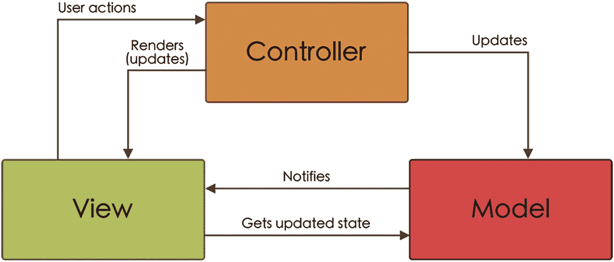

一个框图展示了三个分别标记为视图、控制器和模型的区块。它说明了用户操作与控制器和视图之间的渲染通信。视图与模型之间通过通知和获取状态更新进行交互，以及控制器对模型的更新。

**图 2-1** 原始的模型-视图-控制器示意图


### Apple 的模型-视图-控制器

目前使用的 `MVC` 模式是经过更新以适应当前软件和设备的最新版本。它是当今移动应用开发中最著名且最常用的模式之一，也是苹果公司为此类开发推荐的模式（图 2-2）。

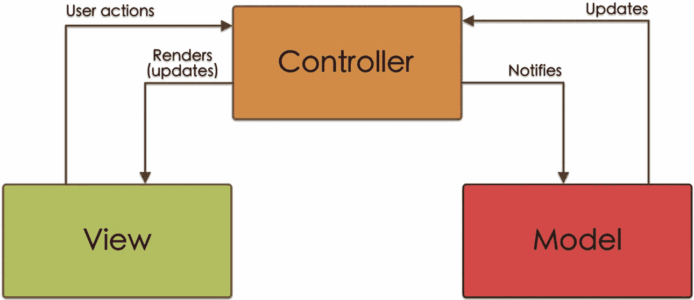

一个框图展示了三个分别标记为视图、控制器和模型的模块。它表示了从控制器到视图和模型的输出，而视图和模型则分别以用户操作和更新的形式向控制器提供输入。

图 2-2  
Apple 模型-视图-控制器架构图

由于在移动应用开发中，通常会重用诸如视图之类的组件，因此对原始的 `MVC` 模式进行了修改，使得模型和视图不再直接关联。

通过这种新方案，视图接收用户的操作并将其传达给控制器。控制器在必要时更新模型（数据），更新完成后，再更新视图。

在其文档中^(³)，苹果指出 `MVC` 基于三种设计模式（我们在第 1 章已从通用角度介绍过）：

- **组合模式**：视图由遵循树状结构的其他视图组成。例如，设想一个由更多视图（按钮、标签、图片……）组成的视图。
- **策略模式**：控制器可以管理一个或多个视图（这些视图没有内部逻辑，因此可重用），而视图将如何显示的问题委托给控制器。
- **观察者模式**：需要知道应用状态（即模型中的数据）何时发生变化的控制器，必须订阅这些变化。

## MVC 中的组件

我们刚刚看到这种架构中有三个组件：视图、模型和控制器。让我们更详细地研究每个组件的功能。

##### 模型

模型是保存业务逻辑并负责访问、操作或存储应用数据的组件。

- 它包含与数据持久化相关的类，例如，通过使用数据库（`Core Data`、`SQLite`、`Realm`……）或使用用户偏好设置（`UserDefaults`）。
- 它包含管理应用通信（`Networking`）并允许我们接收和发送数据的类。
- 它包含解析来自应用外部的信息并将其转换为模型对象的类。
- 它包含扩展、常量和辅助类。
- 一个模型对象可以与其他模型对象通信。
- 模型不能直接与视图通信。模型与视图之间的通信是通过控制器进行的。

#### 视图

视图由用户可以看到的那些组件组成：

- 它们是派生自 `UIKit`、`AppKit`、`Core Animation` 和 `Core Graphics` 库的类。
- 它们显示来自模型的数据，尽管它们不与模型直接连接（它们通过控制器进行）。
- 这些组件可以接收用户交互。

### 控制器

控制器充当模型和视图之间的中介：

- 它是 `MVC` 模型的主要组件，并与视图和模型通信。
- 它接收并解释用户在视图上执行的操作，并相应地更新模型。
- 如果模型中的数据发生变化，它会根据这些变化更新视图。
- 它负责应用的生命周期。

## MVC 的优缺点

`MVC` 架构模式是苹果推荐用于应用开发的模式；它通常是人们首先学习且最常用的模式。使用模型-视图-控制器架构既有优点也有缺点。

### MVC 模式的优点

使用 `MVC` 模式具有一些优点：

- 其设计简单。
- 与其他架构模式相比，它使用的代码更少。
- 它提供了清晰的职责分离；每个组件都有明确定义的职责。
- 它允许你在短时间内开发简单的应用。

### MVC 模式的缺点

`MVC` 模式的主要缺点在于控制器，这有以下几个原因：

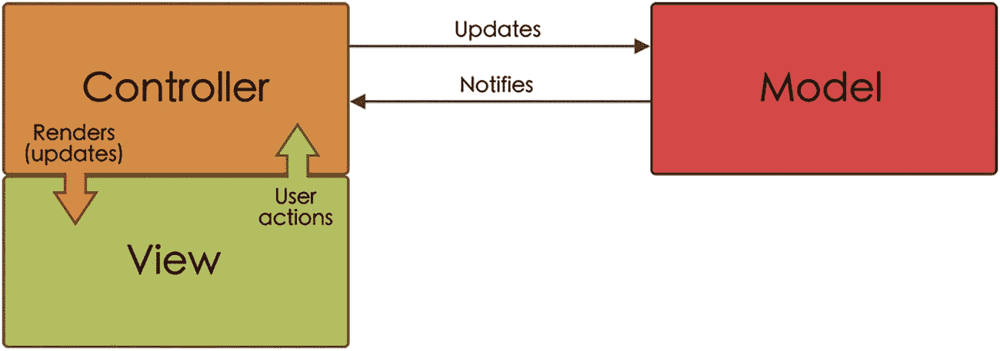

一个框图展示了两个相邻的块，分别标记为控制器和视图，它们之间存在通信。还有一个标记为模型的块，它接收更新并向左侧的这两个块发送通知。

图 2-3  
视图与控制器之间的耦合

- 控制器与视图和模型耦合得非常紧密，因此其可重用性不高。
- 控制器继承自 `UIViewController` 类，在这个类中，视图与控制器紧密绑定。这意味着职责分离通常会丧失，从而产生如下所示的架构（图 2-3）。

由于视图和控制器之间存在这种耦合，在没有视图介入的情况下独立测试控制器变得更加复杂。

- 存在一种强烈的倾向去“过度加载”控制器，为其添加一系列并非其职责的任务，例如部分业务逻辑、代理、表格和集合的数据源、导航等。这导致了所谓的“巨型视图控制器”。

为了解决这个问题，我们可以采取一些措施，例如将视图代码迁移到其他类，将视图控制器之间的导航分离给协调器，或者将 `UITableViewControllers` 或 `UICollectionView` 的代理和数据源移出视图控制器。

## MVC 应用实践

在我们了解了 `MVC` 架构的特性之后，现在我们将在应用开发中应用它。

注意

整个项目可以从本书的代码仓库中下载。在解释如何在我们的项目中实现 `MVC` 架构时，我们只会展示最相关的代码部分。

### MVC 分层

为了遵循应用架构模式（模型-视图-控制器）的逻辑，我们将创建一个模拟该架构各层的文件夹结构（图 2-4）。

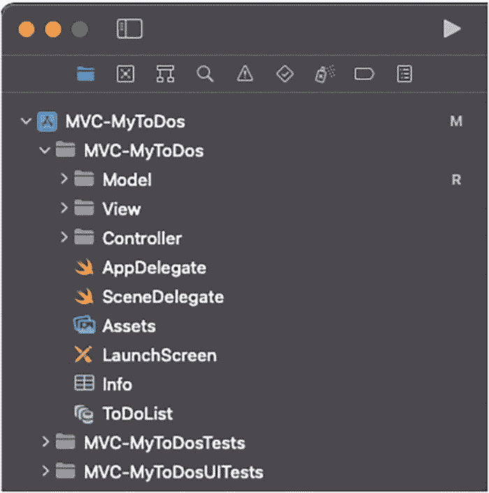

一张截图突出显示了主文件夹“MVC, my to dos”下的一个文件夹和文件集合。它在“controller”子文件夹下展示了名为 App delegate、scene delegate、assets、launch screen、info 和 to-do list 的文件。

图 2-4  
MVC 项目文件夹结构


##### 模型

在此文件夹中，我们将存放所有与业务逻辑、数据访问与操作、扩展、常量等相关的内容。此外，我们可以创建子文件夹来按功能对文件进行分组（图 2-5）：核心数据、扩展、服务等。

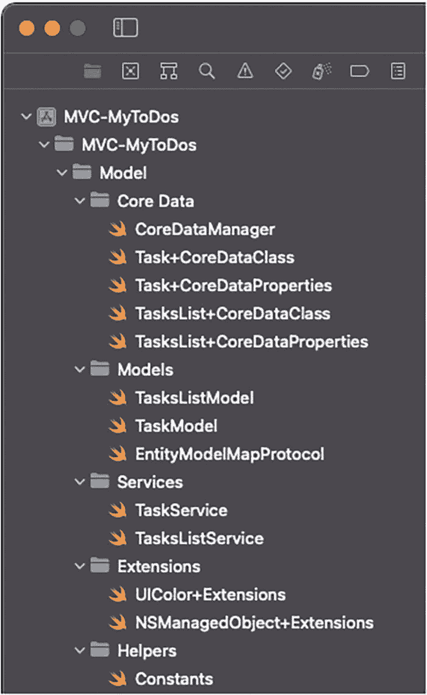

该截图展示了 `model` 文件夹子文件夹下的文件，`model` 本身也是 `MVC` 架构中 `my-to-dos` 下的子文件夹。`model` 下的子文件夹包括 `core data`、`models`、`services`、`extensions` 和 `helpers`。

**图 2-5** 模型层文件

在 MVC 模型模式中我们看到，模型会通知控制器（使用观察者设计模式）。

这样一来，控制器应当订阅模型中所发生的变更。

由于模型中发生的变更本质上是数据库中数据的添加、更新或删除操作，因此我们将利用 Core Data 自身的能力来获知这些变更。Core Data 能够根据产生的变更发出通知。

在我们的场景中，我们希望知道数据库何时发生变更（无论是添加新对象、删除对象还是更新对象），因此我们将使用以下通知：

```
NSManagedObjectContextObjectsDidChangeNotification
```

为此，我们只需在想要感知模型变更的控制器中的 `viewDidLoad` 方法里添加一个该通知的观察者：

```
NotificationCenter.default.addObserver(self,
                                         selector: #selector(methodToExecute),
                                         name: NSNotification.Name.NSManagedObjectContextObjectsDidChange,
                                         object: context)
```

`NSNotification.Name.NSManagedObjectContextObjectsDidChange` 是控制器订阅的通知名称，`context` 是我们要关注的对象，而 `methodToExecute` 是检测到变更时要运行的方法，例如：

```
@objc func methodToExecute() {
    view.updateView()
}
```

##### 核心数据

在此文件夹中，我们将存放 `CoreDataManager.swift` 文件（我们在第 1 章中创建）以及 Xcode 为数据库实体自动创建的四个文件。

##### 模型

这里存放的是我们可以将数据库实体转换成的模型。此外，我们将创建一个模型必须遵循的协议，以便在模型与实体之间相互转换（代码清单 2-1）。

```
protocol EntityModelMapProtocol {
    associatedtype EntityType: NSManagedObject
    func mapToEntityInContext(_ context: NSManagedObjectContext) -> EntityType
    static func mapFromEntity(_ entity: EntityType) -> Self
}
```

**代码清单 2-1** EntityModelMapProtocol 代码

在我们的应用程序中，将定义两个模型（`TaskModel` 和 `TasksListModel`），分别对应数据库中的一个实体。

每个模型也将遵循 `EntityModelMapProtocol` 协议，以便我们能够在模型与实体（`NSManagedObject` 子类）之间相互转换（代码清单 2-2 和代码清单 2-3）。

```
struct TaskModel {
    var id: String!
    var title: String!
    var icon: String!
    var done: Bool!
    var createdAt: Date!
}
```

**代码清单 2-3** `TaskModel.swift` 文件内容

```
struct TasksListModel {
    var id: String!
    var title: String!
    var icon: String!
    var tasks: [TaskModel]!
    var createdAt: Date!
}
```

**代码清单 2-2** `TasksListModel.swift` 文件内容


### 服务层

在这里，我们将定义一些类，用于向数据库发送信息（创建、更新或删除）或从数据库中检索信息并将其转换为模型。

对于管理任务列表的类，我们将找到添加、检索或删除任务列表所需的方法。我们将在 `TasksListServiceProtocol` 协议中定义这些方法，然后在 `TasksListService` 类（清单 2-4）中实现它们。

```
protocol TasksListServiceProtocol: AnyObject {
    init(coreDataManager: CoreDataManager)
    func saveTasksList(_ list: TasksListModel)
    func fetchLists() -> [TasksListModel]
    func fetchListWithId(_ id: String) -> TasksListModel?
    func deleteList(_ list: TasksListModel)
}

class TasksListService: TasksListServiceProtocol {
    let context: NSManagedObjectContext
    let coreDataManager: CoreDataManager

    required init(coreDataManager: CoreDataManager = CoreDataManager.shared) {
        self.context = coreDataManager.mainContext
        self.coreDataManager = coreDataManager
    }

    func saveTasksList(_ list: TasksListModel) {
        _ = list.mapToEntityInContext(context)
        coreDataManager.saveContext(context)
    }

    func fetchLists() -> [TasksListModel] {
        var lists = [TasksListModel]()
        do {
            let fetchRequest: NSFetchRequest = TasksList.fetchRequest()
            let value = try context.fetch(fetchRequest)
            lists = value.map({ TasksListModel.mapFromEntity($0) })
            lists = lists.sorted(by: { $0.createdAt.compare($1.createdAt) == .orderedDescending })
        } catch {
            debugPrint("CoreData Error")
        }
        return lists
    }

    func fetchListWithId(_ id: String) -> TasksListModel? {
        do {
            let fetchRequest: NSFetchRequest = TasksList.fetchRequest()
            fetchRequest.predicate = NSPredicate(format: "id = %@", id)
            let listEntities = try context.fetch(fetchRequest)
            guard let list = listEntities.first else {
                return nil
            }
            return TasksListModel.mapFromEntity(list)
        } catch {
            debugPrint("CoreData Error")
            return nil
        }
    }

    func deleteList(_ list: TasksListModel) {
        do {
            let fetchRequest: NSFetchRequest = TasksList.fetchRequest()
            fetchRequest.predicate = NSPredicate(format: "id = %@", list.id)
            let listEntities = try context.fetch(fetchRequest)
            for listEntity in listEntities {
                context.delete(listEntity)
            }
            coreDataManager.saveContext(context)
        } catch {
            debugPrint("CoreData Error")
        }
    }
}
```

清单 2-4
TasksListServiceProtocol 和 TasksListService 的结构与方法

对于管理任务的类 `TaskService`，我们将找到添加、检索、更新或删除任务所需的方法（清单 2-5）。与前例一样，我们将在一个协议中定义待实现的方法。

```
protocol TaskServiceProtocol: AnyObject {
    init(coreDataManager: CoreDataManager)
    func saveTask(_ task: TaskModel, in taskList: TasksListModel)
    func fetchTasksForList(_ taskList: TasksListModel) -> [TaskModel]
    func updateTask(_ task: TaskModel)
    func deleteTask(_ task: TaskModel)
}

class TaskService: TaskServiceProtocol {
    let context: NSManagedObjectContext
    let coreDataManager: CoreDataManager

    required init(coreDataManager: CoreDataManager = CoreDataManager.shared) {
        self.context = coreDataManager.mainContext
        self.coreDataManager = coreDataManager
    }

    func saveTask(_ task: TaskModel, in taskList: TasksListModel) {
        do {
            let fetchRequest: NSFetchRequest = TasksList.fetchRequest()
            fetchRequest.predicate = NSPredicate(format: "id = %@", taskList.id)
            guard let list  = try context.fetch(fetchRequest).first else {
                return
            }
            let taskEntity = task.mapToEntityInContext(context)
            list.addToTasks(taskEntity)
            coreDataManager.saveContext(context)
        } catch {
            debugPrint("CoreData Error")
        }
    }

    func fetchTasksForList(_ taskList: TasksListModel) -> [TaskModel] {
        var tasks = [TaskModel]()
        do {
            let fetchRequest: NSFetchRequest = TasksList.fetchRequest()
            fetchRequest.predicate = NSPredicate(format: "id = %@", taskList.id)
            guard let list  = try context.fetch(fetchRequest).first,
                  let taskEntities = list.tasks else {
                return tasks
            }
            tasks = taskEntities.map({ TaskModel.mapFromEntity($0 as! Task) })
        } catch {
            debugPrint("CoreData Error")
        }
        return tasks
    }

    func updateTask(_ task: TaskModel) {
        do {
            let fetchRequest: NSFetchRequest = Task.fetchRequest()
            fetchRequest.predicate = NSPredicate(format: "id = %@", task.id)
            guard let taskEntity = try context.fetch(fetchRequest).first else {
                return
            }
            taskEntity.done = task.done
            coreDataManager.saveContext(context)
        } catch {
            debugPrint("CoreData Error")
        }
    }

    func deleteTask(_ task: TaskModel) {
        do {
            let fetchRequest: NSFetchRequest = Task.fetchRequest()
            fetchRequest.predicate = NSPredicate(format: "id = %@", task.id)
            let taskEntities = try context.fetch(fetchRequest)
            for taskEntity in taskEntities {
                context.delete(taskEntity)
            }
            coreDataManager.saveContext(context)
        } catch {
            debugPrint("CoreData Error")
        }
    }
}
```

清单 2-5
TaskServiceProtocol 和 TaskService 的结构与方法

##### 扩展

在此示例中，我们创建了一个 `UIColor` 扩展，以便轻松访问专门为此应用程序创建的、位于 `Assets` 文件中的颜色。

我们还将为 `NSManagedObject` 类添加一个扩展，该扩展将避免我们在进行测试部分时与上下文发生冲突。

##### 常量

常量包含了我们在应用程序中将使用的固定参数。在本例中，它是一个图标名称列表，用户可以在创建任务或任务列表时从中选择图标。

### 视图层

这一层包含了用户可以看到的所有元素，这些元素构成了图形界面，并且用户可以与它们进行交互（图 2-6）。

这些视图可以是简单的，比如一个按钮或一个标签，也可以是复杂的，比如包含按钮、标签、图像等元素的整个页面视图。

对于简单的视图，它们通常是整个应用程序中重复使用的图形元素，例如一个按钮。

更复杂的视图则由更简单视图组合而成。由于我们不使用 `storyboards` 或 `xib` 文件，我们将通过约束来定义每个组件的特性，例如其位置或大小。

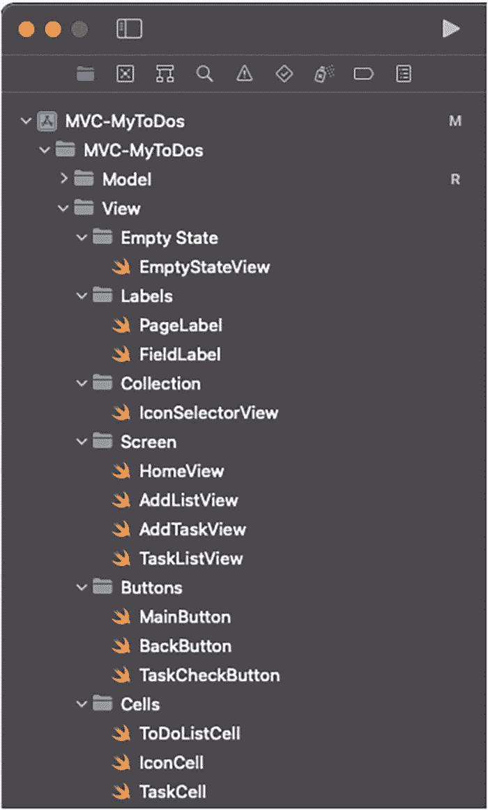

此截图显示了视图文件夹子文件夹下的文件，该视图文件夹又是 M V C, my-to-dos 下的子文件夹。视图下的子文件夹包括：empty state, labels, collection, screen, buttons, 和 cells。

图 2-6
视图层文件

### 控制器层

控制器（`UIViewController` 的子类）是应用程序的主要部分，负责连接模型和视图。我们应用程序中的每个屏幕都是一个视图控制器（图 2-7）。

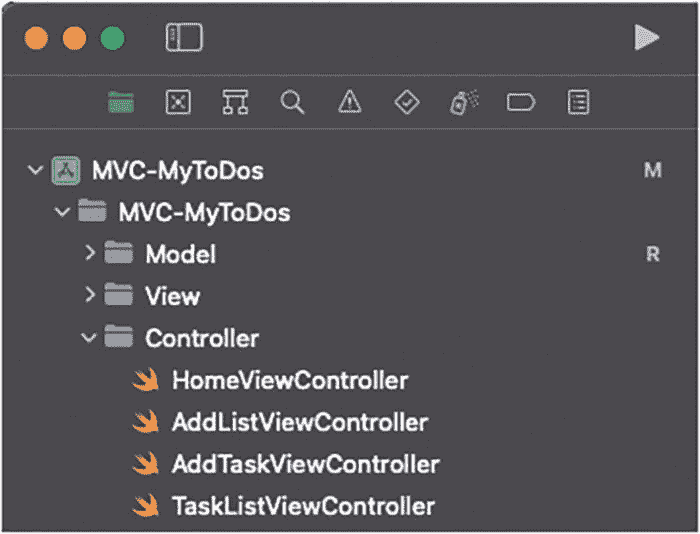

此截图显示了名为 controller 的文件夹下的文件，该文件夹是 M V C, my-to-dos 下的子文件夹。这些文件是：home view controller, add list controller, add task controller, 和 task view controller。

图 2-7
控制器层文件

### MyToDos 应用程序屏幕

在第一章 1 中，我们描述了我们将用于实现本书中将要讲解的每种架构模式的应用程序。

你可能还记得，这个应用程序有四个屏幕，每个屏幕由一个 `UIViewController` 表示，并与视图和模型相关联，管理信息在两者之间的传递。


### 信息流

那么，我们如何传递这些信息呢？

控制器是 MVC 模式的核心部分，它将包含对视图和模型的引用（实例）。因此，控制器能够通过直接调用视图和模型的公有方法来传递信息。

例如，如果我们的控制器中有一个 `TasksListService` 类（模型）的实例，我们可以通过调用它的 `fetchList` 方法来获取任务列表：

```
let tasksLists = tasksListService.fetchLists()
```

然后将这些信息传递给视图：

```
let view = HomeView()
view.setLists(taskLists)
```

#### 委托模式

那么，视图中的用户交互，我们如何将其传递给控制器呢？

由于视图没有控制器实例来调用其方法，我们可以通过使用*委托模式*来实现这一点。

这种设计模式允许一个类将某些职责委托给另一个类的实例。在我们的案例中，针对视图中用户交互的行为将由控制器来实现。

#### 如何实现委托模式

要实现*委托模式*，首先，我们创建一个协议（protocol），其中包含我们想要委托的方法。例如，让我们创建一个包含两个方法的示例协议：

```
protocol ExampleDelegate: AnyObject {
    func methodA()
    func methodB(value: String)
}
```

下一步是在进行委托的类（在我们的案例中就是视图）中，创建一个我们已创建的协议类型的属性，并将其命名为 `delegate`：

```
class ExampleView {
    ...
    weak var delegate: ExampleDelegate?
    ...
}
```

现在，根据视图中发生的事件（按下按钮、在文本框中输入等），我们可以调用协议中的不同方法：

```
delegate?.methodA()
delegate?.methodB(value: "Input text")
```

现在，在控制器中，为了让它能够实现协议方法，我们必须将 `exampleView` 实例的 `delegate` 属性设置为 `self`，表明将由该控制器来实现协议方法：

```
class ExampleViewController {
    ...
    exampleView.delegate = self
    ...
}
```

最后，我们必须让控制器采纳该协议并实现其方法（我们可以在扩展中这样做，以提高代码可读性）：

```
extension ExampleViewController: ExampleDelegate {
    func methodA() { ... }
    func methodB(value: String) { ... }
}
```

现在，我们来看看如何在我们应用开发中实现这一切。在每个界面的开头，我们将展示一个图表，说明不同组件（主要组件）之间如何相互通信。

#### AppDelegate 和 SceneDelegate

自 iOS 13 发布以来，`AppDelegate` 在先前版本中的部分职责已转移到了 `SceneDelegate`。因此，现在 `AppDelegate` 负责应用的生命周期及其设置，而 `SceneDelegate` 则负责屏幕上显示的内容及其显示方式。

在我们要开发的示例应用中，我们不会修改 Xcode 创建应用时自动生成的 `AppDelegate`。我们要做的是修改 `SceneDelegate`，特别是 `scene(_:willConnectTo:options:)` 方法，这是 `UISceneSession` 生命周期中第一个被调用的方法（代码清单 2-6）。

```
func scene(_ scene: UIScene, willConnectTo session: UISceneSession, options connectionOptions: UIScene.ConnectionOptions) {
    if let windowScene = scene as? UIWindowScene {
        let window = UIWindow(windowScene: windowScene)
        let navigationController = UINavigationController(rootViewController: HomeViewController(tasksListService: TasksListService(), taskService: TaskService()))
        navigationController.interactivePopGestureRecognizer?.isEnabled = false
        window.backgroundColor = .white
        window.rootViewController = navigationController
        self.window = window
        window.makeKeyAndVisible()
    }
}
```

**代码清单 2-6** — 在 `SceneDelegate` 中修改以调用 `HomeViewController`

如您所见，我们在此方法中所做的是创建一个新的 `UIWindow`，设置应用的根视图控制器（它是一个 `UINavigationController` 组件，其第一个控制器将是 `HomeViewController` 类），最后，使我们创建的窗口成为要显示的关键窗口。

### 主屏幕

在主屏幕上，主要组件是 `HomeViewController` 类，我们可以在图 2-8 中看到它如何与其余组件进行通信。

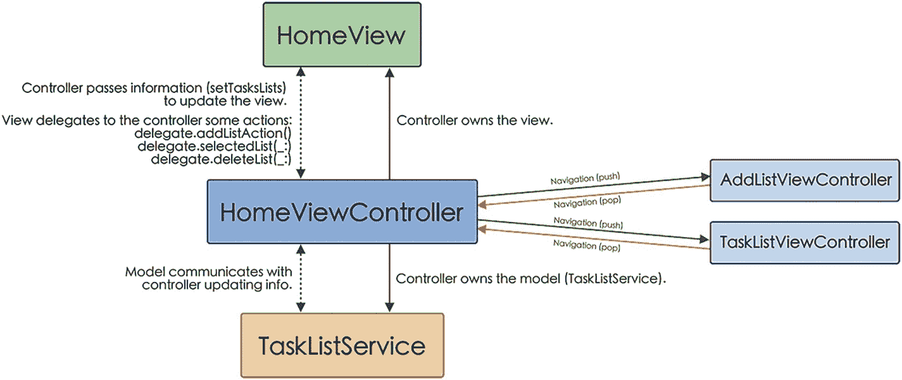

**图 2-8** — 主屏幕组件通信示意图


### `HomeViewController`

控制器（`HomeViewController`）是 MVC 模式的核心，必须持有对视图（`HomeView`）和模型（`TasksListServiceProtocol` 及 `TaskServiceProtocol`）的引用，如代码清单 2-7 所示。

在初始化器中传入所需的类的实例（这被称为*依赖注入*），可以使组件之间的耦合度更低，并便于实施单元测试（例如使用 mock 对象）。

```
class HomeViewController: UIViewController {
    private var homeView = HomeView()
    private var tasksListService: TasksListServiceProtocol!
    private var taskService: TaskServiceProtocol!
    init(tasksListService: TasksListServiceProtocol,
         taskService: TaskServiceProtocol) {
        super.init(nibName: nil, bundle: nil)
        self.tasksListService = tasksListService
        self.taskService = taskService
    }
    ...
}
Listing 2-7
HomeViewController initialization
```

正如我们在 MVC 架构中所见，控制器会将信息传递给视图进行展示。我们通过 `fetchTasksLists` 方法来实现这一点，其功能是从数据库中检索信息并将其传递给视图（代码清单 2-8）。

```
func fetchTasksLists() {
    let lists = tasksListService.fetchLists()
    homeView.setTasksLists(lists)
}
Listing 2-8
The fetchTasksLists method calls the Model to fetch the lists and then passes them to the View
```

另一方面，控制器会通过*委托模式*接收用户交互并做出相应处理。

这些交互包括：

*   访问任务列表。
*   添加任务列表。
*   删除任务列表。

为此，我们首先定义一个包含这些交互相关方法的协议（代码清单 2-9）。

```
protocol HomeViewDelegate: AnyObject {
    func addListAction()
    func selectedList(_ list: TasksListModel)
    func deleteList(_ list: TasksListModel)
}
Listing 2-9
HomeViewDelegate protocol
```

然后，我们让 `HomeViewController` 遵循此协议并实现其方法（代码清单 2-10）。

```
extension HomeViewController: HomeViewDelegate {
    func addListAction() {
        let addListViewController = AddListViewController(tasksListModel: list, taskService: taskService, tasksListService: tasksListService)
        navigationController?.pushViewController(addListViewController, animated: true)
    }
    func selectedList(_ list: TasksListModel) {
        let taskViewController = TaskListViewController(tasksListModel: list)
        navigationController?.pushViewController(taskViewController, animated: true)
    }
    func deleteList(_ list: TasksListModel) {
        tasksListService.deleteList(list)
    }
}
Listing 2-10
HomeViewController extension that implements the HomeViewDelegate protocol methods
```

当用户点击“添加列表”按钮时，会执行 `addListAction` 方法，并将应用导航到 `AddListViewController` 屏幕。

`selectedList` 方法会将应用导航到 `TaskListViewController` 屏幕（并将所选的列表信息传递给它）。

最后，`deleteList` 方法负责通知模型必须从数据库中删除所选列表，然后重新加载视图。

此外，我们还需要实现对模型的观察，以便在任务列表被添加或删除时更新视图（代码清单 2-11）。

```
override func viewDidLoad() {
    super.viewDidLoad()
    NotificationCenter.default.addObserver(self,
                                           selector: #selector(contextObjectsDidChange),
                                           name: NSNotification.Name.NSManagedObjectContextObjectsDidChange,
                                           object: CoreDataManager.shared.mainContext)
}
@objc func contextObjectsDidChange() {
    fetchTasksLists()
}
Listing 2-11
Model observer implementation
```

### `HomeView`

基本上，`HomeView` 由一个 `UITableView` 元素（用于显示信息）和一个 `UIButton` 元素（用于添加新列表）组成。我们之前已经看到，控制器通过 View 的 `setTasksList` 方法将需要显示的信息传递给视图（代码清单 2-12）。

```
func setTasksLists(_ lists: [TasksListModel]) {
    tasksList = lists
    tableView.reloadData()
    emptyState.isHidden = tasksList.count > 0
}
Listing 2-12
Upon receiving the information from HomeViewController, the HomeView is updated with the new data
```

在这个函数中，我们获取 `lists` 参数并将其赋值给类的 `taskList` 变量（我们将使用它来填充表格），重新加载表格，并根据列表是否包含值来隐藏或显示“空状态”。

另一方面，View 还需要通过委托将用户交互传递给控制器。

我们将在 `HomeView` 的顶部添加一个 `HomeViewDelegate` 类型的委托属性来实现这一点：

```
class HomeView: UIView {
    ...
    weak var delegate: HomeViewDelegate?
    ...
}
```

此外，在 `HomeViewController` 中，我们必须将 `HomeView` 实例的 `delegate` 属性配置为 `self`，以指示将由 `HomeViewController` 来实现协议方法（代码清单 2-13）。

```
class HomeViewController: UIViewController {
    ...
    override func loadView() {
        super.loadView()
        setupHomeView()
    }
    private func setupHomeView() {
        homeView.delegate = self
        self.view = homeView
    }
    ...
}
Listing 2-13
Setting HomeView delegate on HomeViewController
```

一旦定义了委托，我们就可以在代码中使用它，并调用各个协议函数。

因此，`addListAction` 方法将从与添加列表按钮关联的函数中被调用（代码清单 2-14）。

```
extension HomeView {
    ...
    func configureAddListButton() {
        addListButton.addTarget(self, action: #selector(addListAction), for: .touchUpInside)
        ...
    }
    @objc func addListAction() {
        delegate?.addListAction()
    }
    ...
}
Listing 2-14
Configure the addListButton target
```

当用户选中表格中的某个单元格时，将调用 `selectList` 方法（代码清单 2-15）。

```
func tableView(_ tableView: UITableView, didSelectRowAt indexPath: IndexPath) {
    delegate?.selectedList(tasksList[indexPath.row])
}
Listing 2-15
HomeView delegates the selectedList method implementation to the HomeViewController
```

当用户滑动某个单元格时，将调用 `deleteList` 方法（代码清单 2-16）。

```
func tableView(_ tableView: UITableView, commit editingStyle: UITableViewCell.EditingStyle, forRowAt indexPath: IndexPath) {
    if editingStyle == .delete {
        let list = tasksList[indexPath.row]
        tasksList.remove(at: indexPath.row)
        tableView.deleteRows(at: [indexPath], with: .automatic)
        delegate?.deleteList(list)
    }
}
Listing 2-16
On swipe a cell, the delete method is called (removing cell from the table, and delegating the deletion from the Model to the HomeViewController)
```

### 添加列表屏幕

此屏幕负责添加任务列表，其组件之间的通信如图 2-9 所示。

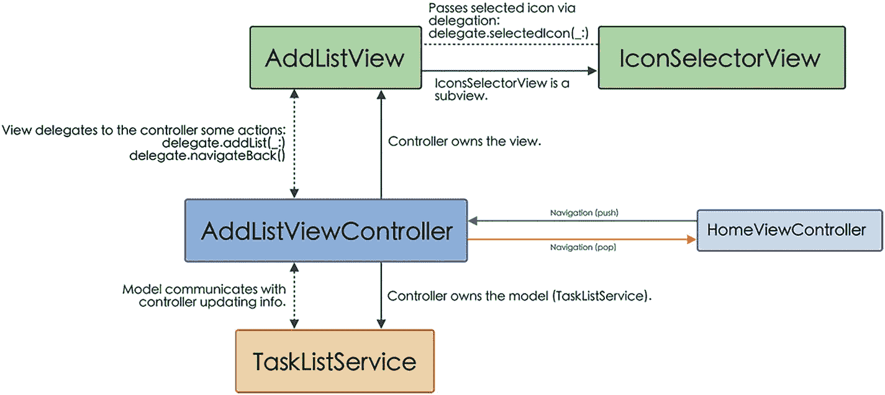

该框图展示了添加列表视图、添加列表视图控制器和任务列表服务之间的通信。添加列表视图包含一个名为图标选择器视图的子视图。中间的添加列表视图控制器与主视图控制器之间存在导航。

**图 2-9**

添加列表屏幕组件通信示意图


### `AddListViewController`

在`AddListViewController`（即添加任务列表的界面）中，我们持有视图（`AddListView`）和模型（`TasksListService`）的引用；不过在本例中，我们不会将信息从控制器传递到视图，而仅通过委托来接收用户交互（如代码清单 2-17 所示）。

```
class AddListViewController: UIViewController {
private var tasksListService: TasksListService!
init(tasksListService: TasksListService) {
super.init(nibName: nil, bundle: nil)
self.tasksListService = tasksListService
}
...
private func setupAddListView() {
addListView.delegate = self
self.view = addListView
}
private func backToHome() {
navigationController?.popViewController(animated: true)
}
}
extension AddListViewController: AddListViewDelegate {
func addList(_ list: TasksListModel) {
tasksListService.saveTasksList(list)
backToHome()
}
}
extension AddListViewController: BackButtonDelegate {
func navigateBack() {
backToHome()
}
}
代码清单 2-17
AddListViewController 的实现
```

如您所见，我们在`AddListView`类上只设置了一个委托参数，但`AddListViewController`却遵循了两个协议：`AddListViewDelegate`和`BackButtonDelegate`。这是因为，正如我们接下来要看到的，我们可以为委托设置多种类型。

### `AddListView`

`AddListView`包含一个用于输入任务列表名称的`UITextField`元素、一个用于选择列表图标的`UICollectionView`元素、一个创建列表的按钮，以及另一个返回`Home`界面的按钮。

在此视图中，我们可以同时看到委托模式的两个方面。

一方面，它将一系列方法的实现委托给了引用它的控制器。

因此，`AddListView`将`BackButtonDelegate`和`AddListViewDelegate`协议所涉及方法的实现委托给了`AddListViewController`（如代码清单 2-18 所示）。

```
protocol BackButtonDelegate: AnyObject {
func navigateBack()
}
protocol AddListViewDelegate: AnyObject {
func addList(_ list: TasksListModel)
}
代码清单 2-18
BackButtonDelegate 和 AddListViewDelegate 的实现
```

第一个协议用于指示用户选择了返回按钮，且未创建任何列表。第二个协议允许我们将已创建列表的数据传递给控制器（控制器将负责请求模型将其保存到数据库中）。

由于我们希望在控制器中实现所有这些协议，因此在视图中，我们可以创建一个同时遵循所有这些协议的委托（如果我们不想实现其中任何一个，则应创建名称不同的独立委托）：

```
weak var delegate: (AddListViewDelegate & BackButtonDelegate)?
```

现在，我们可以通过委托调用不同的方法了（如代码清单 2-19 所示）。

```
@objc func backAction() {
delegate?.navigateBack()
}
@objc func addListAction() {
guard titleTextfield.hasText else { return }
listModel.title = titleTextfield.text
listModel.id = ProcessInfo().globallyUniqueString
listModel.icon = listModel.icon ?? "checkmark.seal.fill"
listModel.createdAt = Date()
delegate?.addList(listModel)
}
代码清单 2-19
通过委托调用 AddListViewController 中的方法
```

但`AddListView`不仅委托了方法的实现，它自身也实现了其他方法。因此，我们在该视图中集成的图标选择器`IconSelectorView`引入了`IconSelectorViewDelegate`协议。

该协议要求我们实现一个用于返回用户所选图标的方法（如代码清单 2-20 所示）。

```
protocol IconSelectorViewDelegate: AnyObject {
func selectedIcon(_ icon: String)
}
func configureCollectionView() {
...
iconSelectorView.delegate = self
...
}
extension AddListView: IconSelectorViewDelegate {
func selectedIcon(_ icon: String) {
listModel.icon = icon
}
}
代码清单 2-20
IconSelectorViewDelegate 的实现
```

#### 任务列表界面

该界面负责显示构成某个列表的任务，并对它们进行标记完成、删除以及添加新任务等操作。其组件之间的通信如图 2-10 所示。

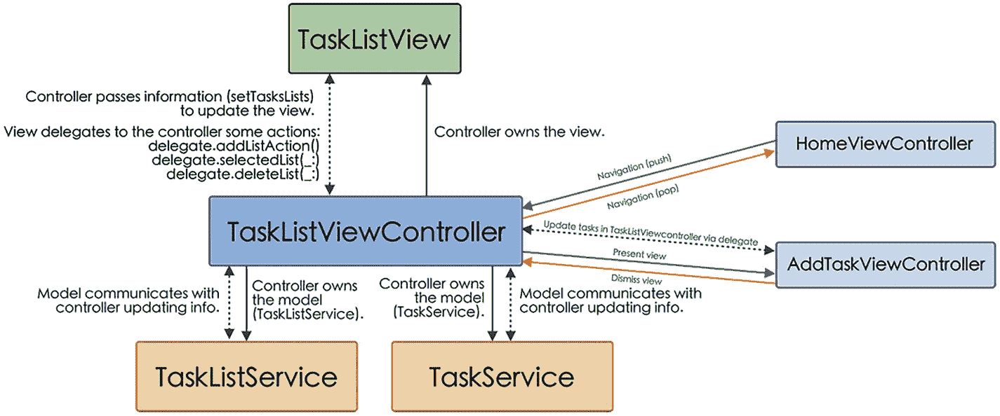

一个框图展示了任务列表视图与任务列表视图控制器之间的通信。任务列表视图控制器再次与任务列表服务和任务服务，以及首页视图和任务视图控制器进行往复通信。

**图 2-10** 任务列表界面组件通信示意图

### `TaskListViewController`

`TaskListViewController`负责控制显示构成某个列表任务的界面，它持有视图（`TaskListView`）和模型（`TaskServiceProtocol`和`TasksListServiceProtocol`）的引用。

此外，由于该界面将显示构成一个列表的任务，因此当从`HomeViewController`调用启动该界面时，我们必须向其传递一个包含待显示列表的对象（`TaskListModel`），如代码清单 2-21 所示。

```
class TaskListViewController: UIViewController {
private var taskListView = TaskListView()
private var tasksListModel: TasksListModel!
private var taskService: TaskServiceProtocol!
private var tasksListService: TasksListServiceProtocol!
init(tasksListModel: TasksListModel,
taskService: TaskServiceProtocol,
tasksListService: TasksListServiceProtocol) {
super.init(nibName: nil, bundle: nil)
self.tasksListModel = tasksListModel
self.taskService = taskService
self.tasksListService = tasksListService
}    ...
}
代码清单 2-21
TaskListViewController 的初始化
```

由于视图负责显示任务，因此我们必须传递`TaskListModel`类型的对象，并设置视图的委托，以便能够接收用户的交互（以及与委托协议 `TaskListViewDelegate`和`BackButtonDelegate`相关联的方法），如代码清单 2-22 所示。

```
class TaskListViewController: UIViewController {
...
override func loadView() {
super.loadView()
navigationController?.navigationBar.isHidden = true
setupTaskListView()
}
override func viewDidLoad() {
super.viewDidLoad()
NotificationCenter.default.addObserver(self,
selector: #selector(contextObjectsDidChange),
name: NSNotification.Name.NSManagedObjectContextObjectsDidChange,
object: CoreDataManager.shared.mainContext)
taskListView.setTasksList(tasksListModel)
}
private func setupTaskListView() {
taskListView.delegate = self
self.view = taskListView
}
private func updateTasksList() {
guard let list = tasksListService.fetchListWithId(tasksListModel.id) else { return }
tasksListModel = list
taskListView.setTasksList(tasksListModel)
}
@objc func contextObjectsDidChange() {
updateTasksList()
}
}
extension TaskListViewController: TaskListViewDelegate {
func addTaskAction() {
let addTaskViewController = AddTaskViewController(tasksListModel: tasksListModel, taskService: taskService)
addTaskViewController.modalPresentationStyle = .pageSheet
present(addTaskViewController, animated: true)
}
func updateTask(_ task: TaskModel) {
taskService.updateTask(task)
}
func deleteTask(_ task: TaskModel) {
taskService.deleteTask(task)
}
}
extension TaskListViewController: BackButtonDelegate {
func navigateBack() {
navigationController?.popViewController(animated: true)
}
}
代码清单 2-22
TaskListViewController 的实现
```

如果您注意到，在`addTaskAction`函数中（该函数在选中“添加任务”按钮时执行），我们以模态方式显示了创建新任务的界面。


### `TaskListView`

此视图将展示构成列表的任务，正如我们刚才所见，这些任务是通过`setTasksLists`方法从控制器传递过来的（清单 2-23）。

```
func setTasksLists(_ tasksList: TasksListModel) {
tasks = tasksList.tasks.sorted(by: { $0.createdAt.compare($1.createdAt) == .orderedDescending })
pageTitle.setTitle(tasksList.title)
tableView.reloadData()
emptyState.isHidden = tasks.count > 0
}
清单 2-23
收到来自 TaskListViewController 的信息后，TaskListView 会用新数据进行更新
```

此视图包含一个`UITableView`元素作为用户交互组件，用于显示列表中的任务，以及两个按钮：一个用于返回（主屏幕）的按钮，和一个“`Add Task`”按钮（清单 2-24）。

正如前面案例所示，这些元素上的操作动作会委托给控制器。

```
class TaskListView: UIView {
...
weak var delegate: (TaskListViewDelegate & BackButtonDelegate)?
...
}
private extension TaskListView {
...
@objc func backAction() {
delegate?.navigateBack()
}
...
@objc func addTaskAction() {
delegate?.addTaskAction()
}
}
TaskListView 扩展: UITableViewDelegate, UITableViewDataSource {
...
func tableView(_ tableView: UITableView, cellForRowAt indexPath: IndexPath) -> UITableViewCell {
let cell = tableView.dequeueReusableCell(withIdentifier: TaskCell.reuseId, for: indexPath) as! TaskCell
cell.setParametersForTask(tasksList[indexPath.row])
cell.delegate = self
return cell
}
...
func tableView(_ tableView: UITableView, commit editingStyle: UITableViewCell.EditingStyle, forRowAt indexPath: IndexPath) {
if editingStyle == .delete {
let task = tasksList[indexPath.row]
list.remove(at: indexPath.row tasks)
tableView.deleteRows(at: [indexPath], with: .automatic)
delegate?.deleteTask(task)
}
}
}
extension TaskListView: TaskCellDelegate {
func updateTask(_ task: TaskModel) {
delegate?.updateTask(task)
}
}
清单 2-24
TaskListView 实现
```

但是，正如我们在该代码中看到的，表格中显示的单元格将其委托（`TaskCellDelegate`）给该视图，以便在用户点击每个单元格右侧的圆形按钮使其进入`Done`状态时实现单元格的更新。

由于更新数据库的操作是从控制器调用的，因此我们需要将任务的更新调用从这个视图（`TaskListView`）传递给控制器（`TaskListViewController`）。

### 添加任务屏幕

此屏幕负责向给定列表中添加任务，其各组件之间的通信如图 2-11 所示。

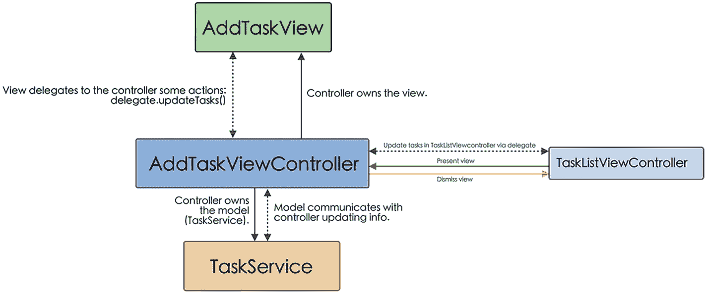

此框图展示了添加任务视图、添加任务视图控制器以及任务服务之间的通信。位于中间的添加任务视图控制器通过委托进一步更新任务列表视图控制器中的任务。

**图 2-11** 添加任务屏幕组件通信架构

### `AddTaskViewController`

最后一个屏幕由`AddTaskViewController`控制，它将允许我们向列表中新增任务。该控制器持有对视图（`AddTaskView`）和模型的引用。用户在视图中输入的信息会通过委托模式（如前面案例所示）传递给控制器（清单 2-25）。

```
class AddTaskViewController: UIViewController {
private var taskService: TaskServiceProtocol!
init(tasksListModel: TasksListModel,
taskService: TaskServiceProtocol) {
super.init(nibName: nil, bundle: nil)
self.tasksListModel = tasksListModel
self.taskService = taskService
}
...
private func setupAddTaskView() {
addTaskView.delegate = self
self.view = addTaskView
}
}
extension AddTaskViewController: AddTaskViewDelegate {
func addTask(_ task: TaskModel) {
taskService.saveTask(task, in: tasksListModel)
dismiss(animated: true)
}
}
清单 2-25
AddTaskViewController 初始化
```

#### `AddTaskView`

此视图的结构与我们创建任务列表时使用的结构类似，包含一个`UITextField`元素、一个`IconSelectorView`元素和一个`UIButton`元素。

此视图会通过协议将任务创建委托给控制器，同时实现与图标选择器关联的方法（清单 2-26）。

```
protocol AddTaskViewDelegate: AnyObject {
func addTask(_ task: TaskModel)
}
class AddTaskView: UIView {
...
weak var delegate: AddTaskViewDelegate?
...
}
private extension AddTaskView {
...
@objc func addTaskAction() {
guard titleTextfield.hasText else { return }
taskModel.title = titleTextfield.text
taskModel.icon = taskModel.icon ?? "checkmark.seal.fill"
taskModel.done = false
taskModel.id = ProcessInfo().globallyUniqueString
taskModel.createdAt = Date()
delegate?.addTask(taskModel)
}
func configureCollectionView() {
...
iconSelectorView.delegate = self
...
}
}
extension AddTaskView: IconSelectorViewDelegate {
func selectedIcon(_ icon: String) {
taskModel.icon = icon
}
}
清单 2-26
AddTaskViewDelegate 和 AddTaskView 实现
```

### 测试

在第一章 1 中，我们了解到优秀架构的重要特性之一是其可测试性。现在，我们将为使用 MVC 架构开发的应用程序编写几个测试。

为此，我们将使用苹果的框架`XCTest`来编写测试。作为测试开发的入门，并为后续章节做准备，我们将测试主要功能，例如与数据库协作的服务、用户交互以及主要的导航流程。

#### 测试应该是什么样的？

此外，在编写测试时，我们必须考虑一系列标准，这些标准由首字母缩写词 FIRST 概括：

- **快速（Fast）**：测试必须快速执行。
- **独立（Independent）**：测试之间必须相互独立，不传递信息，以便它们可以按任何顺序执行。
- **可重复（Repeatable）**：测试的结果必须在每次执行时以及在任意环境中都相同。
- **自验证（Self-validating）**：测试必须是自验证的，也就是说，测试通过或失败不能依赖于任何外部干预（例如需要检查日志）。
- **及时（Timely）**：测试应该在编写生产代码之前编写。这就是所谓的*测试驱动开发*。


