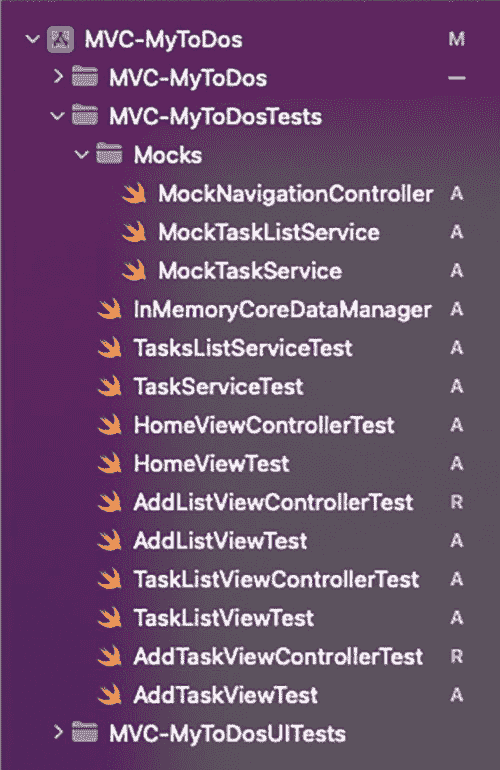
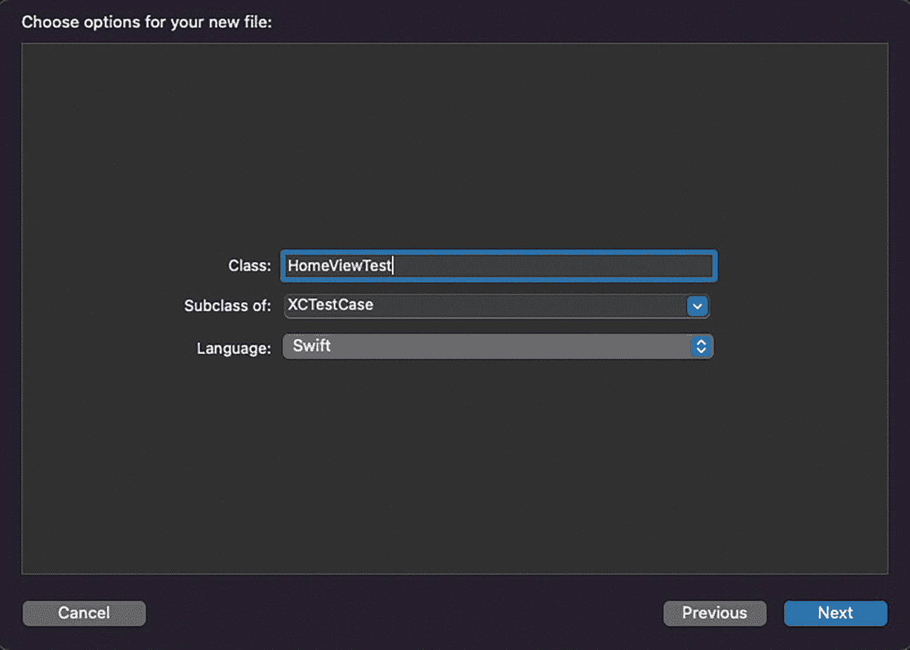
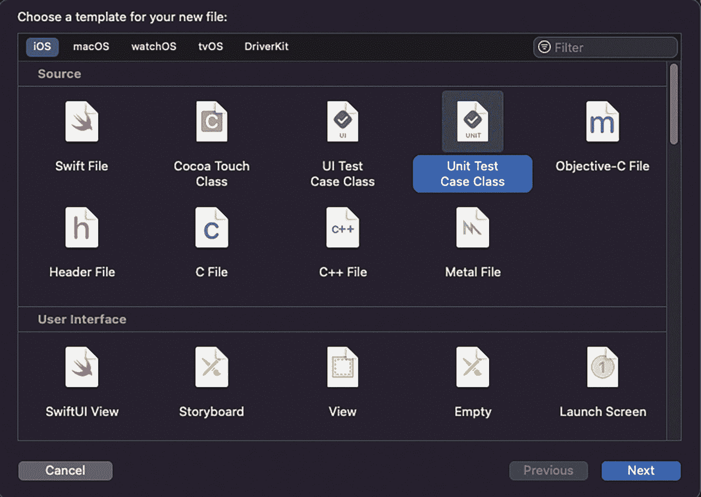

# 创建第一个测试

在第 1 章中，我们了解了如何创建应用程序项目，以及在创建项目时如何激活“包含测试”选项。通过这种方式，Xcode 会创建我们的测试目标，这样我们只需添加测试即可。

在最初创建项目时，对于 MVC 架构，项目名称为 *MVC-MyToDos*，我们会看到创建了两个文件夹：*MVC-MyToDosTests* 和 *MVC-MyToDosUITests*，虽然我们只会关注第一个文件夹，它包含了我们之前提到的单元测试（图 2-12）。



**图 2-12** MVC-MyToDos 测试文件

现在，让我们创建第一个测试。假设我们首先创建了主页视图 `HomeView.swift`。我们选择 *MVC-MyToDosTests* 文件夹并添加一个新文件。在不同的文件选项中，我们选择“*Unit Test Case Class*”并将其命名为 `HomeViewTest`（图 2-13 和图 2-14）。



**图 2-14** 创建 `HomeViewTest` 类



**图 2-13** 选择“Unit Test Case Class”模板

执行此操作后，Xcode 会创建一个包含一些初始代码的文件（代码清单 2-27）。

```
import XCTest
class HomeViewTestd: XCTestCase {
override func setUpWithError() throws {}
override func tearDownWithError() throws {}
func testExample() throws {}
func testPerformanceExample() throws {}
}
代码清单 2-27
HomeViewTest 初始代码
```

在 `setUpWithError()` 函数中，我们将放置每次测试之前执行的代码；在 `tearDownWithError()` 中，放置每次测试之后应执行的代码。

另外两个函数是示例，它们告诉我们，我们编写的所有测试（函数）都必须以单词“*test*”开头。

一旦我们了解了这一点，我们就来编写第一个测试（代码清单 2-28）。

```
import XCTest
@testable import MVC_MyToDos
class HomeViewTest: XCTestCase {
var sut: HomeView!
override func setUpWithError() throws {
sut = HomeView()
}
func testViewLoaded_whenViewIsInstantiated_shouldBeComponents() {
XCTAssertNotNil(sut.pageTitle)
XCTAssertNotNil(sut.addListButton)
XCTAssertNotNil(sut.tableView)
XCTAssertNotNil(sut.emptyState)
}
}
代码清单 2-28
检查 HomeView 组件的测试代码
```

为了测试 `HomeView`，我们首先必须使其对我们的 `MVC_MyTodosTests` 目标可见。为此，我们使用以下命令导入项目：

```
@testable import MVC_MyToDos
```

下一步是创建一个 `HomeView` 类型的变量：

```
var sut: HomeView!
```

参数名 `sut` 来源于“*system under test*”（被测系统）。通过它，我们指明正在测试哪个类。

最后，我们创建了测试：

```
testViewLoaded_whenViewIsInstantiated_shouldBeComponents
```

为了让 Apple 框架检测到这是一个要运行的测试，函数必须以单词“*test*”开头。此外，一个好的实践是在函数名称中定义你想要测试的内容（`ViewLoaded`）、测试条件（`whenViewIsInstantiated`）以及预期的结果（`shouldBeComponents`）。

在创建 `HomeView` 的不同组件时，我们将它们定义为 `private(set)`，这允许我们从类外部访问它们以进行读取，但不能修改它们（图 2-15）。


**图 2-15** 第一个测试通过

在这个例子中，我们使用了一种 `XCAssert` 函数，`XCTAssertNotNil`；它的作用是验证括号内的内容是否不为 nil（根据我们想要测试的内容，有不同的函数：`XCAssertEqual`、`XCAssertTrue` 等）。

## 辅助类

为了便于测试我们的代码，有必要创建一些辅助类。

第一个类是 `InMemoryCoreDataManager`，它具有与应用程序的 `CoreDataManager` 文件相同的功能，但数据库在内存中生成，并且在测试完成后不会持久化（代码清单 2-29）。

```
class InMemoryCoreDataManager: CoreDataManager {
override init() {
super.init()
let persistentStoreDescription = NSPersistentStoreDescription()
persistentStoreDescription.type = NSInMemoryStoreType
let container = NSPersistentContainer(name: "ToDoList")
container.persistentStoreDescriptions = [persistentStoreDescription]
container.loadPersistentStores { _, error in
if let error = error as NSError? {
fatalError("Unresolved error \(error), \(error.userInfo)")
}
}
persistentContainer = container
}
}
代码清单 2-29
InMemoryCoreDataManager 辅助类
```

第二个文件，`MockNavigationController`，允许我们识别应用程序中何时进行了导航调用（push 和 pop）。这是通过对 `UINavigationController` 类进行 *mock* 来实现的，在其中引入了一些变量，使我们能够知道是否发生了 push 调用或 pop 调用（代码清单 2-30）。

```
class MockNavigationController: UINavigationController {
var vcIsPushed: Bool = false
var vcIsPopped: Bool = false
override func pushViewController(_ viewController: UIViewController,
animated: Bool) {
super.pushViewController(viewController,
animated: animated)
vcIsPushed = true
}
override func popViewController(animated: Bool) -> UIViewController? {
vcIsPopped = true
return viewControllers.first
}
}
代码清单 2-30
用于测试应用内导航的 MockNavigationController
```

## MVC-MyToDos 测试

考虑到所有这些，我们继续开发我们的测试和代码。我们为每个服务（数据库访问）准备了一个测试文件，每个屏幕有两个文件（每个控制器和每个视图各一个），以及另外两个在执行测试时提供帮助的文件。

我们不会在此页面中展示 *MVC-MyToDos* 项目执行的所有测试，因为您可以在其仓库中找到它们。但是，我们将展示那些可能更相关的测试。

**备注**

从教学的角度来看，在处理应用程序的不同架构时，我们首先会看到代码是如何构建的，然后从其测试的难易程度来看，建议我们在作为开发人员的日常工作中使用 TDD（测试驱动开发）方法。这种方法基于首先编写测试（通常是单元测试），然后编写使测试通过的代码，最后重构该代码。^(⁴)


