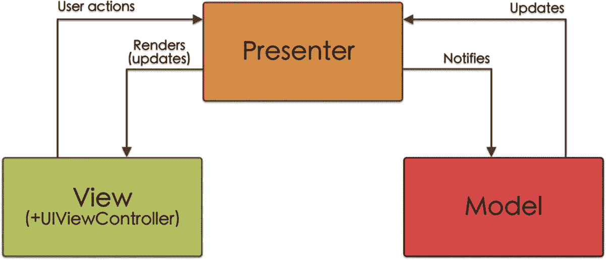

# 3. MVP：模型-视图-展示器

## 什么是 MVP？

### 一点历史

模型-视图-展示器模式源于我们在前一章中看到的模型-视图-控制器模式。它是在 20 世纪 90 年代早期，由软件公司 Taligent（由苹果、IBM 和惠普共同拥有）开发的。^(⁵)

### 它是如何工作的

MVP 模式由三个组件组成：模型、视图和展示器，其中展示器充当模型和视图（`UIViewController` + `View`）之间的中介，连接方式如图 3-1 所示。



*一个由展示器、视图和模型组成的示意图。它们通过用户操作、更新和通知进行连接。*

**图 3-1** – 模型-视图-展示器示意图

### MVP 中的组件

现在我们更详细地看一下 MVP 模式中这三个组件的特性。

##### 模型

与 MVC 模式相同，模型是负责业务逻辑以及存储、操作和访问应用程序数据的组件（或多个组件）：

-   它包含与数据持久化相关的类。
-   它包含控制应用程序通信的类。
-   它负责将从外部接收的信息转换为模型对象。
-   它包含扩展、常量……
-   在 MVP 中，模型层只能与展示器层通信（即，模型不知道视图的存在）。

因此，例如，当用户与视图交互时，这种交互通过展示器传递给模型。同样，如果模型被更新并且需要更新视图，那么展示器将负责更新它。

#### 视图

在 MVP 模型中，视图层同时包含视图（`UIView`）和控制器（`UIViewController`）组件，这与 MVC 模式不同，在 MVC 中我们将它们放在不同的层。

此外，在 MVP 模式中，视图和控制器存储的逻辑都比 MVC 模型少得多，这使得它们更轻量。

现在，控制器仅具有协调/路由功能，负责处理屏幕之间的导航，并在必要时通过委托模式传递信息。

在 MVP 中，控制器负责实例化视图并将其传递给展示器（列表 3-1）。

```
class ExampleController: UIViewController {
    private var exampleView = ExampleView()
    ...
    override func loadView() {
        super.loadView()
        setupExampleView()
    }

    private func setupExampleView() {
        let presenter = ExamplePresenter(exampleView: ExampleView)
        exampleView.presenter = presenter
        exampleView.setupView()
        self.view = exampleView
    }
}
```

*列表 3-1* – 展示器和视图实例化；将视图传递给展示器

