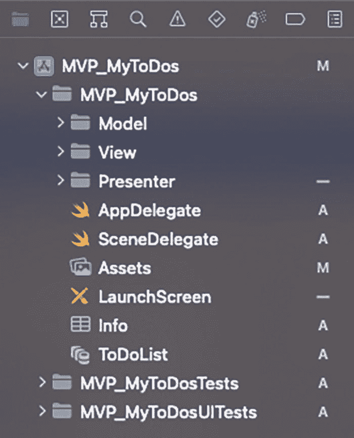
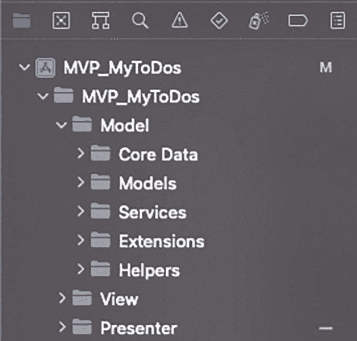
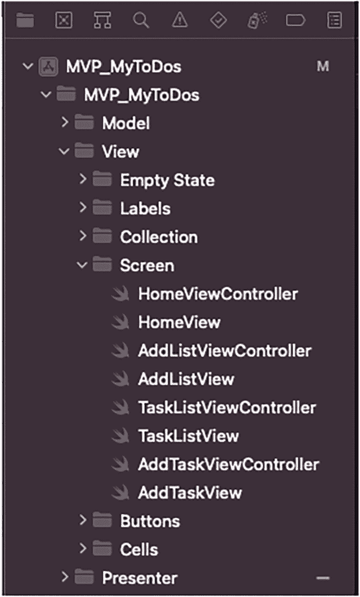
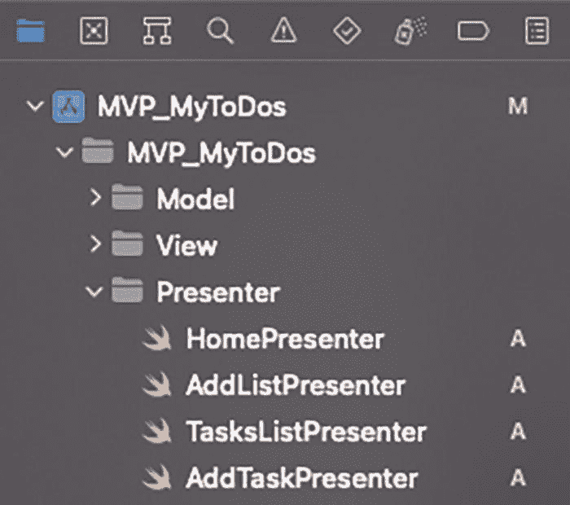
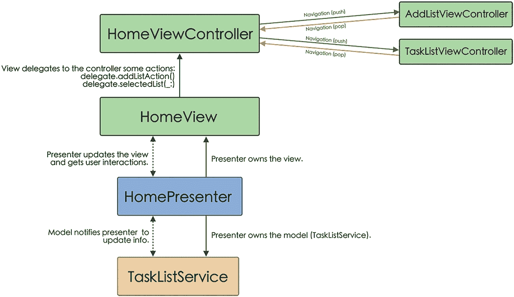
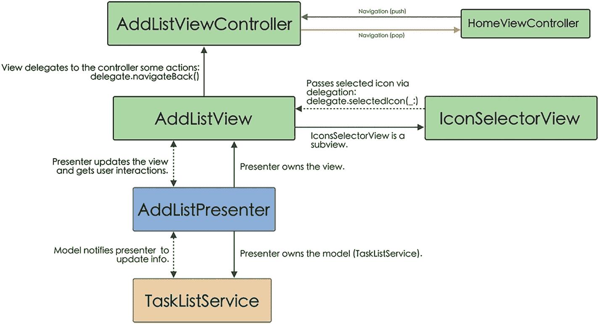
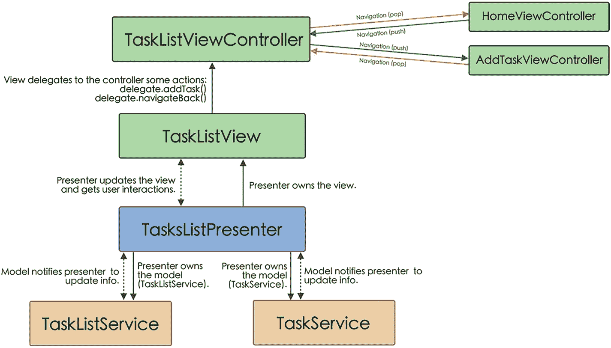
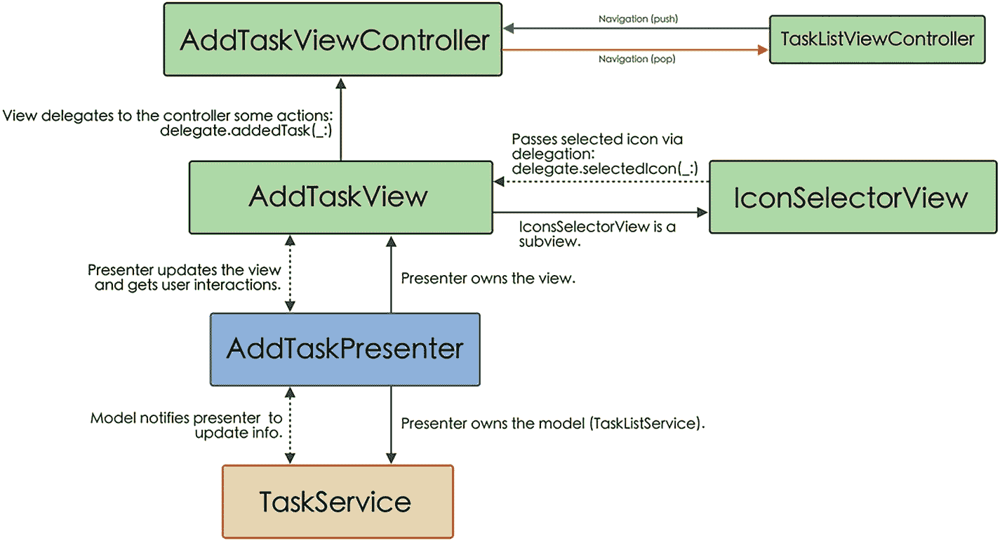

# 展示器

展示器负责接收视图中发生的事件并将其传递给模型。另一方面，展示器也负责在数据更改时更新视图。

为了进一步解耦，我们不会直接将视图传递给展示器，而是创建一个包含展示器用于更新视图的方法的协议（列表 3-2）。

```
protocol ExampleViewDelegate: AnyObject {
    func updateView()
}

class ExamplePresenter {
    private weak var exampleView: ExampleViewDelegate?

    init(exampleView: ExampleViewDelegate? = nil) {
        self.exampleView = exampleView
    }
    ...
}
```

*列表 3-2* – 在 `init` 方法中将视图传递给展示器

### MVP 的优点和缺点

MVP 模型比 MVC 模型稍微复杂一些，因为引入了一个新元素——展示器，因此需要稍多一点的开发经验。

下面，您可以看到这种架构最重要的优点和缺点。


#### 优势

MVP 架构的主要优势如下：

-   尽管它比 MVC 稍微复杂一些，但它源于 MVC，因此我们可以在短时间内适应它的工作方式。
-   与 MVC 模式相比，它呈现出更好的职责分离。
-   业务逻辑可以更好地进行测试。

#### 劣势

主要劣势如下：

-   由于比 MVC 更复杂，通常不建议在小型和简单的应用程序中使用。
-   尽管我们进一步模块化了架构，但仍然存在一些问题，例如 Controller 仍然处理屏幕间的导航。这可以通过引入 Router 或 Coordinator 来处理该任务来解决。
-   就像在 MVC 中 Controller 可能变得臃肿一样，在 MVP 中，Presenter 也可能遇到同样的问题。

## MVP 应用

了解了 MVP 架构的特性后，我们将把它应用到应用程序的开发中。

> **注意**  
> 整个项目可以从本书的代码仓库下载。在解释如何在项目中实现 MVP 架构时，我们将仅展示代码中最相关的部分。

### MVP 层

为了遵循所应用的架构模式（Model–View–Presenter）的逻辑，我们将创建一个模拟其各层的文件夹结构（图 3-2）。

  
**图 3-2** MVP 项目文件夹结构

#### Model

与 MVC 架构相同，此文件夹包含与业务逻辑、数据访问及其操作相关的所有内容。它包含与 MVC 案例中相同的文件（图 3-3）。

  
**图 3-3** 模型层文件

然而，在 MVC 架构中，模型产生的变化会通知给 Controller（使用观察者模式），而在 MVP 架构中，这些变化会通知给 Presenter（即 Presenter 必须订阅这些变化）。

与 MVC 架构中我们在 Controller 的`viewDidLoad`方法中添加观察者不同，在 MVP 架构中，我们将在 Presenter 的`init`方法中添加它（列表 3-3）。

```init
init() {
    NotificationCenter.default.addObserver(self,
        selector: #selector(contextObjectsDidChange),
        name: NSNotification.Name.NSManagedObjectContextObjectsDidChange,
        object: CoreDataManager.shared.mainContext)
}
@objc func contextObjectsDidChange() {
    updateView()
}
```
**列表 3-3** 在 Presenter 初始化时设置观察者

##### Core Data

在此文件夹中，我们将放置 `CoreDataManager.swift` 文件（我们在第 1 章中创建），以及由 Xcode 为数据库实体自动创建的四个文件。

##### Models

如第 2 章所述，这里存放的是我们可以从数据库实体转换而来的模型。此外，我们将创建一个模型必须遵守的协议，以便在模型和实体之间相互转换。

##### Services

这里我们将放置允许我们向数据库发送信息（创建、更新或删除）或从数据库检索信息并将其转换为模型的类。

##### Extensions

在这种情况下，我们创建了一个 `UIColor` 扩展，以便能够轻松访问为此应用程序专门创建的颜色，以及一个 `NSManagedObject` 类的扩展，这将防止我们在进行测试部分时出现上下文冲突。

##### Constants

它们包含我们将在应用程序中使用的常量参数。

#### View

在 View 文件夹中，我们不仅会有 View 文件及其构成的组件（如同在 MVC 中），还会有 Controller 文件（`UIViewController`的子类），如图 3-4 所示。

  
**图 3-4** 视图层文件

请记住，在 MVP 中，Controllers 通常只具有协调/路由功能（用于屏幕间导航），并且在某些情况下传递信息（例如，通过委托模式）。

#### Presenter

此文件夹仅包含 Presenters，正如我们所见，它们连接 Model 和 View（图 3-5）。

  
**图 3-5** Presenter 层文件

### MyToDos 应用程序屏幕

正如我们刚才提到的，在 MVP 架构中，与 MVC 不同，Presenter 负责业务逻辑（将导航任务留给 Controller）。

接下来，我们将针对我们应用程序的每个不同屏幕，了解如何将不同层连接起来：Model、View（+`UIViewController`）和 Presenter。

#### AppDelegate 和 SceneDelegate

正如我们在第 2 章中看到的，`AppDelegate` 和 `SceneDelegate` 负责管理应用程序的生命周期以及屏幕上显示什么及如何显示。

在我们的案例中，我们只会修改 `SceneDelegate`，它将负责创建一个新的 `UIWindow`，配置应用程序的根视图控制器，并最终使创建的 `UIWindow` 成为关键窗口。

与我们研究 MVC 时不同（我们将 `HomeViewController` 的实例传递给 `UINavigationController` 组件，该组件在初始化时需要将依赖项传递给 `TasksListService` 和 `TaskService` 服务），现在 `HomeViewController` 不需要它们，因为稍后我们将看到，这些依赖项将由 `HomePresenter` 组件持有。

```
func scene(_ scene: UIScene, willConnectTo session: UISceneSession, options connectionOptions: UIScene.ConnectionOptions) {
    if let windowScene = scene as? UIWindowScene {
        let window = UIWindow(windowScene: windowScene)
        let navigationController = UINavigationController(rootViewController: HomeViewController())
        navigationController.navigationBar.isHidden = true
        navigationController.interactivePopGestureRecognizer?.isEnabled = false
        window.backgroundColor = .white
        window.rootViewController = navigationController
        self.window = window
        window.makeKeyAndVisible()
    }
}
```

#### 首页屏幕

在首页屏幕上，主要组件是 Presenter，它负责将信息传递给 Model 并订阅其变化通知。此外，它还负责接收 View 中的用户交互，并使用从 Model 接收到的信息更新 View。

View 与 Controller 是分离的，其某些操作（例如导航到另一个屏幕）委托给 Controller（图 3-6）。

  
**图 3-6** 首页屏幕组件通信示意图


### HomeController

关于 MVC 架构，在 MVP 架构中，`HomeController`已经失去了与 Model 层的关联。现在，它一方面负责实例化`HomeView`并将其传递给`HomePresenter`（正如我们所看到的，我们将以协议形式传递该 Presenter，并附带其必须使用的方法）（代码清单 3-4）。

```swift
class HomeViewController: UIViewController {
    private var homeView = HomeView()
    ...
    override func loadView() {
        super.loadView()
        setupHomeView()
    }

    private func setupHomeView() {
        let presenter = HomePresenter(homeView: homeView, tasksListService: TasksListService())
        homeView.delegate = self
        homeView.presenter = presenter
        homeView.setupView()
        self.view = homeView
    }
}
代码清单 3-4
在 HomeViewController 中实例化 HomePresenter
```

另一方面，`HomeViewController`还负责处理屏幕间的路由跳转（在`HomeView`中，用户可以选择访问列表或创建新列表，这些导航操作会委托给`HomeViewController`），如代码清单 3-5 所示。

```swift
extension HomeViewController: HomeViewControllerDelegate {
    func addList() {
        navigationController?.pushViewController(AddListViewController(), animated: true)
    }

    func selectedList(_ list: TasksListModel) {
        let taskViewController = TaskListViewController(tasksListModel: list)
        navigationController?.pushViewController(taskViewController, animated: true)
    }
}
代码清单 3-5
实现 HomeViewControllerDelegate 的方法
```

##### HomeView

现在，`HomeView`从`HomePresenter`接收需要显示的信息。这一点体现在填充已创建任务列表的表格，或是实现`HomeViewDelegate`时（代码清单 3-6）。

```swift
extension HomeView: UITableViewDataSource {
    ...
    func tableView(_ tableView: UITableView, numberOfRowsInSection section: Int) -> Int {
        return presenter.numberOfTaskLists
    }

    func tableView(_ tableView: UITableView, cellForRowAt indexPath: IndexPath) -> UITableViewCell {
        let cell = tableView.dequeueReusableCell(withIdentifier: ToDoListCell.reuseId, for: indexPath) as! ToDoListCell
        cell.setCellParametersForList(presenter.listAtIndex(indexPath.row))
        return cell
    }

    func tableView(_ tableView: UITableView, commit editingStyle: UITableViewCell.EditingStyle, forRowAt indexPath: IndexPath) {
        if editingStyle == .delete {
            presenter.removeListAtIndex(indexPath.row)
            tableView.deleteRows(at: [indexPath], with: .automatic)
        }
    }
}

extension HomeView: HomeViewDelegate {
    func reloadData() {
        tableView.reloadData()
        emptyState.isHidden = presenter.numberOfTaskLists > 0
    }
}
代码清单 3-6
在 HomeView 中设置任务列表表格
```

另一方面，它将需要在应用程序内进行导航的操作（例如选择并访问某个任务列表，或创建新列表）委托给 Controller 处理（代码清单 3-7）。

```swift
extension HomeView: UITableViewDelegate {
    ...
    func tableView(_ tableView: UITableView, didSelectRowAt indexPath: IndexPath) {
        delegate?.selectedList(presenter.listAtIndex(indexPath.row))
    }
}

private extension HomeView {
    ...
    @objc func addListAction() {
        delegate?.addList()
    }
    ...
}
代码清单 3-7
HomeView 将导航方法委托给 HomeViewController
```

### HomePresenter

Presenter 负责充当 View 和 Model 之间的中介。因此，在初始化 `HomePresenter` 时，我们传递了对 View（以协议形式存在的 `HomeView`）和 Model（`TaskListService`）的引用。通过 `TaskListService` 访问 Model，使我们既能获取想要展示的信息（任务列表），也能删除选中的列表。

为了知晓数据库何时发生变化，从而更新视图，我们在 `HomePresenter` 的初始化中还引入了一个观察者，如代码清单 3-8 所示。

```swift
class HomePresenter {
    private weak var homeView: HomeViewDelegate?
    private var tasksListService: TasksListService!
    private var lists: [TasksListModel] = [TasksListModel]()

    init(homeView: HomeViewDelegate? = nil,
         tasksListService: TasksListService) {
        self.homeView = homeView
        self.tasksListService = tasksListService
        NotificationCenter.default.addObserver(self,
                                               selector: #selector(contextObjectsDidChange),
                                               name: NSNotification.Name.NSManagedObjectContextObjectsDidChange,
                                               object: CoreDataManager.shared.mainContext)
    }

    @objc func contextObjectsDidChange() {
        fetchTasksLists()
    }

    func fetchTasksLists() {
        lists = tasksListService.fetchLists()
        homeView?.reloadData()
    }

    var numberOfTaskLists: Int {
        return lists.count
    }

    func listAtIndex(_ index: Int) -> TasksListModel {
        return lists[index]
    }
    ...
}
代码清单 3-8
HomePresenter 初始化
```

当观察者收到数据库已更改的通知时，会触发 `contextObjectsDidChange` 事件（该事件会调用 `fetchTasksLists` 事件），从而更新 `HomePresenter` 中有关待显示任务列表的信息，随后调用 `HomeView` 的 `reloadData` 方法。

如果用户想要删除一个任务列表，`HomeView` 会将此操作传递给 `HomePresenter`，而 `HomePresenter` 将负责将此操作传达给 Model（代码清单 3-9）。

```swift
class HomePresenter {
    ...
    func removeListAtIndex(_ index: Int) {
        let list = listAtIndex(index)
        tasksListService.deleteList(list)
        lists.remove(at: index)
    }
}
代码清单 3-9
HomePresenter 与 Model 通信以删除列表
```


好的，作为一名高级文档工程师和翻译员，我将严格遵循您提供的注意事项和示例格式，将给定的英文文本翻译成中文。


### 添加列表屏幕

此屏幕负责添加任务列表及其组件之间的通信。不同组件之间的连接如图 3-7 所示。



添加列表屏幕组件的流程图由 `AddListViewController`、`AddListView`、`AddListPresenter` 和 `TaskListService` 组成。

**图 3-7** 添加列表屏幕组件通信示意图

### AddListViewController

与我们之前在 `HomeViewController` 中所做的方式相同，`AddListViewController` 类负责初始化 Presenter 并将其传递给视图（列表 3-10）。

```swift
private func setupAddListView() {
    let presenter = AddListPresenter(addListView: addListView, tasksListService: TasksListService())
    addListView.delegate = self
    addListView.presenter = presenter
    self.view = addListView
}
```

**列表 3-10** 在 `AddListViewController` 中实例化 `AddListPresenter`

一旦列表创建完成，或者用户通过后退按钮操作，它就会导航回主屏幕（`AddListView` 已委托此操作，如列表 3-11 所示）。

```swift
extension AddListViewController: BackButtonDelegate {
    func navigateBack() {
        backToHome()
    }
}
```

**列表 3-11** 在 `AddListViewController` 中实现 `BackButtonDelegate`

#### AddListView

在 `AddListView` 中，用户可以通过选择图标和添加标题来创建任务列表。所有这些信息都通过视图维护的对 Presenter 的引用传递给 `AddListPresenter`（列表 3-12）。

```swift
extension AddListView {
    @objc func addListAction() {
        guard titleTextfield.hasText else { return }
        presenter.addListWithTitle(titleTextfield.text!)
    }
}

extension AddListView: IconSelectorViewDelegate {
    func selectedIcon(_ icon: String) {
        presenter.setListIcon(icon)
    }
}
```

**列表 3-12** Presenter 从视图获取信息

用户也可以在不创建任何任务列表的情况下退出此屏幕。只需选择导航后退按钮（`HomePresenter` 可以调用此方法，因为在实例化它时，我们将其传递给了它必须遵守的 `AddListViewDelegate` 协议）。在这种情况下，视图委托给控制器来实现此操作（列表 3-13）。

```swift
extension AddListView: AddListViewDelegate {
    func backToHome() {
        delegate?.navigateBack()
    }
}
```

**列表 3-13** `AddListView` 实现 `AddListViewDelegate` 协议

### AddListPresenter

`AddListPresenter` 负责管理此屏幕上的列表创建。在其初始化过程中，我们将同时传递 `AddListView`（作为协议）和 `TaskListService`（后者允许其连接到模型）。

此外，我们将初始化一个列表，该列表将使用来自视图的标题和图标信息进行填充（列表 3-14）。

```swift
class AddListPresenter {
    private weak var addListView: AddListViewDelegate?
    private var tasksListService: TasksListService!
    private var list: TasksListModel!

    init(addListView: AddListViewDelegate? = nil,
         tasksListService: TasksListService) {
        self.addListView = addListView
        self.tasksListService = tasksListService
        self.list = TasksListModel(id: ProcessInfo().globallyUniqueString,
                                   icon: "checkmark.seal.fill",
                                   createdAt: Date())
    }

    func setListIcon(_ icon: String) {
        list.icon = icon
    }

    func addListWithTitle(_ title: String) {
        list.title = title
        tasksListService.saveTasksList(list)
        addListView?.backToHome()
    }
}
```

**列表 3-14** `AddListPresenter` 代码

正如您在 `addListWithTitle` 方法末尾所见，一旦创建列表的命令发送给服务，Presenter 就会告诉视图执行 `backToHome` 方法以返回到主屏幕（正如我们刚才看到的，它是通过委托完成的）。

### 任务列表屏幕

此屏幕负责显示构成列表的任务、标记任务为已完成、删除任务以及添加新任务。其组件之间的通信如图 3-8 所示。



任务列表屏幕的流程图由 `TaskListViewController`、`TaskListView`、`TaskListPresenter`、`TaskListService` 和 `TaskService` 组成。

**图 3-8** 任务列表屏幕组件通信示意图

## TaskListViewController

与 MVC 架构不同（在 MVC 中 `TaskListViewController` 具有与模型通信的功能），这里它只负责实例化 `TaskListPresenter`（列表 3-15）。

```swift
private func setupTaskListView() {
    let presenter = TasksListPresenter(taskListView: taskListView,
                                       tasksListModel: tasksListModel,
                                       taskService: TaskService(),
                                       tasksListService: TasksListService())
    taskListView.delegate = self
    taskListView.presenter = presenter
    taskListView.setupView()
    self.view = taskListView
}
```

**列表 3-15** 在 `TaskListViewController` 中实例化 `TaskListPresenter`

为了管理导航，无论是导航到添加任务屏幕（`AddTaskViewController`）还是返回主屏幕，我们将实现与 `TaskListViewControllerDelegate` 和 `BackButtonDelegate` 协议相关联的方法（列表 3-16）。

```swift
extension TaskListViewController: TaskListViewControllerDelegate {
    func addTask() {
        let addTaskViewController = AddTaskViewController(tasksListModel: tasksListModel)
        addTaskViewController.modalPresentationStyle = .pageSheet
        present(addTaskViewController, animated: true)
    }
}

extension TaskListViewController: BackButtonDelegate {
    func navigateBack() {
        navigationController?.popViewController(animated: true)
    }
}
```

**列表 3-16** 实现 `TaskListViewControllerDelegate` 和 `BackButtonDelegate` 方法

### TaskListView

在 `TaskListView` 中，与我们之前在 `HomeView` 中所做的类似，我们有一个 `UITableView` 元素，它显示从 `TaskListPresenter` 获取的信息（列表 3-17）。

```swift
extension TaskListView: UITableViewDelegate, UITableViewDataSource {
    ...
    func tableView(_ tableView: UITableView, numberOfRowsInSection section: Int) -> Int {
        return presenter.numberOfTasks
    }

    func tableView(_ tableView: UITableView, cellForRowAt indexPath: IndexPath) -> UITableViewCell {
        let cell = tableView.dequeueReusableCell(withIdentifier: TaskCell.reuseId, for: indexPath) as! TaskCell
        cell.setParametersForTask(presenter.taskAtIndex(indexPath.row))
        cell.delegate = self
        return cell
    }

    func tableView(_ tableView: UITableView, commit editingStyle: UITableViewCell.EditingStyle, forRowAt indexPath: IndexPath) {
        if editingStyle == .delete {
            presenter.removeTaskAtIndex(indexPath.row)
            tableView.deleteRows(at: [indexPath], with: .automatic)
        }
    }
}
```

**列表 3-17** 在 `TaskListView` 中实现 `UITableViewDelegate` 和 `UITableViewDatasource`

另一方面，您必须实现 `TaskListViewDelegate` 协议的方法，这将允许 `TaskListPresenter` 更新视图（列表 3-18）。

```swift
extension TaskListView: TaskListViewDelegate {
    func setPageTitle(_ title: String) {
        pageTitle.text = title
    }

    func reloadData() {
        tableView.reloadData()
        emptyState.isHidden = presenter.numberOfTasks > 0
    }
}
```

**列表 3-18** 在 `TaskListView` 中实现 `TaskListViewDelegate` 方法

最后，我们还需要实现与 `TaskCell` 组件相关联的 `TaskCellDelegate` 协议的方法，该方法允许我们通过 `TaskListPresenter` 修改数据库中任务的状态（列表 3-19）。

```swift
extension TaskListView: TaskCellDelegate {
    func updateTask(_ task: TaskModel) {
        presenter.updateTask(task)
    }
}
```

**列表 3-19** 在 `TaskListView` 中实现 `TaskCellDelegate` 方法


### `TaskListPresenter`

`TaskListPresenter`是四个组件中最复杂的，因为它需要显示列表中的任务、管理任务的删除或更新，并观察新任务的添加。

因此，在该类的初始化中，我们不仅必须传递视图，还必须传递包含待显示任务的`TaskListModel`对象，以及`TaskListService`和`TaskService`服务实例，这将使我们能够与模型交互。

我们将使用`TaskListService`从数据库中检索当前正在处理的任务列表，并使用`TaskService`来更新或删除指定任务。

此外，我们需要为数据库的更改添加一个观察者（列表 3-20）。

```
class TasksListPresenter {
...
init(taskListView: TaskListViewDelegate? = nil,
tasksListModel: TasksListModel,
taskService: TaskService,
tasksListService: TasksListService) {
self.taskListView = taskListView
self.tasksListModel = tasksListModel
self.taskService = taskService
self.tasksListService = tasksListService
NotificationCenter.default.addObserver(self,
selector: #selector(contextObjectsDidChange),
name: NSNotification.Name.NSManagedObjectContextObjectsDidChange,
object: CoreDataManager.shared.mainContext)
}
@objc func contextObjectsDidChange() {
fetchTasks()
}
func fetchTasks() {
guard let list = tasksListService.fetchListWithId(tasksListModel.id) else { return }
tasksListModel = list
tasks = tasksListModel.tasks.sorted(by: { $0.createdAt.compare($1.createdAt) == .orderedDescending })
taskListView?.reloadData()
}
...
}
Listing 3-20
TaskListPresenter 初始化代码
```

在列表 3-21 中，您还可以看到`TaskListPresenter`与模型交互的代码。在本例中，`TaskListView`会将删除任务的操作传递给`TaskListPresenter`，由`TaskListPresenter`负责将其传达给模型。

```
extension TasksListPresenter {
func updateTask(_ task: TaskModel) {
taskService.updateTask(task)
}
func removeTaskAtIndex(_ index: Int) {
let task = taskAtIndex(index)
taskService.deleteTask(task)
tasks.remove(at: index)
}
}
Listing 3-21
TaskListPresenter 与 TaskService 交互的代码
```

### 添加任务屏幕

此屏幕负责向指定列表添加任务，其组件之间的通信如图 3-9 所示。



添加任务屏幕组件的流程图包括：添加任务视图控制器、添加任务视图、添加任务演示器和任务服务。

**图 3-9**

添加任务屏幕组件通信示意图

### `AddTaskViewController`

与之前的控制器类似，在`AddTaskViewController`中会初始化`AddTaskPresenter`，并向其传递视图、要添加新任务的任务列表对象以及访问模型的`TaskService`服务（列表 3-22）。

```
private func setupAddTaskView() {
let presenter = AddTaskPresenter(addTaskView: addTaskView,
tasksListModel: tasksListModel,
taskService: TaskService())
addTaskView.delegate = self
addTaskView.presenter = presenter
self.view = addTaskView
}
Listing 3-22
在 AddTaskViewController 中实例化 AddTaskPresenter
```

从导航的角度来看，此控制器仅负责在任务添加完成后关闭视图（因为此屏幕以模态方式呈现），如列表 3-23 所示。

```
extension AddTaskViewController: AddedTaskViewControllerDelegate {
func addedTask() {
dismiss(animated: true)
}
}
Listing 3-23
在 AddTaskViewController 中实现的 AddedTaskViewControllerDelegate
```

#### `AddTaskView`

在`AddTaskView`中，用户可以通过选择图标和添加标题来创建任务。所有这些信息都通过视图维护的对`AddTaskPresenter`的引用传递给`AddTaskPresenter`（列表 3-24）。

```
private extension AddTaskView {
@objc func addTaskAction() {
guard titleTextfield.hasText else { return }
presenter.addTaskWithTitle(titleTextfield.text!)
}
}
extension AddTaskView: IconSelectorViewDelegate {
func selectedIcon(_ icon: String) {
presenter.setTaskIcon(icon)
}
}
Listing 3-24
Presenter 从视图获取信息
```

另一方面，一旦用户执行了添加任务的操作，`AddTaskPresenter`将调用`addedTask`方法（定义在`AddTaskViewDelegate`协议中，`AddTaskView`应该实现此方法）（列表 3-25）。

```
extension AddTaskView: AddTaskViewDelegate {
func addedTask() {
delegate?.addedTask()
}
}
Listing 3-25
在 AddTaskView 中实现的 AddTaskViewDelegate
```

相应地，与`addedTask`方法相关的操作被委托给`AddTaskViewController`，正如我们刚才所见，它将移除屏幕。

### `AddTaskPresenter`

`AddTaskPresenter`负责创建任务并将其添加到列表中。在其初始化中，我们将传递`AddTaskView`（作为协议）、包含将添加新任务列表的`TaskListModel`对象以及`TaskService`，`TaskService`将是与模型层的连接，并允许我们将任务添加到数据库中。

此外，与添加新任务列表时的操作类似，我们将初始化一个任务，稍后只需用标题和所选图标完成它（列表 3-26）。

```
class AddTaskPresenter {
private var addTaskView: AddTaskViewDelegate?
private var tasksListModel: TasksListModel!
private var taskService: TaskService!
private var task: TaskModel!
init(addTaskView: AddTaskViewDelegate? = nil,
tasksListModel: TasksListModel,
taskService: TaskService) {
self.addTaskView = addTaskView
self.tasksListModel = tasksListModel
self.taskService = taskService
self.task = TaskModel(id: ProcessInfo().globallyUniqueString,
icon: "checkmark.seal.fill",
done: false,
createdAt: Date())
}
func setTaskIcon(_ icon:  String) {
task.icon = icon
}
func addTaskWithTitle(_ title: String) {
task.title = title
taskService.saveTask(task, in: tasksListModel)
addTaskView?.addedTask()
}
Listing 3-26
AddTaskPresenter 代码
```

### MVP-MyToDos 测试

如果我们比较 MVC 架构和 MVP 架构，可以看到在 MVP 中，业务逻辑已从控制器转移到演示器，控制器中仅保留导航逻辑。因此，所有业务逻辑的测试都将转移到演示器上。

我们现在来看看如何测试属于允许用户添加新列表的屏幕的组件。

注意

请记住，正如我们在第 2 章中提到的，尽管出于教学原因我们分别展示了代码和测试，但建议在开发应用程序时，我们应遵循 TDD（测试驱动开发）方法论。

### `AddListViewController`

正如我们刚刚讨论的，控制器仅处理导航。在本例中，我们将处理导航回主屏幕的操作（列表 3-27）。

```
class AddListViewControllerTest: XCTestCase {
var sut: AddListViewController!
var navigationController: MockNavigationController!
override func setUpWithError() throws {
sut = AddListViewController()
navigationController = MockNavigationController(rootViewController: UIViewController())
navigationController.pushViewController(sut, animated: false)
navigationController.vcIsPushed = false
}
override func tearDownWithError() throws {
sut = nil
navigationController = nil
super.tearDown()
}
func testPopVC_whenBackActionIsCalled_thenPopHomeCalled() {
sut.navigateBack()
XCTAssertTrue(navigationController.vcIsPopped)
}
}
Listing 3-27
AddListViewControllerTest 代码
```


### `AddListView`

`AddListView`的大部分测试与 MVC 架构中的测试相同（例如不同组件的实例化）。

但现在视图需要与 Presenter 交互，将用户的操作告知 Presenter（而非 Controller），因此我们需要在测试中引入 Presenter（代码清单 3-28）。

```swift
class AddListViewTest: XCTestCase {
var sut: AddListView!
var presenter: AddListPresenter!
override func setUpWithError() throws {
sut = AddListView()
}
override func tearDownWithError() throws {
sut = nil
super.tearDown()
}
func testViewLoaded_whenViewIsInstantiated_shouldBeComponents() {
XCTAssertNotNil(sut.pageTitle)
XCTAssertNotNil(sut.backButton)
XCTAssertNotNil(sut.titleTextfield)
XCTAssertNotNil(sut.iconLabel)
XCTAssertNotNil(sut.iconSelectorView)
XCTAssertNotNil(sut.addListButton)
}
func testButtonAction_whenAddListButtonIsTapped_shouldBeCalledAddListAction() {
let addListButton = sut.addListButton
XCTAssertNotNil(addListButton, "UIButton does not exists")
guard let addListButtonAction = addListButton.actions(forTarget: sut, forControlEvent: .touchUpInside) else {
XCTFail("Not actions assigned for .touchUpInside")
return
}
XCTAssertTrue(addListButtonAction.contains("addListAction"))
}
func testButtonAction_whenBackButtonIsTapped_shouldBeCalledBackAction() {
let backButton = sut.backButton
XCTAssertNotNil(backButton, "UIButton does not exists")
guard let backButtonAction = backButton.actions(forTarget: sut, forControlEvent: .touchUpInside) else {
XCTFail("Not actions assigned for .touchUpInside")
return
}
XCTAssertTrue(backButtonAction.contains("backAction"))
}
func testTextField_whenTextfieldIsCreated_shouldBeEmpty() {
XCTAssertEqual(sut.titleTextfield.text, "")
}
func testTextField_whenTextfiledhasText_shouldBeCreatedList() {
let mockTaskListService = MockTaskListService(lists: [TasksListModel]())
presenter = AddListPresenter(addListView: sut, tasksListService: mockTaskListService)
sut.presenter = presenter
sut.titleTextfield.text = "Test title"
sut.addListAction()
XCTAssertEqual(presenter.list.title, "Test title")
}
func testIcon_whenIconIsSetted_shouldBeIconInList() {
let mockTaskListService = MockTaskListService(lists: [TasksListModel]())
presenter = AddListPresenter(addListView: sut, tasksListService: mockTaskListService)
sut.presenter = presenter
sut.selectedIcon("test.icon")
XCTAssertEqual(presenter.list.icon, "test.icon")
}
}
代码清单 3-28
AddListViewTest 代码
```

### `AddListViewPresenter`

关于 Presenter，我们将测试：选择图标后，它会被添加到我们初始化的`TaskListModel`对象中；添加标题后，它会被添加到`TaskListModel`对象并发送到数据库（代码清单 3-29）。

```swift
class AddListPresenterTest: XCTestCase {
var sut: AddListPresenter!
let mockTaskListService = MockTaskListService(lists: [TasksListModel]())
override func setUpWithError() throws {
sut = AddListPresenter(tasksListService: mockTaskListService)
}
override func tearDownWithError() throws {
sut = nil
super.tearDown()
}
func testAddIcon_whenAddedIcon_shouldContainObjectIcon() {
sut.setListIcon("test.icon")
XCTAssertEqual(sut.list.icon, "test.icon")
}
func testAddTitle_whenAddedTitle_shouldContainObjectTitle() {
sut.addListWithTitle("Test List")
XCTAssertEqual(sut.list.title, "Test List")
XCTAssertEqual(mockTaskListService.fetchLists().first?.title, "Test List")
}
}
代码清单 3-29
AddListViewPresenterTest 代码
```

如你所见，我们使用了`MockTaskListService`类，正如我们在第 2 章中看到的，这个类允许我们模拟`TaskListService`类的原始行为，但它返回的是我们指定的数据。

## 小结

我们可以将 MVP 架构视为 MVC 架构的演进。我们所做的只是将业务逻辑从 Controller 转移到了 Presenter。Presenter 还会从 View 接收用户的交互并做出相应的反应。

我们已经看到了使用 MVP 架构的一些优点，例如它比 MVC 能获得更好的职责分离，并且业务逻辑可以在 Presenter 中得到更好的测试。

然而，也需要考虑到它可能带来的一些问题，例如开发时需要更多的代码（且比 MVC 稍复杂），或者就像 MVC 中的 Controller 一样，Presenter 可能因为添加了更多职责而变得臃肿。

在下一章中，我们将看到一个与 MVP 相似的架构：MVVM，即 Model–View–ViewModel。我们将看到视图如何与模型绑定（为此我们将使用`RxSwift`库进行响应式函数式编程），最后，我们将在 MVVM 的基础上进行变体，添加一个管理屏幕间导航的 Coordinator（MVVM-C）。

---

