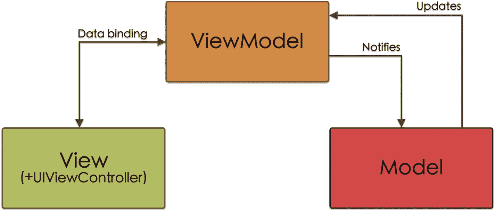
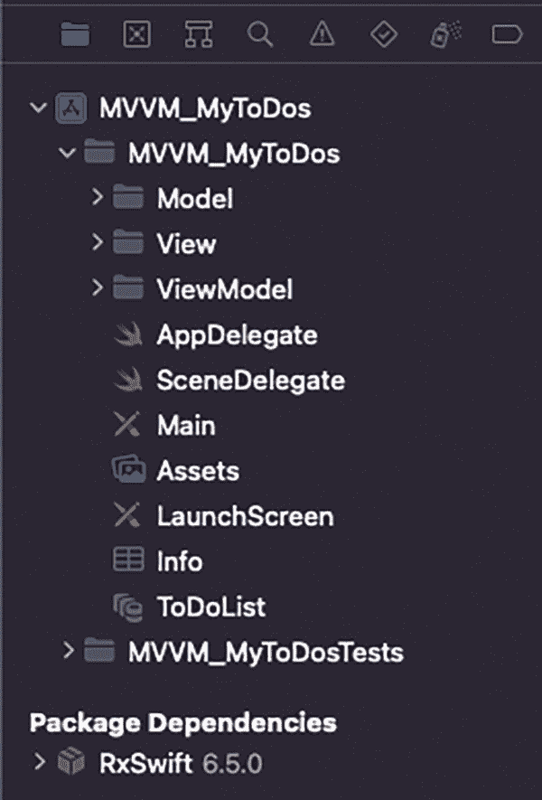
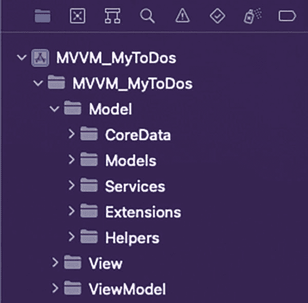
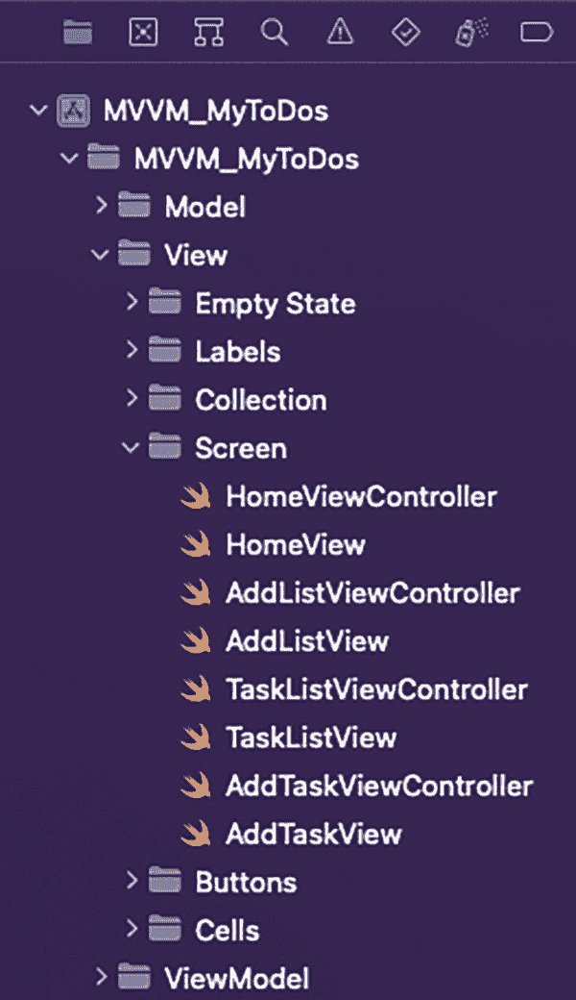
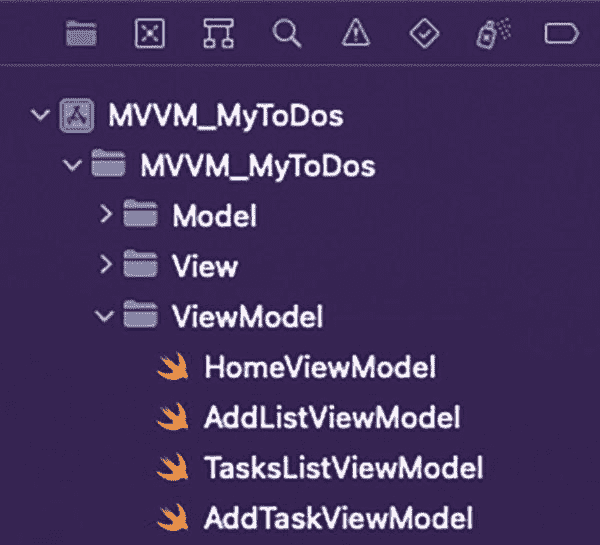

# 4. MVVM：Model–View–ViewModel

## 什么是 MVVM？

### 一点历史

MVVM 架构是由微软的 Ken Cooper 和 Ted Peters 开发的（后来由 John Gossman 在 2005 年通过他的博客宣布），目的是简化 Web 界面的**事件驱动编程**（即事件驱动程序流程）。^(⁶)

### 工作原理

MVVM 架构是 MVP 架构的一种演进，其中 Presenter 层被 ViewModel 层取代。此外，它解决了 MVP 架构存在的一些问题。最主要的是 MVP 架构中 View 与 Presenter 之间的**耦合**。在 MVVM 架构中，ViewModel 没有对 View 的引用，即不存在耦合（图 4-1）。



一个框图表示三个模块，分别标记为视图模型、视图和模型。视图和视图模型通过**数据绑定**相互连接。视图模型通知模型并接收模型的更新。

图 4-1

Model–View–ViewModel 模式示意图

### MVVM 中的组件

现在我们更详细地了解 MVVM 模式中这三个组件的特性。

#### 模型（Model）

与 MVC 或 MVP 模式相同，Model 是负责业务逻辑以及存储、操作和访问应用程序数据的组件：

-   包含与数据持久化相关的类。
-   包含控制应用程序通信的类。
-   负责将从外部接收的信息转换为模型对象。
-   包含扩展、常量等。
-   Model 层只能与 ViewModel 层通信（即 Model 不知道 View 的存在）。

#### 视图（View）

View 层包含`UIView`组件和`UIViewController`元素（我们将其保存在独立的文件中，如前几章所述）：

-   View 负责随时向用户显示最新的信息（这些信息来自 ViewModel）。
-   View 不包含任何逻辑。
-   View 可以有多个对 ViewModel 的引用。

Controller 仅承担**协调/路由**功能，处理屏幕间的导航，并在必要时通过**委托模式**传递信息。在本章末尾，我们将看到如何将所有这些协调/路由功能转移到一个新类——Coordinator 中，从而产生 MVVM-C 架构。


#### ViewModel

`ViewModel`是 MVVM 架构的核心（类似于 MVC 中的`Controller`或 MVP 中的`Presenter`），位于视图（View）与模型（Model）之间：

-   `ViewModel`必须始终呈现视图的当前状态。
-   `ViewModel`负责处理控制视图的输入/输出信息。
-   `ViewModel`由视图拥有，而模型由`ViewModel`拥有。

`ViewModel`通过所谓的数据绑定（Data Binding）与视图相连。⁷ 此过程允许你将视图与`ViewModel`连接起来，因此如果`ViewModel`所管理的信息状态发生变化，视图会自动更新。

#### 数据绑定

视图与`ViewModel`之间应用数据绑定的方法有多种，例如：

-   使用`RxSwift`、`Bond`或`Combine`等库。这是最常用的系统，在开发我们的 MVVM 应用时，我们将使用`RxSwift`库。⁸
-   使用 KVO（键值观察）模式，通过该模式，我们可以通知特定对象关于其他对象属性发生的变化。⁹
-   使用委托模式，通过闭包实现……

## MVVM 的优缺点

MVVM 架构模式常被用作 MVC 架构的替代方案，与其他架构一样，使用 Model–View–ViewModel 架构既有优点也有缺点。

### 优点

MVVM 架构的主要优点如下：

-   它实现了良好的职责分离，因为我们引入了一个新的组件（`ViewModel`），负责转换模型数据以在视图中显示。这样，我们就将控制器从该项工作中解放出来（这在 MVC 中并未实现）。
-   由于职责分离更彻底，其维护也变得更加容易。
-   它提高了可测试性，因为我们可以测试`ViewModel`的业务逻辑，而无需考虑视图。测试控制器也更容易，因为与 MVC 不同，它们不依赖于模型。
-   在从 MVC 架构迁移时，MVVM 架构被广泛应用于应用开发中。

### 缺点

主要缺点如下：

-   如果我们使用第三方库来执行数据绑定（例如`RxSwift`或`Bond`），必须考虑几个因素：
    -   一方面，添加外部库会增加我们应用的体积。
    -   另一方面，添加这些库通常会影响应用的性能。
    -   最后，我们还必须考虑到正确使用每个库所需的学习曲线。
-   数据绑定是一种声明式范式，我们告诉程序**做什么**，而不是**怎么做**（命令式范式），这可能会增加调试难度。此外，这种范式在`SwiftUI`中比在`UIKit`中更有意义。
-   与其他架构一样，如果应用不当，我们最终可能会用不相关的函数过度加载`ViewModel`。
-   它对刚入门的开发人员来说有一定复杂性。

## MVVM 应用

了解了 MVVM 架构的特性之后，我们将在自己的应用开发中应用它们。

**注意**

整个项目可以从本书的仓库中下载。在解释如何将 MVVM 架构应用于我们项目的过程中，我们只会展示代码中最相关的部分。

### MVVM 分层

为了延续所应用架构模式（Model–View–ViewModel）的逻辑，我们将创建一个模拟其层的文件夹结构（图 4-2）。



该截图显示了 MVVM MyToDos 下的子文件夹和文件。它包含名为 model、view 和 view model 的子文件夹。高亮显示了 view model 下的文件列表。

**图 4-2** – MVVM 项目文件夹结构

##### 模型

与之前的情况类似，此文件夹包含与业务逻辑、数据访问及数据处理相关的所有内容（图 4-3）。



该截图显示了 model 文件夹的子文件夹，model 又是 MVVM MyToDos 下的子文件夹。子文件夹的名称是 core data、models、services、extensions 和 helpers。

**图 4-3** – 模型层文件

在 MVVM 架构中，模型发生的变化会通知给`ViewModel`（就像在 MVC 中通知给 Controller、在 MVP 中通知给 Presenter 一样）。

在这种情况下，我们在`ViewModel`的`init`方法中添加了观察者（列表 4-1）。

```swift
init() {
    NotificationCenter.default.addObserver(self,
                                         selector: #selector(contextObjectsDidChange),
                                         name: NSNotification.Name.NSManagedObjectContextObjectsDidChange,
                                         object: CoreDataManager.shared.mainContext)
}
@objc func contextObjectsDidChange() {
    updateView()
}
```

**列表 4-1** – 在`ViewModel`初始化时设置观察者

##### 核心数据

在此文件夹中，我们将包含`CoreDataManager.swift`文件，以及由 Xcode 为数据库实体自动创建的四个文件。

##### 模型

这里存放着我们可以用来转换数据库实体的模型。此外，我们将创建一个模型必须遵守的协议，用于模型与实体之间的相互转换。

### 服务

这里存放着允许我们向数据库发送信息（创建、更新或删除）或从数据库检索信息并将其转换为模型的类。

##### 扩展

在这里，我们创建了一个`UIColor`扩展，以便能够轻松访问为此应用程序专门创建的颜色，以及一个针对`NSManagedObject`类的扩展，这将防止我们在进行测试部分时与上下文发生冲突。

##### 常量

它们包含我们将在应用程序中使用的常量参数。

#### 视图

在 View 文件夹中，我们不仅有视图文件及其组成组件（如 MVC 中），还有控制器文件（`UIViewController`的子类），如图 4-4 所示。



该截图显示了 view 下的文件和子文件夹，view 也是 MVVM MyToDos 的子文件夹。有名为 empty state、labels、collection 和 screen 的文件夹。高亮显示了 screen 子文件夹下的文件列表。

**图 4-4** – 视图层文件

请记住，在 MVVM 中，控制器通常只具有协调/路由功能（用于在屏幕之间导航），并且在某些情况下传递信息（例如，通过委托模式）。

#### ViewModel

此文件夹仅包含 ViewModels，正如我们所看到的，它们将模型连接到视图（图 4-5）。



该截图显示了名为 view model 的文件夹下的文件，该文件夹是 MVVM MyToDos 下的子文件夹。子文件夹下的文件有：home view、add list view、task list view 和 add task view models。

**图 4-5** – ViewModel 层文件

### MyToDos 数据绑定

在开始介绍我们应用程序的不同屏幕如何配置之前，就像我们在 MVC 和 MVP 案例中所做的那样，我们将看看如何在`ViewModel`和视图之间执行数据绑定过程。

正如我们之前所见，执行此过程有多种方法，但在我们的案例中，我们将使用`RxSwift`。


