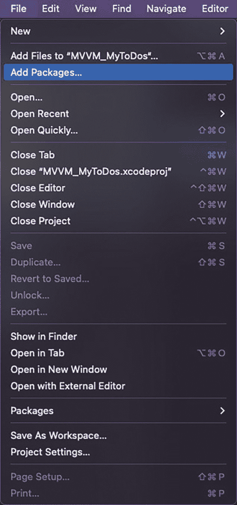
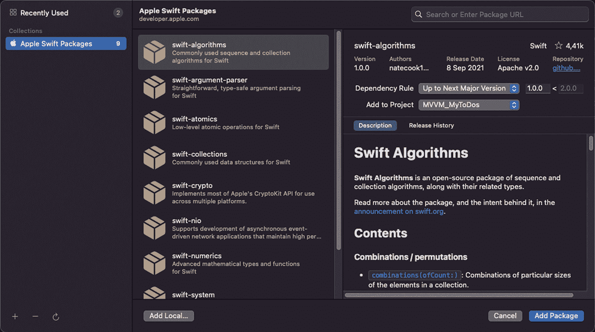
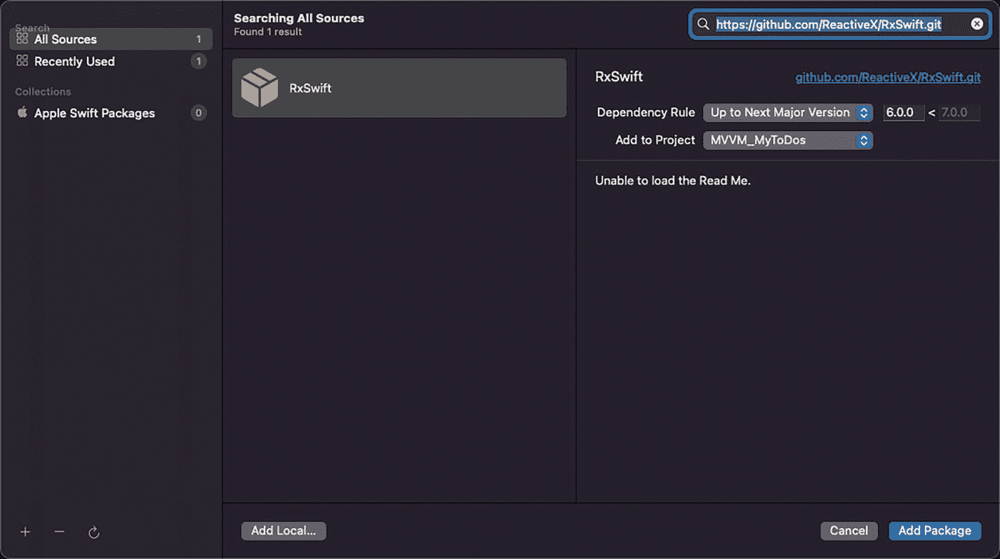
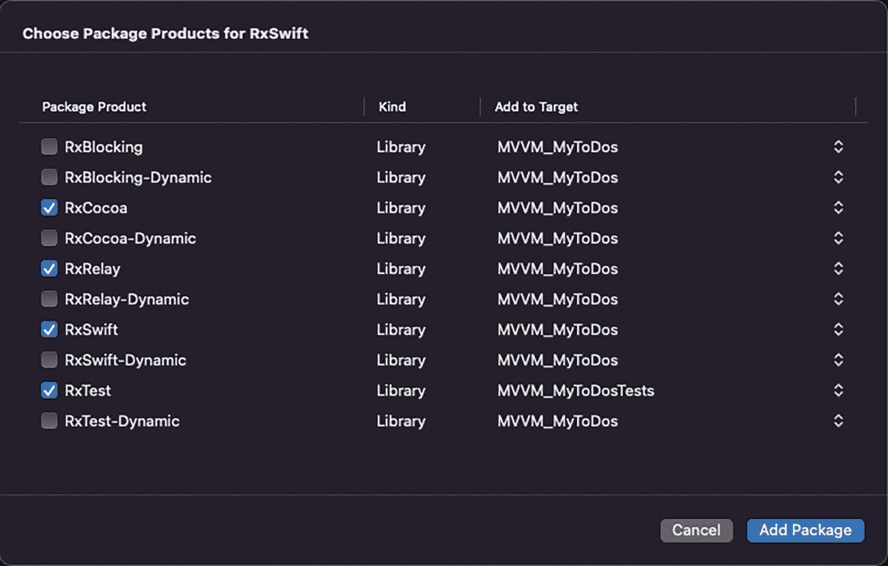
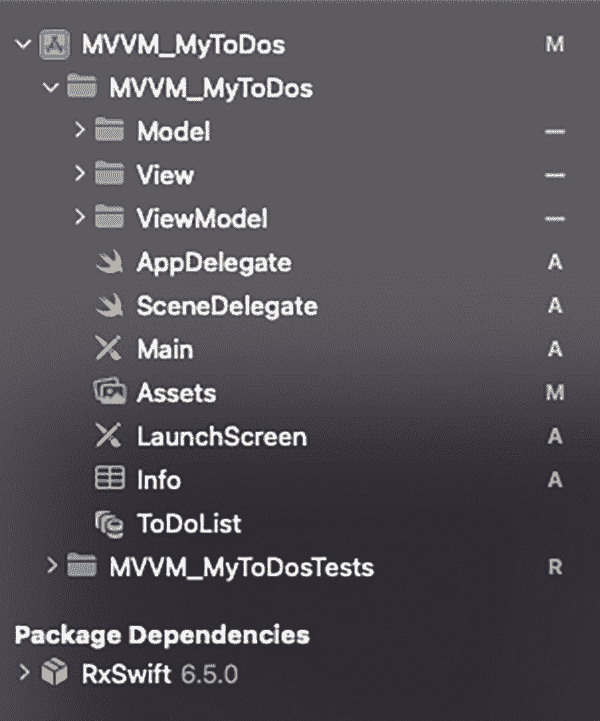

# 什么是 RxSwift？

`RxSwift` 是一款用于 iOS 应用程序开发的响应式编程库。

`RxSwift` 是一个库，它让我们能够在应用程序中开发异步代码，简化代码在面对新到达数据时的行为方式，并以顺序且隔离的方式处理这些数据。

在本书中，我们不会深入研究 `RxSwift` 和响应式编程，只需知道响应式编程允许你动态响应数据变化和用户事件即可。

`RxSwift` 使用我们称之为 *Observables* 的对象来工作，这些对象是任何数据类型的包装器，我们可以订阅或链接到它们，以便所述 *Observables* 中发生的任何变化都会触发一系列预先编程的操作。

## Observables 和 Observers

使用这个库时，我们会有两种类型的元素：

- **Observable** : 在发生更改时发出通知。
- **Observer** : 观察者订阅一个 Observable 以接收其通知。一个 Observable 可以有一个或多个观察者。

## 安装 RxSwift

`RxSwift` 作为一个外部库，其安装可以通过多种方式完成（*Swift Package Manager*，*Carthage*，*CocoaPods*）。在我们的案例中，我们将使用 Swift Package Manager (SPM)，这是 Xcode 集成的用于在应用程序中引入第三方库的系统。

要在我们的项目中安装 `RxSwift`，我们将遵循以下步骤：

首先，进入 Xcode 主菜单，选择 *File* ➤ *Add Packages…* （图 4-6）。



文件选项卡下上下文菜单的截图。它高亮显示了选项列表中的添加包选项。

图 4-6 — 选择添加包… 菜单

Xcode Swift Package Manager 屏幕将会出现（图 4-7）。



截图展示了苹果 Swift 包列表。它高亮显示了 Swift 算法包，并在右侧提供了 Swift 算法的详细信息。底部有取消和添加包的按钮。

图 4-7 — Swift Package Manager 屏幕

此时，我们要做的是复制 `RxSwift` git 仓库的地址（我们可以在其网站上找到），并将其粘贴到右上角的搜索字段中（图 4-8）。

```
https://github.com/ReactiveX/RxSwift.git
```

执行此操作后，Xcode 会负责搜索该库，并提示我们是否要安装它。



截图展示了从所有源搜索出来的 R x swift 包。顶部的搜索栏高亮显示了一个链接以及 R X swift 的详细信息。底部有两个按钮用于取消和添加包。

图 4-8 — 搜索 RxSwift 包

在添加 `RxSwift` 之前，我们要做的是将“*Dependency Rule*”选项从“*Branch*”更改为“*Up To Next Major Version*”。完成此更改后，选择“*Add Package*”。

接下来，会出现一个屏幕，我们可以在其中选择要安装的 `RxSwift` 库的组件或产品。对于我们的应用程序，我们将选择 `RxCocoa`、`RxRelay` 和 `RxSwift`（用于主代码），以及 `RxTest`（用于测试目的），然后再次选择“*Add Package*”（图 4-9）。



截图展示了包含包产品列表及其种类和要添加的目标的表格。在 r x cocoa、r x relay、r x swift 和 r x text 包产品旁边有复选标记。

图 4-9 — RxSwift 的产品选择器

安装完成后，我们可以看到我们的项目已经将 `RxSwift` 显示为依赖项（图 4-10）。



截图展示了 M V V M my to-dos 下的文件和文件夹以及包依赖项下的 R x swift 6 点 5 点 0。

图 4-10 — 在包依赖项下，显示了所有已安装的 SPM 依赖项

要在我们的代码中使用这些产品中的任何一个，我们只需导入它们（在需要时导入对应的即可）：

```swift
import RxCocoa
import RxRelay
import RxSwift
```

## 输入/输出方法

为了以更有组织的方式使用 `RxSwift` 以及不同组件和事件之间的绑定，我们将使用一种简化的流程，该方法基于一个相当普遍的约定，其起源是 Kickstarter 公司。^(¹⁰)

这是一种函数式方法，其中使用了输入/输出的概念。

- **Input** : 指发生在 View 中并影响 ViewModel 的所有事件和交互（写入文本、按下按钮……）。
- **Output** : 指模型中发生的、必须在 View 中反映出来的更改。

让我们看一个应用此约定的简单示例。我们从 ViewModel 的代码开始（列表 4-2）。

```swift
class ExampleViewModel {
    var output: Output!
    var input: Input!
    
    struct Input {
        let text: PublishRelay<String>
    }
    
    struct Output {
        let title: Driver<String>
    }
    
    init() {
        let text = PublishRelay<String>()
        let capsTitle = text
            .map({ return text.uppercased() })
            .asDriver(onErrorJustReturn: "")
        
        input = Input(text: text)
        output = Output(title: capsTitle)
    }
}
```

列表 4-2 — ViewModel 中 RxSwift 输入/输出方法的示例

尽管我们已经说过不会深入探讨像 `RxSwift` 这样庞大而复杂的库，但我们还是会解释一下在应用程序中使用的不同元素及其功能。

首先，我们可以看到 `PublishRelay<String>` 和 `Driver<String>` 元素：

- `PublishRelay` 是 `RxSwift` 的一个组件，其功能是将其观察到的最近项目（以及后续项目）广播给所有已订阅的观察者。在这种情况下，传递的项目类型是 `String`，是我们放在 `UITextField` 元素中的文本。
- `Driver` 是一个在主线程上运行的 observable（因此用于更新视图）。在这种情况下，它所做的是传递来自 `UITextField` 元素的值（通过已创建并正在观察的 `PublishRelay`）。由于我们将其传递给 UI 组件，因此必须在主线程上进行。

现在，让我们看看如何将 ViewModel 与 View 的元素绑定（列表 4-3）。

```swift
class ExampleView {
    func bind() {
        textfield.rx.text
            .bind(to: viewModel.input.text)
            .disposed(by: disposeBag)
        
        viewModel.output.title
            .drive(titleLabel.rx.text)
            .disposed(by: disposeBag)
    }
}
```

列表 4-3 — View 中的元素绑定

这里我们看到两个代码块：

- 第一个块将 `UITextField` 元素的 text 参数绑定到 ViewModel 的 text 变量（作为 `Input`）。这样，当我们在此字段中输入时，ViewModel 将会收到它。
- 第二个块将 ViewModel 的 title 变量（作为 `Output`）绑定到 `UILabel` 元素的 text 参数。因此，当我们输入时，ViewModel 中的文本会被转换为大写并转发到 View 进行显示。

**注意**：`RxSwift` 为我们在 Swift 开发中使用的大部分对象和类提供了几个扩展。这些扩展通过 `rx` 粒子访问，如 `tableView.rx`。

当我们想要销毁已创建的 observable 时，必须调用 `dispose()` 方法。为了简化这项工作，我们拥有来自 `RxSwift` 的 `DisposeBag`。因此，每当我们创建一个 observable 时，都必须使用 `.disposed(by: disposeBag)` 方法将其添加到创建的 `disposeBag` 对象中。


