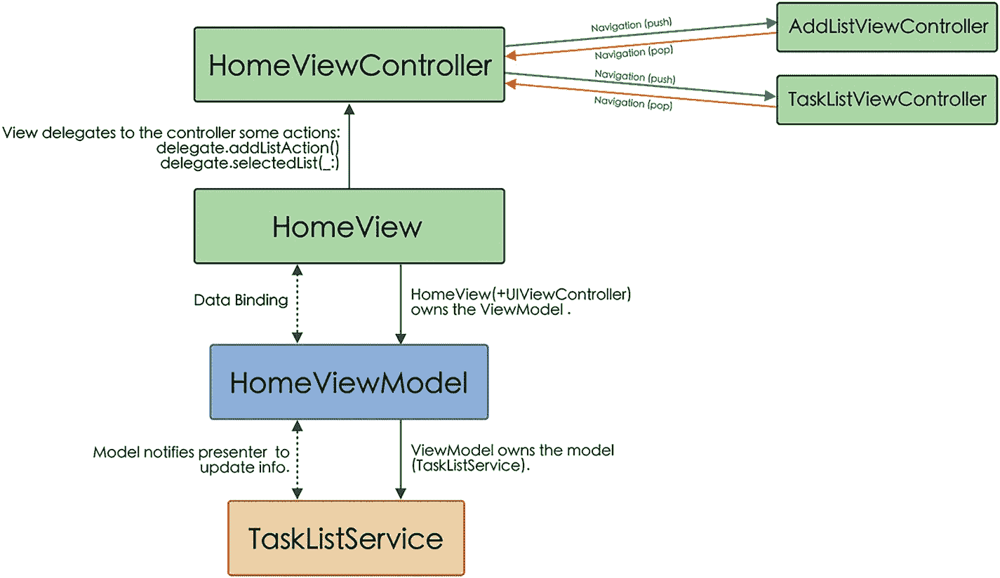
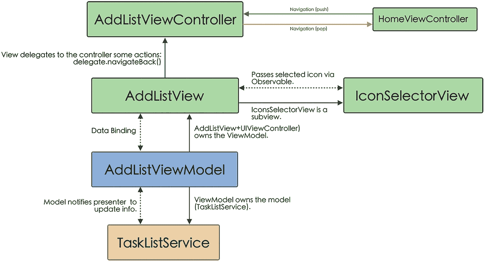
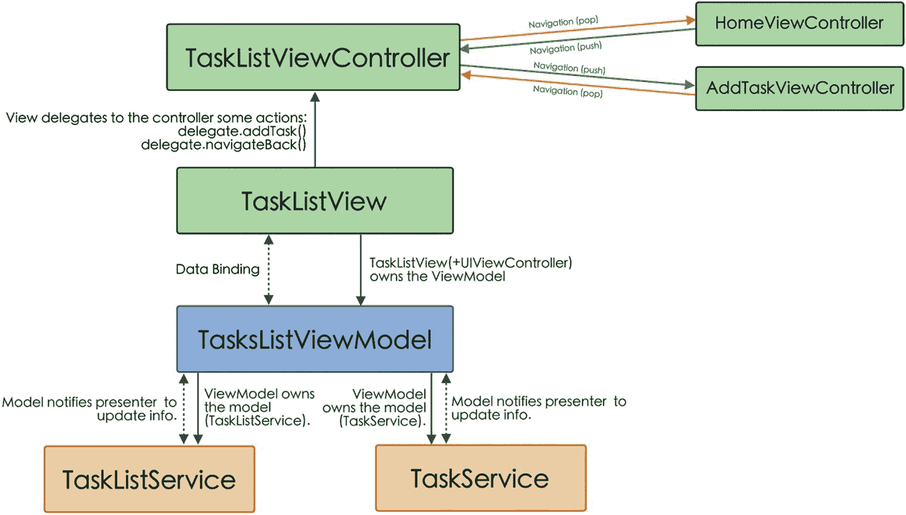
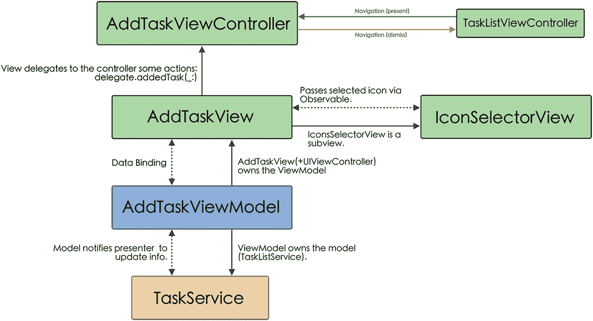
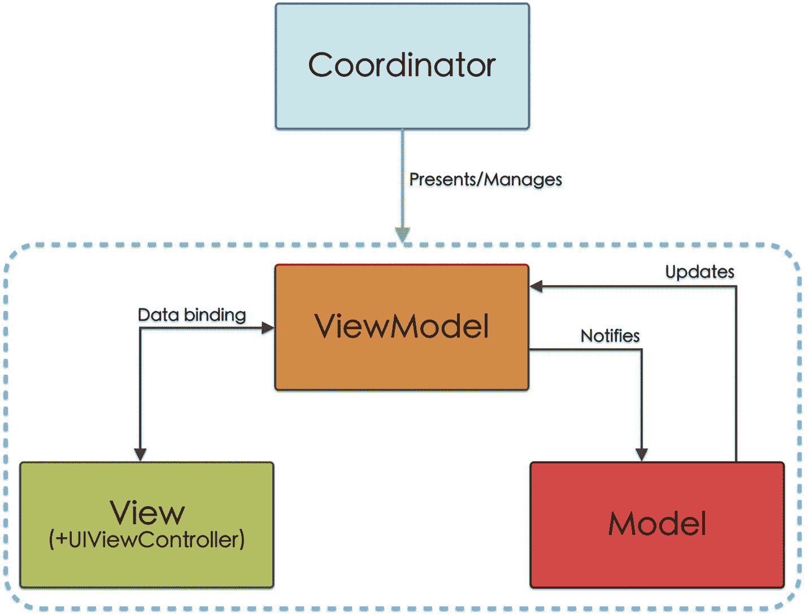

# MyToDos 应用界面

正如我们刚刚看到的，MVVM 架构的核心是 `ViewModel`，它负责维护 `View` 的状态，并在每次状态发生变化时对其进行修改（得益于数据绑定）。

虽然 MVVM 架构与 MVP 架构（我们在第三章 3 中已经介绍过）类似，其中 `ViewModel` 的功能与 `Presenter` 类似，但 MVVM 解决了 MVP 中 `View` 与 `Presenter` 之间的耦合问题（在 MVP 中，`View` 持有 `Presenter` 的引用，反之亦然）：在 MVVM 中，由于使用了数据绑定，这种耦合不复存在。

因此，我们将重点介绍如何编写 `ViewModel` 和 `View`（以及 `Controller`），以及它们之间的绑定。

#### AppDelegate 和 SceneDelegate

在我们的 MVVM 项目中，`AppDelegate` 和 `SceneDelegate` 展示的代码与 MVP 案例中的相同，我们将 `HomeViewController` 的一个实例添加到 `UINavigationController` 组件中，但没有传递对 `TasksListService` 和 `TaskService` 服务的依赖，因为这些依赖将在 `HomeViewModel` 组件中建立（列表 4-4）。

```swift
func scene(_ scene: UIScene, willConnectTo session: UISceneSession, options connectionOptions: UIScene.ConnectionOptions) {
    if let windowScene = scene as? UIWindowScene {
        let window = UIWindow(windowScene: windowScene)
        let navigationController = UINavigationController(rootViewController: HomeViewController())
        navigationController.navigationBar.isHidden = true
        navigationController.interactivePopGestureRecognizer?.isEnabled = false
        window.backgroundColor = .white
        window.rootViewController = navigationController
        self.window = window
        window.makeKeyAndVisible()
    }
}
```

*列表 4-4*  
`SceneDelegate` 为加载 `HomeViewController` 所做的更改

### 主屏幕

在“主”屏幕上，主要组件是 `HomeViewModel`，它与 `HomeView` 绑定在一起（数据绑定）（图 4-11）。



一张框图从下到上说明了从任务列表服务到主视图控制器，再通过主视图模型和主视图的通信流程。它标明了主视图控制器、添加列表视图和任务列表视图控制器之间的导航路径。

*图 4-11*  
主屏幕组件通信示意图

## HomeViewController

该屏幕的 `Controller` 与我们之前在 MVP 模型中看到的类似：现在它负责实例化 `HomeViewModel` 并将其传递给 `View`（列表 4-5）。

```swift
class HomeViewController: UIViewController {
    private var homeView: HomeView!
    ...
    override func loadView() {
        super.loadView()
        setupHomeView()
    }

    private func setupHomeView() {
        let viewModel = HomeViewModel(tasksListService: TasksListService())
        homeView = HomeView(viewModel: viewModel)
        homeView.delegate = self
        self.view = homeView
    }
}
```

*列表 4-5*  
在 `HomeViewController` 中实例化 `HomeViewModel`

另一方面，`HomeViewController` 还处理屏幕之间的路由（在 `HomeView` 中，用户可以选择访问某个列表或创建一个新列表，并将导航委托给 `HomeViewController`），如列表 4-6 所示。

```swift
extension HomeViewController: HomeViewControllerDelegate {
    func addList() {
        navigationController?.pushViewController(AddListViewController(), animated: true)
    }

    func selectedList(_ list: TasksListModel) {
        let taskViewController = TaskListViewController(tasksListModel: list)
        navigationController?.pushViewController(taskViewController, animated: true)
    }
}
```

*列表 4-6*  
`HomeViewControllerDelegate` 方法的实现

在本章末尾，我们将了解如何通过使用 `Coordinator` 来移除 `UIViewController` 中的这一导航部分。


##### HomeView

`HomeView` 相比我们在 MVC 或 MVP 中看到的版本有相当大的变化，这种变化并非体现在构成它的组件上，而是体现在这些组件如何通过数据绑定来感知 `ViewModel` 状态的变化上。

使用诸如 `RxSwift` 这样的库，使我们能够轻松地将视图的每个组件（及其属性）与模型关联起来。

为了在 `ViewModel` 和视图的组件之间建立所有连接，我们将创建一个方法对它们进行分组（清单 4-7）。

```swift
class HomeView: UIView {
    ...
    private let viewModel: HomeViewModel!
    private let disposeBag = DisposeBag()
    init(frame: CGRect = .zero, viewModel: HomeViewModel) {
        self.viewModel = viewModel
        ...
        bindViewToModel(viewModel)
    }
}
private extension HomeView {
    ...
    func bindViewToModel(_ viewModel: HomeViewModel) {
        ...
    }
}
```

*清单 4-7 在 HomeView 中设置 ViewModel*

我们现在来看一下将在这个方法中引入的代码，它将允许我们把视图的组件与 `ViewModel` 关联起来。

我们从 `UITableView` 组件开始，它用于展示我们创建的任务列表。

首先，我们设置表格的委托（针对 `UITableViewDelegate` 协议），并且我们仅用它来设置行高（清单 4-8）。

```swift
tableView.rx
    .setDelegate(self)
    .disposed(by: disposeBag)
```

*清单 4-8 使用 RxSwift 设置 tableView 委托*

接下来，我们需要向表格传递构成表格的分区数、行数以及项目数的信息。

从我们将要使用的输入/输出约定的角度来看，任务列表将是 `ViewModel` 的一个输出（`output.lists`）。通过 `tableView.rx.items(cellIdentifier: ...)` 语句可以将这些数据与 `UITableView` 元素关联起来（清单 4-9）。

```swift
viewModel.output.lists
    .drive(tableView.rx.items(cellIdentifier: ToDoListCell.reuseId, cellType: ToDoListCell.self)) { (_, list, cell) in
        cell.setCellParametersForList(list)
    }
    .disposed(by: disposeBag)
```

*清单 4-9 将任务列表数据绑定到 tableView*

接着，我们设置指令，以便能够订阅用户对单元格的选择操作。这通过 `input.selectRow` 参数实现。每当用户选择一个单元格时，该单元格的 `IndexPath` 信息将被发送给 `ViewModel`（清单 4-10）。

当我们选中一个表格单元格并将相应的 `IndexPath` 值传递给 `ViewModel` 时，`ViewModel` 会负责选择对应的 `TaskListModel` 对象，并将其作为输出发出。因此，我们必须从视图中绑定这个输出（`output.selectedList`）。

```swift
tableView.rx.itemSelected
    .bind(to: viewModel.input.selectRow)
    .disposed(by: disposeBag)

viewModel.output.selectedList
    .drive(onNext: { [self] list in
        delegate?.selectedList(list)
    })
    .disposed(by: disposeBag)
```

*清单 4-10 订阅 itemSelected 事件*

与 `UITableView` 组件相关的最后一条指令是删除一个单元格（清单 4-11）。每当用户执行删除单元格的手势时，ViewModel 将被要求从模型中将其删除。这个删除列表的事件将对应于 `ViewModel` 的一个输入（`input.deleteRow`）。

```swift
tableView.rx.itemDeleted
    .bind(to: viewModel.input.deleteRow)
    .disposed(by: disposeBag)
```

*清单 4-11 订阅 itemDeleted 事件*

完成 `UITableView` 组件的绑定后，我们接着绑定 `EmptyState` 组件和 `AddListButton` 组件。

在第一种情况下，我们想要根据是否创建了任务列表来隐藏或显示 `EmptyState`。ViewModel 必须告知视图是否应该显示 `EmptyState`，因此这条信息将是一个输出（`output.hideEmptyState`），如清单 4-12 所示。

```swift
viewModel.output.hideEmptyState
    .drive(emptyState.rx.isHidden)
    .disposed(by: disposeBag)
```

*清单 4-12 将 ViewModel 的 output.hideEmptyState 属性绑定到 EmptyState 的 isHidden 属性*

当 ViewModel 中的 `hideEmptyState` 取值为 false 时，`EmptyState` 将会可见；而当其取值为 true 时，则会被隐藏。

关于 `AddListButton`，在 MVC 或 MVP 中，我们为其分配了一个目标（target），该目标会调用我们创建的一个方法；而使用 `RxSwift`，我们只需将待执行的代码分配给 `tap` 方法即可（清单 4-13）。

```swift
addListButton.rx.tap
    .asDriver()
    .drive(onNext: { [self] in
        delegate?.addList()
    })
    .disposed(by: disposeBag)
```

*清单 4-13 为 AddListButton 设置 tap 事件*

在 `bindToViewModel` 方法的末尾，我们执行的操作是调用重新加载表格的方法，正如我们将在 ViewModel 中看到的，该方法会调用数据库以获取已创建的任务列表。

```swift
viewModel.input.reload.accept(())
```

正如我们在 RxSwift 的介绍中所提到的，我们不会深入探讨这个库提供的能力（它们非常多）。我们只是展示如何在我们的示例项目中使用其中的一些功能。


### `HomeViewModel`

正如我们在本章开头所见，`ViewModel` 负责从 `Model` 获取数据，并将其准备为可供 `View` 显示的状态，同时还管理该 `View` 的业务逻辑。

正如我们在 `HomeView` 的开发过程中所见，`HomeViewModel` 必须包含三个输入（`reload`、`deleteRow` 和 `selectRow`）以及三个输出（`lists`、`selectedList` 和 `hideEmptyState`）。因此，我们将按如下方式定义 `struct Input` 和 `struct Output`（代码清单 4-14）。

```swift
class HomeViewModel {
    var output: Output!
    var input: Input!
    struct Input {
        let reload: PublishRelay<Void>
        let deleteRow: PublishRelay<IndexPath>
        let selectRow: PublishRelay<IndexPath>
    }
    struct Output {
        let hideEmptyState: Driver<Bool>
        let lists: Driver<[TasksListModel]>
        let selectedList: Driver<TasksListModel>
    }
    ...
}
// 代码清单 4-14
// 为 HomeViewModel 定义 Input 和 Output
```

一旦我们定义了 `Input` 和 `Output`，我们就在 `HomeViewModel` 的初始化过程中设置它们的行为（代码清单 4-15）。

```swift
class HomeViewModel {
    ...
    private let lists = BehaviorRelay<[TasksListModel]>(value: [])
    private let taskList = BehaviorRelay<TasksListModel>(value: TasksListModel())
    private var tasksListService: TasksListServiceProtocol!
    
    init(tasksListService: TasksListServiceProtocol) {
        self.tasksListService = tasksListService
        // 输入
        let reload = PublishRelay<Void>()
        _ = reload.subscribe(onNext: { [self] _ in
            fetchTasksLists()
        })
        let deleteRow = PublishRelay<IndexPath>()
        _ = deleteRow.subscribe(onNext: { [self] indexPath in
            tasksListService.deleteList(listAtIndexPath(indexPath))
        })
        let selectRow = PublishRelay<IndexPath>()
        _ = selectRow.subscribe(onNext: { [self] indexPath in
            taskList.accept(listAtIndexPath(indexPath))
        })
        self.input = Input(reload: reload, deleteRow: deleteRow, selectRow: selectRow)
        // 输出
        let items = lists
            .asDriver(onErrorJustReturn: [])
        let hideEmptyState = lists
            .map({ items in
                return !items.isEmpty
            })
            .asDriver(onErrorJustReturn: false)
        let selectedList = taskList.asDriver()
        output = Output(hideEmptyState: hideEmptyState, lists: items, selectedList: selectedList)
        ...
    }
    ...
}
// 代码清单 4-15
// 设置与输入和输出相关联的参数的行为
```

`input.reload` 参数将执行获取数据库中记录列表的方法。

`input.deleteRow` 参数将接收我们希望删除的单元格在表格中的位置（以 `IndexPath` 形式）。

`input.selectRow` 参数将接收我们选中的单元格在表格中的位置（以 `IndexPath` 形式）。

`output.lists` 参数每次从数据库接收到 `TasksListModel` 数组时，就会发送该数组。

`output.selectedList` 参数将发出一个 `TasksListModel` 对象，该对象对应于用户选中的单元格。

`output.hideEmptyState` 参数将发出一个布尔值：如果数据库中存在任务列表则为 `true`，如果不存在则为 `false`。

最后，我们设置与访问 `Model` 相关的方法，例如对数据库的调用，或设置一个数据库更改观察者（代码清单 4-16）。

```swift
class HomeViewModel {
    ...
    init(tasksListService: TasksListServiceProtocol) {
        ...
        NotificationCenter.default.addObserver(self,
            selector: #selector(contextObjectsDidChange),
            name: NSNotification.Name.NSManagedObjectContextObjectsDidChange,
            object: CoreDataManager.shared.mainContext)
    }
    
    @objc func contextObjectsDidChange() {
        fetchTasksLists()
    }
    
    func fetchTasksLists() {
        lists.accept(tasksListService.fetchLists())
    }
    
    func listAtIndexPath(_ indexPath: IndexPath) -> TasksListModel {
        lists.value[indexPath.row]
    }
}
// 代码清单 4-16
// ViewModel 与 Model 之间的关系
```

### 添加列表屏幕

此屏幕负责添加任务列表及其各组件之间的通信。根据 MVVM 架构，这些组件之间的通信如图 4-12 所示。



一个框图说明了从任务列表服务到添加列表视图控制器的通信流程，该流程通过添加列表视图模型和添加列表视图自下而上进行。图中最上方标明了添加列表视图控制器与主视图控制器之间的导航关系，中间部分则展示了添加列表视图与图标选择器视图之间的通信。

图 4-12  
添加列表屏幕组件通信示意图

### `AddListViewController`

`AddListViewController` 仅负责安装 `AddListViewModel` 并将其传递给 `AddListView`，以及处理返回主屏幕的导航操作（代码清单 4-17）。

```swift
class AddListViewController: UIViewController {
    private var addListView: AddListView!
    ...
    private function setupAddListView() {
        let viewModel = AddListViewModel(tasksListService: TasksListService())
        addListView = AddListView(viewmodel: viewmodel)
        addListView.delegate = self
        self.view = addListView
    }
}

AddListViewController extension: BackButtonDelegate {
    func navigateBack() {
        navigationController?.popViewController(animated: true)
    }
}
// 代码清单 4-17
// 设置 AddListViewController 的代码
```


### `AddListView`

正如我们在前几章中所见，`AddListView` 包含以下用户可交互的元素，且这些元素必须链接到 `AddListViewModel`：一个 `UITextField` 元素、两个 `UIButton` 元素（一个用于添加列表，另一个用于返回），以及一个 `IconSelector`。

接下来，我们将探讨如何在 `bindViewToModel` 方法中，针对这些元素中的每一个，与 `AddListViewModel` 执行数据绑定。

`titleTextField` 元素是我们输入列表标题的地方。我们必须记住，要创建一个任务，此字段不能为空；否则，`addListButton` 按钮将被禁用。

因此，我们必须将 `titleTextField` 的内容同时绑定到 `addListButton` 按钮以启用它（`addListButton.rx.isEnabled`），以及绑定到 `AddListViewModel` 中的标题输入（`input.title`）（列表 4-18）。

```
titleTextfield
.rx.text
.map({ !($0?.isEmpty)! })
.bind(to: addListButton.rx.isEnabled)
.disposed(by: disposeBag)
titleTextfield.rx.text
.map({ $0! })
.bind(to: viewModel.input.title )
.disposed(by: disposeBag)
列表 4-18
将 titleTextField 的内容绑定到 addListButton 的状态
```

通过 `rx.text`，我们访问 `UITextField` 的内容；然后通过 `map`，我们评估其是否为空，并将状态传递给 `addListButton` 的 `isEnabled` 参数（这样，如果为空，则 `isEnabled` 为 `false`；如果包含文本，则 `isEnabled` 为 `true`）。

接下来，我们配置 `addListButton` 和 `backButton` 按钮在 `tap` 事件前的行为（列表 4-19）。

```
addListButton.rx.tap
.bind(to: viewModel.input.addList)
.disposed(by: disposeBag)
backButton.rx.tap
.bind(to: viewModel.input.dismiss)
.disposed(by: disposeBag)
viewModel.output.dismiss
.drive(onNext: { [self] _ in
delegate?.navigateBack()
})
.disposed(by: disposeBag)
列表 4-19
将 addListButton 和 backButton 绑定到它们对应的点击事件
```

`addListButton` 的功能是告诉 `AddListViewModel` 将新的任务列表保存到数据库（然后报告已添加，这样我们就回到了 `Home` 界面）。我们通过 `input.addList` 参数来传达此信息。

`backButton` 的功能是返回 `HomeScreen`，例如在完成添加新任务列表时。因此，我们不将其与 `delegate.navigateBack` 方法的直接调用关联，而是在 ViewModel 中创建一个执行该调用功能的 Output（`output.dismiss`）和一个允许调用它的 Input（`input.dismiss`）。

对于 `iconSelectorView` 的情况，我们将修改 `IconSelectorView` 组件以使用 RxSwift，而不是委托模式。为此，我们所做的是消除该组件的协议（我们在 MVC 和 MVP 架构中使用过该协议），并引入一个类型为 `BehaviorRelay` 的新变量，该变量将发出所选图标的名称。

```
var selectedIcon = BehaviorRelay(value: "checkmark.seal.fill")
```

我们还将修改当选择一个图标时其名称通过委托发送的方法。我们只需将该值传递给创建的变量，让其传递即可：

```
func collectionView(_ collectionView: UICollectionView, didSelectItemAt indexPath: IndexPath) {
selectedIcon.accept(Constants.icons[indexPath.item])
}
```

现在我们可以将 `iconSelectorView` 绑定到 `AddListViewModel`，以将图标名称作为输入（`input.icon`）传递给它（列表 4-20）：

```
iconSelectorView.selectedIcon
.bind(to: viewModel.input.icon)
.disposed(by: disposeBag)
列表 4-20
将所选图标的名称与 AddListViewModel 绑定
```

最后，我们将绑定到 `AddListViewModel` 的 `addedList` 方法，以便当该方法执行时，应用程序导航回 `Home`。

## `AddListViewModel`

`AddListModel` 类非常简单。在实例化这个类时，所做的操作是传递一个对 `TaskListService` 的引用（作为协议），以便它可以与模型交互，此外，我们还初始化了一个 `TaskListModel` 对象。

遵循输入/输出约定，我们设置 `AddListViewModel` 的输入和输出参数。

`AddListViewModel` 的输入和输出定义。

```
class AddListViewModel {
var output: Output!
var input: Input!
struct Input {
let icon: PublishRelay
let title: PublishRelay
let addList: PublishRelay
let dismiss: PublishRelay
}
struct Output {
let dismiss: Driver
}
...
}
```

现在，我们只需要在 `AddListViewModel` 的初始化中设置这些参数的行为（列表 4-21）。

```
class AddListViewModel {
...
private var tasksListService: TasksListServiceProtocol!
private(set) var list: TasksListModel!
private let dismiss = BehaviorRelay(value: ())
init(tasksListService: TasksListServiceProtocol) {
self.tasksListService = tasksListService
self.list = TasksListModel(id: ProcessInfo().globallyUniqueString, icon: "checkmark.seal.fill",
createdAt: Date())
// 输入
let icon = PublishRelay()
_ = icon.subscribe(onNext: { [self] newIcon in
list.icon = newIcon
})
let title = PublishRelay()
_ = title.subscribe(onNext: { [self] newTitle in
list.title = newTitle
})
let addList = PublishRelay()
_ = addList.subscribe(onNext: { [self] _ in
tasksListService.saveTasksList(list)
dismiss.accept(())
})
let dismissView = PublishRelay()
_ = dismissView.subscribe(onNext: { [self] _ in
dismiss.accept(())
})
input = Input(icon: icon, title: title, addList: addList, dismiss: dismissView)
// 输出
let backNavigation = dismiss.asDriver()
output = Output(dismiss: backNavigation)
...
}
}
列表 4-21
建立与输入和输出相关联的参数的行为
```

`input.icon` 和 `input.title` 参数将接收所选图标和输入标题的相应值。

对于 `input.addList` 参数，它将执行将新列表添加到数据库的方法，然后调用 `dismiss` 方法（我们已经在 `AddListView` 中看到该方法绑定到了委托的 `navigateBack` 方法）。

`dismiss` 方法将与通过 `input.dismiss` 参数调用的方法相同（我们在 `AddListView` 中已将其绑定到了 `backButton`）。

#### 任务列表界面

此界面负责显示构成一个列表的任务，将它们标记为已完成、删除以及添加新任务。其组件之间的通信如图 4-13 所示。



一个方框图展示了从任务列表视图模型到任务列表视图控制器，再通过任务列表视图的自下而上的通信流程。它指示了任务列表视图模型在底部与任务列表服务和任务服务的通信，以及任务列表视图控制器在顶部与主视图和添加任务视图控制器的导航。

图 4-13

任务列表界面组件通信模式


### `TaskListViewController`

该控制器一方面负责实例化`TaskListViewModel`并将其传递给视图，另一方面负责管理导航至添加任务屏幕或`Home`屏幕。

在此屏幕上，我们展示在`Home`屏幕中选择的列表所包含的任务，因此在初始化时，我们必须传递`taskListModel`对象，该对象随后会被传递给`TaskListViewModel`（代码清单 4-22）。

```
class TaskListViewController: UIViewController {
private var taskListView: TaskListView!
private var tasksListModel: TasksListModel!
init(tasksListModel: TasksListModel) {
self.tasksListModel = tasksListModel
super.init(nibName: nil, bundle: nil)
}
...
private func setupTaskListView() {
let viewModel = TaskListViewModel(tasksListModel: tasksListModel, taskService: TaskService(), tasksListService: TasksListService())
taskListView = TaskListView(viewModel: viewModel)
taskListView.delegate = self
self.view = taskListView
}
}
extension TaskListViewController: TaskListViewControllerDelegate {
func addTask() {
let addTaskViewController = AddTaskViewController(tasksListModel: tasksListModel)
addTaskViewController.modalPresentationStyle = .pageSheet
present(addTaskViewController, animated: true)
}
}
extension TaskListViewController: BackButtonDelegate {
func navigateBack() {
navigationController?.popViewController(animated: true)
}
}
代码清单 4-22
设置 TaskListViewController 代码
```

### `TaskListView`

从构成组件来看，`TaskListView`的功能与`HomeView`类似：它呈现一个`UITableView`组件，该组件需要填充列表中的任务；包含一个用于添加新任务的按钮；并且我们可以删除任务。但此外，它还包含任务列表的标题、一个返回`HomeView`的按钮，以及更新任务的功能（通过一个按钮允许任务从未完成变为已完成，反之亦然）。

那么，我们首先来看一下需要在`TaskListView`的`bindToModel`方法中引入什么代码，以便将`UITableView`元素与`TaskListViewModel`绑定，同时记住我们正在处理输入和输出（代码清单 4-23）。

```
tableView.rx
.setDelegate(self)
.disposed(by: disposeBag)
tableView.rx.itemDeleted
.bind(to: viewModel.input.deleteRow)
.disposed(by: disposeBag)
viewModel.output.tasks
.drive(tableView.rx.items(cellIdentifier: TaskCell.reuseId, cellType: TaskCell.self)) { (index, task, cell) in
cell.setParametersForTask(task, at: index)
cell.checkButton.rx.tap
.map({ IndexPath(row: cell.cellIndex, section: 0) })
.bind(to: viewModel.input.updateRow)
.disposed(by: cell.disposeBag)
}
.disposed(by: disposeBag)
代码清单 4-23
UITableView 组件与 TaskListViewModel 之间的绑定
```

相信所有这些代码你都很熟悉。唯一的添加项是允许我们更新任务状态的按钮（`checkButton`），我们为表格中的每个单元格都配置了该按钮。

接下来，我们来看将目标关联到此屏幕上两个按钮的代码（代码清单 4-24）。

```
addTaskButton.rx.tap
.asDriver()
.drive(onNext: { [self] in
delegate?.addTask()
})
.disposed(by: disposeBag)
backButton.rx.tap
.asDriver()
.drive(onNext: { [self] in
delegate?.navigateBack()
})
.disposed(by: disposeBag)
代码清单 4-24
配置 addTaskButton 和 backButton 按钮的目标
```

按下这些按钮将通过`delegate`调用`TaskListViewController`中相应的方法。

最后，我们拥有与`TaskListViewModel`的两个输出类型参数之间的链接，这使我们一方面能够显示任务列表的标题，另一方面根据列表是否存在任务来隐藏或显示`EmptyState`（代码清单 4-25）。

```
viewModel.output.pageTitle
.drive(pageTitle.rx.text)
.disposed(by: disposeBag)
viewModel.output.hideEmptyState
.drive(emptyState.rx.isHidden)
.disposed(by: disposeBag)
代码清单 4-25
将 pageTitle 和 emptyState 元素绑定到 TaskListViewModel 的 pageTitle 和 hideEmptyState 输出
```

正如我们在`HomeView`中所做的那样，在`bindToViewModel`方法的最后，我们调用重新加载表格的方法，正如我们将在 ViewModel 中看到的那样，该方法会调用数据库以获取已创建的任务列表。

```
viewModel.input.reload.accept(())
```


### `TasksListViewModel`

在`TasksListViewModel`中，我们将拥有管理应用程序此屏幕的逻辑，并建立将从`TaskListView`（列表 4-26）绑定的输入和输出。

```
class TaskListViewModel {
    var output: Output!
    var input: Input!
    struct Input {
        let reload: PublishRelay
        let deleteRow: PublishRelay
        let updateRow: PublishRelay
    }
    struct Output {
        let hideEmptyState: Driver
        let tasks: Driver
        let pageTitle: Driver
    }
    ...
}
列表 4-26 设置 TaskListViewModel 的输入和输出
```

现在，与之前的情况一样，我们在`TaskListViewModel`的初始化中设置它们（列表 4-27）。

```
class TaskListViewModel {
    ...
    init(tasksListModel: TasksListModel,
         taskService: TaskServiceProtocol,
         tasksListService: TasksListServiceProtocol) {
        self.tasksListModel = tasksListModel
        self.taskService = taskService
        self.tasksListService = tasksListService
        // Inputs
        let reload = PublishRelay()
        _ = reload.subscribe(onNext: { [self] _ in
            fetchTasks()
        })
        let deleteRow = PublishRelay()
        _ = deleteRow.subscribe(onNext: { [self] indexPath in
            deleteTaskAt(indexPath: indexPath)
        })
        let updateRow = PublishRelay()
        _ = updateRow.subscribe(onNext: { [self] indexPath in
            updateTaskAt(indexPath: indexPath)
        })
        input = Input(reload: reload, deleteRow: deleteRow, updateRow: updateRow)
        // Outputs
        let items = tasks
            .asDriver(onErrorJustReturn: [])
        let hideEmptyState = tasks
            .map({ items in
                return !items.isEmpty
            })
            .asDriver(onErrorJustReturn: false)
        let pageTitle = pageTitle
            .asDriver(onErrorJustReturn: "")
        output = Output(hideEmptyState: hideEmptyState, tasks: items, pageTitle: pageTitle)
        ...
    }
    ...
}
列表 4-27 建立与输入和输出相关的参数行为
```

`input.reload`参数将执行从数据库获取任务的方法。

`input.deleteRow`参数将接收单元格在表格中的位置（作为`IndexPath`），并执行相应的`TaskService`方法。

`input.updateRow`参数将接收要更新的单元格在表格中的位置（作为`IndexPath`），并执行相应的`TaskService`方法。

`output.hideEmptyState`参数将发出一个布尔值，如果列表中有任务则为`true`，如果没有则为`false`。

`output.tasks`参数将每次从数据库接收任务时，发出一个包含任务数组的列表（作为`TaskModel`）。

`output.pageTitle`参数负责传递任务列表的标题。

最后，我们建立允许访问模型（数据库）的方法，如列表 4-28 所示。

```
class TaskListViewModel {
    ...
    private var tasksListModel: TasksListModel!
    private var taskService: TaskServiceProtocol!
    private var tasksListService: TasksListServiceProtocol!
    let tasks = BehaviorRelay(value: [])
    let pageTitle = BehaviorRelay(value: "")
    init(tasksListModel: TasksListModel,
         taskService: TaskServiceProtocol,
         tasksListService: TasksListServiceProtocol) {
        ...
        NotificationCenter.default.addObserver(self,
                                               selector: #selector(contextObjectsDidChange),
                                               name: NSNotification.Name.NSManagedObjectContextObjectsDidChange,
                                               object: CoreDataManager.shared.mainContext)
    }
    @objc func contextObjectsDidChange() {
        fetchTasks()
    }
    func fetchTasks() {
        guard let list = tasksListService.fetchListWithId(tasksListModel.id) else { return }
        let orderedTasks = list.tasks.sorted(by: { $0.createdAt.compare($1.createdAt) == .orderedDescending })
        tasks.accept(orderedTasks)
        pageTitle.accept(list.title)
    }
    func deleteTaskAt(indexPath: IndexPath) {
        taskService.deleteTask(tasks.value[indexPath.row])
    }
    func updateTaskAt(indexPath: IndexPath) {
        var taskToUpdate = tasks.value[indexPath.row]
        taskToUpdate.done.toggle()
        taskService.updateTask(taskToUpdate)
    }
}
列表 4-28 ViewModel 与 Model 之间的关系
```

如您所见，通过初始化此类，我们设置了数据库更改监视器。这样，每当发生更改时，都会调用`fetchTasks`函数，该函数将负责调用数据库（通过`TaskListService`），按创建日期对任务进行排序，然后将相应的值传递给已创建的`Observables`，以便视图根据新数据进行更新。

### 添加任务屏幕

此屏幕负责向给定列表添加任务，其组件之间的通信如图 4-14 所示。



图 4-14 添加任务屏幕组件通信示意图

### `AddTaskViewController`

在此情况下，`AddTaskViewController`负责在其初始化中接收`taskListModel`对象（包含要添加新任务的任务列表），并实例化`AddTaskViewModel`（向其传递任务列表和`TaskService`的实例），然后将其传递给视图（列表 4-29）。

```
class AddTaskViewController: UIViewController {
    private var addTaskView: AddTaskView!
    private var tasksListModel: TasksListModel!
    init(tasksListModel: TasksListModel) {
        super.init(nibName: nil, bundle: nil)
        self.tasksListModel = tasksListModel
    }
    ...
    private func setupAddTaskView() {
        let viewModel = AddTaskViewModel(tasksListModel: tasksListModel, taskService: TaskService())
        addTaskView = AddTaskView(viewModel: viewModel)
        addTaskView.delegate = self
        self.view = addTaskView
    }
}
列表 4-29 设置 AddTaskViewController 代码
```

#### `AddTaskView`

`AddTaskView`的代码与我们为`AddListView`开发的非常相似，因为它包含一个`UITextField`元素、一个`IconsSelectorView`元素和一个`UIButton`元素。因此，`bindViewToModel`方法的代码您会很熟悉（列表 4-30）。

```
func bindViewToModel(_ viewModel: AddTaskViewModel) {
    titleTextfield.rx.text
        .map({!($0?.isEmpty)!})
        .bind(to: addTaskButton.rx.isEnabled)
        .disposed(by: disposeBag)
    titleTextfield.rx.text
        .map({ $0! })
        .bind(to: viewModel.input.title )
        .disposed(by: disposeBag)
    addTaskButton.rx.tap
        .bind(to: viewModel.input.addTask)
        .disposed(by: disposeBag)
    iconSelectorView.selectedIcon
        .bind(to: viewModel.input.icon)
        .disposed(by: disposeBag)
    viewModel.output.dismiss
        .skip(1)
        .drive(onNext: { [self] in
            delegate?.addedTask()
        })
        .disposed(by: disposeBag)
}
列表 4-30 AddTaskView 与 AddTaskViewModel 之间的绑定元素
```


`AddTaskViewModel`

`AddTaskViewModel`类将负责在数据库中创建和记录任务。与之前的 ViewModel 类似，我们从设置输入和输出开始（列表 4-31）。

```swift
class AddTaskViewModel {
    var output: Output!
    var input: Input!
    
    struct Input {
        let icon: PublishRelay<String>
        let title: PublishRelay<String>
        let addTask: PublishRelay<Void>
    }
    
    struct Output {
        let dismiss: Driver<Void>
    }
    
    ...
}
// 列表 4-31 设置 AddTaskViewModel 的输入和输出
```

在本例中，我们只有三个输入（图标、任务标题和注册任务的操作）和一个输出（关闭视图的操作）。

然后，我们在`AddTaskViewModel`的初始化中设置它们（列表 4-32）。

```swift
class AddTaskViewModel {
    ...
    private var tasksListModel: TasksListModel!
    private var taskService: TaskServiceProtocol!
    private(set) var task: TaskModel!
    let dismiss = BehaviorRelay(value: ())
    
    init(tasksListModel: TasksListModel,
         taskService: TaskServiceProtocol) {
        self.tasksListModel = tasksListModel
        self.taskService = taskService
        self.task = TaskModel(id: ProcessInfo().globallyUniqueString,
                              icon: "checkmark.seal.fill",
                              done: false,
                              createdAt: Date())
        
        // Inputs
        let icon = PublishRelay<String>()
        _ = icon.subscribe(onNext: { [self] newIcon in
            task.icon = newIcon
        })
        
        let title = PublishRelay<String>()
        _ = title.subscribe(onNext: { [self] newTitle in
            task.title = newTitle
        })
        
        let addTask = PublishRelay<Void>()
        _ = addTask.subscribe(onNext: { [self] _ in
            taskService.saveTask(task, in: tasksListModel)
            dismiss.accept(())
        })
        
        input = Input(icon: icon, title: title, addTask: addTask)
        
        // Outputs
        let dismissView = dismiss.asDriver()
        output = Output(dismiss: dismissView)
    }
}
// 列表 4-32 建立与输入和输出关联的参数行为
```

`input.icon`和`input.title`参数将接收所选图标和输入标题的对应值。

对于`input.addTask`参数，它将执行将新任务添加到数据库的方法，然后调用`dismiss`方法（我们已经看到该方法在`AddTaskView`上绑定到了委托的`navigateBack`方法）。

## MVVM-MyToDos 测试

在我们刚刚研究的 MVVM 架构中，View 和 Model 之间的连接是通过一个新组件 ViewModel 完成的。除此之外，View 和 ViewModel 之间的连接是通过一个称为数据绑定的过程完成的，为此我们使用了特定的库：RxSwift。通过这种方式，View 能够感知 ViewModel 中发生的变化并进行相应更新。

因此，出现的问题是：我们如何测试一个与事件和数据流（即随时间变化的值）协同工作的系统？我们如何测试使用 RxSwift 开发的代码？为此，我们将使用 RxSwift 附带的库：`RxTest`。

> **注意**
> 
> 你会记得，在本章开头，当我们使用 Swift Package Manager 安装 RxSwift 时，除了 RxSwift、RxCocoa 和 RxRelay 之外，我们还包含了 RxTest（并将其添加到 MVVM_MyToDosTests 目标中）。

### RxTest 简介

正如我们所看到的，使用 RxSwift，我们从处理单个值转向处理随时间发射值的流。而`RxTest`将帮助我们测试这些流。

为此，我们将使用`RxTest`的主要组件：`TestScheduler`。

该组件允许我们创建可观察对象（`Observable`）和观察者（`Observer`），我们可以绑定和拦截它们，以便查看进入和离开 ViewModel 的数据。我们可以在特定的“虚拟时间”中进行此操作；因此，我们可以在特定时间创建事件。

因此，要执行测试，我们必须首先创建一个`TestScheduler`实例（初始参数`initialClock`，它将定义传输的开始）、一个`DisposeBag`实例用于存放先前测试的订阅，以及一个 ViewModel 实例（列表 4-33）。

```swift
class ExampleTests: XCTestCase {
    var testScheduler: TestScheduler!
    var disposeBag: DisposeBag!
    var viewModel: ViewModel!
    
    override func setUpWithError() throws {
        testScheduler = TestScheduler(initialClock: 0)
        disposeBag = DisposeBag()
        viewModel = ViewModel()
    }
    
    override func tearDownWithError() throws {
        testScheduler = nil
        disposeBag = nil
        viewModel = nil
        super.tearDown()
    }
}
// 列表 4-33 为测试创建 TestScheduler、DisposeBag 和 ViewModel 实例
```

现在，我们只需将这些元素应用到测试中。例如，假设我们要测试在激活重拨按钮后数据是否已从服务器加载（列表 4-34）。

```swift
func testLoading_whenThereIsNoList_shouldShowEmptyState() {
    // 我们创建一个观察者，它将是我们想要观察的对象，并且是 ViewModel 输出的结果。
    let isLoaded = testScheduler.createObserver(Bool.self)
    
    // 我们将要测试的输出链接到可观察对象。
    viewModel.output.isLoadedData
        .drive(isLoaded)
        .disposed(by: disposeBag)
    
    // 我们通过时间 10 的下一个事件向 ViewModel 发送调用服务器的操作。
    testScheduler.createColdObservable([.next(10, ())])
        .bind(to: viewModel.input.callServer)
        .disposed(by: disposeBag)
    
    // 启动调度器
    testScheduler.start()
    
    // 最后，我们使用 XCAssert 进行测试。
    XCTAssertEqual(isLoaded.events, [.next(0, false), .next(10, true)])
}
// 列表 4-34 使用 TestScheduler 的测试示例
```

### HomeViewModel 测试

现在，我们将应用刚刚了解的关于`RxTest`和基于 RxSwift 的 ViewModel 测试的知识到`HomeViewModel`组件上。

> **注意**
> 
> 请记住，你可以在本书关联的代码仓库中找到完整的项目代码，包括测试。

首先，我们创建`TestScheduler`、`DisposeBag`和`HomeViewModel`的实例。此外，由于实例化`HomeViewModel`时需传入`TaskListService`的引用，我们还需要创建它的一个实例以及一个额外的`TaskList`对象（列表 4-35）。

```swift
import XCTest
import RxSwift
import RxTest
@testable import MVVM_MyToDos

var disposeBag: DisposeBag!
var viewModel: HomeViewModel!
var testScheduler: TestScheduler!
let tasksListService = TasksListService(coreDataManager: InMemoryCoreDataManager.shared)
let taskList = TasksListModel(id: "12345-67890",
                              title: "Test List",
                              icon: "test.icon",
                              tasks: [TaskModel](),
                              createdAt: Date())

override func setUpWithError() throws {
    disposeBag = DisposeBag()
    testScheduler = TestScheduler(initialClock: 0)
    tasksListService.fetchLists().forEach { tasksListService.deleteList($0) }
    viewModel = HomeViewModel(tasksListService: tasksListService)
}

override func tearDownWithError() throws {
    disposeBag = nil
    viewModel = nil
    testScheduler = nil
    tasksListService.fetchLists().forEach { tasksListService.deleteList($0) }
    super.tearDown()
}
...
}
// 列表 4-35 HomeViewModelTests 各组件的实例化
```

与我们在 MVC 和 MVP 架构中所做的不同（我们使用了`TasksListService`和`TaskService`的模拟对象），这里我们将使用应用程序的数据库（Core Data），但我们会将其配置为在内存中工作，而不是在设备的内存中（`InMemoryCoreDataManager`）。

为了使用干净的数据库，我们引入了一些调用，允许我们在每次测试前后删除所有已创建的列表：

```swift
tasksListService.fetchLists().forEach { tasksListService.deleteList($0) }
```

现在，我们只需为`HomeViewModel`创建不同的测试。


### EmptyState 测试

正如在清单 4-36 中所见，在第一个测试中，我们验证当数据库为空时，会显示 `EmptyState`。因此，最后一个事件（重新加载表格后）必须返回 false（`*.next(10, false)*`），因为根据 `HomeViewModel` 的逻辑，`output.hideEmptyState` 返回布尔值 `!items.isEmpty`。

在第二个测试中，由于我们先添加了一个列表，此时 `!items.isEmpty` 的值将为 true，所以最后一个事件是 `*.next(10, true)*`。

```
func testEmptyState_whenThereIsNoList_shouldShowEmptyState() {
    let hideEmptyState = testScheduler.createObserver(Bool.self)
    viewModel.output.hideEmptyState
        .drive(hideEmptyState)
        .disposed(by: disposeBag)
    testScheduler.createColdObservable([.next(10, ())])
        .bind(to: viewModel.input.reload)
        .disposed(by: disposeBag)
    testScheduler.start()
    XCTAssertEqual(hideEmptyState.events, [.next(0, false), .next(10, false)])
}

func testEmptyState_whenAddOneList_shouldHideEmptyState() {
    let hideEmptyState = testScheduler.createObserver(Bool.self)
    tasksListService.saveTasksList(taskList)
    viewModel.output.hideEmptyState
        .drive(hideEmptyState)
        .disposed(by: disposeBag)
    testScheduler.createColdObservable([.next(10, ())])
        .bind(to: viewModel.input.reload)
        .disposed(by: disposeBag)
    testScheduler.start()
    XCTAssertEqual(hideEmptyState.events, [.next(0, false), .next(10, true)])
}

清单 4-36
EmptyState 测试方法
```

> 注意  
> 请注意，每当 `HomeViewModel` 中的 `output.hideEmptyState` 发生变化时，我们都必须在 `XCTAssertEqual` 中处理该变化。

### 测试列表删除

在此测试中，我们将验证在从表格中删除某个单元格后，表格为空（清单 4-37）。具体步骤为：向数据库中添加一个列表，重新加载表格，触发单元格的删除操作，再次重新加载列表，并确认数据库中已无列表。

```
func testRemoveListAtIndex_whenAddedOneList_shouldBeEmptyModelOnDeleteList() {
    let lists = testScheduler.createObserver([TasksListModel].self)
    tasksListService.saveTasksList(taskList)
    viewModel.output.lists
        .drive(lists)
        .disposed(by: disposeBag)
    testScheduler.createColdObservable([.next(10, ())])
        .bind(to: viewModel.input.reload)
        .disposed(by: disposeBag)
    testScheduler.createColdObservable([.next(20, IndexPath(row: 0, section: 0))])
        .bind(to: viewModel.input.deleteRow)
        .disposed(by: disposeBag)
    testScheduler.createColdObservable([.next(30, ())])
        .bind(to: viewModel.input.reload)
        .disposed(by: disposeBag)
    testScheduler.start()
    XCTAssertEqual(lists.events, [.next(0, []), .next(10, [taskList]), .next(30, []), .next(30, [])])
}

清单 4-37
测试单元格删除的方法
```

### 列表选择测试

在最后一个测试中，我们将验证在向数据库添加列表后，我们可以在表格中选择该列表，并且模型能正确返回该列表（清单 4-38）。

```
func testSelectListAtIndex_whenSelectAList_shouldBeReturnOneList() {
    let selectedList = testScheduler.createObserver(TasksListModel.self)
    tasksListService.saveTasksList(taskList)
    viewModel.output.selectedList
        .drive(selectedList)
        .disposed(by: disposeBag)
    testScheduler.createColdObservable([.next(10, ())])
        .bind(to: viewModel.input.reload)
        .disposed(by: disposeBag)
    testScheduler.createColdObservable([.next(20, IndexPath(row: 0, section: 0))])
        .bind(to: viewModel.input.selectRow)
        .disposed(by: disposeBag)
    testScheduler.start()
    XCTAssertEqual(selectedList.events, [.next(0, TasksListModel()), .next(20, taskList)])
}

清单 4-38
测试列表选择的方法
```

## MVVM-C：模型-视图-视图模型-协调器

到目前为止，在已研究的不同架构中，我们已经看到不同屏幕之间的导航（或不同视图控制器之间的导航）是在这些控制器内部进行的。

这使得一方面难以对它们进行测试，另一方面也难以在应用程序的其他部分重用它们。

为了解决这个问题，我们将使用协调器模式。

### 什么是协调器？

`Coordinator`（协调器）是一个用于处理视图控制器外部导航的类。这样，我们将导航代码从视图控制器中抽离出来，使它们更简单、更易于重用。因此，`Coordinator` 的职责包括：加载我们要访问的视图控制器，并管理从该视图控制器到其他控制器的导航流程（图 4-15）。



**图 4-15**  
模型-视图-视图模型-协调器架构图

我们首先要做的是创建一个协议，让所有协调器都遵循该协议。由于应用程序相对简单，这个协议也会很简单（清单 4-39）。

```
protocol Coordinator {
    var navigationController: UINavigationController { get set }
    func start()
}

清单 4-39
协调器协议
```

所有实现此协议的协调器都必须定义一个 `navigationController` 变量（我们将应用程序的 `navigationController` 赋值给它）和一个 `start()` 函数，该函数负责调用视图控制器。

> 注意  
> 在拥有更复杂导航流程的大型应用程序中，一个好的策略是将它们分解成更简单的部分，由 `ParentCoordinator`（父协调器）管理，而该协调器依赖于一个 `ChildCoordinator`（子协调器）数组。

### 在 MyToDos 中使用 MVVM-C

由于应用程序大部分代码与我们之前看到的 MVVM 架构相同，因此我们只关注新增的部分。

> 注意  
> 请记住，项目的所有代码都可以在本书的存储库中找到。

#### SceneDelegate

在 `SceneDelegate` 中，我们现在所做的是加载 `HomeCoordinator`，并将 `navigationController` 传递给它。接着，调用 `start()` 方法。

```
class SceneDelegate: UIResponder, UIWindowSceneDelegate {
    var window: UIWindow?
    var homeCoordinator: HomeCoordinator?

    func scene(_ scene: UIScene, willConnectTo session: UISceneSession, options connectionOptions: UIScene.ConnectionOptions) {
        if let windowScene = scene as? UIWindowScene {
            let window = UIWindow(windowScene: windowScene)
            let navigationController = UINavigationController.init()
            navigationController.navigationBar.isHidden = true
            navigationController.interactivePopGestureRecognizer?.isEnabled = false

            homeCoordinator = HomeCoordinator(navigationController: navigationController)
            homeCoordinator?.start()

            window.backgroundColor = .white
            window.rootViewController = navigationController
            self.window = window
            window.makeKeyAndVisible()
        }
    }
    ...
}
```


### 主屏幕

负责管理导航的类是从`SceneDelegate`中调用的`HomeCoordinator`。如代码清单 4-40 所示，除了协议中定义的`start`方法外，它还提供了几个方法，包括`showSelectedList`方法（用于加载显示列表任务的屏幕的协调器）和`addList`方法（用于从创建新列表屏幕加载协调器）。

```
protocol HomeCoordinatorProtocol {
    func showSelectedList(_ list: TasksListModel)
    func gotoAddList()
}

class HomeCoordinator: Coordinator, HomeCoordinatorProtocol {
    var navigationController: UINavigationController
    
    init(navigationController: UINavigationController) {
        self.navigationController = navigationController
    }
    
    func start() {
        let viewModel = HomeViewModel(tasksListService: TasksListService(), coordinator: self)
        navigationController.pushViewController(HomeViewController(viewModel: viewModel), animated: true)
    }
    
    func showSelectedList(_ list: TasksListModel) {
        let taskListCoordinator = TaskListCoordinator(navigationController: navigationController, taskList: list)
        taskListCoordinator.start()
    }
    
    func gotoAddList() {
        let addListCoordinator = AddListCoordinator(navigationController: navigationController)
        addListCoordinator.start()
    }
}
```

*代码清单 4-40 — `HomeCoordinatorProtocol` 和 `HomeCoordinator` 类*

如你所见，当将`HomeViewController`传递到导航控制器时，我们还传入了`HomeViewModel`的一个实例，该实例包含对协调器本身的引用，以便能够从该`ViewModel`管理导航调用，而无需经过视图和控制器。

因此，例如，如果我们调用`HomeCoordinator`的`gotoAddList`方法，它将负责实例化`AddListCoordinator`并调用其`start()`方法，该方法将在`AddListController`中加载导航堆栈（所有这些都无需经过`HomeViewController`）。

这样一来，`HomeViewController`只需负责实例化视图（我们知道，视图位于不同的类中）并将 ViewModel 传递给它即可（代码清单 4-41）。

```
class HomeViewController: UIViewController {
    private var homeView: HomeView!
    private var viewModel: HomeViewModel!
    
    init(viewModel: HomeViewModel) {
        super.init(nibName: nil, bundle: nil)
        self.viewModel = viewModel
    }
    
    required init?(coder: NSCoder) {
        fatalError("init(coder:) has not been implemented")
    }
    
    override func loadView() {
        super.loadView()
        setupHomeView()
    }
    
    private func setupHomeView() {
        homeView = HomeView(viewModel: viewModel)
        self.view = homeView
    }
}
```

*代码清单 4-41 — `HomeViewController` 的功能已大幅精简*

通过在`HomeViewModel`的初始化中加入协调器，我们对之前 MVVM 架构中的`HomeViewModel`进行了如下改造（代码清单 4-42）。

```
class HomeViewModel {
    var output: Output!
    var input: Input!
    let coordinator: HomeCoordinator
    
    struct Input {
        ...
        let addList: PublishRelay
    }
    ...
    
    init(tasksListService: TasksListServiceProtocol, coordinator: HomeCoordinator) {
        self.tasksListService = tasksListService
        self.coordinator = coordinator
        
        // 输入
        ...
        let selectRow = PublishRelay()
        _ = selectRow.subscribe(onNext: { [self] indexPath in
            coordinator.showSelectedList(listAtIndexPath(indexPath))
        })
        
        let addList = PublishRelay()
        _ = addList.subscribe(onNext: { _ in
            coordinator.gotoAddList()
        })
        
        self.input = Input(reload: reload, deleteRow: deleteRow, selectRow: selectRow, addList: addList)
        ...
    }
    ...
}
```

*代码清单 4-42 — 为使用协调器而适配的 `HomeViewModel`*

这样，当我们选择一个列表或点击`addListButton`时，无需在视图中执行调用，然后通过委托传递给控制器，而是直接从`HomeViewModel`本身调用`HomeCoordinator`来执行导航流程。

最后，在`HomeView`类中，我们修改了`bindingToModel`方法中与`addListButton`相关的绑定（代码清单 4-43）。

```
addListButton.rx.tap
    .bind(to: viewModel.input.addList)
    .disposed(by: disposeBag)
```

*代码清单 4-43 — `addListButton` 的新绑定*

并且我们移除了与`viewModel.output.selectedList`的绑定，因为其通过`delegate`调用`HomeViewController`以加载`TasksListViewController`的功能，现在由`HomeViewModel`本身通过调用`HomeCoordinator`来完成了。

### 添加列表屏幕

此屏幕允许我们创建一个新的任务列表，并且它只呈现一个可能的导航流程：返回主屏幕。因此，`AddListCoordinator`将只包含一个方法（除了`start()`方法之外），即`navigateBack`方法，该方法将在添加新列表或选择返回按钮时被调用（代码清单 4-44）。

```
protocol AddListCoordinatorProtocol {
    func navigateBack()
}

class AddListCoordinator: Coordinator, AddListCoordinatorProtocol {
    var navigationController: UINavigationController
    
    init(navigationController: UINavigationController) {
        self.navigationController = navigationController
    }
    
    func start() {
        let viewModel = AddListViewModel(tasksListService: TasksListService(), coordinator: self)
        navigationController.pushViewController(AddListViewController(viewModel: viewModel), animated: true)
    }
    
    func navigateBack() {
        navigationController.popViewController(animated: true)
    }
}
```

*代码清单 4-44 — `AddListCoordinatorProtocol` 和 `AddListCoordinator` 代码*

这样一来，`AddListViewController`类的代码被精简到了最低限度（代码清单 4-45）。

```
class AddListViewController: UIViewController {
    private var addListView: AddListView!
    private var viewModel: AddListViewModel!
    
    init(viewModel: AddListViewModel) {
        super.init(nibName: nil, bundle: nil)
        self.viewModel = viewModel
    }
    ...
    
    private func setupAddListView() {
        addListView = AddListView(viewModel: viewModel)
        self.view = addListView
    }
}
```

*代码清单 4-45 — `AddListViewController` 代码*

现在，由于在创建`AddListViewModel`实例时，我们会传入协调器，因此我们不再需要在输入中添加与视图相关的关闭事件（用于添加列表（`addList`）或返回主屏幕（`dismiss`）），只需直接调用协调器的`navigateBack`方法即可。因此，我们可以移除 ViewModel 中的输出部分（代码清单 4-46）。

```
class AddListViewModel {
    ...
    var coordinator: AddListCoordinator!
    
    struct Input {
        ...
        let addList: PublishRelay
        let dismiss: PublishRelay
    }
    ...
    
    init(tasksListService: TasksListServiceProtocol, coordinator: AddListCoordinator) {
        self.tasksListService = tasksListService
        self.coordinator = coordinator
        ...
        
        let addList = PublishRelay()
        _ = addList.subscribe(onNext: { [self] _ in
            tasksListService.saveTasksList(list)
            coordinator.navigateBack()
        })
        
        let dismissView = PublishRelay()
        _ = dismissView.subscribe(onNext: { _ in
            coordinator.navigateBack()
        })
        ...
    }
}
```

*代码清单 4-46 — 在 `addList` 和 `dismiss` 输入中使用协调器*

通过移除输出，我们也将移除之前在 MVVM 架构中，视图上与之对应的绑定（`viewModel.output.dismiss`）。


#### 任务列表界面

此界面以列表形式展示任务，并提供两种导航流程：显示添加新任务的界面，或返回`Home`界面。因此，在`TaskListCoordiantor`中，除了`start()`方法外，我们还需要`gotoAddTask`方法和`navigateBack`方法（代码清单 4-47）。

```
protocol TaskListCoordinatorProtocol {
    func gotoAddTask()
    func navigateBack()
}
class TaskListCoordinator: Coordinator, TaskListCoordinatorProtocol {
    var navigationController: UINavigationController
    var taskList: TasksListModel!
    init(navigationController: UINavigationController, taskList: TasksListModel) {
        self.navigationController = navigationController
        self.taskList = taskList
    }
    func start() {
        let viewModel = TaskListViewModel(tasksListModel: taskList, taskService: TaskService(),
                                          tasksListService: TasksListService(),
                                          coordinator: self)
        let taskViewController = TaskListViewController(viewModel: viewModel)
        navigationController.pushViewController(taskViewController, animated: true)
    }
    func gotoAddTask() {
        let addTaskCoordinator = AddTaskCoordinator(navigationController: navigationController,
                                                    tasksList: taskList)
        addTaskCoordinator.start()
    }
    func navigateBack() {
        navigationController.popViewController(animated: true)
    }
}
代码清单 4-47
TaskListCoordinatorProtocol 和 TaskListCoordinator 代码
```

通过从`TaskListViewController`中移除导航功能，你的代码将如下所示（代码清单 4-48）。

```
class TaskListViewController: UIViewController {
    private var taskListView: TaskListView!
    private var viewModel: TaskListViewModel!
    init(viewModel: TaskListViewModel) {
        self.viewModel = viewModel
        super.init(nibName: nil, bundle: nil)
    }
    ...
    private func setupTaskListView() {
        taskListView = TaskListView(viewModel: viewModel)
        self.view = taskListView
    }
}
代码清单 4-48
AddListViewController 代码
```

对于原始的`TaskListViewModel`类，我们将在`Input`结构体中添加几个参数，以便能够管理对 Coordinator 的调用，从而返回`Home`并访问`Add Task`界面（代码清单 4-49）。

```
class TaskListViewModel {
    var output: Output!
    var input: Input!
    let coordinator: TaskListCoordinatorProtocol!
    struct Input {
        ...
        let addTask: PublishRelay
        let dismiss: PublishRelay
    }
    ...
    init(tasksListModel: TasksListModel,
         taskService: TaskServiceProtocol,
         tasksListService: TasksListServiceProtocol,
         coordinator: TaskListCoordinatorProtocol) {
        self.tasksListModel = tasksListModel
        self.taskService = taskService
        self.tasksListService = tasksListService
        self.coordinator = coordinator
        // Inputs
        ...
        let addTask = PublishRelay()
        _ = addTask.subscribe(onNext: { _ in
            coordinator.gotoAddTask()
        })
        let dismissView = PublishRelay()
        _ = dismissView.subscribe(onNext: { _ in
            coordinator.navigateBack()
        })
        input = Input(reload: reload,
                      deleteRow: deleteRow,
                      updateRow: updateRow,
                      addTask: addTask,
                      dismiss: dismissView)
        ...
    }
    ...
}
代码清单 4-49
在 addList 和 dismiss 输入中使用 Coordinator
```

现在，我们只需要修改`TaskListView`中用于将`addTaskButton`和`backButton`的操作与`TaskListViewModel`关联起来的代码。我们现在将它们直接绑定到创建的输入上，从而消除对调用`TaskListViewController`来执行相应导航的代理（delegate）的使用（代码清单 4-50）。

```
addTaskButton.rx.tap
    .bind(to: viewModel.input.addTask)
    .disposed(by: disposeBag)
backButton.rx.tap
    .bind(to: viewModel.input.dismiss)
    .disposed(by: disposeBag)
代码清单 4-50
设置 addList 和 dismiss 输入参数的绑定
```

#### 添加任务界面

此界面仅提供一种导航流程：添加任务时关闭界面。也就是说，我们需要向 Coordinator 添加一个`dismiss`方法（代码清单 4-51）。

```
protocol AddTaskCoordinatorProtocol {
    func dismiss()
}
class AddTaskCoordinator: Coordinator, AddTaskCoordinatorProtocol {
    var navigationController: UINavigationController
    var tasksList: TasksListModel!
    init(navigationController: UINavigationController, tasksList: TasksListModel) {
        self.navigationController = navigationController
        self.tasksList = tasksList
    }
    func start() {
        let viewModel = AddTaskViewModel(tasksListModel: tasksList, taskService: TaskService(),
                                         coordinator: self)
        navigationController.present(AddTaskViewController(viewModel: viewModel), animated: true)
    }
    func dismiss() {
        navigationController.dismiss(animated: true)
    }
}
代码清单 4-51
AddTaskCoordinatorProtocol 和 AddTaskCoordinator 代码
```

通过从`AddListViewController`中移除导航，你的代码将如下所示（代码清单 4-52）。

```
class AddTaskViewController: UIViewController {
    private var addTaskView: AddTaskView!
    private var viewModel: AddTaskViewModel!
    init(viewModel: AddTaskViewModel) {
        super.init(nibName: nil, bundle: nil)
        self.viewModel = viewModel
    }
    ...
    private func setupAddTaskView() {
        addTaskView = AddTaskView(viewModel: viewModel)
        self.view = addTaskView
    }
}
代码清单 4-52
AddListViewController 代码
```

在`AddTaskViewModel`中，当集成 Coordinator 时，我们将不需要生成一个告诉`AddTaskView`它应该关闭视图的输出，因此我们将移除`AddTaskViewModel`的输出以及`AddTaskView`中的`viewModel.output.dismiss`（代码清单 4-53）。

```
class AddTaskViewModel {
    var input: Input!
    var coordinator: AddTaskCoordinatorProtocol!
    struct Input {
        ...
        let addTask: PublishRelay
    }
    private var tasksListModel: TasksListModel!
    private var taskService: TaskServiceProtocol!
    private(set) var task: TaskModel!
    init(tasksListModel: TasksListModel,
         taskService: TaskServiceProtocol,
         coordinator: AddTaskCoordinatorProtocol) {
        self.tasksListModel = tasksListModel
        self.taskService = taskService
        self.coordinator = coordinator
        self.task = TaskModel(id: ProcessInfo().globallyUniqueString,
                              icon: "checkmark.seal.fill",
                              done: false,
                              createdAt: Date())
        // Inputs
        ...
        let addTask = PublishRelay()
        _ = addTask.subscribe(onNext: { [self] _ in
            taskService.saveTask(task, in: tasksListModel)
            coordinator.dismiss()
        })
        input = Input(icon: icon, title: title, addTask: addTask)
    }
}
代码清单 4-53
在 AddTaskViewModel 中使用 Coordinator 来关闭界面
```


## 总结

与我们在 MVP 架构中的做法类似，在 MVVM 架构中，我们已将业务逻辑从 Controller 中解放出来，并将其传递给 ViewModel。但与 MVP 架构不同的是，ViewModel 并不知道 View 的存在，这实现了进一步的解耦。

在本章末尾，我们还了解了如何通过将所有导航逻辑传递给一个新的类 Coordinator，来进一步减少 Controller 中的代码。这使得 Controller 可以被复用。

一方面，如果我们在开发一个小型应用（或者仅仅是在制作应用原型），数据绑定过程可能会显得过于繁琐；另一方面，使用像 RxSwift 这样的库可能会增加应用的大小并影响其性能，此外，要熟练运用它们还需要一定的学习曲线。

尽管如此，MVVM（以及 MVVM-C）架构凭借其职责分离的特性以及易用性，仍然拥有众多拥趸。

在下一章中，我们将介绍 VIPER 架构，这种架构正得到越来越广泛的应用。它完全遵循 SOLID 原则和职责分离，使得应用更加模块化，代码更清晰，且更易于维护。

脚注 1 2 3 4 5

