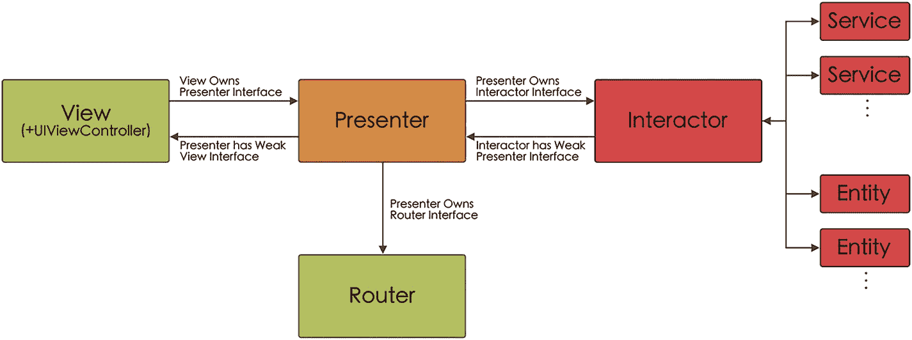

# 5. VIPER：视图-交互器-展示器-实体-路由器

## 什么是 VIPER？

### 一点历史

VIPER 由 Jeff Gilbert 和 Conrad Stoll 于 2014 年提出，它是首次尝试应用整洁架构（我们在第 1 章中介绍过）的实践，创建了一系列组件，每个组件都承担着独一无二的职责。^(¹¹)

VIPER 是 View（视图）、Interactor（交互器）、Presenter（展示器）、Entity（实体）和 Router（路由器）的首字母缩写，其目标是将一个功能或实现划分为五个不同的层级，并汇集在一个模块内（图 5-1）。

### 工作原理

使用这些组件使我们能够在应用程序内分离职责，从而遵循单一职责原则。此外，由于我们在各层之间使用协议（接口）进行通信，因此也遵循了接口隔离原则。

VIPER 模式的流程图包含视图、交互器、展示器、实体和路由器。

图 5-1 VIPER 模式

### VIPER 中的组件

现在我们来详细了解该架构中的每个组件。

#### 视图

视图，包含 `UIViewController`：

*   它不包含任何逻辑，仅由被动元素组成：按钮、标签、视图……
*   它将用户交互发送给展示器。
*   它知道如何展示从展示器接收到的信息。
*   它不会向展示器请求信息，而是由展示器在需要更新视图时主动发送信息。

