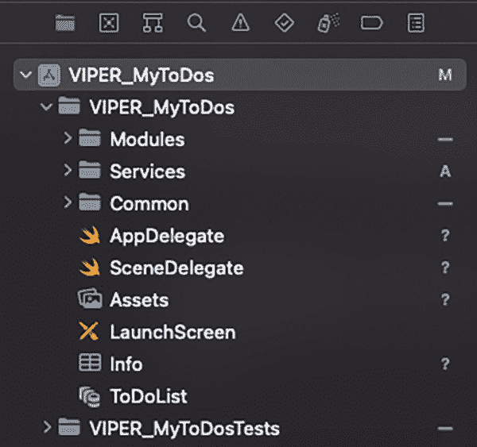

# 路由器

路由器在屏幕创建和导航方面承担多项职责：

*   它负责创建屏幕（`UIViewController`）。
*   它负责管理从一个屏幕到另一个屏幕的导航（包含导航逻辑）。
*   它拥有 `UINavigationController` 和 `UIViewController` 的所有权。
*   它类似于我们在第 4 章末尾 MVVM-C 架构中提到的 Coordinator。

### VIPER 的优缺点

在开发项目时，VIPER 架构因其追求“整洁架构”而具有许多优点，但也存在一些缺点。

### 优点

VIPER 架构的主要优点如下：

*   由于将单一职责原则（SRP）作为基本原则，代码更加整洁。
*   代码耦合度更低。
*   由于这些特性，编写单元测试更加简单。
*   开发代码时抽象程度更高，因此更容易添加新功能并扩展产品规模。
*   层级之间的职责分离意味着，例如，交互器只包含业务逻辑，完全独立于视图，这使得编写自动化测试更加容易。
*   由于业务逻辑被隔离等特性，它被认为是处理复杂应用程序时非常有用的架构。
*   由于使用具有明确定义通信接口的独立模块，我们可以将项目的开发工作分配给多个团队。

### 缺点

VIPER 架构的主要缺点如下：

*   每个模块包含如此多的类：视图、交互器、展示器、实体、路由器……导致项目最终拥有大量的代码和类。
*   必须编写大量的样板代码。
*   它通常不适用于那些不打算扩展新功能的小型应用。
*   学习 VIPER 起初可能令人生畏，尤其是对于新手开发者。
*   为了便于模块复用，最好不要使用 Segue 进行屏幕间导航。

## VIPER 应用

了解了 VIPER 架构的特点后，我们将在开发应用程序时应用它们。

注意

整个项目可以从本书的代码仓库中下载。在解释如何将 VIPER 架构应用于我们的项目时，我们只会展示代码中最相关的部分。

### 组件之间的通信

正如我们所解释的，该架构中不同组件之间的通信是通过协议进行的。我们可以根据与展示器相关的数据流（`Input`/`Output`）来定义每一个协议，然后将其应用于相应的组件。


### 展示层与视图之间的通信

我们将为 `Presenter` 和 `View` 建立两个协议：一个用于 `Presenter` 的输入，一个用于 `Presenter` 的输出（列表 5-1）。

```swift
// MARK: 视图输入 (视图 -> 展示层)
protocol ViewToPresenterProtocol {
    var view: PresenterToViewProtocol? { get set }
    var interactor: PresenterToInteractorProtocol? { get set }
    var router: PresenterToRouterProtocol? { get set }
}

// MARK: 视图输出 (展示层 -> 视图)
protocol PresenterToViewProtocol { }
```

*列表 5-1 展示层相对于视图的输入/输出协议*

开发 `Presenter` 时，我们将使其遵循视图相对于展示层的输入协议（`View` -> `Presenter`）。该协议包含三个重要参数，这些参数将其与 `View`、`Interactor` 和 `Router` 绑定（列表 5-2）。

```swift
class Presenter: ViewToPresenterProtocol {
    var view: PresenterToViewProtocol?
    var interactor: PresenterToInteractProtocol?
    var router: PresenterToRouterProtocol?
    ...
}
```

*列表 5-2 展示层与视图之间输入协议的应用*

另一方面，开发 `View` 时，我们将使其符合展示层到视图的输出协议（`Presenter` -> `View`）。为了组织代码，我们可以将其作为扩展来应用（列表 5-3）。

```swift
extension ViewController: PresenterToViewProtocol { }
```

*列表 5-3 展示层与视图之间输出协议的应用*

### 展示层与交互器之间的通信

我们将为 `Presenter` 和 `Interactor` 建立两个协议：一个用于 `Presenter` 的输入，一个用于 `Presenter` 的输出（列表 5-4）。

```swift
// MARK: 交互器输入 (展示层 -> 交互器)
protocol PresenterToInteractorHomeProtocol {
    var presenter: InteractorToPresenterProtocol? { get set }
}

// MARK: 交互器输出 (交互器 -> 展示层)
protocol InteractorToPresenterProtocol: AnyObject { }
```

*列表 5-4 展示层相对于交互器的输入/输出协议*

开发 `Presenter` 时，我们将使其遵循从 `Presenter` 到 `Interactor` 的输出协议（通过扩展）（列表 5-5）。

```swift
extension Presenter: InteractorToPresenterProtocol { }
```

*列表 5-5 展示层与交互器之间输出协议的应用*

另一方面，开发 `Interactor` 时，必须使其符合 `Presenter` 与 `Interactor` 之间的输入协议（列表 5-6）。

```swift
class Interactor: PresenterToInteractorHomeProtocol {
    var presenter: InteractorToPresenterHomeProtocol?
    ...
}
```

*列表 5-6 展示层与交互器之间输出协议的应用*

### 展示层与路由器之间的通信

`Presenter` 和 `Router` 之间的通信是单向的，因此我们只需在 `Presenter` 和 `Router` 之间建立一个输入协议。

该协议包含主要方法 `createScreen()`，它允许我们创建 `UIViewController`（`View`）（列表 5-7）。

```swift
// MARK: 路由器输入 (展示层 -> 路由器)
protocol PresenterToRouterProtocol {
    func createScreen() -> UIViewController
}
```

*列表 5-7 展示层相对于路由器的输入协议*

该协议将是 `Router` 必须遵循的协议（列表 5-8）。

```swift
class Router: PresenterToRouterProtocol {
    static func createScreen() -> UIViewController {
        let presenter: ViewToPresenterProtocol & InteractorToPresenterProtocol = Presenter()
        let viewController = ViewController()
        viewController.presenter = presenter
        viewController.presenter.router = Router()
        viewController.presenter?.view = viewController
        viewController.presenter?.interactor = Interactor()
        viewController.presenter?.interactor?.presenter = presenter
        return viewController
    }
}
```

*列表 5-8 展示层与路由器之间输出协议的应用*

我们为这些协议展示的内容是基础内容，之后我们需要根据每个屏幕的需求对其进行完善（某些情况下可能需修改）。

## VIPER 分层

与之前按功能（视图、展示层、视图模型...）组织文件的架构不同，在 VIPER 中，我们将按模块划分文件，每个屏幕一个模块，其中包含协议、视图、交互器的引入和路由器；用于与数据库通信的服务；以及最后的组件元素：数据库、UI 组件、扩展等（图 5-2）。



*图 5-2 VIPER 文件夹项目结构*

### 模块

正如我们刚才讨论的，`Modules` 文件夹将为每个屏幕包含一个子文件夹。这些子文件夹中的每一个都有五个文件。因此，例如，对于 `Home` 屏幕，我们将有 `HomeProtocols`、`HomeViewController`、`HomePresenter`、`HomeInteractor` 和 `HomeRouter`。

### 服务

这里我们将有 `TaskService` 和 `TasksListService` 类，它们允许我们向数据库发送信息（创建、更新或删除）或从数据库检索信息并将其转换为模型。

### 公共部分

##### Core Data

在此文件夹中，我们将包含 `CoreDataManager.swift` 文件，以及由 Xcode 为数据库实体自动创建的四个文件。

### 组件

在此文件夹中，我们将包含在不同屏幕中使用的视觉元素：标签、按钮、单元格等。

##### 模型

这里我们有可以将数据库实体转换成的模型。此外，我们将创建一个模型必须遵循的协议，以便在模型和实体之间进行转换。

##### 扩展

在本例中，我们创建了一个 `UIColor` 扩展，以便轻松访问为此应用专门创建的颜色；以及一个 `NSManagedObject` 类的扩展，该扩展将防止我们在进行测试部分时与上下文发生冲突。

##### 辅助工具

它们包含我们将要在应用程序中使用的常量参数。

### MyToDos 应用程序屏幕

在使用 VIPER 架构时，不仅要清楚在此架构的每个组件中引入哪些功能，还要在每个组件之间建立适当的通信协议，正如我们之前提到的。

与我们在前几章中看到的架构不同，在本例中，我们将把 `View` 和 `Controller` 的代码合并，以简化开发。

#### AppDelegate 和 SceneDelegate

通过在每个屏幕的 `Router` 类中拥有一个实例化配置屏幕所需各类的函数，从 `SceneDelegate` 访问 `Home` 屏幕的方式比我们之前看到的架构更简化（列表 5-9）。

```swift
func scene(_ scene: UIScene, willConnectTo session: UISceneSession, options connectionOptions: UIScene.ConnectionOptions) {
    if let windowScene = scene as? UIWindowScene {
        let window = UIWindow(windowScene: windowScene)
        window.backgroundColor = .white
        window.rootViewController = HomeRouter.createScreen()
        self.window = window
        window.makeKeyAndVisible()
    }
}
```

*列表 5-9 从 SceneDelegate 访问 Home*


