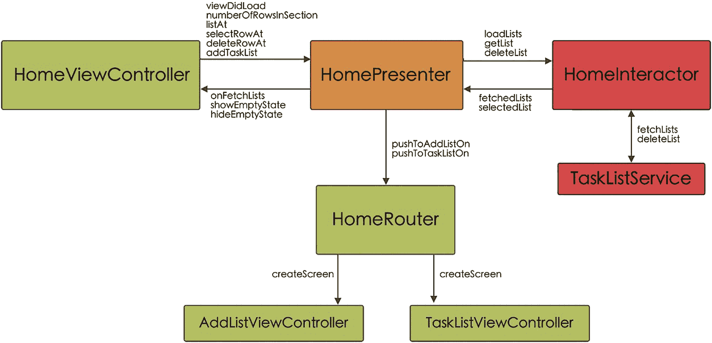
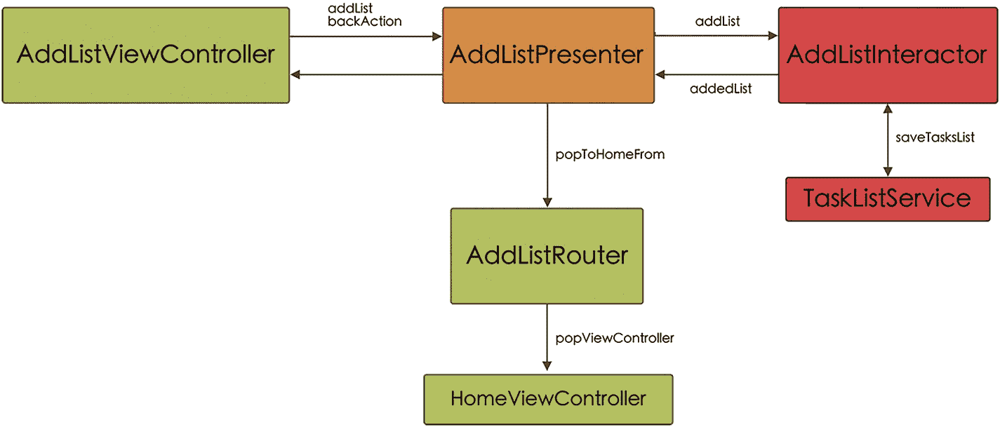

# 主屏幕模块

`Home` 模块负责显示主屏幕，并建立与用户的不同交互（图 5-3）。



该架构由相互连接的主视图控制器、主表现器、主交互器和主路由器组成。

**图 5-3** 主屏幕模块组件通信架构

## 主屏幕协议

根据主屏幕对应模块的图表，以及我们在研究不同组件间通信时看到的示例，我们可以为此案例建立通信接口（协议）。

`Router` 只有一个输入协议；它包含了创建屏幕的静态方法，以及用于 `AddListViewController` 和 `TaskListViewController` 的导航方法（代码清单 5-10）。

```
// MARK: Router Input
protocol PresenterToRouterHomeProtocol {
static func createScreen() -> UINavigationController
func pushToAddListOn(view: PresenterToViewHomeProtocol)
func pushToTaskListOn(view: PresenterToViewHomeProtocol, taskList: TasksListModel)
}
```

**代码清单 5-10** `PresenterToRouterHomeProtocol` 代码

关于 `View` 和 `Presenter`，我们有两个协议：一个用于输入，一个用于输出（针对 `View`）。

输入协议 `ViewToPresenterHomeProtol` 使得 `View` 能够与 `Presenter` 通信。基本上，我们将拥有与展示任务列表的表格的构建和操作相关的方法（代码清单 5-11）。

```
// MARK: View Input
protocol ViewToPresenterHomeProtocol {
var view: PresenterToViewHomeProtocol? { get set }
var interactor: PresenterToInteractorHomeProtocol? { get set }
var router: PresenterToRouterHomeProtocol? { get set }
func viewDidLoad()
func numberOfRowsInSection() -> Int
func listAt(indexPath: IndexPath) -> TasksListModel
func selectRowAt(indexPath: IndexPath)
func deleteRowAt(indexPath: IndexPath)
func addTaskList()
}
```

**代码清单 5-11** `ViewToPresenterHomeProtocol` 代码

另一方面，我们将拥有输出协议 `PresenterToViewHomeProtocol`，它允许 `Presenter` 与 `View` 通信（代码清单 5-12）。

```
// MARK: View Output
protocol PresenterToViewHomeProtocol {
func onFetchLists()
func showEmptyState()
func hideEmptyState()
}
```

**代码清单 5-12** `PresenterToViewHomeProtocol` 代码

最后，我们将拥有两个与 `Presenter` 和 `Interactor` 相关的协议。

第一个协议 `PresenterToInteractorHomeProtocol` 向我们展示了 `Presenter` 如何与 `Interactor` 通信（代码清单 5-13）。

```
protocol PresenterToInteractorHomeProtocol {
var presenter: InteractorToPresenterHomeProtocol? { get set }
func loadLists()
func getListAt(indexPath: IndexPath)
func deleteListAt(indexPath: IndexPath)
}
```

**代码清单 5-13** `PresenterToInteractorHomeProtocol` 代码

第二个协议 `InteractorToPresenterHomeProtocol` 展示了从 `Interactor` 到 `Presenter` 的通信（代码清单 5-14）。

```
protocol InteractorToPresenterHomeProtocol {
func fetchedLists(taskLists: [TasksListModel])
func selectedList(taskList: TasksListModel?)
}
```

**代码清单 5-14** `InteractorToPresenterHomeProtocol` 代码

这些协议是模块开发的最终成果。现在让我们看看它们从何而来，以及我们如何实现它们。

## HomeRouter

正如我们所见，`HomeRouter` 负责实例化主屏幕以及它与其他屏幕之间的导航流程。

对于 `HomeRouter` 类，如代码清单 5-15 所示，它必须采用 `PresenterToRouterHomeProtocol` 协议，并实现其所有方法。

```
class HomeRouter: PresenterToRouterHomeProtocol {
static func createScreen() -> UINavigationController {
let presenter: ViewToPresenterHomeProtocol & InteractorToPresenterHomeProtocol = HomePresenter()
let viewController = HomeViewController()
viewController.presenter = presenter
viewController.presenter.router = HomeRouter()
viewController.presenter?.view = viewController
viewController.presenter?.interactor = HomeInteractor(tasksListService: TasksListService())
viewController.presenter?.interactor?.presenter = presenter
let navigationController = UINavigationController(rootViewController: viewController)
navigationController.interactivePopGestureRecognizer?.isEnabled = false
navigationController.navigationBar.isHidden = true
return navigationController
}
func pushToAddListOn(view: PresenterToViewHomeProtocol) {
let addListController = AddListRouter.createScreen()
let viewController = view as! HomeViewController
viewController.navigationController?
.pushViewController(addListController, animated: true)
}
func pushToTaskListOn(view: PresenterToViewHomeProtocol, taskList: TasksListModel) {
let taskListController = TaskListRouter.createScreenFor(list: taskList)
let viewController = view as! HomeViewController
viewController.navigationController?
.pushViewController(taskListController, animated: true)
}
}
```

**代码清单 5-15** `HomeRouter` 代码，采用 `PresenterToRouterHomeProtocol`

如您所见，我们有一个创建模块并返回组件（此处为 `UINavigationController`，因为它是应用程序的主屏幕）的方法。

另外两个方法 `pushToAddListOn` 和 `pushToTaskListOn` 分别负责构建并导航至 `AddList` 和 `TasksList` 模块。通过这种方式，我们将导航逻辑与 `UIViewController` 再次分离，将其功能限定在纯粹的视觉层面。

## HomeViewController

`HomeViewController` 类负责构建和显示用户将与之交互的 `View`。由于 `View` 与 `Presenter` 交互，我们将拥有一个类型为 `ViewToPresenterHomeProtocol` 的 `presenter` 变量，它允许 `View` 与 `Presenter` 通信（代码清单 5-16）。

```
class HomeViewController: UIViewController {
...
var presenter: ViewToPresenterHomeProtocol!
override func loadView() {
super.loadView()
setupHomeView()
presenter.viewDidLoad()
}
...
}
private extension HomeViewController {
...
@objc func addListAction() {
presenter.addTaskList()
}
}
extension HomeViewController: UITableViewDelegate {
...
func tableView(_ tableView: UITableView, didSelectRowAt indexPath: IndexPath) {
presenter.selectRowAt(indexPath: indexPath)
}
}
extension HomeViewController: UITableViewDataSource {
...
func tableView(_ tableView: UITableView, numberOfRowsInSection section: Int) -> Int {
return presenter.numberOfRowsInSection()
}
func tableView(_ tableView: UITableView, cellForRowAt indexPath: IndexPath) -> UITableViewCell {
let cell = tableView.dequeueReusableCell(withIdentifier: ToDoListCell.reuseId, for: indexPath) as! ToDoListCell
cell.setCellParametersForList(presenter.listAt(indexPath: indexPath))
return cell
}
func tableView(_ tableView: UITableView, commit editingStyle: UITableViewCell.EditingStyle, forRowAt indexPath: IndexPath) {
if editingStyle == .delete {
presenter.deleteRowAt(indexPath: indexPath)
}
}
}
extension HomeViewController: PresenterToViewHomeProtocol {
func onFetchLists() {
tableView.reloadData()
}
func showEmptyState() {
emptyState.isHidden = false
}
func hideEmptyState() {
emptyState.isHidden = true
}
}
```

**代码清单 5-16** `HomeViewController` 代码（仅显示与表现器交互的部分）

在代码的最后部分，我们可以看到 `HomeViewController` 如何采用 `PresenterToViewHomeProtocol` 协议。这是因为，正如我们将看到的，`HomePresenter` 通过一个类型为 `PresenterToViewHomeProtocol` 的 `view` 变量与 `HomeViewController` 关联。


### `HomePresenter`

`HomePresenter`（即`HomeViewPresenter`）绑定到`HomeRouter`、`HomeViewController`和`HomeViewInteractor`。由于`HomePresenter`从`HomeViewController`和`HomeInteractor`接收事件，因此在两个类中都创建了两个`presenter`变量：

```swift
// HomeViewController.swift
var presenter: ViewToPresenterHomeProtocol!
// HomeInteractor.swift
var presenter: InteractorToPresenterHomeProtocol?
```

因此，`HomePresenter`类需要采用这两个协议才能与这些类通信。

因此，我们可以创建该类并使其符合`ViewToPresenterHomeProtocol`。该协议包含与视图中显示的信息（`numberOfRowsInSection`、`listAt`）或与视图的交互（`selectRowAt`、`deleteRowAt`、`addTaskList`）相关的方法。我们还引入了一个`viewDidLoad`方法，允许我们在进入此屏幕时加载任务列表（清单 5-17）。

```swift
class HomePresenter: ViewToPresenterHomeProtocol {
    var view: PresenterToViewHomeProtocol?
    var interactor: PresenterToInteractorHomeProtocol?
    var router: PresenterToRouterHomeProtocol?
    var lists: [TasksListModel] = [TasksListModel]()

    func viewDidLoad() {
        NotificationCenter.default.addObserver(self,
            selector: #selector(fetchLists),
            name: NSNotification.Name.NSManagedObjectContextObjectsDidChange,
            object: CoreDataManager.shared.mainContext)
        interactor?.loadLists()
    }

    func numberOfRowsInSection() -> Int {
        lists.count
    }

    func listAt(indexPath: IndexPath) -> TasksListModel {
        lists[indexPath.row]
    }

    func selectRowAt(indexPath: IndexPath) {
        interactor?.getListAt(indexPath: indexPath)
    }

    func deleteRowAt(indexPath: IndexPath) {
        interactor?.deleteListAt(indexPath: indexPath)
    }

    func addTaskList() {
        router?.pushToAddListOn(view: view!)
    }

    @objc private func fetchLists() {
        interactor?.loadLists()
    }
}
```
*清单 5-17 – 采用`ViewToPresenterHomeProtocol`的`HomePresenter`代码*

另一方面，通过一个扩展，我们将使`HomePresenter`符合`InteractorToPresenterHomeProtocol`协议。这样，当我们调用 Interactor（例如加载列表、选择列表或删除列表）时，该协议方法的实现将允许我们从 Interactor 接收信息并采取相应操作（显示列表或`EmptyState`，或导航到`TaskList`屏幕），如清单 5-18 所示。

```swift
extension HomePresenter: InteractorToPresenterHomeProtocol {
    func fetchedLists(taskLists: [TasksListModel]) {
        lists = taskLists
        taskLists.count == 0 ? view?.showEmptyState() : view?.hideEmptyState()
        view?.onFetchLists()
    }

    func selectedList(taskList: TasksListModel?) {
        guard let taskList = taskList else {
            return
        }
        router?.pushToTaskListOn(view: view!, taskList: taskList)
    }
}
```
*清单 5-18 – 在`HomePresenter`中采用`InteractorToPresenterHomeProtocol`*

---

### `HomeInteractor`

`HomeInteractor`包含应用程序的业务逻辑。它负责与数据库通信，并将必要的信息返回给`HomePresenter`。

此类必须实现`PresenterToInteractorHomeProtocol`（清单 5-19）。

```swift
class HomeInteractor: PresenterToInteractorHomeProtocol {
    var presenter: InteractorToPresenterHomeProtocol?
    var lists: [TasksListModel] = [TasksListModel]()
    var tasksListService: TasksListServiceProtocol!

    init(tasksListService: TasksListServiceProtocol) {
        self.tasksListService = tasksListService
    }

    func loadLists() {
        lists = (tasksListService?.fetchLists())!
        presenter?.fetchedLists(taskLists: lists)
    }

    func getListAt(indexPath: IndexPath) {
        guard lists.indices.contains(indexPath.row) else {
            presenter?.selectedList(taskList: nil)
            return
        }
        presenter?.selectedList(taskList: lists[indexPath.row])
    }

    func deleteListAt(indexPath: IndexPath) {
        guard lists.indices.contains(indexPath.row) else { return }
        tasksListService.deleteList(lists[indexPath.row])
    }
}
```
*清单 5-19 – 实现`PresenterToInteractorHomeProtocol`的`HomeInteractor`代码*

可以看到，在`init`方法中，我们注入了`TasksListService`的实例，以便向数据库发送关于任务列表的请求。

---

### Add List Module

此屏幕负责添加任务列表及其组件之间的通信。根据 VIPER 架构，这些组件之间的通信如图 5-4 所示。


*图 5-4 – 添加列表模块组件通信示意图*

#### `AddListProtocols`

如果我们查看此模块的示意图，可以发现组件间通信中使用的方法已经减少。

例如，`PresenterToRouterAddListProtocol`协议除了创建屏幕的方法（`createScreen`）外，只有一个方法`popToHomeFrom`（用于返回`Home`屏幕）（清单 5-20）。

```swift
// MARK: Router Input
protocol PresenterToRouterAddListProtocol {
    static func createScreen() -> UIViewController
    func popToHomeFrom(view: PresenterToViewAddListProtocol)
}
```
*清单 5-20 – `PresenterToRouterAddListProtocol`代码*

对于`ViewToPresenterAddListProtocol`协议，我们有两个方法：`addList`，其功能是将创建的列表发送到数据库（在选择“Add List”按钮时调用），以及`backAction`，用于返回`Home`（清单 5-21）。

```swift
// MARK: View Input
protocol ViewToPresenterAddListProtocol {
    var view: PresenterToViewAddListProtocol? { get set }
    var interactor: PresenterToInteractorAddListProtocol? { get set }
    var router: PresenterToRouterAddListProtocol? { get set }
    func addList(taskList: TasksListModel)
    func backAction()
}
```
*清单 5-21 – `ViewToPresenterAddListProtocol`代码*

由于此屏幕执行的操作不需要更新，我们不会在`PresenterToViewAddListProtocol`协议中包含方法（但此处保留它以保持与其余模块相似的结构，便于学习）。

```swift
// MARK: View Output
protocol PresenterToViewAddListProtocol {}
```

`PresenterToInteractorAddListProtocol`用于连接 Presenter 和 Interactor，只有一个`addList`方法，它将告诉 Interactor 将传入的任务列表保存到数据库（清单 5-22）。

```swift
// MARK: Interactor Input
protocol PresenterToInteractorAddListProtocol {
    var presenter: InteractorToPresenterAddListProtocol? { get set }
    func addList(taskList: TasksListModel)
}
```
*清单 5-22 – `PresenterToInteractorAddListProtocol`代码*

最后，我们有`InteractorToPresenterAddListProtocol`协议，只有一个方法`addedList`，用于通知 Presenter 任务列表已添加到数据库（清单 5-23）。

```swift
// MARK: Interactor Output
protocol InteractorToPresenterAddListProtocol {
    func addedList()
}
```
*清单 5-23 – `InteractorToPresenterAddListProtocol`代码*


