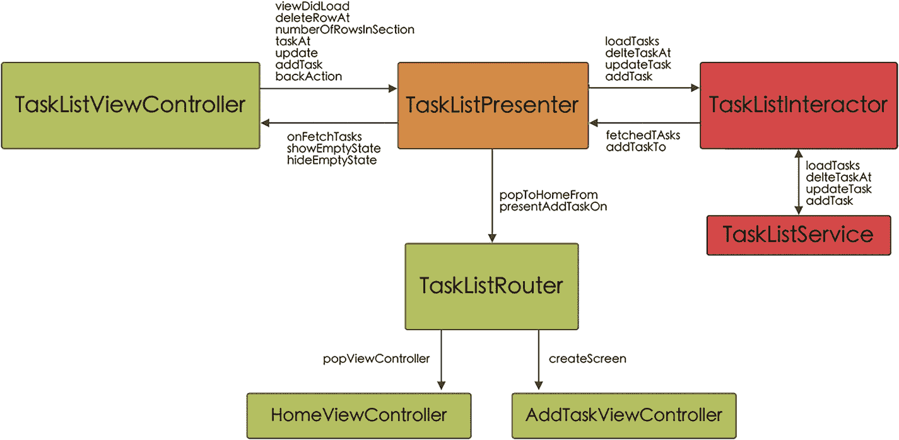

# AddListRouter

`AddListRouter`采用`PresenterToRouterAddListProtocol`协议，因此它必须实现两个方法：使用`createScreen`方法创建`AddList`模块，以及（在需要时）通过`popToHomeFrom`方法（参见 5-24）返回导航栈中的`Home`屏幕。

```swift
class AddListRouter: PresenterToRouterAddListProtocol {
    static func createScreen() -> UIViewController {
        let presenter: ViewToPresenterAddListProtocol & InteractorToPresenterAddListProtocol = AddListPresenter()
        let viewController = AddListViewController()
        viewController.presenter = presenter
        viewController.presenter.router = AddListRouter()
        viewController.presenter?.view = viewController
        viewController.presenter?.interactor = AddListInteractor(tasksListService: TasksListService())
        viewController.presenter?.interactor?.presenter = presenter
        return viewController
    }
    func popToHomeFrom(view: PresenterToViewAddListProtocol) {
        let viewController = view as! AddListViewController
        viewController.navigationController?.popViewController(animated: true)
    }
}
```

*列表 5-24* - `AddListRouter`必须采用`PresenterToRouterAddListProtocol`并实现其方法

### AddListViewController

正如我们在评论此模块中使用的不同协议时所见，`AddListViewController`不需要实现`PresenterToViewAddListProtocol`（该协议为空，我们保留该协议是为了维护每个模块中实现的各个协议结构）。

与`Presenter`的唯一关系将通过创建的变量实现，该变量使我们能够调用`Presenter`的`backAction`和`addList`函数（参见 5-25）。

```swift
class AddListViewController: UIViewController, PresenterToViewAddListProtocol {
    ...
    var presenter: ViewToPresenterAddListProtocol!
    ...
}
extension AddListViewController {
    ...
    @objc func backAction() {
        presenter.backAction()
    }
    ...
    @objc func addListAction() {
        guard titleTextfield.hasText else { return }
        listModel.title = titleTextfield.text
        listModel.id = ProcessInfo().globallyUniqueString
        listModel.icon = listModel.icon ?? "checkmark.seal.fill"
        listModel.createdAt = Date()
        presenter.addList(taskList: listModel)
    }
    ...
}
...
```

*列表 5-25* - `AddListViewController`实现

### AddListPresenter

在`AddListPresenter`中，我们有两个基本函数。第一个是通知`Interactor`应向数据库添加新的任务列表（`interactor?.addList`），另一个是通知`Router`应用程序应在列表添加完成或选中返回按钮时（参见 5-26）返回到`Home`屏幕（`router?.popToHomeFrom`）。

```swift
class AddListPresenter: ViewToPresenterAddListProtocol {
    var view: PresenterToViewAddListProtocol?
    var interactor: PresenterToInteractorAddListProtocol?
    var router: PresenterToRouterAddListProtocol?
    func addList(taskList: TasksListModel) {
        interactor?.addList(taskList: taskList)
    }
    func backAction() {
        router?.popToHomeFrom(view: view!)
    }
}
extension AddListPresenter: InteractorToPresenterAddListProtocol {
    func addedList() {
        router?.popToHomeFrom(view: view!)
    }
}
```

*列表 5-26* - `AddListPresenter`实现，遵循`ViewToPresenterAddListProtocol`和`InteractorToPresenterAddListProtocol`

### AddListInteractor

`AddListInteractor`的代码非常简单，因为您只需实现`PresenterToInteractorAddListProtocol`（`addList`）协议中的单一方法。在此方法中，您首先告诉数据库添加一个新的任务列表（通过`TasksListService`），然后通知`Presenter`列表已经添加（这将导致`Presenter`通知`Router`返回到`Home`）（参见 5-27）。

```swift
class AddListInteractor: PresenterToInteractorAddListProtocol {
    var presenter: InteractorToPresenterAddListProtocol?
    var tasksListService: TasksListServiceProtocol!
    init(tasksListService: TasksListServiceProtocol) {
        self.tasksListService = tasksListService
    }
    func addList(taskList: TasksListModel) {
        tasksListService.saveTasksList(taskList)
        presenter?.addedList()
    }
}
```

*列表 5-27* - `PresenterToInteractorAddListProtocol`实现，遵循`PresenterToInteractorAddListProtocol`

### 任务列表模块

此屏幕负责显示构成列表的任务，将它们标记为已完成、删除它们以及添加新任务。根据 VIPER 架构，这些组件之间的通信如图 5-5 所示。



*图 5-5* - 任务列表模块组件通信模式


