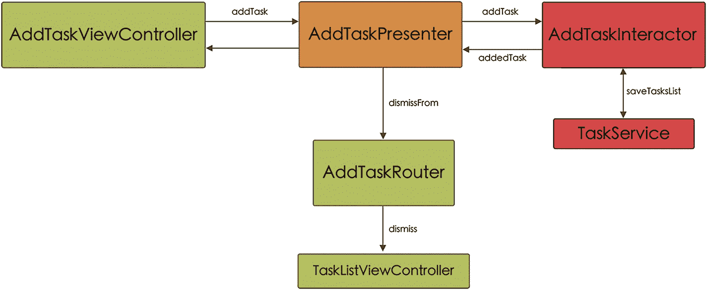

# TaskListProtocols

`TaskList`模块是构成应用程序的四个模块中最复杂的一个，因为它允许与用户进行更多交互：更新和删除任务、导航回主页或展示任务创建界面。因此，我们会看到在不同通信协议中有更多的方法。

在`TaskListProtocol`中，除了`createScreen`方法（在此处我们已修改该方法，用于传递我们想要显示的任务列表）之外，我们还有`presentAddTaskOn`方法，用于访问任务创建界面。如您所见，我们将传递要添加已创建任务的任务列表，以及`popToHomeFrom`方法，我们必须实现该方法以返回主页（列表 5-28）。

```
// MARK: Router Input
protocol PresenterToRouterTaskListProtocol {
static func createScreenFor(list: TasksListModel) -> UIViewController
func presentAddTaskOn(view: PresenterToViewTaskListProtocol, forTaskList: TasksListModel)
func popToHomeFrom(view: PresenterToViewTaskListProtocol)
}
```

*列表 5-28* `PresenterToRouterTaskListProtocol` 代码

如果我们现在看看管理视图和展示器之间通信的两个协议，我们可以看到，在`ViewToPresenterTaskListProtocol`协议的情况下，第一个方法在模块加载时执行（`viewDidLoad`），四个方法与显示和交互任务列表有关（`numberOfRowsInSection`、`taskAt`、`deleteRowAt`和`update`），还有两个方法与按钮操作有关（`addTask`和`backAction`）（列表 5-29）。

```
// MARK: View Input
protocol ViewToPresenterTaskListProtocol {
var view: PresenterToViewTaskListProtocol? { get set }
var interactor: PresenterToInteractorTaskListProtocol? { get set }
var router: PresenterToRouterTaskListProtocol? { get set }
func viewDidLoad()
func numberOfRowsInSection() -> Int
func taskAt(indexPath: IndexPath) -> TaskModel
func deleteRowAt(indexPath: IndexPath)
func update(task: TaskModel)
func addTask()
func backAction()
}
```

*列表 5-29* `ViewToPresenterTaskListProtocol` 代码

关于`PresenterToViewTaskListProtocol`协议，它将为我们提供必须在视图中实现的方法，包括重新加载要显示的数据以及显示或隐藏`EmptyState`（列表 5-30）。

```
// MARK: View Output
protocol PresenterToViewTaskListProtocol {
func onFetchTasks()
func showEmptyState()
func hideEmptyState()
}
```

*列表 5-30* `PresenterToViewTaskListProtocol` 代码

对于交互器和展示器之间的交互，我们将使用两个协议。第一个，`InteractorToPresenterTaskListProtocol`，指明了交互器必须实现的方法，所有这些方法都与任务相关：加载、添加、更新和删除（列表 5-31）。

```
// MARK: Interactor Input
protocol PresenterToInteractorTaskListProtocol {
var presenter: InteractorToPresenterTaskListProtocol? { get set }
func loadTasks()
func deleteTaskAt(indexPath: IndexPath)
func updateTask(task: TaskModel)
func addTask()
}
```

*列表 5-31* `PresenterToInteractorTaskListProtocol` 代码

在第二个协议`InteractorToPresenterTaskListProtocol`中，我们拥有将在展示器中实现的方法，这些方法将允许我们访问数据库以从列表中获取任务，或与路由器通信以使其不展示添加任务界面（列表 5-32）。

```
// MARK: Interactor Output
protocol InteractorToPresenterTaskListProtocol {
func fetchedTasks(tasks: [TaskModel])
func addTaskTo(list: TasksListModel)
}
```

*列表 5-32* `InteractorToPresenterTaskListProtocol` 代码

## TaskListRouter

正如我们已经知道的，`TaskListRouter`类必须符合`PresenterToRouterTaskListProtocol`协议并实现其方法。这些方法将使我们能够创建模块、展示任务创建界面以及返回主页界面（列表 5-33）。

```
class TaskListRouter: PresenterToRouterTaskListProtocol {
    static func createScreenFor(list: TasksListModel) -> UIViewController {
        let presenter: ViewToPresenterTaskListProtocol & InteractorToPresenterTaskListProtocol = TaskListPresenter()
        let viewController = TaskListViewController()
        viewController.presenter = presenter
        viewController.presenter.router = TaskListRouter()
        viewController.presenter?.view = viewController
        viewController.presenter?.interactor = TaskListInteractor(taskList: list, taskService: TaskService())
        viewController.presenter?.interactor?.presenter = presenter
        return viewController
    }
    
    func presentAddTaskOn(view: PresenterToViewTaskListProtocol, forTaskList: TasksListModel) {
        let addTaskController = AddTaskRouter.createScreenFor(list: forTaskList)
        let viewController = view as! TaskListViewController
        addTaskController.modalPresentationStyle = .pageSheet
        viewController.present(addTaskController, animated: true)
    }
    
    func popToHomeFrom(view: PresenterToViewTaskListProtocol) {
        let viewController = view as! TaskListViewController
        viewController.navigationController?.popViewController(animated: true)
    }
}
```

*列表 5-33* 在`TaskListRouter`中实现`PresenterToRouterTaskListProtocol`

## TaskListViewController

`TaskListViewController`负责在屏幕上向我们显示属于某个特定列表的任务（如果没有任务，则显示`EmptyState`）。该界面提供了与用户交互的多种可能性：删除或更新任务、按下“添加任务”按钮或按下按钮返回主页。

所有这些操作，以及一些其他操作（例如配置表格的不同单元格或了解表格中的行数），都将通过`presenter`变量（其类型为`ViewToPresenterTaskListProtocol`）传递到展示器（列表 5-34）。

```
class TaskListViewController: UIViewController {
    ...
    var presenter: ViewToPresenterTaskListProtocol!
    ...
}

private extension TaskListViewController {
    ...
    @objc func backAction() {
        presenter.backAction()
    }
    ...
    @objc func addTaskAction() {
        presenter?.addTask()
    }
}

extension TaskListViewController: UITableViewDelegate, UITableViewDataSource {
    ...
    func tableView(_ tableView: UITableView, numberOfRowsInSection section: Int) -> Int {
        return presenter.numberOfRowsInSection()
    }
    
    func tableView(_ tableView: UITableView, cellForRowAt indexPath: IndexPath) -> UITableViewCell {
        let cell = tableView.dequeueReusableCell(withIdentifier: TaskCell.reuseId, for: indexPath) as! TaskCell
        cell.setParametersForTask(presenter.taskAt(indexPath: indexPath))
        cell.delegate = self
        return cell
    }
    ...
    func tableView(_ tableView: UITableView, commit editingStyle: UITableViewCell.EditingStyle, forRowAt indexPath: IndexPath) {
        if editingStyle == .delete {
            presenter.deleteRowAt(indexPath: indexPath)
        }
    }
}

extension TaskListViewController: TaskCellDelegate {
    func updateTask(_ task: TaskModel) {
        presenter.update(task: task)
    }
}
```

*列表 5-34* `TaskListViewController` 代码

另一方面，`TaskListViewController`必须实现`PresenterToViewTaskListProtocol`协议，以便展示器能够进行更新视图所需的调用（例如重新加载任务列表或显示/隐藏`EmptyState`）（列表 5-35）。

```
extension TaskListViewController: PresenterToViewTaskListProtocol {
    func onFetchTasks() {
        tableView.reloadData()
    }
    
    func showEmptyState() {
        emptyState.isHidden = false
    }
    
    func hideEmptyState() {
        emptyState.isHidden = true
    }
}
```

*列表 5-35* `TaskListViewController` 必须实现 `PresenterToViewTaskListProtocol` 方法


### `TaskListPresenter`

`TaskListsPresenter`，由于它与`TaskListViewController`和`TaskListInteractor`的关系，必须实现相应的协议。

第一个协议`ViewToPresenterTaskListProtocol`迫使我们实现必要的方法，以便视图可以将请求发送给 Presenter。这些方法中的大多数是需要传递给`TaskListInteractor`以访问数据库的请求，例如检索任务、更新或删除任务（清单 5-36）。

```swift
class TaskListPresenter: ViewToPresenterTaskListProtocol {
    var view: PresenterToViewTaskListProtocol?
    var interactor: PresenterToInteractorTaskListProtocol?
    var router: PresenterToRouterTaskListProtocol?
    var tasks: [TaskModel] = [TaskModel]()
    func viewDidLoad() {
        NotificationCenter.default.addObserver(self,
                                               selector: #selector(fetchTasks),
                                               name: NSNotification.Name.NSManagedObjectContextObjectsDidChange,
                                               object: CoreDataManager.shared.mainContext)
        interactor?.loadTasks()
    }
    func numberOfRowsInSection() -> Int {
        tasks.count
    }
    func taskAt(indexPath: IndexPath) -> TaskModel {
        tasks[indexPath.row]
    }
    func deleteRowAt(indexPath: IndexPath) {
        interactor?.deleteTaskAt(indexPath: indexPath)
    }
    func update(task: TaskModel) {
        interactor?.updateTask(task: task)
    }
    func addTask() {
        interactor?.addTask()
    }
    @objc private func fetchTasks() {
        interactor?.loadTasks()
    }
    func backAction() {
        router?.popToHomeFrom(view: view!)
    }
}
// 清单 5-36
// TaskListPresenter 对 ViewToPresenterTaskListProtocol 的适配
```

`TaskListPresenter`对`InteractorToPresenterTaskListProtocol`协议的适配将使其能够响应来自`TaskListInteractor`的请求（清单 5-37）。

```swift
extension TaskListPresenter: InteractorToPresenterTaskListProtocol {
    func fetchedTasks(tasks: [TaskModel]) {
        self.tasks = tasks
        tasks.count == 0 ? view?.showEmptyState() : view?.hideEmptyState()
        view?.onFetchTasks()
    }
    func addTaskTo(list: TasksListModel) {
        router?.presentAddTaskOn(view: view!, forTaskList: list)
    }
}
// 清单 5-37
// TaskListPresenter 对 InteractorToPresenterTaskListProtocol 的适配
```

### `TaskListInteractor`

`TaskListInteractor`必须实现`PresenterToInteractorTaskListProtocol`协议。如你所见（清单 5-38），这些方法中的大多数都会通过`TaskService`对数据库进行调用。

```swift
class TaskListInteractor: PresenterToInteractorTaskListProtocol {
    var presenter: InteractorToPresenterTaskListProtocol?
    var tasks: [TaskModel] = [TaskModel]()
    var taskList: TasksListModel!
    var taskService: TaskServiceProtocol!
    init(taskList: TasksListModel, taskService: TaskServiceProtocol) {
        self.taskList = taskList
        self.taskService = taskService
    }
    func loadTasks() {
        tasks = (taskService?.fetchTasksForList(taskList))!
        presenter?.fetchedTasks(tasks: tasks)
    }
    func deleteTaskAt(indexPath: IndexPath) {
        guard tasks.indices.contains(indexPath.row) else { return }
        taskService.deleteTask(tasks[indexPath.row])
    }
    func updateTask(task: TaskModel) {
        taskService.updateTask(task)
    }
    func addTask() {
        presenter?.addTaskTo(list: taskList)
    }
}
// 清单 5-38
// TaskListInteractor 代码
```

#### Add Task 模块

该屏幕负责向给定列表添加任务。使用 VIPER 架构的组件之间的通信如图 5-6 所示。



*一个添加任务模块的流程图包含：添加任务视图控制器、添加任务 Presenter、添加任务路由器、添加任务交互器以及任务列表视图控制器。*

**图 5-6**
*添加任务模块组件通信架构*

##### `AddTaskProtocols`

与添加任务列表模块一样，此模块的功能很少（基本上只是添加一个任务），因此我们继续沿用与其他模块相同的协议，并且需要实现的方法数量更少。

例如，`PresenterToRouterAddTaskProtocol`除了`createScreen`方法之外，只会提供`dismissFrom`方法，该方法包含关闭添加任务屏幕的代码（清单 5-39）。

```swift
// MARK: Router Input
protocol PresenterToRouterAddTaskProtocol {
    static func createScreenFor(list: TasksListModel) -> UIViewController
    func dismissFrom(view: PresenterToViewAddTaskProtocol)
}
// 清单 5-39
// PresenterToRouterAddTaskProtocol 代码
```

在与视图和 Presenter 相关的两个协议中，只有`ViewToPresenterAddTaskProtocol`会包含内容（这与添加任务列表模块的情况相同）。此协议将由 Presenter 实现，并且与允许访问模块其他类（`view`、`interactor`和`router`）的变量一起，仅提供`addTask`方法（用于添加新任务）（清单 5-40）。

```swift
// MARK: View Input
protocol ViewToPresenterAddTaskProtocol {
    var view: PresenterToViewAddTaskProtocol? { get set }
    var interactor: PresenterToInteractorAddTaskProtocol? { get set }
    var router: PresenterToRouterAddTaskProtocol? { get set }
    func addTask(task: TaskModel)
}

// MARK: View Output
protocol PresenterToViewAddTaskProtocol {}
// 清单 5-40
// ViewToPresenterAddTaskProtocol 和 ViewToPresenterAddTaskProtocol 代码
```

`PresenterToInteractorAddTaskProtocol`（将由`AddTaskInteractor`实现）提供了一个单一的函数`addTask`，正如稍后我们将看到的，该函数将告诉数据库（通过`TaskService`）添加一个新任务，然后告诉 Presenter 任务已添加（清单 5-41）。

```swift
// MARK: Interactor Input
protocol PresenterToInteractorAddTaskProtocol {
    var presenter: InteractorToPresenterAddTaskProtocol? { get set }
    func addTask(task: TaskModel)
}
// 清单 5-41
// PresenterToInteractorAddTaskProtocol 代码
```

最后，我们将拥有`InteractorToPresenterAddTaskProtocol`（将由`AddTaskPresenter`实现），其唯一的方法是`addedTask`，通过它我们将告诉`AddTaskPresenter`任务已添加（清单 5-42）。

```swift
// MARK: Interactor Output
protocol InteractorToPresenterAddTaskProtocol {
    func addedTask()
}
// 清单 5-42
// InteractorToPresenterAddTaskProtocol 代码
```

### `AddTaskRouter`

正如我们在前面的模块中已经看到的，`AddTaskRouter`必须实现`PresenterToRouterAddTaskProtocol`协议，因此也要实现组成该协议的方法：`createScreenFor`和`dismissFrom`（清单 5-43）。

```swift
class AddTaskRouter: PresenterToRouterAddTaskProtocol {
    static func createScreenFor(list: TasksListModel) -> UIViewController {
        let presenter: ViewToPresenterAddTaskProtocol & InteractorToPresenterAddTaskProtocol = AddTaskPresenter()
        let viewController = AddTaskViewController()
        viewController.presenter = presenter
        viewController.presenter.router = AddTaskRouter()
        viewController.presenter?.view = viewController
        viewController.presenter?.interactor = AddTaskInteractor(taskList: list, taskService: TaskService())
        viewController.presenter?.interactor?.presenter = presenter
        return viewController
    }
    func dismissFrom(view: PresenterToViewAddTaskProtocol) {
        let viewController = view as! AddTaskViewController
        viewController.dismiss(animated: true)
    }
}
// 清单 5-43
// AddTaskRouter 类遵循 PresenterToRouterAddTaskProtocol
```


### `AddTaskViewController`

尽管它不包含任何方法，但为了保持协议的结构一致，我们将让 `AddTaskViewController` 遵循 `PresenterToViewAddTaskProtocol` 协议。

另一方面，借助 presenter 变量（类型为 `ViewToPresenterAddTaskProtocol`），我们可以向 Presenter 发出指令，告知其要添加一个任务（类型为 `TaskModel`）（见代码清单 5-44）。

```
class AddTaskViewController: UIViewController, PresenterToViewAddTaskProtocol {
...
var presenter: ViewToPresenterAddTaskProtocol!
...
}
extension AddTaskViewController {
...
@objc func addTaskAction() {
guard titleTextfield.hasText else { return }
taskModel.title = titleTextfield.text
taskModel.icon = taskModel.icon ?? "checkmark.seal.fill"
taskModel.done = false
taskModel.id = ProcessInfo().globallyUniqueString
taskModel.createdAt = Date()
presenter.addTask(task: taskModel)
}
...
}
...
代码清单 5-44
AddTaskViewController 类
```

### `AddTaskPresenter`

`AddTaskPresenter` 必须遵循两个协议：`ViewToPresenterAddTaskProtocol`（包含 View 可调用的方法）和 `InteractorToPresenterAddTaskProtocol`（包含 Interactor 可调用的方法）。

通过遵循第一个协议 `ViewToPresenterAddTaskProtocol`，View 将能够调用 `addTask` 方法并将包含用户想要创建的任务的对象传递给它。然后，Presenter 将与 Interactor 通信，负责在数据库中创建该任务（见代码清单 5-45）。

```
class AddTaskPresenter: ViewToPresenterAddTaskProtocol {
var view: PresenterToViewAddTaskProtocol?
var interactor: PresenterToInteractorAddTaskProtocol?
var router: PresenterToRouterAddTaskProtocol?
func addTask(task: TaskModel) {
interactor?.addTask(task: task)
}
}
代码清单 5-45
遵循 ViewToPresenterAddTaskProtocol 的 AddTaskPresenter 类
```

借助第二个协议 `InteractorToPresenterAddTaskProtocol`，Interactor 将能够告知 Presenter 它已经在数据库中创建了任务，因此 Presenter 可以通知 Router 关闭 `AddTask` 视图（见代码清单 5-46）。

```
extension AddTaskPresenter: InteractorToPresenterAddTaskProtocol {
func addedTask() {
router?.dismissFrom(view: view!)
}
}
代码清单 5-46
遵循 InteractorToPresenterAddTaskProtocol 的 AddTaskPresenter 扩展
```

### `AddTaskInteractor`

最后，我们来看 `AddTaskInteractor`，它必须遵循 `PresenterToInteractorAddTaskProtocol` 协议。正如我们所见，该协议仅包含一个方法（`addTask`），Presenter 将调用该方法来传递必须在数据库中创建的 `TaskModel` 对象（见代码清单 5-47）。

```
class AddTaskInteractor: PresenterToInteractorAddTaskProtocol {
var presenter: InteractorToPresenterAddTaskProtocol?
var taskList: TasksListModel!
var taskService: TaskServiceProtocol!
init(taskList: TasksListModel, taskService: TaskServiceProtocol) {
self.taskList = taskList
self.taskService = taskService
}
func addTask(task: TaskModel) {
taskService?.saveTask(task, in: taskList)
presenter?.addedTask()
}
}
代码清单 5-47
遵循 PresenterToInteractorAddTaskProtocol 的 AddTaskInteractor 类
```

## VIPER-MyToDos 测试

在 VIPER 架构中，我们打算测试的两个主要组件是 Interactor（负责应用业务逻辑）和 Presenter（负责更新 View 并与 Interactor 和 Router 通信）。

**注意：** 请记住，你可以在本书关联的代码仓库中找到包含测试的完整项目代码。

现在，作为一个示例，我们来看看如何为 `Home` 模块的 `HomePresenter` 和 `HomeInteractor` 类编写单元测试。

### `HomePresenter`

首先，我们将准备测试类的设置部分。在这个类中，我们的 `sut`（或 `system under test`，即被测系统）将是 `HomePresenter`，但我们还将创建不同类的实例，以便能够重建环境以及类之间的不同关系（见代码清单 5-48）。

```
import XCTest
@testable import VIPER_MyToDos
class HomePresenterTest: XCTestCase {
var sut: HomePresenter!
var view: HomeViewController!
var router: MockHomeRouter!
var interactor: HomeInteractor!
let taskList = TasksListModel(id: "12345-67890",
title: "Test List",
icon: "test.icon",
tasks: [TaskModel](),
createdAt: Date())
override func setUpWithError() throws {
sut = HomePresenter()
let mockTaskListService = MockTaskListService(lists: [taskList])
interactor = HomeInteractor(tasksListService: mockTaskListService)
interactor.presenter = sut
view = HomeViewController()
view.presenter = sut
router = MockHomeRouter()
sut.interactor = interactor
sut.view = view
sut.router = router
}
override func tearDownWithError() throws {
sut = nil
super.tearDown()
}
...
}
代码清单 5-48
HomePresenterTest 的设置
```

在这些实例中，有一个我们准备作为 `mock`（`MockTaskListService` 除外）的是 `MockHomeRouter`，这样我们就可以验证在调用其方法时应用程序的导航路径（见代码清单 5-49）。

```
import UIKit
@testable import VIPER_MyToDos
class MockHomeRouter: PresenterToRouterHomeProtocol {
var isPushedToAddList: Bool = false
var isPushedToTasksList: Bool = false
var selectedTaskList: TasksListModel = TasksListModel()
static func createScreen() -> UINavigationController {
UINavigationController()
}
func pushToAddListOn(view: PresenterToViewHomeProtocol) {
isPushedToAddList = true
}
func pushToTaskListOn(view: PresenterToViewHomeProtocol, taskList: TasksListModel) {
selectedTaskList = taskList
isPushedToTasksList = true
}
}
代码清单 5-49
MockHomeRouter 代码
```

如你所见，我们设置了一对变量：`isPushedToAddList` 和 `isPushedToTasksList`，初始值均为 `false`，但在调用相应方法时会变为 `true`。

现在我们可以继续测试 `HomePresenter` 的各个方法。

首先，我们测试在创建 `mockTaskListService` 实例时添加了一个列表的情况。一旦调用了 `viewDidLoad` 方法（如果我们查看 `HomePresenter` 类，该方法会调用 Interactor 的 `loadLists` 方法，该方法负责从数据库中检索列表并将其返回给 Presenter），表格中的行数应为 1，同时，表格中应存在一个对象（见代码清单 5-50）。

```
func testNumberOfRows_whenAddedOneList_shouldBeOne() {
sut.viewDidLoad()
XCTAssertTrue(sut.numberOfRowsInSection() == 1)
}
func testListAtIndex_whenAddedOneList_shouldExists() {
sut.viewDidLoad()
XCTAssertNotNil(sut.listAt(indexPath: IndexPath(row: 0, section: 0)))
}
代码清单 5-50
测试 MockTaskListService 中存在一个对象
```

接下来，我们编写一个测试，验证如果我们选择了一个单元格（直接传入 `IndexPath`），一方面，Router 会将我们重定向到 `TaskList` 模块，另一方面，我们传递的是包含所选列表的对象（见代码清单 5-51）。

```
func testSelectRowAtIndex_whenAddedOneList_shouldReturnList() {
sut.viewDidLoad()
sut.selectRowAt(indexPath: IndexPath(row: 0, section: 0))
XCTAssertTrue(router.isPushedToTasksList)
XCTAssertTrue(router.selectedTaskList.id == "12345-67890")
}
代码清单 5-51
selectRowAtIndex 测试
```

现在我们将测试删除列表的功能。为此，我们调用 `deleteRowAt` 方法（直接传入 `IndexPath`），然后检查 `lists` 变量是否为空（见代码清单 5-52）。


`func testDeleteRowAtIndex_whenDeleteAList_shouldBeZeroLists() {
    sut.viewDidLoad()
    sut.deleteRowAt(indexPath: IndexPath(row: 0, section: 0))
    XCTAssertTrue(sut.lists.isEmpty)
}
`

*列表 5-52. `deleteRowAtIndex` 的测试*

通过最后一个测试，我们将验证调用 `addTaskList` 方法时，路由器会将我们重定向到 `TaskList` 模块（列表 5-53）。

```
func testAddTaskList_whenAddTaskIsCalled_routerShouldNavigate() {
    sut.addTaskList()
    XCTAssertTrue(router.isPushedToAddList)
}
```

*列表 5-53. `addTaskList` 方法的测试*

### `HomeInteractor`

`HomeInteractorTest` 中的测试设置与 `HomePresenterTest` 类似；我们创建不同类的实例，以便配置环境及其关系。与 `HomePresenterTest` 相同，我们也将使用 `MockHomeRouter` 来模拟导航并进行测试（列表 5-54）。

```
import XCTest
@testable import VIPER_MyToDos
class HomeInteractorTest: XCTestCase {
    var sut: PresenterToInteractorHomeProtocol!
    var presenter: HomePresenter!
    var router: MockHomeRouter!
    var view: HomeViewController!
    let taskList = TasksListModel(id: "12345-67890",
                                  title: "Test List",
                                  icon: "test.icon",
                                  tasks: [TaskModel](),
                                  createdAt: Date())
    override func setUpWithError() throws {
        let mockTaskListService = MockTaskListService(lists: [taskList])
        sut = HomeInteractor(tasksListService: mockTaskListService)
        presenter = HomePresenter()
        router = MockHomeRouter()
        view = HomeViewController()
        presenter.router = router
        presenter.view = view
        sut.presenter = presenter
    }
    override func tearDownWithError() throws {
        sut = nil
        super.tearDown()
    }
    ...
}
```

*列表 5-54. `HomeInteractorTest` 的设置*

现在我们开始测试不同的方法。

通过第一个测试，我们验证了从数据库加载列表时，由于我们使用了预加载了 `TaskListModel` 对象的 `MockTaskListService`，将会向 Presenter 返回一个列表（列表 5-55）。

```
func testLoadLists_whenLoadLists_shouldBeOneList() {
    sut.loadLists()
    XCTAssertTrue(presenter.lists.count == 1)
}
```

*列表 5-55. 测试 `loadLists` 方法*

在以下方法中，我们将验证当在 Presenter 中选择一个列表，并将该列表的 `IndexPath` 传递给 Interactor 时，Interactor 会将相应的列表传递给 Presenter，然后该 Presenter 会告诉路由器通过将选定的列表传递给它来调用 `TaskList` 模块（列表 5-56）。

```
func testGetList_whenGetListIsCalled_shouldRouterNavigate() {
    sut.loadLists()
    sut.getListAt(indexPath: IndexPath(row: 0, section: 0))
    XCTAssertTrue(router.isPushedToTasksList)
    XCTAssertTrue(router.selectedTaskList.id == "12345-67890")
}
```

*列表 5-56. 测试选择列表时导航到 `TaskList` 模块*

最后，我们将检查删除列表的操作。为此，最后一个测试证明，在删除我们预加载到 `MockTaskListService` 中的唯一列表后，Presenter 的 `lists` 变量为空（列表 5-57）。

```
func testDeleteList_whenListIsDeleted_shouldBeZeroLists() {
    sut.loadLists()
    sut.deleteListAt(indexPath: IndexPath(row: 0, section: 0))
    sut.loadLists()
    XCTAssertTrue(presenter.lists.count == 0)
}
```

*列表 5-57. `deleteList` 方法的测试*

## 总结

VIPER 架构的诞生始终遵循 Clean Architecture 的概念，在此架构中，应用程序被划分为不同的层，每层都有明确定义的职责。这使得代码易于测试和复用。

功能的解耦和模块化使我们能够轻松地为项目添加新功能。

正如我们在本章开头所见，VIPER 架构有许多优点，但也有一些缺点，例如对于小型项目会带来一定的复杂性，或者出现大量重复代码（可以通过使用从互联网上找到的多种 Xcode 模板之一来简化和自动化 VIPER 中这些重复代码的创建）。

在下一章中，我们将看到一种遵循 Clean Code 原则的新架构：VIP（View–Interactor–Presenter）。这种架构已经开始拥有相当多的追随者，它试图解决 VIPER 架构中出现的一些情况：例如，它通过使组件之间的流成为单向来简化流程，而在 VIPER 中则是双向的。

脚注 1

