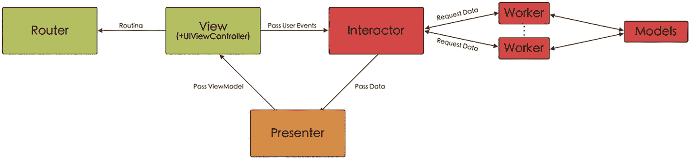

# 6. VIP: View–Interactor–Presenter

## 什么是 VIP？

### 一点历史

大约在 2015 年，Raymond Law 创建了所谓的 Clean Swift^(¹²) 或 VIP（View–Interactor–Presenter）架构，其思想是将 Clean Architecture（如我们在第一章 1 中所见）应用于 iOS 和 macOS 项目。

这种架构的范式是 VIP 循环中发生的单向流，即信息始终沿一个方向流动：从 View 到 Interactor，从 Interactor 到 Presenter，再从 Presenter 到 View。

### 工作原理

正如我们刚刚解释的，该架构的核心在于 View、Interactor 和 Presenter 之间的单向循环。然而，此架构的应用通常需要其他组件的存在（尽管取决于每个屏幕的复杂性，某些组件可能存在也可能不存在）：Router、Model 和 Worker。图 6-1 显示了组件之间的连接方式。

*一个视图交互器展示器模式的框图，流程从视图到路由器和交互器，再与展示器连接，然后进一步流向工作器和模型。*

**图 6-1. VIP 模式**

### VIP 中的组件

现在，我们将详细了解此架构中的各个组件。

**注意**

随着我们深入学习 VIP 架构，我们会发现生成的类、重复代码和通信协议的数量都很大。如果你在互联网上搜索，会找到许多模板示例，尽管它们都指代 VIP 架构，但由于是针对不同项目进行的适配，其命名、功能等方面可能存在一些差异。

