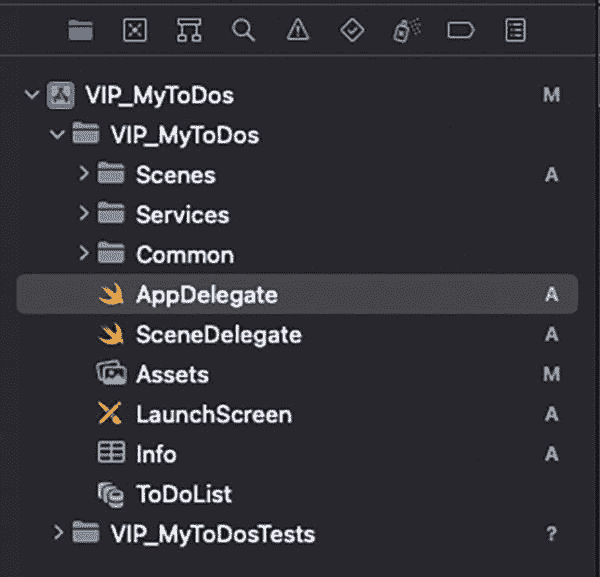
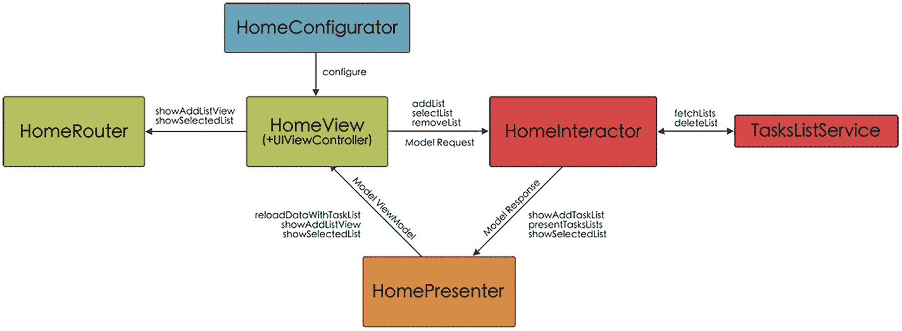
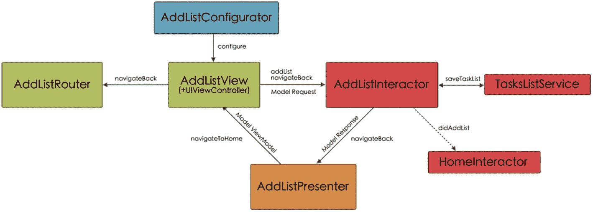

# VIP 的优点和缺点

在开发项目时，VIP 架构有很多优点，因为它追求“干净架构”，但也存在一些缺点。

### 优点

VIP 架构的主要优点如下：

- 它基于干净架构的原则。
- 它通过将所有逻辑传递给交互器来减小 ViewController 的规模。
- 它呈现单向数据流。
- 它是一种模块化且可重用的架构，因为大量使用协议允许对单个组件进行更改而不影响应用程序的其余部分。
- 应用单一职责原则减少了所使用方法的大小，这也利于模块化。
- 其结构易于维护，且任何错误都可以轻松纠正。
- 单元测试的实现很简单，这有利于通过 TDD（测试驱动开发）进行开发以及应用程序的可测试性。

### 缺点

VIP 架构也有缺点，例如：

- 该架构基于大量协议，这可能一开始会让人感到困惑（可以通过使用模板来减少这种困惑）。
- 使用如此多的协议使得编写大量代码成为必要，即使对于最简单的任务也是如此。
- 大量的代码使其不适合小型应用程序。
- 它可能看起来设计过度或过于复杂。
- 因此，它可能对刚起步的开发者缺乏吸引力。


### VIP 层级

与我们在前一章中将使用 VIPER 架构创建的项目划分为文件夹的方式类似，使用 VIP 架构时我们也会进行类似的操作，区别在于，现在不再是拥有一个包含多个模块的文件夹，而是拥有一个包含多个场景的文件夹。

每个场景对应一个屏幕，并包含视图（*UIView* 和 *UIViewController*）、交互器、展示器、配置器、路由器以及模型。我们还会有一个存放服务或工作器的文件夹，最后，还有一个存放通用组件的文件夹（图 6-2）。



VIP 文件夹项目窗口的截图，其中高亮显示了 App Delegate。

图 6-2 VIP 文件夹项目结构

#### 场景

正如我们刚才讨论的，`Scenes` 文件夹将为每个屏幕包含一个子文件夹。这些子文件夹中的每一个都包含七个文件。因此，例如，对于 *Home* 屏幕，我们将拥有 `HomeView`、`HomeViewController`、`HomePresenter`、`HomeInteractor`、`HomeRouter`、`HomeConfigurator` 和 `HomeModel`。

#### 服务/工作器

在这里，我们将拥有 `TaskService` 和 `TasksListService` 类，它们允许我们向数据库发送信息（创建、更新或删除信息），或者从数据库检索信息并将其转换为模型。

#### 通用

##### Core Data

在此文件夹中，我们将拥有 `CoreDataManager.swift` 文件，以及由 Xcode 为数据库实体自动创建的四个文件。

### 组件

在此文件夹中，我们将存放那些将在不同屏幕中使用的视觉元素：标签、按钮、单元格……

##### 模型

这里存放的是我们可以将数据库实体转换成的模型。此外，我们还将创建一个协议，模型必须遵守该协议，以便能够在模型和实体之间进行相互转换。

##### 扩展

在这种情况下，我们创建了一个 `UIColor` 扩展，以便能够轻松访问专门为此应用程序创建的颜色；以及一个针对 `NSManagedObject` 类的扩展，该扩展将防止我们在进行测试部分时与上下文发生冲突。

##### 辅助工具

它们包含了我们在应用程序中将要使用的常量参数。

### MyToDos 应用屏幕

正如我们所解释的，VIP 架构基于视图 - 交互器 - 展示器循环以及信息的单向流动。在此基础上，我们还将拥有其他组件，这些组件将在导航、信息检索等方面为我们提供帮助，例如路由器、配置器和工作器/服务，所有这些都是通过一系列协议或接口相互连接的。

与任何架构一样，如果你对它进行更深入的研究，你会发现协议的命名各不相同，它们使用工作器或服务或用例，是否使用配置器等等……关键是理解架构的基本思想，并使用我们最习惯的格式。

例如，在协议的命名中，我更喜欢使用输入/输出的术语来表示它们是组件的输入或输出函数。

#### AppDelegate 和 SceneDelegate

要启动应用程序，在 `SceneDelegate` 中，我们将创建第一个场景，即 *Home* 场景，通过实例化 `HomeViewController` 类（我们向其传递一个视图实例 `HomeView`）。接下来，我们使用 `HomeConfigurator` 配置 `HomeViewController`，并将其传递给 `UINavigationController` 组件，该组件将负责控制应用程序的所有导航（代码清单 6-8）。

```
func scene(_ scene: UIScene, willConnectTo session: UISceneSession, options connectionOptions: UIScene.ConnectionOptions) {
if let windowScene = scene as? UIWindowScene {
let window = UIWindow(windowScene: windowScene)
window.backgroundColor = .white
let homeViewController = HomeViewController(homeView: HomeView())
let navigationController = UINavigationController(rootViewController: HomeConfigurator.configure(homeViewController))
navigationController.navigationBar.isHidden = true
navigationController.interactivePopGestureRecognizer?.isEnabled = false
window.rootViewController = navigationController
self.window = window
window.makeKeyAndVisible()
}
}
```
代码清单 6-8 从 `SceneDelegate` 访问 Home

#### Home 场景

在图 6-3 中，我们可以看到构成 *Home* 场景的不同组件、它们是如何相互连接的、被调用的方法以及信息流的方向。



Home 场景不同组件的框图，包括 Home 路由器、Home 配置器、Home 视图、Home 交互器、Home 展示器和任务列表服务。

图 6-3 Home 场景组件及通信方案

##### HomeConfigurator

`HomeConfigurator` 负责获取一个 `HomeViewController` 实例，并建立场景的所有组件以及它们之间的依赖关系。

因此，在这个类中，我们将实例化 `HomeInteractor`（我们向其传递一个 `TasksListService` 实例，它将是允许我们访问数据库的工作器或服务）、`HomePresenter` 和 `HomeRouter`。接下来，我们建立每个组件之间的关系，最后返回已经配置好的 `HomeViewController` 实例（代码清单 6-9）。

```
final class HomeConfigurator {
static func configure(_ viewController: HomeViewController) -> HomeViewController {
let interactor = HomeInteractor(tasksListService: TasksListService())
let presenter = HomePresenter()
let router = HomeRouter()
router.viewController = viewController
presenter.viewController = viewController
interactor.presenter = presenter
viewController.interactor = interactor
viewController.router = router
return viewController
}
}
```
代码清单 6-9 `HomeConfigurator` 代码

##### HomeView

`HomeView` 类包含构成图形界面的不同元素，这些元素通过两种不同的方式与 `HomeViewController` 通信：直接方式，用于传递任务列表并将其显示在表格中（`showTasksLists`）；以及通过 `HomeViewDelegate` 协议的方法，`HomeViewController` 必须实现这些方法（代码清单 6-10）。

```
import UIKit

protocol HomeViewDelegate: AnyObject {
func addList()
func selectedListAt(index: IndexPath)
func deleteListAt(indexPath: IndexPath)
}

final class HomeView: UIView {
weak var delegate: HomeViewDelegate?
...
func showTasks(lists: [TasksListModel]) {
self.lists = lists
tableView.reloadData()
emptyState.isHidden = self.lists.count > 0
}
}

private extension HomeView {
...
@objc func addListAction() {
delegate?.addList()
}
...
}

extension HomeView: UITableViewDelegate {
...
func tableView(_ tableView: UITableView, didSelectRowAt indexPath: IndexPath) {
delegate?.selectedListAt(index: indexPath)
}
}

extension HomeView: UITableViewDataSource {
...
func tableView(_ tableView: UITableView, commit editingStyle: UITableViewCell.EditingStyle, forRowAt indexPath: IndexPath) {
if editingStyle == .delete {
delegate?.deleteListAt(indexPath: indexPath)
}
}
}
```
代码清单 6-10 `HomeView` 类代码，展示了 `HomeViewDelegate` 协议及其方法被调用的位置


### `HomeViewController`

我们可以将 `HomeViewController` 视为 VIP 循环的起点和终点。正如我们在解释 VIP 架构中使用的不同协议时所见，该类将与两个协议相关联：一个包含用于向 `HomeInteractor` 发送请求的方法（`HomeViewControllerOutput`），另一个则包含由 `HomePresenter` 调用、且需要由 `HomeViewController` 实现的方法（`HomeViewControllerInput`）（代码清单 6-11）。

```
protocol HomeViewControllerInput: AnyObject {
    func reloadDataWithTaskList(viewModel: HomeModel.FetchTasksLists.ViewModel)
    func showAddListView(viewModel: HomeModel.AddTasksList.ViewModel)
    func showSelectedList(viewModel: HomeModel.SelectTasksList.ViewModel)
}

protocol HomeViewControllerOutput: AnyObject {
    func fetchTasksLists(request: HomeModel.FetchTasksLists.Request)
    func addList(request: HomeModel.AddTasksList.Request)
    func selectList(request: HomeModel.SelectTasksList.Request)
    func removeList(request: HomeModel.RemoveTasksList.Request)
}
```
*代码清单 6-11 HomeViewControllerInput 与 HomeViewControllerOutput 协议*

在实例化 `HomeViewController` 的过程中，我们会向其传递一个 `HomeView` 的实例（这一步在 `HomeConfigurator` 中完成），并将其委托设置为 `HomeViewController`。因此，我们需要让该类遵循 `HomeViewDelegate` 协议（代码清单 6-12）。

```
final class HomeViewController: UIViewController {
    var interactor: HomeInteractorInput?
    var router: HomeRouterDelegate?
    private let homeView: HomeView

    init(homeView: HomeView) {
        self.homeView = homeView
        super.init(nibName: nil, bundle: nil)
    }

    required init?(coder: NSCoder) {
        fatalError("init(coder:) has not been implemented")
    }

    override func viewDidLoad() {
        super.viewDidLoad()
        homeView.delegate = self
        self.view = homeView
        fetchTasksLists()
    }

    private func fetchTasksLists() {
        let request = HomeModel.FetchTasksLists.Request()
        interactor?.fetchTasksLists(request: request)
    }
}

extension HomeViewController: HomeViewDelegate {
    func addList() {
        let request = HomeModel.AddTasksList.Request()
        interactor?.addList(request: request)
    }

    func selectedListAt(index: IndexPath) {
        let request = HomeModel.SelectTasksList.Request(index: index)
        interactor?.selectList(request: request)
    }

    func deleteListAt(indexPath: IndexPath) {
        let request = HomeModel.RemoveTasksList.Request(index: indexPath)
        interactor?.removeList(request: request)
    }
}
```
*代码清单 6-12 HomeViewController 初始化与 HomeViewDelegate 遵循*

如你所见，在 `HomeViewDelegate` 的这三个方法中，我们都会创建一个请求（在 `addList` 方法中，请求为空，但我们出于教学目的将其保留），然后调用 `HomeViewController` 输出协议的相应方法，这些方法需要由 `HomeInteractor` 来实现。

最后，`HomeViewController` 必须遵循 `HomeViewControllerInput` 协议，以便展示器能够向其传递信息——无论是更新界面还是导航到另一个屏幕（代码清单 6-13）。

```
extension HomeViewController: HomeViewControllerInput {
    func showAddListView(viewModel: HomeModel.AddTasksList.ViewModel) {
        router?.showAddListView(delegate: viewModel.addListDelegate)
    }

    func reloadDataWithTaskList(viewModel: HomeModel.FetchTasksLists.ViewModel) {
        homeView.showTasks(lists: viewModel.tasksLists)
    }

    func showSelectedList(viewModel: HomeModel.SelectTasksList.ViewModel) {
        router?.showSelectedList(delegate: viewModel.selectedListDelegate, list: viewModel.tasksList)
    }
}
```
*代码清单 6-13 HomeViewControllerInput 遵循*


### `HomeInteractor`

正如我们所知，`HomeInteractor` 涉及两个协议的方法：一个输入协议，对应于 `HomeViewController` 的输出协议（`HomeViewControllerOutput`），因此我们将其重命名为 `HomeInteractorInput`（使用 `typealias` 命令）；另一个是输出协议（`HomeInteractorOutput`），其中包含 `HomeInteractor` 将调用的方法，用于向 presenter 传递在 `HomeViewController` 中发出的请求的响应结果（列表 6-14）。

```
protocol HomeInteractorOutput: AnyObject {
func presentTasksLists(response: HomeModel.FetchTasksLists.Response)
func showAddTaskList(response: HomeModel.AddTasksList.Response)
func showSelectedList(response: HomeModel.SelectTasksList.Response)
}
typealias HomeInteractorInput = HomeViewControllerOutput
Listing 6-14
HomeInteractor 的输入/输出协议。输入协议对应 HomeViewControllerOutput，因此我们在该类中更改了其名称
```

在 `HomeInteractor` 中，我们拥有此场景的业务逻辑。为了实现它，我们将使用 `TasksListService` 服务，以便能够访问与包含任务列表的表格相关的数据库。我们将在该类的初始化方法中传入 `TasksListService`（正如我们在 `HomeConfigurator` 中看到的那样）（列表 6-15）。

```
final class HomeInteractor {
var presenter: HomePresenterInput?
private var lists = [TasksListModel]()
private let tasksListService: TasksListServiceProtocol!
init(tasksListService: TasksListServiceProtocol) {
self.tasksListService = tasksListService
}
func fetchTasksLists() {
fetchTasksLists(request: HomeModel.FetchTasksLists.Request())
}
}
Listing 6-15
HomeInteractor 初始化
```

正如我们所知，`HomeInteractor` 必须遵循 `HomeInteractorInput`（这是我们在该类中赋予 `HomeViewControllerOutput` 的名称），因此我们实现其方法（列表 6-16）。

```
extension HomeInteractor: HomeInteractorInput {
func addList(request: HomeModel.AddTasksList.Request) {
let response = HomeModel.AddTasksList.Response(addListDelegate: self)
presenter?.showAddTaskList(response: response)
}
func fetchTasksLists(request: HomeModel.FetchTasksLists.Request) {
lists = tasksListService.fetchLists()
let response = HomeModel.FetchTasksLists.Response(tasksLists: lists)
presenter?.presentTasksLists(response: response)
}
func selectList(request: HomeModel.SelectTasksList.Request) {
let list = lists[request.index.row]
let response = HomeModel.SelectTasksList.Response(selectedListDelegate: self, tasksList: list)
presenter?.showSelectedList(response: response)
}
func removeList(request: HomeModel.RemoveTasksList.Request) {
let list = lists[request.index.row]
tasksListService.deleteList(list)
lists.remove(at: request.index.row)
let response = HomeModel.FetchTasksLists.Response(tasksLists: lists)
presenter?.presentTasksLists(response: response)
}
}
Listing 6-16
遵循 HomeInteractorInput 协议
```

请注意，在 `addList` 方法中，在准备响应时，我们将 `HomeInteractor` 设置为委托（`addListDelegate`），因为我们必须谨记，当我们从 `AddListView` 场景添加新列表时（将在后面看到），必须使用新列表更新 Home 场景。

在这些方法中，在向 `TasksListService` 发出相应请求（如有必要）之后，我们准备响应并将其通过相应的方法传递给 presenter。

此外，在 `selectList` 方法中创建响应时，我们还将 `HomeInteractor` 设置为委托（`selectedListDelegate`），以便在 `TaskList` 场景中修改某个列表的任务时，Home 场景也能得到更新。

因此，`HomeInteractor` 必须遵循它作为委托的两个协议。在这两种情况下，它都会调用 `fetchTasksLists` 方法，正如我们所见，该方法负责从数据库中检索任务列表并将其传递给 `HomePresenter`（列表 6-17）。

```
extension HomeInteractor: AddListDelegate {
func didAddList() {
fetchTasksLists()
}
}
extension HomeInteractor: SelectedListDelegate {
func updateLists() {
fetchTasksLists()
}
}
Listing 6-17
遵循 AddListDelegate 和 SelectedListDelegate 协议
```

### `HomePresenter`

该类负责接收来自 `HomeInteractor` 的响应，并对其进行处理，以便 `HomeViewController` 能够显示这些数据，并以 ViewModel 的形式传递给 `HomeViewController`。

在 HomePresenter 中，我们也将拥有一个输入协议，它对应于 `HomeInteractor` 的输出协议（这就是我们更改其名称的原因），以及另一个输出协议，它对应于 `HomeViewController` 的输入协议（因此我们同样更改了其名称）（列表 6-18）。

```
typealias HomePresenterInput = HomeInteractorOutput
typealias HomePresenterOutput = HomeViewControllerInput
Listing 6-18
我们更改了协议的名称，以便更容易看出它们在 HomePresenter 中的功能
```

最后，我们只需让 `HomePresenter` 遵循 `HomePresenterInput` 协议并实现其方法，以便 `HomeInteractor` 能够传递其响应，并在处理之后发送给 `HomeViewController`（列表 6-19）。

```
final class HomePresenter {
weak var viewController: HomePresenterOutput?
}
extension HomePresenter: HomePresenterInput {
func presentTasksLists(response: HomeModel.FetchTasksLists.Response) {
let viewModel = HomeModel.FetchTasksLists.ViewModel(tasksLists: response.tasksLists)
viewController?.reloadDataWithTaskList(viewModel: viewModel)
}
func showAddTaskList(response: HomeModel.AddTasksList.Response) {
let viewModel = HomeModel.AddTasksList.ViewModel(addListDelegate: response.addListDelegate)
viewController?.showAddListView(viewModel: viewModel)
}
func showSelectedList(response: HomeModel.SelectTasksList.Response) {
let viewModel = HomeModel.SelectTasksList.ViewModel(selectedListDelegate: response.selectedListDelegate, tasksList: response.tasksList)
viewController?.showSelectedList(viewModel: viewModel)
}
}
Listing 6-19
遵循 HomePresenterInput 协议
```


### `HomeModel`

正如我们在`Home`场景各组件代码中看到的，我们通过`HomeModel`以`Request`、`Response`和`ViewModel`的形式传递信息。`HomeModel`为每个用例或请求包含一个`enum`：因此，我们有一个用于向数据库请求任务列表的枚举（`enum FetchTasksLists`），一个用于调用允许我们添加新列表的场景的枚举（`enum AddTasksList`），以及另一个用于调用显示列表任务的场景的枚举（`enum SelectTasksList`）。

此外，正如我们在本章开头讨论的那样，每个枚举都包含三个结构体：`Request`（用于从`ViewController`到`Interactor`的请求）、`Response`（用于将响应从`Interactor`传递给`Presenter`）和`ViewModel`（用于将数据从`Presenter`传递给`ViewController`）（见代码清单 6-20）。

```
enum HomeModel {
    enum FetchTasksLists {
        struct Request {}
        struct Response {
            let tasksLists: [TasksListModel]
        }
        struct ViewModel {
            let tasksLists: [TasksListModel]
        }
    }
    enum AddTasksList {
        struct Request {}
        struct Response {
            let addListDelegate: AddListDelegate
        }
        struct ViewModel {
            let addListDelegate: AddListDelegate
        }
    }
    enum SelectTasksList {
        struct Request {
            let index: IndexPath
        }
        struct Response {
            let selectedListDelegate: SelectedListDelegate
            let tasksList: TasksListModel
        }
        struct ViewModel {
            let selectedListDelegate: SelectedListDelegate
            let tasksList: TasksListModel
        }
    }
    enum RemoveTasksList {
        struct Request {
            let index: IndexPath
        }
        struct Response {
            let list: TasksListModel
        }
    }
}
```

**代码清单 6-20** `HomeModel` 代码

### `HomeRouter`

`HomeRouter`包含的方法支持从`Home`导航到允许添加新列表的屏幕（`AddList`场景），或导航到允许查看列表中任务的屏幕（`TasksList`场景）。这两种方法都在`HomeRouterDelegate`协议中定义（见代码清单 6-21）。

```
protocol HomeRouterDelegate {
    func showAddListView(delegate: AddListDelegate)
    func showSelectedList(delegate: SelectedListDelegate, list: TasksListModel)
}
```

**代码清单 6-21** `HomeRouterDelegate` 协议的定义

当导航到一个新场景时，我们必须先创建对应的`ViewController`，然后通过其`Configurator`进行配置（见代码清单 6-22）。

```
extension HomeRouter: HomeRouterDelegate {
    func showAddListView(delegate: AddListDelegate) {
        let addListViewController = AddListViewController(addListView: AddListView())
        viewController?.navigationController?.pushViewController(AddListConfigurator.configure(addListViewController, delegate: delegate), animated: true)
    }
    func showSelectedList(delegate: SelectedListDelegate, list: TasksListModel) {
        let taskListController = TaskListViewController(taskListView: TaskListView())
        viewController?.navigationController?.pushViewController(TaskListConfigurator.configure(taskListController, delegate: delegate, tasksList: list), animated: true)
    }
}
```

**代码清单 6-22** `HomeRouter` 遵守 `HomeRouterDelegate` 协议

这样，要导航到`AddList`场景，我们实例化`AddListViewController`，然后通过`AddListConfigurator`进行配置（我们将`AddListViewController`实例和`AddListDelegate`委托均作为参数传递给它）。

在导航到`TasksListDelegate`场景的情况下，我们会实例化`TaskListViewController`，然后用`TaskListConfigurator`进行配置，同时将我们要显示其任务的列表作为`SelectedListDelegate`传递给它。

> **注意：** 请记住，这两个委托的作用是通知`Home`场景，在添加或更新列表时更新其视图。

## `AddList` 场景

这个屏幕允许我们添加新的任务列表。在图 6-4 中，你可以看到构成该场景的组件以及它们之间的连接。



**图 6-4** `AddList` 场景组件与通信架构

### `AddListConfigurator`

`AddListConfigurator`负责接收我们从`HomeRouter`传递过来的`AddListViewController`实例（正如我们刚才所见），对其进行配置，创建构成此场景的不同组件，并建立它们之间的不同关系（见代码清单 6-23）。

```
final class AddListConfigurator {
    static func configure( _ viewController: AddListViewController, delegate: AddListDelegate) -> AddListViewController  {
        let interactor = AddListInteractor(tasksListService: TasksListService(), delegate: delegate)
        let presenter = AddListPresenter()
        let router = AddListRouter()
        router.viewController = viewController
        presenter.viewController = viewController
        interactor.presenter = presenter
        viewController.interactor = interactor
        viewController.router = router
        return viewController
    }
}
```

**代码清单 6-23** `AddListConfigurator` 代码

如你所见，在实例化`AddListInteractor`时，我们向其传递了一个`TasksListService`实例，因为它将负责将新的任务列表添加到数据库中。

### `AddListView`

`AddListView`包含用户与之交互的图形元素，用于添加新的任务列表或在未添加任何列表的情况下返回主页。在这两种情况下，用户的操作都将通过实现`AddListViewDelegate`协议来传达给`AddListViewController`（见代码清单 6-24）。

```
protocol AddListViewDelegate: AnyObject {
    func navigateBack()
    func addListWith(title: String, icon: String)
}

final class AddListView: UIView {
    weak var delegate: AddListViewDelegate?
    ...
}

private extension AddListView {
    ...
    @objc func backAction() {
        delegate?.navigateBack()
    }
    ...
    @objc func addListAction() {
        guard titleTextfield.hasText else { return }
        delegate?.addListWith(title: titleTextfield.text!, icon: icon)
    }
    ...
}
```

**代码清单 6-24** 显示`AddListViewDelegate`协议及其方法调用位置的`AddListView`类代码


### `AddListViewController`

在`AddListViewController`中，正如我们所知，我们将定义`Input`和`Output`协议，其中包含允许我们向`AddListInteractor`发起请求或接收来自`AddListPresenter`的调用的方法。在这种情况下，`AddListViewControllerInput`协议中只有一个方法，而`AddListViewControllerOutput`协议中有两个方法（清单 6-25）。

```
protocol AddListViewControllerInput: AnyObject {
    func navigateToHome()
}
protocol AddListViewControllerOutput: AnyObject {
    func navigateBack()
    func addList(request: AddListModel.AddList.Request)
}
```
清单 6-25: `AddListViewControllerInput`和`AddListViewControllerOutput`协议定义

在`AddListViewControllerInput`协议中，我们只有`navigateToHome`方法，因此`AddListViewController`会通知`AddListRouter`它应该返回到`Home`（无论是添加新列表后还是按下返回按钮时都会触发）。

对于`AddListViewControllerOutput`，它有两个方法，因为我们会有两种可能的请求：添加新列表或直接返回`Home`。

除了这两个协议外，我们还将创建第三个协议`AddListDelegate`，正如我们在描述`Home`场景的组件时所见，它允许我们指示`Home`在添加新任务列表时更新其界面（清单 6-26）。

```
protocol AddListDelegate: AnyObject {
    func didAddList()
}
```
清单 6-26: `AddListDelegate`定义，允许与`HomeInteractor`交互

接下来，我们开发启动`AddListViewController`的代码部分，在这里我们接收`AddListView`实例，将其分配给`AddListViewcontroller`的视图，并配置其委托，因此`AddListViewController`类必须遵循`AddListViewDelegate`协议（清单 6-27）。

```
final class AddListViewController: UIViewController {
    var interactor: AddListInteractorInput?
    var router: AddListRouterDelegate?
    private let addListView: AddListView

    init(addListView: AddListView) {
        self.addListView = addListView
        super.init(nibName: nil, bundle: nil)
    }

    required init?(coder: NSCoder) {
        fatalError("init(coder:) has not been implemented")
    }

    override func viewDidLoad() {
        super.viewDidLoad()
        addListView.delegate = self
        self.view = addListView
    }
}
...
extension AddListViewController: AddListViewDelegate {
    func navigateBack() {
        interactor?.navigateBack()
    }

    func addListWith(title: String, icon: String) {
        let request = AddListModel.AddList.Request(title: title, icon: icon)
        interactor?.addList(request: request)
    }
}
```
清单 6-27: `AddListViewController`初始化

最后，我们编写代码使`AddListViewController`遵循`AddListViewControllerInput`协议（清单 6-28）。

```
extension AddListViewController: AddListViewControllerInput {
    func navigateToHome() {
        router?.navigateBack()
    }
}
```
清单 6-28: `AddListViewController`遵循`AddListViewControllerInput`协议

### `AddListInteractor`

我们已经知道`AddListInteractor`涉及两个协议，一个`Input`（`AddListInteractorInput`）和另一个`Output`（`AddListInteractorOutput`），并且`Input`协议对应于`AddListViewController`的`Output`协议（`AddListViewControllerOutput`），因此我们在这里改变名称以便使用它（清单 6-29）。

```
protocol AddListInteractorOutput: AnyObject {
    func navigateBack()
}
typealias AddListInteractorInput = AddListViewControllerOutput
```
清单 6-29: `AddListInteractorOutput`协议的定义以及将`AddListViewControllerOutput`重命名为`AddListInteractorInput`

`AddListInteractorOutput`协议只有一个方法，因为无论我们是添加列表还是想在不添加的情况下返回`Home`，只需给`AddListPresenter`下达返回`Home`的指令。

`AddListInteractor`开发的下一部分是其初始化部分，在这里我们收集传递给它的`TasksListService`实例以及与`HomeInteractor`通信的委托（清单 6-30）。

```
final class AddListInteractor {
    var presenter: AddListPresenterInput?
    private let tasksListService: TasksListServiceProtocol!
    weak var delegate: AddListDelegate?

    init(tasksListService: TasksListServiceProtocol, delegate: AddListDelegate) {
        self.tasksListService = tasksListService
        self.delegate = delegate
    }
}
```
清单 6-30: `AddListInteractor`初始化

最后，我们实现使`AddListInteractor`遵循`AddListInteractorInput`协议的代码。在第一个方法（`navigateBack`）中，我们向呈现器指示要返回`Home`（我们已暂停返回按钮）。

在第二个方法（`addList`）中，我们使用通过`AddListModel.AddList.Request`传递的参数创建新的任务列表，并借助`TasksListService`实例将其保存到数据库。

接着，通过我们从`HomeInteractor`传递过来的委托，我们指示`Home`必须更新它要显示的任务列表。最后，我们通知`HomePresenter`必须返回`Home`（清单 6-31）。

```
extension AddListInteractor
    : AddListInteractorInput {
    func navigateBack() {
        presenter?.navigateBack()
    }

    func addList(request: AddListModel.AddList.Request) {
        let list = TasksListModel(
            id: ProcessInfo().globallyUniqueString,
            title: request.title,
            icon: request.icon,
            createdAt: Date()
        )
        tasksListService.saveTasksList(list)
        delegate?.didAddList()
        presenter?.navigateBack()
    }
}
```
清单 6-31: `AddListInteractor`遵循`AddListInteractorInput`

### `AddListPresenter`

`AddListPresenter`展示了两个协议：`AddListPresenterInput`（对应于`AddListInteractorOutput`协议）和`AddListPresenterOutput`（对应于`AddListViewControllerInput`协议）（清单 6-32）。

```
typealias AddListPresenterInput = AddListInteractorOutput
typealias AddListPresenterOutput = AddListViewControllerInput
```
清单 6-32: 通过`typealias`重命名协议，在`AddListInteractor`中将它们称为`Input`和`Output`

`AddListPresenter`的逻辑相当简单，因为你只需要实现`AddListPresenterInput`的单一方法，这一个方法告诉`HomeViewController`导航回`Home`（清单 6-33）。

```
final class AddListPresenter {
    weak var viewController: AddListPresenterOutput?
}

extension AddListPresenter: AddListPresenterInput {
    func navigateBack() {
        viewController?.navigateToHome()
    }
}
```
清单 6-33: `AddListPresenter`代码，包含对`AddListPresenterInput`协议的遵循

### `AddListModel`

正如我们在`AddList`场景不同组件的代码中所见，`AddListModel`类用于在 VIP 循环中传递信息，我们只在传递包含创建列表标题和图标的`Request`时使用它。然而，出于教学目的，在创建类时我们展示了所有的结构体，即使其中有两个是空的（清单 6-34）。

```
enum AddListModel {
    enum AddList {
        struct Request {
            var title: String
            var icon: String
        }
        struct Response {}
        struct ViewModel {}
    }
}
```
清单 6-34: `AddListModel`代码。只有`Request`包含参数


