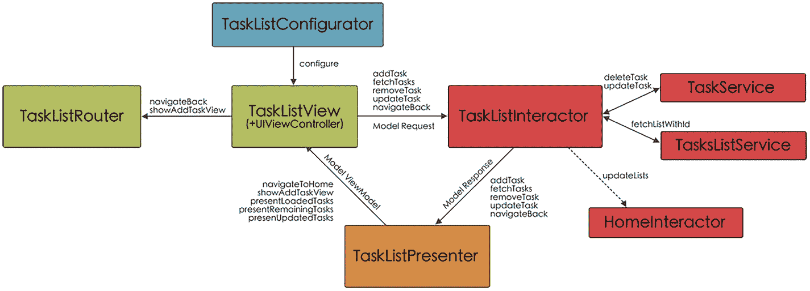
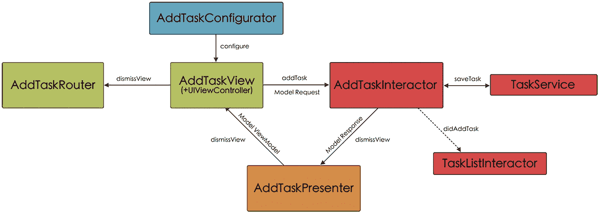

# AddListRouter

如我们所见，`AddListRouter` 类非常简洁，因为它只包含一个带有单一方法（`navigateBack`）的协议，该方法将实现从 `AddList` 场景到 `Home` 场景的返回导航（清单 6-35）。

```
protocol AddListRouterDelegate {
func navigateBack()
}
final class AddListRouter {
weak var viewController: UIViewController?
}
extension AddListRouter: AddListRouterDelegate {
func navigateBack() {
viewController?.navigationController?.popViewController(animated: true)
}
}
清单 6-35
AddListRouterDelegate 协议定义及在 AddListRouter 中的实现
```

## TaskList 场景

从协议角度来看，`TaskList` 场景最为复杂，因为需要管理多种不同的操作：以列表形式显示任务、删除任务、更新任务、展示添加任务界面以及导航返回 `Home`。

此外，请记住，我们必须通过 `HomeInteractor` 的 `selectedListDelegate` 通知 `Home`：每当任务发生变更时，`Home` 场景中的任务列表也必须更新。在图 6-5 中，您可以看到 `TaskList` 场景的不同组件及其之间的通信关系。



一张展示任务列表场景组件的示意图，包括路由器、配置器、视图、交互器、展示器、任务列表、任务列表服务以及 Home 交互器。

图 6-5

TaskList 场景组件及通信架构

### TaskListConfigurator

`TaskListConfigurator` 与我们之前看到的配置器类似；它负责实例化场景中的不同元素并将它们相互关联起来。

也许值得特别提及的是 `TaskListInteractor` 的实例化过程，因为此时我们需要向其传递在 `Home` 中选中的任务列表、用于与数据库交互的 `TaskService` 和 `TaskListService` 实例，以及一个委托，该委托允许它与 `HomeInteractor` 建立连接，以便在任务发生任何变化时通知 `HomeInteractor` 更新 `Home`（清单 6-36）。

```
final class TaskListConfigurator {
static func configure( _ viewController: TaskListViewController, delegate: SelectedListDelegate, tasksList: TasksListModel) -> TaskListViewController {
let interactor = TaskListInteractor(tasksList: tasksList, taskService: TaskService(),
tasksListService: TasksListService(),
delegate: delegate)
let presenter = TaskListPresenter()
let router = TaskListRouter()
router.viewController = viewController
presenter.viewController = viewController
interactor.presenter = presenter
viewController.interactor = interactor
viewController.router = router
return viewController
}
}
清单 6-36
TaskListConfigurator 代码
```

### TaskListView

`TaskListView` 类与 `HomeView` 非常相似，因为它同样使用表格来展示任务列表，包含一个用于展示添加新任务界面的按钮，并且支持删除任务等操作。

并且，与其他视图一样，它提供了一个协议（`TaskListViewDelegate`），用于将用户的操作传递给 `TaskListViewController`，而 `TaskListViewController` 则负责实现该委托中的方法（清单 6-37）。

```
import UIKit
protocol TaskListViewDelegate: AnyObject {
func navigateBack()
func addTask()
func deleteTaskAt(indexPath: IndexPath)
func updateTask(_ task: TaskModel)
}
清单 6-37
TaskListViewDelegate 协议定义
```

表格需要展示的任务通过 `show(tasks:_)` 方法直接从 `TaskListViewController` 传递，如清单 6-38 所示。

```
final class TaskListView: UIView {
weak var delegate: TaskListViewDelegate?
...
func show(tasks: [TaskModel]) {
self.tasks = tasks
tableView.reloadData()
emptyState.isHidden = tasks.count > 0
}
}
清单 6-38
通过 show(tasks:_) 方法传递需要展示的任务
```

最后，在清单 6-39 中，我们展示了代码中通过委托将用户操作传递给 `TaskListViewController` 的几个关键点。

```
private extension TaskListView {
...
@objc func backAction() {
delegate?.navigateBack()
}
...
@objc func addTaskAction() {
delegate?.addTask()
}
...
}
extension TaskListView: UITableViewDelegate, UITableViewDataSource {
...
func tableView(_ tableView: UITableView, commit editingStyle: UITableViewCell.EditingStyle, forRowAt indexPath: IndexPath) {
if editingStyle == .delete {
delegate?.deleteTaskAt(indexPath: indexPath)
}
}
}
extension TaskListView: TaskCellDelegate {
func updateTask(_ task: TaskModel) {
delegate?.updateTask(task)
}
}
清单 6-39
从视图调用协议方法
```


### `TaskListViewController`

与之前的例子类似，我们将为`TaskListViewController`设置输入和输出协议（列表 6-40）。

```
protocol TaskListViewControllerInput: AnyObject {
    func navigateToHome()
    func showAddTaskView(viewModel: TaskListModel.AddTask.ViewModel)
    func presentLoadedTasks(viewModel: TaskListModel.FetchTasks.ViewModel)
    func presentRemainingTasks(viewModel: TaskListModel.RemoveTask.ViewModel)
    func presentUpdatedTasks(viewModel: TaskListModel.UpdateTask.ViewModel)
}

protocol TaskListViewControllerOutput: AnyObject {
    func navigateBack()
    func addTask(request: TaskListModel.AddTask.Request)
    func fetchTasks(request: TaskListModel.FetchTasks.Request)
    func removeTask(request: TaskListModel.RemoveTask.Request)
    func updateTask(request: TaskListModel.UpdateTask.Request)
}
```

*列表 6-40：`TaskListViewControllerInput` 和 `TaskListViewControllerOutput` 协议定义*

对于输出协议`TaskListViewControllerOutput`，我们定义了方法`navigateBack`（返回`Home`）、`addTask`（显示添加任务的界面）、`fetchTasks`（以列表形式显示任务）、`removeTask`（删除任务）和`updateTask`（更新任务）。

对于输入协议`TaskListViewControllerInput`，我们定义了方法`navigateBack`（返回`Home`）、`showAddTaskView`（显示任务添加界面）、`presentLoadedTasks`（返回所选列表的任务）、`presentRemainingTasks`（返回删除某个任务后剩余的任务）以及`presentUpdatedTasks`（返回某个任务更新后的任务）。

另一方面，我们将定义第三个协议`SelectedListDelegate`，你可能还记得，我们在`HomeInteractor`中使用该协议来建立委托，以便在此场景中发生任何更改后更新`Home`的任务列表（列表 6-41）。

```
protocol SelectedListDelegate: AnyObject {
    func updateLists()
}
```

*列表 6-41：`SelectedListDelegate` 协议定义*

下一步是准备`TaskListController`的初始化。在`init`方法中，我们向其传递一个`TaskListView`实例（在`TaskListConfigurator`中传递），并让`TaskListController`成为其委托（因此它需要实现其方法）。此外，我们向`TaskListInteractor`发出第一个请求，即从所选列表中检索任务（列表 6-42）。

```
final class TaskListViewController: UIViewController {
    var interactor: TaskListInteractorInput?
    var router: TaskListRouterDelegate?
    private let taskListView: TaskListView
    
    init(taskListView: TaskListView) {
        self.taskListView = taskListView
        super.init(nibName: nil, bundle: nil)
    }
    
    required init?(coder: NSCoder) {
        fatalError("init(coder:) has not been implemented")
    }
    
    override func viewDidLoad() {
        super.viewDidLoad()
        taskListView.delegate = self
        self.view = taskListView
        fetchTasks()
    }
    
    private func fetchTasks() {
        let request = TaskListModel.FetchTasks.Request()
        interactor?.fetchTasks(request: request)
    }
}
...
extension TaskListViewController: TaskListViewDelegate {
    func navigateBack() {
        interactor?.navigateBack()
    }
    
    func addTask() {
        let request = TaskListModel.AddTask.Request()
        interactor?.addTask(request: request)
    }
    
    func deleteTaskAt(indexPath: IndexPath) {
        let request = TaskListModel.RemoveTask.Request(index: indexPath)
        interactor?.removeTask(request: request)
    }
    
    func updateTask(_ task: TaskModel) {
        let request = TaskListModel.UpdateTask.Request(task: task)
        interactor?.updateTask(request: request)
    }
}
```

*列表 6-42：`TaskListViewController` 初始化及`TaskListViewDelegate` 遵循代码*

最后，由于`TaskListViewController`必须遵循`TaskListViewControllerInput`输入协议，我们实现其方法（列表 6-43）。

```
extension TaskListViewController: TaskListViewControllerInput {
    func navigateToHome() {
        router?.navigateBack()
    }
    
    func showAddTaskView(viewModel: TaskListModel.AddTask.ViewModel) {
        router?.showAddTaskView(delegate: viewModel.addTaskDelegate, tasksList: viewModel.taskList)
    }
    
    func presentLoadedTasks(viewModel: TaskListModel.FetchTasks.ViewModel) {
        taskListView.show(tasks: viewModel.tasks)
    }
    
    func presentRemainingTasks(viewModel: TaskListModel.RemoveTask.ViewModel) {
        taskListView.show(tasks: viewModel.tasks)
    }
    
    func presentUpdatedTasks(viewModel: TaskListModel.UpdateTask.ViewModel) {
        taskListView.show(tasks: viewModel.tasks)
    }
}
```

*列表 6-43：`TaskListViewControllerInput` 遵循代码*


### `TaskListInteractor`

延续我们在其他交互器中看到的内容，`TaskListInteractor` 有两个协议：输入协议 `TaskListInteractorInput`（对应 `TaskListViewController` 的输出协议 `TaskListViewControllerOutput`），以及输出协议 `TaskListInteractorOutput`，我们在其中定义了实现 `TaskListPresenter` 所需的方法（列表 6-44）。

```swift
protocol TaskListInteractorOutput: AnyObject {
    func navigateBack()
    func showAddTask(response: TaskListModel.AddTask.Response)
    func presentTasks(response: TaskListModel.FetchTasks.Response)
    func removedTask(response: TaskListModel.RemoveTask.Response)
    func updatedTask(response: TaskListModel.UpdateTask.Response)
}
typealias TaskListInteractorInput = TaskListViewControllerOutput
```

*列表 6-44：定义 `TaskListInteractorOutput` 协议，并将 `TaskListViewControllerOutput` 重命名为 `TaskListInteractorInput`*

定义好协议后，我们设置 `TaskListInteractor` 的初始化。我们将修改 `init` 方法，以便能够传递：在 `Home` 中选择的任务列表、两个用于访问数据库的服务，以及从 `HomeInteractor` 传递过来的委托（delegate），该委托将允许我们在任务列表发生任何变化时更新 `Home`（列表 6-45）。

```swift
final class TaskListInteractor {
    var presenter: TaskListPresenterInput?
    private var tasksList: TasksListModel!
    private var taskService: TaskServiceProtocol!
    private var tasksListService: TasksListServiceProtocol!
    private var tasks = [TaskModel]()
    weak var delegate: SelectedListDelegate?

    init(tasksList: TasksListModel,
         taskService: TaskServiceProtocol,
         tasksListService: TasksListServiceProtocol,
         delegate: SelectedListDelegate) {
        self.tasksList = tasksList
        self.taskService = taskService
        self.tasksListService = tasksListService
        self.delegate = delegate
    }
}
```

*列表 6-45：`TaskListInteractor` 初始化*

接下来，我们需要让 `TaskListInteractor` 遵循其输入协议，从而使 `TaskListViewController` 能够与之通信（列表 6-46）。

```swift
extension TaskListInteractor: TaskListInteractorInput {
    func navigateBack() {
        presenter?.navigateBack()
    }

    func addTask(request: TaskListModel.AddTask.Request) {
        let response = TaskListModel.AddTask.Response(addTaskDelegate: self, taskList: tasksList)
        presenter?.showAddTask(response: response)
    }

    func fetchTasks(request: TaskListModel.FetchTasks.Request) {
        guard let list = tasksListService.fetchListWithId(tasksList.id) else { return }
        tasksList = list
        tasks = tasksList.tasks.sorted(by: { $0.createdAt.compare($1.createdAt) == .orderedDescending })
        let response = TaskListModel.FetchTasks.Response(tasks: tasks)
        presenter?.presentTasks(response: response)
    }

    func removeTask(request: TaskListModel.RemoveTask.Request) {
        let task = tasks[request.index.row]
        taskService.deleteTask(task)
        tasks.remove(at: request.index.row)
        let response = TaskListModel.RemoveTask.Response(tasks: tasks)
        presenter?.removedTask(response: response)
        delegate?.updateLists()
    }

    func updateTask(request: TaskListModel.UpdateTask.Request) {
        taskService.updateTask(request.task)
        fetchTasks()
        let response = TaskListModel.UpdateTask.Response(tasks: tasks)
        presenter?.updatedTask(response: response)
        delegate?.updateLists()
    }
}
```

*列表 6-46：`TaskListInteractorInput` 的遵循代码*

如果你注意到，在 `addTask` 方法中，当创建我们将传递给展示器的响应时，我们将 `TaskListInteractor` 添加为委托（`addTaskDelegate`）。如果你还记得，我们在 `HomeInteractor` 中也这样做了，以便在 `AddTaskList` 场景中添加新任务列表，或从当前查看的场景中修改任务列表时，能够更新 `Home` 视图。

最后三个方法 `fetchTasks`、`removeTask` 和 `updateTask` 是需要与数据库交互的方法（通过 `TasksListService` 和 `TaskService`），随后调用 `TaskListPresenter` 来更新视图。

最后但同样重要的是，我们让 `TaskListInteractor` 遵循 `AddTaskDelegate` 协议（我们将在开发 `AddTask` 场景时创建该协议），正如刚才解释的，该协议将允许我们告知当前场景在添加新任务时更新其视图（列表 6-47）。

```swift
extension TaskListInteractor: AddTaskDelegate {
    func didAddTask() {
        fetchTasks(request: TaskListModel.FetchTasks.Request())
        delegate?.updateLists()
    }
}
```

*列表 6-47：`AddTaskDelegate` 的遵循代码*

### `TaskListPresenter`

在 `TaskListPresenter` 中，与之前的情况一样，我们首先将 `TaskListInteractor` 的输出协议重命名为展示器的输入协议，并将 `TaskListViewController` 的输入协议重命名为输出协议（列表 6-48）。请记住，这样做是为了更好地查看每个组件的输入/输出流。

```swift
typealias TaskListPresenterInput = TaskListInteractorOutput
typealias TaskListPresenterOutput = TaskListViewControllerInput
```

*列表 6-48：使用 `typealias` 重命名协议，以获取 `TaskListPresenter` 协议*

然后，我们只需实现 `TaskListPresenterInput` 协议的方法，`TaskListPresenter` 必须遵循该协议（列表 6-49）。

```swift
final class TaskListPresenter {
    weak var viewController: TaskListPresenterOutput?
}

extension TaskListPresenter: TaskListPresenterInput {
    func navigateBack() {
        viewController?.navigateToHome()
    }

    func showAddTask(response: TaskListModel.AddTask.Response) {
        let viewModel = TaskListModel.AddTask.ViewModel(taskList: response.taskList, addTaskDelegate: response.addTaskDelegate)
        viewController?.showAddTaskView(viewModel: viewModel)
    }

    func presentTasks(response: TaskListModel.FetchTasks.Response) {
        let viewModel = TaskListModel.FetchTasks.ViewModel(tasks: response.tasks)
        viewController?.presentLoadedTasks(viewModel: viewModel)
    }

    func removedTask(response: TaskListModel.RemoveTask.Response) {
        let viewModel = TaskListModel.RemoveTask.ViewModel(tasks: response.tasks)
        viewController?.presentRemainingTasks(viewModel: viewModel)
    }

    func updatedTask(response: TaskListModel.UpdateTask.Response) {
        let viewModel = TaskListModel.UpdateTask.ViewModel(tasks: response.tasks)
        viewController?.presentUpdatedTasks(viewModel: viewModel)
    }
}
```

*列表 6-49：`TaskListPresenter` 遵循 `TaskListPresenterInput` 协议*

注意，在 `showAddTask` 方法中，我们在 `ViewModel` 中传递了要添加新任务的目标列表，以及允许在添加任务后更新视图的委托。

在最后三个方法中，我们所做的是将选中列表的任务传递给 `ViewModel`（以便在进入此场景时显示它们，以及在删除或更新某些任务后显示它们）。


### `TaskListModel`

此场景中的信息交换模型如代码清单 6-50 所示。可以看到，我们为此场景中的每个流程（`FetchTasks`、`AddTask`、`RemoveTask` 和 `UpdateTask`）都创建了一个子模型，尽管其中一些子模型的参数非常相似。

```
enum TaskListModel {
enum FetchTasks {
struct Request {}
struct Response {
let tasks: [TaskModel]
}
struct ViewModel {
let tasks: [TaskModel]
}
}
enum AddTask {
struct Request {}
struct Response {
let addTaskDelegate: AddTaskDelegate
let taskList: TasksListModel
}
struct ViewModel {
let taskList: TasksListModel
let addTaskDelegate: AddTaskDelegate
}
}
enum RemoveTask {
struct Request {
let index: IndexPath
}
struct Response {
let tasks: [TaskModel]
}
struct ViewModel {
let tasks: [TaskModel]
}
}
enum UpdateTask {
struct Request {
let task: TaskModel
}
struct Response {
let tasks: [TaskModel]
}
struct ViewModel {
let tasks: [TaskModel]
}
}
}
Listing 6-50
TaskListModel code
```

### `TaskListRouter`

从我们在开发此场景中看到的情况来看，我们知道需要在 `TaskListRouter`（通过其协议）中建立两个方法：一个不允许我们返回首页（`navigateBack`），另一个向我们展示添加新任务的场景（`showAddTaskView`）（代码清单 6-51）。

```
protocol TaskListRouterDelegate {
func navigateBack()
func showAddTaskView(delegate: AddTaskDelegate, tasksList: TasksListModel)
}
Listing 6-51
TaskListRouterDelegate protocol definition
```

这些方法的实现与其他案例中已实现的类似。要返回首页，我们只需使用 `popViewController` 方法；要显示 `AddTask` 场景，我们将创建并配置 `AddTaskViewController`，并向其传递 `addTaskDelegate`（我们在开发 `TaskListInteractor` 时已提及）以及包含任务列表的 `TasksListModel` 对象，新任务将添加到此列表中（代码清单 6-52）。

```
final class TaskListRouter {
weak var viewController: UIViewController?
}
extension TaskListRouter: TaskListRouterDelegate {
func navigateBack() {
viewController?.navigationController?.popViewController(animated: true)
}
func showAddTaskView(delegate: AddTaskDelegate, tasksList: TasksListModel) {
let addTaskViewController = AddTaskViewController(addTaskView: AddTaskView())
viewController?.present(AddTaskConfigurator.configure(addTaskViewController, delegate: delegate, tasksList: tasksList), animated: true)
}
}
Listing 6-52
TaskListRouterDelegate conformation code
```

## AddTask 场景

应用的最后一个屏幕 AddTask，允许我们向任务列表中添加新任务。在图 6-6 中，您可以看到构成它的组件以及它们之间的连接。



一张说明添加任务场景组件的插图，包括路由器、配置器、视图、交互器、展示器、任务列表和任务列表服务。

Figure 6-6

AddTask 场景组件和通信架构

### AddTaskConfigurator

在开发 `AddTaskConfigurator` 时，除了实例化不同组件并建立它们之间的连接，我们还必须牢记，在 `AddTaskInteractor` 实例中，我们必须同时传递要添加新任务的任务列表和用于连接 `TaskListInteractor` 以更新任务列表视图的委托（`AddTaskDelegate`）（代码清单 6-53）。

```
final class AddTaskConfigurator {
static func configure( _ viewController: AddTaskViewController, delegate: AddTaskDelegate, tasksList: TasksListModel) -> AddTaskViewController {
let interactor = AddTaskInteractor(tasksList: tasksList, taskService: TaskService(), delegate: delegate)
let presenter = AddTaskPresenter()
let router = AddTaskRouter()
router.viewController = viewController
presenter.viewController = viewController
interactor.presenter = presenter
viewController.interactor = interactor
viewController.router = router
return viewController
}
}
Listing 6-53
AddTaskConfigurator code
```

### AddTaskView

`AddTaskView` 在概念上与 `AddTaskListView` 非常相似，包含一个用于添加任务标题的字段和一个图标选择器。但与 `AddTaskListView` 不同的是，后者有一个按钮，可以在我们不想添加新列表时返回上一屏幕。由于我们现在是在 `TaskList` 场景上弹出此屏幕，而不是导航到它，因此我们不需要那个按钮，因为我们可以通过向下滑动的手势来让此屏幕消失。

因此，允许我们与 `AddTaskViewController` 通信的协议只有一个方法（`addTaskWith(title:_, icon:_)`）（代码清单 6-54）。

```
protocol AddTaskViewDelegate: AnyObject {
func addTaskWith(title: String, icon: String)
}
final class AddTaskView: UIView {
weak var delegate: AddTaskViewDelegate?
...
}
extension AddTaskView {
...
@objc func addTaskAction() {
guard titleTextfield.hasText else { return }
delegate?.addTaskWith(title: titleTextfield.text!, icon: icon)
}
}
Listing 6-54
AddTaskViewDelegate definition and use
```

#### AddTaskViewController

通过减少视图的功能，我们也减少了 `AddTaskViewController` 中的代码。因此，我们为此类创建的输入和输出协议在这种情况下各自只包含一个方法：用于输出的 `addTask` 和用于输入的 `dismissView`（代码清单 6-55）。

```
protocol AddTaskViewControllerInput: AnyObject {
func dismissView()
}
protocol AddTaskViewControllerOutput: AnyObject {
func addTask(request: AddTaskModel.AddTask.Request)
}
Listing 6-55
AdTaskViewControllerInput and AddTaskViewControllerOutput protocols definition
```

另一方面，我们还定义了其方法应由 `TaskListInteractor` 实现的协议，以告诉它在添加新任务时更新列表中的任务视图（代码清单 6-56）。

```
protocol AddTaskDelegate: AnyObject {
func didAddTask()
}
Listing 6-56
AddTaskDelegate protocol definition to allow AddTask scene to connect to TaskList scene
```

定义了这些协议后，我们继续开发 `AddTaskViewController` 的初始化代码。在此代码中，我们基本上将从 `AddTaskView` 传递的实例分配给视图，向其分配委托，并实现该委托的方法（代码清单 6-57）。在此方法中，我们所做的是生成一个包含新任务标题和图标值的请求，并将其传递给交互器。

```
final class AddTaskViewController: UIViewController {
var interactor: AddTaskInteractorInput?
var router: AddTaskRouterDelegate?
private let addTaskView: AddTaskView
init(addTaskView: AddTaskView) {
self.addTaskView = addTaskView
super.init(nibName: nil, bundle: nil)
}
required init?(coder: NSCoder) {
fatalError("init(coder:) has not been implemented")
}
override func viewDidLoad() {
super.viewDidLoad()
addTaskView.delegate = self
self.view = addTaskView
}
}
...
extension AddTaskViewController: AddTaskViewDelegate {
func addTaskWith(title: String, icon: String) {
let request = AddTaskModel.AddTask.Request(title: title, icon: icon)
interactor?.addTask(request: request)
}
}
Listing 6-57
AddTaskViewController initialization code
```

最后，我们需要让 `AddTaskViewController` 符合其输入协议，该协议在这种情况下指示路由器让视图消失。

```
extension AddTaskViewController: AddTaskViewControllerInput {
func dismissView() {
router?.dismissView()
}
}
```


### `AddTaskInteractor`

从 `AddListInteractor` 开始，我们定义了输出协议（`AddTaskInteractorOutput`），该协议只有一个方法，并且与之前的情况类似，我们将 `AddTaskViewControllerOutput` 输出协议重命名为 `AddTaskInteractorInput`（清单 6-58）。

```
protocol AddTaskInteractorOutput: AnyObject {
    func dismissView()
}
typealias AddTaskInteractorInput = AddTaskViewControllerOutput
```

接下来，我们进入这个类的初始化部分，在这里我们传入 `TaskListModel` 对象（将向其添加新创建的任务）、`TaskService`（用于连接数据库并保存新任务）以及委托（该委托允许我们向 `TaskList` 场景指示用新任务更新视图）（清单 6-59）。

```
final class AddTaskInteractor {
    var presenter: AddTaskPresenterInput?
    private var tasksList: TasksListModel!
    private var taskService: TaskServiceProtocol!
    weak var delegate: AddTaskDelegate?

    init(tasksList: TasksListModel,
         taskService: TaskServiceProtocol,
         delegate: AddTaskDelegate) {
        self.tasksList = tasksList
        self.taskService = taskService
        self.delegate = delegate
    }
}
```

最后，我们需要让 `AddTaskInteractor` 遵循 `AddTaskInteractorInput` 协议。该协议只有一个方法 `addTask`，我们向它传递一个包含新任务标题和图标的请求。

在此方法中，我们首先创建 `TaskModel` 对象，并将其传递给 `TaskService` 以保存到数据库。然后，我们通过委托通知 `TaskList` 场景更新任务列表，最后，我们通知 Presenter 关闭视图（清单 6-60）。

```
extension AddTaskInteractor: AddTaskInteractorInput {
    func addTask(request: AddTaskModel.AddTask.Request) {
        let task = TaskModel(id: ProcessInfo().globallyUniqueString,
                            title: request.title,
                            icon: request.icon,
                            done: false,
                            createdAt: Date())
        taskService.saveTask(task, in: tasksList)
        delegate?.didAddTask()
        presenter?.dismissView()
    }
}
```

### `AddTaskPresenter`

与之前的情况类似，`AddTaskPresenter` 通过将输入协议重命名为 `AddTaskViewController`，将输出协议重命名为 `AddTaskPresenter`，来获取其两个输入和输出协议（清单 6-61）。

```
typealias AddTaskPresenterInput = AddTaskInteractorOutput
typealias AddTaskPresenterOutput = AddTaskViewControllerInput
```

遵循 `AddTaskPresenterInput` 协议的过程相当简单（清单 6-62）。

```
final class AddTaskPresenter {
    weak var viewController: AddTaskPresenterOutput?
}

extension AddTaskPresenter: AddTaskPresenterInput {
    func dismissView() {
        viewController?.dismissView()
    }
}
```

### `AddTaskModel`

`AddTaskModel` 相当简单，因为只有请求呈现了创建任务所需的字段（其余部分虽然为空，但出于教学目的已展示）（清单 6-63）。

```
enum AddTaskModel {
    enum AddTask {
        struct Request {
            var title: String
            var icon: String
        }
        struct Response {}
        struct ViewModel {}
    }
}
```

### `AddTaskRouter`

`AddTaskRouter` 也很简单，因为它只有一个方法，即关闭视图（清单 6-64）。

```
protocol AddTaskRouterDelegate {
    func dismissView()
}

final class AddTaskRouter {
    weak var viewController: UIViewController?
}

extension AddTaskRouter: AddTaskRouterDelegate {
    func dismissView() {
        viewController?.dismiss(animated: true)
    }
}
```

## VIP-MyToDos 测试

在 VIP 架构中，我们将要测试的三个主要组件是 ViewControllers、Interactors 和 Presenters，因为这些是 VIP 循环的组成部分。

**注意：** 请记住，您可以在本书附带的代码仓库中找到完整的项目代码，包括测试代码。

现在，作为示例，让我们看看如何为 `Home` 场景的 `HomeViewController`、`HomeInteractor` 和 `HomePresenter` 类设置单元测试。

在针对这些组件的每个测试文件中，我们还将定义每个场景所需的其他组件的模拟对象。

### `HomeViewControllerTest`

正如我们在其他情况中所见，首先要做的是定义测试中需要的组件。在这里，我们的 *sut*（即被测试系统）是 `HomeViewController`。

由于 `HomeViewController` 与 `HomeInteractor` 和 `HomeRouter` 相关，我们将为这些类定义模拟对象：`MockHomeInteractor` 和 `MockHomeRouter`（清单 6-65）。

```
import XCTest
@testable import VIP_MyToDos

final class HomeViewControllerTest: XCTestCase {
    private var sut: HomeViewController!
    private var interactor: MockHomeInteractor!
    private var router: MockHomeRouter!
    private var view: HomeView!

    let taskList = TasksListModel(id: "12345-67890",
                                  title: "Test List",
                                  icon: "test.icon",
                                  tasks: [TaskModel](),
                                  createdAt: Date())

    override func setUpWithError() throws {
        super.setUp()
        interactor = MockHomeInteractor()
        router = MockHomeRouter()
        view = HomeView()
        sut = HomeViewController(homeView: view)
        sut.interactor = interactor
        sut.router = router
    }
    ...
}
```

`MockHomeInteractor` 必须遵循与 `HomeInteractor` 相同的协议（尽管我们不会使用 `didAddList` 和 `updateList` 方法，它们将 `Home` 场景与 `AddList` 和 `TaskList` 场景连接起来）（清单 6-66）。其余方法将修改一些变量，我们可以通过这些变量检查它们是否已从 `HomeViewController` 正确调用。

```
final class MockHomeInteractor: HomeInteractorInput, AddListDelegate, SelectedListDelegate {
    private(set) var addListRequest: Bool = false
    private(set) var fetchTasksListRequest: Bool = false
    private(set) var selectTasksListIndex: IndexPath = IndexPath(row: 0, section: 0)
    private(set) var deleteTasksListIndex: IndexPath = IndexPath(row: 0, section: 0)

    func fetchTasksLists(request: HomeModel.FetchTasksLists.Request) {
        fetchTasksListRequest = true
    }

    func addList(request: HomeModel.AddTasksList.Request) {
        addListRequest = true
    }

    func selectList(request: HomeModel.SelectTasksList.Request) {
        selectTasksListIndex = request.index
    }

    func removeList(request: HomeModel.RemoveTasksList.Request) {
        deleteTasksListIndex = request.index
    }

    func didAddList() {}
    func updateLists() {}
}
```

`MockHomeRouter` 必须遵循 `HomeRouterDelegate` 协议。与 `MockHomeInteractor` 类似，我们设置了一系列变量，以便验证方法是否被正确调用（清单 6-67）。

```
final class MockHomeRouter: HomeRouterDelegate {
    private(set) var navigateToAddList: Bool = false
    private(set) var navigateToTaksList: Bool = false
    private(set) var selectedList: TasksListModel = TasksListModel()

    func showAddListView(delegate: AddListDelegate) {
        navigateToAddList = true
    }

    func showSelectedList(delegate: SelectedListDelegate, list: TasksListModel) {
        navigateToTaksList = true
        selectedList = list
    }
}
```

最后，我们为 `HomeViewControllerTest` 设置测试（清单 6-68）。


