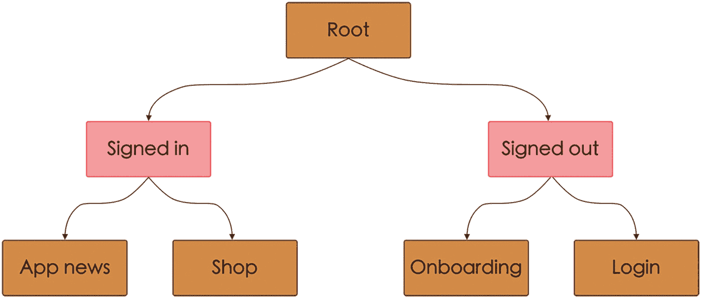
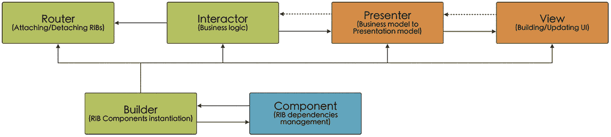
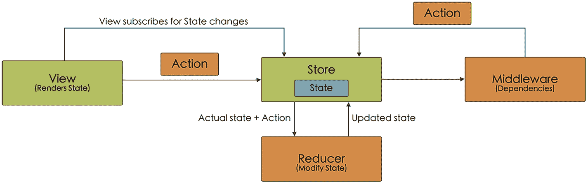
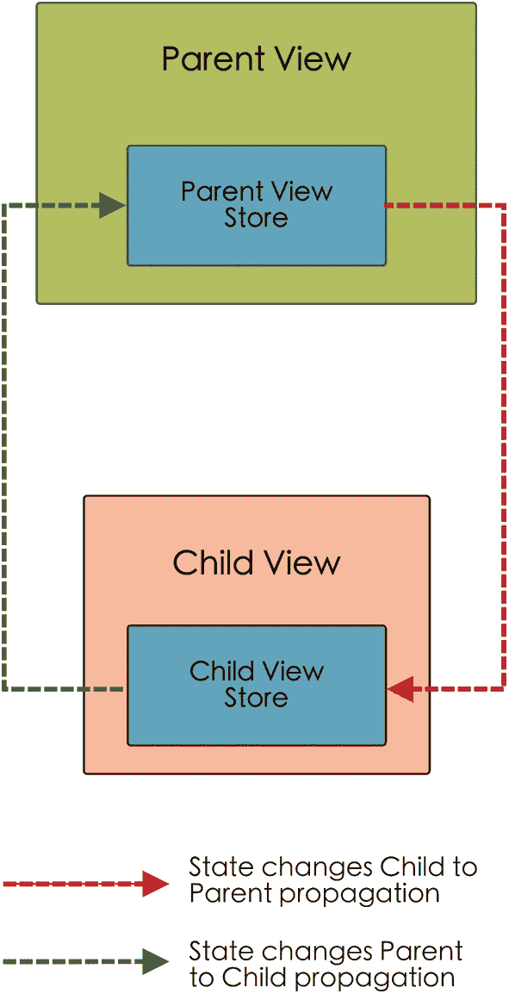
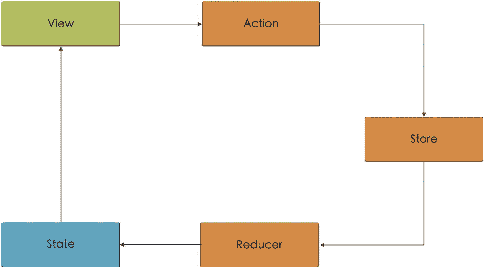

# 7. 其他架构模式

## 引言

到目前为止，我们了解了那些被认为最常用和广为人知的架构：MVC、MVP、MVVM、VIPER 和 VIP。但我们可以找到不同的方案，每一种方案都试图解决其他架构可能存在的某些问题，或者为开发者的工作提供便利。

在众多不同的方案中，我们将从以下角度来审视它们：其工作原理的基础是什么，组件是如何组织的，以及使用它们的优缺点：

- RIBs：路由器、交互器和构建器
- TEA：Elm 架构
- Redux
- TCA：可组合架构

注意 本章仅旨在介绍一些可能不太为人所熟悉的架构。因此，我们只会简要介绍其起源、组件或工作原理，而不会像之前讨论的架构那样提供代码示例。

## RIBs：路由器、交互器和构建器

### 简史

该架构由优步^(¹³)于 2017 年开发，旨在解决他们所面临的一系列情况：

- 从软件角度来看，代码量已大幅增长，并添加了许多功能。这导致优步的技术债务极其庞大，使得添加新功能变得非常困难，限制了可扩展性。
- 此外，还需要一种能够处理应用中多种状态的架构。
- 优步的开发人员数量增加了，因此有必要鼓励每个团队能够独立开发组件，不受任何阻碍。也就是说，他们寻求一种模块化架构。

`RIB`是一个由优步开发的跨平台架构，适用于涉及多名开发人员和嵌套状态移动应用。

每个`RIB`由三个组件组成：`Router`、`Interactor`和`Builder`，并代表一个应用状态。请记住，在`RIB`架构中，由于它是由业务逻辑而非视图驱动的，因此每个应用功能可能有视图，也可能没有。

如果我们绘制一个应用的图示并标出不同的`RIB`（图 7-1），这一点会看得更清楚。

一个`RIB`树由根节点、已登录、应用新闻、商店、已登出、登录和入门引导组成。

图 7-1

`RIB`树示例（红色标记的是不带`View`的`RIB`）

正如你在图中看到的，*已登录*和*已登出*状态并未呈现视图，因为它们仅用于判断用户是否已有活跃会话（如果有，则继续沿该路径；如果没有，则沿另一条路线继续）。

每个状态都通过一个接口连接到后续状态，通过这些接口，它们可以传递所需的任何依赖项。这样，每个功能都可以独立开发，而不会因开发其中一个功能而影响其他功能（例如，当每个功能由不同团队开发时）。

### 工作原理

正如我们刚才所见，我们可以使用相互连接的多个`RIB`来表示一个应用及其状态，我们以树形形式表示了这些`RIB`。

在应用中导航，进而经历不同状态时，这些状态将会连接和断开。

另一方面，当我们在`RIB`树中移动时，信息会从一个`RIB`流向另一个`RIB`：

- 如果是向下游流动，即从父`RIB`流向子`RIB`，通信方向通常是通过向 Rx 数据流发送事件来实现。
- 如果是向上游流动，即从子`RIB`流向父`RIB`，这种通信通常通过监听接口进行。

### 组件

虽然我们已经提到了`RIB`架构中的三个主要组件（`Router`、`Interactor`和`Builder`），但我们还可以找到其他组件：`Component`、`Presenter`和`View`（后两者是可选的，因为正如我们所见，`RIB`不一定需要与`View`关联）（图 7-2）。

一个`RIB`架构图包含路由器、交互器、展示器、视图、构建器和组件。

图 7-2

`RIB`架构图

#### 路由器（Router）

`Router`负责根据`Interactor`中发生的事件来附加和分离`RIB`。`RIB`的存在使得能够独立测试`Interactor`（因为无需知道其上下的其他组件），或者通过接管路由部分来减少这些`Interactor`的代码量。

#### 交互器（Interactor）

`Interactor`包含其所属`RIB`的业务逻辑，因此在其内部执行的所有功能只能限于其生命周期之内。这样，就可以避免出现已断开的`RIB`（因此其`Interactor`也已断开）但仍存在活跃订阅的情况。

`Interactor`是发起 Rx 订阅、改变其状态或确定需要连接哪些其他`RIB`的组件。

#### 构建器（Builder）

`RIB`的`Builder`类似于我们在`VIPER`中看到的配置器：它负责实例化`RIB`的各个不同组件。

#### 组件（Component）

`Component`是对`Builder`的帮助，因为它们负责管理依赖关系（包括`RIB`内部和外部的依赖关系）。常见的做法是将父`RIB`的组件注入其子`RIB`，使子`RIB`能够访问其属性。

#### 展示器（Presenter）

`Presenter`，正如我们通过其他架构所知，负责将来自`Interactor`的信息转换为`View`可以显示的格式（如果该`RIB`有关联的`View`）。

#### 视图（View）

与`Presenter`的情况一样，它是一个可选组件（用于有关联`View`的`RIB`），并包含定义用户界面的组件。它们不应包含任何相关逻辑，只负责显示信息和收集用户交互。

## 优点与缺点

与其他任何架构一样，其应用既有优点也有缺点。

### 优点

作为`RIB`架构的优点，我们可以强调以下几点：

- `Uber RIBs`是一个开源项目，因此我们可以自由修改并使其适用于我们的应用。
- 该项目附带一系列工具，使我们能够快速生成和配置应用中的`RIB`，以执行静态分析。
- 它是一种可以在 iOS 和 Android 上使用的架构，这有助于两个平台上的团队协作。
- 由于使用了协议，每个`RIB`都独立于其他`RIB`，这使我们能够同时开发不同的`RIB`，而不会相互阻塞。
- 得益于这种协议的使用，以及`RIB`每个组件都有明确定义的功能，每个组件的可测试性都得到了提升。
- 它已被证明是一种可扩展的架构，例如在优步，有成百上千的开发人员在同一个源代码上工作。

### 缺点

其缺点包括以下几点：

- 与`VIPER`或`VIP`等架构一样，会产生大量重复代码以及每个`RIB`有大量组件的情况。优步提供的用于生成这些组件的工具部分缓解了这个问题。
- 学习曲线相当陡峭，可能会让刚入门或经验不足的开发人员感到望而生畏。
- 此外，除了项目本身提供的文档（以及一些教程）外，互联网上并没有大量的参考文献，这给学习增加了难度。
- `RIB`之间的通信基于 iOS 的`RxSwift`和 Android 的`RxJava`或`Dagger2`，如果我们想要使用或已经在使用其他类型的响应式库，这可能会成为一个问题。

## Elm 架构

### 简史

`Elm`是一种高度类型化的纯函数式编程语言，由 Evan Czaplicki 于 2012 年开发^(¹⁴)，旨在为网页浏览器开发图形用户界面。

`Elm 架构`源于`Elm`语言的使用，是一种用于构建网页应用的简单模式。^(¹⁵) 在这种架构中，我们有一个包含应用状态的`Model`，一个根据`Model`生成 HTML 的`View`，以及一个转换`Model`的`Update`。它首次应用于 Swift 是在 2017 年。^(¹⁶)

### 工作原理

Elm 架构遵循以下循环运作（图 7-3）：

Elm 架构流程图包含 `Update`、`Runtime` 和 `View`。

图 7-3 Elm 架构示意图

- 首先，将 `Model` 传递给 `View`，由 `View` 负责呈现该模型。
- 当用户与 `View` 交互时，此交互会作为消息传递给 `Runtime`，随后 `Runtime` 将该消息与当前的 `Model` 一并转发给 `Update`。
- `Update` 负责根据消息中的信息更新 `Model`，并将其返回给 `Runtime`。
- 当 `Runtime` 将更新后的 `Model` 发送给 `View`，使其基于新的 `Model` 进行更新时，循环重新开始。

### 组件

在 Elm 架构中，（正如我们刚才所见）包含四个组件：`Model`、`View`、`Update` 和 `Runtime`。

#### Model

`Model` 包含（已定义的）数据和应用程序的状态。

#### View

`View` 是一个函数，它根据接收到的 `Model`（或状态）返回或渲染一个新的视图。

#### Update

`Update` 是一个函数，它根据接收到的消息更新 `Model`（或状态）。

#### Runtime

它负责连接并关联 `Model`、`View` 和 `Update`。

## 优点与缺点

现在我们来看看这种架构的一些优缺点。

### 优点

作为优点，我们可以强调以下几点：

-   架构简单。
-   允许我们以声明式方式开发视图。
-   每个组件的逻辑定义及其行为使得我们可以轻松地对其进行测试。
-   它采用单向数据流（如同 VIP 架构）。

### 缺点

一些最重要的缺点如下：

-   尽管架构简单，但对于刚入门或经验较少的开发人员来说可能比较复杂。
-   此外，除了一些代码仓库和博客之外，互联网上关于此架构的资料并不丰富，这使得学习变得困难。

## Redux

### 历史简介

Redux 是一个开源 JavaScript 库，由 Dan Abramov 和 Andrew Clark 于 2015 年开发。^(¹⁷) Redux 的作用是管理和集中应用程序状态，其灵感来源于 Facebook 开发的 Flux 架构。^(¹⁸) 根据 Dan Abramov 的说法：^(¹⁹)

> 我就是想做一个 Flux 的概念验证原型，能够让我改变逻辑。它要能实现时间旅行，还要能在代码变更时重新应用未来的操作。那就是目标所在。

### 工作原理

Redux 架构基于这样一个事实：数据只沿一个方向流动（正如我们在 Elm 架构中也看到的那样），并且我们只有一个模型（它将作为单一数据源），负责存储和修改要显示的数据。

Redux 中的流程（图 7-4）始于 `View` 上的一个 `Action`（例如，点击按钮）。该 action 被传递给 `Reducer` 组件，`Reducer` 根据该 `Action` 负责修改应用程序的状态。

Redux 架构流程图包含 `View`、`Store`、`Middleware` 和 `Reducer`。

图 7-4 Redux 架构示意图

状态的改变导致 `View` 用更新后的信息进行更新（为此，我们将使用观察者模式，使视图*订阅*状态变化）。

### 组件

现在让我们更详细地了解一下每个组件的功能。

#### State

它是应用程序的状态，且只能有一个。因此我们也可以将其称为*单一数据源*。

#### Store

`Store` 包含 `State`，并负责数据的流通。如上所述，它负责从 `View` 接收 `Action`，并将其与状态一起传递给 `Reducer`。

然后，它接收 `Reducer` 生成的应用程序新状态，而我们已经订阅了 `State` 变化的 `View` 会接收到该状态并更新图形界面。应用程序中只有一个 `Store`。

#### Reducer

`Reducer` 包含业务逻辑，是一个纯同步函数，负责修改应用程序的 `State`（它们是唯一能够这样做的组件）。

`Reducer` 接收来自 `Store` 的 `State` 和 `Action`，并生成一个新的 `State` 返回给 `Store`。如果想要拆分应用程序的逻辑，更好的做法是使用不同的 `Reducer`（组合模式），而不是使用不同的 `Store`。

#### Action

`Action` 是一个简单的对象，可以携带信息也可以不携带，由 `View` 发送以改变应用程序的 `State`。这些 action 可能由各种原因触发，例如触摸按钮或接收外部服务器调用的响应。

#### View

它是用户看到的内容，负责呈现应用程序的 `State`。它订阅了 `State` 的变化，因此每当 `State` 发生变化时，它都会更新。

#### Middleware

`Middleware` 是负责在应用程序中使用依赖的组件：数据库访问、服务器调用等，因为 `Reducer` 是不使用依赖的纯函数。当一个 action 被触发时，它会连同应用程序状态一起经过 `Middleware`，如有必要，它们可以异步地发起一个新的 action。

## 优点与缺点

与任何架构一样，Redux 既有优点也有缺点。

### 优点

在我们的项目中使用 Redux 有一些优点：

-   Redux 非常轻量，无需使用外部库。
-   单一状态的事实有利于调试。
-   在应用程序中，我们可以将当前状态保存到本地，这允许我们在重启应用程序时恢复到该状态。
-   由于 `Reducer` 由纯函数组成，业务逻辑更易于测试。
-   通过将业务逻辑（`Reducer`）与依赖（`Middleware`）分离，我们减少了测试中的模拟对象数量。
-   它具有良好的职责分离。

### 缺点

以下是它的一些缺点：

-   随着应用程序的增长，由于每次传递 `Action` 时都会重新创建整个 `State`，系统的内存消耗将会增加。
-   由于架构非常特定，当我们在项目中使用它时，几乎不可能将项目转换为不同的架构。
-   虽然它在 Web 领域是众所周知的架构，但在 iOS 开发中并不那么知名，因此对于新手开发人员来说可能会很复杂。
-   `Middleware` 可以异步地发起新的 `Action`，这一事实可能导致（如果存在大量 `Middleware`）出现矛盾的操作、无限循环等问题，从而使得系统不稳定。
-   这是一个相当僵化的架构，允许的变体很少。

## TCA：可组合架构

### 历史简介

可组合架构 (TCA) 由 Point-Free 公司的 Brandon Williams 和 Stephen Celis 开发。^(²⁰)

这种架构的诞生是为了解决我们在开发应用程序时遇到的一些问题：

-   以简单的方式管理应用程序的状态，并在不同屏幕之间共享该状态，以便在一个屏幕中发生的任何状态变化都能被另一个屏幕观察到。
-   能够将大型功能划分为多个更小且独立的子功能，但特点是可以将它们合并（组合）起来，重新形成一个整体。
-   促进应用程序的测试，不仅限于单元测试层面，还包括集成测试和端到端测试。
-   通过使用一个提供 API 来实现每个组件的库，你可以轻松获得所有这些能力。

### 工作原理

可组合架构（The Composable Architecture）是一种遵循声明式（而非命令式）工作方式的架构，它遵循响应式编程原则，并依据 Redux 模式组织代码。虽然它完全针对 SwiftUI（声明式框架）进行了优化，但也可用于 UIKit（命令式框架）。

TCA 源于 Elm 架构，但现在，例如，TCA 的核心思想是每个 `View` 都拥有自己的 `Store`，尽管每个子 Store 都包含父视图状态的一个副本。每当一个动作被发送到视图的 `Store` 时，它会被响应式地传递给父级 Store（图 7-5）。

该图描绘了父视图和子视图。父视图 Store 和子视图 Store 通过虚线连接。虚线代表从子级到父级以及从父级到子级的状态变更传播。

**图 7-5** 每个 `View` 都有其 `Store`

我们在图 7-5 中看到，在这种架构中，每个 `View` 都有一个 `Store`。现在让我们看看可组合架构由哪些组件构成（图 7-6）。

TCA 模式包含 `View`、`Action`、`Store`、`Reducer` 和 `State`。它们共同构成一个闭环周期，从视图开始，到 State 结束，而 State 又进一步连接到视图。

**图 7-6** TCA 模式

### 组件

可组合架构基于六个组件：`State`、`View`、`Action`、`Reducer`、`Environment` 和 `Store`。

#### State

它是一组代表应用程序状态的变量，这些变量是更新 `View` 所必需的。

#### View

它负责接收和呈现 `State` 的数据。

#### Action

它通常是一个 `enum`，其枚举值包含了所有可能发生的动作：事件、通知、用户操作等。例如，一个动作既可以是从服务器接收数据，也可以是点击按钮。

#### Reducer

它本质上是一个函数，接收一个 `Action` 和当前 `State`，并将其转换为一个新的 `State`。它还负责返回任何 `Effect`（例如调用外部服务器）。

#### Environment

它涉及应用程序中可能存在的依赖关系（例如对服务器的外部调用），并包含与外部交互的逻辑。它类似于 Redux 中间件，通常通过依赖注入注入到 `Reducer` 中。

`Effect` 是 `Action` 的结果，由 `Reducer` 生成（并允许其与外部连接）。当 `Effect` 完成其工作时，它可以为 `Reducer` 触发另一个动作。

#### Store

`Store` 是 `State`、`Action` 和 `Reducer` 的组合。它接收用户的操作，并将其与 `State` 一起发送给 `Reducer`。当生成新的状态时，`View` 会更新。

## 优点与缺点

为了与我们讨论过的其他架构保持一致，我们将看一下一些最重要的优点和缺点。

### 优点

可组合架构的主要优点如下：

*   数据流是单向的。
*   `Reducer` 是唯一可以修改 `State` 的组件，这便于测试。
*   应用程序由不同功能的组合构建而成。这允许单独设计、开发和测试每个功能。
*   在 `Environment` 中，我们找到所有的依赖关系。这使得调试工作更加容易。同时，从开发环境切换到生产环境也更加简单。
*   它允许以声明式方式开发视图。

### 缺点

可组合架构的主要缺点如下：

*   它更适用于 SwiftUI（声明式 UI）而非 UIKit（响应式 UI）。
*   由于存在多个状态，它们之间的同步可能会变得复杂。
*   与 RIB、TEA 或 Redux 一样，它不如我们在前几章深入讨论过的那些架构广为人知。这意味着可找到的资料较少，并且可能会让新手开发者望而生畏。

## 总结

为了结束 iOS 软件架构这一主题，我们回顾了一些不太为人知或较少使用的架构（RIBs、TEA、Redux 和 TCA）。这些是更现代的架构，其基础与我们最初看到的（MVC、MVP、MVVM、VIP 或 VIPER）有所不同，例如，体现在对状态的使用上。

它们使用较少甚至需求也少这一事实意味着可用信息也较少，这可能会增加新手开发者的学习难度。但与其说是障碍，不如将其视为一个学习的挑战！

脚注 1   2   3   4   5   6   7   8

