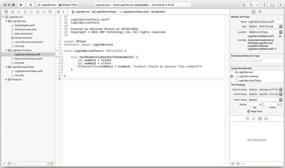
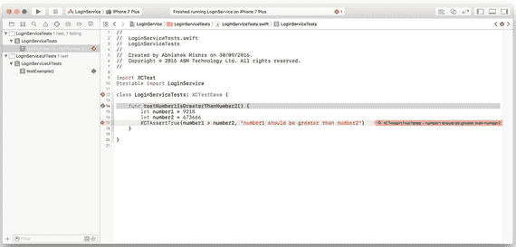

# 1. 测试驱动开发简介

自 iOS 平台诞生以来，已有超过十亿款应用被开发出来。早期的大多数应用都相当简单，通常由单个开发者完成。多年来，iOS 应用已变成日益复杂的软件，往往涉及庞大且分布式的开发团队，在敏捷环境中工作，并拥有复杂的构建与发布流水线。

现代应用通常执行多项复杂操作，包括（但不限于）呈现复杂的用户界面、多线程处理、在本地数据库中存储数据、与多种传感器交互、媒体录制与播放，以及使用 RESTful Web API。

考虑到应用各组件之间的复杂交互，以及分散在数百个类中的数千行源代码，我们如何确切地知道自己编写的代码是否按照预期工作？我们如何确保代码能够处理边缘场景？最后，我们如何知道构建的软件正确满足了业务需求？前两个问题的答案由单元测试实践来解决，而行为驱动开发（BDD）则针对“一开始就构建正确软件”这一问题给出了答案。第 10 章将介绍 BDD。本章及下一章中，你将学习单元测试及其相关学科——测试驱动开发（TDD）。

## 什么是测试驱动开发？

测试驱动开发（TDD）源于一种名为极限编程¹（XP）的编程范式，由 Kent Beck 于 1996 年创建。“极端”一词的使用，标志着它与当时标准编程实践的根本性背离。

TDD 旨在为开发者提供一种切实可行的方法，以证明他们编写的代码按预期工作，并确保新代码不会对现有代码产生任何潜在的副作用。

TDD 方法的核心在于，开发者不仅需要编写实现应用功能的实际代码，还要编写测试代码来确保应用代码按预期运行。这些测试代码不会随产品一起发布。

尽管在编写实现应用预期功能的代码之外，再编写测试代码确实是额外的工作，但这应被视为一种前期投入，旨在提高交付给客户的产品质量。一个实践 TDD 技术的团队，随着时间的推移，将观察到回归缺陷数量的减少。

> 注意
>
> TDD 常与“单元测试”一词互换使用；然而，这两个术语并非同一回事。TDD 是一种软件开发方法，其中测试代码先于功能代码编写：本质上，测试驱动开发。
>
> 单元测试只是孤立看待的一段测试代码。单元测试是采用 TDD 方法的副产品之一。
>
> 然而，仅凭存在一个或多个单元测试，并不一定意味着开发者遵循了 TDD 方法。例如，单元测试可能是事后为现有代码添加的。

如果你觉得处理大型问题难以招架，你可能会发现 TDD 是一种有用的技术，可以将大问题分解成更小的部分，利用测试解决这些小问题，并在此过程中最终解决大问题。你很快就会意识到，一旦你用 TDD 的思维方式去处理问题，大型问题就不再那么令人畏惧。

## TDD 术语

本节将探讨与测试驱动开发相关的一些常见术语。

### 被测对象

这通常是你希望测试的一段代码或功能单元。在大多数情况下，被测对象通常是 Swift 类中的单个方法。然而，你也可能遇到需要将一组小方法或类一起测试的场景。在这种情况下，被测对象通常代表一个完整的功能或用户旅程。被测对象有时也被称为“系统被测试对象”。

### 单元测试

这是用于测试被测对象的代码片段。单元测试也被称为“测试用例”。单元测试的工作原理是，在受控条件下调用被测对象，并验证某种预期行为。一个应用通常会有成百上千个单元测试，每个测试只测试功能的极小一部分。

单个单元测试作为 Swift 类中的独立方法实现，该类继承自 `XCTestCase`。这个 Swift 类通常也被称为测试类。

在大多数情况下，你会为每个想要测试的类创建一个测试类。`XCTestCase` 类是 `XCTest` 框架的一部分，需要通过 `import` 语句导入该框架。以下代码清单包含一个包含单个单元测试的简单测试类：

```
import XCTest
@testable import LoginService
class LoginServiceTests: XCTestCase {
func testExample() {
// 在此插入测试代码。
}
}
```

> 注意
>
> 构成这些单元测试的代码不属于将交付给客户的代码库。单元测试通常在开发者每次尝试创建构建时执行，并且只有在所有测试通过的情况下才会生成构建。

单元测试的方法签名与不接受参数且不返回值的方法类似。然而，单元测试方法的名称总是以关键字“test”开头。单元测试方法通常有严格的命名约定；这些将在下一课中讨论。

### 状态验证测试

状态验证测试是一种单元测试，它在对象（被测对象）上调用方法，并在调用方法后验证对象的状态。此类测试不关心实现细节，即使被测方法的内部实现在未来发生变化，它们仍能继续通过。状态验证测试通常依赖断言来执行实际验证。断言将在本课稍后介绍。

### 交互测试

交互测试是一种单元测试，它试图验证调用方法时对象之间的特定交互顺序。此类测试也被称为行为验证测试。交互测试不一定涉及多个对象。你也可以使用交互测试来验证对同一对象方法的调用顺序。

在一个复杂的面向对象系统中，当调用一个方法时，单个对象可能需要与多个其他对象交互。对于交互测试而言，被测对象仍然是单个类，而不是整个类组。通常的做法是实例化被测对象，并使用交互测试范围内涉及的所有其他对象的特殊模拟（mock）或桩（stub）版本。模拟和桩对象将在本课稍后介绍。

> 注意
>
> 由于交互测试验证的是类组的行为，它们本质上比状态验证测试更脆弱。例如，方法调用顺序的改变很容易导致交互测试失败。减少交互测试脆弱性的一种方法是缩小测试所覆盖的类范围。


### 负面测试

负面单元测试用于验证某个事件**没有**发生。这在某些情况下很有用，但绝不能仅依赖负面测试。因为虽然负面测试能验证某事未发生，但它对实际发生的各种变化毫无反应。代码库可能发生巨大变动，而单个负面测试却依然通过。如果所有单元测试都是负面测试，那么你的测试集合所提供价值将非常有限。

Swift 中的负面单元测试几乎总是状态验证测试。尽管可以创建交互测试类的负面单元测试，但所需的复杂设置往往会让编写此类测试变得得不偿失。

以实际的负面单元测试为例，考虑以下可用于表示银行账户的 Swift 类：

```
enum AccountType {
    case currentAccount
    case savingsAccount
}

class BankAccount {
    var accountName: String
    var accountNumber: String
    var accountType: AccountType
    private var transactions: [Transaction]

    init(accountName: String,
         accountNumber: String,
         accountType: AccountType) {
        self.accountName = accountName
        self.accountNumber = accountNumber
        self.accountType = accountType
        self.transactions = [Transaction]()
    }

    func addTransaction(_ transaction: Transaction) {
        transactions.append(transaction)
    }

    func accountBalance() -> Float {
        var balance: Float = 0
        for transaction in self.transactions {
            if transaction.isCredit {
                balance = balance + transaction.amount
            } else {
                balance = balance + transaction.amount
            }
        }
        return balance
    }
}
```

`BankAccount` 对象中的单笔交易通过 `Transaction` 对象来表示。接下来展示一个简单 `Transaction` 类的定义：

```
class Transaction {
    var description: String
    var amount: Float
    var isCredit: Bool

    init(description: String,
         amount: Float,
         isCredit: Bool) {
        self.description = description
        self.amount = amount
        self.isCredit = isCredit
    }
}
```

结合这两个类，一个负面单元测试可用于验证调用 `BankAccount` 类的 `addTransaction()` 方法不会修改账户名称。该测试可编写如下：

```
func testAddTransaction_DoesNotChangeAccountName() {
    let bankAccount = BankAccount(accountName: "John Smith",
                                  accountNumber: "14918",
                                  accountType: .savingsAccount)
    let transaction = Transaction(description: "Salary",
                                  amount: 100.0,
                                  isCredit: true)
    bankAccount.addTransaction(transaction)
    XCTAssertTrue(bankAccount.accountName.compare("John Smith") == .orderedSame,
                  "Call to addTransaction should have no effect on account name.")
}
```

断言功能尚未介绍，但稍后会提到。此测试确保调用 `addTransaction` 时，`BankAccount` 实例的 `accountName` 变量值不会改变。

### 测试套件

测试套件即测试用例文件的集合。测试套件通常在 Xcode 项目导航器中拥有独立分组，并包含在与应用其余代码分离的独立构建目标中（图 1-1）。



**图 1-1.** Xcode 中测试套件的独立文件夹分组

单个 Xcode 项目可以包含多个测试套件，例如，一个测试套件可能包含单元测试，另一个则包含交互测试。在下一课中，你将学习配置 Xcode 构建方案，将特定测试套件纳入构建过程。

### 断言

断言是状态验证测试和交互测试的核心。断言代表单元测试的失败。通常，你的单元测试会调用对象上的某个方法，该方法可能执行一系列操作，例如返回值、修改对象中的某些值或调用其他方法。

如果你知道所调用方法的预期结果，就可以构建一个单元测试，用已知输入调用该方法并期望得到特定结果。如果调用方法的结果与预期值不符，测试将触发断言来指示失败。

Xcode 自带的**标准单元测试框架**名为 `XCTest`，它包含多个宏，用于在单元测试中创建断言。表 1-1 列出了其中部分宏。

**表 1-1.** XCTest 断言宏

| 宏 | 说明 |
| --- | --- |
| `XCTAssert(expression, message)` | 如果 `expression` 的计算结果为 `false`，则生成失败。可提供可选的字符串 `message` 来说明失败原因。 |
| `XCTAssertEqualObjects(expression1, expression2, message)` | 当 `expression1` 不等于 `expression2` 时生成失败，其中 `expression1` 和 `expression2` 均为对象。涉及的两个对象都必须实现 `Equatable`。可提供可选的字符串 `message` 来说明失败原因。 |
| `XCTAssertNotEqualObjects(expression1, expression2, message)` | 当 `expression1` 等于 `expression2` 时生成失败，其中 `expression1` 和 `expression2` 均为对象。涉及的两个对象都必须实现 `Equatable`。可提供可选的字符串 `message` 来说明失败原因。 |
| `XCTAssertEqual(expression1, expression2, message)` | 当 `expression1` 不等于 `expression2` 时生成失败。此测试适用于**原始数据类型**。可提供可选的字符串 `message` 来说明失败原因。 |
| `XCTAssertNotEqual(expression1, expression2, message)` | 当 `expression1` 等于 `expression2` 时生成失败。`expression1` 和 `expression2` 均为原始数据类型。可提供可选的字符串 `message` 来说明失败原因。 |
| `XCTAssertNil(expression, message)` | 当 `expression` 不是 `nil` 时生成失败。可提供可选的字符串 `message` 来说明失败原因。 |
| `XCTAssertNotNil(expression, message)` | 当 `expression` 是 `nil` 时生成失败。可提供可选的字符串 `message` 来说明失败原因。 |
| `XCTAssertTrue(expression, message)` | 当 `expression` 的计算结果为 `false` 时生成失败。与 `XCTAssert()` 相同，提供此宏是为了创建更易读的测试。可提供可选的字符串 `message` 来说明失败原因。 |
| `XCTAssertFalse(expression, message)` | 当 `expression` 的计算结果为 `true` 时生成失败。可提供可选的字符串 `message` 来说明失败原因。 |

以下代码片段展示了一个使用 `XCTAssertTrue` 宏将会失败的单元测试。图 1-2 是 Xcode 测试导航器中显示测试失败的截图。



**图 1-2.** 失败的单元测试

```
func testNumber1IsGreaterThanNumber2() {
    let number1 = 9218
    let number2 = 673666
    XCTAssertTrue(number1 > number2,
                  "number1 should be greater than number2")
}
```

该测试失败是因为它期望 `number1` 大于 `number2`。修复方法很简单，只需将 `number1` 的值修改为大于 `number2` 即可：

```
func testNumber1IsGreaterThanNumber2() {
    let number1 = 921800
    let number2 = 673666
    XCTAssertTrue(number1 > number2,
                  "number1 should be greater than number2")
}
```

这个特定的测试显然没有太大实际用途；它没有调用其他对象的方法，也没有改变对象的状态。在此仅作为演示断言工作方式的示例。


### 实例化用于测试的类

单独实例化类有时会变得非常棘手。类的初始化方法可能需要多个参数，而每个参数本身又可能是对象。如果你正在实例化的某个依赖类需要访问系统资源（如网络连接、文件或数据库），问题就会更加复杂。

为了编写有意义且简洁的单元测试，你需要能够实例化被测对象，而无需过多担心如何构建其依赖项。

解决实例化对象依赖关系最常见的方法是创建依赖项的“替身”假对象。要使这种方法有效，这些假对象应该看起来像真实对象，并且更容易实例化。例如，这些假对象可以实现与它们试图模拟的对象相同的协议，并在方法实现中执行无害的功能。

这类对象可以轻松地用作被测类的依赖项，并帮助你创建有意义的测试。在单元测试中，通常可以找到两种类型的假对象：

-   **桩对象**。桩对象（也称为 Stub）是一种假对象，可用于替代真实的依赖项，它明显更容易实例化，并提供所模拟对象的无害方法实现。
-   **模拟对象**。模拟对象（也称为 Mock）与桩类似。然而，关键区别在于，模拟对象用于测试断言，或作为断言的目标。

例如，如果你正在编写一个测试，该测试调用对象 `A` 上的一个方法，并预期对象 `A` 会调用对象 `B` 上的另一个方法，那么对象 `B` 就是一个模拟对象，因为你的测试方法预期会在对象 `B` 上调用某个方法。任何其他可能为了辅助编写测试而实例化的对象 `C`、`D`、`E`，只要不是测试期望的目标，都将被称为桩对象。

## 测试驱动开发的原则

在本节中，你将学习 TDD 的一些关键原则。这些原则适用于任何编程语言、目标平台或 IDE 选择。

### 测试先行

为了让单元测试真正驱动开发，它们需要在被测试的代码之前编写。事实上，TDD 的关键原则之一是：测试先写，然后开发人员专注于编写使所有测试通过所需的最少量代码。当测试先写时，最终的软件往往更模块化，因为开发人员被迫从独立构建且相互交互的小组件的角度来思考软件。

这些测试共同定义了项目的验收标准。如果你拥有一套全面的测试套件，那么一旦所有测试通过，代码就被视为准备就绪，无需对代码库进行进一步修改。在实践中，开发人员会先编写一个测试，然后运行它以检查是否失败。接着，开发人员会编写代码以使这个测试通过。这是一个迭代过程，随着时间的推移，开发人员会创建一套全面的测试，这套测试既作为验收标准，也作为代码库的活文档。

一旦所有测试都通过了，相关的功能特性就被认为已完成。这个过程是迭代的，每次迭代都会创建新的测试和代码来使这些测试通过。

同一个开发人员同时编写被测对象和单元测试并非必要。事实上，由高级开发人员使用单元测试来为初级开发人员指定类的行为是很常见的。有了这些测试，初级开发人员就可以实现这个类，并且当所有单元测试通过时，就知道他的工作完成了。

### 红 – 绿 – 重构

测试先行的原则要求你预先编写测试。如果你遵循这个原则，为尚不存在的代码编写测试，那么这个测试很可能无法编译，或者即使能编译也会失败。

这个涉及创建封装了被测系统预期结果的失败测试的开发阶段被称为**红**阶段。红色与流行的 IDE（如 `Xcode` 和 `Visual Studio`）在摘要视图中使用红色表示测试失败有关。

没有人喜欢失败的测试。一旦你创建了一个失败的测试，下一步就是通过编写最少量代码来使测试通过。这第二个阶段被称为**绿**阶段。绿色与流行的 IDE 在摘要视图中使用绿色表示测试通过有关。

达到绿阶段可能涉及创建新代码以及修改现有代码。编码工作侧重于进行最小限度的更改来修复测试。换句话说，做得“足够好”就行了。

很常见的情况是，为了修复一个失败的测试，你需要创建一个新的类或方法，并开始对这个子问题采用测试先行的方式，从而产生一系列失败的测试。这完全正常，一旦你修复了最内层的测试，所有问题都将得到解决。

在成功修复一组失败的测试后，你可能会审视自己编写的代码，并决定需要进行重构。红-绿-重构方法的最后阶段是关于选择性地重构第二阶段编写的代码，同时确保不破坏任何现有的测试。

### 编写最少量的代码

这条实践要求你不编写任何不需要的代码。当你正在构建一个方法来满足失败的测试时，很容易想给方法添加额外的参数，或者创建额外的方法以预判未来需求。必须避免这种做法，你一定要确保自己已经编写了覆盖你所构建的、暂时多余功能的测试。

### 消除重复

这是你在重构练习中会发现自己经常进行的一项活动。其思想是消除类中的重复功能。始终记住，在开始重构之前要准备好一套单元测试，这样你才能确保没有改变类的行为。

将这一原则应用于测试本身也很常见。随着时间的推移，随着项目中单元测试数量的增加，你会发现自己在重构测试本身，将测试之间的共同功能提取到独立的测试中。

## 总结

本章向你介绍了测试驱动开发的思想、TDD 与单元测试的区别、不同类型的单元测试、断言以及 TDD 的通用原则。在下一章中，你将更详细地探讨其中的一些主题。

## 注释

1.  《解析极限编程》，Kent Beck，1999 年。Addison Wesley 出版。ISBN：0201616416。


