# 使用 Xcode 编写你的第一组单元测试

在本章中，你将下载 Xcode 并学习如何使用测试驱动开发技术来创建一个简单的应用程序。你将构建的应用程序将使用**单视图应用模板**，并允许用户通过点击用户界面中的按钮来创建不同类型的曲奇。该应用程序将显示每种已创建曲奇的实时总数以及已创建曲奇的总数。图 2-1 展示了完成后的应用程序的用户界面。

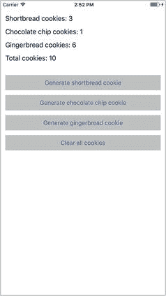

图 2-1. iOS 模拟器中的 `CookieFactory` 应用

本章的目的是让你熟悉创建单元测试、运行测试以及查看结果的过程。因此，你在本章中创建的测试将不包含所有方面，某些代码部分在本章结束时将不进行测试。本书的第 3、4 和 5 章将讨论特定主题，例如 MVVM 应用程序架构、测试模型对象以及测试视图控制器。

该应用程序的完整源代码可以通过以下 URL 从 Github 匿名下载：

[`https://github.com/asmtechnology/Lesson02.iOSTesting.2017.Apress.git`](https://github.com/asmtechnology/Lesson02.iOSTesting.2017.Apress.git)

如果你是一位经验丰富的开发者，你可能希望跳过阅读本章的内容，直接查看最终项目。

## 下载并安装 Xcode

如果你尚未安装，请使用 Mac App Store 为你的 Mac 下载并安装最新版本的 Xcode（见图 2-2）。

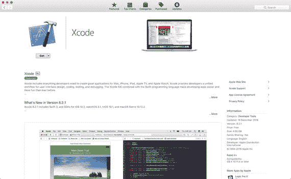

图 2-2. Mac App Store 应用中的 Xcode 页面

撰写本章时，Xcode 8 是 Mac OS X Sierra 的最新版本。Xcode 应用的大小超过 10 Gb，下载过程可能需要 15 到 45 分钟，具体取决于你的互联网连接速度。

## 创建支持单元测试的新项目

在创建新的 iOS 应用程序项目时，你可以选择创建内置支持单元测试的项目。通过启动 Xcode 并选择 `File` ➤ `New` ➤ `Project` 菜单项，开始创建新 Xcode 项目的过程。

系统将要求你为新项目选择一个模板。Xcode 8 允许你为 iOS、macOS、tvOS 和 watchOS 平台构建项目，并为每个平台提供了一系列模板（见图 2-3）。

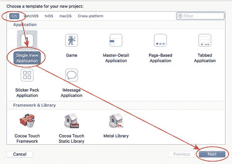

图 2-3. iOS 项目模板对话框

选择一个合适的 iOS 模板并点击 `Next`。在本节中，我将使用 iOS **单视图应用模板**，这是最常用的 iOS 应用模板之一。

选择项目模板后，将出现一个选项对话框，你可以在其中选择一些选项来自定义模板的某些方面（图 2-4）。

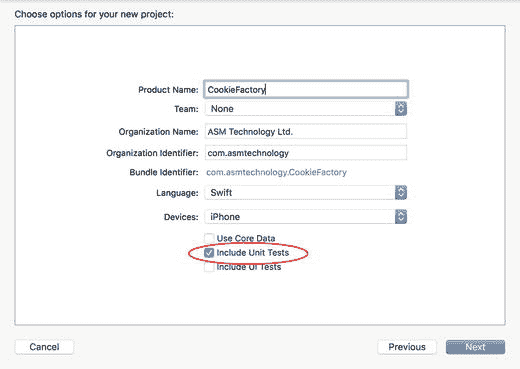

图 2-4. 项目选项对话框

某些字段是必填项，因此在你填写它们之前，`Next` 按钮将不可用。本书中的项目是使用 Swift 构建的，并针对 iPhone。这是 Xcode 中新 iOS 项目的默认设置。

在“为你新项目选择选项：”屏幕中，如果你想创建一个支持单元测试的项目，请确保选中 `Include Unit Tests` 选项。一个相关的选项 `Include UI Tests` 将添加对用户界面测试的支持。

点击 `Next` 按钮，并将项目保存到你 Mac 硬盘上的合适文件夹中。你创建的项目将具有一个专门为单元测试配置的额外构建目标，以及一个包含样板代码的示例单元测试文件。

默认情况下，创建新项目后，Xcode 会为你打开该项目。现在先关闭 Xcode 项目。下一节将讨论为现有项目添加单元测试支持所涉及的过程。

## 为现有项目添加单元测试支持

要为现有 iOS 应用程序项目添加单元测试支持，请在 Xcode 中打开该项目，并选择 `File` ➤ `New` ➤ `Target` 菜单项。在目标模板对话框中选择 `iOS Unit Testing Bundle` 选项（图 2-5）。

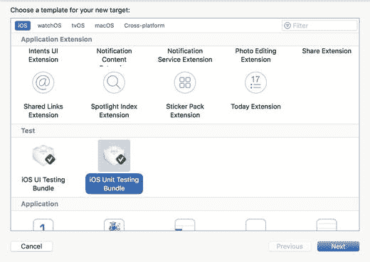

图 2-5. 目标模板对话框

选择目标模板后，将出现一个选项对话框，你可以在其中选择一些选项来自定义模板的某些方面（见图 2-6）。

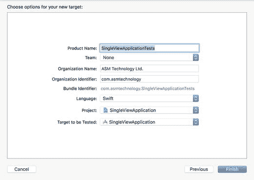

图 2-6. 目标选项对话框

在大多数情况下，你可以直接接受选项的默认值并点击 `Finish`。一个特殊的构建目标（称为测试目标）将被添加到你的项目中，并已预先配置为支持单元测试。除了测试目标之外，一个包含样板代码的示例单元测试文件也会被添加到你的项目中。

## Xcode 导览

在你开始用 Xcode 编写单元测试之前，你需要熟悉 Xcode 用户界面中处理单元测试的一些区域。随着你编写更多的测试，你很可能会用到此处讨论的用户界面的一个或多个部分。首先，在 Xcode 中打开 `CookieFactory` 项目。


### 项目导航器

项目导航器位于 Xcode 用户界面的左侧（见图 2-7）。如果项目导航器不可见，请使用 `View ➤ Navigators ➤ Show Project Navigator` 菜单项。

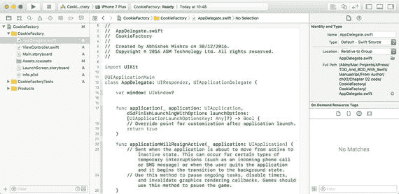

图 2-7. 打开项目导航器的 Xcode 应用程序

项目导航器列出了构成项目的文件。这些文件以树状结构分层组织，根节点代表项目本身。项目节点下有许多称为组的文件夹。图 2-8 显示了 `CookieFactory` 项目的项目导航器内容。你可以在项目导航器中看到三个文件夹组：

*   `CookieFactory`：此组包含构成将交付给客户的应用程序的文件。
*   `CookieFactoryTests`：此组包含包含测试代码的文件，以及测试代码所需的任何资源。此组中的文件不包含在将交付给客户的应用程序中。
*   `Products`：此组包含最终的构建产品。

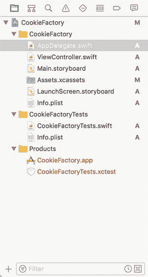

图 2-8. 项目导航器中的 `CookieFactory` 项目

可以通过拖放操作在项目导航器中移动文件。你可能会认为，在测试组下创建/移动文件的操作会自动意味着该文件将不属于交付给客户的产品的一部分。

事实并非如此；组仅作为帮助理清和整理项目文件列表的辅助工具。文件是否包含在交付给客户的应用程序中，取决于该文件所包含的构建目标。一个支持单元测试的新 iOS 项目将有两个构建目标；一个文件可以是任一目标、两者都不是或两者的成员。

你可以选择项目导航器中的一个文件，并使用文件检查器查看/更改该文件所属的构建目标（见图 2-9）。要显示文件检查器，请使用 `View ➤ Utilities ➤ Show File Inspector` 菜单项。

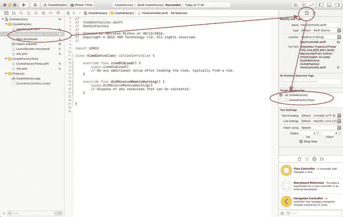

图 2-9. 使用文件检查器设置文件目标

### 测试用例类

在项目导航器的测试文件夹组下，你将创建单元测试用例类。单元测试用例类是一个派生自 `XCTestCase` 并包含多个方法的 Swift 类。当你创建一个支持单元测试的新项目时，会为你创建一个包含样板代码的默认测试用例类（见图 2-10）。

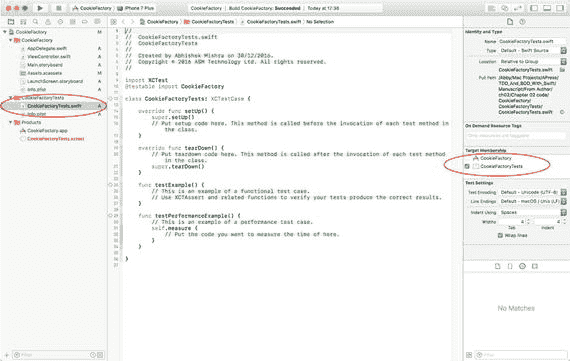

图 2-10. 默认测试用例文件和目标成员资格

测试用例类包含测试代码，即测试主应用程序代码的代码。测试用例类可能包含五种类型的方法：

*   **设置方法**：此方法名为 `setUp()`，在测试类中每个测试方法执行之前调用一次。它通常用于放置跨多个单元测试使用的任何公共设置代码。
*   **拆卸方法**：此方法名为 `tearDown()`，在测试类中每个测试方法执行之后调用。
*   **测试方法**：这些方法封装了单个单元测试，其名称均以单词 "test" 开头。
*   **性能测试方法**：这些方法封装了单个性能测试，其名称均以 `testPerformance` 开头。
*   **Swift 方法**：测试用例类，如同其他任何 Swift 类一样，可以有它自己的方法。在测试用例类中，不封装单元测试的方法通常是编写来包含支持逻辑，并会从单元测试中调用。

除了与项目一起创建的默认测试用例文件外，你还可以使用 `File ➤ New ➤ File` 菜单项并选择 `iOS Unit Test Case File` 模板来创建额外的测试用例文件（见图 2-11）。

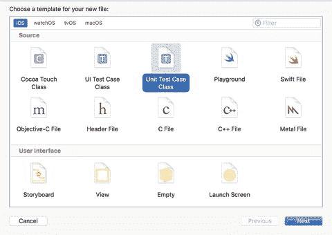

图 2-11. 文件模板对话框

当创建一个新的测试用例文件时，Xcode 会提供样板化的 `setUp()` 和 `tearDown()` 方法以及几个空的单元测试方法来帮助你开始。清单 2-1 列出了由 Xcode 创建的一个新的单元测试用例类。

```
import XCTest
class CookieFactoryTests: XCTestCase {
override func setUp() {
super.setUp()
// 在这里放置设置代码。此方法在类中每个测试方法的调用之前被调用。
}
override func tearDown() {
// 在这里放置拆卸代码。此方法在类中每个测试方法的调用之后被调用。
super.tearDown()
}
func testExample() {
// 这是一个功能测试用例的示例。
// 使用 XCTAssert 及相关函数来验证你的测试产生正确的结果。
}
func testPerformanceExample() {
// 这是一个性能测试用例的示例。
self.measure {
// 在这里放置你想要测量时间的代码。
}
}
}
```

清单 2-1. `CookieFactoryTests.swift`

### 测试导航器

测试导航器是 Xcode 用户界面的一个区域，它显示了测试目标中所有测试用例文件以及这些测试用例文件中所有单元测试的分层视图（见图 2-12）。

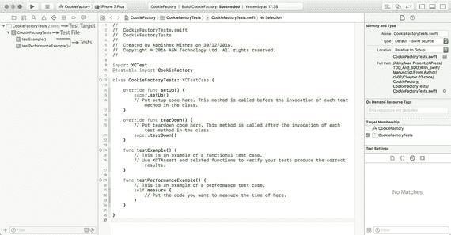

图 2-12. Xcode 测试导航器

要显示测试导航器，请使用 `View ➤ Navigators ➤ Show Test Navigator` 菜单项。如果将鼠标指针悬停在一个单元测试上，你将看到在该测试名称右侧出现一个按钮；点击该按钮将运行选中的测试（见图 2-13）。

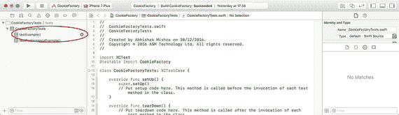

图 2-13. Xcode 测试导航器中的单元测试

当将鼠标指针悬停在测试用例文件名称和测试目标上时，你也会看到相同的按钮出现。在前一种情况下，点击该按钮将顺序运行该测试用例文件中的所有单元测试；在后一种情况下，它将运行该目标中的所有单元测试。

运行项目中所有测试的另一种方法是使用 `Product ➤ Test` 菜单项。运行测试后，测试导航器将在测试名称旁边显示绿色勾选或红色叉号，以指示成功或失败（见图 2-14）。

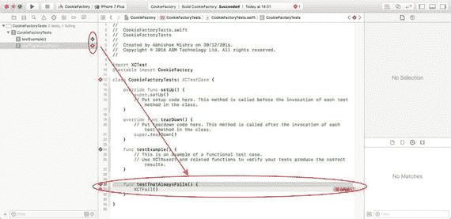

图 2-14. 通过和失败的单元测试

在测试导航器中点击测试的名称，将在源代码编辑器中打开该测试的代码。需要特别注意，测试代码也是代码，在测试执行之前必须能够编译。如果你的项目在测试代码或被测试的代码中存在编译错误，你需要在测试运行之前修复这些问题。

### 查看测试报告

你可以使用报告导航器访问项目中所有测试的报告（见图 2-15）。要显示报告导航器，请使用 `View ➤ Navigators ➤ Show Report Navigator`。

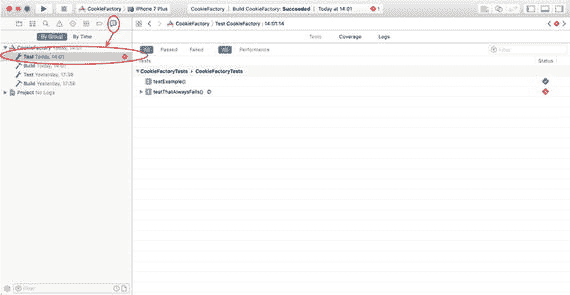

图 2-15. Xcode 测试报告导航器

报告导航器可用于访问项目日志、构建报告以及测试报告。点击报告列表中最新的测试活动节点以查看测试报告。


### 代码覆盖率报告

代码覆盖率报告可用于衡量一组测试运行后执行的源代码行数。在 Xcode 8 中，代码覆盖率报告默认未启用。要启用代码覆盖率报告，请通过 `Product ➤ Scheme ➤ Edit Scheme` 菜单项访问方案设置对话框（见图 2-16）。

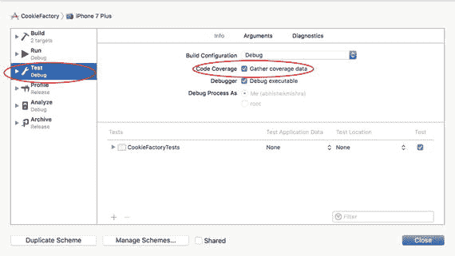

图 2-16. Xcode 方案设置

点击 `Test` 操作，启用 `Gather Coverage Data` 选项，然后点击 `Close`。代码覆盖率报告也可以通过报告导航器访问。要生成代码覆盖率报告，`Xcode` 必须在执行测试时收集数据。每次后续运行测试代码都会更新覆盖率报告，不过你可能需要运行测试几次后，才能获得初始覆盖率报告。

## 构建 Cookie Factory App

在上一节中，你了解了与单元测试相关的 `Xcode` 用户界面的不同方面。在本节中，你将为你之前创建的 `CookieFactory` 项目添加功能。完成后的应用的用户界面已在图 2-1 中呈现。

每次用户点击其中一个按钮时，都会创建特定类型的饼干，并且用户界面上的相应标签会更新。

首先，确保 `CookieFactory` 项目已在 `Xcode` 中打开，并且应用的主故事板文件已打开供编辑。向应用故事板的默认场景添加四个按钮和四个标签，并将它们放置成类似于图 2-17 的样子。

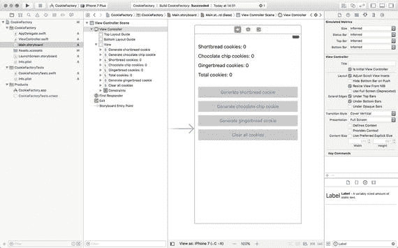

图 2-17. 来自主故事板文件的视图控制器场景

在 `ViewController.swift` 文件中创建插座变量和动作方法，并将它们连接到各自的用户界面元素，如表 2-1 所述。

**表 2-1.** 视图控制器的插座变量和动作方法

| 名称 | 类型 | 用户界面元素 |
| --- | --- | --- |
| `@IBOutlet weak var shortbreadCookies: UILabel!` | `IBOutlet` | 黄油曲奇标签。 |
| `@IBOutlet weak var chocolateChipCookies: UILabel!` | `IBOutlet` | 巧克力曲奇标签。 |
| `@IBOutlet weak var gingerbreadCookies: UILabel!` | `IBOutlet` | 姜饼曲奇标签。 |
| `@IBOutlet weak var totalCookies: UILabel!` | `IBOutlet` | 总曲奇标签。 |
| `@IBAction func onGenerateShortbreadCookies(_ sender: Any)` | `IBAction` | 生成黄油曲奇按钮的 Touch Up Inside 事件。 |
| `@IBAction func onGenerateChocolateChipCookies(_ sender: Any)` | `IBAction` | 生成巧克力曲奇按钮的 Touch Up Inside 事件。 |
| `@IBAction func onGenerateGingerbreadCookies(_ sender: Any)` | `IBAction` | 生成姜饼曲奇按钮的 Touch Up Inside 事件。 |
| `@IBAction func onClearAllCookies(_ sender: Any)` | `IBAction` | 清除所有曲奇按钮的 Touch Up Inside 事件。 |

此项目的模型层将包含一个名为 `Cookie` 的类，该类将具有一个成员变量 `type`，可用于区分不同类型的曲奇（见图 2-18）。一个名为 `CookieController` 的专用控制器类将用于管理曲奇的创建和存储。

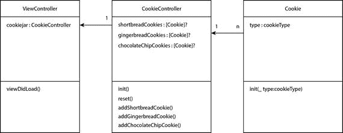

图 2-18. 模型层

在更复杂的应用中，你可能希望将创建曲奇的职责从 `CookieController` 类中移出，放到其自己的工厂类中。

视图控制器将调用 `CookieController` 类的相关方法，并更新标签中的文本。

### 构建 Cookie 类

删除 `CookieFactoryTests` 组下由 `Xcode` 在你创建项目时生成的 `CookieFactoryTests.swift` 文件。

在 `CookieFactoryTests` 组下创建一个名为 `CookieTests.swift` 的新单元测试用例文件，并确保该文件是 `CookieFactory` 测试目标的成员（见图 2-19）。

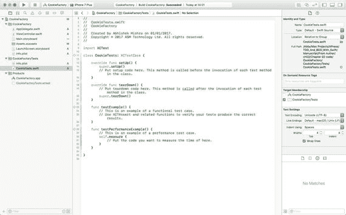

图 2-19. 默认的 `CookieTests.swift` 文件

将 `CookieTests.swift` 文件的内容替换为代码清单 2-2 中的代码。

```
import XCTest
class CookieTests: XCTestCase {
override func setUp() {
super.setUp()
}
override func tearDown() {
super.tearDown()
}
func testInit_GingerbreadCookieType_DoesNotReturnNil() {
let cookie = Cookie(.gingerbread)
XCTAssertNotNil(cookie)
}
func testInit_ShortbreadCookieType_DoesNotReturnNil() {
let cookie = Cookie(.shortbread)
XCTAssertNotNil(cookie)
}
func testInit_ChocolateChipCookieType_DoesNotReturnNil() {
let cookie = Cookie(.chocolateChip)
XCTAssertNotNil(cookie)
}
func testInit_GingerbreadCookieType_SetsCookieTypeIvarCorrectly() {
let cookie = Cookie(.gingerbread)
XCTAssertEqual(cookie.type, .gingerbread)
}
func testInit_ShortbreadCookieType_SetsCookieTypeIvarCorrectly() {
let cookie = Cookie(.shortbread)
XCTAssertEqual(cookie.type, .shortbread)
}
func testInit_ChocolateChipCookieType_SetsCookieTypeIvarCorrectly() {
let cookie = Cookie(.chocolateChip)
XCTAssertEqual(cookie.type, .chocolateChip)
}
}
```

代码清单 2-2. `CookieTests.swift`

此时会出现几个编译器错误，因为 `Cookie` 类尚不存在。观察测试是如何定义 `Cookie` 类的所需接口的。在此特定情况下，测试要求如下：

*   `Cookie` 类必须有一个接受类型标识符的初始化器。
*   `Cookie` 类必须有一个名为 `type` 的实例变量。
*   类型标识符可以有三个可能的值：`.chocolateChip`、`.gingerbread` 和 `.shortbread`。

在 `CookieFactory` 组下创建一个名为 `Cookie` 的新 Swift 类，并将其内容更新为与代码清单 2-3 一致。

```
import Foundation
enum cookieType {
case shortbread
case gingerbread
case chocolateChip
}
class Cookie : NSObject {
var type:cookieType
init(_ type:cookieType) {
self.type = type
super.init()
}
}
```

代码清单 2-3. `Cookie.swift`

确保 `Cookie.swift` 既是主目标又是测试目标的成员。这是因为你打算在正在构建的应用以及单元测试中都使用 `Cookie.swift`（见图 2-20）。

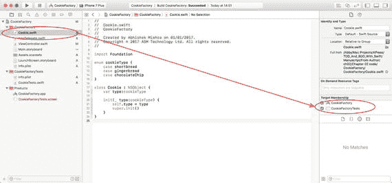

图 2-20. 检查 `Cookie.swift` 文件的目标成员身份

保存文件，并使用 `Product ➤ Test` 菜单项运行所有测试。你应该看到所有测试都通过了（见图 2-21）。

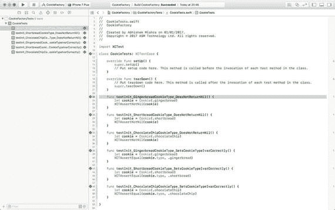

图 2-21. 测试检查器显示所有测试通过

### 构建 CookieController 类

在 `CookieFactoryTests` 组下创建一个名为 `CookieControllerTests.swift` 的新单元测试用例文件，并确保该文件是测试目标的成员。将 `CookieControllerTests.swift` 文件的内容替换为代码清单 2-4 中的代码。


```swift
import XCTest
class CookieControllerTests: XCTestCase {
override func setUp() {
super.setUp()
}
override func tearDown() {
super.tearDown()
}
}
// MARK: 初始化器测试
extension CookieControllerTests {
func testInit_GingerbreadCookieArray_IsNotNil() {
let cookieJar = CookieController()
XCTAssertNotNil(cookieJar.gingerbreadCookies)
}
func testInit_ShortbreadCookieArray_IsNotNil() {
let cookieJar = CookieController()
XCTAssertNotNil(cookieJar.shortbreadCookies)
}
func testInit_ChocolateChipCookieArray_IsNotNil() {
let cookieJar = CookieController()
XCTAssertNotNil(cookieJar.shortbreadCookies)
}
func testInit_GingerbreadCookieCount_IsZero() {
let cookieJar = CookieController()
XCTAssertEqual(cookieJar.gingerbreadCookies!.count, 0)
}
func testInit_ShortbreadCookieCount_IsZero() {
let cookieJar = CookieController()
XCTAssertEqual(cookieJar.shortbreadCookies!.count, 0)
}
func testInit_ChocolateChipCookieCount_IsZero() {
let cookieJar = CookieController()
XCTAssertEqual(cookieJar.chocolateChipCookies!.count, 0)
}
}
// MARK: addGingerbreadCookie 测试
extension CookieControllerTests {
func testAddGingerbreadCookie_Increments_NumberOfGingerbreadCookies_ByOne() {
let cookieJar = CookieController()
let numberOfCookies = cookieJar.gingerbreadCookies!.count
cookieJar.addGingerbreadCookie()
let expectedNumberOfCookies = numberOfCookies + 1
XCTAssertEqual(cookieJar.gingerbreadCookies!.count, expectedNumberOfCookies)
}
func testAddGingerbreadCookie_DoesNotIncrement_NumberOfShortbreadCookies() {
let cookieJar = CookieController()
let numberOfCookies = cookieJar.shortbreadCookies!.count
cookieJar.addGingerbreadCookie()
XCTAssertEqual(cookieJar.shortbreadCookies!.count, numberOfCookies)
}
func testAddGingerbreadCookie_DoesNotIncrement_NumberOfChocolateChipCookies() {
let cookieJar = CookieController()
let numberOfCookies = cookieJar.chocolateChipCookies!.count
cookieJar.addGingerbreadCookie()
XCTAssertEqual(cookieJar.chocolateChipCookies!.count, numberOfCookies)
}
}
// MARK: addShortbreadCookie 测试
extension CookieControllerTests {
func testAddShortbreadCookie_Increments_NumberOfShortbreadCookies_ByOne() {
let cookieJar = CookieController()
let numberOfCookies = cookieJar.shortbreadCookies!.count
cookieJar.addShortbreadCookie()
let expectedNumberOfCookies = numberOfCookies + 1
XCTAssertEqual(cookieJar.shortbreadCookies!.count, expectedNumberOfCookies)
}
func testAddShortbreadCookie_DoesNotIncrement_NumberOfGingerbreadCookies() {
let cookieJar = CookieController()
let numberOfCookies = cookieJar.gingerbreadCookies!.count
cookieJar.addShortbreadCookie()
XCTAssertEqual(cookieJar.gingerbreadCookies!.count, numberOfCookies)
}
func testAddShortbreadCookie_DoesNotIncrement_NumberOfChocolateChipCookies() {
let cookieJar = CookieController()
let numberOfCookies = cookieJar.chocolateChipCookies!.count
cookieJar.addShortbreadCookie()
XCTAssertEqual(cookieJar.chocolateChipCookies!.count, numberOfCookies)
}
}
// MARK: addChocolateChipCookie 测试
extension CookieControllerTests {
func testAddChocolateChipCookie_Increments_NumberOfChocolateChipCookies_ByOne() {
let cookieJar = CookieController()
let numberOfCookies = cookieJar.chocolateChipCookies!.count
cookieJar.addChocolateChipCookie()
let expectedNumberOfCookies = numberOfCookies + 1
XCTAssertEqual(cookieJar.chocolateChipCookies!.count, expectedNumberOfCookies)
}
func testAddChocolateChipCookie_DoesNotIncrement_NumberOfShortbreadCookies() {
let cookieJar = CookieController()
let numberOfCookies = cookieJar.shortbreadCookies!.count
cookieJar.addChocolateChipCookie()
XCTAssertEqual(cookieJar.shortbreadCookies!.count, numberOfCookies)
}
func testAddChocolateChipCookie_DoesNotIncrement_NumberOfGingerbreadCookies() {
let cookieJar = CookieController()
let numberOfCookies = cookieJar.gingerbreadCookies!.count
cookieJar.addChocolateChipCookie()
XCTAssertEqual(cookieJar.gingerbreadCookies!.count, numberOfCookies)
}
}
// MARK: 重置测试
extension CookieControllerTests {
func testReset_GingerbreadCookieArray_WithZeroElements_RemainsEmpty() {
let cookieJar = CookieController()
cookieJar.reset()
XCTAssertEqual(cookieJar.gingerbreadCookies!.count, 0)
}
func testReset_ShortbreadCookieArray_WithZeroElements_RemainsEmpty() {
let cookieJar = CookieController()
cookieJar.reset()
XCTAssertEqual(cookieJar.shortbreadCookies!.count, 0)
}
func testReset_ChocolateChipCookieArray_WithZeroElements_RemainsEmpty() {
let cookieJar = CookieController()
cookieJar.reset()
XCTAssertEqual(cookieJar.chocolateChipCookies!.count, 0)
}
func testReset_GingerbreadCookieArray_WithElements_BecomesEmpty() {
let cookieJar = CookieController()
cookieJar.addGingerbreadCookie()
cookieJar.reset()
XCTAssertEqual(cookieJar.gingerbreadCookies!.count, 0)
}
func testReset_ShortbreadCookieArray_WithElements_BecomesEmpty() {
let cookieJar = CookieController()
cookieJar.addShortbreadCookie()
cookieJar.reset()
XCTAssertEqual(cookieJar.shortbreadCookies!.count, 0)
}
func testReset_ChocolateChipCookieArray_WithElements_BecomesEmpty() {
let cookieJar = CookieController()
cookieJar.addChocolateChipCookie()
cookieJar.reset()
XCTAssertEqual(cookieJar.chocolateChipCookies!.count, 0)
}
}
清单 2-4.
CookieControllerTests.swift
```

此时你会收到几个编译器错误，因为 `CookieController` 类还不存在。这些测试为 `CookieController` 类定义了以下期望的特征：

*   `CookieController` 类必须有一个不接受任何参数的初始化器。
*   `CookieController` 类必须有三个数组，每种类型的饼干对应一个。
*   `CookieController` 类必须有一个名为 `addGingerbreadCookie()` 的方法，调用该方法会向相应的数组中添加一块姜饼饼干。
*   `CookieController` 类必须有一个名为 `addShortbreadCookie()` 的方法，调用该方法会向相应的数组中添加一块黄油饼干。
*   `CookieController` 类必须有一个名为 `addChocolateChipCookie()` 的方法，调用该方法会向相应的数组中添加一块巧克力饼干。
*   `CookieController` 类必须有一个名为 `reset()` 的方法，调用该方法会清空所有数组。

我使用了类扩展来分组测试每个方法。这样做唯一的好处是提高了可读性；如果你愿意，完全可以将所有测试从扩展移到主类中。你可能也注意到了，我使用了较长的描述性名称来命名测试方法。你应该尝试创建描述性的名称，明确描述所测试的方法名称、初始条件和预期输出。

在 `CookieFactory` 组下创建一个名为 `CookieController` 的新 Swift 类，并将其内容更新为与清单 2-5 一致。

```swift
import Foundation
class CookieController : NSObject {
var shortbreadCookies:[Cookie]?
var gingerbreadCookies:[Cookie]?
var chocolateChipCookies:[Cookie]?
override init() {
self.shortbreadCookies = [Cookie]()
self.gingerbreadCookies = [Cookie]()
self.chocolateChipCookies = [Cookie]()
super.init()
}
func reset() {
self.shortbreadCookies?.removeAll()
self.gingerbreadCookies?.removeAll()
self.chocolateChipCookies?.removeAll()
}
func addShortbreadCookie() -> Void {
let cookie = Cookie(.shortbread)
shortbreadCookies?.append(cookie)
}
func addGingerbreadCookie() -> Void {
let cookie = Cookie(.gingerbread)
gingerbreadCookies?.append(cookie)
}
func addChocolateChipCookie() -> Void {
let cookie = Cookie(.chocolateChip)
chocolateChipCookies?.append(cookie)
}
}
清单 2-5.
CookieController.swift
```

保存文件，然后使用 **Product ➤ Test** 菜单项运行所有测试。你应该会看到所有测试都通过了（见图 2-22）。

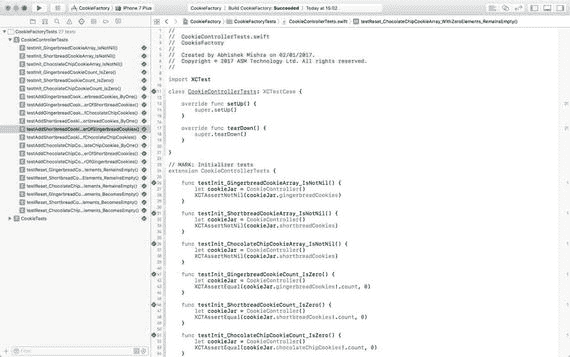

图 2-22. 显示所有测试通过的测试检查器


### 更新视图控制器类

至此，你已经使用测试驱动开发技术构建了 `Cookie` 和 `CookieFactory` 两个类。现在，是时候将 `CookieFactory` 类集成到视图控制器中了。

虽然你也可以使用测试驱动技术来执行集成，但为简化本章内容，我选择在视图控制器类上不使用 TDD 技术。第 5 章将详细阐述如何将 TDD 技术应用于视图控制器。

请将 `ViewController.swift` 文件的内容更新为清单 2-6 所示。

```swift
import UIKit
class ViewController: UIViewController {
var cookiejar:CookieController?
@IBOutlet weak var totalCookies: UILabel!
@IBOutlet weak var gingerbreadCookies: UILabel!
@IBOutlet weak var shortbreadCookies: UILabel!
@IBOutlet weak var chocolateChipCookies: UILabel!
override func viewDidLoad() {
super.viewDidLoad()
cookiejar = CookieController()
refreshUI()
}
override func didReceiveMemoryWarning() {
super.didReceiveMemoryWarning()
}
@IBAction func onGenerateGingerbreadCookies(_ sender: Any) {
cookiejar?.addGingerbreadCookie()
refreshUI()
}
@IBAction func onGenerateChocolateChipCookies(_ sender: Any) {
cookiejar?.addChocolateChipCookie()
refreshUI()
}
@IBAction func onGenerateShortbreadCookies(_ sender: Any) {
cookiejar?.addShortbreadCookie()
refreshUI()
}
@IBAction func onClearAllCookies(_ sender: Any) {
cookiejar?.reset()
refreshUI()
}
private func refreshUI() -> Void {
let totalGinger = cookiejar!.gingerbreadCookies!.count
let totalShort = cookiejar!.shortbreadCookies!.count
let totalChocolate = cookiejar!.chocolateChipCookies!.count
let total = totalGinger + totalShort + totalChocolate
gingerbreadCookies.text = "Gingerbread cookies: \(totalGinger)"
shortbreadCookies.text = "Shortbread cookies: \(totalShort)"
chocolateChipCookies.text = "Chocolate chip cookies: \(totalChocolate)"
totalCookies.text = "Total cookies: \(total)"
}
}
清单 2-6.
ViewController.swift
```

保存项目，并使用 **Product** ➤ **Run** 菜单项在模拟器上运行它。在你有机会试用该应用程序并验证其正常运行后，你可能想进一步探究单元测试的有效性。

评估单元测试有效性的一种方法是使用代码覆盖率报告。该报告将提供关于测试代码执行了多少行应用程序代码的信息。

下一节将介绍 Xcode 的代码覆盖率报告工具。在查看代码覆盖率报告之前，必须确保已至少执行过一次单元测试。

关闭 Xcode 时，代码覆盖率数据会被删除。如果在 Xcode 中重新打开项目，你需要使用 **Product** ➤ **Test** 菜单项运行所有单元测试，以便 Xcode 生成代码覆盖率数据。

### 查看代码覆盖率数据

如果你在方案设置对话框中启用了代码覆盖率报告，你将看到代码覆盖率条出现在源代码编辑器的右侧。点击项目导航器中的 `CookieFactory.swift` 文件，观察代码覆盖率条中的数字（见图 2-23）。

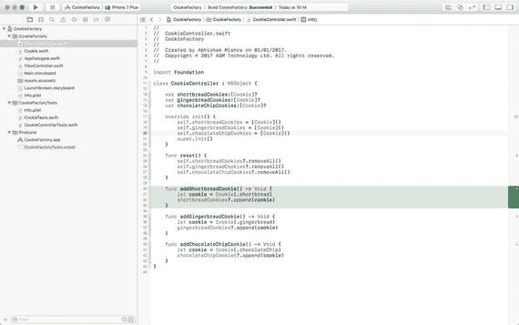

图 2-23. Xcode 代码覆盖率信息

你会注意到，代码覆盖率条在 `CookieFactory` 类的每个方法旁边都列出了一个数字。该数字表示运行测试套件时该方法被调用的次数。

将鼠标指针悬停在代码覆盖率条中的数字上，相关方法将以红色或绿色高亮显示。绿色高亮表示该方法已被测试至少调用一次，红色高亮表示该方法目前未被测试套件覆盖。

代码覆盖率是一个有用的工具，可以让你了解生产代码中被测试覆盖的部分，但必须谨慎使用。许多开发团队试图通过编写无意义的测试或覆盖 iOS 框架代码的测试来实现高代码覆盖率。与其拥有大量难以维护或新团队成员难以理解的测试，不如拥有少量更有意义的测试。

## 摘要

本章向你介绍了 Xcode 用户界面中与单元测试相关的部分。你还使用基本的 TDD 技术构建了一个简单的单视图应用程序，并学会了查看代码覆盖率报告。

下一章将讨论 MVVM 架构模式，以及使用此模式构建的应用程序如何更易于测试。

