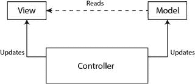
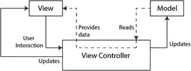
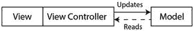
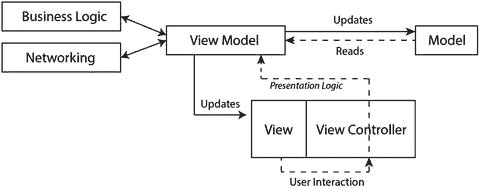
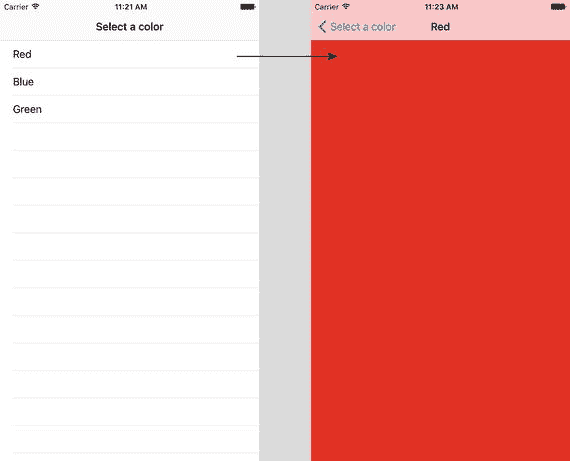

# 3. MVVM 架构模式

本章将探讨一种常用的架构模式，即模型-视图-控制器（MVC），及其在 iOS 中的等效形式模型-视图控制器（M-VC），以及使用这种常见模式时出现的可测试性问题。接着，你将了解一种名为模型、视图、视图模型（MVVM）的新架构模式，以及这种模式在代码可重用性和可测试性方面的优势。

为避免本章出现混淆，在讨论 iOS 版本时我将拼写出“Model-ViewController”（模型-视图控制器），在指代常见模式时则使用缩写“MVC”。

## MVC 架构模式

模型-视图-控制器是当今在各种编程语言（Java、.NET、Objective-C、Swift）中使用最广泛的应用程序架构模式之一。它旨在帮助开发人员在计算机上实现用户界面，并致力于将数据的表示方式与向用户呈现的方式分离开来。图 3-1 描绘了标准的 MVC 模式。



图 3-1. 标准模型-视图-控制器模式

此模式包含三个关键组件（有时也称为层）：

- **模型**：模型组件负责处理应用程序使用的数据存储，并接受来自控制器的命令以读取或更新数据。它可以是单个类或一组相关类。
- **视图**：视图组件从模型读取数据，并处理模型的渲染/呈现。视图可以被视为模型的视觉表示，并且可以有选择地呈现模型的某些部分。
- **控制器**：控制器组件位于模型和视图之间，处理用户输入，更新模型，并根据需要更新视图。业务逻辑和网络代码位于一个或多个控制器中，并且控制器可以与其他控制器通信。换句话说，控制器构成了应用程序的大脑。


### 模型-视图-控制器架构模式

`Cocoa Touch`、`UIKit`以及其他 Apple 框架提供了在 iOS 应用中实现模型-视图-控制器架构所需的所有基础设施：

-   `模型`：可以是任何 `NSObject` 子类，甚至是 `NSManagedObjectModel` 子类。
-   `视图`：可以是任何 `UIView` 子类，例如 `UILabel`、`UIButton` 和 `UIScrollView`。
-   `控制器`：可以是任何 `NSObject` 子类。

然而，Apple 还创建了“视图控制器”的概念，它将视图和控制器合并到一个单一的类中。事实上，视图控制器非常普遍，以至于许多刚接触 iOS 开发的开发者并未意识到完全可以独立创建控制器。

图 3-2 展示了模型-视图-控制器架构模式在典型 iOS 应用中的样子，其中视图控制器同时拥有模型和视图。三个组件的角色总结如下：



**图 3-2.** 模型-视图-控制器模式

-   `视图`：负责渲染模型，向视图控制器请求数据，将用户交互事件传递给视图控制器。
-   `模型`：负责存储数据。
-   `视图控制器`：从模型读取数据并提供给视图，更新模型，处理用户交互事件。

然而，由于视图和视图控制器紧密耦合，且视图控制器拥有视图，这种架构模式开始变得类似于图 3-3。事实上，一个视图与不同的视图控制器配对的情况极为罕见。



**图 3-3.** 视图、视图控制器与模型对象之间的交互

如果你已经开发 iOS 应用几个月，你很快就会发现，就代码行数而言，视图控制器通常是项目中最大的文件。这是因为视图控制器通常充当代理、数据源，包含网络代码、视图管理逻辑以及发起网络调用等。视图控制器还通常实现多个协议，这导致控制器逻辑与支持协议的代码混杂在一起。这些臃肿的视图控制器通常被称为“巨型视图控制器”。

巨型视图控制器中的某些逻辑确实属于视图控制器，但其中有很大一部分是展示逻辑、模型转换逻辑和网络逻辑，这些逻辑理想情况下应该放在独立的辅助对象或控制器中。

## 模型-视图-控制器的可测试性问题

虽然测试模型-视图-控制器模式中的模型层不会带来重大挑战，但另一方面，测试视图控制器却存在一些问题：

-   **难以实例化**：在测试中实例化视图控制器可能并不简单；所有 `IBOutlet` 都需要使用合适的子类进行桩接。你需要将 XIB 或 storyboard（故事板）包含在测试目标中，并可能最终实例化一个复杂的 UI 层对象栈，例如导航控制器和表格视图。仅仅为了能够实例化一个视图控制器而将 storyboard 添加到测试目标，会使你的测试非常脆弱，最终你可能会质疑这些测试本身的价值。
-   **难以模拟**：由于视图控制器中代码的紧密耦合特性，通常很难单独测试某一个方法。
-   **在单元测试中测试 UI 层**：单元测试不应该测试 UI 层；视图控制器模糊了执行 UI 逻辑的代码与执行业务逻辑的代码之间的界限。

## 模型-视图-视图模型架构模式

模型-视图-视图模型（MVVM）架构模式由微软开发，旨在帮助开发者构建基于 XAML 的 WPF 应用程序，但正如你将很快了解到的，MVVM 可以很容易地适配使用在 iOS/Swift 应用中。MVVM 是 MVC 的一种扩展，我们将视图和控制器正式耦合在一起，但将所有展示逻辑从控制器中移出，放入一个名为 `viewModel` 的新对象中。

在 iOS/Swift 环境中，视图的角色由视图与视图控制器的组合来承担（见图 3-4）。



**图 3-4.** iOS 上的模型-视图-视图模型模式

三个组件的角色总结如下：

-   `模型`：负责存储数据，与 `viewModel` 保持双向通信。
-   `视图`/`视图控制器`：代表模式中的视图部分，处理用户交互事件。与 `viewModel` 保持双向通信。
-   `视图模型`：处理展示逻辑，与模型和视图/视图控制器均保持双向通信。处理与可能提供特定功能（如复杂业务逻辑和网络请求）的其他控制器的通信。

微软最初的 MVVM 模式广泛使用 XAML 绑定来连接该模式的三个主要组件。在 iOS/Swift 应用中，有两种可用的选项来连接此模式的各个主要组件：

-   **使用 Swift 协议**：该模式的主要组件通过一组定义良好的协议进行交互。每个组件实现相关的一组协议。
-   **使用 ReactiveCocoa / RxSwift**：现已出现第三方库，允许 Swift 开发者应用响应式编程原理，在该模式的主要组件之间创建绑定。

> **注**：响应式编程不在本书的讨论范围内。本书中的所有示例都使用基于协议的方法。

## MVVM 的优势

本节列出了 MVVM 模式相对于 M-VC 模式的一些关键优势：

-   MVVM 模式将代码从单个视图控制器类中移出，并将这些代码分布到一组更细粒度的类上；这减小了任何单个类的大小，从而解决了巨型视图控制器的问题。
-   视图/视图控制器组件与模型松散耦合；并且通过 `viewModel`，团队中的开发者可以独立且并行地构建这些组件。适应 UI 变更也显著更容易，而对模型或视图模型层没有重大影响。
-   如果实现得当，`viewModel` 中不应直接引用 `UIKit`。视图和 `viewModel` 是松散耦合的。这使得在测试用例中实例化视图模型变得容易。一个合适的模拟或桩视图只需要实现视图所需的相关协议。
-   将视图层与视图模型层解耦带来的好处是，视图层可以使用不同的 UI 技术来实现。例如，视图模型和模型代码可以通过简单地替换视图层，在 MacOS 应用中重复使用。
-   MVVM 基于松散耦合的类，提高了可测试性。一层的类可以独立于其他层进行实例化。使用协议来定义参与类之间的契约，使得桩接/模拟依赖关系的任务显著更容易。
-   MVVM 促进了对象之间的关注点分离。当对象没有紧密耦合时，产生的代码更易于应对变更，并且从长远来看更易于维护。

## 视图模型实例化

你可以使用多种策略来实例化视图模型。本节将探讨你在使用 MVVM 模式创建 iOS 应用时会遇到的几个常见场景。


### 独立的视图控制器

当处理独立的视图控制器时，一种常见策略是在视图控制器的 `viewDidLoad()` 方法中实例化视图模型。以下代码片段演示了这一策略：

```
class CountriesViewController: UIViewController {
    private var viewModel: CountriesViewModel?
    
    override func viewDidLoad() {
        super.viewDidLoad()
        self.viewModel = CountriesViewModel(view: self, title: "Select a country")
    }
}
```

关于此策略的几点注意事项：
- 视图控制器通过强引用的 `private var` 拥有视图模型。
- 视图模型在初始化时被注入了对视图/视图控制器的引用。视图模型将持有一个对视图/视图控制器的弱引用。
- 视图模型的初始化器也可用于注入设置时所需的其他参数。

第五章 5 将探讨如何使用 TDD 技术和 MVVM 模式创建基于独立视图控制器的应用。

### 表视图控制器

当处理表视图控制器时，表视图控制器的视图模型将提供行数和分区数的信息。视图模型还可用于维护当前选中单元格的索引。但每个单元格中的数据从何而来？

每个表视图单元格本身也是一个视图，因此 MVVM 模式必须同时应用于单个表视图单元格及其所在的表视图。你可能会考虑对表视图和单个单元格使用相同的视图模型，但这种方法会使视图模型承担过多职责。

更好的方法是为表视图和单个表视图单元格使用不同的视图模型。这种方法能保持每个视图模型的规模较小，因为每个视图模型仅负责单个视图，而不是其子视图。

实例化表视图控制器的视图模型很简单，只需在表视图控制器的 `viewDidLoad()` 方法中添加几行代码即可。那么，如何以及在何时为单个单元格实例化视图模型呢？

一个好的方法是在表视图控制器的视图模型内部构建一个工厂方法，并用此工厂方法来获取单个单元格的视图模型。

工厂方法可以封装为单元格创建视图模型的具体细节，并为单元格视图模型提供相关的模型对象。工厂方法也可以从表视图控制器的视图模型中移出，放到其自己的类中，这种情况下，你将使用一个专用对象来构建视图模型。

调用视图模型工厂（无论是方法还是对象）的理想位置是在表视图控制器的 `tableView(_ tableView:, cellForRowAt:)` 方法中。以下代码片段演示了这一方法：

```
override func tableView(_ tableView: UITableView, cellForRowAt indexPath: IndexPath) -> UITableViewCell {
    let cell = tableView.dequeueReusableCell(withIdentifier: "CountryCell", for: indexPath) as? CountriesTableViewCell
    guard let viewModel = tableViewModel,
          let countriesTableViewCell = cell else {
        return UITableViewCell()
    }
    let cellViewModel = viewModel.cellViewModel(forIndexPath: indexPath)
    countriesTableViewCell.viewModel = cellViewModel
    return countriesTableViewCell
}
```

在此代码片段中，通过表视图的 `dequeueReusableCell(withIdentifier:, for)` 方法获取了一个自定义的 `UITableViewCell` 实例：

```
let cell = tableView.dequeueReusableCell(withIdentifier: "CountryCell", for: indexPath) as? CountriesTableViewCell
```

在表视图控制器的视图模型上调用了名为 `cellViewModel(forIndexPath:)` 的工厂方法：

```
let cellViewModel = viewModel.cellViewModel(forIndexPath: indexPath)
```

该方法返回用于表视图单元格的视图模型，随后该视图模型被赋值给表视图单元格的一个属性，最后返回该单元格：

```
countriesTableViewCell.viewModel = cellViewModel
return countriesTableViewCell
```

此代码片段假设表视图单元格将拥有单元格的视图模型。

### 基于导航控制器的应用

主从式应用在 iOS 中非常常见。这类应用通常通过在导航控制器中嵌入表视图控制器来实现。当用户点击表视图中的某个单元格时，会触发一个 push 跳转，从右侧滑入详情视图。呈现的详情视图控制器通常显示与表视图中被点击单元格相关的信息。

当使用 MVVM 模式构建此类应用时，显然表视图控制器（主视图）应拥有自己的视图模型，而随后被推入导航栈的详情视图控制器也应拥有自己的视图模型。

此处的挑战在于如何用正确的模型对象构建详情视图模型，以确保详情视图包含正确的信息。

如上一节所述，你可以使用工厂方法来实例化其中一个或全部两个视图模型。该工厂方法需要在主表视图控制器的 `prepare(for segue: UIStoryboardSegue, sender: Any?)` 方法中被调用。

你还需要确保主视图模型能够跟踪选中的单元格索引。这样，才能将适当的详情模型关联到详情视图模型。

这种方法同样适用于集合视图控制器，因为集合视图控制器在许多方面与表视图控制器相似。第六章 6 涵盖了使用 TDD 技术构建基于 MVVM 的集合视图控制器这一主题。

清单 3-1 至 3-5 演示了如何将 MVVM 模式应用于表视图控制器。这些清单共同构成了一个展示几种常见颜色名称列表的应用。当用户从列表中选中一种颜色时，会呈现一个用所选颜色绘制的详情视图（见图 3-5）。



**图 3-5. ColorList 应用**

该项目的完整源代码（包含单元测试）可通过以下 URL 从 github 匿名下载：

[`https://github.com/asmtechnology/Lesson03.iOSTesting.2017.Apress.git`](https://github.com/asmtechnology/Lesson03.iOSTesting.2017.Apress.git)

此代码片段中涉及五个关键类：
- `ColorListTableViewController`：这是 `UITableViewController` 的子类，向用户展示颜色列表。
- `ColorDetailViewController`：这是 `UIViewController` 的子类，当用户从颜色列表中选择一种颜色时显示。
- `ColorTableViewModel`：这是颜色列表表视图控制器类的视图模型。
- `ColorDetailViewModel`：这是颜色详情视图控制器类的视图模型。
- `Color`：代表此项目的模型。

为简洁起见，此代码片段中未列出协议。不过，您可以下载项目并详细查看协议。

让我们先来检查 `ColorListTableViewController` 类的代码：


```swift
class ColorListTableViewController: UITableViewController {
    private var viewModel:TableViewModel?
    override func viewDidLoad() {
        super.viewDidLoad()
        self.clearsSelectionOnViewWillAppear = false
        self.viewModel = ColorTableViewModel(view: self, title:"Select a color")
    }
    // MARK: - Table view data source
    override func tableView(_ tableView: UITableView, numberOfRowsInSection section: Int) -> Int {
        guard let viewModel = viewModel else {
            return 0
        }
        return viewModel.numberOfRows()
    }
    override func tableView(_ tableView: UITableView, cellForRowAt indexPath: IndexPath) -> UITableViewCell {
        let cell = tableView.dequeueReusableCell(withIdentifier: "ColorListtCell", for: indexPath) as? ColorListTableViewCell
        guard let viewModel = viewModel ,
            let colorListTableViewCell = cell else {
                return UITableViewCell()
        }
        let detailViewModel = viewModel.cellViewModel(forIndexPath: indexPath)
        colorListTableViewCell.viewModel = detailViewModel
        return colorListTableViewCell
    }
    override func tableView(_ tableView: UITableView, didSelectRowAt indexPath: IndexPath) {
        guard let viewModel = viewModel else {
            return
        }
        viewModel.selectRow(atIndexPath:indexPath)
        self.performSegue(withIdentifier: "colorDetailSegue", sender: nil)
    }
    override func prepare(for segue: UIStoryboardSegue, sender: Any?) {
        guard let identifier = segue.identifier, let viewModel = viewModel else {
            return
        }
        if identifier.compare("colorDetailSegue") != .orderedSame {
            return
        }
        if let colorDetailViewController = segue.destination as? ColorDetailViewController,
            let destinationViewModel = viewModel.viewModelForSelectedRow() {
            destinationViewModel.setView(delegate: colorDetailViewController)
            colorDetailViewController.viewModel = destinationViewModel
        }
    }
}
```
列表 3-1. `ColorListTableViewController`

在列表 3-1 中，表视图控制器持有表视图模型。该视图模型是 `ColorTableViewModel` 的一个实例，并在表视图控制器的 `viewDidLoad()` 方法中实例化：

```swift
override func viewDidLoad() {
    super.viewDidLoad()
    self.clearsSelectionOnViewWillAppear = false
    self.viewModel = ColorTableViewModel(view: self, title:"Select a color")
}
```

`tableView(_ tableView:, cellForRowAt:) -> UITableViewCell` 方法创建表视图单元格，并将视图模型传递给每个表视图单元格。每个单元格的视图模型通过 `ColorTableViewModel` 提供的名为 `cellViewModel(forIndexPath) -> CellViewModel?` 的工厂方法创建。

```swift
override func tableView(_ tableView: UITableView, cellForRowAt indexPath: IndexPath) -> UITableViewCell {
    let cell = tableView.dequeueReusableCell(withIdentifier: "ColorListtCell", for: indexPath) as? ColorListTableViewCell
    guard let viewModel = viewModel,
        let colorListTableViewCell = cell else {
            return UITableViewCell()
    }
    let detailViewModel = viewModel.cellViewModel(forIndexPath: indexPath)
    colorListTableViewCell.viewModel = detailViewModel
    return colorListTableViewCell
}
```

点击表视图中的单元格会记录视图模型中所选单元格的索引位置，并执行一个转场，以动画方式将详情视图控制器显示到屏幕上：

```swift
override func tableView(_ tableView: UITableView, didSelectRowAt indexPath: IndexPath) {
    guard let viewModel = viewModel else {
        return
    }
    viewModel.selectRow(atIndexPath:indexPath)
    self.performSegue(withIdentifier: "colorDetailSegue", sender: nil)
}
```

**注意**：如果你已从表视图单元格到故事板中的详情视图控制器创建了转场，则无需调用 `performSegue(withIdentifier:, sender:)`。然而，如果转场是从表视图控制器到详情视图控制器创建的，那么你需要调用 `performSegue(withIdentifier:, sender:)` 来触发转场。

为详情视图控制器生成视图模型，并将该视图模型分配给详情视图控制器属性的代码，可以在 `prepare(for, sender:)` 方法中找到：

```swift
override func prepare(for segue: UIStoryboardSegue, sender: Any?) {
    guard let identifier = segue.identifier, let viewModel = viewModel else {
        return
    }
    if identifier.compare("colorDetailSegue") != .orderedSame {
        return
    }
    if let colorDetailViewController = segue.destination as? ColorDetailViewController,
        let destinationViewModel = viewModel.viewModelForSelectedRow() {
        destinationViewModel.setView(delegate: colorDetailViewController)
        colorDetailViewController.viewModel = destinationViewModel
    }
}
```

现在让我们检查 `ColorDetailViewController` 类：

```swift
class ColorDetailViewController: UIViewController {
    var viewModel:ColorDetailViewModel?
    override func viewDidAppear(_ animated: Bool) {
        if let viewModel = viewModel {
            viewModel.viewDidAppear(animated)
        }
    }
}
extension ColorDetailViewController : ColorDetailViewControllerDelegate {
    func setNavigationTitle(_ title:String) -> Void {
        self.title = title
    }
    func setBackgroundColor(red:Float, blue:Float, green:Float, alpha:Float) -> Void {
        self.view.backgroundColor = UIColor(red: CGFloat(red), green: CGFloat(green), blue: CGFloat(blue), alpha: CGFloat(alpha))
    }
}
```
列表 3-2. `ColorDetailViewController`

这是一个非常简单直接的类。它对视图模型持有一个强引用，并让视图模型有机会在 `viewDidAppear()` 方法中处理展示逻辑：

```swift
override func viewDidAppear(_ animated: Bool) {
    if let viewModel = viewModel {
        viewModel.viewDidAppear(animated)
    }
}
```

响应此事件时，视图模型将通过视图控制器实现的一组委托方法来更改视图的背景颜色和标题。

现在让我们检查 `ColorTableViewModel` 类的代码：

```swift
class ColorTableViewModel: NSObject {
    var tableTitle:String
    fileprivate var coulorData:[Color]
    fileprivate var selectedIndexPath:IndexPath?
    fileprivate weak var view:ColorListTableViewControllerDelegate?
    init (view:ColorListTableViewControllerDelegate?, title:String) {
        self.view = view
        self.tableTitle = title
        self.coulorData = []
        if let redModel = Color(name: "Red", red: 1.0, green: 0.0, blue: 0.0, alpha: 1.0),
            let blueModel = Color(name: "Blue", red: 0.0, green: 0.0, blue: 1.0, alpha: 1.0),
            let greenModel = Color(name: "Green", red: 0.0, green: 1.0, blue: 0.0, alpha: 1.0) {
            self.coulorData.append(redModel)
            self.coulorData.append(blueModel)
            self.coulorData.append(greenModel)
        }
    }
}
extension ColorTableViewModel : TableViewModel {
    func setView(delegate:AnyObject?) -> Void {
        self.view = delegate as? ColorListTableViewControllerDelegate
    }
    func numberOfRows() -> Int {
        return coulorData.count
    }
    func cellViewModel(forIndexPath indexPath:IndexPath) -> CellViewModel? {
        let row = indexPath.row
        if row = self.coulorData.count {
            return nil
        }
        let cellText = coulorData[row].name
        return TableViewCellViewModel(view:nil, cellText: cellText)
    }
    func selectRow(atIndexPath indexPath:IndexPath) {
        self.selectedIndexPath = indexPath
    }
    func viewModelForSelectedRow() -> ColorDetailViewModel? {
        guard let selectedIndexPath = selectedIndexPath else {
            return nil
        }
        if selectedIndexPath.row = coulorData.count {
            return nil
        }
        return ColorDetailViewModel(view:nil, model:coulorData[selectedIndexPath.row])
    }
    func viewDidAppear(_ animated: Bool) {
        guard let view = view else {
            return
        }
        view.setNavigationTitle(tableTitle)
    }
    func model(forIndexPath indexPath:IndexPath) -> AnyObject? {
        let row = indexPath.row
        if row = self.coulorData.count {
            return nil
        }
        return coulorData[row] as AnyObject
    }
}
```
列表 3-3. `ColorListTableViewModel`

好的，作为一名高级文档工程师和翻译员，我将严格遵循您提供的注意事项和示例格式，将以下英文文本翻译成中文。


清单 3-3 中的代码处理了表视图的呈现方面，以及为单元格和详细信息视图控制器构建视图模型。`ColorListTableViewModel` 实例持有对视图层的弱引用以及对模型对象数组的强引用。该数组代表了此应用程序的模型层：

```
fileprivate weak var view:ColorListTableViewControllerDelegate?
fileprivate var coulorData:[Color]
```

现在让我们检查 `ColorDetailViewModel` 类的代码：

```
import Foundation
class ColorDetailViewModel : NSObject {
    weak var view:ColorDetailViewControllerDelegate?
    var model:Color?
    init(view:ColorDetailViewControllerDelegate?, model:Color?) {
        self.view = view
        self.model = model
        super.init()
    }
}
extension ColorDetailViewModel : ViewModel {
    func viewDidAppear(_ animated: Bool) {
        if let view = self.view, let model = self.model {
            view.setBackgroundColor(red: model.red, blue: model.blue, green: model.green, alpha: model.alpha)
            view.setNavigationTitle(model.name)
        }
    }
    func setView(delegate:AnyObject?) -> Void {
        self.view = delegate as? ColorDetailViewControllerDelegate
    }
}
清单 3-4。
ColorDetailViewMoel
```

清单 3-4 中的代码代表了详细信息视图控制器的视图模型。该视图模型持有对视图层的弱引用以及对模型对象的强引用。该模型对象是一个 `Color` 类的实例。

```
weak var view:ColorDetailViewControllerDelegate?
var model:Color?
```

视图模型的 `viewDidAppear` 事件被绑定到由视图控制器调用匹配事件时触发。视图模型使用此事件来设置视图的背景颜色和标题：

```
func viewDidAppear(_ animated: Bool) {
    if let view = self.view, let model = self.model {
        view.setBackgroundColor(red: model.red, blue: model.blue, green: model.green, alpha: model.alpha)
        view.setNavigationTitle(model.name)
    }
}
```

接下来让我们检查 `Color` 类的代码：

```
import Foundation
class Color {
    private static let zero = Float(floatLiteral: 0.0)
    private static let one = Float(floatLiteral: 1.0)
    var name:String
    var red:Float
    var green:Float
    var blue:Float
    var alpha:Float
    init?(name:String, red:Float, green:Float, blue:Float, alpha:Float) {
        if (red < Color.zero || red > Color.one) {
            return nil
        }
        if (green < Color.zero || green > Color.one) {
            return nil
        }
        if (blue < Color.zero || blue > Color.one) {
            return nil
        }
        if (alpha < Color.zero || alpha > Color.one) {
            return nil
        }
        self.name = name
        self.red = red
        self.green = green
        self.blue = blue
        self.alpha = alpha
    }
}
清单 3-5。
Color.swift
```

清单 3-5 中的代码代表了一个单一的模型对象。该模型对象包含描述颜色名称以及单独的 R、G、B、A 分量值的属性：

```
var name:String
var red:Float
var green:Float
var blue:Float
var alpha:Float
```

## 总结

在本章中，您了解了无处不在的模型-视图-控制器（MVC）模式及其 iOS 等效的模型-视图控制器（M-VC）模式。使用 M-VC 模式构建的应用程序往往拥有庞大且难以测试的视图控制器类。

您还了解了微软替代 MVC 模式的模式，即模型-视图-视图模型（MVVM）模式。该模式起源于 WPF/XAML 应用程序，但可以轻松改编并用于 iOS 应用程序。

使用 MVVM 模式构建的应用程序比使用 MVC 或 M-VC 模式构建的应用程序更容易测试。

