# 4. 将 TDD 应用于模型

本章将探讨使用 TDD 技术构建应用程序模型层的过程。由于本章专注于模型层，因此您不会构建用户界面或任何表示逻辑。

测试应用程序模型层的组件与测试应用程序中的其他组件同样重要。在一个非常简单的应用中，模型层可能只包含一个具有几个实例变量的类。即使在这种简化场景下，单元测试也可以用来确认模型类具有应用程序其他部分期望其拥有的成员变量。

在更复杂的应用中，模型层可能包含几个具有复杂关系和职责的类。模型层中的各个类可能执行数据转换、持久化和验证。在这种情况下，单元测试有助于建立（并维护）类之间的关系，并提供对转换、持久化和验证逻辑按预期工作的信心。

本章介绍的模型层旨在表示一个银行账户以及该账户中的一组交易。我们将创建类来表示银行账户、账户所有者以及账户内的交易。图 4-1 描绘了模型层的类图。


图 4-1. 模型层类

以下是构成模型层的类的简要描述：

*   `BankAccount`：代表一个单独的银行账户。一个 `BankAccount` 对象可以表示储蓄账户或活期账户。
*   `Transaction`：代表一笔单独的交易。一个 `Transaction` 对象可以表示资金存入账户或资金从账户转出。
*   `AccountOwner`：代表拥有银行账户的个人（或实体）。一个账户最多可以有两个所有者。

该应用程序的完整源代码可以通过以下 URL 从 GitHub 匿名下载：

[`https://github.com/asmtechnology/Lesson04.iOSTesting.2017.Apress.git`](https://github.com/asmtechnology/Lesson04.iOSTesting.2017.Apress.git)

## 创建 Xcode 项目

启动 Xcode 并基于“单视图应用程序”模板创建一个新的 iOS 项目（见图 4-2）。

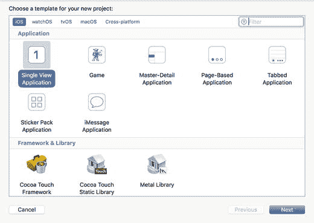

图 4-2. Xcode 项目模板对话框

在创建新项目时使用以下选项（见图 4-3）：

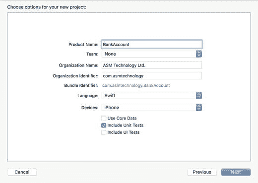

图 4-3. Xcode 项目选项对话框

*   产品名称：`BankAccount`
*   团队：无
*   组织名称：提供一个合适的名称
*   组织标识符：提供一个合适的标识符
*   语言：`Swift`
*   设备：`iPhone`
*   使用 Core Data：未选中
*   包含单元测试：已选中
*   包含 UI 测试：未选中

注意

即使我们在创建此项目时使用了“单视图应用程序”模板，项目中也不会添加任何用户界面/表示代码。在第 6 章中，您将构建一个应用程序来显示银行账户详情以及集合视图中的交易列表。第 6 章中的项目将基于本章创建的文件进行构建。

将项目保存到计算机上的合适位置，然后点击“创建”。由于此项目将包含多个新类，因此最好将类文件放在项目导航器中的适当组下。

在 Xcode 项目导航器中创建一个名为 `Model` 的组。您将在此组中创建特定于模型层的类。

## 构建模型层

我们需要构建三个模型类：

*   `AccountOwner`
*   `Transaction`
*   `BankAccount`

这些类将在本章后续部分使用 TDD 技术进行构建。


### `AccountOwner` 类

`AccountOwner` 类的实例代表拥有账户的个人或实体。表 4-1 列出了 `AccountOwner` 类所需的成员变量和方法。

**表 4-1.** `AccountOwner` 变量和方法

| 项目 | 类型 | 描述 |
| --- | --- | --- |
| `var firstName:String` | 变量 | 长度应在 2 到 10 个字符之间，且不包含数字或空格。 |
| `var lastName:String` | 变量 | 长度应在 2 到 10 个字符之间，且不包含数字或空格。 |
| `var emailAddress:String` | 变量 | 必须是有效的电子邮件地址。 |
| `init?(firstName:String, lastName:String, emailAddress:String)` | 方法 | 允许其他代码创建 `AccountOwner` 实例。 |

在项目浏览器的 `BankAccountTests` 组下创建一个名为 `AccountOwnerTests` 的新 iOS 单元测试用例类（见图 4-4）。

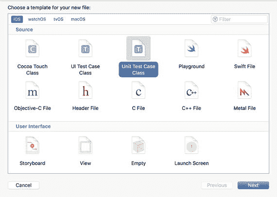

**图 4-4.** Xcode 文件模板对话框

在项目浏览器中选择 `AccountOwnerTests.swift` 文件，并使用文件检查器确保该文件包含在 `BankAccountTests` 目标中，而非 `BankAccount` 目标中（见图 4-5）。如果文件检查器不可见，请使用 **View ➤ Utilities ➤ Show File Inspector** 菜单项。

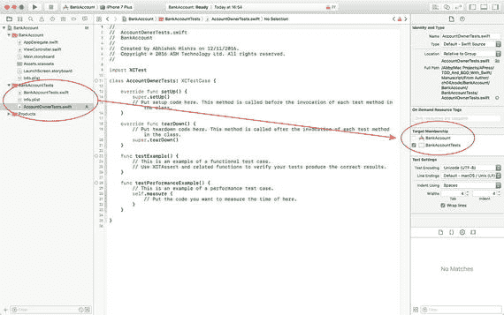

**图 4-5.** `AccountOwnerTests.swift` 的目标成员资格

测试用例文件包含两个空的存根方法，名为 `testExample` 和 `testPerformanceExample`。这些方法旨在帮助你开始编写测试。我们不会在本章中使用这些存根方法，因此可以随意删除它们。

创建一个名为 `testAccountOwner_ValidFirstName_ValidLastName_ValidEmail_CanBeInstantiated()` 的新单元测试方法，并将以下代码添加到方法体中：

```
func testAccountOwner_ValidFirstName_ValidLastName_ValidEmail_CanBeInstantiated() {
    let accountOwner = AccountOwner(firstName: validFirstName,
                                    lastName: validLastName,
                                    emailAddress: validEmailAddress)
    XCTAssertNotNil(accountOwner)
}
```

将以下私有常量声明添加到 `AccountOwnerTests.swift` 文件的顶部：

```
private let validFirstName = "Andrew"
private let validLastName = "Hill"
private let validEmailAddress = "a.hill@abcfinancial.com"
private let invalidFirstName = "A"
private let invalidLastName = "h"
private let invalidEmailAddress = "abcfinancial.com"
private let emptyString = ""
```

这些常量代表一组有效和无效的名字、姓氏及电子邮件地址，将在本类的测试用例中使用。一种良好的实践是将测试用例中使用的所有常量声明在包含测试用例文件的顶部，而不是在测试用例内部创建临时常量。

你会注意到这段代码无法编译；这是因为尚未创建 `AccountOwner` 类。在这种情况下，测试代码编译失败被视为测试失败。

为修复此失败，在项目导航器的 `Model` 组下创建一个名为 `AccountOwner` 的新类，并更新其实现以匹配以下代码片段：

```
import Foundation

class AccountOwner: NSObject {
    init?(firstName:String, lastName:String, emailAddress:String) {
        super.init()
    }
}
```

保存文件并使用 **Product ➤ Test** 菜单项运行所有单元测试。你将看到所有单元测试均已通过（见图 4-6）。

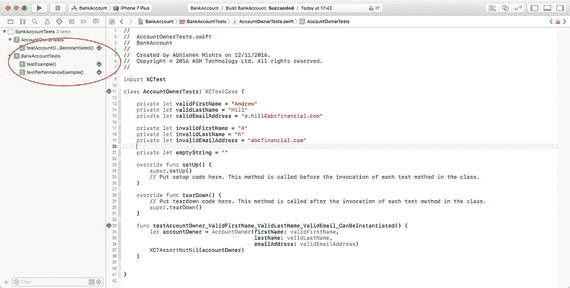

**图 4-6.** Xcode 测试导航器

我们需要为 `AccountOwner` 类再添加一些测试用例。你可以选择一次添加一个功能并编写相应测试，或者先编写几个测试，然后在 `AccountOwner` 类中添加功能使一小部分测试通过，并重复此过程。

将清单 4-1 中的代码添加到 `AccountOwnerTests` 类中，以创建几个额外的测试。

```
func testAccountOwner_InvalidFirstName_ValidLastName_ValidEmail_CanNotBeInstantiated() {
    let accountOwner = AccountOwner(firstName: invalidFirstName,
                                    lastName: validLastName,
                                    emailAddress: validEmailAddress)
    XCTAssertNil(accountOwner)
}
func testAccountOwner_InvalidFirstName_InvalidLastName_ValidEmail_CanNotBeInstantiated() {
    let accountOwner = AccountOwner(firstName: invalidFirstName,
                                    lastName: invalidLastName,
                                    emailAddress: validEmailAddress)
    XCTAssertNil(accountOwner)
}
func testAccountOwner_InvalidFirstName_InvalidLastName_InvalidEmail_CanNotBeInstantiated() {
    let accountOwner = AccountOwner(firstName: invalidFirstName,
                                    lastName: invalidLastName,
                                    emailAddress: invalidEmailAddress)
    XCTAssertNil(accountOwner)
}
func testAccountOwner_ValidFirstName_InvalidLastName_ValidEmail_CanNotBeInstantiated() {
    let accountOwner = AccountOwner(firstName: validFirstName,
                                    lastName: invalidLastName,
                                    emailAddress: validEmailAddress)
    XCTAssertNil(accountOwner)
}
func testAccountOwner_ValidFirstName_ValidLastName_InvalidEmail_CanNotBeInstantiated() {
    let accountOwner = AccountOwner(firstName: validFirstName,
                                    lastName: validLastName,
                                    emailAddress: invalidEmailAddress)
    XCTAssertNil(accountOwner)
}
func testAccountOwner_ValidFirstName_InvalidLastName_InvalidEmail_CanNotBeInstantiated() {
    let accountOwner = AccountOwner(firstName: validFirstName,
                                    lastName: invalidLastName,
                                    emailAddress: invalidEmailAddress)
    XCTAssertNil(accountOwner)
}
func testAccountOwner_EmptyFirstName_ValidLastName_ValidEmail_CanNotBeInstantiated() {
    let accountOwner = AccountOwner(firstName: emptyString,
                                    lastName: validLastName,
                                    emailAddress: validEmailAddress)
    XCTAssertNil(accountOwner)
}
func testAccountOwner_ValidFirstName_EmptyLastName_ValidEmail_CanNotBeInstantiated() {
    let accountOwner = AccountOwner(firstName: validFirstName,
                                    lastName: emptyString,
                                    emailAddress: validEmailAddress)
    XCTAssertNil(accountOwner)
}
func testAccountOwner_ValidFirstName_ValidLastName_EmptyEmail_CanNotBeInstantiated() {
    let accountOwner = AccountOwner(firstName: validFirstName,
                                    lastName: validLastName,
                                    emailAddress: emptyString)
    XCTAssertNil(accountOwner)
}
```

**清单 4-1.** `AccountOwnerTests.swift`

清单 4-1 中的代码添加了九个新的测试用例，每个都与实例化 `AccountOwner` 对象相关。这九个测试用例共同确保如果名字、姓氏或电子邮件地址无效，则无法实例化 `AccountOwner` 对象。

这次你会注意到，添加这九个新的测试用例后没有编译器警告。但是，当你使用 **Product ➤ Test** 菜单项运行所有测试时，会看到所有这些新的测试用例都失败了（见图 4-7）。

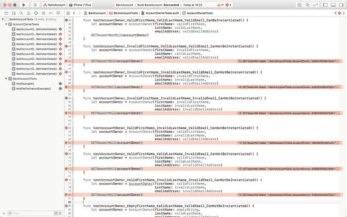

**图 4-7.** 失败的单元测试

修复这些测试需要定义一组规则，用于验证用户名、密码和电子邮件地址。然后，我们将创建封装这些规则的类，并将对这些验证类实例的调用集成到 `AccountOwner` 类的初始化方法中。

接下来，我们将使用 TDD 技术创建以下验证类：

*   名字
*   姓氏
*   电子邮件地址


### 创建名字验证器类

在本章开发的项目中，我们假设以下验证标准将应用于名字：

-   长度应在 2 到 10 个字符之间。
-   不应包含数字。
-   不应包含空白字符。

我们首先为一个名为 `FirstNameValidator` 的类创建一组测试。`FirstNameValidator` 类尚不存在，因此这些测试将无法编译。然而，我们即将编写的测试将确保 `FirstNameValidator` 类通过一个名为 `validate()` 的方法封装上述所有验证标准。

在项目资源管理器的 `BankAccountTests` 组下创建一个新的 iOS 单元测试用例类，命名为 `FirstNameValidatorTests`，并确保 `FirstNameValidatorTests.swift` 文件包含在 `BankAccountTests` 目标中，而不是 `BankAccount` 目标中。

将 `FirstNameValidatorTests.swift` 文件的内容替换为代码清单 4-2。

```
import XCTest
class FirstNameValidatorTests: XCTestCase {
fileprivate let emptyString = ""
fileprivate let singleCharachterName = "a"
fileprivate let twoCharachterName = "ab"
fileprivate let tenCharachterName = "abcdefghij"
fileprivate let elevenCharachterName = "abcdefghijk"
fileprivate let nameWithWhitespace = "abc def"
fileprivate let nameWithDigit0 = "abc00"
fileprivate let nameWithDigit1 = "abc11"
fileprivate let nameWithDigit2 = "abc22"
fileprivate let nameWithDigit3 = "abc33"
fileprivate let nameWithDigit4 = "abc44"
fileprivate let nameWithDigit5 = "abc55"
fileprivate let nameWithDigit6 = "abc66"
fileprivate let nameWithDigit7 = "abc77"
fileprivate let nameWithDigit8 = "abc88"
fileprivate let nameWithDigit9 = "abc99"
override func setUp() {
super.setUp()
// 在此处放置设置代码。该方法在类中每个测试方法调用之前被调用。
}
override func tearDown() {
// 在此处放置拆卸代码。该方法在类中每个测试方法调用之后被调用。
super.tearDown()
}
}
// MARK: 空字符串验证
extension FirstNameValidatorTests {
func testValidate_EmptyString_ReturnsFalse() {
let validator = FirstNameValidator()
XCTAssertFalse(validator.validate(emptyString), "字符串不能为空。")
}
}
// MARK: 字符串长度验证
extension FirstNameValidatorTests {
func testValidate_InputLessThanTwoCharachtersInLength_ReturnsFalse() {
let validator = FirstNameValidator()
XCTAssertFalse(validator.validate(singleCharachterName), "字符串字符数不能少于 2 个。")
}
func testValidate_InputGreaterThanTenCharachtersInLength_ReturnsFalse() {
let validator = FirstNameValidator()
XCTAssertFalse(validator.validate(elevenCharachterName), "字符串字符数不能多于 11 个。")
}
func testValidate_InputTwoCharachtersInLength_ReturnsTrue() {
let validator = FirstNameValidator()
XCTAssertTrue(validator.validate(twoCharachterName), "包含 2 个字符的字符串应该是有效的。")
}
func testValidate_InputTenCharachtersInLength_ReturnsTrue() {
let validator = FirstNameValidator()
XCTAssertTrue(validator.validate(tenCharachterName), "包含 10 个字符的字符串应该是有效的。")
}
}
// MARK: 空白字符验证
extension FirstNameValidatorTests {
func testValidate_InputWithWhitespace_ReturnsFalse() {
let validator = FirstNameValidator()
XCTAssertFalse(validator.validate(nameWithWhitespace), "字符串不能包含空白字符。")
}
}
// MARK: 数字验证
extension FirstNameValidatorTests {
func testValidate_InputWithDigit0_ReturnsFalse() {
let validator = FirstNameValidator()
XCTAssertFalse(validator.validate(nameWithDigit0), "字符串不能包含数字 0。")
}
func testValidate_InputWithDigit1_ReturnsFalse() {
let validator = FirstNameValidator()
XCTAssertFalse(validator.validate(nameWithDigit1), "字符串不能包含数字 1。")
}
func testValidate_InputWithDigit2_ReturnsFalse() {
let validator = FirstNameValidator()
XCTAssertFalse(validator.validate(nameWithDigit2), "字符串不能包含数字 2。")
}
func testValidate_InputWithDigit3_ReturnsFalse() {
let validator = FirstNameValidator()
XCTAssertFalse(validator.validate(nameWithDigit3), "字符串不能包含数字 3。")
}
func testValidate_InputWithDigit4_ReturnsFalse() {
let validator = FirstNameValidator()
XCTAssertFalse(validator.validate(nameWithDigit4), "字符串不能包含数字 4。")
}
func testValidate_InputWithDigit5_ReturnsFalse() {
let validator = FirstNameValidator()
XCTAssertFalse(validator.validate(nameWithDigit5), "字符串不能包含数字 5。")
}
func testValidate_InputWithDigit6_ReturnsFalse() {
let validator = FirstNameValidator()
XCTAssertFalse(validator.validate(nameWithDigit6), "字符串不能包含数字 6。")
}
func testValidate_InputWithDigit7_ReturnsFalse() {
let validator = FirstNameValidator()
XCTAssertFalse(validator.validate(nameWithDigit7), "字符串不能包含数字 7。")
}
func testValidate_InputWithDigit8_ReturnsFalse() {
let validator = FirstNameValidator()
XCTAssertFalse(validator.validate(nameWithDigit8), "字符串不能包含数字 8。")
}
func testValidate_InputWithDigit9_ReturnsFalse() {
let validator = FirstNameValidator()
XCTAssertFalse(validator.validate(nameWithDigit9), "字符串不能包含数字 9。")
}
}
代码清单 4-2.
FirstNameValidatorTests.swift
```

代码清单 4-2 中的测试假定验证器类将实现一个名为 `validate()` 的方法，该方法将返回 true 或 false。当你使用 TDD 技术解决问题时，你的测试将定义为了通过测试而要构建的类的接口。

你可能还注意到已经使用了类扩展来对相似的测试进行分组。这是一种常用的方法，用于在单个类中隔离大量测试。

你将会再次注意到我们刚刚编写的测试无法编译。这是因为 `FirstNameValidator` 类尚未创建。

为了使测试代码能够编译，在项目导航器的 `Model` 组下创建一个名为 `FirstNameValidator` 的新类，并将其实现更新为与代码清单 4-3 一致。

```
import Foundation
class FirstNameValidator: NSObject {
func validate(_ value:String) -> Bool {
if ((value.characters.count  10)) {
return false
}
let whitespace = Set(" ".characters)
if (value.characters.filter {whitespace.contains($0)}).count > 0 {
return false
}
let numbers = Set("0123456789".characters)
if (value.characters.filter {numbers.contains($0)}).count > 0 {
return false
}
guard let regexValidator = try? NSRegularExpression(pattern: "([A-Za-z'])", options: .caseInsensitive) else {
return false
}
if regexValidator.numberOfMatches(in: value,
options: NSRegularExpression.MatchingOptions.reportCompletion,
range: NSMakeRange(0, value.characters.count)) > 0 {
return true
}
return false
}
}
代码清单 4-3.
FirstNameValidator.swift
```

代码清单 4-3 中的这段代码将 `FirstNameValidator` 类声明为 `NSObject` 的子类，并带有一个返回布尔值的 `validate` 方法。保存文件并使用 **Product > Test** 菜单项运行所有单元测试。所有关于 `FirstNameValidator` 的测试应该通过；然而，你仍然应该看到关于 `AccountOwner` 类的测试失败（见图 4-8）。

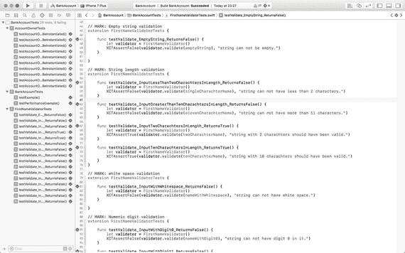

**图 4-8.** 显示通过和失败测试的 Xcode 测试导航器

这些失败的测试目前没有关系，一旦我们构建其他验证器对象并将这些验证器对象与 `AccountOwner` 类集成，它们将会通过。


### 创建姓氏验证器类

姓氏验证器类与上一节创建的名字验证器类非常相似。就本章开发的项目而言，我们假设对姓氏应用以下验证标准：

- 长度应在 2 到 10 个字符之间。
- 不应包含数字。
- 不应包含空格。
- 不应包含任何标点符号或特殊字符，但 `'` 字符（如 O’Hara 中的单引号）除外。此上下文中的特殊字符包括算术符号、下划线、逻辑符号和括号。

在项目浏览器的 `BankAccountTests` 组下创建一个名为 `LastNameValidatorTests` 的新 iOS 单元测试用例类，并确保新文件已包含在测试目标中。

将 `LastNameValidatorTests.swift` 文件的内容替换为列表 4-4。

```
import XCTest
class LastNameValidatorTests: XCTestCase {
fileprivate let emptyString = ""
fileprivate let singleCharachterName = "a"
fileprivate let twoCharachterName = "ab"
fileprivate let tenCharachterName = "abcdefghij"
fileprivate let elevenCharachterName = "abcdefghijk"
fileprivate let nameWithWhitespace = "abc def"
fileprivate let nameWithSingleQuote = "abc'def"
fileprivate let nameWithUnsupportedSpecialCharacters = "_+-.,!@#$%^&*();\\/|\""
fileprivate let nameWithDigit0 = "abc00"
fileprivate let nameWithDigit1 = "abc11"
fileprivate let nameWithDigit2 = "abc22"
fileprivate let nameWithDigit3 = "abc33"
fileprivate let nameWithDigit4 = "abc44"
fileprivate let nameWithDigit5 = "abc55"
fileprivate let nameWithDigit6 = "abc66"
fileprivate let nameWithDigit7 = "abc77"
fileprivate let nameWithDigit8 = "abc88"
fileprivate let nameWithDigit9 = "abc99"
override func setUp() {
super.setUp()
// 在此处放置设置代码。此方法在类中每个测试方法调用之前被调用。
}
override func tearDown() {
// 在此处放置拆卸代码。此方法在类中每个测试方法调用之后被调用。
super.tearDown()
}
}
// MARK: 空字符串验证
extension LastNameValidatorTests {
func testValidate_EmptyString_ReturnsFalse() {
let validator = LastNameValidator()
XCTAssertFalse(validator.validate(emptyString), "字符串不能为空。")
}
}
// MARK: 字符串长度验证
extension LastNameValidatorTests {
func testValidate_InputLessThanTwoCharachtersInLength_ReturnsFalse() {
let validator = LastNameValidator()
XCTAssertFalse(validator.validate(singleCharachterName), "字符串长度不能少于 2 个字符。")
}
func testValidate_InputGreaterThanTenCharachtersInLength_ReturnsFalse() {
let validator = LastNameValidator()
XCTAssertFalse(validator.validate(elevenCharachterName), "字符串长度不能超过 11 个字符。")
}
func testValidate_InputTwoCharachtersInLength_ReturnsTrue() {
let validator = LastNameValidator()
XCTAssertTrue(validator.validate(twoCharachterName), "包含 2 个字符的字符串应该是有效的。")
}
func testValidate_InputTenCharachtersInLength_ReturnsTrue() {
let validator = LastNameValidator()
XCTAssertTrue(validator.validate(tenCharachterName), "包含 10 个字符的字符串应该是有效的。")
}
}
// MARK: 空格验证
extension LastNameValidatorTests {
func testValidate_InputWithWhitespace_ReturnsFalse() {
let validator = LastNameValidator()
XCTAssertFalse(validator.validate(nameWithWhitespace), "字符串不能包含空格。")
}
}
// MARK: 特殊字符验证
extension LastNameValidatorTests {
func testValidate_InputWithSingleQuote_ReturnsTrue() {
let validator = LastNameValidator()
XCTAssertTrue(validator.validate(nameWithSingleQuote), "包含单引号的字符串应该是有效的。")
}
func testValidate_InputWithSpecialCharacters_ReturnsFalse() {
let validator = LastNameValidator()
XCTAssertFalse(validator.validate(nameWithUnsupportedSpecialCharacters), "字符串不能包含特殊字符。")
}
}
// MARK: 数字验证
extension LastNameValidatorTests {
func testValidate_InputWithDigit0_ReturnsFalse() {
let validator = LastNameValidator()
XCTAssertFalse(validator.validate(nameWithDigit0), "字符串中不能包含数字 0。")
}
func testValidate_InputWithDigit1_ReturnsFalse() {
let validator = LastNameValidator()
XCTAssertFalse(validator.validate(nameWithDigit1), "字符串中不能包含数字 1。")
}
func testValidate_InputWithDigit2_ReturnsFalse() {
let validator = LastNameValidator()
XCTAssertFalse(validator.validate(nameWithDigit2), "字符串中不能包含数字 2。")
}
func testValidate_InputWithDigit3_ReturnsFalse() {
let validator = LastNameValidator()
XCTAssertFalse(validator.validate(nameWithDigit3), "字符串中不能包含数字 3。")
}
func testValidate_InputWithDigit4_ReturnsFalse() {
let validator = LastNameValidator()
XCTAssertFalse(validator.validate(nameWithDigit4), "字符串中不能包含数字 4。")
}
func testValidate_InputWithDigit5_ReturnsFalse() {
let validator = LastNameValidator()
XCTAssertFalse(validator.validate(nameWithDigit5), "字符串中不能包含数字 5。")
}
func testValidate_InputWithDigit6_ReturnsFalse() {
let validator = LastNameValidator()
XCTAssertFalse(validator.validate(nameWithDigit6), "字符串中不能包含数字 6。")
}
func testValidate_InputWithDigit7_ReturnsFalse() {
let validator = LastNameValidator()
XCTAssertFalse(validator.validate(nameWithDigit7), "字符串中不能包含数字 7。")
}
func testValidate_InputWithDigit8_ReturnsFalse() {
let validator = LastNameValidator()
XCTAssertFalse(validator.validate(nameWithDigit8), "字符串中不能包含数字 8。")
}
func testValidate_InputWithDigit9_ReturnsFalse() {
let validator = LastNameValidator()
XCTAssertFalse(validator.validate(nameWithDigit9), "字符串中不能包含数字 9。")
}
}
列表 4-4.
LastNameValidatorTests.swift
```


值得注意的是，清单 4-4 中的代码使用一个测试用例来处理所有特殊字符：

```
func testValidate_InputWithSpecialCharacters_ReturnsFalse() {
    let validator = LastNameValidator()
    XCTAssertFalse(validator.validate(nameWithUnsupportedSpecialCharacters), "string can not have special characters.")
}
```

如果愿意，你还可以为每个特殊字符分别创建一个测试用例。如果你将测试用例用作`LastNameValidator`类的文档，那么为每个特殊字符分别创建测试用例会生成更明确的文档，代价是测试用例数量会增加。

这些新的测试用例无法编译，因为`LastNameValidator`类尚未创建。在项目导航器的`Model`组下创建一个名为`LastNameValidator`的新类，并按照清单 4-5 更新其实现。

```
import Foundation
class LastNameValidator: NSObject {
    func validate(_ value:String) -> Bool {
        if ((value.characters.count < 2) || (value.characters.count > 10)) {
            return false
        }
        let whitespace = Set(" ".characters)
        if (value.characters.filter {whitespace.contains($0)}).count > 0 {
            return false
        }
        let numbers = Set("0123456789".characters)
        if (value.characters.filter {numbers.contains($0)}).count > 0 {
            return false
        }
        let specialCharacters = Set("_+-.,!@#$%^&*();\\/|\"".characters)
        if (value.characters.filter {specialCharacters.contains($0)}).count > 0 {
            return false
        }
        guard let regexValidator = try? NSRegularExpression(pattern: "([A-Za-z'])", options: .caseInsensitive) else {
            return false
        }
        if regexValidator.numberOfMatches(in: value,
                                        options: NSRegularExpression.MatchingOptions.reportCompletion,
                                        range: NSMakeRange(0, value.characters.count)) > 0 {
            return true
        }
        return false
    }
}
```

*清单 4-5.* `LastNameValidator.swift`

清单 4-5 中的代码将`LastNameValidator`类声明为`NSObject`的子类，其中包含一个名为`validate`并返回`Boolean`的类方法。保存文件，然后使用**Product ➤ Test**菜单项运行所有单元测试。所有与`LastNameValidator`相关的测试都应通过（参见图 4-9）。

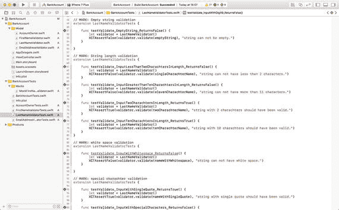

*图 4-9.* `LastNameValidator.swift`中的所有测试均已通过

### 创建电子邮件地址验证器类

在项目浏览器的`BankAccountTests`组下，创建一个名为`EmailAddressValidatorTests`的新 iOS 单元测试用例类，并确保新文件包含在测试目标中。

将`EmailAddressValidatorTests.swift`文件的内容替换为清单 4-6 所示内容。

```
import XCTest
class EmailAddressValidatorTests: XCTestCase {
    fileprivate let emptyString = ""
    fileprivate let validEmailAddress1 = "a@b.com"
    fileprivate let validEmailAddress2 = "a@b.co.uk"
    fileprivate let validEmailAddress3 = "a@b.io"
    fileprivate let validEmailAddress4 = "andrew.shaw@byteowl.io"
    fileprivate let invalidEmailAddress1 = "ab.com"
    fileprivate let invalidEmailAddress2 = "abcom"
    fileprivate let invalidEmailAddress3 = "a@b@com"
    override func setUp() {
        super.setUp()
        // 在此处放置设置代码。该方法在类中每个测试方法调用之前被调用。
    }
    override func tearDown() {
        // 在此处放置拆解代码。该方法在类中每个测试方法调用之后被调用。
        super.tearDown()
    }
}

// MARK: 空字符串验证
extension EmailAddressValidatorTests {
    func testValidate_EmptyString_ReturnsFalse() {
        let validator = EmailAddressValidator()
        XCTAssertFalse(validator.validate(emptyString), "string can not be empty.")
    }
}

// MARK: 无效邮箱地址
extension EmailAddressValidatorTests {
    func testValidate_InvalidEmailAddress1_ReturnsFalse() {
        let validator = EmailAddressValidator()
        XCTAssertFalse(validator.validate(invalidEmailAddress1), "\(invalidEmailAddress1) is not a valid e-mail address.")
    }
    func testValidate_InvalidEmailAddress2_ReturnsFalse() {
        let validator = EmailAddressValidator()
        XCTAssertFalse(validator.validate(invalidEmailAddress2), "\(invalidEmailAddress2) is not a valid e-mail address.")
    }
    func testValidate_InvalidEmailAddress3_ReturnsFalse() {
        let validator = EmailAddressValidator()
        XCTAssertFalse(validator.validate(invalidEmailAddress3), "\(invalidEmailAddress3) is not a valid e-mail address.")
    }
}

// MARK: 有效邮箱地址
extension EmailAddressValidatorTests {
    func testValidate_ValidEmailAddress1_ReturnsTrue() {
        let validator = EmailAddressValidator()
        XCTAssertTrue(validator.validate(validEmailAddress1), "\(validEmailAddress1) is a valid e-mail address.")
    }
    func testValidate_ValidEmailAddress2_ReturnsTrue() {
        let validator = EmailAddressValidator()
        XCTAssertTrue(validator.validate(validEmailAddress2), "\(validEmailAddress2) is a valid e-mail address.")
    }
    func testValidate_ValidEmailAddress3_ReturnsTrue() {
        let validator = EmailAddressValidator()
        XCTAssertTrue(validator.validate(validEmailAddress3), "\(validEmailAddress3) is a valid e-mail address.")
    }
    func testValidate_ValidEmailAddress4_ReturnsTrue() {
        let validator = EmailAddressValidator()
        XCTAssertTrue(validator.validate(validEmailAddress4), "\(validEmailAddress4) is a valid e-mail address.")
    }
}
```

*清单 4-6.* `EmailAddressValidatorTests.swift`

这些新的测试用例无法编译，因为`EmailAddressValidator`类尚未创建。在项目导航器的`Model`组下创建一个名为`EmailAddressValidator`的新类，并按照清单 4-7 更新其实现。

```
import Foundation
class EmailAddressValidator: NSObject {
    func validate(_ value:String) -> Bool {
        if (value.characters.count < 5) || (value.characters.count > 100) {
            return false
        }
        let whitespace = Set(" ".characters)
        if (value.characters.filter {whitespace.contains($0)}).count > 0 {
            return false
        }
        let numbers = Set("0123456789".characters)
        if (value.characters.filter {numbers.contains($0)}).count > 0 {
            return false
        }
        let specialCharacters = Set("+,!#$%^&*();\\/|\"".characters)
        if (value.characters.filter {specialCharacters.contains($0)}).count > 0 {
            return false
        }
        guard let regexValidator = try? NSRegularExpression(pattern: "([A-Z0-9._%+-]+@[A-Z0-9.-]+\\.[A-Z]{2,4})", options: .caseInsensitive) else {
            return false
        }
        if regexValidator.numberOfMatches(in: value,
                                        options: NSRegularExpression.MatchingOptions.reportCompletion,
                                        range: NSMakeRange(0, value.characters.count)) > 0 {
            return true
        }
        return false
    }
}
```

*清单 4-7.* `EmailAddressValidator.swift`

这段代码将`EmailAddressValidator`类声明为`NSObject`的子类，其中包含一个名为`validate`并返回`Boolean`的类方法。保存文件，然后使用**Product ➤ Test**菜单项运行所有单元测试。

`FirstNameValidator`、`LastNameValidator`和`EmailAddressValidator`类的所有测试用例现在都应通过。在下一节中，你将把这些组件集成到`AccountOwner`类中。


### 将验证器类集成到 AccountOwner 类中

`AccountOwner` 类有一个可失败的初始化器，它接受三个参数：名、姓和电子邮件地址。如果三个参数中有任何一个无效，该初始化器应返回 `nil`。

```
init?(firstName:String, lastName:String, emailAddress:String) {
    super.init()
}
```

我们已经构建了用于验证名、姓和电子邮件地址的类。现在需要将这些类集成到 `AccountOwner` 的初始化器中。将这些验证器类集成到 `AccountOwner` 的 `init?` 方法中意味着三件事：

1. 需要将用于名、姓和电子邮件地址的验证器对象注入到 `AccountOwner` 类中。
2. 当调用 `AccountOwner` 的 `init?` 方法时，将调用各个验证器对象的 `validate` 方法。
3. 将使用传入 `AccountOwner` 的 `init?` 方法的正确值来调用验证器对象的 `validate` 方法。

我们可以使用多种技术将依赖项注入到类中，这些技术已在第 2 章中介绍过。在本例中，我将把验证器类作为参数注入到 `AccountOwner` 的初始化器中。

修改 `AccountOwner.swift` 中的 `init?` 方法，使其与以下代码片段一致：

```
init?(firstName:String, lastName:String, emailAddress:String,
      firstNameValidator:FirstNameValidator?=nil,
      lastNameValidator:LastNameValidator? = nil,
      emailAddressValidator:EmailAddressValidator? = nil) {
    super.init()
}
```

我在初始化器中添加了三个可选参数，每个参数的默认值都是 `nil`。我这样做的原因是，当从测试用例调用时，可以将模拟对象注入到初始化器中，而在其他情况下则使用真实对象。

您需要确保这次小幅重构不会破坏之前通过的测试。保存文件，然后使用 **Product ➤ Test** 菜单项运行所有单元测试。您将观察到，这次重构不会导致任何新的测试失败。

现在我们已经有了将验证器注入到 `AccountOwner` 中的方法，让我们注入一个模拟的名验证器对象，并编写一个测试，以确保在实例化 `AccountOwner` 对象时，会调用模拟对象上的 `validate` 方法。

将以下测试用例添加到 `AccountOwnerTest.swift` 文件中：

```
func testAccountOwner_ValidFirstName_ValidLastName_ValidEmailAddress_ValidFirstNameValidator_CallsValidateOnValidator() {
    let expectation = self.expectation(description: "Expected validate to be called on validator.")
    let mockFirstNameValidator = MockFirstNameValidator(expectation, expectedValue:validFirstName)
    let _ = AccountOwner(firstName: validFirstName,
                         lastName: validLastName,
                         emailAddress: validEmailAddress,
                         firstNameValidator:mockFirstNameValidator)
    self.waitForExpectations(timeout: 1.0, handler: nil)
}
```

该测试用例首先创建了一个 `XCTestExpectation` 实例：

```
let expectation = self.expectation(description: "Expected validate to be called on validator.")
```

然后，测试用例实例化了一个模拟的名验证器对象。这个模拟验证器是一个名为 `MockFirstNameValidator` 的类的实例（该类稍后将构建）。

```
let mockFirstNameValidator = MockFirstNameValidator(expectation, expectedValue:validFirstName)
```

回想一下，之前创建的验证器对象都有一个 `validate` 方法：

```
class func validate(_ value:String) -> Bool
```

模拟验证器被赋予了对期望对象的引用，以及我们期望由 `AccountOwner` 的 `init?` 方法注入到 `validate` 方法中的字符串。当使用期望值调用其 `validate` 方法时，模拟验证器对象将满足期望。

然后，测试用例使用有效的名、姓、电子邮件地址和名验证器实例化了一个 `AccountOwner`。

```
let _ = AccountOwner(firstName: validFirstName,
                     lastName: validLastName,
                     emailAddress: validEmailAddress,
                     firstNameValidator:mockFirstNameValidator)
```

最后，测试用例会等待最多一秒钟，直到测试期望被满足。

```
self.waitForExpectations(timeout: 1.0, handler: nil)
```

在项目资源管理器中，在 `BankAccountTests` 组下创建一个名为 `Mocks` 的新组。在项目导航器中，在 `Mocks` 组下创建一个名为 `MockFirstNameValidator` 的新类（参见图 4-10）。这个新类不需要成为 `BankAccount` 目标的成员，因为它只用于单元测试目标。

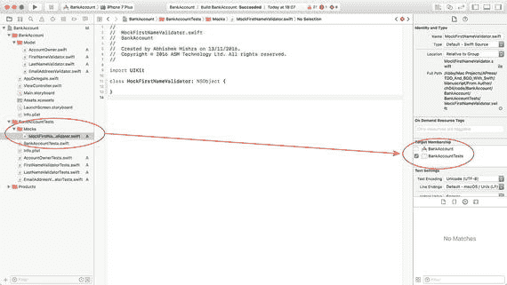

**图 4-10. MockFirstNameValidator.swift 目标成员资格**

更新 `MockFirstNameValidator` 类的实现，使其与清单 4-8 一致。

```
import Foundation
import XCTest
class MockFirstNameValidator: FirstNameValidator {
    private var expectation:XCTestExpectation?
    private var expectedValue:String?

    init(_ expectation:XCTestExpectation, expectedValue:String) {
        self.expectation = expectation
        self.expectedValue = expectedValue
        super.init()
    }

    override func validate(_ value:String) -> Bool {
        if let expectation = self.expectation,
           let expectedValue = self.expectedValue {
            if value.compare(expectedValue) == .orderedSame {
                expectation.fulfill()
            }
        }
        return super.validate(value)
    }
}
清单 4-8.
MockFirstNameValidator.swift
```

保存文件，然后使用 **Product ➤ Test** 菜单项运行所有单元测试。您的新测试用例应该能够编译，但不会通过。这是因为验证器尚未集成到 `AccountOwner` 对象的 `init?` 方法中。

修改 `AccountOwner` 类的 `init?` 方法的实现，使其与以下代码一致：

```
init?(firstName:String, lastName:String, emailAddress:String,
      firstNameValidator:FirstNameValidator? = nil,
      lastNameValidator:LastNameValidator? = nil,
      emailAddressValidator:EmailAddressValidator? = nil) {
    let validator1 = firstNameValidator ?? FirstNameValidator()
    if validator1.validate(firstName) == false {
        return nil
    }
    super.init()
}
```

保存文件，然后使用 **Product ➤ Test** 菜单项运行所有单元测试。您的新测试用例现在将通过（参见图 4-11）。

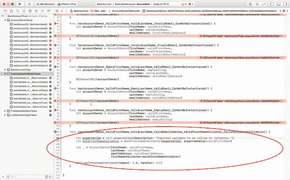

**图 4-11. 显示通过和失败测试的 Xcode 测试导航器**

您刚刚完成的这个新测试用例验证了名验证器对象与 `AccountOwner` 对象的正确集成。

现在，让我们再创建几个额外的测试用例，以验证姓和电子邮件地址验证器对象与 `AccountOwner` 对象的集成。将以下两个额外的测试用例添加到 `AccountOwnerTests.swift` 文件中：

```
func testAccountOwner_ValidFirstName_ValidLastName_ValidEmailAddress_ValidLastNameValidator_CallsValidateOnValidator() {
    let expectation = self.expectation(description: "Expected validate to be called on validator.")
    let mockLastNameValidator = MockLastNameValidator(expectation, expectedValue:validLastName)
    let _ = AccountOwner(firstName: validFirstName,
                         lastName: validLastName,
                         emailAddress: validEmailAddress,
                         firstNameValidator:nil,
                         lastNameValidator:mockLastNameValidator)
    self.waitForExpectations(timeout: 1.0, handler: nil)
}

func testAccountOwner_ValidFirstName_ValidLastName_ValidEmailAddress_ValidEmailAddressValidator_CallsValidateOnValidator() {
    let expectation = self.expectation(description: "Expected validate to be called on validator.")
    let mockEmailAddressValidator = MockEmailAddressValidator(expectation, expectedValue:validEmailAddress)
    let _ = AccountOwner(firstName: validFirstName,
                         lastName: validLastName,
                         emailAddress: validEmailAddress,
                         firstNameValidator:nil,
                         lastNameValidator:nil,
                         emailAddressValidator:mockEmailAddressValidator)
    self.waitForExpectations(timeout: 1.0, handler: nil)
}
```


在项目导航器的 `Mocks` 组下创建一个名为 `MockLastNameValidator` 的新类，并将其实现更新为与代码清单 4-9 一致。

```
import Foundation
import XCTest
class MockLastNameValidator: LastNameValidator {
private var expectation:XCTestExpectation?
private var expectedValue:String?
init(_ expectation:XCTestExpectation, expectedValue:String) {
self.expectation = expectation
self.expectedValue = expectedValue
super.init()
}
override func validate(_ value:String) -> Bool {
if let expectation = self.expectation,
let expectedValue = self.expectedValue {
if value.compare(expectedValue) == .orderedSame {
expectation.fulfill()
}
}
return super.validate(value)
}
}
代码清单 4-9.
MockLastNameValidator.swift
```

在项目导航器的 `Mocks` 组下创建一个名为 `MockEmailAddressValidator` 的新类，并将其实现更新为与代码清单 4-10 一致。

```
import Foundation
import XCTest
class MockEmailAddressValidator: EmailAddressValidator {
private var expectation:XCTestExpectation?
private var expectedValue:String?
init(_ expectation:XCTestExpectation, expectedValue:String) {
self.expectation = expectation
self.expectedValue = expectedValue
super.init()
}
override func validate(_ value:String) -> Bool {
if let expectation = self.expectation,
let expectedValue = self.expectedValue {
if value.compare(expectedValue) == .orderedSame {
expectation.fulfill()
}
}
return super.validate(value)
}
}
代码清单 4-10.
MockEmailAddressValidator.swift
```

修改 `AccountOwner` 类的 `init?` 方法的实现，以匹配以下代码：

```
import Foundation
class AccountOwner: NSObject {
var firstName:String?
var lastName:String?
var emailAddress:String?
init?(firstName:String, lastName:String, emailAddress:String,
firstNameValidator:FirstNameValidator? = nil,
lastNameValidator:LastNameValidator? = nil,
emailAddressValidator:EmailAddressValidator? = nil) {
let validator1 = firstNameValidator ?? FirstNameValidator()
if validator1.validate(firstName) == false {
return nil
}
let validator2 = lastNameValidator ?? LastNameValidator()
if validator2.validate(lastName) == false {
return nil
}
let validator3 = emailAddressValidator ?? EmailAddressValidator()
if validator3.validate(emailAddress) == false {
return nil
}
super.init()
}
}
```

保存文件，然后使用 **Product ➤ Test** 菜单项运行所有单元测试。你会注意到，到目前为止编写的所有测试现在都通过了，包括 `AccountOwner` 测试中此前一直失败的那一个（见图 4-12）。

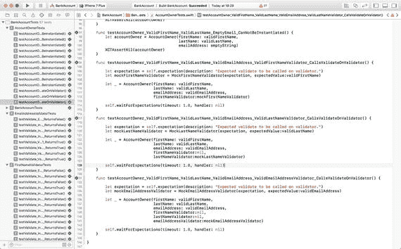

图 4-12. 显示测试通过的 Xcode 测试导航器

`AccountOwner` 类已基本就绪，但还缺少一个小功能：初始化器中提供的名字、姓氏和电子邮件地址值，如果有效，应复制到实例变量中。

在 `AccountOwnerTests.swift` 文件中添加以下三个额外的测试用例：

```
func testAccountOwner_ValidFirstName_ValidLastName_ValidEmailAddress_CopiesFirstNameToIVAR() {
let accountOwner = AccountOwner(firstName: validFirstName,
lastName: validLastName,
emailAddress: validEmailAddress)
let isEqual = accountOwner!.firstName.compare(validFirstName) == .orderedSame
XCTAssertTrue(isEqual)
}
func testAccountOwner_ValidFirstName_ValidLastName_ValidEmailAddress_CopiesLastNameToIVAR() {
let accountOwner = AccountOwner(firstName: validFirstName,
lastName: validLastName,
emailAddress: validEmailAddress)
let isEqual = accountOwner!.lastName.compare(validLastName) == .orderedSame
XCTAssertTrue(isEqual)
}
func testAccountOwner_ValidFirstName_ValidLastName_ValidEmailAddress_CopiesEmailAddressToIVAR() {
let accountOwner = AccountOwner(firstName: validFirstName,
lastName: validLastName,
emailAddress: validEmailAddress)
let isEqual = accountOwner!.emailAddress.compare(validEmailAddress) == .orderedSame
XCTAssertTrue(isEqual)
}
```

在 `AccountOwner` 类中声明以下变量：

```
var firstName:String
var lastName:String
var emailAddress:String
```

在 `AccountOwner` 类的 `init?` 方法实现中添加以下几行代码：

```
self.firstName = firstName
self.lastName = lastName
self.emailAddress = emailAddress
```

保存文件，然后使用 **Product ➤ Test** 菜单项运行所有单元测试。你会注意到所有测试都通过了。至此，`AccountOwner` 类的开发完成。下一节，我们将使用 TDD 技术来开发 `Transaction` 类。

### Transaction 类

一个 `Transaction` 对象代表一笔进入或离开银行账户的金额。表 4-2 列出了 `Transaction` 类所需的成员变量和方法：

表 4-2. Transaction 类的变量和方法

| 项目 | 类型 | 描述 |
| --- | --- | --- |
| `var txDescription:String` | 变量 | 包含交易的文本描述。长度最多为 20 个字符，不能为空。 |
| `var date:NSDate` | 变量 | 表示一个有效的日期。 |
| `var isIncoming:Bool` | 变量 | 如果交易代表着存入账户的金额，则该值为 `true`。 |
| `var amount:String` | 变量 | 表示交易金额。只能包含数字和句点（`.`）字符。 |
| `init?(description:String, date:NSDate, isIncoming:Bool, amount:String)` | 方法 | 允许其他代码创建 `Transaction` 实例。 |

开发 `Transaction` 类的方法将与开发 `AccountOwner` 类非常相似。你需要创建测试来验证初始化器以及任何验证器对象的行为。在这种特定情况下，需要为交易描述和金额创建验证器对象。无需验证 `isIncoming` 属性。你也许希望添加一些关于日期范围的验证逻辑。

完整的 `Transaction` 类在代码清单 4-11 中提供。如果你想查看测试代码和验证器对象，可以使用以下 URL 从 GitHub 匿名下载完成的项目：

[`https://github.com/asmtechnology/Lesson04.iOSTesting.2017.Apress.git`](https://github.com/asmtechnology/Lesson04.iOSTesting.2017.Apress.git)

```
import Foundation
class Transaction: NSObject {
var txDescription:String
var date:NSDate
var isIncoming:Bool
var amount:String
init?(txDescription:String, date:NSDate, isIncoming:Bool, amount:String,
descriptionValidator:TransactionDescriptionValidator? = nil,
amountValidator:AmountValidator? = nil) {
let validator1 = descriptionValidator ?? TransactionDescriptionValidator()
if validator1.validate(txDescription) == false {
return nil
}
let validator2 = amountValidator ?? AmountValidator()
if validator2.validate(amount) == false {
return nil
}
self.txDescription = txDescription
self.date = date
self.isIncoming = isIncoming
self.amount = amount
}
}
代码清单 4-11.
Transaction.swift
```


好的，作为高级文档工程师和翻译员，我将遵照注意事项和示例，为您翻译以下文本。


### BankAccount 类

在我们的应用中，一个 `BankAccount` 对象代表一个活期或储蓄银行账户。表 4-3 列出了 `BankAccount` 类所需的成员变量和方法。

**表 4-3.** 交易变量和方法

| 项目 | 类型 | 描述 |
| --- | --- | --- |
| `var accountName:String` | 变量 | 包含账户的文本描述。长度最多为 20 个字符，不能为空。允许使用特殊字符。 |
| `var accountNumber:String` | 变量 | 包含数字账户号码，必须是一个 9 位数字，不允许有空格或特殊字符。 |
| `var sortingCode:String` | 变量 | 包含一个标识分行/支行的六位数字。不允许有空格或特殊字符。必须以 40 或 49 开头。 |
| `var accountType:AccountType` | 变量 | 一个枚举值，表示账户类型。可以是 `currentAccount` 或 `savingsAccount`。 |
| `var transactions:[Transaction]` | 变量 | 交易数组。 |
| `var owners:[AccountOwner]` | 变量 | 账户持有人数组。一个银行账户必须至少有一个持有人，最多可以有 2 个账户持有人。 |
| `init?(accountName:String, accountNumber:String, sortingCode:String, accountType:AccountType, owners:[AccountOwner])` | 方法 | 允许其他代码创建 `BankAccount` 实例。 |

开发 `BankAccount` 类的方法将与开发 `AccountOwner` 类非常相似。您需要创建测试来验证初始化器和任何验证器对象的行为。在此特定情况下，需要为 `accountName`、`accountNumber` 和 `sortingCode` 属性提供验证器对象。

完整的 `BankAccount` 类在代码清单 4-12 中提供。如果您想检查测试和验证器对象的代码，请使用以下 URL 从 github 匿名下载完成的项目：

[`https://github.com/asmtechnology/Lesson04.iOSTesting.2017.Apress.git`](https://github.com/asmtechnology/Lesson04.iOSTesting.2017.Apress.git)

```
import Foundation
enum AccountType {
case currentAccount
case savingsAccount
}
class BankAccount: NSObject {
var accountName:String
var accountNumber:String
var sortingCode:String
var accountType:AccountType
var transactions:[Transaction]
var owners:[AccountOwner]
init?(accountName:String,
accountNumber:String,
sortingCode:String,
accountType:AccountType,
owners:[AccountOwner],
accountNameValidator:AccountNameValidator? = nil,
accountNumberValidator:AccountNumberValidator? = nil,
sortingCodeValidator:SortingCodeValidator? = nil) {
let validator1 = accountNameValidator ?? AccountNameValidator()
if validator1.validate(accountName) == false {
return nil
}
let validator2 = accountNumberValidator ?? AccountNumberValidator()
if validator2.validate(accountNumber) == false {
return nil
}
let validator3 = sortingCodeValidator ?? SortingCodeValidator()
if validator3.validate(sortingCode) == false {
return nil
}
if owners.count == 0 {
return nil
}
self.accountName = accountName
self.accountNumber = accountNumber
self.sortingCode = sortingCode
self.accountType = accountType
self.owners = owners
self.transactions = [Transaction]()
}
}
```

**代码清单 4-12.** `BankAccount.swift`

## 测试 Core Data

本章到目前为止构建的模型对象都有一个共同点——它们都是 `NSObject` 的子类。这在许多 iOS 应用程序中非常常见；然而，越来越多的应用程序使用像 Core Data 这样的对象持久化框架来表示和持久化模型数据。

对 Core Data 的详细讨论超出了本书的范围。测试模型层可能是那些在模型层中使用 Core Data 的开发者面临的最大障碍之一。

Core Data 旨在将您的模型对象及其关系持久化到数据库中。为了实现其目标，Core Data 引入了大量类，例如 `NSManagedObject`、`NSManagedObjectContext`、`NSManagedObjectModel`、`NSPersistentStoreCoordintor`，并且要求您让 Core Data 管理模型对象的生命周期。

由于 Core Data 管理模型对象的生命周期，您不能简单地使用指定或便捷初始化器来实例化模型对象；相反，您需要请求一个托管对象上下文来实例化该对象。

虽然托管对象上下文本身可以通过指定初始化器方便地实例化，但此初始化器的参数之一是一个持久化存储协调器，它要求您提供 SQLite 数据库文件的路径。

在应用程序代码中实例化持久化存储协调器是非常常见的做法；但是，要在单元测试用例中实例化它，您需要在测试目标中包含一个数据库。严格来说，不鼓励在测试目标中包含数据库，因为从数据库读取和写入的测试很容易在测试用例之间创建依赖关系。

很容易想象一个测试用例将一些数据写入数据库，而另一个测试用例读取其中的一些数据。这种类型的行为会在测试之间创建紧密耦合，测试的确切执行顺序变得重要，并且测试不再独立。当这种类型的行为无意中发生时，情况就更糟了。

幸运的是，Core Data 有一个经常被忽略的功能，称为内存存储，它可以在测试中使用，而无需在测试目标中包含 SQLite 文件。内存存储是一个基于 RAM 的数据库，通常用于实现缓存策略。内存存储的一个关键特性是它们可以在几乎没有性能开销的情况下被销毁并重新创建到初始状态。

以下代码片段展示了如何创建一个使用内存持久化存储协调器的托管对象上下文：

```
func inMemoryManagedObjectContext() -> NSManagedObjectContext? {
guard let managedObjectModel = NSManagedObjectModel.mergedModel(from:[Bundle.main]) else {
return nil
}
let persistentStoreCoordinator = NSPersistentStoreCoordinator(managedObjectModel: managedObjectModel)
do {
try persistentStoreCoordinator.addPersistentStore(ofType: NSInMemoryStoreType,
configurationName: nil,
at: nil,
options: nil)
} catch {
print("Failed to create in-memory persistent store.")
return nil
}
let managedObjectContext = NSManagedObjectContext(concurrencyType:.mainQueueConcurrencyType)
managedObjectContext.persistentStoreCoordinator = persistentStoreCoordinator
return managedObjectContext
}
```

您可以在测试用例的 setup 方法中使用此方法来创建一个由内存存储支持的托管对象上下文。然后，您可以在测试中使用此托管对象上下文来实例化 Core Data 对象。

## 总结

在本章中，您使用测试驱动技术创建了一个应用程序的模型层。对于模型层的每个组件，您首先创建了一组测试用例，然后构建相应的模型层类以确保测试用例通过。

您还学习了创建验证器对象来验证模型层对象的内容，以及如何将这些验证器对象作为依赖项注入到模型层对象中。

最后，您学习了在 Swift 中创建模拟对象，并使用模拟对象来验证模型层对象与注入的验证器对象之间的集成。


