# 5. 将 TDD 应用于视图控制器

本章将探讨如何使用 TDD 技术，基于单视图控制器项目模板构建一个 iOS 应用。该应用将包含两个视图控制器，分别提供注册和登录屏幕功能。应用将采用 MVVM 应用架构进行构建。

图 5-1 展示了最终应用的用户界面。

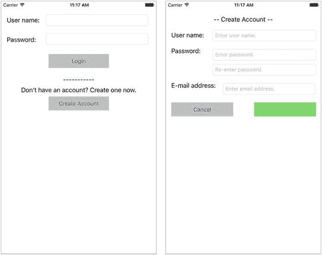

**图 5-1.** 最终应用的用户界面

该应用的完整源代码可通过以下 URL 从 GitHub 匿名下载：

[`https://github.com/asmtechnology/Lesson05.iOSTesting.2017.Apress.git`](https://github.com/asmtechnology/Lesson05.iOSTesting.2017.Apress.git)

## 应用架构

该应用的架构由四个不同的层级组成（见图 5-2）。

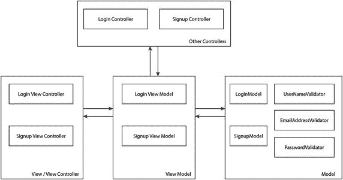

**图 5-2.** LoginForm 应用架构

以下是各层级及其组件类的简要说明：

- **模型层（Model Layer）：** 包含 `LoginModel` 和 `SignupModel` 类，其实例分别用于存储用户在登录和注册屏幕上输入的数据。此层还包含三个用于处理字段验证的类——`UserNameValidator`、`PasswordValidator` 和 `EmailAddressValidator`。
- **视图模型层（View Model Layer）：** 包含 `LoginViewModel` 和 `SignupViewModel` 类。
- **视图/视图控制器层（View/View Controller Layer）：** 包含 `LoginViewController` 和 `SignupViewController` 类。这些类为应用提供用户界面。
- **其他控制器层（Other Controllers Layer）：** 包含执行实际登录和注册过程的 `LoginController` 和 `SignupController` 类。在本项目中，这些类是桩实现。在现实场景中，你将在这些类中编写代码，连接到后端 Web 服务，并执行登录/注册所需的必要步骤。

## 创建 Xcode 项目

让我们从创建一个新的 Xcode 项目开始。启动 Xcode，并基于“单视图应用”模板创建一个新的 iOS 项目（见图 5-3）。

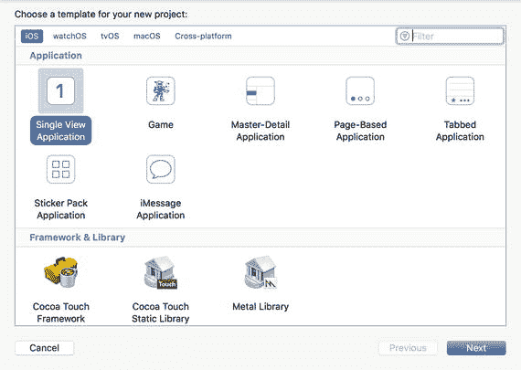

**图 5-3.** Xcode 项目模板对话框

创建新项目时，请使用以下选项（见图 5-4）：

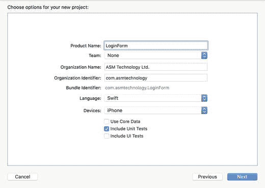

**图 5-4.** Xcode 项目选项对话框

- **产品名称（Product Name）：** `LoginForm`
- **团队（Team）：** 无
- **组织名称（Organization Name）：** 提供一个合适的名称
- **组织标识符（Organization Identifier）：** 提供一个合适的标识符
- **语言（Language）：** `Swift`
- **设备（Devices）：** `iPhone`
- **使用 Core Data（Use Core Data）：** 未勾选
- **包含单元测试（Include Unit Tests）：** 已勾选
- **包含 UI 测试（Include UI Tests）：** 未勾选

> **注意**
> 本章创建的项目不包含用户界面（UI）测试。如果你愿意，可以稍后向项目添加 UI 测试。第 13 章介绍了用户界面测试的主题。

将项目保存到计算机上的合适位置，然后点击“创建”。由于该项目将包含多个新类，因此最好将类文件放置在项目导航器中适当的组下。

在 Xcode 项目导航器中，于 `LoginForm` 文件夹下创建以下组：

- `View`
- `Model`
- `ViewModel`
- `Protocols`

## 构建用户界面层

此应用的用户界面由两个故事板场景以及它们之间的一个转场构成（见图 5-5）。

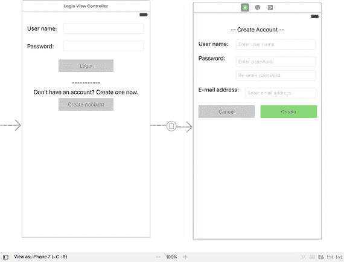

**图 5-5.** 应用故事板

你创建的新项目中有一个默认的视图控制器，我们不会使用它。从项目导航器中删除 `ViewController.swift` 文件，然后在 `View` 组下创建两个新的 `UIViewController` 子类，分别命名为：

- `LoginViewController`
- `SignupViewController`

项目导航器应类似于图 5-6。

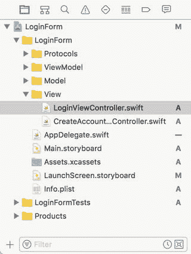

**图 5-6.** LoginForm 项目导航器


好的，作为高级文档工程师和翻译员，我将严格遵循您提供的注意事项和示例，将以下英文文本翻译成中文。


### 构建登录视图控制器场景

打开 `Main.storyboard` 文件，点击故事板中的默认场景。使用身份检查器将默认场景关联的类更改为 `LoginViewController`（参见图 5-7）。

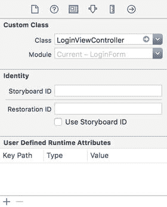

图 5-7. 在身份检查器中设置自定义视图控制器类

将两个文本字段、两个按钮和四个标签添加到默认故事板场景中，并按图 5-8 所示排列它们。为这些元素创建适当的约束，以在不同屏幕尺寸下保持此布局。

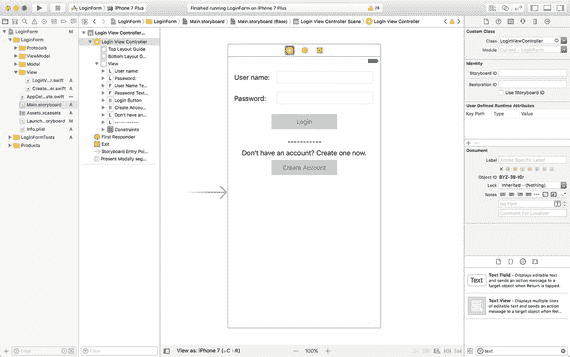

图 5-8. 登录视图控制器场景上的 UI 组件

使用故事板，将 `LoginViewController` 类设置为两个文本字段的委托。表 5-1 列出了需要在 `LoginViewController` 类中创建的 Outlet 和动作方法，以及它们关联的用户界面元素。

表 5-1. 登录视图控制器的 Outlet 和动作

| 名称 | 类型 | 描述 |
| --- | --- | --- |
| `@IBOutlet weak var userNameTextField: UITextField!` | IB Outlet | 将此 Outlet 连接到故事板场景的用户名文本字段。 |
| `@IBOutlet weak var passwordTextField: UITextField!` | IB Outlet | 将此 Outlet 连接到故事板场景的密码文本字段。 |
| `@IBOutlet weak var loginButton: UIButton!` | IB Outlet | 将此 Outlet 连接到故事板场景的登录按钮。 |
| `@IBOutlet weak var createAccountButton: UIButton!` | IB Outlet | 将此 Outlet 连接到故事板场景的创建账户按钮。 |
| `@IBAction func login(_ sender: Any)` | IB Action | 将此方法连接到登录按钮的 Touch Up Inside 事件。 |
| `@IBAction func createAccount(_ sender: Any)` | IB Action | 将此方法连接到创建账户按钮的 Touch Up Inside 事件。 |
| `@IBAction func userNameDidEndOnExit(_ sender: Any)` | IB Action | 将此方法连接到用户名文本字段的 Did End On Exit 事件。 |
| `@IBAction func passwordDidEndOnExit(_ sender: Any)` | IB Action | 将此方法连接到密码文本字段的 Did End On Exit 事件。 |

通过将以下代码添加到 `LoginViewController.swift` 文件的末尾，在 `LoginViewController` 的一个单独的类扩展中实现 `UITextFieldDelegate` 协议：

```
extension LoginViewController: UITextFieldDelegate {
func textField(_ textField: UITextField,
shouldChangeCharactersIn range: NSRange,
replacementString string: String) -> Bool {
return true
}
}
```

上述代码段包含了来自 `UITextFieldDelegate` 的 `textField(_, shouldChangeCharactersIn, replacementString)` 委托方法的最小化实现。`LoginViewController.swift` 中的代码现在应该类似于代码清单 5-1。

```
import UIKit
class LoginViewController: UIViewController {
@IBOutlet weak var userNameTextField: UITextField!
@IBOutlet weak var passwordTextField: UITextField!
@IBOutlet weak var loginButton: UIButton!
@IBOutlet weak var createAccountButton: UIButton!
override func viewDidLoad() {
super.viewDidLoad()
}
override func didReceiveMemoryWarning() {
super.didReceiveMemoryWarning()
}
@IBAction func login(_ sender: Any) {
}
@IBAction func createAccount(_ sender: Any) {
}
@IBAction func userNameDidEndOnExit(_ sender: Any) {
}
@IBAction func passwordDidEndOnExit(_ sender: Any) {
}
}
extension LoginViewController: UITextFieldDelegate {
func textField(_ textField: UITextField,
shouldChangeCharactersIn range: NSRange,
replacementString string: String) -> Bool {
return true
}
}
```

代码清单 5-1. `LoginViewController.swift`

### 构建注册视图控制器场景

从对象库中拖放一个新的视图控制器到故事板上，并将这个新的视图控制器场景放在默认故事板场景旁边。

使用身份检查器将新的视图控制器场景关联的类更改为 `SignupViewController`。

将四个文本字段、四个标签和两个按钮添加到新的故事板场景中，并按图 5-9 所示排列它们。为这些元素创建适当的约束，以在不同屏幕尺寸下保持此布局。

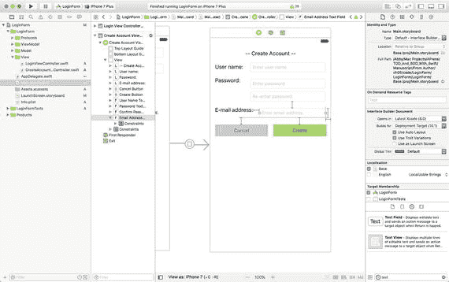

图 5-9. 注册视图控制器场景上的 UI 组件

使用故事板，将 `SignupViewController` 类设置为四个文本字段的委托。表 5-2 列出了必须在 `SignupViewController` 类中创建的 Outlet 和动作方法，以及它们关联的用户界面元素。

表 5-2. 注册视图控制器的 Outlet 和动作

| 名称 | 类型 | 描述 |
| --- | --- | --- |
| `@IBOutlet weak var userNameTextField: UITextField!` | IB Outlet | 将此 Outlet 连接到故事板场景的用户名文本字段。 |
| `@IBOutlet weak var passwordTextField: UITextField!` | IB Outlet | 将此 Outlet 连接到故事板场景的密码文本字段。 |
| `@IBOutlet weak var confirmPasswordTextField: UITextField!` | IB Outlet | 将此 Outlet 连接到故事板场景的重新输入密码文本字段。 |
| `@IBOutlet weak var emailAddressTextField: UITextField!` | IB Outlet | 将此 Outlet 连接到故事板场景的电子邮件地址文本字段。 |
| `@IBOutlet weak var createButton: UIButton!` | IB Outlet | 将此 Outlet 连接到故事板场景的创建按钮。 |
| `@IBOutlet weak var cancelButton: UIButton!` | IB Outlet | 将此 Outlet 连接到故事板场景的取消按钮。 |
| `@IBAction func create(_ sender: Any)` | IB Action | 将此方法连接到创建按钮的 Touch Up Inside 事件。 |
| `@IBAction func cancel(_ sender: Any)` | IB Action | 将此方法连接到取消按钮的 Touch Up Inside 事件。 |
| `@IBAction func userNameDidEndOnExit(_ sender: Any)` | IB Action | 将此方法连接到用户名文本字段的 Did End On Exit 事件。 |
| `@IBAction func passwordDidEndOnExit(_ sender: Any)` | IB Action | 将此方法连接到密码文本字段的 Did End On Exit 事件。 |
| `@IBAction func confirmPasswordDidEndOnExit(_ sender: Any)` | IB Action | 将此方法连接到重新输入密码文本字段的 Did End On Exit 事件。 |
| `@IBAction func emailAddressDidEndOnExit(_ sender: Any)` | IB Action | 将此方法连接到电子邮件地址文本字段的 Did End On Exit 事件。 |

通过将以下代码添加到 `SignupViewController.swift` 文件的末尾，在 `SignupViewController` 的一个单独的类扩展中实现 `UITextFieldDelegate` 协议：

```
extension SignupViewController: UITextFieldDelegate {
func textField(_ textField: UITextField,
shouldChangeCharactersIn range: NSRange,
replacementString string: String) -> Bool {
return true
}
}
```

上述代码段包含了来自 `UITextFieldDelegate` 的 `textField(_, shouldChangeCharactersIn, replacementString)` 委托方法的最小化实现。`SignupViewController.swift` 中的代码现在应该类似于代码清单 5-2。


```swift
import UIKit
class SignupViewController: UIViewController {
@IBOutlet weak var userNameTextField: UITextField!
@IBOutlet weak var passwordTextField: UITextField!
@IBOutlet weak var confirmPasswordTextField: UITextField!
@IBOutlet weak var emailAddressTextField: UITextField!
@IBOutlet weak var createButton: UIButton!
@IBOutlet weak var cancelButton: UIButton!
override func viewDidLoad() {
super.viewDidLoad()
}
override func didReceiveMemoryWarning() {
super.didReceiveMemoryWarning()
}
@IBAction func create(_ sender: Any) {
}
@IBAction func cancel(_ sender: Any) {
}
@IBAction func userNameDidEndOnExit(_ sender: Any) {
}
@IBAction func passwordDidEndOnExit(_ sender: Any) {
}
@IBAction func confirmPasswordDidEndOnExit(_ sender: Any) {
}
@IBAction func emailAddressDidEndOnExit(_ sender: Any) {
}
}
extension SignupViewController: UITextFieldDelegate {
func textField(_ textField: UITextField,
shouldChangeCharactersIn range: NSRange,
replacementString string: String) -> Bool {
return true
}
}
```
清单 5-2. `SignupViewController.swift`

### 在登录场景和注册场景之间创建转场

创建一个从登录视图控制器场景到故事板中创建账户视图控制器场景的 Present Modally 转场。选中该转场，切换到属性检查器，并将标识符属性的值设置为`presentCreateAccount`（见图 5-10）。

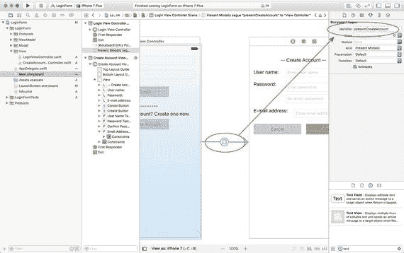

**图 5-10.** 设置转场的标识符属性

关于构建应用的用户界面的话题到此结束。你可能想知道为什么在这个项目中直到此时还没有应用 TDD 技术。原因如下：

1.  我们使用故事板来构建应用的用户界面，并通过 Interface Builder 连接输出口和动作。Xcode 没有提供任何便捷的方法来使用测试优先的方法构建这部分应用程序。
2.  你可以选择以编程方式而非使用故事板来构建用户界面。然而，使用 TDD 技术构建用户界面几乎没有什么好处。
3.  应用的 UI 可能会频繁更改，并且可以很容易地通过专门的 UI 测试技术或手动测试来测试。使用基于 TDD 的方法来构建 UI 是徒劳的，因为每次应用发生微小的 UI 更改时，你都需要修改测试。
4.  如果你秉持“测试为项目创建动态文档”的理念，那么你会发现很难证明单元测试如何能比一张简单的截图更好地为应用的用户界面创建文档。

## 构建模型层

我们需要构建两个模型类——`LoginModel`和`SignupModel`。在我们正在构建的这样一个简单的应用中，你可能会问为什么我们需要单独的模型类？我们可以简单地使用一个字符串字典来表示模型。

使用独立模型类的原因是为了在模型中容纳一定最低限度的数据验证。虽然验证逻辑本身可能被移到一个专门的验证器对象中，但这样的验证器对象在概念上将与模型对象一起存在于模型层中。

### LoginModel 类

`LoginModel`类包含存储用户在应用登录屏幕字段中输入信息的属性。当用户点击用户界面上的登录按钮时，视图模型将构建一个`LoginModel`实例，并将该实例传递给一个处理登录特定逻辑的专用控制器类。这个专用的登录控制器类可能会连接到后端服务，并使用提供的凭据进行登录。

使用专用的模型对象来存储用户在登录屏幕字段中输入的值，可以将登录控制器中的逻辑与用户界面解耦。表 5-3 列出了`LoginModel`类的期望属性和方法。

**表 5-3.** `LoginModel`属性和方法

| 项目 | 类型 | 描述 |
| --- | --- | --- |
| `var userName:String` | 变量 | 长度应在 2 到 10 个字符之间，且不含空白字符。允许使用下划线。不允许使用特殊字符。 |
| `var password:String` | 变量 | 长度应在 6 到 10 个字符之间，且不含空白字符。必须至少包含一个大写字母、一个小写字母和一个数字。 |
| `init?(userName:String, password:String)` | 方法 | 允许其他代码创建`LoginModel`实例。 |

开发`LoginModel`类的方法将与第 4 章中开发的模型层类非常相似。你需要创建测试来验证初始化器和任何验证器对象的行为。

完整的`LoginModel`类如清单 5-3 所示。如果你想查看测试和验证器对象的代码，请使用以下 URL 从 github 匿名下载完成的项目：

[`https://github.com/asmtechnology/Lesson05.iOSTesting.2017.Apress.git`](https://github.com/asmtechnology/Lesson05.iOSTesting.2017.Apress.git)

```swift
import Foundation
class LoginModel: NSObject {
var userName:String
var password:String
init?(userName:String, password:String,
userNameValidator:UserNameValidator? = nil,
passwordValidator:PasswordValidator? = nil) {
let validator1 = userNameValidator ?? UserNameValidator()
if validator1.validate(userName) == false {
return nil
}
let validator2 = passwordValidator ?? PasswordValidator()
if validator2.validate(password) == false {
return nil
}
self.userName = userName
self.password = password
super.init()
}
}
```
清单 5-3. `LoginModel.swift`


### `SignupModel` 类

`SignupModel` 类包含的属性用于存储用户在创建账户界面各字段中输入的信息。当用户点击用户界面上的创建按钮时，视图模型将构建一个 `SignupModel` 实例，并将其传递给一个包含注册逻辑的专用控制器类。该专用注册控制器类可能会连接到后端服务，并使用所提供的凭据在服务器端数据库中创建一个新账户。表 5-4 列出了 `SignupModel` 类的预期属性和方法。

**表 5-4.** `SignupModel` 属性和方法

| 项目 | 类型 | 描述 |
| --- | --- | --- |
| `var userName:String` | 变量 | 长度应在 2 到 10 个字符之间，不包含数字或空格。允许使用下划线。不允许使用特殊字符。 |
| `var password:String` | 变量 | 长度应在 2 到 10 个字符之间，不包含空格。 |
| `var emailAddress:String` | 变量 | 必须是有效的电子邮件地址。 |
| `init?(userName:String, password:String, emailAddress:String)` | 方法 | 允许其他代码创建 `SignupModel` 实例。 |

开发 `SignupModel` 类的方法将与第 4 章中开发的模型层类非常相似。你需要创建测试来验证初始化器和任何验证器对象的行为。

完整的 `SignupModel` 类在代码清单 5-4 中给出。如果你想查看测试和验证器对象的代码，可以使用以下 URL 从 github 匿名下载完成的项目：

[`https://github.com/asmtechnology/Lesson05.iOSTesting.2017.Apress.git`](https://github.com/asmtechnology/Lesson05.iOSTesting.2017.Apress.git)

```swift
import Foundation
class SignupModel: NSObject {
    var userName:String
    var password:String
    var emailAddress:String
    init?(userName:String, password:String, emailAddress:String,
          userNameValidator:UserNameValidator? = nil,
          passwordValidator:PasswordValidator? = nil,
          emailAddressValidator:EmailAddressValidator? = nil) {
        let validator1 = userNameValidator ?? UserNameValidator()
        if validator1.validate(userName) == false {
            return nil
        }
        let validator2 = passwordValidator ?? PasswordValidator()
        if validator2.validate(password) == false {
            return nil
        }
        let validator3 = emailAddressValidator ?? EmailAddressValidator()
        if validator3.validate(emailAddress) == false {
            return nil
        }
        self.userName = userName
        self.password = password
        self.emailAddress = emailAddress
        super.init()
    }
}
```
**代码清单 5-4.** `SignupModel.swift`

## 构建视图模型层

我们需要构建两个视图模型类 —— `LoginViewModel` 和 `SignupViewModel`。它们分别对应 `LoginViewController` 和 `SignupViewController` 类。视图模型将持有对模型层对象的强引用，并使用协议建立接口，通过该接口与视图控制器进行通信。

### `LoginViewModel` 类

`LoginViewModel` 类代表了 `LoginViewController` 类和 `LoginModel` 类之间的视图模型。

我们将采用 TDD 方法来开发登录视图模型类。在项目浏览器的 `LoginFormTests` 组下创建一个名为 `LoginViewModelTests` 的新 iOS 单元测试用例类（见图 5-11）。

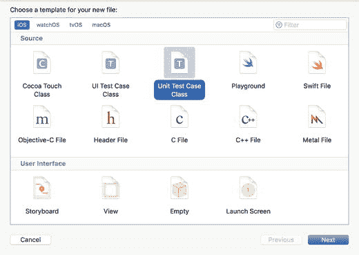

**图 5-11.** Xcode 项目模板对话框

在项目浏览器中选择 `LoginViewModelTests.swift` 文件，并使用文件检查器确保该文件包含在 `LoginFormTests` 目标中，而不是 `LoginForm` 目标中（见图 5-12）。如果文件检查器不可见，请导航至 **View ➤ Utilities ➤ Show File Inspector** 菜单项。

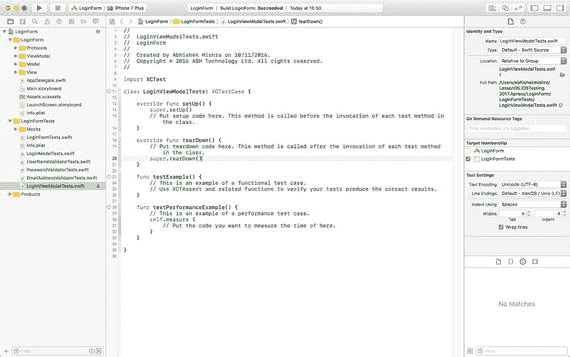

**图 5-12.** `LoginViewModelTests` 目标成员资格

从 `LoginViewModelTests.swift` 中删除 `testExample` 和 `testPerformanceExample` 方法。在单独的扩展中创建一个名为 `testInit_ValidView_InstantiatesObject()` 的新单元测试方法，并将以下代码添加到方法体中：

```swift
func testInit_ValidView_InstantiatesObject() {
    let viewModel = LoginViewModel(view:mockLoginViewController!)
    XCTAssertNotNil(viewModel)
}
```

将以下变量声明添加到 `LoginViewModelTests` 类的顶部：

```swift
fileprivate var mockLoginViewController:MockLoginViewController?
```

你会注意到这段代码无法编译；这是因为 `LoginViewModel` 类尚未创建。要修复此问题，请在项目导航器的 `ViewModel` 组下创建一个名为 `LoginViewModel` 的新类。确保 `LoginViewModel` 类同时是 `LoginForm` 和 `LoginFormTests` 目标的成员。将 `LoginViewModel.swift` 文件的内容更新为与代码清单 5-5 一致。

```swift
import Foundation
class LoginViewModel: NSObject {
    weak var view:LoginViewControllerProtocol?
    init(view:LoginViewControllerProtocol) {
        super.init()
        self.view = view
    }
}
```
**代码清单 5-5.** `LoginViewModel.swift`

`LoginViewModel` 类的初始化器接受一个对视图的引用。请注意，`view` 参数的类型是 `LoginViewControllerProtocol`，而不是 `LoginViewController`。

视图模型使用协议与视图建立松散耦合的关系。就视图模型而言，任何实现了 `LoginViewControllerProtocol` 协议的类都可以用作视图。这种与视图的松散耦合使得视图模型易于在单元测试中实例化，而无需依赖视图控制器。

在项目浏览器的 `Protocols` 组下创建一个名为 `LoginViewControllerProtocol` 的新 Swift 文件（见图 5-13），并确保新文件同时是 `LoginFormTests` 和 `LoginForm` 目标的成员。

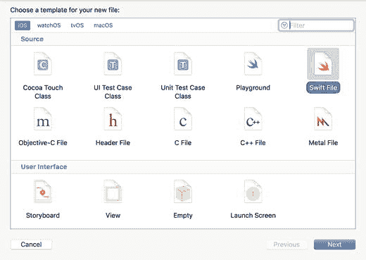

**图 5-13.** Xcode 文件模板对话框

将 `LoginViewControllerProtocol` 中的代码更新为类似以下内容：

```swift
import Foundation
protocol LoginViewControllerProtocol : class {
}
```

在 `LoginFormTests` 组下创建一个名为 `Mocks` 的新组，并在 `Mocks` 组下创建一个名为 `MockLoginViewController` 的新 Swift 类。确保 `MockLoginViewController.swift` 文件仅是 `LoginFormTests` 目标的成员。

将 `MockLoginViewController.swift` 中的代码更新为类似以下内容：

```swift
import UIKit
import XCTest
class MockLoginViewController : LoginViewControllerProtocol {
}
```

打开 `LoginViewModelTests.swift` 文件，并将 `setUp()` 方法更新为类似以下内容：

```swift
override func setUp() {
    super.setUp()
    mockLoginViewController = MockLoginViewController()
}
```


更新后的`setup()`方法实例化了一个`MockLoginViewController`，并将对这个新实例的引用保存在`mockLoginViewController`私有变量中。`LoginViewModelTests.swift`中的代码现在应类似于清单 5-6。

```swift
import XCTest
class LoginViewModelTests: XCTestCase {
    fileprivate var mockLoginViewController: MockLoginViewController?
    override func setUp() {
        super.setUp()
        mockLoginViewController = MockLoginViewController()
    }
    override func tearDown() {
        super.tearDown()
    }
}
// MARK: initialization tests
extension LoginViewModelTests {
    func testInit_ValidView_InstantiatesObject() {
        let viewModel = LoginViewModel(view: mockLoginViewController!)
        XCTAssertNotNil(viewModel)
    }
}
Listing 5-6.
LoginViewModelTests.swift
```

保存文件并通过`Product` ➤ `Test`菜单项运行所有单元测试。你将看到在`LoginViewModelTests.swift`中添加的单元测试已通过（见图 5-14）。

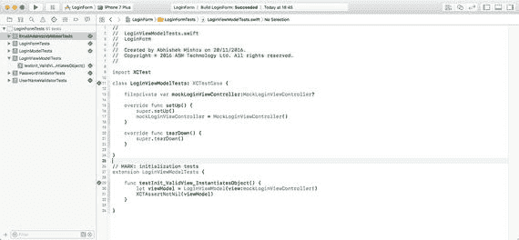

Figure 5-14.

登录视图模型的基本测试

目前编写的视图模型测试验证了视图模型可以被实例化；为了使这个测试通过，你创建了一个视图模型类、一个协议和一个模拟类。

接下来要编写的测试将验证视图模型在实例变量中保存了注入到初始化器的视图的引用。在前一个测试方法下创建一个名为`testInit_ValidView_CopiesViewToIvar()`的新单元测试方法，并将以下代码添加到方法体中：

```swift
func testInit_ValidView_CopiesViewToIvar() {
    let viewModel = LoginViewModel(view: mockLoginViewController!)
    if let lhs = mockLoginViewController, let rhs = viewModel.view as? MockLoginViewController {
        XCTAssertTrue(lhs === rhs)
    }
}
```

保存文件并通过`Product` ➤ `Test`菜单项运行所有单元测试。你会注意到到目前为止编写的所有测试都继续通过。

### 视图模型 – 视图控制器绑定

我们迄今为止构建的登录视图模型没有做任何有用的事情。你可以实例化它，但它没有任何可调用的方法。为了确定应该向视图模型添加哪些方法，让我们看一下登录视图控制器的用户界面（见图 5-15）。

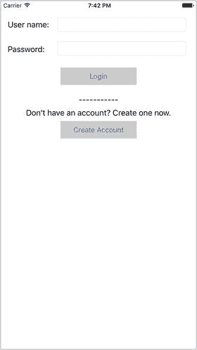

Figure 5-15.

登录视图控制器的用户界面

你可以看到登录视图控制器的用户界面由几个文本字段和按钮组成。用户可以使用文本字段输入凭据并点击`Login`按钮，或者用户可以点击`Create account`按钮进入应用的不同屏幕。

为了使视图模型对视图控制器有用，你需要向视图模型添加一些方法，这些方法可以在视图控制器的各种生命周期方法和事件处理器中被调用。表 5-5 列出了我们将添加到`LoginViewModel`类中的方法。

Table 5-5.

LoginViewModel 方法

| 项目 | 描述 |
| --- | --- |
| `func performInitialViewSetup()` | 应从视图控制器类的`viewDidLoad()`方法中调用。将用户界面元素重置为其初始状态。 |
| `func login(userName: String?, password: String?)` | 当用户点击`Login`按钮时，由登录视图控制器调用。创建一个`LoginModel`实例并向用户显示一个提示。 |
| `func userNameDidEndOnExit()` | 当用户名字段接收到`didEndOnExit`事件时，由登录视图控制器调用。如果键盘可见，则将其关闭。 |
| `func passwordDidEndOnExit()` | 当密码字段接收到`didEndOnExit`事件时，由登录视图控制器调用。如果键盘可见，则将其关闭。 |
| `func userNameUpdated(_ value: String?)` | 当用户更新用户名字段的文本时，由登录视图控制器调用。调用一个验证器对象检查用户名字段中的文本是否有效。如果用户名和密码字段都有效，则启用`Login`按钮。 |
| `func passwordUpdated(_ value: String?)` | 当用户更新密码字段的文本时，由登录视图控制器调用。调用一个验证器对象检查密码字段中的文本是否有效。如果用户名和密码字段都有效，则启用`Login`按钮。 |

视图模型还需要能够更新视图控制器上的 UI 元素，以反映应用状态或模型数据的变化。由于视图模型使用协议与视图控制器绑定，你需要向协议中添加一些方法，允许视图模型请求视图控制器更新用户界面元素。表 5-6 列出了将要添加到`LoginViewControllerProtocol`中的方法。

Table 5-6.

LoginViewControllerProtocol 方法

| 项目 | 描述 |
| --- | --- |
| `func clearUserNameField()` | 由视图模型调用。视图控制器应清空用户名字段的内容。 |
| `func clearPasswordField()` | 由视图模型调用。视图控制器应清空密码字段的内容。 |
| `func enableLoginButton(_ status: Bool)` | 由视图模型调用。视图控制器应根据`status`的值启用或禁用`Login`按钮。 |
| `func enableCreateAccountButton(_ status: Bool)` | 由视图模型调用。视图控制器应根据`status`的值启用或禁用`Create Account`按钮。 |
| `func hideKeyboard()` | 由视图模型调用。如果键盘可见，视图控制器应将其隐藏。 |

现在，你将使用 TDD 技术向`LoginViewModel`类添加所需的方法。


### 构建 `performInitialViewSetup` 方法

`performInitialViewSetup()` 方法应执行以下任务：

- 清空用户名字段的内容。
- 清空密码字段的内容。
- 禁用登录按钮。
- 启用创建账户按钮。

将列表 5-7 中的测试代码添加到 `LoginViewModelTests.swift` 文件的末尾：

```swift
// MARK: performInitialViewSetup tests
extension LoginViewModelTests {
func testPerformInitialViewSetup_Calls_ClearUserNameField_OnViewController() {
let expectation = self.expectation(description: "预期会调用 clearUserNameField() 方法")
mockLoginViewController!.expectationForClearUserNameField = expectation
let viewModel = LoginViewModel(view:mockLoginViewController!)
viewModel.performInitialViewSetup()
self.waitForExpectations(timeout: 1.0, handler: nil)
}
func testPerformInitialViewSetup_Calls_ClearPasswordField_OnViewController() {
let expectation = self.expectation(description: "预期会调用 clearPasswordField() 方法")
mockLoginViewController!.expectationForClearPasswordField = expectation
let viewModel = LoginViewModel(view:mockLoginViewController!)
viewModel.performInitialViewSetup()
self.waitForExpectations(timeout: 1.0, handler: nil)
}
func testPerformInitialViewSetup_DisablesLoginButton_OnViewController() {
let expectation = self.expectation(description: "预期会调用 enableLoginButton(false) 方法")
mockLoginViewController!.expectationForEnableLoginButton = (expectation, false)
let viewModel = LoginViewModel(view:mockLoginViewController!)
viewModel.performInitialViewSetup()
self.waitForExpectations(timeout: 1.0, handler: nil)
}
func testPerformInitialViewSetup_EnablesCreateAccountButton_OnViewController() {
let expectation = self.expectation(description: "预期会调用 enableCreateAccountButton(true) 方法")
mockLoginViewController!.expectationForCreateAccountButton = (expectation, true)
let viewModel = LoginViewModel(view:mockLoginViewController!)
viewModel.performInitialViewSetup()
self.waitForExpectations(timeout: 1.0, handler: nil)
}
}
列表 5-7.
用于 `performInitialViewSetup` 方法的测试
```

列表 5-7 新增了四个测试用例，每个用例对应 `performInitialViewSetup()` 必须执行的一项任务。由于这四个用例测试的是同一方法的不同部分，我将它们归组到一个类扩展中；不过你也可以将所有四个测试方法直接添加到主测试类的定义内，而非单独的扩展中。

为了让这段代码能够编译通过，你需要对项目进行一些代码调整。

向 `MockLoginViewController.swift` 文件中添加一些变量声明和方法实现：

```swift
var expectationForClearUserNameField:XCTestExpectation?
var expectationForClearPasswordField:XCTestExpectation?
var expectationForEnableLoginButton:(XCTestExpectation, Bool)?
var expectationForCreateAccountButton:(XCTestExpectation, Bool)?
var expectationForHideKeyboard:XCTestExpectation?
func clearUserNameField() {
self.expectationForClearUserNameField?.fulfill()
}
func clearPasswordField() {
self.expectationForClearPasswordField?.fulfill()
}
func enableLoginButton(_ status:Bool) {
if let (expectation, expectedValue) = self.expectationForEnableLoginButton {
if status == expectedValue {
expectation.fulfill()
}
}
}
func enableCreateAccountButton(_ status:Bool) {
if let (expectation, expectedValue) = self.expectationForCreateAccountButton {
if status == expectedValue {
expectation.fulfill()
}
}
}
```

向 `LoginViewModel.swift` 文件中添加以下方法实现：

```swift
func performInitialViewSetup() {
view?.clearUserNameField()
view?.clearPasswordField()
view?.enableLoginButton(false)
view?.enableCreateAccountButton(true)
}
```

向 `LoginViewControllerProtocol.swift` 文件中添加以下方法定义：

```swift
func clearUserNameField()
func clearPasswordField()
func enableLoginButton(_ status:Bool)
func enableCreateAccountButton(_ status:Bool)
```

在 `LoginViewController.swift` 文件的一个类扩展中添加以下方法实现：

```swift
extension LoginViewController : LoginViewControllerProtocol {
func clearUserNameField() {
self.userNameTextField.text = ""
}
func clearPasswordField() {
self.passwordTextField.text = ""
}
func enableLoginButton(_ status:Bool) {
self.loginButton.isEnabled = status
}
func enableCreateAccountButton(_ status:Bool) {
self.loginButton.isEnabled = status
}
}
```

保存文件，并使用 **Product** ➤ **Test** 菜单项运行所有单元测试。你会看到你在 `LoginViewModelTests.swift` 中添加的单元测试已通过（见图 5-16）。

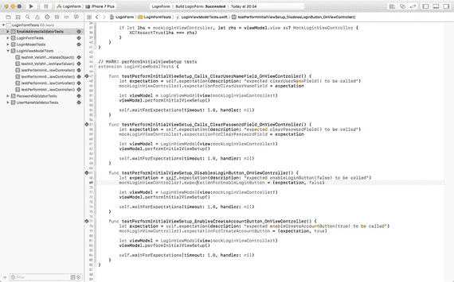

图 5-16. `performInitialViewSetup` 方法的所有测试均通过。

### 构建 `userNameDidEndOnExit` 方法

当登录视图控制器从用户名字段接收到 `didEndOnExit` 事件时，会调用视图模型的 `userNameDidEndOnExit()` 方法。此方法被调用时，视图模型会要求视图控制器在键盘可见时将其收起。

你可能会考虑在此场景中完全绕过视图模型，直接将收起键盘的代码放在视图控制器类的 `func userNameDidEndOnExit(_ sender: Any)` 操作方法中。然而，MVVM 模式的正确使用要求你将展示逻辑从视图控制器中剥离出来，并放入视图模型中。隐藏键盘属于展示逻辑，而视图模型决定了何时应隐藏键盘。

将以下代码片段添加到 `LoginViewModelTests.swift` 文件的末尾：

```swift
// MARK: userNameDidEndOnExit tests
extension LoginViewModelTests {
func testUserNameDidEndOnExit_Calls_HideKeyboard_OnViewController() {
let expectation = self.expectation(description: "预期会调用 hideKeyboard() 方法")
mockLoginViewController!.expectationForHideKeyboard = expectation
let viewModel = LoginViewModel(view:mockLoginViewController!)
viewModel.userNameDidEndOnExit()
self.waitForExpectations(timeout: 1.0, handler: nil)
}
}
```

向 `LoginViewModel.swift` 文件中添加以下方法实现：

```swift
func userNameDidEndOnExit() {
view?.hideKeyboard()
}
```

向 `LoginViewControllerProtocol.swift` 文件中添加以下方法定义：

```swift
func hideKeyboard()
```

在 `LoginViewController.swift` 文件的 `LoginViewControllerProtocol` 扩展中添加以下方法实现：

```swift
func hideKeyboard() {
self.userNameTextField.resignFirstResponder()
self.passwordTextField.resignFirstResponder()
}
```

向 `MockLoginViewController.swift` 文件中添加以下方法实现：

```swift
func hideKeyboard() {
self.expectationForHideKeyboard?.fulfill()
}
```

保存文件，并使用 **Product** ➤ **Test** 菜单项运行所有单元测试。你会看到你在 `LoginViewModelTests.swift` 中添加的单元测试已通过。


#### 构建 `passwordDidEndOnExit` 方法

当密码文本字段收到 `didEndOnExit` 事件时，登录视图控制器会调用视图模型的 `passwordDidEndOnExit()` 方法。调用此方法时，如果键盘可见，视图模型会要求视图控制器将其收起。

将以下代码片段添加到 `LoginViewModelTests.swift` 文件的底部：

```
// MARK: passwordDidEndOnExit 测试
extension LoginViewModelTests {
    func testPasswordDidEndOnExit_Calls_HideKeyboard_OnViewController() {
        let expectation = self.expectation(description: "期望调用 hideKeyboard()")
        mockLoginViewController!.expectationForHideKeyboard = expectation
        let viewModel = LoginViewModel(view:mockLoginViewController!)
        viewModel.passwordDidEndOnExit()
        self.waitForExpectations(timeout: 1.0, handler: nil)
    }
}
```

将以下方法实现添加到 `LoginViewModel.swift` 文件中：

```
func passwordDidEndOnExit() {
    view?.hideKeyboard()
}
```

保存文件，并通过 **Product ➤ Test** 菜单项运行所有单元测试。你将看到在 `LoginViewModelTests.swift` 中添加的单元测试已通过。

#### 构建 `userNameUpdated` 方法

当用户更新用户名字段的内容时，登录视图控制器会调用视图模型的 `userNameUpdated(_ value:String?)` 方法。

调用此方法时，视图模型会检查用户输入的文本是否为有效的用户名。如果是，并且密码文本字段的内容也有效，那么视图模型会要求视图控制器启用“登录”按钮。

构建此逻辑需要你先编写一系列测试。将清单 5-8 中的测试添加到 `LoginViewModelTests.swift` 文件的底部：

```
// MARK: userNameUpdated 测试
extension LoginViewModelTests {
    func testUserNameUpdated_Calls_Validate_OnUserNameValidator() {
        let expectation = self.expectation(description: "期望调用 validate()")
        let viewModel = LoginViewModel(view:mockLoginViewController!)
        viewModel.userNameValidator = MockUserNameValidator(expectation, expectedValue: validUserName)
        viewModel.userNameUpdated(validUserName)
        self.waitForExpectations(timeout: 1.0, handler: nil)
    }
    func testUserNameUpdated_ValidUserName_PasswordValidated_EnablesLoginButton_OnViewController() {
        let expectation = self.expectation(description: "期望调用 enableLogin(true)")
        mockLoginViewController!.expectationForEnableLoginButton = (expectation, true)
        let viewModel = LoginViewModel(view:mockLoginViewController!)
        viewModel.passwordValidated = true
        viewModel.userNameUpdated(validUserName)
        self.waitForExpectations(timeout: 1.0, handler: nil)
    }
    func testUserNameUpdated_ValidUserName_PasswordNotValidated_DisablesLoginButton_OnViewController() {
        let expectation = self.expectation(description: "期望调用 enableLogin(false)")
        mockLoginViewController!.expectationForEnableLoginButton = (expectation, false)
        let viewModel = LoginViewModel(view:mockLoginViewController!)
        viewModel.passwordValidated = false
        viewModel.userNameUpdated(validUserName)
        self.waitForExpectations(timeout: 1.0, handler: nil)
    }
    func testUserNameUpdated_InvalidUserName_PasswordValidated_DisablesLoginButton_OnViewController() {
        let expectation = self.expectation(description: "期望调用 enableLogin(false)")
        mockLoginViewController!.expectationForEnableLoginButton = (expectation, false)
        let viewModel = LoginViewModel(view:mockLoginViewController!)
        viewModel.passwordValidated = true
        viewModel.userNameUpdated(invalidUserName)
        self.waitForExpectations(timeout: 1.0, handler: nil)
    }
    func testUserNameUpdated_InvalidUserName_PasswordNotValidated_DisablesLoginButton_OnViewController() {
        let expectation = self.expectation(description: "期望调用 enableLogin(false)")
        mockLoginViewController!.expectationForEnableLoginButton = (expectation, false)
        let viewModel = LoginViewModel(view:mockLoginViewController!)
        viewModel.passwordValidated = false
        viewModel.userNameUpdated(invalidUserName)
        self.waitForExpectations(timeout: 1.0, handler: nil)
    }
}
清单 5-8.
userNameUpdated 方法的测试
```

将以下变量声明添加到 `LoginViewModelTests` 文件中：

```
fileprivate var validUserName = "abcdefghij"
fileprivate var invalidUserName = "a"
```

将以下变量声明添加到 `LoginViewModel.swift` 文件中：

```
var userNameValidator:UserNameValidator?
var userNameValidated:Bool
var passwordValidated:Bool
```

修改 `LoginViewModel.swift` 文件中 `init(view:)` 方法的实现，使其匹配以下内容：

```
init(view:LoginViewControllerProtocol) {
    self.userNameValidated = false
    self.passwordValidated = false
    super.init()
    self.view = view
}
```

将以下方法实现添加到 `LoginViewModel.swift` 文件中：

```
func userNameUpdated(_ value:String?) {
    guard let value = value else {
        view?.enableLoginButton(false)
        return
    }
    let validator = self.userNameValidator ?? UserNameValidator()
    userNameValidated = validator.validate(value)
    if userNameValidated == false {
        view?.enableLoginButton(false)
        return
    }
    if passwordValidated == false {
        view?.enableLoginButton(false)
        return
    }
    view?.enableLoginButton(true)
}
```

保存文件，并通过 **Product ➤ Test** 菜单项运行所有单元测试。你将看到在 `LoginViewModelTests.swift` 中添加的单元测试已通过。


### 构建 `passwordUpdated` 方法

当用户更新密码字段内容时，登录视图控制器会调用视图模型的 `passwordUpdated(_ value:String?)` 方法。

调用该方法时，视图模型会检查用户输入的文本是否代表有效密码。如果密码有效，且用户名字段内容也有效，则视图模型会要求视图控制器启用“登录”按钮。

将清单 5-9 中的测试添加到 `LoginViewModelTests.swift` 文件末尾：

```
// MARK: passwordUpdated 测试
extension LoginViewModelTests {
func testPasswordUpdated_Calls_Validate_OnPasswordValidator() {
let expectation = self.expectation(description: "expected validate() to be called")
let viewModel = LoginViewModel(view:mockLoginViewController!)
viewModel.passwordValidator = MockPasswordValidator(expectation, expectedValue: validPassword)
viewModel.passwordUpdated(validPassword)
self.waitForExpectations(timeout: 1.0, handler: nil)
}
func testPasswordUpdated_ValidPassword_UserNameValidated_EnablesLoginButton_OnViewController() {
let expectation = self.expectation(description: "expected enableLogin(true) to be called")
mockLoginViewController!.expectationForEnableLoginButton = (expectation, true)
let viewModel = LoginViewModel(view:mockLoginViewController!)
viewModel.userNameValidated = true
viewModel.passwordUpdated(validPassword)
self.waitForExpectations(timeout: 1.0, handler: nil)
}
func testPasswordUpdated_ValidPassword_UserNameNotValidated_DisablesLoginButton_OnViewController() {
let expectation = self.expectation(description: "expected enableLogin(false) to be called")
mockLoginViewController!.expectationForEnableLoginButton = (expectation, false)
let viewModel = LoginViewModel(view:mockLoginViewController!)
viewModel.userNameValidated = false
viewModel.passwordUpdated(validPassword)
self.waitForExpectations(timeout: 1.0, handler: nil)
}
func testPasswordUpdated_InvalidPassword_UserNameValidated_DisablesLoginButton_OnViewController() {
let expectation = self.expectation(description: "expected enableLogin(false) to be called")
mockLoginViewController!.expectationForEnableLoginButton = (expectation, false)
let viewModel = LoginViewModel(view:mockLoginViewController!)
viewModel.userNameValidated = true
viewModel.passwordUpdated(invalidPassword)
self.waitForExpectations(timeout: 1.0, handler: nil)
}
func testPasswordUpdated_InvalidPassword_UserNameNotValidated_DisablesLoginButton_OnViewController() {
let expectation = self.expectation(description: "expected enableLogin(false) to be called")
mockLoginViewController!.expectationForEnableLoginButton = (expectation, false)
let viewModel = LoginViewModel(view:mockLoginViewController!)
viewModel.userNameValidated = false
viewModel.passwordUpdated(invalidPassword)
self.waitForExpectations(timeout: 1.0, handler: nil)
}
}
```

清单 5-9. `passwordUpdated` 方法的测试

将以下变量声明添加到 `LoginViewModelTests` 文件中：

```
fileprivate let validPassword = "D%io7AFn9Y"
fileprivate let invalidPassword = "a3$Am"
```

将以下变量声明添加到 `LoginViewModel.swift` 文件中：

```
var passwordValidator:PasswordValidator?
```

将以下方法实现添加到 `LoginViewModel.swift` 文件中：

```
func passwordUpdated(_ value:String?) {
guard let value = value else {
view?.enableLoginButton(false)
return
}
let validator = self.passwordValidator ?? PasswordValidator()
passwordValidated = validator.validate(value)
if passwordValidated == false {
view?.enableLoginButton(false)
return
}
if userNameValidated == false {
view?.enableLoginButton(false)
return
}
view?.enableLoginButton(true)
}
```

保存文件并使用 **Product ➤ Test** 菜单项运行所有单元测试。你将看到在 `LoginViewModelTests.swift` 中添加的单元测试已通过。

### 构建 `login` 方法

当用户点击“登录”按钮时，会调用视图模型的 `login(userName, password)` 方法。用户名和密码文本字段的内容将传递给 `login` 方法。`login` 方法会创建一个 `LoginModel` 对象，并在控制器类的实例上调用 `doLogin` 方法，该类将封装验证用户身份所需的逻辑。

在实际应用中，此登录控制器类将包含向后端服务器发送请求的逻辑。然而，就本章而言，我们将构建一个使用硬编码凭据来验证用户身份的简易登录控制器类。

将清单 5-10 中的测试添加到 `LoginViewModelTests.swift` 文件末尾：

```
// MARK: login 测试
extension LoginViewModelTests {
func testLogin_ValidParameters_Calls_doLogin_OnLoginController() {
let expectation = self.expectation(description: "expected doLogin() to be called")
let mockLoginController = MockLoginController(expectation, expectedUserName:validUserName, expectedPassword:validPassword)
mockLoginController.shouldReturnTrueOnLogin = true
let viewModel = LoginViewModel(view:mockLoginViewController!)
viewModel.loginController = mockLoginController
mockLoginController.loginControllerDelegate = viewModel
viewModel.login(userName: validUserName, password: validPassword)
self.waitForExpectations(timeout: 1.0, handler: nil)
}
func testLogin_ValidParameters_Calls_doLoginWithExpectedUserName_OnLoginController() {
let expectation = self.expectation(description: "expected doLogin() to be called")
let mockLoginController = MockLoginController(expectation, expectedUserName:validUserName, expectedPassword:validPassword)
mockLoginController.shouldReturnTrueOnLogin = true
let viewModel = LoginViewModel(view:mockLoginViewController!)
viewModel.loginController = mockLoginController
mockLoginController.loginControllerDelegate = viewModel
viewModel.login(userName: validUserName, password: validPassword)
self.waitForExpectations(timeout: 1.0, handler: nil)
}
func testLogin_ValidParameters_Calls_doLoginWithExpectedPassword_OnLoginController() {
let expectation = self.expectation(description: "expected doLogin() to be called")
let mockLoginController = MockLoginController(expectation, expectedUserName:validUserName, expectedPassword:validPassword)
mockLoginController.shouldReturnTrueOnLogin = true
let viewModel = LoginViewModel(view:mockLoginViewController!)
viewModel.loginController = mockLoginController
mockLoginController.loginControllerDelegate = viewModel
viewModel.login(userName: validUserName, password: validPassword)
self.waitForExpectations(timeout: 1.0, handler: nil)
}
}
```

清单 5-10. `login` 方法的测试

请注意，这些测试使用了一个名为 `MockLoginController` 的模拟类来代表登录控制器，并在模拟类的 `doLogin()` 方法被调用时满足测试预期。接下来让我们创建登录控制器及其模拟类。


### 创建登录控制器类

我们将创建一个基础类来表示登录控制器——在真实场景中，该类会封装用于通过后端服务器对用户进行身份验证的逻辑。

在创建登录控制器类时，我们不会使用 TDD 技术。在 Xcode 项目导航器中新建一个名为`"Controllers"`的组，然后在该组下新建一个名为`LoginController.swift`的 Swift 文件。确保该新文件同时属于`LoginForm`和`LoginFormTests`两个目标（见图 5-17）。

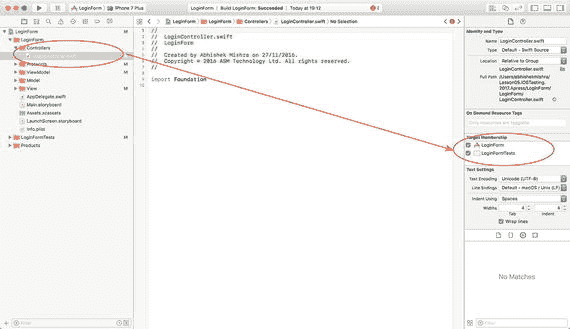

**图 5-17.** `LoginController.swift` 目标成员资格

将`LoginController.swift`的内容更新为与代码清单 5-11 一致。

```
import Foundation
protocol LoginControllerDelegate : class {
func loginResult(result:Bool)
}
class LoginController : NSObject {
let dummyUsername = "Alibaba"
let dummyPassword = "Abracadabra"
weak var loginControllerDelegate : LoginControllerDelegate?
init(delegate:LoginControllerDelegate?) {
self.loginControllerDelegate = delegate
super.init()
}
func doLogin(model:LoginModel) {
let userName = model.userName
let password = model.password
if ((userName.compare(dummyUsername) == .orderedSame) &&
(password.compare(dummyPassword) == .orderedSame)) {
loginControllerDelegate?.loginResult(result: true)
return
}
loginControllerDelegate?.loginResult(result: false)
}
}
```

**代码清单 5-11.** `LoginController.swift`

代码清单 5-11 中展示的登录控制器类需要一个委托对象，该对象将被告知登录尝试的结果。委托对象必须遵守`LoginControllerDelegate`协议。该协议定义了一个方法：

```
func loginResult(result:Bool)
```

视图模型将作为登录控制器的委托对象。我们将在本章稍后部分更新`LoginViewModel`类以实现此协议。

### 创建模拟登录控制器类

在 Xcode 项目导航器的`Mocks`组下新建一个名为`MockLoginController.swift`的 Swift 文件。确保该新文件仅属于`LoginFormTests`目标（见图 5-18）。

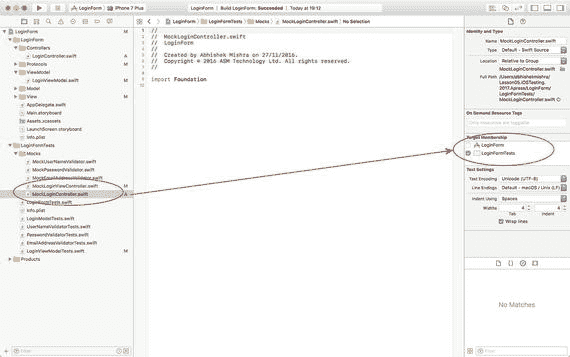

**图 5-18.** `MockLoginController` 目标成员资格

将`MockLoginController.swift`的内容更新为与代码清单 5-12 一致。

```
import Foundation
import XCTest
class MockLoginController : LoginController {
private var expectation:XCTestExpectation?
private var expectedUserName:String?
private var expectedPassword:String?
var shouldReturnTrueOnLogin:Bool
init(_ expectation:XCTestExpectation, expectedUserName:String, expectedPassword:String) {
self.expectation = expectation
self.expectedUserName = expectedUserName
self.expectedPassword = expectedPassword
self.shouldReturnTrueOnLogin = false
super.init(delegate:nil)
}
override func doLogin(model:LoginModel) {
if let expectation = self.expectation,
let expectedUserName = self.expectedUserName,
let expectedPassword = expectedPassword {
if ((model.userName.compare(expectedUserName) == .orderedSame) &&
(model.password.compare(expectedPassword) == .orderedSame)){
expectation.fulfill()
}
}
loginControllerDelegate?.loginResult(result:shouldReturnTrueOnLogin)
}
}
```

**代码清单 5-12.** `MockLoginController.swift`

### 更新 LoginViewModel 类

将以下类扩展添加到`LoginViewModel`类中：

```
extension LoginViewModel : LoginControllerDelegate {
func loginResult(result: Bool) {
// 对结果进行处理，
// 可能跳转到应用的不同界面。
}
}
```

该类扩展确保`LoginViewModel`类遵守`LoginControllerDelegate`协议。遵守协议要求登录视图模型实现`loginResult(result:)`方法。

`loginResult(result:)`方法的主体在此实现中为空。在生产应用中，你可能会调用视图控制器的方法来跳转到应用的不同界面。

将以下变量声明添加到`LoginViewModel`类中：

```
var loginController:LoginController?
```

将以下方法实现添加到`LoginViewModel`类中：

```
func login(userName:String?, password:String?) {
let controller = self.loginController ?? LoginController(delegate:self)
if let userName = userName,
let password = password,
let model = LoginModel(userName: userName, password: password) {
controller.doLogin(model: model)
}
}
```

保存文件并使用**Product ▶ Test**菜单项运行所有单元测试。你将看到到目前为止添加到该项目中的所有单元测试均已通过（见图 5-19）。

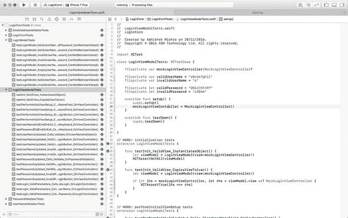

**图 5-19.** 所有登录视图模型测试均已通过


### `SignupViewModel` 类

`SignupViewModel` 类代表了 `SignupViewController` 类与 `SignupModel` 类之间的视图模型。构建 `SignupViewModel` 类的过程与构建 `LoginViewModel` 类完全相同。

完整的 `SignupViewModel` 类如列表 5-13 所示。如果您想查看测试代码及相关的模拟对象，请使用以下 URL 从 github 匿名下载完成的项目：

[`https://github.com/asmtechnology/Lesson05.iOSTesting.2017.Apress.git`](https://github.com/asmtechnology/Lesson05.iOSTesting.2017.Apress.git)

```
import Foundation
class SignupViewModel: NSObject {
weak var view:SignupViewControllerProtocol?
var userNameValidator:UserNameValidator?
var passwordValidator:PasswordValidator?
var emailAddressValidator:EmailAddressValidator?
var userNameValidated:Bool
var password1Validated:Bool
var password2Validated:Bool
var password1:String?
var password2:String?
var passwordsAreIdentical:Bool
var signupController:SignupController?
init(view:SignupViewControllerProtocol) {
self.userNameValidated = false
self.password1Validated = false
self.password2Validated = false
self.passwordsAreIdentical = false
super.init()
self.view = view
}
func performInitialViewSetup() {
view?.clearUserNameField()
view?.clearPasswordField()
view?.clearConfirmPasswordField()
view?.enableCreateButton(false)
view?.enableCancelButton(true)
}
func userNameDidEndOnExit() {
view?.hideKeyboard()
}
func passwordDidEndOnExit() {
view?.hideKeyboard()
}
func confirmPasswordDidEndOnExit() {
view?.hideKeyboard()
}
func userNameUpdated(_ value:String?) {
guard let value = value else {
view?.enableCreateButton(false)
return
}
let validator = self.userNameValidator ?? UserNameValidator()
userNameValidated = validator.validate(value)
if userNameValidated == false {
view?.enableCreateButton(false)
return
}
if password1Validated == true &&
password2Validated == true &&
passwordsAreIdentical == true {
view?.enableCreateButton(true)
return
}
view?.enableCreateButton(false)
}
func passwordUpdated(_ value:String?) {
self.password1 = value
guard let password1 = self.password1 else {
view?.enableCreateButton(false)
return
}
if let password2 = password2 {
passwordsAreIdentical = password1.compare(password2) == .orderedSame
} else {
passwordsAreIdentical = false
}
let validator = self.passwordValidator ?? PasswordValidator()
password1Validated = validator.validate(password1)
if userNameValidated == false {
view?.enableCreateButton(false)
return
}
if password1Validated == true &&
password2Validated == true &&
passwordsAreIdentical == true {
view?.enableCreateButton(true)
return
}
view?.enableCreateButton(false)
}
func confirmPasswordUpdated(_ value:String?) {
self.password2 = value
guard let password2 = self.password2 else {
view?.enableCreateButton(false)
return
}
if let password1 = password1 {
passwordsAreIdentical = password1.compare(password2) == .orderedSame
} else {
passwordsAreIdentical = false
}
let validator = self.passwordValidator ?? PasswordValidator()
password2Validated = validator.validate(password2)
if userNameValidated == false {
view?.enableCreateButton(false)
return
}
if password1Validated == true &&
password2Validated == true &&
passwordsAreIdentical == true {
view?.enableCreateButton(true)
return
}
view?.enableCreateButton(false)
}
func signup(userName:String?, password:String?, emailAddress:String?) {
let controller = self.signupController ?? SignupController(delegate:self)
if let userName = userName,
let password = password,
let emailAddress = emailAddress,
let model = SignupModel(userName: userName, password: password, emailAddress:emailAddress) {
controller.doSignup(model: model)
}
}
}
extension LoginViewModel : SignupControllerDelegate {
func signupResult(result: Bool) {
// 对结果进行处理，
// 例如跳转到应用的其他界面。
}
}
```

`列表 5-13.`  
`SignupViewModel.swift`

## 将视图控制器连接到视图模型

到目前为止，本章我们采用测试驱动的方法，为两个视图控制器构建了模型层和视图模型层。现在，我们需要从视图控制器中调用视图模型。

你是否应该采用测试驱动的方法来创建视图控制器与视图模型之间的绑定？答案是：“这取决于你认为这些测试在长期内有多大的价值。”

MVVM 架构模式的核心目的，是使视图控制器变得轻量且更易于测试。然而，视图控制器仍然与呈现给用户的视图紧密耦合，因此在测试目标中实例化它可能会比较困难。

为了在单元测试中实例化视图控制器，你需要对测试中涉及到的视图控制器的出口（outlets）进行桩处理。`LoginForm` 项目包含两个视图控制器，每个都有自己的视图模型。视图模型在设计时，假设视图控制器会在某些关键节点调用视图模型。本章接下来的部分，将探讨如何利用测试驱动技术来创建视图控制器与视图模型之间的绑定。

### 将登录视图控制器类绑定到视图模型

表 5-7 列出了 `LoginViewController` 类中的方法及其对应的视图模型绑定。

`表 5-7.`  
登录视图控制器与视图模型绑定

| 登录视图控制器方法 | 登录视图模型方法 |
| --- | --- |
| `func viewDidLoad()` | `func performInitialViewSetup()` |
| `@IBAction func login(_ sender: Any)` | `func login(userName:String?, password:String?)` |
| `@IBAction func userNameDidEndOnExit(_ sender: Any)` | `func userNameDidEndOnExit()` |
| `@IBAction func passwordDidEndOnExit(_ sender: Any)` | `func passwordDidEndOnExit()` |
| `func textField(_ textField: UITextField, shouldChangeCharactersIn range: NSRange, replacementString string: String) -> Bool` | `func userNameUpdated(_ value:String?)` 和 `func passwordUpdated (_ value:String?)` |

在项目导航器的 `LoginFormTests` 分组下，创建一个名为 `LoginViewControllerTests` 的新 iOS 单元测试用例类。

从 `LoginViewControllerTests.swift` 中删除 `testExample` 和 `testPerformanceExample` 方法。


### 从视图控制器调用视图模型的 `performInitialSetup` 方法

将以下测试用例添加到 `LoginViewControllerTests.swift` 文件中：

```
func testViewDidLoad_Calls_PerformInitialSetup_OnViewModel() {
    let expectation = self.expectation(description: "expected performInitialViewSetup() to be called")
    let loginViewController = LoginViewController()
    let viewModel = MockLoginViewModel(view:loginViewController)
    viewModel.performInitialViewSetupExpectation = expectation
    loginViewController.viewModel = viewModel
    loginViewController.viewDidLoad()
    self.waitForExpectations(timeout: 1.0, handler: nil)
}
```

此测试用例的目标是确保视图控制器的 `viewDidLoad` 方法调用了视图模型的 `performInitialViewSetup()` 方法。该测试围绕向视图控制器注入一个模拟视图模型对象而构建，并在模拟对象的 `performInitialViewSetup()` 方法被调用时满足测试预期。

在项目导航器的 `Mocks` 组下创建一个名为 `MockLoginViewModel` 的新类。确保这个新类仅包含在测试目标中，并更新其实现，使其与代码清单 5-14 的内容相匹配。

```
import Foundation
import XCTest

class MockLoginViewModel : LoginViewModel {
    var performInitialViewSetupExpectation:XCTestExpectation?
    var userNameDidEndOnExitExpectation:XCTestExpectation?
    var passwordDidEndOnExitExpectation:XCTestExpectation?
    var userNameUpdatedExpectation:(XCTestExpectation, expectedValue:String)?
    var passwordUpdatedExpectation:(XCTestExpectation, expectedValue:String)?
    var loginExpectation:(XCTestExpectation, expectedUserName:String, expectedPassword:String)?
    
    override func performInitialViewSetup() {
        performInitialViewSetupExpectation?.fulfill()
    }
    
    override func userNameDidEndOnExit() {
        userNameDidEndOnExitExpectation?.fulfill()
    }
    
    override func passwordDidEndOnExit() {
        passwordDidEndOnExitExpectation?.fulfill()
    }
    
    override func userNameUpdated(_ value:String?) {
        if let (expectation, expectedValue) = self.userNameUpdatedExpectation,
            let value = value {
            if value.compare(expectedValue) == .orderedSame {
                expectation.fulfill()
            }
        }
    }
    
    override func passwordUpdated(_ value:String?) {
        if let (expectation, expectedValue) = self.passwordUpdatedExpectation,
            let value = value {
            if value.compare(expectedValue) == .orderedSame {
                expectation.fulfill()
            }
        }
    }
    
    override func login(userName:String?, password:String?) {
        if let (expectation, expectedUserName, expectedPassword) = self.loginExpectation,
            let userName = userName,
            let password = password {
            if ((userName.compare(expectedUserName) == .orderedSame) &&
                (password.compare(expectedPassword) == .orderedSame)) {
                expectation.fulfill()
            }
        }
    }
}

代码清单 5-14.
MockLoginViewModel.swift
```

你需要修改 `LoginViewController` 类，以便能够将视图模型作为依赖注入。在测试时，你将注入一个模拟或桩视图模型。在应用的发布版本中，你将创建真实视图模型的实例。将以下变量声明添加到 `LoginViewController` 类中：

```
var viewModel:LoginViewModel?
```

更新 `LoginViewController` 类的 `viewDidLoad()` 方法的实现，使其与以下代码片段一致：

```
override func viewDidLoad() {
    super.viewDidLoad()
    if self.viewModel == nil {
        self.viewModel = LoginViewModel(view: self)
    }
    self.viewModel?.performInitialViewSetup()
}
```

在这个修改后的 `viewDidLoad` 实现中，如果视图模型尚未实例化，则创建一个实例，然后调用该视图模型实例上的 `performInitialViewSetup()` 方法。

需要注意的是，视图模型实例是公开的，因此我们可以从测试中提供一个模拟视图模型实例。

保存文件，并使用 `Product ➤ Test` 菜单项运行所有单元测试。你将看到刚刚创建的单元测试已通过（见图 5-20）。

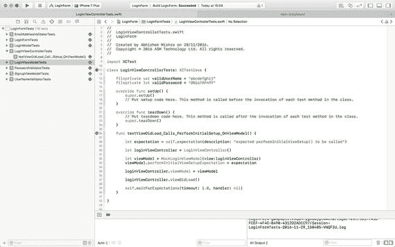

图 5-20.

所有 LoginViewControllerTests 均已通过。

### 从视图控制器调用视图模型的 `userNameDidEndOnExit` 方法

将以下测试用例添加到 `LoginViewControllerTests.swift` 文件中：

```
func testUserNameDidEndOnExit_Calls_UserNameDidEndOnExit_OnViewModel() {
    let expectation = self.expectation(description: "expected userNameDidEndOnExit() to be called")
    let loginViewController = LoginViewController()
    let viewModel = MockLoginViewModel(view:loginViewController)
    viewModel.userNameDidEndOnExitExpectation = expectation
    loginViewController.viewModel = viewModel
    loginViewController.userNameDidEndOnExit(self)
    self.waitForExpectations(timeout: 1.0, handler: nil)
}
```

此测试用例的目标是确保视图控制器的 `userNameDidEndOnExit` 方法调用了视图模型的 `userNameDidEndOnExit()` 方法。

更新 `LoginViewController` 类的 `userNameDidEndOnExit` 方法的实现，使其与以下代码一致：

```
@IBAction func userNameDidEndOnExit(_ sender: Any) {
    viewModel?.userNameDidEndOnExit()
}
```

保存文件，并使用 `Product ➤ Test` 菜单项运行所有单元测试。你将看到刚刚创建的单元测试已通过。

### 从视图控制器调用视图模型的 `passwordDidEndOnExit` 方法

将以下测试用例添加到 `LoginViewControllerTests.swift` 文件中：

```
func testPasswordDidEndOnExit_Calls_PasswordDidEndOnExit_OnViewModel() {
    let expectation = self.expectation(description: "expected passwordDidEndOnExit() to be called")
    let loginViewController = LoginViewController()
    let viewModel = MockLoginViewModel(view:loginViewController)
    viewModel.passwordDidEndOnExitExpectation = expectation
    loginViewController.viewModel = viewModel
    loginViewController.passwordDidEndOnExit(self)
    self.waitForExpectations(timeout: 1.0, handler: nil)
}
```

此测试用例的目标是确保视图控制器的 `passwordDidEndOnExit` 方法调用了视图模型的 `passwordDidEndOnExit()` 方法。

更新 `LoginViewController` 类的 `passwordDidEndOnExit` 方法的实现，使其与以下代码一致：

```
@IBAction func passwordDidEndOnExit(_ sender: Any) {
    viewModel?.passwordDidEndOnExit()
}
```

保存文件，并使用 `Product ➤ Test` 菜单项运行所有单元测试。你将看到刚刚创建的单元测试已通过。


### 从视图控制器调用视图模型的登录方法

将以下测试用例添加到 `LoginViewControllerTests.swift` 文件中：

```
func testLogin_ValidUserNameAndPassword_Calls_Login_OnViewModel_WithExpectedUserName() {
    let expectation = self.expectation(description: "expected login() to be called")
    let userNameTextFieldStub = UITextFieldStub(text:validUserName)
    let passwordTextFieldStub = UITextFieldStub(text:"")
    let loginViewController = LoginViewController()
    loginViewController.userNameTextField = userNameTextFieldStub
    loginViewController.passwordTextField = passwordTextFieldStub
    let viewModel = MockLoginViewModel(view:loginViewController)
    viewModel.loginExpectation = (expectation, expectedUserName:validUserName, expectedPassword:"")
    loginViewController.viewModel = viewModel
    loginViewController.login(self)
    self.waitForExpectations(timeout: 1.0, handler: nil)
}
func testLogin_ValidUserNameAndPassword_Calls_Login_OnViewModel_WithExpectedPassword() {
    let expectation = self.expectation(description: "expected login() to be called")
    let userNameTextFieldStub = UITextFieldStub(text:"")
    let passwordTextFieldStub = UITextFieldStub(text:validPassword)
    let loginViewController = LoginViewController()
    loginViewController.userNameTextField = userNameTextFieldStub
    loginViewController.passwordTextField = passwordTextFieldStub
    let viewModel = MockLoginViewModel(view:loginViewController)
    viewModel.loginExpectation = (expectation, expectedUserName:"", expectedPassword:validPassword)
    loginViewController.viewModel = viewModel
    loginViewController.login(self)
    self.waitForExpectations(timeout: 1.0, handler: nil)
}
```

这些测试用例的目的是确保视图控制器的登录操作调用了视图模型的 `login()` 方法。视图模型的 `login()` 方法需要用户名和密码，这两者均从视图中的 `UITextField` 实例读取。

由于这些值是从通过故事板创建的文本字段中读取的，因此你需要创建桩文本字段，并手动设置相应输出口的值。

在上述每个测试用例中，都创建了文本字段的桩对象，并将其应用于视图控制器的输出口，使用的代码与以下代码片段类似：

```
let userNameTextFieldStub = UITextFieldStub(text:"")
let passwordTextFieldStub = UITextFieldStub(text:validPassword)
let loginViewController = LoginViewController()
loginViewController.userNameTextField = userNameTextFieldStub
loginViewController.passwordTextField = passwordTextFieldStub
```

在 `LoginFormTests` 组下创建一个名为 `Stubs` 的新组，并在 `Stubs` 组下创建一个名为 `UITextFieldStub` 的新 Swift 类。确保 `UITextFieldStub.swift` 文件仅属于 `LoginFormTests` 目标。

将 `UITextFieldStub.swift` 中的代码更新为以下内容：

```
import UIKit
class UITextFieldStub : UITextField {
    init(text:String) {
        super.init(frame: CGRect.zero)
        super.text = text
    }
    required init?(coder aDecoder: NSCoder) {
        super.init(coder: aDecoder)
    }
}
```

向 `LoginViewControllerTests` 类中添加以下变量声明：

```
fileprivate var validUserName = "abcdefghij"
fileprivate let validPassword = "D%io7AFn9Y"
```

将 `LoginViewController` 类的 `login` 操作方法实现更新为：

```
@IBAction func login(_ sender: Any) {
    viewModel?.login(userName: userNameTextField.text, password: passwordTextField.text)
}
```

保存文件，并使用 **Product ➤ Test** 菜单项运行所有单元测试。你将看到刚刚创建的单元测试已通过。

### 从视图控制器调用视图模型的 `userNameUpdated` 和 `passwordUpdated` 方法

将以下测试用例添加到 `LoginViewControllerTests.swift` 文件中：

```
func testTextFieldShouldChangeCharacters_userNameTextField_Calls_UserNameUpdated_OnViewModel_WithExpectedUsername() {
    let expectation = self.expectation(description: "expected userNameUpdated() to be called")
    let userNameTextFieldStub = UITextFieldStub(text:validUserName)
    let passwordTextFieldStub = UITextFieldStub(text:validPassword)
    let loginViewController = LoginViewController()
    loginViewController.userNameTextField = userNameTextFieldStub
    loginViewController.passwordTextField = passwordTextFieldStub
    let viewModel = MockLoginViewModel(view:loginViewController)
    viewModel.userNameUpdatedExpectation = (expectation, expectedValue:validUserName)
    loginViewController.viewModel = viewModel
    let _ = loginViewController.textField(userNameTextFieldStub,
        shouldChangeCharactersIn: NSMakeRange(0, 1),
        replacementString: "A")
    self.waitForExpectations(timeout: 1.0, handler: nil)
}
func testTextFieldShouldChangeCharacters_passwordTextField_Calls_PasswordUpdated_OnViewModel_WithExpectedUsername() {
    let expectation = self.expectation(description: "expected passwordUpdated() to be called")
    let userNameTextFieldStub = UITextFieldStub(text:validUserName)
    let passwordTextFieldStub = UITextFieldStub(text:validPassword)
    let loginViewController = LoginViewController()
    loginViewController.userNameTextField = userNameTextFieldStub
    loginViewController.passwordTextField = passwordTextFieldStub
    let viewModel = MockLoginViewModel(view:loginViewController)
    viewModel.passwordUpdatedExpectation = (expectation, expectedValue:validPassword)
    loginViewController.viewModel = viewModel
    let _ = loginViewController.textField(passwordTextFieldStub,
        shouldChangeCharactersIn: NSMakeRange(0, 1),
        replacementString: "A")
    self.waitForExpectations(timeout: 1.0, handler: nil)
}
```

这些测试用例的目的是确保视图控制器的 `textField(shouldChangeCharactersIn, replacementString)` 方法调用了视图模型的 `userNameUpdated()` 或 `passwordUpdated()` 方法。

将 `LoginViewController` 类的 `textField(shouldChangeCharactersIn, replacementString)` 方法的实现更新为：

```
extension LoginViewController: UITextFieldDelegate {
    func textField(_ textField: UITextField,
        shouldChangeCharactersIn range: NSRange,
        replacementString string: String) -> Bool {
        if textField == self.userNameTextField {
            self.viewModel?.userNameUpdated(textField.text)
        }
        if textField == self.passwordTextField {
            self.viewModel?.passwordUpdated(textField.text)
        }
        return true
    }
}
```

保存文件，并使用 **Product ➤ Test** 菜单项运行所有单元测试。你将看到刚刚创建的单元测试已通过。


### 将注册视图控制器类绑定到视图模型

表 5-8 列出了 `SignupViewController` 类中的方法及其对应的视图模型绑定关系。

**表 5-8.** 注册视图控制器与视图模型绑定

| 注册视图控制器方法 | 注册视图模型方法 |
| --- | --- |
| `func viewDidLoad()` | `func performInitialViewSetup()` |
| `@IBAction func login(_ sender: Any)` | `func login(userName:String?,password:String?)` |
| `@IBAction func userNameDidEndOnExit(_ sender: Any)` | `func userNameDidEndOnExit()` |
| `@IBAction func passwordDidEndOnExit(_ sender: Any)` | `func passwordDidEndOnExit()` |
| `func textField(_ textField: UITextField, shouldChangeCharactersIn range: NSRange, replacementString string: String) -> Bool` | `func userNameUpdated(_ value:String?)` 和 `func passwordUpdated(_ value:String?)` |

完整的 `SignupViewController` 类如代码清单 5-15 所示。如果您想查看测试代码，可以通过以下 URL 从 GitHub 匿名下载完成的项目：

[`https://github.com/asmtechnology/Lesson05.iOSTesting.2017.Apress.git`](https://github.com/asmtechnology/Lesson05.iOSTesting.2017.Apress.git)

```
import UIKit
class SignupViewController: UIViewController {
@IBOutlet weak var userNameTextField: UITextField!
@IBOutlet weak var passwordTextField: UITextField!
@IBOutlet weak var confirmPasswordTextField: UITextField!
@IBOutlet weak var emailAddressTextField: UITextField!
@IBOutlet weak var createButton: UIButton!
@IBOutlet weak var cancelButton: UIButton!
var viewModel:SignupViewModel?
override func viewDidLoad() {
super.viewDidLoad()
if self.viewModel == nil {
self.viewModel = SignupViewModel(view: self)
}
self.viewModel?.performInitialViewSetup()
}
override func didReceiveMemoryWarning() {
super.didReceiveMemoryWarning()
// Dispose of any resources that can be recreated.
}
@IBAction func create(_ sender: Any) {
viewModel?.signup(userName: userNameTextField.text, password: passwordTextField.text, emailAddress: emailAddressTextField.text)
}
@IBAction func cancel(_ sender: Any) {
self.dismiss(animated: true, completion: nil)
}
@IBAction func userNameDidEndOnExit(_ sender: Any) {
viewModel?.userNameDidEndOnExit()
}
@IBAction func passwordDidEndOnExit(_ sender: Any) {
viewModel?.passwordDidEndOnExit()
}
@IBAction func confirmPasswordDidEndOnExit(_ sender: Any) {
viewModel?.confirmPasswordDidEndOnExit()
}
@IBAction func emailAddressDidEndOnExit(_ sender: Any) {
viewModel?.emailAddressDidEndOnExit()
}
}
extension SignupViewController: UITextFieldDelegate {
func textField(_ textField: UITextField,
shouldChangeCharactersIn range: NSRange,
replacementString string: String) -> Bool {
if textField == self.userNameTextField {
self.viewModel?.userNameUpdated(textField.text)
}
if textField == self.passwordTextField {
self.viewModel?.passwordUpdated(textField.text)
}
if textField == self.confirmPasswordTextField {
self.viewModel?.confirmPasswordUpdated(textField.text)
}
if textField == self.emailAddressTextField {
self.viewModel?.emailAddressUpdated(textField.text)
}
return true
}
}
extension SignupViewController : SignupViewControllerProtocol {
func clearUserNameField() {
self.userNameTextField.text = ""
}
func clearPasswordField() {
self.passwordTextField.text = ""
}
func clearConfirmPasswordField() {
self.confirmPasswordTextField.text = ""
}
func enableCancelButton(_ status:Bool) {
self.cancelButton.isEnabled = status
}
func enableCreateButton(_ status:Bool) {
self.createButton.isEnabled = status
}
func hideKeyboard() {
self.userNameTextField.resignFirstResponder()
self.passwordTextField.resignFirstResponder()
self.confirmPasswordTextField.resignFirstResponder()
}
}
```
**代码清单 5-15.** `SignupViewController.swift`

### 从登录视图控制器过渡到注册视图控制器

此项目中的最后一项任务是，在登录界面点击**创建账户**按钮时，从登录视图控制器过渡到注册视图控制器。

在本章前面部分，你已在相应的故事板场景之间创建了一个名为 `"presentCreateAccount"` 的转场。

请更新 `LoginViewController` 中 `createAccount()` 操作方法的具体实现，使其与以下代码片段一致。

```
@IBAction func createAccount(_ sender: Any) {
self.performSegue(withIdentifier: "presentCreateAccount", sender: self)
}
```

你可能已经注意到，我没有为这个过渡创建任何单元测试。UI 过渡更适合使用 UI 测试进行验证。UI 测试将在第 13 章中介绍。

## 本章小结

在本章中，你学习了如何使用 TDD 技术和 MVVM 模式创建视图控制器。你首先创建了用户界面和模型层对象，然后为登录和注册界面构建了视图模型，最后将视图控制器连接到了视图模型。

