# 6. 对集合视图控制器应用 TDD

本章将探讨如何使用 TDD 技术构建基于集合视图控制器的 iOS 应用。该应用将包含一个显示图片列表的单一视图控制器，并采用 MVVM 应用架构进行构建。图 6-1 展示了完成后的应用程序用户界面。

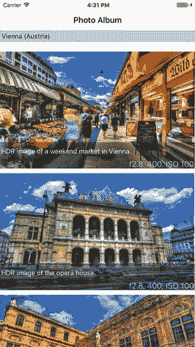

**图 6-1.** PhotoBook 应用

该应用的完整源代码可通过以下 URL 从 GitHub 匿名下载：

[`https://github.com/asmtechnology/Lesson06.iOSTesting.2017.Apress.git`](https://github.com/asmtechnology/Lesson06.iOSTesting.2017.Apress.git)

## 应用架构

应用架构由三个不同的层级组成（见图 6-2）。

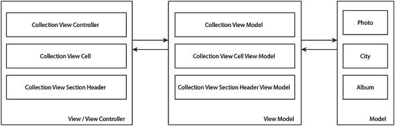

**图 6-2.** PhotoBook 应用架构

以下是对各层级及其组件类的简要说明：

* **模型层：** 包含 `Photo`、`City` 和 `Album` 类，用于存储将展示给用户的数据。`Album` 是顶层对象，包含多个城市，每个城市又包含在该城市拍摄的一张或多张照片。
* **视图模型层：** 包含 `CollectionViewModel`、`CollectionViewCellViewModel` 和 `CollectionViewSectionHeaderViewModel` 类。
* **视图/视图控制器层：** 该层包含项目的用户界面，由 `CollectionViewController`、`CollectionViewCell` 和 `CollectionViewSectionHeader` 类组成。

## 创建 Xcode 项目

启动 Xcode，基于**单视图应用**模板创建一个新的 iOS 项目。创建新项目时请使用以下选项（见图 6-3）：

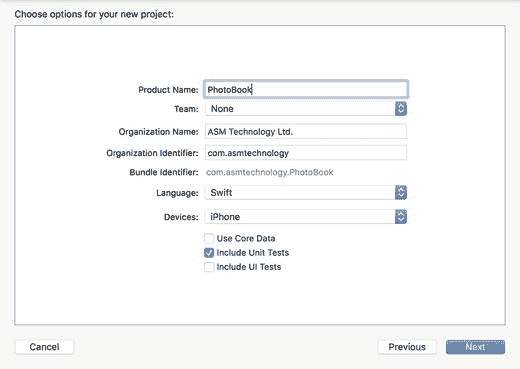

**图 6-3.** Xcode 项目选项对话框

* **产品名称：** `PhotoBook`
* **团队：** `无`
* **组织名称：** 提供一个合适的名称
* **组织标识符：** 提供一个合适的标识符
* **语言：** `Swift`
* **设备：** `iPhone`
* **使用 Core Data：** `取消勾选`
* **包含单元测试：** `勾选`
* **包含 UI 测试：** `取消勾选`

> **注意：** 本章创建的项目不包含用户界面 (UI) 测试。如有需要，你可以在后续步骤中向项目添加 UI 测试。第 13 章涵盖了用户界面测试的主题。

将项目保存到计算机上的合适位置，然后点击**创建**。由于该项目将包含多个新类，建议将类文件放置在项目导航器中相应的组目录下。

在 Xcode 项目导航器中创建以下组：

* `View`
* `Model`
* `ViewModel`
* `Protocols`


## 向项目添加资源

从项目导航器中删除 `Assets.xcassets` 文件夹。当 Xcode 提示时，确保选择**移至废纸篓**选项。

将本课程下载内容中提供的 `Albums.plist` 和 `Assets.xcassets` 文件夹添加到项目中。在添加这些新项目时，确保在导入对话框中勾选了**如果需要则复制项目**选项（见图 6-4）。

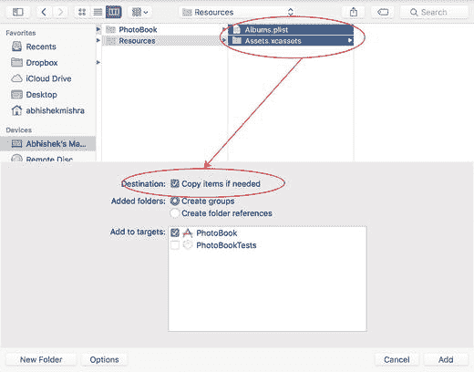

**图 6-4.** Xcode 文件导入对话框

您导入的资源包包含了按六个城市分类的照片，每个城市由资源包内的一个子文件夹表示（见图 6-5）。

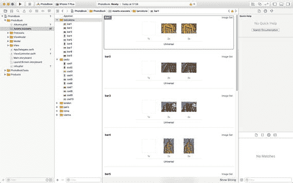

**图 6-5.** PhotoBook 资源包

您可能还注意到资源未提供 1X 图片。这是因为此应用仅针对 iPhone 构建，且非 Retina 屏的 iPhone 不支持最新的 iOS 版本。

## 构建用户界面层

此应用程序的用户界面由一个嵌入在导航控制器中的故事板场景组成（见图 6-6）。

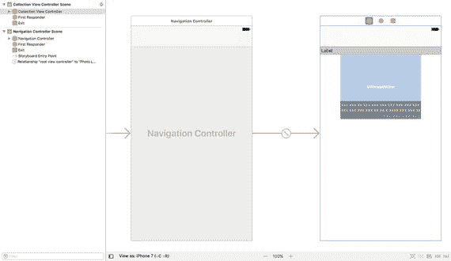

**图 6-6.** 应用故事板

### 创建新类

从项目导航器中删除 `ViewController.swift` 文件，并在 **View** 组下创建以下 Swift 类：

- 一个名为 `CollectionViewController` 的 `UICollectionViewController` 子类。
- 一个名为 `CollectionViewCell` 的 `UICollectionViewCell` 子类。
- 一个名为 `CollectionViewSectionHeader` 的 `UICollectionReusableView` 子类。

确保这些类同时包含在 `PhotoBook` 和 `PhotoBookTests` 目标中。项目导航器应类似于图 6-7。

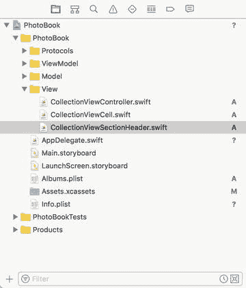

**图 6-7.** PhotoBook 项目的 Xcode 项目导航器

### 构建集合视图控制器场景

打开 `Main.storyboard` 文件，并删除故事板中的默认场景。从对象库中拖放一个**集合视图控制器**到故事板场景中（见图 6-8）。

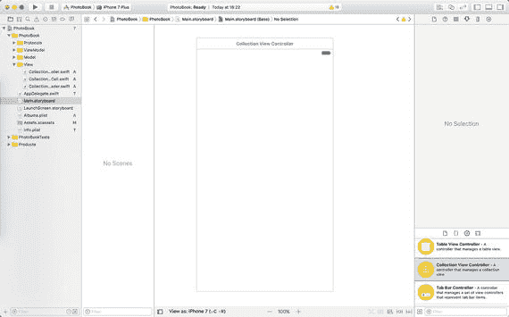

**图 6-8.** 包含集合视图控制器的故事板场景

选中集合视图控制器场景后，使用**身份检查器**将与该场景关联的类更改为 `CollectionViewController`（见图 6-9）。

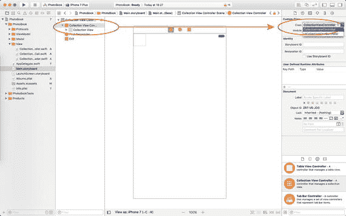

**图 6-9.** 应用于故事板场景的自定义类

选中集合视图控制器场景后，切换到**属性检查器**并勾选**是初始视图控制器**选项（见图 6-10）。

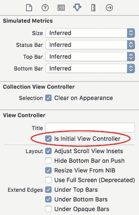

**图 6-10.** Xcode 属性检查器

### 添加分区头部辅助视图

选择集合视图控制器场景中的集合视图，并使用**属性检查器**启用**分区头部**辅助视图（见图 6-11）。

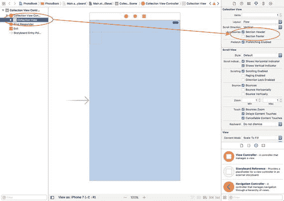

**图 6-11.** 通过属性检查器启用分区头部辅助视图

选中集合视图后，切换到**尺寸检查器**并将单元格大小更改为宽度 = 250，高度 = 200。将头部的高度更改为 25（见图 6-12）。

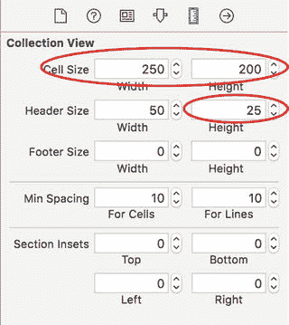

**图 6-12.** Xcode 尺寸检查器

选择集合视图头部辅助视图（在文档大纲中标识为**集合可复用视图**），并使用**身份检查器**将与头部辅助视图关联的类更改为 `CollectionViewSectionHeader`（见图 6-13）。

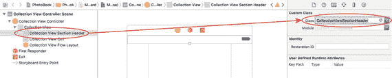

**图 6-13.** 头部辅助视图的自定义类设置

使用**属性检查器**将头部辅助视图的背景颜色更改为灰色调，并将**标识符**属性的值更改为 `CollectionViewSectionHeader`。

从对象库中拖放一个标签到头部辅助视图上，并将其定位为类似图 6-14 所示。为标签使用适当的约束，以在不同屏幕尺寸上保持此位置。将标签中文本的字体大小设置为 14 磅。见图 6-14。

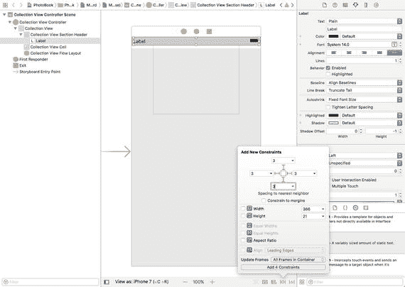

**图 6-14.** 头部辅助视图上的约束

使用**助理编辑器**在 `CollectionViewSectionHeader.swift` 文件中为标签创建一个插座。将此插座命名为 `title`。`CollectionViewSectionHeader.swift` 中的代码应类似于代码清单 6-1。

```
import UIKit
class CollectionViewSectionHeader: UICollectionReusableView {
    @IBOutlet weak var title: UILabel!
}
```

**代码清单 6-1.** `CollectionViewSectionHeader.swift`


### 构建集合视图单元格

返回故事板，选中集合视图单元格，然后使用身份检查器将集合视图单元格关联的类修改为 `CollectionViewCell`。切换到属性检查器，将标识属性的值更改为 `CollectionViewCell`。

使用对象库，将一个图片视图拖放到空的集合视图单元格上。使用属性检查器将图片视图的内容模式设置为“Aspect Fill”。定位图片视图并设置合适的布局约束，使其与图 6-15 相似。

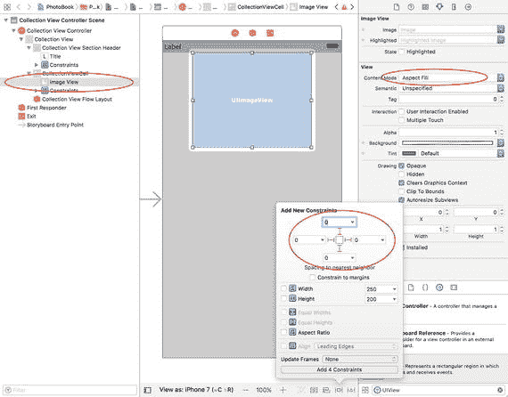

图 6-15. 向集合视图单元格添加图片视图

使用对象库，将一个空的视图拖放到集合视图单元格中，位于图片视图的上方。使用属性检查器将该视图的背景色设置为黑色，不透明度为 40%。定位新视图并设置合适的布局约束，使其与图 6-16 相似。

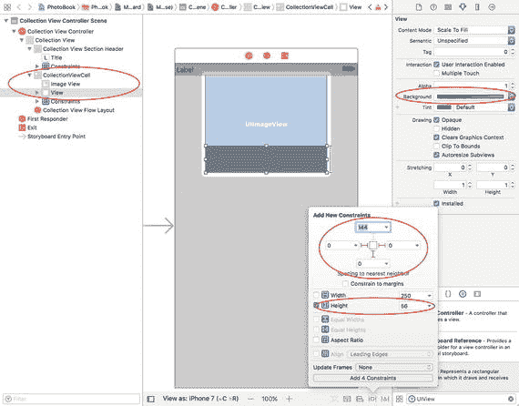

图 6-16. 向集合视图单元格添加半透明视图

从对象库中拖放两个标签到您刚创建的视图上。确保这两个标签被该视图包含，并将标签上下放置（见图 6-17）。

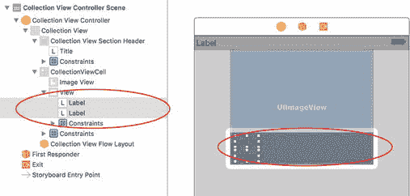

图 6-17. 向集合视图单元格添加标签

使用属性检查器，为上方的标签应用以下属性：

- 前景色：白色
- 字号：14 点
- 行数：2

使用“Pin constraints”按钮，为上方的标签应用以下约束：

- 左边距：2
- 上边距：2
- 下边距：2
- 右边距：2
- 约束到边距：取消勾选
- 更新帧：无

使用属性检查器，为下方的标签应用以下属性：

- 前景色：蓝色
- 字号：17 点
- 行数：1
- 文本对齐：右对齐

使用“Pin constraints”按钮，为下方的标签应用以下约束：

- 左边距：2
- 下边距：2
- 右边距：2
- 高度：15
- 约束到边距：取消勾选
- 更新帧：容器内的所有帧

故事板现在应类似于图 6-18。

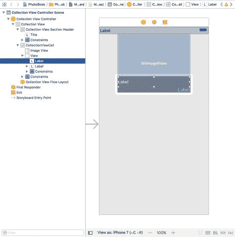

图 6-18. 添加约束后的故事板场景

使用助理编辑器，在 `CollectionViewCell.swift` 文件中为图片视图和标签创建插座变量，如表 6-1 所示。

表 6-1. 集合视图单元格的插座变量

| 用户界面对象 | 插座变量名称 |
|-----------------------|-------------|
| 图片视图 | `imageView` |
| 上方标签 | `captionLabel` |
| 下方标签 | `shotDetailsLabel` |

`CollectionViewCell.swift` 中的代码应如代码清单 6-2 所示。

```swift
import UIKit

class CollectionViewCell: UICollectionViewCell {
    @IBOutlet weak var imageView: UIImageView!
    @IBOutlet weak var captionLabel: UILabel!
    @IBOutlet weak var shotDetailsLabel: UILabel!
}
```

代码清单 6-2. `CollectionViewCell.swift`

选中故事板的集合视图控制器场景，通过菜单项“编辑器 ➤ 嵌入 ➤ 导航控制器”将其嵌入到一个导航控制器中。最终的故事板应类似于图 6-19。

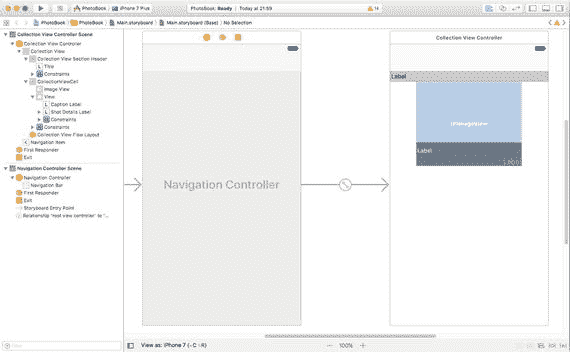

图 6-19. 嵌入在导航控制器内的集合视图控制器场景

## 构建模型层

我们需要构建三个模型类：`Photo`、`City` 和 `Album`。这些类之间的关系如图 6-20 所示。`Album` 对象是顶层模型对象。一个 `Album` 对象包含一个 `City` 对象数组，每个 `City` 对象又包含一个 `Photo` 对象数组。`Photo` 对象存储单个照片的元数据，以及项目中可以从资源目录加载实际图片的资源名称。

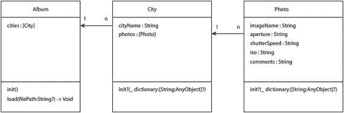

图 6-20. 模型层类

### Photo 类

`Photo` 类包含存储单个照片信息的属性。表 6-2 列出了 `Photo` 类预期的属性和方法。

表 6-2. Photo 属性和方法

| 项目 | 类型 | 描述 |
|------|------|-------------|
| `var imageName:String?` | 变量 | 项目资源目录中包含该图片的资源名称。 |
| `var aperture:String?` | 变量 | 摄影师使用的光圈设置。 |
| `var shutterSpeed:String?` | 变量 | 摄影师使用的快门速度设置。 |
| `var iso:String?` | 变量 | 摄影师使用的 ISO 设置。 |
| `var comments:String?` | 变量 | 摄影师的评论。 |
| `init?(_ dictionary:[String : AnyObject]?)` | 方法 | 允许其他代码创建 `Photo` 实例。需要一个包含特定必填键的字典作为输入。 |

`init` 方法需要一个包含以下所有必填键的字典作为输入：

- `imageName`
- `aperture`
- `shutterSpeed`
- `iso`
- `comment`

开发 `Photo` 类的方法将与第 4 章中开发的模型层类非常相似。测试将围绕 `init` 方法的行为以及它如何处理字典中缺失键的情况。

完整的 `Photo` 类如代码清单 6-3 所示。如果您想查看测试代码，可以通过以下 URL 从 github 匿名下载已完成的项目：

[`https://github.com/asmtechnology/Lesson06.iOSTesting.2017.Apress.git`](https://github.com/asmtechnology/Lesson06.iOSTesting.2017.Apress.git)

```swift
import Foundation

class Photo: NSObject {
    var imageName:String?
    var aperture:String?
    var shutterSpeed:String?
    var iso:String?
    var comments:String?

    let imageNameKey = "imageName"
    let apertureKey = "aperture"
    let shutterSpeedKey = "shutterSpeed"
    let isoKey = "iso"
    let commentKey = "comment"

    init?(_ dictionary:[String : AnyObject]?) {
        guard let dictionary = dictionary,
            let imageName = dictionary[imageNameKey] as? String,
            let aperture = dictionary[apertureKey] as? String,
            let shutterSpeed = dictionary[shutterSpeedKey] as? String,
            let iso = dictionary[isoKey] as? String,
            let comments = dictionary[commentKey]  as? String else {
                return nil
        }
        super.init()
        self.imageName = imageName
        self.aperture = aperture
        self.shutterSpeed = shutterSpeed
        self.iso = iso
        self.comments = comments
    }
}
```

代码清单 6-3. `Photo.swift`


### `City` 类

`City` 类包含用于存储城市信息以及在该城市拍摄的照片的属性。表 6-3 列出了 `City` 类应具备的属性和方法。

**表 6-3.** City 类的属性和方法

| 项目 | 类型 | 描述 |
| --- | --- | --- |
| `var cityName:String?` | 变量 | 城市名称。此字段不进行任何验证。 |
| `var photos:[Photo]?` | 变量 | `Photo` 对象的数组。每张照片均拍摄于同一城市。 |
| `init?(_ dictionary:[String : AnyObject]?)` | 方法 | 允许其他代码创建 `City` 实例。需要包含某些必需键的字典作为输入。 |

`init` 方法需要一个包含以下所有必需键的字典：

- `city`
- `photos`

完整的 `City` 类如代码清单 6-4 所示。如果您想查看测试代码，可通过以下 URL 从 GitHub 匿名下载已完成的项目：

[`https://github.com/asmtechnology/Lesson06.iOSTesting.2017.Apress.git`](https://github.com/asmtechnology/Lesson06.iOSTesting.2017.Apress.git)

```
import Foundation
class City: NSObject {
var cityName:String?
var photos:[Photo]?
let cityKey = "city"
let photosKey = "photos"
init?(_ dictionary:[String:AnyObject]?) {
guard let dictionary = dictionary,
let cityName = dictionary[cityKey] as? String,
let array = dictionary[photosKey] as? [AnyObject] else {
return nil
}
super.init()
self.cityName = cityName
self.photos = [Photo]()
for item in array {
guard let dictionary = item as? [String : AnyObject] else {
continue
}
if let photo = Photo(dictionary) {
photos?.append(photo)
}
}
}
}
```

**代码清单 6-4.** `City.swift`

### `Album` 类

`Album` 类包含用于存储城市实例集合信息的属性。该专辑是本项目的顶层模型对象。表 6-4 列出了 `Album` 类应具备的属性和方法。

**表 6-4.** Album 类的属性和方法

| 项目 | 类型 | 描述 |
| --- | --- | --- |
| `var cities:[City]?` | 变量 | `City` 对象的数组。 |
| `init()` | 方法 | 允许其他代码创建 `Album` 实例。 |
| `func load(filePath:String?) -> Void` | 方法 | 用于加载 plist 文件并递归创建模型层对象。 |

提供 `load` 方法是为了让您的应用能够加载 `Albums.plist` 文件，并根据 plist 文件的内容创建 `City` 对象。

完整的 `Album` 类如代码清单 6-5 所示。如果您想查看测试代码，可通过以下 URL 从 GitHub 匿名下载已完成的项目：

[`https://github.com/asmtechnology/Lesson06.iOSTesting.2017.Apress.git`](https://github.com/asmtechnology/Lesson06.iOSTesting.2017.Apress.git)

```
import Foundation
class Album: NSObject {
var cities:[City]?
override init() {
super.init()
if cities == nil {
cities = [City]()
}
}
func load(filePath:String?) -> Void {
guard let filePath = filePath,
let array = NSArray(contentsOfFile: filePath) as? [AnyObject] else {
return
}
for item in array {
guard let dictionary = item as? [String : AnyObject] else {
continue
}
if let city = City(dictionary) {
cities?.append(city)
}
}
}
}
```

**代码清单 6-5.** `Album.swift`

## 构建 ViewModel 层

我们需要构建三个视图模型类：

- `CollectionViewModel`，
- `CollectionViewCellViewModel`，以及
- `CollectionViewSectionHeaderViewModel`。

它们分别对应于 `CollectionViewController`、`CollectionViewCell` 和 `CollectionViewSectionHeader` 类。

这些视图模型将使用协议来建立接口，以便它们能够与各自的视图控制器进行通信。

### `CollectionViewModel` 类

`CollectionViewModel` 类代表 `CollectionViewController` 类与 `Album` 模型对象之间的视图模型。

在项目浏览器中的 `PhotoBookTests` 组下，创建一个名为 `CollectionViewModelTests` 的新 iOS 单元测试用例类。确保这个新文件仅属于 `PhotoBookTests` 目标。

从 `CollectionViewModelTests.swift` 中删除 `testExample` 和 `testPerformanceExample` 方法。创建一个名为 `testInit_ValidView_InstantiatesObject()` 的新单元测试方法，放在单独的扩展中，并将以下代码添加到方法体中：

```
func testInit_ValidView_InstantiatesObject() {
let viewModel = CollectionViewModel(view:mockCollectionViewController!)
XCTAssertNotNil(viewModel)
}
```

在 `CollectionViewModelTests` 类的顶部添加以下变量声明：

```
fileprivate var mockCollectionViewController:MockCollectionViewController?
```

您会注意到此代码无法编译，这是因为 `CollectionViewModel` 类尚未创建。要解决此问题，请在项目导航器的 `ViewModel` 组下创建一个名为 `CollectionViewModel` 的新类。在文件位置对话框中，确保同时勾选了 `PhotoBook` 和 `PhotoBookTests` 目标（参见图 6-21）。

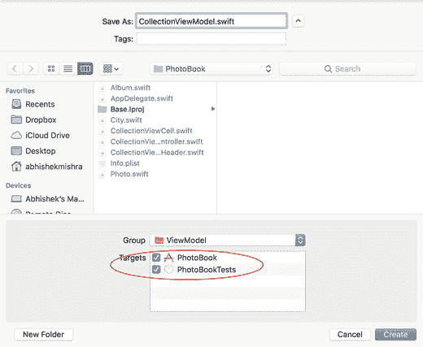

**图 6-21.** `CollectionViewModel.swift` 的目标成员

将 `CollectionViewModel.swift` 文件的内容更新为以下代码片段：

```
import Foundation
class CollectionViewModel : NSObject {
init(view:CollectionViewControllerProtocol) {
super.init()
}
}
```

`CollectionViewModel` 类的初始化方法接受一个视图的引用。请注意，视图参数的类型是 `CollectionViewControllerProtocol`，而不是 `CollectionViewController`。

视图模型使用协议与视图建立松散耦合的关系。对于视图模型而言，任何实现了 `CollectionViewControllerProtocol` 协议的类都可以用作视图。这种与视图的松散耦合使得视图模型易于在单元测试中实例化，而无需依赖视图控制器。

在项目浏览器的 `Protocols` 组下创建一个名为 `CollectionViewControllerProtocol` 的新 Swift 文件，并确保该新文件同时是 `PhotoBook` 和 `PhotoBookTests` 目标的成员。将 `CollectionViewControllerProtocol.swift` 中的代码更新为如下所示：

```
import Foundation
protocol CollectionViewControllerProtocol : class {
}
```

在 `PhotoBookTests` 组下创建一个名为 `Mocks` 的新组，并在 `Mocks` 组下创建一个名为 `MockCollectionViewController` 的新 Swift 类。确保 `MockCollectionViewController.swift` 文件仅属于 `PhotoBookTests` 目标。

将 `MockCollectionViewController.swift` 中的代码更新为如下所示：

```
import UIKit
import XCTest
class MockCollectionViewController : CollectionViewControllerProtocol {
}
```

打开 `CollectionViewModelTests.swift` 文件，并将 `setUp()` 方法更新为如下所示：

```
override func setUp() {
super.setUp()
mockCollectionViewController = MockCollectionViewController()
}
```

更新后的 `setup()` 方法实例化一个 `MockCollectionViewController` 对象，并将对该新实例的引用保存在 `mockCollectionViewController` 私有变量中。`CollectionViewModelTests.swift` 中的代码现在应该类似于代码清单 6-6。


```swift
import XCTest
class CollectionViewModelTests: XCTestCase {
    fileprivate var mockCollectionViewController:MockCollectionViewController?
    override func setUp() {
        super.setUp()
        mockCollectionViewController = MockCollectionViewController()
    }
    override func tearDown() {
        // 在此放置拆卸代码。该方法在类中每个测试方法调用后执行。
        super.tearDown()
    }
}
// MARK: 初始化测试
extension CollectionViewModelTests {
    func testInit_ValidView_InstantiatesObject() {
        let viewModel = CollectionViewModel(view:mockCollectionViewController!)
        XCTAssertNotNil(viewModel)
    }
}
// 代码清单 6-6: CollectionViewModelTests.swift
```

保存文件，然后通过 **Product** ➤ **Test** 菜单项运行所有单元测试。您会发现在 `CollectionViewModelTests.swift` 中添加的单元测试已通过（参见图 6-22）。

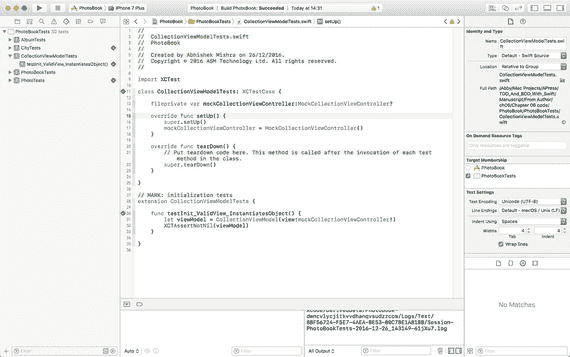

**图 6-22.** CollectionViewModel 测试通过

到目前为止创建的视图模型测试验证了视图模型可以被实例化，为了使此测试通过，您创建了一个视图模型类、一个协议和一个模拟类。

接下来要编写的测试将验证视图模型在实例变量中保存了注入到初始值设定项的视图引用。在前一个测试方法下方创建一个名为 `testInit_ValidView_CopiesViewToIvar()` 的新单元测试方法，并在方法体中添加以下代码：

```swift
func testInit_ValidView_CopiesViewToIvar() {
    let viewModel = CollectionViewModel(view:mockCollectionViewController!)
    if let lhs = mockCollectionViewController, let rhs = viewModel.view as? MockCollectionViewController {
        XCTAssertTrue(lhs === rhs)
    }
}
```

向 `CollectionViewModel` 类添加以下变量声明：

```swift
weak var view:CollectionViewControllerProtocol?
```

在 `CollectionViewModel` 类的 `init()` 方法末尾添加以下行：

```swift
self.view = view
```

保存文件，然后通过 **Product** ➤ **Test** 菜单项运行所有单元测试。您会注意到到目前为止编写的所有测试都继续通过。

接下来要编写的测试将验证视图模型将 `Albums.plist` 文件反序列化为 `Album` 对象，并将此 `Album` 对象的引用存储在实例变量中。在前一个测试方法下方创建一个名为 `testInit_ValidView_AlbumIVarIsNotNil()` 的新单元测试方法，并在方法体中添加以下代码：

```swift
func testInit_ValidView_AlbumIVarIsNotNil() {
    let viewModel = CollectionViewModel(view:mockCollectionViewController!)
    XCTAssertNotNil(viewModel.photoAlbum)
}
```

向 `CollectionViewModel` 类添加以下变量声明：

```swift
var photoAlbum:Album?
```

在 `CollectionViewModel` 类的 `init()` 方法末尾添加以下代码：

```swift
if photoAlbum == nil {
    photoAlbum = Album()
}
let path = Bundle.main.path(forResource: "Albums", ofType: "plist")
photoAlbum?.load(filePath:path)
```

上述代码片段创建了一个 `Album` 对象，并使用 `Albums.plist` 文件的路径调用了该 `Album` 对象的 `load()` 方法。

保存文件，然后通过 **Product** ➤ **Test** 菜单项运行所有单元测试。您会注意到到目前为止编写的所有测试都继续通过。

### 视图模型 – 视图控制器绑定

表 6-5 列出了我们将要添加到 `CollectionViewModel` 类的方法。这些方法中的大部分将由视图控制器的集合视图委托和数据源方法调用。

**表 6-5.** CollectionViewModel 方法

| 项目 | 描述 |
| --- | --- |
| `func performInitialViewSetup()` | 应从集合视图控制器类的 `viewDidLoad()` 方法中调用。将用户界面元素重置为其初始状态。 |
| `func numberOfSections() -> Int` | 从集合视图数据源方法 `numberOfSections(in collectionView: UICollectionView) -> Int` 中调用。返回相册中 `City` 对象的数量。 |
| `func numberOfItemsInSection(_ section: Int) -> Int` | 从集合视图数据源方法 `collectionView(_ collectionView: UICollectionView, numberOfItemsInSection section: Int) -> Int` 中调用。返回给定 `City` 对象中 `Photo` 对象的数量。 |
| `func cellViewModel(indexPath:IndexPath) -> CellViewModelProtocol?` | 从集合视图数据源方法 `collectionView(_ collectionView: UICollectionView, cellForItemAt indexPath: IndexPath) -> UICollectionViewCell` 中调用。返回可供集合视图单元格使用的视图模型。 |
| `func headerViewModel(indexPath:IndexPath) -> HeaderViewModelProtocol?` | 从集合视图数据源方法 `collectionView(_ collectionView: UICollectionView, viewForSupplementaryElementOfKind kind: String, at indexPath: IndexPath) -> UICollectionReusableView` 中调用。返回可供集合视图单元格使用的视图模型。 |

值得注意的是，集合视图单元格和集合视图区段页眉都使用它们自己的视图模型。这两个视图模型都可以通过在 `CollectionViewModel` 对象上调用适当的方法来实例化。

我们尚未讨论集合视图单元格和区段页眉的视图模型。为了首先构建 `CollectionViewModel` 对象，您将创建其他视图模型对象的精简版本。构建完 `CollectionViewModel` 类后，您将在本章后续章节中构建其他视图模型对象。

由于集合视图模型使用协议与集合视图控制器绑定，因此您需要向协议添加方法，以允许视图模型请求视图控制器更新用户界面元素。表 6-6 列出了将添加到 `CollectionViewControllerProtocol` 的方法。

**表 6-6.** CollectionViewControllerProtocol 方法

| 项目 | 描述 |
| --- | --- |
| `func setNavigationTitle(_ title:String) -> Void` | 由视图模型调用。集合视图控制器应为导航控制器设置适当的标题。 |
| `func setSectionInset(top:Float, left:Float, bottom:Float, right:Float) -> Void` | 由视图模型调用。集合视图控制器应为集合视图设置区段内边距。 |
| `func setupCollectionViewCellToUseMaxWidth() -> Void` | 由视图模型调用。集合视图控制器应确保每个单元格占用所有可用的屏幕宽度。 |

您现在将使用 TDD 技术开发 `CollectionViewModel` 类的方法。


### 测试 `performInitialViewSetup` 方法

`performInitialViewSetup()` 方法应执行以下任务：

- 设置导航栏中显示的文本。
- 设置 `UICollectionView` 对象的分区内边距。
- 设置 `UICollectionView` 对象的单元格大小，确保其尽可能宽。

将以下代码片段添加到 `CollectionViewModelTests.swift` 文件底部：

```swift
// MARK: performInitialViewSetup tests
extension CollectionViewModelTests {
    func testPerformInitialViewSetup_Calls_SetNavigationTitle_OnCollectionViewController() {
        let expectation = self.expectation(description: "expected setNavigationTitle() to be called")
        mockCollectionViewController!.expectationForSetNavigationTitle = expectation
        let viewModel = CollectionViewModel(view:mockCollectionViewController!)
        viewModel.performInitialViewSetup()
        self.waitForExpectations(timeout: 1.0, handler: nil)
    }
    func testPerformInitialViewSetup_Calls_SetSectionInset_OnCollectionViewController() {
        let expectation = self.expectation(description: "expected setSectionInset() to be called")
        mockCollectionViewController!.expectationForSetSectionInset = expectation
        let viewModel = CollectionViewModel(view:mockCollectionViewController!)
        viewModel.performInitialViewSetup()
        self.waitForExpectations(timeout: 1.0, handler: nil)
    }
    func testPerformInitialViewSetup_Calls_SetupCollectionViewCellToUseMaxWidth_OnCollectionViewController() {
        let expectation = self.expectation(description: "expected setupCollectionViewCellToUseMaxWidth() to be called")
        mockCollectionViewController!.expectationForSetupCollectionViewCellToUseMaxWidth = expectation
        let viewModel = CollectionViewModel(view:mockCollectionViewController!)
        viewModel.performInitialViewSetup()
        self.waitForExpectations(timeout: 1.0, handler: nil)
    }
}
```

此代码片段新增了三个测试用例，每个用例对应 `performInitialViewSetup()` 必须执行的一项任务。由于三个测试用例均测试同一个方法的不同部分，我将它们分组到了一个类扩展中；不过，你也可以将所有四个测试方法直接添加到类定义中，而非单独的扩展里。

为了让代码能通过编译，你需要对项目进行以下几处修改：

向 `MockCollectionViewController.swift` 文件中添加几个变量声明和方法实现：

```swift
var expectationForSetNavigationTitle:XCTestExpectation?
var expectationForSetSectionInset:XCTestExpectation?
var expectationForSetupCollectionViewCellToUseMaxWidth:XCTestExpectation?
func setNavigationTitle(_ title:String) -> Void {
    expectationForSetNavigationTitle?.fulfill()
}
func setSectionInset(top:Float, left:Float, bottom:Float, right:Float) -> Void {
    expectationForSetSectionInset?.fulfill()
}
func setupCollectionViewCellToUseMaxWidth() -> Void {
    expectationForSetupCollectionViewCellToUseMaxWidth?.fulfill()
}
```

向 `CollectionViewModel.swift` 文件中添加以下方法实现：

```swift
func performInitialViewSetup() {
    view?.setNavigationTitle("Photo Album")
    view?.setSectionInset(top: 20, left: 0, bottom: 0, right: 0)
    view?.setupCollectionViewCellToUseMaxWidth()
}
```

向 `CollectionViewControllerProtocol.swift` 文件中添加以下方法定义：

```swift
func setNavigationTitle(_ title:String) -> Void
func setSectionInset(top:Float, left:Float, bottom:Float, right:Float) -> Void
func setupCollectionViewCellToUseMaxWidth() -> Void
```

在 `CollectionViewController.swift` 文件的类扩展中添加以下方法实现：

```swift
extension CollectionViewController : CollectionViewControllerProtocol {
    func setNavigationTitle(_ title:String) -> Void {
        self.title = title
    }
    func setSectionInset(top:Float, left:Float, bottom:Float, right:Float) -> Void {
        if let collectionView = self.collectionView,
            let collectionViewLayout = collectionView.collectionViewLayout as? UICollectionViewFlowLayout {
            collectionViewLayout.sectionInset = UIEdgeInsetsMake(20, 0, 20, 0)
        }
    }
    func setupCollectionViewCellToUseMaxWidth() -> Void {
        if let collectionView = self.collectionView,
            let collectionViewLayout = collectionView.collectionViewLayout as? UICollectionViewFlowLayout {
            collectionViewLayout.itemSize = CGSize(width: collectionView.bounds.width, height: collectionView.bounds.width * 0.6)
        }
    }
}
```

保存文件，并使用 **Product ➤ Test** 菜单项运行所有单元测试。你将看到在 `LoginViewModelTests.swift` 中添加的单元测试已通过（见图 6-23）。

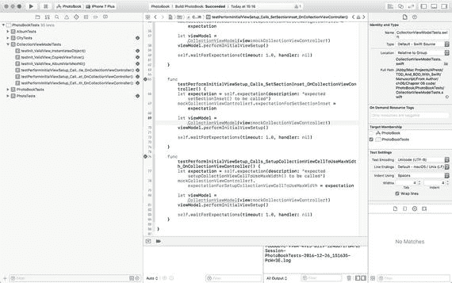

**图 6-23.** LoginViewModel 测试全部通过

### 测试 `numberOfSections` 方法

视图模型的 `numberOfSections()` 方法由集合视图控制器的 `numberOfSections(in collectionView: UICollectionView) -> Int` 方法调用。当此方法被调用时，视图模型会返回相册中 City 对象的数量。

将以下代码片段添加到 `CollectionViewModelTests.swift` 文件底部：

```swift
// MARK: numberOfSections  tests
extension CollectionViewModelTests {
    func testNumberOfSections_ValidViewModelWithAlbum_ReturnsNumberOfCitiesInAlbum() {
        let viewModel = CollectionViewModel(view:mockCollectionViewController!)
        XCTAssertEqual(viewModel.numberOfSections(), viewModel.photoAlbum!.cities!.count)
    }
    func testNumberOfSections_ValidViewModelNilAlbum_ReturnsZero() {
        let viewModel = CollectionViewModel(view:mockCollectionViewController!)
        viewModel.photoAlbum = nil
        XCTAssertEqual(viewModel.numberOfSections(), 0)
    }
}
```

向 `CollectionViewModel.swift` 文件中添加以下方法实现：

```swift
func numberOfSections() -> Int {
    guard let photoAlbum = photoAlbum,
        let cities = photoAlbum.cities else {
        return 0
    }
    return cities.count
}
```

保存文件，并使用 **Product > Test** 菜单项运行所有单元测试。你将看到在 `CollectionViewModelTests.swift` 中添加的单元测试已通过。


### 测试 `numberOfItemsInSection` 方法

视图模型的 `numberOfItemsInSection(_ section: Int)` 方法由集合视图控制器的 `collectionView(_ collectionView: UICollectionView, numberOfItemsInSection section: Int) -> Int` 方法调用。当此方法被调用时，视图模型会返回由 `section` 参数标识的 `City` 对象中 `Photo` 对象的数量。如果 `section` 参数无效，则该方法返回 0。

将以下代码片段添加至 `CollectionViewModelTests.swift` 文件的底部：

```
// MARK: numberOfItemsInSection 测试
extension CollectionViewModelTests {
func testNumberOfItemsInSection_ValidViewModelNilAlbum_ReturnsZero() {
let viewModel = CollectionViewModel(view:mockCollectionViewController!)
viewModel.photoAlbum = nil
XCTAssertEqual(viewModel.numberOfItemsInSection(0), 0)
}
func testNumberOfItemsInSection_ValidViewModelNilCities_ReturnsZero() {
let viewModel = CollectionViewModel(view:mockCollectionViewController!)
viewModel.photoAlbum!.cities = nil
XCTAssertEqual(viewModel.numberOfItemsInSection(0), 0)
}
func testNumberOfItemsInSection_NegtiveSectionIndex_ReturnsZero() {
let viewModel = CollectionViewModel(view:mockCollectionViewController!)
XCTAssertEqual(viewModel.numberOfItemsInSection(-1), 0)
}
func testNumberOfItemsInSection_OutOfBoundsSectionIndex_ReturnsZero() {
let viewModel = CollectionViewModel(view:mockCollectionViewController!)
XCTAssertEqual(viewModel.numberOfItemsInSection(1000), 0)
}
func testNumberOfItemsInSection_ValidSectionIndex_ReturnsExpectedValue() {
let viewModel = CollectionViewModel(view:mockCollectionViewController!)
XCTAssertEqual(viewModel.numberOfItemsInSection(0), viewModel.photoAlbum!.cities![0].photos!.count)
}
}
```

将以下方法实现添加至 `CollectionViewModel.swift` 文件中：

```
func numberOfItemsInSection(_ section: Int) -> Int {
guard let photoAlbum = photoAlbum,
let cities = photoAlbum.cities else {
return 0
}
if ((section = cities.count)) {
return 0
}
guard let photos = cities[section].photos else {
return 0
}
return photos.count
}
```

保存文件，并通过 **Product ➤ Test** 菜单项运行所有单元测试。你将看到在 `CollectionViewModelTests.swift` 中添加的单元测试已通过。

### 测试 `cellViewModel` 方法

视图模型的 `cellViewModel(indexPath:IndexPath)` 方法由集合视图控制器的 `collectionView(_ collectionView: UICollectionView, cellForItemAt indexPath: IndexPath) -> UICollectionViewCell` 方法调用。当此方法被调用时，视图模型会为指定索引路径处的集合视图单元格返回一个视图模型。如果 `indexPath` 参数无效，则该方法返回 nil。

将以下代码片段添加至 `CollectionViewModelTests.swift` 文件的底部：

```
// MARK: cellViewModel 测试
extension CollectionViewModelTests {
func testCellViewModel_ValidViewModelNilAlbum_ReturnsNil() {
let viewModel = CollectionViewModel(view:mockCollectionViewController!)
viewModel.photoAlbum = nil
XCTAssertNil(viewModel.cellViewModel(indexPath:IndexPath(row: 0, section: 0)))
}
func testCellViewModel_ValidViewModelNilCities_ReturnsNil() {
let viewModel = CollectionViewModel(view:mockCollectionViewController!)
viewModel.photoAlbum!.cities = nil
XCTAssertNil(viewModel.cellViewModel(indexPath:IndexPath(row: 0, section: 0)))
}
func testCellViewModel_ValidViewModelNilPhotos_ReturnsNil() {
let viewModel = CollectionViewModel(view:mockCollectionViewController!)
viewModel.photoAlbum!.cities![0].photos = nil
XCTAssertNil(viewModel.cellViewModel(indexPath:IndexPath(row: 0, section: 0)))
}
func testCellViewModel_NegtiveRowIndex_ReturnsNil() {
let viewModel = CollectionViewModel(view:mockCollectionViewController!)
XCTAssertNil(viewModel.cellViewModel(indexPath:IndexPath(row: -1, section: 0)))
}
func testCellViewModel_NegtiveSectionIndex_ReturnsNil() {
let viewModel = CollectionViewModel(view:mockCollectionViewController!)
XCTAssertNil(viewModel.cellViewModel(indexPath:IndexPath(row: 0, section: -1)))
}
func testCellViewModel_OutOfBoundsRowIndex_ReturnsNil() {
let viewModel = CollectionViewModel(view:mockCollectionViewController!)
XCTAssertNil(viewModel.cellViewModel(indexPath:IndexPath(row: 1000, section: 0)))
}
func testCellViewModel_OutOfBoundsSectionIndex_ReturnsNil() {
let viewModel = CollectionViewModel(view:mockCollectionViewController!)
XCTAssertNil(viewModel.cellViewModel(indexPath:IndexPath(row: 0, section: 1000)))
}
func testCellViewModel_ValidSectionIndex_DoesNotReturnNil() {
let viewModel = CollectionViewModel(view:mockCollectionViewController!)
XCTAssertNotNil(viewModel.cellViewModel(indexPath:IndexPath(row: 0, section: 0)))
}
func testCellViewModel_ValidSectionIndex_ReturnsViewModelWithExpectedModelObject() {
let viewModel = CollectionViewModel(view:mockCollectionViewController!)
let rowIndex = 0
let sectionIndex = 0
let cellViewModel = viewModel.cellViewModel(indexPath:IndexPath(row: rowIndex, section: sectionIndex))
let expectedModelObject = viewModel.photoAlbum!.cities![sectionIndex].photos![rowIndex]
XCTAssertEqual(cellViewModel!.photo, expectedModelObject)
}
}
```

将以下方法实现添加至 `CollectionViewModel.swift` 文件中：

```
func cellViewModel(indexPath:IndexPath) -> CellViewModelProtocol? {
guard let photoAlbum = photoAlbum,
let cities = photoAlbum.cities else {
return nil
}
if ((indexPath.section = cities.count)) {
return nil
}
guard let photos = cities[indexPath.section].photos else {
return nil
}
if ((indexPath.row = photos.count)) {
return nil
}
return CollectionViewCellViewModel(model:photos[indexPath.row])
}
```

在项目资源管理器中的 `ViewModel` 组下创建一个名为 `CollectionViewCellViewModel.swift` 的新 Swift 文件，并确保该新文件同时属于 `PhotoBook` 和 `PhotoBookTests` 目标。将 `CollectionViewCellViewModel.swift` 中的代码更新为以下内容：

```
import Foundation
class CollectionViewCellViewModel : NSObject {
weak var photo:Photo?
init?(model:Photo?) {
guard let model = model else {
return nil
}
super.init()
self.photo = model
}
}
```

`CollectionViewCellViewModel` 类将充当集合视图单元格的视图模型。虽然尚未详细讨论这个类，但你需要一个最简实现才能使测试通过编译。

保存文件，并通过 **Product ➤ Test** 菜单项运行所有单元测试。你将看到在 `CollectionViewModelTests.swift` 中添加的单元测试已通过。


### 测试 `headerViewModel` 方法

视图模型的 `headerViewModel(indexPath:IndexPath)` 方法由集合视图控制器的 `collectionView(_ collectionView: UICollectionView, viewForSupplementaryElementOfKind kind: String, at indexPath: IndexPath) -> UICollectionReusableView` 方法调用。当该方法被调用时，视图模型会返回一个针对指定索引路径的集合视图分区头视图模型。如果 `indexPath` 参数无效，该方法返回 `nil`。

将以下代码片段添加到 `CollectionViewModelTests.swift` 文件末尾：

```
// MARK: headerViewModel 测试
extension CollectionViewModelTests {
func testHeaderViewModel_ValidViewModelNilAlbum_ReturnsNil() {
let viewModel = CollectionViewModel(view:mockCollectionViewController!)
viewModel.photoAlbum = nil
XCTAssertNil(viewModel.headerViewModel(indexPath:IndexPath(row: 0, section: 0)))
}
func testHeaderViewModel_ValidViewModelNilCities_ReturnsNil() {
let viewModel = CollectionViewModel(view:mockCollectionViewController!)
viewModel.photoAlbum!.cities = nil
XCTAssertNil(viewModel.headerViewModel(indexPath:IndexPath(row: 0, section: 0)))
}
func testHeaderViewModel_NegtiveSectionIndex_ReturnsNil() {
let viewModel = CollectionViewModel(view:mockCollectionViewController!)
XCTAssertNil(viewModel.headerViewModel(indexPath:IndexPath(row: 0, section: -1)))
}
func testHeaderViewModel_OutOfBoundsSectionIndex_ReturnsNil() {
let viewModel = CollectionViewModel(view:mockCollectionViewController!)
XCTAssertNil(viewModel.headerViewModel(indexPath:IndexPath(row: 0, section: 1000)))
}
func testHeaderViewModel_ValidSectionIndex_DoesNotReturnNil() {
let viewModel = CollectionViewModel(view:mockCollectionViewController!)
XCTAssertNotNil(viewModel.headerViewModel(indexPath:IndexPath(row: 0, section: 0)))
}
func testHeaderViewModel_ValidSectionIndex_ReturnsViewModelWithExpectedSectionTitle() {
let viewModel =  CollectionViewModel(view:mockCollectionViewController!)
let rowIndex = 0
let sectionIndex = 0
let headerViewModel = viewModel.headerViewModel(indexPath:IndexPath(row: rowIndex, section: sectionIndex))
let expectedSectionTitle = viewModel.photoAlbum!.cities![sectionIndex].cityName!
XCTAssertEqual(headerViewModel!.sectionTitle, expectedSectionTitle)
}
}
```

将以下方法实现添加到 `CollectionViewModel.swift` 文件中：

```
func headerViewModel(indexPath:IndexPath) -> CollectionViewSectionHeaderViewModel? {
guard let photoAlbum = photoAlbum,
let cities = photoAlbum.cities else {
return nil
}
if ((indexPath.section = cities.count)) {
return nil
}
return CollectionViewSectionHeaderViewModel(model:cities[indexPath.section].cityName)
}
```

在项目浏览器中的 `ViewModel` 组下创建一个名为 `CollectionViewSectionHeaderViewModel.swift` 的新 Swift 文件，并确保该新文件同时属于 `PhotoBook` 和 `PhotoBookTests` 这两个目标。将 `CollectionViewSectionHeaderViewModel.swift` 中的代码更新为如下所示：

```
import Foundation
class CollectionViewSectionHeaderViewModel : NSObject {
var sectionTitle:String?
init?(model:String?) {
guard let model = model else {
return nil
}
super.init()
self.sectionTitle = model
}
}
```

`CollectionViewSectionHeaderViewModel` 类将作为集合视图分区头的视图模型。虽然目前尚未详细讨论此类，但你需要一个基础实现才能使测试得以编译。

保存文件，并使用 **Product ➤ Test** 菜单项运行所有单元测试。你将看到在 `CollectionViewModelTests.swift` 中添加的单元测试已通过。

## `CollectionViewCellViewModel` 类

`CollectionViewCellViewModel` 类表示集合视图单元格的视图模型。构建 `CollectionViewCellViewModel` 类的过程与 `CollectionViewModel` 类类似。

完整的 `CollectionViewCellViewModel` 类如代码清单 6-7 所示。如果你想检查测试及相关模拟对象的代码，可以通过以下 URL 从 github 匿名下载已完成的项目：

[`https://github.com/asmtechnology/Lesson06.iOSTesting.2017.Apress.git`](https://github.com/asmtechnology/Lesson06.iOSTesting.2017.Apress.git)

```
import Foundation
class CollectionViewCellViewModel : NSObject {
weak var photo:Photo?
var collectionViewCell:CollectionViewCellProtocol?
init?(model:Photo?) {
guard let model = model else {
return nil
}
super.init()
self.photo = model
}
func setView(_ view:CollectionViewCellProtocol) {
self.collectionViewCell = view
}
func setup() {
guard let collectionViewCell = collectionViewCell ,
let photo = photo,
let imageName = photo.imageName,
let aperture = photo.aperture,
let shutterSpeed = photo.shutterSpeed,
let iso = photo.iso,
let comments = photo.comments else {
return
}
collectionViewCell.loadImage(resourceName: imageName)
collectionViewCell.setCaption(captionText: comments)
collectionViewCell.setShotDetails(shotDetailsText: "\(aperture), \(shutterSpeed), ISO \(iso)")
}
}
代码清单 6-7.
CollectionViewCellViewModel.swift
```

值得注意的是，视图模型持有对集合视图单元格的引用，且该引用的类型为 `CollectionViewCellProtocol`。`CollectionViewCell` 协议包含少量方法，允许视图模型更新集合视图单元格的内容。该协议的完整定义如代码清单 6-8 所示。

```
import Foundation
protocol CollectionViewCellProtocol : class {
func loadImage(resourceName:String)
func setCaption(captionText:String)
func setShotDetails(shotDetailsText:String)
}
代码清单 6-8.
CollectionViewCellProtocol.swift
```

## `CollectionViewSectionHeaderViewModel` 类

`CollectionViewSectionHeaderViewModel` 类表示集合视图分区头的视图模型。完整的类如代码清单 6-9 所示。如果你想检查测试及相关模拟对象的代码，可以通过以下 URL 从 github 匿名下载已完成的项目：

[`https://github.com/asmtechnology/Lesson06.iOSTesting.2017.Apress.git`](https://github.com/asmtechnology/Lesson06.iOSTesting.2017.Apress.git)

```
import Foundation
class CollectionViewSectionHeaderViewModel : NSObject {
var sectionTitle:String?
var collectionViewSectionHeader:CollectionViewSectionHeaderProtocol?
init?(model:String?) {
guard let model = model else {
return nil
}
super.init()
self.sectionTitle = model
}
func setView(_ view:CollectionViewSectionHeaderProtocol) {
self.collectionViewSectionHeader = view
}
func setup() {
guard let collectionViewSectionHeader = collectionViewSectionHeader,
let sectionTitle = sectionTitle else {
return
}
collectionViewSectionHeader.setHeaderText(text: sectionTitle)
}
}
代码清单 6-9.
CollectionViewSectionHeaderViewModel.swift
```

值得注意的是，视图模型持有对集合视图分区头的引用，且该引用的类型为 `CollectionViewSectionHeaderProtocol`。`CollectionViewSectionHeaderProtocol` 协议包含一个单一方法，允许视图模型更新分区头中显示的文本。该协议的完整定义如代码清单 6-10 所示。

```
import Foundation
protocol CollectionViewSectionHeaderProtocol : class {
func setHeaderText(text:String)
}
代码清单 6-10.
CollectionViewSectionHeaderProtocol.swift
```


## 将视图层绑定到视图模型

在本章中，我们一直采用测试驱动的方法来构建模型层和视图模型层。视图模型对象利用协议来描述与视图层的接口，而为了测试视图模型对象，我们使用了视图层的模拟对象。

所有测试均已通过，这表明使用模拟视图层对象时，视图模型层和模型层能够按预期工作。现在，我们需要在实际的视图层类上实现这些视图层协议。表 6-7 列出了需要实现的视图层类及其对应的协议。

**表 6-7.** 视图层协议

| 视图层类 | 协议 |
| --- | --- |
| `CollectionViewController` | `CollectionViewControllerProtocol` |
| `CollectionViewCell` | `CollectionViewCellProtocol` |
| `CollectionViewSectionHeader` | `CollectionViewSectionHeaderProtocol` |

在视图层实现这些协议时，我们不会采用测试驱动的方法，因为 UI 测试更适合验证视图层的视觉变化。

在本章的前面部分，你已经在`CollectionViewController`类中实现了`CollectionViewControllerProtocol`定义的方法；因此，本节无需对`CollectionViewController`类做任何修改。

将以下代码添加到`CollectionViewCell`类的末尾，以实现`CollectionViewCellProtocol`协议的方法。

```
extension CollectionViewCell : CollectionViewCellProtocol {
    func loadImage(resourceName:String) {
        imageView.image = UIImage(named: resourceName)
    }
    func setCaption(captionText:String) {
        captionLabel.text = captionText
    }
    func setShotDetails(shotDetailsText:String) {
        shotDetailsLabel.text = shotDetailsText
    }
}
```

将以下代码添加到`CollectionViewSectionHeader`类的末尾，以实现`CollectionViewSectionHeaderProtocol`协议的方法。

```
extension CollectionViewSectionHeader : CollectionViewSectionHeaderProtocol {
    func setHeaderText(text:String) {
        title?.text = text
    }
}
```

现在剩下的工作就是将视图控制器类绑定到它们各自的视图模型；这包括实例化一个视图模型（如果初始化器中未传入视图模型），并调用视图模型上的方法。

采用测试驱动方法将视图控制器类绑定到视图模型的过程已在第 5 章中介绍过。本章剩余部分将列出这些绑定，并展示视图控制器类的最终代码。

### 将集合视图控制器类绑定到视图模型

表 6-8 列出了`CollectionViewController`类中的方法及其对应的视图模型绑定。

**表 6-8.** 集合视图控制器与视图模型绑定

| 集合视图控制器方法 | 集合视图模型方法 |
| --- | --- |
| `func viewDidLoad()` | `func performInitialViewSetup()` |
| `func numberOfSections(in collectionView: UICollectionView) -> Int` | `func numberOfSections() -> Int` |
| `func collectionView(_ collectionView: UICollectionView, numberOfItemsInSection section: Int) -> Int` | `func numberOfItemsInSection(_ section: Int) -> Int` |
| `func collectionView(_ collectionView: UICollectionView, cellForItemAt indexPath: IndexPath) -> UICollectionViewCell` | `func cellViewModel(indexPath:IndexPath) -> CellViewModelProtocol?` |
| `func collectionView(_ collectionView: UICollectionView, viewForSupplementaryElementOfKind kind: String, at indexPath: IndexPath) -> UICollectionReusableView` | `func headerViewModel(indexPath:IndexPath) -> HeaderViewModelProtocol?` |

完整的`CollectionViewController`类如列表 6-11 所示。如果你希望查看测试及相关模拟对象的代码，可以通过以下 URL 从 GitHub 匿名下载完成的项目：

[`https://github.com/asmtechnology/Lesson06.iOSTesting.2017.Apress.git`](https://github.com/asmtechnology/Lesson06.iOSTesting.2017.Apress.git)

```
import UIKit

private let cellReuseIdentifier = "CollectionViewCell"
private let headerReuseIdentifier = "CollectionViewSectionHeader"

class CollectionViewController: UICollectionViewController {
    var viewModel:CollectionViewModel?

    override func viewDidLoad() {
        super.viewDidLoad()
        if self.viewModel == nil {
            self.viewModel = CollectionViewModel(view: self)
        }
        self.viewModel?.performInitialViewSetup()
    }

    override func didReceiveMemoryWarning() {
        super.didReceiveMemoryWarning()
        // 处置任何可重新创建的资源。
    }

    // MARK: UICollectionViewDataSource

    override func numberOfSections(in collectionView: UICollectionView) -> Int {
        guard let viewModel = viewModel else {
            return 0
        }
        return viewModel.numberOfSections()
    }

    override func collectionView(_ collectionView: UICollectionView, numberOfItemsInSection section: Int) -> Int {
        guard let viewModel = viewModel else {
            return 0
        }
        return viewModel.numberOfItemsInSection(section)
    }

    override func collectionView(_ collectionView: UICollectionView, cellForItemAt indexPath: IndexPath) -> UICollectionViewCell {
        let cell = collectionView.dequeueReusableCell(withReuseIdentifier: cellReuseIdentifier, for: indexPath)
        guard let viewModel = viewModel,
            let collectionViewCell = cell as? CollectionViewCell,
            let cellViewModel = viewModel.cellViewModel(indexPath:indexPath) else {
            return cell
        }
        collectionViewCell.viewModel = cellViewModel
        cellViewModel.setView(collectionViewCell)
        collectionViewCell.setup()
        return collectionViewCell
    }

    override func collectionView(_ collectionView: UICollectionView, viewForSupplementaryElementOfKind kind: String, at indexPath: IndexPath) -> UICollectionReusableView {
        let header = collectionView.dequeueReusableSupplementaryView(ofKind: kind, withReuseIdentifier: headerReuseIdentifier, for: indexPath)
        guard let viewModel = viewModel,
            let sectionHeader = header as? CollectionViewSectionHeader,
            let sectionHeaderViewModel = viewModel.headerViewModel(indexPath:indexPath) else {
            return header
        }
        sectionHeader.viewModel = sectionHeaderViewModel
        sectionHeaderViewModel.setView(sectionHeader)
        sectionHeader.setup()
        return sectionHeader
    }
}

extension CollectionViewController : CollectionViewControllerProtocol {
    func setNavigationTitle(_ title:String) -> Void {
        self.title = title
    }

    func setSectionInset(top:Float, left:Float, bottom:Float, right:Float) -> Void {
        if let collectionView = self.collectionView,
            let collectionViewLayout = collectionView.collectionViewLayout as? UICollectionViewFlowLayout {
            collectionViewLayout.sectionInset = UIEdgeInsetsMake(20, 0, 20, 0)
        }
    }

    func setupCollectionViewCellToUseMaxWidth() -> Void {
        if let collectionView = self.collectionView,
            let collectionViewLayout = collectionView.collectionViewLayout as? UICollectionViewFlowLayout {
            collectionViewLayout.itemSize = CGSize(width: collectionView.bounds.width, height: collectionView.bounds.width * 0.6)
        }
    }
}
```

**列表 6-11.** `CollectionViewController.swift`


### 将 `CollectionViewCell` 类绑定到视图模型

表 6-9 列出了 `CollectionViewCell` 类中的方法及其相关的视图模型绑定。

表 6-9. 集合视图单元格与视图模型绑定

| 集合视图单元格方法 | 单元格视图模型方法 |
| --- | --- |
| `func setup()` | `func setup()` |

完整的 `CollectionViewCell` 类如代码清单 6-12 所示。如果你想检查测试代码及相关的模拟对象，请使用以下 URL 从 Github 匿名下载完整项目：

[`https://github.com/asmtechnology/Lesson06.iOSTesting.2017.Apress.git`](https://github.com/asmtechnology/Lesson06.iOSTesting.2017.Apress.git)

```
import UIKit
class CollectionViewCell: UICollectionViewCell {
@IBOutlet weak var imageView: UIImageView!
@IBOutlet weak var captionLabel: UILabel!
@IBOutlet weak var shotDetailsLabel: UILabel!
var viewModel:CollectionViewCellViewModel?
func setup() {
viewModel?.setup()
}
}
extension CollectionViewCell : CollectionViewCellProtocol {
func loadImage(resourceName:String) {
imageView.image = UIImage(named: resourceName)
}
func setCaption(captionText:String) {
captionLabel.text = captionText
}
func setShotDetails(shotDetailsText:String) {
shotDetailsLabel.text = shotDetailsText
}
}
代码清单 6-12.
CollectionViewCell.swift
```

### 将 `CollectionViewSectionHeader` 类绑定到视图模型

表 6-10 列出了 `CollectionViewSectionHeader` 类中的方法及其相关的视图模型绑定。

表 6-10. 集合视图分区头部与视图模型绑定

| 集合视图分区头部方法 | 分区头部视图模型方法 |
| --- | --- |
| `func setup()` | `func setup()` |

完整的 `CollectionViewSectionHeader` 类如代码清单 6-13 所示。如果你想检查测试代码及相关的模拟对象，请使用以下 URL 从 Github 匿名下载完整项目：

[`https://github.com/asmtechnology/Lesson06.iOSTesting.2017.Apress.git`](https://github.com/asmtechnology/Lesson06.iOSTesting.2017.Apress.git)

```
import UIKit
class CollectionViewSectionHeader : UICollectionReusableView {
@IBOutlet weak var title: UILabel!
var viewModel:CollectionViewSectionHeaderViewModel?
func setup() {
viewModel?.setup()
}
}
extension CollectionViewSectionHeader : CollectionViewSectionHeaderProtocol {
func setHeaderText(text:String) {
title?.text = text
}
}
代码清单 6-13.
CollectionViewSectionHeader.swift
```

至此，基于集合视图控制器的照片浏览器应用开发完成。

## 总结

在本章中，你使用 TDD 技术和 MVVM 应用架构创建了一个基于集合视图控制器的应用程序。你构建的应用从应用包中加载照片，并在集合视图单元格中显示这些照片。

在下一章中，你将修改此示例，改为通过网络连接下载图片，而不是从属性列表文件中读取。

