# 7. 测试 URLSession

本章将探讨将 TDD 技术应用于应用网络层的流程。iOS 开发者可使用多种类型的网络技术。本章仅涵盖使用 `URLSession` 类进行网络通信。`URLSession` 连接使你能够便捷地通过 HTTP 连接下载资源。

本章将修改第 6 章中构建的 `PhotoBook` 应用。修改后的应用版本将从互联网上的服务器下载图片和元数据，而不是使用捆绑资源及 `.plist` 文件。

应用的用户界面没有变化。图 7-1 展示了完成版应用的用户界面（与第 6 章末尾的 `PhotoBook` 应用相同）。


图 7-1. `PhotoBook` 应用的用户界面

应用的完整源代码可通过以下 URL 从 Github 匿名下载：

[`https://github.com/asmtechnology/Lesson07.iOSTesting.2017.Apress.git`](https://github.com/asmtechnology/Lesson07.iOSTesting.2017.Apress.git)

修改后的应用架构包含一个额外的网络层（见图 7-2）。

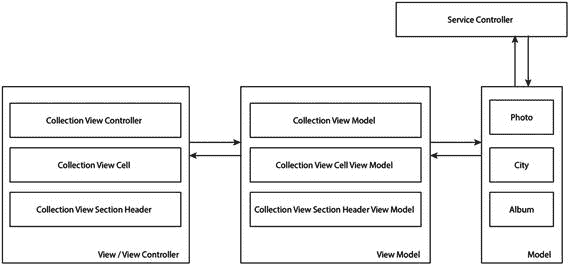

图 7-2. 包含网络层的修改版应用架构

以下是对各层及其组件类的简要说明：

*   **模型层**：包含 `Photo`、`City` 和 `Album` 类。
*   **视图模型层**：包含 `CollectionViewModel`、`CollectionViewCellViewModel` 和 `CollectionViewSectionHeaderViewModel` 类。
*   **视图/视图控制器层**：包含 `CollectionViewController`、`CollectionViewCell` 和 `CollectionViewSectionHeader` 类。
*   **网络层**：包含 `ServiceController` 类，该类提供了便捷方法，用于从后端 RESTful JSON Web 服务异步下载图片和元数据。

## 测试网络层的策略

有两种常见的测试网络代码的方法：

*   **异步测试技术**：依赖于向服务器发起实际的网络调用，并使用 `XCTest` 的 `waitForExpectations(timeout)` 方法等待几秒钟，让网络服务做出响应。
*   **基于模拟/桩的测试技术**：依赖于创建模拟对象或桩对象，完全替代 HTTP 调用。

异步测试技术的主要缺点是对外部组件（Web 资源）的固有依赖。一个暂时无法访问的 Web 资源，或是比平时更差的连接速度，都可能导致测试失败。依赖异步测试技术来测试网络代码的测试极其脆弱，执行时间更长，并且常常由于 Web 服务暂时不可访问的问题而失败。

基于模拟/桩的技术没有异步测试技术的这些缺点。只要预先商定共同的 Web 服务规范，它们允许你在服务器端开发的同时并行创建客户端代码。基于模拟/桩的技术的主要缺点在于它们与实际的 Web 服务本质上是脱节的，Web 服务可能会完全改变，但由于桩未更新，测试仍会继续通过。

测试网络层是为了确保应用以正确的参数调用正确的 API 端点，并确保应用能够处理响应。使用模拟/桩可以轻松实现这一点，这也将是本章采用的方法。

## 准备 `PhotoBook` 项目

复制在第 6 章中创建的 `PhotoBook` Xcode 项目，并在 Xcode 中打开该副本。

在项目导航器中找到以下文件并将其删除（见图 7-3）。

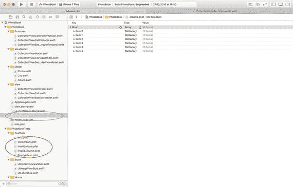

图 7-3. 需要从项目中删除的文件

*   `Albums.plist`
*   `ValidAlbum.plist`
*   `InvalidAlbum.plist`
*   `InvalidAlbum2.plist`
*   `EmptyAlbum.plist`

删除项目资源包中的所有资源，但不要删除资源包本身。资源包在项目导航器中称为 `Assets.xcassets`（见图 7-4）。

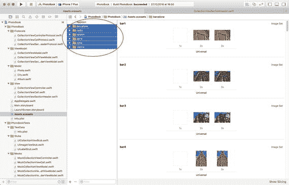

图 7-4. 需要从项目中删除的资源


### 远程内容规范

为了让 PhotoBook 应用能够从互联网下载内容，你需要了解这些内容的具体形式及其存放位置。

假设你的服务器端团队告知你，他们将提供一个存放城市和照片元数据的 JSON 文件，以及每张照片对应的 JPEG 文件。

这个 JSON 文件名为`albumlist.json`，它将与相关的 JPEG 图片一同存储在远程服务器的同一目录下。该服务器不支持 SSL，服务器上该目录的 URL 如下：

[`http://www.asmtechnology.com/apress2017/`](http://www.asmtechnology.com/apress2017/)

包含有效数据的示例 JSON 文件已经存放在本章代码下载附带的`Resources`目录中，以下是该文件的部分内容：

```
[
{
"city": "维也纳（奥地利）",
"photos": [
{
"imageName": "v1.jpg",
"aperture": "f2.8",
"shutterSpeed": "400",
"iso": "100",
"comment": "维也纳周末市场的 HDR 图像。"
}
]
}
]
```

### 配置应用传输安全

用于托管本项目图片和元数据的服务器不支持 HTTPS 连接。为了允许普通的 HTTP 连接，你需要配置项目的应用传输安全（ATS）设置。在实际项目中，你应始终使用 HTTPS 连接。

在项目导航器中找到`PhotoBook`组下的`Info.plist`文件并点击它。向此 plist 添加一个新的字典键，命名为`App Transport Security Settings`（参见图 7-5）。在这个新字典中，添加一个名为`Allow Arbitrary Loads`的布尔键，并将其值设为`Yes`。

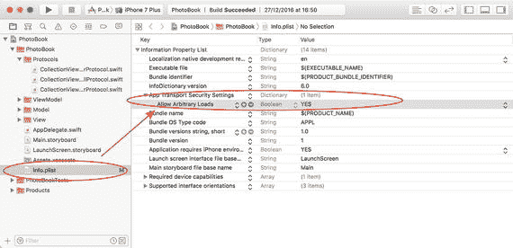

图 7-5.

应用传输安全设置

## 构建网络层

本应用的网络层由一个名为`ServiceController`的类构成，该类实现了以下方法：

```
func fetchFromURL(urlString:String?,
success:@escaping (Data) -> Void,
failure:@escaping (NSError) -> Void)
-> Void
```

`fetchFromURL`方法需要三个参数：

*   `urlString`：包含要下载的 URL 的字符串。
*   `success`：下载成功时调用的闭包。
*   `failure`：下载失败时调用的闭包。

创建一个名为`ServiceControllerTests`的新单元测试用例类，并将其内容更新为与清单 7-1 一致。

```
import XCTest
class ServiceControllerTests: XCTestCase {
let invalidURL:String = ""
let validAlbumListURL:String = "http://www.asmtechnology.com/apress2017/albumlist.json"
override func setUp() {
super.setUp()
// 此处放置设置代码。此方法在类中每个测试方法调用前被调用。
}
override func tearDown() {
// 此处放置拆卸代码。此方法在类中每个测试方法调用后被调用。
super.tearDown()
}
func testfetchFromURL_invalidSession_fails_WithErrorCode100() {
let expectation = self.expectation(description: "期望调用失败闭包，且错误码为 100")
let serviceController =
ServiceController()
serviceController.session = nil
serviceController.fetchFromURL(
urlString: validAlbumListURL,
success: { (data) in
// 不做任何操作
},
failure:{ (error) in
if error.code == 100 {
expectation.fulfill()
}
})
self.waitForExpectations(timeout: 1.0,
handler: nil)
}
func testfetchFromURL_nilURL_fails_WithErrorCode101() {
let expectation = self.expectation(description: "期望调用失败闭包，且错误码为 101")
let serviceController =
ServiceController()
serviceController.fetchFromURL(
urlString: nil,
success: { (data) in
// 不做任何操作
},
failure:{ (error) in
if error.code == 101 {
expectation.fulfill()
}
})
self.waitForExpectations(timeout: 1.0,
handler: nil)
}
func testfetchFromURL_invalidURL_fails_WithErrorCode101() {
let expectation = self.expectation(description: "期望调用失败闭包，且错误码为 101")
let serviceController =
ServiceController()
serviceController.fetchFromURL(
urlString: invalidURL,
success: { (data) in
// 不做任何操作
},
failure:{ (error) in
if error.code == 101 {
expectation.fulfill()
}
})
self.waitForExpectations(timeout: 1.0,
handler: nil)
}
func testfetchFromURL_validURL_callsDataTask_onURLSession_withTheSameURL() {
guard let expectedURL = URL(string: validAlbumListURL) else {
return
}
let expectation = self.expectation(description: "期望在 URLSession 上调用 dataTask")
let mockURLSession = MockURLSession()
mockURLSession.dataTaskExpectation =
(expectation, expectedURL)
let serviceController =
ServiceController()
serviceController.session =
mockURLSession
serviceController.fetchFromURL(
urlString: validAlbumListURL,
success: { (data) in
// 不做任何操作
},
failure:{ (error) in
// 不做任何操作
})
self.waitForExpectations(timeout: 1.0,
handler: nil)
}
func testfetchFromURL_validURL_validDataTask_callsResume_onDataTask() {
let expectation = self.expectation(description: "期望在 URLSession 上调用 dataTask 闭包")
let mockURLSession = MockURLSession()
mockURLSession.dataTaskToReturn?.resumeExpectation = expectation
let serviceController =
ServiceController()
serviceController.session =
mockURLSession
serviceController.fetchFromURL(
urlString: validAlbumListURL,
success: { (data) in
// 不做任何操作
},
failure:{(error) in
// 不做任何操作
})
self.waitForExpectations(timeout: 1.0,
handler: nil)
}
}
清单 7-1.
ServiceControllerTests.swift
```

该类中包含五个单元测试；下面逐一简要说明：

```
testfetchFromURL_invalidSession_fails_WithErrorCode100()
```

该测试调用`ServiceController`类的`fetchFromURL(urlString, success, failure)`方法。测试中将`ServiceController`的`URLSession`设置为 nil，预期失败闭包会被调用并携带特定的错误码。

```
testfetchFromURL_nilURL_fails_WithErrorCode101()
```

该测试调用`ServiceController`类的`fetchFromURL(urlString, success, failure)`方法，并将`urlString`参数设置为 nil。预期失败闭包会被调用并携带特定的错误码。

```
testfetchFromURL_invalidURL_fails_WithErrorCode101()
```

该测试调用`ServiceController`类的`fetchFromURL(urlString, success, failure)`方法，并将`urlString`参数设置为无效值。预期失败闭包会被调用并携带特定的错误码。

本项目没有专门的 URL 验证器对象，而是依赖 Swift 的`URL`类的可失败初始化器，在提供的字符串无法转换为有效 URL 时使其失败。

```
testfetchFromURL_validURL_callsDataTask_onURLSession_withTheSameURL()
```

该测试调用`ServiceController`类的`fetchFromURL(urlString, success, failure)`方法，并传入一个有效的 URL。预期`fetchFromURL`方法会调用`ServiceController`类中`URLSession`对象的`dataTask(with, completionHandler)`方法来获取一个`URLSessionDataTask`实例。

```
testfetchFromURL_validURL_validDataTask_callsResume_onDataTask()
```

该测试调用`ServiceController`类的`fetchFromURL(urlString, success, failure)`方法，并传入一个有效的 URL。预期`fetchFromURL`方法会调用从 URL 会话中获取的`URLSessionDataTask`实例的`resume`方法。

这些测试无法编译，因为它们需要定义以下类：

*   `ServiceController`
*   `MockURLSession`
*   `MockURLSessionDataTask`


### 创建 `ServiceController` 类

在项目导航器中新建一个名为 `Controllers` 的分组，并确保该分组位于 `PhotoBook` 分组下。在 `Controllers` 分组下创建一个名为 `ServiceController` 的新 Swift 类。确保该新类同时包含在构建目标（build target）和测试目标（test target）中。（参见图 7-6。）

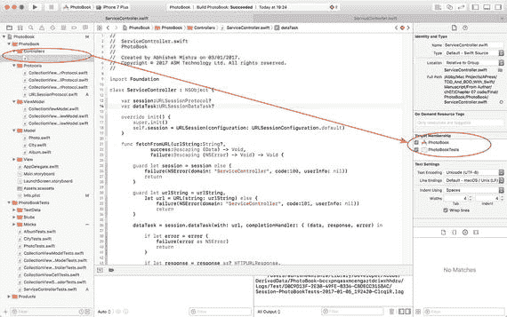

图 7-6. `ServiceController.swift` 文件的目标成员身份（Target Membership）

将 `ServiceController.swift` 的内容更新为与代码清单 7-2 一致。

```
import Foundation
class ServiceController : NSObject {
var session:URLSessionProtocol?
private var dataTask:URLSessionDataTask?
override init() {
super.init()
self.session =
URLSession(configuration:
URLSessionConfiguration.default)
}
func fetchFromURL(urlString:String?,
success:@escaping (Data) -> Void,
failure:@escaping (NSError) -> Void)
-> Void {
guard let session = session else {
failure(NSError(
domain: "ServiceController",
code:100,
userInfo: nil))
return
}
guard let urlString = urlString,
let url = URL(string: urlString)
else {
failure(NSError(
domain: "ServiceController",
code:101,
userInfo: nil))
return
}
dataTask = session.dataTask(
with: url,
completionHandler: {
(data, response, error) in
if let error = error {
failure(error as NSError)
return
}
if let response = response as?
HTTPURLResponse,
let data = data {
if response.statusCode == 200 {
success(data)
return
}
}
failure(NSError(
domain: "ServiceController", code:102,
userInfo: nil))
return
})
dataTask?.resume()
}
}
```

代码清单 7-2. `ServiceController.swift`

这个类包含一个 `init` 方法、`fetchFromURL` 方法以及几个实例变量。我想请你留意一下 `session` 变量，它被声明为：

```
var session:URLSessionProtocol?
```

在您过去构建的大多数应用中，`session` 变量通常是 `URLSession` 类型，而不是 `URLSessionProtocol` 类型。事实上，Apple 并未提供名为 `URLSessionProtocol` 的协议。之所以使用协议而非具体类型，是为了便于从单元测试中注入模拟/桩对象（mock/stub object）。

在 `Protocols` 分组下创建一个名为 `URLSessionProtocol.swift` 的新 Swift 文件，并确保该文件同时是构建目标和测试目标的成员。将该新文件的内容更新为与代码清单 7-3 一致。

```
import Foundation
protocol URLSessionProtocol : class {
func dataTask(with url: URL,
completionHandler: @escaping (Data?,
URLResponse?, Error?) -> Swift.Void) -> URLSessionDataTask
}
extension URLSession : URLSessionProtocol {
}
```

代码清单 7-3. `URLSessionProtocol.swift`

### 创建 `MockURLSession` 类

在项目浏览器的 `Mocks` 分组下创建一个新的 Swift 类。将该类命名为 `MockURLSession`，并确保新文件仅包含在测试目标中（参见图 7-7）。

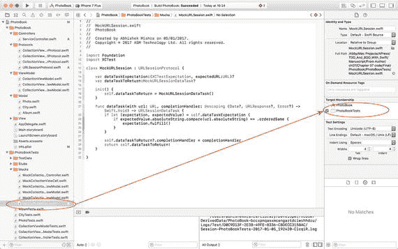

图 7-7. `MockURLSession.swift` 文件的目标成员身份

将 `MockURLSession.swift` 的内容更新为与代码清单 7-4 一致。

```
import Foundation
import XCTest
class MockURLSession : URLSessionProtocol {
var dataTaskExpectation:
(XCTestExpectation, expectedURL:URL)?
var dataTaskToReturn:MockURLSessionDataTask?
init() {
self.dataTaskToReturn =
MockURLSessionDataTask()
}
func dataTask(with url: URL,
completionHandler: @escaping (Data?,
URLResponse?,
Error?) -> Swift.Void)
-> URLSessionDataTask {
if let (expectation, expectedValue) =
self.dataTaskExpectation {
if    expectedValue.absoluteString.compare(
url.absoluteString) == .orderedSame {
expectation.fulfill()
}
}
self.dataTaskToReturn?.completionHandler =
completionHandler
return self.dataTaskToReturn!
}
}
```

代码清单 7-4. `MockURLSession.swift`

### 创建 `MockURLSessionDataTask` 类

在项目浏览器的 `Mocks` 分组下创建一个新的 Swift 类。将该类命名为 `MockURLSessionDataTask`，并确保新文件仅包含在测试目标中。

将 `MockURLSessionDataTask.swift` 的内容更新为与代码清单 7-5 一致。

```
import Foundation
import XCTest
class MockURLSessionDataTask : URLSessionDataTask {
var resumeExpectation: XCTestExpectation?
var completionHandler:((Data?, URLResponse?, Error?) -> Swift.Void)?
var dataToReturn:Data?
var urlResponseToReturn:URLResponse?
var errorToReturn:Error?
override func resume() {
resumeExpectation?.fulfill()
if let
completionHandler = completionHandler
{
DispatchQueue.main.asyncAfter(
deadline: .now() + 0.1) {
completionHandler(
self.dataToReturn,
self.urlResponseToReturn,
self.errorToReturn)
}
}
}
}
```

代码清单 7-5. `MockURLSessionDataTask.swift`

保存文件，并使用测试导航器（Test Navigator）运行 `ServiceController` 测试用例中的所有测试（参见图 7-8）。您应该会看到 `ServiceControllerTests.swift` 中的所有测试都通过了。但是，如果您尝试通过“Product ➤ Test”菜单项运行所有测试，您会发现第 6 章末尾原本通过的一些其他测试现在会全部崩溃。

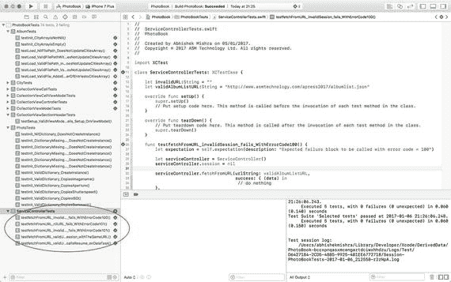

图 7-8. `ServiceControllerTests.swift` 中的所有测试用例均通过

在本章的剩余部分中，您将修复/替换这些损坏的测试，以适应应用现在将使用新的 `ServiceController` 类从互联网下载内容这一变化。

## 更新模型层

该应用的模型层由三个类组成：`Album`、`City` 和 `Photo`。需要更新 `Album` 和 `Photo` 类，使其使用新的 `ServiceController` 类，而不是使用加载本地 `.plist` 文件和从本地资源包（asset bundle）读取图片的旧方法。


### 更新 `Album` 类

当前版本的 `Album` 类包含一个名为

```
func load(filePath:String?) -> Void
```

的方法。当 `Album` 类被更新后，该方法将被一个同名但接受不同参数的新方法所替代：

```
func load(urlString:String?,
success:@escaping (Void) -> Void,
failure:@escaping (NSError) -> Void)
-> Void
```

这些新参数简要说明如下：

-   `urlString`: 一个用于标识服务器上 JSON 文件的 URL。该 JSON 文件将包含专辑的所有元数据、专辑中的城市以及每个城市中的照片。
-   `success`: 由用户提供的闭包，若 `load` 方法执行成功，将异步调用该闭包。
-   `failure`: 由用户提供的闭包，若 `load` 方法遇到错误，将异步调用该闭包。

让我们采用测试驱动的方法来构建 `load` 方法的修改版本。首先，删除旧版本的 `load` 方法以及所有为此旧方法编写的测试。

在项目导航器中打开 `Album.swift` 文件，并删除 `load(filePath:String?)` 方法，因为它将不再需要。此时的 `Album` 类应类似于代码清单 7-6。

```
import Foundation
class Album: NSObject {
var cities:[City]?
override init() {
super.init()
if cities == nil {
cities = [City]()
}
}
}
代码清单 7-6.
Album.swift
```

在项目导航器中打开 `AlbumTests.swift` 文件，并删除以下测试方法，因为这些测试已不再相关：

-   `testLoad_NilFilePath_DoesNotUpdateCitiesArray()`
-   `testLoad_ValidFilePathWithNoCities_DoesNotUpdateCitiesArray()`
-   `testLoad_ValidFilePath_InvalidRootElementType_DoesNotUpdateCitiesArray()`
-   `testLoad_ValidFilePath_ValidRootElementType_InvalidChildElementType_DoesNotUpdateCitiesArray()`
-   `testLoad_ValidFile_AddsExpectedNumberOfEntriestoCitiesArray()`

删除以下实例变量声明：

-   `var emptyAlbumPlistFile: String?`
-   `var invalidAlbumPlistFile: String?`
-   `var invalidAlbumPlistFile2: String?`
-   `var validAlbumPlistFile: String?`

从 `setUp()` 方法中删除以下代码行：

```
let bundle = Bundle(for: type(of:self))
emptyAlbumPlistFile = bundle.path(
forResource: "EmptyAlbum",
ofType: "plist")
invalidAlbumPlistFile = bundle.path(
forResource: "InvalidAlbum",
ofType: "plist")
invalidAlbumPlistFile2 = bundle.path(
forResource: "InvalidAlbum2",
ofType: "plist")
validAlbumPlistFile = bundle.path(
forResource: "ValidAlbum",
ofType: "plist")
```

`AlbumTests` 类现在应类似于代码清单 7-7。

```
import XCTest
class AlbumTests: XCTestCase {
override func setUp() {
super.setUp()
}
override func tearDown() {
// 在此处放置拆卸代码。该方法在类中每个测试方法调用后执行。
super.tearDown()
}
func testInit_CityArrayIsNotNil() {
let album = Album()
XCTAssertNotNil(album.cities)
}
func testInit_CityArrayIsEmpty() {
let album = Album()
XCTAssertEqual(album.cities?.count, 0)
}
}
代码清单 7-7.
AlbumTests.swift
```

#### 为 `load( )` 方法编写新测试

将以下测试添加到 `AlbumTests.swift` 文件中：

```
func testLoad_nilURL_fails_withErrorCode101() {
let expectation = self.expectation(description: "Expected failure block to be called with error code = 101")
let album = Album()
album.load(urlString: nil,
success: { (Void) in
// 不做任何操作
}, failure: { (error) in
if error.code == 101 {
expectation.fulfill()
}
})
self.waitForExpectations(timeout: 1.0,
handler: nil)
}
func testLoad_invalidURL_fails_withErrorCode101() {
let expectation = self.expectation(description: "Expected failure block to be called with error code = 101")
let album = Album()
album.load(
urlString: invalidURL,
success: { (Void) in
// 不做任何操作
}, failure: { (error) in
if error.code == 101 {
expectation.fulfill()
}
})
self.waitForExpectations(timeout: 1.0,
handler: nil)
}
func testLoad_validURL_callsFromFetchURLonServiceController_withExpectedURL() {
let expectation = self.expectation(description: "Expected fetchURL to be called")
let mockServiceController =
MockServiceController()
mockServiceController.
fetchFromURLExpectation =
(expectation, validAlbumListURL)
let album = Album()
album.serviceController =
mockServiceController
album.load(
urlString: validAlbumListURL,
success: { (Void) in
// 不做任何操作
}, failure: { (error) in
// 不做任何操作
})
self.waitForExpectations(timeout: 1.0,
handler: nil)
}
func testLoad_validURL_failsWhenServiceControllerFails() {
let expectation =
self.expectation(description:
"Expected fetchURL to be called")
let mockServiceController =
MockServiceController()
mockServiceController.
shouldFailOnFetch = true
let album = Album()
album.serviceController =
mockServiceController
album.load(
urlString: validAlbumListURL,
success: { (Void) in
// 不做任何操作
}, failure: { (error) in
expectation.fulfill()
})
self.waitForExpectations(timeout: 1.0,
handler: nil)
}
func testLoad_onServiceControllerFailure_doesNotUpdateCityArray() {
let mockServiceController =
MockServiceController()
mockServiceController.
shouldFailOnFetch = true
let album = Album()
album.serviceController =
mockServiceController
album.load(
urlString: validAlbumListURL,
success: { (Void) in
// 不做任何操作
}, failure: { (error) in
// 不做任何操作
})
XCTAssertEqual(album.cities?.count, 0)
}
func testLoad_validURL_serviceControllerReturnsValidData_citiesArrayHasExpectedCount() {
let bundle = Bundle(for: type(of:self))
let filePath = bundle.path(
forResource: "ValidAlbumList",
ofType: "json")
let stubResponseData = try!
Data(contentsOf: URL(fileURLWithPath:
filePath!))
let mockServiceController =
MockServiceController()
mockServiceController.
shouldFailOnFetch = false
mockServiceController.
dataToReturnOnSuccess =
stubResponseData
let album = Album()
album.serviceController =
mockServiceController
album.load(
urlString: validAlbumListURL,
success: { (Void) in
// 不做任何操作
}, failure: { (error) in
// 不做任何操作
})
XCTAssertEqual(album.cities?.count, 6)
}
```

上述代码片段中共有六个单元测试，每个测试的简要说明如下：

`testLoad_nilURL_fails_withErrorCode101()`

此测试以 `nil` 作为 `urlString` 参数调用 `Album` 类的 `load(urlString, success, failure)` 方法。测试预期 `failure` 闭包会被调用，并携带一个特定的错误码。

`testLoad_invalidURL_fails_withErrorCode101()`

此测试以一个无效值作为 `urlString` 参数调用 `Album` 类的 `load(urlString, success, failure)` 方法。测试预期 `failure` 闭包会被调用，并携带一个特定的错误码。

`testLoad_validURL_callsFromFetchURLonServiceController_withExpectedURL()`

此测试以一个有效的 URL 调用 `Album` 类的 `load(urlString, success, failure)` 方法。测试预期 `Album` 类的 `load` 方法会调用 `ServiceController` 类的 `fetchFromURL` 方法，并且传入的 URL 与提供给 `load` 方法的 URL 相同。

`testLoad_validURL_failsWhenServiceControllerFails()`


该测试调用了`Album`类的`load(urlString:success:failure:)`方法，传入一个有效的 URL，并在服务控制器类中模拟了一次失败。该测试预期，提供给`load`方法的失败闭包将被调用。

```
testLoad_onServiceControllerFailure_doesNotUpdateCityArray()
```

该测试调用了`Album`类的`load(urlString:success:failure:)`方法，传入一个有效的 URL，并在服务控制器类中模拟了一次失败。该测试预期，`Album`类城市数组中的元素数量没有发生变化。

通过在`Album`类中注入一个`MockServiceController`对象，可以实现对服务控制器类中一次失败的模拟：

```
let mockServiceController =
MockServiceController()
mockServiceController.
shouldFailOnFetch = true
let album = Album()
album.serviceController =
mockServiceController
```

`MockServiceController`类尚未构建，但会有一个名为`shouldFailOnFetch`的布尔类型实例变量，该变量将用于在`fetchFromURL`方法内部模拟失败。

```
testLoad_validURL_serviceControllerReturnsValidData_citiesArrayHasExpectedCount()
```

该测试调用了`Album`类的`load(urlString:success:failure:)`方法，传入一个有效的 URL，并在服务控制器类中模拟了一次成功的下载操作。该测试预期`Album`类城市数组中的元素数量为特定值。

同样，通过在`Album`类中注入一个`MockServiceController`对象，可以实现对服务控制器类中一次成功下载操作的模拟：

```
let bundle = Bundle(for: type(of:self))
let filePath = bundle.path(
forResource: "ValidAlbumList",
ofType: "json")
let stubResponseData = try!
Data(contentsOf: URL(fileURLWithPath:
filePath!))
let mockServiceController =
MockServiceController()
mockServiceController.
shouldFailOnFetch = false
mockServiceController.
dataToReturnOnSuccess =
stubResponseData
```

`MockServiceController`将拥有一个名为`dataToReturnOnSuccess`的实例变量，该变量可以预先加载一个桩响应。

现在，我们做一些修改，让这些新测试能够编译通过。将以下实例变量添加到`AlbumTests.swift`文件中：

```
let invalidURL:String = ""
let validAlbumListURL:String = http://www.asmtechnology.com/apress2017/albumlist.json
```

将`ValidAlbumList.json`文件添加到`TestData`组中。确保该文件仅包含在测试目标中。你可以从本章附带的可下载代码资源目录中获取此文件（见图 7-9）。

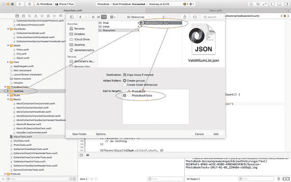

图 7-9.

Xcode 导入文件对话框

#### 创建 MockServiceController 类

在`Mocks`组下创建一个名为`MockServiceController`的新 Swift 类。确保该文件仅包含在测试目标中（见图 7-10）。

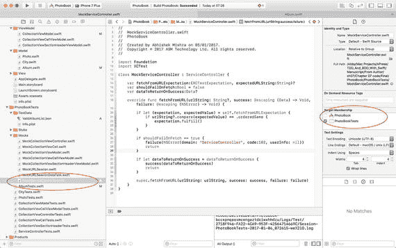

图 7-10.

`MockServiceController.swift` 目标成员资格

更新`MockServiceController.swift`的内容，使其与清单 7-8 相似。

```
import Foundation
import XCTest
class MockServiceController : ServiceController {
var fetchFromURLExpectation:(XCTestExpectation, expectedURLString:String)?
var shouldFailOnFetch:Bool = false
var dataToReturnOnSuccess:Data?
override func fetchFromURL(
urlString: String?,
success: @escaping (Data) -> Void,
failure: @escaping (NSError) -> Void)
{
if let
(expectation, expectedValue) =
self.fetchFromURLExpectation {
if urlString?.
compare(expectedValue)
== .orderedSame {
expectation.fulfill()
}
}
if shouldFailOnFetch == true {
failure(NSError(
domain: "ServiceController",
code:102,
userInfo: nil))
return
}
if let
dataToReturnOnSuccess = dataToReturnOnSuccess {
success(dataToReturnOnSuccess)
return
}
super.fetchFromURL(
urlString: urlString,
success: success,
failure: failure)
}
}
清单 7-8.
MockServiceController.swift
```

将以下更新版本的`load()`方法添加到`Album`类中：

```
func load(urlString:String?,
success:@escaping (Void) -> Void,
failure:@escaping (NSError) -> Void)
-> Void {
serviceController.fetchFromURL(
urlString: urlString,
success: { (receivedData) in
guard
let array = try?
JSONSerialization.jsonObject(
with: receivedData,
options: JSONSerialization.
ReadingOptions.
mutableContainers) as?
NSArray else {
failure(NSError(
domain: "PhotoBook.Album",
code:200,
userInfo: nil))
return
}
for item in array! {
guard
let dictionary = item as?
[String : AnyObject] else {
continue
}
if let city = City(dictionary) {
self.cities?.append(city)
}
}
success()
},
failure: { (error) in
failure(error)
})
}
```

#### 修改 Album 类

将以下实例变量声明添加到`Album`类中：

```
var serviceController = ServiceController()
```

保存文件，并使用**产品 ➤ 测试**菜单项运行所有测试。你会注意到项目编译失败，这是因为`CollectionViewModel`类正在使用`Album`类的旧版`load()`方法。

现在，请注释掉`CollectionViewModelClass`初始化器中的以下几行代码：

```
let path = Bundle.main.path(
forResource: "Albums",
ofType: "plist")
photoAlbum?.load(filePath:path)
```

保存文件，并使用**测试导航器**运行`AlbumTests`测试用例中的所有测试（见图 7-11）。你应该会看到`AlbumTests.swift`中的所有测试都通过了。

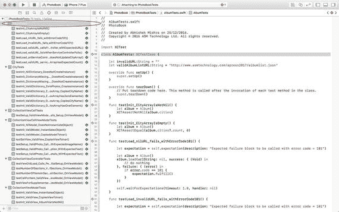

图 7-11.

`AlbumTests.swift`中所有测试现已通过

### 更新 Photo 类

`Photo`类将进行更新，以使用`ServiceController`从互联网下载图像。当前版本的`Photo`类仅存储图像资源的名称。在更新`Album`类之前，这是项目资源目录中图像资源的名称。随着`Album`类的更新，这现在将是服务器上相对于`albumlist.json`文件路径的 jpeg 文件路径。

`Photo`类的新版本将包含以下修改：

*   根据`albumlist.json`文件的基础 URL 和图像的文件名，构建服务器上图像绝对 URL 的代码。
*   一个名为`downloadImage`的新方法，该方法将使用`ServiceController`实例启动图像下载。
*   一个`UIImage`实例，其中包含下载完成后的图像。
*   对一个监听器对象的引用，该对象在图像下载完成时接收通知。该监听器对象将是`CollectionViewCellViewModel`的一个实例。
*   图像下载完成后，调用监听器对象上的一个方法。该监听器将反过来用下载的图像更新集合视图单元格。


#### 为 `Photo` 类编写新的测试

在项目导航器中打开 `PhotoTests.swift` 文件，并在类末尾添加以下测试方法：

```
func testInit_ValidDictionary_downloadedImage_IsNil() {
    let mockServiceController = MockServiceController()
    mockServiceController.shouldFailOnFetch = true
    let photo = Photo(validPhotoDictionary1)
    photo?.serviceController = mockServiceController
    XCTAssertNil(photo?.downloadedImage)
}
func testInit_ValidDictionary_whenDownloadedImageIsCalled_callsDownloadImage() {
    let expectation = self.expectation(description: "Expected downloadImage to be called")
    let mockServiceController = MockServiceController()
    mockServiceController.shouldFailOnFetch = true
    let photo = MockPhoto(validPhotoDictionary1)
    photo?.downloadImageExpectation = expectation
    photo?.imageName = "11.jpg"
    photo?.baseURL = "http://www.asmtechnology.com/apress2017/"
    photo?.serviceController = mockServiceController
    let _ = photo?.downloadedImage
    self.waitForExpectations(timeout: 1.0, handler: nil)
}
func testBuildImageDownloadURL_nilImageName_returnsNil() {
    let photo = Photo(validPhotoDictionary1)
    photo?.imageName = nil
    XCTAssertNil(photo!.buildImageDownloadURL())
}
func testBuildImageDownloadURL_validBaseURL_validImageName_returnsCorrectImageURL() {
    let photo = Photo(validPhotoDictionary1)
    photo?.imageName = "11.jpg"
    photo?.baseURL = "http://www.asmtechnology.com/apress2017/"
    let expectedURL = "http://www.asmtechnology.com/apress2017/11.jpg"
    XCTAssertEqual(photo!.buildImageDownloadURL(), expectedURL)
}
func testDownloadImage_validImageURL_callsFromFetchURLonServiceController_withExpectedURL() {
    let expectation = self.expectation(description: "Expected fetchURL to be called")
    let expectedURL = "http://www.asmtechnology.com/apress2017/11.jpg"
    let mockServiceController = MockServiceController()
    mockServiceController.fetchFromURLExpectation = (expectation, expectedURL)
    let photo = Photo(validPhotoDictionary1)
    photo?.imageName = "11.jpg"
    photo?.baseURL = "http://www.asmtechnology.com/apress2017/"
    photo?.serviceController = mockServiceController
    photo?.downloadImage()
    self.waitForExpectations(timeout: 1.0, handler: nil)
}
func testDownloadImage_validImageURL_serviceControllerReturnsValidData_updatesImage() {
    let bundle = Bundle(for: type(of:self))
    let filePath = bundle.path(forResource: "bar1", ofType: "jpg")
    let stubResponseData = try! Data(contentsOf: URL(fileURLWithPath: filePath!))
    let mockServiceController = MockServiceController()
    mockServiceController.shouldFailOnFetch = false
    mockServiceController.dataToReturnOnSuccess = stubResponseData
    let photo = Photo(validPhotoDictionary1)
    photo?.imageName = "11.jpg"
    photo?.baseURL = "http://www.asmtechnology.com/apress2017/"
    photo?.serviceController = mockServiceController
    photo?.downloadImage()
    XCTAssertNotNil(photo?.downloadedImage)
}
func testDownloadImage_validImageURL_validListener_calls_didDownloadImage_onListener() {
    let expectation = self.expectation(description: "Expected fetchURL to be called")
    let mockDownloadListener = MockDownloadListener()
    mockDownloadListener.didDownloadImageExpectation = expectation
    let bundle = Bundle(for: type(of:self))
    let filePath = bundle.path(forResource: "bar1", ofType: "jpg")
    let stubResponseData = try! Data(contentsOf: URL(fileURLWithPath: filePath!))
    let mockServiceController = MockServiceController()
    mockServiceController.shouldFailOnFetch = false
    mockServiceController.dataToReturnOnSuccess = stubResponseData
    let photo = Photo(validPhotoDictionary1)
    photo?.imageName = "11.jpg"
    photo?.baseURL = "http://www.asmtechnology.com/apress2017/"
    photo?.serviceController = mockServiceController
    photo?.listener = mockDownloadListener
    photo?.downloadImage()
    self.waitForExpectations(timeout: 1.0, handler: nil)
}
```

上述代码片段包含七个单元测试，每个测试的简要说明如下：

```
testInit_ValidDictionary_downloadedImage_IsNil()
```

该测试使用有效字典创建了一个 `Photo` 实例，并期望 `downloadedImage` 实例变量为 `nil`。这是一个将添加到 `Photo` 类中的新实例变量，在图片下载完成后将包含图片。

```
testInit_ValidDictionary_whenDownloadedImageIsCalled_callsDownloadImage()
```

该测试使用有效字典创建了一个 `Photo` 实例，并访问 `downloadedImage` 实例变量。该测试期望通过尝试访问此实例变量（根据上一个测试，其为 `nil`），会调用 `downloadImage` 方法。`downloadImage` 方法是一个将添加到 `Photo` 类中的新方法，它将包含使用 `ServiceController` 实例下载图片的代码。

```
testBuildImageDownloadURL_nilImageName_returnsNil()
```

该测试在 `imageName` 实例变量为 `nil` 的 `Photo` 实例上调用 `buildImageDownloadURL` 方法。测试期望 `buildImageDownloadURL` 方法返回 `nil`。`buildImageDownloadURL` 方法是一个将添加到 `Photo` 类中的新方法，它将包含根据基础 URL 和图片文件名组成服务器上图片 URL 的代码。

```
testBuildImageDownloadURL_validBaseURL_validImageName_returnsCorrectImageURL()
```

该测试在 `baseURL` 和 `imageName` 实例变量都有有效值的 `Photo` 实例上调用 `buildImageDownloadURL` 方法。测试期望 `buildImageDownloadURL` 方法返回一个格式正确的 URL。`baseURL` 实例变量是 `Photo` 类的新增项，它将包含服务器上存储图片的文件夹的 URL。

```
testDownloadImage_validImageURL_callsFromFetchURLonServiceController_withExpectedURL()
```

该测试在 `Photo` 实例上调用 `downloadImage` 方法，并期望在 `ServiceController` 实例上调用 `fetchURL` 方法。`downloadImage` 方法是一个将添加到 `Photo` 类中的新方法。`Photo` 类还将有一个新的 `ServiceController` 实例变量。

```
testDownloadImage_validImageURL_serviceControllerReturnsValidData_updatesImage()
```

该测试在 `Photo` 实例上调用 `downloadImage` 方法，并在服务控制器类中模拟了一次成功的下载操作。测试期望 `downloadedImage` 实例变量不为 `nil`。通过在 `Photo` 类中注入一个 `MockServiceController` 对象，并将 `MockServiceController` 配置为返回模拟响应，来实现服务控制器类中的成功下载操作模拟：

```
let bundle = Bundle(for: type(of:self))
let filePath = bundle.path(forResource: "bar1", ofType: "jpg")
let stubResponseData = try! Data(contentsOf: URL(fileURLWithPath: filePath!))
let mockServiceController = MockServiceController()
mockServiceController.shouldFailOnFetch = false
mockServiceController.dataToReturnOnSuccess = stubResponseData
let photo = Photo(validPhotoDictionary1)
photo?.serviceController = mockServiceController
```

不出所料，这些测试目前还无法编译，因为需要创建几个模拟对象，并且需要向 `Photo` 类添加几个实例变量和方法。

将 `bar1.jpg` 文件添加到 `TestData` 组中。确保该文件仅包含在测试目标中。你可以从本章随附的可下载代码所提供的资源目录中获取此文件（参见图 7-12）。

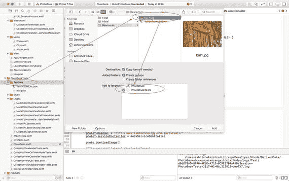

图 7-12.

Xcode 文件导入对话框


### 创建 `MockPhoto` 类

在 Mocks 组下创建一个名为 `MockPhoto` 的新类。确保此类仅包含在测试目标中。将 `MockPhoto.swift` 的内容更新为代码清单 7-9 所示。

```
import Foundation
import XCTest
class MockPhoto : Photo {
    var downloadImageExpectation: XCTestExpectation?
    override func downloadImage() -> Void {
        downloadImageExpectation?.fulfill()
        super.downloadImage()
    }
}
```

### 修改 `Photo` 类

在 `Photo.swift` 文件中导入 UIKit 框架，并向 `Photo.swift` 类添加以下实例变量：

```
weak var listener:DownloadListenerProtocol?
var serviceController = ServiceController()
var baseURL = "http://www.asmtechnology.com/apress2017/"
private var image: UIImage?
```

向 `Photo` 类添加一个名为 `downloadedImage` 的计算型 `UIImage` 属性，并实现如下：

```
var downloadedImage: UIImage? {
    get {
        if image == nil {
            downloadImage()
        }
        return image
    }
}
```

向 `Photo` 类添加 `buildImageDownloadURL` 方法的以下实现：

```
func buildImageDownloadURL() -> String? {
    guard let imageName = imageName else {
        return nil
    }
    return "\(baseURL)\(imageName)"
}
```

向 `Photo` 类添加 `downloadImage` 方法的以下实现：

```
func downloadImage() -> Void {
    guard let urlToFetch  =
        buildImageDownloadURL() else {
            return
    }
    serviceController.fetchFromURL(
        urlString: urlToFetch,
        success: { (data) in
            self.image = UIImage(data: data)
            self.listener?.didDownloadImage()
        }, failure: { (error) in
            // 不执行任何操作。
    })
}
```

### 创建 `DownloadListenerProtocol.swift` 文件

在 Protocols 组下创建一个名为 `DownloadListenerProtocol` 的新文件。确保该文件同时包含在构建目标和测试目标中（参见图 7-13）。

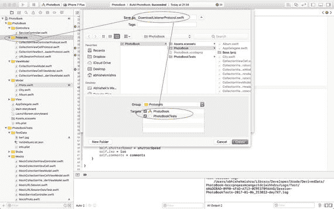

将 `DownloadListenerProtocol.swift` 文件的内容更新为代码清单 7-10 所示。

```
import Foundation
protocol DownloadListenerProtocol : class {
    func didDownloadImage() -> Void
}
```

### 创建 `MockDownloadListener` 类

在 Mocks 组下创建一个名为 `MockDownloadListener` 的新类。确保此类仅包含在测试目标中。将 `MockDownloadListener.swift` 的内容更新为代码清单 7-11 所示。

```
import Foundation
import XCTest
class MockDownloadListener : DownloadListenerProtocol {
    var didDownloadImageExpectation:XCTestExpectation?
    func didDownloadImage() -> Void {
        didDownloadImageExpectation?.fulfill()
    }
}
```

保存文件，并使用测试导航器运行 `PhotoTests` 测试用例中的所有测试（参见图 7-14）。您应该会看到 `PhotoTests.swift` 中的所有测试均通过。

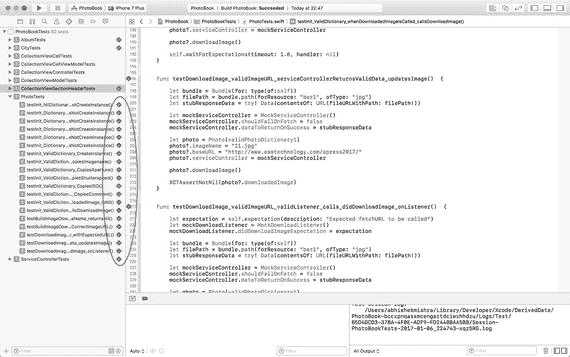

## 更新视图模型层

集合视图模型和集合视图单元格视图模型类都需要进行小幅更新。由于本章主要讨论测试网络代码，因此本节和下一节将不会采用测试驱动的方法。前几章已经提供了测试视图模型和视图控制器层的几个示例。

### 对集合视图模型的更新

在本章前面部分，您已从 `CollectionViewModel.swift` 类的初始化器中注释掉了两行代码，以使测试代码能够编译：

```
//let path = Bundle.main.path(
//     forResource:"Albums", ofType: "plist")
//photoAlbum?.load(filePath:path)
```

这两行代码曾用于调用专辑对象上的 `load` 方法，该方法接收捆绑在应用程序中的 plist 文件路径。

对 `Album` 类所做的更改现在允许专辑类从互联网上的 JSON 文件下载专辑元数据。

将 `CollectionViewModel` 类的初始化器替换为以下更新版本：

```
init(view:CollectionViewControllerProtocol,
     album:Album? = nil) {
    super.init()
    self.view = view
    photoAlbum = album ?? Album()
    photoAlbum?.load(urlString: "http://www.asmtechnology.com/apress2017/albumlist.json",
                     success: { () in
                        DispatchQueue.main.async {
                            self.view?.
                                reloadCollectionView()
                        }
        },
                     failure: { (error) in
                        print(error.description)
    })
}
```

更新后的初始化器接受一个可选的 `Album` 参数，测试可以在需要时通过该参数注入模拟对象或桩对象，并调用 `Album` 对象上的新 `load()` 方法。

向 `CollectionViewControllerProtocol.swift` 文件添加以下方法声明：

```
func reloadCollectionView() -> Void
```

虽然我们不会在本章中编写任何新的测试来涵盖此功能，但确实需要删除过时的测试并修复有问题的测试。大多数为集合视图模型编写的旧测试仍会通过；然而，有些测试需要更新。

需要更新测试的主要原因在于 `photoAlbum` 类的 `load()` 方法现在是异步的，而之前的测试是为同步版本的 `load()` 编写的。

为了修复这些测试，我们需要向 `CollectionViewModel` 注入一个修改过的 `Album` 实例，该实例在内部使用一个带有桩的服务控制器实例。由于这个修改过的专辑实例可能会在多个测试中使用，因此创建此实例的代码将放在测试用例类的 `setUp()` 方法中：

```
let bundle = Bundle(for: type(of:self))
let filePath = bundle.path(
    forResource: "ValidAlbumList",
    ofType: "json")
stubResponseData = try!
    Data(contentsOf:
        URL(fileURLWithPath: filePath!))
stubServiceController = MockServiceController()
stubServiceController!.shouldFailOnFetch =
    false
stubServiceController!.dataToReturnOnSuccess =
    stubResponseData!
albumWithStubbedServiceController = Album()
albumWithStubbedServiceController!.
    serviceController = stubServiceController!
```

本节的其余部分列出了需要更新的测试；这些测试的更新版本可以在本章附带的最终项目中找到。

- `testNumberOfItemsInSection_ValidSectionIndex_ReturnsExpectedValue()`
- `testCellViewModel_ValidViewModelNilPhotos_ReturnsNil ()`
- `testCellViewModel_ValidSectionIndex_DoesNotReturnNil ()`
- `testCellViewModel_ValidSectionIndex_ReturnsViewModelWithExpectedModelObject()`
- `testHeaderViewModel_ValidSectionIndex_DoesNotReturnNil()`


### 集合视图单元格视图模型的更新

单元格视图模型将被修改为充当`Photo`模型类的监听器对象。通过这种方式，`Photo`类将在异步图像下载完成后通知单元格视图模型。

在`CollectionViewCellViewModel`类的初始化方法末尾添加以下代码行：

```
photo?.listener = self
```

删除`setup()`方法的现有实现，并替换为以下实现：

```
func setup() {
    guard let collectionViewCell = collectionViewCell,
          let photo = photo,
          let aperture = photo.aperture,
          let shutterSpeed = photo.shutterSpeed,
          let iso = photo.iso,
          let comments = photo.comments else {
        return
    }
    collectionViewCell.updateImage(image: photo.downloadedImage)
    collectionViewCell.setCaption(captionText: comments)
    collectionViewCell.setShotDetails(shotDetailsText: "\(aperture), \(shutterSpeed), ISO \(iso)")
}
```

在`CollectionViewCellViewModel.swift`文件中添加以下类扩展：

```
extension CollectionViewCellViewModel : DownloadListenerProtocol {
    func didDownloadImage() -> Void {
        DispatchQueue.main.async {
            self.collectionViewCell?.updateImage(image: self.photo?.downloadedImage)
        }
    }
}
```

这段代码目前还无法编译，因为它需要对集合视图单元格类进行一些修改。你将在下一节中进行这些修改。

你可能已经注意到，修改后的`setup()`方法调用了`collectionViewCell`对象的`updateImage()`方法，而不是`loadImage()`方法。在上一章中，你创建了一个测试，用于确保调用`setup()`方法时会调用`loadImage()`方法。这个测试现在已经过时，需要删除。

打开`CollectionViewCellViewModelTests.swift`文件，从文件中删除以下测试：

```
testSetup_ValidPhoto_Calls_LoadImage_WithExpectedImageName()
```

你也可以修改测试来检查`updateImage()`是否被调用；但这作为练习留给你，本章将不再讨论。

## 更新视图层

集合视图和集合视图单元格类都需要进行小幅更新。让我们先更新集合视图控制器类。

### 集合视图控制器的更新

在本章前面，你在`CollectionViewControllerProtocol.swift`文件中添加了一个新方法：

```
func reloadCollectionView() -> Void
```

现在你需要在集合视图控制器类中实现这个方法。修改`CollectionViewController.swift`文件中的类扩展，在扩展中添加以下方法实现：

```
func reloadCollectionView() -> Void {
    self.collectionView?.reloadData()
}
```

更新`MockCollectionViewController.swift`文件，为`reloadCollectionView`方法添加一个存根实现。修改后的`MockCollectionViewController.swift`文件应类似于清单 7-12。

```
import UIKit
import XCTest

class MockCollectionViewController : CollectionViewControllerProtocol {
    var expectationForSetNavigationTitle: XCTestExpectation?
    var expectationForSetSectionInset: XCTestExpectation?
    var expectationForSetupCollectionViewCellToUseMaxWidth: XCTestExpectation?

    func setNavigationTitle(_ title: String) -> Void {
        expectationForSetNavigationTitle?.fulfill()
    }

    func setSectionInset(top: Float, left: Float, bottom: Float, right: Float) -> Void {
        expectationForSetSectionInset?.fulfill()
    }

    func setupCollectionViewCellToUseMaxWidth() -> Void {
        expectationForSetupCollectionViewCellToUseMaxWidth?.fulfill()
    }

    func reloadCollectionView() {
    }
}
```

*清单 7-12. MockCollectionViewController.swift*

### 集合视图单元格的更新

从项目导航器中打开`CollectionViewCellProtocol.swift`文件，并在文件顶部添加一条语句以导入`UIKit`框架。

从协议中删除以下方法声明：

```
func loadImage(resourceName: String)
```

在协议中添加以下方法声明：

```
func updateImage(image: UIImage?)
```

`CollectionViewCellProtocol.swift`文件的内容现在应类似于清单 7-13。

```
import Foundation
import UIKit

protocol CollectionViewCellProtocol : class {
    func setCaption(captionText: String)
    func setShotDetails(shotDetailsText: String)
    func updateImage(image: UIImage?)
}
```

*清单 7-13. CollectionViewCellProtocol.swift*

在项目导航器中打开`CollectionViewCell.swift`文件，并删除`loadImage`方法的实现。

在类中添加以下代码以实现`updateImage`方法：

```
func updateImage(image: UIImage?) {
    imageView.image = image
    self.setNeedsLayout()
}
```

`CollectionViewCell.swift`文件的内容现在应类似于清单 7-14。

```
import UIKit

class CollectionViewCell: UICollectionViewCell {
    @IBOutlet weak var imageView: UIImageView!
    @IBOutlet weak var captionLabel: UILabel!
    @IBOutlet weak var shotDetailsLabel: UILabel!

    var viewModel: CollectionViewCellViewModel?

    func setup() {
        viewModel?.setup()
    }
}

extension CollectionViewCell : CollectionViewCellProtocol {
    func setCaption(captionText: String) {
        captionLabel.text = captionText
    }

    func setShotDetails(shotDetailsText: String) {
        shotDetailsLabel.text = shotDetailsText
    }

    func updateImage(image: UIImage?) {
        imageView.image = image
        self.setNeedsLayout()
    }
}
```

*清单 7-14. CollectionViewCell.swift*

更新`MockCollectionViewCell.swift`文件，删除现有的`loadImage`方法实现，并为新的`updateImage`方法添加一个存根实现。修改后的`MockCollectionViewCell.swift`文件应类似于清单 7-15。

```
import Foundation
import XCTest

class MockCollectionViewCell : CollectionViewCellProtocol {
    var expectationForLoadImage: (XCTestExpectation, String?)?
    var expectationForSetCaption: (XCTestExpectation, String?)?
    var expectationForSetupShotDetails: (XCTestExpectation, String?)?

    func setCaption(captionText: String) {
        guard let (expectation, expectedValue) = self.expectationForSetCaption else {
            return
        }
        if let expectedValue = expectedValue {
            if (captionText.compare(expectedValue) != .orderedSame) {
                return
            }
        }
        expectation.fulfill()
    }

    func setShotDetails(shotDetailsText: String) {
        guard let (expectation, expectedValue) = self.expectationForSetupShotDetails else {
            return
        }
        if let expectedValue = expectedValue {
            if (shotDetailsText.compare(expectedValue) != .orderedSame) {
                return
            }
        }
        expectation.fulfill()
    }

    func updateImage(image: UIImage?) {
    }
}
```

*清单 7-15. MockCollectionViewCell.swift*

保存文件，然后使用**Product ➤ Test**菜单项运行所有测试。你应该会看到所有测试都通过了。通过在 iOS 模拟器上运行应用程序来测试修改后的应用。

至此，完成了对这个基于集合视图控制器的照片浏览器应用的更新，使其能够通过互联网异步下载内容。

## 总结

在本章中，你学习了如何使用模拟对象和存根来测试应用中涉及`URLSession`的网络相关代码。使用模拟对象和存根测试网络层代码，让你无需显式连接到服务器即可构建应用程序。为了使这种技术生效，服务器端 API 的接口必须定义良好。如果服务器端 API 发生变化，iOS 应用中的测试也需要相应更新。


