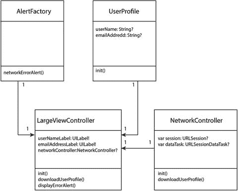

# 8. 处理遗留代码

如果你从事 iOS 应用开发已有数年，很可能曾受命为某个现有应用添加新功能，该项目拥有庞大代码库，历经多年构建，由数十名开发者共同维护，而其中大多数开发者早已转投其他项目。

项目几乎没有文档，要么完全没有单元测试，要么只有寥寥几个过时的测试，运行时甚至有些会失败。这是行业中许多项目面临的现实困境。有时，相关开发者可能并不了解测试的益处，或者不清楚该测试什么；另一些情况下，业务方并未充分支持投入 TDD 或 BDD 技术，因此开发者只有在时间充裕时才会编写测试。

通常，我们无法花费数月时间重构多年的遗留代码。作为团队新成员，你能做的最好的事就是为你编写的新代码提供适当水平的测试。

本章将介绍几种技术，帮助你向大型遗留代码库添加新代码，同时为新代码编写有意义的测试。单章内容无法涵盖所有重构技术——已有整本书籍专门探讨重构主题。关于重构技术（虽非专指 iOS）的佳作是迈克尔·C·费瑟斯（Michael C. Feathers）所著的《与遗留代码有效合作》¹。

## 拆分大型类

在许多情况下，你想要修改的类已经非常庞大。它变得如此庞大的原因，很可能是因为没有人花精力重构这个类，而到某个节点它变得过于庞大，以至于没人知道从何入手。

面对这个问题时，你可以采用一种方法：基于单一职责原则将类拆分为更小的类——即为每个碎片类分配单一职责。这也被称为单一职责原则：它本质上意味着任何给定的类应执行离散且定义明确的功能，而其他功能则依赖其他类。

举例来说，考虑一个大型视图控制器类：它通过网络请求从互联网下载 JSON 文档、解析文档，并更新屏幕上的若干 UI 元素。清单 8-1 展示了一个名为 `LargeViewController.swift` 的类代码。

```swift
import UIKit
class LargeViewController: UIViewController {
@IBOutlet weak var userNameLabel: UILabel!
@IBOutlet weak var emailAddressLabel: UILabel!
private var session:URLSession?
private var dataTask:URLSessionDataTask?
override func viewDidLoad() {
super.viewDidLoad()
downloadUserProfile()
}
override func didReceiveMemoryWarning() {
super.didReceiveMemoryWarning()
// Dispose of any resources that can be recreated.
}
func downloadUserProfile() {
self.session = URLSession(configuration: URLSessionConfiguration.default)
guard let session = self.session,
let url = URL(string: "http://someservice.com/getuser/") else {
return
}
dataTask = session.dataTask(with: url,
completionHandler: { (data, response, error) in
if let _ = error {
DispatchQueue.main.async {
let alertController = UIAlertController(title: "Error",
message: "Unable to download user profile",
preferredStyle: .alert)
let defaultAction = UIAlertAction(title: "OK",
style: .default, handler: nil)
alertController.addAction(defaultAction)
self.present(alertController, animated: true, completion: nil)
}
return
}
if let response = response as? HTTPURLResponse,
let data = data {
if response.statusCode != 200 {
DispatchQueue.main.async {
let alertController = UIAlertController(title: "Error",
message: "Unable to download user profile",
preferredStyle: .alert)
let defaultAction = UIAlertAction(title: "OK",
style: .default, handler: nil)
alertController.addAction(defaultAction)
self.present(alertController, animated: true, completion: nil)
}
}
guard let dictionary =
try? JSONSerialization.jsonObject(with: data,
options: JSONSerialization.ReadingOptions.mutableContainers)
as? [String : AnyObject] else {
DispatchQueue.main.async {
let alertController = UIAlertController(title: "Error",
message: "Unable to download user profile",
preferredStyle: .alert)
let defaultAction = UIAlertAction(title: "OK",
style: .default, handler: nil)
alertController.addAction(defaultAction)
self.present(alertController,
animated: true, completion: nil)
}
return
}
if let userName = dictionary?["username"] as? String,
let emailAddress = dictionary?["emailAddress"] as? String {
DispatchQueue.main.async {
self.userNameLabel.text = userName
self.emailAddressLabel.text = emailAddress
}
}
}
return
})
dataTask?.resume()
}
}
```

这个类的根本问题在于它承担了过多职责。它当前的责任包括：

- 处理视图生命周期事件。
- 发起网络请求。
- 处理网络错误。
- 解析数据。
- 更新用户界面。

为了将这个类拆分为更小的类，你需要决定拆分点以及应创建多少个较小的类。你可以基于该类当前的职责来做出这些决策。


作为一个视图控制器，它应当处理视图生命周期事件并包含更新用户界面的代码。其他职责可以委托给其他对象。基于这一思路，可以设计以下类：

- `LargeViewController.swift`：视图控制器类，处理视图生命周期事件并包含更新 UI 的逻辑。
- `NetworkController.swift`：专门负责发起网络请求并处理相关错误的类。
- `UserProfile.swift`：用户档案模型对象类，包含将字典内容解析为实例变量的逻辑。
- `AlertFactory.swift`：负责创建警示控制器的类。

图 8-1 展示了这种新方案的类图。



图 8-1. 重构后的 `LargeViewController` 类图

重构后的 `LargeViewController.swift` 类如代码清单 8-2 所示。

```swift
import UIKit
class RefactoredLargeViewController: UIViewController {
    @IBOutlet weak var userNameLabel: UILabel!
    @IBOutlet weak var emailAddressLabel: UILabel!
    private var networkController: NetworkController?

    override func viewDidLoad() {
        super.viewDidLoad()
        downloadUserProfile()
    }

    override func didReceiveMemoryWarning() {
        super.didReceiveMemoryWarning()
        // Dispose of any resources that can be recreated.
    }

    func downloadUserProfile() {
        self.networkController = NetworkController()
        networkController?.downloadUserProfile(success: { (data) in
            if let userProfile = UserProfile(data) {
                DispatchQueue.main.async {
                    self.userNameLabel.text = userProfile.userName
                    self.emailAddressLabel.text = userProfile.emailAddress
                }
            }
        }, failure: { (error) in
            self.displayErrorAlert()
        })
    }

    func displayErrorAlert() {
        DispatchQueue.main.async {
            self.present(AlertFactory.networkErrorAlert(), animated: true, completion: nil)
        }
    }
}
```
代码清单 8-2. `RefactoredLargeViewController.swift`

`NetworkController.swift` 类如代码清单 8-3 所示。

```swift
import Foundation
class NetworkController: NSObject {
    var session: URLSession?
    var dataTask: URLSessionDataTask?
    let userProfileURL = "http://someservice.com/getuser/"

    override init() {
        super.init()
        self.session = URLSession(configuration:
            URLSessionConfiguration.default)
    }

    func downloadUserProfile(success: @escaping (Data) -> Void,
                             failure: @escaping (NSError) -> Void) -> Void {
        guard let session = session else {
            failure(NSError(domain: "NetworkController",
                            code:100, userInfo: nil))
            return
        }
        guard let url = URL(string: userProfileURL) else {
            failure(NSError(domain: "NetworkController",
                            code:101, userInfo: nil))
            return
        }
        dataTask = session.dataTask(with: url,
                                    completionHandler: { (data, response, error) in
            if let error = error {
                failure(error as NSError)
                return
            }
            if let response = response as? HTTPURLResponse,
               let data = data {
                if response.statusCode == 200 {
                    success(data)
                    return
                }
            }
            failure(NSError(domain: "ServiceController",
                            code:102, userInfo: nil))
            return
        })
        dataTask?.resume()
    }
}
```
代码清单 8-3. `NetworkController.swift`

`UserProfile.swift` 类如代码清单 8-4 所示。

```swift
import Foundation
class UserProfile : NSObject {
    var userName: String?
    var emailAddress: String?

    init?(_ data: Data?) {
        guard let data = data,
              let dictionary = try? JSONSerialization.jsonObject(with: data,
                  options: JSONSerialization.ReadingOptions.mutableContainers)
                  as? [String : AnyObject],
              let userName = dictionary?["username"] as? String,
              let emailAddress = dictionary?["emailAddress"] as? String else {
            return nil
        }
        self.userName = userName
        self.emailAddress = emailAddress
    }
}
```
代码清单 8-4. `UserProfile.swift`

`AlertFactory.swift` 类如代码清单 8-5 所示。

```swift
import UIKit
class AlertFactory : NSObject {
    static func networkErrorAlert() -> UIAlertController {
        let alertController = UIAlertController(title: "Error",
                                                message: "Unable to download user profile",
                                                preferredStyle: .alert)
        let defaultAction = UIAlertAction(title: "OK",
                                          style: .default, handler: nil)
        alertController.addAction(defaultAction)
        return alertController
    }
}
```
代码清单 8-5. `AlertFactory.swift`

严格来说，`LargeViewController.swift` 仍然有多个职责：管理生命周期事件和更新用户界面。如果希望进一步重构该类，可以使用 MV-VM 架构模式引入视图模型对象，将更新用户界面的职责转移到视图模型中。

这个练习应该能让你了解如何处理将大类拆分为更小、更专注、更易管理的类的方法。

## 向现有类添加功能

将大类重构为小类在某些情况下可能涉及大量时间和精力。作为开发者，你可能被要求在现有遗留类中添加功能，却没有足够的时间先进行重构。

在本节中，我们将介绍一些技术，使你能够以这样一种方式向现有类添加功能——将来时间允许时，你可以重新审视该类并将代码移入单独的辅助类中。

### 使用类和方法进行封装

在向遗留类的现有方法中添加代码时，最好将新代码封装到一个新方法中，并从现有方法中调用新方法。这种方法有几个优点：

- 可以为新方法编写测试。
- 不会向一个庞大且未经测试的遗留方法中添加更多代码。
- 这种技术可能要求你从源方法中注入一些局部变量作为新方法的依赖项；这种做法有助于为未来的进一步重构打下基础。

在某些情况下，你计划添加新方法的类非常复杂，难以纳入测试。这通常发生在该类具有很长的依赖列表且需要在初始化器中提供多个参数时。

在这种情况下，你可以将新代码封装在新类的方法中，并在遗留方法中创建新类的对象。这种技术也称为“Break Out Method Object”。¹ 然而，以这种方式使用新类应被视为临时方案。你应当计划在不久的将来重新审视源方法/类，并进行适当的重构。如果不这样做，就有可能在代码库中创建成百上千个没有明确目的的小类。

作为示例，我们重新审视代码清单 8-1 中的`LargeViewController`类。假设要求你编写一些代码，对下载的用户档案中的电子邮件地址进行字段级验证，并拒绝包含无效电子邮件地址的档案。再假设当前`LargeViewController`中的任何代码都没有测试，并且你没有时间重构该类。

一种可能的方法是将验证逻辑写在`downloadUserProfile()`函数内部，如代码清单 8-6 中的粗体部分所示。


```
func downloadUserProfile() {
self.session = URLSession(configuration:
URLSessionConfiguration.default)
guard let session = self.session,
let url = URL(string: "http://someservice.com/getuser/") else {
return
}
dataTask = session.dataTask(with: url,
completionHandler: { (data, response, error) in
if let _ = error {
DispatchQueue.main.async {
let alertController = UIAlertController(title: "Error",
message: "无法下载用户资料",
preferredStyle: .alert)
let defaultAction = UIAlertAction(title: "确定",
style: .default, handler: nil)
alertController.addAction(defaultAction)
self.present(alertController, animated: true,
completion: nil)
}
return
}
if let response = response as? HTTPURLResponse,
let data = data {
if response.statusCode != 200 {
DispatchQueue.main.async {
let alertController = UIAlertController(title: "Error",
message: "无法下载用户资料",
preferredStyle: .alert)
let defaultAction = UIAlertAction(title: "确定",
style: .default, handler: nil)
alertController.addAction(defaultAction)
self.present(alertController,
animated: true, completion: nil)
}
}
guard let dictionary =
try? JSONSerialization.jsonObject(with: data,
options: JSONSerialization.ReadingOptions.mutableContainers)
as? [String : AnyObject] else {
DispatchQueue.main.async {
let alertController = UIAlertController(title: "Error",
message: "无法下载用户资料",
preferredStyle: .alert)
let defaultAction = UIAlertAction(title: "确定",
style: .default, handler: nil)
alertController.addAction(defaultAction)
self.present(alertController,
animated: true, completion: nil)
}
}
if let userName = dictionary?["username"] as? String,
let emailAddress = dictionary?["emailAddress"] as? String {
// 验证邮箱地址
if (emailAddress.characters.count  0 {
return
}
let numbers = Set("0123456789".characters)
if (emailAddress.characters.filter
{numbers.contains($0)}).count > 0 {
return
}
let specialCharacters =
Set("+,!#$%^&*();\\/|\"".characters)
if (emailAddress.characters.filter
{specialCharacters.contains($0)}).count > 0 {
return
}
guard let regexValidator = try? NSRegularExpression(pattern:
"([A-Z0-9._%+-]+@[A-Z0-9.-]+\\.[A-Z]{2,4})",
options: .caseInsensitive) else {
return
}
if regexValidator.numberOfMatches(in: emailAddress,
options:
NSRegularExpression.MatchingOptions.reportCompletion,
range: NSMakeRange(0, emailAddress.characters.count))> 0{
return
}
DispatchQueue.main.async {
self.userNameLabel.text = userName
self.emailAddressLabel.text = emailAddress
}
}
}
return
})
dataTask?.resume()
}
```

清单 8-6. `downloadUserProfile()` 中的内联实现

这种方法的缺点在于，它为一个本就代码量很大且未经测试的方法添加了更多代码。另一种方法是创建一个新类来处理邮箱地址验证，并将验证逻辑封装在该类的一个方法中。清单 8-7 展示了名为 `EmailAddressValidator` 的类。

```
import Foundation
class EmailAddressValidator: NSObject {
func validate(_ value:String) -> Bool {
if (value.characters.count  0 {
return false
}
let numbers = Set("0123456789".characters)
if (value.characters.filter {numbers.contains($0)}).count > 0 {
return false
}
let specialCharacters = Set("+,!#$%^&*();\\/|\"".characters)
if (value.characters.filter {specialCharacters.contains($0)}).count > 0 {
return false
}
guard let regexValidator = try? NSRegularExpression(pattern: "([A-Z0-9._%+-]+@[A-Z0-9.-]+\\.[A-Z]{2,4})", options: .caseInsensitive) else {
return false
}
if regexValidator.numberOfMatches(in: value,
options: NSRegularExpression.MatchingOptions.reportCompletion,
range: NSMakeRange(0, value.characters.count)) > 0 {
return true
}
return false
}
}
```

清单 8-7. `EmailAddressValidator.swift`

由于这个类是新创建的，且不依赖于任何现有类，因此很容易对其进行测试。有了这个类，向 `downloadUserProfile()` 添加邮箱地址验证功能只需在该方法中增加三行代码：

```
if let userName = dictionary?["username"] as? String,
let emailAddress = dictionary?["emailAddress"] as? String {
let validator = EmailAddressValidator()
if validator.validate(emailAddress) == false {
return
}
DispatchQueue.main.async {
self.userNameLabel.text = userName
self.emailAddressLabel.text = emailAddress
}
}
```

### 重命名与替换

如果你要对一个方法进行的修改是增加前置条件或后置条件，那么与其在源方法的开头/结尾添加代码，不如重命名源方法，并创建一个与源方法同名的新方法。现在你可以将代码添加到这个新方法中，然后从新方法调用原始方法。这种技术也称为**封装方法**。¹

举个例子，考虑另一个场景：要求你仅在互联网连接可用时启动下载凭据的过程，并且在成功下载有效凭据后将其保存到系统钥匙串中。

这些修改要求你在开始下载之前添加一些代码，并在下载成功后添加一些代码。如果你采用本节所述的策略，那么你将创建一个名为 `downloadProfileHelper()` 的新私有方法，并将 `downloadProfile()` 中的所有现有代码移至 `downloadProfileHelper()`。

就类的公共接口而言，没有任何变化。在新的（当前为空的）`downloadProfile()` 方法中，你仍然会调用 `downloadProfileHelper()`；但你会用两个新方法的调用来包围这个调用，其中一个方法包含检查互联网连接的逻辑，另一个方法负责将凭据保存到钥匙串。

你的解决方案如下所示：

```
func downloadUserProfile() {
if internetConnectionExists() {
downloadUserProfileHelper()
saveUserCredentialsToKeychain()
}
}
func internetConnectionExists() -> Bool {
// 检查互联网连接是否存在的代码
}
func saveUserCredentialsToKeychain() {
// 将用户凭据保存到钥匙串的代码
}
func downloadUserProfileHelper() {
// downloadUserProfile 中之前存在的所有代码
}
```


### 装饰器

在为遗留代码库添加新代码时，另一个巧妙的技巧是利用装饰器设计模式。装饰器设计模式允许你通过将一个类包装在另一个类中来为其添加功能，而新功能由包装类提供。

装饰器模式最好通过示例来解释。清单 8-8 展示了第 4 章开发的 `BankAccount` 类。

```swift
import Foundation
class BankAccount: NSObject {
var accountName:String
var accountNumber:String
var sortingCode:String
var accountType:AccountType
var transactions:[Transaction]
var owners:[AccountOwner]
var accountBalance:Float {
get {
var balance:Float = 0.0
for transaction in self.transactions {
if let amount = Float(transaction.amount) {
if transaction.isIncoming {
balance += amount
} else {
balance -= amount
}
}
}
return balance
}
}
init?(accountName:String,
accountNumber:String,
sortingCode:String,
accountType:AccountType,
owners:[AccountOwner],
accountNameValidator:AccountNameValidator? = nil,
accountNumberValidator:AccountNumberValidator? = nil,
sortingCodeValidator:SortingCodeValidator? = nil) {
let validator1 = accountNameValidator ?? AccountNameValidator()
if validator1.validate(accountName) == false {
return nil
}
let validator2 = accountNumberValidator ?? AccountNumberValidator()
if validator2.validate(accountNumber) == false {
return nil
}
let validator3 = sortingCodeValidator ?? SortingCodeValidator()
if validator3.validate(sortingCode) == false {
return nil
}
if (owners.count == 0 || owners.count > 2) {
return nil
}
self.accountName = accountName
self.accountNumber = accountNumber
self.sortingCode = sortingCode
self.accountType = accountType
self.owners = owners
self.transactions = [Transaction]()
}
func setOpeningBalance(_ amount:Float) -> Void {
if let openingBalanceTransaction = Transaction(txDescription: "Opening Balance", date: NSDate(), isIncoming: true, amount: "100.0") {
self.transactions.removeAll()
self.transactions.append(openingBalanceTransaction)
}
}
func withdraw(_ amount:Float, _ person:AccountOwner?) -> Void {
if let newTransaction = Transaction(txDescription: "ATM Withdrawal", date: NSDate(), isIncoming: false, amount: "\(amount)") {
self.transactions.append(newTransaction)
}
}
func deposit(_ amount:Float, _ person:AccountOwner?) -> Void {
if let newTransaction = Transaction(txDescription: "Cash Deposit", date: NSDate(), isIncoming: true, amount: "\(amount)") {
self.transactions.append(newTransaction)
}
}
}
清单 8-8.
BankAccount.swift
```

这个类有一个非常简单的接口，可以用来表示银行账户，并在银行系统中包含一系列交易记录。

现在，假设由于业务需求的变化，银行系统需要升级以区分个人账户和商业账户。两种类型的账户都需要应用每日存款和取款限额。此外，商业账户的所有存款和取款都需要记录到一个特殊的审计系统中。

这些需求可以通过创建名为 `PersonalBankAccount` 和 `BusinessBankAccount` 的装饰器类轻松处理，它们在现有 `BankAccount` 类的基础上提供额外功能，从而满足这些特定账户类型的需求。

首先，让我们将 `BankAccount` 类的外部接口移动到一个名为 `BankAccountProtocol` 的协议中（见清单 8-9），并让 `BankAccount` 类实现这个协议。

```swift
protocol BankAccountProtocol : class {
var accountName:String {get set}
var accountNumber:String {get set}
var sortingCode:String {get set}
var accountType:AccountType {get set}
var transactions:[Transaction] {get set}
var owners:[AccountOwner] {get set}
func setOpeningBalance(_ amount:Float) -> Void
func withdraw(_ amount:Float, _ person:AccountOwner?) -> Void
func deposit(_ amount:Float, _ person:AccountOwner?) -> Void
}
清单 8-9.
BankAccountProtocol.swift
```

确保 `BankAccount` 类实现此协议所需的唯一更改是在类声明中添加协议名称：

```swift
class BankAccount: NSObject, BankAccountProtocol
```

完成此更改后，我们可以使用装饰器模式创建 `PersonalBankAccount` 类，该类将施加每日存款和取款限额（清单 8-10）。

```swift
import Foundation
class PersonalBankAccount : NSObject , BankAccountProtocol {
var bankAccount:BankAccount
var accountName:String {
get {
return bankAccount.accountName
}
set {
bankAccount.accountName = newValue
}
}
var accountNumber:String {
get {
return bankAccount.accountNumber
}
set {
bankAccount.accountNumber = newValue
}
}
var sortingCode:String {
get {
return bankAccount.sortingCode
}
set {
bankAccount.sortingCode = newValue
}
}
var accountType:AccountType {
get {
return bankAccount.accountType
}
set {
bankAccount.accountType = newValue
}
}
var transactions:[Transaction] {
get {
return bankAccount.transactions
}
set {
bankAccount.transactions = newValue
}
}
var owners:[AccountOwner] {
get {
return bankAccount.owners
}
set {
bankAccount.owners = newValue
}
}
var accountBalance:Float {
get {
return bankAccount.accountBalance
}
}
init(_ bankAccount:BankAccount) {
self.bankAccount = bankAccount
super.init()
}
func setOpeningBalance(_ amount:Float) -> Void {
bankAccount.setOpeningBalance(amount)
}
func withdraw(_ amount:Float, _ person:AccountOwner?) -> Void {
if withinDailyWithdrawalLimit(amount) {
bankAccount.withdraw(amount, person)
}
}
func deposit(_ amount:Float, _ person:AccountOwner?) -> Void {
if withinDailyDepositlLimit(amount) {
bankAccount.deposit(amount, person)
}
}
}
extension PersonalBankAccount {
func withinDailyWithdrawalLimit(_ amount:Float) -> Bool {
// 添加代码以确保此交易不超过每日取款限额。
return true
}
func withinDailyDepositlLimit(_ amount:Float) -> Bool {
// 添加代码以确保此交易不超过每日存款限额。
return true
}
}
清单 8-10.
PersonalBankAccount.swift
```

关于 `PersonalBankAccount` 类，需要注意的一些关键点如下：

1.  创建了一个类型为 `BankAccount` 的实例变量，初始化器接受一个要注入的 `BankAccount` 实例。实际上，`PersonalBankAccount` 类包装了一个 `BankAccount` 类：

```swift
var bankAccount:BankAccount
init(_ bankAccount:BankAccount) {
self.bankAccount = bankAccount
super.init()
}
```

2.  装饰器类中的所有属性声明都会调用被包装类的对应属性：

```swift
var accountName:String {
get {
return bankAccount.accountName
}
set {
bankAccount.accountName = newValue
}
}
```

3.  `deposit` 和 `withdraw` 方法在调用被包装类的对应方法之前实现了额外的逻辑：

```swift
func withdraw(_ amount:Float, _ person:AccountOwner?) -> Void {
if withinDailyWithdrawalLimit(amount) {
bankAccount.withdraw(amount, person)
}
}
func deposit(_ amount:Float, _ person:AccountOwner?) -> Void {
if withinDailyDepositlLimit(amount) {
bankAccount.deposit(amount, person)
}
}
```


