# 持续集成

持续集成（CI）是一种软件开发方法，要求开发者频繁地将代码推送到共享仓库，并在专用的构建计算机上触发自动化的测试和构建流程。构建周期可以定时触发，也可以在每次代码推送后触发。

当在构建周期中包含了单元（或用户界面）测试套件时，CI 系统只会在所有测试通过的情况下生成构建。测试失败通常会向开发团队的所有成员发送电子邮件通知。

虽然 CI 系统并不强制要求在构建过程之前运行一套自动化测试，但拥有这些测试的关键优势在于能够尽早发现并捕获问题。如果团队中的某位开发者进行了更改，并且在将更改推送到仓库后构建立即失败，那么很可能是推送的文件中存在问题导致了构建失败。

当 CI 系统成功创建了一个构建时，该构建会存储在 CI 系统中，供团队成员下载。测试人员可以随时直接从 CI 系统获取最新的构建版本。

为了使 CI 系统正常运行，团队中的开发者必须同意以下原则：

-   频繁地将代码推送到仓库。
-   不要将损坏的代码推送到仓库。
-   在推送到仓库之前，务必在其开发机器上运行一套测试。

苹果公司提供了自己的 CI 系统，名为 **Xcode Server**，它与 Xcode 开发环境无缝集成。Xcode Server 是 macOS Server 的一部分，安装 Xcode 时不会自动安装它。要使用 Xcode Server，你需要在 Mac 上安装并配置 macOS Server 应用和 Xcode。

## 备注

一个典型的持续集成工作流程是，开发者使用开发用 Mac，并需要一个单独的专用 Mac 作为构建服务器。构建服务器上同时安装了 Xcode 和 Xcode Server。构建计算机也可以托管你的源代码仓库，或者连接到托管在 GitHub/BitBucket 上的远程仓库。如果你没有专用的构建计算机，可以在你的开发用 Mac 上安装 macOS Server 应用。

## 安装 macOS Server

安装 macOS Server 是一个直接了当的过程。正如本章前面所述，公司通常会在网络上使用一台专用 Mac 作为持续集成服务器。本章中的说明与你安装 macOS Server 的 Mac 无关。

## 注释

在你的 Mac 上安装 macOS Server 之前，必须确保以下几点：

-   你的 Mac 上已安装最新版本的 Xcode。
-   你已经下载并安装了相关的配置文件、模拟器和证书。
-   拥有该 Mac 的管理员凭证。
-   拥有一个 iTunes 账户（用于 Mac App Store）。
-   拥有访问存放源代码的 Git 仓库的凭证。

要在你打算使用 Xcode Server 的 Mac 上开始安装过程，请在 Mac App Store 中找到 macOS Server 应用，然后点击“安装”（见图 9-1）。

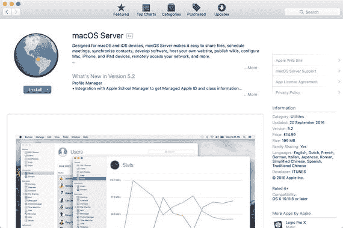

图 9-1. Mac App Store 中的 macOS Server

### 启动 macOS Server

一旦在你的 Mac 上安装了 macOS Server，可以通过从“应用程序”目录启动 `Server.app`、在聚焦搜索中输入 `Server`、或点击程序坞中的启动台图标然后点击 `Server` 来启动它。首次启动 macOS Server 应用时，会提示你进行配置（见图 9-2）。

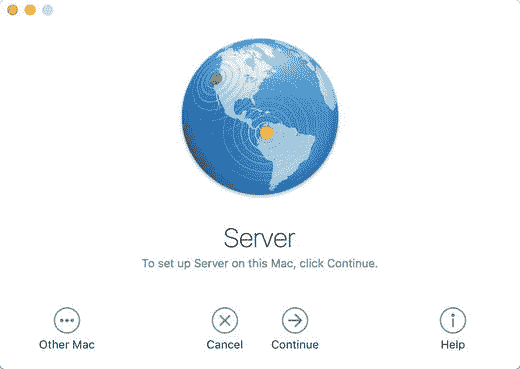

图 9-2. macOS Server 配置界面

点击“继续”后，会要求你接受许可协议的条款。接受许可协议后，系统会提示你提供 Mac 上管理员账户的凭证。提供正确的凭证后，macOS Server 将花费几分钟时间在 Mac 上安装和配置各种服务（见图 9-3）。

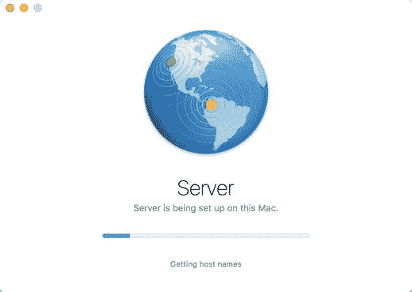

图 9-3. macOS Server 安装设置流程

在后续启动时，系统会要求你选择一个要管理的服务器实例（见图 9-4）。如果你同时在开发用 Mac 和专用构建 Mac 上安装了 macOS Server，那么你可以选择管理开发 Mac 上的本地服务器实例，或者构建 Mac 上的服务器实例。选择适当的选项，然后点击“继续”。

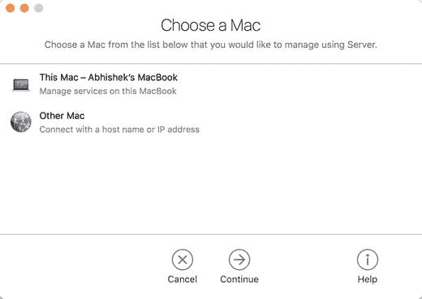

图 9-4. 选择要管理的服务器实例

仅当远程 Mac 安装了 macOS Server，并且其 Server 应用的“设置”选项卡中启用了“在远程电脑上使用 Server 应用”选项时，你才能管理远程 Mac。（见图 9-5。）

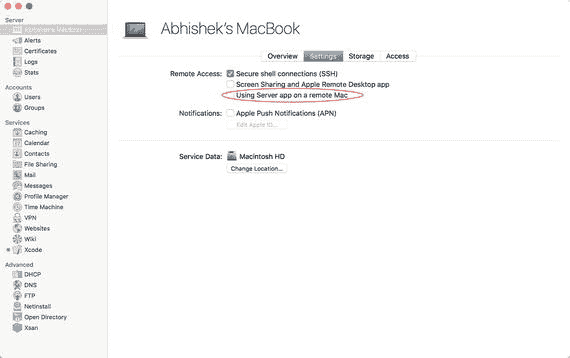

图 9-5. 远程管理 macOS Server 实例所需的设置

### 设置团队成员访问权限

如果你在专用 Mac 上运行 macOS Server，则应创建用户账户，以允许其他 Mac 上的用户连接到该服务器并访问可用服务。

在侧边栏中，点击“账户”部分下的“用户”（见图 9-6）。这将弹出可以访问 macOS Server 的用户列表。使用添加（`+`）按钮为你网络上的其他 Mac 用户创建账户。你在此处创建的凭证将供其他用户从其 Mac 连接到该服务器实例时使用，与他们用于登录自己 Mac 的凭证无关。

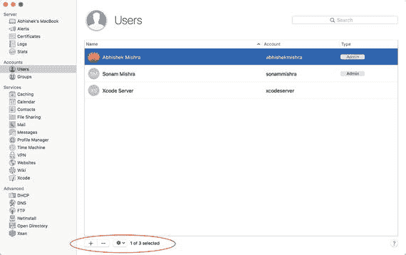

图 9-6. 为其他团队成员创建用户账户

当你的团队成员从 Xcode 连接到 Xcode Server 时，他们需要提供这些凭证。这将在本章后面的“向 Xcode 添加 Xcode Server 凭证”主题中介绍。

### 启动 Xcode Server

启动 macOS 服务器应用，在侧边栏的 `Services` 部分下，找到 `Xcode` 选项。（见图 9-7。）

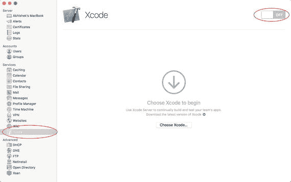

图 9-7. 启动 Xcode Server

您可以使用窗口右上角的开关来启动/停止 Xcode Server 进程。默认情况下，macOS 服务器应用提供的所有服务都是关闭的。

如果这是您首次在电脑上运行 Xcode Server，系统会要求您提供本地电脑上 Xcode 的路径，用于创建构建。如果您尚未安装 Xcode，请退出 macOS 服务器应用，从 Mac App Store 安装最新版本的 Xcode，然后从中断处继续学习。

点击 `Choose Xcode…` 按钮，在您的 `Applications` 目录中选择 `Xcode.app` 应用程序。将来，您可以从 Xcode server 设置页面选择使用不同版本的 Xcode 来创建构建。

Xcode Server 在其自己的用户账户中运行。在之前的版本中，这是在 Mac 上创建的一个隐藏用户账户。自 Xcode Server 5.2 版本起，此账户与您系统上的任何其他账户一样，您甚至可以登录此账户。

当系统要求为 Xcode Server 提供一个账户时（见图 9-8），您可以选择创建一个新账户或使用现有账户。最佳实践是为 Xcode server 保留一个专用的非管理账户，而不要使用您的日常账户。

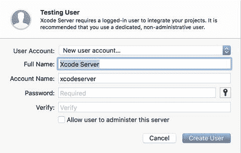

图 9-8. Xcode Server 用户账户

如果您使用的是单台 Mac 设置，且 Xcode server 与日常开发运行在同一台电脑上，则必须登录为您为 Xcode server 创建的专用用户账户。然后，您可以使用快速用户切换功能，从 Xcode Server 用户账户切换回您的日常使用账户，并让 Xcode Server 进程在后台继续运行。

**注意：** Xcode server 将“构建”称为“集成”。

一旦您为 Xcode server 提供了可用的用户账户，系统将提示您以该用户身份登录（见图 9-9）。

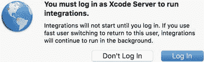

图 9-9. 使用专用用户账户登录

您可以选择立即登录，或稍后登录。如果您选择稍后登录，可以通过多种方式完成，包括使用 Xcode Server 配置页面内置的 `Login` 选项（见图 9-10）。

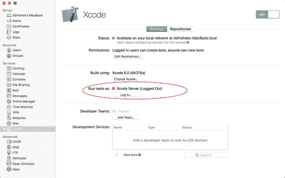

图 9-10. Xcode Server 配置页面内的登录选项

**注意：** 您无需登录指定账户，仍可继续配置 Xcode server。但是，在登录您提供的专用用户账户之前，您将无法进行集成。

### 配置 Xcode Server

Xcode Server 允许您通过设置页面配置各种参数，包括：

-   用于集成的 Xcode 版本。
-   开发者团队
-   权限
-   代码仓库

可以通过 `View` ➤ `Xcode` 菜单项访问此设置页面。该设置页面有两个标签页，分别标记为 `Settings` 和 `Repositories`（见图 9-11）。

图 9-11. Xcode Server 配置页面

Xcode 版本、权限和开发者团队可以在标记为 `Settings` 的标签页下进行配置，而代码仓库可以在标记为 `Repositories` 的标签页下进行配置。

#### Xcode 版本

要更改用于后续集成的 Xcode 版本，请点击 Xcode 服务设置页面中的 `Choose Xcode…` 按钮，然后选择与您要使用的 Xcode 版本对应的 `.app` 文件。

### Apple 开发者团队

如果您想使用 Xcode Server 在配置好的开发设备上部署构建并运行测试，则需要将服务器添加到您的 Apple 开发者账户所用的某个开发者团队中。

将服务器添加到开发者团队，将允许 Xcode Server 下载为您的设备准备构建所需的配置文件（provisioning profiles）和签名证书（signing certificates）。

要将服务器添加到您的开发者团队，请点击 Xcode 服务设置页面中的 `Add Team…` 按钮（见图 9-12）。

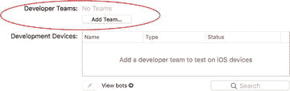

图 9-12. 将 Xcode Server 添加到您的 Apple 开发者账户

系统将要求您登录 iOS 开发者账户并选择一个开发者团队。输入您的 iOS 开发者账户凭据，然后点击 `Sign-In`（见图 9-13）。

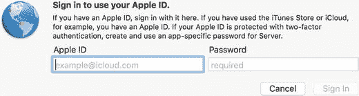

图 9-13. 使用 Apple 开发者凭据登录

#### 开发设备

在将开发者团队添加到 Xcode server 后，您可以将已配置的开发设备连接到运行 Xcode Server 的 Mac。此设备可用于运行自动化测试。您将在“开发设备”列表中看到所有已连接的设备（见图 9-14）。如果断开设备与 Mac 的连接，它将从此列表中移除。

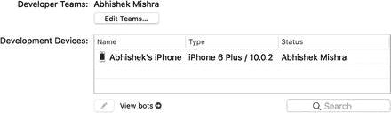

图 9-14. 已连接的设备在“开发设备”部分可见

#### 代码仓库

Xcode Server 要求您将其连接到一个或多个源代码仓库。这些代码仓库本身可以远程托管，也可以在 Xcode Server 内托管。对于远程托管的代码仓库，Xcode Server 支持 Git 和 Subversion；但对于本地托管的代码仓库，Xcode Server 仅支持 Git。

如果您的代码仓库托管在远程服务器（例如 BitBucket 或 GitHub）上，则无需使用代码仓库标签页中的任何选项。相反，您需要在开发机的 Xcode 中配置适当的访问凭据，并且在从 Xcode 内部在 Xcode server 上创建构建作业（也称为 Bot）时，也需要提供这些凭据。

如果您的代码仓库没有托管在远程服务器上，您可以使用代码仓库标签页中的选项来创建将在 Xcode Server 内托管的 Git 代码仓库。

### 在 Xcode Server 上创建新的 Git 仓库

图 9-15 展示了仓库标签页中可用的选项。在此标签页中，你可以管理托管在 Xcode Server 中的仓库，配置安全协议，以及设置可以访问这些仓库的用户列表。

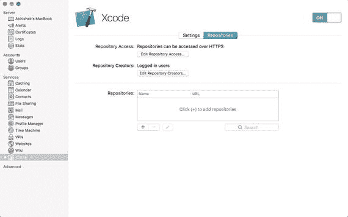

图 9-15. Xcode Server 仓库标签页

要配置可用于验证连接到 Xcode Server 中托管的仓库的用户的安全协议，请点击“编辑仓库访问…”按钮。系统会弹出一个对话框，要求你选择允许的协议。可选的协议有 `HTTPS` 和 `SSH`（见图 9-16）。

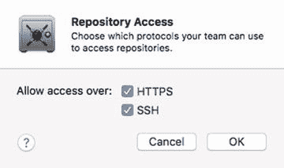

图 9-16. Xcode Server 中托管仓库的安全协议设置

要配置可以访问 Xcode Server 中托管的仓库的用户列表，请点击“编辑仓库创建者”。默认情况下，任何已在 Xcode 中登录 Xcode Server 的用户都可以访问你的仓库并创建 Bot。

希望连接到这些仓库的用户需要在其开发 Mac 上的 Xcode 中添加账户凭据，以便 Xcode 能够访问这些仓库。这通常通过 Xcode 中的“账户”偏好设置部分完成，本章稍后会对此进行介绍。

要创建新仓库，请点击仓库列表下方的“添加 (+)”按钮（见图 9-17）。

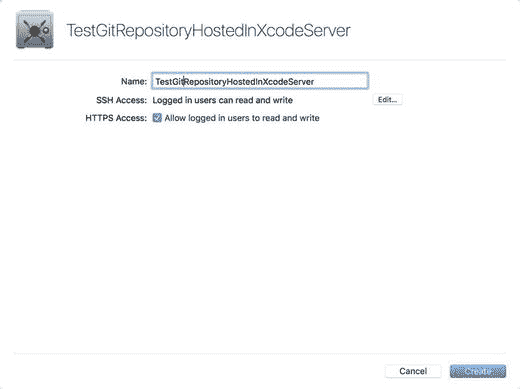

图 9-17. 在 Xcode Server 中创建新仓库

输入仓库名称，该名称将出现在“托管的仓库”列表中，并成为访问 URL 的一部分。

点击“编辑”按钮，指定能够通过 `SSH` 访问仓库的用户。要启用 `HTTPS` 访问，请选中“允许已登录用户读写”复选框。

点击“创建”完成新 Git 仓库的创建。新仓库将出现在仓库列表中。要更改谁有权访问该仓库，请从仓库列表中选择该仓库，然后点击列表下方的“编辑”按钮（见图 9-18）。

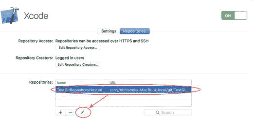

图 9-18. 编辑有权访问现有仓库的用户

## 配置 Xcode

在本节中，我们将介绍如何将开发 Mac 上的 Xcode 连接到 Xcode Server 实例并克隆仓库。

### 向 Xcode 添加 Xcode Server 凭据

要在你的开发 Mac 上访问托管在 Xcode Server 上的 Git 仓库，以及在 Xcode Server 上创建 Bot，你需要将开发 Mac 上的 Xcode 连接到 Xcode Server。

在你的开发 Mac 上启动 Xcode，然后选择 `Xcode ➤ 偏好设置` 菜单项。切换到“账户”标签页（见图 9-19）。

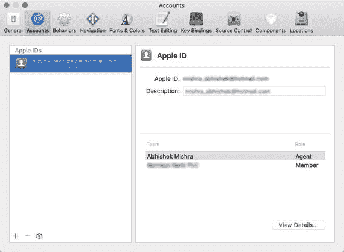

图 9-19. Xcode 账户偏好设置

此标签页列出了你的开发账户、远程托管的仓库以及 Xcode Server 实例。要将 Xcode 连接到你的 Xcode Server 实例，请点击列表底部的“添加 (+)”按钮，然后从选项列表中选择“添加服务器…”。

从服务器列表中选择一个 Xcode Server 实例，然后点击“添加”（见图 9-20）。

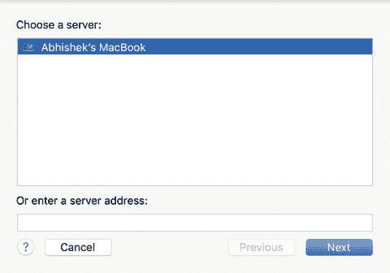

图 9-20. 在 Xcode 中添加指向远程 Xcode Server 实例的书签

当提示输入访问凭据时，请输入用户名和密码（这应该由你的 Xcode Server 管理员提供给你）。

现在，你将在“账户”标签页的“服务器”部分下看到列出的构建服务器（见图 9-21）。

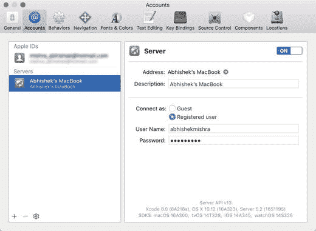

图 9-21. 显示 Xcode Server 实例的 Xcode 账户页面

### 创建新的 Xcode 项目并将其仓库托管在 Xcode Server 上

一旦你在 Xcode 中添加了访问 Xcode Server 的凭据，就可以将你创建的每个新项目的仓库托管在服务器上。为此，当系统要求你选择新项目的位置时，请启用“源代码控制”复选框，并从可用选项列表中选择服务器名称（见图 9-22）。

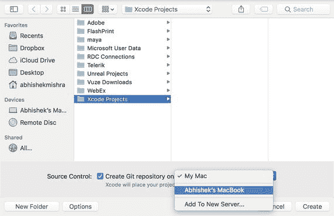

图 9-22. 在 Xcode Server 上托管新项目的仓库

如果服务器没有出现在列表中，请确保已将服务器添加到 Xcode，并且你的用户帐户具有在 Xcode Server 上创建仓库的权限。

### 将现有的本地仓库克隆到 Xcode Server

如果你在开发 Mac 上的 Git 仓库中有一个现有的 Xcode 项目，并希望将该仓库克隆到 Xcode Server，请打开 Xcode 项目并点击 `源代码控制 ➤ 你的项目名称 ➤ 配置` 菜单项。`你的项目名称` 是你的 Xcode 项目名称的占位符（见图 9-23）。

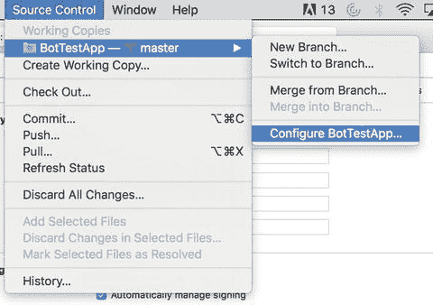

图 9-23. 为现有 Xcode 项目配置源代码控制选项

切换到“远程”标签页，点击“添加 (+)”按钮，然后从上下文菜单中选择“创建新的远程”（见图 9-24）。

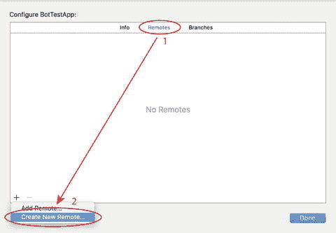

图 9-24. 仓库配置对话框

选择一个正在运行的 Xcode Server 实例，输入一个有助于你识别远程仓库的名称，然后点击“创建”。

### 从 Xcode Server 克隆 Git 仓库

如果你在 Xcode Server 上有一个现有仓库，并希望将其克隆到你的开发用 Mac 上，请在此 Mac 上启动 Xcode，然后选择 **“Xcode”** ➤ **“偏好设置”** 菜单项。

切换到 **“账户”** 标签，点击 **“账户/仓库/服务器”** 列表底部的 **“添加 (+)”** 按钮，然后从选项列表中选择 **“添加仓库…”**。

系统将弹出一个对话框，让你提供新仓库的详细信息（见图 9-25）。

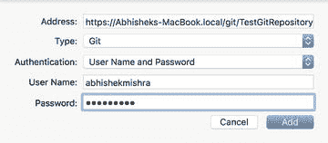

图 9-25. 从 Xcode Server 克隆仓库

在 **“地址”** 字段中，输入 Xcode Server 上仓库的 URL。该 URL 以 `https` 或 `ssh` 开头，具体取决于你希望使用的安全协议。该 URL 可以从 Xcode Server 内的仓库设置中获取。

例如，以下 URL 表示一个名为 **“TestGitRepositoryHostedOnXcodeServer”** 的仓库，它托管在名为 **“Abhisheks-MacBook”** 的 Mac 上运行的 Xcode Server 中，并通过 HTTPS 访问。

`https://Abhisheks-MacBook.local/git/TestGitRepositoryHostedOnXcodeServer.git`

在仓库类型组合框中指定 **“Git”**，并将身份验证设置为 **“用户名和密码”**。输入访问该仓库所需的凭据，然后点击 **“添加”**。

你的仓库现在将出现在账户对话框的仓库列表中（见图 9-26）。至此，你已成功在 Xcode 中为 Git 仓库添加了一个书签。

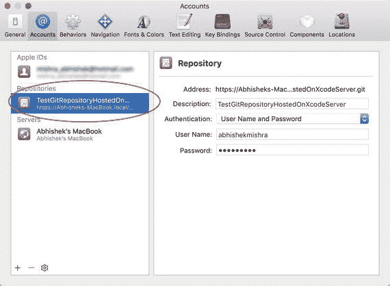

图 9-26. Xcode 账户对话框中列出的远程仓库

要在你的开发用 Mac 上签出仓库，请关闭账户对话框，然后使用 **“源代码控制”** ➤ **“签出”** 菜单项。从可用的仓库名称列表中选择该仓库，然后点击 **“下一步”**。在硬盘上指定一个位置来保存仓库克隆，然后点击 **“下载”**。

### 从 GitHub 克隆 Git 仓库

如果你在 GitHub/BitBucket 上托管了一个现有仓库，并希望将其克隆到你的开发用 Mac 上，请在此 Mac 上启动 Xcode，然后选择 **“Xcode”** ➤ **“偏好设置”** 菜单项。

切换到 **“账户”** 标签，点击 **“账户/仓库/服务器”** 列表底部的 **“添加 (+)”** 按钮，然后从选项列表中选择 **“添加仓库…”**。

在 **“地址”** 字段中，输入远程仓库的 URL。在仓库类型组合框中指定 **“Git”**，并将身份验证设置为 **“用户名和密码”**。输入访问该仓库所需的凭据，然后点击 **“添加”**。该仓库现在将出现在账户对话框的仓库列表中。

要在你的开发用 Mac 上签出仓库，请关闭账户对话框，然后使用 **“源代码控制”** ➤ **“签出”** 菜单项。从可用的仓库名称列表中选择该仓库，然后点击 **“下一步”**。在硬盘上指定一个位置来保存仓库克隆，然后点击 **“下载”**。

## 创建与集成 Bot

Bot 是一种在服务器端运行的进程（在 Xcode Server 上执行），用于对项目的当前版本执行集成。Bot 的单次运行称为一次集成，包括从仓库拉取项目代码的最新版本、构建项目、运行测试、创建构建产物（`.ipa` 文件）以及归档构建产物。

你可以将 bot 配置为按需执行集成、按计划执行集成，或在代码每次被推送到仓库时执行集成。创建能够在开发团队成员推送代码时自动执行集成的 bot，使得 bot（以及 Xcode Server）在任何持续集成流水线中都成为一项宝贵的工具。

除了按计划集成和按需集成之外，当你更新已安装的 Xcode 版本时，bot 也会自动执行集成。这些集成会在任何常规计划集成之前立即运行。你可以将这些集成与之前的集成进行比较，以识别可能因升级而遇到的问题。

> **注**  
> 本章本节中的截图基于从 GitHub 上的现有仓库签出现有项目。你需要使用自己仓库中托管的项目来执行这些步骤。

### 创建 Bot

要在 `Xcode Server` 上为项目创建一个 bot，项目的代码必须先提交到仓库，并且必须使用本章前面列举的技术之一将该仓库添加到 `Xcode` 或 `Xcode Server` 中。

除了将项目保存在仓库中外，您还需要共享项目的构建方案。构建方案汇集了有关特定构建配置和目标的信息。共享方案是发布到仓库的方案，从而使它对 `Xcode Server` 可见。

当您创建新的 `iOS` 项目时，`Xcode` 会创建一个默认方案，该方案执行以下操作：

- `Analyze`：执行静态代码分析。
- `Test`：运行单元测试和/或 UI 测试。
- `Archive`：创建一个 `.ipa` 可执行文件。

> **注意**  
> 调试方案中的归档操作默认设置为归档一个发布版本。创建发布版本需要在项目中设置适当的配置文件（provisioning profiles）和证书。您还需要确保这些配置文件和证书已安装在构建 Mac 上。

然而，默认的构建方案并未共享。要共享构建方案，请在 `Xcode` 中打开包含该构建方案的项目，并使用 `Product ➤ Scheme ➤ Manage Schemes` 菜单项。这将显示为项目定义的所有构建方案的列表（见图 9-27）。

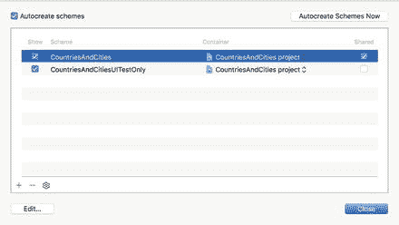  
*图 9-27. Xcode 方案*

为您想要共享的方案选中共享复选框，提交更改，并推送提交（如果您使用的是 `Git` 仓库）。

共享方案后，您可以使用 `Product ➤ Create Bot` 菜单项创建一个 bot。输入一个有助于您识别该 bot 的名称，选择一个 `Xcode Server` 实例（图 9-28），然后点击**下一步**。

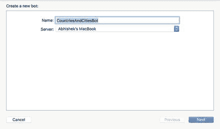  
*图 9-28. 创建新 Bot*

系统会要求您使用服务器管理员提供的凭据登录到 `Xcode Server` 实例。每个 bot 都会将其自己的凭据安全地存储在钥匙串中。

接下来，选择您希望为其创建 bot 的仓库分支（见图 9-29）。当前检出的分支将被默认选中。选择合适的分支并点击**下一步**。

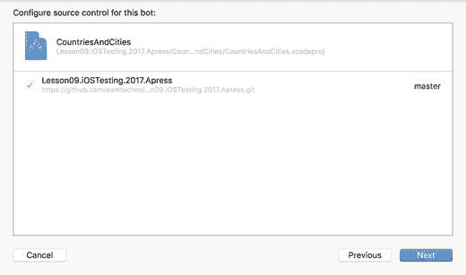  
*图 9-29. 为 Bot 配置源代码管理*

现在您将看到五个配置页面中的第一个（见图 9-30）。在第一个配置页面中，您可以指定方案以及希望执行的构建操作。可用的操作选项包括 `Analyze`、`Test` 和 `Archive`。

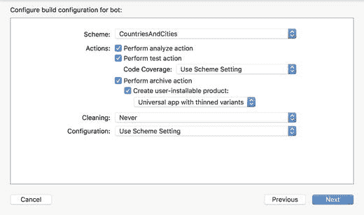  
*图 9-30. 为 Bot 配置构建配置*

如果您希望执行干净构建，请在 `Cleaning` 下拉菜单中选择相应的选项。可用选项包括：

- `Always`（总是）
- `Once a day`（每天一次）
- `Once a week`（每周一次）
- `Never`（从不）

干净构建涉及在构建操作之前执行清理操作。在清理操作期间，将删除之前构建遗留的临时构建文件。

如果您希望覆盖方案中定义的构建配置，可以使用 `Configuration` 下拉菜单中的选项。可用选项如下：

- `Use Scheme Setting`（使用方案设置）
- `Debug`
- `Release`

当您完成此页面上的选项设置后，点击**下一步**进入第二个配置页面（见图 9-31）。

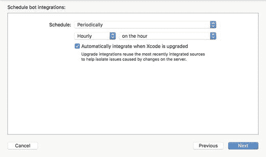  
*图 9-31. 配置集成计划*

在此页面上，您可以为 bot 配置集成计划。您可以创建三种类型的计划：

- `Periodic`（定期）：`Xcode Server` 将按照特定的重复计划集成 bot。
- `On commit`（提交时）：`Xcode Server` 将在任何团队成员每次提交/推送后集成 bot。
- `Manual`（手动）：仅当您手动请求时才集成 bot。

除了指定的计划外，如果您还希望每当构建 Mac 上的 `Xcode` 升级时 `Xcode Server` 能自动集成该 bot，请确保选中“`Automatically integrate when Xcode is upgraded`”（`Xcode 升级时自动集成`）复选框。

当您完成此页面上的选项设置后，点击**下一步**进入第三个配置页面（见图 9-32）。

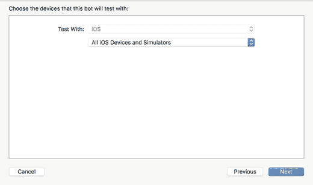  
*图 9-32. 配置测试设备*

在此页面上，您可以配置应在哪些设备（或模拟器）上执行测试构建操作。只有当您在创建 bot 时选择启用测试操作，才会显示此页面。可用选项如下：

- `All iOS Devices and Simulators`（所有 iOS 设备和模拟器）
- `All iOS Devices`（所有 iOS 设备）
- `All iOS Simulators`（所有 iOS 模拟器）
- `Specific iOS Devices`（特定 iOS 设备）

> **注意**  
> 当您选择模拟器时，必须确保该模拟器也已安装在构建 Mac 上。

当您完成此页面上的选项设置后，点击**下一步**进入第四个配置页面（见图 9-33）。

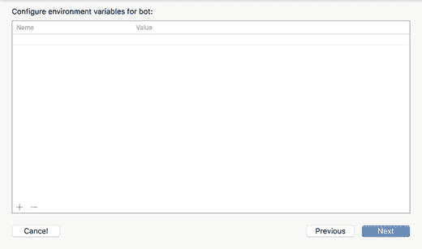  
*图 9-33. 配置环境变量*

在此页面上，您可以提供一个环境变量字典，供预集成和后集成脚本使用。然而，脚本本身将在下一步中定义。

每个环境变量由一个键（key）和一个值（value）组成。键和值都是字符串。要添加环境变量，请使用 `Add (+)` 按钮。

当您完成此页面上的环境变量设置后，点击**下一步**进入第五个配置页面（见图 9-34）。

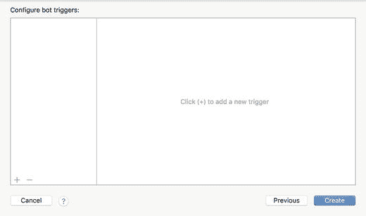  
*图 9-34. 配置触发器*

在此页面上，您可以为 bot 提供自定义触发器。要创建触发器，请点击 `Add (+)` 按钮。

触发器是 bot 可以执行的可选操作。默认情况下，未定义任何触发器。您可以定义三种类型的触发器：

- **Pre-Integration script**（预集成脚本）：在 bot 集成之前执行的 bash shell 脚本（见图 9-35）。一些开发者喜欢在此步骤执行的最常见任务是从项目中移除任何他们不希望随应用一起发布的文件。例如，包含客户数据的文件，或用于创建客户端 Web 服务存根的文件。任何用户自定义的环境变量（在上一步中定义）以及标准的 `Xcode` 环境变量都可以被预集成脚本访问。

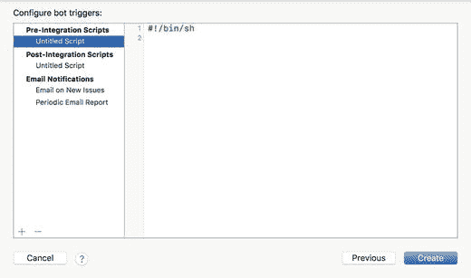  
*图 9-35. 配置预集成脚本*

- **Post-Integration script**（后集成脚本）：在应用成功构建后执行的 bash shell 脚本（见图 9-36）。开发者在此步骤执行的最常见任务包括将应用提交给安全审计服务，或将应用提交给第三方构建仓库。任何用户自定义的环境变量（在上一步中定义）以及标准的 `Xcode` 环境变量都可以被后集成脚本访问。后集成脚本可以配置为根据成功、测试失败、构建错误、构建警告或静态分析警告等条件来有条件地运行。

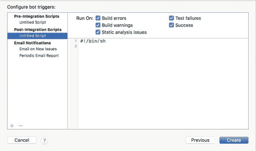  
*图 9-36. 配置后集成脚本*

### 邮件通知

电子邮件会定期（常规摘要报告）或当发生构建问题时（新问题报告）发送给选定的收件人列表。此处的构建问题包括静态分析器警告、单元测试失败以及直接构建失败（参见图 9-37）。

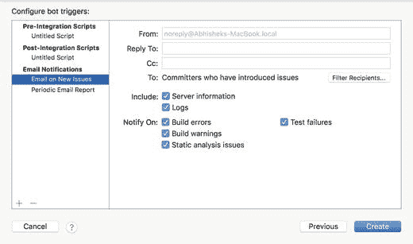

图 9-37. 配置邮件通知

完成适当触发器的设置后，点击`创建`按钮以完成机器人的创建。

### 集成机器人

您可以在`Xcode`中使用报告导航器查看已连接服务器实例上的机器人列表。要查看报告导航器，请启动`Xcode`并使用`View ➤ Navigators ➤ Show Report Navigator`菜单项。

**注意：** 如果在报告导航器中未看到您的机器人，请确保已将`Xcode`连接到`Xcode Server`实例。

在报告导航器中点击某个机器人，以查看该机器人的详细信息（参见图 9-38）。点击“Edit Bot…”可编辑创建机器人时设置的部分参数。点击`Integrate`可手动集成该机器人。

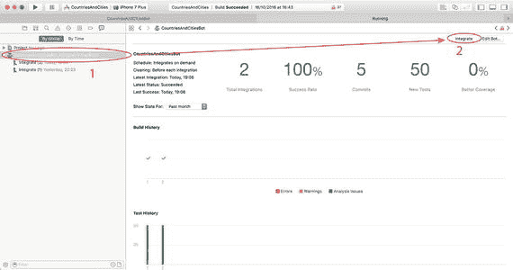

图 9-38. 使用 Xcode 集成机器人

如果机器人的计划安排表明`Xcode Server`会在特定时间自动集成该机器人，或因仓库提交/推送而触发集成，则无需手动集成机器人。

点击机器人名称旁的三角形图标，可查看先前集成记录的列表（参见图 9-39）。对于每次集成，您可以访问测试日志、代码覆盖率报告、构建日志以及提交历史。如果创建机器人时启用了`Archive`操作，则可以通过摘要标签页访问构建产品。

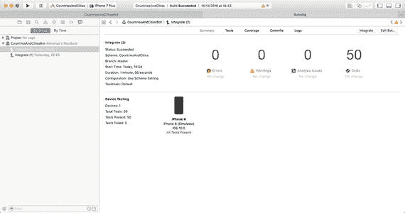

图 9-39. 集成报告

## 摘要

在本章中，您已了解了持续集成的概念，并学会了安装和配置`Xcode Server`，使其在开发流程中充当持续集成服务器。

您还学会了如何连接`Xcode`和`Xcode Server`，以便使用`Xcode`创建和集成机器人。

