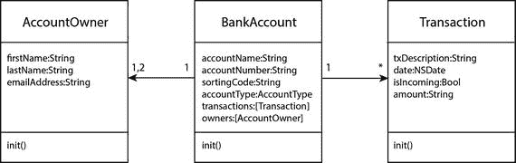
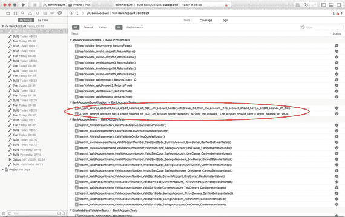

# 10. 行为驱动开发简介

行为驱动开发（`BDD`）是一种软件开发方法，旨在将测试驱动开发实践者遵循的最佳实践正式化。我们今天所知的`BDD`是 Dan North 及众多其他贡献者多年努力的成果。要阅读关于`BDD`的详细介绍，请访问 Dan North 的网站：[`dannorth.net/introducing-bdd/`](https://dannorth.net/introducing-bdd/)。本章将向您介绍`BDD`的概念和技术。

## 什么是行为驱动开发

刚接触`TDD`的人面临的一个关键问题是决定要测试什么。不幸的是，`TDD`将此方面留给实践者自行决定。虽然有经验的`TDD`实践者凭经验知道要测试什么（以及不测试什么），但`TDD`新手往往不知道，在某些情况下甚至完全放弃`TDD`。

行为驱动开发是关于测试系统的行为，而不是实现细节。一个系统可以是一个单独的类，也可以是构成一个功能聚合单元的一组类。

例如，考虑第 4 章讨论的银行账户项目，其中包含三个关键类：`BankAccount`、`AccountOwner`和`Transaction`。就关系而言，一个`BankAccount`最多可以有两个`AccountOwner`和不定数量的`Transaction`（图 10-1）。



图 10-1. 模型层对象之间的关系

从业务角度看，这些模型对象孤立存在时用处不大。我们在第 4 章中采用严格的测试驱动方法来开发这些组件。我们编写的测试验证了许多验证器对象是否按预期工作，以及创建模型层对象是否会调用多个验证器对象。然而，这些测试对产品负责人价值不大，因为它们不能直接告诉他业务需求是否得到满足。

例如，业务需求可能是这样的：*作为联名账户客户，我希望在账户有余款时能够从中取款，以便使用现金进行购物。*

换句话说，我们在遵循测试驱动方法时编写的测试过于详细，使得产品负责人无法验证开发者是否构建了所要求的系统。

## BDD 与 TDD 的区别

行为驱动开发与测试驱动开发之间的关键区别在于，`BDD`测试的编写详细程度与`TDD`测试不同。

`BDD`风格的测试系统行为，其中系统的可接受行为由一组场景定义，而这些场景又源自业务需求。

`BDD`风格的测试通常对业务更具描述性和意义。它们用一种称为领域特定语言（`DSL`）的语言来描述，该语言包含业务领域中遇到的术语和概念。

理论上，`BDD`风格的测试可以使用现有的`XCTest`框架，通过巧妙构思的方法名称以及大量的模拟和桩对象来编写。在实践中，`BDD`风格的测试是使用专用框架编写的。对于使用`Swift`的 iOS 开发者来说，其中一个框架叫做`Quick`。

### 业务需求与用户场景

理解`BDD`工作原理的最佳方式是研究一个具体示例。假设贵公司承接了一个为零售业务构建新银行系统的项目，经过几周分析后，业务分析师记录了以下两个需求：

- 作为 [一位客户]
- 我希望 [将钱存入我的储蓄银行账户]
- 以便 [我能够实现储蓄目标]
- 作为 [一位客户]
- 我希望 [从我的储蓄银行账户中取款]
- 以便 [我能够履行财务义务]

这显然是对现实场景的过度简化，业务分析师可能记录了数百个需求，但这足以说明采用`BDD`的团队将如何处理这个问题。

然后，开发者会与业务分析师以及一名 QA 团队成员一起，共同商定一组用户场景。假设该团队已经能够提出以下两个场景（再次过度简化；在现实生活中，每个需求会扩展成多个场景）：

- 给定 [一个联名储蓄账户的贷方余额为 100 美元]
- 当 [一位账户持有人从该账户取款 50 美元]
- 那么 [该账户的贷方余额应为 50 美元]
- 给定 [一个联名储蓄账户的贷方余额为 100 美元]
- 当 [一位账户持有人向该账户存入 50 美元]
- 那么 [该账户的贷方余额应为 150 美元]

一旦一组用户场景达成共识，QA 团队将继续编写 QA 脚本，以便在系统可测试时，使用自动化测试技术或手动测试技术来测试这些场景。


### 从用户场景到 BDD 测试

开发人员随后会在测试目标中创建一个 Swift 类，并使用`Quick`框架编写 BDD 风格的测试。该类名称将包含"Specification"（或`Spec`）字样，因为 BDD 测试是根据业务提供的规范编写的。清单 10-1 展示了一个名为`BankAccountSpecification.swift`的 BDD 风格测试类。

```swift
import Foundation
import Quick
import Nimble
class BankAccountSpecification : QuickSpec {
override func spec() {
var mary:AccountOwner?
var phil:AccountOwner?
var maryAndPhil:[AccountOwner] = [AccountOwner]()
var jointSavingsAccount:BankAccount?
beforeEach {
mary = AccountOwner(firstName: "Mary",
lastName: "Daniels",
emailAddress: "mdaniels@domain.com")
phil = AccountOwner(firstName: "Phil",
lastName: "Burlington",
emailAddress: "p.burlington@domain.com")
maryAndPhil.removeAll()
maryAndPhil.append(mary!)
maryAndPhil.append(phil!)
jointSavingsAccount =
BankAccount(accountName: "Savings Account",
accountNumber: "87548390",
sortingCode: "498711",
accountType: .savingsAccount,
owners: maryAndPhil)
}
describe("A joint savings account has a credit balance of $100") {
context("An account holder withdraws $50 from the account") {
it("The account should have a credit balance of $50") {
jointSavingsAccount?.setOpeningBalance(100)
jointSavingsAccount?.withdraw(50, mary)
expect(jointSavingsAccount!.accountBalance).to(equal(50))
}
}
}
describe("A joint savings account has a credit balance of $100") {
context("An account holder deposits $50 into the account") {
it("The account should have a credit balance of $150") {
jointSavingsAccount?.setOpeningBalance(100)
jointSavingsAccount?.deposit(50, mary)
expect(jointSavingsAccount!.accountBalance).to(equal(150))
}
}
}
}
}
清单 10-1.
BankAccountSpecification.swift
```

测试用例文件首先导入`Quick`和`Nimble`框架：

```swift
import Foundation
import Quick
import Nimble
```

`Quick`是一个允许你用 Swift 编写 BDD 风格测试的框架。`Nimble`则是一个让你能编写比 Xcode 提供的标准`XCTAssert`宏更详细的断言的框架。

### Quick 测试用例的结构

一个`Quick`测试用例类始终是`QuickSpec`的子类，并且必须包含一个名为`spec`的方法。所有定义规范的用户场景的测试都放置在`spec()`方法体内：

```swift
class BankAccountSpecification : QuickSpec {
override func spec() {
// 所有测试代码放在这里
}
}
```

在`spec()`方法内部，你会看到对`beforeEach`函数的调用，该函数接受一个闭包作为参数：

```swift
class BankAccountSpecification : QuickSpec {
override func spec() {
beforeEach {
// 设置代码放在这里
}
}
}
```

`Quick`测试用例的`beforeEach`方法等同于`XCTestCase`的`setUp()`方法。`Quick`测试用例也可以包含`afterEach`方法，它相当于单元测试的`teardown()`方法。

在调用`beforeEach`方法之后（以及调用`afterEach`方法之前，如果测试类有的话），会通过嵌套调用三个函数来编写多个 BDD 风格的测试：`describe()`、`context()`、`it()`：

```swift
override func spec() {
beforeEach {
}
describe(/* 场景描述中的"Given"部分 */) {
context(/* 场景描述中的"When"部分 */){
it(/* 场景描述中的"Then"部分 */) {
// 测试逻辑放在这里
}
}
}
}
```

`describe()`函数接受一个字符串参数，对应你正在测试的场景中的"Given"部分，以及一个尾随闭包，其中包含`Quick`在测试该场景时要执行的语句。

`context()`函数接受一个字符串参数，对应你正在测试的场景中的"When"部分，以及一个尾随闭包，其中包含`Quick`在测试该场景时要执行的语句。

`it()`函数也接受一个字符串参数，对应你正在测试的场景中的"Then"部分，以及一个尾随闭包，其中包含实际测试生产代码的语句。

用户场景与`Quick` BDD 测试之间存在一一对应关系。为了更容易理解，清单 10-2 展示了一个用户场景及其使用`Quick`编写的对应 BDD 测试。

*   Given [一个联名储蓄账户有 100 美元的贷方余额]
*   When [一位账户持有人从该账户提取 50 美元]
*   Then [该账户应有 50 美元的贷方余额]

```swift
describe("A joint savings account has a credit balance of $100") {
context("An account holder withdraws $50 from the account") {
it("The account should have a credit balance of $50") {
jointSavingsAccount?.setOpeningBalance(100)
jointSavingsAccount?.withdraw(50, mary)
expect(jointSavingsAccount!.accountBalance).to(equal(50))
}
}
}
清单 10-2.
用户场景及对应的 Quick BDD 测试
```

从业务角度来看，如果此测试通过，则意味着已经构建了某个具体的功能单元——一个客户能够理解的功能。

你的测试语句放在`Quick` BDD 测试的`it()`代码块中。以清单 10-1 为例，测试语句如下：

```swift
jointSavingsAccount?.setOpeningBalance(100)
jointSavingsAccount?.withdraw(50, mary)
expect(jointSavingsAccount!.accountBalance).to(equal(50))
```

这些测试的构建基于一个假设：`BankAccount`对象具有名为`setOpeningBalance`、`withdraw()`的方法以及一个名为`accountBalance`的计算属性，这些方法和属性的行为应与所描述的场景一致。

为了确保`BankAccount`类的行为符合预期，我们使用了一个测试期望语句：

```swift
expect(jointSavingsAccount!.accountBalance).to(equal(50))
```

该期望语句使用`Nimble`框架中可用的构造来表达。`Nimble`与`Quick`一同提供，并提供了一种更详细的方式来创建期望。

然而，你也可以使用`XCTest`的断言宏来表达这些期望；使用`XCTAssertEqual`宏的等价语句如下：


`XCTAssertEqual(jointSavingsAccount!.accountBalance, 50)`

选择使用 `Nimble` 还是 `XCTest` 的断言宏，是个人偏好的问题。如果你想了解有关 `Nimble` 断言的更多信息，请访问以下网址：

[`https://github.com/Quick/Nimble`](https://github.com/Quick/Nimble)

如果将 BDD 风格的测试与 TDD 风格的测试进行比较，你会发现 BDD 风格的测试更加详细，并且关注“是什么”而不是“如何做”。这些 BDD 测试中没有任何内容关注 `BankAccount` 类底层实现的细节，只关注它在不同场景下的行为。

第 4 章中开发的 `BankAccount` 类并不包含名为 `setOpeningBalance()`、`withdraw()`、`deposit()` 的方法，也不包含名为 `accountBalance` 的计算属性。因此，与任何测试代码一样，这些测试目前还无法编译。

为了让这些测试能够编译通过，必须修改 `BankAccount` 类，使其与清单 10-3 类似。

```
import Foundation
enum AccountType {
case currentAccount
case savingsAccount
}
class BankAccount: NSObject {
var accountName:String
var accountNumber:String
var sortingCode:String
var accountType:AccountType
var transactions:[Transaction]
var owners:[AccountOwner]
var accountBalance:Float {
get {
var balance:Float = 0.0
for transaction in self.transactions {
if let amount = Float(transaction.amount) {
if transaction.isIncoming {
balance += amount
} else {
balance -= amount
}
}
}
return balance
}
}
init?(accountName:String,
accountNumber:String,
sortingCode:String,
accountType:AccountType,
owners:[AccountOwner],
accountNameValidator:AccountNameValidator? = nil,
accountNumberValidator:AccountNumberValidator? = nil,
sortingCodeValidator:SortingCodeValidator? = nil) {
let validator1 = accountNameValidator ?? AccountNameValidator()
if validator1.validate(accountName) == false {
return nil
}
let validator2 = accountNumberValidator ?? AccountNumberValidator()
if validator2.validate(accountNumber) == false {
return nil
}
let validator3 = sortingCodeValidator ?? SortingCodeValidator()
if validator3.validate(sortingCode) == false {
return nil
}
if (owners.count == 0 || owners.count > 2) {
return nil
}
self.accountName = accountName
self.accountNumber = accountNumber
self.sortingCode = sortingCode
self.accountType = accountType
self.owners = owners
self.transactions = [Transaction]()
}
func setOpeningBalance(_ amount:Float) -> Void {
if let openingBalanceTransaction =
Transaction(txDescription: "Opening Balance",
date: NSDate(),
isIncoming: true,
amount: "100.0") {
self.transactions.removeAll()
self.transactions.append(openingBalanceTransaction)
}
}
func withdraw(_ amount:Float, _ person:AccountOwner?) -> Void {
if let newTransaction =
Transaction(txDescription: "ATM Withdrawal",
date: NSDate(),
isIncoming: false,
amount: "\(amount)") {
self.transactions.append(newTransaction)
}
}
func deposit(_ amount:Float, _ person:AccountOwner?) -> Void {
if let newTransaction =
Transaction(txDescription: "Cash Deposit",
date: NSDate(),
isIncoming: true,
amount: "\(amount)") {
self.transactions.append(newTransaction)
}
}
}
```

你可以像执行其他任何测试一样，通过 `Product ➤ Test` 菜单项来执行 Quick BDD 风格的测试。执行测试后，如果你查看测试导航器中的测试报告，你会看到 BDD 风格的测试与常规单元测试一同出现，但前者更具可读性（图 10-2）。



在接下来的两章中，你将学习如何将 `Quick` 和 `Nimble` 集成到 Swift 项目中，并尝试运行一些 Quick 测试。

## BDD 的优势与劣势

在了解了行为驱动开发之后，你可能会想知道 BDD 是否要取代 TDD。TDD 和 BDD 各有其用途：测试驱动开发关注你的代码如何结构化，并在比 BDD 更低的层级上运作。行为驱动开发则有助于确保你编写的代码能够实现业务目标。

与任何技术一样，行为驱动开发也有其自身的优点和缺点。以下是 BDD 相对于 TDD 的一些优势：

- 测试更加详细。
- 每个通过的测试都证明产品更接近客户的需求。
- BDD 测试对业务分析师、产品负责人以及开发人员都很有用。
- BDD 测试不像 TDD 测试那样脆弱。如果你改变了一个场景的实现方式，BDD 测试更不容易中断。

BDD 的一些劣势如下：

- BDD 要求产品负责人、测试人员和业务分析师认同并参与这个过程。团队常常开始时怀有良好的意图，但几周后，业务方就对编写规范失去了兴趣，编写场景以及让这些场景通过的代码就变成了开发人员的责任。
- 用户需求会随着项目的进展而变化，而 BDD 要求开发人员在开始开发之前，就将用户需求以可用的格式记录下来。要使这一点生效，项目需要有一个定义良好的未来功能路线图。在开发之前预先定义好需求，并不一定意味着项目必须遵循瀑布模型。BDD 可以用于敏捷 Scrum 项目，但业务方需要承诺在冲刺开始前，确保所有被选入冲刺的用户故事的需求都得到良好定义。
- BDD 在实践迭代式开发的团队中效果最佳。
- BDD 要求业务方和开发团队之间进行协作。业务方在创建新的用户故事之前，必须考虑当前系统的技术约束。业务分析师和产品负责人常常各自为政，然后在冲刺规划会议上将他们的需求交给开发人员。

## 总结

在本章中，你了解了与行为驱动开发相关的核心概念。通过一个开发团队受委托构建一个简单银行解决方案的假设性例子，你学习了业务需求分析和用户故事创建的过程。

你还了解了两个流行的开源框架，即 `Quick` 和 `Nimble`。这些框架通常用于为 iOS 项目开发 BDD 风格的测试。

