# 11. 安装 Quick

在上一章中，你学习了行为驱动开发及其与测试驱动开发的关系。在本章中，你将下载一个流行的 Swift BDD 测试框架 `Quick`，并设置一个 Xcode 项目来使用它。

`Quick` 包含一个名为 `Nimble` 的框架，它提供了更好的 `XCTAssert()` 语句替代品。本章将更详细地介绍 `Nimble`，但从安装的角度来看，你需要知道所安装的 `Quick` 和 `Nimble` 版本取决于你打算使用的 Swift 版本。

表 11-1 分别提供了 Swift 版本及兼容的 `Quick` 和 `Nimble` 版本信息。本书是为 Swift 3 用户编写的；因此，所有示例将使用 `Quick` 1.0.0 版本和 `Nimble` 5.0.0 版本。

**表 11-1.** Swift、Quick、Nimble 版本兼容性矩阵

| Swift 版本 | Quick 版本 | Nimble 版本 |
| --- | --- | --- |
| 2.2 / 2.3 | 0.9.3 | 4.1.0 |
| 3 | 1.0.0（或更新版本） | 5.0.0（或更新版本） |

## 将 Quick 添加到 Xcode 项目

在本节中，你将学习将 `Quick` 包含到 Xcode 项目中的三种替代方式：

- 使用 CocoaPods
- 使用 Carthage
- 使用 Git 子模块


### 使用 CocoaPods 将 Quick 添加到 Xcode 项目

`CocoaPods` 是 Swift 和 Objective-C 项目的依赖管理解决方案。它能简化在项目中添加第三方框架及其依赖项的过程。

如果你从未在 Mac 上使用过 `CocoaPods`，则需要先进行安装。安装 `CocoaPods` 需要你拥有 Mac 的管理员权限。

启动 Mac 上的“终端”应用，并在 shell 提示符下输入以下命令：

```
$ sudo gem install cocoapods
```

系统会要求你输入密码。下载过程可能需要几分钟，之后安装将自动开始。在安装过程中，会显示大量状态信息（图 11-1）。

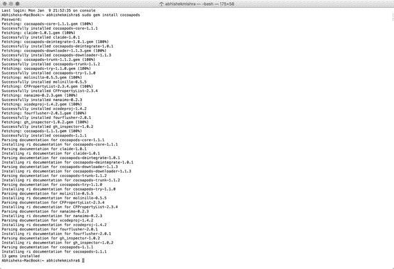

图 11-1. 终端中的 CocoaPods 安装过程

在安装过程结束时，你应该会在终端窗口中看到类似这样的一行信息：

```
13 gems installed
```

要测试你的 `CocoaPods` 安装，请在终端窗口中输入以下命令，输出结果应类似图 11-2。

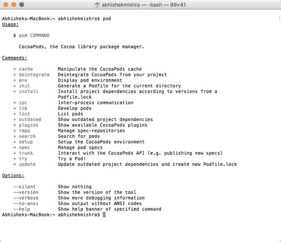

图 11-2. 测试 CocoaPods 安装

```
$ pod
```

现在你已经验证了 `CocoaPods` 安装成功，可以继续创建新的 Xcode 项目，并使用 `CocoaPods` 将 Quick 库及其依赖项添加到项目中。

启动 Xcode，基于“Single View Application”模板创建一个新的 iOS 项目。在创建新项目时，请使用以下选项（参见图 11-3）：

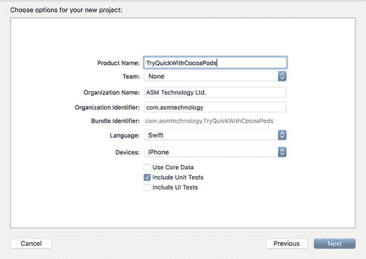

图 11-3. Xcode 项目选项对话框

*   Product Name：`TryQuickWithCocoaPods`
*   Team：`None`
*   Organization Name：提供一个合适的名称
*   Organization Identifier：提供一个合适的标识符
*   Language：`Swift`
*   Devices：`iPhone`
*   Use Core Data：取消勾选
*   Include Unit Tests：勾选
*   Include UI Tests：取消勾选

项目创建完成后，退出 Xcode，返回终端窗口，并导航到你创建新 Xcode 项目的文件夹。使用以下命令在此目录中创建一个名为 `Podfile` 的新文件（无扩展名）：

```
$ touch Podfile
```

在终端窗口中输入以下命令并回车，用 TextEdit 打开新文件。

```
$ open –e Podfile
```

使用 TextEdit，将以下行添加到 `Podfile` 中，并保存文件。完成修改后关闭 TextEdit。

```
# Podfile
use_frameworks!
def testing_pods
pod 'Quick'
pod 'Nimble'
end
target 'TryQuickWithCocoaPodsTests' do
testing_pods
end
```

返回终端窗口，输入以下命令并回车：

```
$ pod install
```

几分钟后，你将看到类似如下的信息，表明安装和设置已完成（图 11-4）。

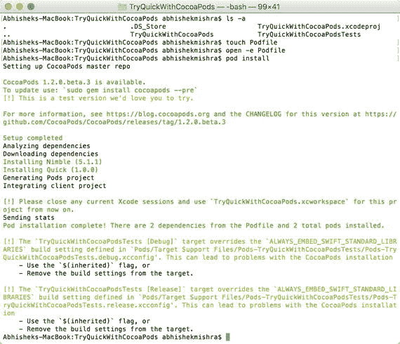

图 11-4. Pod Install 命令的结果

```
Pod installation complete! There are two dependencies from the Podfile and two total pods installed.
```

在项目目录中查找由 `CocoaPods` 创建的新工作区文件。从现在起，你必须使用这个工作区文件，而不是原始的 `.xcodeproj` 文件（图 11-5）。

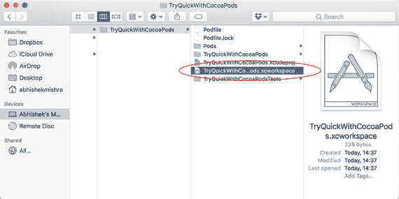

图 11-5. Cocoapods 创建的新工作区

当你打开新的工作区文件（扩展名为 `.xcworkspace`）时，应该会在工作区中看到两个项目：

*   `TryQuickWithCocoaPods`
*   `Pods`

如果你展开 `Pods` 项目，你将看到 `Quick` 和 `Nimble` 的文件夹（图 11-6）。需要注意的是，你无需对 `Pods` 项目中的任何文件进行更改。你编写的所有代码（包括测试）都将位于 `TryQuickWithCocoaPods` 项目中。

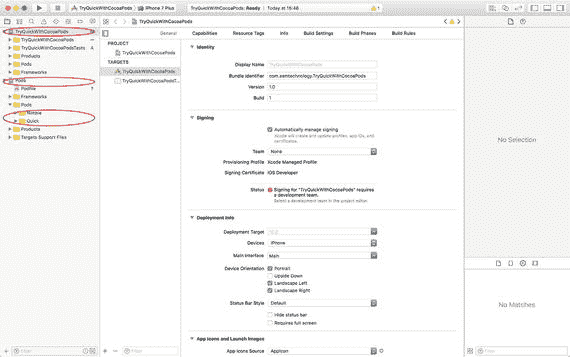

图 11-6. 包含 Quick 和 Nimble 的 Pods 项目

至此，你已经将 Quick（以及 Nimble）添加到了 Xcode 项目中，你的项目应该能够在 iOS 模拟器上毫无问题地构建和运行。


### 使用 Carthage 将 Quick 集成到 Xcode 项目中

Carthage 是另一种依赖管理解决方案，旨在简化将第三方框架及其依赖项添加到 iOS 项目的过程。

至于哪一种依赖管理解决方案更好，这超出了本章的讨论范围。通常，这取决于个人偏好。CocoaPods 与 Carthage 的关键区别之一是，Carthage 会为你下载并构建框架，但你需要手动将这些框架添加到你的项目中。

如果你的 Mac 上尚未安装 Carthage，最简单的安装方法是访问以下 URL，并下载最新的 `Carthage.pkg` 文件（图 11-7）。

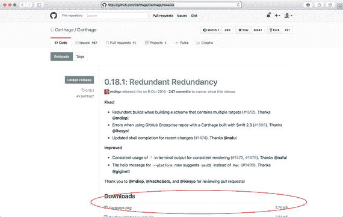

图 11-7. 下载 Carthage 安装程序

```
https://github.com/Carthage/Carthage/releases
```

文件下载完成后，在你的“下载”文件夹中找到它，然后双击启动安装程序。按照屏幕提示安装 Carthage（图 11-8）。

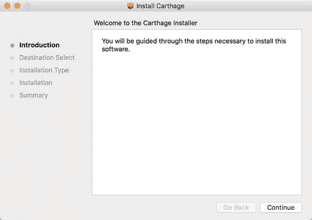

图 11-8. Carthage 安装程序欢迎界面

你需要拥有 Mac 的管理员权限才能完成安装过程。

要测试你的 Carthage 安装，请在终端窗口中键入以下命令，输出结果应类似于图 11-9。

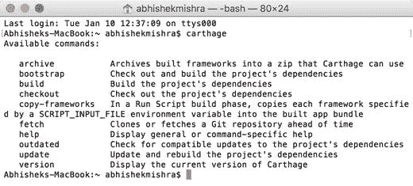

图 11-9. 测试 Carthage 安装

```
$ carthage
```

既然你已经验证了 Carthage 已安装成功，就可以继续创建新的 Xcode 项目，并使用 Carthage 将 Quick 库及其依赖项添加到项目中。

启动 Xcode 并创建一个基于“单视图应用”模板的新 iOS 项目。在创建新项目时，请使用以下选项（见图 11-10）：

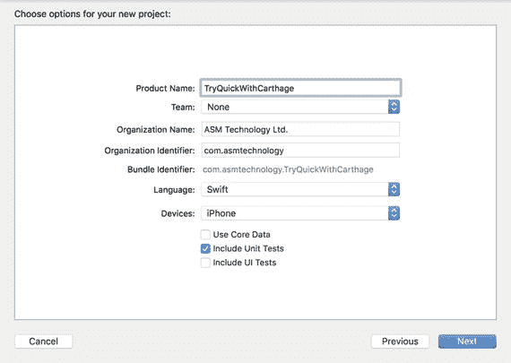

图 11-10. Xcode 项目选项对话框

*   Product Name: `TryQuickWithCarthage`
*   Team: 无
*   Organization Name: 提供一个合适的名称
*   Organization Identifier: 提供一个合适的标识符
*   Language: `Swift`
*   Devices: `iPhone`
*   Use Core Data: 取消勾选
*   Include Unit Tests: 勾选
*   Include UI Tests: 取消勾选

项目创建完成后，退出 Xcode 并返回终端窗口，导航到你 Mac 上创建新 Xcode 项目的文件夹。使用以下命令在此目录中创建一个名为 `Cartfile` 的新文件（无扩展名）：

```
$ touch Cartfile
```

通过在终端窗口中键入以下命令并按回车键，在 TextEdit 中打开新文件。

```
$ open –e Carfile
```

使用 TextEdit，将以下行添加到 Podfile 中，并保存文件。完成修改后关闭 TextEdit。

```
github "Quick/Quick"
github "Quick/Nimble"
```

`Cartfile` 的内容比 `Podfile` 要简单一些。每一行只是框架所在的仓库名称以及该仓库中框架的路径。

返回终端窗口，键入以下命令，并按回车键：

```
$ carthage update --platform iOS
```

几分钟后，你会看到类似如下状态消息，表明 Nimble 和 Quick 的源文件已下载并构建为框架（图 11-11）。

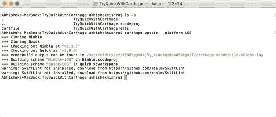

图 11-11. Quick 和 Nimble 构建成功

```
*** Cloning Nimble
*** Cloning Quick
*** Checking out Nimble at "v5.1.1"
*** Checking out Quick at "v1.0.0"
*** xcodebuild output can be found in /var/folders/zz/40885yyd4sj5y_1c4d4q8dn40000gn/T/carthage-xcodebuild.xO1qbs.log
*** Building scheme "Nimble-iOS" in Nimble.xcodeproj
*** Building scheme "Quick-iOS" in Quick.xcworkspace
```

当 Carthage 完成时，你会在 Finder 中看到在你的 Xcode 项目旁边创建了一个名为 `Carthage` 的新文件夹（图 11-12）。

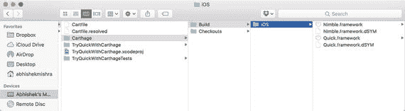

图 11-12. 项目目录中的 `Carthage` 文件夹

在 `Carthage` 文件夹内，你会发现另外两个文件夹：

*   `Checkouts`：Carthage 会在此处检出你添加到 `Cartfile` 中的每个库的源代码。
*   `Build`：此文件夹包含从 `Checkouts` 文件夹中的源代码构建而成的框架。

与 CocoaPods 不同，Carthage 不会修改 Xcode 项目。你需要手动将框架添加到项目中。

打开你之前创建的 `TryQuickWithCarthage` 项目，将 `Build` 目录中的 `Quick.framework` 和 `Nimble.framework` 文件添加到项目的测试目标中（图 11-13）。

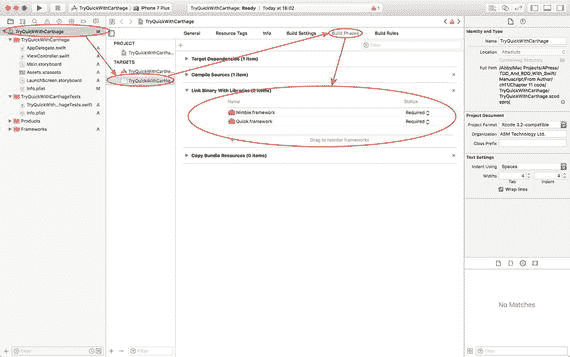

图 11-13. 确保 `Quick` 和 `Nimble` 框架已添加到测试目标

通过点击 `+` 按钮并从下拉菜单中选择 `New Copy File Phase`，为测试目标添加一个新的“复制文件”阶段（图 11-14）。

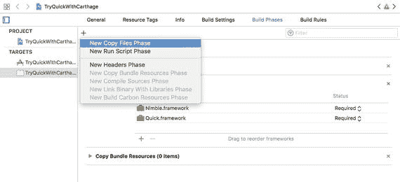

图 11-14. 添加新的“复制文件”阶段

将新构建阶段的 `Destination` 组合框的值设置为 `Frameworks`，并将这两个框架添加到列表中（图 11-15）。

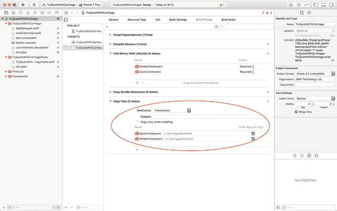

图 11-15. 已添加到测试目标的新构建阶段

至此，你已经使用 Carthage 将 Quick 和 Nimble 添加到了你的 Xcode 项目中，你的项目应该能够毫无问题地在 iOS 模拟器上构建和运行了。


### 使用 Git 子模块将 Quick 添加到 Xcode 项目

将 `Quick` 和 `Nimble` 仓库作为子模块添加到 Xcode 项目的仓库中，无需提前安装任何额外工具。

启动 Xcode，基于“单视图应用”模板创建一个新的 iOS 项目。创建新项目时，请使用以下选项（见图 11-16）：

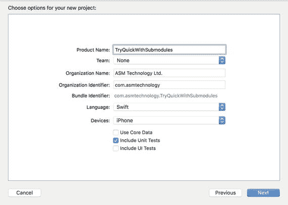

**图 11-16.** Xcode 项目选项对话框

- 产品名称: `TryQuickWithSubmodules`
- 团队: 无
- 组织名称: 提供一个合适的名称
- 组织标识符: 提供一个合适的标识符
- 语言: `Swift`
- 设备: iPhone
- 使用 Core Data: 取消勾选
- 包含单元测试: 勾选
- 包含 UI 测试: 取消勾选

在项目位置对话框中，选择一个空文件夹，并确保已勾选**创建 Git 仓库**选项（图 11-17）。

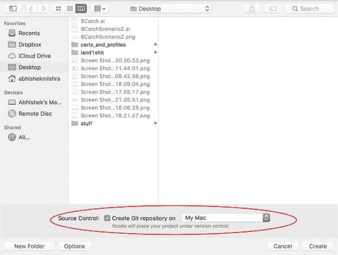

**图 11-17.** Xcode 项目位置对话框

项目创建完成后，退出 Xcode，回到终端窗口，导航到你 Mac 上创建新 Xcode 项目的文件夹。

在终端窗口中输入以下命令并按回车键，将 `Quick` Git 仓库添加为你项目 Git 仓库的子模块：

```
$ git submodule add https://github.com/Quick/Quick.git Vendor/Quick
```

终端窗口中的输出应该类似于以下内容：

```
Cloning into '/Users/abhishekmishra/Desktop/TryQuickWithSubmodules/Vendor/Quick'...
remote: Counting objects: 6736, done.
remote: Compressing objects: 100% (71/71), done.
remote: Total 6736 (delta 23), reused 0 (delta 0), pack-reused 6664
Receiving objects: 100% (6736/6736), 1.93 MiB | 1.74 MiB/s, done.
Resolving deltas: 100% (4026/4026), done.
```

在终端窗口中输入以下命令并按回车键，将 `Nimble` Git 仓库添加为你项目 Git 仓库的子模块：

```
$ git submodule add https://github.com/Quick/Nimble.git Vendor/Nimble
```

终端窗口中的输出应该类似于以下内容：

```
Cloning into '/Users/abhishekmishra/Desktop/TryQuickWithSubmodules/Vendor/Nimble'...
remote: Counting objects: 6782, done.
remote: Total 6782 (delta 0), reused 0 (delta 0), pack-reused 6782
Receiving objects: 100% (6782/6782), 1.39 MiB | 1.03 MiB/s, done.
Resolving deltas: 100% (4575/4575), done.
```

接下来，你将创建一个新的 Xcode 工作区，并将你的 Xcode 项目以及刚刚克隆的 `Quick` 和 `Nimble` 子模块的 Xcode 项目都包含进去。

在 Xcode 中打开你的项目，使用 **文件 ➤ 新建 ➤ 工作区** 菜单项创建一个新的 Xcode 工作区。将工作区命名为 `TryQuickWithSubmodules.xcworkspace`，并将其保存在与 Xcode 项目相同的目录中（图 11-18）。

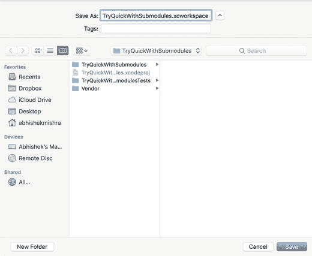

**图 11-18.** 将工作区保存到与 Xcode 项目相同的目录

Xcode 会为你创建一个空工作区。如果 `TryQuickWithSubmodules` Xcode 项目窗口（不是空工作区）是打开的，请将其关闭，然后使用 **文件 ➤ 将文件添加到 "TryQuickWithSubmodules"...** 菜单项（图 11-19）。

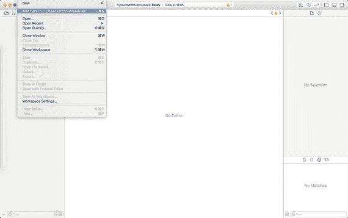

**图 11-19.** 向工作区添加项目

导航到 `TryQuickWithSubmodules.xcodeproj` 文件，将 Xcode 项目添加到工作区（图 11-20）。

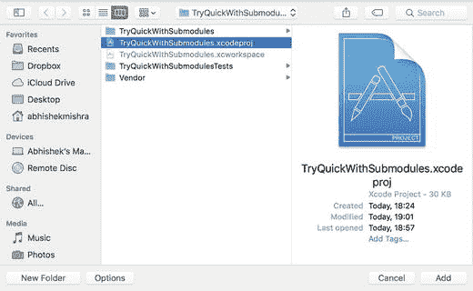

**图 11-20.** 定位将要添加到工作区的 Xcode 项目

你将在项目导航器中看到一个新节点出现，该节点包含工作区下的整个 `TryQuickWithSubmodules` 项目（图 11-21）。

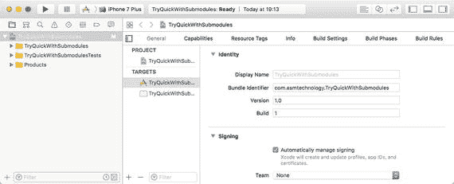

**图 11-21.** Xcode 工作区中的 `TryQuickWithSubmodules` 项目

将 `Quick.xcodeproj` 文件拖放到项目导航器上。`Quick.xcodeproj` 文件位于 Finder 中项目目录的 `Vendor/Quick` 子目录下。将 `.xcodeproj` 文件拖放到项目导航器时，请确保将其拖放到 `TryQuickWithSubmodules` 节点上方，以使新节点成为同级节点，而不是子节点（图 11-22）。

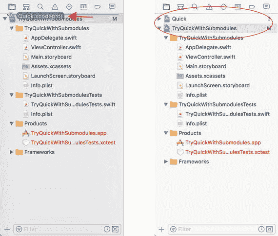

**图 11-22.** 使用拖放操作将 Quick Xcode 项目添加到工作区

使用拖放操作，将 `Nimble.xcodeproj` 文件添加到项目导航器中。确保将其拖放到 `TryQuickWithSubmodules` 节点上方，以使新节点成为同级节点，而不是子节点。项目导航器现在应包含工作区中每个项目的节点（图 11-23）。

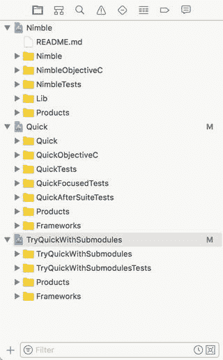

**图 11-23.** Xcode 项目导航器显示包含三个项目的工作区

打开 `TryQuickWithSubmodules` 项目的项目设置页面，选择测试目标，然后将 `Quick.framework` 和 `Nimble.framework` 文件添加到**链接二进制文件与库**列表中（图 11-24）。

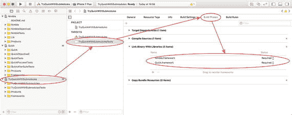

**图 11-24.** 将 Quick 和 Nimble 框架文件添加到测试目标

至此，你已经使用 Git 子模块将 `Quick` 和 `Nimble` 添加到了 Xcode 项目中，你的项目应该能够在 iOS 模拟器上毫无问题地构建和运行。

## 小结

在本章中，你学习了三种不同的方法，可以将 `Quick` 和 `Nimble` 框架添加到 Xcode 项目中。你学习了如何使用两种流行的依赖管理框架 —— CocoaPods 和 Carthage。你还学习了如何使用 Git 子模块包含 `Quick` 和 `Nimble` 框架。

