# 12. 应用 TDD 和 BDD 技术

在上一章中，你学习了如何将 `Quick` 和 `Nimble` 添加到 Xcode 项目。在本章中，你将结合使用 TDD 和 BDD 技术构建一个应用。

你将构建一个简单的应用，让用户浏览伦敦的餐厅列表。用户可以从伦敦内的地点列表中进行选择，应用将展示所选地点的餐厅列表。该应用的所有餐厅数据都包含在应用包内，无需调用网络服务来获取这些数据。


## 审阅业务需求

在构建此应用的过程中，您的业务团队已决定尝试采用行为驱动开发的方法。产品负责人和业务分析师访谈了不同的用户群体，并研究了目标人群的用户趋势报告。经过数周的集体分析与文档整理，他们提出了一套业务需求，列于表 12-1 中。

表 12-1. 餐馆目录应用需求

| 编号 | 需求 |
| --- | --- |
| 1 | 作为 [顾客]，我想要 [查看伦敦市内我选择区域附近的餐馆列表]，以便 [我可以计划我的下一餐]。 |
| 2 | 作为 [顾客]，我想要 [了解所选餐馆与最近地铁站之间的距离]，以便 [我可以制定出行计划]。 |
| 3 | 作为 [顾客]，我想要 [了解餐馆的食品质量信息]，以便 [我可以做出明智的就餐决定]。 |
| 4 | 作为 [顾客]，我想要 [了解餐馆提供的菜系类型]，以便 [我可以做出明智的就餐决定]。 |

随后，这些需求被移交给了开发团队。记录这些需求的业务分析师与一名开发人员和一名测试人员共同协作，基于这些需求准备了一套用户场景。用户场景列于表 12-2 中。

表 12-2. 餐馆目录用户场景

| 编号 | 用户场景 |
| --- | --- |
| 1 | 假设 [应用已启动]，当 [应用的首页加载完成] 时，那么 [用户界面上应有一个选项，可从列表中选择伦敦的一个区域]。 |
| 2 | 假设 [应用已启动]，当 [应用的首页加载完成] 时，那么 [用户界面上应有一个“下一步”按钮]。 |
| 3 | 假设 [应用的首页加载完成]，当 [未选择任何区域] 时，那么 [“下一步”按钮应处于禁用状态]。 |
| 4 | 假设 [应用的首页加载完成]，当 [已选择伦敦的一个区域] 时，那么 [“下一步”按钮应处于启用状态]。 |
| 5 | 假设 [用户已选择一个位置]，当 [点击“下一步”按钮] 时，那么 [应出现一个新屏幕，显示该位置的餐馆列表]。 |
| 6 | 假设 [餐馆列表在屏幕上可见]，当 [列表中显示餐馆名称] 时，那么 [该列表项应附带最近地铁站名称]。 |
| 7 | 假设 [餐馆列表在屏幕上可见]，当 [列表中显示餐馆名称] 时，那么 [该列表项应附带到最近地铁站的大致英里距离]。 |
| 8 | 假设 [餐馆列表在屏幕上可见]，当 [列表中显示餐馆名称] 时，那么 [该列表项应附带一个 1 到 5 之间的整数，表示该餐馆的质量，其中 1 为最差，5 为最佳]。 |
| 9 | 假设 [餐馆列表在屏幕上可见]，当 [列表中显示餐馆名称] 时，那么 [该列表项应附带该餐馆提供的菜系信息]。 |

从 QA（质量保证）团队的角度来看，每个用户故事都可以通过运行应用并目视检查结果来测试。然而，从应用开发者的角度来看，许多这些需求本质上是可视化的，无法使用 TDD（测试驱动开发）或 BDD（行为驱动开发）技术进行测试。

例如，场景 1 要求一个 UI（用户界面）元素在屏幕上可见。这个场景很容易通过目视检查来测试，但不容易通过编程方式测试。

因此，虽然 QA 团队将使用他们可用的各种技术来测试每个场景，但开发者只能为其中一部分场景创建 Quick 测试。表 12-3 列出了开发者将使用 Quick 进行测试的那部分场景。

表 12-3. 可使用 Quick 测试的餐馆目录用户场景

| 编号 | 用户场景 | 备注 |
| --- | --- | --- |
| 1 | 假设 [应用已启动]，当 [应用的首页加载完成] 时，那么 [用户界面上应有一个选项，可从列表中选择伦敦的一个区域]。 | 无法使用 Quick 测试，因为它需要视觉验证。 |
| 2 | 假设 [应用已启动]，当 [应用的首页加载完成] 时，那么 [用户界面上应有一个“下一步”按钮]。 | 无法使用 Quick 测试，因为它需要视觉验证。 |
| 3 | 假设 [应用的首页加载完成]，当 [未选择任何区域] 时，那么 [“下一步”按钮应处于禁用状态]。 |  |
| 4 | 假设 [应用的首页加载完成]，当 [已选择伦敦的一个区域] 时，那么 [“下一步”按钮应处于启用状态]。 |  |
| 5 | 假设 [用户已选择一个位置]，当 [点击“下一步”按钮] 时，那么 [应出现一个新屏幕，显示该位置的餐馆列表]。 | 部分可测试。开发者可以测试点击按钮会触发显示新屏幕的过程，但无法测试新屏幕是否真的出现了。 |
| 6 | 假设 [餐馆列表在屏幕上可见]，当 [列表中显示餐馆名称] 时，那么 [该列表项应附带最近地铁站名称]。 | 部分可测试。开发者可以测试视图控制器上是否调用了一个带有预期值的特定方法。然而，如果不进行视觉检查结果，开发者无法测试屏幕上的文本是否真的更新了。 |
| 7 | 假设 [餐馆列表在屏幕上可见]，当 [列表中显示餐馆名称] 时，那么 [该列表项应附带到最近地铁站的大致英里距离]。 | 部分可测试。开发者可以测试视图控制器上是否调用了一个带有预期值的特定方法。然而，如果不进行视觉检查结果，开发者无法测试屏幕上的文本是否真的更新了。 |
| 8 | 假设 [餐馆列表在屏幕上可见]，当 [列表中显示餐馆名称] 时，那么 [该列表项应附带一个 1 到 5 之间的整数，表示该餐馆的质量，其中 1 为最差，5 为最佳]。 | 部分可测试。开发者可以测试视图控制器上是否调用了一个带有预期值的特定方法。然而，如果不进行视觉检查结果，开发者无法测试屏幕上的文本是否真的更新了。 |
| 9 | 假设 [餐馆列表在屏幕上可见]，当 [列表中显示餐馆名称] 时，那么 [该列表项应附带该餐馆提供的菜系信息]。 | 部分可测试。开发者可以测试视图控制器上是否调用了一个带有预期值的特定方法。然而，如果不进行视觉检查结果，开发者无法测试屏幕上的文本是否真的更新了。 |

表 12-3 的内容在整个团队中已明确沟通，以便所有成员都能清楚地了解谁将测试系统的哪些方面。除此之外，团队已同意将对餐馆列表应用以下字段验证标准：

-   餐馆名称：长度在 2 到 30 个字符之间，不能包含数字或特殊字符。允许使用与号（`&`）字符。
-   菜系类型：长度在 4 到 10 个字符之间，不能包含数字、特殊字符或空白字符。一家餐馆最多只能有一种菜系。
-   最近地铁站名称：长度在 4 到 30 个字符之间，不能包含数字或特殊字符。允许使用与号（`&`）字符。
-   评分：一个介于 0 到 5 之间的数字（含两端）。不能包含空白字符、字母数字或特殊字符。


## 高层应用架构

该应用架构包含三个不同的层级（参见图 12-1）。

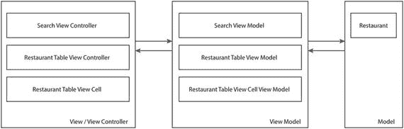

图 12-1. 高层应用架构

各层级及其组件类的简要说明如下：

* **模型层**：包含`Restaurant`类，其实例用于存储将展示给用户的数据。模型层还包含验证器对象，这些对象封装了`Restaurant`对象字段的验证逻辑。
* **视图模型层**：包含`SearchViewModel`、`RestaurantTableViewModel`、`RestaurantTableViewCellViewModel`类。
* **视图/视图控制器层**：包含`SearchViewController`、`RestaurantTableViewController`及相关类。

图 12-2 展示了完成后的应用用户界面。

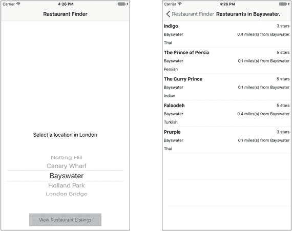

图 12-2. `RestaurantFinder`应用的用户界面

该应用的完整源代码可通过以下 URL 从 github 匿名下载：

[`https://github.com/asmtechnology/Lesson12.iOSTesting.2017.Apress.git`](https://github.com/asmtechnology/Lesson12.iOSTesting.2017.Apress.git)

## 创建 Xcode 项目

启动 Xcode 并基于**单视图应用**模板创建一个新的 iOS 项目。创建新项目时使用以下选项（参见图 12-3）：

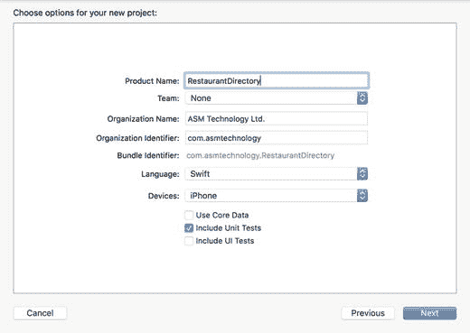

图 12-3. Xcode 项目选项对话框

* **产品名称**：`RestaurantDirectory`
* **团队**：无
* **组织名称**：提供合适的名称
* **组织标识符**：提供合适的标识符
* **语言**：Swift
* **设备**：iPhone
* **使用 Core Data**：取消勾选
* **包含单元测试**：勾选
* **包含 UI 测试**：取消勾选

**注意**：本章创建的项目不包含用户界面（UI）测试。如有需要，您可以事后向项目添加 UI 测试。第 13 章将介绍用户界面测试的相关内容。

将项目保存到计算机上的合适位置，然后点击**创建**。由于该项目将包含多个新类，最好将类文件放置在项目导航器中相应的组下。

在 Xcode 项目导航器中，于`RestaurantDirectory`文件夹下创建以下组：

* `View`
* `Model`
* `ViewModel`
* `Protocols`

## 向项目添加资源

将本课下载包中的`RestaurantData.json`文件添加到项目中。添加该文件时，请确保在导入对话框中勾选“如果需要则复制项目”选项（参见图 12-4）。

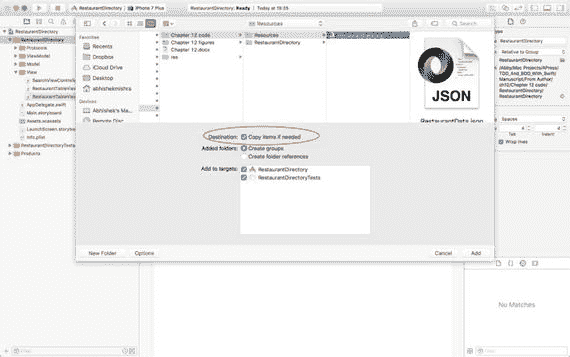

图 12-4. Xcode 文件导入对话框

您导入的 JSON 文件包含餐厅数据，清单 12-1 展示了 JSON 文件的部分内容示例。

```
[
{
"area": "诺丁山",
"rating": "4",
"cuisine": "波斯菜",
"distance": "0.3",
"tubeStation": "诺丁山大门站",
"restaurantName": "阿里巴巴"
}
]
清单 12-1. RestaurantData.json
```

## 构建用户界面层

该应用的用户界面包含两个嵌入在导航控制器中的故事板场景（参见图 12-5）。

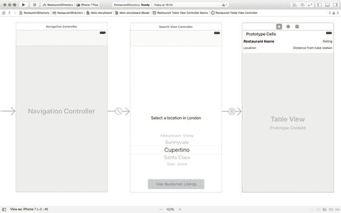

图 12-5. `RestaurantFinder`应用的故事板布局

从项目导航器中删除`ViewController.swift`文件，并在`View`组下创建以下 Swift 类：

* 一个名为`SearchViewController`的`UIViewController`子类。
* 一个名为`RestaurantTableViewController`的`UITableViewController`子类。
* 一个名为`RestaurantTableViewCell`的`UITableViewCell`子类。

确保这些类同时包含在`RestaurantDirectory`和`RestaurantDirectoryTests`目标中。项目导航器应类似于图 12-6。

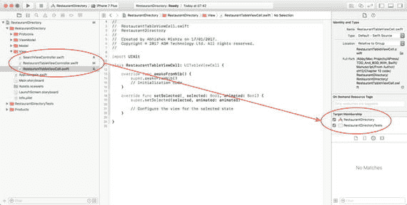

图 12-6. 添加到项目的新类的目标成员身份

打开`Main.storyboard`文件，在故事板中选择默认场景。切换到**身份检查器**，将场景关联的类更改为`SearchViewController`（参见图 12-7）。

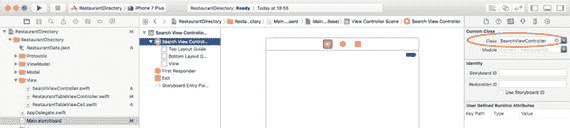

图 12-7. 使用身份检查器更改与故事板场景关联的类

从对象库中拖放一个标签、一个选择器视图和一个按钮到搜索视图控制器场景中。将标签显示的文本设置为“选择伦敦的一个地点”，并将标签文本的字体大小设置为 14 磅。将按钮显示的文本设置为“查看餐厅列表”，背景颜色设置为灰色调。在场景上放置这些对象，使其类似于图 12-8。为这些对象设置适当的约束，以便在不同屏幕尺寸上保持其相对位置。

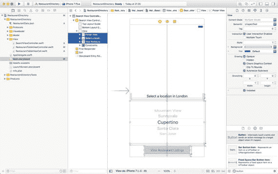

图 12-8. 添加到默认故事板场景的用户界面元素

使用故事板，将`SearchViewController`类设置为选择器视图的委托和数据源。表 12-4 列出了需要在`SearchViewController`类中创建的插座变量和操作方法及其关联的用户界面元素。

表 12-4. 搜索视图控制器的插座变量和操作

| 名称 | 类型 | 描述 |
| --- | --- | --- |
| `@IBOutlet weak var locationPicker: UIPickerView!` | IB 插座变量 | 将此插座变量连接到故事板场景中的选择器视图。 |
| `@IBOutlet weak var viewRestaurantButton: UIButton!` | IB 插座变量 | 将此插座变量连接到故事板场景中的“查看餐厅列表”按钮。 |
| `@IBAction func onViewListings(_ sender: Any)` | IB 操作 | 将此方法连接到“查看餐厅列表”按钮的“触摸内部”事件。 |

通过在`SearchViewController.swift`文件末尾添加以下代码，在`SearchViewController`的单独类扩展中实现`UIPickerViewDelegate`协议：

```
extension SearchViewController : UIPickerViewDelegate {
func pickerView(_ pickerView: UIPickerView,
titleForRow row: Int,
forComponent component: Int) -> String? {
return nil
}
func pickerView(_ pickerView: UIPickerView,
didSelectRow row: Int, inComponent component: Int) {
}
}
```

通过在`SearchViewController.swift`文件末尾添加以下代码，在`SearchViewController`的单独类扩展中实现`UIPickerViewDataSource`协议：

```
extension SearchViewController : UIPickerViewDataSource {
func numberOfComponents(in pickerView: UIPickerView) -> Int {
return 0
}
func pickerView(_ pickerView: UIPickerView,
numberOfRowsInComponent component: Int) -> Int {
return 0
}
}
```


上述代码段包含了选择器视图代理和数据源方法的基本实现。`SearchViewController.swift` 文件中的代码现在应类似于清单 12-2。

```swift
import UIKit
class SearchViewController: UIViewController {
@IBOutlet weak var locationPicker: UIPickerView!
@IBOutlet weak var viewRestaurantButton: UIButton!
override func viewDidLoad() {
super.viewDidLoad()
// 加载视图后进行额外设置
}
override func didReceiveMemoryWarning() {
super.didReceiveMemoryWarning()
// 释放可重新创建的资源
}
@IBAction func onViewListings(_ sender: Any) {
}
}
extension SearchViewController : UIPickerViewDelegate {
func pickerView(_ pickerView: UIPickerView,
titleForRow row: Int,
forComponent component: Int) -> String? {
return nil
}
func pickerView(_ pickerView: UIPickerView,
didSelectRow row: Int,
inComponent component: Int) {
}
}
extension SearchViewController : UIPickerViewDataSource {
func numberOfComponents(in pickerView: UIPickerView) -> Int {
return 0
}
func pickerView(_ pickerView: UIPickerView,
numberOfRowsInComponent component: Int) -> Int {
return 0
}
}
清单 12-2.
SearchViewController.swift
```

从对象库中拖放一个表视图控制器到故事板场景中。选中该表视图控制器场景后，切换到标识检查器，将场景关联的类更改为 `RestaurantTableViewController`（如图 12-9 所示）。

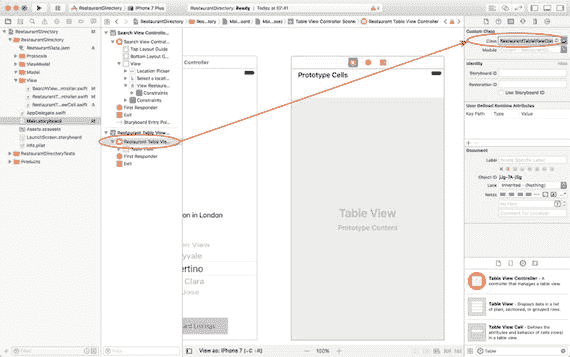

图 12-9.

Xcode 标识检查器

选中表视图单元格，并使用标识检查器将单元格关联的类更改为 `RestaurantTableViewCell`（如图 12-10 所示）。

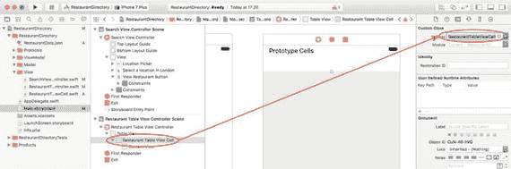

图 12-10.

使用标识检查器更改与 `UITableViewCell` 关联的类

保持表视图单元格的选中状态，切换到属性检查器，将标识符属性的值设置为 `RestaurantTableViewCellIdentifier`。

从对象库中拖放五个标签到表视图的原型单元格上。为这些标签命名并按照图 12-11 进行排列。创建合适的布局约束，以确保在不同屏幕尺寸下保持该布局。

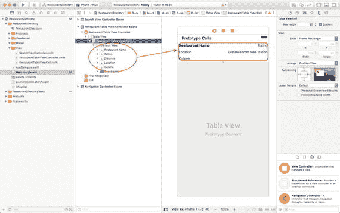

图 12-11.

原型单元格布局

表 12-5 列出了需要在 `RestaurantTableViewCell` 类中创建的插座变量和操作方法，以及它们关联的用户界面元素。

表 12-5.

餐厅表视图单元格的插座变量和操作。

| 名称 | 类型 | 描述 |
| --- | --- | --- |
| `@IBOutlet weak var name: UILabel!` | IB 插座变量 | 将此插座变量连接到“餐厅名称”标签。 |
| `@IBOutlet weak var rating: UILabel!` | IB 插座变量 | 将此插座变量连接到“评分”标签。 |
| `@IBOutlet weak var location: UILabel!` | IB 插座变量 | 将此插座变量连接到“位置”标签。 |
| `@IBOutlet weak var distance: UILabel!` | IB 插座变量 | 将此插座变量连接到“距离”标签。 |
| `@IBOutlet weak var cuisine: UILabel!` | IB 插座变量 | 将此插座变量连接到“菜系”标签。 |

在故事板中选中搜索视图控制器场景，使用 `Editor` ➤ `Embed In` ➤ `Navigation Controller` 菜单项，在故事板开头添加一个导航控制器（如图 12-12 所示）。

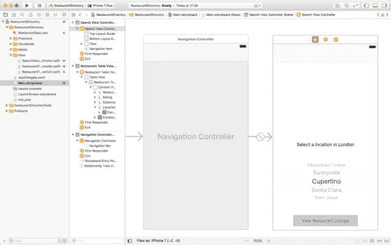

图 12-12.

在导航控制器中嵌入默认故事板场景

从故事板的搜索视图控制器场景到餐厅列表视图控制器场景创建 Show Detail 转场。选中该转场后，切换到属性检查器，将标识符属性的值设置为 `presentSearchResults`（如图 12-13 所示）。

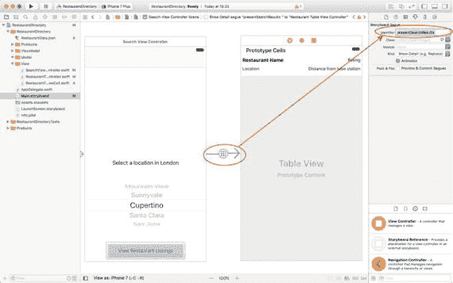

图 12-13.

使用标识检查器指定转场标识符

## 使用 Quick 编写 BDD 测试

按照第 11 章的说明将 Quick 和 Nimble 集成到你的项目中。集成 Quick 后，就可以开始为本章前面介绍的每个用户场景编写测试了。

从项目中删除 `RestaurantDirectoryTests.swift` 文件。在项目导航器的 `RestaurantDirectoryTests` 组下创建一个新组。将新组命名为 `BDD`。

在 `BDD` 组下创建一个名为 `RestaurantDirectorySpecificaton.swift` 的新 Swift 文件，并确保该新文件仅包含在测试目标中（如图 12-14 所示）。

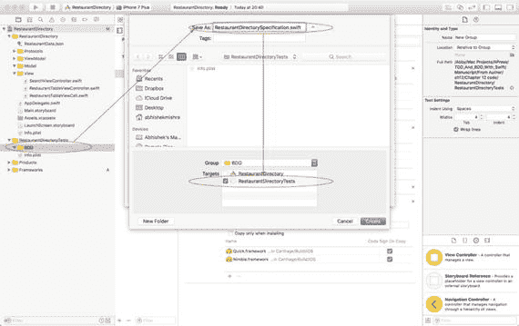

图 12-14.

BDD 测试文件的目标成员资格

用清单 12-3 的内容替换 `RestaurantDirectorySpecificaton.swift` 文件的内容。


```swift
import Foundation
import Quick
import Nimble

class RestaurantDirectorySpecification : QuickSpec {
    // 用于测试 SearchViewController 功能的模拟对象和桩对象
    var locationPickerStub:UIPickerViewStub?
    var viewRestaurantButtonStub:UIButtonStub?
    var searchViewController:MockSearchViewController?
    var searchViewModel:SearchViewModel?
    // 用于测试 RestaurantTableViewCell 功能的模拟对象和桩对象
    var restaurantNameLabelStub:UILabelStub?
    var restaurantRatingLabelStub:UILabelStub?
    var restaurantDistanceLabelStub:UILabelStub?
    var restaurantLocationLabelStub:UILabelStub?
    var restaurantCuisineLabelStub:UILabelStub?
    var restaurantTableViewCell:MockRestaurantTableViewCell?
    var validRestaurantDataFile1:String?
    var validRestaurant: Restaurant?
    var cellViewModel: RestaurantTableViewCellViewModel?

    func prepareForSearchViewControllerTests() {
        let bundle = Bundle(for: type(of:self))
        validRestaurantDataFile1 = bundle.path(forResource: "ValidRestaurantDataFile1", ofType: "json")
        locationPickerStub = UIPickerViewStub()
        viewRestaurantButtonStub = UIButtonStub()
        searchViewController = MockSearchViewController()
        searchViewController!.locationPicker = locationPickerStub!
        searchViewController!.viewRestaurantButton = viewRestaurantButtonStub!
        searchViewModel = SearchViewModel(view: searchViewController!)
        searchViewModel!.loadRestaurantData(filePath: validRestaurantDataFile1!)
        searchViewController!.viewModel = searchViewModel!
    }

    func prepareForRestaurantTableViewCellTests() {
        restaurantNameLabelStub = UILabelStub()
        restaurantRatingLabelStub = UILabelStub()
        restaurantDistanceLabelStub = UILabelStub()
        restaurantLocationLabelStub = UILabelStub()
        restaurantCuisineLabelStub = UILabelStub()
        restaurantTableViewCell = MockRestaurantTableViewCell()
        restaurantTableViewCell!.name = restaurantNameLabelStub!
        restaurantTableViewCell!.rating = restaurantRatingLabelStub!
        restaurantTableViewCell!.distance = restaurantDistanceLabelStub!
        restaurantTableViewCell!.location = restaurantLocationLabelStub!
        restaurantTableViewCell!.cuisine = restaurantCuisineLabelStub!

        var validDictionary = [String : AnyObject]()
        validDictionary["area"] = "Oxford Street" as AnyObject
        validDictionary["rating"] = "5" as AnyObject
        validDictionary["cuisine"] = "Indian" as AnyObject
        validDictionary["distance"] = "0.05" as AnyObject
        validDictionary["tubeStation"] = "Bayswater" as AnyObject
        validDictionary["restaurantName"] = "Curry King" as AnyObject
        validRestaurant = Restaurant(validDictionary)
        cellViewModel = RestaurantTableViewCellViewModel(model: validRestaurant!)
        cellViewModel!.view = restaurantTableViewCell!
        restaurantTableViewCell!.viewModel = cellViewModel!
    }

    override func spec() {
        beforeEach {
        }

        describe("应用主屏幕加载完成") {
            context("尚未选择任何区域") {
                it("“下一步”按钮处于未启用状态") {
                    self.prepareForSearchViewControllerTests()
                    self.searchViewController!.viewDidLoad()
                    expect(self.viewRestaurantButtonStub!.isEnabled).to(equal(false))
                }
            }
        }

        describe("应用主屏幕加载完成") {
            context("已选择一个伦敦区域") {
                it("“下一步”按钮处于启用状态") {
                    self.prepareForSearchViewControllerTests()
                    self.searchViewController!.pickerView(self.locationPickerStub!, didSelectRow: 0, inComponent: 0)
                    expect(self.viewRestaurantButtonStub!.isEnabled).to(equal(true))
                }
            }
        }

        describe("用户已选择一个位置") {
            context("点击“下一步”按钮") {
                it("新屏幕将显示该位置餐厅列表") {
                    self.prepareForSearchViewControllerTests()
                    self.searchViewController!.pickerView(self.locationPickerStub!, didSelectRow: 0, inComponent: 0)
                    self.searchViewController!.onViewListings(self)
                    expect(self.searchViewController!.displayResultsScreenCalled).to(equal(true))
                }
            }
        }

        describe("屏幕上显示了餐厅列表") {
            context("列表中显示了某家餐厅的名称") {
                it("该条目应附带最近地铁站名称") {
                    self.prepareForRestaurantTableViewCellTests()
                    self.restaurantTableViewCell!.setup()
                    let expectedValue = "\(self.validRestaurant!.distance!) miles(s) from \(self.validRestaurant!.tubeStation!)"
                    expect(self.restaurantDistanceLabelStub!.text).to(equal(expectedValue))
                }
            }
        }

        describe("屏幕上显示了餐厅列表") {
            context("列表中显示了某家餐厅的名称") {
                it("该条目应附带到最近地铁站的近似英里距离") {
                    self.prepareForRestaurantTableViewCellTests()
                    self.restaurantTableViewCell!.setup()
                    let expectedValue = "\(self.validRestaurant!.distance!) miles(s) from \(self.validRestaurant!.tubeStation!)"
                    expect(self.restaurantDistanceLabelStub!.text).to(equal(expectedValue))
                }
            }
        }

        describe("屏幕上显示了餐厅列表") {
            context("列表中显示了某家餐厅的名称") {
                it("该条目应附带一个介于 1 到 5 之间的整数，表示餐厅质量，1 为最差，5 为最好") {
                    self.prepareForRestaurantTableViewCellTests()
                    self.restaurantTableViewCell!.setup()
                    let expectedValue = "\(self.validRestaurant!.rating!) stars"
                    expect(self.restaurantRatingLabelStub!.text).to(equal(expectedValue))
                }
            }
        }

        describe("屏幕上显示了餐厅列表") {
            context("列表中显示了某家餐厅的名称") {
                it("该条目应附带餐厅提供的菜系") {
                    self.prepareForRestaurantTableViewCellTests()
                    self.restaurantTableViewCell!.setup()
                    let expectedValue = self.validRestaurant!.cuisine!
                    expect(self.restaurantCuisineLabelStub!.text).to(equal(expectedValue))
                }
            }
        }
    }
}
```

清单 12-3. `RestaurantDirectorySpecificaton.swift`


清单 12-3 中的代码定义了一个名为 `RestaurantDirectorySpecification` 的 BDD 规范类，它是 `QuickSpec` 的子类，包含多个 BDD 风格的测试，每个测试对应表 12-3（我们之前见过）中描述的一个用户场景。接下来对该文件的内容进行分析。

文件顶部有三个导入语句，导入了 `Foundation`、`Quick` 和 `Nimble` 框架：

```
import Foundation
import Quick
import Nimble
```

`RestaurantDirectorySpecification` 类声明为 `QuickSpec`（而非 `XCTest`）的子类，因为我们打算编写 BDD 风格的测试：

```
class RestaurantDirectorySpecification : QuickSpec
```

该类包含多个实例变量，用于创建 `SearchViewController` 和 `RestaurantTableViewCell` 类的桩版本：

```
// 针对 SearchViewController 功能的测试的模拟和桩
var locationPickerStub:UIPickerViewStub?
var viewRestaurantButtonStub:UIButtonStub?
var searchViewController:MockSearchViewController?
var searchViewModel:SearchViewModel?
// 针对 RestaurantTableViewCell 功能的测试的模拟和桩
var restaurantNameLabelStub:UILabelStub?
var restaurantRatingLabelStub:UILabelStub?
var restaurantDistanceLabelStub:UILabelStub?
var restaurantLocationLabelStub:UILabelStub?
var restaurantCuisineLabelStub:UILabelStub?
var restaurantTableViewCell:MockRestaurantTableViewCell?
var validRestaurantDataFile1:String?
var validRestaurant: Restaurant?
var cellViewModel: RestaurantTableViewCellViewModel?
```

实例变量声明之后紧接着是一对方法，用于执行必要的对象实例化并将其赋值给实例变量。这些方法命名如下：

*   `prepareForSearchViewControllerTests()`，以及
*   `prepareForRestaurantTableViewCellTests()`

该类还有另一个名为 `spec()` 的方法，Quick 测试就写在其中。如第 10 章所述，每个 BDD 测试的格式如下：

```
override func spec() {
beforeEach {
}
describe(/* 场景语句的 "Given" 部分 */) {
context(/* 场景语句的 "When" 部分 */){
it(/* 场景语句的 "Then" 部分 */) {
// 测试逻辑写在这里
}
}
}
}
```

Quick 测试用例的 `beforeEach()` 方法等同于 `XCTestCase` 的 `setUp()` 方法。调用 `beforeEach()` 方法后，会通过嵌套调用三个函数（`describe()`、`context()`、`it()`）来编写多个 BDD 风格的测试。

让我们逐一检查表 12-3 中列出的每个可测试的 BDD 场景及其对应的 BDD 测试代码（场景 1 和 2 无法使用 Quick 测试，因为它们依赖于用户界面的视觉检查）。

### 检查场景 3 的 BDD 测试

我们来看场景 3，这是第一个可以使用 BDD 技术测试的测试场景：

*   Given [应用主屏幕已加载]，
*   When [未选择任何区域]，
*   Then [“下一步”按钮处于未启用状态]。

测试该场景的 BDD 风格测试用例如下：

```
describe("the main screen of the app is loaded") {
context("no area has been selected") {
it("the Next button is not enabled") {
self.prepareForSearchViewControllerTests()
self.searchViewController!.viewDidLoad()
expect(self.viewRestaurantButtonStub!.isEnabled).
to(equal(false))
}
}
}
```

该应用的主屏幕由 `SearchViewController` 类的实例表示，其中包含一个带有地点列表的拾取器，以及一个允许用户查看拾取器中所选地点餐厅列表的按钮。

该场景的目标是确保在用户从拾取器中选择地点之前，按钮处于未启用状态。

为了测试该场景定义的条件是否满足，你只需调用 `SearchViewController` 实例上的 `viewDidLoad` 方法，并检查按钮的 `isEnabled` 属性是否为 `false`。

在测试中实例化视图控制器需要为视图控制器中定义的插座分配桩对象。这通过在测试开始时调用 `prepareForSearchViewControllerTests()` 来实现。

### 检查场景 4 的 BDD 测试

我们来看场景 4，这是下一个可以使用 BDD 技术测试的测试场景：

*   Given [应用主屏幕已加载]，
*   When [已选择伦敦的一个区域]，
*   Then [“下一步”按钮处于启用状态]。

测试该场景的 BDD 风格测试用例如下：

```
describe("the main screen of the app is loaded") {
context("an area in London has been selected") {
it("the Next button is enabled") {
self.prepareForSearchViewControllerTests()
self.searchViewController!.pickerView(
self.locationPickerStub!, didSelectRow: 0,
inComponent: 0)
expect(self.viewRestaurantButtonStub!.isEnabled).
to(equal(true))
}
}
}
```

该场景也描述了 `SearchViewController` 类的行为。该场景的目标是确保当用户从拾取器中选择地点后，视图控制器上的按钮处于启用状态。

为了测试该场景定义的条件是否满足，你只需调用 `SearchViewController` 实例上的 `pickerView(picker, didSelectRow, inComponent)` 方法，并检查按钮的 `isEnabled` 属性是否为 `true`。

### 检查场景 5 的 BDD 测试

我们来看场景 5，这是下一个可以使用 BDD 技术测试的测试场景：

*   Given [用户已选择一个地点]，
*   When [点击了“下一步”按钮]，
*   Then [出现一个新屏幕，显示该地点的餐厅列表]。

测试该场景的 BDD 风格测试用例如下：

```
describe("the user has selected a location") {
context("the Next button is tapped") {
it("a new screen appears with a list of restaurants in that
location") {
self.prepareForSearchViewControllerTests()
self.searchViewController!.pickerView(
self.locationPickerStub!, didSelectRow: 0,
inComponent: 0)
self.searchViewController!.onViewListings(self)
expect(self.searchViewController!.displayResultsScreenCalled).
to(equal(true))
}
}
}
```

该场景描述了用户在 `SearchViewController` 中点击“查看餐厅列表”按钮后发生的情况。预期行为是出现结果屏幕，显示餐厅列表。结果屏幕由 `RestaurantListTableViewController` 类的实例表示。

尝试确认结果屏幕是否在视觉上出现属于用户界面测试，更适合由 QA 团队使用的工具来完成。从代码角度来看，我们可以测试点击按钮是否会调用一个方法，而该方法又包含显示下一个屏幕的逻辑。

该项目将使用 MV-VM 架构模式构建，因此 `SearchViewController` 类将有一个名为 `SearchViewModel` 的关联视图模型类。视图模型类将包含展示逻辑，为了支持该逻辑，视图控制器类将提供一个名为 `displayResultsScreen()` 的方法，供视图模型调用。

为了测试该场景定义的条件是否满足，你只需在拾取器中选择一行，然后调用 `onViewListings()` 操作方法，并检查视图控制器上是否调用了 `displayResultsScreen()` 方法。

但你如何检查 `displayResultsScreen()` 是否被调用？在本项目中，我将创建一个名为 `MockSearchViewController` 的 `SearchViewController` 子类，该类包含一个布尔型实例变量，当 `displayResultsScreen()` 方法被调用时，该变量会被设置为 `true`。


### 检查场景 6 的 BDD 测试

让我们检查场景 6，这是下一个可以使用 BDD 技术进行测试的场景：

*   假设 [屏幕上显示了餐厅列表]，
*   当 [该列表中显示了餐厅名称] 时，
*   那么 [列表项应附带最近地铁站的名称]。

测试此场景的 BDD 风格测试用例如下所示：

```
describe("the list of restaurants is visible on the screen") {
    context("a restaurant’s name is displayed in that list") {
        it("the listing should be accompanied with the name of the nearest tube station") {
            self.prepareForRestaurantTableViewCellTests()
            self.restaurantTableViewCell!.setup()
            let expectedValue = "\(self.validRestaurant!.distance!) miles(s) from \(self.validRestaurant!.tubeStation!)"
            expect(self.restaurantDistanceLabelStub!.text).to(equal(expectedValue))
        }
    }
}
```

该场景描述了`RestaurantListTableViewCell`类的行为，可以通过确保表格视图的给定单元格在`restaurantDistanceLabel`中具有特定文本来进行测试。

测试代码要求使用用于插件的桩对象实例化`RestaurantListTableViewCell`。这通过在测试开始时调用`prepareForRestaurantTableViewCellTests()`来实现。

测试代码还假设表格视图单元格将有一个名为`setup()`的方法，该方法将在呈现单元格之前由表格视图控制器调用。

### 检查场景 7 的 BDD 测试

让我们检查场景 7，这是下一个可以使用 BDD 技术进行测试的场景：

*   假设 [屏幕上显示了餐厅列表]，
*   当 [该列表中显示了餐厅名称] 时，
*   那么 [列表项应附带与最近地铁站的近似距离（以英里为单位）]。

测试此场景的 BDD 风格测试用例如下所示：

```
describe("the list of restaurants is visible on the screen") {
    context("a restaurant’s name is displayed in that list") {
        it("the listing should be accompanied by the approximate distance in miles to the nearest tube station") {
            self.prepareForRestaurantTableViewCellTests()
            self.restaurantTableViewCell!.setup()
            let expectedValue = "\(self.validRestaurant!.distance!) miles(s) from \(self.validRestaurant!.tubeStation!)"
            expect(self.restaurantDistanceLabelStub!.text).to(equal(expectedValue))
        }
    }
}
```

此场景与前一个类似，也可以通过确保表格视图的给定单元格在`restaurantDistanceLabel`中具有特定文本来进行测试。

### 检查场景 8 的 BDD 测试

让我们检查场景 8，这是下一个可以使用 BDD 技术进行测试的场景：

*   假设 [屏幕上显示了餐厅列表]，
*   当 [该列表中显示了餐厅名称] 时，
*   那么 [列表项应附带一个 1 到 5 之间的整数，表示餐厅的质量，其中 1 表示最差，5 表示最好]。

测试此场景的 BDD 风格测试用例如下所示：

```
describe("the list of restaurants is visible on the screen") {
    context("a restaurant’s name is displayed in that list") {
        it("the listing should be accompanied by an integer between 1 to 5 that indicates the quality of the restaurant, with 1 being the poorest and 5 the best") {
            self.prepareForRestaurantTableViewCellTests()
            self.restaurantTableViewCell!.setup()
            let expectedValue = "\(self.validRestaurant!.rating!) stars"
            expect(self.restaurantRatingLabelStub!.text).to(equal(expectedValue))
        }
    }
}
```

该场景也描述了`RestaurantListTableViewCell`类的行为，可以通过确保表格视图的给定单元格在`restaurantRatingLabel`中具有特定文本来进行测试。

### 检查场景 9 的 BDD 测试

让我们检查场景 9，这是下一个可以使用 BDD 技术进行测试的场景：

*   假设 [屏幕上显示了餐厅列表]，
*   当 [该列表中显示了餐厅名称] 时，
*   那么 [列表项应附带该餐厅提供的菜系类型]。

测试此场景的 BDD 风格测试用例如下所示：

```
describe("the list of restaurants is visible on the screen") {
    context("a restaurant’s name is displayed in that list") {
        it("the listing should be accompanied by the cuisine served at the restaurant") {
            self.prepareForRestaurantTableViewCellTests()
            self.restaurantTableViewCell!.setup()
            let expectedValue = self.validRestaurant!.cuisine!
            expect(self.restaurantCuisineLabelStub!.text).to(equal(expectedValue))
        }
    }
}
```

该场景也描述了`RestaurantListTableViewCell`类的行为，可以通过确保表格视图的给定单元格在`restaurantCuisineLabel` `UILabel`中具有特定文本来进行测试。

### 创建桩对象

此时，您的项目将出现多个代码编译问题，因为这些测试依赖于许多尚未创建的对象。使用子类化技术可以轻松创建桩文本字段、标签和选择器。

在项目导航器中，于`RestaurantDirectoryTests`组下创建一个名为`Stubs`的新组，并在此组下创建一个名为`UILabelStub.swift`的新 Swift 文件。确保该文件仅包含在测试目标中（图 12-15）。

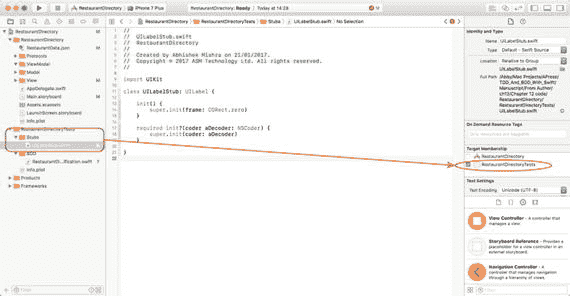

图 12-15. `UILabelStub`类的目标成员关系

更新`UILabelStub.swift`中的代码，使其与代码清单 12-4 的内容一致。

```
import UIKit
class UILabelStub: UILabel {
    init() {
        super.init(frame: CGRect.zero)
    }
    required init?(coder aDecoder: NSCoder) {
        super.init(coder: aDecoder)
    }
}
```

代码清单 12-4. `UILabelStub.swift`

在`Stubs`组下创建一个名为`UIButtonStub.swift`的新 Swift 文件，确保该文件仅包含在测试目标中，并更新新文件的内容，使其与代码清单 12-5 的内容一致。

```
import UIKit
class UILabelStub: UILabel {
    init() {
        super.init(frame: CGRect.zero)
    }
    required init?(coder aDecoder: NSCoder) {
        super.init(coder: aDecoder)
    }
}
```

代码清单 12-5. `UIButtonStub.swift`

在`Stubs`组下创建一个名为`UITextFieldStub.swift`的新 Swift 文件，确保该文件仅包含在测试目标中，并更新新文件的内容，使其与代码清单 12-6 的内容一致。

```
import UIKit
class UITextFieldStub : UITextField {
    init(text:String) {
        super.init(frame: CGRect.zero)
        super.text = text
    }
    required init?(coder aDecoder: NSCoder) {
        super.init(coder: aDecoder)
    }
}
```

代码清单 12-6. `UITextFieldStub.swift`

在`Stubs`组下创建一个名为`UITableViewStub.swift`的新 Swift 文件，确保该文件仅包含在测试目标中，并更新新文件的内容，使其与代码清单 12-7 的内容一致。

```
import UIKit
class UITableViewStub: UITableView {
    init() {
        super.init(frame: CGRect.zero, style: UITableViewStyle.plain)
    }
    required init?(coder aDecoder: NSCoder) {
        super.init(coder: aDecoder)
    }
    override func dequeueReusableCell(withIdentifier identifier: String) -> UITableViewCell? {
        return RestaurantTableViewCell()
    }
}
```

代码清单 12-7. `UITableViewStub.swift`

在`Stubs`组下创建一个名为`UIPickerViewStub.swift`的新 Swift 文件，确保该文件仅包含在测试目标中，并更新新文件的内容，使其与代码清单 12-8 的内容一致。

```
import UIKit
class UIPickerViewStub : UIPickerView {
    init() {
        super.init(frame: CGRect.zero)
    }
    required init?(coder aDecoder: NSCoder) {
        super.init(coder: aDecoder)
    }
}
```

代码清单 12-8. `UIPickerViewStub.swift`


### 将餐厅数据文件添加到项目

在项目导航器中，在 `RestaurantDirectoryTests` 组下创建一个名为 `TestData` 的新组，然后将本课下载材料中包含的 `ValidRestaurantDataFile1.json` 文件添加到项目中。添加此文件时，确保在导入对话框中勾选了“如果需要则拷贝文件”选项，并且该文件仅包含在测试目标中（图 12-16）。

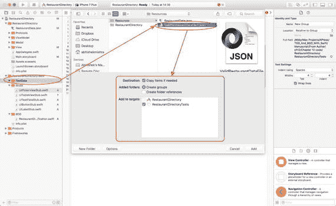

图 12-16. Xcode 文件导入对话框

### 检查剩余的编译错误

如果切换到 `RestaurantDirectorySpecification.swift` 文件，你会注意到之前可见的几个编译错误消息已经消失；然而，仍有 10 个错误存留（图 12-17）。

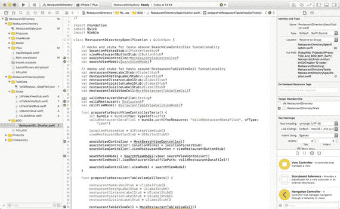

图 12-17. `RestaurantDirectorySpecification.Swift` 编译错误

这些错误的原因在于，这些 BDD 测试中引用了不少尚不存在的类：

- `SearchViewModel`
- `Restaurant`
- `RestaurantTableViewCellViewModel`
- `MockSearchViewController`
- `MockRestaurantTableViewCell`

在我们使用 MV-VM 应用程序架构构建应用代码时，将会创建这些类。

你可能已经注意到，BDD 测试本身并未强加任何特定的应用程序架构。例如，这些测试中没有任何内容表明模型层应如何构建、是否应该有验证器对象、应在何处使用视图模型等。

这是因为 BDD 测试在更高的抽象层级上运行。为了帮助定义代码的架构，你将需要在同一个项目中回归到 TDD 技术。

在同时使用 BDD 和 TDD 技术的项目开始时，你会使用 Quick 编写一组 BDD 测试，这些测试最初可能无法编译，即使能编译，也无法通过。

然后，你将转而使用 TDD 技术开发应用程序的代码，同时关注 BDD 测试。如果最初你的 BDD 测试无法编译，你将需要临时注释掉测试代码中无法编译的部分，以便专注于构建应用程序的代码。

你需要定期取消注释 BDD 测试并执行它们。经常这样做可以确保你使用 TDD 技术编写的代码正逐步满足业务提出的需求。随着时间的推移，随着更多应用程序代码及其关联的单元测试被构建完成，你的 BDD 测试也将开始通过。

本章的其余部分将描述应用程序的模型层、视图模型层和视图控制器层的特性，然后我们将使用前面章节介绍的标准 TDD 技术来构建这些层。

## 构建模型层

我们需要构建的模型类只有一个——`Restaurant`。`Restaurant` 类包含存储单个餐厅信息的属性。表 12-6 列出了 `Photo` 类的预期属性和方法。

表 12-6. `Photo` 类的属性和方法

| 项目 | 类型 | 描述 |
| --- | --- | --- |
| `var area:String?` | 变量 | 餐厅所在的伦敦区域。 |
| `var rating:String?` | 变量 | 0 到 5 之间的数字，代表餐厅获得的平均评分。 |
| `var cuisine:String?` | 变量 | 餐厅提供的菜系。 |
| `var distance:String?` | 变量 | 餐厅与最近地铁站之间的距离。 |
| `var tubeStation:String?` | 变量 | 最近伦敦地铁站的名称。 |
| `var restaurantName:String?` | 变量 | 餐厅的名称。 |
| `init?(_ dictionary:[String : AnyObject]?)` | 方法 | 允许其他代码创建 `Restaurant` 实例。需要传入一个包含某些必需键的字典作为输入。 |

`init()` 方法需要一个包含以下所有必需键的字典：

- `restaurantName`
- `rating`
- `cuisine`
- `area`
- `distance`
- `tubeStation`

完整的 `Restaurant` 类如代码清单 12-9 所示。如果你想查看验证器对象及其关联测试的代码，请使用以下 URL 从 github 匿名下载完成的项目：

[`https://github.com/asmtechnology/Lesson12.iOSTesting.2017.Apress.git`](https://github.com/asmtechnology/Lesson12.iOSTesting.2017.Apress.git)

```
import Foundation
class Restaurant : NSObject {
var area:String?
var rating:String?
var cuisine:String?
var distance:String?
var tubeStation:String?
var restaurantName:String?
var restaurantNameValidator:RestaurantNameValidator?
var tubeStationValidator:TubeStationValidator?
var cuisineValidator:CuisineValidator?
var ratingValidator:RatingValidator?
let areaKey = "area"
let ratingKey = "rating"
let cuisineKey = "cuisine"
let distanceKey = "distance"
let tubeStationKey = "tubeStation"
let restaurantNameKey = "restaurantName"
init?(_ dictionary:[String : AnyObject]?) {
guard let dictionary = dictionary,
let area = dictionary[areaKey] as? String,
let rating = dictionary[ratingKey] as? String,
let cuisine = dictionary[cuisineKey] as? String,
let distance = dictionary[distanceKey] as? String,
let tubeStation = dictionary[tubeStationKey] as? String,
let restaurantName = dictionary[restaurantNameKey]  as? String else {
return nil
}
super.init()
let restaurantNameValidator = self.restaurantNameValidator ?? RestaurantNameValidator()
if restaurantNameValidator.validate(restaurantName) == false {
return nil
}
let tubeStationValidator = self.tubeStationValidator ?? TubeStationValidator()
if tubeStationValidator.validate(tubeStation) == false {
return nil
}
let cuisineValidator = self.cuisineValidator ?? CuisineValidator()
if cuisineValidator.validate(cuisine) == false {
return nil
}
let ratingValidator = self.ratingValidator ?? RatingValidator()
if ratingValidator.validate(rating) == false {
return nil
}
self.area = area
self.rating = rating
self.cuisine = cuisine
self.distance = distance
self.tubeStation = tubeStation
self.restaurantName = restaurantName
}
}
代码清单 12-9. Restaurant.swift
```

## 构建视图模型层

我们需要构建三个视图模型类——`SearchViewModel`、`RestaurantTableViewModel` 和 `RestaurantTableViewCellViewModel`。它们分别对应 `SearchViewController`、`RestaurantTableViewController` 和 `RestaurantTableViewCell` 类。

视图模型将使用协议建立一个接口，通过该接口它们可以与其各自的视图控制器进行通信。


### SearchViewModel 类

`SearchViewModel` 类代表了 `SearchViewController` 类与 `Restaurant` 模型对象之间的视图模型。该视图模型类所需的实例变量和方法如表 12-7 所述。

**表 12-7.** SearchViewModel 的实例变量和方法

| 名称 | 类型 | 描述 |
| --- | --- | --- |
| `weak var view:SearchViewControllerProtocol?` | Ivar | 对视图控制器的引用，使用协议定义视图模型可用的方法列表。 |
| `var selectedArea:String?` | Ivar | 表示用户通过选择器视图交互而选定的伦敦区域位置。 |
| `var restaurants: [String: [Restaurant]]` | Ivar | 餐馆字典，为伦敦的每个区域保存一个条目。 |
| `func performInitialViewSetup()` | 方法 | 由视图控制器的 `viewDidLoad()` 方法调用。 |
| `func numberOfComponents() -> Int` | 方法 | 由视图控制器的 `numberOfComponents(in pickerView: UIPickerView)` 方法调用。 |
| `func numberOfRowsInComponent(_ component:Int) -> Int` | 方法 | 由视图控制器的 `pickerView(_ pickerView: UIPickerView, numberOfRowsInComponent component: Int)` 方法调用。 |
| `func titleForRow(_ row:Int, component:Int) -> String?` | 方法 | 由视图控制器的 `pickerView(_ pickerView: UIPickerView, titleForRow row: Int, forComponent component: Int)` 方法调用。 |
| `func didSelectRow(_ row:Int, component:Int) -> Void` | 方法 | 由视图控制器的 `pickerView(_ pickerView: UIPickerView, didSelectRow row: Int, inComponent component: Int)` 方法调用。 |
| `func onViewListings() -> Void` | 方法 | 由视图控制器的 `onViewListings(_ sender: Any)` 方法调用。 |
| `func viewModelForSelectedArea() -> RestaurantTableViewModel?` | 方法 | 由视图控制器的 `prepare(for segue: UIStoryboardSegue, sender: Any?)` 方法调用。 |
| `func loadRestaurantData(filePath:String?) -> Void` | 方法 | 由视图模型类的 `init()` 方法调用。 |
| `init(view:SearchViewControllerProtocol)` | 方法 | 由视图控制器的 `viewDidLoad()` 方法调用。 |

`SearchViewModel` 类要求定义一个名为 `SearchViewControllerProtocol` 的协议，并由 `SearchViewController` 类实现。清单 12-10 描述了该协议。

```swift
import Foundation
protocol SearchViewControllerProtocol : class {
    func setNavigationTitle(_ title:String)
    func enableRestaurantListingsButton(_ state:Bool)
    func displayResultsScreen()
}
```

**清单 12-10.** `SearchViewControllerProtocol.swift`

这些方法在 `SearchViewController.swift` 中通过将以下类扩展添加到文件末尾来实现：

```swift
extension SearchViewController : SearchViewControllerProtocol {
    func setNavigationTitle(_ title:String) {
        self.title = title
    }
    func enableRestaurantListingsButton(_ state:Bool) {
        self.viewRestaurantButton.isEnabled = state
    }
    func displayResultsScreen() {
        self.performSegue(withIdentifier: "presentSearchResults", sender: self)
    }
}
```

完整的 `SearchViewModel` 类在清单 12-11 中提供。如果您想检查相关测试的代码，请使用以下 URL 从 GitHub 匿名下载完成的项目：

[`https://github.com/asmtechnology/Lesson12.iOSTesting.2017.Apress.git`](https://github.com/asmtechnology/Lesson12.iOSTesting.2017.Apress.git)

```swift
import Foundation
class SearchViewModel : NSObject {
    var restaurants: [String: [Restaurant]]
    var selectedArea:String?
    weak var view:SearchViewControllerProtocol?
    
    init(view:SearchViewControllerProtocol) {
        self.view = view
        self.restaurants = [String: [Restaurant]]()
        super.init()
        let path = Bundle.main.path(forResource: "RestaurantData", ofType: "json")
        loadRestaurantData(filePath:path)
    }
    
    func loadRestaurantData(filePath:String?) -> Void {
        guard let filePath = filePath,
              let fileData = try? Data(contentsOf: URL(fileURLWithPath: filePath)),
              let array = try? JSONSerialization.jsonObject(with: fileData, options: JSONSerialization.ReadingOptions.mutableContainers) as? NSArray else {
            return
        }
        for item in array! {
            guard let dictionary = item as? [String : AnyObject] else {
                continue
            }
            if let restaurant = Restaurant(dictionary),
               let area = restaurant.area {
                if self.restaurants[area] == nil {
                    self.restaurants[area] = [Restaurant]()
                }
                self.restaurants[area]?.append(restaurant)
            }
        }
    }
    
    func performInitialViewSetup() {
        view?.setNavigationTitle("Restaurant Finder")
        view?.enableRestaurantListingsButton(false)
    }
    
    func numberOfComponents() -> Int {
        return 1
    }
    
    func numberOfRowsInComponent(_ component:Int) -> Int {
        return self.restaurants.count
    }
    
    func titleForRow(_ row:Int, component:Int) -> String? {
        let keys = String
        if row = keys.count {
            return nil
        }
        return keys[row]
    }
    
    func didSelectRow(_ row:Int, component:Int) -> Void {
        let keys = String
        if row = keys.count {
            return
        }
        self.selectedArea = keys[row]
        self.view?.enableRestaurantListingsButton(true)
    }
    
    func onViewListings() -> Void {
        self.view?.displayResultsScreen()
    }
    
    func viewModelForSelectedArea() -> RestaurantTableViewModel? {
        guard let selectedArea = self.selectedArea else {
            return nil
        }
        let keys = String
        if keys.contains(selectedArea) == false {
            return nil
        }
        return RestaurantTableViewModel(selectedArea, restaurantList:self.restaurants[selectedArea])
    }
}
```

**清单 12-11.** `SearchViewModel.swift`

在采用测试驱动方法构建 `SearchViewModel` 类时，您需要创建一个模拟视图控制器对象来实例化视图模型，并测试视图模型与视图控制器之间的绑定。

事实证明，一个模拟搜索视图控制器类也是使 Quick BDD 测试成功编译所需的缺失类之一。清单 12-12 包含一个名为 `MockSearchViewController` 的类中的代码，该类将同时用于单元测试和 Quick BDD 测试。

```swift
import Foundation
import XCTest

class MockSearchViewController : SearchViewController {
    var expectationForSetNavigationTitle:XCTestExpectation?
    var expectationForEnableRestaurantListingsButton:(XCTestExpectation, Bool)?
    var expectationForDisplayResultsScreen:XCTestExpectation?
    var displayResultsScreenCalled:Bool
    
    init() {
        displayResultsScreenCalled = false
        super.init(nibName: nil, bundle: nil)
    }
    
    required init?(coder aDecoder: NSCoder) {
        displayResultsScreenCalled = false
        super.init(coder: aDecoder)
    }
    
    override func setNavigationTitle(_ title:String) {
        expectationForSetNavigationTitle?.fulfill()
        super.setNavigationTitle(title)
    }
    
    override func enableRestaurantListingsButton(_ state:Bool) {
        guard let (expectation, expectedValue) = self.expectationForEnableRestaurantListingsButton else {
            super.enableRestaurantListingsButton(state)
            return
        }
        if state == expectedValue {
            expectation.fulfill()
        }
        super.enableRestaurantListingsButton(state)
    }
    
    override func displayResultsScreen() {
        expectationForDisplayResultsScreen?.fulfill()
        displayResultsScreenCalled = true
    }
}
```

**清单 12-12.** `MockSearchViewController.swift`


### `RestaurantTableViewModel` 类

`RestaurantTableViewModel` 类代表了 `RestaurantTableViewController` 类与 `Restaurant` 模型对象数组之间的视图模型。该视图模型所需的实例变量和方法描述于表 12-8 中。

**表 12-8.** `RestaurantTableViewModel` 实例变量和方法

| 名称 | 类型 | 描述 |
| --- | --- | --- |
| `var view:RestaurantTableViewControllerProtocol?` | Ivar | 对视图控制器的引用，使用协议定义视图模型可用的方法列表。 |
| `var area:String` | Ivar | 表示用户在伦敦内选择的位置。这将在导航栏中显示为标题。 |
| `var restaurantList:[Restaurant]` | Ivar | `Restaurant` 对象的数组。 |
| `func performInitialViewSetup()` | 方法 | 从视图控制器的 `viewDidLoad()` 方法调用。 |
| `func numberOfSections() -> Int` | 方法 | 从视图控制器的 `numberOfSections(in tableView: UITableView) -> Int` 方法调用。 |
| `func numberOfRowsInSection(_ section:Int) -> Int` | 方法 | 从视图控制器的 `tableView(_ tableView: UITableView, numberOfRowsInSection section: Int) -> Int` 方法调用。 |
| `func cellViewModel(forIndexPath indexPath:IndexPath) -> RestaurantTableViewCellViewModel?` | 方法 | 从视图控制器的 `tableView(_ tableView: UITableView, cellForRowAt indexPath: IndexPath) -> UITableViewCell` 方法调用。 |
| `init? (_ area:String, restaurantList:[Restaurant]?)` | 方法 | 从视图控制器的 `viewDidLoad()` 方法调用。 |

`RestaurantTableViewModel` 类要求项目中定义一个名为 `RestaurantTableViewControllerProtocol` 的协议，并由 `RestaurantTableViewController` 类实现。代码清单 12-13 描述了该协议：

```
import Foundation
protocol RestaurantTableViewControllerProtocol : class {
func setNavigationTitle(_ title:String)
}
```

代码清单 12-13. `RestaurantTableViewControllerProtocol.swift`

这些方法通过将以下类扩展添加到文件末尾，在 `RestaurantTableViewController.swift` 中实现：

```
extension RestaurantTableViewController : RestaurantTableViewControllerProtocol {
func setNavigationTitle(_ title:String) {
self.title = title
}
}
```

代码清单 12-14 提供了完整的 `RestaurantTableViewModel` 类，如下所示。如果你想检查相关测试的代码，请使用以下 URL 从 github 匿名下载已完成的项目：

[`https://github.com/asmtechnology/Lesson12.iOSTesting.2017.Apress.git`](https://github.com/asmtechnology/Lesson12.iOSTesting.2017.Apress.git)

```
import Foundation
class RestaurantTableViewModel : NSObject {
var area:String
var restaurantList:[Restaurant]
var view:RestaurantTableViewControllerProtocol?

init? (_ area:String, restaurantList:[Restaurant]?) {
guard let restaurantList = restaurantList else {
return nil
}
self.area = area
self.restaurantList = restaurantList
super.init()
}

func performInitialViewSetup() {
view?.setNavigationTitle("Restaurants in \(area).")
}

func numberOfSections() -> Int {
return 1
}

func numberOfRowsInSection(_ section:Int) -> Int {
return restaurantList.count
}

func cellViewModel(forIndexPath indexPath:IndexPath) -> RestaurantTableViewCellViewModel? {
let row = indexPath.row
if row = self.restaurantList.count {
return nil
}
let restaurant = restaurantList[row]
return RestaurantTableViewCellViewModel(model:restaurant)
}
}
```

代码清单 12-14. `RestaurantTableViewModel.swift`

### `RestaurantTableViewCellViewModel` 类

`RestaurantTableViewCellViewModel` 类代表了 `RestaurantTableViewCell` 类与单个 `Restaurant` 模型对象之间的视图模型。该视图模型所需的实例变量和方法描述于表 12-9 中。

**表 12-9.** `RestaurantTableViewCellViewModel` 实例变量和方法

| 名称 | 类型 | 描述 |
| --- | --- | --- |
| `var view:RestaurantTableViewCellProtocol?` | Ivar | 对视图控制器的引用，使用协议定义视图模型可用的方法列表。 |
| `var model:Restaurant?` | Ivar | 表示伦敦一家餐厅的数据。 |
| `func setup()` | 方法 | 从表格视图单元格的 `setup ()` 方法调用，该方法又由表格视图控制器的 `tableView(_ tableView: UITableView, cellForRowAt indexPath: IndexPath) -> UITableViewCell` 方法调用。 |
| `init(model:Restaurant?)` | 方法 | 用于创建视图模型的实例。 |

`RestaurantTableViewCellViewModel` 类要求项目中定义一个名为 `RestaurantTableViewCellProtocol` 的协议，并由 `RestaurantTableViewCellr` 类实现。代码清单 12-15 描述了该协议：

```
import Foundation
protocol RestaurantTableViewCellProtocol : class {
func setRestaurantLocation(_ location:String)
func setRestaurantRating(_ rating:String)
func setRestaurantCuisine(_ cuisine:String)
func setRestarantDistance(_ distance:String)
func setRestaurantName(_ restaurantName:String)
}
```

代码清单 12-15. `RestaurantTableViewCellProtocol.swift`

这些方法通过将以下类扩展添加到文件末尾，在 `RestaurantTableViewCellr.swift` 中实现：

```
extension RestaurantTableViewCell : RestaurantTableViewCellProtocol {
func setRestaurantLocation(_ location:String) {
self.location.text = location
}
func setRestaurantRating(_ rating:String) {
self.rating.text = rating
}
func setRestaurantCuisine(_ cuisine:String) {
self.cuisine.text = cuisine
}
func setRestarantDistance(_ distance:String) {
self.distance.text = distance
}
func setRestaurantName(_ restaurantName:String) {
self.name.text = restaurantName
}
}
```

完整的 `RestaurantTableViewCellViewModel` 类见代码清单 12-16。如果你想检查相关测试的代码，请使用以下 URL 从 github 匿名下载已完成的项目：

[`https://github.com/asmtechnology/Lesson12.iOSTesting.2017.Apress.git`](https://github.com/asmtechnology/Lesson12.iOSTesting.2017.Apress.git)

```
import Foundation
class RestaurantTableViewCellViewModel : NSObject {
var model:Restaurant?
var view:RestaurantTableViewCellProtocol?

init(model:Restaurant?) {
self.model = model
super.init()
}

func setup() {
guard let view = view ,
let model = model,
let area = model.area,
let rating = model.rating,
let cuisine = model.cuisine,
let distance = model.distance,
let tubeStation = model.tubeStation,
let restaurantName = model.restaurantName else {
return
}
view.setRestaurantLocation(area)
view.setRestaurantRating("\(rating) stars")
view.setRestaurantCuisine(cuisine)
view.setRestarantDistance("\(distance) miles(s) from \(tubeStation)")
view.setRestaurantName(restaurantName)
}
}
```

代码清单 12-16. `RestaurantTableViewCellViewModel.swift`

在使用测试驱动的方法构建 `RestaurantTableViewCellViewModel` 类时，你需要创建一个模拟的表格视图单元格对象来测试视图模型与单元格之间的绑定。

事实证明，模拟表格视图单元格类正是使 Quick BDD 测试能够编译所需的缺失类之一。代码清单 12-17 包含了一个名为 `MockRestaurantTableViewCell` 的类的代码，该代码将用于单元测试和 Quick BDD 测试。


```swift
import Foundation
import XCTest

class MockRestaurantTableViewCell : RestaurantTableViewCell {
    var expectationForSetRestaurantLocation:(XCTestExpectation, String)?
    var expectationForSetRestaurantRating:(XCTestExpectation, String)?
    var expectationForSetRestaurantCuisine:(XCTestExpectation, String)?
    var expectationForSetRestaurantDistance:(XCTestExpectation, String)?
    var expectationForSetRestaurantName:(XCTestExpectation, String)?

    override func setRestaurantLocation(_ location:String) {
        guard let (expectation, expectedValue) = self.expectationForSetRestaurantLocation else {
            super.setRestaurantLocation(location)
            return
        }
        if location.compare(expectedValue) == .orderedSame {
            expectation.fulfill()
        }
        super.setRestaurantLocation(location)
    }

    override func setRestaurantRating(_ rating:String) {
        guard let (expectation, expectedValue) = self.expectationForSetRestaurantRating else {
            super.setRestaurantRating(rating)
            return
        }
        if rating.compare(expectedValue) == .orderedSame {
            expectation.fulfill()
        }
        super.setRestaurantRating(rating)
    }

    override func setRestaurantCuisine(_ cuisine:String) {
        guard let (expectation, expectedValue) = self.expectationForSetRestaurantCuisine else {
            super.setRestaurantCuisine(cuisine)
            return
        }
        if cuisine.compare(expectedValue) == .orderedSame {
            expectation.fulfill()
        }
        super.setRestaurantCuisine(cuisine)
    }

    override func setRestarantDistance(_ distance:String) {
        guard let (expectation, expectedValue) = self.expectationForSetRestaurantDistance else {
            super.setRestarantDistance(distance)
            return
        }
        if distance.compare(expectedValue) == .orderedSame {
            expectation.fulfill()
        }
        super.setRestarantDistance(distance)
    }

    override func setRestaurantName(_ restaurantName:String) {
        guard let (expectation, expectedValue) = self.expectationForSetRestaurantName else {
            super.setRestaurantName(restaurantName)
            return
        }
        if restaurantName.compare(expectedValue) == .orderedSame {
            expectation.fulfill()
        }
        super.setRestaurantName(restaurantName)
    }
}
```
代码清单 12-17 `MockRestaurantTableViewCell.swift`

### 视图控制器到视图模型的绑定

模型层和视图模型层已经准备就绪。剩下的工作就是实例化视图模型对象，并从相应的视图控制器中集成对这些视图模型对象的调用。

代码清单 12-18 展示了最终的 `SearchViewController` 类，该类已与 `SearchViewModel` 类完全集成。

```swift
import UIKit

class SearchViewController: UIViewController {
    @IBOutlet weak var locationPicker: UIPickerView!
    @IBOutlet weak var viewRestaurantButton: UIButton!
    var viewModel:SearchViewModel?

    override func viewDidLoad() {
        super.viewDidLoad()
        if self.viewModel == nil {
            self.viewModel = SearchViewModel(view: self)
        }
        self.viewModel?.performInitialViewSetup()
    }

    override func didReceiveMemoryWarning() {
        super.didReceiveMemoryWarning()
        // 处置任何可以重新创建的资源。
    }

    @IBAction func onViewListings(_ sender: Any) {
        self.viewModel?.onViewListings()
    }

    override func prepare(for segue: UIStoryboardSegue, sender: Any?) {
        guard let identifier = segue.identifier,
              let destination = segue.destination as? RestaurantTableViewController,
              let viewModel = self.viewModel else {
            return
        }
        if identifier.compare("presentSearchResults") != .orderedSame {
            return
        }
        let detailViewModel = viewModel.viewModelForSelectedArea()
        detailViewModel?.view = destination as RestaurantTableViewControllerProtocol
        destination.viewModel = detailViewModel
    }
}

extension SearchViewController : UIPickerViewDelegate {
    func pickerView(_ pickerView: UIPickerView, titleForRow row: Int, forComponent component: Int) -> String? {
        guard let viewModel = self.viewModel else {
            return nil
        }
        return viewModel.titleForRow(row, component:component)
    }

    func pickerView(_ pickerView: UIPickerView, didSelectRow row: Int, inComponent component: Int) {
        guard let viewModel = self.viewModel else {
            return
        }
        return viewModel.didSelectRow(row, component:component)
    }
}

extension SearchViewController : UIPickerViewDataSource {
    func numberOfComponents(in pickerView: UIPickerView) -> Int {
        guard let viewModel = self.viewModel else {
            return 0
        }
        return viewModel.numberOfComponents()
    }

    func pickerView(_ pickerView: UIPickerView, numberOfRowsInComponent component: Int) -> Int {
        guard let viewModel = self.viewModel else {
            return 0
        }
        return viewModel.numberOfRowsInComponent(component)
    }
}

extension SearchViewController : SearchViewControllerProtocol {
    func setNavigationTitle(_ title:String) {
        self.title = title
    }

    func enableRestaurantListingsButton(_ state:Bool) {
        self.viewRestaurantButton.isEnabled = state
    }

    func displayResultsScreen() {
        self.performSegue(withIdentifier: "presentSearchResults", sender: self)
    }
}
```
代码清单 12-18 `SearchViewController.swift`

代码清单 12-19 展示了最终的 `RestaurantListTableViewController` 类，该类已与 `RestaurantTableViewModel` 类完全集成。


```swift
import UIKit
class RestaurantTableViewController: UITableViewController {
    var viewModel: RestaurantTableViewModel?
    override func viewDidLoad() {
        super.viewDidLoad()
        viewModel?.performInitialViewSetup()
    }
    override func didReceiveMemoryWarning() {
        super.didReceiveMemoryWarning()
        // Dispose of any resources that can be recreated.
    }
    // MARK: - Table view data source
    override func numberOfSections(in tableView: UITableView) -> Int {
        guard let viewModel = self.viewModel else {
            return 0
        }
        return viewModel.numberOfSections()
    }
    override func tableView(_ tableView: UITableView, numberOfRowsInSection section: Int) -> Int {
        guard let viewModel = self.viewModel else {
            return 0
        }
        return viewModel.numberOfRowsInSection(section)
    }
    override func tableView(_ tableView: UITableView, cellForRowAt indexPath: IndexPath) -> UITableViewCell {
        let cell = tableView.dequeueReusableCell(withIdentifier: "RestaurantTableViewCellIdentifier", for: indexPath) as? RestaurantTableViewCell
        guard let viewModel = viewModel,
              let restaurantTableViewCell = cell else {
            return UITableViewCell()
        }
        let detailViewModel = viewModel.cellViewModel(forIndexPath: indexPath)
        detailViewModel?.view = restaurantTableViewCell
        restaurantTableViewCell.viewModel = detailViewModel
        restaurantTableViewCell.setup()
        return restaurantTableViewCell
    }
}
extension RestaurantTableViewController : RestaurantTableViewControllerProtocol {
    func setNavigationTitle(_ title:String) {
        self.title = title
    }
}
```
*列表 12-19.* `RestaurantListTableViewController.swift`

`列表 12-20` 展示了最终与 `RestaurantTableViewCellViewModel` 类完全集成的 `RestaurantListTableViewCell` 类。

```swift
import UIKit
class RestaurantTableViewCell: UITableViewCell {
    @IBOutlet weak var name: UILabel!
    @IBOutlet weak var rating: UILabel!
    @IBOutlet weak var distance: UILabel!
    @IBOutlet weak var location: UILabel!
    @IBOutlet weak var cuisine: UILabel!
    var viewModel:RestaurantTableViewCellViewModel?
    override func awakeFromNib() {
        super.awakeFromNib()
        // Initialization code
    }
    override func setSelected(_ selected: Bool, animated: Bool) {
        super.setSelected(selected, animated: animated)
        // Configure the view for the selected state
    }
    func setup() {
        viewModel?.setup()
    }
}
extension RestaurantTableViewCell : RestaurantTableViewCellProtocol {
    func setRestaurantLocation(_ location:String) {
        self.location.text = location
    }
    func setRestaurantRating(_ rating:String) {
        self.rating.text = rating
    }
    func setRestaurantCuisine(_ cuisine:String) {
        self.cuisine.text = cuisine
    }
    func setRestarantDistance(_ distance:String) {
        self.distance.text = distance
    }
    func setRestaurantName(_ restaurantName:String) {
        self.name.text = restaurantName
    }
}
```
*列表 12-20.* `RestaurantListTableViewCell.swift`

你可以使用以下网址从 github 匿名下载已完成的项目：

[`https://github.com/asmtechnology/Lesson12.iOSTesting.2017.Apress.git`](https://github.com/asmtechnology/Lesson12.iOSTesting.2017.Apress.git)

如果你使用 `Product > Test` 菜单项执行所有测试，你会看到所有 BDD 和 TDD 测试都通过了。

## 总结

在本章中，你学习了如何在构建 iOS 应用时结合 BDD 和 TDD 技术。你首先回顾了业务需求，并创建了一组用户故事来覆盖这些需求。然后你发现并非所有用户故事都可以通过 BDD 技术进行测试；有些场景更适合使用视觉检查技术来测试。

对于那些可以使用 BDD 技术测试的场景，你学习了如何使用 Quick 创建 BDD 测试。BDD 测试最初是失败的，你确定需要创建所需的应用程序功能才能使 BDD 测试通过。

由于 BDD 测试并不规定底层代码的编写方式，你选择使用 TDD 技术和应用程序架构来构建底层的应用程序功能。

通过这种方式，你结合使用了 BDD 和 TDD 两种技术来构建应用程序。

