# 13. 测试用户界面

用户界面（UI）测试允许你从外部测试应用程序，就像用户会看到的那样。每次你决定在模拟器或设备上运行你的应用程序时，实际上就是在测试应用程序的 UI。自 Xcode 7 以来，Apple 提供了创建自动化 UI 测试的能力。这些自动化 UI 测试在发现回归缺陷方面非常出色，如果使用得当，可以减少应用的回归测试工作量。

UI 测试是使用 `XCTest` 中的一组类构建的。与源自 `XCTest` 的单元测试不同，UI 测试源自 `XCUITest`。UI 测试通常在 Xcode 项目中拥有自己的组和构建目标，如图 13-1 所示。

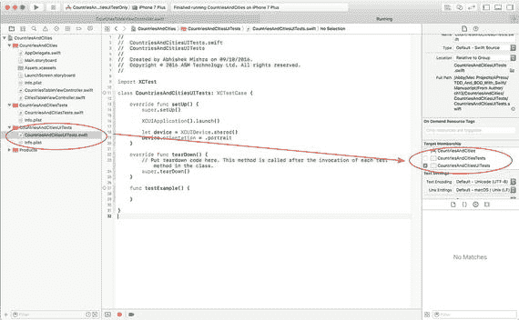

*图 13-1.* UI 测试的单独文件夹组和构建目标

如图 13-1 所示，构成应用程序的代码、其相关的单元测试和用户界面测试都是同一个 Xcode 项目的一部分。然而，与单元测试不同，UI 测试被打包并部署到一个名为测试运行器的单独应用程序中。

构成 UI 测试用例的代码在测试运行器应用内执行，而不是在被测试的主应用（受测对象）中。自然，测试运行器的首要任务是启动一个待测试应用的实例。

测试运行器应用如何以编程方式与受测对象的 UI 交互？答案是通过 Xcode 在测试会话期间设置的代理用户界面元素。如图 13-2 所示。

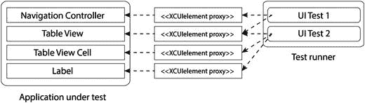

*图 13-2.* 测试运行器和被测试应用

典型 UI 测试用例中的代码会尝试在受测对象中找到一个代理用户界面元素，并根据代理元素的状态创建断言。代理元素是 `XCUIElement` 的实例，在 UI 测试中可使用的属性和方法非常有限。

Xcode 还提供了一个相关功能，称为 UI 录制。UI 录制是一个帮助你创建 UI 测试的工具。启用 UI 录制时，受测对象的一个实例会在 iOS 模拟器中启动，你可以像平常一样与其交互。Xcode 会记录你与应用的交互，并构建一个用户界面测试，以便为你执行相同顺序的交互操作。

## 向项目添加 UI 测试支持

添加 UI 测试支持涉及链接 `XCTest`、在 Xcode 项目中新建一个文件组，以及创建一个新的构建目标。

### 新项目

如果你正在创建新项目，过程会稍微简单一些。只需确保在项目选项对话框中选中 `Include UI Tests` 复选框即可（见图 13-3）。

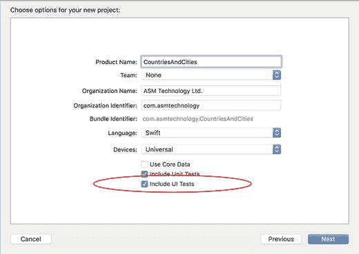

*图 13-3.* Xcode 项目选项对话框

当你这样做时，会注意到一些变化：

- Xcode 项目中添加了一个新组。这个组将用于存放你的 UI 测试文件。
- 项目中添加了一个新的构建目标，也称为 UI 测试目标。
- 该测试目标已预先配置为测试宿主应用。

所有这些点在图 13-4 中都有体现。

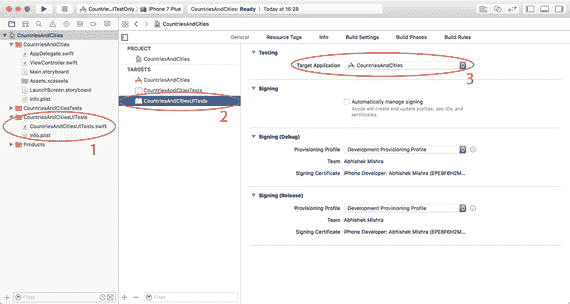

*图 13-4.* UI 测试的新文件夹组和构建目标


### 现有项目

要为现有项目添加 UI 测试支持，需要通过在 Xcode 项目中选择 `File ➤ New ➤ Target` 来添加一个新的测试目标。

在目标模板对话框中，在 `Test` 类别下选择 `iOS UI Testing Bundle`（图 13-5）。

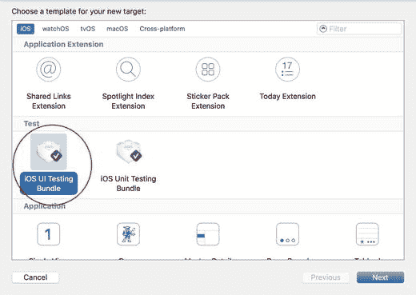

图 13-5. Xcode 目标模板对话框

在目标选项对话框中接受默认值，然后点击 `Finish`（图 13-6）。

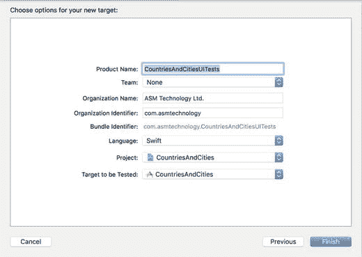

图 13-6. Xcode 目标选项对话框

## UI 测试类

UI 测试类就是一个继承自 `XCUITestCase` 的 Swift 类。UI 测试类与单元测试类在许多方面类似，同样包含 `setup`、`teardown` 和 `test` 方法。

**Setup 方法**：UI 测试类中只有一个 setup 方法。其方法签名如下：

```
override func setUp()
```

`setUp()` 会在 UI 测试类中每个 UI 测试方法执行之前被调用。注意使用 `override` 关键字来表示基类方法定义在父类（`XCUITestCase`）中。

**Teardown 方法**：UI 测试类中只有一个 teardown 方法。其方法签名如下：

```
override func tearDown()
```

`tearDown()` 方法同样带有 `override` 关键字前缀，并在 UI 测试类中每个 UI 测试方法执行完毕后被调用。

**测试方法**：UI 测试类通常包含多个测试方法，每个方法包含一个独立的 UI 测试。测试方法的方法名都以 `test` 开头，例如：

```
func testTappingOnDeleteButtonDisplaysAlert() {
}
```

测试方法的方法名应描述它们旨在测试的用户交互，并且单个方法中测试的用户操作路径长度应尽可能短。

以下代码片段展示了一个典型的 UI 测试类：

```
import XCTest
class CountriesAndCitiesUITests: XCTestCase {
    override func setUp() {
        super.setUp()
        XCUIApplication().launch()
    }
    override func tearDown() {
        super.tearDown()
    }
    func testTappingOnDeleteButtonDisplaysAlert() {
    }
    func testCountryListAppearsOnAppLaunch() {
    }
}
```

**注意**

您可以选择为应用的每个视图控制器创建一个单独的 UI 测试类，但有时更好的做法是创建代表用户操作路径的 UI 测试类。视图控制器很少独立存在；通常，用户会从一个初始视图控制器开始，通过与您的应用交互，移动到其他视图控制器。如果您的 UI 测试涉及多个视图控制器，最好根据它们所代表的用户操作路径来命名。

要执行项目中（所有测试类中的）所有测试，请使用 `Product ➤ Test` 菜单项。这将启动 iOS 模拟器（或真机）上的应用，并按顺序执行所有测试用例。

如果您的项目同时包含单元测试和 UI 测试，那么单元测试将先执行，UI 测试将仅在所有单元测试完成后才执行。如果您想在不等待单元测试的情况下执行 UI 测试，则需要创建一个不包含单元测试的新构建配置。

创建新构建配置最常见的方法是复制一个现有配置，然后在副本上进行修改。要复制现有构建配置，请先选择 `Product ➤ Schemes ➤ Manage Schemes` 菜单项。

您将看到项目中构建配置的列表。确保您要复制的配置已被选中，然后点击配置列表左下角的设置图标（图 13-7）。

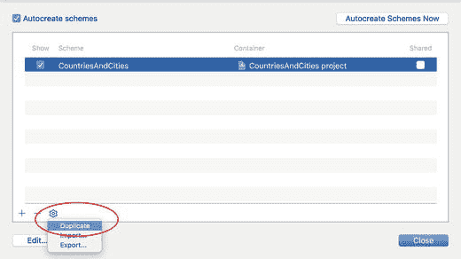

图 13-7. 复制现有构建配置

点击设置图标后出现的上下文菜单中选择 `Duplicate` 选项，将创建该配置的副本，并打开配置属性对话框。为新配置指定一个有意义的名称，然后在配置属性对话框的 `Test` 部分下，确保单元测试目标未被选中（图 13-8）。

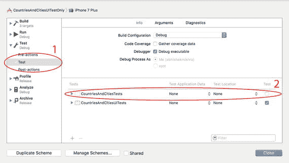

图 13-8. 从为 UI 测试构建的配置中取消选中单元测试目标

与单元测试一样，UI 测试阶段的结果也可以在测试导航器中看到，可以通过选择 `View ➤ Navigators ➤ Show Test Navigator` 来访问（图 13-9）。

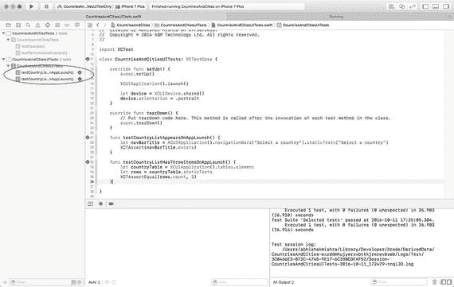

图 13-9. UI 测试的结果在测试导航器中可见

通过的测试名称旁会有一个绿色的勾选框。测试名称旁出现红色勾选框表示该测试未通过。请记住，Xcode 需要先编译测试代码才能运行测试，这意味着您需要先修复项目中的所有编译错误，然后才能运行任何测试。

## 创建新的测试类

您可以通过以下两种方式之一向项目添加新的 UI 测试类：

1. 在项目导航器中 `Command-点击` UI 测试组，然后从上下文菜单中选择 `New File…` 选项。这将弹出一个对话框，其中包含要选择的文件模板列表。在 `iOS` 类别下选择 `UI Test Case class` 模板（图 13-10）。

   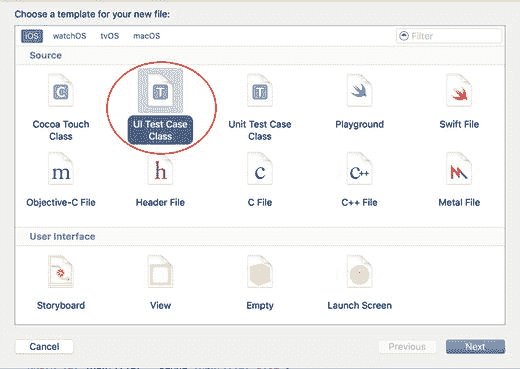

   图 13-10. Xcode 文件模板对话框

2. 在测试导航器可见的情况下，点击导航器底部的添加按钮（`+`），然后从上下文菜单中选择 `New UI Test Class` 菜单项（图 13-11）。

   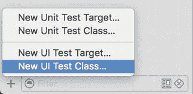

   图 13-11. 创建新的 UI 测试类

## 对 XCTest 的改动以支持 UI 测试

为了支持 UI 测试，`XCTest` 中新增了四个新类和新协议。本节将讨论这些内容。


XCUIApplication

XCUIApplication 实例是一个代理对象，代表正在被测试的应用。目标应用在 UI 测试目标设置的“目标应用”字段中指定（图 13-12）。

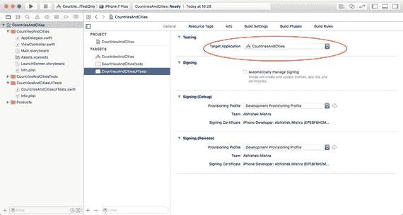

**图 13-12.** UI 测试目标中的“目标应用”设置

回顾一下，UI 测试是在一个与被测试应用不同的应用上下文中运行的，并通过代理对象与测试主体进行通信。

`XCUIApplication` 最常用的两个方法是 `launch()` 和 `terminate()`。通常，你会在测试类的 `setup()` 方法中实例化一个 `XCUIApplication` 实例并调用 `launch` 方法：

```swift
override func setUp() {
    super.setUp()
    XCUIApplication().launch()
}
```

对 `launch` 的调用是同步的，当被测试的应用启动完毕并准备好进行用户交互时返回。如果被测试的应用无法启动，将会产生一个测试失败。

你可以通过设置 `launchArguments` 属性来传递一个启动参数数组。例如，以下代码片段通过 `XCUIApplication` 代理向 `UIApplication` 实例传递了一个启动参数 `ENABLE_CLIENT_SIDE_MOCKS`。

```swift
override func setUp() {
    super.setUp()
    let application = XCUIApplication()
    application.launchArguments = ["ENABLE_CLIENT_SIDE_MOCKS"]
    application.launch()
}
```

被测试的应用需要负责检查这些参数并做出相应的处理。你提供给 `XCUIApplication.launchArguments` 的值数组可以在被测试的应用中通过 `CommandLine.arguments` 进行访问。

以下代码片段演示了如何通过调用 `CommandLine.arguments` 在被测试的应用中检索启动参数。该数组的第一个元素总是应用的完整路径，因此代码从索引 1 开始检查元素：

```swift
func application(_ application: UIApplication, didFinishLaunchingWithOptions launchOptions: [UIApplicationLaunchOptionsKey: Any]?) -> Bool {
    let launchArguments = CommandLine.arguments
    for index in 1...launchArguments.count {
        let argument = launchArguments[index] as String
        if argument.compare("ENABLE_CLIENT_SIDE_MOCKS") == .orderedSame {
            // 在此处执行某些操作以启用客户端模拟。
        }
    }
    return true
}
```

要终止应用，你可以调用 `XCUIApplication` 代理对象上的 `terminate()` 方法。这不是绝对必要的，因为每次 UI 测试执行完毕后，`XCTest` 会自动终止应用实例。

### XCUIDevice

这个类的实例代表运行 UI 测试的设备。`XCUIDevice` 是一个单例，并且始终只有一个实例，可以按如下方式访问：

```swift
let device = XCUIDevice.shared()
```

`XCUIDevice` 有一个名为 `orientation` 的属性，可用于获取或设置运行 UI 测试的设备的屏幕方向。表 13-1 列出了 `orientation` 属性最常用的值。

**表 13-1.** 屏幕方向值

| 值 | 描述 |
| --- | --- |
| `portrait` | 设备垂直定向，home 键在底部。 |
| `portraitUpsideDown` | 设备垂直定向，home 键在顶部。 |
| `landscapeLeft` | 设备水平定向，home 键在右侧。 |
| `landscapeRight` | 设备水平定向，home 键在左侧。 |

在运行 UI 测试之前，最好在 `setUp()` 方法中显式设置设备的屏幕方向。以下代码片段演示了这一点，在被测试的应用启动后，将设备屏幕方向设置为 `portrait`。

```swift
override func setUp() {
    super.setUp()
    XCUIApplication().launch()
    let device = XCUIDevice.shared()
    device.orientation = .portrait
}
```

### XCUIElement, XCUIElementAttributes

`XCUIElement` 实例是被测试应用中用户界面元素的代理。它几乎总是通过调用 `XCUIElementQuery` 实例的方法来获得。

可以为被测试应用的用户界面上尚不存在的元素创建代理。这是因为 `XCUIElement` 仅在其方法被调用时才进行求值。在求值时，如果 `XCUIElement` 未解析为实际的元素，将会产生一个测试失败。

请务必记住，`XCUIElement` 只是一个代理，提供的方法集非常有限。`XCUIElement` 实例不允许你直接访问底层的用户元素。例如，如果你有一个代表视图上某个按钮实例的 `XCUIElement` 代理，你无法解引用该 `XCUIElement` 来获取底层的 `UIButton` 对象。

表 13-2 列出了可在 `XCUIElement` 实例上调用的部分方法。这些方法旨在让你能够以类似于应用最终用户操作的方式，与底层用户界面元素进行交互。

**表 13-2.** XCUIElement 方法

| 属性/方法名称 | 描述 |
| --- | --- |
| `var exists: Bool { get }` | 如果 `XCUIElement` 代理解析为被测试应用中的实际 UI 元素，则返回 `true`。 |
| `func tap()` | 向被测试应用中的底层 UI 元素发送一个轻点事件。 |
| `func doubleTap()` | 向被测试应用中的底层 UI 元素发送一个双击事件。 |
| `func press(forDuration duration: TimeInterval)` | 向被测试应用中的底层 UI 元素发送一个长按手势事件，并持续指定的时长。 |
| `func press(forDuration duration: TimeInterval, thenDragTo otherElement: XCUIElement)` | 向被测试应用中的底层 UI 元素发送一个按住并拖拽到另一个元素的手势。用于表格单元格重新排序测试。 |
| `func swipeUp()` | 向被测试应用中的底层 UI 元素发送一个向上轻扫手势。 |
| `func swipeDown()` | 向被测试应用中的底层 UI 元素发送一个向下轻扫手势。 |
| `func swipeLeft()` | 向被测试应用中的底层 UI 元素发送一个向左轻扫手势。 |
| `func swipeRight()` | 向被测试应用中的底层 UI 元素发送一个向右轻扫手势。 |
| `func pinch(withScale scale: CGFloat, velocity: CGFloat)` | 向被测试应用中的底层 UI 元素发送一个捏合手势。 |
| `func rotate(_ rotation: CGFloat, withVelocity velocity: CGFloat)` | 向被测试应用中的底层 UI 元素发送一个旋转手势。 |
| `func adjust(toNormalizedSliderPosition normalizedSliderPosition: CGFloat)` | 调整被测试应用中滑块的值。所需的滑块位置以归一化值 `[0.0, 1.0]` 的形式发送。 |
| `func adjust(toPickerWheelValue pickerWheelValue: String)` | 调整被测试应用中滚轮的值。 |

`XCUIElement` 遵循 `XCUIElementAttributes` 协议。该协议定义了多个属性，这些属性返回 UI 元素常用属性的值，具体将在下面讨论。

**注意**

`XCUIElement` 也遵循 `XCUIElementTypeQueryProvider` 协议，这将在本章后面讨论。


### XCUIElementAttributes

`XCUIElementAttributes`协议定义了多个属性，这些属性返回常用的属性值。表 13-3 列出了一些在`XCUIElementAttributes`中定义的常用属性。

**表 13-3.** `XCUIElementAttribute`属性

| 属性名称 | 描述 |
| --- | --- |
| `var identifier: String { get }` | 返回元素的辅助功能标识符。 |
| `var frame: CGRect { get }` | 返回元素在屏幕坐标空间中的`frame`属性。 |
| `var title: String { get }` | 返回元素的辅助功能标题。 |
| `var label: String { get }` | 返回元素的标题（如果适用）。 |
| `var elementType: XCUIElementType` | 返回一个枚举值，表示元素的类型。 |
| `var isEnabled: Bool { get }` | 如果元素已启用以供用户交互，则返回`true`。 |
| `var placeholderValue: String? { get }` | 返回当元素没有值时显示的占位符值。当代理元素指向`UITextField`时通常使用。 |

`elementType`属性的类型为`XCUIElementType`，它是一个大型枚举值。以下列出了一些更常用的值：

*   `XCUIElementType.Alert`
*   `XCUIElementType.Button`
*   `XCUIElementType.NavigationBar`
*   `XCUIElementType.TabBar`
*   `XCUIElementType.ToolBar`
*   `XCUIElementType.ActivityIndicator`
*   `XCUIElementType.SegmentedControl`
*   `XCUIElementType.Picker`
*   `XCUIElementType.Image`
*   `XCUIElementType.StaticText`
*   `XCUIElementType.TextField`
*   `XCUIElementType.DatePicker`
*   `XCUIElementType.TextView`
*   `XCUIElementType.WebView`
*   `XCUIElementTypeQueryProvider`

### XCUIElementQuery 和 XCUIElementTypeQueryProvider

与迄今讨论的其他类不同，`XCUIElementQuery`并不代表一个代理用户界面元素。相反，此类的实例表示用于获取`XCUIElement`代理的查询。

表 13-4 列出了一些由`XCUIElementQuery`提供的属性和方法。其中一些方法返回一个`XCUIElement`，而其他方法则返回另一个`XCUIElementQuery`实例。在后一种情况下，返回的`XCUIElementQuery`实例通常用于获取更小的元素子集。

**表 13-4.** `XCUIElementQuery`方法

| 属性/方法名称 | 描述 |
| --- | --- |
| `var count: UInt { get }` | 在调用此属性时评估查询，并返回找到的匹配数。 |
| `func element(boundBy index: UInt) -> XCUIElement` | 在调用此方法时解析查询，并返回指定索引处的元素。 |
| `func element(matching elementType: XCUIElementType, identifier: String?) -> XCUIElement` | 在调用此方法时解析查询，并返回匹配特定类型和辅助功能标识符的元素。 |
| `func children(matching type: XCUIElementType) -> XCUIElementQuery` | 返回一个新查询，可用于提取特定类型的子元素。 |

您不会直接实例化`XCUIElementQuery`；相反，您可以在实现了`XCUIElementTypeQueryProvider`协议的对象上使用该协议定义的方法之一来获取合适的查询。以下对象实现了`XCUIElementTypeQueryProvider`：

*   `XCUIApplication`
*   `XCUIElement`
*   `XCUIElementQuery`

表 13-5 列出了`XCUIElementTypeQueryProvider`协议的一些常用方法。通常，您会在`XCUIApplication`实例上使用这些方法之一来返回一个初始的`XCUIElementQuery`，然后使用`XCUIElementQuery`中定义的方法递归地过滤到特定的用户界面元素。

**表 13-5.** `XCUIElementTypeQueryProvider`方法

| 属性/方法名称 | 描述 |
| --- | --- |
| `var windows: XCUIElementQuery { get }` | 返回一个查询，提供对应用程序中当前可见的所有窗口的访问。iOS 应用程序只有一个窗口。 |
| `var alerts: XCUIElementQuery { get }` | 返回一个查询，提供对应用程序中当前可见的所有警告的访问。应用程序中通常一次只显示一个警告。 |
| `var buttons: XCUIElementQuery { get }` | 返回一个查询，提供对应用程序中当前可见的所有按钮的访问。 |
| `var navigationBars: XCUIElementQuery { get }` | 返回一个查询，提供对应用程序中当前可见的所有导航栏的访问。 |
| `tables: XCUIElementQuery { get }` | 返回一个查询，提供对应用程序中当前可见的所有表格视图的访问。 |
| `var collectionViews: XCUIElementQuery { get }` | 返回一个查询，提供对应用程序中当前可见的所有集合视图的访问。 |
| `var staticTexts: XCUIElementQuery { get }` | 返回一个查询，提供对应用程序中当前可见的所有标签的访问。 |
| `var textFields: XCUIElementQuery { get }` | 返回一个查询，提供对应用程序中当前可见的所有文本字段的访问。 |
| `textViews: XCUIElementQuery { get }` | 返回一个查询，提供对应用程序中当前可见的所有文本视图的访问。 |
| `var maps: XCUIElementQuery { get }` | 返回一个查询，提供对应用程序中当前可见的所有地图视图的访问。 |
| `var otherElements: XCUIElementQuery { get }` | 返回一个查询，提供对应用程序中当前可见的所有视图控制器的访问。 |

以下代码片段使用`application.staticTexts`创建了一个查询，该查询可以返回设备屏幕上所有可见的静态文本标签。

```
let allLabels = XCUIApplication().staticTexts
print (allLabels.count)
```

如果您想获取第二个静态文本标签的`XCUIElement`代理（假设它存在），可以使用查询的`element(boundBy:)`方法，如下述语句所示：

```
let secondLabel = allLabels.element(boundBy: 1)
```

要检索静态文本标签上显示的实际文本，您可以在代理上使用`label`属性，如下所示：

```
let caption = secondLabel.label
```

使用`element(boundBy:)`方法对用户界面的布局很敏感。更好的方法是为您希望在 UI 测试中访问的用户界面元素设置辅助功能标识符，并获取这些元素的代理，而不论它们在屏幕上的布局如何。

要为用户界面元素设置辅助功能标识符，请在故事板中选择该用户界面元素，并使用标识检查器（图 13-13）。

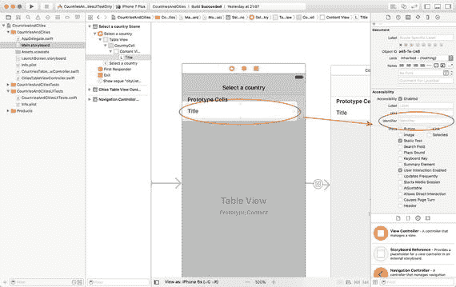

**图 13-13.** 设置辅助功能标识符

设置好辅助功能标识符后，您可以使用`element(matching:, identifier:)`方法来定位特定的用户界面元素，而不论用户界面是如何布局的。

```
let application = XCUIApplication()
let query = application.staticTexts
let welcomeLabel =  query.element(matching: .staticText, identifier: "WelcomeMessage")
```


### 断言

在 UI 测试中定位到感兴趣的用户界面元素后，您要么检查其某个属性并将结果与期望值进行比较，要么与该用户界面元素进行交互以显示一个新视图，然后检查新视图的某个属性。

与单元测试一样，UI 测试也使用断言来比较对象的状态与期望值。表 13-6 列出了 UI 测试中使用的一些断言函数。

**表 13-6.** XCTest 断言宏

| 宏 | 描述 |
| --- | --- |
| `XCTAssert(表达式, 消息)` | 如果表达式计算结果为`假(false)`，则生成一个失败。可以提供一个可选的字符串消息来指示失败原因。 |
| `XCTAssertEqualObjects(表达式 1, 表达式 2, 消息)` | 当`表达式 1`不等于`表达式 2`时生成一个失败，其中`表达式 1`和`表达式 2`都是对象。涉及的两个对象都必须实现`Equatable`协议。可以提供一个可选的字符串消息来指示失败原因。 |
| `XCTAssertNotEqualObjects(表达式 1, 表达式 2, 消息)` | 当`表达式 1`等于`表达式 2`时生成一个失败，其中`表达式 1`和`表达式 2`都是对象。涉及的两个对象都必须实现`Equatable`协议。可以提供一个可选的字符串消息来指示失败原因。 |
| `XCTAssertEqual(表达式 1, 表达式 2, 消息)` | 当`表达式 1`不等于`表达式 2`时生成一个失败。此测试适用于原始数据类型。可以提供一个可选的字符串消息来指示失败原因。 |
| `XCTAssertNotEqual(表达式 1, 表达式 2, 消息)` | 当`表达式 1`等于`表达式 2`时生成一个失败。`表达式 1`和`表达式 2`都是原始数据类型。可以提供一个可选的字符串消息来指示失败原因。 |
| `XCTAssertNil(表达式, 消息)` | 当表达式不为`空(nil)`时生成一个失败。可以提供一个可选的字符串消息来指示失败原因。 |
| `XCTAssertNotNil(表达式, 消息)` | 当表达式为`空(nil)`时生成一个失败。可以提供一个可选的字符串消息来指示失败原因。 |
| `XCTAssertTrue(表达式, 消息)` | 当表达式计算结果为`假(false)`时生成一个失败。与`XCTAssert()`相同，提供此函数是为了创建更具可读性的测试。可以提供一个可选的字符串消息来指示失败原因。 |
| `XCTAssertFalse(表达式, 消息)` | 当表达式计算结果为`真(true)`时生成一个失败。可以提供一个可选的字符串消息来指示失败原因。 |

以下代码片段列出了一个 UI 测试用例，该用例将尝试定位一个辅助功能标识符为`"FacebookLoginButton"`的按钮，并断言该按钮是否未被找到：

```
func testFacebookLoginButtonExists() {
let application = XCUIApplication()
let query = application.buttons
let button = query.element(matching: .button, identifier: "FacebookLoginButton")
XCTAssert(button.exists)
}
```

请注意，这里使用了`XCTAssert`而不是`XCTAssertNotNil`。这是因为`button`是`XCUIElement`的一个实例，而后者只是一个代理对象。代理对象仅包含测试运行器尝试定位用户界面元素所需的信息。

只有当你尝试访问底层元素（通过在`XCUIElement`上调用`exists()`）时，测试运行器才会尝试将`XCUIElement`解析为一个实际的用户界面元素。

以下代码片段基于上一个测试进行了扩展，并断言按钮上显示的文本是否与特定值不匹配。按钮上显示的文本与其辅助功能标识符不同。

```
func testFacebookLoginButtonDisplaysCorrectLabel(){
let application = XCUIApplication()
let query = application.buttons
let button = query.element(matching: .button, identifier: "FacebookLoginButton")
let buttonLabel = button.label
XCTAssertEqual(buttonLabel, "Login With Facebook")
}
```

### UI 录制

如果用户操作路径很长且复杂，并且需要多次交互才能显示出你要测试的对象，那么逐行编写 UI 测试脚本并非你所愿。

好消息是，你不必逐行创建 UI 测试脚本。Xcode 提供了一个名为 UI 录制的功能，可用于帮助创建 UI 测试脚本。使用 UI 录制，你可以启动一个应用程序实例，并像平常一样与之交互。在你与应用程序交互时，Xcode 会记录你的点击、手势、选择和按键操作，并生成相应的 UI 测试脚本。

UI 录制与 UI 测试紧密耦合。要开始 UI 录制，只需将文本光标放在一个 UI 测试用例中，然后点击 Xcode 编辑器底部的红色录制按钮（见图 13-14）。

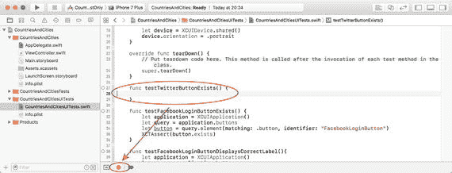

**图 13-14.** UI 录制按钮

要停止录制，只需点击停止按钮，该按钮在录制会话期间会替换录制按钮。UI 录制并非万无一失，你可能会发现可以编写出更高效的脚本来达到相同目的。但是，UI 录制可以作为构建 UI 测试的起点，之后你可以微调并添加适当的测试断言。


### 断言前的等待

有时，在执行断言之前，你需要等待某个操作完成。当涉及动画时尤其如此，你需要等待动画结束，待你感兴趣的 UI 元素出现在屏幕上后才能进行后续操作。例如，在一个基于表格视图的简单应用中，用户点击某一行后会跳转到下一个屏幕。

你可以通过如下简单的语句模拟点击表格中的一行：

```
XCUIApplication().tables.cells.staticTexts["United Kingdom"].tap()
```

然而，在基于该屏幕的 UI 元素创建任何断言之前，你需要等待下一个屏幕出现。幸运的是，`XCTest` 恰好提供了测试预期（test expectations）这一机制。

测试预期是 `XCTestExpectation` 的一个实例，代表一个期望的结果。例如，要设置一个期望，表明存在一个标题为“Hello World!”的文本标签，你可以使用以下代码片段：

```
let label = XCUIApplication().staticTexts["Hello World!"]
let predicate = NSPredicate(format: "exists == 1", argumentArray: nil)
self.expectation(for: predicate, evaluatedWith: label, handler: nil)
```

上述代码片段首先针对标题为“Hello World!”的标签，获取一个 `XCUIElement` 代理对象。

```
let label = XCUIApplication().staticTexts["Hello World!"]
```

回顾一下，`XCUIElement` 是一个代理对象，仅代表在待测试应用中定位 UI 元素所需的信息。因此，即使界面元素不在屏幕上，也可以创建 `XCUIElement` 实例。只有当你在 `XCUIElement` 实例上调用方法时，测试运行器才会检查该代理是否能解析为屏幕上已有的对象。

获取到 `XCUIElement` 实例后，使用 `XCTestCase` 类的 `expectation(for:, evaluatedWith:, handler:)` 方法来设置预期。

```
let predicate = NSPredicate(format: "exists == 1", argumentArray: nil)
self.expectation(for: predicate, evaluatedWith: label, handler: nil)
```

该预期被表示为一个针对对象进行求值的谓词。本例中的对象是标签，谓词被设置为调用 `exists()` 方法并确保结果为 `1`。

最终结果是，该预期代表了一种情况：存在一个标题为“Hello World!”的标签。

设置好预期后，你需要在 `XCTestCase` 实例上调用 `waitForExpectations(timeout:, handler:)` 方法：

```
self.waitForExpectations(timeout: 5, handler: nil)
```

`waitForExpectations(timeout:, handler:)` 方法会等待指定的时间（以秒为单位），如果有一个或多个预期未满足，则测试失败。`XCTestExpectation` 对象具有一个基于计时器的内部机制，通过该机制定期检查是否可以将自身状态转为“已满足”。这是预期对象的内置机制，你无需做任何操作来启动计时器。

### 综合应用

在本节中，你将为一个现有应用编写几个用户界面测试。该应用名为 `CountriesAndCities`，可从本书网站下载。

下载项目，在 Xcode 中打开它，并在模拟器上试用。如你所见，该应用是一个主从类型的应用，包含两个简单的屏幕：第一个屏幕列出三个国家；当你从该列表中选择一个国家后，该国家的城市列表会显示在第二个屏幕中（见图 13-15）。

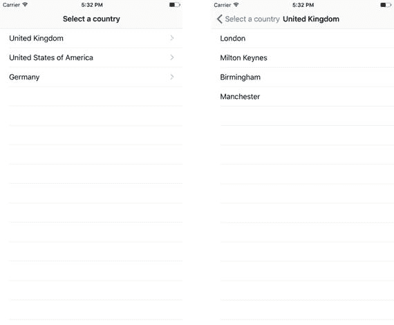

图 13-15. 示例应用的最终用户界面

要开始编写一些 UI 测试，请在 Xcode 中打开项目，然后在项目资源管理器中打开 `CountriesAndCitiesUITests.swift` 文件（见图 13-16）。

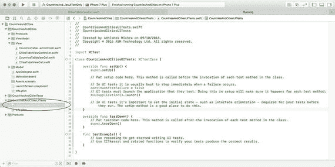

图 13-16. 项目资源管理器中的 `CountriesAndCitiesUITests.swift` 文件

修改 `setUp()` 方法，使其类似于以下代码片段：

```
override func setUp() {
    super.setUp()
    continueAfterFailure = false
    XCUIApplication().launch()
    let device = XCUIDevice.shared()
    device.orientation = .portrait
}
```

此代码片段首先调用父类的 `setUp()` 方法，然后将 `continueAfterFailure` 变量（继承自 `XCTestCase`）设置为 `false`。将此变量设为 `false` 将确保当测试失败时，UI 测试会立即停止。默认行为是跳过失败的测试并继续执行下一个测试。

代码片段的下一行调用 `XCUIApplication` 的 `launch()` 方法，从而启动被测试的应用。最后，代码片段将设备方向设置为竖屏。在 UI 测试的 `setUp()` 方法中指定设备方向是一个好习惯。

你要创建的第一个测试将确保应用启动后，国家列表视图控制器可见。为此，添加一个名为 `testCountryListAppearsOnAppLaunch` 的测试方法，并按如下代码片段实现：

```
func testCountryListAppearsOnAppLaunch() {
    let navBarTitle = XCUIApplication().navigationBars["Select a country"].staticTexts["Select a country"]
    XCTAssert(navBarTitle.exists)
}
```

由于该特定应用在导航栏中显示标题，此测试检查导航栏中显示的标题是否与文本“Select a country”匹配。如果该应用未使用导航控制器，或者未设置特定的导航栏标题，那么你将不得不使用其他方法来确定正确的视图已显示在屏幕上。一种可能的解决方案是检查屏幕上是否存在预期的、视图特有的 UI 元素。

要运行此测试，请点击测试名称旁边的空心菱形符号（见图 13-17）。如果测试名称旁边没有空心菱形符号，请确保已保存文件。

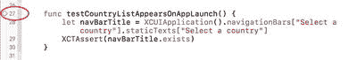

图 13-17. 执行单个 UI 测试

另一个有用的测试是统计应用启动时显示的国家数量。以下代码片段展示了如何编写这样的测试：

```
func testCountryListHasThreeItemsOnAppLaunch() {
    let countryTable = XCUIApplication().tables.element
    let rows = countryTable.staticTexts
    XCTAssertEqual(rows.count, 3)
}
```

此测试利用了应用构建方式的一些内部知识。例如，它假设屏幕上只有一个表格。大多数人会将此测试标记为“过于具体”，坦率地说，确实如此。统计项目数量使其非常具体，并且有些脆弱。


例如，如果表格中增加了一行，或者在屏幕尺寸较小的设备上运行测试，这项测试就很容易失败。后一种情况尤其值得注意，如果你的测试是在 plus 尺寸的 iPhone 上计算全屏表格视图中可见的行数。在屏幕较小的设备上运行同样的测试，意味着可见行数会减少，测试便会失败。

> **注意**  
> 你可以在测试中使用 `UIDevice` 和 `UIScreen` 方法来识别当前运行测试的设备类型，并根据这些信息计算屏幕上预期的可见行数。

这种测试类型是否具有业务价值，取决于屏幕上初始可见项的数量有多关键。你需要结合业务需求以及测试本身的脆弱性来决定。

本示例的最后一个测试将验证：从国家列表中点击某个国家名称后，能否下钻到该国家下的城市列表。以下代码片段展示了如何编写此类测试：

```swift
func testTappingOnCountryDisplaysDetailViewWithExpectedTitle() {
let app = XCUIApplication()
app.tables.staticTexts["United Kingdom"].tap()
let label = app.navigationBars["United Kingdom"].staticTexts["United Kingdom"]
let predicate = NSPredicate(format: "exists == 1", argumentArray: nil)
self.expectation(for: predicate, evaluatedWith: label.exists, handler: nil)
self.waitForExpectations(timeout: 5, handler: nil)
}
```

这个测试涉及不少细节。测试首先模拟点击应用启动时显示的国家列表中的某个国家：

```swift
let app = XCUIApplication()
app.tables.staticTexts["United Kingdom"].tap()
```

点击表格中的某一行后，城市列表会以动画形式（从右侧滑入）呈现在屏幕上。这是使用表视图控制器和导航控制器构建的主从类型应用的典型行为。

从右侧滑入的动画意味着国家列表不会立即消失，测试需要等待几毫秒后才能继续检查已动画显示的视图。

测试中的代码通过使用预期（expectations）来实现等待。它设置了一个预期，期望存在一个导航栏，其标题为在第一屏点击的国家名称。

```swift
let label = app.navigationBars["United Kingdom"].staticTexts["United Kingdom"]
let predicate = NSPredicate(format: "exists == 1", argumentArray: nil)
self.expectation(for: predicate, evaluatedWith: label.exists, handler: nil)
```

当从右侧滑入的动画完成城市列表的显示后，这个预期就会被满足。该预期还利用了应用的一个细微设计：在第一屏选中的国家名称会成为第二屏的标题。

预期设置完成后，测试使用 `waitForExpectation(timeout:, handler:)` 方法等待最多 5 秒，直到动画完成且预期被满足。

```swift
self.waitForExpectations(timeout: 5, handler: nil)
```

要运行所有单元和测试，请选择 **Product** ➤ **Test** 菜单项。

## 总结

在本章中，你学习了如何为新建及现有的 Xcode 项目添加 UI 测试支持。你还学习了如何使用 `XCUITest` 框架编写 UI 测试，以及如何利用 UI Recording 工具来辅助创建 UI 测试。


