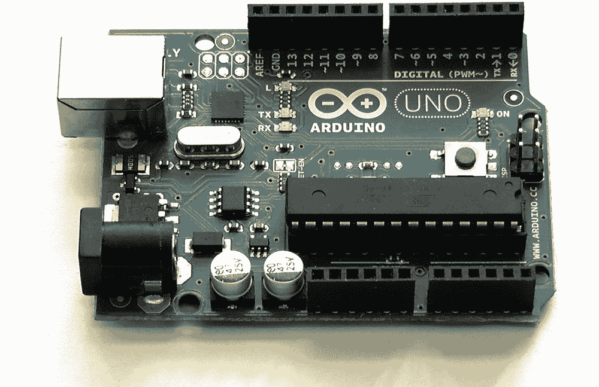
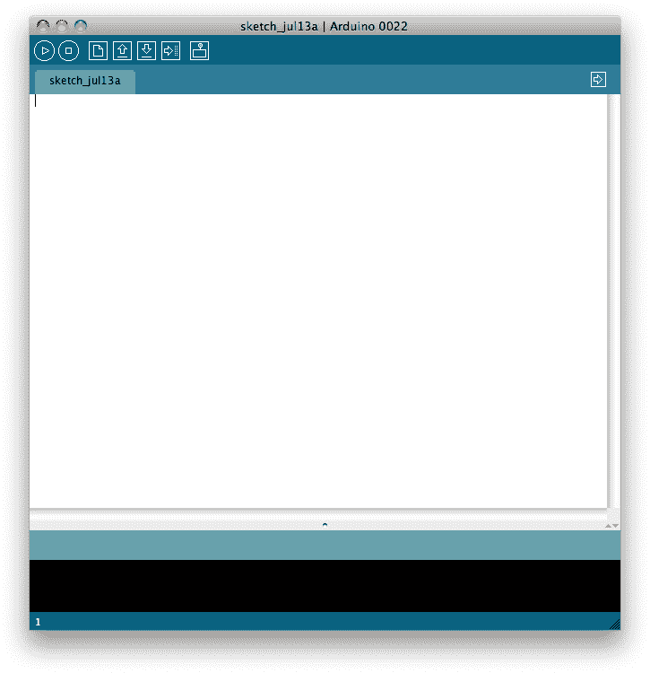
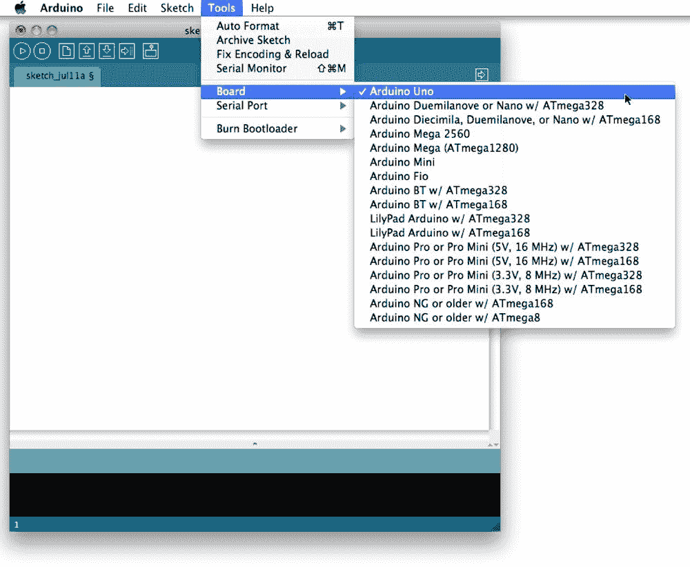
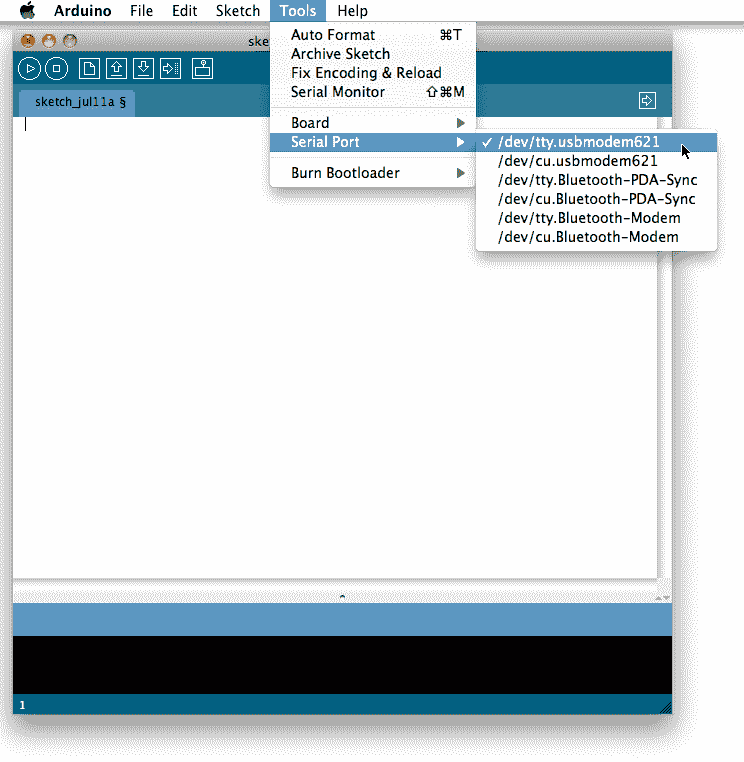
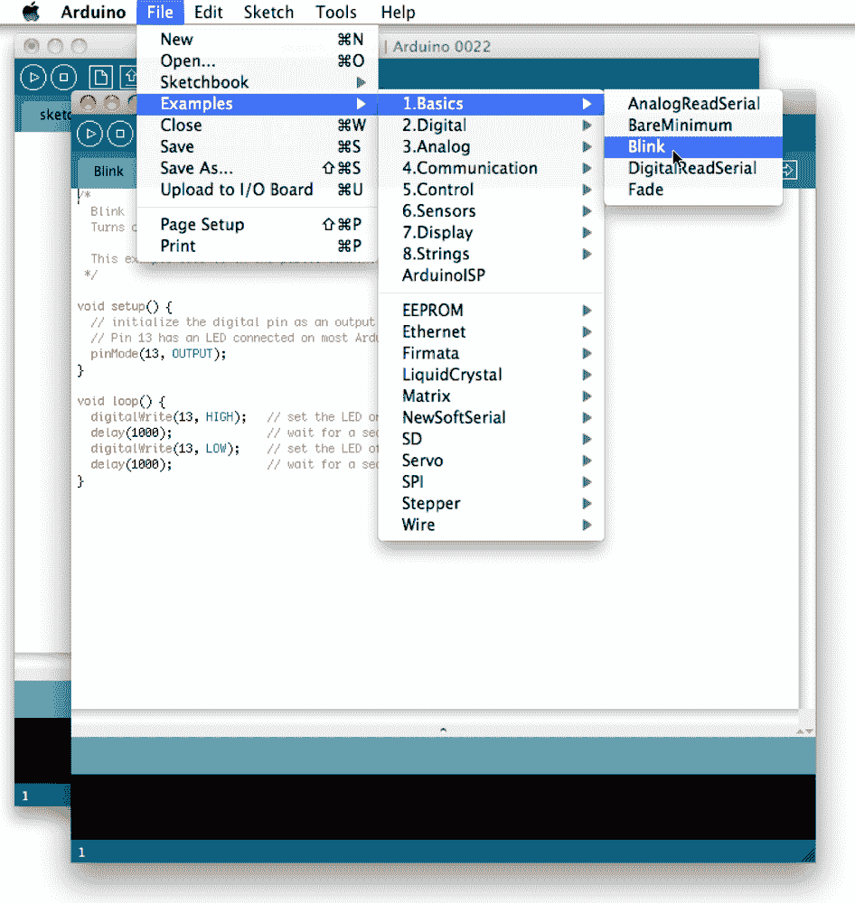
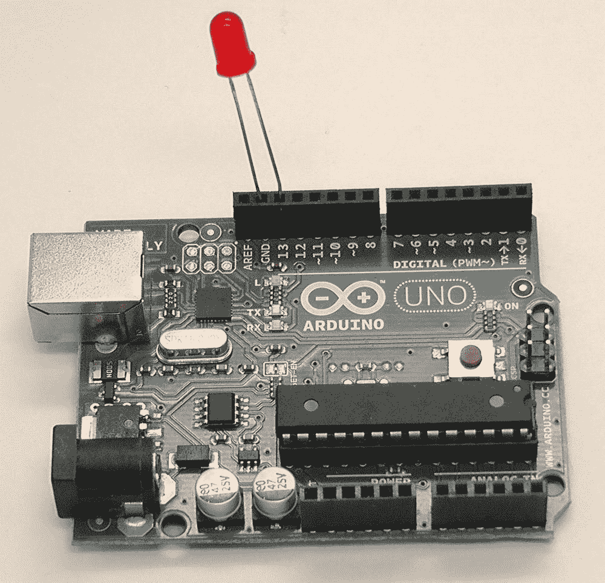
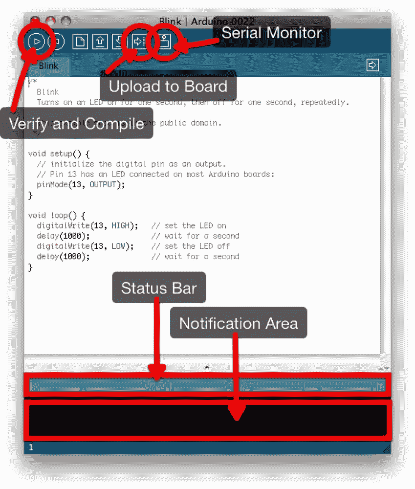
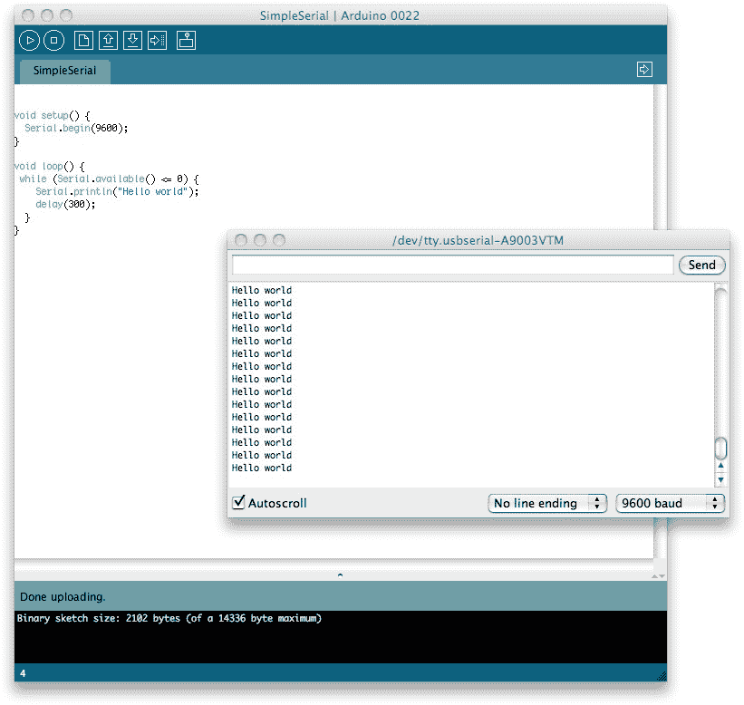

# 第 1 章 Arduino 简介

每隔一段时间，总会有一种技术成为撬动世界的杠杆，哪怕只是微小的改变。Arduino 就是这样的杠杆之一。尽管它最初只是一个让艺术家能够使用嵌入式微处理器进行交互设计项目的工具，但我认为它最终会作为现代世界的基石之一走进博物馆。它让嵌入式系统的原型开发变得快速而廉价，将曾经相当棘手的硬件问题转化为更简单的软件问题。

Arduino，以及与之共同成长并某种程度上围绕其发展的开源硬件运动，正在让一代高科技爱好者能够凭借相当有限的硬件知识构思新想法并制作原型。

## Arduino 平台

尽管市面上有许多其他微控制器平台，但对于物理计算领域的新手来说，最易上手的可能还是 Arduino（见图 1-1）。这部分归功于其庞大的社区支持，同时，Arduino 从一开始就是为新手易于使用而设计的。



图 1-1. 搭载 ATmega328 微控制器的 Arduino Uno 板

当前版本的 Arduino 板被称为 Arduino Uno。该板基于 ATmega328 微控制器。它有 14 个数字输入/输出引脚，其中 6 个可用作脉冲宽度调制 (PWM) 输出，以及 6 个额外的模拟输入引脚。详见表 1-1。

表 1-1. Arduino Uno 板的技术规格

| Arduino Uno |
| --- |
| 微控制器 | ATmega328 |
| 工作电压 | 5 V |
| 输入电压（推荐） | 7–12 V |
| 输入电压（极限） | 6–20 V |
| 数字 I/O 引脚 | 14（其中 6 个提供 PWM） |
| 模拟输入引脚 | 6 |
| 每个 I/O 引脚的直流电流 | 40 mA |
| 3.3 V 引脚的直流电流 | 50 mA |
| 闪存 | 32 KB |
| SRAM | 2 KB |
| EEPROM | 1 KB |
| 时钟速度 | 16 MHz |

Arduino 平台拥有支持板载微控制器所需的一切。它通过 USB 连接直接连接到您的 Mac 进行编程，并且可以通过同一 USB 连接或外部电源供电——如果您在编程后希望将板与 Mac 断开连接的话。

### 注意

为简洁起见，本教程假设您使用的是较新的 Arduino 板，例如 Arduino Uno、Duemilanove 或 Diecimila。但是，如果您使用的是较旧版本的板或众多 Arduino 兼容克隆板，则很可能只需进行少量修改。请参阅 [`arduino.cc/en/Main/Hardware`](http://arduino.cc/en/Main/Hardware) 获取针对其他各种电路板的入门指南链接。

## 为电路板供电

Arduino Uno 可以通过 USB 连接或外部电源供电。与之前的 Arduino 版本不同，电源是自动选择的。如果您使用的是早期型号，则必须使用电路板上的跳线手动在 USB 和外部电源之间切换。该跳线通常位于 USB 接口和电源接口之间。

该电路板可在 6 至 20 伏的外部电源下工作。最简单的选择是使用 9V 电池或电源适配器，因为这些是常见的。

## 输入与输出

Uno 上的 14 个引脚中的每一个都可用作输入或输出。它们在 5 V 电压下工作，最大电流为 40 mA。每个引脚还有一个 20–50 kOhm 的内部上拉电阻，但默认情况下是断开的。

### 注意

某些引脚具有专门功能。其中对我们本书最重要的可能是引脚 0 和 1。这些引脚可用于接收 (RX) 和发送 (TX) TTL 串行数据。这些引脚连接到 ATmega8U2 的相应引脚，进而连接到与 Mac 的 USB-串口连接。

## 与电路板通信

ATmega328 在 5 V 下提供 UART TTL 串行通信，该通信在数字引脚 0 (RX) 和 1 (TX) 上可用。Arduino Uno 板上有一个 ATmega8U2 芯片，可将此串行通信重定向到 USB，使 Arduino 在 Mac 上的软件看来如同一个虚拟串行端口。如果您使用的是较旧的电路板，例如 Duemilanove 或 Diecimila，这些板使用 FTDI USB 转串行驱动芯片来完成相同的任务，但与较新的 Uno 板不同，您需要安装驱动程序以便您的 Mac 能够正确识别该板。

## 安装软件

从 [Arduino.cc 网站](http://www.arduino.cc/) 下载最新版本的开发环境。

### 注意

最新版本的 Arduino 开发环境可在 [`arduino.cc/en/Main/Software`](http://arduino.cc/en/Main/Software) 获取。在撰写本文时，版本为 Arduino 022。

与大多数 Mac 应用程序一样，开发环境以磁盘映像（`*.dmg` 文件）形式提供，下载后通常会自动挂载。如果没有，请双击手动打开。打开后，只需将 `Arduino.app` 应用程序拖拽到您的 `/Applications` 文件夹中。如果您使用的是需要安装 FTDI USB 转串行驱动程序的较旧电路板，还应双击磁盘映像中包含的 `FTDIUSBSerialDriver.mpkg` 文件以安装必要的驱动程序。

安装完开发环境后，将其拖入废纸篓以推出磁盘映像，然后双击 `Arduino.app` 应用程序图标启动 IDE。您应该会看到类似图 1-2 的画面。



图 1-2. 开发环境


## 连接开发板

使用合适的 USB 线将 Arduino 连接到 Mac。对于 Arduino Uno、Duemilanove 或 Diecimila 型号，你需要一根 USB-A（Mac 端）转 USB-B（Arduino 端）的线缆，这与大多数 USB 打印机所需的线缆相同。绿色电源 LED（标有`PWR`字样）应会亮起；如果你使用的是 Arduino Uno，还会弹出一个对话框，提示检测到了一个新的网络接口。只需点击“应用”按钮即可。如果你在“系统偏好设置”中检查这个新接口，虽然它会显示为“未配置”，但实际工作正常。

将开发板连接到 Mac 后，在 Arduino 开发环境中打开“工具”→“开发板”菜单项，并从下拉菜单支持的开发板列表中选择你的开发板（参见图 1-3）。



图 1-3. 选择正确的开发板类型

然后进入“工具”→“串口”菜单，为你的开发板选择正确的串口（参见图 1-4）。在 Mac 上，Uno 的名称以`/dev/tty.usbmodem`开头，而旧版开发板的名称则以`/dev/tty.usbserial`开头。



图 1-4. 选择正确的串口

如果你不确定哪个串口对应你的开发板，可以拔掉再重新插入连接 Mac 和 Arduino 的 USB 线，观察菜单的变化。

## 点亮 LED

现在我们已经将 Arduino 连接到 Mac，接下来让我们一起完成硬件版的“Hello World”程序——点亮 LED。

#### 备注

Arduino 程序通常被称为*草图*。

开发环境中包含许多示例草图。我们所需要的一个可以通过选择“文件”→“示例”→“1.Basics”→“Blink”找到。示例草图会以新窗口打开，参见图 1-5。



图 1-5. Blink 示例

每个 Arduino 草图都由两部分组成：初始化部分和循环部分。每次开发板上电或按下复位按钮时，都会运行`setup()`函数。该函数执行完毕后，开发板会运行循环函数。循环函数执行完毕后，`loop()`函数会一遍又一遍地重复运行。实际上，`loop()`函数的内容位于一个无限`while`循环之内。

在我们继续构建并将此示例部署到 Arduino 之前，先来看一下代码：

```
void setup() {
  pinMode(13, OUTPUT);
}

void loop() {
  digitalWrite(13, HIGH);
  delay(1000);
  digitalWrite(13, LOW);
  delay(1000);
}
```


Arduino 引脚默认为输入模式。但在这里，我们将引脚 13 设置为输出引脚。在此状态下，该引脚可向其他设备提供高达 40 mA 的电流。这足以点亮 LED 或驱动许多传感器，但不足以驱动大多数继电器、电磁阀或电机。请参见 [`arduino.cc/en/Tutorial/DigitalPins`](http://arduino.cc/en/Tutorial/DigitalPins)。


如果引脚已配置为输出模式，其电压将设置为相应值：HIGH 对应 5V，LOW 对应 0V（接地）。

因此，这段代码实际上会使引脚 13 的电压变为 `HIGH` 一秒钟（1000 毫秒），然后变为 `LOW` 再持续一秒，之后循环重新开始，电压再次变为 `HIGH`。

正如我之前提到的，Arduino 开发板上的某些数字引脚是专用的；引脚 13 就是其中之一。在大多数开发板（包括 Uno）上，都焊接了一个 LED 和电阻连接到该引脚。因此，这个草图的效果就是让板载 LED 以 1 秒的周期亮灭。

虽然开发板上已经有一个内置 LED，但如果我们再添加一个“真正的”LED，效果会更令人印象深刻。任何 LED 都可以使用，但 LED 是方向性元件，不能插反。仔细看 LED 的两个引脚，其中一根应该比另一根短。较短的引脚对应接地，较长的引脚为正极。

将短引脚插入 GND 引脚，长引脚插入引脚 13，如图 1-6  所示。



图 1-6. LED 连接到引脚 13；短引脚插入 GND 引脚

## 上传草图

准备将草图传输到 Arduino 的第一步是点击“验证/编译”按钮（参见图 1-7）。这将编译你的代码，检查错误，然后将程序转换为与 Arduino 架构兼容的格式。几秒钟后，你应该会在状态栏看到“编译完成”的消息，并在通知区域看到类似“二进制草图大小：1018 字节（最大 32256 字节）”的信息。

看到该消息后，继续点击“上传”按钮（再次参见图 1-7）。这将启动通过 USB 连接将编译后的代码传输到开发板的过程。

等待几秒钟；你应该会看到开发板上的 RX 和 TX LED 在数据通过串口连接从 Mac 传输到开发板时闪烁。如果上传成功，状态栏将显示“上传完成”的消息。

上传完成后几秒钟，你应该会看到开发板上的引脚 13 LED（PCB 上标有 L）开始（以橙色）闪烁，同时我们插入引脚 13 的 LED 也会闪烁。亮一秒，灭一秒。如果你看到了这种效果，恭喜你，你已经成功地在 Arduino 开发板上编译并运行了硬件版的“Hello World”程序。



图 1-7. 高亮显示各种控件的 Arduino 开发环境


## 建立串行连接

既然我们已经了解了基本的 Arduino 程序结构，接下来让我们学习如何从 Arduino 板发送和接收数据。我们需要掌握这项技能，因为当我们把 Arduino 连接到 iOS 设备时，需要通过它来控制 Arduino 或获取传感器读数。不过现在，我们将在开发环境中使用串行监视器（再次参见图 1-7）。

点击 `File → New` (`⌘N`) 打开一个新窗口，创建新程序：

```
void setup() {
  Serial.begin(9600);
}

void loop() {
  while (Serial.available() <= 0) {
    Serial.println("Hello world");
    delay(300);
  }
}
```

  
设置串行数据传输的比特率（波特率）。

  
这里我们获取串行端口可读取的字节数。如果缓冲区中没有等待的字节，我们就循环等待，直到接收到数据。

  
最后，在循环内部，我们将字符串 `"Hello World"` 发送到串行连接。

实际上，这段代码会每隔 300 毫秒向串行连接发送字符串 `"Hello World"`，直到 Arduino 板接收到一个字节（字符）为止，此时发送会停止。

使用 `File → Save` (`⌘S`) 菜单项保存程序内容，然后点击“验证”按钮编译程序。如果一切顺利，请点击“上传”按钮将程序上传到开发板。你应该能看到 RX 和 TX 指示灯在代码传输过程中亮起。当状态栏显示“Done uploading”消息时，点击开发环境中的“串行控制台”按钮（再次参见图 1-7）打开串行控制台。

这样做会重置 Arduino，此时你应该看到短语 `"Hello World"` 每隔 300 毫秒在控制台上出现一次（参见图 1-8），同时伴随着 Arduino 板上 TX LED 的闪烁。

在文本输入框中输入一个字符或字符串，然后点击“发送”按钮，这些字符将被传输到开发板，此时开发板应停止向串行端口发送字符串 `"Hello world"`。

让我们更具体地说明这一点。将以下高亮显示的行添加到程序中，然后重新上传到 Arduino：

```
void setup() {
  Serial.begin(9600);
}

void loop() {
  while (Serial.available() <= 0) {
    Serial.println("Hello world");
    delay(300);
  }

  Serial.println("Goodbye world");
  while(1) { }
}
```

当你向开发板上传新代码时，串行控制台会自动关闭，因此请重新打开它，你应该会看到与之前类似的情况（图 1-8）。不过，这次如果你向开发板发送一个字符串，你应该会收到字符串 `"Goodbye world"` 作为回复。



图 1-8. Arduino 在串行控制台显示“Hello World”

## 总结

在本章中，我们学习了如何使用微控制器让 LED 闪烁，以及如何从 Mac 向开发板发送消息和接收消息。虽然我们稍后会处理传感器，但仅凭一块裸 Arduino 板、一根 USB 线、一个 LED 以及 Redpark 串行电缆和 RS-232 转 TTL 串行转换器，你实际上就能完成本书中的许多代码示例。

