# 第 2 章 将 iPhone 连接到 Arduino

iOS 3 中引入 External Accessory 框架，最初被视为具有将 iOS 平台开放给大量外部配件和额外传感器的潜力。遗憾的是，人们期待的创新几乎没有发生，尽管市场上终于开始出现一些有趣的产品，但大多数情况下，External Accessory 框架仍被用于支持来自知名制造商的一批相当可预测的音频和视频配件。

## Apple MFi 计划

造成这种缺乏创新的原因通常归咎于 Apple 的“Made for iPod”（MFi）许可计划。MFi 计划与 Apple Developer Program 完全独立。成为注册的 Apple 开发者或 iOS Developer Program 的成员并不会自动让你加入 MFi 计划。然而，要开发连接 iPod、iPhone 或 iPad 的硬件配件，你必须是 MFi 的被许可方。

### 注意

如果你有兴趣开发自己的硬件，可以在 [`developer.apple.com/programs/mfi/`](http://developer.apple.com/programs/mfi/) 找到更多关于 MFi 许可计划的信息。获得许可的开发者可以访问技术文档、硬件组件和技术支持，从而能够构建连接到 iPod、iPhone 或 iPad 的外部硬件。

不幸的是，加入 MFi 计划并不像注册成为 Apple 开发者那样简单，而且这是一个相当漫长的过程。根据个人经验，我可以确认成为 MFi 被许可方的过程不适合胆小的人。而且一旦你成为该计划的成员，让你的硬件走出原型阶段并得到 Apple 的批准以进行分发和销售，也未必是一个简单的过程。

## Redpark 串行电缆

直到最近，MFi 计划的存在对开发者施加的限制意味着，如果你是一名独立开发者，甚至是一家小公司，你可能无法获得将 iOS 设备连接到任意现有硬件所需的文档和组件。

由于许多现有硬件都具有串行（RS-232）接口，Redpark 串行电缆的出现使得连接此类硬件变得相当容易。电缆装在一个简单的白色盒子中；里面是电缆本身（Apple Dock 连接器转公头 9 针 RS-232 串行）和一个回环测试适配器，允许你测试电缆（参见图 2-1）。

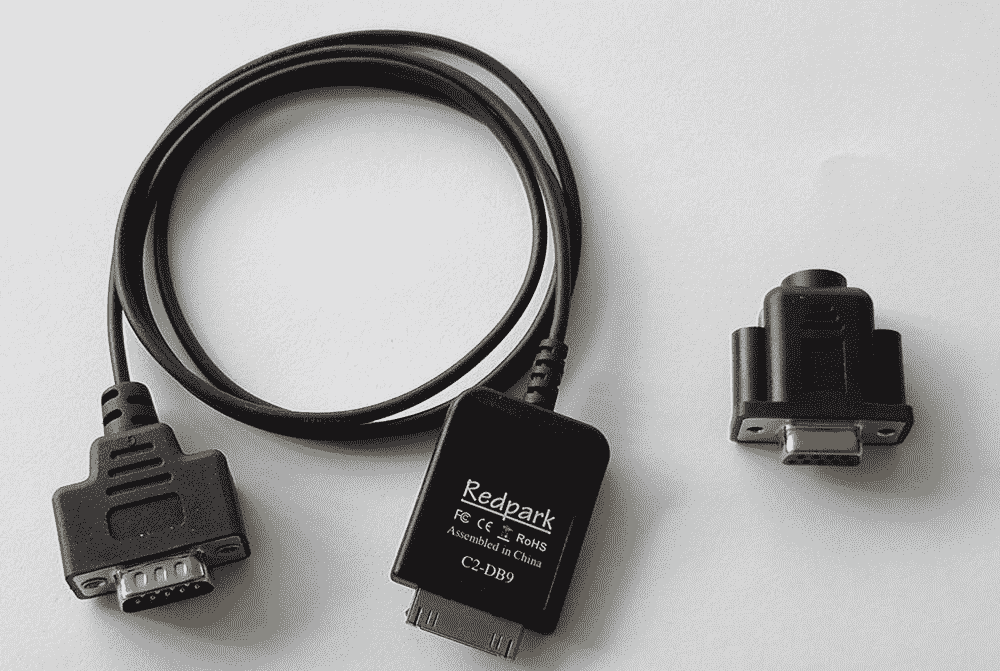

图 2-1. Redpark 串行电缆（左）和回环适配器（右）

Redpark 电缆可在 Maker Shed 以 [“Redpark iPhone Breakout Pack for Arduino”](https://www.makershed.com/ProductDetails.asp?ProductCode=MSRP02) 的名称购买，或[直接从制造商处购买](http://www.redpark.com/c2db9.html)。

### 注意

Redpark 串行电缆 SDK 以 `*.dmg*` 文件形式提供。你可以从 [`www.redpark.com/c2db9_Downloads.html`](http://www.redpark.com/c2db9_Downloads.html) 下载最新版本的 SDK。


好的，作为高级文档工程师和翻译员，我将严格按照您提供的注意事项和示例，将以下英文文本翻译成中文。


## 测试线缆

在我们开始编写使用线缆的代码之前，有两种方法可以测试线缆是否工作正常。首先，当线缆插入后，“设置”应用程序中应该会出现一个新条目；如果你转到 `通用→关于本机→串行线缆`，你应该能看到类似 图 2-2 的内容。如果线缆已插入 iOS 设备，但你没有看到此设置条目，或者条目似乎有问题，那么你的线缆可能存在问题。

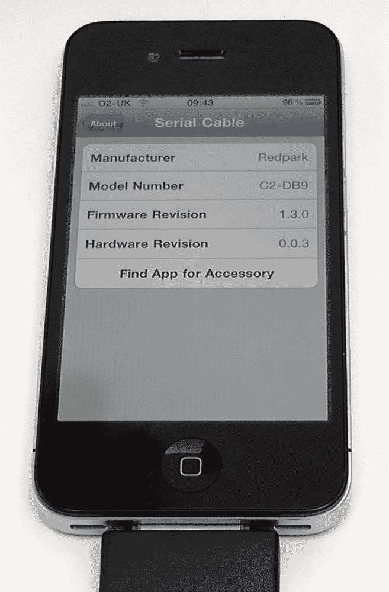

图 2-2. 在“设置”应用程序中检查线缆

此外，Redpark 串行线缆附赠了一个环回适配器（参见 图 2-3）和一个名为 `Rsc Demo` 的演示应用程序。如果你在 Xcode 中打开该演示应用程序，然后构建并将其部署到你的设备上，你应该能够使用此适配器执行环回测试。

将适配器插入线缆的 RS-232 端，然后将线缆插入底座连接器。运行 `Rsc Demo` 应用程序并点击 `Loop Test` 按钮。如果你没有看到像 图 2-3 中那样的 `UIAlertView` 通知你环回测试已成功，那么同样，你的线缆可能存在问题。

不过，假设你的新线缆通过了这两项测试，那么你应该认为一切正常，我们现在可以继续编写代码了。

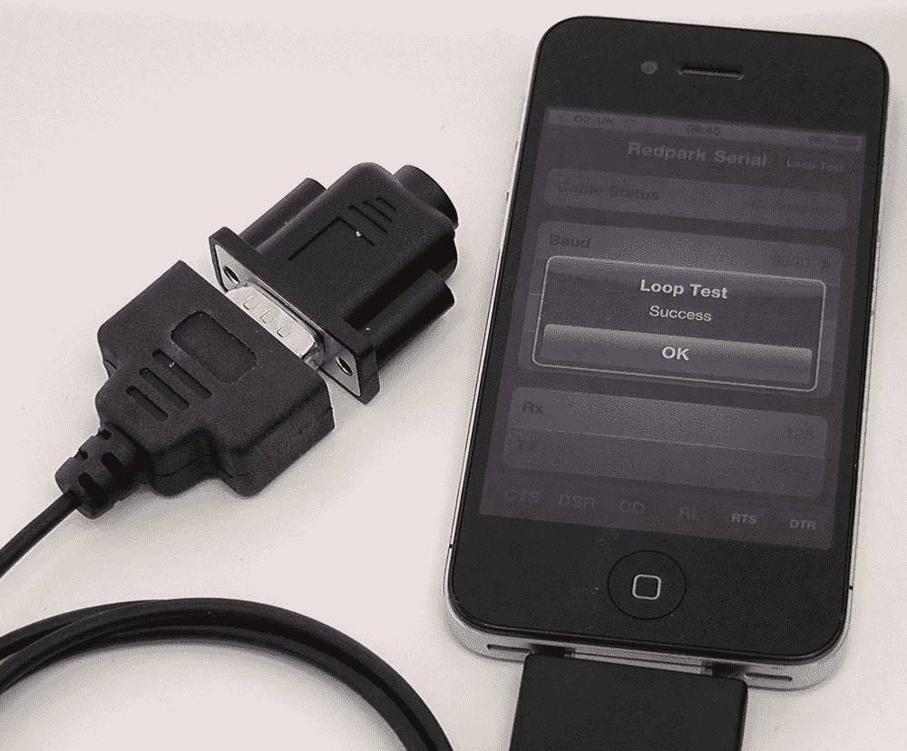

图 2-3. 在 Rsc 演示应用程序中执行环回测试

## 连接到 Arduino

虽然最初的 Arduino 板使用 RS-232 串口连接到开发机器，但较新的型号使用 USB。因此，我们需要一个适配器来将 Redpark 线缆使用的 RS-232 串口转换为我们可以轻松连接到 Arduino 的发送/接收（TX/RX）引脚（分别为引脚 1 和 0）的 TTL 串口。

为了进行此转换，我使用了 SparkFun RS-232 转换器（参见 图 2-4；[`www.sparkfun.com/products/449`](http://www.sparkfun.com/products/449)；售价 13.95 美元），不过任何等效的单元都可以。例如，Maker Shed 销售效果相同但稍便宜（7 美元）的 [P4 适配器套件](http://www.makershed.com/ProductDetails.asp?ProductCode=MKMD2)。

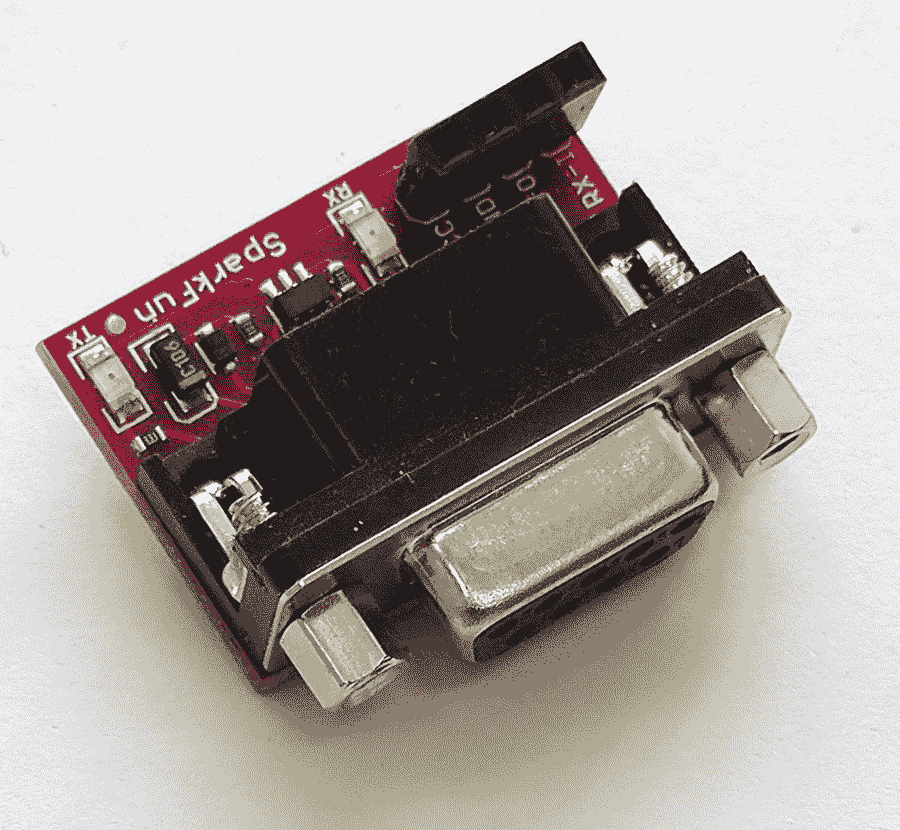

图 2-4. SparkFun RS-232 转换器 SMD（SKU: PRT-00449）

从 图 2-4 可以看出，TTL 端有四根线：`RX`、`TX`、`GND` 和 `VCC`（5V）。将其连接到我们的 Arduino 的最简单方法是将一些可插拔排针焊接到四段单芯导线上（参见 图 2-5），并构建一个自定义的跨接线缆（参见 图 2-6）。当然，你也可以直接使用预制跨接线缆；例如，Maker Shed 销售一套 [面包板跨接线](http://www.makershed.com/ProductDetails.asp?ProductCode=MKSEEED3)，你可以使用它们来代替自己焊接线缆。

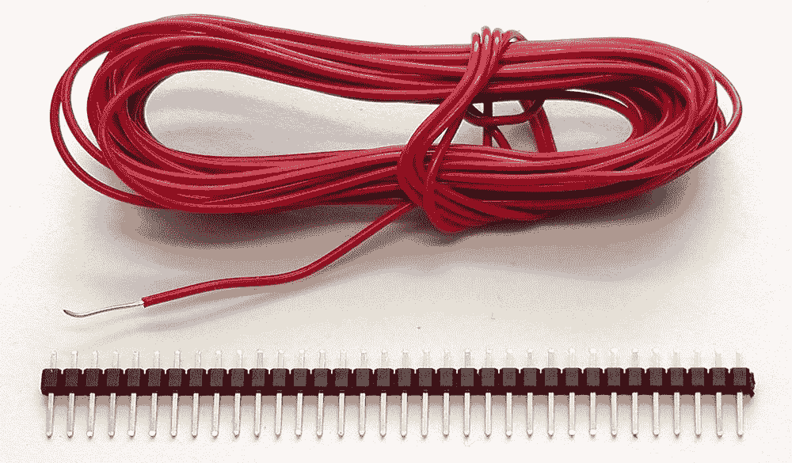

图 2-5. 单芯导线（上方）和可插拔排针（下方）

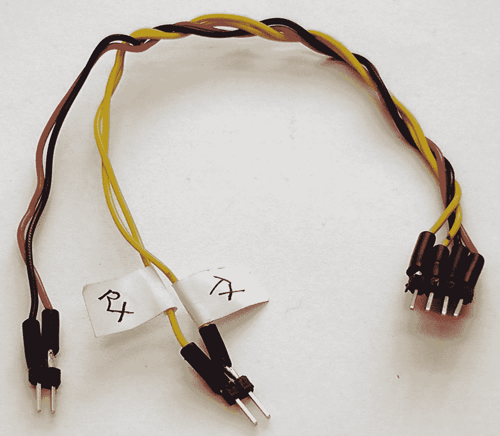

图 2-6. 完成的跨接线缆

购买或制作好跨接线缆后，将 Redpark 串行线缆连接到你的 RS-232 到 TTL 串行适配器，然后（使用你的跨接线缆）将该适配器连接到你的 Arduino 板，如图 图 2-7 所示。

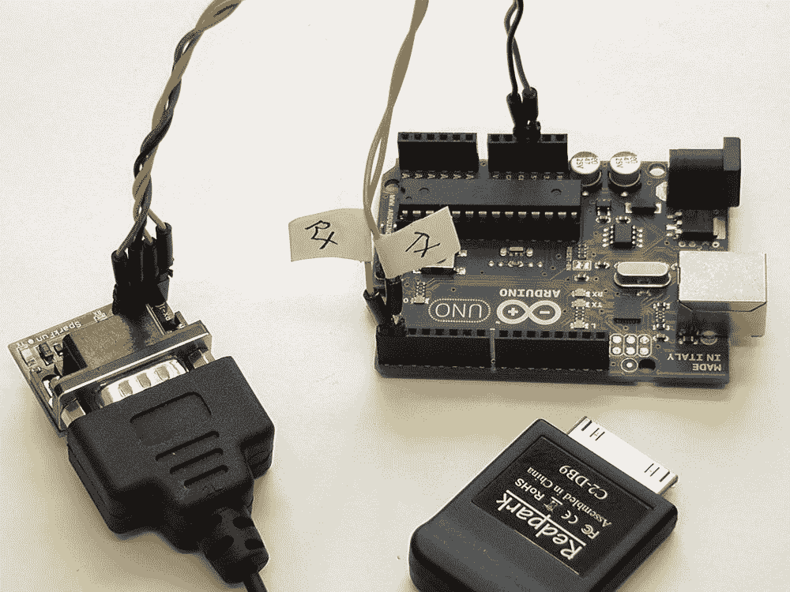

图 2-7. 将线缆连接到 Arduino

为此，请将适配器的 `VCC` 引脚连接到 Arduino 上的 5V 引脚，将 `GND` 引脚连接到 Arduino 上可用的 `GND` 引脚之一，将适配器上的 `RX` 引脚连接到 Arduino 上的 `TX` 引脚，并将适配器上的 `TX` 引脚连接到 Arduino 上的 `RX` 引脚。

#### 警告

Arduino 板上的接收（RX）引脚（引脚 0）必须连接到适配器上的发送（TX）引脚，而 Arduino 板上的发送（TX）引脚（引脚 1）则必须连接到适配器上的接收（RX）引脚。如果这些连接不正确，你的应用程序将无法工作。*切勿*将 `RX` 连接到 `RX`，将 `TX` 连接到 `TX`。

你可以通过 USB 线缆（插入 Mac 或墙壁适配器）或通过电池组为 Arduino 板供电。因为我手头正好有一个电池组，所以我用了它，但这完全取决于你。

## 连接到 iOS 设备

一旦你为 Arduino（以及 RS-232 到 TTL 串行适配器）供电，剩下唯一要做的就是将 Redpark 串行线缆插入你的 iOS 设备（图 2-8）。

不幸的是，我们将花费大量时间将 iPhone 或 iPad 从 Redpark 线缆上插入和拔出，因为我们需要将设备插入 Mac 以将开发代码部署到其上。

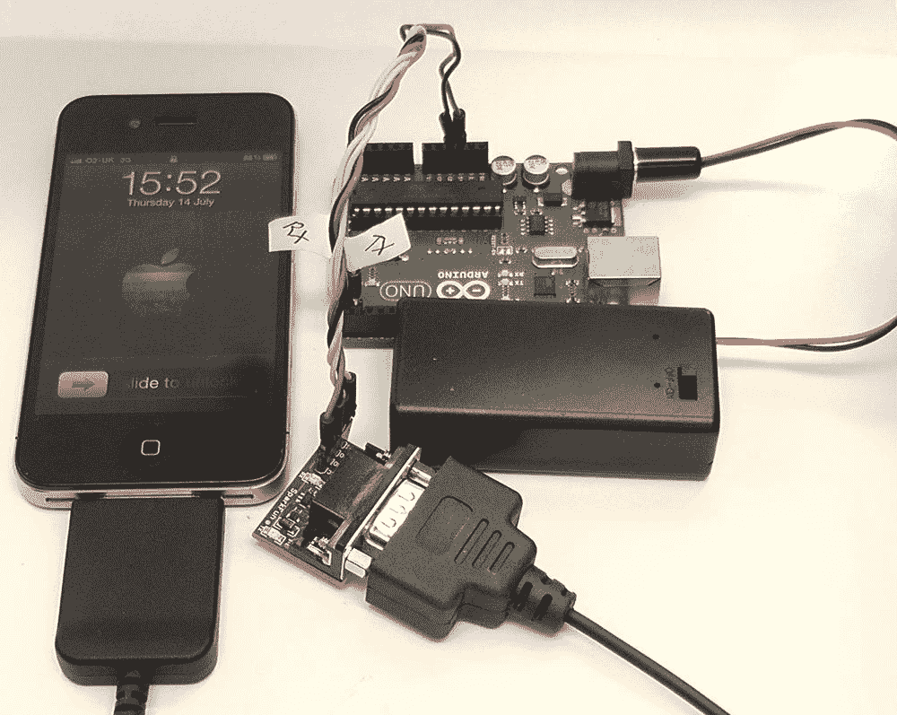

图 2-8. 为 Arduino 供电，并将线缆连接到 iPhone

不过，到目前为止，我们已经准备就绪。让我们继续编写一些代码来演示线缆的使用。


## 一个简单的串行应用

我们的第一个利用串行线缆的应用将是一个简单的串行终端，仿照 Arduino 开发环境中串行控制台的功能。打开 Xcode，选择创建新项目，为 iPhone 选一个基于视图的应用程序，当提示时将其命名为“SerialConsole”并保存到桌面。

我们先从构建界面开始。点击 `SerialConsoleViewController.xib` 文件在界面生成器中打开。打开实用工具面板，然后从对象库中拖放一个 `UINavigationBar`、`UITextField`、`UIButton` 和一个 `UITextView` 到视图中。按照类似图 2-9 的方式排列它们。

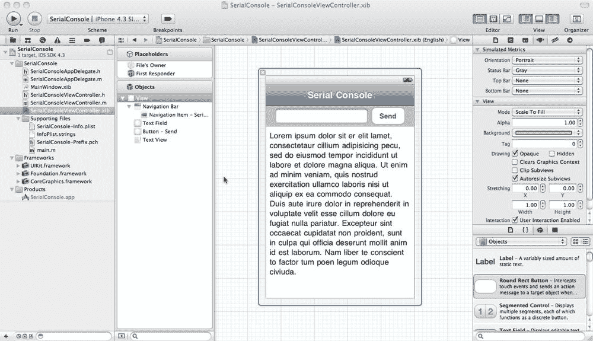

图 2-9. 构建 SerialConsole 应用程序的用户界面

我们将在本章后面利用导航栏的空间来添加一个 `UIBarButtonItem`。但目前，将标题文字改为“Serial Console”，我们稍后再回来处理。

最后，从 `UITextView` 中选中并删除 Lorem ipsum 文本，然后在实用工具面板的“属性”标签中取消勾选“可编辑”复选框，这样用户就不会因为意外弹出键盘而遮挡文本窗口的视图。

关闭实用工具面板并打开助理编辑器，确保它设置为“自动”并显示 `SerialConsoleViewController.h` 文件。

然后按住 Ctrl 键点击并从 `UITextField`、`UIButton` 和 `UITextView` 拖动到编辑器窗口，为每个项目创建一个名为 `textEntry`、`sendButton` 和 `serialView` 的 `IBOutlet` 属性。

接着再次按住 Ctrl 键点击并拖动 `UIButton` 来创建一个名为 `sendString:` 的 `IBAction`（参见图 2-10）。最后，右键点击 `UITextField` 打开文本字段的输出口、事件和动作面板，点击并拖动将“Did End on Exit”事件连接到同一个 `sendString:` 方法。这样做意味着，当你点击发送按钮或在文本输入框中输入字符后按回车时，都会调用同一个 `sendString:` 方法。

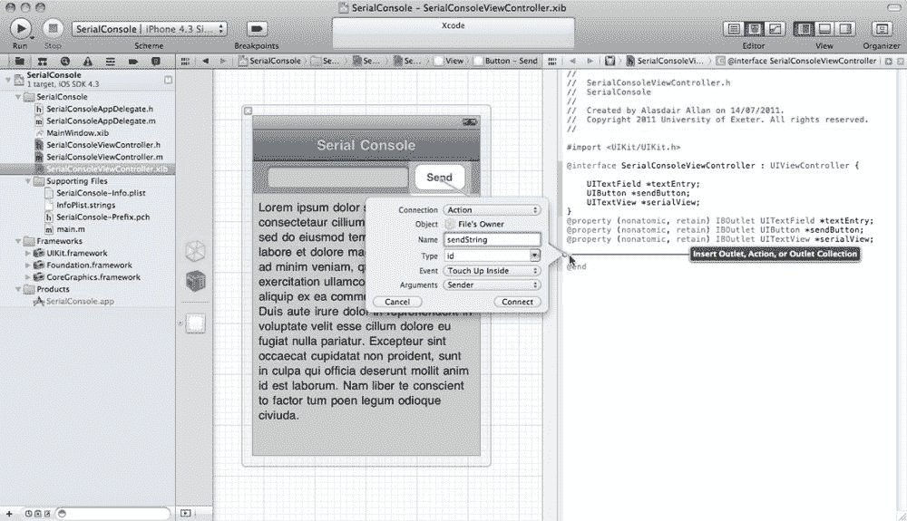

图 2-10. 连接输出口和动作

将你的 UI 元素连接到接口文件后，你的 `SerialConsoleViewController.h` 头文件应大致如下：

```
#import <UIKit/UIKit.h>

@interface SerialConsoleViewController : UIViewController {

    UITextField *textEntry;
    UIButton *sendButton;
    UITextView *serialView;
}

@property (nonatomic, retain) IBOutlet UITextField *textEntry;
@property (nonatomic, retain) IBOutlet UIButton *sendButton;
@property (nonatomic, retain) IBOutlet UITextView *serialView;

- (IBAction)sendString:(id)sender;

@end
```

同时在实现文件中也有相应的变化。现在点击 `SerialConsoleViewController.m` 实现文件，并在 `sendString:` 方法中添加以下一行代码：

```
- (IBAction)sendString:(id)sender {
    [self.textEntry resignFirstResponder];

    // 在此处添加代码
}
```

这将确保当用户按下发送按钮发送一串字符时，键盘被取消。我们将在本章后面再回来处理这个逻辑。

### 添加 Redpark 串行库

现在我们有了用户界面的基本框架；让我们继续深入填充后台功能。打开你的 Redpark 串行 SDK 副本，从 `inc/` 文件夹中获取 `redparkSerial.h` 和 `rscMgr.h` 头文件，以及从 `lib/` 文件夹中获取 `libRscMgrUniv.a` 静态库（参见图 2-11）。`libRscMgrUniv.a` 库是一个通用（胖）库，支持在模拟器中使用的 x86 架构以及在实际设备硬件上使用的 armv6 和 armv7 架构。

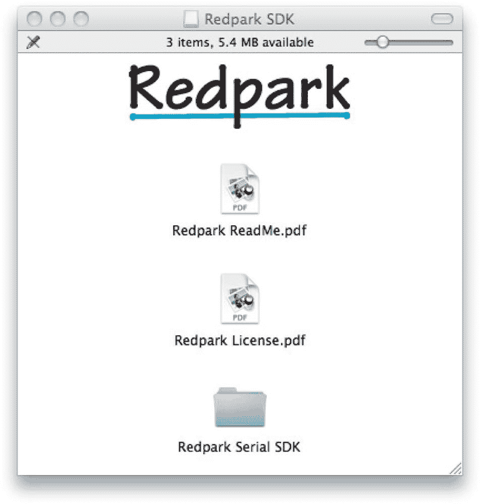

图 2-11. Redpark 串行 SDK

将它们拖放到你的 SerialConsole 项目中，记住在提示时勾选“将项目复制到目标组文件夹（如果需要）”复选框。

由于 SDK 使用了 External Accessory 框架，我们还需要在此阶段将其添加到项目中。点击 Xcode 中项目窗格顶部的项目图标，然后点击 SerialConsole 目标，接着点击“构建阶段”标签。最后，点击“与库链接二进制文件”项打开链接框架列表，点击 `+` 符号添加一个新框架。从下拉列表中选择 External Accessory 框架，并点击“添加”按钮（如图 2-12 所示）。

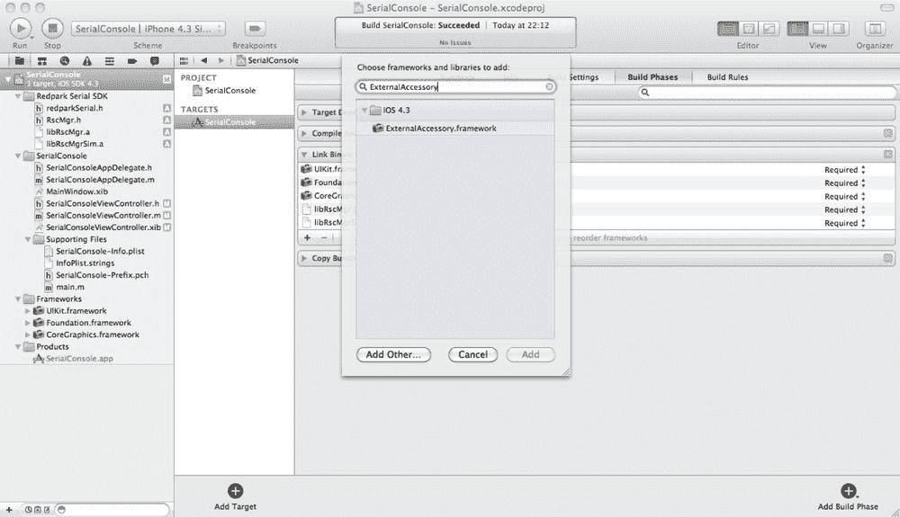

图 2-12. 将 External Accessory 框架添加到项目

最后，我们需要在应用的 `Info.plist` 文件中声明对线缆的支持。如果不这样做，每次将线缆插入设备时，我们都会看到类似图 2-13 的界面。

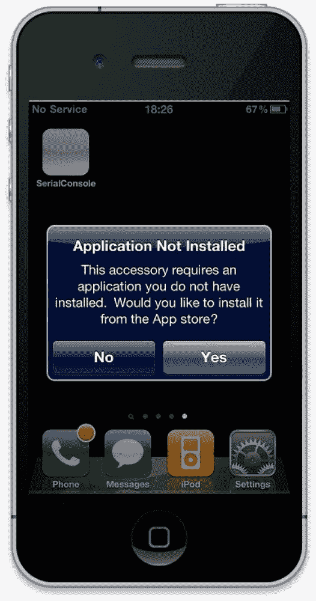

图 2-13. 不支持的 External Accessory 窗口

点击 `SerialConsole-Info.plist` 文件在编辑器中打开。右键点击列表的最底部行，从菜单中选择“添加行”。表格中会添加一个额外行，并出现一个下拉菜单。在框中输入 `UISupportedExternalAccessoryProtocols`。它会变为人类可读的文字“Supported external accessory protocols”。在 Item 0 中输入字符串 `com.redpark.hobdb9`，如图 2-14 所示。

现在我们已经将必要的文件添加到项目中，并配置应用以支持线缆，点击 `SerialConsoleViewController.h` 头文件，并将下面高亮显示的代码添加到文件中：

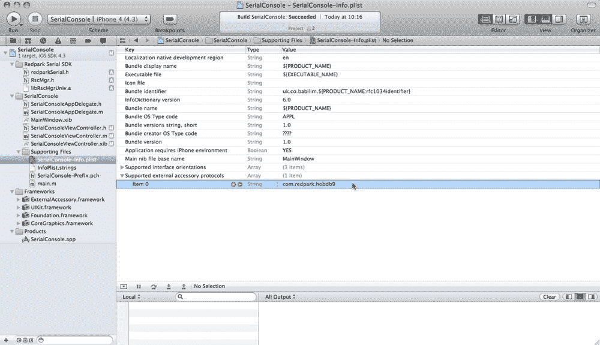

图 2-14. 在 `Info.plist` 文件中声明对线缆的支持

```
#import <UIKit/UIKit.h>
#import "RscMgr.h"

#define BUFFER_LEN 1024

@interface SerialConsoleViewController : UIViewController <RscMgrDelegate> {

RscMgr *rscMgr;
    UInt8 rxBuffer[BUFFER_LEN];
    UInt8 txBuffer[BUFFER_LEN];

UITextField *textEntry;
    UIButton *sendButton;
    UITextView *serialView;
}

@property (nonatomic, retain) IBOutlet UITextField *textEntry;
@property (nonatomic, retain) IBOutlet UIButton *sendButton;
@property (nonatomic, retain) IBOutlet UITextView *serialView;

- (IBAction)sendString:(id)sender;

@end
```

然后，在相应的 `SerialConsoleViewController.m` 实现文件中，取消注释 `viewDidLoad` 方法，并添加以下高亮显示的行：

```
- (void)viewDidLoad {
    [super viewDidLoad];
    rscMgr = [[RscMgr alloc] init];
    [rscMgr setDelegate:self];
}
```


好的，作为一名高级文档工程师和翻译员，我将遵循您的注意事项和示例，将给定的英文文本翻译成中文。


这段代码将初始化 `Redpark Serial Cable Manager` 并将其委托设置为当前类。完成此操作后，我们需要添加必须实现的委托回调：

```
#pragma mark - RscMgrDelegate methods

- (void) cableConnected:(NSString *)protocol {
    [rscMgr setBaud:9600];
    [rscMgr open];
}

- (void) cableDisconnected {

}

- (void) portStatusChanged {

}

- (void) readBytesAvailable:(UInt32)numBytes {
    int bytesRead = [rscMgr read:rxBuffer Length:numBytes];
    NSLog( @"Read %d bytes from serial cable.", bytesRead );
    for(int i = 0;i < numBytes;++i) {
        self.serialView.text =
            [NSString stringWithFormat:@"%@%c",
                          self.serialView.text,
                         ((char *)rxBuffer)[i]];
    }
}

- (BOOL) rscMessageReceived:(UInt8 *)msg TotalLength:(int)len {
    return FALSE;
}

- (void) didReceivePortConfig {

}
```


这里我们将 `rxBuffer` 实例变量作为引用传递给 `rscMgr` 的 `read:Length:` 方法，该方法会直接修改原始数据。这并非 Objective-C 方法的常规行为，因此需要小心处理。


这里我们将新填充的 `rxBuffer` 数组中的字符追加到 `UITextView` 中已有的文本之后。

尽管我们必须实现所有必须的方法，但在这个精简的实现中，我们实际上只关心 `cableConnected:` 和 `readBytesAvailable:` 这两个回调。

### 连接 Arduino

现在是一个停下来测试代码的好时机；点击 Xcode 工具栏中的“运行”按钮，将代码构建并部署到你的 iPhone 上。一旦应用程序被安装到 iPhone 上，点击“停止”按钮停止运行，然后将你的 iPhone 从 Mac 上拔下。

要测试代码，我们可以使用上一章用过的简单串口草图：

```
void setup() {
  Serial.begin(9600);
}

void loop() {
  while (Serial.available() <= 0) {
    Serial.println("Hello world");
    delay(300);
  }

  Serial.println("Goodbye world");
  while(1) { }
}
```

如果你尚未将草图加载到 Arduino 上，请打开 Arduino 开发环境并加载它。然后将 Arduino 连接到 Redpark 数据线，再将 Redpark 数据线连接到你的 iPhone。最后点击 SerialConsole 应用程序以恢复运行。

如果你已经正确连接好所有部件，你应该会看到类似图 2-15 的画面。就像你的 Mac 上的串口控制台一样，Arduino 会打印出“Hello World”。

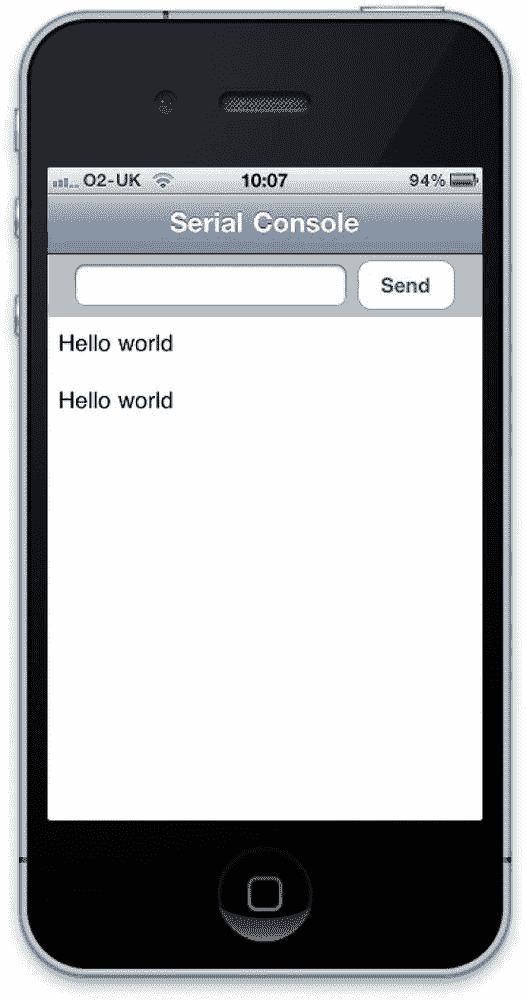

图 2-15. 连接到 Arduino 的 SerialConsole 应用程序

### 向 Arduino 发送数据

虽然你的 iPhone 现在可以接收来自 Arduino 的数据，但我们还不能发送数据。别担心；实际上这比接收数据要容易得多。点击 `SerialConsoleViewController.m` 实现文件，向下滚动直到找到 `sendString:` 方法。添加以下几行：

```
- (IBAction)sendString:(id)sender {
    [self.textEntry resignFirstResponder];

    NSString *text = self.textEntry.text;
    int bytesToWrite = text.length;
    for ( int i = 0; i < bytesToWrite; i++ ) {
        txBuffer[i] = (int)[text characterAtIndex:i];
    }
    int bytesWritten = [rscMgr write:txBuffer Length:bytesToWrite];
}
```

这里我们获取 `UITextField` 控件中的文本，并将字符串逐字节地打包到 `txBuffer` 中。然后我们使用 `rscMgr` 将缓冲区中的数据写入串口。

继续，将你的 iPhone 从 Redpark 数据线上拔下，然后重新插回你的 Mac。当 Xcode 再次检测到该设备后，点击 Xcode 中的“运行”按钮，再次构建并将应用部署到你的 iPhone 上。应用启动后，点击“停止”按钮，断开 iPhone 与 Mac 的连接，然后重新连接 Redpark 数据线。点击 `SerialConsole` 应用程序以恢复执行。

当你看到“Hello World”信息在文本视图中滚动时，点击文本输入控件并输入几个字符。然后点击“发送”按钮。你应该会看到类似图 2-16 的画面，以及“Goodbye World”信息。

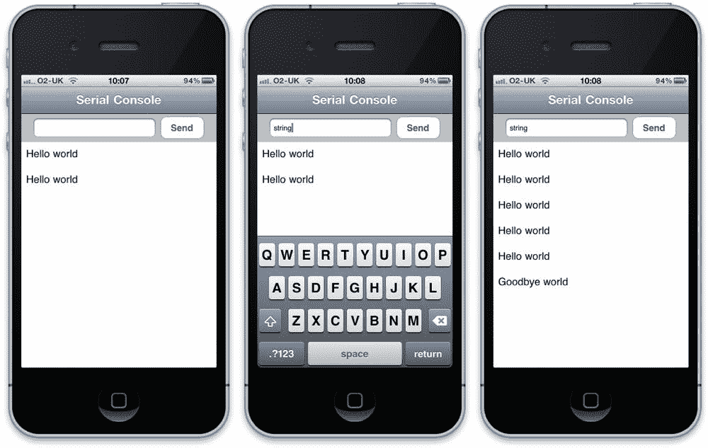

图 2-16. 连接到 Arduino 的应用（左）、输入字符（中）、Arduino 已收到字符（右）

如果你想添加一个闪烁的 LED，可以像我们在上一章中那样，将一个 LED 插入引脚 13，并在我们的草图中添加以下熟悉的代码：

```
void setup() {
  Serial.begin(9600);
  pinMode(13, OUTPUT);
}

void loop() {
  while (Serial.available() <= 0) {
    Serial.println("Hello world");
    delay(300);
  }

  Serial.println("Goodbye world");
  while(1) {
    digitalWrite(13, HIGH);
    delay(1000);
    digitalWrite(13, LOW);
    delay(1000);
  }
}
```

如果你将这个修改后的草图上传到你的 Arduino 板，除了在通过串口接收到字节时打印“Goodbye world”外，Arduino 还会开始每秒一次地闪烁连接在引脚 13 上的 LED。请参见图 2-17。

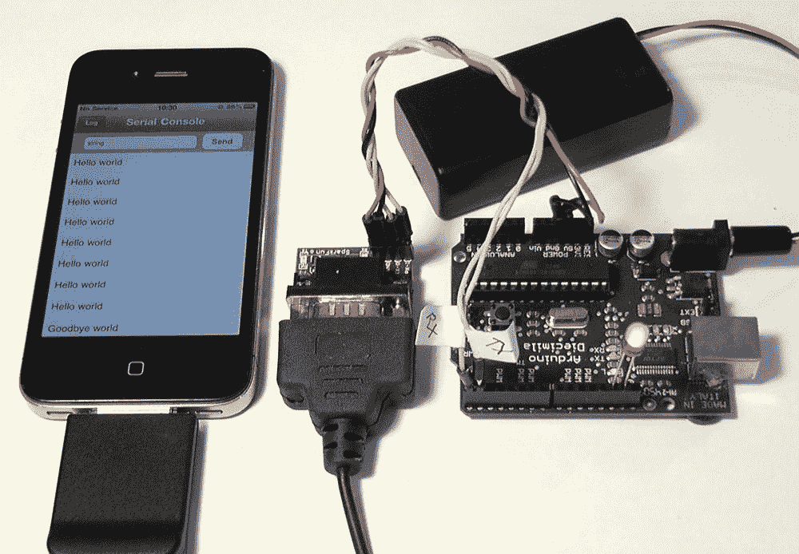

图 2-17. SerialConsole 应用程序、数据线缆和 Arduino


## 日志消息

使用 Redpark 数据线调试应用的难度很快就会让你感到恼火。连接数据线后，你将无法在调试控制台中看到输出内容：例如，你通常使用 `NSLog` 方法打印到控制台的日志消息。

幸运的是，有办法解决这个问题。我们可以将原本显示在调试区域的 `stderr` 输出重定向到一个文件，然后在应用内部查看该文件。

在 Xcode 中打开 `SerialConsole` 项目，点击位于项目面板 Supporting Files 组中的 `main.m` 文件，并添加以下高亮显示的行：

```
#import <UIKit/UIKit.h>

int main(int argc, char *argv[]){
    NSAutoreleasePool *pool = [[NSAutoreleasePool alloc] init];

NSArray *paths =
       NSSearchPathForDirectoriesInDomains(NSDocumentDirectory, NSUserDomainMask, YES);
    NSString *log = [[paths objectAtIndex:0] stringByAppendingPathComponent: @"ns.log"];

NSFileManager *fileMgr = [NSFileManager defaultManager];
    [fileMgr removeItemAtPath:log error:nil];

freopen([log fileSystemRepresentation], "a", stderr);

int retVal = UIApplicationMain(argc, argv, nil, nil);
    [pool release];
    return retVal;
}
```

这将把 `stderr` 输出重定向到应用 Documents 目录下名为 `ns.log` 的文件中。每次应用启动时，该文件都会被删除并重新创建。

完成上述操作后，我们需要创建一个视图控制器来查看日志。右键点击项目面板，选择 **新建文件...**，从下拉列表中选择一个 `UIViewController` 子类（即 `UIViewController` 的子类），并确保勾选“附带 XIB 用户界面”复选框。按提示将新类命名为 `LogController`。

点击 `LogController.xib` 文件在 Interface Builder 中打开，然后从对象库中拖拽一个 `UINavigationBar` 和一个 `UIBarButtonItem` 到视图中。将按钮项放置在导航栏左侧，并将其文本改为“完成”。接着在属性检查器中，将按钮样式从 Plain 改为 Done。还应将导航栏标题改为“NSLog”。

现在，从对象库中拖拽一个 `UITextView` 到视图中，填充剩余空间。删除示例文本，并在属性检查器中取消勾选“可编辑”复选框。

接下来，关闭实用工具面板，打开助理编辑器。确保其设置为自动模式，然后按住 Ctrl 键并从 `UITextView` 拖拽到显示的 `LogController.h` 接口文件，创建一个名为 `logWindow` 的属性和 `IBOutlet`。同样地，按住 Ctrl 键并从“完成”按钮拖拽到接口文件，创建一个名为 `done:` 的 `IBAction`；参见图 2-18。

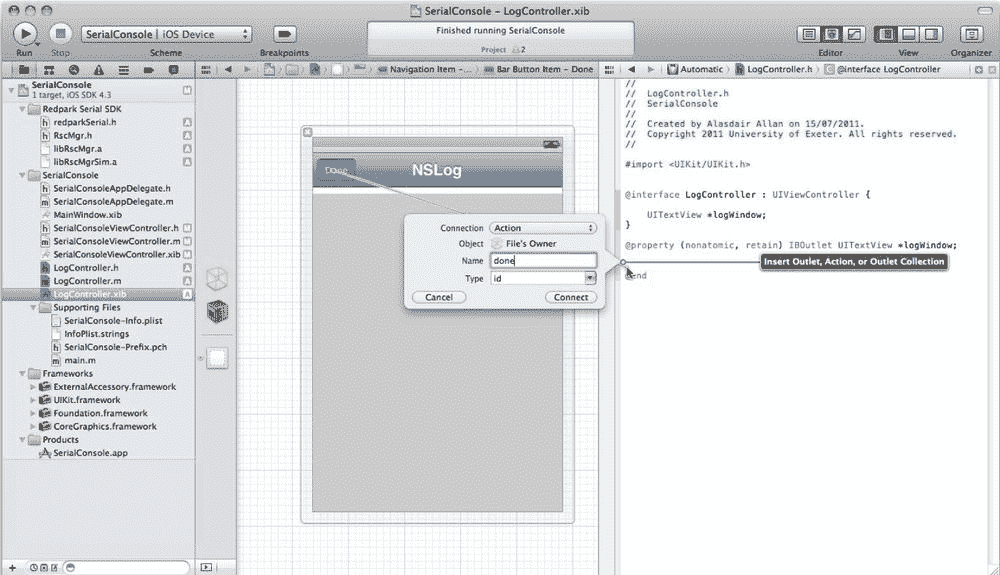

**图 2-18.** 将输出口和操作连接到用户界面

保存更改，返回标准编辑器，点击 `LogController.h` 接口文件在 Xcode 编辑器中打开。添加以下高亮显示的行：

```
#import <UIKit/UIKit.h>

@interface LogController : UIViewController {

UITextView *logWindow;
    BOOL firstOpen;

}

@property (nonatomic, retain) IBOutlet UITextView *logWindow;

- (IBAction)done:(id)sender;
- (void)setWindowScrollToVisible;

@end
```

然后点击对应的 `LogController.m` 实现文件。首先需要按如下方式修改 `initWithNibName:` 方法：

```
- (id)initWithNibName:(NSString *)nibNameOrNil bundle:(NSBundle *)nibBundleOrNil {
    self = [super initWithNibName:nibNameOrNil bundle:nibBundleOrNil];
    if (self) {
        NSArray *paths = NSSearchPathForDirectoriesInDomains(
           NSDocumentDirectory, NSUserDomainMask, YES);
        NSString *log =
          [[paths objectAtIndex:0] stringByAppendingPathComponent: @"ns.log"];
        NSFileHandle *fh = [NSFileHandle fileHandleForReadingAtPath:log];

[fh seekToEndOfFile];

[[NSNotificationCenter defaultCenter] addObserver:self
                                 selector:@selector(getData:)
                                 name:@"NSFileHandleReadCompletionNotification"
                                 object:fh];
        [fh readInBackgroundAndNotify];
        firstOpen = YES;
    }
    return self;
}
```

接着，需要添加 `viewDidAppear:` 方法：

```
- (void)viewDidAppear:(BOOL)animated {
    [super viewDidAppear:animated];
    NSArray *paths = NSSearchPathForDirectoriesInDomains(NSDocumentDirectory, NSUserDomainMask, YES);
    NSString *log = [[paths objectAtIndex:0] stringByAppendingPathComponent: @"ns.log"];

if ( firstOpen ) {
        NSString* content = [NSString stringWithContentsOfFile:log encoding:NSUTF8StringEncoding error:NULL];
        logWindow.editable = TRUE;
        logWindow.text = [logWindow.text stringByAppendingString: content];
        logWindow.editable = FALSE;
        firstOpen = NO;
    }
}
```

然后需要添加 `getData:` 方法，当类收到日志文件发生变化的通知时会调用该方法，同时添加一些辅助方法：

```
#pragma mark - NSLog 重定向方法

- (void) getData: (NSNotification *)aNotification {
    NSData *data = [[aNotification userInfo] objectForKey:NSFileHandleNotificationDataItem];
    if ([data length]) {
        NSString *aString = [[[NSString alloc] initWithData:data encoding:NSUTF8StringEncoding] autorelease];

logWindow.editable = TRUE;
        logWindow.text = [logWindow.text stringByAppendingString: aString];
        logWindow.editable = FALSE;

[self setWindowScrollToVisible];
        [[aNotification object] readInBackgroundAndNotify];
    } else {
        [self performSelector:@selector(refreshLog:) withObject:aNotification afterDelay:1.0];
    }
}
- (void) refreshLog: (NSNotification *)aNotification {
    [[aNotification object] readInBackgroundAndNotify];
}

-(void)setWindowScrollToVisible {
    NSRange txtOutputRange;
    txtOutputRange.location = [[logWindow text] length];
    txtOutputRange.length = 0;
    logWindow.editable = TRUE;
    [logWindow scrollRangeToVisible:txtOutputRange];
    [logWindow setSelectedRange:txtOutputRange];
    logWindow.editable = FALSE;
}
```

最后，应修改 `done:` 方法，使其关闭视图控制器：

```
-(IBAction)done:(id)sender{
    [self dismissModalViewControllerAnimated:YES];
}
```

快完成了。保存更改，点击 `SerialConsoleViewController.xib` 文件在 Interface Builder 中打开。从对象库中拖拽一个 `UIBarButtonItem` 到导航栏中标题的左侧，并将其名称改为“日志”。

关闭实用工具面板，切换到助理编辑器，确保其处于自动模式。按住 Ctrl 键并从“日志”按钮拖拽到 `SerialConsoleViewController.h` 接口文件，创建一个名为 `openLog:` 的操作，如图 2-19 所示。

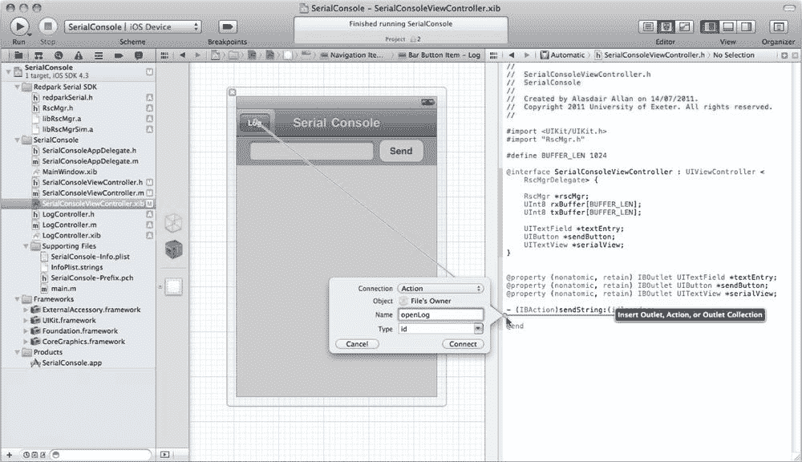

**图 2-19.** 将日志按钮连接到 `openLog:` 操作

保存更改，切换到标准编辑器，点击 `SerialConsoleViewController.h` 接口文件，并添加以下实例变量：

```
#import <UIKit/UIKit.h>
#import "LogController.h"
#import "RscMgr.h"

#define BUFFER_LEN 1024

@interface SerialConsoleViewController : UIViewController <RscMgrDelegate> {
```


```objc
RscMgr *rscMgr;
UInt8 rxBuffer[BUFFER_LEN];
UInt8 txBuffer[BUFFER_LEN];

UITextField *textEntry;
UIButton *sendButton;
UITextView *serialView;
UIBarButtonItem *openLog;

LogController *logWindow;
}

@property (nonatomic, retain) IBOutlet UITextField *textEntry;
@property (nonatomic, retain) IBOutlet UIButton *sendButton;
@property (nonatomic, retain) IBOutlet UITextView *serialView;
@property (nonatomic, retain) LogController *logWindow;

- (IBAction)sendString:(id)sender;
- (IBAction)openLog:(id)sender;

@end
```

然后，单击 `SerialConsoleViewController.m` 实现文件，在 Xcode 编辑器中打开它，并记得合成我们的新属性：

```objc
@synthesize logWindow;
```

修改 `viewDidLoad:` 方法如下：

```objc
- (void)viewDidLoad {
    [super viewDidLoad];
    rscMgr = [[RscMgr alloc] init];
    [rscMgr setDelegate:self];

    self.logWindow = [[LogController alloc] initWithNibName:@"LogController" bundle:nil];
}
```

以及 `openLog:` 方法，以便在点击日志按钮时显示日志视图控制器：

```objc
- (IBAction)openLog:(id)sender {
    [self presentModalViewController:self.logWindow animated:YES];
}
```

保存所有更改，然后点击 Xcode 工具栏中的运行按钮，构建代码并将其部署到你的设备上。在操作之前，请确保你的 iPhone 已通过 USB 连接到 Mac，而不是 Redpark 数据线。

应用程序加载到你的 iPhone 后，点击 Xcode 工具栏中的停止按钮，并断开手机连接。重新启动应用程序，然后点击导航栏中的日志按钮。如果一切正常，你将看到类似于以下内容的输出：

```
2011-07-15 15:56:06.542 SerialConsole[4686:707] ACC Connect
```

这是 Redpark SDK 在告诉你它已经完成了初始化。此时，你可能想浏览代码，用一些 `NSLog` 语句来植入你的委托方法，然后重新部署代码到设备上。如果你这样做，可能会看到类似 图 2-20 的内容。

## 总结

在本章中，我们为 iOS 构建了一个简单的串行控制台，并在 iPhone 和 Arduino 板之间来回传递消息。我们还构建了一个日志窗口视图控制器，它可以在其他项目中重复使用，这在调试时非常有用。

在下一章中，我们将构建一个更具雄心的项目，这次是针对 iPad 的。

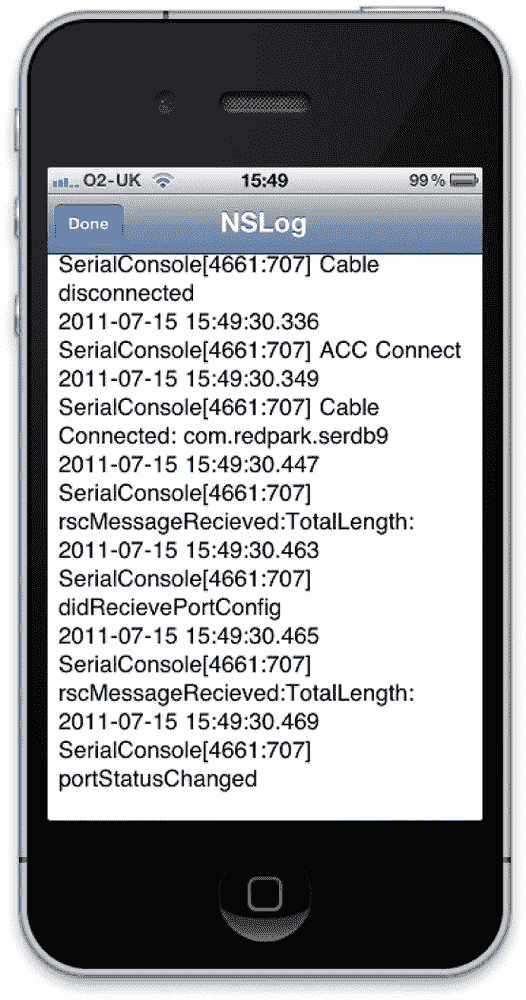

图 2-20. 日志查看器运行中

