# 第 3 章 从 iPad 控制 Arduino

在上一章中，我们使用 Redpark 串行数据线和 SDK 在 Arduino 和 iPhone 之间来回传递消息。现在，让我们让 Arduino 做些除了发送消息之外的事情，直接从我们的 iPad 上打开或关闭一些 LED 灯。

## 在你的 iPad 上运行 Arduino

我们将为 iPad 构建一个简单的应用程序，让你可以将 Arduino 上的任意引脚拉高（HIGH）或拉低（LOW）。虽然我们将为 iPad 构建此应用程序，因为我想充分利用其大屏幕空间，但如果你希望将其构建为 iPhone 应用，代码也可以在 iPhone（或 iPod touch）上完美运行，无需任何修改。

打开 Xcode，选择创建新项目，选择设备系列为 iPad 的基于视图的应用程序，并在提示时将其命名为 "Paduino"，保存到桌面。项目打开后，取消选择 Landscape Left 和 Landscape Right 作为支持的屏幕方向。我们将以竖屏模式工作。

### 添加串行库

这次，让我们先添加 Redpark 库。打开你复制的 Redpark Serial SDK，从 `inc/` 文件夹中获取 `redparkSerial.h` 和 `rscMgr.h` 头文件，从 `lib/` 文件夹中获取 `libRscMgrUniv.a` 静态库，然后将它们拖放到你的新 Paduino 项目中，记得在提示时勾选 "Copy items into destination group's folder (if needed)" 复选框。

我们还需要添加 External Accessories 框架，因此点击 Xcode 项目面板顶部的项目图标，然后点击 Paduino 目标，接着点击 Build Phases 标签。最后，点击 Link Binary with Libraries 项以打开已链接框架列表，点击 + 符号添加新框架。从下拉列表中选择 External Accessory 框架，然后点击 Add 按钮。

最后，我们需要声明对数据线的支持。点击 `SerialConsole-Info.plist` 文件在编辑器中打开。右键点击列表最底部的一行，从菜单中选择 Add Row。表格中会新增一行，并出现一个下拉菜单。在框中输入 `UISupportedExternalAccessoryProtocols`。这将会变为人类可读的文本 "Supported external accessory protocols"。在 Item 0 中输入字符串 `com.redpark.hobdb9`，以声明我们对数据线的支持。

### 构建用户界面

我们首先需要一张高分辨率的 Arduino 图片。网上有很多这样的图片，或者你也可以使用自己的图片。


#### 备注

你可以在 [Arduino 项目网站](http://arduino.cc/en/uploads/Main/ArduinoUnoFront.jpg)上找到一幅清晰的 Arduino Uno 图片。如有需要，可使用预览应用程序旋转图片，使电源和 USB 接口位于画面顶部，然后保存更改。将图片拖放到项目中。

完成上述操作后，让我们在继续将视图连接到视图控制器之前，先构建用户界面。点击 `PaduinoViewController.xib` 文件，在 Interface Builder 中打开它。从对象库中拖入一个 `UINavigationBar`，并将其放置在视图顶部。将标题改为“Paduino”。然后从库中拖入一个 `UIImageView`，将其调整到填充剩余视图的位置。

在属性检查器中，将视图模式设置为“纵横填充”，并将图像设置为刚才添加到项目中的 Arduino 图片。你应该会看到类似 图 3-1 的效果。

接下来，从对象库中拖入十二个 `UISwitch` 元素，按照 图 3-2 所示的位置进行摆放，排成两列，每列六个开关，分别对应数字引脚 2 到 13。我们将用这些开关来切换 Arduino 数字引脚的状态，从 `LOW` 变为 `HIGH`，再变回 `LOW`。

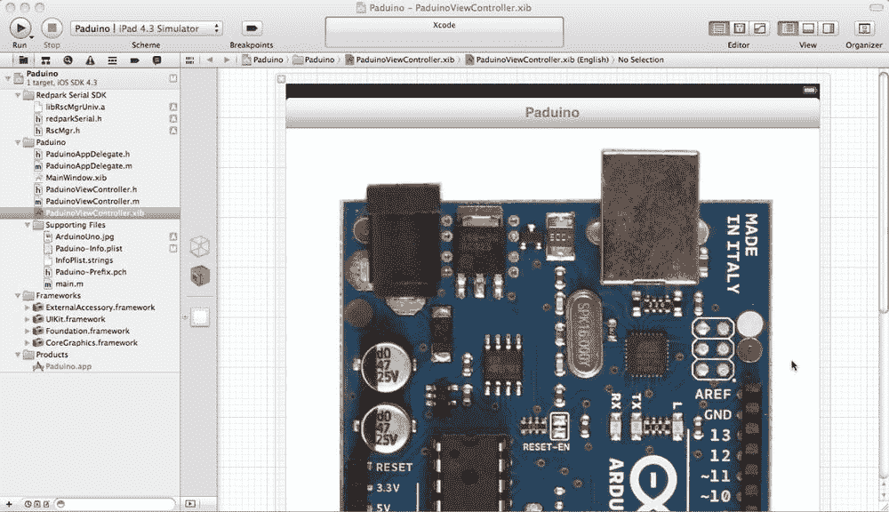

图 3-1. 基本用户界面

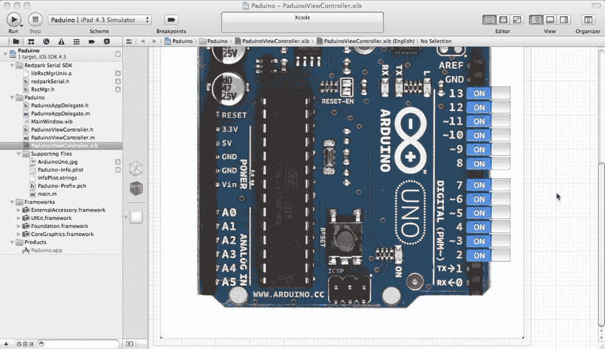

图 3-2. 定位 UISwitch 元素

对于每个开关，在属性检查器中将其状态设置为“关”。这将对应 Arduino 引脚保持为 `LOW` 状态；我们将编写 Arduino 代码，以此作为初始状态。然后，在同一检查器窗口中，将视图的标签（tag）设置为与引脚编号相同，参见 图 3-3。

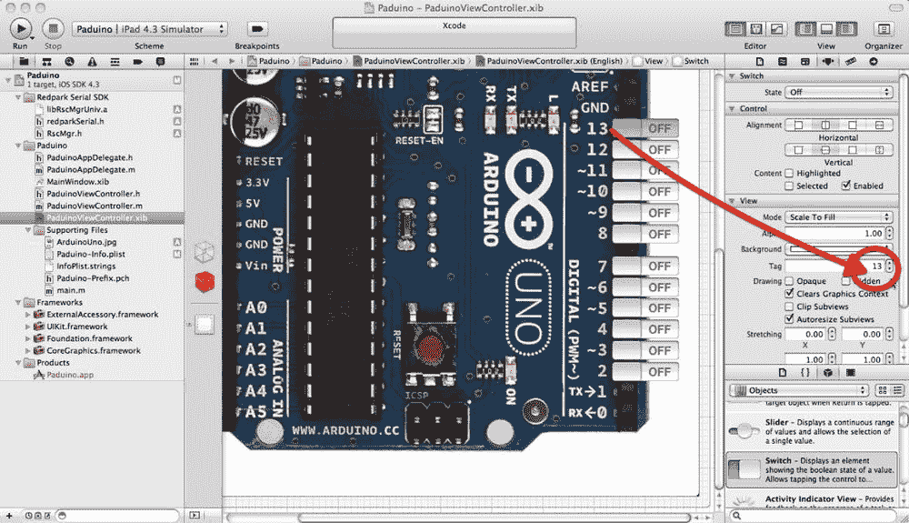

图 3-3. 设置视图的标签属性

完成上述操作后，切换到标识检查器，将开关的标签（label）设置为引脚名称（参见 图 3-4）。虽然这不是绝对必要的，但在后续连接输出口和操作时，这将帮助我们识别各个开关。

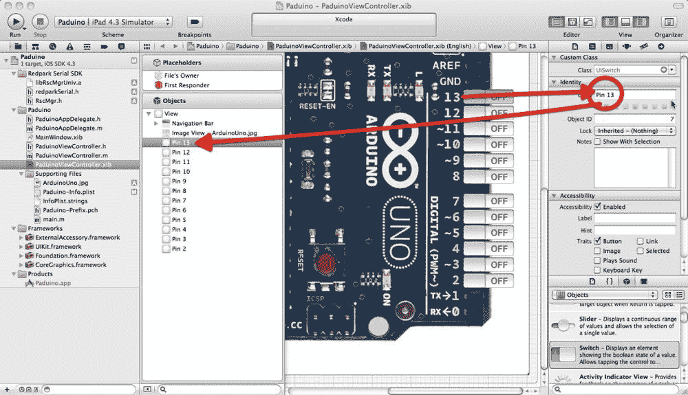

图 3-4. 设置视图的标签属性

完成这些设置后，关闭工具面板并打开辅助编辑器。确保其设置为“自动”，然后按住 Ctrl 键点击并从每个开关拖拽到 `PaduinoViewController.h` 接口文件，为每个开关创建实例变量和属性。

完成之后，点击其中一个开关将其选中，然后按住 Ctrl 键点击并拖拽到接口文件，创建一个名为 `toggle:` 的 `IBAction`（参见 图 3-5）。之后，按住 Ctrl 键点击并从所有其他开关拖拽到同一个方法。更改任意开关的状态都将调用这一个方法，并将该 `UISwitch` 作为发送者参数传递进去。

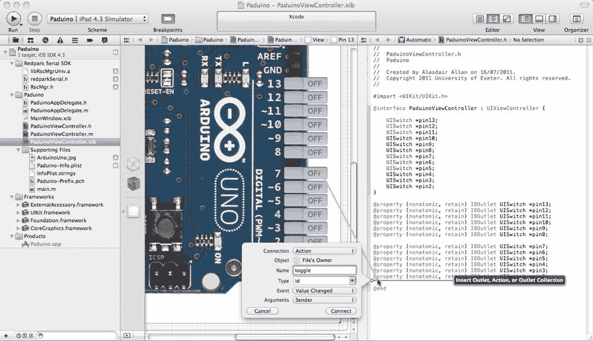

图 3-5. 将所有十二个开关连接到 toggle: 方法

完成这些操作后，如果你在对象视图中右键点击“File’s Owner”，应该会看到类似 图 3-6 的内容。这个弹出窗口显示了 File’s Owner（在本例中为 `PaduinoViewController`）与视图中各个元素之间的连接。

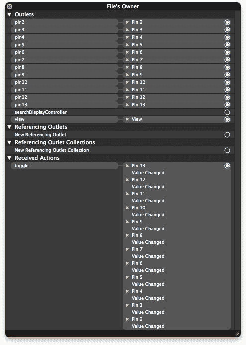

图 3-6. File’s Owner 与用户界面元素之间的连接

目前的工作暂时告一段落。我们做了很多更改，请确保已保存文件，然后点击 `PaduinoViewController.h` 接口文件，在标准编辑器中打开它。


## 集成串行库

如果你跟随着上一章的进度，紧密集成用户界面和串行库的步骤应该看起来非常熟悉。实际上，你甚至可以复制粘贴来节省时间。如果这样做，记得要小心；复制粘贴错误可能会让人头疼。

将以下高亮行添加到 `PaduinoViewController.h` 接口文件中：

```
#import <UIKit/UIKit.h>
#import "RscMgr.h"

#define BUFFER_LEN 1024

@interface PaduinoViewController : UIViewController <RscMgrDelegate> {

    UISwitch *pin13;
    UISwitch *pin12;
    UISwitch *pin11;
    UISwitch *pin10;
    UISwitch *pin9;
    UISwitch *pin8;
    UISwitch *pin7;
    UISwitch *pin6;
    UISwitch *pin5;
    UISwitch *pin4;
    UISwitch *pin3;
    UISwitch *pin2;

    RscMgr *rscMgr;
    UInt8 rxBuffer[BUFFER_LEN];
    UInt8 txBuffer[BUFFER_LEN];

}

@property (nonatomic, retain) IBOutlet UISwitch *pin13;
@property (nonatomic, retain) IBOutlet UISwitch *pin12;
@property (nonatomic, retain) IBOutlet UISwitch *pin11;
@property (nonatomic, retain) IBOutlet UISwitch *pin10;
@property (nonatomic, retain) IBOutlet UISwitch *pin9;
@property (nonatomic, retain) IBOutlet UISwitch *pin8;

@property (nonatomic, retain) IBOutlet UISwitch *pin7;
@property (nonatomic, retain) IBOutlet UISwitch *pin6;
@property (nonatomic, retain) IBOutlet UISwitch *pin5;
@property (nonatomic, retain) IBOutlet UISwitch *pin4;
@property (nonatomic, retain) IBOutlet UISwitch *pin3;
@property (nonatomic, retain) IBOutlet UISwitch *pin2;

- (IBAction)toggle:(id)sender;

@end
```

保存更改并切换到对应的实现文件，取消注释 `viewDidLoad:` 方法，并按如下方式初始化 Redpark 串行电缆管理器：

```
- (void)viewDidLoad {
    [super viewDidLoad];
    rscMgr = [[RscMgr alloc] init];
    [rscMgr setDelegate:self];
}
```

完成此操作后，将以下必需的委托方法添加到你的实现中：

```
- (void) cableConnected:(NSString *)protocol {
    [rscMgr setBaud:9600];
    [rscMgr open];
}

- (void) cableDisconnected {
}

- (void) portStatusChanged {
}

- (void) readBytesAvailable:(UInt32)numBytes {
    int bytesRead = [rscMgr read:rxBuffer Length:numBytes];
    NSLog( @"Read %d bytes from serial cable.", bytesRead );

    NSString *string = nil;
    for(int i = 0;i < numBytes;++i) {
        if ( string ) {
            string =  [NSString stringWithFormat:@"%@%c", string, rxBuffer[i]];
        } else {
            string =  [NSString stringWithFormat:@"%c", rxBuffer[i]];
        }
    }
    NSLog(@"Received: %@", string);
}

- (BOOL) rscMessageReceived:(UInt8 *)msg TotalLength:(int)len {
    return FALSE;
}

- (void) didReceivePortConfig {
}
```

所有这些应该看起来和上一章非常相似。那么让我们继续看看我们的 `toggle:` 方法：

```
- (IBAction)toggle:(id)sender {

    NSLog(@"Toggled output pin %i to %i", [sender tag], [(UISwitch *)sender isOn] );
    txBuffer[0] = [sender tag];
    txBuffer[1] = [(UISwitch *)sender isOn];
    int bytesWritten = [rscMgr write:txBuffer Length:2];
    NSLog( @"Wrote %d bytes to serial cable.", bytesWritten);
}
```

虽然代码很短，但这却是我们应用程序的核心。你还记得吗，在构建界面时，我确保每个 `UISwitch` 都有一个与开关编号对应的唯一标签？这里我们正是使用这个标签来构建发送给 Arduino 板的两字节消息。第一个字节是开关编号，第二个字节是 1 或 0，对应开关的开启或关闭状态。在 Arduino 端，这将对应于引脚状态 `HIGH` 或 `LOW`。

至此，至少目前我们完成了 iPad 端的代码。确保所有更改都已保存，然后点击 Xcode 工具栏中的运行按钮，构建并将应用程序部署到你的 iPad 上。一旦成功加载，点击停止按钮，将 iPad 放在一边。

## 在 Arduino 上监听消息

打开 Arduino 开发环境，输入以下代码，并将其上传到你的 Arduino 板（如果不确定如何操作，请重新查看第 1 章和第 2 章）：

```
#define LENGTH 2

int rxBuffer[128];
int rxIndex  = 0;

void setup() {

  Serial.begin(9600);
  Serial.println("Arduino reset");

  pinMode(2, OUTPUT);
  pinMode(3, OUTPUT);
  pinMode(4, OUTPUT);
  pinMode(5, OUTPUT);
  pinMode(6, OUTPUT);
  pinMode(7, OUTPUT);
  pinMode(8, OUTPUT);
  pinMode(9, OUTPUT);
  pinMode(10, OUTPUT);
  pinMode(11, OUTPUT);
  pinMode(12, OUTPUT);
  pinMode(13, OUTPUT);

  digitalWrite( 12, HIGH);
  digitalWrite( 13, HIGH);
  delay(500);
  digitalWrite( 12, LOW );
  digitalWrite( 13, LOW );
}

void loop (){

 if (Serial.available() > 0) {

   rxBuffer[rxIndex++] = Serial.read();
   if (rxIndex == LENGTH) {

       Serial.print( "Set: " );
       Serial.print( rxBuffer[0], DEC );
       Serial.print( " to: " );
       Serial.println( rxBuffer[1], DEC );

       if( rxBuffer[1] == 0 ) {
         digitalWrite((int)rxBuffer[0], LOW);
       } else {
         digitalWrite((int)rxBuffer[0], HIGH);
       }
       rxIndex = 0;
   }
 }
 delay(10);

}
```

我们有可用的字节，因此从串行缓冲区读取一个字节，并将其放入 `rxBuffer` 数组的下一个可用索引位置。然后对缓冲区索引进行后递增。

如果我们已经接收到 `LENGTH` 个字节（在本例中 `LENGTH` 为 2 个字节），我们就得到了来自远程主机的完整消息，现在应该处理它。如果没有，则循环并从串行缓冲区读取更多字节。

如果第二个字节是 0，我们将把引脚设置为 `LOW`。读取缓冲区的第一个字节，因为那是引脚编号，并将该引脚拉低为 `LOW`。

或者，如果接收到的第二个字节是 1，我们将把引脚设置为 `HIGH`。读取缓冲区的第一个字节，因为那是引脚编号，并将该引脚拉高为 `HIGH`。

除非我们手头有电压表，否则无法知道 Arduino 板上的某个引脚是 `LOW` 还是 `HIGH`，因此我们需要某种方式来确认。一个简单的方法是在每个引脚上放置一个 LED。我们可以单独为每个引脚接线，但图 3-7 展示了一个简便的方法。这里我将三个 LED 的接地引脚连接到一个跳线上，然后可以将其插入 Arduino 板的 GND 引脚。

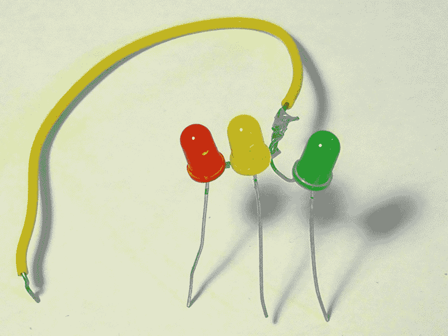

图 3-7. 将一些 LED 连接在一起

另外三个引脚将分别插入引脚 13、12 和 11，如图 3-8 所示。

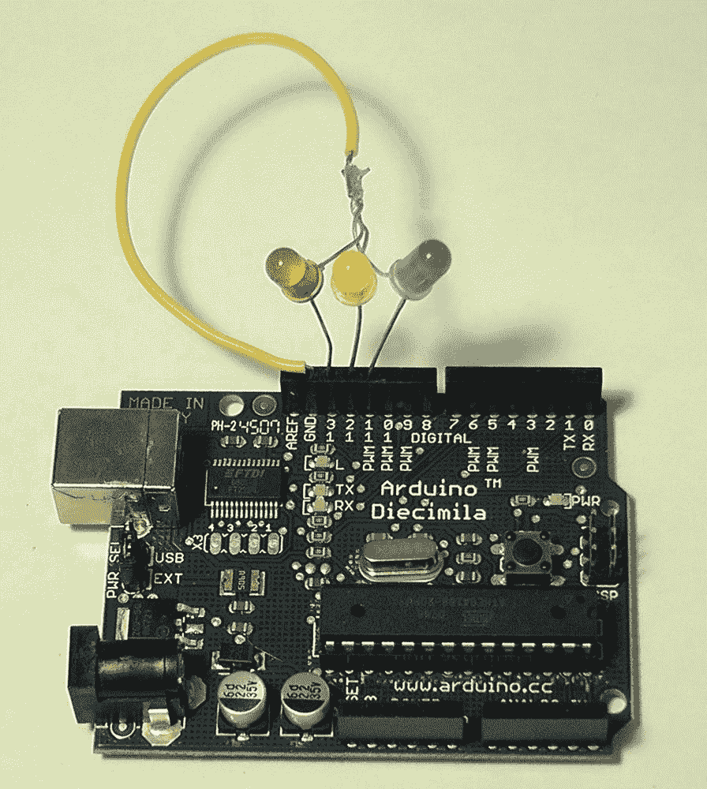

图 3-8. 将 LED 组连接到 Arduino


## 整合所有内容

至此，我们已经完成了串行连接两端代码的编写。拔掉之前插入 Mac 的所有设备，将所有线缆连接起来。启动 Paduino 应用程序，并拨动一到两个开关。您应该会看到类似下图（图 3-9）的画面。

请记住，一旦您将某个引脚拨至 `HIGH` 状态，就可以拔掉 iPad 和 Arduino 之间的串行线缆，因为该引脚的状态会保持不变。

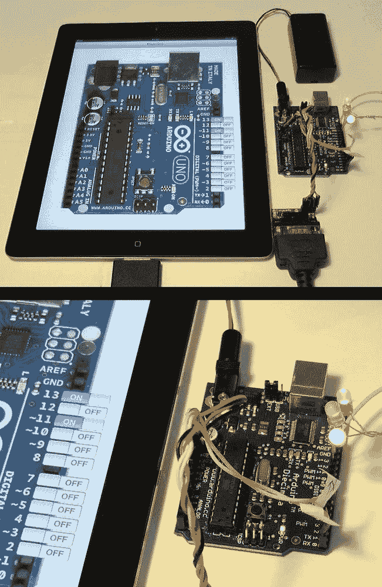

图 3-9. iPad 通过 Redpark 线缆连接至 Arduino 板（上方），以及 Arduino 板上 UISwitch 位置和 LED 的局部特写（下方）

## 更进一步

我们的应用程序显然还有改进空间。目前，后台发生了什么完全没有提示，这使得调试变得困难。让我们开始解决这个问题：向用户界面添加一个标签，并将其连接到 `cableConnected` 和 `cableDisconnected` 委托方法，这样我们就能确切知道线缆是否正确连接到了 iPad。

点击 *PaduinoViewController.xib* 接口文件，在 Interface Builder 中打开它，然后将两个 `UILabel` 元素拖放到视图中。将它们放在界面的顶部以及左上角。将第一个标签的文本改为 "Cable:"，并将第二个标签放在其右侧。您可以保留第二个标签的默认文本不变，或者将其改为更适合初始状态的文本（例如 "Disconnected"）。打开 Assistant Editor，然后按住 Ctrl 键点击第二个标签并拖拽到关联的接口文件中，以创建一个实例变量和属性（参见图 3-10）。

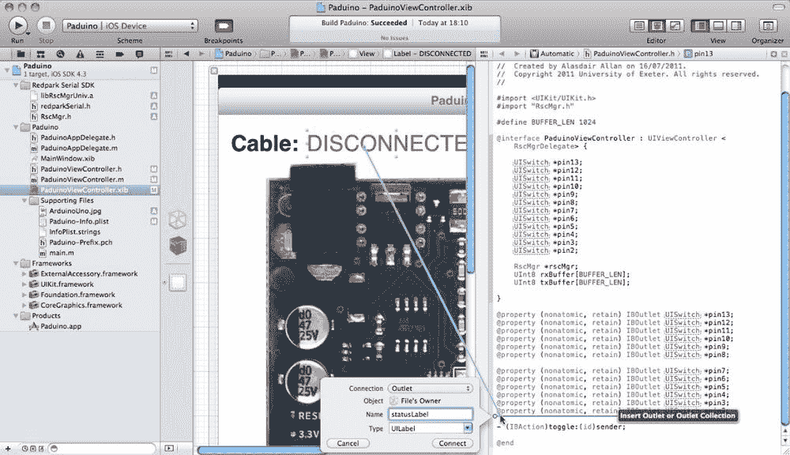

图 3-10. 将 UILabel 连接到接口文件

保存您的更改，然后切换到 Standard Editor 并返回到 *PaduinoViewController.m* 实现文件。找到 `cableConnected` 和 `cableDisconnected` 委托方法，并添加以下高亮显示的代码：

```
- (void) cableConnected:(NSString *)protocol {
    [rscMgr setBaud:9600];
    [rscMgr open];
    self.statusLabel.text = @"CONNECTED";
    self.statusLabel.textColor = [UIColor greenColor];
}

- (void) cableDisconnected {
    self.statusLabel.text = @"DISCONNECTED";
    self.statusLabel.textColor = [UIColor redColor];
}
```

这样，当我们连接和断开线缆时，状态文本及其颜色将会改变。

### 添加日志窗口

实际上，重用我们在前一章编写的日志窗口相当容易。

打开上一章的 SerialConsole，从项目管理窗格中选择 *LogController.h*、*LogController.m* 和 *LogController.xib* 文件。将它们拖放到 Paduino 项目中，记得勾选 "Copy files into destination group’s folder (if needed)" 复选框。

完成此操作后，在 Interface Builder 中打开 *PaduinoViewController.xib* 文件，并从对象库中将一个 `UIBarButtonItem` 拖放到导航栏中。将该按钮的标题改为 "Log"。关闭 Utilities 窗格，打开 Assistant Editor。然后按住 Ctrl 键点击 Log 按钮并拖拽到编辑器中关联的头文件，创建一个名为 `openLog:` 的 `IBAction` 方法（参见图 3-11）。

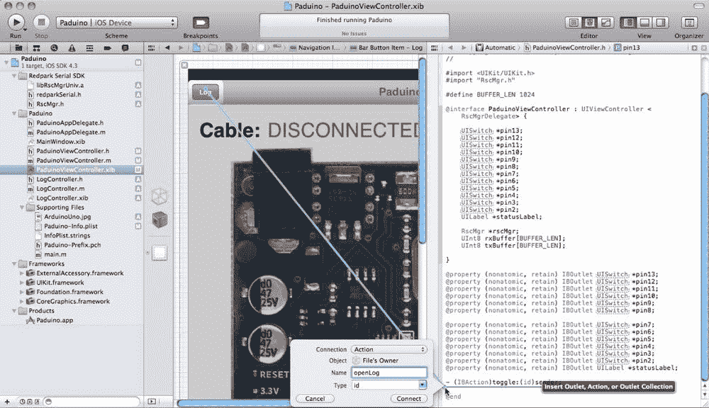

图 3-11. 将日志按钮连接到视图控制器

切换回标准编辑器，保存更改，然后点击 *PaduinoViewController.h* 文件在编辑器中打开。添加以下高亮显示的代码：

```
#import <UIKit/UIKit.h>
#import "RscMgr.h"
#import "LogController.h"

#define BUFFER_LEN 1024

@interface PaduinoViewController : UIViewController <RscMgrDelegate> {

    UISwitch *pin13;
    UISwitch *pin12;
    UISwitch *pin11;
    UISwitch *pin10;
    UISwitch *pin9;
    UISwitch *pin8;
    UISwitch *pin7;
    UISwitch *pin6;
    UISwitch *pin5;
    UISwitch *pin4;
    UISwitch *pin3;
    UISwitch *pin2;
    UILabel *statusLabel;

    RscMgr *rscMgr;
    UInt8 rxBuffer[BUFFER_LEN];
    UInt8 txBuffer[BUFFER_LEN];

    LogController *logWindow;
}

@property (nonatomic, retain) IBOutlet UISwitch *pin13;
@property (nonatomic, retain) IBOutlet UISwitch *pin12;
@property (nonatomic, retain) IBOutlet UISwitch *pin11;
@property (nonatomic, retain) IBOutlet UISwitch *pin10;
@property (nonatomic, retain) IBOutlet UISwitch *pin9;
@property (nonatomic, retain) IBOutlet UISwitch *pin8;

@property (nonatomic, retain) IBOutlet UISwitch *pin7;
@property (nonatomic, retain) IBOutlet UISwitch *pin6;
@property (nonatomic, retain) IBOutlet UISwitch *pin5;
@property (nonatomic, retain) IBOutlet UISwitch *pin4;
@property (nonatomic, retain) IBOutlet UISwitch *pin3;
@property (nonatomic, retain) IBOutlet UISwitch *pin2;
@property (nonatomic, retain) IBOutlet UILabel *statusLabel;

@property (nonatomic, retain) IBOutlet LogController *logWindow;

- (IBAction)toggle:(id)sender;
- (IBAction)openLog:(id)sender;

@end
```

然后，切换到相应的 *PaduinoViewController.m* 实现文件，您应该记得进行：

```
@synthesize logWindow;
```

接着添加以下代码，在 `viewDidLoad:` 方法中初始化日志窗口：

```
 self.logWindow = [[LogController alloc] initWithNibName:@"LogController" 
                                            bundle:nil];
```

并在 `dealloc` 方法中释放它：

```
 [logWindow release];
```

最后，在 `openLog:` 方法中，您应该以模态方式呈现日志控制器：

```
- (IBAction)openLog:(id)sender {
    [self presentModalViewController:self.logWindow animated:YES];
}
```

保存您的更改，然后点击位于项目管理窗格中 Supporting Files 组内的 *main.m* 文件。如同我们在上一章所做的那样，向其添加以下高亮显示的行：

```
#import <UIKit/UIKit.h>

int main(int argc, char *argv[]){
    NSAutoreleasePool *pool = [[NSAutoreleasePool alloc] init];

    NSArray *paths =
       NSSearchPathForDirectoriesInDomains(NSDocumentDirectory, NSUserDomainMask, YES);
    NSString *log = [[paths objectAtIndex:0] stringByAppendingPathComponent: 
                     @"ns.log"];

    NSFileManager *fileMgr = [NSFileManager defaultManager];
    [fileMgr removeItemAtPath:log error:nil];

    freopen([log fileSystemRepresentation], "a", stderr);

    int retVal = UIApplicationMain(argc, argv, nil, nil);
    [pool release];
    return retVal;
}
```

这会将 `stderr` 输出重定向到应用程序 Documents 目录下名为 *ns.log* 的文件中。

此时，您应该继续在各个关键位置（例如 `RscMgr` 委托方法）添加 `NSLog` 消息，以报告应用程序内部发生的情况。现在，如果您保存更改，并点击 Xcode 编辑器中的 Run 按钮，将应用程序构建并部署到您的设备上，那么当您插入和拔出线缆时，应该会获得更多的反馈信息。

## 总结

在本章中，我们构建了一个简单的应用程序，用于直接从 iPad 控制您的 Arduino。在下一章中，我们将更进一步，开始采集传感器测量数据。


