# 第 4 章 使用 iPhone 的外部传感器

到目前为止，我们已经成功地在 Arduino 板和 iPhone 之间来回传递消息，接着又从 iPad 直接控制开发板。在本章中，我们将再进一步，构建一个能够开启远程传感器、解析从传感器获取的数值并实时绘制结果测量值的应用程序。

## LV-MaxSonar-EZ1 超声波测距传感器

本章将使用的传感器是由 MaxBotics 公司生产的 LV-MaxSonar-EZ1 超声波测距传感器（见图 4-1），工作电压为 5V 或 3.3V。

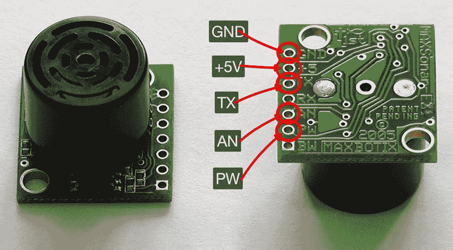

图 4-1. LV-MaxSonar-EZ1 超声波测距传感器

EZ1 是一款多功能超声波测距仪，可从多家供应商处广泛购买，包括 [SparkFun](http://www.sparkfun.com/products/639)，售价约为 25 美元。

#### 注

LV-MaxSonar-EZ1 可检测 0 至 6.45 米（约 21 英尺）范围内的物体，对于超过 15 厘米（6 英寸）的距离，分辨率为 2.5 厘米（1 英寸）。0 至 15 厘米之间的物体将显示为 15 厘米。

有趣的是，该传感器提供了三种不同的接口：模拟电压输出、脉宽输出和串行数字输出。所有三个接口同时激活。更多信息请参阅[产品数据手册](http://www.maxbotix.com/documents/MB1010_Datasheet.pdf)。

## 模拟输出

连接 EZ1 传感器最简单且最常用的方式可能是利用其模拟输出。我们只需要将三根线连接到传感器的 GND、+5V 和 AN 引脚。详情请参见图 4-1 和图 4-2。

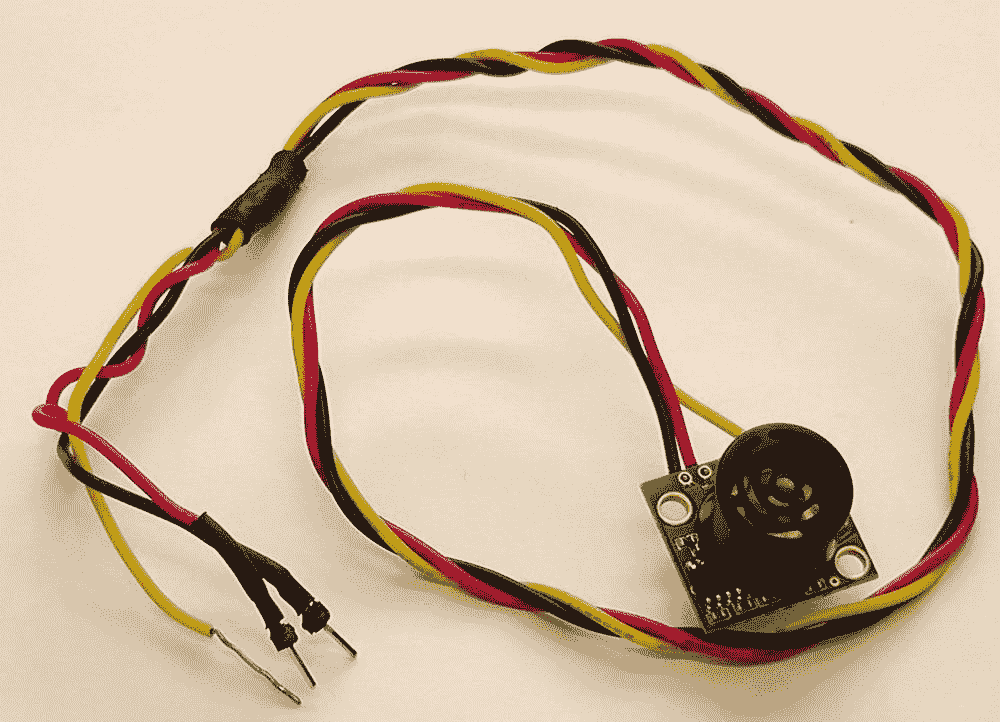

图 4-2. 为模拟输出接线的 EZ1

在此模式下使用 EZ1 传感器相当简单。如果将 5V 和 GND 引脚分别连接到 Arduino 板上的对应引脚，并将 AN 引脚连接到模拟引脚 A0，以下草图将距离测量值发送到 Arduino 的串行引脚（RX、TX）以及 USB 连接：

```
int ez1Analog = 0; // 模拟引脚, A0

void setup() {
   pinMode(ez1Analog,INPUT);
   Serial.begin(9600);
}

void loop() {
   int val = analogRead(ez1Analog);
   if (val > 0) {
      val = val / 2;
      float cm = float(val)*2.54;
      Serial.println( int(cm) ); // 厘米
   }
}
```

## 脉宽输出

另一种可选方法是使用 EZ1 传感器上的 PW 引脚，利用其脉宽输出。

#### 注

脉宽为每厘米 58 微秒，或每英寸 147 微秒。

如果断开 AN 引脚，并将 EZ1 的 PW 引脚连接到 Arduino 上支持 PWM 的引脚之一——数字引脚 5，以下草图以略微不同的方式复制了上一节草图的功能：

```
int ez1Pulse = 5; // 数字引脚 5（带有 PWM）

void setup() {
   pinMode(ez1Pulse,INPUT);
   Serial.begin(9600);
}

void loop() {
   int val = pulseIn(ez1Pulse, HIGH);
   if (val > 0) {
      float cm = val / 58; // 脉宽为每厘米 58 微秒
      Serial.println( int(cm) ); // 厘米
   }
}
```

## RS-232 串行输出

我选择 EZ1 作为本章示例传感器的主要原因之一是，该传感器除了模拟和脉宽输出外，还提供测量值的异步串行报告。这意味着我们可以绕过 Arduino 板和 RS-232 转 TTL 适配器，将传感器直接连接到 Redpark 线缆。我们将在本章末尾探讨如何实现这一点。

#### 注

TX 输出提供具有 RS-232 格式的异步串行数据（尽管电压范围为 0–Vcc）。输出为一个 ASCII 大写字母“R”，后跟三个 ASCII 字符数字，表示以英寸为单位的距离（最大 255），最后跟一个回车符（ASCII 字符 13）。

尽管 0–Vcc 的电压超出了 RS-232 标准，但大多数 RS-232 设备具有足够的余量来读取 0–Vcc 的串行数据。波特率为 9600，8 位数据位，无奇偶校验，1 位停止位。

## 适用于 iPhone 的 MaxSonar 测距仪

至少在最初阶段，我们将以模拟模式使用该传感器，并将其连接到 Arduino 板，Arduino 板再通过 Redpark 线缆连接到我们的 iPhone。

打开 Xcode，选择创建一个新项目，为 iPhone 设备系列选择基于视图的应用程序，在提示时将其命名为“MaxSonar”并保存到桌面。

### 添加串行库

打开你的 Redpark 串行 SDK 副本，从 `inc/` 文件夹中获取 `redparkSerial.h` 和 `rscMgr.h` 头文件，并从 `lib/` 文件夹中获取 `libRscMgrUniv.a` 静态库。将它们拖放到你的新 MaxSonar 项目中，记得在提示时勾选“将项目复制到目标组的文件夹中（如果需要）”复选框。

我们还需要添加 External Accessories 框架，因此点击 Xcode 项目窗格顶部的项目图标，然后点击 MaxSonar 目标，接着点击 Build Phases 选项卡。最后，点击“Link Binary with Libraries”项以打开链接框架列表，并点击 + 符号添加新框架。从下拉列表中选择 External Accessory 框架，然后点击 Add 按钮。

最后，我们需要声明对线缆的支持。点击 `SerialConsole-Info.plist` 文件以在编辑器中打开它。右键点击列表最底部的行，从菜单中选择“Add Row”。表格中会添加一个额外的行，并出现一个下拉菜单。在框中输入 `UISupportedExternalAccessoryProtocols`。这将变为人类可读文本“Supported external accessory protocols”。在 Item 0 中输入字符串 `com.redpark.hobdb9` 以声明我们对线缆的支持。

### CorePlot 库

在处理传感器数据时，开发应用程序时经常需要显示某种图表或图形，这也许并不令人意外。不幸的是，iOS SDK 中没有原生的图表支持。Core Plot 库填补了这一空白（见图 4-3）。

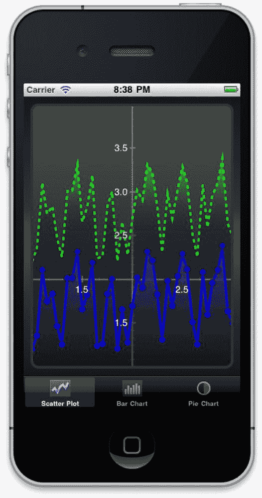

图 4-3. 在 iPhone 模拟器中运行的 CorePlot 测试应用程序

Core Plot 库是一个用于 iOS 和 Mac OS X 的第三方 2D 绘图框架，与 Core Animation 紧密集成，并处于积极开发中。在撰写本文时，最新版本是 0.4。你可以从 [`code.google.com/p/core-plot/`](http://code.google.com/p/core-plot/) 下载。

#### 注

如果你想尝鲜，可以直接使用 Mercurial 从 Core Plot 的仓库中检出源代码：

```
hg clone http://core-plot.googlecode.com/hg/ core-plot
```

Mercurial 并未随 Xcode 一起提供，因此除非你已经安装，否则在此之前的第一步可能是安装 Mercurial 本身。你可以从 [`mercurial.selenic.com/wiki/`](http://mercurial.selenic.com/wiki/) 下载最新版本的 Mercurial。


#### 从源代码编译 Core Plot 库

从 Core Plot 网站下载 `CorePlot_0.4.zip` 文件，或从项目的 Mercurial 仓库中获取最新版本。打开 `CorePlot/framework/` 文件夹，点击 `CorePlot-CocoaTouch.xcodeproj` 项目文件，在 Xcode 中打开它。

从方案下拉菜单中选择“Universal Library | iOSDevice”，然后从产品菜单中选择构建 (`⌘B`)，以构建一个通用（胖）静态库，以便我们在设备和 iPhone 模拟器上都能使用。

构建完成后，向上回退一级文件夹，进入新创建的 `build` 目录。在 `build/Release-universal/` 目录中，你会找到 `libCorePlot-CocoaTouch.a` 静态库；但除此之外，我们还需要相关的头文件。创建通用库的自定义构建脚本不会从各个构建目录复制这些头文件。不过，你可以在 `build/Release-iphoneos/usr/local/include/` 或 `build/Release-iphonesimulator/usr/local/include/` 目录中找到它们。你在项目中使用哪组头文件其实无关紧要；这两组文件是相同的。

#### 将 Core Plot 库添加到项目中

将 `libCorePlot-CocoaTouch.a` 静态库从 `build/Release-universal/` 文件夹拖放到你的项目中，记得在提示时勾选“将项目复制到目标组的文件夹中（如果需要）”复选框。然后，将两组头文件中的任意一组（全部文件）复制到你的项目中。再次记得勾选“将项目复制到目标组的文件夹中（如果需要）”复选框。

点击项目窗格顶部的 MaxSonar 项目文件，选择 MaxSonar 目标，然后点击构建设置标签页。找到其他链接器标志设置（位于链接部分下），双击打开弹出窗口，为目标添加 `-ObjC -all_load` 标志（参见图 4-4）。

最后，由于 Core Plot 库使用了 QuartzCore 框架，我们需要将其添加到项目中。点击构建阶段标签页，然后点击“将二进制文件与库链接”项，打开链接框架列表，点击 + 符号添加一个新框架。从下拉列表中选择 QuartzCore 框架，然后点击添加按钮。

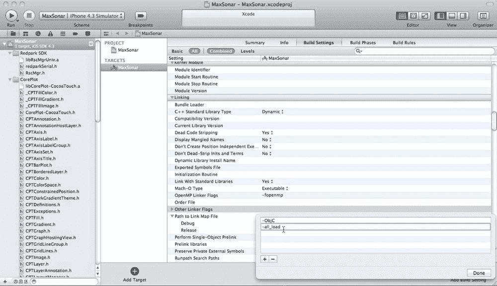

图 4-4. 为目标添加其他链接器标志

### 构建用户界面

现在我们已经添加了构建应用程序所需的第三方基础设施，是时候构建用户界面了。点击 `MaxSonarViewController.xib` 文件，在 Interface Builder 中打开它，然后将一个 `UINavigationBar`、一个 `UISwitch`、几个 `UILabel` 元素，最后是一个通用的 `UIView` 拖放到你的视图中。按图 4-5 所示排列它们。将导航栏中的文本改为“LV-MaxSonar-EZ1”，将两个标签中的文本分别改为“距离：”和“0.00”。

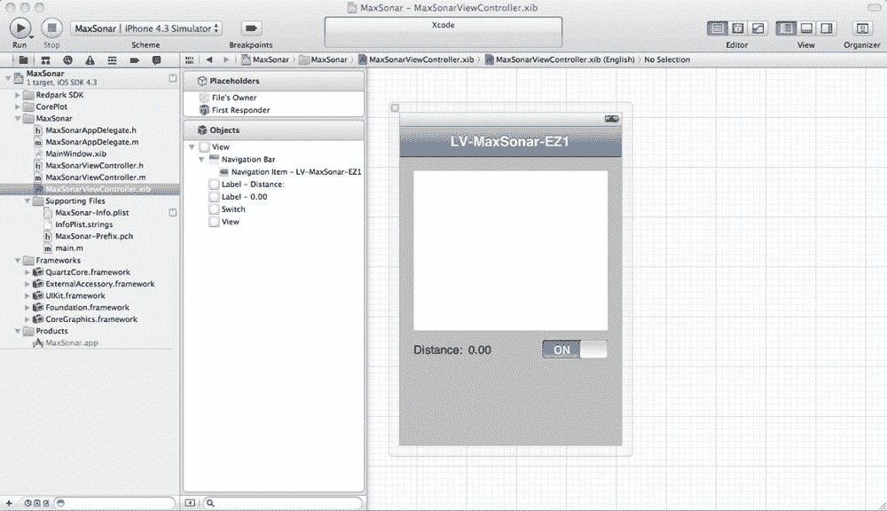

图 4-5. 构建用户界面

在视图中点击通用的 `UIView`，然后打开右侧实用工具窗格中的标识检查器。我们需要将视图的类从 `UIView` 更改为 `CPTGraphHostingView`。参见图 4-6。

#### 警告

根据你使用的 Core Plot 库版本，你可能需要将自定义视图指定为 `CPGraphHostingView`。

这个自定义视图将用于绘制来自 EZ1 传感器（通过 Arduino 和串行链路连接到我们的 iPhone）的实时传感器读数图表。

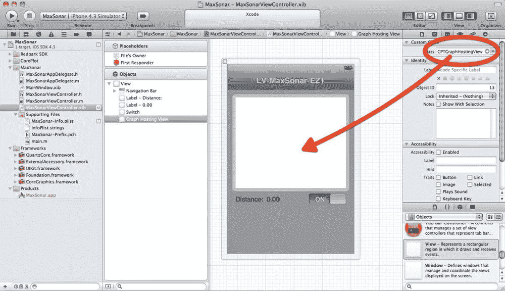

图 4-6. 设置自定义视图

更改视图类后，关闭实用工具面板，打开辅助编辑器。确保它处于自动模式，然后按住 Control 键从 `CPTGraphHostingView` 拖拽到 `MaxSonarViewController.h` 接口文件，以创建一个 `graph` 实例变量和属性。类似地，按住 Control 键从右侧的 `UILabel` 和 `UISwitch` 拖拽，创建 `distance` 和 `toggle` 实例变量和属性。最后，再次按住 Control 键从 `UISwitch` 拖拽到一个 `toggled` 方法和 IBAction，如图 4-7 所示。

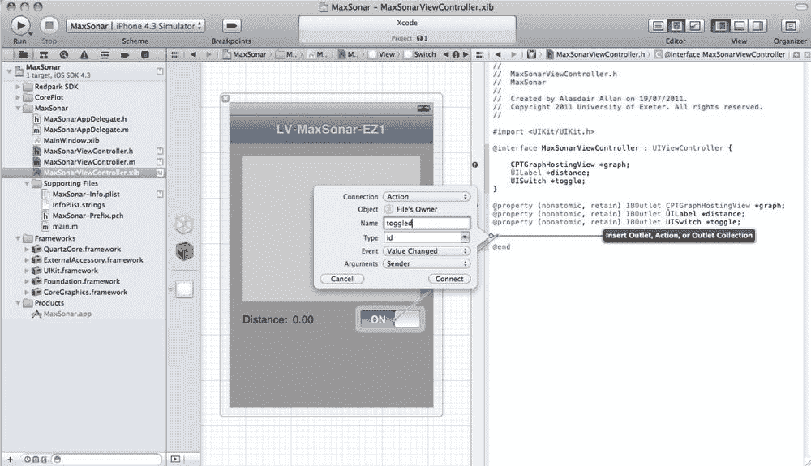

图 4-7. 连接输出口和操作

保存更改，切换回标准编辑器，然后点击 `MaxSonarViewController.h` 接口文件，在编辑器中打开它。你应该注意到 `CPTGraphHostingView` 实例变量旁边有一个错误；这是因为 Xcode 还不知道它是什么。继续在代码顶部添加以下导入语句：

```
#import "CorePlot-CocoaTouch.h"
```

如果在此时从产品菜单中选择构建 (`⌘B`) 来构建你的项目，一切应该都能编译通过。如果情况并非如此，你应该在开始排查其他问题之前，先确认已将 External Accessory 和 QuartzCore 框架添加到项目中。


## 构建后端

用户界面已经完成。现在需要将我们的界面与 Arduino 板传入的测量数据连接起来。显然，首先要做的是将 Redpark 库集成到代码中。这部分代码与我们在前几章中看到的代码几乎完全相同。不过，我们还需要为图表建立一些基础设施。为此，我们将使用一个简单的 XY 散点图。

打开 `MaxSonarViewController.h` 接口文件，添加以下代码：

```
#import <UIKit/UIKit.h>
#import "CorePlot-CocoaTouch.h"
#import "RscMgr.h"

#define BUFFER_LEN 1024
#define MAX_POINTS 200

@interface MaxSonarViewController : UIViewController
                                    <CPTPlotDataSource, RscMgrDelegate> {

CPTGraphHostingView *graph;

CPTXYGraph *plot;
    NSMutableArray *dataForPlot;

UILabel *distance;
    UISwitch *toggle;

RscMgr *manager;
    UInt8 rxBuffer[BUFFER_LEN];
    UInt8 txBuffer[BUFFER_LEN];
}

@property (nonatomic, retain) IBOutlet CPTGraphHostingView *graph;
@property (nonatomic, retain) IBOutlet UILabel *distance;
@property (nonatomic, retain) IBOutlet UISwitch *toggle;
@property (nonatomic, retain) NSMutableArray *dataForPlot;

- (IBAction)toggled:(id)sender;

- (NSNumber *) yValueForIndex:(NSUInteger)index;

@end
```

这使我们的类既成为 Core Plot 的数据源，也成为 Redpark 串行电缆的委托对象。现在打开对应的 `MaxSonarViewController.m` 实现文件。我们需要记得合成新属性：

```
@synthesize dataForPlot;
```

然后在 `dealloc` 方法中释放它：

```
 [dataForPlot release];
```

最后在 `viewDidUnload` 方法中将其设为 nil：

```
 [self setDataForPlot:nil];
```

我们继续添加 `viewDidLoad` 方法。这里我们将像往常一样设置电缆管理器对象，同时也要设置 Core Plot 的绘图对象。进行这些设置涉及大量样板代码，这里我不打算详细讨论，因为这与我们实际要做的事情略有偏离：

```
- (void)viewDidLoad {
    [super viewDidLoad];

// 电缆管理器
    rscMgr = [[RscMgr alloc] init];
    [rscMgr setDelegate:self];

// 通过主题创建图表
    plot = [[CPTXYGraph alloc] initWithFrame:CGRectZero];
    CPTTheme *theme = [CPTTheme themeNamed:kCPTPlainBlackTheme];
    [plot applyTheme:theme];
    graph.collapsesLayers = NO;
    graph.hostedGraph = plot;

plot.paddingLeft = 10.0;
    plot.paddingTop = 10.0;
    plot.paddingRight = 10.0;
    plot.paddingBottom = 10.0;

// 设置绘图空间
    CPTXYPlotSpace *plotSpace = (CPTXYPlotSpace *)plot.defaultPlotSpace;
    plotSpace.allowsUserInteraction = YES;
    plotSpace.xRange = [CPTPlotRange plotRangeWithLocation:CPTDecimalFromFloat(1.0) 
                                     length:CPTDecimalFromFloat(MAX_POINTS)];
    plotSpace.yRange = [CPTPlotRange plotRangeWithLocation:CPTDecimalFromFloat(1.0) 
                                     length:CPTDecimalFromFloat(MAX_POINTS)];

// 坐标轴
    CPTXYAxisSet *axisSet = (CPTXYAxisSet *)plot.axisSet;

CPTXYAxis *x = axisSet.xAxis;
    x.majorIntervalLength = CPTDecimalFromString(@"100");
    x.minorTicksPerInterval = 4;
    x.minorTickLength = 5.0f;
    x.majorTickLength = 7.0f;

CPTXYAxis *y = axisSet.yAxis;
    y.majorIntervalLength = CPTDecimalFromString(@"50");
    axisSet.yAxis.minorTicksPerInterval = 2;
    axisSet.yAxis.minorTickLength = 5.0f;
    axisSet.yAxis.majorTickLength = 7.0f;

// 创建一个绿色绘图区域
    CPTScatterPlot *line = [[[CPTScatterPlot alloc] init] autorelease];
    CPTMutableLineStyle *lineStyle = [CPTMutableLineStyle lineStyle];
    lineStyle.miterLimit = 1.0f;
    lineStyle.lineWidth = 3.0f;
    lineStyle.lineColor = [CPTColor greenColor];
    line.dataLineStyle = lineStyle;
    line.identifier = @"Green Plot";
    line.dataSource = self;
    [plot addPlot:line];

// 添加绿色渐变
    CPTColor *areaColor = [CPTColor colorWithComponentRed:0.3 
                                    green:1.0 blue:0.3 alpha:0.8];
    CPTGradient *areaGradient = [CPTGradient gradientWithBeginningColor:areaColor 
                                             endingColor:[CPTColor clearColor]];
    areaGradient.angle = −90.0f;
    CPTFill *areaGradientFill = [CPTFill fillWithGradient:areaGradient];
    line.areaFill = areaGradientFill;
    line.areaBaseValue = [[NSDecimalNumber zero] decimalValue];

// 添加绘图符号
    CPTMutableLineStyle *symbolLineStyle = [CPTMutableLineStyle lineStyle];
    symbolLineStyle.lineColor = [CPTColor blackColor];
    CPTPlotSymbol *plotSymbol = [CPTPlotSymbol ellipsePlotSymbol];
    plotSymbol.fill = [CPTFill fillWithColor:[CPTColor greenColor]];
    plotSymbol.lineStyle = symbolLineStyle;
    plotSymbol.size = CGSizeMake(10.0, 10.0);
    line.plotSymbol = plotSymbol;

CABasicAnimation *fadeInAnimation = [CABasicAnimation 
                                         animationWithKeyPath:@"opacity"];
    fadeInAnimation.duration = 1.0f;
    fadeInAnimation.removedOnCompletion = NO;
    fadeInAnimation.fillMode = kCAFillModeForwards;
    fadeInAnimation.toValue = [NSNumber numberWithFloat:1.0];

// 添加一些初始数据
    NSMutableArray *contentArray = [NSMutableArray arrayWithCapacity:200];
    self.dataForPlot = contentArray;
}
```

现在我们需要添加 CorePlot `CPTPlotDataSource` 数据源方法：

```
#pragma mark - CPTPlotDataSource 方法

-(void)pointReceived:(NSNumber *)point{

CPTPlot *thisPlot = [plot plotWithIdentifier:@"Green Plot"];
    [self.dataForPlot addObject:point];
    [thisPlot insertDataAtIndex:self.dataForPlot.count-1 numberOfRecords:1];
    self.distance.text = [NSString stringWithFormat:@"%@", point];

}

-(NSUInteger)numberOfRecordsForPlot:(CPTPlot *)plot {
    return [dataForPlot count];
}

-(NSNumber *)numberForPlot:(CPTPlot *)plot field:(NSUInteger)fieldEnum recordIndex:(NSUInteger)index {

if (fieldEnum == CPTScatterPlotFieldX) {
        return [NSNumber numberWithInteger:index];
    } else {
        return [self yValueForIndex:index];
    }
}
```

以及我们的 `yValueForIndex:` 便捷方法：

```
- (NSNumber *) yValueForIndex:(NSUInteger)index {
     return [self.dataForPlot objectAtIndex:index];
}
```

最后添加 Redpark 串行委托方法：

```
#pragma mark - RscMgrDelegate 方法

- (void) cableConnected:(NSString *)protocol {
    [rscMgr setBaud:9600];
    [rscMgr open];

}

- (void) cableDisconnected {
}

- (void) portStatusChanged {
}

- (void) readBytesAvailable:(UInt32)numBytes {
    int bytesRead = [rscMgr read:rxBuffer Length:numBytes];

NSString *string = nil;
    for(int i = 0;i < numBytes;++i) {
        if ( string ) {
            string =  [NSString stringWithFormat:@"%@%c", string, rxBuffer[i]];
        } else {
            string =  [NSString stringWithFormat:@"%c", rxBuffer[i]];
        }
    }
    [self pointReceived:[NSNumber numberWithInt:[string intValue]]];

}

- (BOOL) rscMessageReceived:(UInt8 *)msg TotalLength:(int)len {
    return FALSE;
}

- (void) didReceivePortConfig {
}
```

通过在模拟器中运行应用来检查一切是否构建并正常运行。你应该会看到类似[图 4-8](http://example.com/placeholder) 的内容。如果看起来没问题，就切换到设备上，在你的 iPhone 上构建并部署应用。

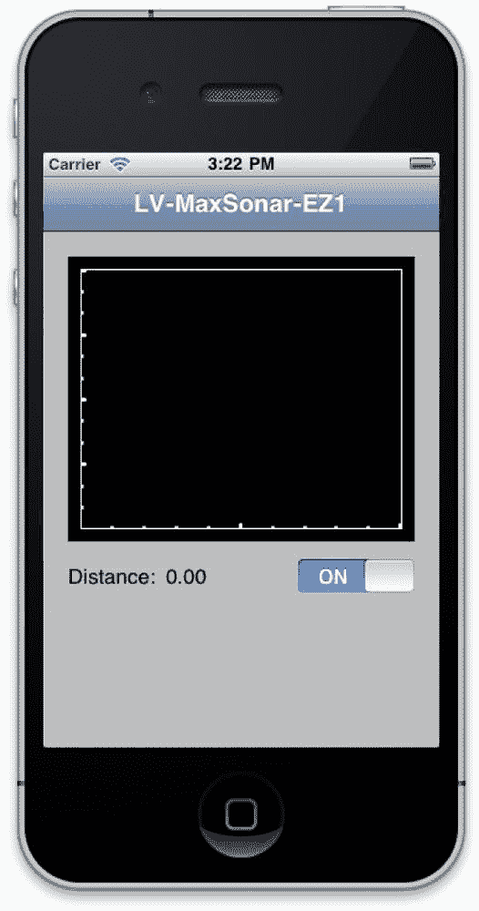

**图 4-8.** MaxSonar 应用在 iPhone 模拟器中运行

如果一切顺利，现在我们需要暂时把 iPhone 应用以及 Xcode 本身放到一边。是时候看看我们构建的 Arduino 端了。


### 编写 Arduino 程序

打开 Arduino 开发环境，输入以下代码并上传到你的 Arduino 板。我们将使用模拟引脚 `0`（大多数板上通常标记为 `A0`）作为 EZ1 传感器的模拟输入：

```
int statusLed = 13;
int ez1Analog = 0;

void setup() {
   pinMode(statusLed,OUTPUT);
   pinMode(ez1Analog,INPUT);
   Serial.begin(9600);
}

void loop() {
   int val = analogRead(ez1Analog);
   if (val > 0) {
      val = val / 2;
      float cm = float(val)*2.54;
      Serial.println( int(cm) );
   }
   blinkLed( statusLed, 100 );

}

void blinkLed(int pin, int ms) {
   digitalWrite(pin,LOW);
   digitalWrite(pin,HIGH);
   delay(ms);
   digitalWrite(pin,LOW);
   delay(ms);
}
```


这里我们使用一个简便方法来闪烁板载 LED（引脚 `13`），闪烁持续时间为 `100` 毫秒。这样做一方面是为了确认程序确实在运行，另一方面也是为了在发送到手机的读数之间加入时间间隔。

### 组装全部组件

通常情况下，EZ1 需要 `5` V 电压；但根据数据手册，我们也可以在 `3.3` V 电压下运行它，不过性能会有所降低。这简化了将所有组件连接到 Arduino 板的过程。将 EZ1 的 `+VE` 线插入 Arduino 板的 `3.3V` 引脚，将 `GND` 线插入任意一个可用的 `GND` 引脚，然后将 `AN` 线连接到模拟引脚 `0`（`A0`）。最后，照常将 RS-232 转 TTL 串口适配器连接到 `5V`、`GND`、`RX` 和 `TX` 引脚（参见 图 4-9）。

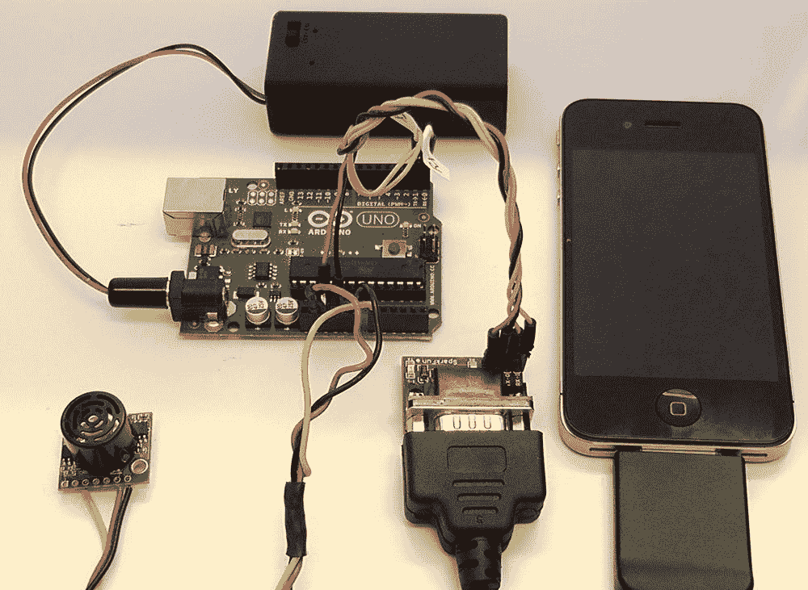

图 4-9. 连接所有组件

如果你确实想将 EZ1 连接到 `+5V` 引脚而非 `3.3V` 引脚，最简单的办法可能就是使用一块面包板和一些跳线。

确认所有连接正确无误后，给 Arduino 板上电并启动应用程序。将 EZ1 指向天花板以获取一个较远的距离测量值，然后将手放在传感器上方。你应该会看到测得的距离急剧下降。慢慢抬起手，保持在传感器上方，观察读数变化。此时，你应该能看到类似于图 4-10 所示的效果。

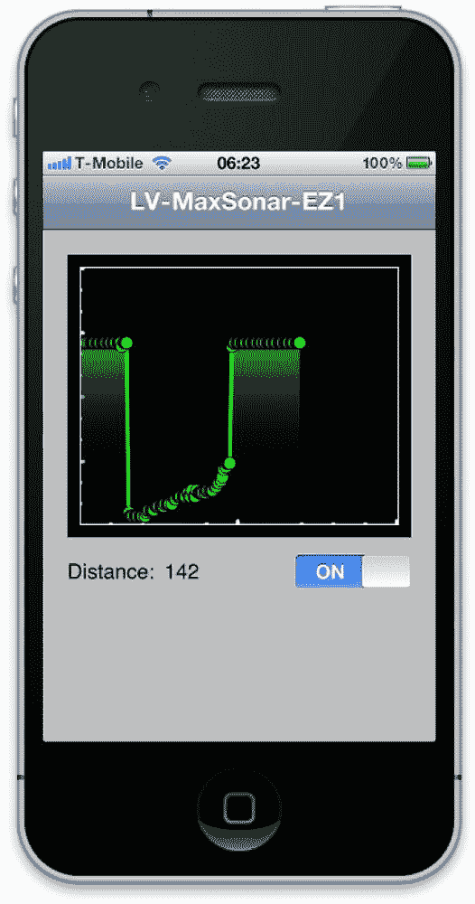

图 4-10. 在 iPhone 上运行的 MaxSonar 应用程序

### 控制开关

你可能已经注意到，我们还没有对拨动开关进行任何处理。现在让我们来让它变得可用。首先，我们需要修改 Arduino 程序：

```
int statusLed = 13;
int powerLed = 12;
int ez1Analog = 0;

int aByte;
int flag = 0;

void setup() {
   pinMode(statusLed,OUTPUT);
   pinMode(ez1Analog,INPUT);
   Serial.begin(9600);

   pinMode(powerLed,OUTPUT);
   blinkLed( statusLed, 500 );
}

void loop() {

   if (Serial.available() > 0) {
          aByte = Serial.read();
          if ( flag == 0 ) {
            flag = 1;
            digitalWrite(powerLed, HIGH);
          } else {
            flag = 0;
            digitalWrite(powerLed, LOW);
          }
    }

   if ( flag == 1 ) {
     int val = analogRead(ez1Analog);

     if ( val > 0 ) {
         val = val / 2;
         float cm = float(val)*2.54;
         Serial.println( int(cm) ); // cm
         blinkLed( statusLed, 100);
      }
   }

}

void blinkLed(int pin, int ms) {
   digitalWrite(pin,LOW);
   digitalWrite(pin,HIGH);
   delay(ms);
   digitalWrite(pin,LOW);
   delay(ms);
}
```

这里我们重写了 `loop()` 函数，使得 Arduino 仅在接收到来自手机的字节从而被“打开”时，才向 iPhone 发送数据；收到另一个字节后，则停止发送数据。我还使用了引脚 `12` 上的第二个 LED 来指示数据正在发送，但这完全是可选的，如果你不想费事在 Arduino 板上再连接一个 LED，可以省略它。

你会注意到，我们假设初始状态为“关闭”，但目前我们的用户界面初始状态是“打开”。我们需要修复这个问题，因此在 Interface Builder 中打开 `MaxSonarViewController.xib` 文件，点击视图中的开关，然后在工具面板的属性检查器中，将开关的初始状态改为“关闭”。

最后，为了将所有部分整合在一起，我们在切换回调中添加一些代码：

```
- (IBAction)toggled:(id)sender {
    txBuffer[0] = 1;
    int bytesWritten = [rscMgr write:txBuffer Length:1];

}
```

现在，如果你重新构建并重新将 MaxSonar 应用程序部署到 iPhone 上，应该就能使用开关来启动和停止从手机接收数据了。


## 直接连接线缆

由于 `EZ1` 配备有 `RS-232` 接口，实际上可以直接将其连接至 `Redpark` 线缆，而完全无需使用 `Arduino` 板。`Redpark 串行线缆`采用标准方式接线，末端为公头 `DB-9` 连接器；该连接器的引脚排列如图 4-11 所示，并在表 4-1 中进行了说明。

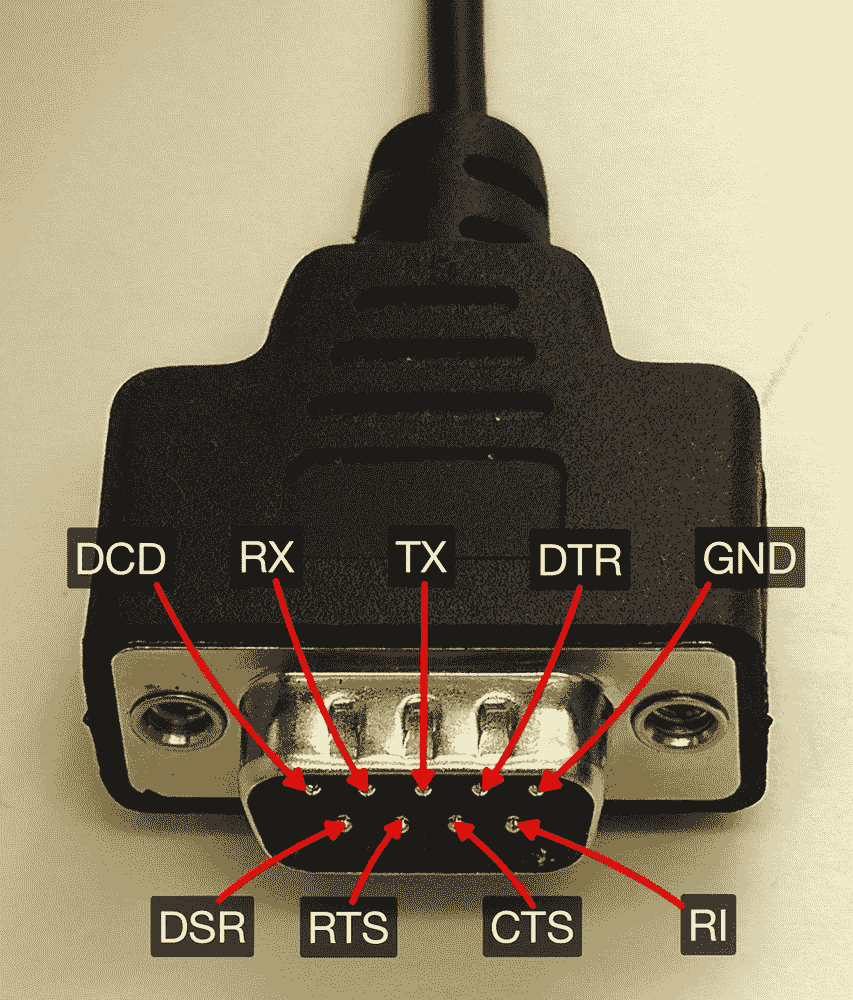

**图 4-11.** Redpark 串行线缆 DB-9 连接器

**表 4-1.** Redpark 串行线缆 DB-9（公头）连接器引脚排列

| 引脚号 | 功能 | I/O | 描述 |
| --- | --- | --- | --- |
| 1 | `DCD` | I | 数据载波检测 |
| 2 | `RX` | I | 接收 |
| 3 | `TX` | O | 发送 |
| 4 | `DTR` | O | 数据终端就绪 |
| 5 | `GND` | - | 接地 |
| 6 | `DSR` | I | 数据设备就绪 |
| 7 | `RTS` | O | 请求发送 |
| 8 | `CTS` | I | 允许发送 |
| 9 | `RI` | I | 振铃指示 |

比较图 4-1 和图 4-11，我们只需连接 9 个可用引脚中的 3 个：`GND`、`RX` 和 `TX`。因此，使用一个母头 `DB-9` 连接器，应按图 4-12 所示进行接线。对比图 4-11 和图 4-12，您会注意到在母头连接器中，我们将引脚 2 连接到 `TX`，引脚 3 连接到 `RX`。这意味着 `EZ1` 的 `TX` 连接到线缆的 `RX`，反之亦然。

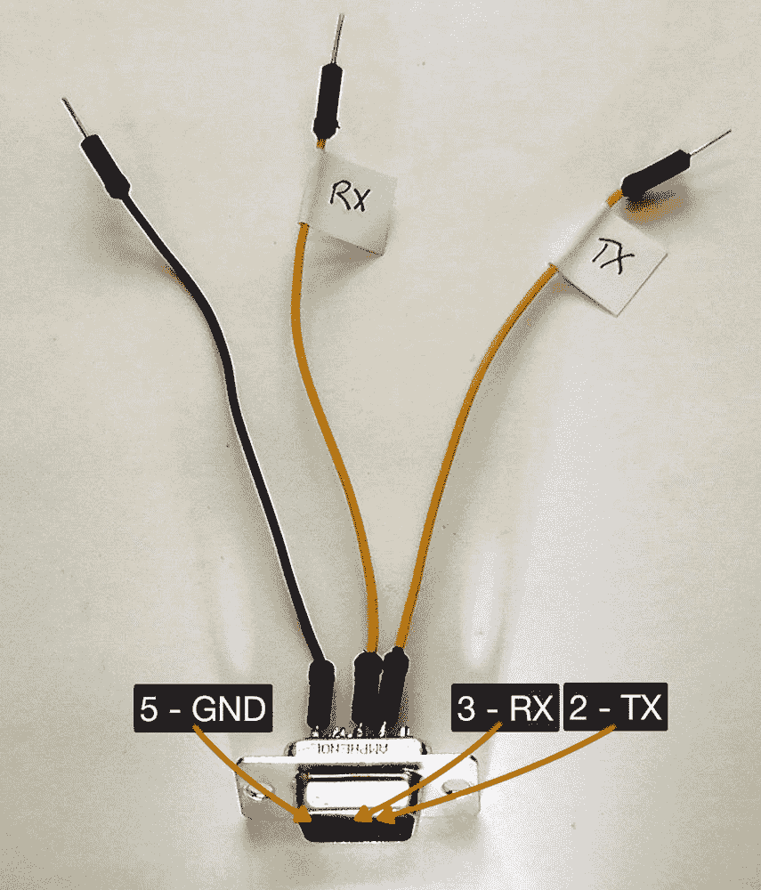

**图 4-12.** LV-MaxSonar-EZ1 连接至 DB9（母头）的引脚接线图

接线完成后，继续在 `EZ1` 传感器板上焊接一个排针座（请参见图 4-13）。

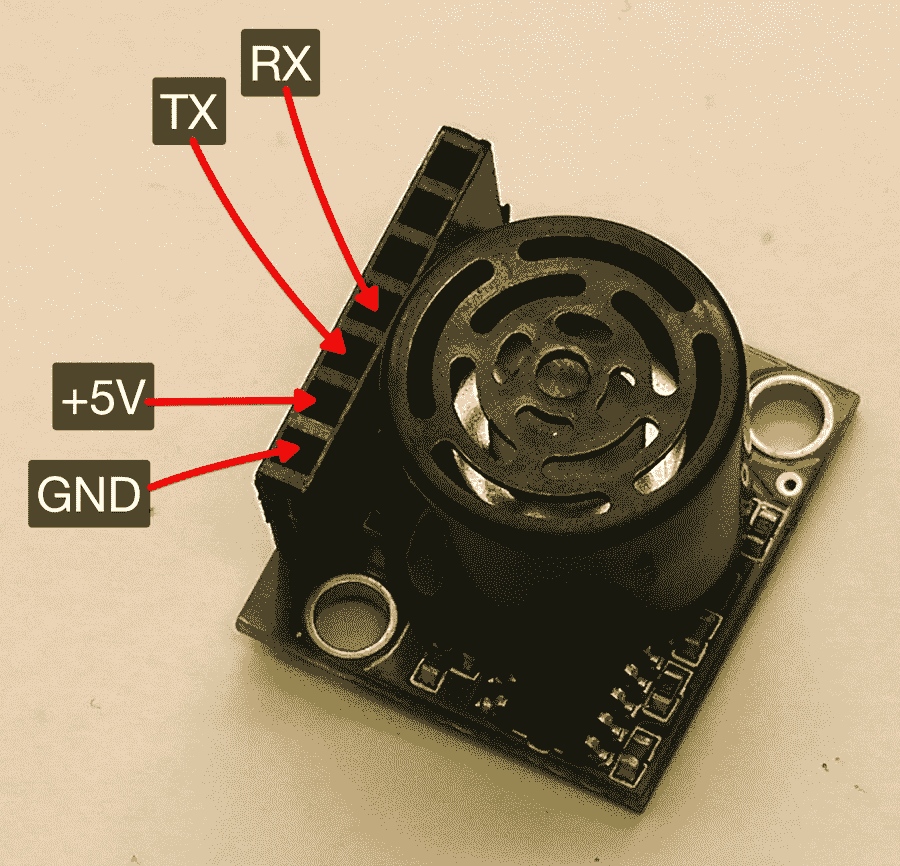

**图 4-13.** 焊接至 EZ1 传感器的排针座

在连接 `EZ1` 传感器时，应注意不要遮挡传感器头部本身；否则通电后会得到不准确的测量值。根据您的应用需求，您可能希望将排针焊接在电路板背面，或者使用直角排针座，以确保不会遮挡传感器。

在将排针座焊接到传感器板上后，您需要找到一个合适的 3.3 V 或 5 V 电源。我使用 `2 × 1.5 V` 电池提供 3 V 电源，这足以测试传感器。然后我们需要汇集地线连接并为传感器供电。最简单的方法可能是使用面包板（请参见图 4-14）。

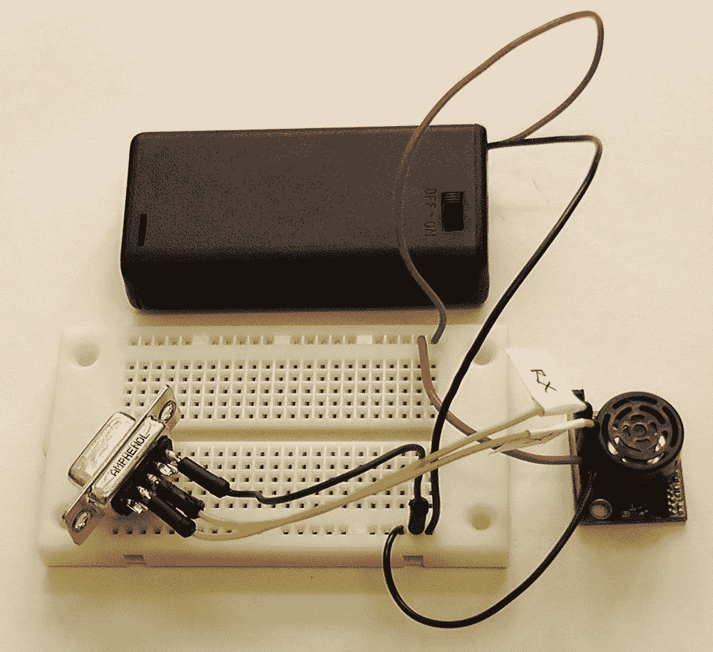

**图 4-14.** 连接 EZ1 传感器、线缆和电池组

现在硬件部分已经完成，让我们看看在软件方面需要做些什么。查看数据手册，我们发现传感器的输出是一个 ASCII 大写字母 `"R"`，后面跟着三个表示距离（以英寸为单位，最大 255）的 ASCII 数字字符，最后是一个回车符（ASCII 字符 13），消息总长度为 5 个字节。

我们之前已经编写了能够完美处理此类输出的软件，即第 2 章中的 `SerialConsole` 应用程序。将您的 `Redpark` 线缆连接到母头 `DB9` 连接器，再连接到您的 `iPhone`，然后运行 `SerialConsole` 应用程序。您应该会看到类似于图 4-15 的画面。

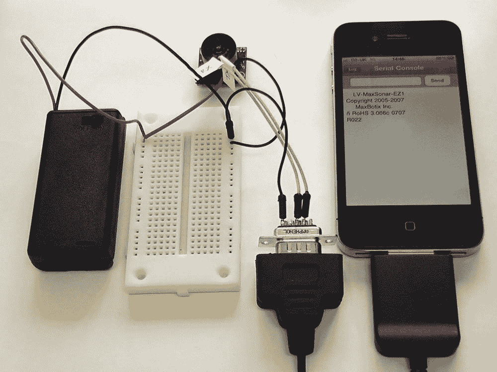

**图 4-15.** SerialConsole 应用程序中 EZ1 的输出

您会发现数据手册并不完全准确；传感器首次通电时会显示一条版权声明。幸好我们检查了一下。如果您在文本输入小部件中键入一些内容并点击发送，您将在控制台视图中看到另一个读数出现（请参见图 4-16）。

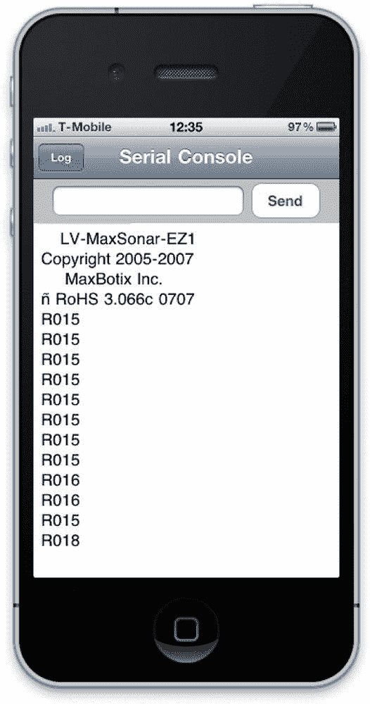

**图 4-16.** SerialConsole 应用程序显示来自 EZ1 的多个读数

从这里开始，修改我们现有的 `readBytesAvailable:` 方法以查找与 `EZ1` 的 `RS-232` 接口距离读数格式匹配的字符串，就成了一项相对简单的工作。

