# 第 5 章 连接至 XBee 网络

iPhone、iPod touch 和 iPad 的所有版本都配备了 WiFi 网络功能，或者更正式地称为 IEEE 802.11。这是一套用于在 2.4、3.6 和 5 GHz 频段实现无线局域网 (WLAN) 计算机通信的标准，尽管现有基于 iOS 的设备仅支持 2.4 GHz 频段。

然而，还有许多其他无线通信标准，其中许多也使用 2.4 GHz 频段，但它们旨在用于其他目的，因此设计方式不同。它们可能使用相同的波长频段，但协议却大相径庭。

处理传感器网络时最常用的协议之一是 IEEE 802.15.4。与 IEEE 802.11 相比，该协议专注于设备间的低成本、低速通信，并适用于低功耗场景。它是更高级别的 ZigBee 协议的基础，在处理传感器网络时也同样常见；ZigBee 通过开发上层协议以支持设备间的网状网络，进一步扩展了该标准。

虽然存在许多其他基于 802.15.4 的硬件频段，但最广泛使用的可能还是 XBee 品牌无线电模块。它们被普遍使用，无论是用于原型设计的专业人士，还是在爱好者市场中，都因其对初学者特别友好而广受欢迎。出于这个原因及其他考虑，我将重点关注由 [Digi International](http://www.digi.com/) 生产的 XBee 品牌无线电模块。


## XBee 模块

Digi 公司生产了一系列令人眼花缭乱的 XBee 品牌无线电模块；粗略统计显示，至少有 30 种不同的硬件、固件和天线组合，并且这个数字只会越来越大。不幸的是，面对日益增多的 XBee 品牌无线电模块，人们很容易感到困惑。

有两种引脚兼容的 XBee 模块。Series 1 模块适用于点对点和点对多点应用，而 Series 2 模块则适用于需要网状网络的应用。在本章中，我将使用 Series 1 无线电模块（见图 5-1）。

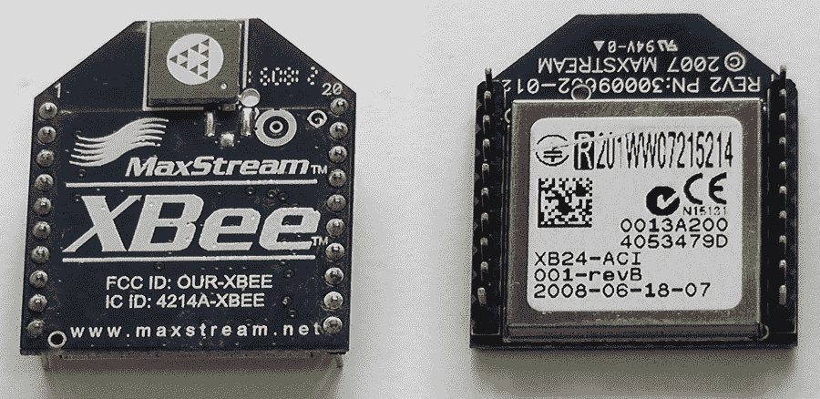

图 5-1. 带芯片天线的 XBee Series 1 模块

我使用 Series 1 无线电模块，主要是因为它们对初学者来说非常易于使用和配置，而且或许更重要的是，它们很容易买到。你可以从多家供应商那里买到 Series 1 无线电模块，包括 SparkFun，它提供种类繁多的模块（见 [`www.sparkfun.com/categories/111`](http://www.sparkfun.com/categories/111)）。尽管其展示的种类令人眼花缭乱，但仍未涵盖所有型号。你也可以从 Maker Shed 购买这些无线电模块（[`www.makershed.com/ProductDetails.asp?ProductCode=MKAD14`](http://www.makershed.com/ProductDetails.asp?ProductCode=MKAD14)）。

### Series 1 还是 Series 2？

在处理 XBee 模块时，一个常见的误解是认为 Series 2 模块比 Series 1 模块“更好”。事实并非如此。实际上，这两种类型是为不同的用途而设计的。Series 1 模块深受爱好者市场的欢迎，非常适合直接替代线缆或用于小型网络。Series 2 模块则实现了完整的 ZigBee 协议，适用于较大的网络。

#### 警告

虽然 XBee Series 1 和 XBee Series 2 模块具有相同的尺寸且引脚完全兼容，但它们的芯片组不同，运行的协议也不同，因此它们在无线通信上并不兼容。你不能在同一个无线网络中混合使用 Series 1 和 Series 2 模块。

Series 1 模块开箱即可用于点对点通信（即替代线缆），无需任何配置，这也是我们在本章中使用它们的方式。因此，如果你是刚开始接触无线网络，我建议你从 Series 1 无线电模块开始。

如果你对构建基于 XBee 的更大网络感兴趣，可以看看 Robert Faludi 所著的《构建无线传感器网络》（O'Reilly 出版）。虽然那本书专门使用了 Series 2 模块，但它对你了解 Series 1 网络也有帮助，因为 Series 1 的命令在很大程度上只是 Series 2 命令集的一个子集。Tom Igoe 在《让物体说话》（O'Reilly 出版）中也有几个有趣的项目用到了我在本章中提到的 Series 1 模块。

### 普通版还是 Pro 版？

Series 1 和 Series 2 模块都有两种版本：普通版和 Pro 版。Pro 版模块尺寸稍大，不过尽管如此，它们仍然引脚兼容，但功耗更高。然而最关键的是，它们的通信距离要远得多。可以预见的是，它们的价格也高得多，所以除非你需要它们提供的更远通信距离，否则坚持使用普通版 XBee 模块即可。由于它们引脚兼容，如果你后来决定需要更远的通信距离（并且能承受更高的功耗），随时可以在你的项目中换用 Pro 版。

### 802.15.4 还是 ZigBee？

关于这两种 XBee 协议存在很多混淆。Series 1 模块使用 IEEE 802.15.4 标准协议，支持点对点和点对多点网络，不过它们也有一个专有的网状网络协议。Series 2 模块使用 ZigBee 协议，这是一种基于 802.15.4 协议构建的网状网络标准，该协议不仅限于 XBee 无线电模块，还被许多其他硬件所使用。

### 选择哪种天线？

有四种不同类型的天线可供选择：芯片天线、线状天线、UFL 天线和 RP-SMA 天线。芯片天线和线状天线预装在无线电模块上；而 UFL 和 RP-SMA 版本发货时仅在板上带有连接器，你需要购买带有相应连接器的合适天线才能让它们工作。除非你打算将项目封装在盒子中，此时使用 UFL 或 RP-SMA 天线将天线安装在盒子外部可能是个好主意，或者你需要它们提供的高功率传输性能，否则坚持使用芯片天线或线状天线就足够安全了。

## 如何配置 XBee Series 1 无线电模块

要配置 XBee 模块，我们需要能够与其通信。通常，我们会使用你的 Mac 来配置 XBee，当然我们也可以编写 iPhone 或 iPad 应用程序来实现配置。不过目前，我们需要找到一种方法将 XBee 连接到你的 Mac 的 USB 端口。

由于 XBee 模块设计为直接焊接到 PCB 上，因此它们遗憾地使用了 2 毫米间距的排针，而不是我们更熟悉的 0.1 英寸间距排针。因此，它们通常需要某种转接板才能在标准面包板或原型板上使用，还需要一个适配器才能连接到你的 Mac。

市场上有多种转接板。通常，你只需要一个能将 XBee 引脚转接到标准 0.1 英寸排针的简单板子，比如 SparkFun 的 [XBee 模块转接板](http://www.sparkfun.com/products/8276)。

要将 XBee 连接到你的电脑，你需要一个更复杂的板子，它负责将输入电压调节到模块所需的 3.3V、进行信号调理并提供基本的活动指示 LED 灯。同样，这类产品在市场上有很多，比如 SparkFun 的 [XBee Explorer Regulated](http://www.sparkfun.com/products/9132) 和 Adafruit 的 [XBee 适配器套件](http://www.adafruit.com/products/126)。见图 5-2。

甚至还有允许你将 XBee 直接插入 Mac USB 端口的板子，比如 SparkFun 的 [XBee Explorer Dongle](http://www.sparkfun.com/products/9819)；再次参见图 5-2。

### 注意

几乎所有的 XBee USB 适配器都需要 [FTDI 的驱动程序](http://www.ftdichip.com/Drivers/VCP.htm)。在使用适配器之前，请确保你已经安装了这些驱动程序。如果你有一块较旧的 Arduino 板，由于 Uno 之前的板子使用了相同的 USB 芯片组，你可能已经安装了正确的驱动程序。

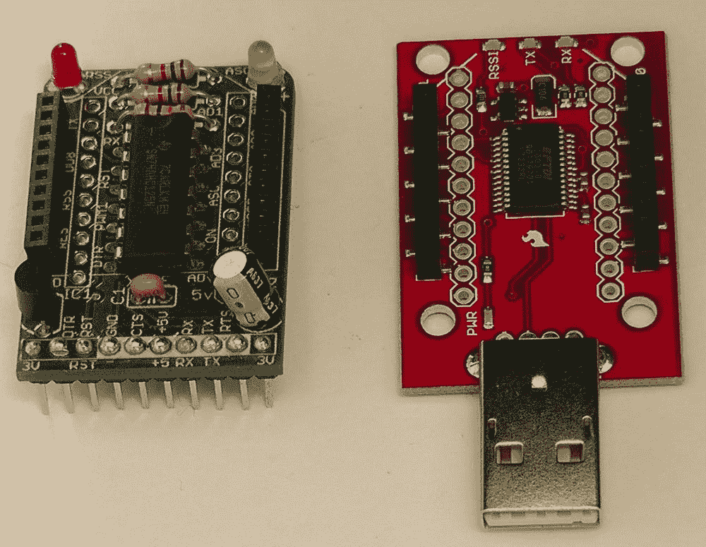

图 5-2. Adafruit XBee 适配器（左）和 SparkFun XBee Explorer（右）


## 将 XBee 连接到你的 Mac

由于我手头恰好有几个闲置的，我打算使用 Adafruit 的扩展板，这款扩展板在[Maker Shed](http://www.makershed.com/ProductDetails.asp?ProductCode=MKAD13)也有售。它的设计是与 FTDI 线缆配合使用的（参见图 5-3），正因如此，它也可以轻松与面包板配合使用，将 XBee 连接到 Arduino，这样我就不需要单独的转接板了。

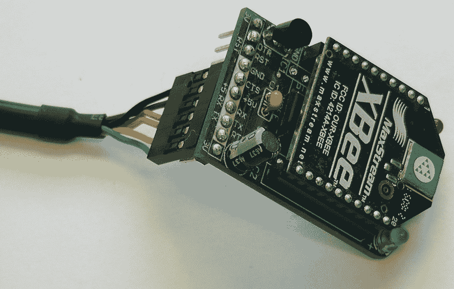

图 5-3. 安装在 Adafruit 适配器套件上的 XBee 模块，连接 FTDI 线缆用于编程

虽然 Digi 自己的配置工具 X-CTU 可以免费获取，但它仅支持 Windows 系统。除非你在 BootCamp 或虚拟机中运行 Windows，否则无法使用它。幸运的是，只需偶尔用它来更新 XBee 模块的固件。对于配置无线电模块，我们通常只需要一个终端程序即可。

### 注意

Mac OS X 系统上有很多终端程序可用。我将使用[Roger Meier 开发的 CoolTerm](http://freeware.the-meiers.org/)。这是一个相对简单的应用程序，非常适合用来配置你的 XBee 无线电模块。

将你的 XBee 无线电模块插入适配器板，然后将板子连接到你的 Mac。如果你像我一样使用 Adafruit 的板子，你应该会看到板子上的绿色（ASC）LED 灯开始闪烁。

打开你的终端应用程序，并确保它设置到了正确的串行端口。你可以通过命令行找出可用的串行端口：

```
% ls /dev/tty.*
crw-rw-rw-  1 root  wheel   11,   2  8 Jul 09:01 /dev/tty.Bluetooth-Modem
crw-rw-rw-  1 root  wheel   11,   0  8 Jul 09:01 /dev/tty.Bluetooth-PDA-Sync
crw-rw-rw-  1 root  wheel   11,  66  3 Aug 14:15 /dev/tty.usbserial-FTE4XVKD
```

XBee 模块正确的端口（至少通常来说）应该相当明显。在我的例子中，它是`/dev/tty.usbserial-FTE4XVKD`。如果你使用的是 CoolTerm，你可以通过点击工具栏中的 Options 按钮来更改连接的串行端口（参见图 5-4）。

### 注意

默认情况下，CoolTerm 的本地回显是关闭的。你可能需要在 Options 菜单中启用此功能，以便操作更轻松。如果它被关闭，你将看不到自己输入的内容，只会显示 XBee 无线电模块的响应。

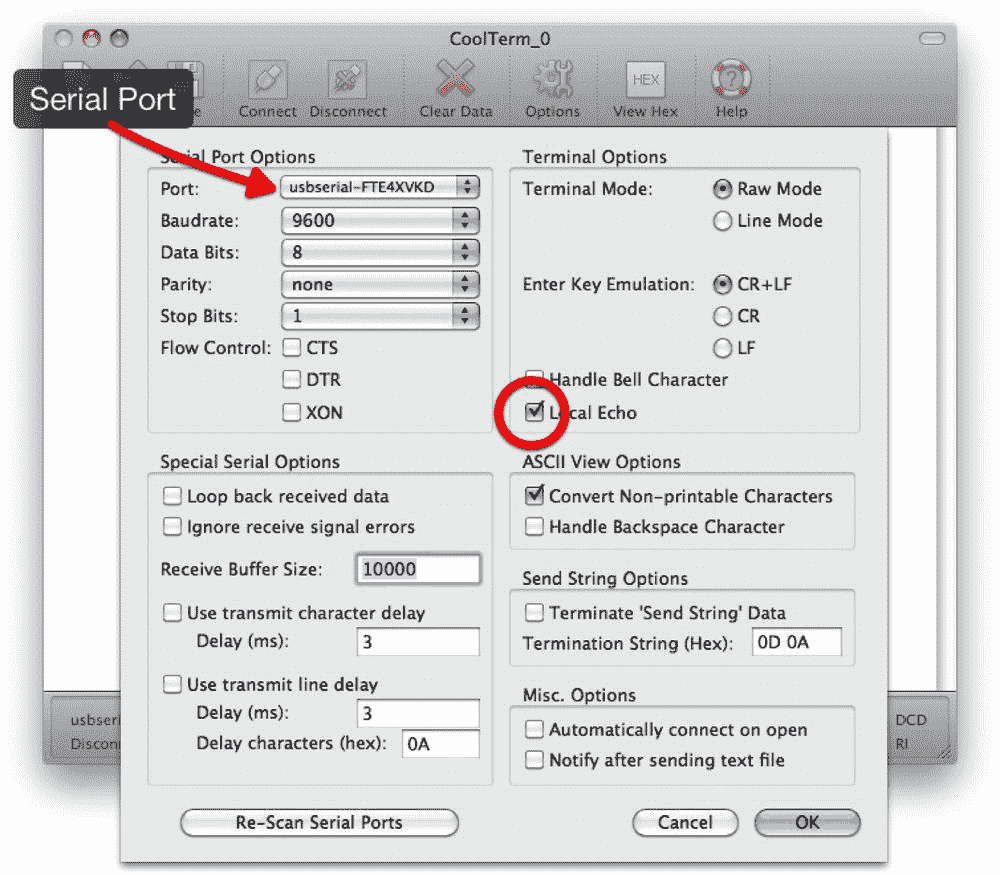

图 5-4. 在 CoolTerm 选项中配置端口和本地回显

如果你的终端程序默认设置不是这样，请将其设置为使用 9600 波特率和 8-N-1，且无流控制。

一旦你确认终端程序设置正确，就将其连接到选定的串行端口。在 CoolTerm 中，你只需点击工具栏中的 Connect 按钮即可完成此操作。此时，在主窗口中输入`+++`（快速连续输入三个加号）。如果一切连接正确，你应该会从 XBee 无线电模块收到一个`OK`响应（参见图 5-5）。

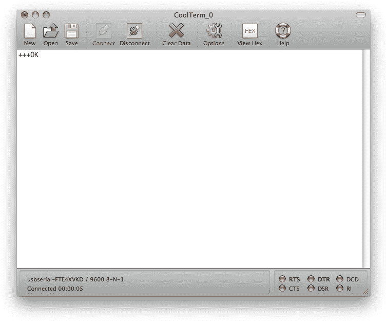

图 5-5. XBee 无线电模块已正确连接到你的 Mac

通过输入这三个加号，我们已将 XBee 置于配置模式。此时我们可以向模块发送`AT`命令，以便配置无线电模块。过一会儿，XBee 会超时并返回到直通连接模式。如果在配置过程中发生这种情况，只需再次输入`+++`，它就会重新开始响应。

XBee 的基本配置包括：串行通信的波特率、网络标识符（PAN）、节点地址（MY）以及目标节点地址（DL）。

## XBee 寻址

802.15.4 协议使用寻址来区分不同的无线电模块，并防止数据包重复。每个模块拥有唯一的源地址（MY）非常重要，这样可以防止非重复消息因被误判为重复而被忽略。

模块之间存在两种基本的寻址形式：广播和单播。广播消息是指定 PAN 上所有模块都会接收到的消息。该消息仅发送一次且不会重发，因此无法保证任何特定节点能接收到该消息。要发送广播消息，请将目标节点地址（DL）设置为`0xFFFF`。通过这些设置，所有在广播节点范围内的 XBee 模块都将收到该消息。

单播消息更可靠。它根据模块的寻址方式从一个模块发送到另一个模块。如果消息被正确接收，接收方的无线电模块将发回一个确认（或 ACK）。如果发送模块未收到 ACK，它将尝试 MAC 层重试，每次传输重试三次，总共尝试四次，直到收到 ACK。这大大提高了数据到达目的地的概率。要发送单播消息，请将目标节点地址（DL）设置为你希望通信的节点的节点地址（MY）。


## 配置两个 XBee 无线电模块

现在我们将配置两个 XBee 无线电模块，将其作为直连电缆的替代方案。换言之，第一个模块将配置为向第二个模块发送消息，反之亦然。

按照上一节的方法，将两个无线电模块中的第一个插入你的 Mac，并通过终端程序向相应的串口发送 `+++`，使其进入命令模式。

我们需要做的第一件事是设置波特率。在配置模式下输入 `ATBD`。你应该会返回一个 0 到 7 之间的数字，如下所示：

```
ATBD
```

该数字表示无线电模块当前设置为 9600 波特。我们暂时保留 9600 波特。不过，如果你希望设置不同的波特率，可以输入命令 `ATDB n`，其中 `n` 是一个值，对应表 5-1 中你想要的波特率。

**表 5-1. ATBD 命令返回的值及对应波特率**

| ATBD 值 | 波特率 |
| --- | --- |
| 0 | 1200 |
| 1 | 2400 |
| 2 | 4800 |
| 3 | 9600 |
| 4 | 19200 |
| 5 | 38400 |
| 6 | 57600 |
| 7 | 115200 |

因此，例如要将模块设置为 57600 波特，我们可以输入命令 `ATBD6`：

```
ATBD6
OK
```

然后，我们可以再次输入 `ATBD` 命令，检查波特率是否已设置。这次应该返回六：

```
ATBD
```

设置完波特率后，我们需要继续使用 `ATID` 命令设置 PAN ID，使用 `ATMY` 命令设置节点地址，并使用 `ATDL` 命令设置目标节点地址。最后，我们需要通过写入命令 `ATWR` 来提交更改，以保存设置。

因此，对于两个模块中的第一个，我们应该输入以下命令：

```
+++
ATBD 3
ATID 1111
ATMY 2345
ATDL 7890
ATWR
```

在所有情况下，你都应该从调制解调器收到 `OK` 响应。你可能希望沿途检查这些值；例如，参见图 5-6。

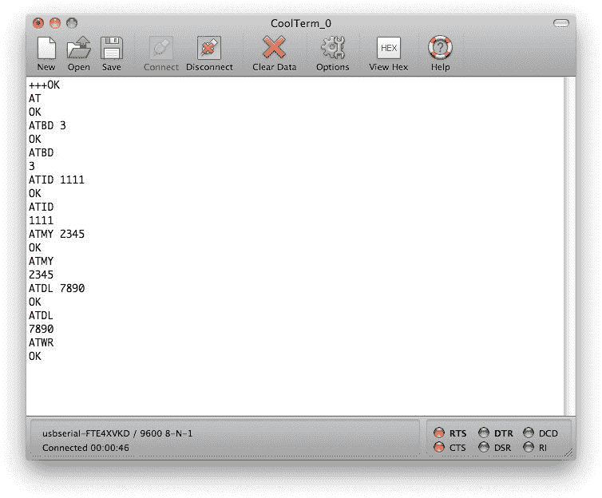

**图 5-6. 配置两个 XBee 模块中的第一个**

配置完第一个模块后，断开串口连接，并从适配器上拔下 XBee 模块。然后将第二个模块插入适配器，连接到相应的串口，并输入以下命令：

```
+++
ATBD 3
ATID 1111
ATMY 7890
ATDL 2345
ATWR
```

这将第二个模块配置为第一个模块的目标，反之亦然。参见表 5-2。

**表 5-2. 无线电模块配置**

| 无线电模块 | PAN | MY | DL |
| --- | --- | --- | --- |
| 1 | 1111 | 2345 | 7890 |
| 2 | 1111 | 7890 | 2345 |

配置完第二个模块后将其拔下。我们稍后再回来处理 XBee 模块。不过，既然已经配置完成，我们现在就继续测试连接，将一个模块连接到 Arduino，另一个连接到我们的 Mac。

## 将 XBee 连接到 Arduino

实际上，你可以直接利用 Arduino 板上的 3.3V 引脚为 XBee 模块提供稳压电源，从而将其直接连接到 Arduino。参见图 5-7。

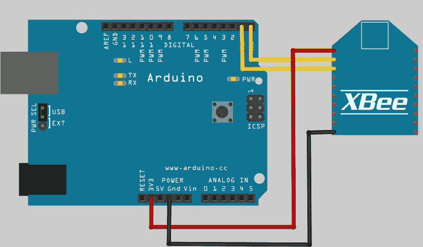

**图 5-7. 将 XBee 连接到 Arduino**

不过，如果你使用转接板或合适的适配器板（例如我们之前用来将 XBee 连接到 Mac 的 Adafruit 板），会容易得多（参见图 5-8）。

或者，如果你要大量使用 XBee 模块，可以考虑购买一个 Arduino Fio 板（参见图 5-9），这是一块带有 XBee 插座的 Arduino 板。你可以从 [SparkFun 购买 Arduino Fio](http://www.sparkfun.com/products/9712)。

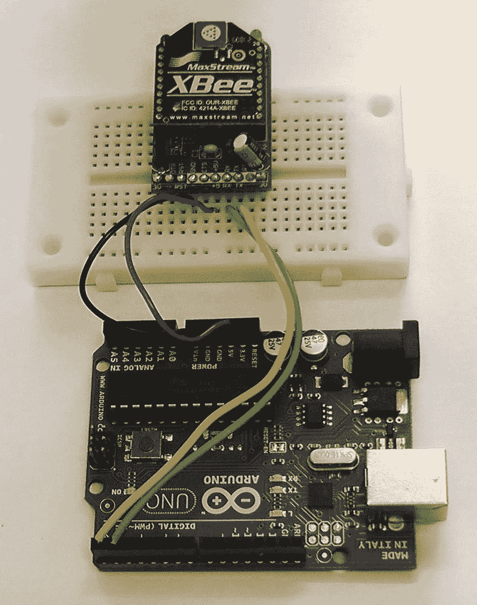

**图 5-8. 连接在一起的 Arduino Uno 和 Adafruit XBee 适配器**

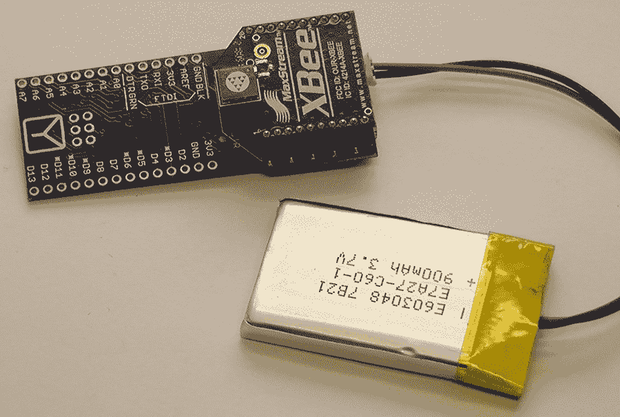

**图 5-9. 连接了 LiPo 电池的 Arduino Fio 与 XBee**

我们将使用在第 1 章中用到的那段简单草图，将 "Hello World" 打印到串口。将 Arduino 板连接到你的 Mac，并上传以下草图：

```
void setup() {
  Serial.begin(9600);
}

void loop() {
  while (Serial.available() <= 0) {
    Serial.println("Hello world");
    delay(300);
  }
}
```

#### 警告

如果 XBee 或其他硬件连接到引脚 0（RX）和 1（TX），你将无法将草图从 Mac 上传到开发板，因为这会干扰来自 Mac 的 USB 串口连接。因此，在上传草图之前，必须先从 Arduino 板上断开 XBee 模块。

断开 Arduino 板与 Mac 的连接，并将其连接到外部电源。

完成此操作后，将一个 XBee 模块连接到你的 Mac，并再次打开 CoolTerm 应用程序。连接到相应的串口，以便查看模块的输出。

然后，将另一个模块连接到你的 Arduino 板上，如图 5-8 所示，并为其供电。你应该会在终端程序中看到与图 5-10

**图 5-10. Arduino 通过 XBee 连接输出“Hello World”**

## 将 XBee 连接到 iOS 设备

既然我们已经在 Arduino 板和 Mac 之间完成了测试，那么要在 Arduino 板和 iPhone 之间做同样的事情，需要做些什么呢？


### XBee 转 RS-232 串行接口

我们首先需要一个 RS-232 适配器。幸运的是，SparkFun 出售 [XBee Explorer Serial](http://www.sparkfun.com/products/9111)，售价 29.95 美元（参见 图 5-11）。

据我所知，目前市场上没有其他同样容易买到的适配器；不过，如果你不想购买 SparkFun 的适配器，用我们之前一直使用的 RS-232 转 TTL 串行适配器在面包板上搭建一个适配器也应该是相当容易的。

但是，如果你这样做，请记住 XBee 模块的工作电压是 3.3 V，而 Redpark 线缆的工作电压是 5 V。你需要在 XBee 模块的 3.3 V RX 和 TX 引脚与 TTL 串行适配器的 5 V 引脚之间添加一个电压电平转换器。

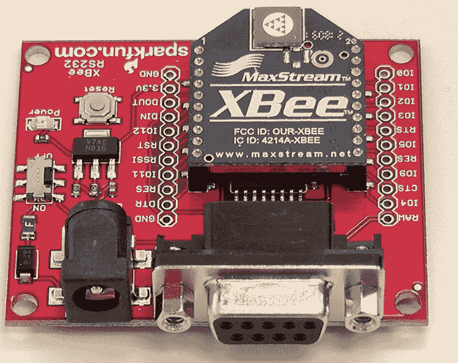

图 5-11. SparkFun XBee Explorer Serial 串行接口

接下来，拔掉原来连接到 Mac 的 XBee 模块，并将其插入串行适配器。然后将串行适配器插入 Redpark 线缆，再将线缆插入你的 iPhone。连接电源并打开电源；你应该会看到类似 图 5-12 的样子。

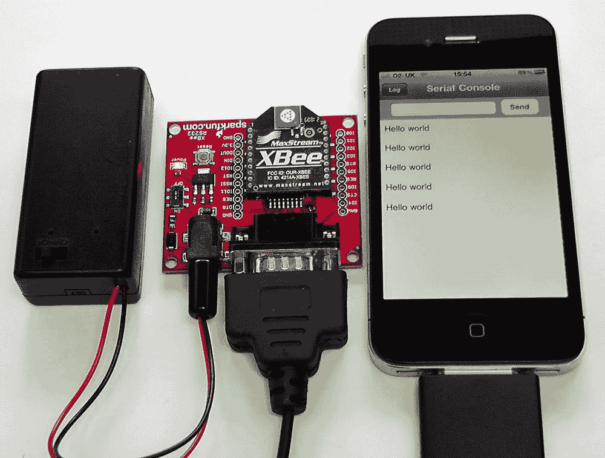

图 5-12. 一切连接并正常工作

恭喜你，你已经成功通过 XBee 串行直通连接，将你的 Arduino 和 iPhone 连接起来了。

### 进一步探索

此时，一个相当简单的练习是获取上一章中的声纳示例，并用 XBee 替代直接线缆连接。无需任何软件更改，只需更改硬件。将下面的 图 5-13 与上一章的 图 4-9 进行比较。

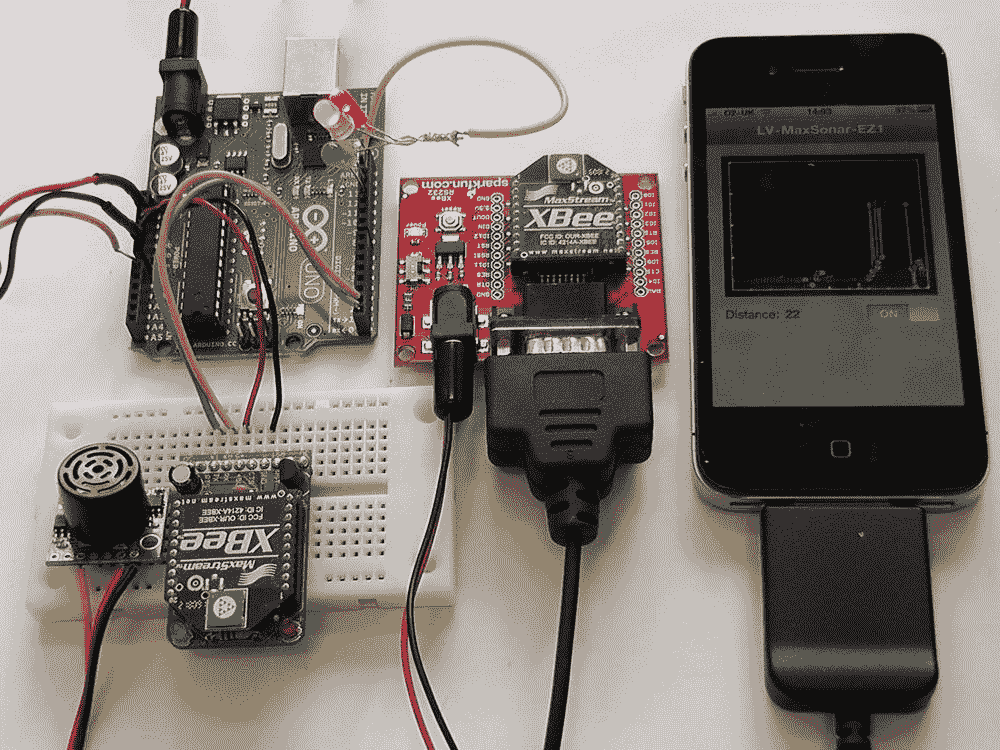

图 5-13. 使用 XBee 模块连接第 4 章中的 EZ1 示例

如果一切顺利，你应该会看到与上一章完全相同的效果。

