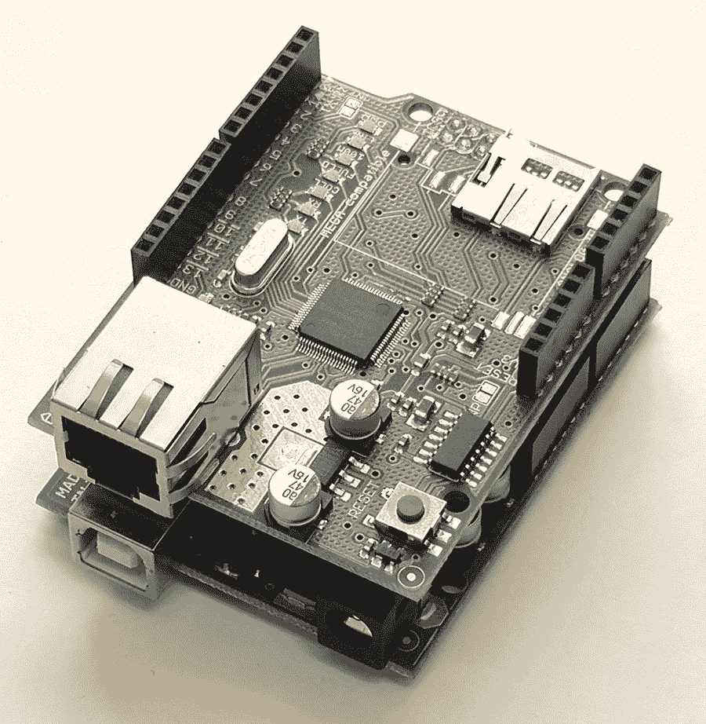
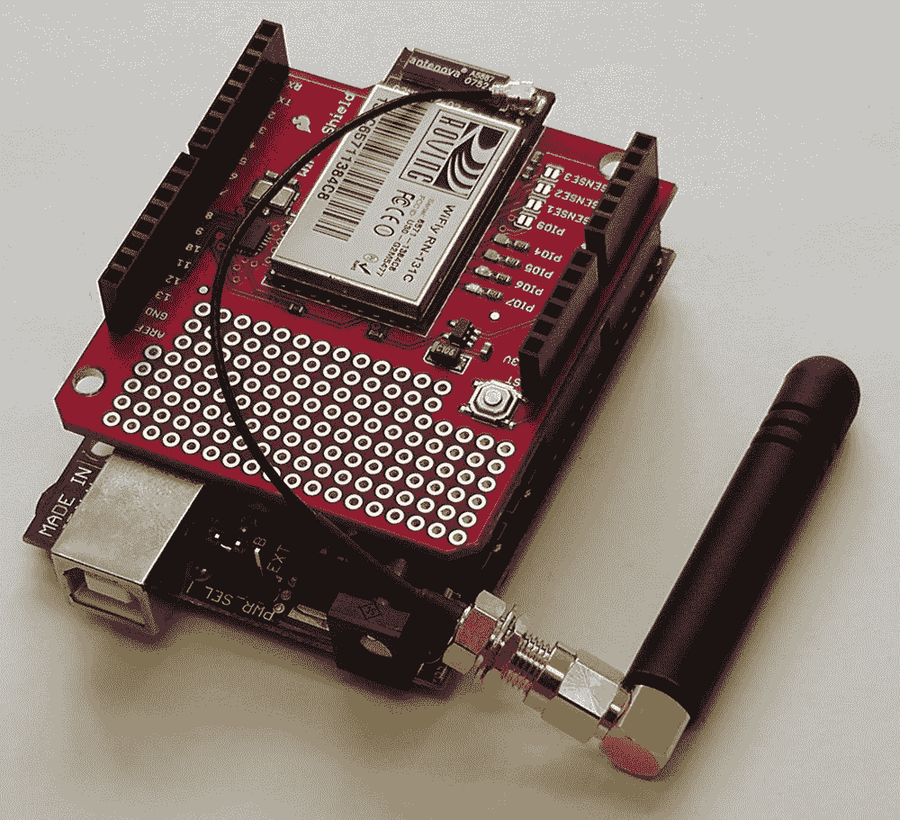
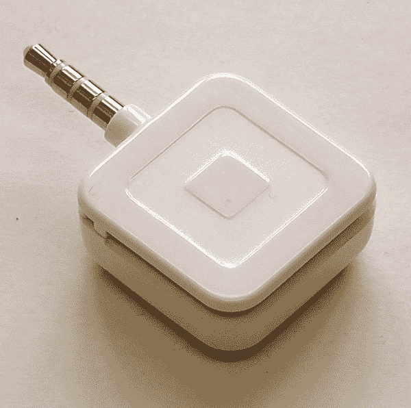
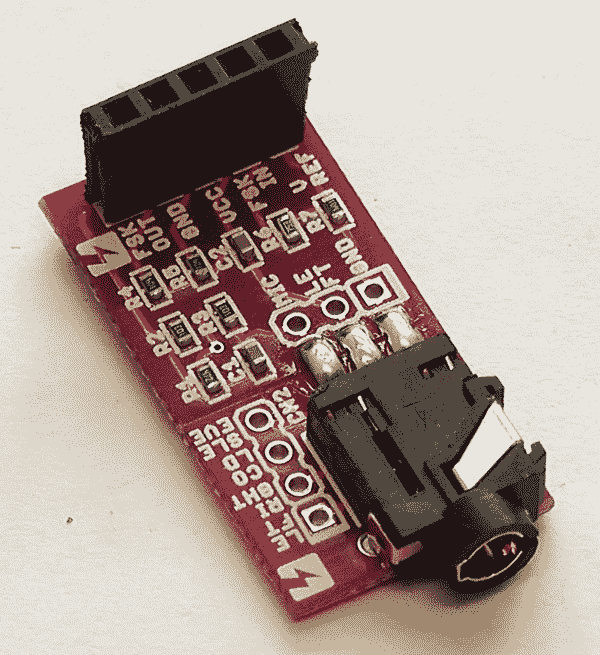
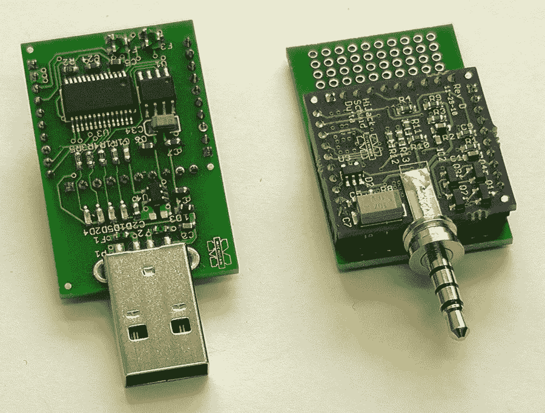
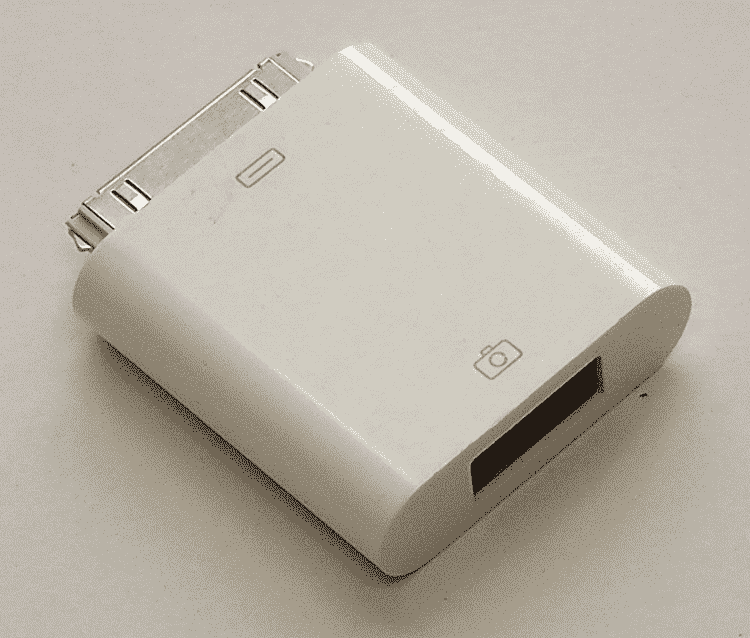
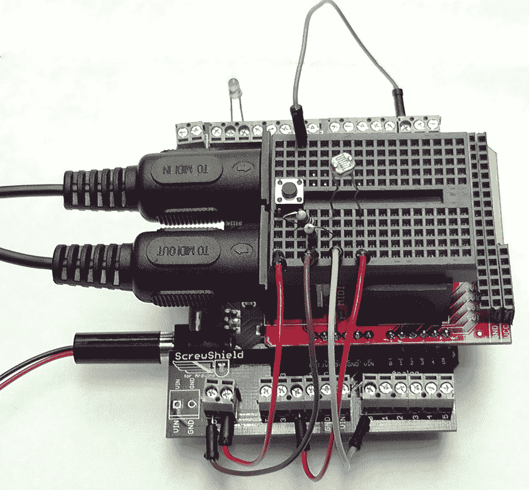
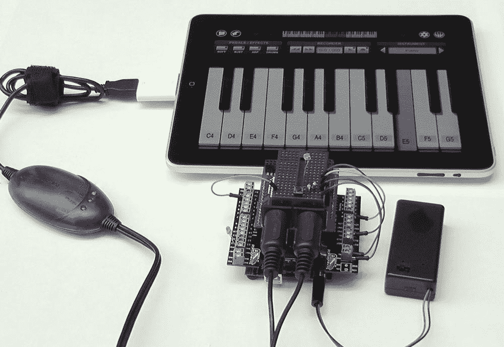

# 第 6 章. 其他连接方式

本书大部分内容都在讨论 Redpark 串行线缆，因为这是将外部硬件直接连接到 iPhone 或 iPad 的最简单方法。然而，在 Redpark 线缆出现之前，我们必须更具创造性，在本章中，我将介绍一些将外部硬件连接到 iOS 设备的其他方法。

## 使用网络

我之前没有过多讨论网络，但众所周知，无处不在的数据可用性改变了一切。如果我们可以将传感器或其他硬件连接到互联网，使其成为物联网的一部分，那么我们的 iPhone（或 iPad）就已经具备了与之通信的能力。

### 使用以太网

将任意传感器硬件连接到互联网的最简单方法（到了这个阶段可能相当可预测）是使用 Arduino。有几种方法可以实现这一点，但如果你有一个静态传感器平台，最简单的方法可能是使用有线以太网。参见 图 6-1。

### 注意

Arduino 扩展板是一种可以插在 Arduino PCB 顶部的电路板，用于扩展其功能。它可能会使用部分或全部 Arduino 引脚。但是，未使用的引脚通常会直通引出，供其他用途使用。参见 [`shieldlist.org/`](http://shieldlist.org/) 以获取许多 Arduino 扩展板的引脚使用情况列表。

你可以从多家供应商处购买官方的 Arduino Ethernet Shield，包括 [Maker Shed](http://www.makershed.com/ProductDetails.asp?ProductCode=MKSP7) 和 [SparkFun](http://www.sparkfun.com/products/9026)。



图 6-1. Arduino Ethershield（顶部）和 Arduino Uno（底部）

一旦你将 Ethernet Shield 连接到 Arduino，并将扩展板插入网络，就可以相当容易地搭建一个简单的 web 客户端。下面的代码建立了一个网络连接，然后对“Arduino”一词执行 Google 搜索，并将请求返回的页面发送到串行连接：

```
#include <Ethernet.h>

byte mac[] = { 0xDE, 0xAD, 0xBE, 0xEF, 0xFE, 0xED };
byte ip[] = { 144,173,229,19 };
byte server[] = { 64, 233, 187, 99 }; // Google

Client client(server, 80);

void setup()
{
  Ethernet.begin(mac, ip);
  Serial.begin(9600);

delay(1000);

Serial.println("connecting...");

if (client.connect()) {
    Serial.println("connected");
    client.println("GET /search?q=arduino HTTP/1.0");
    client.println();
  } else {
    Serial.println("connection failed");
  }
}

void loop()
{
  if (client.available()) {
    char c = client.read();
    Serial.print(c);
  }

if (!client.connected()) {
    Serial.println();
    Serial.println("disconnecting.");
    client.stop();
    for(;;)
      ;
  }
}
```


Arduino Ethernet 库要求你为 Ethernet Shield 定义一个 MAC 地址。这通常由制造商完成，大多数系统管理员不会喜欢你试图为 Arduino 提供一个随机 MAC 的做法。如果你打算将 Arduino + Ethernet Shield 连接到一个你不直接控制的网络，你应该事先咨询你的系统管理员。


官方 Ethernet 库的另一个问题是它尚不支持 DHCP，因此你必须为你的草图提供一个静态 IP 地址。同样，这可能是你的系统管理员有异议的问题，因为大多数现代网络都使用 DHCP 来动态分配 IP 地址。如果你将 Arduino 连接到一个你不直接控制的网络，你应该再次事先咨询你的系统管理员。

你可以使用 Arduino 开发环境提供的串行控制台，或者我们之前在本书中编写的 `SerialConsole` 应用程序，来查看此草图返回的结果。

**如何生成 MAC 地址？**

介质访问控制（MAC）地址的目的是区分网络上的物理设备。你网络上的每个设备都必须具有唯一的 MAC 地址，通常联网设备的 MAC 地址由制造商嵌入其固件中，是半唯一的。但是，在这种情况下，你就是制造商，而你的草图（实际上）就是你正在创建的嵌入式设备的固件。因此，你需要为设备提供 MAC 地址。

MAC 地址的前 6 个八位字节对设备制造商来说是唯一的；IEEE 负责管理这些地址的分配。但是，你可以在代码中分配一个本地管理的地址。

MAC 地址的第一个八位字节中有两个位用于定义 MAC 地址的某些方面。MAC 地址第一个八位字节的最低有效位是单播/组播（I/G）地址位，而次最低有效位是全局或本地（U/L）管理地址位。


I/G 位用于指示目标 MAC 地址是**单播地址**还是**多播地址**。如果该位设置为 0，则为单播地址。如果该位设置为 1，则为多播地址。在分配本地管理地址时，应将此位设置为 0。

U/L 位用于指示 MAC 地址是固化地址（BIA）还是**本地管理地址**。当该位设置为 1 时，该 MAC 地址被识别为本地管理地址。

因此，有四组本地管理地址可以在你的网络上使用而无需担心冲突，假设没有其他开发者使用它们。这些地址是 `X2:XX:XX:XX:XX:XX`、`X6:XX:XX:XX:XX:XX`、`XA:XX:XX:XX:XX:XX` 和 `XE:XX:XX:XX:XX:XX`（其中 `X` 应替换为适当的十六进制值）。

IEEE 分配的 MAC 地址块的完整列表可在 [`standards.ieee.org/develop/regauth/oui/oui.txt`](http://standards.ieee.org/develop/regauth/oui/oui.txt) 中找到。

或许更有用的是，这里有一个如何构建一个简单 web 服务器的示例，该服务器向请求的客户端返回一个简短的 HTML 文档：

```cpp
#include <Ethernet.h>

#define HTTP_HEADER "HTTP/1.0 200 OK\r\nServer: arduino\r\nContent-Type: text/html\r\n\r\n"

int LED = 9;

// network configuration.  gateway and subnet are optional.
byte mac[] = { 0xDE, 0xAD, 0xBE, 0xEF, 0xFE, 0xED };
byte ip[] = { 192, 168, 1, 99 };
byte gateway[] = { 192, 168, 1, 1 };
byte subnet[] = { 255, 255, 255, 0 };

Server server = Server(8080);

void setup()
{
  // sets the digital pin as output
   pinMode(LED, OUTPUT);

// Start talking to the serial port
  Serial.begin(9600);
  Serial.println( "Start setup()");

// initialize the ethernet device
  Serial.println("Ethernet.begin()");
  Ethernet.begin(mac, ip, gateway, subnet );

// start listening for clients
  Serial.println("server.begin()");
  server.begin();

// Flash the LED twice
  digitalWrite(LED, HIGH);
  delay(1000);
  digitalWrite(LED, LOW);
  delay(1000);
  digitalWrite(LED, HIGH);
  delay(1000);
  digitalWrite(LED, LOW);

Serial.println( "Done setup()\n");

}

void loop(){
  Client client = server.available();
  if (client) {

Serial.println("Connection from client");
    boolean current_line_is_blank = true;
    while (client.connected()) {
      digitalWrite(LED, HIGH);
      if (client.available()) {
        char c = client.read();
        Serial.print(c);

if (c == '\n' && current_line_is_blank) {
          client.println( HTTP_HEADER );
          client.println();
          Serial.println("Sent header");

client.println("<html><head><title>Test</title></head><body>");
          client.println("<p>Test String</p>");
          client.println("</body></html>");
          Serial.println("Sent page");
          break;
        }
        if (c == '\n') {
          current_line_is_blank = true;
        } else if (c != '\r') {
          current_line_is_blank = false;
        }
      }
    }
    client.stop();
    Serial.println("Closed client connection\n");
    digitalWrite(LED, LOW);

}
}
```


HTTP 请求以空行结束。我们在此处查找它，以便找到请求数据包的结尾。如果我们已经到达该行的末尾（接收到换行字符）并且该行为空，则 HTTP 请求已结束，我们现在可以发送回复。


我们发送标准的 HTTP HEADER 响应。这与 HTML `<HEAD>` 块不同，而是所有 web 服务器在发送请求的 HTML 页面之前返回的单独标头。

虽然实现一个 web 服务器相对简单，但你也可以考虑使用 `Webduino` 库。这是一个用于 Arduino 的通用 web 服务器库，可在 [`github.com/sirleech/Webduino`](https://github.com/sirleech/Webduino) 找到。它支持 URL 参数解析、处理 GET 和 POST 方法、Web 表单和图像，以及 JSON，并且重要的是，开箱即用支持 RESTful 接口。

下面的代码使用通用库重新实现了我们的简单 web 服务器：

```cpp
#include "SPI.h"
#include "Ethernet.h"
#include "WebServer.h"

static uint8_t mac[] = { 0xDE, 0xAD, 0xBE, 0xEF, 0xFE, 0xED };
static uint8_t ip[] = { 192, 168, 1, 99 };

#define PREFIX "/"
WebServer webserver(PREFIX, 80);

void helloCmd(WebServer &server, WebServer::ConnectionType type, char *, bool) {
  server.httpSuccess();
  if (type != WebServer::HEAD){
    P(helloMsg) = "<html><head><title>Test</title></head><body><p>Test String</p><body></html>";
    server.printP(helloMsg);
  }
}

void setup() {
  Ethernet.begin(mac, ip);
  webserver.setDefaultCommand(&helloCmd);
  webserver.addCommand("index.html", &helloCmd);
  webserver.begin();
}

void loop() {
  char buff[64];
  int len = 64;
  webserver.processConnection(buff, &len);
}
```

现在我们有了一个 web 服务器，相对简单地提供一个 RESTful 接口，返回一个包含当前传感器读数的静态 JSON 片段就变得可行了。解析此类文档是大多数 iPhone 应用的生命线，对于大多数人来说也将很熟悉。我不打算在此详述，但我在 *[Learning iPhone Programming](http://oreilly.com/catalog/9780596806439/)* 中做了深入讨论。

## 解析 JSON

JSON 是一种轻量级的数据交换格式，几乎人类可读，同时仍然易于机器解析。虽然 XML 面向文档，但 JSON 面向数据。如果你需要传输高度结构化的数据，应该使用 XML 来呈现它。然而，如果你的数据交换需求不那么苛刻，JSON 可能是一个不错的选择。

JSON 相比于 XML 的明显优势在于，由于它面向数据并且（几乎）可以作为哈希映射来解析，因此不需要重量级的解析库。此外，JSON 文档比等效的 XML 文档小得多。在带宽有限的情况下，例如在 iPhone 上可能会遇到的情况，这可能非常重要。传输相同数据时，JSON 文档通常消耗大约相当于等效 XML 文档一半的带宽。

虽然 Cocoa Touch 框架本身不支持 JSON，但 Stig Brautaset 的 `json-framework` 库同时实现了 JSON 解析器和生成器，并且可以相当简单地集成到你的项目中。你可以从 [`code.google.com/p/json-framework/`](http://code.google.com/p/json-framework/) 下载包含该库最新版本的磁盘映像。


## 使用 WiFi

如果你的传感器组件或设备不是固定安装的，或者不方便靠近有线以太网，也可以使用 WiFi 扩展板。目前比较常用的扩展板之一是 SparkFun 的 `WiFly` 扩展板（见图 6-2）。`WiFly` 扩展板可以直接从 [SparkFun](http://www.sparkfun.com/products/9954) 购买，价格为 89.95 美元。你可以从 [`github.com/sparkfun/WiFly-Shield`](https://github.com/sparkfun/WiFly-Shield) 下载相关库，从而轻松使用该扩展板。遗憾的是，`WiFly` 以及市面上大多数其他 WiFi 扩展板都相当昂贵。



图 6-2. Arduino WiFly 扩展板（上）与 Arduino Diecimila（下）

有趣的是，既然本书前面已经介绍过 `XBee` 无线电模块，现在市面上还出现了一种 `XBee WiFi` 无线电模块，它支持 IEEE 802.11 无线标准，而非 IEEE 802.15.4 点对点标准。该模块与现有的 Series 1 和 Series 2 模块引脚兼容。更多信息可访问 [`www.digi.com/products/wireless-wired-embedded-solutions/zigbee-rf-modules/point-multipoint-rfmodules/xbee-wi-fi#overview`](http://www.digi.com/products/wireless-wired-embedded-solutions/zigbee-rf-modules/point-multipoint-rfmodules/xbee-wi-fi#overview)。

如果你正在大量使用 `XBee` 模块，此选项可能让你无需花费额外大成本即可将传感器网络连接到互联网。

## 使用软调制解调器

在 `Redpark` 数据线问世之前，将硬件直接连接到设备的最简单方法是使用软调制解调器。这种做法的一个著名例子是 Square 信用卡读卡器（见图 6-3）。



图 6-3. Square 信用卡读卡器

当你在 Square 读卡器上刷卡时，它会读取数据并将其转换成模拟音频信号。然后，音频信号被麦克风拾取、处理并传输到 iOS 版 Square 应用中，在那里再转换回数字信号。

### Switch Science 板

Switch Science 推出的适用于 iPhone 和 Android 的音频插孔调制解调器可从 [SparkFun](http://www.sparkfun.com/products/10331) 购买，价格为 11.95 美元（见图 6-4）。



图 6-4. Switch Science 软调制解调器板

这是一块相当简单的板子，或多或少地模仿了 Square 读卡器的方案，区别在于它提供了 `TTL` 串行接口。有关 `SoftModem Board` 的更多详细信息，以及适用于 iOS 和 Arduino 的示例代码和支持库，请访问 [`code.google.com/p/arms22/wiki/SoftModemBreakoutBoard`](http://code.google.com/p/arms22/wiki/SoftModemBreakoutBoard)。

#### 警告

该板子的文档是日文的。不过，借助谷歌翻译和页面上的代码示例，弄清楚如何使用该板子并不太难。

### HiJack 板

虽然使用了类似的技术，但 `HiJack` 板（见图 6-5）与 `Switch Science` 板略有不同。有趣的是，它板载了自己的微控制器，该控制器直接通过从 iPhone 获取的能量供电。当由 22 kHz 音调驱动时，能量捕获器能以 47% 的功率转换效率向负载提供 7.4 mW 的电力。该板由密歇根大学开发，旨在支持开发可轻松部署到发展中国家的简易医疗硬件。更多关于 `HiJack` 项目的信息可访问 [`www.eecs.umich.edu/~prabal/projects/hijack/`](http://www.eecs.umich.edu/~prabal/projects/hijack/)。



图 6-5. HiJack 板（右）与编程器（左）

你可以从 Seeed Studio ([`www.seeedstudio.com/depot/hijack-development-pack-p-865.html`](http://www.seeedstudio.com/depot/hijack-development-pack-p-865.html)) 购买 `HiJack` 板，作为开发套件的一部分，该套件包含一块板子、一个编程器、两块原型板和跳线，价格为 79 美元。

有关该开发套件的更多信息，请访问 [供应商的维基网站](http://garden.seeedstudio.com/index.php?title=Hijack#Introduction)。

## 使用 MIDI 协议

随着 iPad 和相机连接套件（可从苹果商店购买，[`store.apple.com/us/product/MC531ZM/A`](http://store.apple.com/us/product/MC531ZM/A)）的问世，将 USB 设备直接连接到 iPad 成为可能（见图 6-6）。虽然大多数 USB-HID 配置文件不受支持，并且该连接器最初仅用于让你将已连接相机的图像传输到 iPad，但有一个有趣的例外。该连接器还允许你的 iPad 直接与 USB MIDI 设备通信。



图 6-6. iPad 相机连接套件中的 USB 适配器

### 注意

在 iOS 4.x 之前，iPad 相机连接套件中的 USB 适配器也允许你将 USB 配件连接到 iPhone 4。不幸的是，在这次操作系统更新中，对手机固件进行了更改，导致提供给 Dock 连接器的电流降低，USB 设备因此不再有足够的电力运行。

市面上有多种适用于 Arduino 的 MIDI 扩展板，包括 [SparkFun 的扩展板](http://www.sparkfun.com/products/9595)（见图 6-7）。图 6-8 展示了该扩展板通过一个 `Screw Shield` 连接到一个 `Arduino Uno` 板。该项目（详见 [`github.com/bjepson/iPad-MIDI-Simple-Demo`](https://github.com/bjepson/iPad-MIDI-Simple-Demo)）允许你直接从 Arduino 板控制 iPad 上现成的 MIDI 软件。



图 6-7. 带有 MIDI 扩展板的 Arduino Uno



图 6-8. 通过 MIDI 扩展板和相机连接套件连接到运行标准现成 MIDI 软件的 iPad 的 Arduino

有趣的是，`MIDI` 协议的可用性和灵活性意味着，在与 Arduino 通信（使其模拟成 MIDI 设备）时，实际上并不需要 `MIDI` 协议去完成大多数人期望它做的事情。实际上，我们可以扭曲该协议，从而允许你在 `MIDI` 数据包中嵌入任意串行数据。虽然我怀疑这种滥用协议的应用能否通过审核团队进入 `App Store`（从某些标准来看，这完全合理），但技术上是可行的。


  
## HIDDUINO  

最新一代的 Arduino 开发板（包括 Arduino Uno）将常用的 FTDI USB 芯片替换为 `Atmega8u2` 微控制器。这是一个有趣的进展，因为这意味著最新一代的 Arduino 实际上具有双核处理能力——如果你不打算使用 USB 连接，原本用于 USB 串行通信的辅助微控制器可以被重新用于其他用途。其中一种用途是将其当前固件替换为符合 USB-HID 协议的新固件。本质上，这意味着 Arduino 开发板可以在主机电脑上被识别为鼠标、键盘、摇杆或任何其他 USB 设备。重要的是，这一切无需在主机电脑端安装任何新驱动软件。对于你的 Mac 而言，Arduino 看起来就是一个普通的 USB 设备。  

### 注意  

`Atmega8u2` 可以使用现成的 AVR 编程器轻松重新编程，或者通过 DFU 引导加载程序刷写新固件。  

其中一种可操作的方式是重新刷写该微控制器，使 Arduino 被识别为 MIDI HID 设备，从而无需自定义解析或转换软件。你的 iPad 上支持 MIDI 的程序将能直接识别 Arduino，无需 MIDI 扩展板或其他硬件。你还可以使用 iOS SDK 中的 MIDI 框架与 Arduino 开发板进行通讯。详情请参见 [`mtiid.calarts.edu/research/hiduino`](http://mtiid.calarts.edu/research/hiduino)。  

## 总结  

将硬件连接到 iOS 设备的方法显然在很大程度上取决于你使用的硬件类型，以及最初将硬件连接到 iPhone 或 iPad 的目的。如果你不需要通过串行连接直接将硬件连接到 iPhone，希望本章为你提供了一些替代方案。  

## 关于作者  

Alasdair Allan 是埃克塞特大学天文学系的高级研究员，正在构建一个自主、分布式、对等网络的望远镜系统，该系统能够反应式地调度对时间关键事件的观测。他还经营一家小型技术咨询公司，专注于编写定制软件和构建开源硬件，并正在开发一系列用于监控和管理云端服务及分布式传感器网络的 iPhone 应用程序。  
