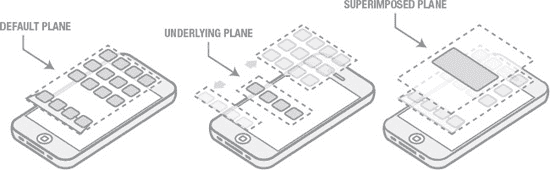

# 主页按钮的演进

前两个操作可以通过`轻扫`手势完成，但使用`主页`按钮能使这些交互更加高效。`应用切换器`则不同，它的运行依赖于`主页`按钮。

我认为这清晰地展示了`主页`按钮作为一种专用于支持导航行为的控件，其演进模式。这种模式存在少数例外，但这些例外也遵循着清晰的规律。从休眠模式唤醒设备，或者在锁定屏幕上调用`iPod`控制，都发生在核心用户界面的上下文之外。在用户与设备交互的此时，导航并非相关功能，因此`主页`按钮正好可以派上用场。尽管如此，苹果公司已为 iPhone 最常见的若干使用场景提供了相当不错的解决方案。例如，通过在锁定状态下双击`主页`按钮来访问`iPod`控制，另一个例子是能够通过单次长按（3 秒）来访问`语音控制`。因此，在锁定状态下针对关键用例的交互也成了该控件的一种有效用途。导航支持的最后一个例外，是能够为`主页`按钮配置辅助功能选项，这可通过三次点击来调用。

未来 iOS 版本的发布可能会为`主页`按钮增加更多用途，但这仍有待观察。我们甚至可能看到`主页`按钮最终消失。一些有趣的场景可能会促成这一点。我们可能会看到引入屏幕外电容式控件来替代`主页`按钮，或者甚至可能出现新的手势来控制当前与`主页`按钮相关的功能。请放心，苹果公司将继续在其设备上对这个方面进行演进。

## iOS 的奇特拓扑结构

在本书的后面部分，我将深入探讨用于创建可应用于 iOS 设备应用的有趣且独特的交互模型的方法和技巧。在达到这一目标之前，我们有必要花些时间来解构 iOS 中一些尚未被清晰定义，或者至少没有以有助于我们理解为何 iOS 能被用户轻易接受的方式记录下来的方面。iOS 交互模型的核心是一个“空间”的概念，用户在其中流畅移动以完成任务。我们可以将这个空间想象成一个微小的宇宙，操作系统功能和应用程序都居住其中。如同任何宇宙一样，它有其固有的规则、限制和属性，这些都会从根本上影响其中存在的事物。当我们理解了这些基本机制，我们就能设计出更高效地利用这些机制的解决方案，或者完全绕开它们，开始定义我们自己的规则。

iOS 本质上是一个平面环境，但也有少数例外。当我说“平面环境”时，我的意思是核心的用户体验呈现是一个二维的命题。你可能会觉得这是句废话，因为我们看到的是设备上的屏幕，而屏幕上的内容本质上是二维的。没错，但我所指的，是界面元素如何呈现，以及用户如何在概念上穿越这些元素所占据的空间。认识到这种二维性很重要，因为从技术上讲，我们已不再局限于创建仅限于二维的用户体验。iPhone 和 iPad 能够渲染非常复杂的图形，创建一个立体 UI 也完全可行，因此苹果公司是有意识地决定不朝这个方向发展的（字面意义上的）。

尽管 UI 是平面的，但其操作并非严格意义上的二维。iOS 实际上是在三个相互依赖或共存的面板之间运作。你可以将 iOS 视为三个用户界面层，每一层都专门用于特定类型的交互。这些层之间的移动由该层特定的交互机制集所定义。

这三个用户界面层或面板的划分如下，按操作的重要性排序（见图 2-1）：

*   **默认面板：** 这一层由应用图标和图标停靠栏占据，是用户交互最活跃的面板。
*   **底层面板：** 这一层专用于`应用切换器`和显示内容。这个空间纯粹是一个辅助性结构，用于支持组织、定位和导航。
*   **叠加面板：** 这一层用于对话框、警告、模态控件和弹出视图。

**图 2-1.** 用户界面的三个面板。

这些面板共存于一个非常浅的视觉空间中。从外观角度来看，这些面板彼此之间仅相距几毫米。虽然这仅仅是图形渲染方式的问题，但这些面板的视觉呈现暗示了这些空间之间密切的关系。就好像外观上的接近性补充了这些功能最初为获得用户接受所需的认知关联。底层面板的概念强化了一种错觉，即这个 UI 之下始终有更多内容，就在表面之下！

