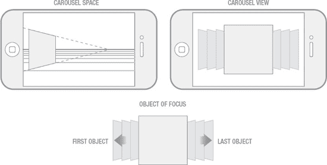
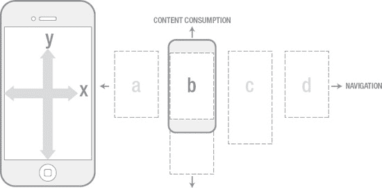

# Spatial Planes and Navigation in the iOS Interaction Model

The default plane of iOS core UI elements is naturally subject to the most frequent use and, by definition, supports the greatest degree of interactive activity. In contrast, the interaction on the other two planes is very limited, as they only support a restricted set of functions. The sole purpose of the bottom plane is to support organization and navigation. This plane provides Apple with the degree of UI extensibility needed to address the urgent application management issues I reviewed earlier. The bottom plane manifests as a state change of the default plane, so these two aspects of the interaction model more accurately constitute what I call the iOS Core UI.

The overlay plane contains objects that are distinctly different from the application icons filling the other two planes. There are several ways to think about these objects: they are intentionally disruptive, they are temporary, and they have no “home” in the core UI. I am referring to objects such as alerts, dialogs, and various types of modal controls. I think we take the iOS interaction model for granted because the interactions on the overlay plane feel so natural to us. However, each of these objects could have been handled in many different ways within the core UI. They could have reserved a portion of the screen space for management, but Apple determined that presenting these objects on a higher-level plane was a superior solution. Why is this? Obviously, alerts and dialogs are critical interaction points in any type of user interface, and elevating these objects to overlay on top of all other elements is a standard approach. Dialogs are inherently modal, so they require interrupting activities within the core UI. The fact that Apple applies the dialog design pattern to alerts helps reinforce the understanding of how these objects function and what users need to do when they appear. UI objects in the overlay state receive the least amount of interaction, but by their nature, they command the most attention when they appear on screen.

There is one major exception to the established spatial model. When using the iPod feature, users can access the classic “Cover Flow” browsing mode while viewing certain types of lists. The Cover Flow view is invoked when users rotate the device horizontally while viewing a list of songs, albums, or other media objects. When the device rotates back to the vertical orientation, the Cover Flow view reverts to the traditional list.

The spatial model of the Cover Flow view is entirely different from anything I have reviewed so far. It presents objects in a seemingly three-dimensional space. Interaction within this space is limited to objects moving along one axis, within the fixed frame of the horizontal view (see Figure 2-2). The concept of a fixed frame of reference is very different from the model used at the top level of the OS. At the top level, the user’s perception is of moving from point A to point B while browsing application screens. It is this perceived motion that establishes (or even defines) the concept of space. When interacting with Cover Flow, the user’s view does not move! The user moves objects through a fixed viewpoint, and this fixed viewpoint remains constant regardless of how many objects populate that particular frame. This is essentially an inversion of the visual interaction the user experiences throughout the rest of the OS.

**Figure 2-2.** Cover Flow View Spatial Model.

Now that we have reviewed the basic visual structure of the OS’s three interaction planes, we can review in more detail how the user moves within that space. The first thing we need to establish is that these three main interaction planes are ordered on the z-axis, but the user does not need to make an explicit choice to navigate between them. The three levels are essentially just an aspect of the UI view state the user is currently engaged in and become apparent only when needed. The dynamic nature of the iOS spatial model is actually defined by the navigation and browsing behaviors required for device operation.

We can analyze two basic types of movement: movement on the x-axis and movement on the y-axis. In iOS, these two types of movement reflect very different types of interaction behavior. Movement on the x-axis is most closely related to navigation, while movement on the y-axis is related to content consumption. The x-axis refers to left-right directionality. When you think about it, almost all navigation occurs through left or right movements. Browsing apps from the home screen requires a left swipe to bring the next screen of applications into view. A right swipe takes you to the search screen. The OS, at the top level, can be described as consisting of a limited set of discrete screens, extending one screen to the left and 11 screens to the right. The user moves left or right, traversing what are perceived as discrete adjacent spaces—each defined by the fixed array of icons that populate it.

**Figure 2-3.** Movement and Interaction Behavior.

The x-axis is also associated with moving through the OS hierarchy. Let’s use the “Settings” app as an example to demonstrate how this works: Starting from the home screen, you swipe left until you find the Settings app. Opening Settings, you see a series of high-level options on the screen. Each setting has a right-pointing arrow on its right side. Selecting a settings category, such as “General,” initiates a transition that slides your current view off-screen to the left while bringing the adjacent screen on the right into view. You can continue moving in this way until you reach the bottom of the hierarchy. When navigating back up the hierarchy (by following the prompt at the top-left of the screen), the visual interaction is reversed.

The consistent use of left-right movement simplifies what could otherwise be a complex mental model for the user. Traditional methods of hierarchical navigation often provide users with some non-linear methods or shortcuts to accelerate movement within that space. However, many of these shortcuts rely on a more comprehensive display of the hierarchical levels or introduce additional interaction points, both of which increase the complexity of the design solution. Devices like the iPhone are limited by their size, so a simplified hierarchical navigation solution is very appropriate. However, I should point out that iOS’s “one path down, reverse path back” approach is not suitable for deep hierarchical structures, but Apple explicitly states in the HIG that hierarchies need to be limited precisely for this reason.

## iOS 空间模型与用户体验分析

沿`y`轴的运动不像`x`轴那样具有多重含义。在大多数情况下，这种类型的运动仅限于需要垂直滚动行为的场景。我特别想指出的一点是，可滚动列表的长度没有限制。这意味着几乎所有`y`轴运动都包含在一个连续的单一空间内。作为整体空间模型的一个重要方面，`y`轴与`x`轴的行为形成了鲜明对比。如前所述，`x`轴运动关乎离散屏幕或刻意划分的空间区域的呈现，你必须增量地穿越这些空间；而`y`轴则关乎一种流畅得多的体验。

定义空间模型的一个重要部分，基于我们如何感知构成既定空间的对象、屏幕、控件及其他元素的物理性。这些元素的行为可以强化或破坏该模型。在 iOS 中，Apple 在其设计的所有元素的行为上保持了极高的一致性。对于空间模型的定义至关重要且最具普适性的行为之一，是他们使用了我称之为“滑动”（`slide`）过渡的机制。在用户体验的语境下，过渡是向用户指示状态变化的视觉机制。我们迄今为止回顾的关于空间感知的大部分内容，要么完全依赖于关键的视觉过渡，要么至少因视觉过渡而得到了显著增强。当未采用直接操作时，过渡的使用尤其有用。

从主屏幕浏览应用或滑动到“聚焦”（`Spotlight`）界面，是由你对屏幕的直接触摸驱动的。随着你的手指或拇指从左向右移动，下方的屏幕会实时跟随你的触摸而移动。当你探索空间并在屏幕之间移动时，你会形成对空间如何定义的直觉式理解。总会有无法应用直接操作的情况，但在这些情况下，过渡可以自动执行视觉交互，以模拟或复制可能有助于为用户建立一致感的核心行为。iOS 在我为“设置”功能回顾的分层步骤导航中使用了这种技术。当用户有多个可用选择时，将屏幕向左或向右滑动以进入另一个层级并不适用。相反，Apple 让你选择一个选项，然后自动执行一个过渡，该过渡在直接操作屏幕时与相同的滑动视觉交互完全一致。

到目前为止，我所回顾的一切几乎都只与 iOS 的核心用户界面相关。应用的空间模型则完全是另一回事。总的来说，运行在操作系统之上的应用在交互模型和设计执行方面不受限制。人机界面指南（`HIG`）确实建议了一些最佳实践，但这并不意味着你必须遵循这些最佳实践。这意味着应用可能会也可能不会复制或镜像操作系统核心界面本身的空间模型，并且可以肯定的是，许多应用明确地打算自行其是。既然知道有大量各种各样的应用存在，我们仍然可以观察到一些普遍的行为。最容易识别这一点的地方是我称之为应用体验的入口与出口点，因为这对所有应用来说都是共通的。从操作系统的几个不同点都可以打开应用，并且每个点都有不同的空间含义：

*   **从主屏幕及其后续页面：** 这是用户启动应用最可能的方式，与之相关的视觉过渡描绘了应用从图标阵列后方浮现而出，并将这些对象推开。给人的错觉是，应用正在移动到图标之前占据的同一个平面上。
*   **从聚焦（`Spotlight`）界面：** 我认为对典型的 iOS 用户来说，这可能是三种入口点中使用最少的。在这种情况下，聚焦界面首先向空间中的一个点退却，紧接着所选应用从同一个消失点向空间前方移动。
*   **从应用切换器（`App Switcher`）：** 应用切换有其独特的行为。一旦在切换器中选定了应用，整个活动视图（包括切换器本身）会沿`z`轴旋转出视野，紧接着所需的应用旋转进入。当应用退出和进入屏幕时，所有旋转似乎共享同一个锚点。这种独特视觉行为有几层含义：首先，它支持了“切换”（即在两种状态间切换）的概念；其次，它支持了多任务的概念，因为退出的应用似乎只是旋转出视野——而不是消失得无影无踪。

由“主屏幕”（`Home`）按钮发起的应用退出操作始终是相同的。应用会退回到它浮现而出的那个消失点。从打开的应用中没有直接路径到聚焦界面，因此该场景不适用。通过应用切换器的退出发生方式如上所述。

这些不同交互的共同主题是什么？它们都倾向于与核心界面的平面化呈现以及在该空间中导航时所暗示的线性空间布局区分开来。从用户的角度来看，这有助于建立一种预期：从功能角度来看，他们即将进入的体验与核心界面是完全分开的……在某种意义上，意味着一切皆有可能！

我知道这一切似乎显而易见，但分析和理解构成 iOS 用户体验的所有微妙因素，以及它为何本质上易于使用，是至关重要的。就像我所描述的那样，描绘并理解空间模型，能让你洞察用户体验的一个重要方面。

## 简单与显而易见

要恰当地解构 iOS 用户体验，我需要审视并尝试解读那些驱动了体验中许多重要设计决策的哲学基础。Apple 在人机界面指南（`HIG`）中对这些理念做了出色的界定，但审视它们在哪里、如何被应用，以及在何处、如何可能被忽视，仍然是有价值的。与任何类型的指导一样，总会有值得注意的例外情况需要审视。

通读人机界面指南（`HIG`）时，一些模式和主题会非常清晰地浮现出来。其中一个主要主题是`Simplicity`（简洁）。同样，这可能看起来显而易见，但理解不同主题如何被统一并共同服务于一个单一目标，能让你对 iOS 有深入的了解。

作为概念，`Simplicity`（简洁）看似直接且易于实现——定义如此。但怀着简洁的理念来设计复杂的交互系统则是另一回事。更复杂的是，对简洁的感知并不等同于简洁本身。我的意思是，有时看似简单的东西，实际上是许多复杂或精妙技术的成果，而这些技术对于与系统交互的人来说并不明显。我将尝试根据人机界面指南（`HIG`）中确定的几个关键指令，来解构 iOS 中那种完形性质的简洁特征。

我已经识别出这个主题的许多构成要素，但我确信还能找到更多。需要明确的是，其中许多要素并非在`HIG`中明确列出。我所做的是将`HIG`中的一些关键陈述抽象到其核心，以便你可以理解这些概念在你正在设计和/或构建的应用中的应用方式。

