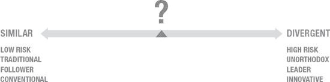

# 用户界面简洁性的设计原则

## 核心原则

**有限导航：** 为用户提供冗余的导航方式或增强的非线性导航，充其量是不必要的，最坏的情况则可能造成困惑或分散注意力。与设备交互的简便性使你能够专注于创建一条贯穿内容或功能的清晰路径。

**约束控制映射：** 识别并隔离应用程序中的有限区域以容纳用户界面元素，是更有效的方法。控件本身（按钮等）应被视为次要元素，尤其是在应用程序内容需要最突出显示的情况下。

**约束控制数量：** 限制或减少在任何特定时间点呈现给用户的控件数量。为了管理复杂的应用程序，应将功能分散到不同屏幕，并尝试将类似的任务组合在一起。

**控制清晰度：** 尽可能限制独特控件类型的数量，以避免让用户感到困惑。这不仅适用于控件类型，也适用于控件渲染。控件功能应能通过简短标签和/或易于理解的图标来识别。

**操作系统功能分担：** 在某些情况下，功能可以从应用程序中移除，并在操作系统层面进行管理。应用程序设置可以迁移到 iOS 设置屏幕，这有助于降低潜在的 UI 复杂性。

**用户界面隐藏：** 控制元素不必无处不在。一个简单的手势或触摸事件，便可在需要时在界面中调用一组控件。关键在于为用户提供一个机制，让他们了解这些控件的临时性以及如何在它们离开屏幕后重新调用。

**渐进式展示：** 力求仅在应用程序流程中需要的地方和时间为用户提供功能。很可能并非每个功能都需要全局可用，利用这一点可以降低你屏幕的复杂性。

**品牌与身份弱化：** 没有必要反复用你的品牌来轰炸用户。识别出你应用程序中需要突出品牌和身份声明的最关键环节，在其他地方则将其调低到可接受的程度。

**状态持久化与恢复：** 期望用户频繁地使用你的应用程序，但要认识到这种使用是碎片化的。移动用户经常同时处理多项任务，在完成一个任务的工作流程中，可能会多次打开和关闭你的应用程序。因此，你需要确保当你应用程序的状态得以保留，并且当应用重新启动时，任务可以轻松地从中断处继续。

**隐式保存：** 与状态持久化问题类似，任何内容创建任务都必须得到保留，并且“已保存”的概念应当对任何工作流程而言是隐式的。

**手势克制：** 限制与你的应用程序交互所需的基本手势数量。理解手势用法或必须学习新的手势，可能会成为用户采用你应用程序的重大障碍。

**层级克制：** 克制层级深度实际上是成功实现有限导航的一个方面。高度的层级结构会使设计一条简单易懂的应用程序路径变得困难。这并不意味着不可能，只是意味着你将面临管理用户方向感的挑战，或者需要努力消除在层级中浏览的乏味感。

**应用单任务性：** 用户实际上一次只能查看并与一个应用程序交互。应用切换器表明可能有多个应用在同时运行，但即便如此，用户也需要在应用间切换才能进行任何操作。目前还没有真正意义上的同时查看多个应用，但随着像 iPod touch 这样大尺寸设备的出现，未来这可能会成为可能。

## 张力与矛盾

所有这些话题都指向了“简洁性”这一主题或指导方针，并且在此过程中相互交叉或显著互补。然而，也有各种话题似乎与这一方向相矛盾。这些想法散见于《人机界面指南》（HIG）中，并对你如何思考你的应用程序有着有趣的启示。

我想提出的前几个问题与本节所讨论的话题相关。我首先要指出的是，虽然 UI 隐藏的概念可以用来管理屏幕复杂性，但它可能潜在地将更大的认知负担转移到用户身上。当 UI 元素不在屏幕上时，用户需要理解它们去了哪里、如何到达那里，以及需要做什么才能让它们回来。如果以简单直接的方式管理，这不一定是问题，但如果这需要任何复杂的交互，就可能导致用户面临重大困难。

我还想指出，在你无法限制屏幕上控件数量（密度）的情况下，通用的控件标签可能会成为问题。标签需要空间，有时确实没有足够的空间来放置一个清晰可读的标签。并且在某些情况下，即使有空间放置标签，标签的存在本身也可能增加屏幕上元素的感知复杂度。

《人机界面指南》中另一个有趣的观点是，强调应用程序应具有高信息密度和高功能密度。这似乎与我之前回顾的几乎所有话题都背道而驰。《人机界面指南》指出，应用作者应该

> *“……力求为用户所提供的每一条信息，都尽可能多地呈现信息或功能。这样，用户在浏览你的应用程序时，会感觉到自己在不断取得进展，而不会受到延误。”*

从表面上看，这似乎是矛盾的，但我认为苹果是想强调，你应该为用户提供高度的交互效率，以避免他们产生挫败感。

### 摘要

在本章中，我探讨了许多旨在解构 iOS 用户体验微妙之处的主题。从概述中，你可以看到有多少不同的概念和技术被协同运用，以真正吸引用户，并主动管理他们的感知。

iOS 倾向于更实用的方法，这似乎是过去智能手机时代遗产的理性演变，但这可能正日益局限于 iPhone 等小型设备领域。随着 iPad 和其他中等尺寸设备逐渐成熟，围绕实用性和效率的传统考量将变得不再那么重要。

直接操作的理念是所有触控交互的基础。用户面对的模型是：与某个对象交互的结果与他们的输入或动作密切相关，以至于在虚拟与现实之间感觉不到任何障碍。

手势将触控界面的能力扩展到超越直接操作所涵盖的基础交互。

`Home` 按钮是唯一能直接控制 iOS 核心 UI 的硬件输入。认识到其操作的局限性，以及这如何融入 iOS 整体的交互模型，这一点很重要。它在支持导航和方向感方面扮演着主要角色，并且随着操作系统的演进，这一核心功能始终是其关注的焦点。

iOS 为用户提供了一个易于理解的空间模型，这是促成其易用性感知的重要因素。该空间模型通过一致地使用视觉交互和自然过渡来建立，使用户能够以可预测的方式进行导航。

“保持简洁”的哲学理念驱动了许多设计决策，使 iOS 易于使用和理解。在 HIG（人机交互指南）中，你可以在多个乍看之下似乎不相关的地方识别出这种理念。然而，所有这些要点都协同作用，共同帮助管理功能复杂性和交互复杂性。

## 用户体验差异化与策略

本书的前两章几乎完全致力于在细节层面理解 iOS 的本质。了解特定交互背后的基本原理，与理解其工作机制同样重要。对 HIG 的回顾以及对 iOS 工作机制的解构，为你提供了一个坚实的、基础性的理解，让你明白苹果希望为其用户提供何种类型的体验。HIG 的存在本身告诉我们，苹果高度重视提升 iOS 应用程序的执行水准，其意图是让第三方开发者能够满足苹果用户的高期望。

我们知道苹果希望你做什么，我们也知道他们为什么希望你这样做。但是，是否存在偏离 HIG 才是合理的情况？你如何知道你的设计方案可以走多远？本书的目的之一，就是为你提供工具和指导，帮助你做出这些决策，从而在众多应用中脱颖而出，并赢得对你的应用成功至关重要的“惊叹”反应。

为了与众不同而与众不同，可能足以让你起步，并可能带你走上创造一款令人惊叹的应用之路。然而，这对所有人来说可能都不足以开始，当然，如果你最终需要向首席财务官或投资者负责，这肯定也不足以证明你的设计决策是合理的。一个简单的思维实验将开始帮助你论证你的观点。假设你有兴趣为 iPad 或 iPhone 创建一个新应用。你会对自己说，“嘿，我有一

个关于应用的好主意！而且它将和竞争对手的产品一模一样！”吗？当然不会。从这个角度来看，你可以发现，与众不同应该是你商业模式、营销计划和用户体验策略中的一个关键方面。

### 感知与期望的转变

除了潜在的商业模式、营销计划和其他“上市”策略之外，认识到你即将进入一个高度竞争的环境非常重要，在这个环境中，仅仅是被注意到就已经是一项重大成就。即使你的应用被注意到，当有更好玩的新应用出现时，用户也会迅速而愉快地转移注意力。这种情况因用户对与技术交互的普遍期望的演变而加剧。

在过去几年里，我们看到极具颠覆性的新型交互行为被迅速采用。我们往往对此习以为常，因为这些行为已迅速成为主流。iPhone 和 iPad 就是很好的例子。在这些设备上市之前，电容式触摸屏界面技术并不是普通大众所理解或渴望的。在没有需求的情况下，除了少数实验性案例或执行不佳的商业产品之外，实际上并没有什么动力将这项技术整合到产品中。随后 iPhone 上市，展示了该技术与简单直观交互相结合所产生的力量。这些多点触控交互的最初影响在消费者的意识中引起了巨大反响。如今，4 年多过去了，我们正处于这样的局面：这项技术及其相关的交互方式已被视为惯例。

另一个经典例子是任天堂 Wii 及其相关游戏手柄，通常被称为 `WiiMote`。将加速度计与其他传感技术集成到控制机制中，使任天堂能够创造出一种全新的游戏类型。尽管 `WiiMote` 启用的交互与之前的任何产品都截然不同，但人们仍蜂拥至商店购买这种新主机，并且它很快就超过了市场上的所有其他产品。索尼和微软等竞争对手被迫迅速开发类似技术，以应对消费者对主机游戏期望的转变。

这些例子展示了大众市场对人们如何与技术互动的期望发生了重大转变——这一切都是由加速度计和电容式触摸屏等各种使能技术的出现所驱动的。其中一些技术本身就对交互的设计和规范有着重大影响，但也存在一些场景，更普通的技术被结合起来，综合出新的体验类型。我所描述的转变是一种围绕对“不同”的期望和接受而形成的文化临界质量。消费者期望产品具有某种他们从未见过的、新的、引人注目的交互方式，在许多情况下，这一因素正在推动购买决策。

数字产品（消费电子产品、软件等）市场正经历着*体验*——我们设计和创造的东西，与*体验者*——我们正在设计的产品用户或消费者——之间快速的共同进化。这本质上是一个反馈循环。随着更具吸引力或独特性的交互方式（与各种产品发布相关联）被引入市场，我们看到对越来越独特和引人注目的交互的需求和接受度也在增长。我预计在某个时候我们会开始看到这种趋势趋于平稳，但由于当代社会是一个由消费者驱动的文化，我们可以预期这种反馈循环将持续一段时间。底线是，新的交互行为和技巧是众望所归，而这些因素对于实现任何程度的市场差异化都至关重要。

### 可用性与采纳度

我刚刚描述的环境，呈现了我们在看待交互设计解决方案创建方式上的又一次转变。传统上，任何交互设计解决方案的成功与否，都是以它的**可用性**来衡量的。在数字技术最初面向大众消费市场推出的时代，这是一种非常明智的做法。将消费者从现实世界中根深蒂固的传统模拟行为，过渡到高度抽象的计算环境中的对应行为，是一个巨大的挑战。回顾从 20 世纪 80 年代初到 21 世纪初的这 20 年，消费领域的技术变革可谓空前绝后。这一时期的技术进步，伴随着用户体验质量的不断提升，而当时的用户体验几乎总是用可用性来衡量。

`可用性`在当时的是一种工程思维，系统的可用性是通过一系列不同的产品设计与开发技术，用定量方法建立的。这本身无可厚非，但随着世纪之交数字产品市场的爆发式增长，探索其他市场竞争手段变得必要。这便催生了更全面的`用户体验`思维及其在产品设计上的整体论方法。这种思维包含了可用性，但也涵盖了美学、感知以及用户的情感投入。

#### 渴望之辩

如今，用户体验思维已深入人心，对可用性的强调发生了些许变化。可用性并未消失，也不应该消失，但它确实需要被视作一项基本考量。你必须假设你的所有竞争对手都能推出具有基本可用性的产品，因此你需要判断用户体验中哪些其他因素能让你的产品更具吸引力。这便开始触及本章的要点：成功的基准实际上更多在于设计解决方案（在此处指应用程序）的**采纳度**。可用性在推动采纳方面起着重要作用，但在很多方面，**渴望**更为关键。有效解决渴望问题意味着要认识到我目前描述的所有因素：

*   理解用户状态的演变，包括他们对当代交互的期望和感知
*   理解你的产品用户体验如何能与竞争对手提供的有所不同
*   理解如果你的首要目标是提高采纳度，你可能需要专注于激发渴望
*   鉴于我们今天所设计的应用环境，激发渴望可能需要探索非传统的解决方案

### 用户体验策略

理解你做出用户体验决策的上下文非常重要，但这仅仅是你走向更全面策略的起点。一个好的用户体验策略，核心在于为你的组织确立清晰的愿景和计划。在现阶段，为处理用户体验的方法提供一种理解或定义，比解决具体的设计细节更为重要。一个好的策略应提供一个坚实的框架，指导你在设计过程中的决策。它关注的更多是“*如何做*”，而不是“*做什么*”。认识到技术、用户需求和用户渴望将处于持续变化的状态，对于如何应对这种变化有一个清晰的计划至关重要。战术细节是执行层面的一部分，正如你在策略中所定义的那样。

制定有效的策略有诸多益处：

*   为参与产品开发的多元团队提供一个绝佳的统一基点。
*   帮助团队保持对用户的强烈关注，从而确保客户满意度。
*   在产品的整个生命周期中提供一致的体验，维持已建立的用户期望，或在必要时帮助引导这些期望的演变。
*   几乎可以肯定能提升产品质量，并有助于降低任何部署风险。

当你试图为你的应用打造一个具有高度影响力或“`Wow`”效果的独特设计解决方案时，这些要点都尤为重要。高影响力的用户体验很可能会带来一系列工程和设计上的挑战，这些挑战需要高度协调地加以管理。围绕解决方案拥有共同的愿景至关重要，而精心制定的策略应能提供这一点。如果一个产品组合需要不断扩展和演进，你的策略就会变得更加重要。

### 定义你的策略

用户体验策略究竟包含哪些内容？在最高层面上，它关乎为特定用户群体设定一组感知目标，并理解如何通过应用体验的不同方面来实现这些目标。这些目标可能针对与用户感知应用价值或实用性相关的特定功能集，也可能从纯粹功能角度涉及一系列关键用例，或者关注功能如何支持或反映用户的生活方式。

所有这些都高度依赖于应用的性质，但在所有情况下，战略都应定义如何以符合既定目标的方式将这些功能呈现给用户。

还有其他不容忽视的复杂性维度。一个好的策略应通过定期重新评估目标、用户和市场状况，来应对用户体验随时间的成熟过程。如果开发团队采用敏捷方法论，那么将这种设计思维整合到整体流程中，并通过产品待办事项列表集成用户体验修订可能会更容易。这种方法正是用户体验策略中需要记录的内容。

如今，没有任何用户体验是孤立存在的。将用户体验局限于你的应用可能会带来很多麻烦。在许多情况下，需要在更广泛的连续性中的多个接触点上考虑用户体验。这对于需要跟踪或管理系统性用户体验依赖关系的大型复杂产品系列而言更是如此。即使是独立的应用，也需要从端到端的体验来理解。请对用户旅程的所有方面保持敏感：从通过搜索引擎、App Store 或产品页面发现你的应用，到安装和更新过程，甚至包括你最终如何淘汰产品。

同时，审视最终可能负责分发你的应用的更大生态系统也很有价值。就本书而言，那就是苹果的各种形态的 App Store。你无法控制 App Store 的工作流程，但你可以控制产品页面上的内容以及其他虽小但高度相关的细节。尽力利用苹果允许你控制的 App Store 方面。始终寻找机会，通过强化你的用户体验策略来利用这些能力为你服务。虽然这样做的机会有限，但第一步是如何处理你的应用图标，以及它与你选择在屏幕上显示的元素之间的关系。为你要显示的屏幕建立一些基线标准，并确保这些标准与你的策略保持一致或支持你的策略，这同样非常重要。甚至你的文本描述的语气和措辞也能在强化整体用户体验策略中发挥作用。

需要考虑的方面很多，你可能无法在第一次尝试中就全部做对，但最终，当用户开始使用你的产品并经历每一个接触点时，你的策略将获得回报。

### 思考差异化

产品差异化可能是实现高度影响力或“惊艳”效果的重要因素。我们已经涵盖了这种思维的基本原理，但在开始任何设计活动之前，有许多细微差别需要理解。一个优秀的用户体验策略需要清晰连贯地概述这些细微差别。

首先需要理解的是，差异化可以在一个连续谱上被看待。这个连续谱的性质由你决定，但你应该将差异化视为两个对立点之间的一系列可能选项。一种方法是将其中的一个点视为*相似*，另一个点视为*不同*（见图 3-1）。相似和不同只是抽象概念，为你提供一个框架来思考你的设计解决方案需要处于什么位置。在这种情况下，相似指的是更传统的方法，其基础是传统智慧。它代表了一种低风险的追随者心态。而在范围另一端，不同指的是可能风险较高但体现创新的非正统方法。实际的标度取决于你的策略中规定的产品目标。问题是，假设目标是具有竞争力或令人向往，你的应用需要在这个标度上处于什么位置？你的应用在该标度上的位置可以提供一些指示，表明是考虑对现有功能进行增量增强，还是进行彻底的重新发明。

**图 3-1.** 差异化连续谱。

你可以将这种方法应用于用户体验的任何方面。我刚才使用的例子可能是从功能差异化的角度来看待这个标度，但你可能希望将同样的方法应用于对潜在交互模型的思考，而不考虑功能问题。如果不同选项之间的功能没有变化，你可能需要明确你的主要差异化集中在交互上。你可以绘制出你认为交互模型需要在该标度上的位置，并将其用作另一个路标，以指导你的交互设计活动。

这种思维并不局限于一个维度。概念可以在多个轴上绘制，以收敛于用户在特定方面的感知。但至少，你可以从解决你试图在基本的二维连续谱上实现的差异化程度开始。

如何着手为你的应用确定正确的方向？首先需要考虑的是你是在创建新应用还是处理现有应用。新应用没有传统用户体验的负担，对设计团队来说是一张白纸。如果你是在处理现有应用，那么发布的性质是决策过程中的一个重要因素。对于现有应用，尝试将用户体验的重大修改保留给主要版本。

