# 构建交互模型

正如我先前所述，交互建模旨在梳理定义应用整体行为的概念，并理解如何应用或整合这些整体行为，从而为用户创建一个一致且易于理解的模型。在第 2 章中，我回顾了"iOS 的奇异拓扑结构"，分解了构成 iOS 用户体验基础的概念模型和空间模型。分层平面的概念以及用户在其中移动的空间模型，共同构成了 iOS 整体的基本交互模型。从这个例子中，你能看到，当以正确的方式处理这一思路时，它会产生多么强大的效果（见图 6-1）。

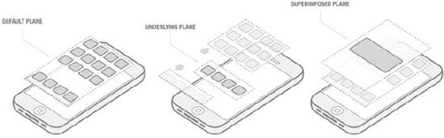

**图 6-1**. 在 iPhone 上体验到的 iOS 空间模型

开始进行交互建模时，你需要刻意地以抽象的方式进行思考。在不涉及具体功能或内容细节的情况下，你需要思考你的应用可能采用的各种不同行为，以了解如何利用它们来控制屏幕上的元素。iOS 为你提供了一个令人难以置信的选择空间。缩放、平移、轻拂、滑动和滚动等概念，无论是单独使用还是作为复合效果，都能创造出非常独特的交互体验。

到目前为止，我已经多次谈到差异化。你将面临的最大挑战之一是，弄清楚在何处以及如何最好地实现应用内交互的差异化。理解如何运用这些概念，正是交互建模的核心益处；在这个阶段，你可以自由试验，并深入思考如何将这些概念应用到你的设计问题中。达成一个差异化的解决方案并不十分困难，但要创建一个可扩展、可维护，并且最重要的是能被用户理解的解决方案，则需要付出更多努力。

让我们快速做一个小练习，来理解如何打破常规，思考一些差异化的交互方式。首先，考虑一个简单的用户界面组件，比如一个项目列表。列表对象在任何用户体验或用户界面设计工作中都相当常见，可用于多种目的。传统上，列表是文本对象的垂直排列，每个文本对象在单列中与其上下的对象清晰区分（见图 6-2）。

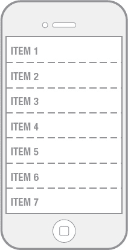

**图 6-2.** 一个典型的列表

现在退一步，从最抽象的意义上思考一下列表是什么。它基本上只是一个你可以从中进行选择的数组。仔细想来，这是一个非常基础的概念。然而，如果你进一步思考，你会发

现，垂直排列并非其固有特性，单列组织也并非其内在优势。因此，你必须问自己：是否存在另一种格式，能为你正在解决的问题增加价值？这一点可能不那么显而易见，所以值得仔细梳理各种选项，看看是否有有趣的可能性出现。为了这个练习的目的，我们来看看这会如何发展。

如果我们知道（甚至只是相信）列表的垂直方面没有内在价值，那么水平解决方案会是什么样子（见图 6-3）？

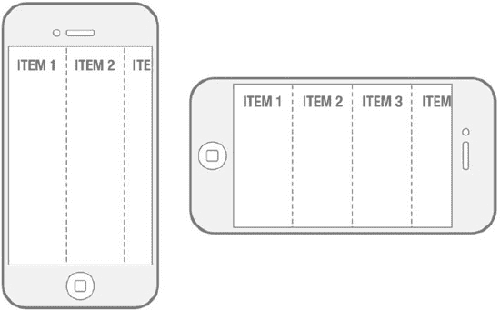

**图 6-3**. 实验性的水平列表方案

嗯，这很有意思，但我们开始看到，当设备垂直握持时，可用的水平空间可能会带来一些问题。这是否是一个巨大的问题？在没有任何特定上下文的情况下，不是，但考虑到你无法同时看到很多列表项，这对于快速浏览来说可能效率不高。当设备水平放置时，效果会好一些，但仍然不理想。

让我们再扩展一下思路，看看会有什么结果。单列列表对象的概念同样值得质疑。如果我们将列表扩展为对象数组或某种网格配置，这会给我们带来什么优势（见图 6-4）？

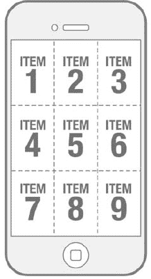

**图 6-4.** 将列表重新构想为网格或对象数组

这开始变得更有趣了。这种配置提供了同时查看多个项目的优势，这似乎是对传统列表的一种改进。但我们也需要应对一些缺点。文本对象的可用区域减少了，但如果我们愿意改变文本对象的大小，这似乎是可控的。

哇！我们只是从列表的基本概念出发，看看我们最终走到了哪里。仅通过一些简单的试验，我们就能够彻底改变这个组件的基本概念。这个想法的发展也不必止步于此；我们还可以探索其他维度。让我们思考一下与列表和列表类对象相关的交互行为。在 iOS 中，一个经典的列表对象可以通过快速向上或向下轻拂来导航，或者通过缓慢拖动来滚动到屏幕边界之外的条目。这种行为仍然适用吗？能否将其应用到我们的网格实验中（见图 6-5）？

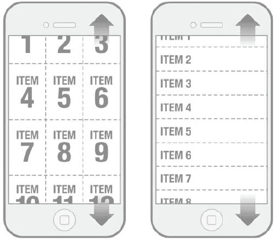

**图 6-5.** 垂直滚动适用于两种解决方案

当然可以！在这个特定案例中，滚动行为的适用性近乎常识，但情况并非总是如此。你始终需要评估你所依赖的现有交互行为，以确保它在新的模型中仍然有效。

这个例子还没完。现在，让我们将抽象方法应用于列表的行为。一个标准的 iOS 列表对象在需要时支持滚动，并且由于文本对象在垂直列中的方向，这种滚动被限制在单一轴上。既然我们不再局限于单一垂直列的项目，我们如何将滚动行为应用于这个基本概念呢？

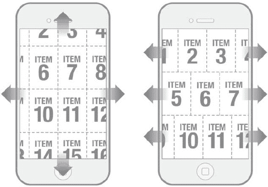

**图 6-6.** 网格上的多轴滚动和行滚动

有许多种方式可以将滚动行为应用于这个概念，它们可能同样有效（见图 6-6）。从这一系列例子中，你可以看到基于现有组件和交互来构思新想法是多么容易。以列表作为灵感仅仅是个开始；还有许多其他想法、组件和元素可以用同样的方式来处理。解构这些元素，可以成为设计和完善应用中一些极具吸引力的交互的强大方法。

#### 附加问题解决技巧

我们刚刚演示了如何从一个相当基础的控制方式中推导出一个新概念。这是为应用程序定义新交互模型的一个绝佳起点，但仅靠它可能无法达到你所需的终点。在过程中某个阶段，你可能会遇到潜在的僵局。某种特定技巧或格式可能无法扩展到你所期望的程度，或者你可能会发现解决方案中的某个优点在应用于应用程序的其他领域时反而成了限制。在这些情况下，你需要一些基础的问题解决技巧，帮助自己从困境中解脱出来。

我们已经讨论过 iOS 提供的强大功能，它帮助设计师创造出令人惊叹的用户体验。其中最强大的技术之一是 `Core Animation`，它为开发者提供了在应用中集成高度定制动画的工具。动画不仅仅是为了视觉效果而将花哨的运动应用于随机元素；它也是一种极其强大的沟通工具。

为了理解动画如何为我们创造价值，让我们分解一下动画的本质。在最基本的层面上，动画是随时间改变或调整对象属性或特征的能力。这里的关键概念是**时间**。时间是你能够用来解决关键交互设计问题的最强大工具之一。

当你空间有限时，时间变得极为有用。当空间受限时，传达复杂想法或显示复杂信息会非常困难。在有限空间内工作时会出现两种情况：要么信息密度极高，要么为了适应可用空间而截断或减少信息量。这两种情况都有问题。高密度信息可能让用户难以消化和理解；而截断的信息则不完整，无法令人满意地满足设计需求。

我们的列表实验很好地证明了这一点。为了让文本适应网格单元，我们只是将其缩小到既能容纳又能保持清晰的程度。但显然，如果我们不缩放它，就会出现下面展示的情况（参见图 6-7）。

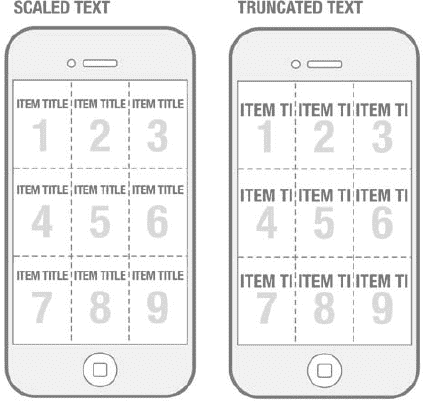

**图 6-7.** 可选中对象网格内缩放文本与截断文本的对比

缩放文本的例子还算成功，但截断文本的例子显然不是一个理想的解决方案。为了本示例的目的，我们假设缩放文本以适应网格元素不是我们希望采用的方式。那么，如何利用时间来解决文本字符串长度的问题呢？我们可以回顾一下小屏智能手机和功能手机的年代来寻找答案。

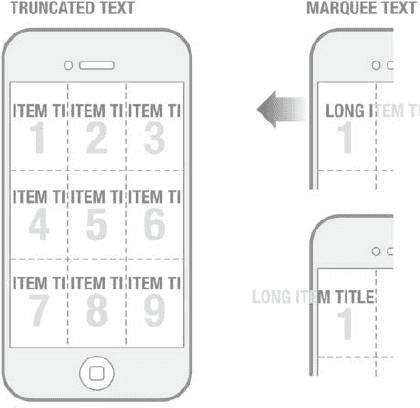

**图 6-8.** 截断文本与跑马灯文本在网格元素可视区域内移动的对比

几年前，跑马灯文本曾是一个非常流行的解决方案。时间在这里发挥了作用，因为解决方案通过动画让文本随时间在可视区域内移动。当文本从右向左移动时，用户可以阅读整个字符串（参见图 6-8）。这解决了截断问题。将时间作为一个额外的维度引入，提供了一种解决空间受限问题的方法。

这是一个有趣的解决方案，在某些情况下可能适用，但由于几个原因，它并不是这个网格布局的理想方案。想象一下这个屏幕首次加载时，每个网格单元内都有文本在平移。可以肯定的是，你会被扑面而来的动画文本搞得不知所措。聚焦于单个网格元素将是一项挑战，而且你必须刻意安排查看网格元素的时间，才能完整地观看单个文本字符串从头到尾的循环。否则，你最终会遇到与截断文本相同的问题——每个字符串只能看到一部分。缺少的元素是什么呢？是**用户控制**，它可以通过多种方式发挥作用。

用户控制的想法显而易见，因为本次讨论的重点是创建交互设计解决方案，而没有某种形式的用户控制，你当然无法实现交互（至少在本实验中是这样；在第 8 章中，我会讨论情况可能并非如此）。但在这里，我想让你通过“**状态**”这个概念，以略有不同的方式思考用户控制。

`State`（状态）在思考潜在交互模型时是一个非常重要的概念。它是另一种可用于解决设计方案中问题区域的问题解决技巧。与时间类似，状态开辟了在静态解决方案中不可能实现的可能性。从某种意义上说，状态——像时间一样——可以被视为另一个维度，允许你修改屏幕上管理的元素和信息。

状态到底是什么？状态指的是一个对象所有现存的属性、特征和特性，这些属性可以被用户观察到和/或被控制系统管理。

到目前为止，我们一直在思考我们为演化后的列表解决方案所构建的交互模型，并且只定义了一种状态。也就是说，它只有一种形态，且这种形态不会改变。但情况未必如此。如果我们能够操纵状态并改变我们模型的构造，那么我们就应该能够解决在交互模型中观察到的任何问题区域。

将这一点与用户控制的概念联系起来，我们可以说，我们能够通过用户输入的机制来实例化用户界面的不同状态。

那么，我们如何应用用户控制和状态的概念来解决交互建模实验中固有的问题呢？我们上一个解决方案存在几个问题。我们喜欢网格在显示更多文本项方面提供的效率，但通过增加列表中的项数，我们开始牺牲用于显示文本的可用空间。我们尝试了基于时间的解决方案，但将动画普遍应用于整个网格存在一些特殊性。考虑到这一点，让我们看看一个整合了用户控制的类似解决方案。

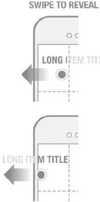

**图 6-9.** 滑动以显示隐藏文本

这种技巧利用了直接操作的概念，允许用户在他们选择的时机和位置显示更多文本。用户不再面对满屏的动画文本字符串，而是可以采取行动，阅读他们想要的任何部分文本（参见图 6-9）。

向文本对象应用一些交互性是一个有效的解决方案，但它相对简单。如果我们扩展这个思路，得出更具革命性的方案呢？让我们不要只关注文本对象本身，而是思考整个网格单元如何随着用户的输入改变状态。

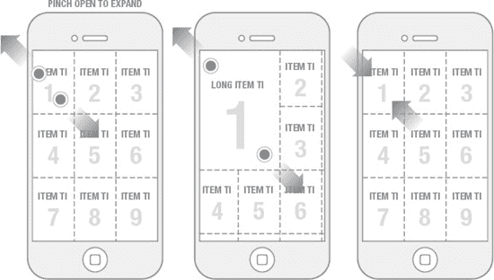

**图 6-10.** 捏合打开一个网格元素以显示更多信息，然后弹回原尺寸

现在我们有了一个交互示例，它展示了模型中更高程度的动态性。用户只需一个简单手势，就能展开网格中的元素，从而获得更大的信息查看区域（参见图 6-10）。这不仅使文本对象完全可读，还腾出了更多空间，我们可以用额外的增值信息来填充它。

曾经这只是一个围绕基本列表的想法，如今却可能成为一种极具魅力的用户体验。在我看来，模型的这一方面似乎增添了一些实用价值——或许远不止是展示一段文本字符串那么简单。但我们为什么要利用这一点，以及如何利用呢？

在进行此类流程时，需要注意的主要事项之一是，你绝不能孤立地思考这些想法。交互模型是完整系统的模型，是定义应用程序运作方式的系统。如果你认为自己拥有一个足够强大的交互概念来驱动应用程序，那么你就需要考虑如何将该概念映射到用户体验的其他方面。这就是我在本章前面讨论可扩展性和可伸缩性问题时提到过的。如果你有一个引人入胜的交互，但它不适用于应用程序的其他方面，那也没关系。你可能心中有一个更大的交互模型，能够囊括这个概念，并为用户提供一个清晰连贯的模型。然而，一个拥有许多独特交互的应用程序——每个交互都特殊且彼此不同——只会让用户感到困惑和沮丧。实际上，这种方法恰恰与你最初的目标背道而驰。到那时，你拥有的将不是一个交互模型，而只是一堆古怪交互的集合。

要避免这种情况，你需要不断思考你的交互在应用程序大部分区域中的适用性。这是一种系统层面的思维，对你的应用程序大有裨益。要理解特定交互在多种情境下的适用性，关键在于将你的思维提升到抽象层面。你需要看待你的交互，不是因为它提供的即时解决方案，而是因为它所展示的基本行为以及这可能带来的可能性。将你的交互视为一个基本的行为模板或模式，可以在多个地方以多种方式使用。

你在构建应用程序时使用的独特行为实例和交互越少，你的交互模型就越健壮。在设计应用程序时，少即是多。你的目标始终应该是通过利用用户已在应用程序中接触过的交互模式的知识和经验，来降低用户的整体认知负荷。

然而，你也不应该强迫自己在不合理的地方使用某种行为或模式。将你已有的交互映射到用户体验的方方面面是很有诱惑力的，但当你发现自己花费过多时间试图解决某个特定问题的设计方案时，你就会知道这种方法行不通了。如果解决方案对你来说都不显而易见，那么它对用户来说很可能也不显而易见。

你可能已经注意到，我交替使用了 `interaction`、`behavior` 和 `pattern` 这些概念。我认为这些术语之间有着独特的关系，这一点或许应该澄清一下。

*   **交互：** 我将它视为交互性的基本单位，例如点击按钮或划过屏幕。它本质上是用户根据系统提示所采取的输入操作。
*   **行为：** 这是由用户输入和系统反馈所引发的第二层级复杂性。它是系统所展示出的、可被感知的交互完形效应（gestalt effect）。
*   **模式：** 我将其定义为复合行为以可预测且组织良好的方式运作所产生的累积效应。

你的交互模型可能致力于在以上任何一个层级建立一致性。这可以通过全面利用大规模模式来实现，也可以采用更细粒度的方法，确保与构成应用程序的对象在交互层面的一致性。你在交互建模方面的努力将决定适合你特定情况的方法。

#### 打造标志性交互

主动寻求与潜在竞争对手差异化的思路，自然引出了对“标志性交互”的探讨。所谓标志性交互，是指一种独一无二且经过特意设计，让人能识别出你的应用、品牌或组织的交互方式。着手创造标志性交互是一项战略决策，需要作为整体用户体验战略的一部分来确定。本质上，此前所有关于交互建模方法的讨论，同样适用于定义标志性交互。

实现标志性交互并非要在整个流程中应用额外技巧，它更多是一种针对最终解决方案的心态和设计目标。通过寻求差异化，你其实已经在着手定义标志性交互了，但截至目前，所有的思考都仅限于单个应用。如果你的组织规模较小，产品组合仅限于一款应用，那么方向是正确的。但如果你所在的组织拥有多款产品，就需要将系统级思维扩展到涵盖其他应用及其功能。这意味着，在交互建模活动中，你需要扩大解决问题的范围，以便了解你的决策对整个应用家族的影响。

回顾我们之前完成的交互建模示例，可以说网格单元展开及其关联手势，或许能作为标志性交互。目前我们只考虑了解决文字对象截断问题，但让我们思考一些可能适用于更广泛概念的其他选项。假设我们现在正为一款应用进行设计，那么这种交互还能在哪些地方、以什么方式发挥作用？一个选择是将其用于导航。比方说，网格中的项目数组代表了应用中的主要功能节点。我们能否将网格单元的展开和展示作为导航机制？当然可以。

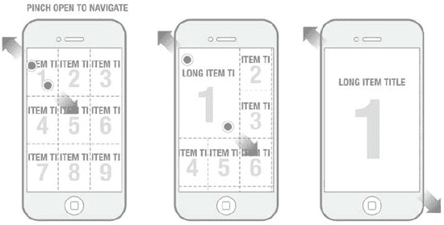

**图 6-11.** 使用双指张开进行选择与导航。当超过特定阈值后，网格元素会持续展开，无需用户继续操作。

这里的基本理念是“展开”这一概念。用户可以通过手指张开来展开一个网格单元，从而显示单元内隐藏的更多信息（见图 6-11）。如果用户的展开操作未超过预设阈值，当手指移开屏幕时，网格单元将自动回弹至原始大小。但如果用户将网格元素展开到超过预设阈值，该网格单元便会自动扩展至全屏大小，并显示该节点的功能（或者成为通往子节点的通道，从这种意义上说）。传统的导航方式可能只需用户点击网格中的某个单元，即可导航至应用中相应的节点。我认为我们可以同时支持这种操作：假设轻轻一点也能达到将网格单元展开至超过阈值的同样效果。

现在我们开始在为该应用构建独特的交互模型。不同于 iPhone 操作系统层那种既包含离散节点又包含连续节点式体验的线性空间模型，我们现在拥有了一种由某些关键区域的弹性所定义的空间模型。用户无需在应用内从 A 点移动到 B 点进行导航，而是仅在需要时、在需要的位置展现出功能。从工作流的角度看，这两种方式并无区别；但从体验的角度看，差异是彻底的。

#### 文档记录

记录交互模型是这一流程中的重要环节。你需要将想法记录下来，以便与设计及开发团队的其他成员分享和沟通。这有助于确保在执行概念、产出更详细的用户界面交付物时，你的愿景能被充分理解。

你可以采用任何你喜欢的形式来记录文档，但务必确保涵盖两个基本要点：

*  以清晰简洁的方式，直观地展示你的交互模型的特性。
*  对交互模型中难以通过可视化轻松传达的细节，提供详尽的注释说明。

请记住，你所展示的并非明确的用户界面处理方式，也不是像线框图中那样对控件的映射。这类交付物有意避免达到线框文档中那种细节程度。交互模型的焦点仅在于描述应用的整体行为，以便你能带着清晰的愿景，进入更细致的交互设计活动。

以下是我们所完成示例的文档可能呈现的样子（见图 6-12）。

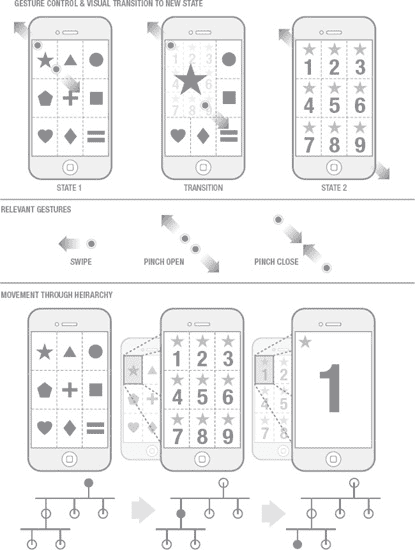

**图 6-12.** 记录交互模型及其构成交互

### 案例研究与示例

为了理解这些想法如何应用于设计问题，让我们将其应用于一个案例研究，并将其作为通用流程的工作模型。我将构建一个假设的组织和一款假设的软件产品，然后逐步讲解其思考过程、通用问题解决方法以及整体流程，最终得出一个引人注目的交互模型。

#### X 公司

假设我们有一个客户名为 X 公司，他们已经拥有一款成熟的桌面应用，在该利基市场中相当成功。X 公司认识到，要拓展业务，他们需要凭借一款 iPhone 应用进军移动市场。更为重要的是，他们的用户和投资者一直在施压，要求他们尽快在 App Store 上架产品。

这家公司找到了你——一位卓越的交互设计师——来帮助他们设计应用。他们向你阐述了需要在 App Store 一鸣惊人的需求。他们的一位主要竞争对手刚刚发布了一款 iPhone 应用，因此 X 公司必须推出一款更优秀的应用来抢占市场。

X 公司专注于娱乐领域，他们的桌面应用允许用户浏览和消费来自多个不同来源的内容。内容大部分是视频，但也需要涵盖音频文件和静态图片。X 公司非常自豪于他们能够精心策划并组织应用内的内容，以便用户轻松找到所需信息。这正是他们在竞争中脱颖而出的优势所在。

然而，X 公司面临一个问题：虽然他们的桌面应用外观出色、性能良好，却难以轻松移植到 iPhone 应用上。因为应用中有太多的控件、按钮及其他用户界面组件，而这些全部是针对鼠标和光标交互设计的。导航内容的选项过多，这更是增加了用户体验的复杂性。内容组织的层级结构大部分为三层，但你也注意到有几个例外情况，其层级更深。

### 公司 X 的需求

掌握了这些知识后，你就可以开始着手解决设计问题了。正如我之前回顾的那样，流程的第一步是明确应用程序需要具备哪些功能的需求定义。在审查了公司 X 的桌面应用程序并采访了该项目的主要利益相关者后，你了解到 iPhone 应用需要实现以下功能：

* 允许用户访问该公司的完整内容库。
* 提供一种机制，让用户能够快速高效地浏览和发现新内容。
* 允许用户与朋友分享内容。
* 允许用户对内容进行评论。
* 提供一种机制，让用户能够将他们用自己的 iPhone 拍摄或创建的内容添加到公司 X 的内容库中，并与全世界分享。

通过需求收集流程以及与利益相关者随后的讨论，团队得出结论，这些是需要在 iPhone 应用中展示的正确功能。虽然这并未涵盖桌面应用程序的所有功能，但通过理解移动情境下特定于用户角色和场景的用户需求，有助于你将所有功能筛选到这些基本功能上。

现在，既然已经明确了这些需求，你就可以开始思考如何组织这个应用的工作流程了。为了充分领会交互建模所带来的可能性，有必要花些时间深入探讨如何得出你的工作流程定义，以及这个定义需要细化到什么程度。

审视公司 X 对 iPhone 应用的需求，揭示了该应用本质上一个重要方面。绝大多数需求直接与浏览和消费内容相关。像分享和评论这样的辅助功能，则直接依赖于屏幕上有内容供用户进行操作。因此，你得出结论：内容是这种用户体验的核心组成部分。因此，需要非常仔细地考虑内容与应用基本功能之间的关系。此外，在与客户的讨论中，你逐渐感受到了这个设计问题的难度。用户执行的绝大多数交互都集中在通过层次化的组织层级进行导航，以获取内容。

这就到了事情变得有些主观的地方。你可以选择在流程中包含内容组织的层级性质以及用户需要遵循的路径，也可以简化工作流程的这一方面，将浏览功能隔离到一个单独的节点。让我们通过一个反映我们对公司 X 需求理解的简单工作流程（见图 6-13），快速看一下两者的区别：

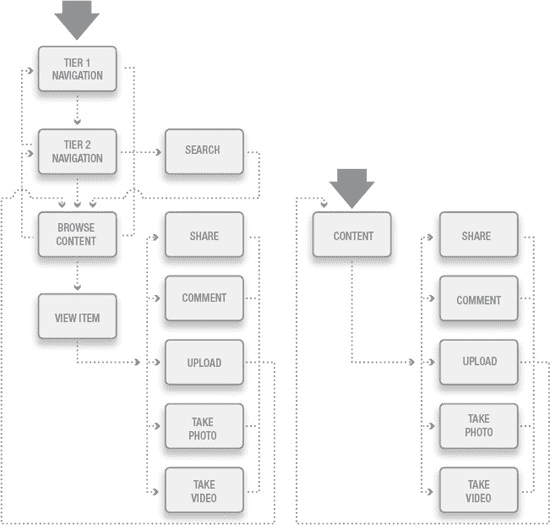

**图 6-13.** 显式工作流程与简化后工作流程的对比

这提出了一个有趣的问题：在工作流程文档中，是更详细还是更概括，其背后的理据是什么？当用户在应用程序中的路径会直接影响你在用户界面层面的设计决策时，你总是希望创建显式的工作流程。如果你知道，你在用户界面层面的设计决策可以简化工作流程的内在结构，那么将这些细节归结到一个单独节点，而不必纠结于在工作流程层面包含这些细节，就是有意义的。

以公司 X 的 iPhone 应用为例，其中有一项需求是提供一种机制，让用户能够快速高效地浏览和发现新内容。因此，你知道在某个时刻，你需要用一种更适合 iPhone 的解决方案来解决层级问题。就本应用而言，将浏览和内容查看合并到一个单独的节点是有意义的（见图 6-14）。当我们开始思考可能的交互模型时，这就会显得更加合理。话虽如此，让我们用这个基本工作流程来指导我们的建模工作。

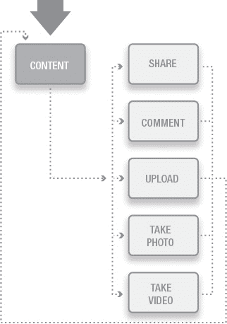

**图 6-14.** 将导航折叠到一个单独的节点，并意识到通过层级进行显式导航可能会被简化。

现在，有了这个基本的工作流程，我们了解到公司 X 面临的最大设计挑战之一，就是找到一种适合 iPhone 应用的方式来引导用户获取内容。而这正是我们的交互建模活动发挥作用的地方。

